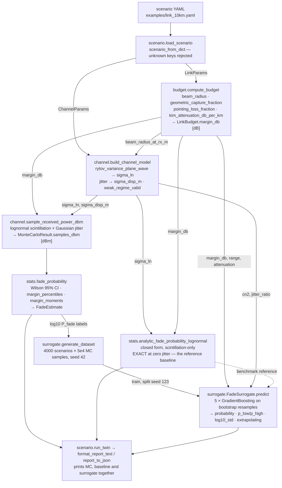
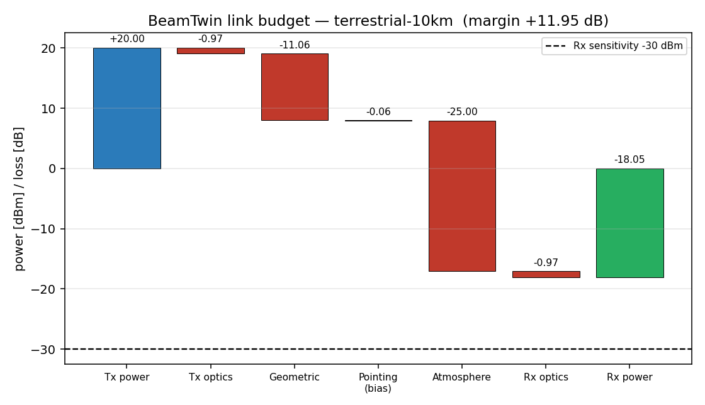
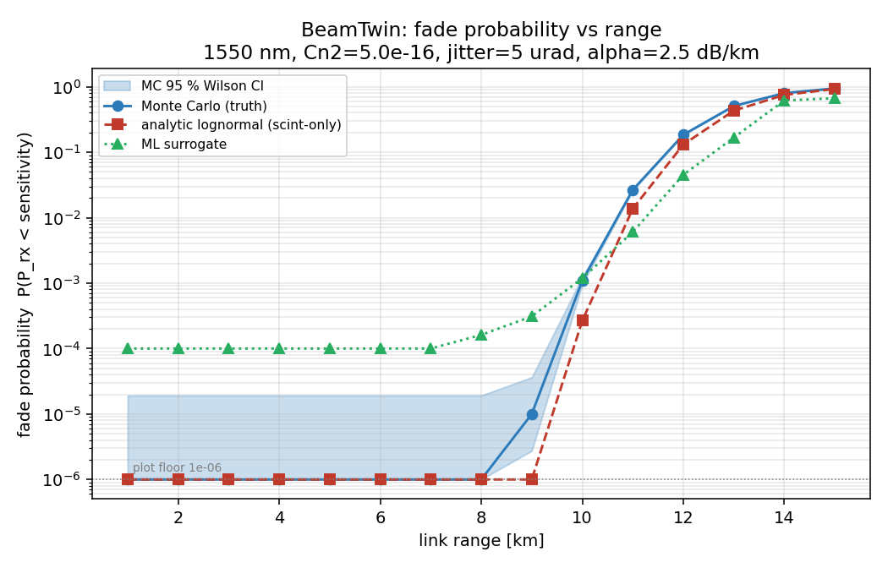
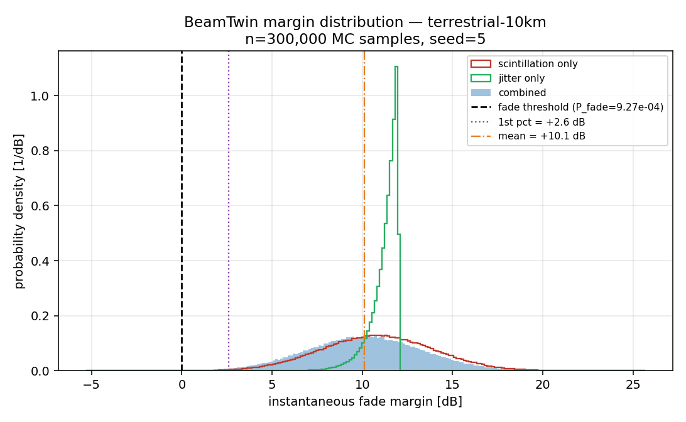

# BeamTwin

Free-space optical link digital twin: link budget, atmospheric channel, fade statistics, ML surrogate.


## The problem

An FSO link that closes with 12 dB of margin on paper still drops below receiver
sensitivity for milliseconds at a time, and it is the statistics of those drops —
not the mean received power — that decide whether the link meets an availability
requirement. Scintillation and pointing jitter each have a closed-form treatment
in isolation; together they do not, so the combined case needs Monte Carlo, and a
design sweep needs thousands of Monte Carlo runs. BeamTwin computes the
deterministic budget, runs the combined-case Monte Carlo, and ships a trained
surrogate for the sweeps — printing all three numbers side by side so you can see
where each one is trustworthy.

## What this does

- **Deterministic link budget** — Gaussian beam propagation, geometric capture,
  pointing loss, Kim visibility-to-attenuation, Beer-Lambert path loss. Every
  term recomputed longhand and matched to **0.000e+00 deviation** against a
  1e-9 tolerance (`validation/v1_budget_handcheck.txt`).
- **Stochastic atmospheric channel** — vectorised Monte Carlo combining lognormal
  scintillation and Gaussian per-axis jitter at a peak **18,598,250 samples/s** on
  2 cores; a 1e6-sample run takes 0.0672 s (`validation/v3_performance.txt`).
- **Fade statistics with a real confidence interval** — Wilson score interval on
  the fade proportion, checked against binomial theory across 30 seeds at
  empirical/theoretical std ratios of **0.906 / 0.964 / 1.035** for n = 1e4 / 1e5 /
  4e5 (`validation/v4_uncertainty.txt`, U1).
- **ML fade-probability surrogate** — 5-member bootstrap GradientBoosting
  ensemble, **5.98 µs per batched query versus 4937.59 µs for a 1e5-sample Monte
  Carlo query, an 826× speed-up**, cutting held-out MAE in log10 P_fade from the
  analytic baseline's 0.448 to **0.261** in the combined jitter regime
  (`validation/v3_performance.txt`, `validation/surrogate_benchmark.txt`).
- **Every prediction carries an uncertainty estimate and an extrapolation flag** —
  and the uncertainty estimate is measurably not calibrated. See the next section.

## Two measured results that limit what this is good for

These are not caveats buried in an appendix. They are the two findings most
likely to cause a user to draw a wrong conclusion, so they are stated here.

### 1. The surrogate's uncertainty band is under-dispersed by roughly 3×

Measured on 800 held-out scenarios (`validation/v4_uncertainty.txt`, U4):

| Metric | Measured | Gaussian ideal |
|---|---|---|
| Coverage of the ±1σ band | **21.1 %** | 68.3 % |
| Coverage of the ±2σ band | **39.9 %** | 95.4 % |
| Mean ensemble σ vs mean absolute error (log10 P) | 0.0906 vs 0.2696 | equal |
| Spearman corr(σ, absolute error) | +0.388 | > 0 |

The interval returned as `[p_low, p_high]` is ±2 ensemble standard deviations in
log10 space. **It covers the truth 39.9 % of the time, not 95 %.** Bootstrap
resampling of the training set was adopted because the naive ensemble was worse
still (21.6 % at ±2σ); the improvement is real and insufficient.

Read `log10_std` as a **relative confidence ranking** — a prediction with larger
spread is less trustworthy than one with smaller spread, which the +0.388 rank
correlation with actual error supports. Do not present `[p_low, p_high]` to a
decision-maker as a 95 % interval, and do not size a link margin from it.
Conformal or quantile calibration is deferred to v0.2.

### 2. Where jitter is negligible the surrogate loses to the analytic baseline by 71×

On the low-jitter subset of the held-out set (`jitter_ratio < 0.05`, n = 80), MAE
in log10 P_fade is **0.348 for the surrogate against 0.005 for the closed-form
lognormal baseline** — about 71× worse (`validation/surrogate_benchmark.txt`;
`MODEL_CARD.md` §8 quotes the unrounded baseline MAE of 0.0049). This is expected:
in the scintillation-only limit the baseline is essentially exact, and the
surrogate can only approximate it.

**Rule: use `beamtwin.stats.analytic_fade_probability_lognormal` when
`jitter_ratio < 0.05`. Use the surrogate only in the combined jitter +
scintillation regime, and only when speed matters more than a factor-of-two in
probability. Use the full Monte Carlo whenever a number feeds a decision.**
BeamTwin prints all three on every run so the comparison is never hidden.

## Who it's for

- FSO link engineers sizing margin, aperture, or transmit power for a horizontal
  terrestrial link and wanting the fade statistics rather than the mean.
- Systems engineers trading availability against SWaP in early design, who need
  thousands of fade-probability evaluations inside a sweep or optimiser.
- Researchers and students in optical communications who want a transparent,
  cited, hand-checked implementation of the standard link-budget and
  weak-turbulence equations.
- ML practitioners studying physics surrogates, ensemble uncertainty, and honest
  baseline-versus-model comparison — this repository is a worked example of a
  surrogate that loses to its baseline in a named regime and says so.

## Who it's not for

- Anyone certifying an availability figure, sizing an operational link margin, or
  making a go/no-go decision on real hardware. BeamTwin has never been compared
  against a measurement from a real optical link.
- Anyone needing fade **duration**, fade rate, or burst-error statistics. All
  samples are independent draws; there is no temporal correlation, so nothing here
  informs coding or interleaver design.
- Anyone working in strong turbulence (σ_R² ≳ 1). The condition is detected and
  flagged, not modelled; no gamma-gamma distribution is implemented.
- Anyone needing slant paths, altitude-resolved Cn² profiles, or wavelengths other
  than 1550 nm for the surrogate.
- Anyone needing wave-optics propagation, phase screens, or adaptive-optics loop
  dynamics. Use one of the alternatives below.

## Alternatives, honestly

BeamTwin occupies a narrow slot: statistical fade modelling of a horizontal FSO
link, with a fast surrogate. Several of the packages below are more mature, more
general, or simply correct where BeamTwin is approximate.

| Alternative | Install | What it does better | When to use it instead of BeamTwin |
|---|---|---|---|
| [HCIPy](https://pypi.org/project/hcipy/) | `pip install hcipy` | Full wave-optics propagation (Fraunhofer and Fresnel), atmospheric phase screens, Jones-calculus polarisation, wavefront sensors, coronagraphs. Actively released. | You need the actual field at the aperture, not a statistical fade model — speckle structure, aperture averaging, or a wavefront sensor in the loop. |
| [AOtools](https://pypi.org/project/aotools/) | `pip install aotools` | Reference implementations of turbulence maths: phase-screen generation, r0 and Cn² conversions, Zernikes, optical propagation helpers. Peer-reviewed (Opt. Express, 2019). | You want turbulence-parameter maths or phase screens as building blocks, rather than an end-to-end link report. |
| [Soapy](https://pypi.org/project/soapy/) | `pip install soapy` | End-to-end Monte Carlo adaptive-optics simulation with wavefront sensors, deformable mirrors, reconstructors, laser guide stars. | The tracking or AO loop is the object of study. BeamTwin models residual jitter as a stationary Gaussian and has no loop dynamics at all. |
| [POPPY](https://pypi.org/project/poppy/) | `pip install poppy` | Physical optics propagation and PSF formation through a real optical train; NASA-developed, used by WebbPSF. | You are designing the terminal optics and need diffraction through actual apertures and obscurations. |
| [PyOptica](https://pypi.org/project/pyoptica/) | `pip install pyoptica` | Clean, readable wavefront propagation, optical elements, basic holography. | Small teaching-scale wave-optics experiments. Note the last release was 2021 — check maintenance before depending on it. |
| [scikit-commpy](https://pypi.org/project/scikit-commpy/) (imports as `commpy`) | `pip install scikit-commpy` | Modulation, channel coding (convolutional, turbo, LDPC), fading channel models, BER Monte Carlo. | You need bit-error rate, coding gain, or interleaver design. BeamTwin stops at received optical power against a single scalar sensitivity threshold. |
| [freesopy](https://pypi.org/project/freesopy/) | `pip install freesopy` | A broad set of closed-form FSO equations — received power, SNR, pointing misalignment, FSPL, LOS channel gain, shot and thermal noise currents. | You want the standard formulas without a Monte Carlo channel or a surrogate. It does not model turbulence statistics, which is BeamTwin's whole subject. |
| Ansys Zemax OpticStudio (commercial, not a pip install) | — | Industrial optical design, tolerancing, and stray-light analysis of the terminal itself. | You are designing or tolerancing the optical assembly rather than the link statistics. Named here for context only. |
| MODTRAN (Spectral Sciences, commercial, not a pip install) | — | Band-resolved atmospheric transmittance and radiance from validated radiative-transfer physics and real atmospheric profiles. | You need a defensible atmospheric transmission number. BeamTwin's Kim visibility model is a single empirical fit at one visibility value along a homogeneous path. Named here for context only. |

Discarded during this review: `pyfso` (github.com/joefavergel/pyfso) — not
published on PyPI, 7 commits, and repository metadata that does not match the
stated purpose. Not recommended as an alternative.

## Install and first run

```bash
git clone https://github.com/OmAcharya-avtr/beamtwin.git
cd beamtwin
python -m venv .venv && source .venv/bin/activate
pip install -e ".[test]"
python -m pytest tests/ -q
python examples/run_full_report.py
```

`conftest.py` at the repository root puts `src/` on `PYTHONPATH` for both the test
process and the subprocesses spawned by the CLI integration tests, so the pytest
line above works from a cold clone without any extra environment setup.

Expected output of `python -m pytest tests/ -q`:

```
........................................................................ [ 28%]
........................................................................ [ 57%]
........................................................................ [ 86%]
...................................                                      [100%]
251 passed in 12.09s
```

Expected output of `python examples/run_full_report.py`:

```
BeamTwin report — terrestrial-10km (beamtwin 0.1.0)
================================================================
LINK BUDGET (deterministic)
  Tx power                 +20.00 dBm
  Tx optics loss        -    0.97 dB
  Geometric loss        -   11.06 dB
  Pointing loss (bias)  -    0.06 dB
  Atmospheric loss      -   25.00 dB
  Rx optics loss        -    0.97 dB
  Received power           -18.05 dBm
  Rx sensitivity           -30.00 dBm
  Margin                   +11.95 dB
  Beam radius at Rx         0.247 m   (divergence 24.7 urad half-angle)

CHANNEL (stochastic model)
  Cn2                   5.000e-16 m^-2/3
  Rytov variance        0.6782
  Scintillation index   0.6782
  Pointing jitter       5.00 urad/axis   (displacement sigma 0.050 m)

MONTE CARLO (n=200000, seed=1)
  Fade probability      1.0750e-03   [95% CI 9.406e-04, 1.229e-03]
  Analytic baseline     2.6661e-04   (lognormal, scintillation-only)
  Margin percentiles [dB]: p01=+2.51, p05=+4.81, p50=+10.12, p95=+15.37, p99=+17.56
  Margin mean/std       +10.11 / 3.21 dB

SURROGATE (ML, GradientBoosting ensemble)
  Fade probability      1.1908e-03   [spread 8.639e-04, 1.641e-03]

Research-grade MVP — not certified for operational use.
```

The 4× gap between the combined Monte Carlo result (1.0750e-03) and the
scintillation-only analytic baseline (2.6661e-04) is the modelling territory the
surrogate exists to cover.

Command-line interface:

```bash
python -m beamtwin run examples/link_10km.yaml --json report.json
python -m beamtwin sweep examples/link_10km.yaml --param range_km \
    --start 1 --stop 15 --steps 15 --output sweep.png
```

Sweepable parameters: `range_km`, `tx_power_dbm`, `rx_sensitivity_dbm`,
`attenuation_db_per_km`, `cn2`, `pointing_jitter_urad`. Scenario YAML rejects
unknown keys, so a typo cannot silently select a default.

## Worked example

```python
from beamtwin import ChannelParams, LinkParams, compute_budget, sample_received_power_dbm
from beamtwin.channel import build_channel_model
from beamtwin.stats import analytic_fade_probability_lognormal, fade_probability
from beamtwin.surrogate import FadeSurrogate, default_model_path

link = LinkParams(range_m=10_000.0, pointing_bias_rad=2e-6,
                  attenuation_db_per_km=2.5, rx_sensitivity_dbm=-30.0)
channel = ChannelParams(cn2=5e-16, pointing_jitter_rad=5e-6)

budget = compute_budget(link)
model = build_channel_model(link, channel)
print(f"margin            {budget.margin_db:+.3f} dB")
print(f"beam radius at Rx {model.beam_radius_at_rx_m:.4f} m")
print(f"Rytov variance    {model.rytov_variance:.4f}  weak_regime_valid={model.weak_regime_valid}")

mc = sample_received_power_dbm(link, channel, n_samples=200_000, seed=1)
est = fade_probability(mc.samples_dbm, link.rx_sensitivity_dbm)
print(f"MC   P_fade       {est.probability:.4e}  [95% CI {est.ci_low:.3e}, {est.ci_high:.3e}]")

base = analytic_fade_probability_lognormal(budget.margin_db, model.sigma_ln)
print(f"analytic baseline {base:.4e}  (scintillation-only, exact at zero jitter)")

pred = FadeSurrogate.load(default_model_path()).predict(link, channel)
print(f"surrogate P_fade  {pred.probability:.4e}  spread [{pred.p_low:.3e}, {pred.p_high:.3e}]")
print(f"  log10_std {pred.log10_std:.4f}   extrapolating={pred.extrapolating}")
print("  NOTE: the spread is NOT a 95% interval; measured +/-2 sigma coverage is 39.9%")
```

Printed output:

```
margin            +11.947 dB
beam radius at Rx 0.2475 m
Rytov variance    0.6782  weak_regime_valid=True
MC   P_fade       1.0750e-03  [95% CI 9.406e-04, 1.229e-03]
analytic baseline 2.6661e-04  (scintillation-only, exact at zero jitter)
surrogate P_fade  1.1908e-03  spread [8.639e-04, 1.641e-03]
  log10_std 0.0697   extrapolating=False
  NOTE: the spread is NOT a 95% interval; measured +/-2 sigma coverage is 39.9%
```

## Architecture

Data flow through the real modules in `src/beamtwin/`:



The baseline is computed on every run alongside the Monte Carlo and the
surrogate. The twin never presents the ML prediction as a single authoritative
number.

## Screenshots

All three are produced by the runnable scripts in `examples/`, so they cannot
drift from the code.



`examples/run_full_report.py`. Notice that atmospheric attenuation (−25.00 dB at
2.5 dB/km over 10 km) dominates every other term combined, and that the resulting
−18.05 dBm sits only 11.95 dB above the dashed −30 dBm sensitivity line.



`examples/fade_vs_range.py`. Notice three things: the Monte Carlo curve rises
above the scintillation-only baseline everywhere jitter matters; the green
surrogate curve sits flat at 1e-4 below 8 km, which is the training-label floor
and means "below 1e-4", not a small calibrated number; and beyond 12 km the
surrogate falls visibly below the truth, reaching 0.668 against a Monte Carlo
0.944 at 15 km, because training minimises error in log10 space.



`examples/margin_histogram.py`. Notice that the jitter-only distribution (green)
is narrow and stops short of the fade threshold on its own, the scintillation-only
distribution (red) is broad, and only the combined distribution (blue) puts
appreciable mass near the 0 dB threshold — 9.27e-04 of it at n = 300,000, seed 5.

## Validation evidence

Full write-up in [`validation/VALIDATION.md`](validation/VALIDATION.md); the raw
`.txt` files beside each script are the authoritative record. Measured on Linux
x86_64, Python 3.11.15, numpy 2.4.4, 2 CPU cores.

| Check | Reference | Result | Tolerance / ideal |
|---|---|---|---|
| Budget arithmetic, all terms (V1) | Longhand hand-calculation | Max deviation **0.000e+00** | 1e-9 |
| Beam radius at 10 km (V1) | `w0·sqrt(1+(L/z_R)²)` | 0.247500 m, delta 0.0 | 1e-9 m |
| Received power / margin (V1) | Longhand | −18.052748 dBm / +11.947252 dB, delta 0.0 | 1e-9 dB |
| Kim attenuation, V = 7 km (V1) | Kim et al. 2001, SPIE 4214 | 0.630817 dB/km, delta 0.0 | 1e-9 dB/km |
| Scintillation-only fade probability (V2a) | Closed-form lognormal, 5 margins | **5 of 5 inside the MC 95 % CI** | inside CI |
| Mean pointing loss (V2b) | `1/(1+4σ_d²/w²)`, 4 jitter levels | Relative error 8.38e-05 … 1.01e-03, **4 of 4 pass** | 4× MC standard error |
| Monotonicity in Cn², jitter, margin (V2c) | Qualitative physics | All three monotone | — |
| MC scatter vs binomial theory (V4/U1) | `sqrt(p(1−p)/n)`, 30 seeds | Ratio 0.906 / 0.964 / 1.035 | ≈ 1 |
| Rare-event resolution (V4/U2) | ≥10 observed fades | Floor **1e-4** at n = 1e5 | informational |
| End-to-end report runtime (V3) | Requirement R13 | **0.0164 s** | < 5 s |
| MC throughput, peak (V3) | — | 18,598,250 samples/s | — |
| Surrogate vs MC query cost (V3) | — | 5.98 µs vs 4937.59 µs, **826×** | — |
| Surrogate MAE, all held-out (benchmark) | Analytic baseline on same rows | **0.270** vs baseline 0.404 | lower is better |
| Surrogate MAE, high jitter ≥ 0.05, n = 720 | Analytic baseline | **0.261** vs baseline 0.448 | lower is better |
| **Surrogate MAE, low jitter < 0.05, n = 80** | Analytic baseline | **0.348 vs baseline 0.005 — the baseline wins by ~71×** | lower is better |
| **Surrogate ±2σ coverage (V4/U4)** | Gaussian ideal | **39.9 %** | 95.4 % |
| **Surrogate ±1σ coverage (V4/U4)** | Gaussian ideal | **21.1 %** | 68.3 % |
| Spearman corr(σ, abs error) (V4/U4) | — | +0.388 | > 0 |
| Test suite | — | 251 passed in 12.09 s | 0 failed, 0 skipped |

Input elasticities at the 10 km reference case, `d ln P_fade` per +1 % change
(`validation/v4_uncertainty.txt`, U3): range **+0.4197**, attenuation **+0.2475**,
transmit power −0.1749, receive aperture radius −0.0774, Cn² +0.0421, pointing
jitter +0.0366. A 1 % attenuation error — better than any real atmospheric
forecast — already moves the answer by about 25 %, so atmospheric attenuation
uncertainty, not model form, dominates any operational prediction.

Not validated, stated plainly (`VALIDATION.md` §7): no comparison against measured
FSO link data of any kind; the Kim model is implemented as published but its
empirical fit was not independently checked; no strong-turbulence regime; no
temporal correlation; no hardware effects; surrogate uncertainty uncalibrated.

Speed figures above come from the current `validation/v3_performance.txt`. An
earlier run of the same script on the same machine recorded 7.60 µs / 6004 µs /
790×, and that earlier run is what `MODEL_CARD.md` §6 and `VALIDATION.md` §5 quote.
Re-run `python validation/v3_performance.py` to reproduce the current numbers.

## API reference

<details>
<summary><code>beamtwin.budget</code> — deterministic link budget</summary>

| Function / class | Returns, with units |
|---|---|
| `LinkParams(...)` | Frozen dataclass: `wavelength_m` [m], `tx_power_dbm` [dBm], `tx_efficiency`, `rx_efficiency` [fraction], `beam_waist_radius_m` [m], `rx_aperture_radius_m` [m], `range_m` [m], `pointing_bias_rad` [rad], `attenuation_db_per_km` [dB/km], `rx_sensitivity_dbm` [dBm]. Validates on construction. |
| `compute_budget(params)` | `LinkBudget` with all loss terms as non-negative [dB], `received_power_dbm` [dBm], `margin_db` [dB], `margin_negative` [bool]. |
| `gaussian_divergence_half_angle(wavelength_m, waist_radius_m)` | Half-angle [rad]. |
| `beam_radius(wavelength_m, waist_radius_m, range_m)` | 1/e² radius at range [m]. |
| `geometric_capture_fraction(beam_radius_m, aperture_radius_m)` | Fraction in (0, 1). |
| `pointing_loss_fraction(...)` | On-axis intensity ratio, fraction in (0, 1]. |
| `kim_attenuation_db_per_km(visibility_km, wavelength_m)` | Attenuation [dB/km]. |
| `LinkBudget.as_dict()` | Flat JSON-serialisable dict of budget terms. |

</details>

<details>
<summary><code>beamtwin.channel</code> — stochastic atmospheric channel</summary>

| Function / class | Returns, with units |
|---|---|
| `ChannelParams(cn2, pointing_jitter_rad)` | `cn2` [m^−2/3], `pointing_jitter_rad` per-axis RMS [rad]. Rejects `cn2 > 1e-11` as a unit error. |
| `rytov_variance_plane_wave(cn2, wavelength_m, range_m)` | σ_R², dimensionless. |
| `build_channel_model(link, channel)` | `ChannelModel`: `rytov_variance`, `scintillation_index`, `sigma_ln`, `sigma_disp_m` [m], `beam_radius_at_rx_m` [m], `weak_regime_valid` [bool, False when σ_R² ≥ 1]. |
| `mean_pointing_loss_fraction(sigma_disp_m, beam_radius_m)` | `E[L_p]`, fraction in (0, 1]. |
| `sample_received_power_dbm(link, channel, n_samples, seed)` | `MonteCarloResult` with `samples_dbm` [dBm], `n_samples` capped at 2e7. |

</details>

<details>
<summary><code>beamtwin.stats</code> — fade statistics and the analytic baseline</summary>

| Function / class | Returns, with units |
|---|---|
| `fade_probability(samples_dbm, sensitivity_dbm)` | `FadeEstimate`: `probability`, `ci_low`, `ci_high` (Wilson 95 %), all dimensionless. |
| `analytic_fade_probability_lognormal(margin_db, sigma_ln)` | Closed-form scintillation-only fade probability, dimensionless. **Exact at zero jitter — prefer it there.** |
| `margin_percentiles(samples_dbm, sensitivity_dbm, ...)` | Dict of percentile → margin [dB]. |
| `margin_moments(samples_dbm, sensitivity_dbm)` | Dict with mean and std of margin [dB]. |

</details>

<details>
<summary><code>beamtwin.surrogate</code> — ML fade-probability surrogate</summary>

| Function / class | Returns, with units |
|---|---|
| `features_from_params(link, channel)` | Feature row, shape (1, 5): `log10_range_m`, `log10_cn2`, `jitter_ratio`, `attenuation_db_per_km` [dB/km], `margin_db` [dB]. |
| `in_training_domain(x)` | `bool` — False sets `extrapolating` on a prediction. |
| `generate_dataset(...)` | Feature matrix and `log10 P_fade` labels, floored at log10(1e-4). |
| `FadeSurrogate(n_members=5, random_state=7)` | Bootstrap GradientBoosting ensemble. |
| `FadeSurrogate.fit(x, y)` / `.save(path)` / `.load(path)` | Fitted model; joblib persistence. |
| `FadeSurrogate.predict_log10(x)` | `(mean, std)` of log10 P_fade. |
| `FadeSurrogate.predict(link, channel)` | `SurrogatePrediction`: `probability`, `p_low`, `p_high`, `log10_std`, `extrapolating`. **`p_low`/`p_high` are ±2 ensemble σ and are NOT a 95 % interval — measured coverage 39.9 %.** |
| `default_model_path()` | Path to the committed `models/surrogate.joblib` (1.9 MB). |

</details>

<details>
<summary><code>beamtwin.scenario</code> — YAML scenarios and reports</summary>

| Function / class | Returns |
|---|---|
| `load_scenario(path)` / `scenario_from_dict(data, name_hint)` | `Scenario`; raises `ScenarioError` naming the offending key. |
| `run_twin(scenario, surrogate=None)` | Report dict: budget, channel, Monte Carlo, analytic baseline, surrogate. |
| `format_report_text(report)` / `report_to_json(report)` | Text report / JSON string. |

</details>

Surrogate training domain — queries outside these bounds set `extrapolating=True`
and carry no error bound, because tree ensembles extrapolate flat:

| Feature | Range |
|---|---|
| `log10_range_m` | 3.0 … 4.301 (1–20 km) |
| `log10_cn2` | −16.0 … −13.301 |
| `jitter_ratio` = σ_jitter / θ_divergence | 0.0 … 0.5 |
| `attenuation_db_per_km` | 0.0 … 3.0 |
| `margin_db` | −5.0 … 25.0 |

## Limitations

Ordered by how much they should affect your decision to use this.

1. **Never validated against real link data.** Every check in `validation/` is
   internal consistency or agreement with closed-form theory. No experimental or
   field dataset was used. This is the largest gap in the product.
2. **Surrogate uncertainty is not calibrated.** ±2σ covers 39.9 % against a 95.4 %
   ideal, ±1σ covers 21.1 % against 68.3 %, and mean σ (0.0906) is about 3× smaller
   than mean absolute error (0.2696). Usable only as a relative ranking.
3. **The surrogate is 71× worse than the analytic baseline at low jitter**
   (MAE 0.348 vs 0.005 on n = 80). Switch to
   `analytic_fade_probability_lognormal` when `jitter_ratio < 0.05`.
4. **Compute budget: 2 CPU cores, scikit-learn only, no PyTorch, no GPU.** The
   model is a 5-member `GradientBoostingRegressor` ensemble by deliberate choice
   of that budget. Dataset generation 12.3 s plus training 5.7 s, under 500 MB
   RAM, no GPU code path exists. Retraining on a larger dataset or a deep model is
   outside what this repository supports.
5. **Accuracy is coarse even where the surrogate wins.** MAE 0.270 in log10 means a
   typical prediction is off by a factor of about 1.9 in probability. Adequate for
   ranking designs and sweeping; not adequate for certifying an availability figure.
6. **Rare fades are unresolvable.** The training-label floor is 1e-4; a predicted
   1e-4 means "below 1e-4" and carries no resolution. A 99.999 % availability
   target (P_fade = 1e-5) requires ≥1e6 Monte Carlo samples and is out of the
   surrogate's reach entirely.
7. **Largest absolute errors where P → 1.** At 15 km the surrogate predicts 0.668
   against a Monte Carlo 0.944, because training minimises error in log10 space.
8. **Weak-fluctuation validity only.** The lognormal model holds for σ_R² < 1.
   Beyond it deep fades are underestimated; `weak_regime_valid` goes False and a
   warning is printed, but the saturation regime is not modelled.
9. **Point-receiver pointing model.** Assumes aperture radius ≪ beam radius;
   error grows past a/w ≈ 0.3. The 10 km reference case sits at a/w = 0.20.
10. **No aperture averaging** — BeamTwin is pessimistic for large apertures — and
    **no turbulence-induced beam spreading or wander** — which makes it optimistic
    in the other direction. The two omissions do not cancel in any controlled way.
11. **Independent samples only.** No temporal correlation, therefore no fade
    duration, fade rate, or burst-error statistics.
12. **Homogeneous horizontal path.** Constant Cn² and attenuation; no slant paths
    and no Hufnagel-Valley altitude profiles.
13. **Scintillation and jitter are assumed independent.** Assumed, not verified.
14. **Single scalar receiver sensitivity.** No detector noise, thermal drift,
    modulation, or coding.
15. **Surrogate is 1550 nm only.** Wavelength is not a feature. The API accepts
    other wavelengths and the predictions are invalid.

## Reproducing every number

```bash
python validation/v1_budget_handcheck.py    # -> validation/v1_budget_handcheck.txt
python validation/v2_limit_cases.py         # -> validation/v2_limit_cases.txt
python validation/v3_performance.py         # -> validation/v3_performance.txt
python validation/v4_uncertainty.py         # -> validation/v4_uncertainty.txt

python scripts/generate_dataset.py          # master seed 42, 4000 x 5e4 MC samples
python scripts/train_surrogate.py           # split seed 123, member seeds 7-11
                                            # -> validation/surrogate_benchmark.txt

python -m pytest tests/ -q                  # 251 passed
python examples/run_full_report.py          # -> screenshots/budget_waterfall_10km.png
python examples/fade_vs_range.py            # -> screenshots/fade_vs_range.png
python examples/margin_histogram.py         # -> screenshots/margin_histogram.png
```

Seeds: dataset 42, train/test split 123, ensemble members 7–11 (bootstrap and fit
share the member seed), V2 Monte Carlo 2024, V4 sensitivity 7, example scenario 1,
`fade_vs_range.py` 11, `margin_histogram.py` 5. Everything is deterministic:
identical commands reproduce identical models and metrics.
`models/surrogate.joblib` and `data/surrogate_dataset.npz` (193 KB) are committed;
both regenerate from the two `scripts/` commands above.

## Safety statement

This software is a research-grade MVP. It is **not flight-qualified, not
certified, and not approved for operational aerospace use.** It must not be used
to size link margins, set availability guarantees, or make go/no-go decisions for
any real optical link, terrestrial or space. It has been trained and validated
entirely on the output of a simplified physics model and has never seen a
measurement from a real FSO link. The surrogate's uncertainty output is not
calibrated and must not be presented to a decision-maker as a confidence interval.

## Licence

AGPL-3.0-only. Full text in [`LICENSE`](LICENSE). Copyright © 2026 OPTIMA
Organisation.

## Citation

```bibtex
@software{beamtwin_2026,
  title        = {BeamTwin: A Free-Space Optical Link Digital Twin with
                  Monte Carlo Fade Statistics and an ML Surrogate},
  author       = {{OPTIMA Organisation}},
  year         = {2026},
  version      = {0.1.0},
  license      = {AGPL-3.0-only},
  note         = {Research-grade MVP; not flight-qualified or certified}
}
```

References for the implemented physics:

- L. C. Andrews and R. L. Phillips, *Laser Beam Propagation through Random Media*, 2nd ed., SPIE Press, 2005.
- B. E. A. Saleh and M. C. Teich, *Fundamentals of Photonics*, 2nd ed., Wiley, 2007.
- I. I. Kim, B. McArthur, E. Korevaar, "Comparison of laser beam propagation at 785 nm and 1550 nm in fog and haze for optical wireless communications", Proc. SPIE **4214**, 2001.
- A. K. Majumdar and J. C. Ricklin (eds.), *Free-Space Laser Communications: Principles and Advances*, Springer, 2008.
- A. A. Farid and S. Hranilovic, "Outage capacity optimization for free-space optical links with pointing errors", *J. Lightwave Technol.* **25**(7), 2007.
- A. Agresti and B. A. Coull, "Approximate is better than 'exact' for interval estimation of binomial proportions", *The American Statistician* **52**(2), 1998.

## Credits

This is under reserved rights obtained by OPTIMA Organisation.

Built on numpy, scipy, scikit-learn, matplotlib, PyYAML, and joblib.
