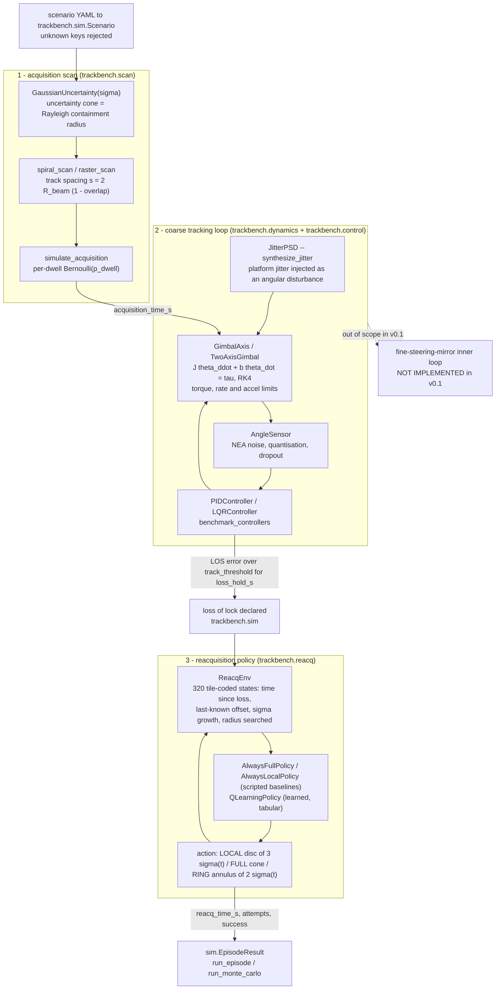
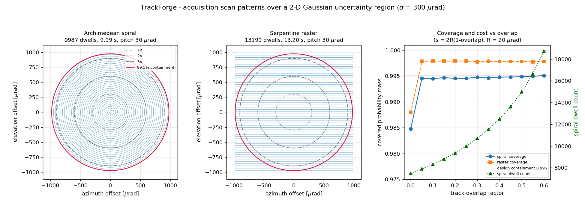
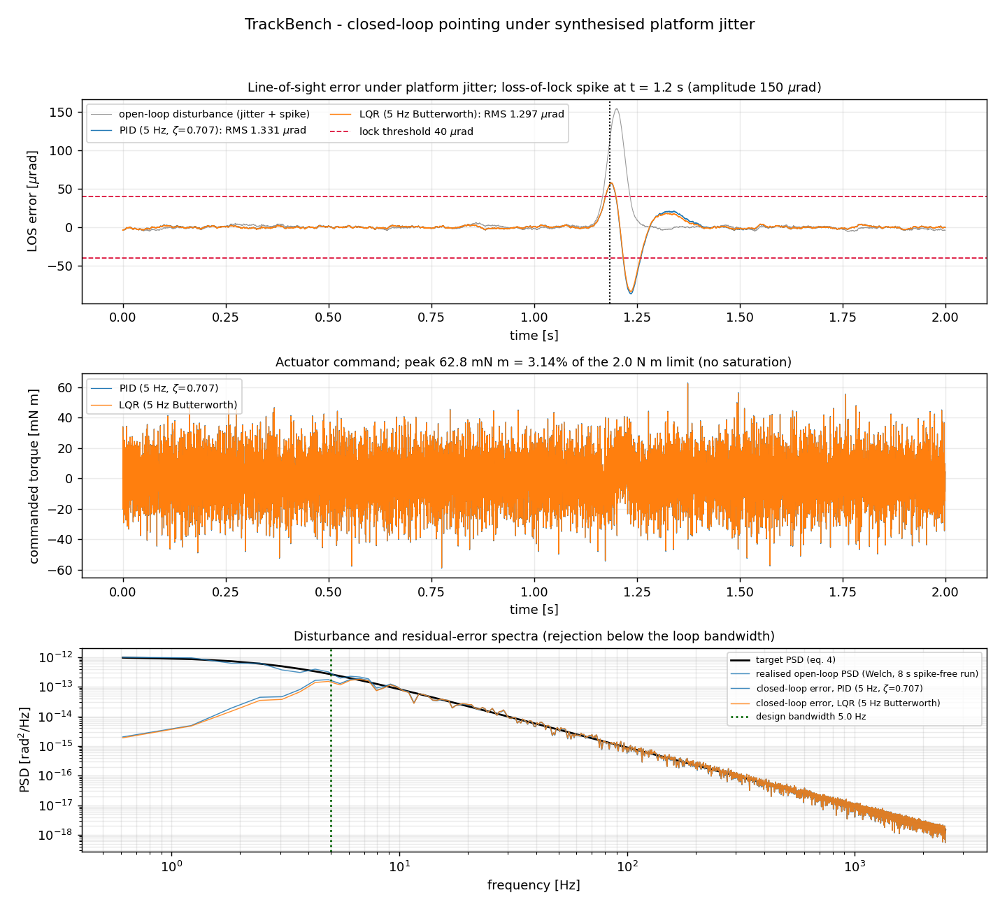
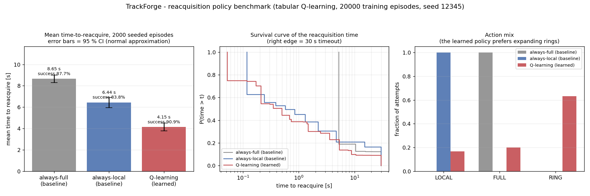

# TrackBench

Simulation and benchmark suite for optical-link pointing, acquisition and tracking.


## The problem

An optical terminal has a beam a few tens of microradians wide and initial
pointing knowledge a few hundred microradians wide, so the link cannot close
until a scan pattern puts the footprint on the far terminal. Once locked, the
loop has to hold the line of sight against platform micro-vibration with a
finite-bandwidth gimbal, finite torque and a noisy angle sensor. When a
disturbance breaks lock, something has to decide whether to re-search locally,
re-search the whole cone, or sweep the annulus that has not been searched yet —
and that decision, not the scan geometry, is what dominates outage time.

## What this does

- **Acquisition scan design.** Archimedean spiral and serpentine raster
  generators with track spacing tied to beam overlap. Measured covered
  probability mass 0.99485–0.99529 against a 0.995 design containment for
  overlap >= 0.10; 9 987 spiral dwells versus 13 199 raster dwells for the same
  cone (`validation/v1_spiral_coverage.py`).
- **Acquisition-time model.** Closed-form uniform-coverage estimate validated
  against 20 000-target Monte Carlo to **0.65 %** — and a documented 38 %
  error mode if the per-dwell rather than the per-crossing detection
  probability is used (`validation/v2_acquisition_time.py`).
- **Gimbal, jitter and sensor models.** Second-order axes with torque, rate and
  acceleration limits under RK4; jitter synthesised from a target PSD, matching
  band-median PSD to **1.66 %** and total variance to **0.081 %**
  (`validation/v4_jitter_psd.py`).
- **Control benchmark.** PID, PD and LQR compared on the same plant and the
  same disturbance realisation: step metrics reproduce canonical second-order
  theory to **1.43 %** relative, LQR pole placement to **2.6e-12**
  (`validation/v3_control_step_response.py`).
- **Reacquisition policy benchmark.** A tabular Q-learning policy against two
  scripted baselines on 2 000 identical seeded episodes: mean time-to-reacquire
  **4.148 s** [3.775, 4.521] against **6.440 s** always-local and **8.649 s**
  always-full, trained in 2.97 s on 2 cores
  (`validation/v5_reacq_benchmark.py`).

Everything is seeded. Training twice with the same seed returns bitwise
identical Q-tables, and 28 pinned values are regression-checked on every test
run.

## Who it is for

- Pointing, acquisition and tracking engineers sizing a scan pattern, a loop
  bandwidth or a reacquisition strategy before hardware exists.
- Optical-communications system engineers budgeting acquisition and
  reacquisition time into link availability.
- Researchers who want a reproducible, fully open testbed for comparing learned
  against scripted PAT logic, with the scripted baselines already implemented
  and reported.

## Who it is not for

- Anyone who needs to point real hardware. TrackBench has no device drivers,
  no telemetry interface and no real-time guarantees.
- Anyone modelling the optical channel. There is no link budget, no detector
  physics, no atmospheric turbulence or scintillation; detection is an abstract
  Bernoulli trial per dwell.
- Anyone needing a fine-steering-mirror inner loop, coupled gimbal kinematics
  or structural flexible modes. v0.1 is a single coarse stage with decoupled
  axes and a rigid body.
- Anyone who needs numbers traceable to a real terminal. Every shipped
  parameter is an illustrative order of magnitude; nothing here has been
  compared against hardware or mission telemetry.

## Alternatives, honestly

| Alternative | What it does better | When to use this instead |
|---|---|---|
| [python-control](https://python-control.readthedocs.io/) | A complete, mature control-systems library: transfer functions, frequency-domain analysis, `lqr`, `care`, robust and nonlinear tools, far beyond the two controllers here. | Use python-control for control design as such. Use TrackBench when the controller is one stage inside an acquire-track-reacquire episode and you want end-to-end timing, not a Bode plot. |
| [FilterPy](https://github.com/rlabbe/filterpy) | Estimation done properly: Kalman, EKF, UKF, particle filters, smoothers, with the companion book. TrackBench has no estimator at all. | Use FilterPy if your question is target-state estimation. TrackBench models the sensor as noise plus quantisation plus dropout and feeds it straight to the controller. |
| [Basilisk](https://avslab.github.io/basilisk/) | Full spacecraft dynamics: orbits, attitude, reaction wheels, flight-software modules, C++ core with Python bindings, published and used for real mission studies. | Use Basilisk for spacecraft-level GNC. TrackBench is a narrow PAT bench with no orbit, no attitude, no bus. |
| [Gymnasium](https://gymnasium.farama.org/) + [Stable-Baselines3](https://pypi.org/project/stable-baselines3/) | The standard RL stack: a proper environment API and tested PPO/SAC/DQN implementations with function approximation. | Use them if you want a real RL study. `trackbench.reacq.ReacqEnv` is a bespoke 320-state tabular environment, not a Gymnasium environment, and there is no deep-RL variant here (no PyTorch in the build environment). |
| [pypogs](https://github.com/esa/pypogs) (ESA) | Actually tracks satellites: closed-loop control of real telescope mounts and cameras for optical ground stations. | Use pypogs to point hardware. TrackBench never touches hardware and answers "what would this loop do" rather than "point at that". |
| Ansys STK, MATLAB with Simulink, Aerospace Blockset and Control System Toolbox (commercial, context only) | Validated, supported, integrated toolchains with mission geometry, access analysis, code generation and the certification pedigree an aerospace programme expects. | Not an alternative on merit, only on cost and inspectability: TrackBench is AGPL, runs on 2 CPU cores in seconds, and every number in this README has a rerunnable script beside it. |

## Install and first run

```bash
git clone https://github.com/OmAcharya-avtr/trackbench.git
cd trackbench
python -m venv .venv && source .venv/bin/activate
pip install -e ".[test]"
python -m pytest tests/ -q
python -m trackbench run examples/scenario_leo_downlink.yaml
```

Expected output of the test run (measured, 2 CPU cores):

```
........................................................................ [ 24%]
........................................................................ [ 48%]
........................................................................ [ 73%]
........................................................................ [ 97%]
.......                                                                  [100%]
295 passed in 76.13s (0:01:16)
```

Expected output of the scenario run:

```
scenario: leo-downlink-coarse  seed: 2026
  acquisition_time_s       6.7760
  scan_points              9987
  scan_design_time_s       9.9870
  track_rms_rad            1.331e-06
  track_peak_rad           8.677e-05
  lock_lost                True
  loss_time_s              1.1836
  reacq_time_s             55.5250
  reacq_success            False
  reacq_attempts           6
  total_time_s             63.4846
  saturation_fraction      0.0000
```

Read that last block carefully: on this seed the shipped LEO scenario, which
uses the `always-local` scripted policy, **fails** to reacquire inside the 30 s
budget after six attempts. That is the failure mode the reacquisition benchmark
below exists to measure, not a broken install.

Then regenerate the figures:

```bash
python examples/ex01_scan_patterns.py
python examples/ex02_tracking_error.py
python examples/ex03_reacq_comparison.py
```

`ex01` prints:

```
spiral: 9987 dwells, 9.987 s, pitch 30.0 urad
raster: 13199 dwells, 13.199 s
coverage (overlap 0.25): spiral 0.99455, raster 0.99790
saved <repo>/screenshots/ex01_scan_patterns.png
```

## Worked example

```python
from trackbench.scan import GaussianUncertainty, spiral_scan, coverage_fraction
from trackbench.reacq import (
    AlwaysFullPolicy, AlwaysLocalPolicy, ReacqConfig,
    evaluate_policy, train_q_learning,
)
import numpy as np

# 1. Design an acquisition scan over a 300 urad (1-sigma) uncertainty cone.
unc = GaussianUncertainty(sigma=300e-6)
scan = spiral_scan(unc, beam_radius=20e-6, overlap=0.25, containment=0.995)
print(f"cone 99.5% radius   {unc.containment_radius(0.995)*1e6:8.1f} urad")
print(f"spiral dwells       {scan.n_points:8d}")
print(f"single-pass time    {scan.scan_time:8.3f} s")
cov = coverage_fraction(scan, unc, n_samples=200_000, rng=np.random.default_rng(0))
print(f"covered mass        {cov:8.5f}")

# 2. Benchmark the learned reacquisition policy against both baselines
#    on identical episodes (common random numbers).
cfg = ReacqConfig()
learned = train_q_learning(cfg, episodes=20_000, seed=12345)
for policy in (AlwaysFullPolicy(), AlwaysLocalPolicy(), learned):
    r = evaluate_policy(policy, cfg, n_episodes=2_000, seed=999)
    print(f"{r['policy']:22s} mean {r['mean_time_s']:6.3f} s "
          f"[{r['ci_low_s']:.3f}, {r['ci_high_s']:.3f}]  "
          f"success {r['success_rate']:.3f}")

# 3. The learned policy exposes its own confidence, and defers where it has none.
action, conf = learned.act_with_confidence(state=0)
print(f"state 0 -> action {action}, confidence {conf:.3f}")
print(f"states visited in training: {int((learned.visits.sum(axis=1) > 0).sum())} / 320")
```

Actual output (3.9 s wall clock, 2 CPU cores):

```
cone 99.5% radius      976.6 urad
spiral dwells           9987
single-pass time       9.987 s
covered mass         0.99516
baseline-always-full   mean  8.648 s [8.293, 9.004]  success 0.877
baseline-always-local  mean  6.440 s [5.961, 6.918]  success 0.838
q-learning             mean  4.148 s [3.775, 4.521]  success 0.909
state 0 -> action 2, confidence 0.422
states visited in training: 64 / 320
```

## Architecture



## Screenshots

Each PNG is produced by the example script named beside it, so it cannot drift
from the code.



`examples/ex01_scan_patterns.py`. Notice the right-hand panel: spiral coverage
falls below the design containment only at overlap = 0 (tangent tracks),
recovers by overlap = 0.05 and is flat after that, while the dwell count climbs
monotonically over the same sweep (7 491 dwells at overlap = 0, 14 980 at
overlap = 0.5, Validation §1). Raster coverage is higher throughout because it
sweeps the low-probability corners of the bounding square, at 1.322x the spiral
dwell count.



`examples/ex02_tracking_error.py`. Notice the middle panel: peak commanded
torque is 62.8 mN m, 3.14 % of the 2 N m limit, so nothing in this run is
actuator-limited. In the bottom panel the closed-loop error spectra separate
from the open-loop disturbance only below the 5 Hz design bandwidth (about two
decades of rejection at 0.6 Hz) and lie on top of it above — which is why the
whole-band rejection factor in the benchmark table is only about 1.6.



`examples/ex03_reacq_comparison.py`. Notice the survival curves in the middle
panel: all three policies still have 9–17 % of episodes alive at the 30 s
timeout, so the mean-time bars on the left are censored means and must be read
with the success rates printed above them. The right panel shows the mechanism
— the learned policy spends 63 % of its attempts on RING, an action neither
baseline can take.

## Reinforcement learning versus the classical baselines

Two things are commonly conflated when reading this repository, so both are
stated explicitly.

**The RL policy is not benchmarked against PID or LQR.** They solve different
problems. PID, PD and LQR are the continuous tracking controllers that hold the
line of sight (stage 2 in the diagram). The Q-learning policy is a discrete
strategy selector that runs only after lock is lost (stage 3). Its baselines
are the two scripted policies `AlwaysFullPolicy` and `AlwaysLocalPolicy`. There
is no run in this repository in which an RL agent replaces a PID or an LQR
loop.

**Where the learned policy wins.** On 2 000 held-out episodes under common
random numbers, mean time-to-reacquire is 4.148 s [3.775, 4.521] against
6.440 s always-local and 8.649 s always-full: 33.8 % and 50.7 % reductions with
disjoint 95 % confidence intervals, and success rate 0.909 against 0.838 and
0.877. This holds across three training seeds (12345, 20260, 777), whose means
span 4.148–4.438 s; the worst seed still beats both baselines
(`validation/v5_reacq_benchmark.txt`).

**Where the classical side wins, from the same runs.**

- **Attempts.** `always-full` needs 1.685 attempts per episode; the learned
  policy needs 3.427. If each re-scan attempt has a fixed cost the simulator
  does not model — a slew, a thermal or power constraint, an operator action —
  the baseline is cheaper on the metric that matters, and the learned policy is
  optimising the wrong thing.
- **The tail.** Only the seed-12345 policy improves p90, to 8.814 s. The
  seed-20260 and seed-777 policies both have p90 = 30.000 s, exactly like both
  baselines. The gain is concentrated in the body of the distribution, not in
  the worst 10 % of episodes.
- **80 % of the state space.** 64 of 320 states are visited in a 20 000-episode
  run. In the other 256 the learned policy has nothing and deliberately falls
  back to the `FULL` baseline action, so the baseline is what carries it there.
  A further 37 visited states carry confidence below 0.1.
- **Off its training configuration.** The policy is trained for one
  `ReacqConfig`. Change the drift rate, coverage rate or severity coupling and
  the fixed bin edges no longer track the same physical regimes; the policy can
  then be worse than `always-full`, and must be retrained (`MODEL_CARD.md` §9).

**And within the classical controllers, the simpler design wins.** On the
reference plant, PD gives 0.0402 overshoot and 0.1884 s settling time; adding
the integral term (PID) gives 0.1761 overshoot and 0.6450 s settling — 4.4x the
overshoot and 3.4x the settling time — for slightly worse disturbance rejection
(1.567 against 1.612). LQR at the same design bandwidth is indistinguishable
from well-tuned PD (rejection 1.605, bandwidth 4.962 Hz against 4.921 Hz),
which is what second-order theory predicts, since both span the same pole
locations. On this plant the more elaborate design buys nothing measurable.

The honest summary: on the reacquisition decision, in-distribution, on the
censored mean and the success rate, the learned policy beats both scripted
baselines by a margin that survives three training seeds. On attempt count, on
the tail, outside the trained configuration, and across 80 % of the tabulated
state space, it does not, and the baseline is what it falls back to.

## Validation evidence

Full method descriptions, tolerances and uncertainty analysis:
[`validation/VALIDATION.md`](validation/VALIDATION.md). Raw output is committed
beside each script as `vN_*.txt`.

| # | Check | Reference | Result | Tolerance |
|---|---|---|---|---|
| 1 | Spiral coverage vs geometric track-spacing argument | geometric derivation, 2e5 Monte Carlo targets per case | Covered mass 0.99485–0.99529 vs design 0.995 for overlap >= 0.10; negative control 0.49623 | min covered >= 0.9940 and negative control < 0.90 — PASS |
| 1a | Same check at overlap = 0 | as above | **0.98460, i.e. 1.040 % below the design containment** — the geometric argument does not hold for tangent spiral turns | reported, not tuned away; excluded from the pass criterion and documented |
| 2 | Acquisition time, Monte Carlo vs analytic | internal derivation, 20 000 targets | MC 1.8226 s vs analytic 1.8344 s, -0.65 %; residual is systematic and negative by construction | abs. relative deviation < 5 % — PASS |
| 2a | Same model fed the per-dwell probability | as above | **-38.00 %**: the model needs the per-crossing probability 0.99990, not the per-dwell 0.9 | reported failure mode, now stated in the `scan.py` docstring |
| 3 | PD step response vs canonical second-order | Ogata 2010 ch. 5 | Worst relative deviation 1.432 % on Mp/t_p/t_r; worst absolute overshoot error 0.00060; pointwise trajectory error 0.1155 % of the step | < 3 % relative, < 0.005 absolute, < 1 % of step — PASS |
| 3a | Near-critical damping row (zeta_eff 0.906) | as above | **-7.28 % relative** on an overshoot of 0.00118; absolute error 0.00008, limited by the 1e-4 s peak sampling | why the criterion for that regime is stated in absolute terms |
| 4 | LQR pole placement from r = q/(J^2 wn^4) | Anderson & Moore 1990 | Worst relative pole error 2.61e-12; zeta = 0.707107 at every design frequency | < 1e-6 — PASS |
| 5 | Jitter PSD vs target PSD | Shinozuka & Deodatis 1991; Welch, K = 63 | Worst band-median ratio deviation 1.660 %; worst variance deviation 0.081 % | < 10 % on both — PASS |
| 6 | Learned reacquisition policy vs both baselines | scripted baselines, common random numbers, 2 000 held-out episodes | 4.1480 s [3.7752, 4.5209] vs 6.4395 s and 8.6485 s; CIs disjoint; bitwise reproducible | learned CI strictly below both baseline CIs — PASS |
| 6a | Same runs, attempt count and tail | as above | **`always-full` wins on attempts (1.685 vs 3.427); 2 of 3 learned seeds match the baselines' p90 of 30.000 s** | reported; see the section above |
| 7 | Performance and compute budget | 180 s mission limit, 2 CPU cores | 36 284 steps/s (7.3x realtime); training 2.97 s (1.6 % of budget); evaluation 0.73 s (0.4 %) | training and evaluation < 180 s, throughput > 5 000 steps/s — PASS |
| 8 | Regression baseline | 28 pinned seeded values | All 28 reproduce | 1e-9 relative (1e-6 for the LQR gain, exact for integers) — PASS |

No validation script reports FAIL. Rows 1a, 2a, 3a and 6a are the results that
went the other way inside passing scripts; they are listed here because they
are the ones that carry information.

What is **not** quantified anywhere in this repository is model validity — the
gap between this simulator and a real terminal. No number has been compared
against hardware or mission telemetry.

## API reference

Angles in radians, times in seconds, torques in N m, frequencies in Hz,
inertia in kg m^2, PSD in rad^2/Hz.

<details>
<summary><code>trackbench.scan</code> — uncertainty cone, scan patterns, acquisition statistics</summary>

| Symbol | One line |
|---|---|
| `GaussianUncertainty(sigma)` | Isotropic 2-D Gaussian target offset, per-axis sigma [rad]; Rayleigh radial law. |
| `.prob_within(radius)` | Probability the target lies within `radius` [rad]. |
| `.containment_radius(p)` | Rayleigh quantile radius [rad] containing probability mass `p`. |
| `.sample(n, rng)` | `n` target offsets, shape (n, 2) [rad]. |
| `ScanPattern` | Dwell points plus `.n_points`, `.scan_time` [s], `.scan_speed` [rad/s]. |
| `track_spacing(beam_radius, overlap)` | `s = 2 R_beam (1 - overlap)` [rad]. |
| `spiral_scan(unc, beam_radius, overlap=0.25, containment=0.995, dwell_time=1e-3, step_fraction=0.5, center=(0,0))` | Archimedean spiral pattern over the containment disc. |
| `raster_scan(...)` | Serpentine raster over the square bounding the containment disc; same signature. |
| `coverage_fraction(pattern, unc, n_samples=20000, rng=None)` | Monte Carlo covered probability mass in [0, 1], k-d tree nearest neighbour. |
| `simulate_acquisition(pattern, target, p_dwell=1.0, rng=None, max_passes=5)` | Dwell-by-dwell acquisition time [s], or `None` if never acquired. |
| `expected_acquisition_time_spiral(unc, beam_radius, overlap, scan_speed, containment=0.995, p_pass=1.0)` | Uniform-coverage analytic expectation [s]. `p_pass` is per-crossing, not per-dwell. |

</details>

<details>
<summary><code>trackbench.dynamics</code> — gimbal, jitter, sensor</summary>

| Symbol | One line |
|---|---|
| `GimbalAxis(inertia, damping, torque_max, rate_max, accel_max)` | Second-order axis `J theta_ddot + b theta_dot = tau` with saturations. |
| `.step(torque, dt)` | Advance one RK4 step; returns (angle [rad], rate [rad/s]). |
| `.state_space()` | (A, B) of the continuous linear model. |
| `.mechanical_time_constant()` | `J / b` [s]. |
| `TwoAxisGimbal(...)` | Two independent `GimbalAxis` instances; `.angles`, `.rates`, `.saturated`. |
| `JitterPSD(s0, f_corner, order)` | `S(f) = S0 / (1 + (f/f_c)^2)^(order/2)` [rad^2/Hz]. |
| `.variance(f_max, n=200001)` | Quadrature integral of the PSD over [0, f_max] [rad^2]. |
| `synthesize_jitter(psd, n, fs, rng)` | Random-phase spectral realisation, length `n` at `fs` [Hz], returns [rad]. |
| `welch_psd(x, fs, nperseg=1024)` | (frequencies [Hz], one-sided PSD [rad^2/Hz]). |
| `AngleSensor(nea, ...)` | Measurement with NEA noise [rad], optional LSB quantisation and dropout. |

</details>

<details>
<summary><code>trackbench.control</code> — controllers and benchmark harness</summary>

| Symbol | One line |
|---|---|
| `pid_gains_from_bandwidth(inertia, wn, zeta=0.707, integral_alpha=0.1)` | (Kp, Ki, Kd) for a target closed-loop `wn` [rad/s]. |
| `lqr_weights_from_bandwidth(inertia, wn, q_angle)` | (q_angle, q_rate, r_torque) placing poles at `|p| = wn`, zeta = sqrt(2)/2. |
| `PIDController(kp, ki, kd, u_max)` | Derivative-on-measurement PID with conditional-integration anti-windup; `.update(setpoint, measurement, dt)` returns torque [N m]. |
| `LQRController(axis, q_angle, q_rate, r_torque)` | Infinite-horizon LQR via the algebraic Riccati equation; `.closed_loop_poles()`. |
| `zoh_discretize(a, b, dt)` | Zero-order-hold discretisation of (A, B). |
| `step_response(...)` / `StepMetrics` | Rise time [s], overshoot (fraction), peak time [s], settling time [s]. |
| `disturbance_rejection_rms(...)` | Closed-loop error RMS [rad] under a supplied disturbance series. |
| `bandwidth_estimate(...)` | Measured -3 dB closed-loop bandwidth [Hz]. |
| `benchmark_controllers(axis_factory, controllers, dt, disturbance)` | One metrics row per controller on identical plant and disturbance. |

</details>

<details>
<summary><code>trackbench.reacq</code> — reacquisition environment and policies</summary>

| Symbol | One line |
|---|---|
| `ReacqConfig(...)` | Scenario parameters: `sigma0`, `drift_rate`, `cone_radius`, `coverage_rate` [rad^2/s], `p_detect`, `max_time` [s]. |
| `ReacqEnv(config)` | 320-state tile-coded MDP; `.reset(seed)`, `.step(action)`, `.observation()`, `.encode()`. |
| `ACTIONS` | `("LOCAL", "FULL", "RING")`. |
| `AlwaysFullPolicy()` / `AlwaysLocalPolicy()` | Scripted baselines; both expose `.act(state)`. |
| `QLearningPolicy(q, visits, ...)` | Greedy tabular policy; `.act(state)`, `.confidence(state)`, `.act_with_confidence(state)`, `.greedy_actions()`. |
| `train_q_learning(config=None, episodes=20000, alpha0=0.30, alpha_min=0.02, gamma=0.99, eps0=1.0, eps_min=0.05, seed=12345)` | Trains the tabular policy; bitwise reproducible for a given seed. |
| `evaluate_policy(policy, config=None, n_episodes=2000, seed=999, confidence=0.95)` | Monte Carlo under common random numbers; dict of mean/CI/median/p90/success/attempts. |
| `compare_policies(policies, config=None, n_episodes=2000, seed=999)` | One `evaluate_policy` row per policy on identical episodes. |

</details>

<details>
<summary><code>trackbench.sim</code> — end-to-end episodes</summary>

| Symbol | One line |
|---|---|
| `Scenario(...)` | Validated configuration mirroring the YAML schema; unknown keys raise. |
| `DEFAULT_SCENARIO` | The built-in scenario used when none is supplied. |
| `load_scenario(path)` | Parse and validate a scenario YAML file. |
| `run_episode(scenario=None, seed=None, policy=None, keep_series=True)` | One acquire, track, lose lock, reacquire episode; returns `EpisodeResult`. |
| `EpisodeResult.summary()` | Scalar metrics only, safe to tabulate or serialise. |
| `run_monte_carlo(scenario=None, n_episodes=20, base_seed=1000, policy=None)` | Aggregate metrics over seeded episodes. |
| `sim_steps_per_second(scenario=None, duration=0.5)` | Closed-loop throughput [steps/s] and realtime factor. |

</details>

CLI: `python -m trackbench run SCENARIO.yaml [--seed N] [--json]`,
`python -m trackbench benchmark`, `python -m trackbench reacq [--episodes N]
[--seed N] [--eval-episodes N] [--eval-seed N]`.

## Limitations

### Compute budget

The reference machine is **2 CPU cores, no GPU, no network**. Everything is
single-threaded numpy, so throughput is 36 284 closed-loop steps/s (7.3x
realtime at dt = 2e-4 s), which is what bounds practical Monte Carlo sizes.

**PyTorch is not available in the build environment, and neither is
scikit-learn — the RL policy is plain numpy.** That is not a stylistic choice
and it bounds what the policy can learn: a tabular Q-function over 320 fixed
bins cannot generalise between states, cannot interpolate near a bin boundary,
and cannot use a continuous observation. Any regime that needs function
approximation is out of reach here. The one thing the tabular method buys is
bitwise reproducibility.

### Training budget

One training run is 20 000 episodes in 2.83–2.97 s, which is 1.6 % of the 180 s
per-run compute allowance; evaluation of 2 000 episodes is 0.73 s. Nothing in
this repository has been trained for longer, and the state coverage shows it:
64 of 320 states visited, 37 of those with confidence below 0.1. The reported
seed spread (±3.4 % about the mean over seeds 12345, 20260, 777) is the
variation from that budget, and a single training run should never be quoted
without its seed.

### Model validity

1. Coarse stage only. No fine-steering-mirror inner loop.
2. Decoupled axes. No gimbal kinematics, gimbal-lock geometry or cross-coupling.
3. Rigid body with viscous damping only. No flexible modes, Coulomb friction,
   backlash, cogging or motor electrical dynamics.
4. No optical physics. Detection is a per-dwell Bernoulli trial: no link
   budget, detector noise, background light or atmospheric turbulence.
5. Every shipped parameter is an illustrative order of magnitude, not design
   data for any terminal.
6. The jitter PSD shape is a generic flat-then-roll-off model. Real
   micro-vibration spectra contain discrete reaction-wheel and cryocooler lines
   this model does not reproduce.
7. The loss-of-lock statistics are a modelling choice of this simulator
   designed to create a decision trade-off, not a published or measured model
   (`DATASET_CARD.md`).
8. Reacquisition attempt durations use the same uniform-coverage approximation
   shown in Validation §2 to be about 0.6 % optimistic, and target position is
   evaluated once per attempt, at the attempt mid-time, not continuously.
9. An attempt in progress is never aborted, so `EpisodeResult.reacq_time_s` can
   exceed `ReacqConfig.max_time`. `evaluate_policy` censors at `max_time`;
   compare policies only on the censored statistic.
10. The LQR design ignores the saturations and is applied with output clipping.
    There is no constrained or MPC formulation.
11. Learned policies are in-memory objects; there is no serialisation format in
    v0.1, on the grounds that retraining takes 3 s.
12. All geometry is a 2-D tangent plane, valid only for small uncertainty cones
    (below roughly 0.05 rad).
13. The confidence score from `act_with_confidence` is a heuristic margin times
    support product. It has never been checked against realised outcome
    frequencies and is not a probability of successful reacquisition.

## Reproducing every number

```bash
# every validation script, writing its own vN_*.txt beside it
for f in validation/v*.py; do python "$f"; done

# individually
python validation/v1_spiral_coverage.py         # coverage, overlap sweep, negative control
python validation/v2_acquisition_time.py        # MC vs analytic acquisition time
python validation/v3_control_step_response.py   # PD/PID/LQR step metrics, controller table
python validation/v4_jitter_psd.py              # realised vs target PSD, Parseval check
python validation/v5_reacq_benchmark.py         # baselines then learned, 3 seeds, ~25 s
python validation/v6_performance.py             # throughput and compute budget
python validation/v7_regression_baseline.py     # 28 pinned values

# the model card table
python -m trackbench reacq --episodes 20000 --seed 12345 \
                           --eval-episodes 2000 --eval-seed 999

# the controller table
python -m trackbench benchmark

# the test count in the badge
python -m pytest tests/ -q
```

Environment for every number quoted here: Python 3.11.15, numpy 2.4.4,
scipy 1.17.1, Linux x86_64, 2 CPU cores, no GPU, no network.

## Safety statement

This software is research-grade. It is not flight-qualified, not certified, and
not approved for operational aerospace use. It has been exercised only inside
its own simulator, against textbook results and internal derivations; no number
in this repository has been compared against hardware or mission telemetry. It
must not be placed in any control path where a wrong or slow decision has
safety, availability or regulatory consequences without independent
verification against hardware.

## Licence

AGPL-3.0-only. Full text in [`LICENSE`](LICENSE). Copyright 2026 OPTIMA
Organisation.

## Citation

```bibtex
@software{trackbench_2026,
  title        = {TrackBench: a pointing-acquisition-tracking simulation suite
                  for optical links},
  author       = {{OPTIMA Organisation}},
  version      = {0.1.0},
  year         = {2026},
  license      = {AGPL-3.0-only},
  note         = {Research-grade; not flight-qualified.}
}
```

Key references used in this package:

- Kaymak, Y. et al. (2018). "A Survey on Acquisition, Tracking, and Pointing
  Mechanisms for Mobile Free-Space Optical Communications." *IEEE
  Communications Surveys and Tutorials*, 20(2).
- Hemmati, H. (ed.) (2006). *Deep Space Optical Communications*. Wiley.
- Ogata, K. (2010). *Modern Control Engineering*, 5th ed. Prentice Hall.
- Astrom, K. J. and Hagglund, T. (2006). *Advanced PID Control*. ISA.
- Anderson, B. D. O. and Moore, J. B. (1990). *Optimal Control: Linear
  Quadratic Methods*. Prentice Hall.
- Meirovitch, L. (2001). *Fundamentals of Vibrations*. McGraw-Hill.
- Shinozuka, M. and Deodatis, G. (1991). "Simulation of Stochastic Processes by
  Spectral Representation." *Applied Mechanics Reviews*, 44(4).
- Percival, D. B. and Walden, A. T. (1993). *Spectral Analysis for Physical
  Applications*. Cambridge University Press.
- Papoulis, A. and Pillai, S. U. (2002). *Probability, Random Variables and
  Stochastic Processes*, 4th ed. McGraw-Hill.
- Watkins, C. J. C. H. and Dayan, P. (1992). "Q-learning." *Machine Learning*,
  8(3-4).
- Sutton, R. S. and Barto, A. G. (2018). *Reinforcement Learning: An
  Introduction*, 2nd ed. MIT Press.

## Credits

This is under reserved rights obtained by OPTIMA Organisation.
