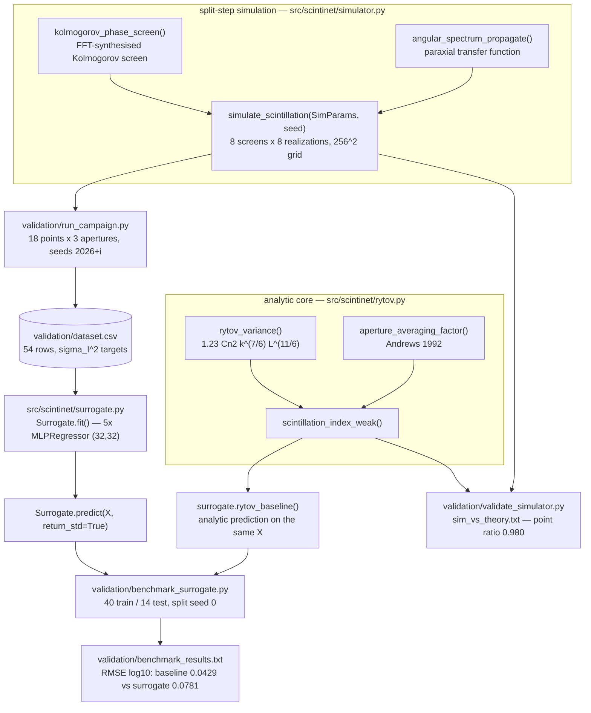
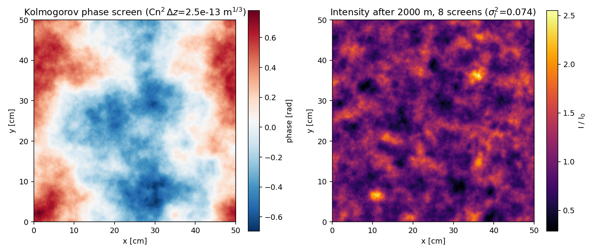
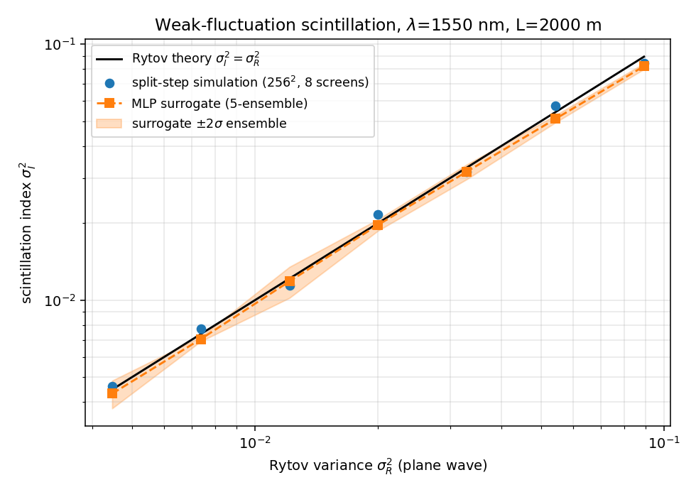

# ScintiNet

Scintillation index for free-space optical links: Rytov theory, a split-step simulator, and an MLP surrogate.


## The problem

A free-space optical link fades because refractive-index turbulence along the
path scrambles the wavefront, and the scintillation index
σ_I² = ⟨I²⟩/⟨I⟩² − 1 is the number that sets required link margin and outage
probability. Closed-form Rytov theory gives σ_I² instantly but only for weak
fluctuations on idealised geometries; split-step wave-optics simulation is
general but costs order a second per parameter point on this machine, which
kills the parametric sweeps and Monte Carlo availability studies that link
planning actually needs. ScintiNet implements all three layers — theory,
simulation, and a learned surrogate — on identical inputs so the trade can be
measured rather than asserted.

## The headline result: the analytic baseline beats the surrogate

On the held-out test split, the MLP surrogate **loses** to the analytic Rytov
baseline on every metric (`validation/benchmark_results.txt`, 14 held-out rows):

| Model | RMSE (log10 σ_I²) | median \|rel err\| | max \|rel err\| |
|---|---|---|---|
| MLP surrogate (5-member ensemble) | 0.0781 | 0.1665 | 0.2824 |
| **Rytov analytic baseline** | **0.0429** | **0.0700** | **0.2276** |

This is reported as measured. It was not tuned away, and it is the expected
outcome: the benchmark runs entirely inside the baseline's own validity
regime, where the baseline is a near-exact closed form, and 40 training rows
carrying ~5–10 % statistical noise are nowhere near enough for a neural
network to rediscover that closed form more accurately. The surrogate's
16.7 % median error is roughly the noise floor of its own training targets.

**The surrogate's argument is speed, not accuracy.** Prediction cost measured
at 0.269 ms/point against ~1.3 s/point for the split-step simulation at this
grid size — a ~5000× speedup (`MODEL_CARD.md`, "When is a surrogate actually
worthwhile?"; the later run in `validation/benchmark_results.txt` measured
0.046 ms/point, which would put the ratio higher still). That gap is what
makes Monte Carlo and optimisation loops possible at all. It is also what
makes the surrogate approach worth building *before* the regimes where no
closed form exists — strong fluctuations, non-Kolmogorov spectra,
inner/outer-scale effects, slant paths with Cn²(h) profiles.

If you need the weak-fluctuation scintillation index for a horizontal
Kolmogorov plane-wave link, call `scintinet.rytov` and ignore the surrogate.
That recommendation is in the model card too.

## What this does

- **Analytic core**, hand-checked against textbook closed forms to relative
  1e-4 on 5 known-answer cases, plus Hypothesis property tests
  (`validation/VALIDATION.md` §V1).
- **Split-step phase-screen simulator** — angular-spectrum propagation
  between FFT-synthesised Kolmogorov screens, unitary to relative 1e-12,
  reproducing Rytov theory to a mean sim/theory ratio of **0.980** for a
  point receiver over 18 weak-regime points (`validation/sim_vs_theory.txt`).
- **Seeded 54-row simulation campaign** covering Cn² 1e-16 → 1e-15 m^(−2/3),
  L 1000 → 3000 m, λ 850/1550 nm, D 2/50/100 mm; σ_R² spans 4.0e-3 → 3.0e-1;
  15.4 s wall time on 2 cores (`validation/campaign_log.txt`).
- **MLP-ensemble surrogate** with a deep-ensemble uncertainty output: mean
  ensemble std 2.9747e-03 against a mean prediction of 1.7698e-02 (≈17 %
  spread), which tracks the measured 16.7 % median error.
- **A benchmark that publishes its own negative result** — surrogate vs
  baseline on the same held-out rows, with the baseline winning.

## Who it's for

- Atmospheric-propagation and FSO researchers evaluating whether a surrogate
  is worth the trouble for link-budget tooling.
- Optical communications engineers who want a tested, referenced
  implementation of the Rytov variance and the Andrews aperture-averaging
  factor they can read in an afternoon.
- Instructors and graduate students in atmospheric optics who want a runnable
  split-step simulator small enough to understand end to end.

## Who it's not for

- Anyone sizing link margin, predicting availability, or making a go/no-go
  decision for a real optical link. Nothing here has been compared against
  measured scintillometer data.
- Anyone working outside weak fluctuations (σ_R² ≳ 1), on slant or
  satellite-downlink geometries, with Gaussian beams, or with non-Kolmogorov
  spectra. None of that is modelled.
- Anyone needing a maintained general-purpose wave-optics framework. See the
  next section — several exist and are better at that job.

## Alternatives, honestly

Every package below was checked to exist on PyPI at the version shown.

| Alternative | What it does better | When to use it instead |
|---|---|---|
| [HCIPy](https://github.com/ehpor/hcipy) (`hcipy` 0.7.0) | Mature, general optical-propagation framework: `AngularSpectrumPropagator`, `FresnelPropagator`, `MultiLayerAtmosphere`, von Kármán phase statistics, site atmosphere profiles, coronagraphy, AO. | You want a maintained, general wave-optics framework rather than a 3-module research vehicle; you need von Kármán rather than pure Kolmogorov; you need multi-layer atmospheres or anything high-contrast-imaging. This is the default recommendation. |
| [AOtools](https://github.com/AOtools/aotools) (`aotools` 1.0.8) | Peer-reviewed toolbox of AO building blocks — finite and infinite phase screens, slope covariance matrices, temporal power spectra, atmospheric parameter conversions, optical propagation. | You want well-tested primitives to compose your own pipeline, especially infinite (endlessly extensible) phase screens, which ScintiNet does not have. |
| [Soapy](https://github.com/AOtools/soapy) (`soapy` 0.15.0) | End-to-end Monte Carlo AO system simulation: wavefront sensors, deformable mirrors, reconstructors, laser guide stars with realistic propagation. | You are simulating a closed-loop AO system rather than an open-path link budget. Its own README describes it as under heavy development and advises care before publishing from it. |
| [POPPY](https://github.com/spacetelescope/poppy) (`poppy` 1.2.0) | Fraunhofer and Fresnel physical-optics propagation for telescope PSF simulation; the propagation engine behind JWST PSF tooling. | You are modelling an instrument's pupil, optical train and PSF. It has no atmospheric turbulence-along-path model at all. |
| [prysm](https://github.com/brandondube/prysm) (`prysm` 0.21.1) | Physical and first-order optical modelling: polynomials and Zernikes, multi-plane diffraction, interferogram processing, detector models, optional GPU. | You are doing optical design, wavefront or interferogram analysis, or a full image-chain simulation. No atmospheric propagation. |
| [LightPipes](https://github.com/opticspy/lightpipes) (`LightPipes` 2.1.5) | General scalar beam-propagation toolbox with a broad library of optical elements and a gentle learning curve. | You want interactive beam-propagation experiments through defined optical elements rather than turbulent-path statistics. |
| [COMPASS](https://github.com/COSMIC-RTC/compass) | GPU-accelerated end-to-end AO simulation platform built for ELT-scale systems. | You need large-scale GPU AO simulation. **Caution:** the name `compass` on PyPI is an unrelated geolocation API client library, not this platform; COMPASS is installed from its own repository, not from `pip install compass`. |

Bottom line: for the weak-fluctuation, horizontal, Kolmogorov, plane-wave
case that ScintiNet actually covers, the honest answer is that the closed
form is three lines of numpy — `scintinet.rytov` just gives you a version
with the references, the units and the validity checks written down.
ScintiNet's reason to exist is the measured surrogate-vs-baseline comparison,
not a claim of unique capability.

## Install and first run

```bash
git clone https://github.com/OmAcharya-avtr/scintinet.git
cd scintinet
python -m venv .venv && source .venv/bin/activate
pip install -e ".[examples]" pytest hypothesis
python -m pytest tests/ -q
python examples/phase_screen_speckle.py
```

`pyproject.toml` declares one extra, `examples` (matplotlib); `pytest` and
`hypothesis` are the test-only dependencies and are named explicitly above.
Runtime dependencies are numpy and scikit-learn. No GPU, no PyTorch.

Expected output:

```
..................................................                       [100%]
50 passed in 5.44s
saved /path/to/scintinet/screenshots/phase_screen_speckle.png
```

The test run takes about 5 s and the example about 5 s on 2 CPU cores.

## Worked example

All three layers on one link: Cn² = 1e-15 m^(−2/3), λ = 1550 nm, L = 2000 m,
D = 50 mm.

```python
import csv
import numpy as np
from scintinet import (
    SimParams, Surrogate, rytov_baseline,
    scintillation_index_weak, simulate_scintillation,
)

CN2, LAM, L, D = 1e-15, 1.55e-6, 2000.0, 0.05      # m^-2/3, m, m, m

# 1. Analytic weak-fluctuation theory: closed form, microseconds.
print(f"Rytov + Andrews aperture averaging : {scintillation_index_weak(CN2, LAM, L, D):.4e}")

# 2. Split-step wave optics: the ground truth the surrogate is trained on.
#    seed 2041 is the campaign seed for this point, so it reproduces dataset.csv.
sim = simulate_scintillation(
    SimParams(cn2=CN2, wavelength=LAM, path_length=L, aperture_diameters=(D,),
              grid_size=256, grid_width=0.5, n_screens=8, n_realizations=8),
    seed=2041,
)
print(f"split-step simulation (256^2)      : {sim.sigma_i2_aperture[D]:.4e} "
      f"(mean I = {sim.mean_intensity:.4f})")

# 3. Surrogate, fitted on the committed campaign dataset.
rows = list(csv.DictReader(open("validation/dataset.csv")))
X = np.array([[float(r["cn2"]), float(r["path_length_m"]),
               float(r["wavelength_m"]), float(r["aperture_d_m"])] for r in rows])
y = np.array([float(r["sigma_i2_sim"]) for r in rows])
surrogate = Surrogate(n_members=5, hidden_layer_sizes=(32, 32), random_state=0).fit(X, y)

# Query an interpolated Cn2 that is not on the campaign grid.
q = np.array([[5e-16, L, LAM, D]])
mu, sd = surrogate.predict(q, return_std=True)
print(f"\nCn2 = 5e-16 (off-grid interpolation)")
print(f"MLP surrogate (5-member ensemble)  : {mu[0]:.4e} +/- {sd[0]:.2e} (ensemble spread)")
print(f"rytov_baseline() analytic          : {rytov_baseline(q)[0]:.4e}")
```

Actual output:

```
Rytov + Andrews aperture averaging : 2.6245e-02
split-step simulation (256^2)      : 2.3704e-02 (mean I = 1.0006)

Cn2 = 5e-16 (off-grid interpolation)
MLP surrogate (5-member ensemble)  : 1.2298e-02 +/- 4.36e-04 (ensemble spread)
rytov_baseline() analytic          : 1.3123e-02
```

Two things to read off this. The simulated value 2.3704e-02 is bit-identical
to the corresponding row of `validation/dataset.csv` — the campaign is fully
seeded and regenerable. And the simulation sits 9.7 % below theory at
D = 50 mm, which is the documented finite-aperture low bias (§V3b below); the
surrogate, trained on simulation, inherits it and lands 6.3 % below the
analytic baseline at the off-grid query.

## Architecture



Dependency direction is strictly one-way: `surrogate` → `rytov` and
`simulator` → `rytov`. The analytic core imports neither the simulator nor
the ML layer, so the baseline cannot be contaminated by the model it is
benchmarking.

## Screenshots

Both images are produced by the scripts in `examples/`, so they cannot drift
from the code.



Notice that the phase screen (left, ±0.7 rad) has almost all its power at
large scales — the visible structure is tens of centimetres across — while the
intensity field it produces after 2 km (right, σ_I² = 0.074) has fine-grained
speckle at the Fresnel scale √(λL) ≈ 5.6 cm, with peaks above 2.5× and nulls
below 0.4× the mean.



Notice that the simulation points (blue) sit on the σ_I² = σ_R² line at the
low end and drift a few percent below it at the top of the sweep, and that
the surrogate (orange, with its ±2σ ensemble band) tracks the simulation
rather than the theory — it was trained on simulation, so it inherits the
simulator's low bias by construction.

## Validation evidence

Level 2 (Research). Every figure below comes from a script in `validation/`;
raw outputs are committed. Failures and baseline wins are included, because
those are the credible entries.

| ID | Check | Reference | Result | Tolerance / gate |
|---|---|---|---|---|
| V1 | Plane-wave σ_R², Cn²=1e-15, λ=1.55 µm, L=2000 m | Andrews & Phillips 2005 | 7.09495e-2 vs hand calc 7.09495e-2 | rel 1e-4 — PASS |
| V1 | Plane-wave σ_R², Cn²=5e-16, λ=850 nm, L=1000 m | Andrews & Phillips 2005 | 2.00646e-2 vs 2.00646e-2 | rel 1e-4 — PASS |
| V1 | Spherical-wave σ_R² | Andrews & Phillips 2005 | 2.88413e-2 vs 2.88413e-2 | rel 1e-4 — PASS |
| V1 | Aperture factor A, λ=1.55 µm, L=2000 m, D=0.1 m | Andrews, JOSA A 9(4) 597, 1992 | 0.115065 vs 0.115065 | rel 1e-4 — PASS |
| V1 | σ_I²(D), same inputs | Andrews 1992 | 8.1638e-3 vs 8.1638e-3 | rel 1e-3 — PASS |
| V2 | Angular-spectrum propagation is unitary over 500 m | Goodman 2005; Schmidt 2010 | rel error < 1e-12 | PASS |
| V2 | Zero turbulence ⇒ no scintillation | — | \|σ_I²\| < 1e-12, ⟨I⟩ = 1 ± 1e-12 | PASS |
| V2 | Energy conservation with turbulence, Cn²=5e-16, L=1000 m | — | ⟨I⟩ within 0.02 of 1 | PASS |
| V2 | Screen variance linear in Cn²·Δz | Schmidt 2010 | ratio 4.0 for 4× increase | rel 1e-9 — PASS |
| V2 | Seeded reproducibility | — | bit-identical σ_I² | exact — PASS |
| V3 | Simulated vs Rytov, point receiver (D = 2 mm), n = 18 | Andrews & Phillips 2005 | mean ratio **0.980**, min 0.907, max 1.041 | mean in [0.6, 1.4], all in [0.5, 1.6] — PASS |
| V3b | Simulated vs Rytov + Andrews averaging, D = 50/100 mm, n = 36 | Andrews 1992 | mean ratio **0.850**, min 0.689, max 1.036 | no pass gate — **reported bias, 15 % low** |
| V4 | MLP surrogate on 14 held-out rows | `benchmark_surrogate.py` | RMSE(log10) 0.0781, median rel 0.1665, max rel 0.2824 | — |
| V4 | Rytov baseline on the same 14 rows | `benchmark_surrogate.py` | RMSE(log10) **0.0429**, median rel **0.0700**, max rel **0.2276** | — **baseline wins on every metric** |
| V4 | Ensemble spread as an error indicator | `benchmark_surrogate.py` | mean std 2.9747e-03 vs mean prediction 1.7698e-02 (≈17 %) | informative, **not calibrated** |
| — | Test suite | `tests/` | 50 passed, 0 failed, 0 skipped, 5.44 s | — |

Two biases are reported rather than tuned away. The point-receiver index runs
~2 % low on average and up to 9 % low at the largest σ_R² = 0.30, because FFT
screens carry no power below the fundamental frequency 2π/(N·dx) and the
highest points begin to leave the strictly weak regime. The finite-aperture
index runs 15 % low on average and 31 % low at D = 100 mm, L = 3000 m; the
missing low-frequency screen power and the approximate nature of the Andrews
(1992) factor both contribute and cannot be separated with this dataset.

**Not validated:** strong fluctuations (σ_R² > 1), non-Kolmogorov spectra,
inner/outer-scale effects, slant or vertical paths with Cn²(h) profiles,
Gaussian-beam or spherical-wave simulation, beam wander, temporal statistics,
and any comparison against field measurement. No experimental data was used
anywhere in this validation.

## API reference

<details>
<summary><code>scintinet.rytov</code> — analytic core</summary>

| Function | Returns |
|---|---|
| `rytov_variance(cn2, wavelength, path_length, wave="plane")` | σ_R² [dimensionless]. `cn2` [m^(−2/3)], `wavelength` [m], `path_length` [m]; `wave` is `"plane"` (1.23) or `"spherical"` (0.50). |
| `aperture_averaging_factor(wavelength, path_length, aperture_diameter)` | A ∈ (0, 1] [dimensionless]. All arguments in metres. Plane-wave Andrews (1992) approximation. |
| `scintillation_index_weak(cn2, wavelength, path_length, aperture_diameter=None, wave="plane")` | σ_I² [dimensionless]. `aperture_diameter` [m] or `None` for a point receiver; aperture averaging requires `wave="plane"`. |

</details>

<details>
<summary><code>scintinet.simulator</code> — split-step wave optics</summary>

| Object | Meaning |
|---|---|
| `SimParams(cn2, wavelength, path_length, aperture_diameters=(), grid_size=256, grid_width=0.5, n_screens=8, n_realizations=8)` | Frozen dataclass. `cn2` [m^(−2/3)] ≥ 0, `wavelength`/`path_length`/`grid_width`/`aperture_diameters` [m], `grid_size` samples per side. |
| `SimResult` | `sigma_i2_point` [dimensionless], `sigma_i2_aperture` (dict, D [m] → σ_I²), `mean_intensity` (1.0 for a lossless unit plane wave), `params`, `seed`. |
| `kolmogorov_phase_screen(rng, n, dx, cn2_dz, wavelength)` | (n, n) phase screen [rad]. `dx` [m], `cn2_dz` [m^(1/3)]. Piston removed. |
| `angular_spectrum_propagate(u, wavelength, dx, dz)` | Propagated complex field. `dz` [m]. Unitary to rel 1e-12. |
| `simulate_scintillation(params, seed)` | `SimResult`. Raises `ValueError` if the sampling rules are violated: dx ≤ √(λL)/4, N·dx ≥ 4√(λL), r₀ ≥ 2·dx per screen, and D ≤ grid_width/4. |

</details>

<details>
<summary><code>scintinet.surrogate</code> — learned model and analytic baseline</summary>

| Object | Meaning |
|---|---|
| `rytov_baseline(X)` | (n,) σ_I² [dimensionless] from `X` of shape (n, 4), columns `[Cn² (m^(−2/3)), L (m), λ (m), D (m)]`; `D = 0` means point receiver. |
| `Surrogate(n_members=5, hidden_layer_sizes=(32, 32), max_iter=2000, random_state=0)` | Ensemble of scikit-learn `MLPRegressor` in a `StandardScaler` pipeline. `n_members` ≥ 2. Member *i* uses seed `random_state + i`. ~1200 parameters per member. |
| `Surrogate.fit(X, y)` | Fits on the same 4-column `X`; `y` is σ_I² > 0. Features `[log10 Cn², log10 L, log10 λ, D]`; target `log10 σ_I²`. Returns `self`. |
| `Surrogate.predict(X, return_std=False)` | Mean σ_I² [dimensionless], and ensemble standard deviation in linear σ_I² space if `return_std=True`. Epistemic disagreement only. |

</details>

## Limitations

1. **The surrogate loses to the analytic baseline in-regime** (0.0781 vs
   0.0429 RMSE in log10). Its only measured advantage is speed. See the
   headline section above.
2. **Compute budget: 2 CPU cores, scikit-learn only.** No GPU, no PyTorch,
   no JAX. Peak memory below 500 MB, dominated by 256² complex FFT arrays; a
   1024² grid would need roughly 16× that per array. Everything in this repo
   — campaign 15.4 s, surrogate fit ~0.1–2 s depending on run, test suite
   5.44 s, examples ~16 s — was sized to fit that budget, which is why the
   dataset is 54 rows rather than 10³–10⁴.
3. **Rytov theory's own validity range.** The first-order Rytov approximation
   holds for σ_R² ≲ 1 and is best below ~0.5. Beyond that the true σ_I²
   rises to a focusing peak near σ_R² ≈ 2–4 and then saturates toward 1.
   ScintiNet models none of that, and neither the baseline nor the surrogate
   will warn you: they return a confident, wrong number.
4. **Training-domain bounds, with no guard rails.** The surrogate saw only
   Cn² ∈ [1e-16, 1e-15] m^(−2/3), L ∈ [1000, 3000] m, λ ∈ {850 nm, 1550 nm},
   D ∈ {2, 50, 100} mm, σ_R² ≤ 0.30. Queries outside that box are silent
   extrapolation. D in particular was trained on three discrete values, so
   anything between 2 mm and 50 mm is unconstrained by data.
5. **The training data is synthetic throughout.** Every target is simulator
   output, not measurement, so the surrogate learns the simulator's biases —
   including the ~15 % finite-aperture low bias — by construction. No
   scintillometer or field-trial data was used anywhere.
6. **The dataset is not converged.** 8 realizations per point gives ~5–10 %
   statistical noise per target; 8 screens and a 256² grid over 0.5 m are far
   below production practice. `DATASET_CARD.md` tabulates what a converged
   campaign would need.
7. **No subharmonics in the phase screens.** FFT synthesis provides no power
   below 2π/(N·dx). Do not use this simulator for beam wander, tilt, or
   long-exposure phase statistics, which are dominated by exactly the missing
   low frequencies.
8. **Plane wave, horizontal path, Kolmogorov spectrum only.** No Gaussian
   beams, no spherical-wave aperture averaging, no Cn²(h) altitude profile,
   no inner or outer scale, no von Kármán option.
9. **The train/test split leaks mildly.** The three aperture rows from one
   simulation run share a seed and are correlated; the random row split does
   not account for it, so held-out aperture rows are slightly optimistic. A
   group split by simulation point would be stricter. Documented, not
   corrected.
10. **The ensemble std is not a calibrated predictive interval.** It captures
    model disagreement only — not simulation noise, phase-screen bias, or
    physics-model error. Do not use it as a confidence bound for link margin.
11. **No temporal modelling and no CLI.** No wind, frozen flow, fade
    duration, fade rate or outage probability; use the Python API and the
    committed scripts.

## Safety statement

This software is research-grade. It is not flight-qualified, not certified,
and not approved for operational aerospace use. Predictions must not be used
to size link margin, certify availability, or make go/no-go decisions for any
operational optical link, terrestrial or space-to-ground.

## Reproducing every number

All randomness is seeded (`BASE_SEED = 2026`, split seed 0, surrogate
`random_state=0`), so reruns reproduce these figures exactly.

```bash
python validation/run_campaign.py         # ~15 s  -> dataset.csv, campaign_log.txt
python validation/validate_simulator.py   # <1 s   -> sim_vs_theory.txt  (V3, ratio 0.980)
python validation/benchmark_surrogate.py  # ~3 s   -> benchmark_results.txt (V4, baseline wins)
python -m pytest tests/ -q                # 50 tests, ~5 s (V1, V2)
python examples/sweep_sigma_i2.py         # ~11 s  -> screenshots/sweep_sigma_i2.png
python examples/phase_screen_speckle.py   # ~5 s   -> screenshots/phase_screen_speckle.png
```

| Where the number in this README came from | File |
|---|---|
| V1 known-answer figures, V2/V3 summary, V4 table | `validation/VALIDATION.md` |
| Point and finite-aperture sim/theory ratios, per-point table | `validation/sim_vs_theory.txt` |
| RMSE, median/max relative error, ensemble std, prediction cost | `validation/benchmark_results.txt` |
| Campaign wall time, grid, screens, realizations | `validation/campaign_log.txt` |
| The 54 training rows and their seeds | `validation/dataset.csv` |
| Architecture, ~5000× speedup, failure cases | `MODEL_CARD.md` |
| Coverage, statistical noise, what a full campaign needs | `DATASET_CARD.md` |

## Licence

Apache-2.0. See `LICENSE`. Copyright © 2026 OPTIMA Organisation.

## Citation

```bibtex
@software{scintinet_2026,
  title   = {ScintiNet: learned scintillation surrogate for FSO link planning},
  author  = {{OPTIMA Organisation}},
  year    = {2026},
  version = {0.1.0},
  license = {Apache-2.0},
  note    = {Research-grade software; not certified for operational aerospace use}
}
```

## Credits

This is under reserved rights obtained by OPTIMA Organisation.

Theory references: L. C. Andrews and R. L. Phillips, *Laser Beam Propagation
through Random Media*, 2nd ed., SPIE Press, 2005; L. C. Andrews,
*J. Opt. Soc. Am. A* **9**(4), 597 (1992); J. D. Schmidt, *Numerical
Simulation of Optical Wave Propagation with Examples in MATLAB*, SPIE Press,
2010; J. W. Goodman, *Introduction to Fourier Optics*, 3rd ed., 2005;
B. Lakshminarayanan, A. Pritzel and C. Blundell, NeurIPS 2017 (deep
ensembles).
