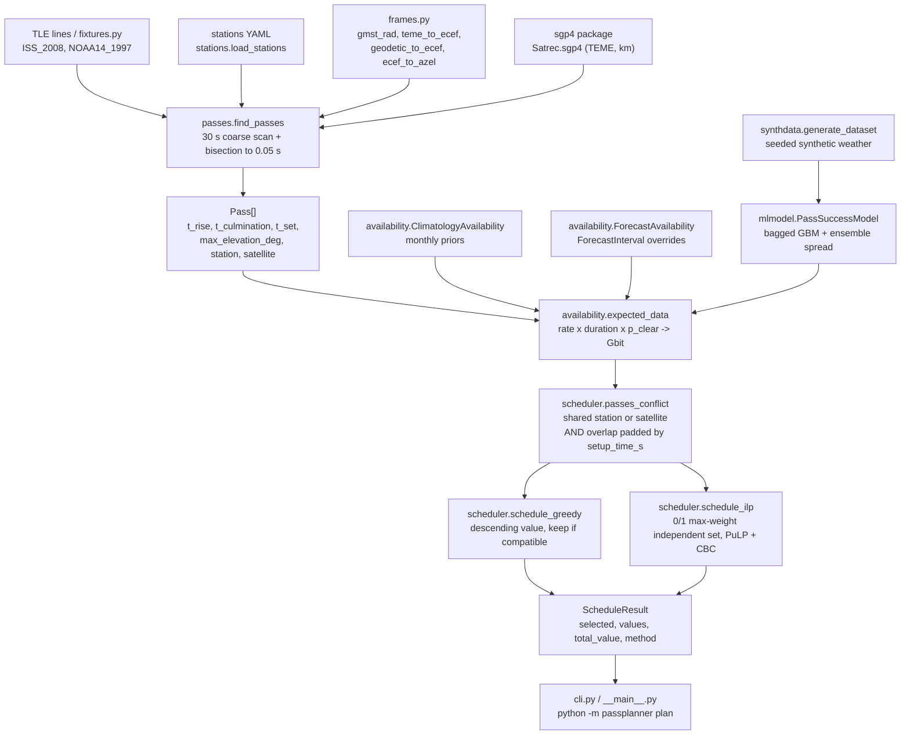
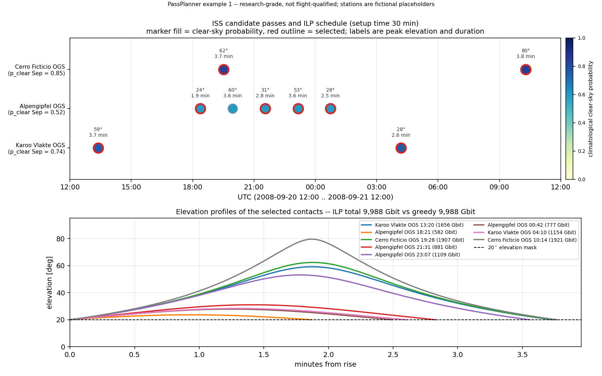
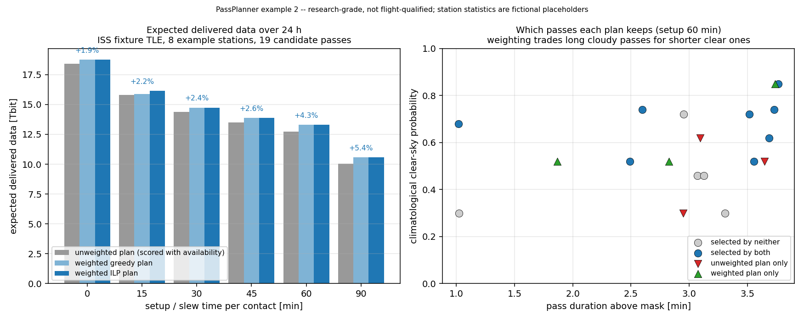
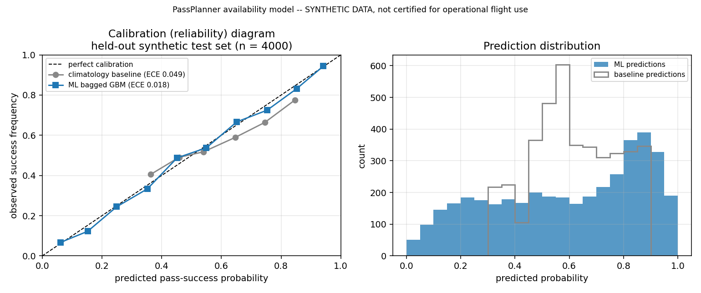

# PassPlanner

Optical ground-station contact planner: SGP4 passes, cloud-availability weighting, greedy and ILP scheduling.


## The problem

A free-space optical downlink carries orders of magnitude more data than an RF
link, and cloud stops it dead, so an optical ground station is usable only some
fraction of the time and operators build networks of sites to compensate. Once
you have several sites and several spacecraft, the passes compete: a station
tracks one satellite at a time, a satellite talks to one station at a time, and
slew plus acquisition makes near-adjacent passes mutually exclusive. Booking the
highest-elevation pass is the obvious rule and it is wrong whenever the highest
pass is over the cloudiest site.

## What this does

- Propagates a TLE with SGP4 and finds every visibility window above a station's
  elevation mask, refining rise and set by bisection to a **0.05 s** tolerance;
  worst measured disagreement against an independent dense-grid recomputation is
  **0.0146 s** over 11 passes and 22 events.
- Weights each window by the probability the sky is clear, from monthly
  climatology, a user-supplied forecast override, or a bagged-GBM model whose
  **Brier score is 27.51 % better** than the climatology baseline on held-out
  synthetic data.
- Solves the contact-selection problem exactly as a 0/1 ILP over the pass
  conflict graph (PuLP/CBC). It reproduces four hand-solved optima exactly and
  matches exhaustive enumeration on **20/20** randomised instances.
- Ships a greedy baseline so the value of exactness is measurable rather than
  assumed: **mean gap 3.650 %, max 19.040 %** across the randomised instances,
  **23.077 %** on the adversarial case, **6.981 %** on a realistic 27-pass
  instance at a one-hour setup time.
- Runs on CPU only. The ILP solves the 27-pass, 33-conflict-pair instance in
  **0.01 s**; the full test suite is **106 tests**.

## Who it is for

- Optical ground-segment engineers doing network sizing and site trade studies.
- Mission-operations analysts building contact plans for study or training.
- Researchers benchmarking contact-scheduling heuristics against an exact optimum.
- Students learning pass geometry, SGP4 usage and scheduling formulations.

## Who it is not for

- Anyone committing a real contact plan. This is research-grade software with a
  synthetic weather model and fictional station data.
- Anyone who needs pointing-grade geometry. The Earth-rotation model is
  GMST-only and there is no refraction correction.
- Anyone who needs precise orbit determination, manoeuvre planning, or force
  models beyond what SGP4 embeds. Use Orekit.
- Anyone with hundreds or thousands of candidate passes. The pairwise conflict
  formulation is O(n²) and was tested only in the tens.

## Alternatives, honestly

Propagation and pass-finding are solved problems and well served by several
mature packages. If all you need is "when is this satellite above my horizon",
this repository is not the shortest path and does not claim to be. What is thin
on the ground is the *combination*: visibility windows carried through a
per-pass availability weight into an exact selection over the conflict graph,
with a greedy baseline measured against it. That combination is the contribution;
everything below it is standing on other people's work, including this package's
own dependencies.

| Alternative | What it does better | When to use it instead |
|---|---|---|
| [`sgp4`](https://pypi.org/project/sgp4/) (PyPI) | The reference Python SGP4/SDP4, C-accelerated, checked against the Spacetrack Report #3 verification cases. **This project depends on it** for all propagation. | You need TEME state vectors and nothing else. Everything here sits on top of it. |
| [Skyfield](https://pypi.org/project/skyfield/) (PyPI, 1.55, Aug 2026) | Proper time scales (UT1, ΔT), planetary ephemerides, refraction, and a well-tested `find_events()` for satellite rise/culminate/set. Far larger user base and documentation. | You want accurate observation geometry, or rise/set with refraction, and you will do the scheduling yourself. For pure pass-finding it is the better tool. |
| [pyorbital](https://pypi.org/project/pyorbital/) (PyPI, pytroll) | Mature `get_next_passes`, and native integration with the SatPy/pytroll weather-satellite processing stack. | You are already in the pytroll ecosystem or processing polar weather-satellite data. |
| [pytroll-schedule](https://github.com/pytroll/pytroll-schedule) (PyPI, `trollsched`) | Reception scheduling of polar weather satellites, operationally deployed, multi-station, with real ground-segment plumbing. | You are scheduling meteorological satellite reception at real stations. It is the operational tool this repository is a research analogue of. |
| [passpredict](https://pypi.org/project/passpredict/) (PyPI, 0.5.1, Jun 2022) | A CLI and API purpose-built for producing overpass lists, with Celestrak TLE fetching built in. Less actively maintained. | You want a quick visual-pass list for a location. |
| [ephem / PyEphem](https://pypi.org/project/ephem/) (PyPI, 4.2.1, Feb 2026) | Mature C routines from XEphem: rise, transit and set for bodies and satellites, with refraction. | Classical observer astronomy, or an existing PyEphem codebase. |
| [poliastro](https://github.com/poliastro/poliastro) — **archived Oct 2023** | Two-body mechanics, Lambert solutions, manoeuvres, interactive orbit plotting. Development moved to community forks (e.g. `hapsira` on PyPI). | Interplanetary and orbital-mechanics analysis rather than ground contacts — but pick a maintained fork, not the archived repository. |
| [Orekit](https://www.orekit.org/) via [`orekit-jpype`](https://pypi.org/project/orekit-jpype/) (PyPI) or `orekit` (conda-forge) | A complete flight-dynamics library: numerical propagation with full force models, correct IERS frames and EOP, attitude, event detection, orbit determination, manoeuvres. Space-agency provenance. | Anything where frame and propagation fidelity actually matters. Orekit's event detection will give you better visibility windows than this does; it will not give you the cloud weighting or the ILP. |
| [PuLP](https://pypi.org/project/PuLP/) (PyPI) | The MILP modelling layer and bundled CBC solver. **This project depends on it.** | You want to write the scheduling model yourself. The formulation here is about forty lines of PuLP; see `src/passplanner/scheduler.py`. |
| [OR-Tools / CP-SAT](https://pypi.org/project/ortools/) (PyPI) | A far stronger scheduling engine, with native interval and no-overlap constraints that avoid the O(n²) pairwise blow-up, plus parallel search. | Your instance outgrows the tested range of tens of passes, or you need cumulative resources, priorities and deadlines. This is the right migration target. |
| [STK](https://www.ansys.com/products/missions/ansys-stk) (Ansys/AGI, commercial) | The industry-standard access and chain analysis, with a scheduling module, validated frames and vendor support. | You are doing operational work and can licence it. Context only — no comparison against STK was performed here, and none is claimed. |
| [GMAT](https://github.com/nasa/GMAT) (NASA, open source, R2026) | Mission design, high-fidelity propagation, `ContactLocator` for station access, and a scriptable mission sequence. | Mission design and analysis. It has no cloud-availability model and no contact-selection optimiser. Context only; no comparison was performed. |

Short version: for propagation use `sgp4`, for observation geometry use
Skyfield, for fidelity use Orekit, for scale use OR-Tools, and for operational
weather-satellite reception use pytroll-schedule. Use this when you want the
cloud-weighted contact-selection question posed and answered exactly, with the
greedy-versus-optimal gap measured rather than asserted.

## Install and first run

Requires Python 3.11+. Two runtime dependencies are easy to miss on a cold
clone and are needed before anything runs: **`sgp4`** (propagation) and
**`pulp`** (the ILP model and its bundled CBC solver). Both are declared in
`pyproject.toml`, so an editable install pulls them in.

```bash
git clone https://github.com/OmAcharya-avtr/passplanner.git
cd passplanner
python -m venv .venv && source .venv/bin/activate
pip install -e .                 # numpy, scipy, matplotlib, scikit-learn, pyyaml, sgp4, pulp
pip install pytest hypothesis    # test-only dependencies
python -m pytest tests/ -q
python examples/example_schedule_gantt.py
```

The test run ends with (wall-clock varies by machine; the 218 warnings are all
`DeprecationWarning` from PuLP about its upcoming 4.0 API, surfaced rather than
suppressed):

```
106 passed, 218 warnings in 10.03s
```

and the first example prints, then writes a PNG into `screenshots/`:

```
candidate passes: 9
ILP    : 8 contacts, 9,987.8 Gbit
greedy : 8 contacts, 9,987.8 Gbit (gap 0.00 %)
written: .../screenshots/pass_schedule_gantt.png
```

Greedy ties the ILP on that instance. That is the honest first-run result: with
one satellite and three well-spread stations the conflict graph is sparse and
the heuristic is already optimal. The worked example below shows the case where
it is not.

Command-line equivalent, without installing:

```bash
export PYTHONPATH=src
python -m passplanner plan --config examples/scenario_example.yaml
```

## Worked example — greedy versus ILP

One satellite, eight stations, one hour of slew and acquisition between
contacts. The setup time is what makes the conflict graph dense enough for the
heuristic to fail.

```python
from datetime import datetime, timedelta, timezone

from passplanner import (ClimatologyAvailability, Station, find_passes,
                         schedule_greedy, schedule_ilp)
from passplanner.fixtures import ISS_2008

# Eight fictional stations spread in latitude and longitude, 10 deg mask,
# 10 Gbit/s, flat monthly clear-sky priors from 0.50 to 0.64.
stations = [Station(name=f"GS{i}", lat_deg=-60.0 + 15.0 * i,
                    lon_deg=-180.0 + 40.0 * i, alt_km=1.0,
                    min_elevation_deg=10.0, data_rate_gbps=10.0,
                    monthly_clear_prob=tuple([round(0.50 + 0.02 * i, 2)] * 12))
            for i in range(8)]

t0 = datetime(2008, 9, 20, 12, 0, tzinfo=timezone.utc)
passes = [p for st in stations
          for p in find_passes(ISS_2008, st, t0, t0 + timedelta(days=1))]
availability = ClimatologyAvailability.from_stations(stations)
print(f"candidate passes in 24 h: {len(passes)}")

# One hour of slew/acquisition between contacts makes the conflict graph dense.
greedy = schedule_greedy(passes, availability, setup_time_s=3600.0)
ilp = schedule_ilp(passes, availability, setup_time_s=3600.0)
gap = 100.0 * (ilp.total_value - greedy.total_value) / ilp.total_value
print(f"greedy: {len(greedy.selected):2d} contacts  {greedy.total_value:9,.1f} Gbit")
print(f"ilp   : {len(ilp.selected):2d} contacts  {ilp.total_value:9,.1f} Gbit")
print(f"greedy leaves {gap:.3f} % of the optimum on the table")
```

Actual output:

```
candidate passes in 24 h: 27
greedy: 12 contacts   22,075.8 Gbit
ilp   : 13 contacts   23,732.6 Gbit
greedy leaves 6.981 % of the optimum on the table
```

Those three numbers are the last row of the Part C sweep in
`validation/validate_scheduler_output.txt`. Below a 30-minute setup time the two
methods agree exactly on this instance; the gap opens at 33 conflicting pairs.

## Architecture



There are no cross-product imports; the package is self-contained.

## Screenshots

Both images are produced by the scripts in `examples/`, so they cannot drift
from the code.



`python examples/example_schedule_gantt.py`. Notice the marker fill in the top
panel: it is the climatological clear-sky probability, and the one pass that is
*not* selected sits at the alpine site during the forecast-override window. The
bottom panel plots elevation against time from rise for the selected contacts,
so you can see that the chosen passes are not simply the highest ones.



`python examples/example_weighted_vs_unweighted.py`. Notice that the gain from
cloud weighting grows with the setup time — 1.91 % at zero setup, 5.37 % at 90
minutes. The mechanism is in the right panel: as contention rises the weighted
plan trades long passes over cloudy sites for shorter passes over clear ones. At
a 60-minute setup time both plans keep 11 passes and differ on 6 of them.



`python validation/validate_availability_model.py`. Notice how close the model
curve sits to the diagonal across the middle bins and how sparse the extreme
bins are — 149 samples in 0.0–0.1 against 754 in 0.8–0.9 — which is where the
calibration is least well determined.

## Validation evidence

Level 2 (Research): analytic cases and internal cross-checks. **No comparison
against flight data, against a certified reference tool, or against any external
service (STK, GMAT, Celestrak, Heavens-Above) was performed, and none is
claimed.** Full method descriptions in
[`validation/VALIDATION.md`](validation/VALIDATION.md); raw output committed
beside each script.

| Check | Reference | Result | Tolerance / verdict |
|---|---|---:|---|
| Rise/set times, 11 passes, 22 events | Dense-grid recomputation at 1.0 s detection + 0.002 s local sweep (`validate_passes.py`) | worst \|Δ\| **0.0146 s** | 0.05 s bisection tolerance → PASS |
| Pass duration, same cases | same | worst \|Δ\| **0.0202 s** | reported, no threshold |
| Peak elevation, same cases | same | worst \|Δ\| **0.0118°** (79.5° ISS pass) | reported, no threshold |
| Pass counts, 3 satellite/station cases | same | 5/5, 2/2, 4/4 | exact agreement |
| Closed-form circular-orbit rise/set, masks 0/5/10/20/40° | Wertz & Larson SMAD spherical-Earth relation; ψ₀ = 0.4246999 rad, n = 1.0780076e-3 rad/s, half-width 393.967 s (`tests/test_passes.py`) | within **0.05 s** | culmination within 0.01° of 90° |
| ILP vs hand-solved optima | 4 instances with the arithmetic written out (`validate_scheduler.py` Part A) | 4/4 exact | PASS |
| ILP vs exhaustive enumeration | 20 seeded random instances, n = 5…12 (Part B) | **20/20** to < 1e-6 Gbit | PASS |
| Greedy gap, random instances | ILP optimum (Part B) | mean **3.650 %**, max **19.040 %**, non-zero on 7/20 | reported — the baseline is beaten, not tied |
| Greedy gap, adversarial instance | hand optimum 1300 Gbit = {B, C}; greedy returns 1000 (Part A) | **23.077 %** | worst case found |
| Greedy gap, realistic 27-pass instance | ILP optimum, setup swept 0→3600 s (Part C) | 0 % up to 1800 s, **6.981 %** at 3600 s (33 conflict pairs) | greedy ≤ ILP throughout |
| ILP solve time, 27 passes | wall clock (Part C) | **0.01 s** at every setup time | regression guard 30 s |
| Pass-finder runtime, 24 h | wall clock (`validate_passes.py`) | **0.05 s** vs 1.4–1.8 s for the dense-grid reference | regression guard 10 s |
| Availability model vs baseline, n = 4000 held out | `ClimatologyBaselineModel` on the same splits (`validate_availability_model.py`) | Brier **0.1687** vs **0.2328** (−27.51 %) | ML Brier < baseline → PASS |
| Availability model vs oracle floor | `p_true` from the generator | 0.1687 vs **0.1634** (0.0053 above the floor) | reported |
| Calibration, 10 equal-width bins | observed frequencies on the test split | ECE **0.0179**, worst bin 0.0359 (0.40–0.50, n = 367) | ECE < 0.05 → PASS |
| Uncertainty output usefulness | correlation of ensemble σ with \|p_pred − p_true\| | **+0.2584** | positive but weak — a triage flag, not an error bar |
| Model training time | 5 GBM members, 2 CPU cores | **4.6 s** | reported |
| Test suite | `python -m pytest tests/ -q` | **106 passed**, 0 failed, 0 skipped | PASS |

<details>
<summary>Discrimination and log loss, all three models (held-out synthetic, n = 4000)</summary>

| Model | Brier ↓ | Log loss ↓ | ROC AUC ↑ | ECE ↓ |
|---|---:|---:|---:|---:|
| Climatology baseline | 0.2328 | 0.6585 | 0.6358 | 0.0493 |
| Bagged GBM (5 members) | 0.1687 | 0.5086 | 0.8216 | 0.0179 |
| Oracle `p_true` (irreducible floor) | 0.1634 | 0.4961 | 0.8325 | 0.0180 |

From `validation/validate_availability_model_output.txt`. These figures
characterise the synthetic generator in `src/passplanner/synthdata.py`. They say
nothing about real availability prediction. See
[`MODEL_CARD.md`](MODEL_CARD.md) and [`DATASET_CARD.md`](DATASET_CARD.md).

</details>

## API reference

| Function | Purpose and units |
|---|---|
| `find_passes(tle, station, t0, t1, min_elev_deg=None, coarse_step_s=30.0, refine_tol_s=0.05, satellite_name=None)` | Visibility windows above the mask. Times UTC, mask deg, steps and tolerance s. Returns `list[Pass]` sorted by rise. |
| `find_passes_from_position_fn(position_ecef_fn, station, t0, t1, ...)` | Same for any ECEF ephemeris `t -> r_ecef [km]`; used for the TLE-free analytic check case. |
| `expected_data(pass_, availability)` | `data_rate_gbps × duration_s × p_clear` → Gbit. |
| `schedule_greedy(passes, availability=None, setup_time_s=0.0)` | Greedy baseline, descending value. `setup_time_s` in s. Returns `ScheduleResult`. |
| `schedule_ilp(passes, availability=None, setup_time_s=0.0, time_limit_s=60.0)` | Exact max-weight independent set via CBC. Raises `RuntimeError` if not optimal within the limit. |
| `passes_conflict(p1, p2, setup_time_s=0.0)` | True if the two share a station or a satellite and overlap after padding by `setup_time_s`. |
| `load_stations(path)` | Station YAML → `list[Station]`. Validates names, probabilities and rates. |
| `ClimatologyAvailability.from_stations(stations)` / `.from_yaml(path)` | Monthly clear-sky priors, 12 values Jan…Dec, each in [0, 1]. |
| `ForecastAvailability(base, intervals)` | Overrides `p_clear` inside `ForecastInterval(station, start, end, p_clear)` windows. |
| `PassSuccessModel(n_members=5, seed=0).fit(x, y)` | Bagged gradient-boosting ensemble on the 7-feature synthetic vector. |
| `PassSuccessModel.predict_with_uncertainty(x)` | `(p_mean, p_std)`; `p_std` is ensemble spread, dimensionless. |
| `ClimatologyBaselineModel().fit(x, y)` | Baseline: returns the station's monthly prior, ignores weather features. |
| `generate_dataset(n_samples, seed)` | Deterministic synthetic `WeatherDataset` (`x`, `y`, `p_true`). |
| `Pass.duration_s`, `Pass.overlaps(other, setup_time_s)` | Pass duration in s; overlap test with padding. |
| `ScheduleResult.selected / .values / .total_value / .method / .n_candidates` | Chosen passes, Gbit each, Gbit total, `"greedy"` or `"ilp"`. |

`frames.gmst_rad`, `frames.teme_to_ecef`, `frames.geodetic_to_ecef` and
`frames.ecef_to_azel` are available for direct use; angles in degrees at the
interface, radians internally, distances in km.

## Limitations

1. **Compute budget.** Everything here was measured on 2 CPU cores with no GPU
   and peak memory well under 1 GB. Pass finding over 24 h takes 0.05 s per
   satellite/station pair, model training 4.6 s, and the ILP 0.01 s on the
   tested instances. The heaviest operation in the repository is the dense-grid
   validation reference at 1.4–1.8 s per case.
2. **ILP scaling.** The formulation writes one constraint per conflicting pair,
   so constraint count grows as O(n²) in the number of candidate passes. The
   tested range is tens of passes — 27 candidates and 33 conflict pairs solved
   in 0.01 s. Nothing larger was tested, and nothing here predicts behaviour at
   hundreds or thousands of passes. Beyond this range you want clique
   constraints, a decomposition, or an interval-based CP-SAT model. `schedule_ilp`
   raises `RuntimeError` rather than returning a suboptimal answer if CBC does
   not prove optimality within `time_limit_s` (default 60 s).
3. **Cloud model fidelity.** One Bernoulli outcome per pass, evaluated at
   culmination, all or nothing. Partial-pass obscuration is not modelled, and
   consecutive passes at the same site are treated as independent when real
   cloud persists for hours, so the schedule's risk of losing a whole night is
   understated. The data rate is constant above the mask: no elevation or range
   dependence, no turbulence fading, no link budget. There is no refraction
   correction, so low masks are biased; use masks of 10–20° or higher.
4. **Synthetic scheduling inputs.** Unless you supply your own, everything is
   invented. The station files are fictional-but-plausible placeholders —
   invented names, coordinates and clear-sky probabilities, labelled as such in
   the YAML. The TLE fixtures are real but historic (2008 and 1997) and are
   demonstration data only; SGP4 error grows kilometres per day away from epoch.
   The ML training data is 100 % synthetic, generated from a seed by
   `src/passplanner/synthdata.py`, so its metrics describe that generator and
   nothing else. Replace all of it with surveyed site statistics, current TLEs
   and real availability data before drawing any conclusion about a real network.
5. **GMST-only Earth rotation.** Polar motion, UT1−UTC (≤ 0.9 s, ≤ 0.00375° of
   rotation) and equation-of-the-equinoxes terms are neglected. Adequate for
   scheduling, inadequate for pointing or orbit determination.
6. **Simple resource model.** One telescope per station, one terminal per
   satellite, a single scalar setup time. No energy, thermal, buffer, keep-out
   or crew constraints, and no per-satellite priorities or deadlines.
7. **Pass-finder resolution.** A pass shorter than `coarse_step_s` can be missed
   entirely. The 30 s default is conservative for LEO above a 5–30° mask; reduce
   it for very high masks or grazing passes of higher orbits.
8. **Uncertainty output is not an error bar.** `predict_with_uncertainty`
   returns ensemble spread, correlated with realised error at only +0.2584. Read
   it as a triage flag for epistemic disagreement.
9. **UTC only.** Naive datetimes are interpreted as UTC by design.
10. **PuLP deprecation warnings.** The installed PuLP emits `DeprecationWarning`
    about its 4.0 API. The 218 warnings in the test run are all of this kind and
    are surfaced rather than suppressed.

## Reproducing every number

```bash
python validation/validate_passes.py              # rise/set vs dense-grid reference
python validation/validate_scheduler.py           # hand optima, exhaustive, greedy gap
python validation/validate_availability_model.py  # baseline vs model, calibration curve
python -m pytest tests/ -q                        # 106 tests, incl. closed-form geometry
python examples/example_schedule_gantt.py         # screenshots/pass_schedule_gantt.png
python examples/example_weighted_vs_unweighted.py # screenshots/weighted_vs_unweighted.png
```

Each validation script writes its own `*_output.txt` beside itself; those files
are committed, so you can diff your run against the one every number in this
README was taken from.

## Safety statement

This software is research-grade. It is not flight-qualified, not certified, and
not approved for operational aerospace use.

## Licence

Apache-2.0. See [LICENSE](LICENSE). Copyright © 2026 OPTIMA Organisation.

## Citation

```bibtex
@software{passplanner_2026,
  title        = {PassPlanner: optical ground-station contact planner with
                  cloud-availability weighting and schedule optimization},
  author       = {{OPTIMA Organisation}},
  version      = {0.1.0},
  year         = {2026},
  license      = {Apache-2.0},
  note         = {Research-grade software; not flight-qualified}
}
```

## Credits

This is under reserved rights obtained by OPTIMA Organisation.

TLE fixtures are public historic element sets: the ISS example TLE distributed
with the `sgp4` Python package documentation, originating from the Vallado,
Crawford, Hujsak and Kelso 2006 SGP4 verification material (AIAA 2006-6753), and
the NOAA 14 example from T.S. Kelso's Celestrak "FAQ: Two-Line Element Set
Format". Propagation is performed by the `sgp4` package; the ILP is modelled with
PuLP and solved by CBC.
