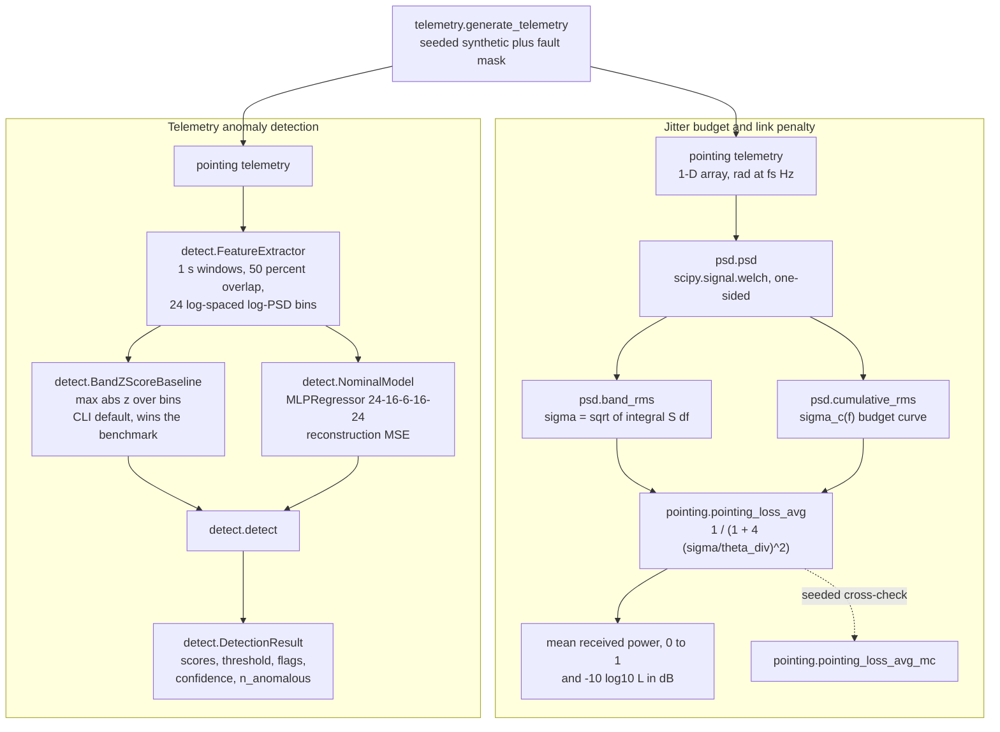
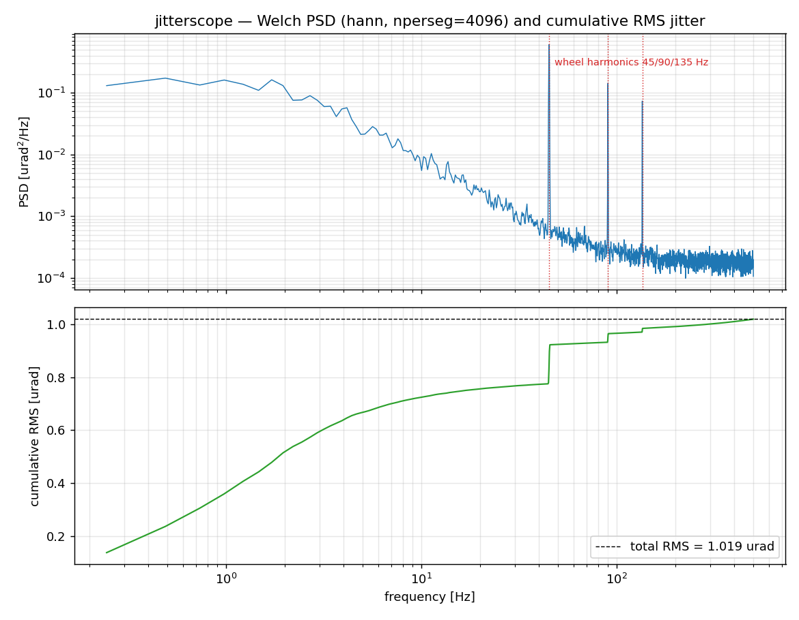
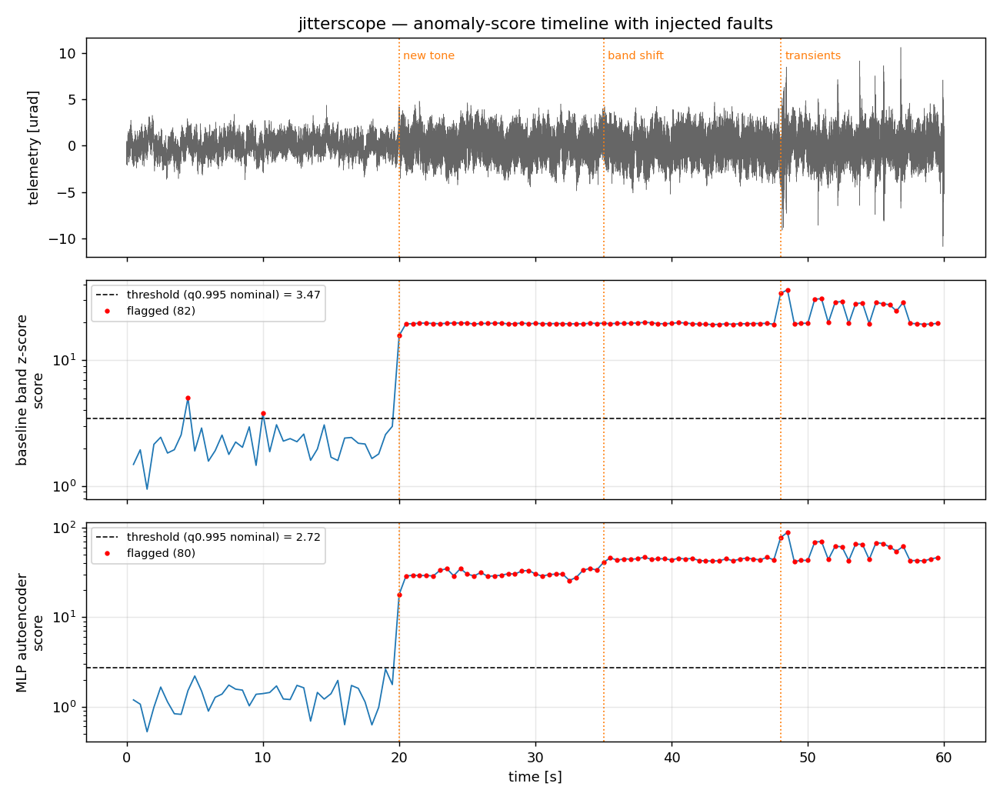

# JitterScope

Platform jitter PSD analysis, pointing-loss budgeting, and telemetry anomaly detection.


## The problem

An optical payload misses its pointing budget and the disturbance is somewhere in
the platform: reaction wheels, a cryocooler, a gimbal, a thermal snap. You have a
single-channel jitter record and you need to know which frequency band spends the
budget, and what that band costs the link in dB. Separately, you need to know
whether the platform is still behaving the way it did last month, because a new
tone or a shifted band appears in the spectrum long before it appears in a
peak-to-peak limit check.

## What this does

- **Welch PSD with the knobs exposed** — `nperseg`, window, overlap, detrend and
  averaging are arguments, not hidden defaults. Parseval holds to a relative
  error of 1.677e-04 on a 200 s white-noise record (`validation/val_psd.py`).
- **Band-limited and cumulative RMS jitter** — σ = √(∫S df) per band, and the
  cumulative curve that shows where the budget goes. On the shipped example
  record, 0.5–10 Hz carries 0.6832 µrad and 40–100 Hz carries 0.5791 µrad of a
  1.0191 µrad total (`examples/psd_cumulative_rms.py`).
- **Jitter to Gaussian-beam pointing loss** — closed form
  `⟨L⟩ = 1/(1 + 4(σ_θ/θ_div)²)`, agreeing with a 10⁶-draw Monte Carlo to a
  maximum relative error of 4.068e-03 across 8 cases, every deviation inside
  1.5 Monte Carlo standard errors (`validation/val_pointing.py`).
- **Two anomaly detectors on identical features** — a per-bin log-PSD z-score
  baseline and an autoencoder-equivalent MLP, benchmarked head to head on 2856
  labeled synthetic windows (`validation/val_detector.py`).
- **Seeded synthetic telemetry with labeled faults** — wheel harmonics over
  colored and white noise, plus `new_tone`, `band_shift` and `transient`
  injections with a per-sample fault mask for benchmarking.

## Headline result: the classical baseline beats the neural model

The autoencoder lost. On the package's own benchmark — 2856 test windows, 952
faulty, identical features, identical q0.995 threshold rule, identical test set —
the classical per-bin z-score baseline scores higher than the MLP autoencoder:

| Model | Precision | Recall | F1 | ROC AUC | False alarms on nominal |
|---|---|---|---|---|---|
| **Band z-score baseline** | **0.9900** | 0.9401 | **0.9644** | **0.9797** | **4 / 714 (0.56 %)** |
| MLP autoencoder | 0.9751 | **0.9454** | 0.9600 | 0.9784 | 10 / 714 (1.40 %) |

Source: `validation/val_detector_output.txt`.

The baseline also hits its design false-alarm rate (0.56 % against a 0.5 % target
at q0.995) where the MLP runs about 2.8× hot, and it fits in a time that rounds
to zero against seconds for the MLP. `MODEL_CARD.md` §6 records 0.001 s for the
baseline against 2.452 s for the MLP, a ratio of roughly 2400×; the archived raw
run in `validation/val_detector_output.txt` recorded 1.632 s for the MLP against
a baseline fit printing as 0.000 s. The two runs disagree on wall-clock timing,
so treat the speed advantage as three orders of magnitude rather than as a
precise figure. The accuracy numbers are identical across both runs.

**The CLI therefore defaults to `--detector baseline`.** Shipping the classical
method as the default is the correct engineering call when the classical method
won the benchmark, and this package makes that call rather than defending the
neural model.

Two caveats, stated because they cut both ways. The margin is small: ΔF1 =
0.0044 and ΔAUC = 0.0013, both well under 1 %. And the entire difference lives in
the `transient` class, where the MLP recovers slightly more true positives
(0.7759 vs 0.7543 recall) at the cost of 14 extra false alarms; on `new_tone` and
`band_shift` both models score 1.0000 recall. The honest reading is that the two
are near-equivalent on this data and the baseline is preferable on cost,
calibration and the absence of hyperparameters.

Why the baseline wins is not mysterious: the injected faults are additive-energy
signatures that raise log-PSD in specific bins, which is exactly the alternative
hypothesis a per-bin z-score is optimal against. The MLP is retained for the case
of correlated multi-band shape changes that a per-bin marginal test cannot see.
**That case is not demonstrated in this benchmark and remains an untested
claim.**

## Who this is for

- Optomechanical and pointing engineers building line-of-sight jitter budgets.
- Laser communication link engineers turning a pointing budget into a dB penalty.
- Telemetry analysts screening a vibration channel for spectral change.
- Students and researchers in spacecraft dynamics and free-space optics.

## Who this is not for

- Anyone who needs a bare PSD. Call `scipy.signal.welch` directly; this package
  calls it too.
- Anyone processing real flight or ground-test telemetry expecting the benchmark
  numbers to transfer. Every number here comes from synthetic, stationary,
  single-axis, Gaussian data (`DATASET_CARD.md`).
- Anyone needing multi-axis, cross-spectral, or input-output (FRF) analysis.
  None of that is implemented.
- Anyone needing streaming or online detection. This is batch only.
- Anyone needing flight-qualified or certified software. See
  [Safety](#safety-statement).

## Alternatives, honestly

PSD estimation is a solved problem. `scipy.signal.welch` does it, this package
calls it, and if a Welch PSD is all you need then this package adds a dependency
and nothing else. The contribution here is the chain that sits around the PSD —
band-RMS integration, the cumulative-RMS budget curve, the closed-form
pointing-loss conversion validated against Monte Carlo, and a detector benchmark
with an honest baseline — not the spectral estimation itself.

| Alternative | What it does better | Use this instead when |
|---|---|---|
| [`scipy.signal.welch`](https://github.com/scipy/scipy) | The actual PSD estimator, with more windows, more averaging modes, and no extra dependency. JitterScope wraps it. | You want band RMS, the cumulative-RMS curve, and the pointing-loss conversion on top, without writing the integration yourself. |
| [PyOD](https://github.com/yzhao062/pyod) | Dozens of outlier detectors behind a common API, actively maintained, far broader model coverage than one baseline plus one MLP. | You want the vibration-specific feature extraction (log-spaced log-PSD bins over overlapping windows) and a calibrated held-out threshold rather than a model zoo. PyOD is a good next step once you have the feature matrix from `FeatureExtractor`. |
| [sktime](https://github.com/sktime/sktime) | A real time-series ML framework: pipelines, proper cross-validation, segmentation and annotation estimators. | Your problem is spectral jitter budgeting rather than general time-series ML, and you want the pointing-loss chain. |
| [tsfresh](https://github.com/blue-yonder/tsfresh) | Automatic extraction of hundreds of time-series features with statistical relevance filtering. | You specifically want physically interpretable band energies whose units trace back to rad²/Hz. |
| [river](https://github.com/online-ml/river) | Online and streaming learning, with drift detection and incremental models. | Your telemetry arrives as complete records rather than as a stream. JitterScope has no online path at all. |
| [STUMPY](https://github.com/stumpy-dev/stumpy) | Matrix profile and discord discovery: finds shape anomalies, including short bursts, without a designated nominal training period. | Your anomalies are spectral rather than shape-based. Note that STUMPY is a genuinely better fit for the `transient` class, where both detectors here reach only 0.75–0.78 recall. |
| [ObsPy](https://github.com/obspy/obspy) | A full observatory framework: instrument response removal, real data formats, spectrograms, event handling, long production history. | You are not working with seismological data or formats and you want the optical pointing-loss link. |
| [AllanTools](https://github.com/aewallin/allantools) | Allan and overlapping Allan deviation — the time-domain stability statistic for clocks and gyros, which this package does not compute. | You need frequency-domain band budgets rather than a time-domain stability curve. The two are complementary, not competing. |
| [pyFRF](https://github.com/ladisk/pyFRF) | Frequency response functions for structural dynamics: input-output transfer estimation with coherence. | You have output-only telemetry and no measured input. JitterScope does no FRF estimation. |

Discarded during this survey: `adtk` (last PyPI release 0.6.2, April 2020,
effectively unmaintained) and `pyvib` (no such project on PyPI).

## Install and first run

```bash
git clone https://github.com/OmAcharya-avtr/jitterscope.git
cd jitterscope
python -m venv .venv && source .venv/bin/activate
pip install -e ".[test]"
python -m pytest tests/ -q
python examples/psd_cumulative_rms.py
```

Expected output of the test run:

```
.....................................................                    [100%]
53 passed in 14.75s
```

Expected output of the first example, which also writes
`screenshots/psd_cumulative_rms.png`:

```
Band-limited RMS jitter (sigma = sqrt(int PSD df)):
         band [Hz]   RMS [urad]
     0.5-    10.0       0.6832
    10.0-    40.0       0.2700
    40.0-   100.0       0.5791
   100.0-   250.0       0.2433
   250.0-   500.0       0.2159
  total (Parseval)       1.0191

Gaussian-beam average pointing loss for theta_div = 10 urad: 0.9797 (0.09 dB)

saved .../screenshots/psd_cumulative_rms.png
```

### Command line

```bash
python -m jitterscope analyze --input telemetry.csv --fs 1000
```

The CSV's last numeric column is taken as the telemetry channel. The leading
`--train-frac` (default 0.5) of the record is **assumed nominal** and used to fit
the detector; verifying that assumption is the operator's job. Output on a 60 s
record with a 137 Hz tone injected at t = 40 s:

```
jitterscope analyze: telemetry.csv
  samples: 60000  fs: 1000 Hz  duration: 60.00 s
  mean: 3.3939e-08  std: 1.1837e-06 (signal units)

PSD (Welch, hann, nperseg=1024, 50% overlap)
  resolution: 0.977 Hz   total RMS (Parseval): 1.1391e-06
  dominant peak: 136.72 Hz at 2.023e-13 u^2/Hz

Band-limited RMS (sigma = sqrt(int PSD df)):
  band [Hz]          RMS
      0.0-   10.0   6.7294e-07
     10.0-   50.0   5.7353e-07
     50.0-  200.0   6.7770e-07
    200.0-  500.0   2.3753e-07

Anomaly report (baseline detector, threshold = q0.995 of nominal scores = 3.245)
  training on first 50% of record (ASSUMED nominal)
  windows: 119   flagged: 41
  t_center [s]    score        confidence
       14.50    3.257       0.983
       40.00    15.47       1.000
       40.50    20.64       1.000
       41.00    20.42       1.000
       ...
```

The 14.50 s flag is a false alarm, 26 s before the injected fault. At a q0.995
threshold roughly one nominal window in 200 will do this.

## Worked example

```python
import numpy as np
from jitterscope import (BandZScoreBaseline, FeatureExtractor, band_rms,
                         cumulative_rms, detect, generate_telemetry,
                         pointing_loss_avg, psd)

FS = 1000.0
_, x_nom, _ = generate_telemetry(duration_s=60.0, fs=FS, seed=2026)
_, x_test, mask = generate_telemetry(
    duration_s=60.0, fs=FS, seed=777,
    faults=[{"kind": "new_tone", "t_start": 20.0, "freq_hz": 137.0, "rms": 1.0e-6}],
)

f, pxx = psd(x_nom, FS, nperseg=4096)                      # rad^2/Hz
sigma_lo, sigma_wheel = band_rms((f, pxx), [(0.5, 10.0), (40.0, 100.0)])
_, cum = cumulative_rms((f, pxx))
print(f"0.5-10 Hz RMS   : {sigma_lo * 1e6:.4f} urad")
print(f"40-100 Hz RMS   : {sigma_wheel * 1e6:.4f} urad")
print(f"total RMS       : {cum[-1] * 1e6:.4f} urad")

loss = pointing_loss_avg(sigma_theta=cum[-1] / np.sqrt(2), theta_div=10e-6)
print(f"pointing loss   : {loss:.4f} ({-10 * np.log10(loss):.2f} dB) at theta_div = 10 urad")

ext = FeatureExtractor(fs=FS, window_s=1.0, n_bins=24)
model = BandZScoreBaseline(quantile=0.995).fit(ext.transform(x_nom)[0])
res = detect(x_test, model=model, extractor=ext)
print(f"threshold       : {res.threshold:.4f} (max |z|)")
print(f"flagged windows : {res.n_anomalous} of {res.scores.size}")
before = res.flags[res.window_centers_s < 20.0].sum()   # tone starts at t = 20 s
after = res.flags[res.window_centers_s >= 20.0].sum()
print(f"flags before 20s: {before} (false alarms)")
print(f"flags after  20s: {after} of {(res.window_centers_s >= 20.0).sum()}")
```

Printed output:

```
0.5-10 Hz RMS   : 0.6832 urad
40-100 Hz RMS   : 0.5791 urad
total RMS       : 1.0191 urad
pointing loss   : 0.9797 (0.09 dB) at theta_div = 10 urad
threshold       : 3.4668 (max |z|)
flagged windows : 82 of 119
flags before 20s: 2 (false alarms)
flags after  20s: 80 of 80
```

Every window after fault onset is caught; two of the 39 pre-onset windows are
false alarms.

## Architecture



## Screenshots



Notice the three reaction-wheel harmonics at 45, 90 and 135 Hz standing two to
three decades above the broadband floor in the top panel, and the matching step
in the cumulative-RMS curve below: the 45 Hz fundamental alone lifts the running
total from about 0.78 to about 0.92 µrad, which is where the budget is actually
spent. Produced by `examples/psd_cumulative_rms.py`.



Notice that both detectors jump roughly an order of magnitude at the 20 s
`new_tone` onset and stay above threshold, that only the MLP panel shows a
visible further step at the 35 s `band_shift`, and that the pre-fault segment
contains a handful of points above the dashed q0.995 threshold — the design false
alarms. Baseline flags 82 of 119 windows, MLP flags 80. Produced by
`examples/anomaly_timeline.py`.

## Validation evidence

Level 2 (Research). Full write-up in
[`validation/VALIDATION.md`](validation/VALIDATION.md); raw script output is
archived verbatim beside each script.

| Check | Reference | Result | Tolerance |
|---|---|---|---|
| Sinusoid peak frequency | analytic f₀ = 80.0000 Hz | 80.0781 Hz, a 0.320-bin offset | within 1 bin |
| Sinusoid integrated power | A²/2 = 2.000000e-12 rad² | rel err 5.241e-07 | < 1e-2 |
| Sinusoid band RMS 70–90 Hz | A/√2 = 1.414214e-06 rad | rel err 8.374e-11 | < 1e-2 |
| White-noise PSD level | σ²/(f_s/2) = 2.000000e-15 rad²/Hz | median rel err 6.171e-03 | < 5e-2 |
| Parseval on white noise | sample variance 9.958205e-13 rad² | rel err 1.677e-04 | < 5e-2 |
| Welch estimator scatter | χ²₂ₖ prediction 0.1021 for k = 96 | measured 0.1048, rel 2.6e-02 | reported, not gated |
| Pointing loss vs Monte Carlo | 8 cases, 10⁶ draws per axis | max rel err 4.068e-03; every case within 1.46 MC standard errors | < 1e-2 |
| Detector F1 | 2856 windows, 952 faulty | **baseline 0.9644 beats MLP 0.9600** | none; reported as measured |
| Detector ROC AUC | same test set | **baseline 0.9797 beats MLP 0.9784** | none; reported as measured |
| `new_tone` and `band_shift` recall | 360 faulty windows each | 1.0000 for both models | none; reported as measured |
| `transient` recall | 232 faulty windows | baseline 0.7543, MLP 0.7759 — **both miss about one in four** | none; reported as measured |
| False-alarm rate on nominal | 0.5 % design target at q0.995 | baseline 0.56 %, on target; **MLP 1.40 %, 2.8× target, a miss** | none; reported as measured |
| MLP confidence separation | empirical nominal CDF | 0.5066 nominal vs 0.9781 faulty | none; reported as measured |

Not validated: any real flight or ground-test telemetry; any published
reaction-wheel microvibration dataset; the physical adequacy of the
point-receiver far-field pointing model for a specific link; detector behaviour
under nonstationary nominal conditions; the MLP's claimed advantage on correlated
multi-band anomalies.

## API reference

| Function or class | What it returns | Units |
|---|---|---|
| `psd(x, fs, **welch_kw)` | One-sided Welch PSD as `(f, Pxx)`. | `x` in u, `fs` in Hz → `f` in Hz, `Pxx` in u²/Hz |
| `band_rms(psd_result, bands)` | RMS per `(f_lo, f_hi)` band by trapezoidal PSD integration with interpolated edges. | bands in Hz → RMS in u |
| `cumulative_rms(psd_result)` | Cumulative RMS curve as `(f, sigma_c)`. | Hz → u |
| `pointing_loss_avg(sigma_theta, theta_div)` | Closed-form mean Gaussian-beam pointing loss `1/(1 + 4(σ/θ)²)`. | rad, rad → dimensionless in (0, 1] |
| `pointing_loss_avg_mc(sigma_theta, theta_div, n_samples=200000, seed=0)` | Seeded Monte Carlo cross-check of the same quantity. | rad, rad → dimensionless |
| `generate_telemetry(duration_s, fs, seed, wheel_hz, n_harmonics, tone_rms, base_rms, colored_rms, faults)` | Seeded synthetic record as `(t, x, fault_mask)`. | s, Hz, rad → s, rad, bool |
| `FeatureExtractor(fs, window_s=1.0, overlap=0.5, n_bins=24, f_min=1.0)` | `.transform(x)` → `(features[n_win, n_bins], centers[n_win])`. | Hz, s, Hz → log₁₀(u²/Hz), s |
| `BandZScoreBaseline(quantile=0.995)` | `.fit`, `.score` (max abs z over bins), `.confidence`; sets `.threshold_`. | dimensionless z |
| `NominalModel(hidden=(16, 6, 16), quantile=0.995, seed=0, max_iter=3000, calib_frac=0.3, alpha=1e-3)` | Autoencoder-equivalent `MLPRegressor`; `.fit`, `.score` (reconstruction MSE), `.confidence`. | standardized MSE |
| `detect(telemetry, *, model, extractor, threshold=None)` | Windows, scores and flags a record. | → `DetectionResult` |
| `DetectionResult` | `window_centers_s`, `scores`, `threshold`, `flags`, `confidence`, `n_anomalous`. | s, model units, bool, [0, 1], count |

`confidence` is the empirical CDF of the score under the held-out nominal
distribution — a calibrated measure of how abnormal a window is. It is not a
probability that a fault is present, and it saturates at 1.0, so it cannot rank
strong anomalies against each other. Use the raw score for that.

## Limitations

**Compute budget.** Everything runs on 2 CPU cores with no GPU. PyTorch is not
available and is not a dependency; the autoencoder is a
`sklearn.neural_network.MLPRegressor` with a 6-unit bottleneck, about 1000
weights, trained to reconstruct its own input. That is an autoencoder-equivalent
construction, not a deep model, and this README does not claim otherwise. The
full detector benchmark takes single-digit seconds.

**All data is synthetic.** No real flight or ground-test telemetry has ever been
processed by this package. The generator is stationary, single-axis and Gaussian,
with no structural transfer function, no sensor artifacts or dropouts, no
control-loop shaping, no multi-axis coupling, and clean step-onset faults. The
wheel harmonic amplitudes are illustrative, not fitted to hardware. Benchmark
performance does not transfer to real telemetry.

**Regimes the detector was tested in.** Stationary nominal operation; additive
`new_tone` faults (recall 1.0000); `band_shift` faults (recall 1.0000); Poisson
transients (recall 0.7543 baseline, 0.7759 MLP).

**Regimes it was not tested in, and where it is expected to fail.**

- Nonstationary nominal operation — a slew, a wheel-speed change, a thermal
  transient. Both models will flag the whole segment. This is the dominant
  expected failure mode on real telemetry.
- A fault present during the assumed-nominal training period is learned as
  nominal and will never be flagged.
- Faults that preserve the band energy distribution, such as a phase-only change
  or a tone shifting within a single bin, are invisible to both models.
- Cross-axis-only anomalies. Input is single channel.
- Correlated multi-band shape changes, the one case for which the MLP is
  retained. Untested.

**Transients are under-detected by both models**, at 0.75–0.78 recall. A burst of
about 0.25 s is diluted by the 1 s window average. Shorter windows or a kurtosis
or crest-factor feature would help; neither is implemented.

**Pointing-loss validity range.** The closed form assumes no static boresight
bias, isotropic equal-variance Gaussian jitter on both axes, an unobscured TEM00
beam, a point receiver in the far field, and no atmospheric scintillation or beam
wander. Biased or anisotropic jitter breaks the closed form and requires
numerical integration, which is not implemented.

**Feature configuration is not portable.** The same `FeatureExtractor`
configuration must be used at fit and detect time; changing sample rate, window
length or bin count silently changes what the features mean. The API requires
passing the extractor explicitly for this reason.

**Non-finite input raises.** NaN or Inf in a telemetry record raises
`ValueError`. Nothing is imputed and nothing is silently dropped.

## Reproducing every number

```bash
python validation/val_psd.py         # PSD known-answer tests
python validation/val_pointing.py    # closed form vs 10^6-draw Monte Carlo
python validation/val_detector.py    # detector benchmark, baseline vs MLP
python -m pytest tests/ -q           # 53 tests
python examples/psd_cumulative_rms.py
python examples/anomaly_timeline.py
```

Each validation script writes its raw output to `validation/<name>_output.txt`.
Environment for the archived runs: Python 3.11, numpy 2.4.4, scipy 1.17.1,
scikit-learn 1.8.0, 2 CPU cores. Seeds: training records 1000–1003, test records
2000–2023, MLP `random_state = 0`, PSD and pointing validation 20260806, examples
2026 and 777. Bit-identical scores depend on the BLAS build; metrics are stable
to the reported precision on the same machine.

## Safety statement

This software is research-grade. It is not flight-qualified, not certified, and
not approved for operational aerospace use. Outputs are engineering aids for
human review, never a basis for autonomous action, fault declaration, safe-mode
entry, or hardware disposition.

## Licence

Apache-2.0. See [`LICENSE`](LICENSE). Copyright © 2026 OPTIMA Organisation.

## Citation

```bibtex
@software{jitterscope_2026,
  title   = {JitterScope: platform jitter and vibration characterization
             for optical pointing with telemetry anomaly detection},
  author  = {{OPTIMA Organisation}},
  year    = {2026},
  version = {0.1.0},
  license = {Apache-2.0}
}
```

Methods implemented here follow: Welch 1967, *IEEE Trans. Audio Electroacoust.*
15(2):70–73; Bendat & Piersol 2010, *Random Data: Analysis and Measurement
Procedures*, 4th ed.; Harris 1978, *Proc. IEEE* 66(1):51–83; Siegman 1986,
*Lasers*, ch. 17; Farid & Hranilovic 2007, *J. Lightwave Technol.*
25(7):1702–1710; Andrews & Phillips 2005, *Laser Beam Propagation through Random
Media*, 2nd ed., ch. 12; Kasdin 1995, *Proc. IEEE* 83(5):802–827; Masterson,
Miller & Grogan 2002, *J. Sound Vib.* 249(3):575–598; Randall 2011,
*Vibration-based Condition Monitoring*, ch. 3; Hinton & Salakhutdinov 2006,
*Science* 313:504–507; Sakurada & Yairi 2014, MLSDA workshop.

## Credits

This is under reserved rights obtained by OPTIMA Organisation.
