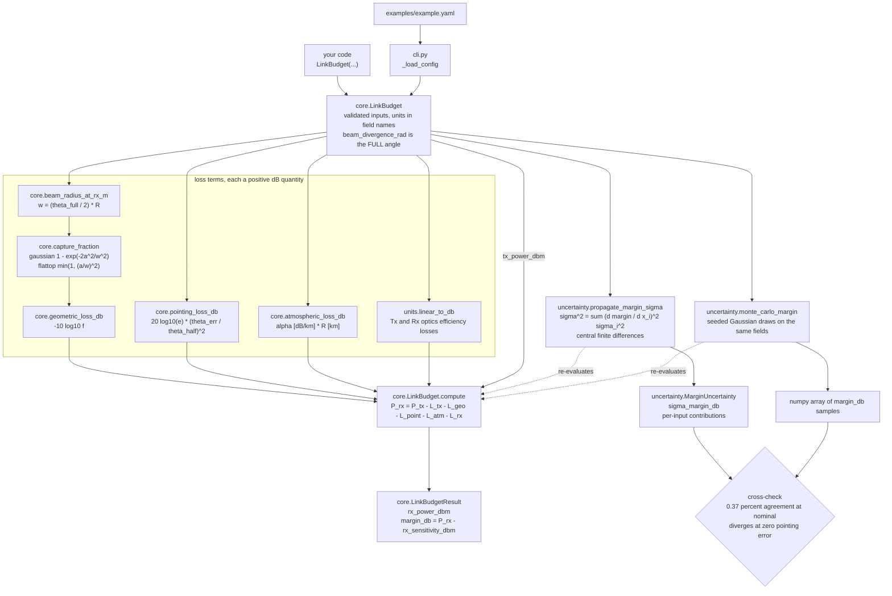
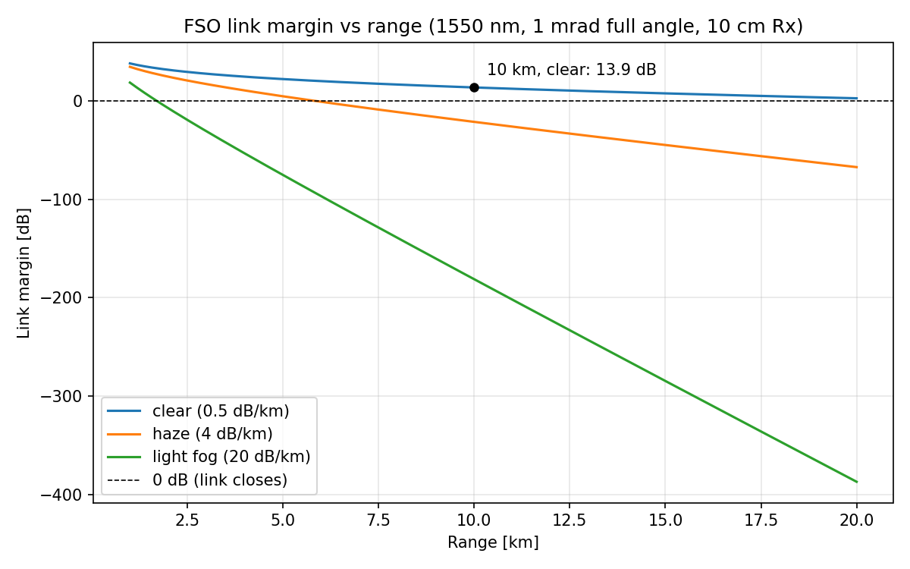
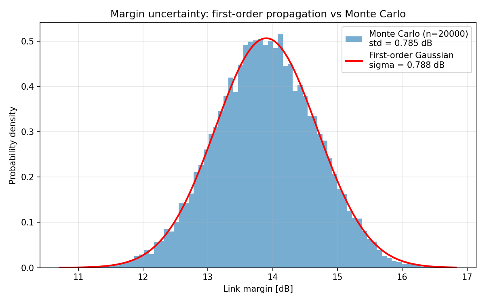

# linkbudgetx

Deterministic free-space optical link budgets with first-order uncertainty propagation.


## The problem

Sizing a free-space optical link starts with the same arithmetic every time: transmit
power, optics throughput, how much of the beam the receiver aperture actually catches,
what a pointing offset costs, what the air takes out, and whether what is left clears
the detector sensitivity. Everyone re-derives it, and the step people get wrong is the
angle convention — the pointing-loss form quoted throughout the FSO literature,
`exp(-2 θ_err² / θ_div²)`, uses the 1/e² **half** angle, while datasheets quote **full**
divergence, so feeding a full angle into the textbook formula understates the loss
exponent by a factor of four. The second thing people skip is asking how much the answer
moves when the inputs they know least well move.

## What this does

- Decomposes a link into **5 loss terms** — Tx optics, geometric spreading, pointing,
  atmospheric, Rx optics — and returns every intermediate in dB alongside `margin_db`,
  rather than a single number you cannot audit.
- Implements geometric spreading for **2 beam profiles**, Gaussian
  (`1 − exp(−2a²/w²)`) and flat-top (`min(1, (a/w)²)`), whose small-aperture ratio is
  checked against the analytic 3.010 dB = 10 log₁₀ 2 gap
  (`validation/known_answer_output.txt`).
- Fixes the angle convention in one place: inputs are the **full** divergence angle,
  every Gaussian formula internally uses θ_half = θ_full/2, and the choice is
  hand-verified at θ_err = θ_full/2 against 20 log₁₀ e = **8.685890 dB**
  (`validation/known_answer_output.txt`, |diff| = 0, tol 1e−9).
- Propagates 1-sigma uncertainties from any of **10 numeric input fields** to the margin
  by the delta method, reporting each input's separate contribution, with a seeded Monte
  Carlo cross-check agreeing to **0.37 %** at n = 20 000
  (`validation/mc_crosscheck_output.txt`).
- Ships **7 hand-calculated known-answer assertions** that reproduce at |diff| = 0 to
  tolerances of 1e−9 (dB) and 1e−12 (capture fraction), plus **54 passing tests**.

## Who it is for

- Anyone doing a first-cut FSO feasibility or trade study who wants the standard budget
  terms already written down and checked.
- Students and teaching staff who need the intermediate dB terms visible, not hidden
  inside a solver.
- Anyone who needs a defensible answer to "how sensitive is that margin to the pointing
  bias, the laser calibration, and the visibility estimate?"

## Who it is not for

- Anyone sizing an operational or fielded link. This is validation Level 1: hand
  calculations and internal consistency, with no comparison against measured link data.
- Anyone who needs turbulence, scintillation, beam wander, or pointing-jitter statistics.
  None of those are modelled.
- Anyone who needs SNR, BER, data rate, or receiver noise. The budget stops at received
  power versus a sensitivity you supply.
- Anyone who needs real dimensional analysis. Units here are a naming and documentation
  discipline — carried in field names such as `range_km` and validated for sign and
  range — not a type system that would catch you passing metres to a kilometre field.
- Anyone doing physical-optics propagation, near-field work, or lens design.

## Alternatives, honestly

The honest summary first. This library does not do anything `pint` and `uncertainties`
cannot do between them. What it gives you is a validated, cited implementation of the
standard FSO loss terms — with the full-angle versus half-angle convention pinned down
and hand-checked against known-answer cases — so that you neither re-derive the algebra
nor silently get the pointing exponent wrong by a factor of four. If that is not worth a
dependency to you, the table below is the honest route.

| Alternative | What it does better | When to use this instead |
|---|---|---|
| [`pint`](https://pypi.org/project/pint/) 0.25.3 | Real dimensional analysis: a quantity type, unit registry, automatic conversion, and errors when you add metres to seconds. This library has none of that. | When you want the FSO loss equations themselves. `pint` gives you units and no physics. The two compose — wrap these functions in `pint` quantities if you want checking. |
| [`uncertainties`](https://pypi.org/project/uncertainties/) 3.2.3 | Automatic first-order propagation through arbitrary Python expressions, including correlated inputs and a full covariance treatment. More general and less error-prone than the finite differences here. | When you want the loss model plus the Monte Carlo cross-check that shows *where first order stops working*. Note `uncertainties` has the same blind spot at a vanishing derivative — see Scenario 2 below. |
| [`astropy.units`](https://pypi.org/project/astropy/) (astropy 8.0.1) | Units, constants and astronomical quantities, maintained at a scale this will never match. | When you do not want an astronomy stack as a dependency for a dB sum. Same relationship as `pint`: units, not FSO physics. |
| [`freesopy`](https://pypi.org/project/freesopy/) 2.0.4 | Broader FSO and visible-light scope: SNR, shot and thermal noise, photocurrent, indoor line-of-sight and diffuse channel gain, and built-in plotting. It covers ground this does not. | When you want an explicit angle convention, hand-checked known-answer cases, uncertainty propagation, and a normal callable API. `freesopy`'s documented usage asks you to create `transmitter.py`, `receiver.py` and `environment.py` holding module-level variables and `import *` them, and it publishes no validation evidence. |
| [`scikit-commpy`](https://pypi.org/project/scikit-commpy/) 0.8.0 | Digital communications: modulation, channel coding, equalisation, BER. | Always, for the optical geometry — these are complementary, not competing. Use this for received power, `scikit-commpy` for what you do with it. |
| Ansys Zemax OpticStudio; Ansys STK (which ships its own [communication link budget calculator](https://stk.docs.pyansys.com/version/stable/examples/communication-link-calculator.html)) | Validated commercial tools with full physical optics, real geometry and orbital access, tolerancing, and support contracts. Not comparable in scope or in assurance. | Never, for operational work — use those. Use this to understand or teach the arithmetic, or for a fast trade sweep before committing to a licensed tool. |

## Install and first run

```bash
git clone https://github.com/OmAcharya-avtr/linkbudgetx.git
cd linkbudgetx
python -m venv .venv && source .venv/bin/activate
pip install -e ".[dev]"
python -m pytest tests/
python -m linkbudgetx --config examples/example.yaml
```

Two notes on that block. The extra is `dev`, not `test`; it carries pytest, hypothesis,
ruff and matplotlib. And `pyproject.toml` already sets `addopts = "-q"`, so adding your
own `-q` makes pytest doubly quiet and hides the summary line — run it bare as above.
Expected output of the last two commands, with elapsed time varying by machine:

```
......................................................                   [100%]
54 passed in 0.87s
```

```
FSO link budget
=========================================
Tx power                     +20.00 dBm
Tx optics loss                 -0.97 dB
Geometric spreading loss      -36.99 dB
Pointing loss                  -2.17 dB
Atmospheric loss               -5.00 dB
Rx optics loss                 -0.97 dB
Rx power                     -26.10 dBm
Rx sensitivity               -40.00 dBm
Link margin                   +13.90 dB
-----------------------------------------
Beam radius at Rx (1/e^2)           5 m
Aperture capture fraction        0.0002

Margin 1-sigma (first-order propagation): 0.788 dB
  tx_power_dbm                   +/- 0.500 dB
  atmos_attenuation_db_per_km    +/- 0.500 dB
  pointing_error_rad             +/- 0.347 dB
```

Add `--json` for the same content machine-readable. Bad input exits 2 with a message
naming the field.

## A worked example

This is validation Case 4, the hand-summed budget that is this library's whole
credibility argument. Every printed number below is reproduced by
`validation/known_answer_check.py` and `validation/mc_crosscheck.py`.

```python
from linkbudgetx import LinkBudget, monte_carlo_margin, propagate_margin_sigma

# beam_divergence_rad is the FULL 1/e^2 angle; the library halves it internally.
budget = LinkBudget(
    tx_power_dbm=20.0,
    wavelength_nm=1550.0,
    beam_divergence_rad=1.0e-3,
    range_km=10.0,
    rx_aperture_diameter_m=0.1,
    rx_sensitivity_dbm=-40.0,
    tx_optics_efficiency=0.8,
    rx_optics_efficiency=0.8,
    pointing_error_rad=0.25e-3,
    atmos_attenuation_db_per_km=0.5,
    beam_profile="gaussian",
)
result = budget.compute()
print(result.format_table())
print(f"\nmargin_db = {result.margin_db:.6f}   hand calculation = 13.900193")

sigmas = {
    "tx_power_dbm": 0.5,
    "atmos_attenuation_db_per_km": 0.05,
    "pointing_error_rad": 0.02e-3,
}
unc = propagate_margin_sigma(budget, sigmas)
print(f"\nfirst-order sigma = {unc.sigma_margin_db:.4f} dB")
for name, contrib in sorted(unc.contributions_db.items(), key=lambda kv: -kv[1]):
    print(f"  {name:<28} {contrib:.4f} dB")
print(f"Monte Carlo std   = {monte_carlo_margin(budget, sigmas, seed=2026).std(ddof=1):.4f} dB")
```

Actual output:

```
FSO link budget
=========================================
Tx power                     +20.00 dBm
Tx optics loss                 -0.97 dB
Geometric spreading loss      -36.99 dB
Pointing loss                  -2.17 dB
Atmospheric loss               -5.00 dB
Rx optics loss                 -0.97 dB
Rx power                     -26.10 dBm
Rx sensitivity               -40.00 dBm
Link margin                   +13.90 dB
-----------------------------------------
Beam radius at Rx (1/e^2)           5 m
Aperture capture fraction        0.0002

margin_db = 13.900193   hand calculation = 13.900193

first-order sigma = 0.7879 dB
  tx_power_dbm                 0.5000 dB
  atmos_attenuation_db_per_km  0.5000 dB
  pointing_error_rad           0.3474 dB
Monte Carlo std   = 0.7850 dB
```

Read the last two lines together: the analytic sigma and the 20 000-sample Monte Carlo
std agree to 0.37 %, which is the evidence that the linearisation is safe *at this
operating point*. It is not safe everywhere — see Scenario 2 in the evidence table.

## Architecture



Pure Python with numpy for the Monte Carlo and pyyaml for the CLI. No cross-product
imports.

## Screenshots

Both PNGs are produced by the repository's own examples, so they cannot drift from the
code.



`python examples/range_sweep.py`. Notice that the three curves are separated almost
entirely by the atmospheric term: the clear-air curve at 0.5 dB/km is still above the
dashed 0 dB line at the end of the 20 km sweep, while light fog at 20 dB/km drops off
the bottom of the plot within the first few kilometres. Geometric spreading alone is not
what limits a terrestrial link — the visibility estimate is, which is precisely the
input you know least well and the reason the uncertainty machinery exists. The marked
point is the hand-verified case at 13.9 dB.



`python examples/uncertainty_demo.py`. Notice how closely the red first-order Gaussian
(sigma 0.788 dB) tracks the Monte Carlo histogram (std 0.785 dB). This figure is what
"the linearisation holds here" looks like; the honest companion result is that at zero
nominal pointing error the same comparison fails outright, and that case is documented
rather than hidden.

## Validation evidence

Level 1, educational. Raw output is committed at
`validation/known_answer_output.txt` and `validation/mc_crosscheck_output.txt`; the
worked derivations are in `validation/VALIDATION.md`. Baseline throughout: 20 dBm at
1550 nm, 1.0 mrad full divergence, 10 km, 0.1 m aperture, 0.8/0.8 optics, 0.5 dB/km,
−40 dBm sensitivity.

| Check | Reference for the equation | Hand value | Library | Tolerance | Result |
|---|---|---|---|---|---|
| Flat-top geometric loss | uniform disc, `f = (a/θ_half R)²` | 40.000000 dB | 40.000000 dB | 1e−9 | PASS, diff 0 |
| Gaussian capture fraction | Saleh & Teich, *Fundamentals of Photonics*, 2nd ed., Ch. 3 | 1.9998000e−4 | 1.9998000e−4 | 1e−12 | PASS, diff 0 |
| Gaussian geometric loss | Saleh & Teich, 2nd ed., Ch. 3 | 36.990134 dB | 36.990134 dB | 1e−9 | PASS, diff 0 |
| Gaussian vs flat-top gap (small aperture) | analytic 10 log₁₀ 2 | 3.010 dB | 3.010 dB | consistency check | PASS |
| Pointing loss at θ_err = θ_full/2 | Majumdar & Ricklin, *Free-Space Laser Communications*, Springer 2008 | 8.685890 dB (= 20 log₁₀ e) | 8.685890 dB | 1e−9 | PASS, diff 0 |
| Pointing loss at θ_err = 0 | same, exact limit | 0.000000 dB | 0.000000 dB | 0 (exact) | PASS, diff 0 |
| Full budget, Rx power | Friis 1946, Proc. IRE 34, adapted to optics | −26.099807 dBm | −26.099807 dBm | 1e−9 | PASS, diff 0 |
| Full budget, link margin | as above | +13.900193 dB | +13.900193 dB | 1e−9 | PASS, diff 0 |
| **Scenario 1** — first-order sigma vs Monte Carlo, n = 20 000, seed 2026, nominal pointing 0.25 mrad | JCGM 100:2008 (GUM) Sec. 5.1 | 0.7879 dB (first order) | 0.7850 dB (MC std) | 5 % | PASS at 0.37 % |
| **Scenario 2** — same, nominal pointing error 0 | JCGM 100:2008 Sec. 5.1 | 0.0000 dB (first order) | 0.1221 dB (MC std) | — | **Method fails, as expected** |

Scenario 2 is the credible one. Pointing loss is quadratic in the offset, so at zero
nominal pointing error the first derivative vanishes and delta-method propagation
reports zero uncertainty contribution from jitter that plainly costs margin — it also
misses the −0.0877 dB mean shift. This is a failure of the linear method, not of the
implementation, and it is the reason `monte_carlo_margin()` exists. Any tool that
propagates first-order derivatives, `uncertainties` included, has the same blind spot at
this operating point.

Test suite: `python -m pytest tests/` → 54 passed, 0 failed, 0 skipped.

## API reference

<details>
<summary><code>linkbudgetx</code> public surface (15 exported names)</summary>

**Model**

- `LinkBudget(...)` — frozen-on-construction input dataclass, 11 fields, validated in
  `__post_init__`; raises `ValueError` naming the offending field.
- `LinkBudget.beam_radius_at_rx_m() -> float` — 1/e² beam radius at the receiver [m],
  far field, `(θ_full/2)·R`.
- `LinkBudget.capture_fraction() -> float` — dimensionless fraction in (0, 1] caught by
  a centred aperture.
- `LinkBudget.geometric_loss_db() -> float` — spreading loss [dB, ≥ 0].
- `LinkBudget.pointing_loss_db() -> float` — static radial offset loss [dB, ≥ 0].
- `LinkBudget.atmospheric_loss_db() -> float` — `α[dB/km]·R[km]` [dB, ≥ 0].
- `LinkBudget.compute() -> LinkBudgetResult` — the full budget.
- `LinkBudget.replace(**changes) -> LinkBudget` — validated copy, used for sweeps.
- `LinkBudgetResult` — 11 float fields; `.as_dict()` and `.format_table()`.
- `BEAM_PROFILES` — `("gaussian", "flattop")`.

**Input fields and units**

`tx_power_dbm` [dBm] · `wavelength_nm` [nm, > 0, informational] ·
`beam_divergence_rad` [rad, FULL angle, > 0] · `range_km` [km, > 0] ·
`rx_aperture_diameter_m` [m, > 0] · `rx_sensitivity_dbm` [dBm] ·
`tx_optics_efficiency` and `rx_optics_efficiency` [dimensionless, in (0, 1]] ·
`pointing_error_rad` [rad, ≥ 0] · `atmos_attenuation_db_per_km` [dB/km, ≥ 0] ·
`beam_profile` [str].

**Uncertainty**

- `propagate_margin_sigma(budget, sigmas, rel_step=1e-4) -> MarginUncertainty` —
  delta method over any of the 10 numeric fields; `sigmas` are 1-sigma in each field's
  own units.
- `monte_carlo_margin(budget, sigmas, n_samples=20000, seed=0, max_redraws=100) -> np.ndarray`
  — margin samples [dB].
- `MarginUncertainty` — `.margin_db`, `.sigma_margin_db`, `.partials`,
  `.contributions_db`, all in dB or dB per field unit.

**Units (8 exact algebraic identities, no physics)**

`dbm_to_watts` [dBm→W] · `watts_to_dbm` [W→dBm, raises on ≤ 0] ·
`db_to_linear` · `linear_to_db` [raises on ≤ 0] · `nm_to_m` · `m_to_nm` ·
`km_to_m` · `m_to_km`.

</details>

## Limitations

- **Far field only.** Every formula assumes range far exceeds the Rayleigh range
  `z_R = π w₀²/λ`. No near-field, defocus, or focused-beam modelling, and the library
  does not check the assumption for you.
- **Wavelength does not enter the numbers.** `wavelength_nm` is validated as positive
  and documented, but the model is parameterised by divergence, so 850 nm and 1550 nm
  return an identical margin for the same geometry. Treat it as a label until a
  diffraction-limited divergence helper exists.
- **Pointing loss assumes a small receiver** (a ≪ w). For apertures comparable to the
  beam, truncation and offset couple and the multiplicative `f_geo · f_point` treatment
  is only approximate. Applying the Gaussian pointing form to a flat-top profile is a
  deliberate first-order approximation.
- **Only a centred aperture and a static radial offset** are modelled. No jitter
  statistics, no Rayleigh-distributed radial jitter, no time series.
- **Atmosphere is one user-supplied scalar** in dB/km. No turbulence, scintillation,
  beam wander, cloud, or wavelength-dependent attenuation model is included; the Kim
  et al. 2001 visibility work is cited as context for choosing your own value, not
  implemented.
- **First-order propagation assumes near-linearity over ±3σ** and independent Gaussian
  inputs. It fails at curvature-dominated points, demonstrably so at zero nominal
  pointing error (Scenario 2 above). There is no correlation or covariance support.
- **Monte Carlo redraws unphysical samples**, which is truncated-Gaussian behaviour and
  biases results if a sigma is large relative to its nominal or sits near a hard bound.
- **Deliberately out of scope:** SNR, BER, data rate, receiver noise, modulation,
  coding, orbital or platform geometry, acquisition and tracking, and any form of
  physical-optics propagation.
- **Validation is Level 1.** Hand calculations and internal consistency only. Nothing
  here has been compared against measured link data or against a professional tool.

## Reproducing every number

Every figure in this README comes from one of these four commands, run from a clean
checkout after `pip install -e ".[dev]"`.

```bash
# 54 passing tests (badge, evidence table)
python -m pytest tests/

# 7 known-answer assertions: 40.000000, 36.990134, 8.685890,
# -26.099807, 13.900193 dB, all at |diff| = 0
python validation/known_answer_check.py

# Scenario 1 (0.7879 vs 0.7850 dB, 0.37 %) and Scenario 2 (0.0000 vs 0.1221 dB)
python validation/mc_crosscheck.py

# The two screenshots, plus the 13.900 dB and 0.788 / 0.785 dB figures
python examples/range_sweep.py
python examples/uncertainty_demo.py
```

Committed raw output for the two validation scripts sits beside them in
`validation/*_output.txt`, so any drift is visible in a diff.

## Safety statement

This software is research-grade and educational. It is not flight-qualified, not
certified, and not approved for operational aerospace use.

## Licence

MIT — see `LICENSE`. Copyright © 2026 OPTIMA Organisation.

## Citation

```
OPTIMA Organisation (2026). linkbudgetx: deterministic free-space optical
link-budget library (v0.1.0) [Computer software]. Educational validation level 1.
```

## References

- B. E. A. Saleh & M. C. Teich, *Fundamentals of Photonics*, 2nd ed., Wiley — Gaussian
  beam optics: divergence and aperture transmission.
- A. K. Majumdar & J. C. Ricklin (eds.), *Free-Space Laser Communications: Principles
  and Advances*, Springer, 2008 — FSO link-budget structure and pointing-error
  treatment.
- H. T. Friis, "A Note on a Simple Transmission Formula", Proc. IRE 34, 1946 — the
  budget concept adapted here to optics.
- I. I. Kim, B. McArthur, E. Korevaar, "Comparison of laser beam propagation at 785 nm
  and 1550 nm in fog and haze for optical wireless communications", Proc. SPIE 4214,
  2001 — context for choosing a dB/km value.
- JCGM 100:2008 (GUM), Sec. 5.1 — first-order uncertainty propagation for uncorrelated
  inputs.

No page numbers are quoted because none were verified against physical copies.

## Credits

This is under reserved rights obtained by OPTIMA Organisation.
