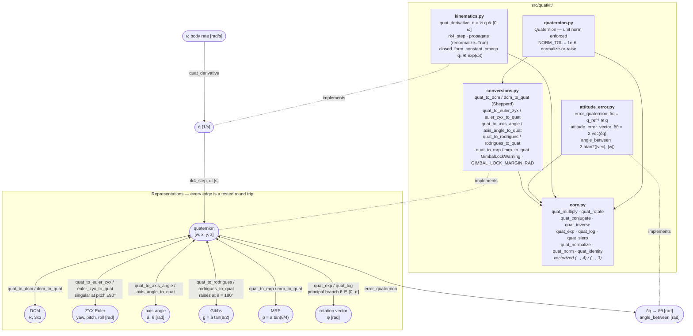
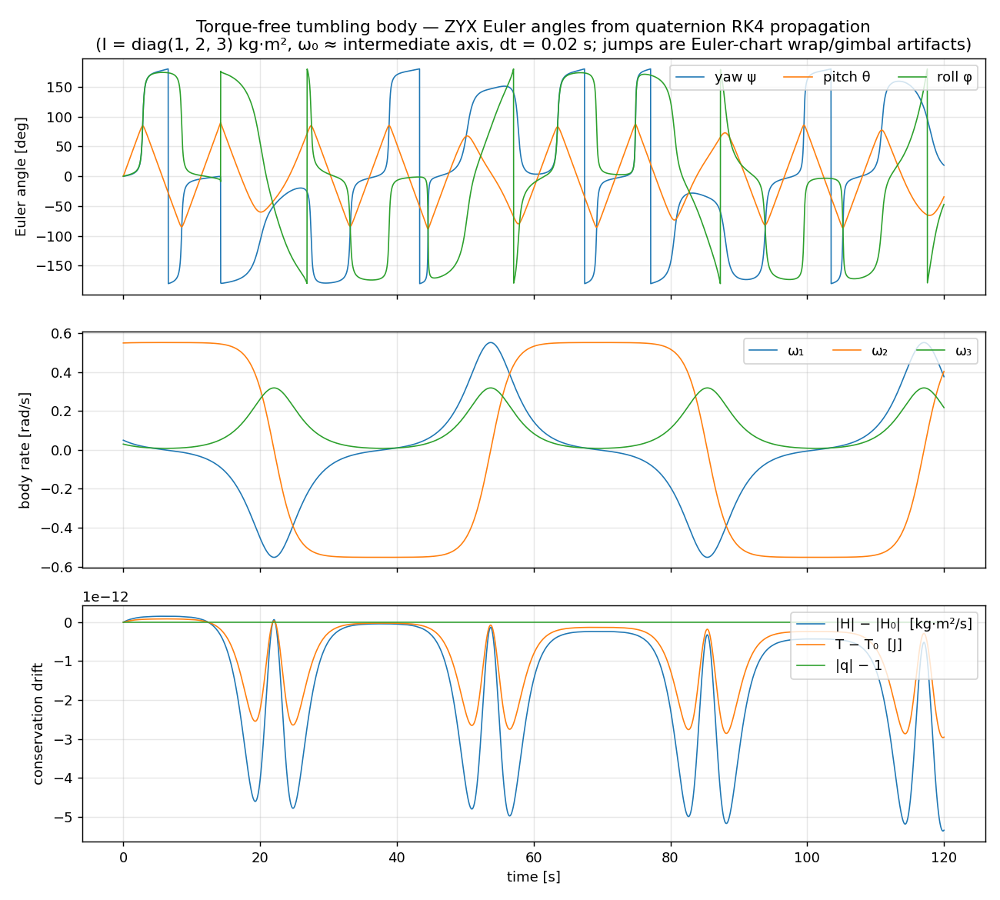
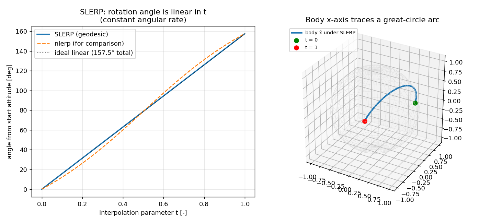

# QuatKit

Quaternion and attitude-representation toolbox for aerospace GNC, in one stated convention.


> **Convention, before anything else.** Quaternions are **scalar-first** `q = [w, x, y, z]`,
> compose under the **Hamilton product** (`i j = k`), and act as **active rotations**
> `v' = q ⊗ [0, v] ⊗ q* = R(q) v`. Euler angles are the aerospace **ZYX (yaw–pitch–roll)**
> intrinsic sequence, in radians. `scipy.spatial.transform.Rotation` stores quaternions
> scalar-last by default; convert with `np.roll(q, -1)` / `np.roll(q, 1)`, or pass
> `scalar_first=True` on SciPy 1.14 and later.

## The problem

Attitude gets stored one way, propagated another, and logged in a third, and every
parameterization has a sharp edge: Euler angles gimbal-lock at ±90° pitch, Gibbs vectors
diverge at 180°, and quaternions carry both a unit-norm constraint and a sign double cover.
The errors that survive review are almost never in the algebra — they are scalar-first read
as scalar-last, Hamilton read as JPL, or an active rotation applied where a passive one was
meant, and they show up as a sign that is wrong only for some attitudes. QuatKit fixes one
convention, states it in every docstring, and checks every conversion against
hand-computable rotations, against `scipy.spatial.transform.Rotation`, and against algebraic
identities under randomized inputs.

## What this does

- **Six representations, all round-tripped under test**: quaternion, DCM, ZYX Euler,
  axis-angle, Gibbs (Rodrigues) vector, MRP. Round-trip agreement with the source attitude is
  below 1e-9 rad on every property test, and `dcm_to_quat` (Shepperd's max-component method)
  recovers a scipy-generated matrix to **5.011e-16 rad** over 1000 random attitudes.
- **Agreement with `scipy.spatial.transform.Rotation` at rounding level**: max deviation
  **9.992e-16** on DCM elements, **2.665e-15** on rotated vector components, **1.998e-15 rad**
  on ZYX Euler angles, over N = 1000 random attitudes at seed 20260801.
- **Attitude kinematics with measured order**: RK4 on `q̇ = ½ q ⊗ [0, ω]`, verified against the
  closed-form constant-ω solution — **2.764e-10 rad** max angle error at dt = 0.05 s over 60 s,
  observed convergence order **4.00, 4.00, 4.00**.
- **A documented renormalization strategy, with the numbers**: unit-norm drift over 60 s is
  **7.735e-13** with `renormalize=False` and **2.220e-16** with the per-step default.
- **Multiplicative attitude error for estimator work**: `δq = q_ref⁻¹ ⊗ q`, the MEKF
  `δθ = 2·vec(δq)` error vector, and an exact `angle_between` using `2·atan2(|vec|, |w|)`
  rather than `2·acos(w)`, which is better conditioned near zero separation.
- **12 algebraic identities checked under Hypothesis**, up to 2300 generated examples per run;
  **89 tests pass** in about 3 s.

## Who this is for

- Students and engineers learning or prototyping attitude dynamics, MEKF-style error-state
  estimation, and attitude control.
- Anyone who needs the aerospace ZYX convention and the multiplicative error definitions
  written down in the code rather than reconstructed from a paper.
- Instructors building GNC exercises where the convention has to be unambiguous and the
  numerical evidence has to be inspectable.

## Who this is not for

- Anyone who just needs rotations to work. Use `scipy.spatial.transform.Rotation`.
- Anyone needing performance. No timing claim in this repository has been benchmarked against
  an alternative, and none is made.
- Anyone needing sensor fusion, Madgwick/Mahony/EKF attitude estimation, magnetic or geodetic
  models. None of that is here; see `ahrs`.
- Flight software of any kind. See the safety statement.

## Alternatives, honestly

**Most readers should use `scipy.spatial.transform.Rotation`.** It covers quaternions,
rotation matrices, Euler angles, rotation vectors and MRPs; it is vectorized; it accepts
`scalar_first=True` on SciPy 1.14 and later; it ships inside a dependency almost every
scientific Python user already has installed; and it has been exercised by orders of magnitude
more users than this repository ever will be. QuatKit is validated *against* `Rotation`
precisely because `Rotation` is the reference implementation, and the two agree to 9.992e-16
on DCM elements and 2.665e-15 on rotated vectors, so there is no accuracy argument for
preferring QuatKit.

The narrow case where QuatKit is the better fit is this: you want the aerospace-specific
attitude-error conventions (`δq = q_ref⁻¹ ⊗ q`, the `2·vec(δq)` MEKF error vector, exact
`angle_between`) as named functions rather than something you rebuild each project; you want
the frame and ordering conventions handled explicitly rather than by parameter — one
scalar-first Hamilton active convention, a constructor that raises rather than silently
renormalizes, and a typed `GimbalLockWarning` you can promote to an error with
`warnings.simplefilter("error", GimbalLockWarning)`; and you want the algebraic identities
checked by Hypothesis property tests against analytic results rather than by fixed test
vectors. SciPy also has no attitude-kinematics propagation, which is a capability gap rather
than a quality claim.

| Alternative | What it does better | When to use QuatKit instead |
|---|---|---|
| [`scipy.spatial.transform.Rotation`](https://docs.scipy.org/doc/scipy/reference/generated/scipy.spatial.transform.Rotation.html) | Everything most people need. Vectorized, maintained, already installed, far more widely exercised. Has `Slerp`, `align_vectors`, Davenport angles. | You want named aerospace error-angle functions, one enforced convention, or `q̇ = ½ q ⊗ [0, ω]` propagation. |
| [`numpy-quaternion`](https://github.com/moble/quaternion) (2024.0.13) | A real quaternion dtype for NumPy with compiled ufuncs; the fastest option for large arrays. | You want the aerospace conversions and error conventions rather than a numeric dtype, and can accept plain NumPy arrays. |
| [`transforms3d`](https://github.com/matthew-brett/transforms3d) (0.4.2) | Full affine transforms — compose/decompose translation, zoom, shear; many Euler sequences; SymPy-derived documentation. | You need attitude propagation or MEKF error states, which are outside its scope. |
| [`pyquaternion`](http://kieranwynn.github.io/pyquaternion/) (0.9.9) | A clean pure-Python object API for a single quaternion, with SLERP and derivatives. | You need broadcasting over `(..., 4)` arrays, or current maintenance — its last release was 2020. |
| [`ahrs`](https://github.com/Mayitzin/ahrs) (0.4.0) | Attitude *estimation*: 16+ filters (Madgwick, Mahony, EKF, QUEST), WMM, WGS84. A different problem. | You have attitude already and need representation, conversion and propagation, not sensor fusion. |
| [`squaternion`](https://github.com/the-guild-of-calamitous-intent/squaternion) (2025.3.2) | Zero dependencies, not even NumPy. Good for constrained embedded-adjacent code. | You need DCM conversions, MRP/Gibbs, propagation, or vectorized operation. |

## Install and first run

```bash
git clone https://github.com/OmAcharya-avtr/quatkit.git
cd quatkit
python -m venv .venv && source .venv/bin/activate
pip install -e .
pip install pytest hypothesis matplotlib     # tests and examples
python -m pytest tests/ -q
python examples/slerp_demo.py
```

`pyproject.toml` declares no optional dependency groups, so the test and plotting packages are
installed on the second `pip` line rather than through an extra.

Expected output:

```
........................................................................ [ 80%]
.................                                                        [100%]
89 passed in 3.01s
```

```
saved /path/to/quatkit/screenshots/slerp_interpolation.png
max deviation of SLERP angle from linear ramp: 4.44e-16 rad
```

The second example, `python examples/tumbling_body.py`, prints:

```
saved /path/to/quatkit/screenshots/tumbling_euler_angles.png
max |q|-1 during propagation: 2.22e-16
|H| drift: 5.37e-12 kg m^2/s, T drift: 2.97e-12 J
```

## Worked example

```python
import numpy as np
from quatkit import (Quaternion, angle_between, attitude_error_vector,
                     closed_form_constant_omega, propagate)

np.set_printoptions(precision=6, suppress=True)

# Commanded attitude: yaw 30 deg, pitch -10 deg, roll 5 deg (ZYX, radians).
q_cmd = Quaternion.from_euler_zyx(np.radians(30.0), np.radians(-10.0), np.radians(5.0))
print("q_cmd            ", q_cmd.as_array())
print("body x in ref    ", q_cmd.rotate([1.0, 0.0, 0.0]))

# Estimated attitude: the command with a small 3-axis attitude error injected.
q_est = q_cmd * Quaternion.exp(np.array([0.002, -0.001, 0.0015]))
print("error vector rad ", attitude_error_vector(q_est.as_array(), q_cmd.as_array()))
print("error angle deg  ", np.degrees(angle_between(q_est.as_array(), q_cmd.as_array())))

# Propagate the commanded attitude at a constant body rate for 60 s.
omega = np.array([0.10, 0.20, -0.15])          # rad/s, body frame
times = np.arange(0.0, 60.0 + 1e-9, 0.05)      # s
qs = propagate(q_cmd.as_array(), lambda t: omega, times)
q_ref = closed_form_constant_omega(q_cmd.as_array(), omega, times)
print("RK4 vs closed form, max angle err rad %.3e" % np.max(angle_between(qs, q_ref)))
print("max ||q| - 1|                          %.3e"
      % np.max(np.abs(np.linalg.norm(qs, axis=1) - 1.0)))

# Final attitude, back out to Euler angles and the first DCM row.
print("final euler deg  ", np.degrees(Quaternion.from_array(qs[-1]).to_euler_zyx()))
print("final DCM row 0  ", Quaternion.from_array(qs[-1]).to_dcm()[0])
```

Actual output:

```
q_cmd             [ 0.96035   0.064509 -0.072859  0.261261]
body x in ref     [0.852869 0.492404 0.173648]
error vector rad  [ 0.002  -0.001   0.0015]
error angle deg   0.15427360771559062
RK4 vs closed form, max angle err rad 2.764e-10
max ||q| - 1|                          2.220e-16
final euler deg   [ 159.26657     6.656092 -119.120467]
final DCM row 0   [-0.928934  0.266984 -0.256518]
```

The recovered error vector reproduces the injected rotation vector to the printed precision,
because `δθ = 2·vec(δq)` and `Quaternion.exp` are inverse to O(θ³). The RK4 figure matches the
`dt = 0.05 s` row of the validation table exactly; the same integrator, the same reference.

## Architecture



## Screenshots

Both images are produced by the examples in this repository, so they cannot drift from the code.



`examples/tumbling_body.py`. Notice the bottom panel: `|q| − 1` is a flat line at machine
precision (2.22e-16) while the vertical jumps in the top panel run to ±180°. Those jumps are
the Euler chart wrapping and passing through gimbal, not the quaternion propagation failing —
that separation is the point of the figure.



`examples/slerp_demo.py`. Notice that the SLERP curve lies on the dotted ideal ramp (deviation
4.4e-16 rad over a 157.5° reorientation) while the dashed nlerp curve bows away from it in the
middle of the interval — nlerp reaches the same endpoints at a non-constant angular rate.

## Validation evidence

Level 1 (Educational). Every number below comes from a script in `validation/` with its raw
console output committed alongside. Environment of record: Python 3.11.15, numpy 2.4.4,
scipy 1.17.1. Full write-up in [`validation/VALIDATION.md`](validation/VALIDATION.md).

### Analytic and cross-library checks

| Check | Reference | Result | Tolerance | What it proves |
|---|---|---|---|---|
| 9 principal-axis vector rotations (90°/180°) | Right-hand rule, hand-computed | **2.220e-16** worst component | 1e-15 | The active-rotation sign convention is the stated one, not its transpose |
| 3 hand-written 90° DCMs | Elementary rotation matrices | **2.220e-16** worst element | 1e-15 | `quat_to_dcm` produces the active matrix, matching `Rotation.as_matrix()` |
| `quat_to_dcm` vs `Rotation.as_matrix()` | scipy 1.17.1, N = 1000, seed 20260801 | **9.992e-16** max element | 1e-12 | Independent-implementation agreement on the quaternion → matrix map |
| `dcm_to_quat` (Shepperd 1978) vs source quaternion | scipy-generated matrices, N = 1000 | **5.011e-16 rad** angle error | 1e-12 | The max-component inverse is stable across all four branches and resolves the double cover |
| `quat_rotate` vs `Rotation.apply()` | scipy, N = 1000 | **2.665e-15** max component | 1e-12 | Vector rotation matches without forming the matrix |
| `quat_to_euler_zyx` vs `as_euler('ZYX')` | scipy, 986 of 1000 samples outside \|sin θ\| < 0.99 | **1.998e-15 rad** | 1e-12 | The ZYX sequence and angle ordering are scipy's, away from the singularity |
| RK4 vs `q(t) = q₀ ⊗ exp(ωt)`, dt = 0.40 s | Markley & Crassidis 2014 Eq. 3.25 | **1.131e-06 rad** | — | Baseline for the convergence study |
| RK4 vs closed form, dt = 0.20 s | as above | **7.075e-08 rad** | — | |
| RK4 vs closed form, dt = 0.10 s | as above | **4.422e-09 rad** | — | |
| RK4 vs closed form, dt = 0.05 s | as above | **2.764e-10 rad** | < 1e-9 rad | The integrator is accurate at the recommended step for \|ω\| = 0.2693 rad/s |
| Observed convergence order | log₂ of successive error ratios | **4.00, 4.00, 4.00** | > 3.5 | The implementation is genuinely 4th-order globally, not 2nd-order with a small constant |
| Unit-norm drift, 60 s, `renormalize=False` | — | **7.735e-13** | — | Quantifies the constraint drift the strategy exists to remove |
| Unit-norm drift, 60 s, `renormalize=True` | — | **2.220e-16** | < 1e-14 | Per-step projection holds the constraint at machine precision |
| Angular momentum drift, tumbling example | Torque-free constant of motion | **5.4e-12 kg·m²/s** | — | The ω trajectory driving the attitude is itself converged |
| Kinetic energy drift, tumbling example | Torque-free constant of motion | **3.0e-12 J** | — | As above, second independent invariant |
| SLERP angle vs linear ramp | Shoemake 1985 geodesic property | **4.4e-16 rad** over 157.5° | — | SLERP is a constant-rate geodesic, not a reparameterized one |

No check failed and no tolerance was loosened during the build. The honest caveat is in the
Euler row: 14 of the 1000 random samples are masked by the conservative `|sin θ| < 0.99` guard,
because inside gimbal the third angle is not determined. Those cases are covered separately by
`tests/test_conversions.py::TestGimbalLock`, which verifies that the returned triple still
reconstructs the correct attitude.

### Hypothesis property tests

`tests/test_properties.py`. Inputs are randomly generated unit quaternions and vectors; each
property is checked against an analytic identity, not against a stored expected value. Up to
2300 examples per run (eleven properties at `max_examples=200`, one at 100).

| Property | Identity | Tolerance | What it proves |
|---|---|---|---|
| `test_product_of_units_is_unit` | \|q₁ ⊗ q₂\| = 1 | 1e-12 | The unit 3-sphere is closed under the Hamilton product as implemented |
| `test_q_times_inverse_is_identity` | q ⊗ q* = [1, 0, 0, 0] | 1e-12 | Conjugate is the inverse for unit q; the vector-part sign is right |
| `test_rotation_preserves_norm` | \|q v q*\| = \|v\| | 1e-10 | `quat_rotate` is an isometry, so the expanded form has no scale error |
| `test_rotation_is_linear_and_preserves_dot` | (Ru)·(Rv) = u·v | 1e-9 | The rotation is orthogonal, not merely norm-preserving on single vectors |
| `test_dcm_orthogonality` | RᵀR = I, det R = +1 | 1e-12 | `quat_to_dcm` returns a proper rotation, never a reflection |
| `test_dcm_roundtrip` | q → R → q | 1e-10 rad | Shepperd's inverse is correct on every branch the random inputs reach |
| `test_euler_roundtrip` | q → (ψ, θ, φ) → q, skipping \|sin θ\| > 0.99 | 1e-9 rad | The ZYX chart is invertible away from gimbal lock |
| `test_mrp_roundtrip` | q → p → q | 1e-10 rad | The principal MRP set \|p\| ≤ 1 is selected consistently through the double cover |
| `test_rodrigues_roundtrip` | q → g → q, skipping \|w\| < 1e-2 | 1e-9 rad | The Gibbs map is correct away from its 180° pole |
| `test_exp_log_roundtrip` | log(exp(φ)) = φ for \|φ\| < π | 1e-9 | The principal branch is consistent and small-angle series limits do not lose accuracy |
| `test_exp_produces_unit` | \|exp(φ)\| = 1 | 1e-12 | The exponential map lands on the unit sphere for arbitrary rotation vectors |
| `test_slerp_output_is_unit_and_bounded` | \|q(t)\| = 1 and ∠(q(t), q₀) ≤ ∠(q₁, q₀) | 1e-10 / 1e-7 | SLERP stays on the sphere and never overshoots the short arc |

Full suite: **89 tests passing** — 32 in `test_conversions.py`, 32 in `test_quaternion.py`,
13 in `test_kinematics_error.py`, 12 in `test_properties.py`.

## API reference

<details>
<summary><b>Array API</b> — plain NumPy, broadcasting over leading axes</summary>

| Function | Signature | Units |
|---|---|---|
| `quat_identity` | `() -> (4,)` | dimensionless |
| `quat_norm` | `(q) -> (...,)` | dimensionless |
| `quat_normalize` | `(q) -> (..., 4)` | dimensionless |
| `quat_multiply` | `(q1, q2) -> (..., 4)` | Hamilton product; `quat_multiply(q2, q1)` is "q1 then q2" |
| `quat_conjugate` | `(q) -> (..., 4)` | dimensionless |
| `quat_inverse` | `(q) -> (..., 4)` | dimensionless |
| `quat_rotate` | `(q, v) -> (..., 3)` | preserves the units of `v` |
| `quat_exp` | `(rotvec) -> (..., 4)` | input rad |
| `quat_log` | `(q) -> (..., 3)` | output rad, principal branch [0, π] |
| `quat_slerp` | `(q0, q1, t) -> (4,)` or `(n, 4)` | `t` dimensionless in [0, 1] |

</details>

<details>
<summary><b>Conversions</b></summary>

| Function | Signature | Units and notes |
|---|---|---|
| `quat_to_dcm` | `(q) -> (..., 3, 3)` | active rotation matrix; attitude matrix is its transpose |
| `dcm_to_quat` | `(dcm, atol=1e-6) -> (4,)` | Shepperd 1978; raises if not orthogonal with det +1 |
| `euler_zyx_to_quat` | `(yaw, pitch, roll) -> (4,)` | rad |
| `quat_to_euler_zyx` | `(q) -> (..., 3)` | rad, order (yaw, pitch, roll); emits `GimbalLockWarning` |
| `axis_angle_to_quat` | `(axis, angle) -> (4,)` | angle rad, axis normalized internally |
| `quat_to_axis_angle` | `(q) -> (axis, angle)` | angle rad in [0, π] |
| `quat_to_rodrigues` | `(q) -> (..., 3)` | dimensionless, `g = â tan(θ/2)`; raises at 180° |
| `rodrigues_to_quat` | `(g) -> (..., 4)` | dimensionless |
| `quat_to_mrp` | `(q) -> (..., 3)` | dimensionless, `p = â tan(θ/4)`, principal set \|p\| ≤ 1 |
| `mrp_to_quat` | `(p) -> (..., 4)` | dimensionless |
| `GIMBAL_LOCK_MARGIN_RAD` | `1e-6` | warning margin on \|sin θ\| = 1 |
| `GimbalLockWarning` | `UserWarning` subclass | promote with `warnings.simplefilter("error", GimbalLockWarning)` |

</details>

<details>
<summary><b>Attitude error and kinematics</b></summary>

| Function | Signature | Units and notes |
|---|---|---|
| `error_quaternion` | `(q, q_ref) -> (..., 4)` | `δq = q_ref⁻¹ ⊗ q`, scalar part forced non-negative |
| `attitude_error_vector` | `(q, q_ref) -> (..., 3)` | rad to O(θ³); magnitude is 2 sin(θ/2), saturates at 2 |
| `angle_between` | `(q, q_ref) -> (...,)` | rad in [0, π], exact |
| `quat_derivative` | `(q, omega) -> (..., 4)` | `omega` rad/s in body axes; output 1/s |
| `rk4_step` | `(q, t, dt, omega_fn) -> (4,)` | `t`, `dt` in s; result not renormalized |
| `propagate` | `(q0, omega_fn, times, renormalize=True) -> (n, 4)` | `times` s, strictly increasing; grid spacing is the step size |
| `closed_form_constant_omega` | `(q0, omega, t) -> (4,)` or `(n, 4)` | exact for constant ω; the RK4 reference |

</details>

<details>
<summary><b><code>Quaternion</code> class</b> — single unit quaternion, invariants enforced</summary>

Constructors: `Quaternion(w, x, y, z, normalize=False)`, `.identity()`, `.from_array()`,
`.from_axis_angle(axis, angle)`, `.from_dcm(dcm)`, `.from_euler_zyx(yaw, pitch, roll)`,
`.from_rodrigues(g)`, `.from_mrp(p)`, `.exp(rotvec)`.

Properties: `.w`, `.x`, `.y`, `.z`, `.vec`, `.norm`.

Methods: `.as_array()`, `.conjugate()`, `.inverse()`, `.normalized()`, `.rotate(v)`, `.log()`,
`.slerp(other, t)`, `.to_dcm()`, `.to_euler_zyx()`, `.to_axis_angle()`, `.to_rodrigues()`,
`.to_mrp()`, `.isclose(other, atol=1e-9)`, `__mul__`.

Normalization policy: the constructor **raises `ValueError`** if the input is more than
`NORM_TOL = 1e-6` from unit norm, unless `normalize=True` is passed. Inputs inside the
tolerance are silently renormalized to machine precision. A non-unit quaternion cannot reach
`rotate()` unnoticed.

</details>

## Limitations

- **Level 1, educational.** Validated against analytic results and against scipy. Not against
  flight data, not against an independent professional GNC tool, not against hardware.
- **No estimation, no dynamics.** There is no filter, no sensor model, no rigid-body dynamics
  in the library API. Euler's equations appear in `examples/tumbling_body.py` only. For
  attitude estimation from IMU data, use `ahrs`.
- **Fixed-step RK4 only.** No adaptive step control, no dense output, no symplectic or
  Lie-group integrator. The measured accuracy above is for `dt · |ω| ≈ 0.013 rad`; the
  documented rule of thumb is `dt · |ω| ≲ 0.1 rad`.
- **Partial vectorization.** `dcm_to_quat` and `quat_to_axis_angle` loop internally over
  batched input. `quat_slerp` interpolates one quaternion pair over an array of `t`, not an
  array of pairs. For large-array quaternion arithmetic, `numpy-quaternion` is the right tool.
- **One Euler sequence.** Aerospace ZYX only. No ZXZ, XYZ, or other sequences, and no passive
  or JPL-convention interoperability helpers beyond the documented `np.roll` conversion. If
  you need many sequences, use `transforms3d` or scipy's `from_euler`.
- **Gibbs vectors raise at 180°** and MRPs use the principal set only; neither shadow-set
  switching nor a 360° MRP branch is implemented.
- **No performance claims.** Nothing here has been benchmarked against an alternative
  implementation, so no speed comparison is offered and none should be inferred.

## Reproducing every number

Run from the repository root, with the environment from the install section.

```bash
python validation/check_known_rotations.py    # 12/12 cases, worst 2.220e-16
python validation/check_scipy_cross.py        # N = 1000, seed 20260801, all four deviations
python validation/check_rk4_vs_analytic.py    # four step sizes, order, norm drift
python -m pytest tests/ -q                    # 89 passed
python -m pytest tests/test_properties.py -q  # 12 Hypothesis properties
python examples/tumbling_body.py              # |q|-1, |H| and T drift
python examples/slerp_demo.py                 # SLERP linear-ramp deviation
```

Every script is deterministic; the scipy cross-check is seeded at 20260801. Committed raw
output for the three validation scripts is in `validation/known_rotations_output.txt`,
`validation/scipy_cross_output.txt` and `validation/rk4_vs_analytic_output.txt`.

## Safety statement

This software is educational and research-grade. It is not flight-qualified, not certified,
and not approved for operational aerospace use.

## Licence

MIT — see [LICENSE](LICENSE). © 2026 OPTIMA Organisation.

## Citation

```
OPTIMA Organisation (2026). QuatKit v0.1.0: quaternion and attitude-representation
toolbox for aerospace GNC (scalar-first Hamilton convention). Educational software,
MIT licence.
```

References implemented: Markley & Crassidis, *Fundamentals of Spacecraft Attitude
Determination and Control*, Springer, 2014 (Chs. 2–3, 6); Shuster, "A Survey of Attitude
Representations", *J. Astronautical Sciences* 41(4), 1993; Shepperd, "Quaternion from Rotation
Matrix", *J. Guidance and Control* 1(3), 1978; Shoemake, "Animating Rotation with Quaternion
Curves", *SIGGRAPH* 19(3), 1985.

## Credits

This is under reserved rights obtained by OPTIMA Organisation.
