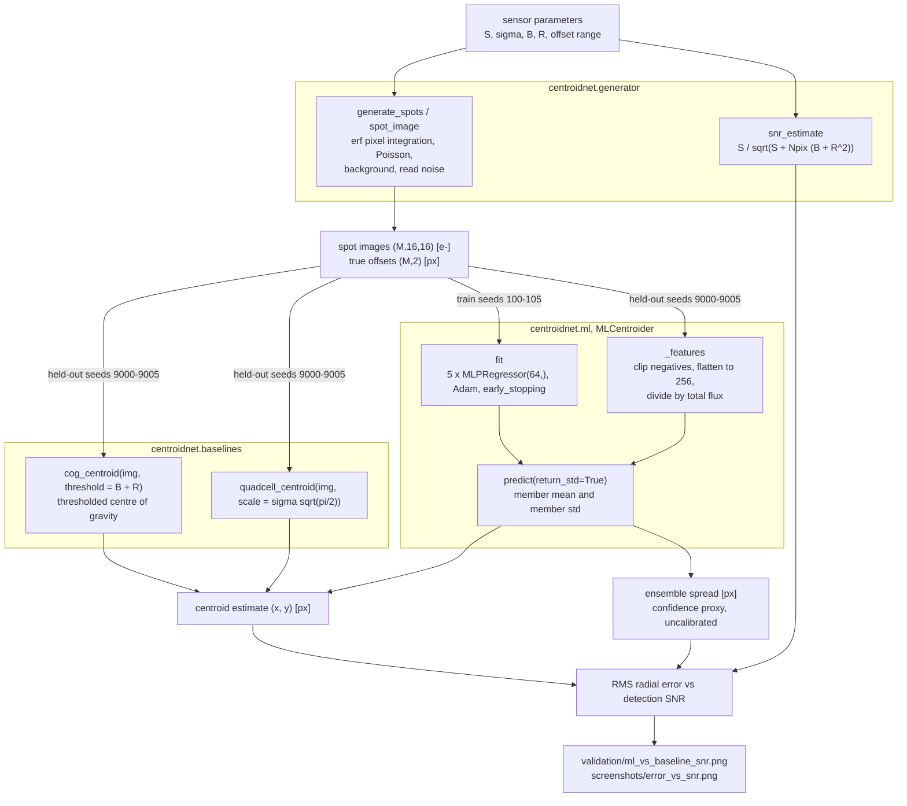

# centroidnet

Subpixel centroid estimation for one optical spot: classical baselines plus a benchmarked ML ensemble.


## The problem

Pointing and tracking error budgets are driven directly by centroid error: a star
tracker, a fine-guidance sensor, a laser-communication acquisition camera and a
Shack-Hartmann subaperture all reduce to "where, to a fraction of a pixel, is this
spot?". The classical answer, the intensity-weighted first moment, sums noise over
every pixel in the window, so it degrades badly once the target is faint; the other
classical answer, the quad-cell, is only linear within a fraction of the spot width.
This repository quantifies how much a small learned estimator buys you in the
photon-starved regime, and measures exactly where it stops buying you anything.

## What this does

- **Generates labelled synthetic frames** — pixel-integrated Gaussian spot (erf
  model), Poisson shot noise, uniform background, Gaussian read noise, with exact
  ground truth. Deterministic under a fixed seed; nothing is committed.
- **Implements two classical baselines first** — centre of gravity (plain and
  thresholded) and a calibrated quad-cell. Noise-free CoG recovery is exact to
  **2.934e-04 px** worst case; the quad-cell matches its analytic erf response to
  **5.538e-05 px** over d in [-4, +4] px.
- **Trains a 5-member MLP ensemble** on the flux-normalized 256-pixel vector,
  ~82 k parameters total, **19.2 s** to train 4200 frames on 2 CPU cores.
- **Returns an uncertainty proxy** — the ensemble spread, measured at
  **0.09 to 0.44** of the true RMS error, i.e. uncalibrated and documented as such.
- **Scores all four estimators on the same 3000 held-out frames** across six signal
  levels, detection SNR **1.9 to 88.3**, and reports the crossover.

## Headline result: where each method wins

Measured on 500 held-out frames per point (`validation/validation_output.txt`,
section 3). RMS radial error, pixels:

| S [e-] | SNR | CoG (plain) | CoG (thresholded) | quad-cell | ML ensemble |
|---|---|---|---|---|---|
| 100 | 1.9 | 1.466 | 1.382 | 1.447 | **0.788** |
| 200 | 3.6 | 1.302 | 0.901 | 1.319 | **0.438** |
| 500 | 8.7 | 0.968 | 0.401 | 1.040 | **0.242** |
| 1000 | 16.2 | 0.656 | 0.208 | 0.771 | **0.153** |
| 3000 | 39.3 | 0.305 | **0.075** | 0.493 | 0.079 |
| 10000 | 88.3 | 0.107 | **0.030** | 0.340 | 0.066 |

**A thresholded centre of gravity beats the ML ensemble above roughly SNR 40.**
The crossover falls between the SNR 16.2 point (ML 0.153 px vs 0.208 px, ML ahead
by 1.36x) and the SNR 39.3 point (ML 0.079 px vs 0.075 px, thresholded CoG ahead by
1.05x). At the highest signal tested, SNR 88.3, the thresholded CoG is **2.2x
better** (0.030 px vs 0.066 px).

Where the ML ensemble wins:

- Against the **plain** CoG, at every tested SNR, by 1.6x to 3.0x.
- Against the **thresholded** CoG, below SNR ~40 only: **1.75x** better at
  SNR 1.9 (0.788 px vs 1.382 px), 1.66x at SNR 8.7, 1.36x at SNR 16.2.

Why it loses above the crossover: the ML error floors at **~0.066 px** and stops
improving with signal, while the thresholded CoG keeps falling as 1/SNR. The floor
is a property of a finite-capacity, L2-regularized, early-stopped network trained on
4200 frames spanning six noise regimes; it shrinks slightly toward the mean of the
offset distribution, which costs nothing while noise dominates and dominates once it
does not. Against the shot-noise limit for this configuration (0.0212 px radial at
S = 1e4 e-, sigma/sqrt(N), Winick 1986, hand-calculated in `validation/VALIDATION.md`
section 3.5) the thresholded CoG reaches **1.4x** the limit and the ML ensemble
**3.1x**.

The defensible operating rule for this sensor model: use the ML ensemble below
SNR ~40, use the thresholded CoG above it. A method that wins only in the low-SNR
regime is still useful — faint stars, short integrations and weak beacons are the
cases that size a pointing budget — but it is not a replacement for the analytic
estimator.

## Who it is for

- GNC, optical-sensor and payload engineers sizing centroid error budgets who need
  a defensible low-SNR number rather than a rule of thumb.
- Researchers who want a like-for-like classical-versus-learned centroiding
  comparison on identical frames with the seeds committed.
- Students learning subpixel estimation, quad-cell nonlinearity and the photon-noise
  limit.

## Who it is not for

- Anyone writing flight software. See [Safety](#safety).
- Anyone who needs a production centroider for astronomical images — use photutils
  (see [Alternatives](#alternatives-honestly)).
- Anyone needing source detection, windowing, deblending or multi-frame tracking.
  This assumes a window already centred on exactly one spot.
- Anyone needing a calibrated 1-sigma error bar. The ensemble spread is not one.
- Anyone working outside the tested envelope: 16x16 px window, circular Gaussian
  spot of sigma = 1.5 px, offsets within +/-2 px, background 2 e-/px, read noise
  3 e- RMS.

## Alternatives, honestly

Thresholded centre of gravity is textbook (Thomas et al. 2006, *MNRAS* **371**, 323)
and is implemented in at least four maintained packages. This repository does not
offer a better centre of gravity, and nothing here should be read as a claim that it
does. What it offers is the paired benchmark harness: one generator, four
estimators, the same held-out frames, and the crossover measured rather than
asserted.

| Alternative | What it does better | When to use it instead of this |
|---|---|---|
| [photutils](https://pypi.org/project/photutils/) (`photutils.centroids`: `centroid_com`, `centroid_quadratic`, `centroid_1dg`, `centroid_2dg`, `centroid_sources`) | Maintained astropy-ecosystem centroiders including 1-D and 2-D Gaussian fitting and quadratic peak fitting, masking, error arrays, multi-source cutouts, and the surrounding detection and photometry stack. | Almost always, for astronomical images. `centroid_2dg` fits the actual spot model rather than a moment and is the estimator to beat at high SNR; this repo does not implement a fitting centroider at all. |
| [scikit-image](https://pypi.org/project/scikit-image/) (`skimage.measure.centroid`, `skimage.measure.moments`, `regionprops(...).centroid_weighted`, `skimage.feature.peak_local_max`) | General n-dimensional image processing: labelling, segmentation, peak finding, arbitrary-order moments, all heavily tested. | When the task is "find and measure blobs in a general image" rather than "one known spot in a fixed window", or when you need peak detection before centroiding. |
| [AOtools](https://pypi.org/project/aotools/) (`aotools.image_processing.centroiders`: `centre_of_gravity`, `brightest_pixel`, `correlation_centroid`, `quadCell`) | Ships the adaptive-optics centroider set, including brightest-pixel and correlation centroiding, applied directly to Shack-Hartmann subaperture stacks, alongside Zernikes, turbulence and WFS tooling. | For adaptive optics work. It has centroiders this repo does not (brightest-pixel, correlation) and a whole AO toolbox around them. |
| [SEP](https://pypi.org/project/sep/) (Source Extractor core as a library) | Background estimation, source detection, deblending and windowed positions on large images, at C speed. | When you must detect sources in a wide field before centroiding anything, or need Source Extractor-compatible measurements. |
| [opencv-python](https://pypi.org/project/opencv-python/) (`cv2.moments`, `cv2.connectedComponentsWithStats`) | Fast C++ moments and connected components with real-time throughput and no scientific-Python dependency chain. | Real-time embedded or machine-vision pipelines where frame rate matters more than a documented photometric noise model. |

None of the five ships a learned centroider with an uncertainty output, which is the
only thing here that is not already available elsewhere — and, as the headline result
says, that learned estimator loses to a three-line thresholded moment above SNR 40.

## Related work in this family

**ShackSim** (product P018) is the sibling and solves a different problem. ShackSim
simulates a whole Shack-Hartmann lenslet array and extracts the slope vector across
all subapertures, including lenslet geometry, elongated spots, a correlation
estimator and wavefront reconstruction. centroidnet is the single-spot centroiding
problem in isolation: one window, one source, four estimators, one number. If you
need array-level wavefront sensing, use ShackSim; if you need the per-spot estimator
comparison, use this.

## Install and first run

```bash
git clone https://github.com/OmAcharya-avtr/centroidnet.git
cd centroidnet
python -m venv .venv && source .venv/bin/activate
pip install -e ".[test]"
python -m pytest tests/ -q
python examples/spot_gallery.py
```

Expected output of the last two commands:

```
.........................................                                [100%]
=============================== warnings summary ===============================
tests/test_ml.py::TestBenchmark::test_ml_beats_or_ties_plain_cog_at_low_snr
tests/test_ml.py::TestReproducibility::test_same_seed_same_predictions
  .../sklearn/neural_network/_multilayer_perceptron.py:785: ConvergenceWarning: Stochastic Optimizer: Maximum iterations (200) reached and the optimization hasn't converged yet.
    warnings.warn(

-- Docs: https://docs.pytest.org/en/stable/how-to/capture-warnings.html
41 passed, 2 warnings in 12.06s

saved /path/to/centroidnet/screenshots/spot_gallery.png
```

The `ConvergenceWarning` is expected: the ensemble members stop on the
`early_stopping` criterion or the iteration cap, both by design. `spot_gallery.py`
takes about 12 s on 2 CPU cores.

## Worked example

Reproduces the headline table from the public API. Runtime 28 s on 2 CPU cores.

```python
import numpy as np
from centroidnet import (MLCentroider, cog_centroid, generate_spots,
                         quadcell_centroid, snr_estimate)

GRID, SIGMA, B, R = 16, 1.5, 2.0, 3.0          # px, px, e-/px, e- RMS
SIGNALS = [100.0, 200.0, 500.0, 1000.0, 3000.0, 10000.0]   # e-

# Train the ensemble across all six signal levels (seeds 100..105)
xs, ys = zip(*(generate_spots(700, GRID, SIGMA, s, B, R, seed=100 + i)
               for i, s in enumerate(SIGNALS)))
model = MLCentroider(n_estimators=5, hidden_layer_sizes=(64,), random_state=0)
model.fit(np.concatenate(xs), np.concatenate(ys))

# Evaluate on held-out frames (seeds 9000..9005, never seen in training)
for i, s in enumerate(SIGNALS):
    img, truth = generate_spots(500, GRID, SIGMA, s, B, R, seed=9000 + i)
    snr = snr_estimate(s, B, R, GRID)
    cogt = np.array([cog_centroid(f, threshold=B + R) for f in img])
    quad = np.array([quadcell_centroid(f, scale=SIGMA * np.sqrt(np.pi / 2)) for f in img])
    pred, std = model.predict(img, return_std=True)
    rms = lambda e: float(np.sqrt(np.mean(np.sum((e - truth) ** 2, axis=1))))
    print(f"S={s:>7.0f} e-  SNR={snr:5.1f} | CoG(thr) {rms(cogt):.3f} px | "
          f"quad {rms(quad):.3f} px | ML {rms(pred):.3f} px | "
          f"ML spread {std.mean():.3f} px")
```

Actual printed output:

```
S=    100 e-  SNR=  1.9 | CoG(thr) 1.382 px | quad 1.447 px | ML 0.788 px | ML spread 0.073 px
S=    200 e-  SNR=  3.6 | CoG(thr) 0.901 px | quad 1.319 px | ML 0.438 px | ML spread 0.048 px
S=    500 e-  SNR=  8.7 | CoG(thr) 0.401 px | quad 1.040 px | ML 0.242 px | ML spread 0.034 px
S=   1000 e-  SNR= 16.2 | CoG(thr) 0.208 px | quad 0.771 px | ML 0.153 px | ML spread 0.029 px
S=   3000 e-  SNR= 39.3 | CoG(thr) 0.075 px | quad 0.493 px | ML 0.079 px | ML spread 0.027 px
S=  10000 e-  SNR= 88.3 | CoG(thr) 0.030 px | quad 0.340 px | ML 0.066 px | ML spread 0.029 px
```

The crossover is visible in the last two rows, and the ML spread column never tracks
the ML error column: 0.073 px against 0.788 px at SNR 1.9, 0.029 px against 0.066 px
at SNR 88.3.

## Architecture



Package layout:

```
src/centroidnet/
├── __init__.py      public API, __version__
├── generator.py     spot_image, generate_spots, snr_estimate
├── baselines.py     cog_centroid, quadcell_centroid   (implemented first)
└── ml.py            MLCentroider                      (5 x MLPRegressor)
```

There are no cross-module imports beyond `__init__.py`; the baselines do not depend
on scikit-learn.

## Screenshots

Both are produced by the scripts in `examples/`, so they cannot drift from the code.


`examples/error_vs_snr.py`. Notice the crimson ML curve flattening near 0.07 px on
the right while the thresholded-CoG curve keeps descending and crosses under it —
that crossing is the headline result, reproduced independently with different seeds
(train 300-305, test 8800-8805, 300 frames per point) from the validation run.


`examples/spot_gallery.py`. Notice the leftmost column at SNR 1.9, where the spot is
barely visible and the four markers scatter across several pixels, against the
rightmost column at SNR 39.3, where they collapse onto the magenta cross; the red
error bars are the ensemble spread and are visibly too small for the actual error at
low SNR.

## Validation evidence

Level 2 (Research). Full derivations, tolerances and the raw console log are in
[`validation/VALIDATION.md`](validation/VALIDATION.md) and
[`validation/validation_output.txt`](validation/validation_output.txt), both written
by `validation/run_validation.py`.

| # | Check | Reference | Result | Tolerance | Verdict |
|---|---|---|---|---|---|
| 1 | Noise-free CoG recovery, 5 offsets | Thomas et al. 2006, *MNRAS* **371**, 323 | worst 2.934e-04 px; 3.216e-16 px at zero offset | 1e-3 px | PASS |
| 2 | Quad-cell response vs analytic erf, d in [-4, +4] px, 81 points | Tyler & Fried 1982, *JOSA* **72**, 804; Hardy 1998 ch. 5 | max deviation 5.538e-05 px | 1e-2 px | PASS |
| 2b | Quad-cell linear range | Tyler & Fried 1982 | 0.0001 px at d = 0.1 px; 0.217 px (14 %) at d = sigma; 1.206 px (40 %) at d = 2 sigma; saturates at +/-1.880 px | none | limitation confirmed |
| 3 | ML vs baselines, RMS vs SNR, 3000 held-out frames | own held-out data, seeds 9000-9005 | ML 1.75x better at SNR 1.9; **thresholded CoG 1.05x better at SNR 39.3 and 2.2x better at SNR 88.3** | none | **baseline wins above SNR ~40** |
| 3b | Training compute, 4200 frames, 2 cores | build-guide budget | 19.2 s | < 120 s | PASS |
| 4 | Ensemble spread as an error bar | Lakshminarayanan et al., NeurIPS 2017 | std/RMS 0.09 to 0.44 across the SNR range | none | **NOT calibrated** |

Checks 3 and 4 are the credible ones: check 3 records the baseline beating the model
in half the tested range, and check 4 records the uncertainty output failing to be an
error bar.


Simulated quad-cell output, the analytic erf response and the ideal unbiased line.
Notice the simulated and analytic curves are indistinguishable while both peel away
from the ideal line beyond |d| ~ sigma and saturate at +/-1.880 px.


Log-log RMS radial error against detection SNR for all four estimators from the
validation run itself (500 frames per point). Notice the thresholded-CoG line
crossing below the ML line between SNR 16.2 and 39.3.

Bias, `‖mean(estimate − truth)‖`, stays at or below 0.078 px for every estimator at
every SNR (full table in `validation/VALIDATION.md` section 3), so all four are
effectively unbiased over the symmetric +/-2 px offset distribution and RMS is the
discriminating metric. The one exception is the quad-cell's 0.027 px residual bias at
SNR 88.3, which does not fall with signal because it is deterministic nonlinearity.

Uncertainty calibration, measured, from `validation/validation_output.txt`:

| SNR | mean ensemble std [px] | actual RMS error [px] | std / RMS |
|---|---|---|---|
| 1.9 | 0.073 | 0.788 | 0.09 |
| 3.6 | 0.048 | 0.438 | 0.11 |
| 8.7 | 0.034 | 0.242 | 0.14 |
| 16.2 | 0.029 | 0.153 | 0.19 |
| 39.3 | 0.027 | 0.079 | 0.34 |
| 88.3 | 0.029 | 0.066 | 0.44 |

The spread under-estimates the true error at every SNR, by 2.3x at best and 11x at
worst. Members differ only in weight initialization and mini-batch shuffling, so the
spread measures initialization variance and contains no shot-noise, read-noise or
shared-systematic term. It is monotonic in SNR, so it works as a qualitative
degradation flag and as nothing else.

Not done, and required before any Level 3 claim: comparison against real detector
data, and comparison against an independent flight-heritage implementation.

## API reference

Coordinates are pixels measured from the array geometric centre `(N-1)/2`;
+x is increasing column index, +y is increasing row index.

<details>
<summary>Public surface (7 entry points)</summary>

| Signature | Returns | Units |
|---|---|---|
| `spot_image(x0, y0, grid_size=16, sigma=1.5, signal=1000.0, pixelated=True)` | noise-free frame, shape (N, N) | x0, y0, sigma in px; signal and output in e- |
| `generate_spots(n_spots=100, grid_size=16, sigma=1.5, signal=1000.0, background=0.5, read_noise=2.0, shot_noise=True, pixelated=True, offset_range=2.0, offsets=None, seed=None)` | `(images (M, N, N), truths (M, 2))` | images in e- (may be negative from read noise); truths in px |
| `snr_estimate(signal, background, read_noise, grid_size=16)` | detection SNR | dimensionless; S in e-, B in e-/px, R in e- RMS |
| `cog_centroid(img, threshold=None)` | `(x, y)` | px; `threshold` in the same unit as `img` |
| `quadcell_centroid(img, scale=1.0)` | `(x, y)` | units of `scale`; `scale = sigma*sqrt(pi/2)` gives px |
| `MLCentroider(n_estimators=5, hidden_layer_sizes=(64,), max_iter=300, random_state=0, alpha=1e-4)` | estimator instance | n_estimators >= 2 |
| `MLCentroider.fit(images, positions)` | `self` | images (M, N, N) in e-; positions (M, 2) in px |
| `MLCentroider.predict(images, return_std=False)` | `mean (M, 2)`, or `(mean, std)` | px |

Invalid input raises `ValueError` or `TypeError` with an actionable message: non-2-D
or non-finite images, odd dimensions for the quad-cell, zero or negative total flux
after clipping, a window size different from the fitted one, `predict()` before
`fit()`.

</details>

## Limitations

1. **The ML model loses to a three-line analytic estimator above SNR ~40**, by 2.2x
   at SNR 88.3. There is no regime above the crossover in which it is the right
   choice, and nothing in the ensemble output flags this.
2. **Compute budget: 2 CPU cores, scikit-learn only, no PyTorch.** The product was
   specified with a small CNN. PyTorch is unavailable in the build environment and
   scikit-learn has no convolutional layers, so the model is an ensemble of dense
   `MLPRegressor` networks on a flat 256-vector. It has no weight sharing and no
   translation equivariance, which is a materially weaker inductive bias for a
   translation-estimation task. The ~0.066 px high-SNR floor is a property of this
   substitute architecture and is not evidence about CNN centroiding. Full statement
   in [`MODEL_CARD.md`](MODEL_CARD.md).
3. **The uncertainty output is not calibrated** and under-estimates true error by
   2.3x to 11x. It must not be consumed as a 1-sigma bound by a downstream filter.
4. **All data is synthetic**, from an idealized sensor model. Not simulated: dead and
   hot pixels, PRNU and DSNU, optical aberrations beyond a Gaussian core, stray light
   and background gradients, detector nonlinearity, saturation, ADC quantization,
   cosmic rays, multiple or extended sources, jitter smear, thermal drift. Real
   detector behaviour is unknown and unmeasured. Every unmodelled effect can only
   degrade results, so these numbers are an optimistic bound.
5. **Tested SNR range is 1.9 to 88.3** (S = 100 to 10000 e- with B = 2.0 e-/px,
   R = 3.0 e- RMS, 16x16 window). Nothing outside that range is characterized.
6. **Tested spot shape is one circular Gaussian of sigma = 1.5 px**, pixel-integrated,
   with true offsets uniform in +/-2.0 px. Elongated, defocused, aberrated or
   differently sampled spots are out of distribution; sigma is baked into training and
   changing it invalidates the model without retraining. `MLCentroider` rejects a
   window size different from the fitted one, but silently extrapolates for offsets
   beyond +/-2 px.
7. **The quad-cell is a null-seeker, not an absolute sensor**: 14 % error at d = sigma,
   40 % at d = 2 sigma, hard saturation at +/-1.880 px. Its RMS never falls below
   0.340 px over the +/-2 px range no matter how bright the spot.
8. **Single frame, single spot.** No detection, no windowing, no track association,
   no temporal filtering, no multi-frame stacking.
9. **Plain CoG uses no background estimation.** Background removal is left to the
   caller through `threshold`; an adaptive background estimator would narrow the ML
   advantage at low SNR further than reported here.
10. Reported floats may shift in the last digits with a different BLAS or
    scikit-learn version. The qualitative conclusions — crossover near SNR 40, ML
    error floor, uncalibrated spread — are robust.

## Safety

This software is **research-grade**. It is **not flight-qualified, not certified, and
not approved for operational aerospace use.** No DO-178C or ECSS-E-ST-40C process was
followed; there is no independent verification and no qualification testing. Do not
place the ML model in a pointing, tracking or guidance control loop: its
accuracy-related failure modes are silent and its uncertainty output is uncalibrated,
so a downstream consumer cannot detect or bound its errors.

## Reproducing every number

From the repository root, with the package installed or `PYTHONPATH=src`:

```bash
# Every figure in "Headline result" and "Validation evidence"
# -> validation/validation_output.txt
#    validation/quadcell_bias_curve.png
#    validation/ml_vs_baseline_snr.png
PYTHONPATH=src python validation/run_validation.py

# Screenshots, independent seeds from the validation run
PYTHONPATH=src python examples/error_vs_snr.py     # -> screenshots/error_vs_snr.png
PYTHONPATH=src python examples/spot_gallery.py     # -> screenshots/spot_gallery.png

# The 41-test badge
python -m pytest tests/ -q
```

Seeds: training `100+i` for i in 0..5, held-out test `9000+i`, model
`random_state=0` with members 0..4. Example script: train `300+i`, test `8800+i`.
Gallery: train `500+i`, frames `7700+col`. Unit tests: train 2024, test 777. The run
is deterministic apart from wall-clock timings.

Environment used for the reported numbers: Python 3.11.15, numpy 2.4.4, scipy 1.17.1,
scikit-learn 1.8.0, matplotlib 3.10.9, Linux x86-64, 2 CPU cores. `validation/
validation_output.txt` records 19.2 s of training time; `validation/VALIDATION.md`
notes 24.6 s and 71.6 s for the same script on differently loaded machines. All are
inside the 120 s budget.

## References

- K. A. Winick, "Cramér-Rao lower bounds on the performance of charge-coupled-device
  optical position estimators", *J. Opt. Soc. Am. A* **3**, 1809-1815 (1986).
- S. Thomas, T. Fusco, A. Tokovinin, M. Nicolle, V. Michau, G. Rousset, "Comparison of
  centroid computation algorithms in a Shack-Hartmann sensor", *Mon. Not. R. Astron.
  Soc.* **371**, 323-336 (2006).
- G. A. Tyler, D. L. Fried, "Image-position error associated with a quadrant
  detector", *J. Opt. Soc. Am.* **72**, 804-808 (1982).
- J. W. Hardy, *Adaptive Optics for Astronomical Telescopes*, Oxford Univ. Press
  (1998), ch. 5.
- S. B. Howell, *Handbook of CCD Astronomy*, 2nd ed., Cambridge Univ. Press (2006).
- B. Lakshminarayanan, A. Pritzel, C. Blundell, "Simple and scalable predictive
  uncertainty estimation using deep ensembles", *NeurIPS* (2017).

## Licence

Apache-2.0. See [LICENSE](LICENSE). Copyright © 2026 OPTIMA Organisation.

## Citation

```bibtex
@software{centroidnet_2026,
  title   = {centroidnet: optical spot centroid estimation for pointing and
             tracking sensors},
  author  = {{OPTIMA Organisation}},
  year    = {2026},
  version = {0.1.0},
  license = {Apache-2.0},
  note    = {Research-grade; not flight-qualified.}
}
```

## Credits

This is under reserved rights obtained by OPTIMA Organisation.
