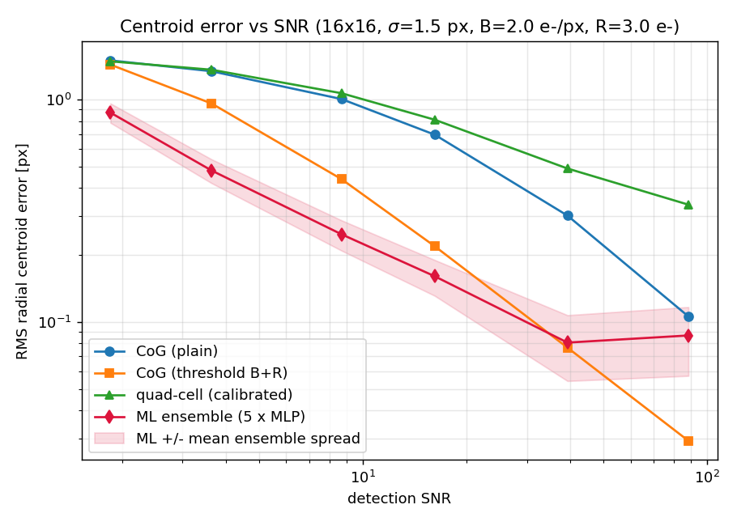
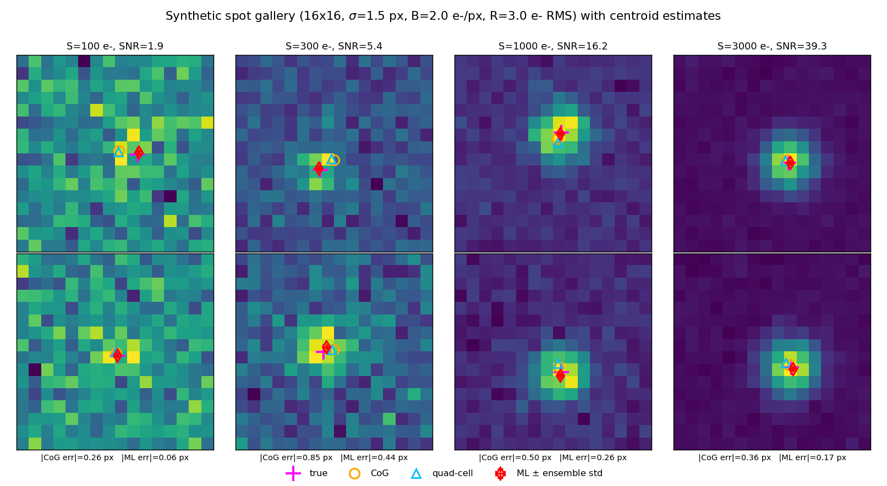
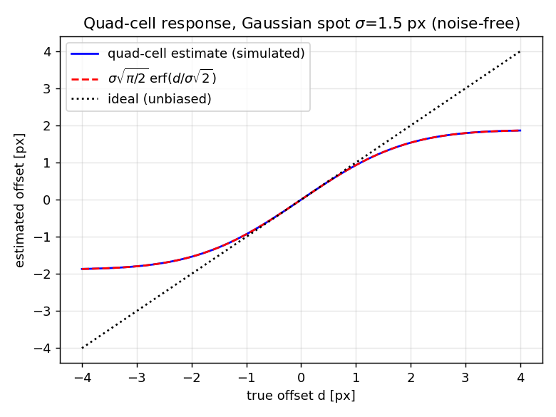
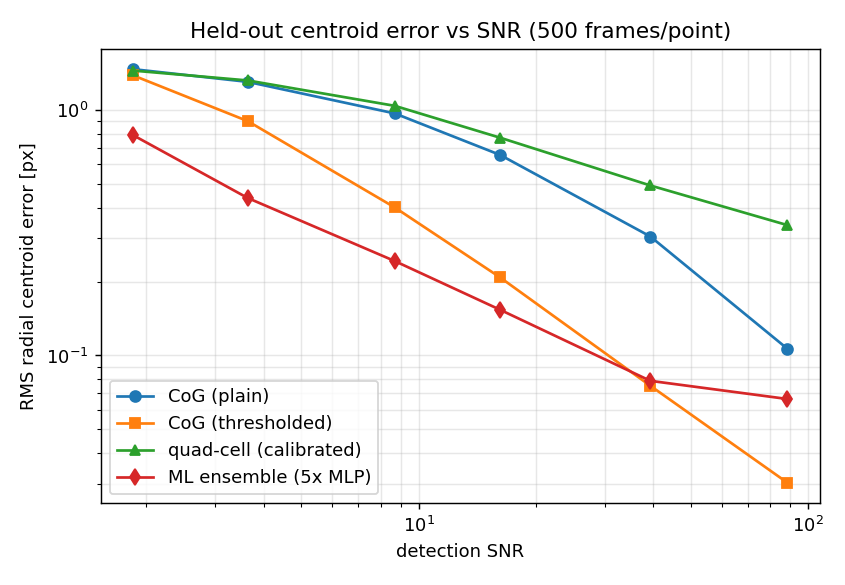

# CentroidNet

**Status:** TESTING · **Class:** compact · **Validation level:** 2 (Research) · **AI:** yes

> **Headline honest result — read this before using the ML model.** On held-out
> synthetic data the ML ensemble beats the plain centre-of-gravity at every SNR
> tested, and beats a well-tuned *thresholded* centre-of-gravity **only below
> SNR ≈ 40**. Above that the thresholded CoG is better — 2.2× better at SNR 88
> (0.030 px vs 0.066 px). Use the ML model in the photon-starved regime; use the
> analytic estimator when the spot is bright. Full numbers in
> [`validation/VALIDATION.md`](validation/VALIDATION.md).

## Executive overview

CentroidNet estimates the subpixel position of a single optical spot on a small
detector window. It ships three things that belong together:

1. a **synthetic spot generator** — pixel-integrated Gaussian PSF with Poisson
   shot noise, uniform background and Gaussian read noise, with exact labels;
2. two **classical analytic baselines** — intensity-weighted centre of gravity
   (plain and thresholded) and a calibrated quad-cell;
3. an **ML ensemble** — 5 scikit-learn MLP regressors on the flux-normalized
   pixel vector, returning a subpixel centroid **and an ensemble-spread
   uncertainty**.

The baselines were implemented first and the ML model is benchmarked against them
on identical held-out frames. Everything is numpy/scipy/scikit-learn; no GPU, no
network access, no committed data.

## Aerospace problem

Pointing and tracking error budgets are driven directly by centroid error. Star
trackers, fine-guidance sensors, laser-communication acquisition and tracking
sensors and Shack–Hartmann wavefront sensors all reduce to: *where, to a fraction
of a pixel, is this spot?* Two classical answers dominate. The centre of gravity
is unbiased and wide-range but sums noise over every pixel in the window, so it
degrades badly when the star is faint or the beacon weak. The quad-cell is fast
and cheap but only linear within a fraction of the spot width, so it works as a
null-seeker and not as an absolute sensor. The photon-starved regime — faint
target, short integration, high read noise — is where both hurt most and where a
learned estimator has room to help. This product quantifies exactly how much
room, and where the learned estimator stops helping.

## Intended users

GNC, optical-sensor and payload engineers sizing centroid error budgets;
researchers comparing classical and learned centroiding; students learning
subpixel estimation and its noise limits. Not for flight software (see
[Safety statement](#safety-statement)).

## Engineering theory

Coordinate convention throughout: positions are in **pixels** measured from the
array geometric centre `(N−1)/2`; +x = increasing column index, +y = increasing
row index.

**Spot model** (Hardy 1998, *Adaptive Optics for Astronomical Telescopes*, Oxford
Univ. Press, ch. 5 — Gaussian approximation to a diffraction-limited PSF core):

```
I(x, y) = S / (2πσ²) · exp( −((x−x₀)² + (y−y₀)²) / (2σ²) )
```

Units: `S` total signal [e⁻], `σ` spot RMS width [px], `x₀, y₀` centre [px].
*Assumptions:* one unresolved, circular, unaberrated source. *Validity:* good near
the PSF core; poor in the wings of a real diffraction pattern.

**Pixel integration** — exact, separable, closed form in the error function:

```
P(i, j) = S · [F(x_c+½) − F(x_c−½)] · [F(y_c+½) − F(y_c−½)],  F(u) = ½(1 + erf((u−x₀)/(σ√2)))
```

*Assumptions:* 100 % fill factor, uniform pixel response. *Validity:* any σ; the
point-sampled alternative (`pixelated=False`) is valid only for σ ≫ 1 px.

**Centre of gravity** (first moment; Thomas et al. 2006, *MNRAS* **371**, 323):

```
x̂ = Σᵢ wᵢ xᵢ / Σᵢ wᵢ  [px],   wᵢ = max(Iᵢ − t, 0)
```

*Assumptions:* symmetric PSF fully inside the window, background removed.
*Validity:* unbiased noise-free (verified to 2.9e-04 px, §Validation); variance
grows with window area × noise, so it degrades quickly at low SNR. A threshold `t`
trades noise sensitivity for a small bias.

**Quad-cell** (Tyler & Fried 1982, *JOSA* **72**, 804; Hardy 1998 ch. 5):

```
x̂ = s · (I_right − I_left) / I_total  [px]
```

For a Gaussian spot the ideal response is `x̂ = s·erf(d/(σ√2))`, which is linear
only for `|d| ≪ σ`, with small-signal slope `√(2/π)/σ`. Choosing
`s = σ√(π/2) = 1.88 px` here calibrates that slope to unity. *Validity:* the
estimate **saturates at ±s**; error is 14 % at `d = σ` and 40 % at `d = 2σ`.

**Detection SNR** (standard CCD aperture photometry; Howell 2006, *Handbook of CCD
Astronomy*, 2nd ed., Cambridge Univ. Press):

```
SNR = S / sqrt( S + N_pix·(B + R²) )   [dimensionless]
```

Units: `B` background [e⁻/px], `R` read noise [e⁻ RMS], `N_pix = N²`.
*Assumptions:* whole spot inside the window, no dark current.

**Photon-noise limit** on centroiding (Winick 1986, *JOSA A* **3**, 1809; Thomas
et al. 2006): `σ_centroid ≈ σ_PSF/√N` per axis in the background-free limit — the
floor no estimator beats. At S = 10⁴ e⁻, σ = 1.5 px this is 0.021 px radial.

## Architecture

```
src/centroidnet/
├── __init__.py      public API and __version__
├── generator.py     spot_image, generate_spots, snr_estimate   (synthetic data)
├── baselines.py     cog_centroid, quadcell_centroid            (analytic, implemented first)
└── ml.py            MLCentroider                               (5 × MLPRegressor ensemble)
```

`MLCentroider` normalizes each frame to unit total flux (gain invariance),
flattens it to a 256-vector and feeds 5 independently seeded MLPs with one hidden
layer of 64 ReLU units. Prediction is the member mean; `return_std=True` adds the
member standard deviation as an uncertainty proxy. No cross-product imports.

## Installation

Requires Python ≥ 3.11 with numpy, scipy, scikit-learn and matplotlib.

```bash
cd products/P008
pip install -e .            # or: export PYTHONPATH=src
```

All commands below are run from `products/P008/`.

## Quick start

```python
import numpy as np
from centroidnet import (
    MLCentroider, cog_centroid, generate_spots, quadcell_centroid, snr_estimate,
)

# 1. Analytic baselines on one noisy frame
images, truths = generate_spots(
    n_spots=1, grid_size=16, sigma=1.5, signal=1000.0,
    background=2.0, read_noise=3.0, seed=42,
)
frame, truth = images[0], truths[0]
print("true      ", truth)                                   # [px] from array centre
print("CoG       ", cog_centroid(frame))
print("CoG (thr) ", cog_centroid(frame, threshold=5.0))
print("quad-cell ", quadcell_centroid(frame, scale=1.5 * np.sqrt(np.pi / 2)))
print("SNR       ", snr_estimate(1000.0, 2.0, 3.0, 16))

# 2. Train and predict with uncertainty
train_x, train_y = generate_spots(2000, 16, 1.5, 1000.0, 2.0, 3.0, seed=100)
model = MLCentroider(n_estimators=5, hidden_layer_sizes=(64,), random_state=0)
model.fit(train_x, train_y)

test_x, test_y = generate_spots(200, 16, 1.5, 1000.0, 2.0, 3.0, seed=9000)  # held out
pred, std = model.predict(test_x, return_std=True)
rms = np.sqrt(np.mean(np.sum((pred - test_y) ** 2, axis=1)))
print(f"ML RMS {rms:.3f} px, mean ensemble spread {std.mean():.3f} px")
```

`std` is **not** a calibrated 1-σ error bar — see [Limitations](#limitations).

## Configuration

| Parameter | Default | Units | Meaning |
|---|---|---|---|
| `grid_size` | 16 | px | Square window side, ≥ 4 (quad-cell needs even) |
| `sigma` | 1.5 | px | Spot RMS width, > 0 |
| `signal` | 1000 | e⁻ | Total spot signal, ≥ 0 |
| `background` | 0.5 | e⁻/px | Uniform background, ≥ 0 |
| `read_noise` | 2.0 | e⁻ RMS | Gaussian read noise, ≥ 0 (0 disables) |
| `shot_noise` | True | — | Poisson noise on spot + background |
| `pixelated` | True | — | erf pixel integration vs point sampling |
| `offset_range` | 2.0 | px | True offsets drawn U(−r, +r) in x and y |
| `seed` | None | — | Fixed seed → bitwise reproducible output |
| `threshold` (CoG) | None | e⁻ | Subtracted before weighting; `B + R` used here |
| `scale` (quad-cell) | 1.0 | px | `σ√(π/2)` linearizes the small-offset slope |
| `n_estimators` | 5 | — | Ensemble members, ≥ 2 |
| `hidden_layer_sizes` | (64,) | — | MLP hidden widths |
| `max_iter` / `alpha` / `random_state` | 300 / 1e-4 / 0 | — | Adam epochs, L2, base seed |

Invalid input raises `ValueError`/`TypeError` with an actionable message
(negative σ, odd dimensions for the quad-cell, non-finite pixels, zero total flux,
`predict()` before `fit()`, …).

## Examples

Both save PNGs to `screenshots/` using the Agg backend.

```bash
PYTHONPATH=src python examples/error_vs_snr.py    # ~18 s
PYTHONPATH=src python examples/spot_gallery.py    # ~15 s
```

**`error_vs_snr.py` → `screenshots/error_vs_snr.png`** — trains the ensemble and
plots RMS radial error against detection SNR for all four estimators on held-out
frames, with the mean ensemble spread as a band around the ML curve. The crossover
where the thresholded CoG overtakes the ML model is directly visible.



**`spot_gallery.py` → `screenshots/spot_gallery.png`** — eight simulated frames at
four signal levels (SNR 1.9 to 39.3) with the true centroid, the CoG, the
quad-cell and the ML estimate (with its ensemble-spread error bars) overlaid, and
the per-frame CoG and ML errors annotated. At SNR 1.9 the spot is barely visible
by eye and the estimators visibly disagree; by SNR 39 they collapse onto the
truth.



## Validation

Level 2 (Research). Full evidence, tolerances and raw output:
[`validation/VALIDATION.md`](validation/VALIDATION.md), regenerated by

```bash
PYTHONPATH=src python validation/run_validation.py    # writes validation_output.txt + 2 PNGs
```

**1 — Noise-free CoG recovery against the analytic truth.** Over five offsets in a
16×16 window the worst-case radial error is **2.934e-04 px** (tolerance 1e-3 px,
**PASS**); at zero offset it is **3.2e-16 px**, i.e. round-off, as symmetry
requires. The residual at ±2 px offset is genuine window truncation of the
Gaussian tails, not a numerical defect.

**2 — Quad-cell bias curve against the analytic erf response.** Swept over
d ∈ [−4, 4] px, the implementation matches `σ√(π/2)·erf(d/(σ√2))` to
**5.538e-05 px** (tolerance 1e-2 px, **PASS**). The curve quantifies the
documented linear-range limitation: linearity error **0.0001 px at d = 0.1 px**,
**0.217 px (14 %) at d = 1.5 px = σ**, **1.206 px (40 %) at d = 3.0 px = 2σ**,
with hard saturation at ±1.88 px.



**3 — Bias and RMS error vs SNR, baselines against the ML ensemble.** 4200
training frames (seeds 100–105), 3000 held-out test frames (seeds 9000–9005),
500 per SNR point. RMS radial error [px]:

| S [e⁻] | SNR | CoG plain | CoG thresholded | quad-cell | **ML ensemble** |
|---|---|---|---|---|---|
| 100 | 1.9 | 1.466 | 1.382 | 1.447 | **0.788** |
| 200 | 3.6 | 1.302 | 0.901 | 1.319 | **0.438** |
| 500 | 8.7 | 0.968 | 0.401 | 1.040 | **0.242** |
| 1000 | 16.2 | 0.656 | 0.208 | 0.771 | **0.153** |
| 3000 | 39.3 | 0.305 | **0.075** | 0.493 | 0.079 |
| 10000 | 88.3 | 0.107 | **0.030** | 0.340 | 0.066 |

Bias ‖mean(est − truth)‖ stays ≤ 0.078 px for every estimator at every SNR (full
table in VALIDATION.md), so all four are effectively unbiased over the symmetric
±2 px offset distribution and RMS is the discriminating metric.



## Benchmark results

- ML ensemble vs **plain** CoG: **better at every tested SNR**, by 1.6×–3.0×.
- ML ensemble vs **thresholded** CoG: better below SNR ≈ 40 (**1.8× at SNR 1.9**,
  1.7× at SNR 8.7); **worse at and above SNR 39.3** (0.079 vs 0.075 px), and
  **2.2× worse at SNR 88.3** (0.066 vs 0.030 px).
- ML error floors at **≈ 0.066 px** and stops improving with signal. Cause: a
  finite-capacity, L2-regularized, early-stopped network trained on 4200 frames
  spanning six noise regimes carries an irreducible approximation error and shrinks
  slightly toward the mean of the offset distribution. This costs nothing while
  noise dominates and dominates once it does not.
- Against the photon-noise limit (0.021 px radial at S = 10⁴ e⁻): thresholded CoG
  reaches **1.4×** the limit, ML **3.1×**.
- Quad-cell RMS plateaus at 0.340 px even at SNR 88 — nonlinearity over the ±2 px
  offset range, not noise.
- Compute: training 5 × MLP(64,) on 4200 frames takes **24.6 s** on 2 CPU cores
  (budget 120 s); inference ≈ 0.1 ms/frame/member; test suite 11 s.

## AI model details

Full card: [`MODEL_CARD.md`](MODEL_CARD.md). Data: [`DATASET_CARD.md`](DATASET_CARD.md).

- **Baseline first.** `cog_centroid` and `quadcell_centroid` were implemented and
  validated before the model, and every ML claim is made on identical held-out
  frames (§Validation).
- **Architecture.** 5 × `MLPRegressor(hidden_layer_sizes=(64,))`, ReLU, Adam,
  `alpha=1e-4`, `max_iter=300`, `early_stopping=True`, on the flux-normalized
  256-vector. ≈ 82 k parameters total.
- **Dataset.** Entirely synthetic, generated by committed scripts, deterministic
  under fixed seeds, not committed. Idealized sensor model; dead pixels, PRNU,
  optical aberrations, stray light and detector nonlinearity are **not** modelled.
- **Training procedure.** 6 signal levels × 700 frames (seeds 100–105); 10 % of
  training frames held internally for early stopping; no hyperparameter search, so
  no test information leaked into any choice.
- **Test split.** Disjoint RNG streams, not a partition: train seeds 100–105, test
  seeds 9000–9005 (3000 frames). Same distribution — this is an in-distribution
  generalization test only, not a robustness test.
- **Metrics.** See the table in §Validation and §Benchmark results.
- **Uncertainty output.** `predict(..., return_std=True)` returns the ensemble
  standard deviation. Measured std/RMS ratio ranges **0.09 to 0.44**, i.e. it
  under-estimates the true error everywhere by 2.3×–11×. **Not a calibrated 1-σ
  bound.** Useful only as a monotonic, qualitative degradation flag.
- **Failure cases.** Silent degradation above SNR ≈ 40; extrapolation outside
  ±2 px offsets or σ ≠ 1.5 px; dead/hot pixels and cosmic rays; multiple or
  extended sources; saturated cores. Only input-validation errors are raised;
  **every accuracy failure mode is silent.**
- **Deviation.** The specification called for a small **CNN**; PyTorch is not
  available in this build environment, so an **MLP ensemble** is used instead. The
  model has no convolutional inductive bias. Recorded in
  [Limitations](#limitations) and prominently in `MODEL_CARD.md`.

**This model is not certified for operational flight use.**

## Hardware requirements

CPU only. Developed and validated on 2 x86-64 cores with Python 3.11.15, numpy
2.4.4, scipy 1.17.1, scikit-learn 1.8.0, matplotlib 3.10.9. Peak memory < 500 MB
(4200 × 16 × 16 float64 ≈ 8.6 MB of image data). No GPU, no accelerator, no
network access. Full validation run < 2 minutes.

## Limitations

1. **Deviation from spec: MLP ensemble instead of a CNN.** PyTorch is unavailable
   in this build environment and scikit-learn has no convolutional layers. The
   model therefore lacks weight sharing and translation equivariance, which is a
   materially weaker inductive bias for this task. The reported accuracy — and
   especially the high-SNR error floor — is a property of this substitute
   architecture and is **not** evidence about CNN centroiding.
2. **The ML model does not beat the best analytic estimator at high SNR.** Above
   SNR ≈ 40 the thresholded CoG wins, by 2.2× at SNR 88. There is no regime above
   the crossover in which the ML model is the right choice.
3. **The uncertainty output is not calibrated** and under-estimates the true error
   by 2.3×–11×. It must not be consumed as a 1-σ error bar by any downstream
   filter or estimator.
4. **All data is synthetic**, from an idealized sensor model. **Not modelled:**
   dead/hot pixels, pixel-response and dark-signal nonuniformity, optical
   aberrations beyond a Gaussian core, stray light and background gradients,
   detector nonlinearity/saturation/ADC quantization; also absent are cosmic rays,
   multiple or extended sources, jitter smear and thermal drift. Real-hardware
   performance is unknown. Every unmodelled effect can only degrade results, so
   these numbers are an optimistic bound.
5. **Narrow operating envelope.** Everything is characterized at 16×16 px,
   σ = 1.5 px, offsets ≤ 2 px, B = 2 e⁻/px, R = 3 e⁻. `MLCentroider` rejects a
   different window size after fitting; a different σ or offset range requires
   retraining and revalidation.
6. **Quad-cell is a null-seeker, not an absolute sensor** — 14 % error at d = σ,
   40 % at d = 2σ, saturating at ±1.88 px. Its RMS never falls below 0.34 px over
   the ±2 px range no matter how bright the spot.
7. **Single-frame, single-spot only.** No temporal filtering, no track association,
   no multi-frame stacking, no detection or windowing stage — the window is assumed
   already centred on one source.
8. **Plain CoG uses no background estimation.** Background subtraction is left to
   the caller via `threshold`; an adaptive/iterative background estimator would
   likely narrow the ML advantage at low SNR further.
9. Reported floats may shift in the last digits with a different BLAS or
   scikit-learn version; the qualitative conclusions are robust.

## Safety statement

This software is **research-grade**. It is **not flight-qualified, not certified,
and not approved for operational aerospace use.** No DO-178C or ECSS-E-ST-40C
process was followed; there is no independent verification and no qualification
testing. Do not place the ML model in any pointing, tracking or guidance control
loop: its accuracy failure modes are silent and its uncertainty output is not
calibrated, so a downstream consumer cannot detect or bound its errors.

## Roadmap

- Re-implement the estimator as a CNN once a deep-learning framework is available,
  and re-run the identical benchmark to test whether the 0.066 px floor is an
  artefact of the MLP substitution.
- Calibrate the uncertainty output (variance scaling or conformal prediction)
  against held-out error and report coverage.
- Add a maximum-likelihood / Gaussian-fit baseline and an explicit Cramér–Rao
  bound curve (Winick 1986) to the error-vs-SNR comparison.
- Extend the generator toward realism: PRNU, dead pixels, saturation, background
  gradients — and measure how far the current results degrade under each.
- Train across a range of σ and window sizes; add per-SNR specialist models or an
  SNR-conditioned input to remove the mixed-regime compromise.

## License

Apache-2.0. See [LICENSE](LICENSE). Copyright © 2026 OPTIMA Organisation.

## Credits

This is under reserved rights obtained by OPTIMA Organisation.

## Citation

```bibtex
@software{centroidnet_2026,
  title   = {CentroidNet: optical spot centroid estimation for pointing and
             tracking sensors},
  author  = {{OPTIMA Organisation}},
  year    = {2026},
  version = {0.1.0},
  license = {Apache-2.0},
  note    = {Research-grade; not flight-qualified. Product P008.}
}
```
