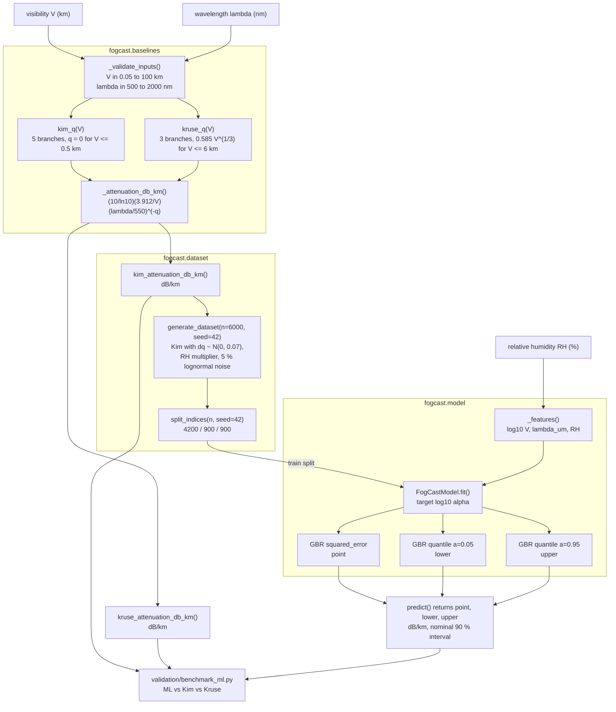
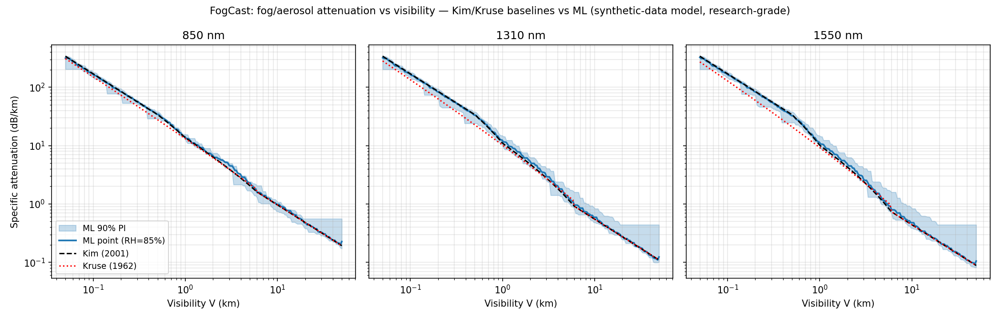

# FogCast

Fog and aerosol optical attenuation (dB/km) for free-space optical links, from visibility.


## The problem

A free-space optical link that closes comfortably in clear air can be dead in fog:
at 0.3 km visibility the Kim model gives 56.63 dB/km at 1550 nm, so a 1 km hop loses
56.6 dB to the atmosphere alone. Link-budget work needs that number from the data a
site actually records — visibility and humidity — not from a scattering computation
that needs a drop-size distribution nobody measured. The two standard visibility
models disagree by a factor of 1.50 exactly where the link is about to fail, and a
point estimate with no interval hides that from whoever signs off the margin.

## What this does

- Implements the Kim (Proc. SPIE 4214, 2001) and Kruse (1962) piecewise `q(V)`
  exponents and the Koschmieder 2 % attenuation kernel; all 5 Kim branches and all
  7 reference attenuation values reproduce hand computation to <= 2.0e-16 relative
  error (`validation/validate_baselines_output.txt`).
- Reports the two models' disagreement rather than picking one: Kim 56.632 vs Kruse
  37.744 dB/km at V = 0.3 km, 1550 nm, a ratio of 1.50.
- Predicts attenuation from visibility, wavelength and relative humidity with a
  gradient-boosting model that carries a nominal 90 % prediction interval; measured
  coverage 0.879 on 900 held-out samples, median interval width 2.600 dB/km
  (`validation/benchmark_results.md`).
- Trains and predicts on any 2-core CPU: 3.0 s for three regressor fits on 4200
  samples, 8.81 s for the 35-test suite, no GPU.
- Enforces its own validity envelope: V in [0.05, 100] km and lambda in
  [500, 2000] nm raise `ValueError` outside the range instead of clamping.

## Who it is for

- FSO link-budget engineers doing research studies who need the atmospheric
  attenuation term from routinely logged weather data.
- Optical ground-station siting analysts comparing 850, 1310 and 1550 nm under the
  same visibility statistics.
- Anyone teaching or learning empirical atmospheric optics and prediction-interval
  calibration, where a seeded synthetic ground truth is a feature.

## Who it is not for

- Anyone needing certified or operational availability numbers. This is research
  code, and its ML component has never seen a real fog measurement.
- Anyone modelling rain, snow, molecular absorption lines, or turbulence and
  scintillation. None of those are in either baseline.
- Anyone needing radio-frequency attenuation. Use `itur`, below.
- Anyone who needs extinction derived from aerosol microphysics rather than from a
  visibility fit. Use a radiative-transfer code.

## Alternatives, honestly

| Alternative | What it does better | When to use this instead |
|---|---|---|
| [`itur`](https://pypi.org/project/itur/) (ITU-Rpy, 0.4.0, MIT) | Seventeen ITU-R P recommendations for radio propagation, including P.840 cloud and fog attenuation, with global maps and slant-path geometry. Mature and widely used. | Its fog model is liquid-water-content based and applies at radio frequencies. For 500–2000 nm optical attenuation from visibility it has nothing to offer; use FogCast. |
| [`freesopy`](https://pypi.org/project/freesopy/) (2.0.4, Nov 2024) | The rest of the FSO link budget: received power, photocurrent, shot and thermal noise, SNR, pointing-misalignment loss, beam divergence, LOS and diffuse channel gain. | It documents no visibility-based atmospheric attenuation term. The two are complements: take alpha from FogCast, feed it into a freesopy link budget. |
| [`scikit-commpy`](https://pypi.org/project/scikit-commpy/) (0.8.0, Oct 2022) | Modulation, demodulation, convolutional, turbo and LDPC coding, Rayleigh and Rician fading channels. | It carries no optical or atmospheric propagation model. Use it above the physical channel, not for the channel itself. |
| [libRadtran](http://www.libradtran.org/) (C and Fortran, GPL) | Full solar and thermal radiative transfer with explicit aerosol and cloud optical properties. Physically grounded rather than fitted. | When you have only a visibility reading and need an answer in microseconds, not a radiative-transfer run with an aerosol model you would have to specify yourself. |
| Kim et al., Proc. SPIE 4214 (2001); Kruse et al. (1962); ITU-R P.1817-1 | The authoritative definitions. Cite these, not this repository, for the models themselves. | When you want those formulas executable, array-broadcasting, range-checked and regression-tested against hand computation. FogCast implements the standards; it does not replace them. |

No Python package was found that publishes the Kim or Kruse visibility models as an
API. If one exists, this table is wrong and should be corrected.

## Install and first run

```bash
git clone https://github.com/OmAcharya-avtr/fogcast.git
cd fogcast
python -m venv .venv && source .venv/bin/activate
pip install -e .
pip install pytest hypothesis
python -m pytest tests/ -q
python examples/attenuation_vs_visibility.py
```

`pyproject.toml` declares no `[test]` extra, so `pytest` and `hypothesis` are
installed separately. Expected output:

```
...................................                                      [100%]
35 passed in 8.81s
Saved /path/to/fogcast/screenshots/attenuation_vs_visibility.png
```

The example trains the default model before plotting, so it takes a few seconds
longer than the test suite.

## Worked example

```python
import numpy as np

from fogcast import (
    VISIBILITY_RANGE_KM,
    WAVELENGTH_RANGE_NM,
    FogCastModel,
    kim_attenuation_db_km,
    kim_q,
    kruse_attenuation_db_km,
)

# 1. Analytic baselines need no training.
for v in (0.3, 1.0, 10.0):
    print(
        f"V={v:5.1f} km  q_Kim={kim_q(v):.3f}"
        f"  Kim={kim_attenuation_db_km(v, 1550.0):8.4f}"
        f"  Kruse={kruse_attenuation_db_km(v, 1550.0):8.4f} dB/km"
    )

# 2. Array inputs broadcast against a scalar wavelength.
v = np.array([0.2, 0.5, 2.0, 20.0])
print("Kim over V array:", np.round(kim_attenuation_db_km(v, 1550.0), 3), "dB/km")

# 3. Fog loss over a 1.0 km link at 1550 nm.
print(f"Link loss, V=0.3 km over 1.0 km: {kim_attenuation_db_km(0.3, 1550.0) * 1.0:.1f} dB")

# 4. ML model with a nominal 90 % prediction interval.
model = FogCastModel.train_default(n_samples=6000, seed=42)
point, lo, hi = model.predict(1.0, 1550.0, 85.0)
print(f"ML V=1.0 km, 1550 nm, RH=85%: {point:.3f} dB/km  90% PI [{lo:.3f}, {hi:.3f}]")

# 5. Validity ranges are enforced, not clamped.
print("valid V (km):", VISIBILITY_RANGE_KM, " valid lambda (nm):", WAVELENGTH_RANGE_NM)
try:
    kim_attenuation_db_km(0.01, 1550.0)
except ValueError as exc:
    print("ValueError:", exc)
```

Output:

```
V=  0.3 km  q_Kim=0.000  Kim= 56.6320  Kruse= 37.7438 dB/km
V=  1.0 km  q_Kim=0.500  Kim= 10.1204  Kruse=  9.2673 dB/km
V= 10.0 km  q_Kim=1.300  Kim=  0.4418  Kruse=  0.4418 dB/km
Kim over V array: [84.948 33.979  4.287  0.221] dB/km
Link loss, V=0.3 km over 1.0 km: 56.6 dB
ML V=1.0 km, 1550 nm, RH=85%: 10.594 dB/km  90% PI [9.132, 14.303]
valid V (km): (0.05, 100.0)  valid lambda (nm): (500.0, 2000.0)
ValueError: visibility_km must be within (0.05, 100.0) km (Koschmieder visibility validity range); got values outside it.
```

At V = 10 km Kim and Kruse agree exactly, because both set q = 1.3 there. At
V = 0.3 km they do not, because Kim sets q = 0 and Kruse does not.

## Architecture



`baselines.py` does not import `model.py`; the ML path depends on the baselines and
never the reverse. There are no cross-product imports, and the only runtime
dependencies are numpy, scikit-learn and matplotlib.

## Screenshots



Produced by `examples/attenuation_vs_visibility.py`. Notice the red dotted Kruse
curve peeling away below the black Kim curve for V < 1 km, with the gap widening
from 850 nm to 1550 nm — that is the 1.50 ratio in the validation table. Notice
also that the blue ML curve is visibly piecewise-constant, which is the tree output
showing through, and that the 90 % band is widest at the clear-air end where the
training data is thinnest.

## Validation evidence

Level 2, research. Full write-up in `validation/VALIDATION.md`; raw outputs in
`validation/validate_baselines_output.txt` and `validation/benchmark_results.md`.

| Check | Reference | Result | Tolerance |
|---|---|---|---|
| Kim `q(V)`, 5 branches | Kim et al., Proc. SPIE 4214 (2001) | 5/5 PASS: q = 0.0000, 0.2500, 0.8200, 1.3000, 1.6000 at V = 0.30, 0.75, 3.00, 10.00, 60.00 km | exact |
| Attenuation vs hand computation, 7 points | Koschmieder 2 % contrast form | 7/7 PASS, maximum relative error 1.97e-16 | 1e-12 relative |
| Kim dense-fog wavelength independence | Kim et al. (2001), q = 0 for V <= 0.5 km | PASS: 56.6320 dB/km at both 850 and 1550 nm, V = 0.3 km | exact |
| Kim equals Kruse for V > 6 km | shared q = 1.3 branch | PASS: 0.2749 dB/km both, V = 20 km, 1310 nm | exact |
| Kim vs Kruse dense-fog disagreement | Kim et al. (2001) vs Kruse et al. (1962) | Reproduced: 56.63 vs 37.74 dB/km, ratio 1.50, at V = 0.3 km, 1550 nm | documented, not resolved |
| ML MAE, held-out test split, n = 900 | vs Kim baseline | ML 2.320 vs Kim 2.465 dB/km | no threshold |
| ML RMSE, same split | vs Kim baseline | ML 5.390 vs Kim 5.749 dB/km | no threshold |
| Kruse MAE and RMSE, same split | vs synthetic truth | 7.675 and 15.043 dB/km | no threshold |
| **Fog band, 0.5 < V <= 1 km, n = 85** | **Kim baseline wins** | **Kim 1.172 vs ML 1.187 dB/km MAE** | no threshold |
| **Clear band, V > 6 km, n = 266** | **both baselines win** | **Kim 0.036 and Kruse 0.036 vs ML 0.038 dB/km MAE** | no threshold |
| Dense fog, V <= 0.5 km, n = 302 | ML vs Kim vs Kruse | 6.204 / 6.577 / 20.927 dB/km MAE | no threshold |
| Haze, 1 < V <= 6 km, n = 247 | ML vs Kim vs Kruse | 0.417 / 0.496 / 0.646 dB/km MAE | no threshold |
| 90 % interval empirical coverage | nominal 0.90 | 0.879, median width 2.600 dB/km | accept 0.85 to 0.95 |
| Same seed, same predictions | `tests/test_model.py::TestReproducibility` | PASS, bit-identical | exact |
| Test suite | `python -m pytest tests/ -q` | 35 passed in 8.81 s | all must pass |

The two bold rows are the ones to read first. The ML model's margin over Kim is
5.9 % in MAE overall, and it loses outright in two of the four visibility bands.
The synthetic ground truth is perturbed Kim, which makes Kim a near-oracle baseline
and makes Kruse's large error a statement about how the data was built rather than
about the atmosphere.

## API reference

<details>
<summary>Public surface (<code>fogcast.__all__</code>)</summary>

| Symbol | Signature | Returns |
|---|---|---|
| `kim_q` | `kim_q(visibility_km)` | Kim exponent q, dimensionless; scalar or array |
| `kruse_q` | `kruse_q(visibility_km)` | Kruse exponent q, dimensionless; scalar or array |
| `kim_attenuation_db_km` | `kim_attenuation_db_km(visibility_km, wavelength_nm)` | specific attenuation, dB/km |
| `kruse_attenuation_db_km` | `kruse_attenuation_db_km(visibility_km, wavelength_nm)` | specific attenuation, dB/km |
| `generate_dataset` | `generate_dataset(n_samples=6000, seed=42)` | dict of float64 arrays: `visibility_km`, `wavelength_nm`, `rh_percent`, `attenuation_db_km`, `attenuation_kim_db_km` |
| `split_indices` | `split_indices(n_samples, seed=42)` | `(train, val, test)` index arrays, 70/15/15, permutation seed `seed + 1` |
| `FogCastModel` | `FogCastModel(n_estimators=300, max_depth=3, learning_rate=0.05, random_state=42)` | unfitted model holding three `GradientBoostingRegressor` instances |
| `FogCastModel.fit` | `fit(visibility_km, wavelength_nm, rh_percent, attenuation_db_km)` | `self`; targets must be finite and > 0 dB/km |
| `FogCastModel.predict` | `predict(visibility_km, wavelength_nm, rh_percent, return_interval=True)` | `(point, lower, upper)` in dB/km, or the point alone; clipped so lower <= point <= upper |
| `FogCastModel.train_default` | `train_default(n_samples=6000, seed=42)` | model fitted on the synthetic training split |
| `predict` | `predict(visibility_km, wavelength_nm, rh_percent, return_interval=True)` | same contract; lazily trains and caches a default model on first call |
| `VISIBILITY_RANGE_KM` | constant | `(0.05, 100.0)` km |
| `WAVELENGTH_RANGE_NM` | constant | `(500.0, 2000.0)` nm |
| `__version__` | constant | `"0.1.0"` |

Units throughout: visibility km, wavelength nm, relative humidity percent,
attenuation dB/km. Inputs are validated, not clamped. `FogCastModel.INTERVAL_COVERAGE`
is 0.90. CSV export of the synthetic dataset:
`python -m fogcast.dataset --out data.csv --n-samples 6000 --seed 42`.

</details>

## Limitations

### Attenuation is non-monotonic in visibility below 550 nm

Both baselines scale attenuation as `(lambda / 550)^(-q)` with `q` piecewise in
visibility, and `q` steps **upward** at the band boundaries: V = 50 km for Kim
(1.3 to 1.6) and V = 6 km for Kruse (1.063 to 1.3). For wavelengths **below
550 nm** the base of that power is less than 1, so an upward step in `q` is an
upward step in attenuation. Improving visibility across the boundary therefore
*increases* the predicted attenuation:

| Model | Boundary | lambda | Below the boundary | Above the boundary | Change |
|---|---|---|---|---|---|
| Kim | V = 50 km | 500 nm | 0.3846 dB/km at V = 49.9999 km | 0.3958 dB/km at V = 50.0001 km | +2.9 % |
| Kruse | V = 6 km | 500 nm | 3.134 dB/km at V = 5.9999 km | 3.205 dB/km at V = 6.0001 km | +2.3 % |

This is a property of the published empirical fits, which take 550 nm as the
reference wavelength, not a defect in this implementation. It is left in place and
pinned by
`tests/test_baselines.py::TestMonotonicity::test_band_boundary_reversal_below_550nm`
so that it cannot vanish silently; the same test asserts that the reversal is
absent at and above 550 nm. It was found on 2026-08-30 by a Hypothesis property
test written after the product was published, when the original property asserted
monotonicity from 500 nm upward, which neither model satisfies. Do not use either
baseline below 550 nm without accounting for this.

### The ML model was trained on synthetic data

The ground truth in `src/fogcast/dataset.py` is the Kim model with a perturbed
exponent, a hygroscopic-growth-shaped humidity multiplier and 5 % lognormal noise.
No transmissometer, visibility-sensor or FSO-link campaign data was used anywhere
in this product. Every ML metric above measures fidelity to that generative
process, not to the real atmosphere, and the 90 % intervals do not cover the
systematic error of the Kim model against real fog, because the model has never
seen real fog. See `DATASET_CARD.md` and `MODEL_CARD.md`.

### Compute budget

Two CPU cores, roughly 200 MB RAM, no GPU. Training the default model takes 3.0 s
for three gradient-boosting fits on 4200 samples
(`validation/benchmark_results.md`); the 35-test suite takes 8.81 s. The
module-level `predict()` pays that training cost lazily on its first call, which
surprises callers who expected a pure function. Use `FogCastModel.train_default()`
when you want that cost where you can see it.

### Validity ranges of the empirical fits

- Visibility must be the 550 nm Koschmieder value at a 2 % contrast threshold.
  Airport METAR visibility uses a different threshold and needs converting first.
- Baseline validity: V in [0.05, 100] km, lambda in [500, 2000] nm. Anything
  outside raises `ValueError`.
- ML training coverage is narrower than baseline validity: V in [0.05, 50] km and
  lambda in [600, 1700] nm. Inputs with V > 50 km, or lambda outside 600 to
  1700 nm, are accepted but extrapolated, and the intervals there are not
  trustworthy.
- Aerosol scattering only. No rain, no snow, no molecular absorption lines, no
  turbulence or scintillation.
- Below V = 0.5 km the two published baselines disagree by a factor of 1.50 at
  1550 nm. Structural uncertainty there exceeds anything the prediction interval
  reports.

## Reproducing every number

```bash
# Baseline formula checks -> validation/validate_baselines_output.txt
cd validation && PYTHONPATH=../src python validate_baselines.py

# ML benchmark and interval coverage -> validation/benchmark_results.md
cd .. && PYTHONPATH=src python validation/benchmark_ml.py

# Test count, and the pinned sub-550 nm reversal
python -m pytest tests/ -q
python -m pytest tests/test_baselines.py::TestMonotonicity -q

# The screenshot
PYTHONPATH=src python examples/attenuation_vs_visibility.py

# The sub-550 nm figures quoted under Limitations
PYTHONPATH=src python -c "
from fogcast import kim_attenuation_db_km, kruse_attenuation_db_km
print(kim_attenuation_db_km(49.9999, 500.0), kim_attenuation_db_km(50.0001, 500.0))
print(kruse_attenuation_db_km(5.9999, 500.0), kruse_attenuation_db_km(6.0001, 500.0))"

# Lint
ruff check src/ tests/
```

Verified on Python 3.11.15 with numpy 2.4.4, scikit-learn 1.8.0 and
matplotlib 3.10.9.

## Safety statement

This software is research-grade. It is not flight-qualified, not certified, and not
approved for operational aerospace use.

## Licence

Apache-2.0. See `LICENSE`. Copyright 2026 OPTIMA Organisation.

## Citation

```
FogCast 0.1.0 (2026). Fog/aerosol optical attenuation prediction for FSO links.
OPTIMA Organisation aerospace software portfolio, product P009. Apache-2.0.
Baselines: Kruse, McGlauchlin and McQuistan, Elements of Infrared Technology,
Wiley (1962); Kim, McArthur and Korevaar, Proc. SPIE 4214, pp. 26-37 (2001).
```

Cite the source publications for the models themselves, and this repository only
for the implementation.

## Credits

This is under reserved rights obtained by OPTIMA Organisation.
