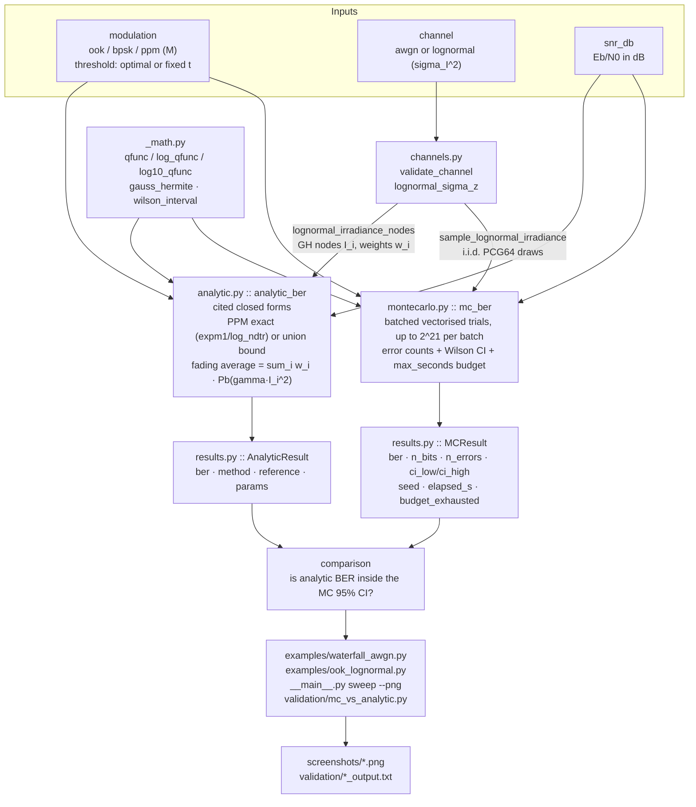
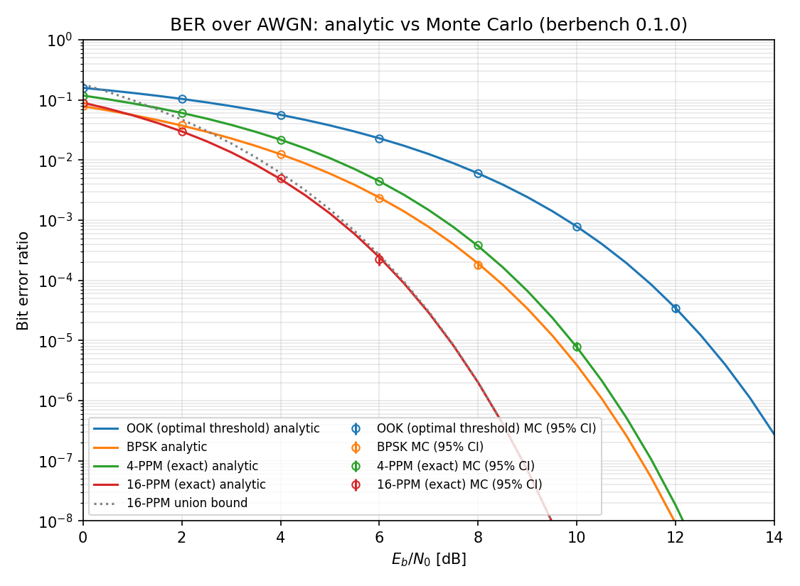
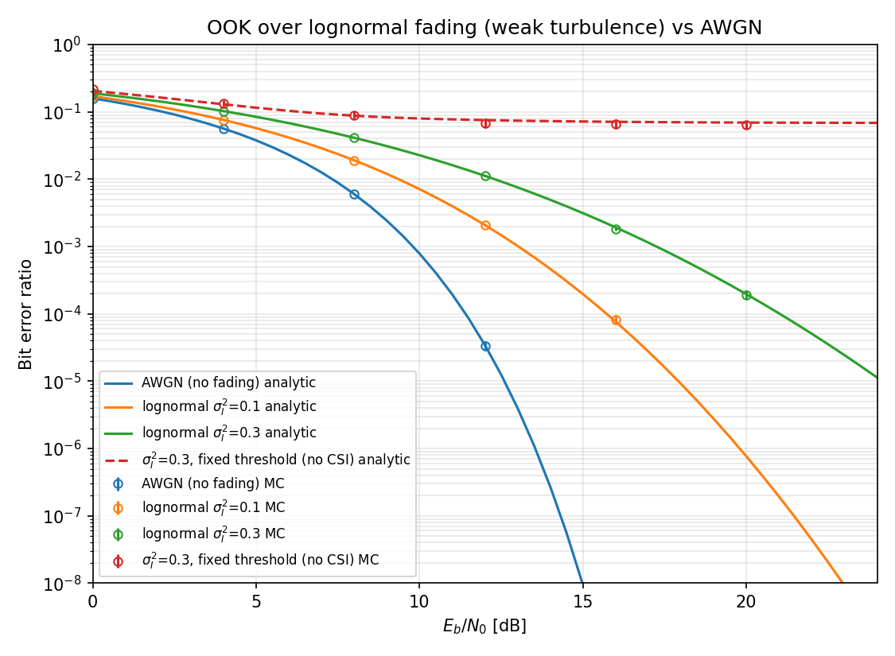

# berbench

Analytic and Monte Carlo bit-error-ratio curves for OOK, BPSK and M-PPM over AWGN and lognormal fading.


## The problem

Sizing an optical link margin means putting a number on the BER at a given
Eb/N0, and the number usually comes from a curve someone plotted once and
nobody re-derived. Three mistakes recur: quoting an M-PPM union bound as if it
were exact (it is 2.03x high at 0 dB for M=16), ignoring the irreducible error
floor a fixed decision threshold hits under scintillation, and reporting a
Monte Carlo point that rests on three observed errors. Each is worth dB of
margin, and none is visible on a plotted curve without the interval and the
citation attached.

## What this does

- Evaluates **five cited closed-form BER expressions** — BPSK, OOK at the
  optimal threshold, OOK at a fixed threshold, M-PPM exact, M-PPM union bound —
  over AWGN and, by Gauss-Hermite averaging, over lognormal fading, with the
  literature reference carried on the returned object rather than in a comment.
- Averages any conditional BER over weak-turbulence lognormal irradiance by
  Gauss-Hermite quadrature, agreeing with independent adaptive quadrature to
  **1.99e-10 relative** across eight adaptive-threshold cases
  (`validation/lognormal_gh_vs_quad_output.txt`).
- Runs vectorised Monte Carlo with a **Wilson 95% score interval** on every
  point, a seeded PCG64 generator, and a hard `max_seconds` wall-clock budget
  that reports `budget_exhausted` rather than overrunning.
- Computes the exact M-PPM orthogonal-signalling expression in `expm1`/
  `log_ndtr` form, which stays accurate down to **BER 2.9e-21** where the naive
  integrand loses all precision below SER ~1e-12
  (`validation/ppm_bound_vs_exact_output.txt`).
- Ships **68 passing tests** and five rerunnable validation scripts whose raw
  output is committed alongside them, total Monte Carlo wall time ~15 s.

## Who it is for

- Free-space optical and RF link-budget engineers who need a cited baseline
  curve rather than a plotted one.
- Researchers who want a Monte Carlo harness that reports an interval and a
  seed with every point.
- Students checking a textbook BER derivation against a numerical evaluation.

## Who it is not for

- Anyone needing PSK/QAM constellations, OFDM, MIMO or channel coding — none of
  that is here. Use `scikit-commpy` or Sionna.
- Anyone modelling fibre: no split-step Fourier propagation, no dispersion, no
  EDFA. Use OptiCommPy or Sionna's optical channel module.
- Anyone in strong turbulence. The lognormal model is valid for
  sigma_I^2 < ~1; there is no gamma-gamma model.
- Anyone doing photon-counting direct detection. The noise model is additive
  signal-independent Gaussian, not Poisson.
- Anyone who only wants BPSK over AWGN. That is `0.5 * erfc(sqrt(gamma))` and
  needs no dependency.

## Alternatives, honestly

BER-versus-SNR curves for standard modulations are textbook material and are
implemented in several mature libraries. This repository does not claim new
mathematics. What it adds is a small, validated set of closed-form references
for the modulations that actually appear in free-space optical links — OOK with
both an adaptive and a fixed decision threshold, and M-ary PPM in exact and
union-bound form — averaged over weak-turbulence lognormal fading, with each
analytic curve checked against an independent numerical evaluation of its
published expression and the check output committed (see
[Validation evidence](#validation-evidence)). If your modulation is PSK or QAM,
or your channel is fibre or a 5G multipath model, one of the following is a
better tool.

| Alternative | What it does better | When to use it instead of this |
|---|---|---|
| [`scikit-commpy`](https://pypi.org/project/scikit-commpy/) 0.8.0 (imports as `commpy`; last release 2022-10-10) | A general digital-communications toolkit: PSK and QAM modems, OFDM, MIMO detection (ML, K-best, best-first), convolutional/turbo/LDPC coding, raised-cosine pulse shaping, Rayleigh and Rician fading, and its own Monte Carlo link-model BER harness. | Any coded link, any PSK/QAM constellation, MIMO, or pulse-shaping study. It has no OOK or PPM modulator and no lognormal turbulence channel, which is the gap this repo fills. |
| [Sionna](https://pypi.org/project/sionna/) 2.0.1 (NVIDIA, Apache-2.0, released 2026-03-31) | Far larger scope and far more compute: GPU-accelerated, differentiable link-level (Sionna PHY) and system-level simulation, plus a ray tracer for radio propagation. Its optical channel module is fibre — split-step Fourier plus EDFA — not free-space. | 5G/6G physical-layer research, learned receivers or any gradient-based optimisation, ray-traced propagation, or Monte Carlo at a scale that needs a GPU. Costs a PyTorch 2.9+, LLVM and Mitsuba dependency stack; this repo is numpy and scipy. |
| [OptiCommPy](https://pypi.org/project/OptiCommPy/) 0.10.0 (GPL-3.0, released 2025-08-08) | A complete fibre-optic system simulator: split-step Fourier propagation on CPU and GPU, polarisation-multiplexed WDM, coherent receiver DSP (matched filtering, clock recovery, CD compensation, adaptive equalisation, carrier phase recovery), and BER/SER/EVM/MI/GMI/NGMI metrics. Includes OOK. | Anything involving optical fibre, coherent detection chains, or information-theoretic metrics beyond BER. It targets fibre, so it carries no atmospheric turbulence channel and no PPM. |
| [GNU Radio](https://wiki.gnuradio.org/index.php/BER_Curve_Gen.) (gr-digital ships `berawgn.py` and a BER Curve Gen block) | Real waveforms end to end, with filtering, timing and carrier synchronisation, framing, and actual SDR hardware in the loop. | Hardware-in-the-loop measurement, or when synchronisation and timing losses matter more than the ideal-detection bound. This repo models ideal coherent or threshold detection only. |
| [`scikit-dsp-comm`](https://pypi.org/project/scikit-dsp-comm/) 2.1.2 (imports as `sk_dsp_comm`; released 2026-04-09) | Signals-and-systems and DSP teaching material: FIR/IIR filter design helpers, multirate processing, PLL and carrier/phase synchronisation simulation, convolutional coding with soft-decision Viterbi, and C/C++ coefficient export. | Filter design, synchronisation studies, or embedded DSP work. Its digital-communications module does not cover optical modulations or turbulence fading. |
| `scipy.special` alone | Nothing to install, nothing to trust. | A single BPSK-over-AWGN curve. `Q(sqrt(2*gamma))` is one line and this repo would be overhead. |

## Install and first run

```bash
git clone https://github.com/OmAcharya-avtr/berbench.git
cd berbench
python -m venv .venv && source .venv/bin/activate
pip install -e ".[dev]"
python -m pytest tests/
python examples/waterfall_awgn.py
```

`pytest` prints:

```
....................................................................     [100%]
68 passed in 4.74s
```

`examples/waterfall_awgn.py` prints, and writes `screenshots/waterfall_awgn.png`:

```
OOK (optimal threshold): n=4372844 bits/point, errors=[693615, 455324, 246893, 100938, 26384, 3439, 151], 1.9 s
BPSK: n=785720 bits/point, errors=[61810, 29773, 9796, 1840, 143], 0.2 s
4-PPM (exact): n=19507834 bits/point, errors=[2304837, 1187234, 426582, 86276, 7441, 156], 8.4 s
16-PPM (exact): n=619696 bits/point, errors=[55503, 18534, 3060, 140], 0.2 s
saved .../berbench/screenshots/waterfall_awgn.png (11.2 s total)
```

The runtime figures are from a 2-core machine (Python 3.11, numpy 2.4.4,
scipy 1.17.1). The MC error counts vary with the numpy version's generator
implementation, not with the seed handling; the seed (`2026` in this example)
fixes them on any one machine. Plotting needs `matplotlib`, pulled in by the
`dev` extra or by `pip install -e ".[plot]"`.

There is also a CLI:

```bash
python -m berbench sweep --mod ook bpsk --snr 0:13:4 --channel awgn
```

```
mod   Eb/N0 dB  BER analytic
----------------------------
ook   0         1.587e-01
ook   4         5.650e-02
ook   8         6.004e-03
ook   12        3.430e-05
bpsk  0         7.865e-02
bpsk  4         1.250e-02
bpsk  8         1.909e-04
bpsk  12        9.006e-09
```

## Worked example

```python
import numpy as np
from berbench import analytic_ber, mc_ber, n_bits_for_target

snr = np.array([4.0, 6.0, 8.0, 10.0])              # Eb/N0 in dB

ana = analytic_ber("bpsk", snr)                     # Q(sqrt(2*gamma))
n = n_bits_for_target(float(ana.ber.min()), min_errors=150)
mc = mc_ber("bpsk", snr, n=n, seed=2026)            # Wilson 95% CI per point

print(f"reference : {ana.reference}")
print(f"bits/point: {n}  ({mc.elapsed_s:.2f} s, budget_exhausted={mc.budget_exhausted})")
for i, s in enumerate(snr):
    inside = mc.ci_low[i] <= ana.ber[i] <= mc.ci_high[i]
    print(f"{s:5.1f} dB  analytic {ana.ber[i]:.4e}  mc {mc.ber[i]:.4e}"
          f"  errors {mc.n_errors[i]:6d}  CI [{mc.ci_low[i]:.3e}, {mc.ci_high[i]:.3e}]  in-CI {inside}")

# M-PPM: the exact orthogonal-signalling expression, and the union bound above it
exact = analytic_ber("ppm", 8.0, M=16, ppm_method="exact").ber[0]
bound = analytic_ber("ppm", 8.0, M=16, ppm_method="union").ber[0]
print(f"16-PPM @ 8 dB   exact {exact:.4e}   union bound {bound:.4e}   ratio {bound / exact:.4f}")

# OOK through weak turbulence: with CSI the curve keeps falling; without CSI it floors
csi = analytic_ber("ook", 30.0, channel="lognormal", sigma_i2=0.3).ber[0]
nocsi = analytic_ber("ook", 30.0, channel="lognormal", sigma_i2=0.3, threshold=0.5)
print(f"OOK @ 30 dB, sigma_I^2=0.3   adaptive threshold {csi:.4e}"
      f"   fixed t=0.5 {nocsi.ber[0]:.4e}  ({nocsi.method})")
```

Output:

```
reference : Proakis & Salehi 2008, Eq. (4.3-13): Pb = Q(sqrt(2 Eb/N0))
bits/point: 38738587  (3.84 s, budget_exhausted=False)
  4.0 dB  analytic 1.2501e-02  mc 1.2515e-02  errors 484810  CI [1.248e-02, 1.255e-02]  in-CI True
  6.0 dB  analytic 2.3883e-03  mc 2.3825e-03  errors  92296  CI [2.367e-03, 2.398e-03]  in-CI True
  8.0 dB  analytic 1.9091e-04  mc 1.9190e-04  errors   7434  CI [1.876e-04, 1.963e-04]  in-CI True
 10.0 dB  analytic 3.8721e-06  mc 3.8979e-06  errors    151  CI [3.324e-06, 4.571e-06]  in-CI True
16-PPM @ 8 dB   exact 1.9921e-06   union bound 2.0266e-06   ratio 1.0173
OOK @ 30 dB, sigma_I^2=0.3   adaptive threshold 5.0119e-08   fixed t=0.5 6.7951e-02  (closed-form + GH(256) fading average)
```

Two things to read out of that output. The union bound is 1.7% high at 8 dB for
M=16, which matches the validated ratio 1.0173 in
`validation/ppm_bound_vs_exact_output.txt`. And at 30 dB the fixed-threshold OOK
BER is 6.80e-02 against 5.01e-08 for the adaptive threshold — six decades of
penalty, entirely from the missing channel-state information.

## Architecture



`n_bits_for_target(ber_expected, min_errors)` sits in front of `mc_ber` and
sizes each point: `n = ceil(min_errors / ber_expected)`. That is the entire
reason the Monte Carlo points in the plots below stop where they do.

## Screenshots

Both PNGs are produced by the scripts in `examples/`, so they cannot drift from
the code.



`examples/waterfall_awgn.py`. Two things to notice. First, agreement: every
Monte Carlo marker sits on its analytic curve, and the error bars are shorter
than the marker until the last point of each series — that is what a correct
implementation looks like. Second, where the markers stop. Each series is sized
for about 150 expected errors at its dimmest point and capped at 2e7 bits, so
the lowest measurable BER is roughly `150 / n`: OOK ran 4,372,844 bits per
point and its last marker is at 3.43e-05 with 151 errors, BPSK ran 785,720 bits
and stops at 8 dB, 16-PPM ran 619,696 bits and stops at 6 dB. Below those the
analytic curve continues alone, because Monte Carlo has run out of samples, not
because the curve stopped being valid. The dotted grey line is the 16-PPM union
bound: visibly above the exact red curve at low SNR, indistinguishable from it
past about 10 dB, which is the 2.0254 -> 1.0000 ratio recorded in the
validation output.



`examples/ook_lognormal.py`. The three solid curves are the same OOK receiver
under no fading, sigma_I^2 = 0.1 and sigma_I^2 = 0.3; the horizontal shift
between them at a fixed BER is the turbulence penalty in dB. The dashed red
curve is the one to look at: same channel as the green curve, but with a fixed
decision threshold t = 0.5 and no channel-state information. It flattens onto
an irreducible floor near 7e-02 and stays there — additional transmit power
buys nothing, because the errors come from deep fades crossing a threshold that
never moves. Its Monte Carlo points needed only 2,163 bits per point to reach
150 errors, which is why they extend to 20 dB while the AWGN series stops at
12 dB.

## Validation evidence

Level 2 (Research). Every row below comes from a script in `validation/` whose
raw output is committed next to it. Rows that did not pass cleanly are included.

| Check | Reference | Result | Tolerance | Script |
|---|---|---|---|---|
| BPSK Pb at Eb/N0 = 9.6 dB | Proakis & Salehi 2008 Eq. (4.3-13), Fig. 4.3-1; Sklar 2001 Sec. 4.7.1 | 9.736176e-06 vs the quoted ~1e-5; curve crosses 1e-5 at 9.5879 dB | within 5% of 1e-5; inverted SNR within 0.05 dB of 9.6 dB | `bpsk_textbook.py` |
| BPSK at 10 dB vs independent scipy path `norm.sf(sqrt(20))` | same expression, separate code path | 3.872108216e-06, rel diff 0.00e+00 | exact | `bpsk_textbook.py` |
| Q(1) | Abramowitz & Stegun Table 26.1 | 0.1586552539 vs 0.1586552539 | 10 significant figures | `bpsk_textbook.py` |
| OOK(gamma) equals BPSK(gamma/2), the exact 3.0103 dB penalty | Proakis & Salehi 2008 Sec. 4.3 (binary ASK); Zhu & Kahn 2002 Eq. (12) | difference 0.000e+00 | exact | `bpsk_textbook.py` |
| 2-PPM exact expression reduces to Q(sqrt(Eb/N0)) | Proakis & Salehi 2008 Eq. (4.4-17) | max abs difference 5.551e-17 over 0-12 dB | machine precision | `ppm_bound_vs_exact.py` |
| Union bound >= exact for M in {4, 16, 64}, 0-12 dB | Proakis & Salehi 2008 Sec. 4.4 (pairwise d^2 = 2Es) | holds at every tested point; M=16 ratio 2.0254 (0 dB), 1.2663 (4 dB), 1.0173 (8 dB), 1.0000 (12 dB) | bound must never fall below exact | `ppm_bound_vs_exact.py` |
| PPM exact vs independent adaptive quadrature (QUADPACK) | Proakis & Salehi 2008 Eq. (4.4-17) integrated in error form | worst 3.10e-07 (M=64, 0 dB, GH truncation); 3.50e-15 at M=64, 12 dB where BER = 2.9055e-21 | < 1e-6 | `ppm_bound_vs_exact.py` |
| Lognormal moments, sigma_I^2 in {0.1, 0.3, 0.8} | Andrews & Phillips 2005 Ch. 8-9 (mean-normalised irradiance) | E[I] = 1.000000000000, Var[I] = sigma_I^2 | 12 decimal places | `lognormal_gh_vs_quad.py` |
| Gauss-Hermite fading average vs `scipy.integrate.quad`, adaptive threshold, 8 cases (OOK and BPSK, sigma_I^2 in {0.1, 0.3}, 6-12 dB) | Zhu & Kahn 2002 Sec. III; Popoola & Ghassemlooy 2009 (SIM-BPSK) | worst relative difference 1.99e-10 | < 1e-8 | `lognormal_gh_vs_quad.py` |
| Same, fixed threshold t = 0.5 (step-like integrand) | same model, no CSI | 7.88e-13 at 12 dB, 1.65e-10 at 20 dB, **4.65e-03 at 30 dB** | < 1% at <= 20 dB, < 5% at 30 dB; passes within documented limits, does not pass the 1e-8 bar above | `lognormal_gh_vs_quad.py` |
| Monte Carlo vs analytic, 54 points across 10 modulation/channel cases, >= ~150 expected errors each, seed base 20260801 | self-consistency of the two engines | **49/54 = 90.7%** of analytic values inside the MC 95% Wilson CI; independent seed base 987654 gave 51/54 = 94.4% | binomial 2-sigma acceptance band for 54 trials at p = 0.95 is 48-54 | `mc_vs_analytic.py` |
| The 5 points that missed | — | `ook threshold=0.4 [awgn]` at 0 dB and 10 dB, `ook sigma_i2=0.1 [lognormal]` at 8 dB, `ook sigma_i2=0.3 [lognormal]` at 0 dB, `bpsk sigma_i2=0.1 [lognormal]` at 0 dB; mixed sign, all within ~2.5 sigma | reported, not excluded | `mc_vs_analytic_results.md` |
| Wilson CI empirical coverage, 200 replicates per case | Wilson 1927, JASA 22, 209-212 | BPSK 4 dB 0.925; OOK 6 dB 0.925; OOK lognormal sigma_I^2=0.3 8 dB 0.950; **4-PPM 4 dB 0.900; 16-PPM 4 dB 0.905** | nominal 0.95, 2-sigma band +/-0.031 for R=200; the two PPM cases sit below the band | `ci_coverage.py` |
| Defect this audit caught | — | the original bit-level Wilson interval for PPM had **75.7% coverage** at M=16, because bit errors inside one symbol are correlated and violate the binomial assumption. Rebuilt on symbol-error counts and rescaled; a 300-replicate spot check during the fix measured 0.923 (M=16 AWGN), 0.930 (M=4 AWGN), 0.927 (M=16 lognormal) | residual ~8% narrowing documented rather than hidden | `ci_coverage.py`, `VALIDATION.md` Sec. 5 |

Total Monte Carlo wall time across all five validation scripts: ~15 s. Full
per-point tables are in `validation/VALIDATION.md` and
`validation/mc_vs_analytic_results.md`.

## API reference

<details>
<summary>Public surface (<code>from berbench import ...</code>)</summary>

| Symbol | Signature and units |
|---|---|
| `analytic_ber` | `analytic_ber(mod, snr_db, *, channel="awgn", sigma_i2=None, M=4, threshold="optimal", ppm_method="exact", n_gh_nodes=64) -> AnalyticResult`. `mod` in `{"ook","bpsk","ppm"}`; `snr_db` = Eb/N0 in dB (float or 1-D array, negative allowed, NaN/inf raise `ValueError`); `sigma_i2` = scintillation index, dimensionless, required for `channel="lognormal"`; `M` = PPM alphabet, power of two, 2 to 4096; `threshold` = `"optimal"` or a fixed fraction in (0, 1) of the mean-irradiance ON amplitude; `n_gh_nodes` in 2..256. |
| `mc_ber` | `mc_ber(mod, snr_db, n=1_000_000, seed=0, *, channel="awgn", sigma_i2=None, M=4, threshold="optimal", ci_level=0.95, max_seconds=None) -> MCResult`. `n` = requested bits per SNR point (rounded up to whole PPM symbols); `seed` seeds numpy PCG64; `ci_level` = two-sided confidence level in (0, 1); `max_seconds` = wall-clock budget in seconds for the whole sweep. |
| `n_bits_for_target` | `n_bits_for_target(ber_expected, min_errors=100) -> int`. Returns `ceil(min_errors / ber_expected)` bits. At ~100 errors the 95% Wilson half-width is about +/-20% relative. |
| `qfunc` | `qfunc(x) -> ndarray or float`. Gaussian tail probability Q(x), dimensionless, via `scipy.special.ndtr(-x)`. Underflows to 0 near x ~ 38. |
| `log_qfunc`, `log10_qfunc` | `log_qfunc(x)`, `log10_qfunc(x)`. Natural and base-10 logarithm of Q(x) via `log_ndtr`; stay finite far past the underflow point of `qfunc`. |
| `wilson_interval` | `wilson_interval(k, n, level=0.95) -> (low, high)`. Wilson score interval on the proportion k/n; `k` = observed errors, `n` = trials. |
| `lognormal_irradiance_nodes` | `lognormal_irradiance_nodes(sigma_i2, n_nodes=64) -> (irradiance_nodes, weights)`. Gauss-Hermite nodes I_i (dimensionless, mean-normalised) and weights already divided by sqrt(pi), so `E[f(I)] ~ sum_i w_i f(I_i)`. |
| `sample_lognormal_irradiance` | `sample_lognormal_irradiance(rng, size, sigma_i2) -> ndarray`. i.i.d. draws with `ln I ~ N(-sigma_z^2/2, sigma_z^2)`, `sigma_z^2 = ln(1 + sigma_I^2)`, `E[I] = 1`. |
| `AnalyticResult` | Frozen dataclass: `mod`, `channel`, `snr_db` (dB), `ber` (dimensionless, in [0, 1]), `method`, `reference` (the literature citation string), `params`. |
| `MCResult` | Frozen dataclass: `mod`, `channel`, `snr_db` (dB), `ber`, `n_bits` (int array), `n_errors` (int array), `ci_low`, `ci_high`, `ci_level`, `ci_method` (`"wilson"`), `seed`, `elapsed_s` (seconds), `budget_exhausted` (bool), `params`. |
| `MODULATIONS`, `CHANNELS` | `("ook", "bpsk", "ppm")` and `("awgn", "lognormal")`. |
| `__version__` | `"0.1.0"`. |

SNR convention throughout: `gamma = Eb/N0`, electrical, per bit, dimensionless,
supplied in dB. For PPM, `Es = log2(M) * Eb`.

CLI: `python -m berbench sweep --mod {ook,bpsk,ppm} --snr START:STOP:STEP
[--channel {awgn,lognormal}] [--sigma-i2 S] [--mc] [--n N] [--png FILE]`.

</details>

## Limitations

1. **Modulations covered:** OOK (optimal and fixed threshold), BPSK, and M-ary
   PPM for M a power of two from 2 to 4096. Nothing else. No PSK beyond binary,
   no QAM, no OFDM, no MIMO, no channel coding.
2. **Channels covered:** AWGN, and lognormal fading for weak fluctuations. The
   lognormal model is valid for sigma_I^2 < ~1; above that `analytic_ber` emits
   a `UserWarning` and still computes, but the result is extrapolation. There is
   no gamma-gamma model for moderate-to-strong turbulence, and no pointing-error
   or beam-wander model.
3. **Noise model:** additive, signal-independent, Gaussian. Thermal- or
   background-limited receivers only. No shot-noise (Poisson) statistics, no
   APD excess noise, no inter-symbol interference, no synchronisation loss.
   PPM is modelled as coherent M-ary orthogonal signalling; direct-detection
   photon-counting PPM obeys different statistics and is out of scope.
4. **Monte Carlo sample floor.** `mc_ber` measures a BER of roughly
   `min_errors / n`, and below that it returns zero errors and an interval that
   only bounds the BER from above. At 150 errors this is `150 / n`: 3.4e-05 for
   the 4.37e6 bits per point used by the OOK series in
   `examples/waterfall_awgn.py`, 7.5e-06 at the 2e7-bit cap those examples and
   `validation/mc_vs_analytic.py` impose, and 3.9e-06 at the 3.87e7 bits per
   point in the worked example above. Reaching 1e-09 with 150 errors needs
   1.5e11 bits, which is not what this harness is for. Use the analytic curve
   below the floor; that is what it is validated for.
5. **PPM confidence intervals are about 8% too narrow in half-width.**
   Empirical coverage 0.900-0.905 at M=4 and M=16 against a nominal 0.95
   (`validation/ci_coverage_output.txt`). The interval neglects the variance of
   the wrong-bits-per-symbol-error ratio. Binary modulations are consistent with
   nominal.
6. **Fixed-threshold OOK under fading loses accuracy at high SNR.** The
   Gauss-Hermite average of a step-like integrand reaches 4.65e-03 relative
   error at 30 dB with the node count capped at 256; it is below 1.7e-10 at
   20 dB and below. Use Monte Carlo above 20 dB if you need better than 0.5%.
7. **Fading is i.i.d. per symbol**, giving the ergodic mean BER. Real turbulence
   is correlated over roughly millisecond coherence times, which changes burst
   statistics and interleaver design but not the average BER. No temporal
   correlation, no burst-error analysis.
8. **Compute.** Pure numpy and scipy, single-threaded, batches capped at 2^21
   values. No GPU path. The full validation suite plus both examples runs in
   well under a minute on two cores.

## Reproducing every number

```bash
# 68 passing tests (the badge)
python -m pytest tests/

# validation, each script writes its raw output next to itself
cd validation
python mc_vs_analytic.py        # -> mc_vs_analytic_results.md      (~9 s)
python bpsk_textbook.py         # -> bpsk_textbook_output.txt       (<2 s)
python ppm_bound_vs_exact.py    # -> ppm_bound_vs_exact_output.txt  (~1 s)
python lognormal_gh_vs_quad.py  # -> lognormal_gh_vs_quad_output.txt (~1 s)
python ci_coverage.py           # -> ci_coverage_output.txt         (~5 s)
cd ..

# the two screenshots
python examples/waterfall_awgn.py   # -> screenshots/waterfall_awgn.png
python examples/ook_lognormal.py    # -> screenshots/ook_lognormal.png
```

Scripts are seeded (`mc_vs_analytic.py` base 20260801, `waterfall_awgn.py`
seed 2026, `ook_lognormal.py` seed 7), so a rerun on the same numpy version
reproduces the tables exactly.

## Safety statement

This software is research-grade. It is not flight-qualified, not certified, and
not approved for operational aerospace use.

## Licence

MIT. See [LICENSE](LICENSE). Copyright (c) 2026 OPTIMA Organisation.

## Citation

```bibtex
@software{berbench2026,
  title   = {berbench: BER computation and Monte Carlo benchmarking for
             OOK/BPSK/M-PPM over AWGN and lognormal fading},
  author  = {{OPTIMA Organisation}},
  year    = {2026},
  version = {0.1.0},
  license = {MIT}
}
```

References for the implemented expressions: Proakis & Salehi, *Digital
Communications*, 5th ed., 2008 (Eqs. 4.3-13, 4.4-17, 4.4-18; Secs. 4.3, 4.4);
Andrews & Phillips, *Laser Beam Propagation through Random Media*, 2nd ed.,
SPIE, 2005 (Chs. 8-9); Zhu & Kahn, IEEE Trans. Commun. 50(8), 2002 (Eq. 12,
Sec. III); Popoola & Ghassemlooy, J. Lightwave Technol. 27(8), 2009;
Wilson, J. Amer. Statist. Assoc. 22, 209-212, 1927; Abramowitz & Stegun,
*Handbook of Mathematical Functions*, Table 26.1; Sklar, *Digital
Communications*, 2nd ed., 2001 (Sec. 4.7.1).

## Credits

This is under reserved rights obtained by OPTIMA Organisation.
