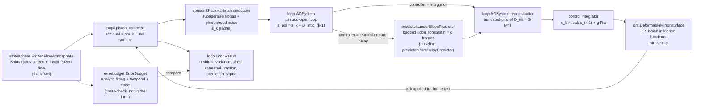
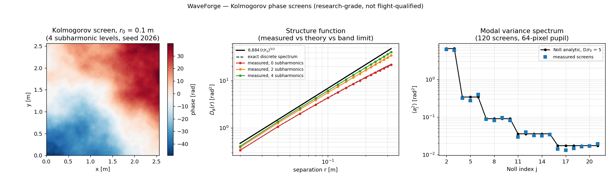
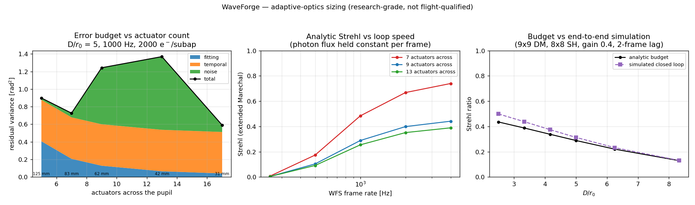
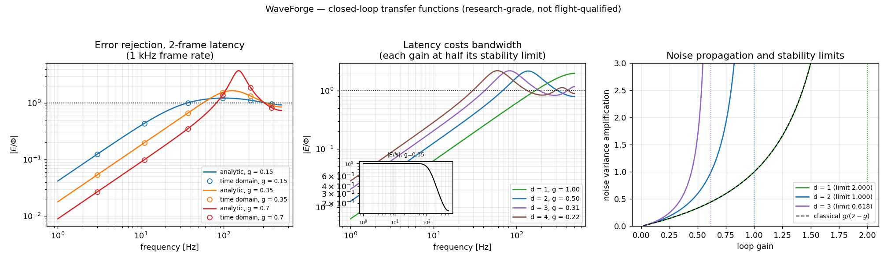
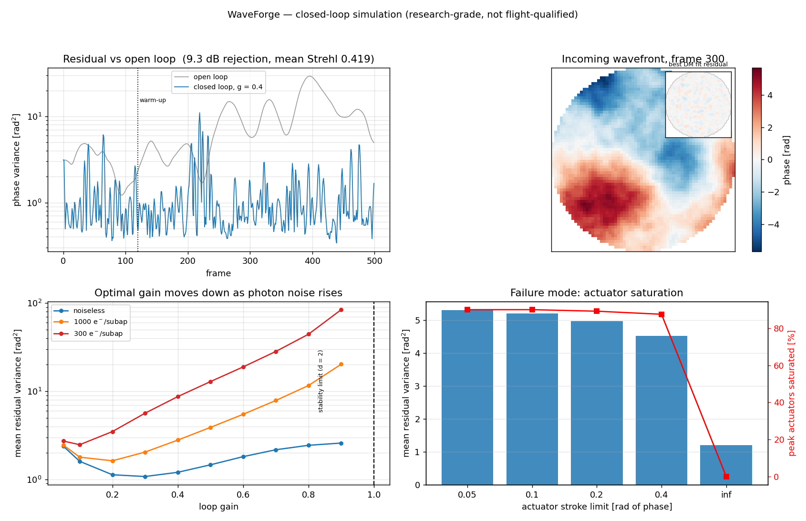
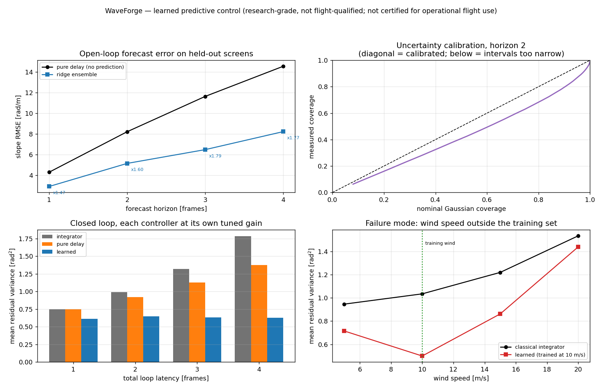

# WaveForge

Adaptive-optics sizing, closed-loop simulation, and a learned predictive controller benchmarked against the classical one.


## The problem

Sizing an adaptive-optics terminal means choosing an actuator count, a
subaperture count and a loop rate against a turbulence profile, and those three
trade against each other through terms that scale in opposite directions:
fitting error falls with actuator pitch, temporal error falls with loop speed,
and noise error rises with loop speed because each frame collects fewer photons.
The second problem is latency — a classical integrator corrects the wavefront it
measured one to four frames ago, and under frozen flow that stale correction is
measurably worse than one built from a forecast. Whether a learned forecaster is
worth its complexity, and where it stops working, is an empirical question that
needs a bench with a properly tuned classical baseline on it.

## What this does

- Reproduces the analytic closed-loop rejection transfer function from the
  time-domain loop to **1.7e-14** and the `d = 1, 2, 3` stability limits to
  **3.5e-10** (`validation/validate_rejection_tf.py`).
- Derives Noll's Kolmogorov modal statistics rather than tabulating them, and
  matches Noll (1976) Table IV to **0.53 %** worst case across `J = 1…21`
  (`validation/validate_zernike.py`).
- Converges the deformable-mirror fitting coefficient to **0.273** at 33 × 33
  actuators against the published 0.28, a **−2.4 %** difference
  (`validation/validate_fitting_error.py`).
- Benchmarks a bagged-ridge predictive controller against a gain-tuned
  integrator on held-out phase screens: **1.25×** lower residual variance at one
  frame of latency, **3.45×** at four (`validation/validate_predictor.py`).
- Reports where that same learned controller **loses**: at twice its training
  wind speed it is **17 % worse** than the plain integrator, and deployed on a
  100 e⁻/subaperture sensor it was not trained for it is **5.9× worse**.

Every figure above is printed by a script in `validation/` whose raw transcript
is committed next to it. Nothing in this README is quoted from anywhere else.

## Who it is for

- Optical and GNC engineers sizing an AO subsystem for a free-space optical
  terminal or an airborne imaging turret, who need each budget term to carry a
  source and a stated validity range.
- Researchers comparing control laws who need a common bench where the
  classical baseline is tuned in its own favour rather than handicapped.
- Anyone who needs an AO result they can regenerate from an integer seed on two
  CPU cores.

## Who it is not for

- Anyone who needs **multi-layer turbulence, laser guide stars, tomography, or
  cone effect**. WaveForge models a single frozen-flow layer only. Use soapy or
  COMPASS.
- Anyone who needs **spot images, centroid bias, spot truncation or elongation**.
  Slopes here are exact subaperture-averaged gradients plus additive Gaussian
  noise. Use HCIPy, or the companion product P018 ShackSim.
- Anyone who needs **diffractive propagation, coronagraphy or a PSF**. There is
  no Fresnel/Fraunhofer propagation in this package. Use HCIPy or poppy.
- Anyone who needs **thousands of frames per second at ELT scale**. A closed-loop
  frame here costs about 1.4 ms on one CPU core. Use COMPASS on a GPU.
- Anyone who needs a **flight-qualified or certified** tool. This is not one.

## Alternatives, honestly

All eight were checked against their live PyPI or GitHub listing.

| Alternative | What it does better than WaveForge | Use it instead when |
|---|---|---|
| [HCIPy](https://github.com/ehpor/hcipy) — `pip install hcipy` | Fraunhofer and Fresnel propagation, coronagraphs, pyramid/Zernike/vector-APP wavefront sensors, real microlens spot images | You need diffractive propagation, coronagraphy, or any sensor that is not a geometric Shack-Hartmann |
| [soapy](https://github.com/AOtools/soapy) — `pip install soapy` | Multi-layer atmospheres, laser guide stars with cone effect and elongation, tomographic SCAO/MCAO/LTAO, configuration-file-driven end-to-end runs | Your problem involves tomography, LGS, or more than one turbulence layer |
| [COMPASS](https://github.com/COSMIC-RTC/compass) — GPU, distributed via conda/source (the PyPI name `compass` is an unrelated geolocation library) | GPU end-to-end simulation at ELT scale and RTC-realistic frame rates; the platform most large-scale AO control and ML-control studies run on | You have a CUDA GPU and need ELT-scale pupils or very long runs |
| [OOPAO](https://github.com/cheritier/OOPAO) — GitHub only, not on PyPI | Python port of the OOMAO model: KL bases, modal-to-command matrices, pyramid WFS, conventions matched to systems on sky | You want OOMAO's modelling conventions without leaving Python |
| [OOMAO](https://github.com/rconan/OOMAO) — MATLAB | The mature, widely cited object-oriented AO toolbox that a large share of published AO simulation results were produced with | You work in MATLAB and want the established reference implementation |
| [AOtools](https://github.com/AOtools/aotools) — `pip install aotools` | A broad library of standalone AO functions: phase screens, Zernike and Karhunen-Loève bases, turbulence statistics, image quality metrics | You want individual, well-tested analysis functions rather than an assembled closed loop |
| [poppy](https://github.com/spacetelescope/poppy) — `pip install poppy` | Physical optics propagation maintained by STScI; the engine behind JWST PSF modelling | Your question is the point-spread function and diffraction, not the control loop |
| [prysm](https://github.com/brandondube/prysm) — `pip install prysm` | Numerical optics breadth: polynomial bases, thin films, detector modelling, and interferometer data analysis | You are reducing lab interferometer data or modelling a detector chain |

Reach for WaveForge only when what you want is the **sizing trade and the
control-law comparison**: an error budget whose every term carries a citation
and a measured validity range, a classical baseline whose gain is retuned at
every latency and noise level before the learned controller is allowed to
compete with it, and a benchmark that finishes in 98 s on two cores with no GPU.
For the physics that WaveForge deliberately omits, the packages above are better
and you should use them.

## Install and first run

```bash
git clone https://github.com/OmAcharya-avtr/waveforge.git
cd waveforge
python -m venv .venv && source .venv/bin/activate
pip install -e ".[test]"
python -m pytest tests/ -q
python -m waveforge budget --r0 0.1
```

The test suite takes about 9 s and ends with:

```
635 passed in 8.97s
```

`python -m waveforge budget --r0 0.1` prints the analytic sizing budget for the
default 0.5 m, `r₀ = 0.10 m` configuration:

```
WaveForge error budget  (D/r0 = 5.000)
  actuator pitch     : 62.50 mm
  subaperture size   : 62.50 mm
  valid subapertures : 52
  actuators          : 121
  slope noise sigma  : 0 rad/m
  stability limit    : gain < 1.0000
  noise variance gain: 0.3889
  fitting_rad2        : 0.127926
  temporal_rad2       : 0.471521
  noise_rad2          : 0
  other_rad2          : 0
  total_rad2          : 0.599446
  rms_rad             : 0.774239
  strehl_marechal     : 0.549116
  dominant term      : temporal
```

Then run the loop itself, `python -m waveforge loop --frames 400`:

```
closed loop: 400 frames, gain 0.4, latency 2 frames
  open-loop variance : 11.1447 rad^2
  residual variance  : 0.9770 rad^2
  rejection          : 10.57 dB
  Strehl (numerical) : 0.4323
  Strehl (Marechal)  : 0.3764
  max saturation     : 0.000
  diverged           : False
```

The five scripts in `examples/` print nothing; each writes one PNG into
`screenshots/`. `python examples/phase_screen_gallery.py` takes about 13 s and
regenerates `screenshots/phase_screen_gallery.png`.

## Worked example

```python
from dataclasses import replace

from waveforge import (AOConfig, AOSystem, LinearSlopePredictor,
                       PureDelayPredictor, make_slope_dataset)

config = AOConfig(diameter_m=0.5, r0_m=0.10, n_sub=8, n_act=9,
                  wind_speed_m_s=10.0, frame_rate_hz=1000.0,
                  gain=0.4, delay_frames=2)
system = AOSystem(config)

print(f"D/r0 = {config.d_over_r0:.2f}, {system.sensor.n_valid} valid subapertures, "
      f"{system.mirror.n_actuators} actuators")
print("analytic budget [rad^2]:",
      {k: round(v, 4) for k, v in system.error_budget().as_dict().items()})

# Evaluate on a phase screen the predictor will never be trained on.
held_out = AOSystem(replace(config, seed=901))
classical = held_out.run(400, warmup_frames=100, rng=31337)
print(f"integrator      : var {classical.mean_residual_variance:.4f} rad^2, "
      f"S {classical.mean_strehl:.4f}, rejection {classical.rejection_db:.2f} dB")

# Train on different atmospheric realisations (seeds 101-103), not on slices of one.
data = make_slope_dataset(config, n_frames=400, train_seeds=(101, 102, 103), test_seeds=(901,))
model = LinearSlopePredictor(n_history=4, horizon=2, n_members=8).fit(data.train)
print(f"predictor       : alpha {model.chosen_alpha:g}, {model.n_parameters} coefficients")

for name, pred in (("pure delay", PureDelayPredictor(horizon=2, n_history=4)),
                   ("learned", model)):
    r = held_out.run(400, warmup_frames=100, rng=31337, predictor=pred)
    print(f"{name:<16}: var {r.mean_residual_variance:.4f} rad^2, S {r.mean_strehl:.4f}")
```

Output, 15 s on two cores:

```
D/r0 = 5.00, 52 valid subapertures, 121 actuators
analytic budget [rad^2]: {'fitting_rad2': 0.1279, 'temporal_rad2': 0.4715, 'noise_rad2': 0.0, 'other_rad2': 0.0, 'total_rad2': 0.5994, 'rms_rad': 0.7742, 'strehl_marechal': 0.5491}
integrator      : var 1.0867 rad^2, S 0.4221, rejection 13.96 dB
predictor       : alpha 0.1, 346944 coefficients
pure delay      : var 0.9187 rad^2, S 0.4453
learned         : var 0.6005 rad^2, S 0.6090
```

All three controllers run here at the same gain 0.4, so these numbers are not
the benchmark below, where each controller is given its own tuned gain first.

## Architecture



All latency lives in one explicit measurement buffer of `d − 1` frames plus the
one-frame mirror application delay, so the simulated loop and the analytic
transfer function of `control.rejection_transfer` are provably the same
equation — which is what makes the 1.7e-14 agreement below meaningful rather
than coincidental.

## Screenshots

Each PNG is regenerated by the example script named beneath it, so none of them
can drift from the code.



`examples/phase_screen_gallery.py` — notice the centre panel: the measured
structure function sits on the exact band-limited expectation, not on the
continuous theory curve above it. That gap is the method, not a bug.



`examples/error_budget_sizing.py` — notice the left panel's minimum: past about
9 actuators across, fitting error stops dominating and adding actuators buys
almost nothing, which is the whole point of the trade.



`examples/rejection_transfer.py` — notice that the measured points lie on the
analytic curve everywhere, including the gain peaking above 1 at high frequency
where the loop amplifies rather than rejects.



`examples/closed_loop_run.py` — notice the lower-left panel: the optimal gain
moves *down* as photon flux falls. A gain tuned on noise-free slopes is the
wrong gain on a real sensor.



`examples/predictive_control.py` — notice the lower-right panel, where the red
learned curve crosses above the black integrator curve past the training wind
speed. That crossing is the model's failure point, plotted rather than described.

## Validation evidence

Full transcripts in [`validation/VALIDATION.md`](validation/VALIDATION.md) and in
the committed `validation/*_output.txt` files. Requirements and the verification
matrix are in [`docs/REQUIREMENTS.md`](docs/REQUIREMENTS.md).

### Classical core

| Check | Reference | Result | Tolerance | Verdict |
|---|---|---|---|---|
| Zernike orthonormality, exact quadrature | Noll 1976 Eq. 3 | worst diagonal 6.217e-15, worst off-diagonal 3.478e-15 | 1e-12 | PASS |
| Orthonormality on the Cartesian grid actually used | — | 2.468e-2 at `n_pix = 64`; 1.863e-3 at 256 | — | reported, falls as 1/`n_pix` |
| Noll residual variances `Δ_J`, `J = 1…21` | Noll 1976 Table IV | worst 0.529 % | 1.0 % | PASS |
| Per-mode variances differenced from the table | Noll 1976 Table IV | 13 of 20 consistent; all 7 others high | table rounding half-width | **DOCUMENTED DEVIATION** |
| Total piston-removed variance, two independent routes | Noll 1976; Fried 1965 | 1.032422 vs 1.032765, 0.033 % apart; both ≈0.25 % above Noll's 1.0299 | 0.1 % between routes | PASS |
| Noll's large-`J` asymptote `0.2944 J^(−√3/2)` | Noll 1976 | +1.15 % at `J = 21`, −16.25 % at `J = 20000` | — | reported, not a pass |
| Screens vs the exact discrete expectation | closed form | worst 0.50 % (MC s.e. ≈12.9 %) | 5 % | PASS |
| Screen total variance vs Noll `Δ₁` | Noll 1976 | pooled ratio 0.815, range 0.676–0.967 over four `r₀` | — | reported bias |
| Modal residual after removing modes 1…J | Noll 1976 Table IV | mean ratio 0.975–1.009, flat in `D/r₀` from 1.25 to 10 | — | PASS |
| Pupil tip and tilt variance on screens | Noll 1976 | ratio 0.824 and 0.822 (MC s.e. 0.115) | — | **reported deficit** |
| DM fitting coefficient at 33 × 33 actuators | Hudgin 1977; Hardy 1998 Table 6.1 | 0.2732 corrected vs 0.28 published, −2.4 % | 10 % | PASS |
| Fitting-error exponent across actuator pitch | `(d_act/r₀)^(5/3)` | measured 1.5443 against 5/3 = 1.6667 | — | **reported deviation** |
| Scalar rejection transfer function | Madec 1999 | worst 1.732e-14 | 1e-4 | PASS |
| Stability limits `d = 1, 2, 3` | `z^d − z^(d−1) + g = 0` | worst 3.46e-10 | — | PASS |
| Noise amplification vs `g/(2−g)` | Madec 1999 | worst 1.573e-16 | 1e-6 | PASS |
| Full AO loop vs analytic `\|E(z)\|` | as above | worst 2.568e-2 relative | 2.235e-2 measured sensor+DM floor | PASS |
| Extended Maréchal on scaled Kolmogorov phase | Maréchal 1947 | within 5 % up to `σ² = 0.5`; 17.95 % error at `σ² = 2` | 5 % | validity range measured |
| Extended Maréchal on real closed-loop residuals | — | **underestimates Strehl by up to 26.7 %** | — | **DOCUMENTED DEVIATION** |
| Maréchal beyond `σ² ≈ 2.5` | — | at `σ² = 5`, measured `S = 0.040` against `exp(−5) = 0.0067` | — | **form invalid, do not use** |

### Learned controller against the baselines

Default configuration (0.5 m, `r₀ = 0.10 m`, `D/r₀ = 5`, 10 m/s, 1 kHz, 8 × 8
Shack-Hartmann, 9 × 9 DM). Training screens are seeds 101/102/103, evaluation
screens 901/902 — different atmospheric realisations, never different slices of
one frozen-flow sequence, which would leak. Every controller including the
classical integrator gets its own gain tuned first, on a separate screen
(seed 555). From `validation/validate_predictor_output.txt`.

| Latency `d` | `g` int | Integrator | Pure-delay POL | Learned | `S` int | `S` delay | `S` ML |
|---:|---:|---:|---:|---:|---:|---:|---:|
| 1 | 0.40 | 0.6728 | 0.6728 | **0.5361** | 0.5434 | 0.5434 | **0.6085** |
| 2 | 0.30 | 0.9274 | 0.8637 | **0.5354** | 0.4308 | 0.4519 | **0.6093** |
| 3 | 0.20 | 1.2798 | 1.0669 | **0.5444** | 0.3040 | 0.3848 | **0.6042** |
| 4 | 0.20 | 1.7085 | 1.3736 | **0.4958** | 0.2124 | 0.2818 | **0.6384** |

Residual variance in rad². Open-loop forecast RMSE ratios against the pure-delay
baseline are 0.333, 0.344, 0.367 and 0.404 at horizons 1 to 4.

### Where the baseline wins

These are the results a reader should weigh most heavily, and they are not
footnotes.

**1. The pure-delay baseline is not beaten at one frame of latency.** At `d = 1`
the pseudo-open-loop formulation and the plain integrator give *identical*
residual variance, 0.6728 rad². The entire advantage at `d = 1` comes from
prediction; none of it comes from the control formulation.

**2. The learned controller loses outside its training wind speed.** It was
trained at 10 m/s only. From `validation/validate_predictor_output.txt` §4:

| Wind [m/s] | Integrator | Learned | Winner |
|---:|---:|---:|---|
| 5 | 0.9465 | 0.6178 | learned |
| 10 (trained) | 1.0351 | 0.5861 | learned |
| 15 | 1.2202 | 0.9440 | learned, margin halved |
| **20** | **1.5356** | **1.8005** | **INTEGRATOR, by 17 %** |

**3. The learned controller loses badly on a sensor it was not trained for.**
Trained on noise-free slopes, then deployed under photon noise, §5:

| Flux [e⁻/subap] | slope σ [rad/m] | Integrator | Learned, trained clean | Learned, noise-matched |
|---:|---:|---:|---:|---:|
| ∞ | 0.00 | 0.9578 | 0.5352 | 0.5352 |
| 1000 | 7.79 | 1.5164 | **1.6065** | 0.6318 |
| 300 | 16.91 | 2.4786 | **5.7542** | 1.0090 |
| 100 | 39.70 | 5.0277 | **29.7540** | 3.8755 |

At 100 e⁻ the clean-trained model is **5.9× worse** than the plain integrator.
Retraining at the deployed noise level is mandatory, not advisory.

**4. The predictor's uncertainty output is miscalibrated in both directions.**
Measured coverage inside one sigma, against a nominal 68.3 %: 82.7 % at horizon
1, 76.2 % at 2, 67.4 % at 3, 62.3 % at 4. Conservative at short horizons,
optimistic at long ones, with the mean σ at horizon 4 (2.6805) well below the
actual RMSE (5.8890). Treat σ as a relative confidence signal. Never as a
probability, and never to gate a decision.

**5. The atmosphere is the most predictable one that exists.** Single-layer
frozen flow with no boiling. The measured learned-controller advantage is an
upper bound, not an expectation for real turbulence. No comparison against
measured atmospheric data has been made anywhere in this package.

## API reference

```python
from waveforge import AOConfig, AOSystem, LinearSlopePredictor
```

| Object | Purpose |
|---|---|
| `AOConfig(...)` | Frozen dataclass; every field has a unit and a validated range. `.d_over_r0`, `.frame_time_s [s]` |
| `AOSystem(config)` | Assembles pupil, atmosphere, sensor, mirror, reconstructor |
| `AOSystem.error_budget(fitting_coefficient=None) -> ErrorBudget` | Analytic budget, terms in rad² |
| `AOSystem.run(n_frames, warmup_frames, predictor, rng, gain, delay_frames) -> LoopResult` | Closed-loop run; `gain`/`delay_frames` override without redrawing the atmosphere |
| `AOSystem.open_loop_slopes(n_frames, start_frame) -> (n_frames, n_slopes)` | Slopes in rad/m |
| `AOSystem.interaction_matrix` / `.reconstructor` / `.propagation_matrix` | `D_int = G Mᵀ`, its truncated pseudo-inverse, and `P = Mᵀ R` |
| `LoopResult.mean_residual_variance` / `.mean_open_loop_variance` | rad² after warm-up |
| `LoopResult.mean_strehl` / `.rejection_db` / `.max_saturated_fraction` / `.diverged` | numerical Strehl, dB, fraction, flag |
| `LinearSlopePredictor(n_history, horizon, model, alpha, n_members).fit(sequences)` | Bagged ridge forecaster; `horizon` must equal the loop latency |
| `LinearSlopePredictor.predict(history) -> (slopes, sigma)` | Both in rad/m |
| `LinearSlopePredictor.chosen_alpha` / `.n_parameters` / `.is_fitted` | Selected regularisation, coefficient count, state |
| `PureDelayPredictor(horizon, n_history)` | The baseline: forecast = newest available frame |
| `make_slope_dataset(config, n_frames, train_seeds, test_seeds, noise_sigma, noise_seed)` | Seed-partitioned dataset; refuses overlapping seed sets |

<details>
<summary>Full public surface</summary>

**`pupil`** — `PupilGrid`, `piston_removed(phi, mask)`, `variance(phi, mask) [rad²]`,
`rms(phi, mask) [rad]`, `strehl_from_field(phi, mask)`.

**`zernike`** — `noll_indices`, `noll_to_nm`, `nm_to_noll`, `radial_polynomial`,
`zernike_polar`, `zernike_cartesian`, `zernike_basis`, `zernike_gradient_basis`,
`fit_zernike`.

**`statistics`** — `phase_structure_function(r_m, r0_m) [rad²]`,
`zernike_variance(j, d_over_r0) [rad²]`, `noll_residual_variance(j_max, d_over_r0)`,
`noll_residual_asymptote(j_max, d_over_r0)`, `total_phase_variance`,
`fried_parameter_from_cn2(cn2_path_integral, wavelength_m) [m]`, `greenwood_frequency(r0_m, wind_speed_m_s) [Hz]`,
`greenwood_time_constant(r0_m, wind_speed_m_s) [s]`, `NOLL_RESIDUAL_TABLE`.

**`atmosphere`** — `phase_screen(...) [rad]`, `screen_psd`, `structure_function`,
`FrozenFlowAtmosphere(...).frame(k)`.

**`sensor`** — `ShackHartmann(...).measure(phase, rng) -> SlopeMeasurement`
(`.slopes [rad/m]`, validity flags), `.n_valid`, `.n_slopes`, `.slope_noise_sigma [rad/m]`,
`.subaperture_size_m [m]`.

**`dm`** — `DeformableMirror(...).surface(commands) [rad]`, `.fit(phase)`,
`.fitting_residual`, `.clip`, `.n_actuators`, `.pitch_m [m]`, `.positions_m [m]`.

**`control`** — `Integrator(n_commands, gain, delay_frames, leak)`,
`rejection_transfer(frequency_hz, frame_rate_hz, gain, delay_frames, leak)`, `noise_transfer(...)`,
`noise_variance_gain(gain, delay_frames, leak)`, `stability_limit_gain(delay_frames)`.

**`errorbudget`** — `fitting_error(actuator_pitch_m, r0_m, coefficient=0.28) [rad²]`,
`delay_error(delay_s, r0_m, wind_speed_m_s) [rad²]`, `bandwidth_error(bandwidth_hz, r0_m, wind_speed_m_s) [rad²]`,
`noise_error(slope_noise_sigma, propagation_matrix, noise_gain) [rad²]`, `strehl_marechal(variance_rad2)`,
`strehl_marechal_quadratic(variance_rad2)`, `variance_from_strehl(strehl) [rad²]`,
`ideal_filter_fitting_coefficient()`, `ErrorBudget.as_dict()`.

**`predictor`** — `build_lagged_dataset(...)`, `PureDelayPredictor`,
`LinearSlopePredictor` (`.predict_batch`).

**CLI** — `python -m waveforge {noll,screen,budget,loop,predict}`.

</details>

## Limitations

**Compute budget.** Two CPU cores, no GPU, no PyTorch, scikit-learn only.
`n_jobs = 1` everywhere. A closed-loop frame costs about 1.4 ms; assembling the
default system takes 0.65 s, dominated by the 1024² generating screen; fitting
the eight-member ensemble on 1200 samples takes 0.45 s. Peak resident memory for
a process that assembles, runs 500 frames and fits the predictor was 306 MB. The
slowest script in the repository is `validation/validate_predictor.py` at 98.2 s.
A recurrent or convolutional forecaster is the natural architecture for this
problem and is *not* what is implemented, because PyTorch is unavailable here;
a linear model with explicit lags was chosen instead, which is also what the AO
prediction literature uses.

**Model validity ranges, measured rather than assumed.**

- Extended Maréchal `S ≈ exp(−σ²)`: good to 5 % only up to `σ² = 0.5 rad²`; the
  quadratic form only to `σ² = 0.25`. Above `σ² ≈ 2.5` the numerical Strehl
  saturates at the speckle floor and the form is wrong by a factor of six.
  On genuine closed-loop residuals it underestimates Strehl by up to 26.7 %,
  so use `LoopResult.strehl` for performance and Maréchal only for sizing.
- `σ²_fit = a_F (d_act/r₀)^(5/3)`: the exponent measured across pitch is 1.54,
  not 5/3, and `a_F` rises monotonically with actuator count. Use the law for
  sizing only when many actuators span the aperture.
- The learned predictor: 10 m/s ± 50 % in wind, and only at the sensor noise
  level it was trained on. Outside either, see "Where the baseline wins".
- Slope-noise expressions diverge as `N_ph → 0`; below a few detected
  photoelectrons the centroid is undefined, not merely noisy.
- The control model omits the WFS integration `sinc` roll-off, which matters
  above roughly `0.3 f_s`.

**Things you will otherwise hit the hard way.**

1. Phase screens carry no power below `1/(N d)` or above the grid Nyquist. With
   six subharmonic levels the structure function reaches 1.00 of theory at
   separations ≥ 0.1 m, but pupil tip and tilt still sit at 0.82 of analytic.
   Any tip/tilt magnitude study needs a larger generating screen or a von Kármán
   outer scale.
2. The subharmonic component is not periodic, so a frozen-flow run longer than
   `max_frames` is refused rather than allowed to wrap. A run close to
   `max_frames` re-uses correlated turbulence.
3. On a 64-pixel pupil the Zernike basis is orthonormal only to about 2 %, which
   is why modal results here are quoted as ratios.
4. `LinearSlopePredictor.predict` checks only the vector length. Feeding it
   slopes from a different subaperture layout, ordering or unit is a **silent**
   error.
5. Dropout flags are ignored by the predictor, which treats a dropped
   subaperture's zero as a real measurement.
6. Under actuator saturation the loop is non-linear, so the pseudo-open-loop
   reconstruction is no longer exact and the forecast target itself is biased.
7. A predictor's `horizon` must equal the loop latency; a mismatch raises rather
   than silently degrading.
8. No aliasing term in the error budget (`ErrorBudget.other` is there for it),
   no scintillation, no non-common-path error, no mirror hysteresis or creep.
9. Single turbulence layer, no boiling, no LGS, no cone effect, no tomography.
10. No comparison against measured atmospheric data has been made anywhere in
    this package. Every number here is a statement about this repository's own
    generative model.

## Reproducing every number

From the repository root, with the environment from **Install and first run**:

```bash
python -m pytest tests/ -q                          # 635 passed, ~9 s

python validation/validate_zernike.py               # orthonormality, Noll table, asymptote
python validation/validate_fitting_error.py         # D/r0 scaling, DM fitting coefficient, ~23 s
python validation/validate_rejection_tf.py          # rejection TF, stability, noise gain, ~6 s
python validation/validate_strehl_marechal.py       # Marechal validity range, ~6 s
python validation/validate_atmosphere.py            # screen statistics, subharmonics, ~12 s
python validation/validate_predictor.py             # full ML benchmark + failure modes, ~98 s

python examples/phase_screen_gallery.py             # screenshots/phase_screen_gallery.png
python examples/error_budget_sizing.py              # screenshots/error_budget_sizing.png
python examples/rejection_transfer.py               # screenshots/rejection_transfer.png
python examples/closed_loop_run.py                  # screenshots/closed_loop_run.png
python examples/predictive_control.py               # screenshots/predictive_control.png
```

Each validation script writes the transcript already committed beside it as
`validation/<name>_output.txt`; diffing your run against that file is the
intended check. Fixed seeds throughout: training screens 101/102/103, held-out
screens 901/902, gain tuning 555, sensor-noise streams 4242 (tuning), 8888
(training), 31337 (evaluation), ensemble bootstrap `random_state = 0`. No
dataset is committed; everything is regenerated from integer seeds.

## Safety statement

This software is research-grade. It is not flight-qualified, not certified, and
not approved for operational aerospace use. The learned model is not certified
for operational flight use. It must not be used to certify a link budget, to
size flight hardware without independent analysis, or in any control loop whose
failure has safety consequences.

## Licence

AGPL-3.0-or-later. See [`LICENSE`](LICENSE). Copyright © 2026 OPTIMA
Organisation.

## Citation

```bibtex
@software{waveforge_2026,
  title   = {WaveForge: adaptive-optics sizing, closed-loop simulation and
             predictive control},
  author  = {{OPTIMA Organisation}},
  year    = {2026},
  version = {0.1.0},
  note    = {Research-grade software; not flight-qualified or certified.}
}
```

Model and data provenance: [`MODEL_CARD.md`](MODEL_CARD.md),
[`DATASET_CARD.md`](DATASET_CARD.md).

## Credits

This is under reserved rights obtained by OPTIMA Organisation.
