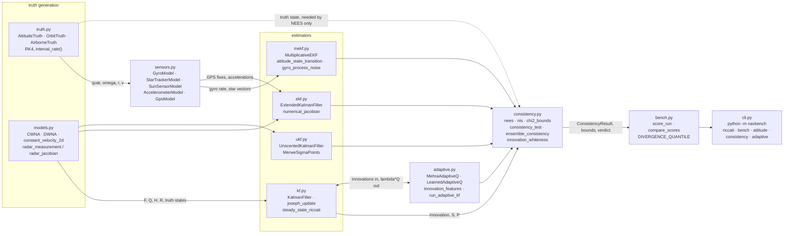
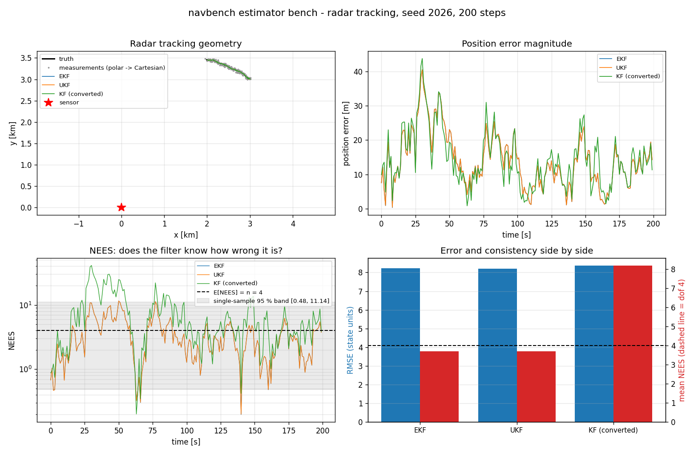
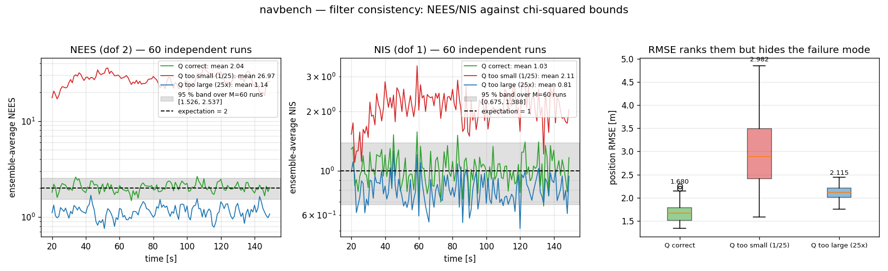
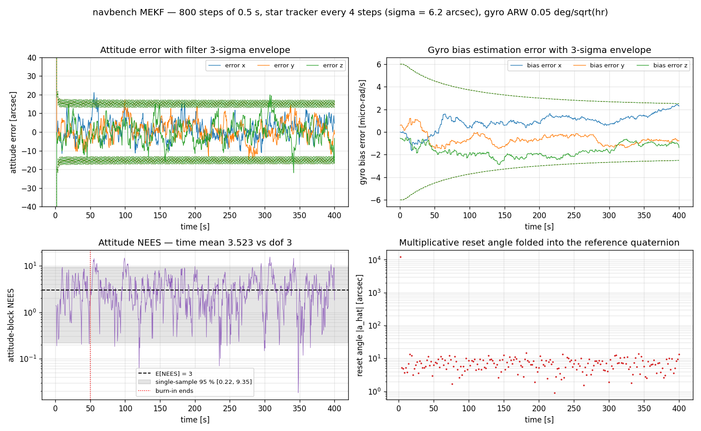
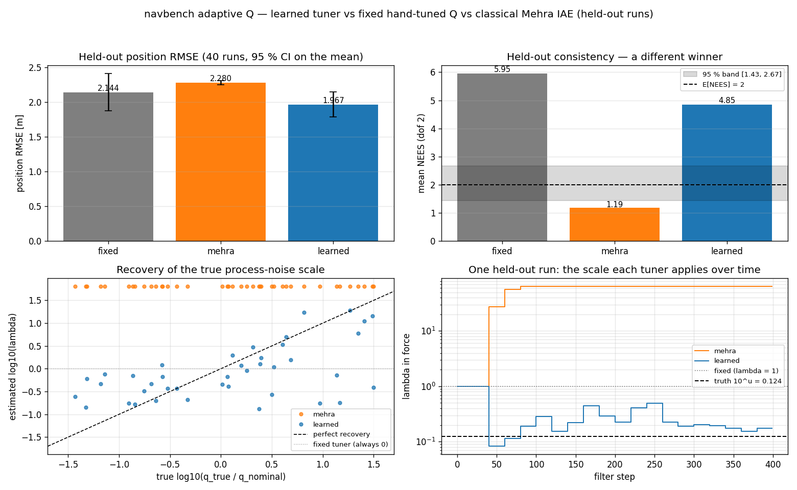
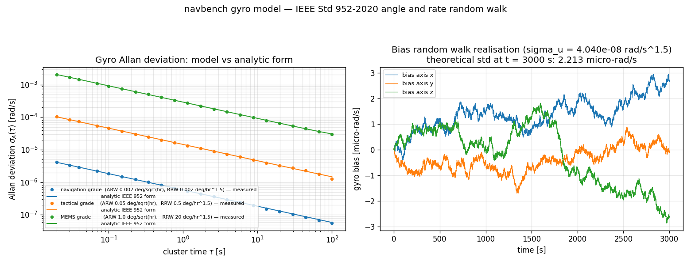

# NavBench

A filter bench that scores KF/EKF/UKF/MEKF on covariance consistency, not only on error.


## The problem

Your estimator reports a covariance, and a guidance law, a fault detector, a
fusion weight and an integrity monitor all believe it. When that covariance is
wrong the estimate still looks plausible and the RMS error may still be fine, so
nothing obviously breaks until something downstream does. NavBench measures the
gap directly: on the benchmark in `validation/v2_nees_nis_consistency_output.txt`,
shrinking a filter's `Q` by 25× raises position RMSE by only 80 % (1.6776 m →
3.0206 m) while its ensemble-average NEES goes from 2.0223 to 26.6001 — thirteen
times its own 95 % upper bound.

## What this does

- **Scores consistency against chi-squared bounds.** NEES, NIS, ensemble bounds
  from Bar-Shalom, Li & Kirubarajan (2001) Eq. (5.4.2-3), and innovation
  whiteness. A correctly specified filter measures ANEES **2.0223** in
  [1.5262, 2.5369]; `Q` 25× too small measures **26.6001**, and `R` 9× too small
  drives ANIS to **7.8740** (`v2`).
- **Runs four estimators on identical data** — linear KF, EKF, UKF, and a
  multiplicative EKF with a quaternion reference state. In a strongly nonlinear
  radar regime (206 m closest approach, 20° bearing σ) the UKF measures mean
  RMSE **50.047 m** against the EKF's **72.358 m**, mean NEES **12.504** against
  **33.657**, and diverges on **1 of 40** runs against **3 of 40** (`v3`).
- **Generates truth you can check against conservation laws.** RK4 attitude
  convergence ratios **16.05 / 16.03 / 16.01** against the ideal 16; two-body
  energy drift **1.708e−12** per revolution; coordinated-turn radius
  **7.094e−15** relative (`v4`, `v5`).
- **Models sensors against their own standards.** Gyro Allan deviation within
  **0.9988–0.9190** of the IEEE Std 952-2020 two-term form across τ = 0.02–50 s,
  with measured log-log slopes **−0.4983** and **+0.4417** against −0.5 / +0.5
  (`v5`).
- **Benchmarks a learned adaptive `Q` tuner against two real baselines** and
  reports the outcome as a split, not a win: lowest held-out RMSE
  (**1.92299 m** vs **2.09982 m** fixed), but **none of the three methods is
  consistent**, the classical baseline's best-looking number is an artefact of
  saturation, and the learned tuner's confidence output is measurably
  uninformative. See
  [The honest result on the AI element](#the-honest-result-on-the-ai-element).

## Who it is for

- GNC engineers choosing between EKF, UKF and MEKF formulations and wanting
  measured evidence instead of folklore.
- Estimation researchers who want truth generation, sensor models and
  consistency scoring already wired together and seeded.
- Systems engineers checking whether a supplier's filter reports an honest
  covariance.
- Students, because every equation carries its source and the failure modes are
  demonstrated rather than described.

## Who it is not for

- Anyone writing flight software, or producing certification evidence.
- Anyone who needs a fast production Kalman filter. This trades speed for
  instrumentation: a plain 2-state KF runs at **8190 steps/s** single-threaded
  (`validation/v7_performance_output.txt`).
- Anyone who needs a real orbit propagator, a real ephemeris, or a
  datasheet-accurate IMU model. The orbit is pure two-body and the gyro has no
  flicker floor.
- Anyone needing a factor-graph smoother, a particle filter, an IMM, or
  multi-hypothesis association. None of those are implemented.
- Anyone expecting validation against flown hardware. There is none; every
  sample in this repository is synthetic.

## Alternatives, honestly

Every package below was checked to exist at the version and date shown.

| Alternative | What it does better | Use it instead of NavBench when |
|---|---|---|
| [FilterPy](https://github.com/rlabbe/filterpy) — PyPI `filterpy` 1.4.5, last release 2018-10-10 | The widest set of textbook filters in Python: KF, EKF, UKF, ensemble KF, particle filter, IMM, fading-memory and square-root forms, RTS and fixed-lag smoothers, with the *Kalman and Bayesian Filters in Python* book behind it. | You want a plain KF, a smoother, an IMM or a particle filter and do not need consistency scoring. `filterpy.stats` provides a `NESS()` helper but no NIS, no chi-squared acceptance bounds and no ensemble consistency test, so you would write that layer yourself. |
| [pykalman](https://github.com/pykalman/pykalman) — PyPI `pykalman` 0.11.2, 2026-01-31 | EM parameter learning for linear-Gaussian models, plus KF/UKF filtering and smoothing with missing-data masking. Actively re-released. | You want `Q` and `R` learned by EM on a linear model. NavBench's adaptive component only scales a single scalar on `Q`, and on its own benchmark that is measurably not enough. |
| [simdkalman](https://github.com/oseiskar/simdkalman) — PyPI `simdkalman` 1.0.4, 2023-12-16 | Vectorised linear KF and smoother across thousands of independent series at once, far faster than a Python loop. | You are filtering many independent linear time series and throughput is the constraint. NavBench runs one series at a time in Python. |
| [GTSAM](https://gtsam.org/) — PyPI `gtsam` 4.2.2, 2026-08-04 | Factor-graph smoothing and mapping: iSAM2, IMU preintegration, marginals, robust kernels; C++ speed with Python bindings. The right tool for a full navigation back end. | Your problem is smoothing or SLAM with loop closure and multi-sensor fusion over a window, rather than one recursive filter you want to interrogate. |
| [Basilisk](https://github.com/AVSLab/basilisk) — AVS Lab, docs at avslab.github.io/basilisk (the unrelated PyPI package named `Basilisk` is a NoSQL mapper, not this) | A full spacecraft simulation framework: dynamics, environment, flight-software modules and Monte Carlo campaigns for mission-level studies. | You need mission-level spacecraft simulation with realistic environment and flight-software modules, not a filter test harness. |
| [Orekit](https://gitlab.orekit.org/orekit) via [orekit-jpype](https://pypi.org/project/orekit-jpype/) 13.1.7.1, 2026-08-19 | Operational-grade space flight dynamics: high-fidelity propagators, frames, time scales, and orbit determination including batch least squares and Kalman/unscented estimators against real measurement types. | You are doing orbit determination on real tracking data. NavBench's two-body propagator is a filter test signal, explicitly not an ephemeris. |
| [AHRS](https://github.com/Mayitzin/ahrs) — PyPI `AHRS` 0.4.0 | A catalogue of published attitude estimators for IMU/MARG data — Madgwick, Mahony, complementary, QUEST, several EKF variants — with WMM and WGS-84 utilities. | You want to compare published attitude filters on IMU data. NavBench implements one MEKF and instruments it rather than offering a catalogue. |
| [NavPy](https://github.com/NavPy/NavPy) — PyPI `NavPy` 1.0, last release 2019-01-21 | Navigation utility routines: coordinate frames, WGS-84 conversions, attitude helpers. | You need frame and coordinate utilities. It is not a filter bench, and it has not been released since 2019. |

**What NavBench actually adds.** Consistency scoring as the primary output: NEES
and NIS with correct single-sample and `M`-run ensemble chi-squared acceptance
regions, an innovation whiteness test, and an API that refuses to pretend a
time-averaged single run is an independent sample (`ConsistencyResult.independent`
is `False` there, and the CLI prints the caveat). Of the packages above the
closest is FilterPy's single `NESS()` helper. That is the whole differentiator —
the filters themselves are textbook, and this README says so. If you want a plain
KF, use FilterPy.

## Install and first run

```bash
git clone https://github.com/OmAcharya-avtr/navbench.git
cd navbench
python -m venv .venv && source .venv/bin/activate
pip install -e ".[dev]"
python -m pytest tests/
python examples/estimator_bench.py
```

Python 3.11+. Runtime dependencies are numpy, scipy and scikit-learn; matplotlib
is used only by `examples/`. `pyproject.toml` already sets `addopts = "-q"`, so
run `python -m pytest tests/` — a second `-q` suppresses the summary line.

Expected output of those two commands:

```console
$ python -m pytest tests/
........................................................................ [ 10%]
   (...)
...................................................................      [100%]
715 passed in 43.78s

$ python examples/estimator_bench.py
estimator                     RMSE   mean NEES             NEES bounds   mean NIS       verdict  diverged
---------------------------------------------------------------------------------------------------------
EKF                         8.2135      3.7008          [3.597, 4.424]     1.8285    consistent     False
UKF                         8.2116      3.6999          [3.597, 4.424]     1.8285    consistent     False
KF (converted)              8.3558      8.1747          [3.597, 4.424]     4.6504    optimistic     False

saved .../screenshots/estimator_bench.png
```

The third row is the point of the example. Converting polar measurements to
Cartesian and running a linear KF costs 1.7 % of RMSE and a factor of 2.2 in
NEES: that filter is optimistic, and only the consistency column says so.

Without installing, every command works with `PYTHONPATH=src`. The CLI:

```console
$ python -m navbench consistency --runs 50 --q-mismatch 0.04
navbench consistency — 50 independent runs x 150 steps, Q mismatch factor 0.04
  ANEES (dof 2): mean 24.9070, bounds [1.4844, 2.5912], 0.0 % of steps inside
  ANIS  (dof 1): mean 1.9796, bounds [0.6471, 1.4284], 6.2 % of steps inside
  single-sample NEES bounds: (0.05063561596857975, 7.377758908227871)
```

Subcommands are `riccati`, `bench`, `attitude`, `consistency` and `adaptive`; all
accept `--json` and exit 2 with a one-line message on invalid input.

## A worked example

The public API needed to reproduce the headline number. Saved as a script and
run, this is exactly what it prints.

```python
import numpy as np

from navbench import (
    KalmanFilter, constant_velocity_cwna, ensemble_consistency, nees,
    simulate_linear_system,
)

f, q_true = constant_velocity_cwna(dt=1.0, q_psd=0.05)  # F, Q for CWNA; q_psd in m^2/s^3
h = np.array([[1.0, 0.0]])                              # position-only measurement
r = np.array([[9.0]])                                   # sigma_z = 3 m


def monte_carlo(q_filter, m_runs=60, n_steps=200, burn_in=30):
    """60 independent runs; returns ensemble NEES with bounds and position RMSE [m]."""
    eps = np.zeros((m_runs, n_steps - burn_in))
    rmse = np.zeros(m_runs)
    for i in range(m_runs):
        rng = np.random.default_rng(90210 + i)          # truth always uses the TRUE Q
        truth, meas = simulate_linear_system(f, h, q_true, r, np.array([0.0, 1.0]), n_steps, rng)
        res = KalmanFilter(f, h, q_filter, r, np.zeros(2), np.diag([100.0, 10.0])).run(meas)
        eps[i] = nees(truth - res.x_post, res.p_post)[burn_in:]
        rmse[i] = np.sqrt(np.mean((truth[burn_in:, 0] - res.x_post[burn_in:, 0]) ** 2))
    avg, lo, hi = ensemble_consistency(eps, dof=2)       # Bar-Shalom Eq. (5.4.2-3)
    return avg.mean(), lo, hi, rmse.mean()


for label, q_filter in [("Q correct", q_true), ("Q 25x too small", q_true / 25.0)]:
    anees, lo, hi, rmse = monte_carlo(q_filter)
    verdict = "inside" if lo <= anees <= hi else "OUTSIDE (optimistic)"
    print(f"{label:<16} ANEES {anees:7.4f}  band [{lo:.4f}, {hi:.4f}]  {verdict:<20}"
          f"  position RMSE {rmse:.4f} m")
```

```console
Q correct        ANEES  2.0223  band [1.5262, 2.5369]  inside                position RMSE 1.6776 m
Q 25x too small  ANEES 26.6001  band [1.5262, 2.5369]  OUTSIDE (optimistic)  position RMSE 3.0206 m
```

RMSE rises by a factor of 1.8. NEES rises by a factor of 13.2 and leaves its
band. A reviewer looking only at the RMSE column would accept the second filter.

## Architecture



NEES needs the truth state and NIS does not; that is the dotted edge. `bench.py`
turns the raw statistics into the printed verdict table, and `cli.py` is the only
entry point that assembles a whole scenario.

Dependencies: numpy, scipy, scikit-learn. Matplotlib only in `examples/`, on the
Agg backend. No PyTorch. No cross-product imports.

## Screenshots

Each is produced by the correspondingly named script in `examples/`, so it cannot
drift from the code.



`examples/estimator_bench.py` — look at the bottom-right pair of bars: the three
filters sit within 1.7 % of each other on RMSE, and the converted-measurement KF
is out by a factor of 2.2 on NEES. The left column shows the geometry that causes
it.



`examples/nees_nis_consistency.py` — ensemble NEES and NIS traces against their
shaded 95 % bands for a correct filter and for `Q` 25× too small and 25× too
large. The bottom-right panel is titled "RMSE ranks them but hides the failure
mode"; the run prints mean position RMSE 1.6796 / 2.9816 / 2.1146 m for the three
cases, a far smaller spread than the NEES panels show.



`examples/mekf_attitude.py` — attitude and gyro-bias error inside their 3σ
envelopes, plus the multiplicative reset angle folded into the reference
quaternion. Notice that this single run's time-averaged NEES is reported as
3.5230 against dof 3 and explicitly labelled **indicative**, with the panel
pointing at the defensible 30-run Monte Carlo figure (ANEES 6.1472, dof 6) in
`validation/v4`. Attitude RMS after burn-in is 9.57 arcsec.



`examples/adaptive_q_tuning.py` — the two top panels are titled "Held-out
position RMSE" and "Held-out consistency — a different winner", which is the
whole point. This example trains on a reduced 120-run set for speed and prints
RMSE 2.1442 / 2.2800 / 1.9671 m with mean NEES 5.9541 / 1.1872 / 4.8464 for
fixed / Mehra / learned; the full 150-run figures used elsewhere in this README
come from `validation/v6`.



`examples/gyro_allan_deviation.py` — measured Allan deviation over the analytic
IEEE Std 952-2020 curve for three gyro grades. Notice there is no flat
bias-instability plateau between the −1/2 and +1/2 asymptotes: that term is
deliberately absent from the model and is a documented limitation.

## Validation evidence

Seven scripts in `validation/`, each committing its raw stdout beside it. Full
narrative in `validation/VALIDATION.md`; requirement-to-evidence matrix in
`docs/REQUIREMENTS.md`.

| Check | Reference | Result | Tolerance |
|---|---|---|---|
| Scalar Riccati vs hand-solved closed form, `q = r = 1` → φ = 1.618033988749895 | v1 | \|diff\| **2.220e−16** | 1e−12 rel |
| Scalar Riccati, low SNR `q = 1e−3, r = 1e3` | v1 | \|diff\| **5.498e−13** after 14 489 iterations; the solver converges linearly here and it is reported, not hidden | 1e−12 rel |
| 2-state steady-state gains vs Kalata (1984) α–β closed form | v1 | max \|diff\| **3.331e−16** | 1e−12 |
| Cross-check against `scipy.linalg.solve_discrete_are` | v1 | **1.088e−14** | 1e−10 |
| A running filter converges to `P⁺_∞` in 600 steps | v1 | **4.622e−16** rel | 1e−12 rel |
| Correct filter, 60 independent runs: ANEES (dof 2) | v2 | **2.0223** in [1.5262, 2.5369], 98.2 % of steps inside | inside band |
| Correct filter: ANIS (dof 1) | v2 | **1.0241** in [0.6747, 1.3883], 92.4 % inside | inside band |
| `Q` 25× too small must leave the band upward | v2 | ANEES **26.6001**, 0.0 % of steps inside | outside band |
| `Q` 25× too large must leave the band downward | v2 | ANEES **1.1354**, 2.4 % inside | outside band |
| `R` 9× too small / too large → ANIS | v2 | **7.8740** / **0.1649** | outside band |
| Innovation whiteness, correct filter | v2 | max \|ρ\| **0.0984** at lag 10 | band ±0.1503 |
| Innovation whiteness, `Q`/25 — **deliberately fails the whiteness test** | v2 | max \|ρ\| **0.4113** at lag 3 | band ±0.1503 |
| UKF vs EKF, near-linear (mean range 11 107 m) | v3 | relative RMSE difference **4.703e−05** | 1e−2 |
| UKF vs EKF, strongly nonlinear (206 m closest approach, σ_bearing 0.35 rad) | v3 | RMSE **50.047** vs **72.358** m; NEES **12.504** vs **33.657**; 1 vs 3 divergences in 40 runs | UKF lower on both |
| Both filters in that regime | v3 | **both inconsistent** (NEES 12.5 and 33.7 against dof 4); neither should be trusted there | reported |
| EKF and UKF reduce to the linear KF on a linear measurement | v3 | **0.000e+00** / **3.558e−16** rel | 1e−11 rel |
| Quaternion DCM vs `scipy` Rotation, 2000 quaternions | v4 | **6.661e−16** | 1e−14 |
| RK4 attitude convergence ratios (ideal 16) | v4 | **16.05 / 16.03 / 16.01** | band 12–20 |
| `quat_propagate` over 200 000 steps, `max‖q‖−1` | v4 | **2.220e−16**; un-normalised Euler over 20 000 steps gives 1.184e−01 | 1e−14 |
| MEKF reset equals `q_before ⊗ δq(â)` | v4 | max \|diff\| **0.000e+00** | 1e−15 |
| Neglected MEKF covariance reset Jacobian `I − ½[â×]` | v4 | worst **4.613e−04** rel over the 20 largest resets — not applied, measured rather than assumed | reported |
| MEKF Monte Carlo, 30 runs: ANEES (dof 6) | v4 | **6.1472** in [4.8247, 7.3015], 99.2 % inside; NIS (dof 3) **2.9768** in [2.8906, 3.1114] | inside band |
| Rate-discretisation defect this validation caught | v4 | mean NEES **1925** against dof 6 before the fix, **6.15** after | reported |
| Gyro Allan deviation vs IEEE Std 952-2020, τ = 0.02–50 s | v5 | ratio **0.9988 … 0.9190** | the Allan estimator's own relative uncertainty |
| Allan log-log slopes over the ARW and RRW decades | v5 | **−0.4983** / **+0.4417** against −0.5 / +0.5 | reported |
| Star tracker `E\|r̂_b × b\|²` vs 2σ² | v5 | ratio **1.0013** | pass |
| GPS dropout fraction / position σ | v5 | **0.0487** (spec 0.05) / [2.4981, 2.4972, 2.4879] m (spec 2.5) | pass |
| Two-body orbit energy drift per revolution, 500 / 800 / 35 786 km | v5 | **1.708e−12 / 1.713e−12 / 1.710e−12**; closure **2.325e−10** | 1e−9 / 1e−7 |
| Coordinated-turn radius vs `\|v\|/Ω` | v5 | **7.094e−15** rel | 1e−12 |
| Adaptive `Q`: learned tuner has the lowest held-out RMSE | v6 | **1.92299 m** vs 2.09982 fixed, 2.27394 Mehra | reported |
| Adaptive `Q`: **no method is consistent** | v6 | ANEES 5.5935 / 1.1778 / 4.4935 against band [1.5262, 2.5369] | **all three outside** |
| Adaptive `Q`: **the classical baseline is pinned at its clip** | v6 | 60/60 runs at λ = 64.0000, corr(log₁₀λ, true u) = **−0.0000** | reported |
| Adaptive `Q`: **the learned tuner's confidence is uninformative** | v6 | corr(confidence, error) = **+0.2206**, the wrong sign | reported |
| Throughput: linear KF / EKF / UKF / MEKF | v7 | **8190 / 7812.5 / 4034.5 / 6966.2** steps/s, single-threaded | 5–10× looser bounds asserted in `tests/test_performance.py` |
| ML train pipeline against the 180 s budget | v7 | dataset 10.22 s + fit 1.88 s = **12.10 s** | 180 s |

Automated tests: **715 passed** (`python -m pytest tests/`, 43.78 s on the 2-core
build machine). Style: `ruff check src/ tests/ examples/ validation/`.

Performance figures are quoted from the committed
`validation/v7_performance_output.txt`. `VALIDATION.md` quotes a separate run of
the same script on the same host, so those figures differ by a few percent;
timings are the one class of number here that is not bit-reproducible.

## The honest result on the AI element

The AI component is `navbench.adaptive.LearnedAdaptiveQ`: five
bootstrap-resampled `GradientBoostingRegressor`s (150 trees, depth 3) predicting
`log₁₀ λ` for `Q = λ Q_nominal` from six scale-free innovation features. Two
baselines were implemented and validated first — a fixed hand-tuned `Q` placed at
the geometric centre of the test distribution (the best possible single fixed
choice), and classical innovation-based adaptive estimation `Q̂ = K Ĉ Kᵀ` (Mehra
1970/1972; Mohamed & Schwarz 1999 Eq. 12) projected onto the same scalar knob.
Train seeds `20260812 + i`, `i ∈ [0,150)` (2550 windows); held-out seeds
`20260812 + 100000 + i`, `i ∈ [0,60)`, disjoint by construction, evaluation
strictly causal. Every figure below is from
`validation/v6_adaptive_q_benchmark_output.txt`.

| tuner | position RMSE [m] | velocity RMSE [m/s] | ANEES (dof 2) | ANIS (dof 1) | \|log₁₀λ − u\| |
|---|---|---|---|---|---|
| fixed (hand-tuned) | 2.09982 | 0.728119 | 5.5935 | 1.3330 | n/a |
| classical Mehra IAE | 2.27394 | 1.254886 | **1.1778** | 0.7396 | 1.8164 |
| **learned** | **1.92299** | **0.671698** | 4.4935 | 1.1691 | **0.5586** |

95 % acceptance bands over 60 runs: ANEES [1.5262, 2.5369], ANIS [0.6747, 1.3883].

**1. The learned tuner wins on error, and the win is statistically real.** 44/60
paired wins over the fixed baseline, paired mean RMSE difference **−0.17683 ±
0.09361 m** (95 % CI, excludes zero); 47/60 over Mehra (−0.35094 ± 0.14531 m).

**2. The best-looking ANEES in that table is an artefact of saturation.** Mehra's
1.1778 is closest to the ideal 2.0, but:

| tuner | λ min | λ median | λ max | pinned at the upper clip (64) | corr(log₁₀λ, true u) |
|---|---|---|---|---|---|
| Mehra IAE | 64.0000 | 64.0000 | 64.0000 | **60 / 60 runs** | **−0.0000** |
| learned | 0.1460 | 0.5439 | 19.5782 | 0 / 60 | **+0.5943** |

The scheme never leaves its upper clip and its correlation with the true scale is
exactly zero. It is not adapting; it is applying a constant 64× inflation of `Q`,
which makes the filter uniformly pessimistic, which happens to land nearer dof 2
than the two optimistic alternatives. Quoting the ANEES column without this table
would be misleading. It also does not beat the fixed baseline on RMSE (14/60
wins, +0.17411 ± 0.20862 m, CI includes zero).

**3. None of the three methods is consistent.** Mehra is below the lower bound,
the learned tuner and the fixed baseline are above the upper bound. A single
scalar on `Q` is not sufficient across a 1000× spread in true process noise. The
fix is a richer `Q` parameterisation, not a better regressor on the same knob.

**4. The learned tuner's confidence output is measurably uninformative.**

| quantity | measured over the 60 held-out runs |
|---|---|
| mean confidence `exp(−σ_ensemble)` | 0.9206 |
| range | [0.9001, 0.9534] |
| **corr(confidence, \|log₁₀λ − u\|)** | **+0.2206** |
| mean error in the high-confidence half | 0.6419 |
| mean error in the low-confidence half | 0.4752 |

A usable confidence must be *negatively* correlated with the error. This one is
positively correlated, and the confident half is worse than the unconfident half.
The ensemble spread is narrow because five gradient-boosted trees on 2550
bootstrap samples are near-identical models, so it measures model variance rather
than predictive uncertainty. **It must not be used as a health signal, an
integrity monitor, or a gate on any decision.** Nothing was retuned to improve
the appearance of this result. The sibling `extrapolating` flag *is* meaningful
and is tested (`tests/test_adaptive.py::test_out_of_domain_flagged`).

**5. When the mis-specification is small, doing nothing is better.** At
\|u\| ≤ 0.5 (n = 20) the fixed baseline measures 1.80124 m against the learned
tuner's 1.86642 m. The learned tuner earns its place only at \|u\| > 1.0
(n = 22), where it cuts RMSE from 2.63417 m to 2.16133 m.

Full detail in `MODEL_CARD.md`; data provenance in `DATASET_CARD.md`.

## API reference

<details>
<summary>Consistency diagnostics — <code>navbench.consistency</code></summary>

| Function | Description |
|---|---|
| `chi2_bounds(dof, n_runs=1, alpha=0.05)` | Two-sided acceptance region for an `n_runs`-average of a χ²_dof statistic. Dimensionless. |
| `nees(errors, covariances)` | Normalised estimation error squared per step, `x̃ᵀP⁻¹x̃`. Needs truth. Dimensionless, `E[·] = n`. |
| `nis(innovations, innovation_covs)` | Normalised innovation squared per step, `νᵀS⁻¹ν`. No truth needed. Dimensionless, `E[·] = m`. |
| `consistency_test(samples, dof, alpha=0.05, statistic="NEES", independent=True)` | → `ConsistencyResult(statistic, mean, dof, n_samples, lower, upper, alpha, independent, verdict)`. Pass `independent=False` for a single-run time average; the result is then labelled indicative. |
| `ensemble_consistency(per_run_samples, dof, alpha=0.05)` | `(M, N)` array of per-run statistics → `(ensemble-mean series, lower, upper)`. This is the defensible form. |
| `innovation_whiteness(innovations, max_lag=10, alpha=0.05)` | → `WhitenessResult`; autocorrelation against the ±1.96/√N band. |

</details>

<details>
<summary>Estimators — <code>navbench.kf</code>, <code>.ekf</code>, <code>.ukf</code>, <code>.mekf</code></summary>

| Constructor or function | Description |
|---|---|
| `KalmanFilter(f, h, q, r, x0, p0, b=None)` | Linear KF, Joseph-form covariance update throughout. `.run(measurements)` → `FilterResult(x_prior, p_prior, x_post, p_post, innovation, innovation_cov, gain)`. |
| `ExtendedKalmanFilter(f_fun, h_fun, q, r, x0, p0, f_jac=None, h_jac=None)` | EKF; falls back to `numerical_jacobian` when a Jacobian is omitted. |
| `UnscentedKalmanFilter(f_fun, h_fun, q, r, x0, p0, alpha=1.0, beta=2.0, kappa=0.0)` | Scaled unscented transform, lower-Cholesky sigma points taken column-wise. |
| `MultiplicativeEKF(sigma_v, sigma_u, dt, quat0, bias0=(0,0,0), p0=None, q_scale=1.0)` | 6-state MEKF: attitude error [rad] and gyro-bias error [rad/s]. `sigma_v` in rad/s^½, `sigma_u` in rad/s^{3/2}, `dt` in s. |
| `steady_state_riccati(f, h, q, r, tol=1e-14, max_iter=100000)` | → `(P⁻_∞, P⁺_∞, K_∞, iterations)`. |
| `joseph_update(p_prior, gain, h, r)` | `(I−KH)P(I−KH)ᵀ + KRKᵀ`; stays positive semi-definite at any gain. |
| `covariance_health(p)` | → dict of symmetry, condition number and minimum eigenvalue. |
| `numerical_jacobian`, `unscented_transform`, `MerweSigmaPoints`, `attitude_state_transition(omega_hat, dt)`, `gyro_process_noise(sigma_v, sigma_u, dt)` | Building blocks, all public. |

</details>

<details>
<summary>Truth, sensors, models, scoring and the adaptive tuners</summary>

| Constructor or function | Description |
|---|---|
| `attitude_trajectory(*, inertia, quat0, omega0, dt, n_steps, torque_fn=None)` | → `AttitudeTruth`; RK4 on Euler's equation. `inertia` in kg·m², `omega0` in rad/s. Its `interval_rate()` returns the effective constant rate over each interval — use it, not an endpoint sample (see `validation/v4` Part F). |
| `orbit_trajectory(*, position0, velocity0, dt, n_steps, mu=MU_EARTH)` | → `OrbitTruth`; two-body RK4. Positions in m, velocities in m/s, `mu` in m³/s². |
| `airborne_trajectory(*, position0, velocity0, dt, n_steps, turn_rate_rad_s=0.0, climb_rate_m_s2=0.0)` | → `AirborneTruth`; flat-Earth coordinated turn. |
| `circular_orbit_state(altitude_m, inclination_rad=0.0, mu=MU_EARTH)` | → `(r [m], v [m/s])`. |
| `GyroModel(sigma_v, sigma_u, dt, bias0=(0,0,0), scale_factor_ppm=0.0, misalignment_rad=0.0)` | ARW `sigma_v` in rad/s^½, RRW `sigma_u` in rad/s^{3/2}. |
| `arw_deg_per_sqrt_hour_to_si(arw)`, `rrw_deg_per_hour_1p5_to_si(rrw)` | Datasheet units → SI. |
| `StarTrackerModel(sigma_rad, reference_vectors, dropout_prob=0.0)` | Unit-vector and quaternion outputs; `sigma_rad` per axis in rad. |
| `SunSensorModel(sigma_rad, sun_vector_inertial=(1,0,0), fov_half_angle_rad=π, eclipse_prob=0.0)` | Field-of-view and eclipse handling. |
| `AccelerometerModel(sigma_a, bias=(0,0,0), gravity_inertial=(0,0,0))` | `sigma_a` in m/s². |
| `GpsModel(sigma_pos, sigma_vel=None, dropout_prob=0.0)` | `sigma_pos` in m, `sigma_vel` in m/s. White and isotropic — see Limitations. |
| `constant_velocity_cwna(dt, q_psd)` | → `(F, Q)`; `q_psd` in m²/s³. `constant_velocity_dwna(dt, sigma_a)` takes `sigma_a` in m/s² instead; `constant_velocity_2d(dt, q_psd)` is the 4-state form. |
| `random_walk(q, r)`, `simulate_linear_system(f, h, q, r, x0, n_steps, rng)`, `simulate_radar_scenario(*, dt, n_steps, q_psd, sigma_range, sigma_bearing, x0, rng)` | Scenario helpers; all take an explicit `numpy.random.Generator`. |
| `radar_measurement(x)`, `radar_jacobian(x)` | Range in m and bearing in rad from a 4-state Cartesian state. |
| `score_run(name, truth, estimates, covariances, innovations=None, innovation_covs=None, burn_in=0, alpha=0.05)` | → `EstimatorScore`: RMSE, mean NEES/NIS, bounds, verdict, divergence flag. |
| `compare_scores(scores)` | → the printed comparison table. `DIVERGENCE_QUANTILE` is the convention behind the divergence flag. |
| `MehraAdaptiveQ(q_nominal, min_scale=1/64, max_scale=64.0)` | Classical IAE baseline. The scalar projection and the clip are this package's additions, not Mehra's. |
| `LearnedAdaptiveQ(n_members=5, n_estimators=150, max_depth=3, learning_rate=0.06, subsample=0.85, random_state=20260812, ...)` | `.fit(x, y)`, `.predict_one(features)` → `AdaptiveQPrediction(log10_scale, log10_std, scale, confidence, extrapolating)`. `confidence` is uninformative; `extrapolating` is not. |
| `innovation_features(innovations, innovation_covs)` | The six scale-free features; names in `FEATURE_NAMES`, count in `N_FEATURES`. |
| `run_adaptive_kf(*, f, h, q_nominal, r, x0, p0, measurements, tuner="fixed", model=None, window=40, update_every=20, ...)` | Runs a KF with `tuner ∈ {"fixed", "mehra", "learned"}`, re-estimating λ causally. |
| `generate_adaptive_dataset(*, n_runs, n_steps=400, dt=1.0, q_nominal_psd=0.05, sigma_z=3.0, window=40, stride=20, seed=20260812)` | → `(X, y, meta)`; regenerates the training set deterministically. |

</details>

Quaternion utilities (`quat_multiply`, `quat_propagate`, `dcm_from_quat`,
`quat_from_axis_angle`, `small_angle_from_quat` and the rest) are exported from
`navbench.attitude`. Convention throughout: scalar-first `q = [q₀, q₁, q₂, q₃]`,
Hamilton product, body-to-inertial so `v_inertial = R(q) v_body`, `ω` in body axes.

## Limitations

**Compute budget.** Everything here is sized for 2 cores, CPU only, under 200 MB
of memory, no GPU and no network access. scikit-learn only: there is no PyTorch
dependency and no committed model artifact, because the ensemble regenerates
deterministically in 12.10 s (dataset 10.22 s + fit 1.88 s, `v7`). Gradient
boosting is single-threaded in scikit-learn, so the `n_jobs = 1` constraint holds
by construction. The full test suite is 43.78 s; the seven validation scripts
together are about 130 s, the longest being `v5` at roughly 45 s.

**Monte Carlo trial counts and what they can resolve.** The trial counts are
small and the acceptance bands are correspondingly wide, which limits what any of
these results can claim.

| Evidence | Trials | 95 % ensemble band | What it can and cannot resolve |
|---|---|---|---|
| Linear consistency (`v2`) | 60 runs × 200 steps | ANEES [1.5262, 2.5369], dof 2 | Resolves roughly a ±27 % error in the ensemble mean. A 20 % covariance mis-scaling would pass unnoticed. |
| MEKF consistency (`v4`) | 30 runs × 300 steps | ANEES [4.8247, 7.3015], dof 6 | Wider in relative terms than it looks; only gross mis-modelling is detectable at 30 runs. |
| UKF vs EKF, nonlinear (`v3`) | 40 runs × 60 steps | — | Divergence counts of 1 and 3 out of 40 are not statistically separable. The RMSE and NEES ratios (1.446 and 2.692) are the load-bearing numbers. |
| Adaptive `Q` (`v6`) | 150 train / 60 held-out runs | ANEES [1.5262, 2.5369] | The learned-vs-fixed paired RMSE CI (−0.17683 ± 0.09361 m) excludes zero, so that ordering holds. The Mehra-vs-fixed CI does not exclude zero, so that ordering does not. |

**Model validity.**

1. **No real hardware data anywhere.** Every trajectory and every sample is
   synthetic and generated by committed scripts. The filters are validated
   against the models, and the models against their own analytic forms.
2. **The gyro has no flicker (1/f) bias-instability plateau** — only the ARW and
   RRW asymptotes. A datasheet "bias instability" figure cannot be entered
   directly.
3. **The orbit model is pure two-body.** No J2, drag, third body or solar
   radiation pressure. It is a filter test signal, not an ephemeris.
4. **GNSS errors are white and isotropic.** Real errors are time-correlated
   (ionosphere, multipath) and geometry-dependent. Neither is modelled.
5. **The MEKF neglects the covariance reset Jacobian** `I − ½[â×]` (Markley 2003
   §V). Measured at **4.613e−04** relative at the largest reset in a 600-step run,
   which was the acquisition transient. It would not be negligible after a large
   attitude-acquisition manoeuvre.
6. **Single-run time-averaged NEES/NIS are indicative only.** Successive steps are
   correlated, so the chi-squared bounds do not strictly apply. The library flags
   this and every defensible claim here uses independent runs.
7. **Divergence detection is a convention, not a theorem** — terminal NEES above
   the single-sample χ²_n 99.99 % quantile, chosen by this package.
8. **The learned tuner generalises only over what it saw**: a 1-D CWNA truth with
   a correctly specified `R` and a scalar `Q` error. It has never seen a
   manoeuvring target, a different dynamic model, coloured noise, or a
   mis-specified `R`, and it will mis-attribute an `R` error to `Q`.
9. **The learned tuner's confidence output does not work.** Measured, not
   suspected.
10. **The UKF's `W₀ᶜ` may be negative** for small α, so the reconstructed
    covariance is not guaranteed positive definite for pathological inputs; the
    failure surfaces as `CovarianceCollapseError` rather than silently. Small α
    also amplifies round-off by roughly `1/α²`.
11. **The numerical-Jacobian fallback is a convenience**, accurate to about
    `eps^{2/3} ≈ 4e−11` relative. Do not use it for tight consistency work.
12. **The bench covers only the filters it implements.** No particle filter, no
    square-root or UD-factorised forms, no smoother, no IMM, no multi-hypothesis
    association.
13. **Only one classical adaptive scheme is implemented** (Mehra-style IAE), and
    on this benchmark it saturates on every held-out run rather than adapting.
    Sage-Husa, multiple-model adaptive estimation and variational Bayes are not
    compared, so the classical arm of the comparison is weaker than a fuller study
    would make it.
14. **The fixed-point Riccati solver converges linearly with a rate approaching 1
    as `tr(Q)/tr(R)` → 0.** At `q = 1e−3, r = 1e3` it needs 14 489 iterations and
    still leaves 5.5e−13. Documented in the docstring and pinned by
    `tests/test_kf.py::test_scalar_closed_form_low_snr_is_looser`.

## Reproducing every number

```bash
# 715 tests, 43.78 s
python -m pytest tests/

# each script writes its own stdout file beside it; all seven take about 130 s
PYTHONPATH=src python3 validation/v1_riccati_steady_state.py     # Riccati closed forms
PYTHONPATH=src python3 validation/v2_nees_nis_consistency.py     # ANEES 2.0223 / 26.6001
PYTHONPATH=src python3 validation/v3_ukf_vs_ekf.py               # UKF 50.047 m vs EKF 72.358 m
PYTHONPATH=src python3 validation/v4_mekf_quaternion.py          # ANEES 6.1472 (dof 6)
PYTHONPATH=src python3 validation/v5_sensor_and_truth_models.py  # Allan deviation, orbit energy
PYTHONPATH=src python3 validation/v6_adaptive_q_benchmark.py     # the AI split, about 26 s
PYTHONPATH=src python3 validation/v7_performance.py              # throughput and ML budget

# the five screenshots
PYTHONPATH=src python3 examples/estimator_bench.py
PYTHONPATH=src python3 examples/nees_nis_consistency.py
PYTHONPATH=src python3 examples/mekf_attitude.py
PYTHONPATH=src python3 examples/adaptive_q_tuning.py
PYTHONPATH=src python3 examples/gyro_allan_deviation.py

ruff check src/ tests/ examples/ validation/
```

`v6` is a reporting script: an honest negative result for the learned model is a
valid outcome rather than a test failure, so it exits 0 and prints what it
measured. The other six exit non-zero on failure. Seeds are fixed throughout:
90210 + i for the linear Monte Carlo, 2026 for the radar bench, 31415 for the
UKF/EKF comparison, 20260812 for the adaptive dataset with its held-out split at
+100000.

## Safety statement

This software is **research-grade**. It is **not flight-qualified, not certified,
and not approved for operational aerospace use.** It must not be placed in any
control, navigation or safety loop whose failure could cause harm, loss of
vehicle, or loss of mission. Its outputs are simulation results about simulated
systems. The learned adaptive tuner in particular must not be used as a health
signal or an integrity monitor; its confidence output is measurably uninformative.

## Licence

AGPL-3.0-only. Copyright © 2026 OPTIMA Organisation. See `LICENSE`.

## Citation

```bibtex
@software{navbench2026,
  title        = {NavBench: an attitude and navigation filter bench with
                  NEES/NIS consistency diagnostics},
  author       = {{OPTIMA Organisation}},
  year         = {2026},
  version      = {0.1.0},
  license      = {AGPL-3.0-only},
  note         = {Research-grade software; not flight-qualified.}
}
```

<details>
<summary>Key references</summary>

- Bar-Shalom, Y., Li, X.-R. & Kirubarajan, T. (2001). *Estimation with
  Applications to Tracking and Navigation.* Wiley. (§5.2 filter recursions, §5.4
  NEES/NIS consistency, §6.2–6.3 CWNA/DWNA models, §10.3 EKF, §11.7 coordinated
  turn.)
- Kalman, R. E. (1960). "A New Approach to Linear Filtering and Prediction
  Problems." *Trans. ASME — J. Basic Engineering* 82(D), 35–45.
- Julier, S. J. & Uhlmann, J. K. (1997). "A New Extension of the Kalman Filter to
  Nonlinear Systems." *Proc. SPIE 3068*, 182–193; and (2004) "Unscented Filtering
  and Nonlinear Estimation." *Proc. IEEE* 92(3), 401–422.
- Wan, E. A. & van der Merwe, R. (2000). "The Unscented Kalman Filter for
  Nonlinear Estimation." *IEEE AS-SPCC*, 153–158.
- Lefferts, E. J., Markley, F. L. & Shuster, M. D. (1982). "Kalman Filtering for
  Spacecraft Attitude Estimation." *JGCD* 5(5), 417–429.
- Markley, F. L. & Crassidis, J. L. (2014). *Fundamentals of Spacecraft Attitude
  Determination and Control.* Springer.
- Markley, F. L. (2003). "Attitude Error Representations for Kalman Filtering."
  *JGCD* 26(2), 311–317.
- Farrenkopf, R. L. (1978). "Analytic Steady-State Accuracy Solutions for Two
  Common Spacecraft Attitude Estimators." *J. Guidance and Control* 1(4), 282–284.
- Shuster, M. D. & Oh, S. D. (1981). "Three-Axis Attitude Determination from
  Vector Observations." *J. Guidance and Control* 4(1), 70–77.
- Shuster, M. D. (1993). "A Survey of Attitude Representations."
  *J. Astronautical Sciences* 41(4), 439–517.
- Shepperd, S. W. (1978). "Quaternion from Rotation Matrix." *J. Guidance and
  Control* 1(3), 223–224.
- Wertz, J. R. (ed.) (1978). *Spacecraft Attitude Determination and Control.*
  Reidel.
- Mehra, R. K. (1970). "On the identification of variances and adaptive Kalman
  filtering." *IEEE Trans. Automatic Control* 15(2), 175–184; and (1972)
  "Approaches to adaptive filtering." *IEEE TAC* 17(5), 693–698.
- Mohamed, A. H. & Schwarz, K. P. (1999). "Adaptive Kalman filtering for
  INS/GPS." *Journal of Geodesy* 73, 193–203.
- Kalata, P. R. (1984). "The Tracking Index: A Generalized Parameter for α-β and
  α-β-γ Target Trackers." *IEEE Trans. AES* AES-20(2), 174–182.
- Bierman, G. J. (1977). *Factorization Methods for Discrete Sequential
  Estimation.* Academic Press.
- Jazwinski, A. H. (1970). *Stochastic Processes and Filtering Theory.* Academic
  Press.
- Vallado, D. A. (2013). *Fundamentals of Astrodynamics and Applications*, 4th ed.
  Microcosm.
- Petit, G. & Luzum, B. (eds.) (2010). *IERS Conventions (2010)*, IERS Technical
  Note 36.
- IEEE Std 952-2020. *IEEE Standard Specification Format Guide and Test Procedure
  for Single-Axis Interferometric Fiber Optic Gyros.*

</details>

## Credits

This is under reserved rights obtained by OPTIMA Organisation.
