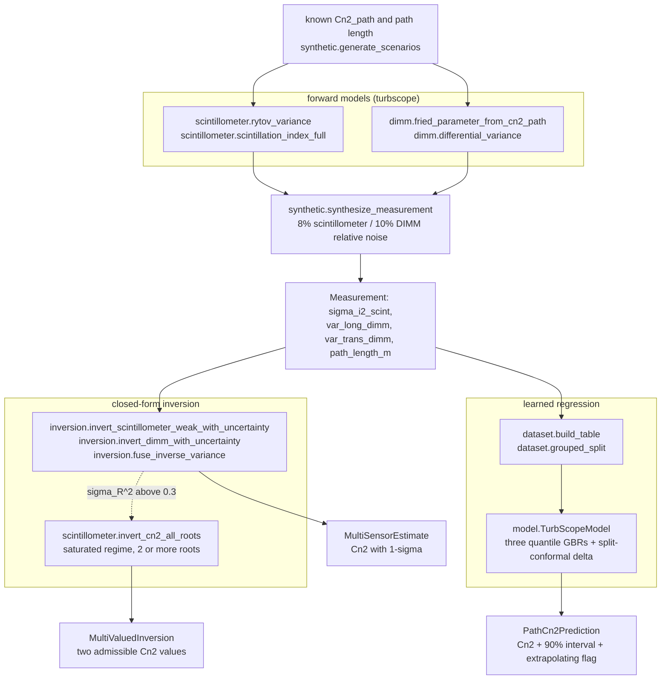
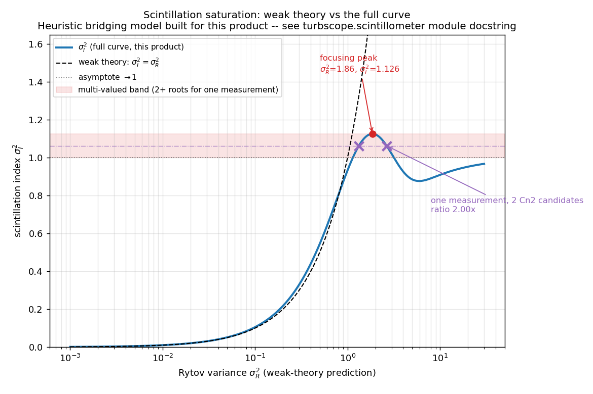
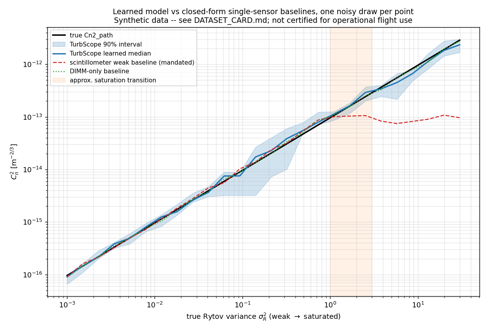

# TurbScope

Infers path-averaged optical turbulence strength Cn2 from scintillometer and DIMM readings.


## The problem

Sizing a free-space-optical link margin, an adaptive-optics correction budget or a
beam-wander prediction all reduce to one number: the path-averaged refractive-index
structure parameter Cn2 (m^-2/3). Nobody measures Cn2 directly — you measure a
scintillation index or a differential image motion and invert a formula, and the
scintillometer formula everyone reaches for is only valid while the fluctuations stay
weak. Past that point scintillation saturates, the inversion becomes multi-valued, and
the instrument keeps returning a single confident number that is wrong by up to two
orders of magnitude.

## What this does

- Implements the classical closed-form inversions with propagated uncertainty: the
  weak-fluctuation Rytov scintillometer inversion and the Sarazin & Roddier DIMM
  inversion. Noiseless round-trip recovery is exact to 2.2e-16 relative for DIMM and
  within 9.94% for the scintillometer at the edge of its stated validity bound
  (`validation/round_trip_recovery.py`).
- Recovers a known Cn2 to a **median 3.86% relative error** across 1639 independently
  drawn weak-regime scenarios with 8%/10% relative sensor noise, by inverse-variance
  fusion of the three single-sensor closed-form estimates — against 5.89% for the
  scintillometer alone (`validation/round_trip_recovery.py` §3).
- Demonstrates and quantifies the saturation failure: the same weak-theory formula
  applied outside its validity range has a **median 89.5% relative error** across 1025
  saturated scenarios, and one measurement in the band σ_I² ∈ [0.9990, 1.1261] admits
  **two Cn2 values 2.00× apart** (`validation/saturation_regime.py`).
- Ships a learned multi-sensor regressor (three quantile GBRs, split-conformal
  calibrated) that cuts held-out RMSE against the mandated single-sensor baseline from
  0.6577 to **0.0714 dex**, an 89% reduction, and reports plainly that it **loses** to
  the DIMM-only closed-form baseline at 0.0318 dex (`validation/benchmark_ml.py`).
- Returns a prediction interval whose achieved coverage is measured, not assumed:
  nominal 0.900, **achieved 0.8770** on 675 held-out rows.

## The documented failure regime: scintillation saturation

This is the most useful section in this repository for a practitioner, because it says
when not to trust the instrument.

The weak-fluctuation identity σ_I² ≈ σ_R² is monotone, so its inverse is single-valued
and always returns an answer. The physical relationship is not monotone. As turbulence
strengthens, the scintillation index rises, overshoots ("focusing"), and then decays to
an order-unity asymptote. In this product's forward model
(`turbscope.scintillometer.scintillation_index_full`, a heuristic bridging function
built for this product with the correct qualitative shape — not a published curve fit):

| quantity | value | source |
|---|---:|---|
| asymptote as σ_R² → ∞ | 0.999001 | `saturation_regime.py` §1 |
| focusing peak location σ_R² | 1.8584 | `saturation_regime.py` §1 |
| σ_I² at the peak | 1.126071 | `saturation_regime.py` §1 |
| overshoot above asymptote | +0.127070 (12.72%) | `saturation_regime.py` §1 |
| **multi-valued σ_I² band** | **[0.999001, 1.126071]**, width 0.127070 | `saturation_regime.py` §2 |
| probes in that band found genuinely multi-valued | 25 of 25 (100%) | `saturation_regime.py` §2 |

Any measurement landing in that band has two admissible answers. Worked case at
L = 1000 m, from `validation/saturation_regime_output.txt` §3:

| measured σ_I² | root | σ_R² | Cn2_path [m^-2/3] |
|---:|---:|---:|---:|
| 1.062536 | 0 | 1.3249 | 8.457378e-14 |
| 1.062536 | 1 | 2.6524 | 1.693100e-13 |

Ratio 2.00×. Nothing in the scintillometer reading distinguishes them; only an
independent sensor or prior knowledge of the regime does.

What the naive inversion does instead, noiseless, so this is model-form error alone
(`saturation_regime.py` §4):

| true σ_R² | true Cn2 [m^-2/3] | weak-inversion Cn2 | relative error |
|---:|---:|---:|---:|
| 0.500 | 3.1917e-14 | 3.4731e-14 | +8.82% |
| 1.000 | 6.3834e-14 | 5.9546e-14 | −6.72% |
| 1.858 | 1.1863e-13 | 7.1881e-14 | −39.41% |
| 3.000 | 1.9150e-13 | 6.5153e-14 | −65.98% |
| 10.000 | 6.3834e-13 | 5.8048e-14 | −90.91% |
| 50.000 | 3.1917e-12 | 6.2582e-14 | −98.04% |

The estimate pins near the asymptote-adjacent value regardless of truth, so its error
tends to −100% as the real turbulence grows. Aggregated over 1025 saturated scenarios
drawn independently, with sensor noise: **median 89.5%, mean 76.5%, p90 97.8%** relative
error — roughly an order of magnitude worse than the same formula's 5.89% median in the
weak regime.

Practical consequence: treat `invert_cn2_weak` as valid only while the σ_R² implied by
its own output satisfies `is_weak_regime` (σ_R² ≤ 0.3). Above that, use
`invert_cn2_all_roots` to see the ambiguity explicitly, and resolve it with the DIMM
channel, which carries no saturation term in this model.

## Who it's for

- FSO-link and adaptive-optics engineers doing early sizing who need Cn2 with a stated
  uncertainty rather than a single number.
- Researchers who want a cited, unit-documented implementation of the Rytov
  scintillometer and DIMM forward and inverse models, plus a reproducible demonstration
  of the saturation failure mode.
- Anyone building a Cn2-sensing pipeline who needs an honest classical baseline to beat
  and a worked example of conformal interval calibration against it.

## Who it's not for

- Anyone needing agreement with a real instrument. Every number here is measured
  against this product's own generative process; no field measurement appears anywhere.
  Read `DATASET_CARD.md` first.
- Anyone processing raw data files from a specific commercial scintillometer. This
  package has no instrument I/O; see `scintillometry` in the table below.
- Anyone doing end-to-end wave-optics propagation, phase-screen simulation or AO
  loop modelling. Use HCIPy or Soapy.
- Anyone needing a certified or flight-qualified tool. This is not one.

## Alternatives, honestly

This niche is thinly served by open source. Turbulence *forward* modelling in Python is
well covered; turning a real Cn2-sensing instrument's reading back into Cn2 largely
lives in instrument-vendor software (for example Kipp & Zonen's EVATION for the LAS MkII
scintillometer), which is closed and tied to one product line. That is the market
position this package occupies, and it is worth stating plainly rather than inventing a
comparison.

| alternative | verified | what it does better | when to use it instead of this |
|---|---|---|---|
| [AOtools](https://github.com/AOtools/aotools) (`pip install aotools`, 1.0.8) | PyPI, GitHub | Mature, widely cited AO utility library: `cn2_to_r0`, `isoplanaticAngle`, `coherenceTime`, `r0_from_slopes`, Zernikes, phase-screen generation. | You already have Cn2 or r0 and need standard atmospheric-parameter conversions. It has no scintillometer or DIMM inversion. |
| [HCIPy](https://github.com/ehpor/hcipy) (`pip install hcipy`, 0.7.0) | PyPI, GitHub | Full Fresnel/Fraunhofer propagation framework, multi-layer atmospheres, `fried_parameter_from_Cn_squared` and its inverse. | You need to *simulate* propagation through turbulence rather than infer its strength from measurements. |
| [Soapy](https://github.com/AOtools/soapy) (`pip install soapy`, 0.15.0) | PyPI, GitHub | End-to-end Monte-Carlo AO simulation with WFS, DM, LGS and tomography. | You are designing an AO system, not characterising a path. |
| [scintillometry](https://github.com/gampnico/scintillometry) (`pip install scintillometry`, 1.0.5, Apache-2.0) | PyPI, GitHub | Reads real Scintec BLS scintillometer data files, derives Cn2 and CT2, and computes surface heat fluxes and 2D flux footprints via Monin-Obukhov similarity theory. Self-described as alpha. | **Use this if you have actual BLS instrument data.** It is the closest real alternative and it handles a real instrument; this package handles neither file formats nor MOST fluxes. |
| Vendor software (Kipp & Zonen EVATION, Scintec BLS/SLS packages) | vendor product pages | Validated against the instrument it ships with; supported. | You own that instrument and want the manufacturer's inversion. Closed source, single-vendor, no DIMM fusion, no stated uncertainty model you can inspect. |

Names checked and **not** used because no such package exists on PyPI:
`pyscintillometer`, `scintpy`, `cn2`, `atmospheric-turbulence`, `shimm`. The SHIMM
seeing monitor is a published Durham instrument, but no installable Python package for
it was found.

### Sibling OPTIMA products — related, not alternatives

Three products in this family touch Cn2 and are easy to confuse:

| product | direction of the arrow |
|---|---|
| **TurbScope** (this repo) | measurements → Cn2. *Infers* a path-averaged Cn2 from what a scintillometer and DIMM actually read, with intervals. |
| **AtmoProfile** (P020) | known Cn2(h) profile → integrals. *Computes* r0, θ0, f_G, Rytov variance from a profile you already have. Deterministic, no ML. |
| **CnCast** (P019) | meteorology → Cn2(h) profile. *Predicts* a vertical profile from atmospheric inputs. |

If you have a profile, you want AtmoProfile. If you want a profile forecast, you want
CnCast. If you have instrument readings, you are in the right repository.

## Install and first run

```bash
git clone https://github.com/OmAcharya-avtr/turbscope.git
cd turbscope
python -m venv .venv && source .venv/bin/activate
pip install -e ".[test]"
python -m pytest tests/ -q
python examples/saturation_curve.py
```

Expected output of the two commands:

```
........................................................................ [ 59%]
..................................................                       [100%]
122 passed in 7.00s
```

```
wrote /path/to/turbscope/screenshots/saturation_curve.png
saturation peak: sigma_R^2=1.8584, sigma_I^2=1.1261
multi-valued band: [1.0000, 1.1261]
```

The band printed by the example uses the design constant `SATURATION_ASYMPTOTE = 1.0`
for its lower edge; `validation/saturation_regime.py` measures the achieved asymptote
numerically as 0.999001 and reports the band as [0.9990, 1.1261]. Both are correct
statements of the same thing.

Python 3.11+. Dependencies: numpy, scipy, scikit-learn, matplotlib (Agg backend only).
No GPU, no PyTorch.

## A worked example

```python
import numpy as np

from turbscope.inversion import multi_sensor_closed_form_estimate
from turbscope.model import train_default_model
from turbscope.scintillometer import invert_cn2_all_roots, invert_cn2_weak
from turbscope.synthetic import (
    APERTURE_DIAM_M, DIMM_NOISE_STD, DIMM_WAVELENGTH_M, SCINT_NOISE_STD,
    SCINT_WAVELENGTH_M, SEPARATION_M, WAVE_TYPE, Scenario, cn2_from_target_rytov,
    synthesize_measurement,
)

L, TARGET_RYTOV = 1000.0, 0.05
cn2_true = cn2_from_target_rytov(TARGET_RYTOV, L)
m = synthesize_measurement(
    Scenario(cn2_path=cn2_true, path_length_m=L, rytov_variance_true=TARGET_RYTOV),
    np.random.default_rng(7),
)
print(f"true Cn2      = {cn2_true:.4e} m^-2/3   (sigma_R^2 = {TARGET_RYTOV})")
print(f"readings      = sigma_I^2 {m.sigma_i2_scint:.5f}, DIMM long {m.var_long_dimm:.4e} rad^2")

est = multi_sensor_closed_form_estimate(
    m.sigma_i2_scint, m.var_long_dimm, m.var_trans_dimm, m.path_length_m,
    SCINT_WAVELENGTH_M, WAVE_TYPE, DIMM_WAVELENGTH_M, APERTURE_DIAM_M, SEPARATION_M,
    SCINT_NOISE_STD, DIMM_NOISE_STD,
)
print(f"closed form   = {est.fused.cn2_path:.4e} +/- {est.fused.cn2_std:.2e} m^-2/3, "
      f"weak_regime={est.weak_regime_scint}")

model, _ = train_default_model()
pred = model.predict(m.sigma_i2_scint, m.var_long_dimm, m.var_trans_dimm, m.path_length_m)
print(f"learned       = {pred.cn2_path:.4e} m^-2/3, {pred.coverage:.0%} interval "
      f"[{pred.cn2_lower:.4e}, {pred.cn2_upper:.4e}], width {pred.interval_width_dex:.4f} dex")
print(f"extrapolating = {pred.extrapolating}")

roots = invert_cn2_all_roots(1.062536, L, SCINT_WAVELENGTH_M, WAVE_TYPE)
print(f"saturated sigma_I^2=1.062536 -> {len(roots.cn2_roots)} admissible Cn2: "
      f"{', '.join(f'{c:.4e}' for c in roots.cn2_roots)}")
print(f"naive weak inversion of the same reading -> "
      f"{invert_cn2_weak(1.062536, L, SCINT_WAVELENGTH_M, WAVE_TYPE):.4e} m^-2/3 (single value)")
```

Actual printed output:

```
true Cn2      = 3.1917e-15 m^-2/3   (sigma_R^2 = 0.05)
readings      = sigma_I^2 0.05146, DIMM long 1.9666e-11 rad^2
closed form   = 3.2306e-15 +/- 1.71e-16 m^-2/3, weak_regime=True
learned       = 2.8646e-15 m^-2/3, 90% interval [2.6265e-15, 4.1980e-15], width 0.2037 dex
extrapolating = True
saturated sigma_I^2=1.062536 -> 2 admissible Cn2: 8.4574e-14, 1.6931e-13
naive weak inversion of the same reading -> 6.7826e-14 m^-2/3 (single value)
```

Two things to notice. The closed-form fused estimate lands 1.2% from truth and the
learned interval contains truth. And `extrapolating=True` fires on a scenario that is
squarely inside the training distribution — see Limitations.

## Architecture



```
src/turbscope/
├── constants.py        physical constants, unit conventions, WEAK_REGIME_MAX_SIGMA_R2
├── scintillometer.py   Rytov forward model, weak inversion, saturation curve, all-roots inversion
├── dimm.py             DIMM forward model, Fried-parameter conversions, inversion
├── synthetic.py        seeded scenario draw + noisy measurement generator
├── dataset.py          feature-table construction, scenario-grouped splits
├── inversion.py        closed-form inversion with uncertainty, inverse-variance fusion
├── model.py            quantile-GBR model, conformal calibration, all baselines
└── __main__.py         python -m turbscope CLI (forward / invert / predict)
```

## Screenshots

Both are produced by the repository's own examples, so they cannot drift from the code.



Notice that the blue full curve turns over near σ_R² ≈ 1.86 and falls back onto the
asymptote, so the shaded red band is crossed twice — the two purple crosses are the two
σ_R² roots of a single measurement, while the dashed weak-theory line keeps rising and
would report only one.



Notice that the red scintillometer baseline tracks truth until roughly σ_R² = 1 and then
flattens completely while the true Cn2 keeps climbing, whereas the blue learned median
and its interval, and the green DIMM-only baseline, continue to follow the black truth
line through the orange saturation transition.

## Validation evidence

Level 2 (Research). Full detail, including what was *not* validated, in
`validation/VALIDATION.md`. Raw script output is committed in
`validation/round_trip_recovery_output.txt`, `validation/saturation_regime_output.txt`
and `validation/benchmark_results.md`.

| check | reference / script | result | tolerance or comparator |
|---|---|---|---|
| DIMM noiseless round trip | `round_trip_recovery.py` §1.2 | ≤ 2.167e-16 relative, 6 of 6 probes | machine precision |
| Scintillometer noiseless round trip at σ_R² = 0.01 | `round_trip_recovery.py` §1.1 | 0.6302% | weak-theory model error |
| Scintillometer noiseless round trip at σ_R² = 0.3 (validity bound) | `round_trip_recovery.py` §1.1 | 9.9433% | bound is conservative, not error-free |
| Fused closed form, 1000 noisy draws, one scenario | `round_trip_recovery.py` §2 | RMSE 5.42% | scintillometer alone 8.19%, DIMM alone 9.83% |
| **Fused closed form, 1639 weak-regime scenarios** | `round_trip_recovery.py` §3 | **median 3.86%**, mean 4.63%, p90 9.83% | scintillometer alone: 5.89% / 7.05% / 14.47% |
| Multi-valued band exists and is found | `saturation_regime.py` §2 | 25 of 25 probes multi-valued | band [0.9990, 1.1261] |
| **Weak inversion applied in the saturated regime** | `saturation_regime.py` §5 | **median 89.5%**, mean 76.5%, p90 97.8% error over 1025 scenarios | same formula, weak regime: 5.89% |
| Learned model held-out RMSE | `benchmark_ml.py` §1 | 0.0714 dex (MAE 0.0497, bias −0.0054, p95 0.1224) | 675 rows, 225 unseen scenarios |
| Mandated scintillometer baseline | `benchmark_ml.py` §1 | 0.6577 dex | learned/baseline ratio 0.1086 |
| **DIMM-only baseline — the check the product loses** | `benchmark_ml.py` §1 | **0.0318 dex, beats the learned model** | reported as a negative result |
| Learned-nothing floor (training mean) | `benchmark_ml.py` §1 | 1.6877 dex | sanity floor |
| Weak-regime split RMSE | `benchmark_ml.py` §2 | learned 0.0648, mandated 0.0380 | **the baseline wins in the weak regime** |
| Saturated-regime split RMSE | `benchmark_ml.py` §2 | learned 0.0784, mandated 0.9665 | n = 363 weak / 312 saturated rows |
| Quantile crossing rate on the fit set | `benchmark_ml.py` fit_report | 0.33% | detected and repaired by sorting |
| Fit + calibration wall time | `benchmark_ml.py` | 3.25 s on 2 cores | budget 120 s |
| Bit-level reproducibility across re-fits | `benchmark_ml.py` §4 | max abs prediction difference 0.000e+00 dex | identical features and conformal δ |
| Test suite | `python -m pytest tests/ -q` | 122 passed, 0 failed, 0 skipped | ruff clean |

### Prediction-interval coverage, nominal versus achieved

Nominal central coverage is 90%. It is not achieved. From `benchmark_ml.py` §3, on 675
held-out rows:

| interval | nominal | achieved | mean width [dex] |
|---|---:|---:|---:|
| raw quantile GBR, uncalibrated | 0.900 | 0.7985 | 0.2869 |
| split-conformal calibrated | 0.900 | **0.8770** | 0.3333 |

By regime, calibrated: weak 0.8512 (n = 363, width 0.3464), saturated 0.9071
(n = 312, width 0.3181).

The rows are not independent — three noisy realisations share each scenario's ground
truth — so the effective sample size is nearer the 225 test scenarios, giving a standard
error of about 0.022. Treat ±0.02 to ±0.03 as the resolution of these coverage figures.
On that reading 0.8770 is about one standard error below nominal, and the weak-regime
0.8512 is about two. Conformal coverage is marginal, not conditional: it is guaranteed
in aggregate under exchangeability, not band by band, and the exchangeability holds here
only because calibration and test data come from the same synthetic generator. Do not
read a per-regime band to better than a few points.

## API reference

<details>
<summary><b>turbscope.scintillometer</b> — Rytov forward model and inversions</summary>

| function | units and meaning |
|---|---|
| `wave_number(wavelength_m)` | m -> rad/m, k = 2π/λ |
| `rytov_variance(cn2_path, path_length_m, wavelength_m, wave_type="spherical")` | Cn2 m^-2/3, L m, λ m -> σ_R² dimensionless. C_w = 1.23 plane, 0.50 spherical |
| `scintillation_index_weak(cn2_path, path_length_m, wavelength_m, wave_type)` | as above; the weak-limit identity σ_I² ≈ σ_R² |
| `scintillation_index_full(rytov_var)` | σ_R² -> σ_I², heuristic weak-to-saturated bridging curve |
| `saturation_peak()` | -> (σ_R² at peak, σ_I² at peak) = (1.8584, 1.126071) |
| `is_weak_regime(rytov_var)` | -> bool array, σ_R² ≤ 0.3 |
| `invert_cn2_weak(sigma_i2_measured, path_length_m, wavelength_m, wave_type)` | σ_I² -> Cn2 m^-2/3. Single-valued always, including where it should not be |
| `invert_cn2_all_roots(sigma_i2_measured, path_length_m, wavelength_m, wave_type, rytov_search_max=200.0, n_grid=4000)` | -> `MultiValuedInversion(rytov_roots, cn2_roots, is_multivalued)` |

Constants: `SATURATION_ASYMPTOTE = 1.0`, `SATURATION_BUMP_LOCATION = 1.5`,
`SATURATION_BUMP_HEIGHT = 0.5`.
</details>

<details>
<summary><b>turbscope.dimm</b> — differential image motion</summary>

| function | units and meaning |
|---|---|
| `fried_parameter_from_cn2_path(cn2_path, path_length_m, wavelength_m, zenith_deg=0.0)` | Cn2 m^-2/3 -> r0 m, slab approximation, r0 = [0.423 k² sec ζ Cn2 L]^(-3/5) |
| `cn2_path_from_fried_parameter(r0_m, path_length_m, wavelength_m, zenith_deg=0.0)` | r0 m -> Cn2 m^-2/3 |
| `differential_variance(cn2_path, path_length_m, wavelength_m, aperture_diam_m, separation_m, component="longitudinal", zenith_deg=0.0)` | -> variance rad². D and d in m, requires d > D |
| `invert_cn2_from_variance(variance_rad2, path_length_m, wavelength_m, aperture_diam_m, separation_m, component, zenith_deg=0.0)` | rad² -> Cn2 m^-2/3, exactly linear, monotone |

Constants: `DIMM_PREFACTOR = 0.358`, `DIMM_LONG_SEP_COEFF = 0.541`,
`DIMM_TRANS_SEP_COEFF = 0.798`.
</details>

<details>
<summary><b>turbscope.inversion</b> — uncertainty propagation and fusion</summary>

| function | units and meaning |
|---|---|
| `invert_scintillometer_weak_with_uncertainty(sigma_i2_measured, sigma_i2_relative_std, path_length_m, wavelength_m, wave_type)` | -> `PointEstimate(cn2_path m^-2/3, cn2_std m^-2/3, source)`. Linear, so relative std passes through unchanged |
| `invert_dimm_with_uncertainty(variance_rad2, variance_relative_std, path_length_m, wavelength_m, aperture_diam_m, separation_m, component, zenith_deg=0.0)` | -> `PointEstimate` |
| `fuse_inverse_variance(estimates)` | list of `PointEstimate` -> one `PointEstimate`, inverse-variance weighted |
| `multi_sensor_closed_form_estimate(sigma_i2_measured, var_long_measured, var_trans_measured, path_length_m, scint_wavelength_m, scint_wave_type, dimm_wavelength_m, aperture_diam_m, separation_m, scint_relative_std, dimm_relative_std)` | -> `MultiSensorEstimate(fused, individual, weak_regime_scint)` |
</details>

<details>
<summary><b>turbscope.synthetic and turbscope.dataset</b> — data generation</summary>

| function | units and meaning |
|---|---|
| `cn2_from_target_rytov(target_rytov_variance, path_length_m)` | dimensionless, m -> Cn2 m^-2/3 at `SCINT_WAVELENGTH_M` |
| `generate_scenarios(n_scenarios, seed=20260829)` | -> list of `Scenario(cn2_path, path_length_m, rytov_variance_true)` |
| `synthesize_measurement(scenario, rng)` | -> `Measurement(sigma_i2_scint, var_long_dimm rad², var_trans_dimm rad², path_length_m m)` |
| `split_indices(n, test_fraction=0.25, seed=4242)` | -> (train_idx, test_idx) |
| `build_table(scenarios, n_realisations=3, seed=99)` | -> (x, y = log10 Cn2, groups) |
| `grouped_split(n_scenarios, test_fraction=0.25, seed=4242)` | scenario-level split, never row-level |

Fixed geometry: scintillometer 880 nm spherical wave; DIMM 500 nm, D = 0.14 m,
d = 0.20 m. Draw ranges: log10 σ_R² uniform on [−3.5, 1.85], L uniform on
[150, 2500] m. Noise: `SCINT_NOISE_STD = 0.08`, `DIMM_NOISE_STD = 0.10`, both
relative 1-σ and both hand-chosen.
</details>

<details>
<summary><b>turbscope.model</b> — learned regressor and baselines</summary>

| object | units and meaning |
|---|---|
| `TurbScopeModel(coverage=0.90, ...)` | three `GradientBoostingRegressor` quantile models (α = 0.05, 0.50, 0.95), `n_estimators=250`, `max_depth=3`, `learning_rate=0.08` |
| `.fit(x, y)` / `.calibrate(x_cal, y_cal)` | y is log10 Cn2; calibration returns the conformal δ in dex (0.026572 in the default run) |
| `.predict(sigma_i2_scint, var_long_dimm, var_trans_dimm, path_length_m)` | -> `PathCn2Prediction(cn2_path, cn2_lower, cn2_upper m^-2/3, coverage, extrapolating)`, plus `.interval_width_dex` |
| `.predict_log10_cn2(x)` | array in, log10 Cn2 out |
| `ScintillometerWeakBaseline` / `DimmOnlyBaseline` / `MeanTrainingBaseline` | the three comparators, same `predict_log10_cn2` interface |
| `interval_coverage(y_true, lower, upper)` | -> (empirical coverage, mean width) |
| `train_default_model(n_scenarios=900, ...)` | -> (fitted calibrated model, artefacts dict). 900 scenarios -> 506 fit / 169 calibration / 225 test |
</details>

<details>
<summary><b>CLI</b> — python -m turbscope</summary>

```
$ python -m turbscope forward --cn2 1e-15 --path-length-m 1000
# forward model: Cn2_path = 1.0000e-15 m^-2/3, L = 1000 m
  Rytov variance (scintillometer, spherical wave) : 1.566571e-02
  scintillation index sigma_I^2 (full curve)             : 1.581872e-02
  Fried parameter r0 (DIMM wavelength)                   : 8.0379 cm
  DIMM differential variance, longitudinal               : 5.982917e-12 rad^2
  DIMM differential variance, transverse                 : 3.355638e-12 rad^2
```

Subcommands: `forward`, `invert`, `predict`.
</details>

## Limitations

- **Everything is synthetic.** Accuracy figures measure fidelity to this product's own
  generative process, not agreement with a real scintillometer or DIMM. No measured Cn2
  of any kind appears anywhere in the repository. `DATASET_CARD.md` is the binding
  document.
- **The saturation curve is a heuristic built for this product**, not a literature curve
  fit. Its qualitative shape — weak Rytov limit, focusing overshoot, order-unity
  asymptote — is right; the peak height 1.126071 and location σ_R² = 1.8584 are
  properties of `scintillation_index_full`, not of any published measurement.
- **The learned model loses to the strongest closed-form baseline available here.**
  DIMM-only achieves 0.0318 dex against the learned model's 0.0714. The reason is
  structural: the generator gives DIMM zero saturation-related model-form error at any
  turbulence strength, so DIMM-only is limited purely by its 10% sensor noise, which is
  the very quantity the metric measures. Most of the value of "multi-sensor" here is
  avoiding a broken sensor, not fusing two working ones.
- **The mandated baseline beats the learned model in the weak regime** (0.0380 versus
  0.0648 dex). The learned model only wins on average because it does not collapse when
  saturation arrives.
- **Prediction intervals under-cover.** 0.8770 achieved against 0.900 nominal, 0.8512 in
  the weak regime. Coverage is marginal, not conditional. Only the 90% level has been
  calibrated and measured; another level needs its own calibration run.
- **The `extrapolating` flag over-triggers.** `TRAINING_DOMAIN` uses hand-set, generous
  bounds, but its lower bound of 1e-10 rad² on the DIMM variances is above what the
  generator actually produces for much of its own range. On the default 900-scenario,
  3-realisation training table, 58.5% of rows fall outside that box and would be flagged
  `extrapolating=True` despite being in-distribution. This figure is not from
  `validation/`; reproduce it with the snippet under "Reproducing every number". Treat
  the flag as advisory and check the feature values yourself.
- **DIMM's real-world limits are not modelled.** The long-baseline,
  diffraction-neglected form (requiring d > D) is a documented simplification; real DIMM
  performance also degrades at very poor seeing, where D becomes comparable to r0. That
  regime is not simulated, which is part of why DIMM-only wins so cleanly above.
- **One fixed instrument geometry throughout.** One scintillometer wavelength and wave
  type, one DIMM wavelength, aperture and separation. A differently configured
  deployment is outside the training domain.
- **The 8% and 10% noise levels are hand-chosen illustrative values**, not vendor
  specifications.
- **Not modelled at all:** anisoplanatism, beam wander, absorption and attenuation,
  non-Kolmogorov spectra, time dependence, path-inhomogeneous Cn2.
- **Compute budget.** No GPU and no PyTorch. Dataset generation under 1 s; fit plus
  conformal calibration 3.25 s; the full benchmark script 4.97 s; the test suite 7.00 s
  — all on 2 CPU cores, against a 120 s per-script budget. No model artefact is
  committed because refitting is cheaper than storing one.

## Safety statement

This software is research-grade. It is not flight-qualified, not certified, and not
approved for operational aerospace use.

## Reproducing every number

From the repository root, after `pip install -e ".[test]"`:

```bash
# test count in the badge
python -m pytest tests/ -q

# section "The documented failure regime", and all saturation numbers
python validation/saturation_regime.py   > validation/saturation_regime_output.txt

# round-trip recovery: 3.86% weak-regime median, DIMM machine-precision round trip
python validation/round_trip_recovery.py > validation/round_trip_recovery_output.txt

# benchmark table, coverage table, reproducibility check
python validation/benchmark_ml.py        > validation/benchmark_results.md

# the two screenshots and their printed summaries
python examples/saturation_curve.py
python examples/prediction_vs_baselines.py

# lint
ruff check src/ tests/ examples/ validation/
```

`examples/prediction_vs_baselines.py` prints, on the seeds committed here:

```
median |rel err| learned model  : 9.54%
median |rel err| scint baseline : 12.38%
```

The 58.5% extrapolation-flag rate quoted in Limitations is the only figure in this
README not produced by a script in `validation/`. Reproduce it with:

```bash
python -c "
import numpy as np
from turbscope.dataset import FEATURE_NAMES, build_table, generate_default_scenarios
from turbscope.model import TRAINING_DOMAIN
x, _, _ = build_table(generate_default_scenarios(900), n_realisations=3, seed=99)
lo = np.array([TRAINING_DOMAIN[n][0] for n in FEATURE_NAMES])
hi = np.array([TRAINING_DOMAIN[n][1] for n in FEATURE_NAMES])
print('rows flagged extrapolating: %.1f%%' % (100 * np.mean(np.any((x < lo) | (x > hi), axis=1))))
"
```

All scripts are deterministic: master scenario seed 20260829, noise seeds 99/100/101,
split seeds 4242 and 4243, model `random_state=11`. Wall times will differ; numbers will
not.

## Licence

Apache-2.0. See `LICENSE`.

## Citation

```bibtex
@software{turbscope_2026,
  author  = {{OPTIMA Organisation}},
  title   = {TurbScope: path-averaged Cn2 estimation from scintillometer and
             DIMM measurements with classical closed-form inversion and a
             learned multi-sensor regressor},
  version = {0.1.0},
  year    = {2026}
}
```

Underlying physics, cited in the module docstrings and in
`validation/VALIDATION.md`: Tatarski (1961); Andrews & Phillips (2005); Wang, Ochs &
Lawrence (1978); Sarazin & Roddier (1990); Fried (1965, 1966); Tokovinin (2002);
Bevington & Robinson (2003); Romano, Patterson & Candès (2019).

## Credits

This is under reserved rights obtained by OPTIMA Organisation.
