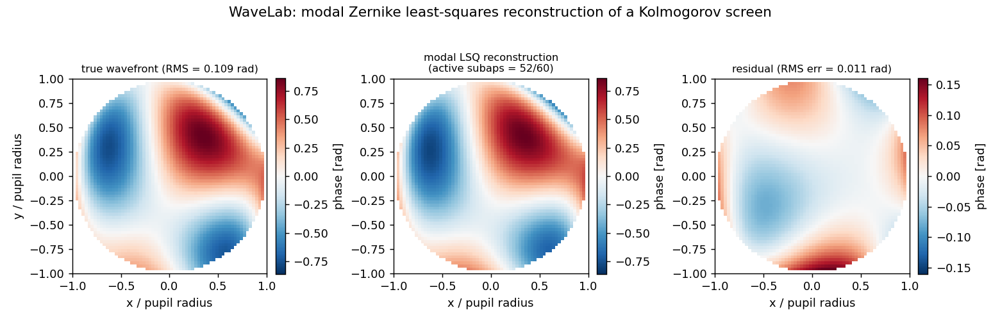
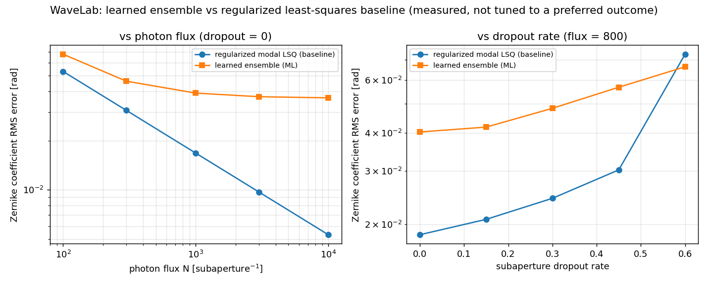

# WaveLab

Reconstructs an optical wavefront from Shack-Hartmann subaperture slope measurements.


## The problem

A Shack-Hartmann sensor does not measure the wavefront; it measures the local
gradient in each subaperture, and you have to invert that to get phase back.
The inversion has a null space — piston is never observable from slopes, and the
Fried finite-difference geometry adds a second unobservable direction — and it
degrades when photons are scarce or when subapertures go dead, saturate, or fall
outside the pupil. This package is the inverse step and the evidence for it:
three reconstructors, a synthetic data generator to exercise them, and a measured
comparison against a learned reconstructor that the classical baseline mostly wins.

## What this does

- **Modal reconstruction** — `ModalReconstructor` maps slopes to Noll-Zernike
  coefficients through a Tikhonov- or truncated-SVD-regularized solve of the
  analytic Zernike gradient matrix. Recovers noise-free input to **4.996e-16 rad**
  worst-case over 20 trials, 32 subapertures, 14 modes.
- **Zonal reconstruction** — `ZonalReconstructor` maps slopes to phase on a grid
  through the Hudgin or Fried finite-difference geometry. Hudgin recovers
  noise-free phase to **1.410e-14 rad**; Fried's residual is explained by the
  true waffle mode to **4.576e-04 rad**, which is the honest claim for a
  geometry with a two-dimensional null space.
- **Analytic noise propagation** — measured coefficient variance tracks the
  predicted `Var = coeff · sigma_s²` to **within 2.2%** across a 100x flux range,
  800 Monte Carlo trials per point.
- **A learned reconstructor, benchmarked and reported as measured** —
  `ZernikeSlopeEnsemble` (5 scikit-learn MLPs, ensemble-spread uncertainty)
  loses to the regularized baseline at **9 of 10** tested operating points, by
  **7.4x** at flux 10 000. Its single win is at 60% subaperture dropout.
- **Deterministic synthetic data** — Kolmogorov screens, analytic forward slopes,
  shot-noise and dropout, regenerated bit-for-bit from an integer seed. Nothing
  large is committed.

## Who this is for

- Anyone implementing or debugging a slope-to-phase inverse and needing a
  reference whose null-space behaviour is spelled out and numerically checked.
- Anyone teaching or learning the Hudgin / Fried / modal distinction.
- Anyone about to put a learned reconstructor in an adaptive-optics loop who
  wants a properly regularized classical baseline to beat first.

## Who this is not for

- Anyone needing a closed-loop AO system simulation with deformable mirrors and
  temporal control — use soapy.
- Anyone needing to propagate light, model coronagraphs, or generate the spot
  images in the first place — use HCIPy, or ShackSim for the spot-to-slope step.
- Anyone needing real atmospheric statistics. Every number here is measured
  against a synthetic generator that omits outer scale, temporal evolution,
  scintillation, and all detector physics.
- Anyone needing a calibrated uncertainty. The ensemble spread understates the
  true error by 25-40% at every point measured.

## Where this sits among its siblings

| Product | Input | Output |
|---|---|---|
| ShackSim (P018) | spot images | subaperture slopes |
| **WaveLab (this repo)** | **subaperture slopes** | **phase, as Zernike coefficients or grid values** |
| ZernKit (P016) | — | Zernike basis and Noll indexing conventions |

WaveLab implements its own Zernike machinery rather than importing ZernKit, so
this repository stands alone; the conventions are the same ones ZernKit
documents.

## Alternatives, honestly

Every package below was checked to exist on PyPI or GitHub at the versions given.

| Alternative | What it does better | When to use it instead of WaveLab |
|---|---|---|
| [AOtools](https://github.com/AOtools/aotools) (`pip install aotools`, 1.0.7, LGPL-3.0) | Broader, more widely used AO utility library: Zernike and Karhunen-Loeve modes, finite and infinite phase screens, centroiders, slope covariance, pupil functions, optical propagation. | Use it for everything around the inverse — screens, modes, centroiding. Its published module index contains no reconstruction module, so if you take AOtools you still have to write the slope-to-phase solve; that solve is what WaveLab is. |
| [soapy](https://github.com/AOtools/soapy) (`pip install soapy`, 0.15.0) | End-to-end Monte Carlo AO simulation: atmosphere, WFS, DM, closed loop, laser guide star tomography, and a family of reconstructors — `MVM`, `MVM_SeparateDMs`, `LearnAndApply`, `LearnAndApplyLTAO`, `LgsTT`, `GLAO_4LGS`, `WooferTweeter`, `ANN`. | Use soapy for any closed-loop system study, or if you want a neural reconstructor inside a real loop. WaveLab is open-loop and single-frame: slopes in, coefficients out, with the error budget written down. |
| [HCIPy](https://github.com/ehpor/hcipy) (`pip install hcipy`, 0.7.0) | Fraunhofer and Fresnel propagation, coronagraphs, Jones-calculus polarization, and physical Shack-Hartmann and pyramid sensor models. | Use HCIPy when the wavefront sensor itself, or the light reaching it, is what you are modelling. WaveLab starts after the slopes exist and never propagates a field. |
| [prysm](https://github.com/brandondube/prysm) (`pip install prysm`, 0.21.1, MIT) | Fast numerical optics with GPU support; large polynomial library (Zernike, Legendre, Chebyshev, Jacobi, Hopkins, Hermite), forward modelling and image-plane phase retrieval. | Use prysm for phase retrieval from focal-plane images, or for polynomial fitting at speed. It ships no Shack-Hartmann slope-to-phase reconstructor. |
| [POPPY](https://github.com/spacetelescope/poppy) (`pip install poppy`, 1.2.0, STScI) | Institutionally maintained physical optics propagation and PSF formation, built for JWST. | Use POPPY when the question is diffraction and point spread functions. It has no slope reconstruction path at all. |

If you want a mature, community-tested AO toolbox rather than a documented
inverse with its own error budget, take AOtools and soapy. WaveLab's argument
for existing is section "Validation evidence" and section "The measured
ML-versus-least-squares result", not feature coverage.

## Install and first run

```bash
git clone https://github.com/OmAcharya-avtr/wavelab.git
cd wavelab
python -m venv .venv && source .venv/bin/activate
pip install -e ".[test]"
python -m pytest tests/ -q
python examples/reconstruction_demo.py
```

Expected output of the test run:

```
....................................                                     [100%]
180 passed, 10 warnings in 41.33s
```

The ten warnings are scikit-learn `ConvergenceWarning`s from the MLP members,
which stop on `early_stopping` before `max_iter`. They are expected.

Expected output of the example:

```
saved .../wavelab/screenshots/reconstruction_demo.png
true coefficient RMS = 0.1087 rad, reconstruction RMS error = 0.0109 rad
```

There is also a command-line entry point:

```console
$ python -m wavelab geometry --n-grid 9
PupilGrid(n_grid=9): 49 active phase points
  hudgin  matrix shape (80, 49) (0 unconstrained points dropped), null space dimension = 1
  fried   matrix shape (64, 45) (4 unconstrained points dropped), null space dimension = 2

$ python -m wavelab reconstruct --n-side 8 --j-max 15 --flux 1000 --dropout 0.1
n_sub=32, n_modes=14, active=29
true coefficient RMS   : 0.092314 rad
reconstruction RMS err : 0.014502 rad
```

The `geometry` output is the null-space distinction in one line: Hudgin loses
piston only, Fried loses piston and waffle, and four boundary points of the
circular pupil touch no complete Fried cell and are pruned before the count.

## A worked example

```python
import numpy as np
from wavelab.dataset import build_modal_geometry, generate_batch
from wavelab.ml import ZernikeSlopeEnsemble
from wavelab.modal import ModalReconstructor

noll = list(range(2, 16))                                  # Noll j = 2..15; piston is unobservable
geom = build_modal_geometry(noll, n_side=8)                # 8x8 layout masked to the unit disc
print(f"{geom.n_sub} subapertures, {geom.n_modes} modes, interaction matrix {geom.matrix.shape}")

baseline = ModalReconstructor(noll, geom.sub_x, geom.sub_y, method="tikhonov", reg=3e-3)
model = ZernikeSlopeEnsemble(geom.n_sub, geom.n_modes, n_estimators=5, random_state=0)

train = generate_batch(geom, 1800, photon_flux=800.0, dropout_rate=0.25, seed=100)
model.fit(train.slopes, train.active, train.coeffs)

rms = lambda e: float(np.sqrt(np.mean(e**2)))
for flux, dropout, seed in ((10000.0, 0.00, 9000), (800.0, 0.60, 9500)):
    test = generate_batch(geom, 400, photon_flux=flux, dropout_rate=dropout, seed=seed)
    base = np.array([baseline.reconstruct(test.slopes[i], active=test.active[i])
                     for i in range(len(test))])
    ml, std = model.predict(test.slopes, test.active, return_std=True)
    b, m = rms(base - test.coeffs), rms(ml - test.coeffs)
    print(f"flux={flux:>7.0f} dropout={dropout:.2f}  baseline={b:.6f} rad  ML={m:.6f} rad  "
          f"winner={'baseline' if b < m else 'ML'}  ensemble-spread/error={std.mean() / m:.3f}")
```

Printed output, about 30 s on 2 cores:

```
32 subapertures, 14 modes, interaction matrix (64, 14)
flux=  10000 dropout=0.00  baseline=0.005106 rad  ML=0.038023 rad  winner=baseline  ensemble-spread/error=0.662
flux=    800 dropout=0.60  baseline=0.816562 rad  ML=0.060425 rad  winner=ML  ensemble-spread/error=0.686
```

These are the two extreme rows of the validation sweep, and they reproduce
`validation/dropout_output.txt` digit for digit on the same seeds. The
`ensemble-spread/error` figure is below 1 in both cases, meaning the ensemble
members agree with each other more than they agree with the truth.

## Architecture

```mermaid
flowchart TD
    A["wavelab.screens.kolmogorov_screen<br/>Kolmogorov PSD, FFT method"] --> B["wavelab.zernike.fit_zernike<br/>screen to Noll coefficients, ground truth"]
    B --> C["wavelab.zernike.zernike_slope_matrix<br/>analytic point-sampled gradients"]
    C --> D["wavelab.noise.add_slope_noise<br/>wavelab.noise.apply_dropout"]
    D --> E["wavelab.dataset.generate_batch<br/>synthetic slopes + active mask"]

    E --> F["wavelab.geometry.hudgin_matrix<br/>wavelab.geometry.fried_matrix<br/>wavelab.geometry.prune_unconstrained"]
    E --> G["wavelab.modal.ModalReconstructor<br/>analytic Zernike interaction matrix"]
    E --> H["wavelab.ml.ZernikeSlopeEnsemble<br/>5 x MLPRegressor, ensemble spread"]

    F --> I["wavelab.linalg.tikhonov_solve<br/>wavelab.linalg.tsvd_solve<br/>wavelab.linalg.null_space"]
    G --> I
    I --> J["wavelab.zonal.ZonalReconstructor<br/>phase on the grid"]
    I --> K["Noll-Zernike coefficients [rad]"]
    H --> K
    H --> L["per-coefficient ensemble std [rad]"]

    J --> M["wavelab.zonal.ZonalReconstructor.waffle_component<br/>null-space residual check"]
    K --> N["RMS coefficient error<br/>wavelab.linalg.noise_propagation_coefficients"]
    L --> N
```



The Hudgin and Fried geometry matrices are the two finite-difference
constructions compared in Southwell (1980); both feed the same regularized
solvers in `wavelab.linalg` that the modal path uses.

## Screenshots

Both are produced by the scripts in `examples/`, so they cannot drift from the code.



Notice the residual panel on the right: its colour scale is roughly 5x tighter
than the wavefront's, and what remains is smooth low-order structure at the
pupil edge, where 8 of 60 subapertures were dropped.



Notice that the left panel's baseline curve keeps falling with the expected
`1/sqrt(N)` slope while the learned curve flattens out — the widening gap is the
model failing to use photons it is given, tabulated in "The measured
ML-versus-least-squares result" below. In the right panel the two curves only
cross at the last point, and they cross because the baseline blows up, not
because the learned model improves. This figure is a reduced-size rerun of the
validation sweep, so read its shape, not its exact values.

## Validation evidence

Level 2. Scripts and their saved raw stdout are in
[`validation/`](validation/); the discussion is in
[`validation/VALIDATION.md`](validation/VALIDATION.md).

| Check | Script / reference | Result | Tolerance | Outcome |
|---|---|---:|---:|---|
| Modal noise-free recovery, 20 trials, TSVD | `validate_noise_free.py`, max abs coefficient error | 4.996e-16 rad | 1e-6 rad | PASS |
| Hudgin zonal noise-free recovery, 11x11 grid, 81 points | `validate_noise_free.py`, max abs phase error | 1.410e-14 rad | 1e-5 rad | PASS |
| Fried zonal residual equals the true waffle component, 81 active / 77 used | `validate_noise_free.py` | 4.576e-04 rad | 1e-3 rad | PASS |
| Fried null-space dimension is 2 (piston + waffle) | `validate_noise_free.py` | 2 | exact | PASS |
| Coefficient variance vs analytic noise-propagation coefficient, 800 trials per flux | `validate_photon_noise.py`, worst \|empirical/predicted − 1\| | 0.022 | 0.25 | PASS |
| `sigma(N) ∝ 1/sqrt(N)` on aggregate RMS error, flux 100 to 10 000 | `validate_photon_noise.py`, worst relative error | 0.013 | — | PASS |
| Learned model vs baseline, 10 operating points, 400 held-out samples each | `validate_dropout.py` | baseline 9, learned 1 | — | **baseline wins** |
| Ensemble uncertainty calibration, `mean(std) / rms(error)` | `validate_dropout.py` | 0.573 – 0.763 | 1.0 for calibrated | **not calibrated** |

Raw noise-propagation table, from `validation/photon_noise_output.txt`:

| Photon flux | sigma_slope | predicted Var | empirical Var, 800 trials | ratio |
|---:|---:|---:|---:|---:|
| 100 | 1.000000 | 2.6082e-03 | 2.6316e-03 | 1.009 |
| 300 | 0.577350 | 8.6940e-04 | 8.8228e-04 | 1.015 |
| 1000 | 0.316228 | 2.6082e-04 | 2.6657e-04 | 1.022 |
| 3000 | 0.182574 | 8.6940e-05 | 8.5605e-05 | 0.985 |
| 10000 | 0.100000 | 2.6082e-05 | 2.5671e-05 | 0.984 |

Not validated: any comparison against real Shack-Hartmann data, real atmospheric
statistics, or hardware; formal coverage of the uncertainty output; any
sensitivity study over mode count, subaperture density, or network architecture.

## The measured ML-versus-least-squares result

Both models were trained and evaluated once, on identical held-out batches
generated by the same `generate_batch` call, and the outcome is reported as it
came out. Training was a single fixed operating point (flux 800, dropout 0.25,
1800 samples, seed 100, no hyperparameter search). Test seeds 9000 and 9500.
Source: [`validation/dropout_output.txt`](validation/dropout_output.txt);
interpretation in [`MODEL_CARD.md`](MODEL_CARD.md) §7-§9.

**Sweep A — versus photon flux, dropout fixed at 0:**

| flux | baseline RMS [rad] | learned RMS [rad] | ML / baseline | winner |
|---:|---:|---:|---:|---|
| 100 | 0.051059 | 0.061532 | 1.205 | baseline |
| 300 | 0.029479 | 0.045635 | 1.548 | baseline |
| 1000 | 0.016146 | 0.040083 | 2.483 | baseline |
| 3000 | 0.009322 | 0.038526 | 4.133 | baseline |
| 10000 | 0.005106 | 0.038023 | 7.447 | baseline |

**Sweep B — versus subaperture dropout rate, flux fixed at 800:**

| dropout | baseline RMS [rad] | learned RMS [rad] | ML / baseline | winner |
|---:|---:|---:|---:|---|
| 0.00 | 0.017650 | 0.040279 | 2.282 | baseline |
| 0.15 | 0.020060 | 0.039633 | 1.976 | baseline |
| 0.30 | 0.023773 | 0.043301 | 1.821 | baseline |
| 0.45 | 0.034274 | 0.050117 | 1.462 | baseline |
| 0.60 | 0.816562 | 0.060425 | 0.074 | learned |

Read against the expectation this benchmark was set up to test:

- **Regularized least squares wins the entire flux sweep outright**, not just
  the high-flux end. It wins at flux 100 as well as at flux 10 000, and its
  margin *widens* monotonically with flux, from 1.2x to 7.4x. Nothing in the
  tested range suggests that gap saturates. There is no measured crossover
  anywhere in the flux dimension.
- **Regularized least squares also wins most of the dropout sweep** — 0%, 15%,
  30% and 45% dropout all go to the baseline. The expectation that the learned
  reconstructor takes the dropout regime is not what was measured.
- **The learned reconstructor wins exactly one point of ten**, at 60% dropout.
  That win is a baseline failure, not learned-model strength: at 60% dropout
  roughly 13 of 32 subapertures survive, and `ModalReconstructor`'s *fixed*
  `reg=3e-3` Tikhonov parameter is not adapted to the shrinking row count, so
  the solve becomes numerically unstable and the baseline's error jumps to
  0.816562 rad — larger than the signal. The learned model's own error at that
  point, 0.060425 rad, is its worst of the whole sweep. It does not get better
  under dropout; the baseline gets catastrophically worse.
- A baseline that adapts its regularization to the active-subaperture count was
  not implemented, and is the fair comparison that would have to be run before
  the single ML win could be read as anything general.

## API reference

<details>
<summary>Public surface, one line each</summary>

**`wavelab.zernike`** — Noll indexing and analytic gradients. Modes are
dimensionless on the unit disc `x² + y² ≤ 1`; coefficients are radians of phase.

| Symbol | Description |
|---|---|
| `noll_to_nm(j)` | Noll single index to `(n, m)`. |
| `nm_to_noll(n, m)` | `(n, m)` to Noll single index. |
| `zernike(n, m, rho, theta, normalized=True)` | Zernike value, dimensionless. |
| `zernike_noll(j, rho, theta, normalized=True)` | Same, by Noll index. |
| `zernike_gradient(n, m, x, y, normalized=True)` | Analytic `(∂Z/∂x, ∂Z/∂y)`, per unit normalised pupil radius, exact to machine precision. |
| `unit_disc_grid(n_grid)` | `(x, y, mask)` over the unit disc. |
| `zernike_basis_matrix(noll_indices, x, y)` | `(n_points, n_modes)` evaluation matrix. |
| `zernike_slope_matrix(noll_indices, x, y)` | `(2 * n_sub, n_modes)` interaction matrix, x-block then y-block. |
| `fit_zernike(noll_indices, x, y, values)` | Least-squares fit of sampled phase [rad] to coefficients [rad]. |

**`wavelab.geometry`** — zonal grids and finite-difference geometries.

| Symbol | Description |
|---|---|
| `PupilGrid(n_grid, ...)` | Regular grid masked to a circular pupil; `.n_active`, `.active_coords()`, `.to_full(values)`. |
| `hudgin_matrix(grid)` | Hudgin geometry `G` with `s = G @ phi`; null space is piston only. |
| `fried_matrix(grid)` | Fried geometry `G`; null space is piston plus waffle. |
| `waffle_pattern(grid)` | Unit-normalised `(-1)^(i+j)` vector at active points. |
| `prune_unconstrained(matrix)` | Drop columns no row touches; returns `(matrix, keep_idx)`. |

**`wavelab.linalg`** — regularized solvers.

| Symbol | Description |
|---|---|
| `tikhonov_solve(matrix, rhs, lam)` | Tikhonov least squares at strength `lam`. |
| `tsvd_solve(matrix, rhs, rel_tol=1e-6)` | Truncated-SVD least squares. |
| `null_space(matrix, rel_tol=1e-6)` | Right singular vectors with `sigma <= rel_tol * sigma_max`. |
| `noise_propagation_coefficients(matrix, rel_tol=1e-6)` | Per-unknown coefficient `c_k` in `Var(â_k) = c_k · sigma_s²`, units 1/slope-unit². |

**`wavelab.modal` / `wavelab.zonal`** — the reconstructors.

| Symbol | Description |
|---|---|
| `ModalReconstructor(noll_indices, sub_x, sub_y, method, reg)` | `method` is `"tikhonov"` or `"tsvd"`; `.matrix`, `.n_sub`. |
| `ModalReconstructor.reconstruct(slopes, active=None)` | Slopes to Noll coefficients [rad]; `active` selects surviving subaperture rows. |
| `ModalReconstructor.noise_propagation(active=None)` | Per-mode noise propagation coefficients; meaningful for TSVD. |
| `ZonalReconstructor(grid, geometry, method, reg)` | `geometry` is `"hudgin"` or `"fried"`; `.matrix`, `.n_slopes`, `.n_used`, `.keep_idx`, `.null_space_dimension()`. |
| `ZonalReconstructor.reconstruct(slopes)` | Slopes to phase [rad] at the reconstructed grid points. |
| `ZonalReconstructor.waffle_component(phi)` | Projection of a phase vector onto the waffle pattern [rad]; 0 for Hudgin. |

**`wavelab.screens` / `wavelab.noise` / `wavelab.dataset`** — synthetic data.

| Symbol | Description |
|---|---|
| `kolmogorov_screen(n_grid, r0_over_d, seed, pupil_diameter=2.0)` | One square Kolmogorov phase screen [rad]. |
| `slope_sigma(photon_flux, sigma_ref=1.0, flux_ref=100.0)` | 1-sigma slope noise, shot-noise scaling `∝ 1/sqrt(N)`. |
| `add_slope_noise(slopes, photon_flux, rng, ...)` | Add i.i.d. Gaussian slope noise. |
| `apply_dropout(n_sub, dropout_rate, rng)` | Draw an `(n_sub,)` bool active mask. |
| `build_modal_geometry(noll_indices, n_side)` | `ModalGeometry` with `.sub_x`, `.sub_y`, `.matrix`, `.n_sub`, `.n_modes`. |
| `generate_batch(geometry, n_samples, photon_flux, dropout_rate, seed)` | `SampleBatch` with `.slopes`, `.active`, `.coeffs`; deterministic in `seed`. |

**`wavelab.ml`** — the learned reconstructor.

| Symbol | Description |
|---|---|
| `ZernikeSlopeEnsemble(n_sub, n_modes, n_estimators=5, hidden_layer_sizes=(64, 32), alpha=1e-3, max_iter=300, random_state=0)` | Ensemble of `MLPRegressor`s; member `k` uses seed `random_state + k`. |
| `.features(slopes, active)` | `(n, 3 * n_sub)` feature matrix: slopes then the mask, so "measured zero" and "not measured" differ. |
| `.fit(slopes, active, coeffs)` | Train; needs at least 10 samples. |
| `.predict(slopes, active, return_std=False)` | Coefficients [rad], optionally with the per-coefficient ensemble spread [rad] — **not** a calibrated 1-sigma bar. |

**CLI** — `python -m wavelab {geometry,reconstruct,demo-benchmark}`. The
`demo-benchmark` subcommand is a reduced-size illustration; the numbers in this
README come from `validation/`, not from it.

</details>

## Limitations

- **Compute budget: 2 CPU cores, no GPU, no PyTorch.** PyTorch is unavailable in
  the target build environment, so the learned model is a fully connected
  scikit-learn ensemble with no structural knowledge of which slopes are spatial
  neighbours. A convolutional or graph architecture that could exploit the
  subaperture layout was not an option, and is a plausible contributor to the
  measured gap at moderate and high flux.
- **All training and test data is synthetic.** No real sensor data, no
  laboratory measurement, no on-sky or flight data at any stage. Every
  performance number characterizes the generator in
  [`DATASET_CARD.md`](DATASET_CARD.md), not a physical system, and is an
  optimistic bound.
- **Tested ranges only.** Photon flux was swept over **100 to 10 000** per
  subaperture and dropout over **0.00 to 0.60**, with `r0/D` drawn uniformly
  from **0.10 to 0.35**, on an 8x8 subaperture layout giving 32 active
  subapertures and Noll modes `j = 2..15`. Nothing outside those ranges was
  measured, and the learned model was trained at one point inside them
  (flux 800, dropout 0.25) so every evaluated point is an extrapolation in at
  least one dimension.
- **The learned model's uncertainty output is not calibrated.** The measured
  ratio `mean(std) / rms(error)` is 0.573 to 0.763 across every tested
  condition — below 1 everywhere, with no regime where it overstates the error.
  It must not be used as a measurement covariance in a filter or a control loop.
- **Every accuracy failure mode of the learned model is silent.** No exception
  and no reliable confidence signal. A geometry mismatch that happens to
  produce the same array shapes returns an unflagged wrong answer.
- **Kolmogorov screens under-represent low-order content.** `kolmogorov_screen`
  is the pure FFT method with no subharmonic compensation and no outer- or
  inner-scale cutoff, so large-scale power — tip, tilt and other low orders — is
  systematically low relative to true Kolmogorov statistics. This shifts the
  low-order to high-order coefficient mix in every sample and therefore every
  number that depends on it.
- **The photon-noise model is shot noise only.** No read noise, no background,
  no spot shape, no pixel-level centroiding. That is the scope of ShackSim,
  cited rather than duplicated.
- **The forward slope model is point-sampled at each subaperture centre**, not
  averaged over the subaperture area. Exact only where the wavefront varies
  slowly across one subaperture; it would need revisiting for small `r0` on a
  coarse grid.
- **The Fried reconstructor cannot recover the waffle mode**, by construction.
  Documented and validated, not a bug, but a caller treating a Fried result as
  a complete phase reconstruction will be wrong by exactly that component.
- **Dropout is drawn independently per subaperture** at a single scalar rate.
  Spatially correlated loss, such as a shadowed sector of the pupil, is not
  modelled. Neither is obscuration in the dataset generator, atmospheric
  dispersion, polychromatic behaviour, misalignment, or vibration.

## Reproducing every number

From the repository root, with the package installed:

```bash
python -m pytest tests/ -q                          # 180 passed, ~41 s
python validation/validate_noise_free.py            # section "Validation evidence" rows 1-4, < 1 s
python validation/validate_photon_noise.py          # rows 5-6 and the variance table, ~1.9 s
python validation/validate_dropout.py               # both sweeps and the calibration column, ~53.6 s
python examples/reconstruction_demo.py              # screenshots/reconstruction_demo.png
python examples/benchmark_plot.py                   # screenshots/benchmark_flux_dropout.png
```

Seeds: training 100, flux-sweep test 9000, dropout-sweep test 9500, ensemble
`random_state=0`, noise-free trials 0/1/2, photon-noise 0. Everything draws from
`numpy.random.default_rng`, so results are bit-identical on the same
numpy / scikit-learn / BLAS build. The reference run was Python 3.11.15,
numpy 2.4.4, scipy 1.17.1, scikit-learn 1.8.0 on 2 x86-64 cores. Last digits may
move on a different BLAS; the conclusions above do not.

## Safety statement

This software is research-grade. It is not flight-qualified, not certified, and
not approved for operational aerospace use. No DO-178C, ECSS-E-ST-40C, or
equivalent process was followed, and there is no independent verification. It
must not be placed in a wavefront-sensing, adaptive-optics, or pointing control
loop as the primary reconstructor.

## Licence

Apache-2.0. See [`LICENSE`](LICENSE). Copyright © 2026 OPTIMA Organisation.

## Citation

```
OPTIMA Organisation (2026). WaveLab: slope-to-phase wavefront reconstruction
(zonal Hudgin/Fried and modal Zernike regularized least squares, plus a learned
slopes-to-Zernike ensemble). Version 0.1.0. Aerospace 100-Product Mission,
Product P014.
```

## Credits

This is under reserved rights obtained by OPTIMA Organisation.
