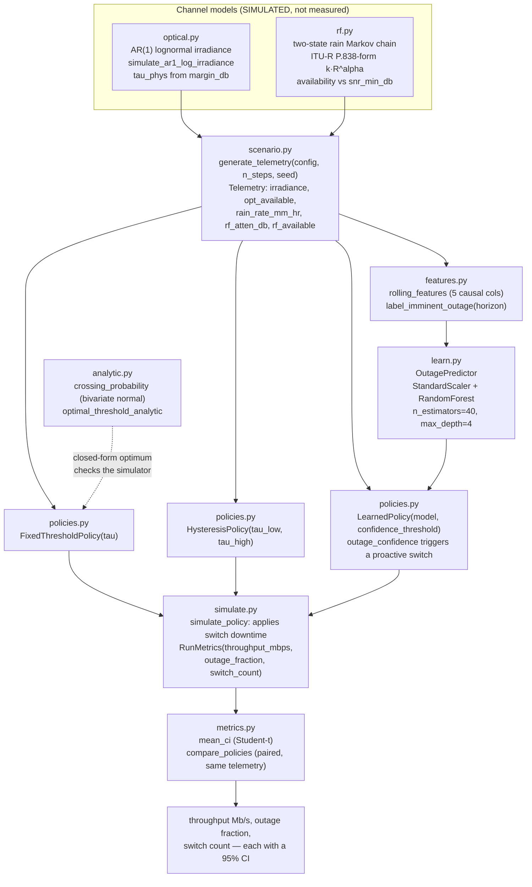
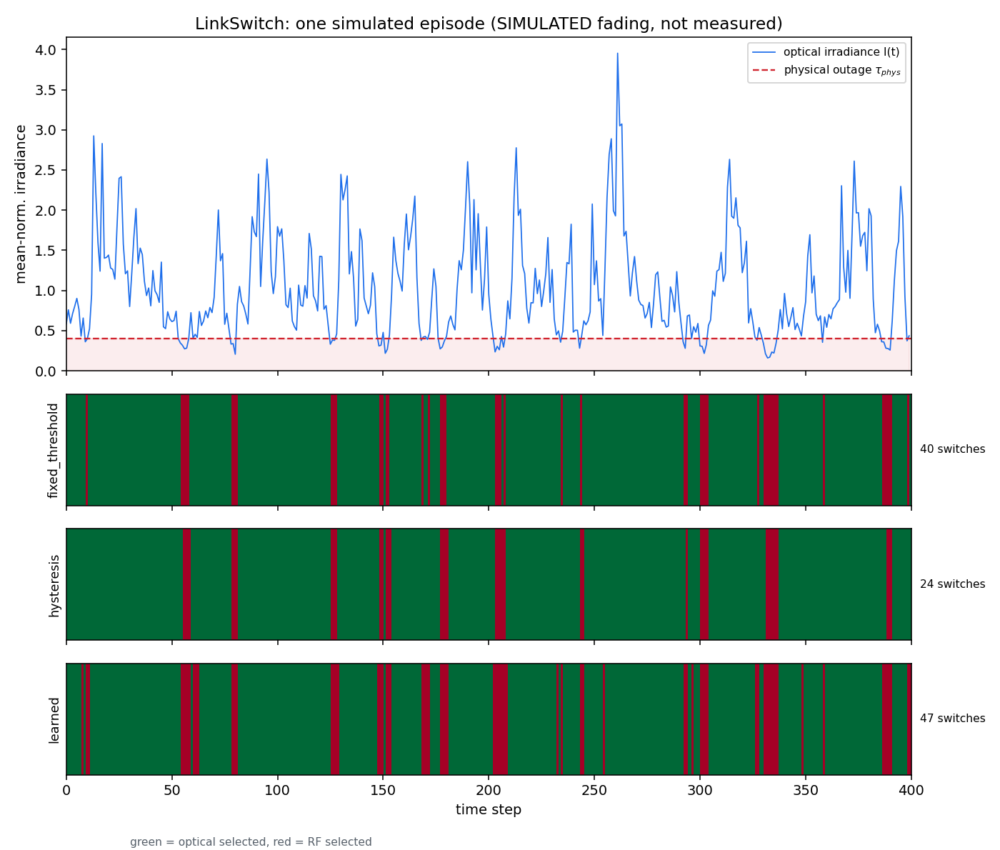
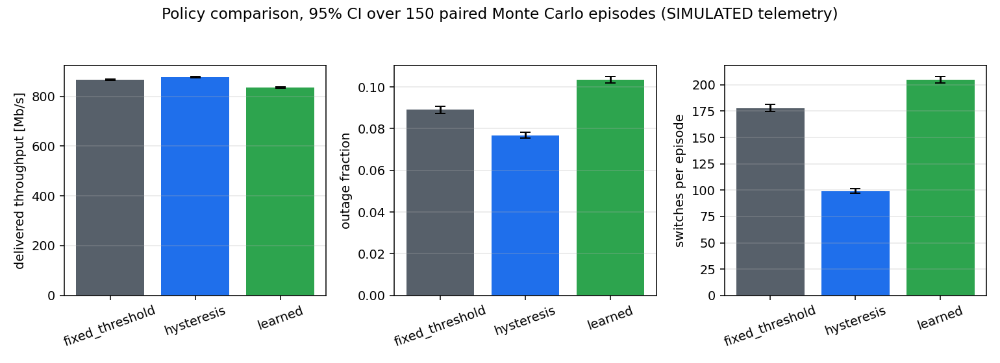

# LinkSwitch

Benchmarks fixed-threshold, hysteresis and learned switching policies for a simulated hybrid RF/FSO link.


> **The fading model in this repository is simulated, not measured.** Optical
> irradiance comes from an AR(1) lognormal process and RF rain fade from a
> two-state Markov chain with an ITU-R P.838-form attenuation law. No
> scintillometer record, rain-gauge series, or field link telemetry is used
> anywhere in this package, and **no claim in this README is validated against
> field data.** Every number below is a property of the simulator, not of a
> real link.

## The problem

A hybrid RF/FSO terminal carries its traffic on a high-rate optical channel and
keeps a slower RF channel as fallback, because atmospheric turbulence puts deep,
fast fades on the optical path that RF mostly shrugs off, while RF has its own
rain fade. Handover is not free: beam re-acquisition and RF re-lock cost real
downtime, so switching late loses data to outage and switching early or often
burns capacity on chatter. The open question in the middle is whether a learned
predictor that triggers before the fade is worth its complexity next to a
two-threshold hysteresis rule, and that question is usually answered with point
estimates that have no error bars on them.

## What this does

- Generates seeded dual-channel telemetry — AR(1) lognormal optical irradiance
  plus a two-state rain-fade RF channel — reproducibly from
  `(config, n_steps, seed)`, with two shipped scenarios whose measured optical
  outage fractions are 0.0046 and 0.0891 of steps (`validation/policy_comparison_ci.py`).
- Scores three switching policies on identical paired telemetry with 95%
  confidence intervals over 200 Monte Carlo episodes of 2000 steps each
  (`validation/policy_comparison_ci.py`).
- Solves the optimal fixed switching threshold in closed form from the AR(1)
  level-crossing probability, and reproduces the physical outage threshold to
  `1.3e-8` in the zero-switch-cost limit (`validation/analytic_threshold_check.py`, V1a).
- Cross-checks that closed form against an independent Monte Carlo argmax over
  10 threshold values × 40 episodes × 3000 steps, which lands on `tau_phys`
  exactly (`validation/analytic_threshold_check.py`, V1b).
- Measures the learned policy's sensitivity to prediction horizon over
  H = 1, 2, 3, 5, 8, 12, 20 at 120 episodes each, where throughput falls from
  888.240 to 625.345 Mb/s across H = 1 to 12 and collapses to 168.406 Mb/s at
  H = 20 (`validation/horizon_sensitivity.py`).

## The headline result

**The learned policy does not beat the hysteresis baseline outside the
confidence intervals in either scenario tested.** In the mild scenario the two
are statistically indistinguishable on throughput and on outage fraction; in
the moderate scenario hysteresis wins on throughput and outage with fully
disjoint intervals, and the learned policy is also beaten on throughput by the
naive fixed-threshold baseline. The detail, including which comparisons this
trial count cannot resolve at all, is in
[Statistical honesty](#statistical-honesty).

## Who it is for

- Researchers comparing hybrid RF/FSO switching policies who need a seeded,
  paired Monte Carlo harness that reports intervals rather than point estimates.
- Instructors teaching lognormal fading, level-crossing theory and Monte Carlo
  policy evaluation against code with hand-calculated known-answer tests.
- Engineers running a switching-policy trade study before committing to a
  measured-data campaign.

## Who it is not for

- Anyone who needs a physically faithful turbulence time series. The temporal
  AR(1) structure is an engineering approximation with a free coherence knob,
  not a measured or published turbulence temporal spectrum.
- Anyone who needs verified ITU-R rain attenuation. The shipped `(k, alpha)` are
  illustrative defaults and the path-reduction factor is a simplification of the
  ITU-R P.618 concept, not the P.618-13 procedure. Use `itur` for that.
- Anyone doing waveform, modulation, coding or BER work. Nothing here models a
  symbol; the channel is an availability indicator per time step.
- Anyone building a network-level or multi-link model. Single point-to-point
  horizontal link only, no slant path, no Cn²(h) profile.
- Anyone needing an operational or certified switching decision. See
  [Safety](#safety).

## Alternatives, honestly

Every entry below was checked to exist on PyPI or GitHub before being named
here.

| Alternative | What it does better | When to use it instead of LinkSwitch |
|---|---|---|
| [Sionna](https://pypi.org/project/sionna/) (PyPI `sionna` 2.0.1, NVIDIA) | Hardware-accelerated, differentiable link- and system-level simulation with ray tracing and standards-grade RF channel models, on GPU. Vastly larger scope and a maintained ecosystem. | Any RF physical-layer work that needs real channel realisations, MIMO, OFDM, or differentiable end-to-end learning. If you want to *learn* a communications policy properly, start here, not with a 5-feature RandomForest. |
| [scikit-commpy](https://pypi.org/project/scikit-commpy/) (PyPI `scikit-commpy` 0.8.0, imports as `commpy`) | Actual digital-communications primitives: channel coding, modulation and demodulation, equalisation, standard channel models. | Anything below the availability abstraction — if you need bits, symbols, or BER curves rather than a per-step "channel up or down" flag. Note the last release is 2022. |
| [OptiCommPy](https://pypi.org/project/OptiCommPy/) (PyPI `OptiCommPy` 0.10.0) | Full optical-communication system simulation: transmitters, amplification, nonlinear fibre propagation, coherent receivers and DSP. | Optical link modelling with real optical physics. Note its focus is *fibre*, not free-space, so it does not model atmospheric turbulence either. |
| [ns-3](https://github.com/nsnam/ns-3-dev-git) with the [SOCIS 2016 FSO module](https://www.nsnam.org/reviews/2016/socis-final/fso.html) | Discrete-event network simulation with protocol stacks, plus an FSO propagation-loss model with Hufnagel-Valley scintillation for satellite downlinks. Models the network above the link, which LinkSwitch does not. | Anything where the traffic, protocols or topology matter. Be aware the FSO module is a 2016 Summer-of-Code contribution, not part of mainline ns-3, and is not maintained alongside it. |
| [ITU-Rpy](https://pypi.org/project/itur/) (PyPI `itur` 0.4.0) | A real implementation of ITU-R P.618-13, P.837-7, P.838-3 and P.839-4 for slant and horizontal path attenuation. | Any rain-fade number you intend to defend. LinkSwitch's rain model borrows the P.838 functional form with unverified coefficients; `itur` implements the Recommendations. |
| **ITU-R P.618** (standard, not software) | The normative Earth-space propagation prediction procedure, including the effective-path-length reduction that LinkSwitch only gestures at. | Cited here as the standard whose *concept* the RF model follows. LinkSwitch does not implement the P.618-13 procedure and must not be represented as doing so. |

Where LinkSwitch is actually the right tool: you want a small, fully seeded,
fully tested harness for the *switching decision* itself, with a closed-form
optimum to check the simulator against and confidence intervals on every policy
comparison. That is a narrow job, and none of the packages above do it out of
the box.

## Install and first run

```bash
git clone https://github.com/OmAcharya-avtr/linkswitch.git
cd linkswitch
python -m venv .venv && source .venv/bin/activate
pip install -e ".[dev,examples]"
python -m pytest tests/ -q
python examples/telemetry_and_switching.py
```

Expected output of the test run (measured: 41 s on 2 cores):

```
........................................................................ [ 35%]
........................................................................ [ 71%]
.........................................................                [100%]
201 passed in 41.35s
```

Expected output of the first example (about 3 s):

```
saved /path/to/linkswitch/screenshots/telemetry_and_switching.png
```

The CLI is also available once installed:

```bash
python -m linkswitch threshold
```

```
Optimal fixed switching threshold (closed-form channel-statistics model)
  z_phys (physical outage, standardised)  = -2.688465
  rho (AR(1) lag-1 correlation)            = 0.818731
  bounded-optimizer  z_th* = -7.992264  tau* = 0.020508  J* = 996.410937
  grid-search        z_th* = -8.000000  tau* = 0.020433  J* = 996.410937
  |z_th optimizer - z_th grid| = 7.735789e-03
```

## Worked example

```python
from linkswitch import (
    OpticalParams, RFParams, ScenarioConfig, SwitchCost,
    generate_telemetry, train_outage_predictor,
    FixedThresholdPolicy, HysteresisPolicy, LearnedPolicy,
    simulate_policy, compare_policies,
)

opt = OpticalParams(sigma_i2=0.4, coherence_steps=4.0, margin_db=4.0, rate_mbps=1000.0)
cfg = ScenarioConfig(optical=opt, rf=RFParams(rate_mbps=150.0),
                     switch_cost=SwitchCost(downtime_steps=1))
tau = opt.tau_phys
print(f"physical outage threshold tau_phys = {tau:.6f} (mean-normalised irradiance)")

tel = generate_telemetry(cfg, n_steps=2000, seed=0)
print(f"optical available {tel.opt_available.mean():.4f} of steps, "
      f"RF available {tel.rf_available.mean():.4f}")

model = train_outage_predictor([generate_telemetry(cfg, 500, seed=300 + i) for i in range(15)],
                               tau_phys=tau, horizon=5, window=6, random_state=0)
learned = LearnedPolicy(model, tau_phys=tau, confidence_threshold=0.5, window=6)
print(f"mean outage confidence over the episode = {learned.outage_confidence(tel).mean():.4f} "
      "(uncalibrated RandomForest vote fraction)")

m = simulate_policy(tel, learned.select_channels(tel), cfg)
print(f"single episode, learned: {m.throughput_mbps:.3f} Mb/s, "
      f"outage {m.outage_fraction:.4f}, {m.switch_count} switches")

res = compare_policies(cfg, {
    "fixed_threshold": lambda: FixedThresholdPolicy(tau=tau),
    "hysteresis": lambda: HysteresisPolicy(tau_low=tau * 0.85, tau_high=tau * 1.15),
    "learned": lambda: learned,
}, n_steps=2000, n_reps=60, seed0=0)
for name, agg in res.items():
    t = agg["throughput_mbps"]
    print(f"{name:16s} {t.mean:8.3f} Mb/s  95% CI [{t.ci_low:.3f}, {t.ci_high:.3f}]  n={t.n}")
```

Actual printed output (2.2 s on 2 cores):

```
physical outage threshold tau_phys = 0.398107 (mean-normalised irradiance)
optical available 0.9155 of steps, RF available 1.0000
mean outage confidence over the episode = 0.2552 (uncalibrated RandomForest vote fraction)
single episode, learned: 854.300 Mb/s, outage 0.0930, 184 switches
fixed_threshold   868.872 Mb/s  95% CI [864.160, 873.583]  n=60
hysteresis        878.294 Mb/s  95% CI [873.696, 882.892]  n=60
learned           836.238 Mb/s  95% CI [831.057, 841.419]  n=60
```

This snippet uses 60 replicates and training seeds `300+i` with `window=6`; the
validation script uses 200 replicates, training seeds `40000+i` and `window=8`
for the mild scenario. The two therefore do not produce identical numbers, and
the citable figures are the ones in
[Validation evidence](#validation-evidence), not the ones above.

## Architecture



## Screenshots

Both images are produced by the repository's own examples, so they cannot drift
from the code.



`python examples/telemetry_and_switching.py`. Notice how often the blue
irradiance trace dips into the red band below `tau_phys` in the moderate
scenario, and that the three strips below it differ mainly in *how much they
chatter*: on this 400-step episode the fixed threshold takes 40 switches,
hysteresis 24, and the learned policy 47 — the learned policy is switching more
than the naive baseline, not less.



`python examples/policy_comparison.py`. Notice that the error bars are drawn on
every bar, and that they are small enough on throughput that the three policies
are visually separated — this is the case where the intervals do resolve the
difference. Notice also that the learned bar is the worst of the three on all
of throughput, outage fraction and switch count in this scenario.

## Validation evidence

Full criteria and raw stdout: `validation/VALIDATION.md`, with
`analytic_threshold_check_output.txt`, `policy_comparison_ci_output.txt` and
`horizon_sensitivity_output.txt` committed beside the scripts that wrote them.

| ID | Check | Reference | Result | Tolerance |
|---|---|---|---|---|
| V1a | Closed-form optimal threshold, zero switch cost, vs `z_phys` | `analytic.py` derivation | `abs(z_th* - z_phys)` = 1.257e-08 | 1e-4 — PASS |
| V1a | Same optimum vs 20001-point grid search | grid search, same objective | `abs(z_th* - z_th_grid)` = 4.985e-04 | 1e-2 — PASS |
| V1b | Independent Monte Carlo argmax, 10 tau × 40 episodes × 3000 steps | `simulate.py` (separate code path) | MC argmax `tau = 0.251189`, `tau_phys = 0.251189`, relative difference 0.0000 | within 1 grid point — PASS |
| V1c | Direction of the optimum under `downtime_steps=1` | closed form predicts `tau* = 0.014641` vs `tau_phys = 0.251189` | MC throughput highest at smallest tau (992.6167 Mb/s) and monotonically decreasing to 971.0279 Mb/s at `tau = 0.301426` | direction only — PASS |
| V2 | Three-policy paired comparison, 95% CI, mild scenario, 200 reps × 2000 steps | `policy_comparison_ci.py` | Learned and hysteresis **indistinguishable** on throughput and outage; both beat fixed | interval overlap test |
| V2 | Same, moderate scenario, 200 reps × 2000 steps | `policy_comparison_ci.py` | **Hysteresis wins** throughput and outage with disjoint intervals; learned loses to fixed on throughput | interval overlap test |
| V3 | Horizon sensitivity, H ∈ {1,2,3,5,8,12,20}, 120 reps × 1500 steps | `horizon_sensitivity.py` | Throughput 888.240 → 625.345 Mb/s over H = 1..12, collapse to 168.406 Mb/s at H = 20 | measurement, no pass criterion |
| V3 | Stated expectation that switch count is monotonically non-decreasing in H | module docstring | **FALSE as measured** (300.62 switches at H = 12, 118.81 at H = 20) | reported, not tuned away |

### Benchmark tables, as measured

Mild scenario (`sigma_i2=0.25, coherence_steps=5.0, margin_db=6.0`, `window=8`,
`horizon=5`), 200 paired episodes × 2000 steps:

| Policy | Throughput [Mb/s] (95% CI) | Outage fraction (95% CI) | Switches/episode (mean) |
|---|---|---|---|
| fixed_threshold | 994.321 [993.896, 994.746] | 0.0046 [0.0043, 0.0050] | 9.25 |
| hysteresis | 995.495 [995.126, 995.865] | 0.0036 [0.0033, 0.0038] | 3.08 |
| learned | 995.514 [995.163, 995.865] | 0.0038 [0.0035, 0.0041] | 4.16 |

Moderate scenario (`sigma_i2=0.4, coherence_steps=4.0, margin_db=4.0`,
`window=6`, `horizon=5`), 200 paired episodes × 2000 steps:

| Policy | Throughput [Mb/s] (95% CI) | Outage fraction (95% CI) | Switches/episode (mean) |
|---|---|---|---|
| fixed_threshold | 867.045 [864.702, 869.387] | 0.0891 [0.0877, 0.0905] | 178.16 |
| hysteresis | 876.905 [874.568, 879.242] | 0.0770 [0.0757, 0.0782] | 99.34 |
| learned | 856.796 [854.327, 859.265] | 0.0871 [0.0858, 0.0885] | 158.65 |

Horizon sweep, moderate scenario, 120 paired episodes × 1500 steps per horizon:

| Horizon H | Throughput [Mb/s] (95% CI) | Outage fraction (95% CI) | Switches/episode (mean) |
|---:|---|---|---:|
| 1 | 888.240 [884.970, 891.510] | 0.0820 [0.0798, 0.0843] | 60.54 |
| 2 | 881.636 [878.131, 885.141] | 0.0826 [0.0804, 0.0849] | 73.49 |
| 3 | 874.992 [871.395, 878.588] | 0.0841 [0.0819, 0.0863] | 87.34 |
| 5 | 840.825 [836.984, 844.666] | 0.1012 [0.0990, 0.1035] | 139.05 |
| 8 | 789.972 [785.726, 794.219] | 0.1266 [0.1243, 0.1290] | 189.88 |
| 12 | 625.345 [621.166, 629.523] | 0.2005 [0.1981, 0.2028] | 300.62 |
| 20 | 168.406 [167.383, 169.430] | 0.0794 [0.0777, 0.0811] | 118.81 |

## Statistical honesty

This is the part of the repository that matters most, so it gets its own
section rather than a footnote.

### What the interval test is, and what it is not

`metrics.mean_ci` computes a two-sided Student-t interval on the mean over
replicates, and `metrics.compare_policies` reports one such **marginal**
interval per policy per metric. It does **not** compute an interval on the
paired difference between two policies, even though the design is paired
(every policy sees the same telemetry realisation at every replicate). Two
consequences follow, and both cut against overclaiming:

- Disjoint marginal intervals imply the difference is real at this sample size.
  Those comparisons are safe to quote.
- Overlapping marginal intervals do **not** imply the two policies are equal.
  They mean this test cannot tell them apart. A paired-difference interval would
  be narrower and might resolve some of these; the shipped scripts do not compute
  one, so the honest statement is "indistinguishable by the interval this package
  reports", not "equal".

Switch counts are reported as means only in the committed raw output. **No
confidence interval on switch count exists in `policy_comparison_ci_output.txt`
or `horizon_sensitivity_output.txt`**, so no statistical claim is made about
switch-count differences anywhere in this README.

### What 200 replicates actually buys

At `n_reps = 200` and 2000 steps per episode, the reported half-widths on mean
throughput are 0.351–0.425 Mb/s in the mild scenario and 2.337–2.469 Mb/s in
the moderate scenario. With `t(0.975, 199) = 1.972`, those half-widths imply a
per-episode standard deviation of about 2.6 Mb/s (mild) and 16.8–17.7 Mb/s
(moderate). The non-overlap criterion therefore resolves throughput differences
larger than roughly **0.72 Mb/s in the mild scenario and 4.81 Mb/s in the
moderate scenario**, and nothing smaller.

The measured learned-minus-hysteresis throughput gap in the mild scenario is
**0.019 Mb/s**, which is about 2.6 percent of that resolution. Since the interval
half-width shrinks as `1/sqrt(n)`, resolving a gap that small by the same test
would need roughly 1436 times the replicates, on the order of **288,000 episodes
per policy** instead of 200. That is not a "nearly significant" result waiting
for a slightly bigger run; it is a difference the experiment was never sized to
see, and it should not be described as a win for anything.

### Comparisons that fall inside the intervals

These pairs are **indistinguishable** — their 95 percent intervals overlap and
this trial count cannot separate them:

| Scenario | Metric | Comparison | Difference in means | Interval overlap |
|---|---|---|---|---|
| Mild, 200 reps | Throughput | learned vs hysteresis | 0.019 Mb/s | 0.702 Mb/s |
| Mild, 200 reps | Outage fraction | learned vs hysteresis | 0.0002 | 0.0003 |
| Moderate, 200 reps | Outage fraction | learned vs fixed_threshold | 0.0020 | 0.0008 |
| Horizon, 120 reps | Throughput | H=1 vs H=2 | 6.604 Mb/s | 0.171 Mb/s |
| Horizon, 120 reps | Throughput | H=2 vs H=3 | 6.644 Mb/s | 0.457 Mb/s |
| Horizon, 120 reps | Outage fraction | H=1 vs H=2 | 0.0006 | 0.0039 |
| Horizon, 120 reps | Outage fraction | H=1 vs H=3 | 0.0021 | 0.0024 |
| Horizon, 120 reps | Outage fraction | H=1 vs H=20 | 0.0026 | 0.0013 |

Three of these deserve to be called out because the surrounding narrative would
otherwise get them wrong:

1. In the mild scenario the learned policy has the **highest point estimate** on
   throughput (995.514 vs 995.495 Mb/s). It is not a winner. Its interval
   `[995.163, 995.865]` sits almost entirely inside hysteresis's
   `[995.126, 995.865]`. Reporting "the learned policy achieved the highest
   throughput" from this run would be a misreading of the data this repository
   itself produced.
2. In the moderate scenario the learned policy is **not** shown to be worse than
   the naive fixed-threshold baseline on outage fraction — those intervals
   overlap by 0.0008. It *is* shown to be worse on throughput, where the
   intervals are disjoint by 5.437 Mb/s. A blanket "worse than even the naive
   baseline" is only supported for throughput.
3. In the horizon sweep, H = 20 has the numerically lowest outage fraction of
   any horizon (0.0794), but it is not distinguishable from H = 1 (0.0820); the
   intervals overlap by 0.0013. H = 20 is a degenerate operating point where the
   policy parks on RF and throughput collapses to 168.406 Mb/s, and nothing in
   the outage column should be read as a redeeming feature.

### Comparisons the intervals do resolve

| Scenario | Metric | Comparison | Difference in means | Gap between intervals |
|---|---|---|---|---|
| Mild | Throughput | hysteresis vs fixed_threshold | 1.174 Mb/s | 0.380 Mb/s |
| Mild | Throughput | learned vs fixed_threshold | 1.193 Mb/s | 0.417 Mb/s |
| Mild | Outage fraction | hysteresis vs fixed_threshold | 0.0010 | 0.0005 |
| Mild | Outage fraction | learned vs fixed_threshold | 0.0008 | 0.0002 |
| Moderate | Throughput | hysteresis vs learned | 20.109 Mb/s | 15.303 Mb/s |
| Moderate | Throughput | hysteresis vs fixed_threshold | 9.860 Mb/s | 5.181 Mb/s |
| Moderate | Throughput | fixed_threshold vs learned | 10.249 Mb/s | 5.437 Mb/s |
| Moderate | Outage fraction | hysteresis vs learned | 0.0101 | 0.0076 |
| Moderate | Outage fraction | hysteresis vs fixed_threshold | 0.0121 | 0.0095 |
| Horizon | Throughput | H=3 vs H=5 and every wider step | ≥ 34.167 Mb/s | ≥ 26.729 Mb/s |

### The conclusion this supports

**In neither tested scenario does the learned policy beat the hysteresis
baseline outside the confidence intervals.** In the mild scenario the two are
indistinguishable on throughput and on outage fraction. In the moderate scenario
hysteresis beats the learned policy on both, with intervals that do not touch.
No tolerance was loosened, no scenario was retuned and no seed was reselected to
alter this outcome. The horizon sweep does not rescue it either: the learned
policy's best measured horizon is the shortest one tested, and even there
(H = 1, 888.240 Mb/s at 120 reps × 1500 steps) it is being compared against a
hysteresis baseline that reaches 876.905 Mb/s under a *different* episode length
and replicate count, so the two are not directly comparable and no cross-run
claim is made.

## API reference

<details>
<summary>Public surface (<code>from linkswitch import ...</code>)</summary>

**Configuration**

| Name | Description and units |
|---|---|
| `OpticalParams(sigma_i2, coherence_steps, margin_db, rate_mbps, fading_model)` | Scintillation index (dimensionless, default 0.25), AR(1) coherence time (steps, 5.0), link margin (dB, 6.0), optical rate (Mb/s, 1000.0), `"lognormal"` |
| `OpticalParams.tau_phys` | Physical outage threshold, mean-normalised irradiance, `10**(-margin_db/10)` |
| `RFParams(p_rain, mean_event_steps, r_med_mm_hr, rate_sigma, k, alpha, path_length_km, reduction_length_km, snr_clear_db, snr_min_db, rate_mbps)` | Rain probability (0.04), mean event length (steps, 20.0), median rain rate (mm/hr, 8.0), lognormal spread (0.7), P.838-form coefficients (illustrative, 0.07 / 1.10), path and reduction length (km, 5.0 / 20.0), clear and minimum SNR (dB, 25.0 / 6.0), RF rate (Mb/s, 150.0) |
| `SwitchCost(downtime_steps)` | Steps of zero throughput after each channel change (default 1) |
| `ScenarioConfig(optical, rf, switch_cost)` | Container for the three above |

**Telemetry**

| Name | Description and units |
|---|---|
| `generate_telemetry(config, n_steps, seed) -> Telemetry` | Deterministic dual-channel episode; independent RNG streams for optical and RF |
| `Telemetry.irradiance` | Mean-normalised optical irradiance, `E[I] = 1`, dimensionless |
| `Telemetry.opt_available` | bool, `irradiance >= tau_phys` |
| `Telemetry.rain_rate_mm_hr` | mm/hr, zero when clear |
| `Telemetry.rf_atten_db` | dB of rain attenuation, zero when clear |
| `Telemetry.rf_available` | bool, `snr_clear_db - rf_atten_db >= snr_min_db` |
| `Telemetry.n_steps` | Episode length in steps |

**Policies**

| Name | Description and units |
|---|---|
| `FixedThresholdPolicy(tau)` | Select RF whenever irradiance `< tau` (mean-normalised) |
| `HysteresisPolicy(tau_low, tau_high)` | Leave optical below `tau_low`, return above `tau_high` |
| `LearnedPolicy(model, tau_phys, confidence_threshold, window)` | Proactive switch when predicted outage confidence exceeds `confidence_threshold` (dimensionless, 0 to 1) |
| `<policy>.select_channels(telemetry) -> np.ndarray[bool]` | Intended channel per step, True means optical |
| `LearnedPolicy.outage_confidence(telemetry) -> np.ndarray[float]` | RandomForest class-1 vote fraction per step, 0 to 1, **uncalibrated** |

**Learning**

| Name | Description and units |
|---|---|
| `train_outage_predictor(telemetries, tau_phys, horizon, window, random_state=0, n_estimators=40, max_depth=4)` | Fits the scaler plus RandomForest pipeline over causal rolling features |
| `OutagePredictor` | `fit`, `predict_proba`; degenerates to a constant predictor when a training set contains no outage |
| `rolling_features(irradiance, window)` | 5 causal columns: `ln I`, trailing rolling mean, std, min, and slope per step |
| `label_imminent_outage(irradiance, tau_phys, horizon)` | Binary label, does irradiance fall below `tau_phys` within `horizon` steps |

**Scoring and comparison**

| Name | Description and units |
|---|---|
| `simulate_policy(telemetry, select_optical, config) -> RunMetrics` | Applies availability and post-switch downtime |
| `RunMetrics` | `throughput_mbps` (Mb/s, mean over all steps), `outage_steps` (count), `outage_fraction` (0 to 1), `switch_count` (count), `n_steps` |
| `run_monte_carlo(config, policy_factory, n_steps, n_reps, seed0) -> list[RunMetrics]` | One policy, `n_reps` independently seeded episodes |
| `compare_policies(config, policy_factories, n_steps, n_reps, seed0, ci_level=0.95)` | Paired comparison, same telemetry per replicate for every policy |
| `mean_ci(values, ci_level=0.95) -> Aggregate` | Student-t interval on the mean; collapses to a point for `n = 1` |
| `Aggregate` | `mean`, `ci_low`, `ci_high`, `n`, `ci_level` |
| `aggregate_runs(runs, ci_level=0.95)` | Intervals for throughput, outage fraction and switch count |

**Analytic model**

| Name | Description and units |
|---|---|
| `crossing_probability(z_th, rho)` | Per-step level-crossing probability of the AR(1) log-irradiance, dimensionless |
| `expected_throughput_analytic(...)` | Closed-form objective `J(z_th)` in Mb/s |
| `optimal_threshold_analytic(..., z_bounds=(-8.0, 8.0)) -> OptimalThresholdResult` | Bounded scalar optimisation of `J` |
| `optimal_threshold_grid(..., n_points=4001)` | Grid-search cross-check of the same objective |
| `p_rf_available_estimate(rf, n_mc=20000, seed=12345)` | Monte Carlo estimate of RF availability, 0 to 1 |

**Channel primitives**

| Name | Description and units |
|---|---|
| `lognormal_sigma_z(sigma_i2)` | `sqrt(ln(1 + sigma_i2))`, dimensionless |
| `irradiance_threshold_from_margin_db(margin_db)` | `10**(-margin_db/10)`, mean-normalised irradiance |
| `simulate_ar1_log_irradiance(...)` | AR(1) log-irradiance series with `rho = exp(-1/coherence_steps)` |
| `sample_gamma_gamma_irradiance(...)` | i.i.d. gamma-gamma sampler, **not wired into `generate_telemetry`** |
| `rain_markov_transition_probs(p_rain, mean_event_steps)` | Two-state chain transition probabilities |
| `rain_specific_attenuation_db_per_km(rain_rate_mm_hr, k, alpha)` | `k * R**alpha`, dB/km, P.838 functional form |
| `rf_path_attenuation_db(...)` | Path attenuation in dB after the simplified reduction factor |

</details>

## Limitations

**Compute budget.** Everything here is sized to run on 2 CPU cores in under two
minutes per script, with no GPU and `n_jobs=1` throughout. Measured wall times:
`analytic_threshold_check.py` 6.6 s, `policy_comparison_ci.py` 3.7 s,
`horizon_sensitivity.py` 8.3 s, the 201-test suite 41 s, the two examples about
6 s combined. Peak memory stays well under 100 MB. That budget is the direct
cause of the next two limitations, and it was not relaxed to obtain a better
result.

**Monte Carlo trial counts and their statistical power.** The comparison runs
use 200 replicates (2000 steps) and the horizon sweep 120 replicates (1500
steps). As quantified in [Statistical honesty](#statistical-honesty), that
resolves throughput differences above roughly 0.72 Mb/s (mild) and 4.81 Mb/s
(moderate) by the non-overlap criterion, and nothing smaller. Eight of the
comparisons in this repository fall inside their intervals and are reported as
indistinguishable rather than as wins. Switch-count intervals were never
computed at all, so switch-count differences carry no statistical claim.

**The fading model is simulated in origin, and nothing is validated against
field data.** The optical channel is an AR(1) process on standardised
log-irradiance with lognormal marginals; the AR(1) temporal structure is an
engineering approximation chosen to give a tunable coherence time, not a fit to
any measured or published turbulence temporal power spectrum. The RF channel is
a synthetic two-state rain chain whose `(k, alpha)` are illustrative defaults,
not current ITU-R P.838 table values, and whose path-reduction factor follows
the ITU-R P.618 concept rather than the P.618-13 procedure. There is no
scintillometer, rain-gauge or link-telemetry comparison anywhere in this
package. Level 2 evidence here means analytic self-consistency and Monte Carlo
cross-checks only.

**Prediction-horizon sensitivity.** The learned policy's behaviour depends
strongly and non-monotonically on the horizon `H`. Throughput falls from 888.240
to 625.345 Mb/s as `H` goes from 1 to 12, and at `H = 20` the policy degenerates:
nearly every training window is labelled "imminent outage", the model predicts
outage almost unconditionally, the policy parks on RF, and throughput collapses
to 168.406 Mb/s — close to the 150 Mb/s RF-only floor. Switch count is *not*
monotone in `H` as the module docstring anticipated (300.62 at `H = 12`, 118.81
at `H = 20`), and that expectation is recorded as falsified rather than removed.
There is no interior optimum in the scanned range; the best measured horizon is
the shortest one tested.

**Other known bounds.** The lognormal model is a weak-fluctuation
approximation and warns above `sigma_i2 ≈ 1`. The gamma-gamma sampler is i.i.d.
only and is not wired into telemetry generation, so no moderate or
strong-turbulence *time series* exists in this package. The confidence output is
a raw RandomForest vote fraction with no Platt or isotonic calibration and no
measured calibration curve. Training sets are 10–15 episodes of 500 steps with
no training-set-size convergence study. There is no extrapolation guard, so
querying far outside the training scenario returns a confident-looking untested
prediction. The link is a single point-to-point horizontal one, with no Cn²(h)
profile, no slant path, no wind or frozen-flow model, and no multi-link
correlation. The switch-cost model is a fixed `downtime_steps` regardless of
direction, and the analytic model further approximates the expected cost as
`downtime_steps * R_opt`.

## Reproducing every number

```bash
python -m pytest tests/ -q                        # 201 passed in 41.35s
python validation/analytic_threshold_check.py     # V1a, V1b, V1c   ~6.6 s
python validation/policy_comparison_ci.py         # V2, both tables ~3.7 s
python validation/horizon_sensitivity.py          # V3 sweep        ~8.3 s
python examples/telemetry_and_switching.py        # screenshot 1    ~3 s
python examples/policy_comparison.py              # screenshot 2    ~4 s
```

Each validation script writes its raw stdout to `<script_name>_output.txt` in
`validation/`, and those files are committed. Seeds are explicit at every call
site: telemetry seeds `0..n_reps-1` for comparison replicates, training seeds
`40000+i` (V2) and `70000+i` (V3), `random_state=0` for the RandomForest.
Identical `(telemetries, seeds, random_state)` gives bit-identical
`predict_proba` output, checked by
`tests/test_learn.py::TestOutagePredictorBasics::test_seeded_reproducibility`.

The interval-overlap and resolution figures in
[Statistical honesty](#statistical-honesty) are arithmetic on the committed
interval endpoints in `validation/policy_comparison_ci_output.txt` and
`validation/horizon_sensitivity_output.txt`; the implied per-episode standard
deviations invert `half_width = t(0.975, n-1) * s / sqrt(n)` with
`t(0.975, 199) = 1.972`.

## Safety

This software is research-grade. It is not flight-qualified, not certified, and
not approved for operational aerospace use. Its outputs must not be used for
go/no-go decisions on any operational optical or hybrid RF/FSO link, terrestrial
or space-to-ground, nor for any availability guarantee. All fading and rain data
are simulated; no claim here is validated against field measurements.

## Licence

Apache-2.0. See `LICENSE`. Copyright © 2026 OPTIMA Organisation.

## Citation

```bibtex
@software{linkswitch_2026,
  title   = {LinkSwitch: hybrid RF/FSO link switching policies benchmarked
             on simulated dual-channel telemetry},
  author  = {{OPTIMA Organisation}},
  year    = {2026},
  version = {0.1.0},
  license = {Apache-2.0},
  note    = {Research-grade software; not certified for operational aerospace use}
}
```

Theory references, cited rather than reproduced: L. C. Andrews and
R. L. Phillips, *Laser Beam Propagation through Random Media*, 2nd ed., SPIE
Press, 2005; M. A. Al-Habash, L. C. Andrews and R. L. Phillips, *Optical
Engineering* 40(8), 1554, 2001; S. O. Rice, *Bell System Technical Journal*
23-24, 1944-45; H. Cramér and M. R. Leadbetter, *Stationary and Related
Stochastic Processes*, Wiley, 1967; H. Kaushal and G. Kaddoum, "Optical
Communication in Space: Challenges and Mitigation Techniques," *IEEE
Communications Surveys and Tutorials* 19(1), 57-96, 2017; ITU-R Recommendations
P.618, P.837 and P.838.

## Credits

This is under reserved rights obtained by OPTIMA Organisation.
