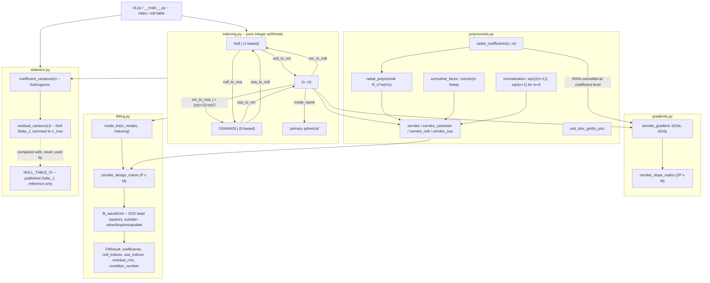
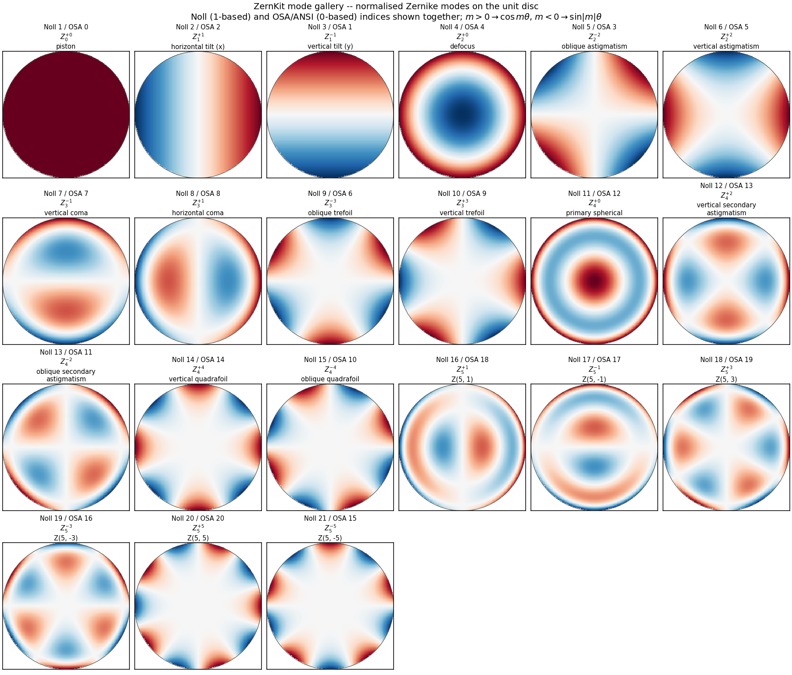
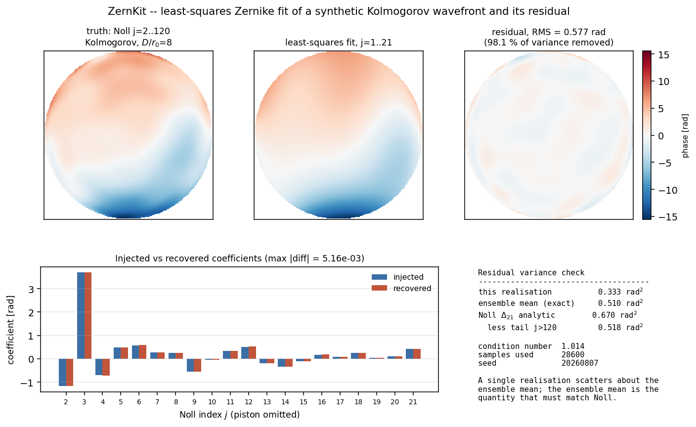

# ZernKit

Zernike polynomials with the index convention made explicit at every call site.


## The problem

A wavefront arrives as a vector of Zernike coefficients and someone writes down
`Z11 = 0.08 waves`. Under Noll (1976) that is primary spherical, `(n, m) = (4, 0)`;
under OSA/ANSI it is oblique secondary astigmatism, `(4, −2)` — a completely
different picture on the pupil, and the same integer names both of them. The
mistake is silent: the Strehl ratio you compute afterwards is still a plausible
number, so nothing fails, and the error surfaces weeks later when a measured
point spread function refuses to match the model.

## What this does

- **Both single-index orderings as exact integer maps, and the conversion
  between them.** Noll (1-based) and OSA/ANSI (0-based), verified against Noll's
  own listing of Z₁…Z₁₅ (15/15 exact) and against the OSA closed form
  `j = (n(n+2) + m)/2` for all 496 pairs with `n ≤ 30`.
- **Round-trip property tests, not spot checks.** Hypothesis drives
  Noll ↔ (n, m), OSA ↔ (n, m), Noll → OSA → Noll and OSA → Noll → OSA over
  `j = 1..20 000`, plus Noll's parity rule (even `j` ⇒ cosine).
- **Orthonormal mode evaluation** measured against the analytic Kronecker delta:
  worst Gram-matrix deviation from the identity **5.218e-14** over Noll
  `j = 1..36`.
- **Closed-form Cartesian gradients** for Shack-Hartmann slope matrices, worst
  scaled deviation **2.884e-11** against Richardson-extrapolated finite
  differences over all 66 modes to `n = 10`, and finite at `ρ = 0` in all 66
  cases because the `1/ρ` is cancelled at the coefficient level.
- **Least-squares wavefront fitting with an explicit out-of-disc policy**
  (`raise` by default) and Noll's Kolmogorov residual variances `Δ_J` computed
  from the analytic coefficient variances, never from a lookup table.

## Who it is for

- Anyone reconciling Zernike coefficients produced by two tools that disagree
  about indexing, or writing the adapter between them.
- Students and educators who need every convention written down where it can be
  read, and the low-order closed forms available as tested reference points.
- Engineers doing early wavefront analysis who want a small, auditable
  dependency (NumPy, plus SciPy for two gamma functions) rather than a
  simulation framework.

## Who it is not for

- Anyone who needs an adaptive-optics simulator: phase screens, sensor models,
  coronagraphs and closed-loop control are all out of scope.
- Anyone working an annular or segmented pupil. Circle polynomials are not
  orthogonal on an annulus and the annular polynomials are not implemented.
- Anyone needing Fringe or Wyant indexing, common in commercial interferometry
  software and not implemented here.
- Anyone who needs speed at scale. This is straightforward NumPy with no
  caching of the mode basis across calls.

## Alternatives, honestly

Zernike code is not scarce. Each of these is real, maintained by people who do
this for a living, and a better choice than ZernKit for most jobs.

| Alternative | What it does better | When to use ZernKit instead |
|---|---|---|
| [prysm](https://pypi.org/project/prysm/) | The most complete polynomial layer of the group: Noll, ANSI/OSA **and** Fringe conversions, Zernike derivatives, plus a full physical-optics, phase-retrieval and raytracing stack around it | Only if you want a five-module package you can read end to end in an afternoon, with the convention evidence committed as raw validation output. If you need Fringe, use prysm |
| [poppy](https://pypi.org/project/poppy/) (`poppy.zernike`) | Fraunhofer/Fresnel propagation for real instruments; the STScI-maintained tooling behind JWST wavefront models | You want indexing and fitting only, with no propagation engine and no astronomy-oriented data model |
| [hcipy](https://pypi.org/project/hcipy/) | Coronagraphy and high-contrast imaging end to end; Zernikes are one mode basis among many on arbitrary grids | You are not simulating an instrument and do not want a `Grid`/`Field` abstraction between you and an array |
| [aotools](https://pypi.org/project/aotools/) | A broad, well-cited AO toolbox: phase screens, turbulence, centroiding, image metrics | aotools is Noll-first (`zernike_noll`, `zernIndex`) and offers no direct Noll ↔ OSA/ANSI conversion; that conversion is the thing ZernKit exists to get right |
| [galsim](https://pypi.org/project/galsim/) (`galsim.zernike`) | Annular Zernikes (`R_inner`), analytic Cartesian gradients, and a mature weak-lensing image-simulation framework | GalSim is Noll-only and its `coef[0]` is ignored; use ZernKit when the OSA/ANSI side of the conversion is the thing you need, and skip both if you have an obscured pupil |
| [zernike](https://pypi.org/project/zernike/) | A focused Zernike package: complex- and real-valued polynomials, with fitting in both Cartesian and polar coordinates (`FitZern`) | You need the Noll ↔ OSA/ANSI conversion itself, plus gradients and turbulence statistics, in the same place |
| [opticspy](https://pypi.org/project/opticspy/) | Interferogram simulation, surface reconstruction, ray tracing | opticspy's last release is 0.2.1 (March 2016); prefer any of the above for new work |

The narrow claim ZernKit makes is this: every convention is stated at the call
site, both orderings are exact integer maps with property-tested round trips,
and the numerical evidence for that is committed as raw output in
`validation/`. Nothing else here is novel.

## Install and first run

```bash
git clone https://github.com/OmAcharya-avtr/zernkit.git
cd zernkit
python -m venv .venv && source .venv/bin/activate
pip install -e ".[dev]"
python -m pytest tests/ -q
python examples/mode_gallery.py
```

`pyproject.toml` defines `examples` and `dev` extras, not `test` — `dev` is the
one that pulls in pytest, Hypothesis, ruff and Matplotlib, so `pip install -e
".[test]"` would fail. The library itself needs only NumPy and SciPy.

Expected output:

```
........................................................................ [ 45%]
........................................................................ [ 91%]
..............                                                           [100%]
158 passed in 4.66s
```

```
wrote /path/to/zernkit/screenshots/zernike_mode_gallery.png
```

The CLI answers the index question directly:

```
$ python -m zernkit index --noll 11
  Noll     OSA    n    m   name
    11      12    4   +0   primary spherical

$ python -m zernkit index --osa 11
  Noll     OSA    n    m   name
    13      11    4   -2   oblique secondary astigmatism
```

## Worked example

The index round trip, a fit that recovers what was injected, and the turbulence
statistic that ties them together.

```python
import zernkit as zk

# The same number means different things in the two conventions.
print("Noll  j=11 ->", zk.noll_to_nm(11), zk.mode_name(*zk.noll_to_nm(11)))
print("OSA   j=11 ->", zk.osa_to_nm(11), zk.mode_name(*zk.osa_to_nm(11)))
print("Noll 11 is OSA", zk.noll_to_osa(11), "/ OSA 11 is Noll", zk.osa_to_noll(11))

# Round-trip both ways over the first six radial orders.
bad = [j for j in range(1, 29) if zk.osa_to_noll(zk.noll_to_osa(j)) != j]
print("Noll->OSA->Noll mismatches over j=1..28:", bad)

# Inject 0.30 waves of defocus and 0.12 waves of oblique trefoil, then fit.
x, y, mask = zk.unit_disc_grid(192)
xin, yin = x[mask], y[mask]
w = (0.30 * zk.zernike_cartesian(2, 0, xin, yin)
     + 0.12 * zk.zernike_cartesian(3, -3, xin, yin))

fit = zk.fit_wavefront(xin, yin, w, n_modes=15, outside="drop")
print("samples fitted :", len(xin), " dropped:", fit.n_dropped)
print("defocus  (2, 0):", round(float(fit.coefficient(2, 0)), 6))
print("trefoil (3,-3) :", round(float(fit.coefficient(3, -3)), 6))
print("Noll index of the trefoil term :", zk.nm_to_noll(3, -3))
print("OSA  index of the same mode    :", zk.nm_to_osa(3, -3))
print("residual RMS   :", f"{fit.residual_rms:.3e}")
print("condition no.  :", f"{fit.condition_number:.4f}")

# Turbulence statistics, computed rather than tabulated.
print("Delta_21 computed :", f"{zk.residual_variance(21):.6f}")
print("Delta_21 published:", zk.NOLL_TABLE_IV[21])
```

Actual output:

```
Noll  j=11 -> (4, 0) primary spherical
OSA   j=11 -> (4, -2) oblique secondary astigmatism
Noll 11 is OSA 12 / OSA 11 is Noll 13
Noll->OSA->Noll mismatches over j=1..28: []
samples fitted : 28600  dropped: 0
defocus  (2, 0): 0.3
trefoil (3,-3) : 0.12
Noll index of the trefoil term : 9
OSA  index of the same mode    : 6
residual RMS   : 3.372e-16
condition no.  : 1.0094
Delta_21 computed : 0.020927
Delta_21 published: 0.0208
```

The trefoil is Noll 9 and OSA 6. Passing one number where the other was expected
selects vertical trefoil instead of oblique — a 30-degree pupil rotation of the
aberration, with nothing anywhere to indicate a mistake.

## Architecture



Orthonormality is the property the whole diagram rests on: `normalization` in
`polynomials.py` is what makes the Gram matrix of `zernike_cartesian` the
identity under the `1/π` area weight, which is what lets `fit_wavefront` return
a well-conditioned solution and lets `residual_variance` be a simple sum of
per-mode variances.

Runtime dependencies: NumPy throughout, SciPy for `gamma`/`gammaln` in
`statistics.py` only. Matplotlib is needed by the examples, not by the library.
No cross-product imports.

## Screenshots



Produced by `examples/mode_gallery.py`. Read the panel titles in reading order
and notice that the OSA numbers are not monotonic: Noll 9 / OSA 6, Noll 11 /
OSA 12, Noll 15 / OSA 10, Noll 16 / OSA 18. The reordering is a picture, not an
assertion.



Produced by `examples/wavefront_fit.py`. Notice the injected-versus-recovered
coefficient bars agree to `max |diff| = 5.16e-03` across all 20 non-piston
modes, and that the residual panel is not noise — it is structured high-order
turbulence (Noll `j = 22..120`) that a 21-mode basis cannot represent, which is
exactly the AO fitting error the analytic `Δ₂₁` predicts.

## Validation evidence

Level 1 (Educational). Every figure below is the raw output of a script in
`validation/`, committed alongside it; the full working, including the hand
arithmetic, is in `validation/VALIDATION.md`.

| Check | Reference | Result | Tolerance | Source |
|---|---|---|---|---|
| Orthonormality, Gram matrix vs Kronecker delta, Noll `j = 1..36`, Gauss-Legendre(ρ) × uniform(θ) | Noll (1976), *JOSA* **66**(3), 207–211, Eq. (3) | worst \|G − I\| **5.218e-14** at 120×512 nodes; **2.109e-15** at 80×256 | 1e-12 | `validate_orthonormality.py` |
| Orthonormality on a masked uniform Cartesian grid (what sampled data looks like) | same | **2.527e-02** leakage at 128 px, **3.328e-03** at 512 px; converges like `1/n_pix`, **not** to machine precision | reported, not a pass/fail | `validate_orthonormality.py` |
| Twelve low-order closed forms hand-evaluated at ρ = 0.5, θ = 30° | Noll (1976), *JOSA* **66**(3), 207–211, printed closed forms | worst \|library − hand\| **2.220e-16** (1 ulp) | 1e-15 | `validate_closed_forms.py` |
| `R_n^m(1) = 1` for all 231 legal `(n, m)` pairs to `n = 20` | analytic identity | worst \|R − 1\| **0.000e+00** | 1e-8 | `validate_closed_forms.py` |
| Noll index → `(n, m)` against Noll's own listing of Z₁…Z₁₅ | Noll (1976), *JOSA* **66**(3), 207–211 | **15 / 15 exact** | exact | `validate_closed_forms.py` |
| OSA/ANSI closed form `j = (n(n+2) + m)/2` | ANSI Z80.28; Thibos et al., *J. Refract. Surg.* **18**, S652 (2002) | **496 / 496 pairs** to `n = 30` | exact | `validate_closed_forms.py` |
| Analytic gradients vs Richardson-extrapolated central differences, 66 modes to `n = 10`, 400 seeded points on ρ ≤ 0.9 | `O(h⁶)` finite-difference reference | worst scaled deviation **2.884e-11** | 1e-9 | `validate_gradients.py` |
| Eight gradient closed forms by hand, incl. `dZ₇/dy(0,0) = −2√8` | analytic | worst \|library − exact\| **2.220e-16**; **0 of 66** modes give nan/inf at ρ = 0 | 1e-15 | `validate_gradients.py` |
| Noll residual variances `Δ_J`, `J = 1..21`, computed from analytic coefficient variances | Noll (1976), *JOSA* **66**(3), 207–211, published `Δ_J` table | worst relative deviation **+0.954 %** with Noll's rounded `C_psd = 0.023`; **+0.529 %** with the unrounded `0.490/(2π)^(5/3) = 0.0229032`. **All 21 deviations are positive** | 1 % | `validate_noll_variance.py` |
| `Δ₁` by an independent real-space route with no Zernike series: `σ² = ½⟨D_φ(\|r₁−r₂\|)⟩` over the pupil | Kolmogorov structure function, `D_φ(r) = 6.883877 (r/r₀)^(5/3)` | structure-function integral **1.032422**, Zernike series **1.032765** → the two routes agree to **0.033 %**, and both sit **+0.25 % and +0.28 %** above Noll's published **1.0299** | 0.5 % between routes | `validate_noll_variance.py` |
| Per-mode `⟨a_j²⟩` vs differences of consecutive published `Δ_J`, radial orders `n = 1..5` | Noll (1976) table | **+0.24 % to +0.69 %**, flat within each radial order — an independent confirmation of the Noll index → `(n, m)` map | 1 % | `validate_noll_variance.py` |
| Truncation of the `Δ_J` sum at the default `n_max = 200 000` | `n_max = 10⁶` reference | **6.2e-10** `(D/r₀)^(5/3)`, four orders below the gap against the published table | — | `validate_noll_variance.py` |
| End-to-end: 21-mode fit of a Kolmogorov wavefront, exact ensemble-mean residual variance vs `Δ₂₁ − tail` | Noll (1976) statistics | **0.5100** vs **0.5180 rad²**, **1.5 %** | — | `examples/wavefront_fit.py` |
| Property tests on index round trips: Noll ↔ (n, m), OSA ↔ (n, m), Noll → OSA → Noll, OSA → Noll → OSA, `j = 1..20 000`; Noll parity rule | Hypothesis, generated inputs | included in **158 passed, 0 failed, 0 skipped**; `ruff check src/ tests/` clean | — | `tests/test_indexing.py` |

### On the 0.3 % disagreement with Noll's published table

Every computed `Δ_J` lands **above** Noll's printed value, by 0.5–1.0 % with his
rounded `C_psd = 0.023` and 0.1–0.5 % with the unrounded constant. That is a
systematic offset, not scatter, so it was worth chasing rather than absorbing.

A second, entirely independent route settles it. The piston-removed
aperture-averaged variance can be obtained in real space as
`σ² = ½⟨D_φ(|r₁ − r₂|)⟩` for two points uniform on the pupil, which involves no
Zernike polynomial, no index convention and no series truncation. It gives
**1.032422 (D/r₀)^(5/3)** against the Zernike series' **1.032765** — agreement
to **0.033 %** — and both are about **0.3 %** above the published **1.0299**.
Two methods with nothing in common do not agree with each other to 0.03 % and
happen to share the same 0.3 % error; the residual gap is in the rounding of the
constants as printed, not in this implementation.

Nothing has been rescaled to close it. The library default remains Noll's
`C_psd = 0.023` so that results are directly comparable with his table, the
unrounded constant is exposed as `KOLMOGOROV_PSD_CONSTANT`, and
`NOLL_TABLE_IV` holds the published values as reference data that no computation
ever reads.

## API reference

Units: the library is unit-agnostic for the wavefront — coefficients come out in
whatever unit the samples went in (waves, radians, metres) and are never
converted. `ρ` is the pupil radius normalised so the pupil edge is at `ρ = 1`;
the physical aperture radius never enters. Turbulence statistics are the one
exception and are in rad² for a given `D/r₀`.

<details>
<summary>Indexing (<code>zernkit.indexing</code>)</summary>

| Function | Returns |
|---|---|
| `noll_to_nm(j)` | `(n, m)` for Noll index `j ≥ 1` |
| `nm_to_noll(n, m)` | Noll index (1-based) |
| `osa_to_nm(j)` | `(n, m)` for OSA/ANSI index `j ≥ 0` |
| `nm_to_osa(n, m)` | OSA/ANSI index (0-based), `(n(n+2) + m)/2` |
| `noll_to_osa(j)` / `osa_to_noll(j)` | the same physical mode in the other convention |
| `radial_order_from_noll(j)` | radial degree `n` |
| `mode_name(n, m)` | traditional name, e.g. `'primary spherical'` |
| `validate_nm(n, m)` | raises `ValueError` unless `n ≥ 0`, `\|m\| ≤ n`, `n − \|m\|` even |

</details>

<details>
<summary>Polynomials (<code>zernkit.polynomials</code>)</summary>

| Function | Returns |
|---|---|
| `normalization(n, m, normalized=True)` | `sqrt(2(n+1))`, or `sqrt(n+1)` for `m = 0`; `1.0` if `normalized=False` |
| `radial_coefficients(n, m)` | coefficient array of `R_n^m` in powers of ρ (dimensionless) |
| `radial_polynomial(n, m, rho)` | `R_n^m(ρ)` on `0 ≤ ρ ≤ 1` |
| `azimuthal_factor(m, theta)` | `cos(mθ)` for `m > 0`, `sin(\|m\|θ)` for `m < 0`, `1` for `m = 0`; θ counter-clockwise from `+x` |
| `zernike(n, m, rho, theta, normalized=True)` | mode in polar coordinates |
| `zernike_cartesian(n, m, x, y, normalized=True)` | mode at normalised pupil coordinates |
| `zernike_noll(j, ...)` / `zernike_osa(j, ...)` | mode by single index in the named convention |
| `unit_disc_grid(n_pix, include_edge=True)` | `(x, y, mask)`; `mask` selects `ρ ≤ 1` |

</details>

<details>
<summary>Gradients (<code>zernkit.gradients</code>)</summary>

| Function | Returns |
|---|---|
| `zernike_gradient(n, m, x, y, normalized=True)` | `(dZ/dx, dZ/dy)` per unit **normalised** pupil radius; divide by the physical pupil radius [m] for radians of slope |
| `zernike_gradient_noll(j, ...)` / `zernike_gradient_osa(j, ...)` | the same, by single index |
| `zernike_slope_matrix(indices, x, y, normalized=True)` | `(2P, M)` interaction matrix stacked as `[dZ/dx; dZ/dy]`; **point-sampled**, not subaperture-averaged |

</details>

<details>
<summary>Fitting (<code>zernkit.fitting</code>)</summary>

| Function | Returns |
|---|---|
| `mode_list(n_modes, indexing="noll")` | ordered `(n, m)` list; `indexing` is `"noll"`, `"osa"` or `"ansi"` |
| `zernike_design_matrix(indices, x, y, normalized=True)` | `(P, M)` matrix of modes at the samples |
| `fit_wavefront(x, y, wavefront, n_modes=None, *, indices=None, indexing="noll", normalized=True, outside="raise", tol=1e-9, rcond=None)` | `FitResult` by SVD least squares |

`outside` is `"raise"` (default; `ValueError` naming the count and worst radius),
`"drop"` (exclude `ρ > 1 + tol`, counted in `n_dropped`) or `"extrapolate"`
(keep everything; **not** an orthogonal decomposition). Non-finite wavefront
values are always rejected.

`FitResult` carries `coefficients`, `indices`, `noll_indices`, `osa_indices`,
`residual`, `residual_rms`, `input_rms`, `condition_number`, `n_used`,
`n_dropped`, `normalized`, `outside`, plus `coefficient(n, m)` and
`variance_explained()`. A `condition_number` above roughly `1e3` means the
sampling has made the modes nearly degenerate and individual coefficients are
unreliable.

</details>

<details>
<summary>Statistics (<code>zernkit.statistics</code>)</summary>

| Function | Returns |
|---|---|
| `coefficient_variance(n, d_over_r0=1.0, psd_constant=NOLL_PSD_CONSTANT)` | Kolmogorov `⟨a²⟩` [rad²] for any mode of radial degree `n` |
| `coefficient_variance_noll(j, ...)` | the same for Noll index `j ≥ 2`; `j = 1` raises, piston variance diverges |
| `residual_variance(j_removed, d_over_r0=1.0, psd_constant=..., n_max=200_000)` | `Δ_J = Σ_{j>J} ⟨a_j²⟩` [rad²] |
| `residual_variance_asymptotic(j_removed, d_over_r0=1.0)` | `0.2944 J^(−√3/2) (D/r₀)^(5/3)` |
| `NOLL_PSD_CONSTANT` | `0.023`, Noll (1976) Eq. (4) as printed |
| `KOLMOGOROV_PSD_CONSTANT` | `0.490/(2π)^(5/3) = 0.0229032`, the unrounded equivalent |
| `NOLL_TABLE_IV` | Noll's published `Δ_J`, `J = 1..21`; reference data, read by no computation |

</details>

<details>
<summary>CLI</summary>

```bash
python -m zernkit index --noll 8          # n=3, m=+1, OSA 8, horizontal coma
python -m zernkit index --osa 11          # n=4, m=-2, Noll 13
python -m zernkit index --max-order 4     # full Noll <-> OSA correspondence table
python -m zernkit noll-table --j-max 21   # computed vs published Delta_J
python -m zernkit noll-table --d-over-r0 8
```

Exit code 2 with an actionable message on invalid input.

</details>

## Limitations

- **Circular, unobscured pupils only.** Circle polynomials are not orthogonal on
  an annulus. A central obscuration needs Mahajan's annular polynomials (*JOSA*
  **71**, 75–85, 1981), not implemented; fitting an obscured pupil here returns
  a non-orthogonal decomposition without complaint.
- **Two conventions, not four.** Fringe and Wyant orderings, common in
  commercial interferometry software, are absent. If you need them, use prysm.
- **No pupil handedness handling.** `θ` runs counter-clockwise from `+x`. If the
  optical train flips the pupil, every `m < 0` coefficient changes sign, and you
  must do that yourself.
- **High radial orders lose precision.** Radial coefficients come from the
  explicit alternating factorial sum, so cancellation grows with `n`. Verified
  clean to `n = 20` (`|R_n^m(1) − 1| = 0`); no claim is made beyond that. A
  recurrence-based evaluation would be needed for very high orders.
- **Orthogonality on sampled data is approximate.** A masked square grid is a
  first-order quadrature of a disc: 2.527e-02 off-diagonal leakage at 128 px,
  3.328e-03 at 512 px. This is why fitting uses least squares rather than
  projection integrals, and why `condition_number` is reported.
- **Turbulence statistics assume an infinite outer scale.** Finite outer scale
  (von Kármán) reduces the low-order variances substantially and is not
  modelled. The computed `Δ_J` sit 0.5–1.0 % above Noll's published table with
  his rounded constant; this is documented above, not tuned away.
- **Slopes are point-sampled**, not subaperture-averaged; the two agree only
  when a mode varies slowly across a subaperture.
- **Fitting is unweighted ordinary least squares.** No measurement-noise
  weighting, no regularisation, no noise propagation to coefficient
  uncertainties. Slope-to-phase reconstruction is out of scope.
- **Validation is Level 1 (Educational).** All evidence is analytic,
  hand-calculated or internally consistent. Nothing is compared against a
  measured wavefront, a physical Shack-Hartmann sensor, or an independent
  third-party code, and Noll's published values were transcribed by hand from
  the paper — a single point of failure, partly self-checked by the flatness of
  the per-order differences above.
- **No AI or machine-learning components.** The package is deterministic
  throughout; identical inputs give identical outputs.

## Reproducing every number

From the repository root, with the `dev` extra installed:

```bash
python validation/validate_orthonormality.py   # orthonormality, Gram matrix rows
python validation/validate_closed_forms.py     # hand closed forms, index tables
python validation/validate_gradients.py        # gradients vs finite differences
python validation/validate_noll_variance.py    # Delta_J, the 0.3 % cross-check
python -m pytest tests/ -q                     # 158 passed
python -m ruff check src/ tests/               # lint, expect no findings
python examples/mode_gallery.py                # screenshots/zernike_mode_gallery.png
python examples/wavefront_fit.py               # screenshots/wavefront_fit_residual.png
```

All four validation scripts complete in under 30 s on a 2-core machine; the test
suite ran in 4.66 s. Each script's stdout is committed next to it as
`*_output.txt` so any figure in this README can be diffed against a fresh run.

## Safety statement

This software is educational and research-grade. It is not flight-qualified, not
certified, and not approved for operational aerospace use.

## Licence

MIT — see `LICENSE`. Copyright © 2026 OPTIMA Organisation.

## Citation

Primary reference for the index convention, the orthonormality relation and the
residual variances:

> R. J. Noll, "Zernike polynomials and atmospheric turbulence," *Journal of the
> Optical Society of America* **66**(3), 207–211 (1976).

Also used: M. Born and E. Wolf, *Principles of Optics*, 7th (expanded) ed.,
Cambridge University Press (1999), Sec. 9.2 and Appendix VII, for the radial
polynomials; L. N. Thibos, R. A. Applegate, J. T. Schwiegerling and R. Webb,
"Standards for reporting the optical aberrations of eyes," *J. Refract. Surg.*
**18**, S652–S660 (2002), and ANSI Z80.28, for the OSA/ANSI ordering.

For the software:

```
OPTIMA Organisation (2026). ZernKit: Zernike polynomial toolkit with explicit
Noll and OSA/ANSI indexing (v0.1.0) [Computer software]. Validation level 1
(Educational).
```

## Credits

This is under reserved rights obtained by OPTIMA Organisation.
