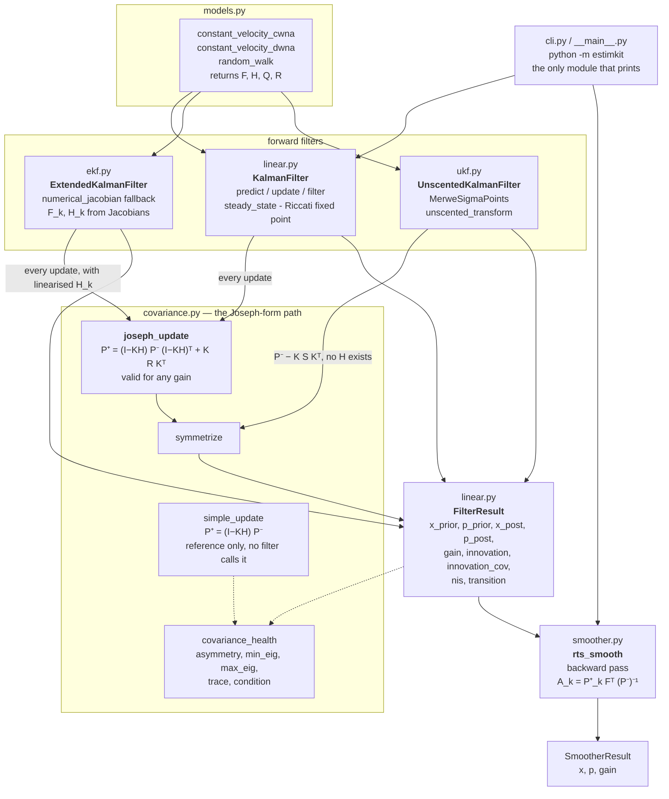
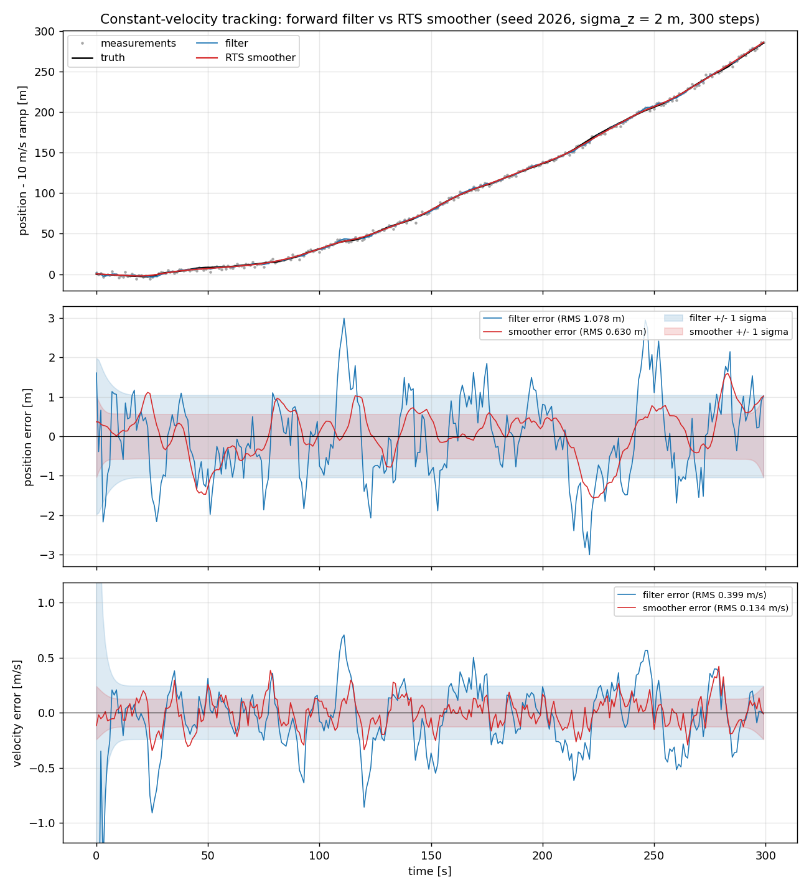
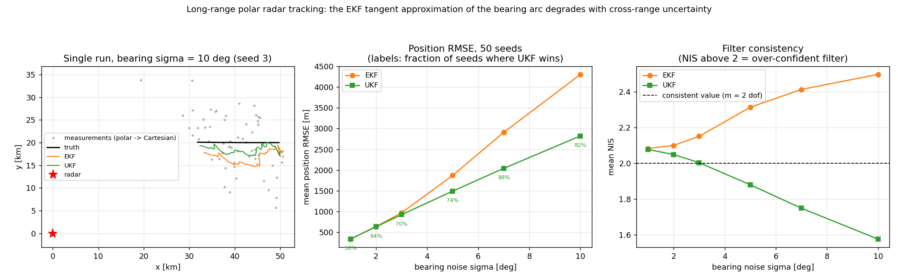

# EstimKit

A compact Kalman filter family — KF, EKF, UKF, RTS smoother — with Joseph-form covariance updates.


## The problem

Every GNC codebase ends up containing a Kalman filter, and the algebra is in every textbook, so
the filter gets written from the textbook and then trusted. What is not in most textbooks is the
part that actually breaks: a covariance that quietly loses symmetry, then positive definiteness,
and takes the estimate with it; an unscented filter whose sigma-point weight convention is never
written down, so two implementations disagree and nobody can say which is right; a steady-state
gain nobody has checked against the Riccati solution the filter is supposed to converge to. This
package is the small, auditable version where each of those is addressed explicitly, checked
numerically against a hand-solved reference, and written down.

## What this does

- **Linear KF, EKF and RTS smoother with Joseph-form covariance updates.** Over 200 000
  predict/update steps the covariance stayed bit-exactly symmetric — max `|P − Pᵀ| = 0.000e+00` —
  with a minimum eigenvalue of `2.659427e−02` throughout (`validation/covariance_health.py`).
- **Documents *why* Joseph form, with the counter-example measured.** With an over-relaxed gain
  `K = 1.5 K_opt`, the short form `(I − KH)P` produces a minimum eigenvalue of `−0.4952091` — no
  longer a covariance — while the Joseph form gives `+0.2456274` (same script, check 3).
- **Steady-state gain solver checked against the algebraic Riccati equation.** Agreement with the
  hand-solved scalar solution to `2.220e−16`, and with Kalata's published α–β closed form to
  `4.441e−16` (`validation/riccati_steady_state.py`).
- **UKF with a stated weight convention that reduces exactly to the KF on linear systems.** Worst
  relative deviation `4.259e−10` over a grid of six `(α, β, κ)` settings spanning five decades of
  `α` (`validation/ukf_vs_kf_linear.py`).
- **NumPy is the only runtime dependency.** Matplotlib is used by the examples, SciPy by one
  validation cross-check; neither is imported by the library.

## Who this is for

- Students and educators working through state estimation who want an implementation short enough
  to read end to end.
- GNC engineers who need a transparent reference to check a larger, faster filter against.
- Anyone deciding between the short-form and Joseph-form covariance update, or between the Joseph
  form and a square-root filter, who wants the numbers rather than the folklore.

## Who this is not for

- Anyone who needs a filter *to use* rather than a filter *to read* — see Alternatives below.
- Large-scale estimation: factor graphs, SLAM back-ends, batch bundle adjustment.
- Multi-target tracking: no data association, no gating, no track management, no IMM.
- Square-root or UD-factorised filtering, which this package explains but does not implement.
- Attitude and manifold states: no quaternion handling, no multiplicative EKF.
- Anything performance-critical. There is no GPU path, no JIT, no compiled extension.

## Alternatives, honestly

**For a plain Kalman filter in Python, the default answer is FilterPy, and for most readers it is
the right answer.** It covers far more of the field than this package does — KF, EKF, UKF,
ensemble KF, particle filter, IMM, g-h/α-β, H-infinity, least squares, and RTS and fixed-lag
smoothers — and it has the widely used *Kalman and Bayesian Filters in Python* book behind it. If
you want a filter to drop into a project, install FilterPy and stop reading here.

EstimKit's narrower case is this: it is a compact, dependency-light implementation of the filter
family in which the Joseph-form update is the documented centre of the design rather than an
option, and the repository states *why* the Joseph form is used, *when* it stops being sufficient
and square-root or UD factorisation is required instead, and *what covariance collapse looks like*
when it happens to you. That is a teaching and numerical-hygiene argument, not a features
argument. On features it loses to every row of the table below.

| Alternative | What it does better | When to use EstimKit instead |
|---|---|---|
| [FilterPy](https://github.com/rlabbe/filterpy) (PyPI `filterpy`) | The widest set of textbook filters in Python — KF, EKF, UKF, ensemble KF, particle filter, IMM, g-h, H-infinity, square-root forms, RTS and fixed-lag smoothers — with a companion book. The default choice. | You want the Joseph form as the documented default with the numerical argument and its measured counter-example attached, in a package short enough to read in an afternoon. |
| [pykalman](https://github.com/pykalman/pykalman) (PyPI `pykalman`) | EM parameter learning for linear-Gaussian models, plus filtering and smoothing with missing-data masking. | You supply `Q` and `R` yourself and need EKF/UKF and covariance diagnostics rather than parameter identification. |
| [simdkalman](https://github.com/oseiskar/simdkalman) (PyPI `simdkalman`) | Vectorised linear KF and smoother across thousands of independent series at once; far faster than a Python loop. | You are filtering one series and want the per-step gain, innovation, NIS and covariance history exposed for inspection. |
| [GTSAM](https://github.com/borglab/gtsam) (PyPI `gtsam`) | Factor graphs and smoothing-and-mapping at scale: SLAM back-ends, iSAM2 incremental solvers, nonlinear least squares over large graphs. C++ with Python bindings. | Your problem is a single recursive filter, not a graph, and you want no compiled dependency. |
| [Stone Soup](https://github.com/dstl/Stone-Soup) (PyPI `stonesoup`) | A full target-tracking framework: detectors, data association, track initiation and deletion, multi-target metrics, simulation components. | You want the estimator alone, without the framework's component model and configuration layer. |
| [statsmodels](https://www.statsmodels.org/stable/statespace.html) (`statsmodels.tsa.statespace`) | Maximum-likelihood estimation of state space time-series models — ARIMA, unobserved components, VARMAX, dynamic factors — with diagnostics and forecasting. | Your model is a physical dynamics model with known `F`, `H`, `Q`, `R`, not a time-series model to be fitted. |
| [NavBench](https://github.com/OmAcharya-avtr/navbench) — the sibling product | The comparison bench: it scores KF/EKF/UKF/MEKF against each other on **NEES and NIS consistency** with chi-squared bounds, over Monte Carlo ensembles, with aerospace sensor models. | You want the filter library itself. NavBench measures filters; EstimKit is one of the things you would measure. NEES over an ensemble is deliberately out of scope here. |

## Install and first run

```bash
git clone https://github.com/OmAcharya-avtr/estimkit.git
cd estimkit
python -m venv .venv && source .venv/bin/activate
pip install -e ".[dev]"
python -m pytest tests/ -q
python examples/tracking_filter_vs_smoother.py
```

Note the extra is `[dev]`, not `[test]`. `pyproject.toml` declares a single optional-dependency
group — `pytest`, `hypothesis`, `ruff`, `matplotlib`, `scipy` — because the examples need
Matplotlib and one validation script needs SciPy, and splitting that into two groups would only
mean a reader who installed `[test]` could not run the examples. `pip install -e .` alone gives
you the library, which needs NumPy and nothing else.

Expected output of `python -m pytest tests/ -q`:

```
........................................................................ [ 61%]
.............................................                            [100%]
117 passed in 3.24s
```

The wall-clock time varies; the count does not. Expected output of the first example (the last
line is an absolute path on your machine):

```
seed                        : 2026
RMS position filter   [m]   : 1.078105
RMS position smoother [m]   : 0.629825   (41.58 % reduction)
RMS velocity filter   [m/s] : 0.399002
RMS velocity smoother [m/s] : 0.133870   (66.45 % reduction)
mean NIS (m = 1 dof)        : 1.0260
figure                      : .../estimkit/screenshots/tracking_filter_vs_smoother.png
```

It rewrites `screenshots/tracking_filter_vs_smoother.png` and takes well under a second. The
second example, `python examples/ukf_vs_ekf_nonlinear.py`, runs 50 seeds at six bearing-noise
levels and takes about 25 s.

## A worked example

```python
import numpy as np
from estimkit import (KalmanFilter, constant_velocity_cwna, covariance_health,
                      random_walk, rts_smooth, steady_state)

F, Q = constant_velocity_cwna(dt=1.0, q_psd=0.01)   # state [pos m, vel m/s]
H = np.array([[1.0, 0.0]])                          # position-only sensor
R = np.array([[4.0]])                               # sigma_z = 2 m

rng = np.random.default_rng(2026)
chol, x = np.linalg.cholesky(Q), np.array([0.0, 10.0])
truth = np.empty((300, 2))
for k in range(300):
    x = F @ x + chol @ rng.standard_normal(2)
    truth[k] = x
z = truth[:, 0:1] + 2.0 * rng.standard_normal((300, 1))

kf = KalmanFilter(F, H, Q, R)
res = kf.filter(np.zeros(2), np.diag([100.0, 100.0]), z)   # Joseph-form updates
sm = rts_smooth(res)                                       # backward RTS pass

rms = lambda e: np.sqrt(np.mean(e ** 2, axis=0))
print("RMS filter   [m, m/s] :", np.round(rms(res.x_post - truth), 6))
print("RMS smoother [m, m/s] :", np.round(rms(sm.x - truth), 6))
print("mean NIS (m = 1 dof)  :", round(float(np.mean(res.nis)), 4))

health = covariance_health(res.p_post[-1])
print("final P asymmetry     :", health["asymmetry"])
print("final P min eigenvalue:", round(health["min_eig"], 9))

Fr, Hr, Qr, Rr = random_walk(q=1.0, r=1.0)
p_prior, p_post, k_inf, iters = steady_state(Fr, Hr, Qr, Rr, tol=1e-15)
print("steady-state K_inf    :", float(k_inf[0, 0]), f"(converged in {iters} iterations)")
```

Printed output:

```
RMS filter   [m, m/s] : [1.078105 0.399002]
RMS smoother [m, m/s] : [0.629825 0.13387 ]
mean NIS (m = 1 dof)  : 1.026
final P asymmetry     : 0.0
final P min eigenvalue: 0.030836561
steady-state K_inf    : 0.6180339887498949 (converged in 19 iterations)
```

That last gain is `1/φ`, the golden ratio reciprocal, which is the exact solution of the scalar
Riccati equation `p² − qp − qr = 0` for `q = r = 1`. It is derived by hand in
`validation/VALIDATION.md` §1a.

## Architecture



All three filters return the same `FilterResult`, which is why `rts_smooth` consumes any of them
unchanged; the UKF stores an effective transition matrix derived from the sigma-point
cross-covariance for exactly that reason. `simple_update` exists so the short form can be measured
against the Joseph form in `validation/covariance_health.py` — no filter calls it. The dashed
edges are diagnostics, not the data path.

## Screenshots

Both images are produced by the committed examples, so they cannot drift from the code.



Notice that the red smoother error track sits inside the blue filter error track almost
everywhere, and that its ±1σ envelope is correspondingly narrower — except at the far right edge,
where the two converge, because at the final step the smoother is the filter by construction.



Notice the right-hand panel: the EKF's mean NIS climbs away from the `m = 2` consistency line as
the bearing noise grows, meaning it is not merely less accurate but over-confident about being
wrong, which is the failure mode a plain RMSE plot would hide.

## Validation evidence

Level 1 (educational): hand-solved algebra, one published closed form, one independent solver, and
internal-consistency checks. No flight, radar or IMU data. Every number below was produced by the
committed scripts, whose raw stdout is committed beside them. Full derivations in
[`validation/VALIDATION.md`](validation/VALIDATION.md).

| Check | Reference | Result | Tolerance |
|---|---|---|---|
| Steady-state `P⁻_∞`, scalar random walk `q=r=1` | Hand-solved ARE `p² − qp − qr = 0` → `(1+√5)/2 = 1.618033988749895` | `1.618033988749895`, \|diff\| **2.220e−16** | 1e−12 |
| Steady-state `K_∞`, same case | `1/φ = 0.618033988749895` | `0.618033988749895`, \|diff\| **0.000e+00** | 1e−12 |
| Steady-state, `q=0.25, r=4.0` and `q=2.0, r=0.5` | Hand-solved ARE, both cases | worst \|diff\| **1.776e−15** | 1e−12 |
| Steady-state gain, 2-state constant velocity, 3 parameter sets | Kalata α–β closed form, IEEE Trans. AES-20(2), 1984 | worst \|diff\| **4.441e−16** | 1e−12 |
| Steady-state `P⁻`, same 3 sets | `scipy.linalg.solve_discrete_are` (independent solver) | worst \|diff\| **1.377e−12** | 1e−10 |
| RTS smoother beats forward filter, RMS position, seed 2026, 300 steps | Same data, same filter output | **1.078105 m → 0.629825 m** (41.58 % lower) | smoother must be lower |
| RTS smoother beats forward filter, RMS velocity, same data | Same data | **0.399002 m/s → 0.133870 m/s** (66.45 % lower) | smoother must be lower |
| Smoother wins over an ensemble | 300 seeds, 0…299 | **300/300** position, **300/300** velocity; means 1.053928 → 0.567928 m and 0.420932 → 0.129166 m/s | ensemble means must be lower |
| Covariance ordering `P⁺_k − P_{k\|T} ⪰ 0` at every step | Linear-Gaussian smoothing theory | worst min eigenvalue **0.000e+00** | −1e−12 |
| Forward filter is not mistuned | NIS expectation = `m` = 1 | mean NIS **1.0260** | consistency check on the comparison above |
| UKF reduces to KF on a linear system, 6 `(α, β, κ)` settings, `α = 1 … 1e−3` | The same KF run on the same measurements | worst relative deviation **4.259e−10** (worst absolute 5.118e−07 on a 3120 m state) | 1e−9 relative |
| Joseph-form covariance stays symmetric | 200 000 predict/update steps, 4-state filter | max \|P − Pᵀ\| **0.000e+00** (bit-exact) | ≤ round-off |
| Joseph-form covariance stays positive definite | Same run | min eigenvalue **2.659427e−02**, max condition number 51.0215 | > 0 |
| Property test: symmetry and PSD under Joseph updates | Hypothesis, 120 examples, random `P ≻ 0`, `R ≻ 0`, arbitrary `H` and deliberately **non-optimal** `K`, `n = 1…4`, `m = 1…3` | pass; bit-exact symmetry, min eigenvalue above `−1e−9·max\|P⁺\|` | as stated |
| Property test: `R = 0` collapses the state onto the measurement | Hypothesis, 120 examples, invertible `H` | pass, `H x⁺ = z` to `1e−6·scale` | 1e−6 relative |
| Property test: unscented transform exact for affine maps | Hypothesis, 120 examples, random `A`, `b`, any admissible `(α, β, κ)` | pass | `1e−10/α²` relative |

### The checks where a baseline lost, and the ones that came closest to failing

These are the informative rows.

| Comparison | Joseph form | Short form `(I − KH)P` | Reading |
|---|---|---|---|
| Ill-conditioned `H = [[1,1],[1,1.001]]`, `R = 1e−8·I`, **float32**, 500 updates | min eigenvalue **+1.992004e−09**, asymmetry 9.313e−10 | min eigenvalue **−2.778614e−01**, asymmetry 2.634e−02 | The short form loses positive definiteness catastrophically. The Joseph form does not. |
| Sub-optimal gain `K = 1.5 K_opt`, double precision | min eigenvalue **+2.456274e−01** | min eigenvalue **−4.952091e−01** | `KH > I` along the measured direction, so `(I − KH)P` is not a covariance at all. Fixed-gain, scheduled, quantised and detuned filters all produce non-optimal gains routinely. |

Closest approaches to tolerance, stated so they are not discovered later: the third DARE
cross-check (`T = 2.0 s`, `σ_a = 0.02`, `σ_v = 10 m`) converges slowest at 281 iterations and
carries the largest residual, `1.377e−12` against a 1e−10 tolerance; and the UKF↔KF reduction at
`α = 1e−3` reaches `4.259e−10` against a 1e−9 tolerance. The second is not noise, it is structural:
the scaled transform places sigma points at `α√(n+κ)` standard deviations and divides the spread
by `2α²(n+κ)`, so round-off is amplified by roughly `1/α²`. The measured deviations track the
predicted `eps/α²` to within about a factor of 2 across five decades of `α`. The algebra of the
reduction is exact; the arithmetic is not, and small `α` genuinely costs significant digits. An
absolute tolerance would have failed the `α = 1e−2` and `α = 1e−3` rows purely because the state
is about 3 km in magnitude.

**No check failed.** Test suite: **117 tests**, all passing — `test_ukf.py` 27, `test_linear.py`
23, `test_covariance.py` 15, `test_ekf.py` 14, `test_models.py` 14, `test_smoother.py` 12,
`test_properties.py` 6 (Hypothesis, 120 examples each), `test_cli.py` 6.

### What was not validated

- No comparison against measured flight, radar or IMU data. Every scenario here is synthetic and
  generated by the committed scripts.
- No comparison against an independent third-party filter implementation, beyond the SciPy DARE
  solver in the cross-check above.
- The EKF and UKF have **no** analytic reference solution here. Their correctness is established
  indirectly, by exact reduction to the linear KF on linear-Gaussian problems. The UKF's advantage
  on the nonlinear radar problem is demonstrated empirically in the example, not proved.
- Square-root and UD-factorised filtering are discussed but not implemented, so the claim that
  they are needed beyond the Joseph form's range is a cited statement (Bierman 1977; Maybeck 1979),
  not a measured result of this package.
- Consistency testing is limited to the mean NIS. NEES over a Monte Carlo ensemble with
  chi-squared bounds is not implemented here; that is NavBench's job.

## API reference

Units are the caller's, used consistently: `P` carries squared state units, `R` squared
measurement units, `K` state per measurement unit. `NIS` is dimensionless.

<details>
<summary>Filters and smoother</summary>

| Callable | Description |
|---|---|
| `KalmanFilter(transition, measurement, process_noise, measurement_noise, control=None)` | Linear KF from `F` (n×n), `H` (m×n), `Q` (n×n), `R` (m×m), optional `B`. |
| `KalmanFilter.predict(x, p, u=None, transition=None, process_noise=None)` | One time update. Returns `(x⁻, P⁻)`. Per-step `F`/`Q` override for time-varying models. |
| `KalmanFilter.update(x, p, z, measurement=None, measurement_noise=None)` | One measurement update, Joseph form. Returns `UpdateResult`. |
| `KalmanFilter.filter(x0, p0, measurements, controls=None)` | Batch forward pass over `measurements` (T×m). Returns `FilterResult`. |
| `steady_state(transition, measurement, process_noise, measurement_noise, max_iter=100000, tol=1e-14)` | Fixed-point iteration of the filtering ARE. Returns `(P⁻_∞, P⁺_∞, K_∞, iterations)`. Raises `RuntimeError` if it does not converge. |
| `ExtendedKalmanFilter(f, h, process_noise, measurement_noise, f_jac=None, h_jac=None)` | EKF over user-supplied `f`, `h`; analytic Jacobians strongly preferred over the numerical fallback. |
| `ExtendedKalmanFilter.predict / .update / .filter` | Same signatures and return types as the KF, minus the control input. |
| `numerical_jacobian(func, x, epsilon=None)` | Central-difference Jacobian, step `cbrt(eps)·max(\|x_j\|,1)`, `2n` evaluations. Best achievable ≈ `eps^(2/3)` ≈ 4e−11 relative. Use it to *check* analytic Jacobians. |
| `UnscentedKalmanFilter(f, h, process_noise, measurement_noise, alpha=1e-3, beta=2.0, kappa=0.0)` | Additive-noise UKF, scaled symmetric sigma points. |
| `UnscentedKalmanFilter.predict(x, p)` | Returns `(x⁻, P⁻, effective transition)`; the third item is what lets `rts_smooth` consume UKF output. |
| `UnscentedKalmanFilter.update / .filter` | As the KF. Covariance update is `P⁻ − K S Kᵀ`, re-symmetrised — not Joseph form; see Limitations. |
| `MerweSigmaPoints(n, alpha=1e-3, beta=2.0, kappa=0.0)` / `.generate(mean, cov)` | `2n+1` scaled sigma points and their weights. Requires `n + κ > 0` (enforced). |
| `unscented_transform(points, wm, wc, noise_cov=None)` | Weighted mean and covariance of transformed points, plus optional additive noise. |
| `rts_smooth(result=None, *, x_prior, p_prior, x_post, p_post, transition)` | Rauch-Tung-Striebel fixed-interval smoother. Takes a `FilterResult` from any of the three filters, or the arrays directly. Returns `SmootherResult`. |

</details>

<details>
<summary>Covariance, models and result containers</summary>

| Callable | Description |
|---|---|
| `joseph_update(p_prior, gain, h, r)` | `P⁺ = (I−KH)P⁻(I−KH)ᵀ + KRKᵀ`. Valid for **any** gain. This is what the KF and EKF call. |
| `simple_update(p_prior, gain, h)` | `P⁺ = (I−KH)P⁻`. Provided for comparison only; no filter in this package uses it. |
| `symmetrize(p)` | Writes the same floating-point sum into both triangles, which is why the measured asymmetry is bit-exactly zero rather than merely small. |
| `is_symmetric(p, atol=1e-12, rtol=1e-9)` / `is_positive_semidefinite(p, tol=-1e-12)` / `min_eigenvalue(p)` | Predicates and the minimum eigenvalue, for assertions in your own code. |
| `covariance_health(p)` | `dict` of `asymmetry`, `min_eig`, `max_eig`, `trace`, `condition` — the five numbers to watch for collapse. |
| `constant_velocity_cwna(dt, q_psd)` | Continuous white-noise acceleration: `F = [[1,T],[0,1]]`, `Q = q̃[[T³/3, T²/2],[T²/2, T]]`. `q_psd` in m²/s³. Returns `(F, Q)`. |
| `constant_velocity_dwna(dt, sigma_a)` | Discrete white-noise acceleration: `Q = σ_a²ΓΓᵀ`, `Γ = [T²/2, T]ᵀ`. Rank 1, hence positive *semi*-definite — a useful stress case. `sigma_a` in m/s². Returns `(F, Q)`. |
| `random_walk(q, r)` | The scalar model whose Riccati equation is hand-solved in `validation/VALIDATION.md`. Returns `(F, H, Q, R)`. |
| `FilterResult` | `x_prior`, `p_prior`, `x_post`, `p_post`, `gain`, `innovation`, `innovation_cov`, `nis`, `transition` — full per-step history. |
| `UpdateResult` | `x`, `p`, `gain`, `innovation`, `innovation_cov`, `nis` for a single update. |
| `SmootherResult` | `x` (T×n), `p` (T×n×n), `gain` (the smoother gains `A_k`). |

</details>

<details>
<summary>Command line</summary>

```bash
python -m estimkit steady-state --model random-walk --q 1 --r 1
python -m estimkit steady-state --model constant-velocity --dt 1 --q 0.01 --r 4
python -m estimkit track --steps 200 --dt 1 --q 0.01 --r 4 --seed 2026
python -m estimkit --json track --steps 200        # machine-readable
```

`python -m estimkit steady-state --model random-walk --q 1 --r 1` prints:

```
model      : random-walk
iterations : 18
P_prior    : [[1.618034]]
P_post     : [[0.618034]]
K          : [[0.618034]]
```

The iteration count is 18 here and 19 in the worked example above because the CLI uses the default
`tol = 1e-14` and the validation scripts use `tol = 1e-15`. Invalid input exits with code 2 and an
actionable message, e.g. `r must be a positive finite number, got -1.0`.

</details>

## Limitations

- **No square-root or UD-factorised filter.** The Joseph form still forms `P` explicitly, and the
  condition number of `P` is the *square* of that of any of its factors. When the eigenvalue spread
  of `P` approaches `1/eps` — near-exact measurements with nearly unobservable states, single- or
  fixed-point embedded arithmetic where `eps ≈ 1.2e−07`, large GNSS/INS states with tight `R`, long
  runs with very small `Q` — no update written in terms of `P` is safe, and you need Potter or
  Carlson square-root, or Bierman's UD. This package explains that regime and does not implement
  it. Go to Bierman, *Factorization Methods for Discrete Sequential Estimation* (1977) or Maybeck,
  *Stochastic Models, Estimation, and Control*, Vol. 1 (1979), Ch. 7.
- **The UKF's covariance update is not Joseph form.** It is `P⁻ − K S Kᵀ`, because no `H` exists to
  write a Joseph form with. It is re-symmetrised each step but carries a weaker structural
  guarantee than the linear filter's update.
- **Small `α` costs precision**, as `eps/α²`. `α = 1e−3` leaves roughly 6 significant digits. This
  is measured, not estimated — see the validation table.
- **Additive noise only.** The augmented-state UKF for multiplicative or state-dependent noise is
  not implemented. `Q` and `R` are added directly to the transformed covariances.
- **The numerical Jacobian is a convenience, not a substitute.** It is simply *wrong* — not merely
  inaccurate — near a kink from angle wrapping, `abs`, `min`/`max`, saturation or table
  interpolation, and it degrades when state components have wildly different scales. It never
  raises; it shows up as an inconsistent NIS or slow divergence.
- **No smoothing-consistency guarantee for nonlinear filters.** `P_{k|T} ⪯ P⁺_k` is proved and
  measured only in the linear-Gaussian case; the extended/unscented RTS smoother reuses the linear
  recursion with a linearised or effective transition.
- **No adaptive tuning, no multiple-model estimation, no data association, no track management.**
  `Q` and `R` are whatever you supply, fixed.
- **No quaternion or manifold states.** States are elements of Rⁿ. Attitude estimation needs a
  multiplicative EKF with a reset step — that is NavBench's MEKF, not this.
- **NIS only, no NEES.** Per-step normalised innovation squared is the whole consistency toolkit
  here. For NEES with chi-squared bounds over Monte Carlo ensembles, use NavBench.
- **Where to go instead.** Large-scale factor graphs and SLAM back-ends: GTSAM. Multi-target
  tracking frameworks with data association and track metrics: Stone Soup. Throughput across
  thousands of independent linear series: simdkalman. GPU: this package has no GPU path and none
  is planned; NumPy on CPU is the whole implementation.
- **Memory.** Dominated by the stored covariance history, `T·n²` doubles — about 2.4 MB for 10 000
  steps of a 6-state filter.
- **Educational validation level.** See "What was not validated" above.

## Reproducing every number

From the repository root, with the `[dev]` extra installed:

```bash
# 117 tests, including the Hypothesis property tests
python -m pytest tests/ -q

# Validation, ~75 s total for the four scripts; each exits non-zero on failure
PYTHONPATH=src python validation/riccati_steady_state.py   # ARE, Kalata, SciPy DARE
PYTHONPATH=src python validation/smoother_rms.py           # smoother vs filter, 300 seeds
PYTHONPATH=src python validation/ukf_vs_kf_linear.py       # UKF -> KF reduction grid
PYTHONPATH=src python validation/covariance_health.py      # 200 000 steps, Joseph vs short

# The two figures in this README
PYTHONPATH=src python examples/tracking_filter_vs_smoother.py
PYTHONPATH=src python examples/ukf_vs_ekf_nonlinear.py
```

Raw stdout from the runs quoted above is committed as
`validation/riccati_steady_state_output.txt`, `validation/smoother_rms_output.txt`,
`validation/ukf_vs_kf_linear_output.txt` and `validation/covariance_health_output.txt`.

## Safety statement

This software is educational and research-grade. It is not flight-qualified, not certified, and
not approved for operational aerospace use.

## Licence

MIT — see [`LICENSE`](LICENSE). Copyright © 2026 OPTIMA Organisation.

## Citation

```
OPTIMA Organisation (2026). EstimKit: compact Kalman filter family
(KF/EKF/UKF/RTS) for aerospace estimation (v0.1.0) [Computer software].
Educational validation level 1.
```

## Credits

This is under reserved rights obtained by OPTIMA Organisation.
