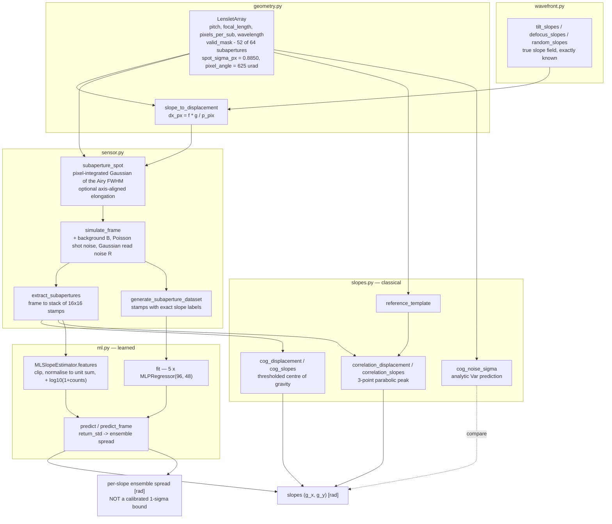
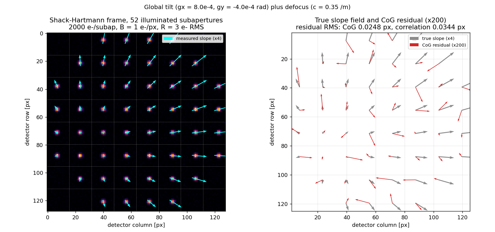
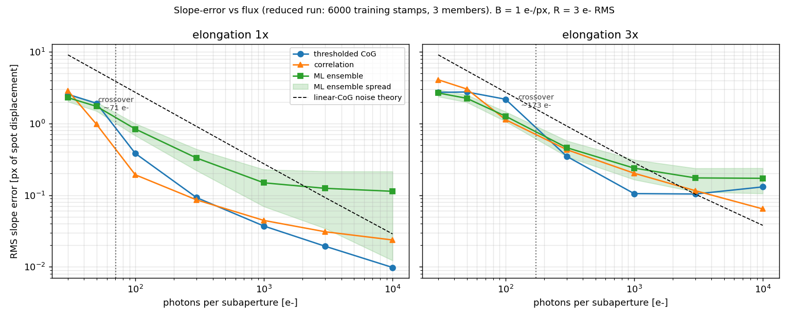
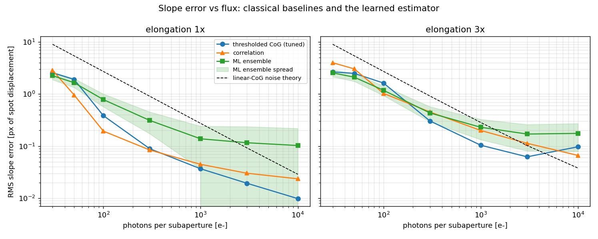

# ShackSim

Shack-Hartmann wavefront sensor simulator with classical and learned slope extraction.


## The problem

You are sizing the error budget of a Shack-Hartmann sensor for a free-space optical
terminal or an adaptive-optics bench, and the three terms that dominate it are the
three you cannot read off a datasheet: how fast the centroid degrades when the beacon
is faint, how much wavefront amplitude an unsubtracted background silently removes,
and how badly an elongated spot biases a thresholded first moment. The textbook
noise-propagation expression answers the first question, but nobody tells you where it
stops being true. ShackSim gives you a lenslet array whose true slope field is known
exactly, so every one of those questions has a measurable answer before hardware exists.

## What this does

- **Models the array, not one spot.** 8 × 8 lenslets, 500 µm pitch, f = 50 mm,
  16 px per subaperture, circular pupil with optional central obscuration —
  **52 of 64** subapertures illuminated at the defaults, pixel angle 625.0 µrad,
  diffraction spot 2.084 px FWHM, field of view ±5.00 mrad.
- **Forms each spot with diffraction and a documented noise chain** — pixel-integrated
  Gaussian core of the Airy FWHM, optional axis-aligned elongation, then background,
  Poisson shot noise and Gaussian read noise, in that order.
- **Extracts slopes two classical ways and measures both against analysis.** On a
  known global tilt the noise-free centre of gravity is exact to
  **8.702 × 10⁻⁹ rad (1.392 × 10⁻⁵ px)**; the correlation estimator to **0.0281 px**,
  limited by a **0.0302 px** sub-pixel S-curve that the centre of gravity does not have.
- **Reproduces the standard CoG noise expression to 1 % — and locates where it breaks.**
  Ratio measured/predicted is **0.990 to 1.066** for N ≥ 300 e⁻, and **35.2×** wrong
  at N = 100 e⁻.
- **Quantifies the background gain error.** 1000 e⁻ of signal against 2 e⁻/px of
  unsubtracted background reports **66.1 %** of the true slope — a 33.9 % wavefront
  gain error, not noise, and invisible to a zero-slope calibration.
- **Ships a learned slope estimator with a per-slope confidence output, benchmarked
  honestly.** See the next section; the summary is that it wins in one narrow regime
  and loses in the rest.

## The measured ML-versus-classical result

This is the headline finding and it is mostly negative. All figures are RMS slope
error in pixels of spot displacement on held-out synthetic stamps, from
[`validation/VALIDATION.md`](validation/VALIDATION.md) §5 and the raw transcript
[`validation/validation_output.txt`](validation/validation_output.txt) §5.

**The learned ensemble beats the tuned thresholded centre of gravity only below
roughly 100 detected photoelectrons per subaperture.** The crossover falls between
50 and 100 e⁻ for round spots and between 100 and 300 e⁻ for 3× elongated spots.
Its **best measured advantage is 1.38×** (elongated spots, 100 e⁻: 1.1840 px versus
1.6310 px). Above the crossover the analytic estimator wins and the gap widens
without limit: **10.5× at 10 000 e⁻** for round spots (0.1027 px versus 0.0098 px).
**Against the correlation baseline on round spots the learned model loses at 6 of the
7 flux levels tested**, winning only at 30 e⁻; on 3× elongated spots it wins at 3 of 7
(30, 50 and 300 e⁻), where the round correlation template is mismatched.

Round diffraction-limited spot, 2000 held-out stamps per point, B = 1.0 e⁻/px,
R = 3.0 e⁻ RMS; CoG threshold tuned per flux level on a disjoint tuning set:

| N [e⁻] | threshold [e⁻] | thresholded CoG [px] | correlation [px] | ML ensemble [px] | ML / CoG |
|---|---|---|---|---|---|
| 30 | 4 | 2.5705 | 2.8780 | **2.2600** | 0.879 |
| 50 | 7 | 1.9161 | **0.9630** | 1.6591 | 0.866 |
| 100 | 10 | 0.3852 | **0.1944** | 0.7842 | 2.036 |
| 300 | 13 | 0.0891 | **0.0842** | 0.3118 | 3.501 |
| 1000 | 13 | **0.0367** | 0.0446 | 0.1382 | 3.766 |
| 3000 | 10 | **0.0193** | 0.0301 | 0.1160 | 6.010 |
| 10000 | 13 | **0.0098** | 0.0235 | 0.1027 | 10.494 |

Spot elongated 3× along x, same conditions:

| N [e⁻] | threshold [e⁻] | thresholded CoG [px] | correlation [px] | ML ensemble [px] | ML / CoG |
|---|---|---|---|---|---|
| 30 | 4 | 2.6674 | 4.0164 | **2.5594** | 0.960 |
| 50 | 4 | 2.5064 | 3.0531 | **2.1165** | 0.844 |
| 100 | 7 | 1.6310 | 1.0323 | **1.1840** | 0.726 |
| 300 | 10 | **0.3053** | 0.4541 | 0.4344 | 1.423 |
| 1000 | 13 | **0.1040** | 0.1999 | 0.2304 | 2.215 |
| 3000 | 30 | **0.0622** | 0.1133 | 0.1706 | 2.742 |
| 10000 | 30 | 0.0970 | **0.0662** | 0.1756 | 1.810 |

The ML error floors at 0.10–0.18 px and stops improving with flux. The ensemble
spread is **not a calibrated 1-σ bound**: measured spread divided by actual RMS error
spans 0.17 to 1.12 on round spots and 0.15 to 0.55 on elongated spots, so at low flux
it understates the true error by up to 6.5×. It must not be consumed as a measurement
covariance by a reconstructor, a Kalman filter or a control loop.

If you have more than about 100 e⁻ per subaperture, use the classical estimators.
The learned model is published here because the measurement is worth having, not
because it is the recommended default.

## Who it is for

- Adaptive-optics, free-space-optical and payload engineers sizing a wavefront-sensor
  error budget against an exactly known truth.
- Researchers benchmarking slope estimators — classical or learned — on a common
  substrate with exact labels and a disjoint-seed test protocol.
- Anyone who needs the CoG noise-propagation expression and wants to see the flux at
  which it stops working.

## Who it is not for

- Anyone building flight, pointing or control software. See
  [Safety statement](#safety-statement).
- Anyone needing turbulence: slopes here are drawn independently and uniformly, with
  no Kolmogorov spatial correlation and no temporal evolution.
- Anyone needing wavefront reconstruction. This product outputs slopes and stops.
- Anyone needing diffraction fidelity beyond a Gaussian core of matched FWHM, real
  detector defects, or laser-guide-star radial elongation at an arbitrary angle.

## Related products in this portfolio

Four products divide the wavefront-sensing chain and deliberately do not overlap:

| Product | Repository | Scope | Boundary with ShackSim |
|---|---|---|---|
| **CentroidNet** (P008) | `centroidnet` | Subpixel centroiding of a **single** spot on one detector window: CoG and quad-cell baselines, ML centroider with uncertainty | The single-spot problem. Read it for centroid error versus SNR or quad-cell linear range. ShackSim is the whole array: lenslet geometry, pupil mask, per-subaperture noise across a full frame, and a slope-vector output. |
| **ShackSim** (P018) | `shacksim` | The sensor model itself: array geometry → spots → **slopes** | This repository. It produces the slopes; it does not turn them into phase. |
| **WaveLab** (P014) | `wavelab` | Slopes → phase: Hudgin/Fried zonal geometry matrices, modal Zernike least squares, regularization, learned slopes-to-Zernike reconstructor | Consumes what ShackSim produces. Reconstruction is absent here on purpose. |
| **ZernKit** (P016) | `zernkit` | The Zernike basis: Noll and OSA/ANSI indexing, orthonormal modes, analytic gradients, Noll residual variances | Supplies the modal basis that WaveLab fits. ShackSim does not implement Zernikes. |

Reading order for the full chain: ZernKit (basis) → ShackSim (sensor, this repo) →
WaveLab (reconstruction), with CentroidNet as the single-spot special case.

## Alternatives, honestly

Every package below was checked on PyPI or GitHub before being named here.

| Alternative | What it does better | When to use this instead |
|---|---|---|
| [**soapy**](https://github.com/AOtools/soapy) (PyPI `soapy`) — Monte-Carlo end-to-end AO simulation, modular WFS/DM/reconstructor, tomography, laser-guide-star propagation | Everything at system level: closed-loop AO, atmospheric phase screens, multiple guide stars, real reconstructors. Its Shack-Hartmann module lives inside a working loop, which this repository has no equivalent of. | When you want the sensor in isolation with exactly labelled single-subaperture stamps, a derived analytic noise model to compare against, and a per-estimator benchmark with disjoint train/tune/test seeds. Use soapy the moment you need a loop, turbulence or an LGS. |
| [**hcipy**](https://github.com/ehpor/hcipy) (PyPI `hcipy`, 0.7.0) — diffraction-propagation framework for high-contrast imaging; implements Shack-Hartmann **and** pyramid wavefront sensors | Physically correct Fraunhofer/Fresnel propagation, arbitrary pupils and apodizers, several sensor types, coronagraphy, polarization. Its spots are propagated, not approximated. | When a Gaussian core of the correct Airy FWHM is enough and what you need is the estimator comparison and the noise-model validation. If spot-shape fidelity is the thing under study, use hcipy — this simulator's Gaussian has no Airy rings and understates wing flux. |
| [**aotools**](https://github.com/AOtools/aotools) (PyPI `aotools`, 1.0.7) — AO utility library; `image_processing` provides `centre_of_gravity`, `brightest_pixel`, `correlation_centroid`, `cross_correlate`, `quadCell`, plus turbulence and Zernike utilities | A mature, cited, maintained centroider library. If you need a centroider in production analysis code, use aotools' rather than re-implementing one. | When you need the **generator** as well as the estimator — the frames, the exact slope labels, the tuned-threshold protocol and the measured noise-model validity boundary. ShackSim's estimators exist to be benchmarked, not to be a general-purpose centroider library. |
| [**poppy**](https://github.com/spacetelescope/poppy) (PyPI `poppy`) — physical optics propagation, Fraunhofer and Fresnel, used for space-telescope PSF modelling | Rigorous propagation through real instrument prescriptions, segmented apertures, observatory-grade PSF modelling. | Always, for this task: poppy does not ship a lenslet-array wavefront-sensor model, so it answers a different question. Use poppy to get a realistic PSF, this repository to ask what a slope estimator does to one. |
| [**prysm**](https://github.com/brandondube/prysm) (PyPI `prysm`) — fast physical optics, detector noise and pixel-aperture models, interferogram analysis, multiple polynomial bases | Speed, interferometric data reduction, detector modelling breadth, and polynomial machinery well beyond what is here. | For the same reason as poppy: prysm has no Shack-Hartmann sensor model. Use prysm for propagation and interferogram work; use this for the lenslet-array slope-estimation question. |

Short version: for a full AO system use soapy; for propagation fidelity use hcipy,
poppy or prysm; for a production centroider use aotools. Use ShackSim when the
question is specifically *how much slope error does this estimator make at this flux,
against a truth I know exactly*.

## Install and first run

```bash
git clone https://github.com/OmAcharya-avtr/shacksim.git
cd shacksim
python -m venv .venv && source .venv/bin/activate
pip install -e ".[test]"
python -m pytest tests/ -q
python examples/spot_field.py
```

Expected output of the test run:

```
........................................................................ [ 48%]
........................................................................ [ 97%]
....                                                                     [100%]
=============================== warnings summary ===============================
tests/test_ml.py::TestApi::test_predict_shape
  .../sklearn/neural_network/_multilayer_perceptron.py:785: ConvergenceWarning: Stochastic Optimizer: Maximum iterations (400) reached and the optimization hasn't converged yet.
...
148 passed, 6 warnings in 5.72s
```

The `ConvergenceWarning`s are expected: two tests deliberately train tiny networks
with a low iteration cap to keep the suite fast.

`examples/spot_field.py` prints nothing and takes about 3 s; it writes
`screenshots/spot_field.png`, which should match the first figure below.

## Worked example

```python
import numpy as np
from shacksim import (LensletArray, tilt_slopes, defocus_slopes, simulate_frame,
                      cog_slopes, correlation_slopes, cog_noise_sigma,
                      generate_subaperture_dataset, MLSlopeEstimator)

array = LensletArray()                      # 8x8, 500 um pitch, f = 50 mm, 16 px/subap
print(f"{array.n_valid} illuminated subapertures, pixel angle {array.pixel_angle*1e6:.1f} urad")
print(f"spot FWHM {array.spot_fwhm_px:.3f} px, max slope {array.max_slope*1e3:.2f} mrad")

truth = tilt_slopes(array, 8.0e-4, -4.0e-4) + defocus_slopes(array, 0.35)
frame = simulate_frame(array, truth, photons=2000.0, background=1.0,
                       read_noise=3.0, seed=2026)
print(f"frame {frame.shape}, peak {frame.max():.0f} e-")

cog = cog_slopes(frame, array, threshold=1.0 + 3 * 3.0)   # t = B + 3R
cor = correlation_slopes(frame, array)
to_px = lambda g: array.slope_to_displacement(g - truth)
print(f"CoG         residual RMS {np.sqrt(np.mean(to_px(cog)**2)):.4f} px")
print(f"correlation residual RMS {np.sqrt(np.mean(to_px(cor)**2)):.4f} px")
print(f"analytic CoG sigma       {cog_noise_sigma(array, 2000.0, 1.0, 3.0)/array.pixel_angle:.4f} px")

stamps, labels = generate_subaperture_dataset(array, 3000, photons=(30.0, 30000.0),
                                              background=1.0, read_noise=3.0,
                                              elongation=(1.0, 3.0), seed=100)
model = MLSlopeEstimator(array, n_estimators=3, random_state=0).fit(stamps, labels)
pred, std = model.predict_frame(frame, return_std=True)
print(f"ML          residual RMS {np.sqrt(np.mean(to_px(pred)**2)):.4f} px "
      f"(ensemble spread {np.mean(array.slope_to_displacement(std)):.4f} px)")
```

Printed output (about 8 s, dominated by the reduced 3-member fit):

```
52 illuminated subapertures, pixel angle 625.0 urad
spot FWHM 2.084 px, max slope 5.00 mrad
frame (128, 128), peak 393 e-
CoG         residual RMS 0.0248 px
correlation residual RMS 0.0344 px
analytic CoG sigma       0.1185 px
ML          residual RMS 0.1212 px (ensemble spread 0.0775 px)
```

Three things to read from that output. The thresholded CoG beats the analytic
`cog_noise_sigma` prediction by roughly 5× because that expression describes the
*un-thresholded* linear estimator; thresholding removes most of the read-noise term
(validation §3). The correlation estimator is worse than the CoG here, at 2000 e⁻,
because its S-curve bias floors it (validation §2). And the learned estimator, at
2000 e⁻ — well above its crossover — is about 5× worse than the CoG, exactly as the
benchmark tables predict.

## Architecture



## Screenshots

Both figures are written by the repository's own examples, so they cannot drift from
the code.



`examples/spot_field.py`. Left: the raw 128 × 128 detector frame for a global tilt
plus defocus at 2000 e⁻/subaperture, with the measured slope vectors overlaid at 4×.
Notice the empty corner blocks — those are the 12 of 64 subapertures outside the
circular pupil. Right: the residual against truth, drawn at 200× the true-slope scale,
which is the point of the panel: the residual arrows are only visible because they are
magnified fifty times more than the signal. Residual RMS 0.0248 px for the CoG,
0.0344 px for the correlation estimator.



`examples/slope_error_vs_flux.py`, a reduced run (6000 training stamps, 3 members) of
validation §5. Notice where the green ML curve crosses the blue CoG curve — near
71 e⁻ for round spots and 173 e⁻ for 3× elongated spots — and then notice that it
flattens above 1000 e⁻ while the classical curves keep falling. The shaded band is the
ensemble spread, and its width relative to the actual error is the calibration problem
described above. Because this is a reduced run it reproduces the qualitative picture,
not the exact figures; the characterized numbers are in `validation/`.



`validation/run_validation.py` §5, the full run behind the tables above. Notice the
dashed line — the analytic linear-CoG prediction — sitting above every practical
estimator at low flux, which is the same 35× discrepancy at 100 e⁻ reported in the
evidence table.

## Validation evidence

Level 2 (Research). Every number in this README comes from
[`validation/run_validation.py`](validation/run_validation.py); the verbatim console
transcript is [`validation/validation_output.txt`](validation/validation_output.txt)
and the derivations are in [`validation/VALIDATION.md`](validation/VALIDATION.md).
The failures are included because they are the credible part.

| # | Check | Reference | Result | Tolerance |
|---|---|---|---|---|
| 1 | Known global tilt → uniform slope field, noise-free CoG | analytic `Δx = f·g/p`; Hardy 1998 ch. 5 | **PASS** — worst case 8.702e-09 rad = 1.392e-05 px | 1e-8 rad |
| 1 | Same tilt sweep, correlation estimator | Poyneer 2003, *Appl. Opt.* **42**, 5807 | **PASS** — worst case 0.0281 px | 0.05 px |
| 1 | Slope-field uniformity, noisy frame, 52 subapertures | analytic (gradient is constant) | **PASS** — bias +0.0008 / +0.0022 px, subap-to-subap σ 0.0245 / 0.0187 px | reported |
| 2 | Zero wavefront → zero slopes | symmetry | **PASS** — CoG 0.000e+00 rad, correlation 6.149e-20 rad | 1e-12 rad |
| 2 | Sub-pixel S-curve of the parabolic peak interpolator | Poyneer 2003 | **Baseline defect, measured** — correlation max 0.0302 px, RMS 0.0185 px; CoG max 6.15e-08 px | reported, not tuned |
| 3 | CoG noise-propagation expression, N ≥ 300 e⁻ | derived in `cog_noise_sigma`; Hardy 1998, Thomas et al. 2006 *MNRAS* **371** 323, Winick 1986 *JOSA A* **3** 1809 | **PASS** — measured/predicted ratio 0.990 to 1.066 | 0.85–1.15 |
| 3 | Same expression, N = 100 e⁻ | same | **DOCUMENTED FAILURE** — measured/predicted 35.240 | reported, not tuned away |
| 4 | Background shrinkage `κ = S/(S + B·p²)` | analytic derivation, noise-free frames | **PASS** — worst deviation 1.39e-05 px | 1e-3 px |
| 4 | Magnitude of the gain error, S = 1000 e⁻, B = 2 e⁻/px | same | **Measured** — 66.1 % of true slope, i.e. 33.9 % wavefront gain error | reported |
| 5 | ML versus tuned thresholded CoG, crossover | this repository, §5 | **Measured** — 50–100 e⁻ (round), 100–300 e⁻ (3× elongated); best advantage 1.38×, worst deficit 10.494× | reported as found |
| 5 | ML versus correlation, round spots | this repository, §5 | **ML LOSES at 6 of 7 flux levels** (wins only at 30 e⁻) | reported as found |
| 5 | ML versus correlation, 3× elongated spots | this repository, §5 | ML wins at 3 of 7 (30, 50, 300 e⁻) | reported as found |
| 5 | Ensemble spread as a 1-σ error bound | this repository, §5 | **NOT CALIBRATED** — spread/error 0.17–1.12 (round), 0.15–0.55 (elongated) | fails as a bound |

No tolerance was loosened after seeing a result, and nothing was removed.

## API reference

<details>
<summary><code>shacksim.geometry</code> — array geometry and unit conversion</summary>

| Symbol | Description |
|---|---|
| `LensletArray(n_lenslets=8, pitch=500e-6, focal_length=50e-3, pixels_per_sub=16, wavelength=633e-9, pupil_diameter=None, obscuration=0.0, fill_threshold=0.5)` | Frozen dataclass; lengths in m, `obscuration` and `fill_threshold` dimensionless |
| `.diameter` → float | Illuminated pupil diameter [m] |
| `.pixel_size` → float | Detector pixel pitch [m] = `pitch / pixels_per_sub` |
| `.image_size` → int | Frame side [px] |
| `.pixel_angle` → float | Angle subtended by one pixel [rad] = `pixel_size / focal_length` |
| `.spot_fwhm` / `.spot_fwhm_px` / `.spot_sigma_px` | Diffraction spot size [m] / [px] / Gaussian-equivalent σ [px] |
| `.max_slope` → float | Largest measurable slope [rad] before the spot leaves the subaperture |
| `.slope_to_displacement(slope)` / `.displacement_to_slope(displacement)` | rad ↔ px, `Δx = f·g / p_pix` |
| `.subaperture_centres()` / `.valid_centres()` | Lenslet centres in the pupil [m] |
| `.valid_mask()` / `.n_valid` | Boolean pupil mask / count of illuminated subapertures |
| `.subaperture_slice(row, col)` | Row/column slices into the frame [px] |
| `.summary()` → dict | All derived quantities, in SI plus pixels |
| `AIRY_FWHM_COEFF` | 1.0287938, the Airy FWHM coefficient in `FWHM = c·λf/d` |

</details>

<details>
<summary><code>shacksim.wavefront</code> — true slope fields</summary>

| Symbol | Description |
|---|---|
| `tilt_slopes(array, gx, gy=0.0)` | Uniform slope field of `W = gx·X + gy·Y`; returns `(n_valid, 2)` [rad] |
| `defocus_slopes(array, curvature)` | Slope field of `W = c(X² + Y²)`; `curvature` [1/m], returns [rad] |
| `random_slopes(array, rms, seed=None)` | Spatially **uncorrelated** Gaussian slopes of per-axis RMS [rad] — not turbulence |
| `slope_rms(slopes)` | Per-axis RMS of a slope field [rad] |

</details>

<details>
<summary><code>shacksim.sensor</code> — spot formation, frames and datasets</summary>

| Symbol | Description |
|---|---|
| `subaperture_spot(array, dx_px, dy_px, photons=1000.0, sigma_x_px=None, sigma_y_px=None)` | Noise-free pixel-integrated spot on one subaperture [e⁻] |
| `simulate_frame(array, slopes, photons=1000.0, background=0.0, read_noise=0.0, elongation=1.0, elongation_axis="x", shot_noise=True, seed=None)` | Full detector frame [e⁻]; `photons` [e⁻/subaperture], `background` [e⁻/px], `read_noise` [e⁻ RMS] |
| `extract_subapertures(image, array)` | Frame → `(n_valid, p, p)` stamp stack [e⁻] |
| `generate_subaperture_dataset(array, n_samples, photons=1000.0, background=0.0, read_noise=0.0, elongation=1.0, elongation_axis="x", slope_fraction=0.6, shot_noise=True, seed=None)` | Independent stamps with exact slope labels; scalar or `(lo, hi)` ranges for `photons` and `elongation` |

</details>

<details>
<summary><code>shacksim.slopes</code> — classical estimators and the analytic noise model</summary>

| Symbol | Description |
|---|---|
| `cog_displacement(stamps, threshold=0.0, clip_negative=True)` | Thresholded centre-of-gravity displacement [px]; `threshold` in [e⁻] |
| `cog_slopes(image, array, threshold=0.0, clip_negative=True)` | Same, from a full frame, returned as slopes [rad] |
| `reference_template(array, elongation=1.0, elongation_axis="x")` | Noise-free centred unit-flux reference spot |
| `correlation_displacement(stamps, template, subtract_mean=True)` | Correlation peak with 3-point parabolic refinement [px] |
| `correlation_slopes(image, array, template=None, subtract_mean=True)` | Same, from a full frame [rad] |
| `cog_noise_sigma(array, photons, background=0.0, read_noise=0.0, elongation=1.0, elongation_axis="x", axis="x", displacement_px=0.0)` | Analytic CoG slope-error prediction [rad] for the **un-thresholded linear** estimator |

</details>

<details>
<summary><code>shacksim.ml</code> — learned estimator</summary>

| Symbol | Description |
|---|---|
| `MLSlopeEstimator(array, n_estimators=5, hidden_layer_sizes=(96, 48), random_state=0, ...)` | Ensemble of scikit-learn `MLPRegressor`s |
| `.features(stamps)` | Feature matrix: clipped, unit-sum-normalised pixels plus `log10(1 + total counts)` |
| `.fit(stamps, slopes)` | Train on stamps [e⁻] with slope labels [rad]; returns self |
| `.predict(stamps, return_std=False)` | Slopes [rad]; with `return_std=True` also the per-component ensemble spread [rad] |
| `.predict_frame(image, return_std=False)` | Same, applied to every illuminated subaperture of a full frame |
| `.fitted_` | True once `fit` has completed |

</details>

## Limitations

1. **Compute budget: 2 CPU cores, no GPU, no PyTorch.** The model is a
   scikit-learn MLP ensemble because no deep-learning framework is available in the
   build environment. A convolutional network is the natural architecture for
   translation estimation; this one has no weight sharing and no translation
   equivariance, and the 0.10–0.18 px high-flux error floor is plausibly an artefact
   of that substitution. It is **not** evidence about CNN slope estimation. In the
   recorded transcript, data generation took 0.3 s and training the 5-member ensemble
   28.3 s, with the whole validation run at 39.4 s; a more heavily loaded repeat of
   the identical seeded configuration took 108.9 s with bit-identical numbers
   (`MODEL_CARD.md` §11).
2. **The learned estimator wins only below about 100 e⁻ per subaperture**, by at most
   1.38×, and loses by up to 10.494× above; against the correlation baseline on round
   spots it loses at 6 of 7 flux levels. There is no broad regime where it is the
   right default.
3. **The confidence output is not calibrated.** Spread/error spans 0.15 to 1.12; at
   low flux it understates the true error by up to 6.5×, because all five members
   share the same shrinkage toward the mean of the slope prior and an ensemble cannot
   see its own common bias.
4. **The standard noise-propagation expression fails below about 300 e⁻** — 35.2×
   under-prediction measured at 100 e⁻. It linearizes a ratio estimator and holds the
   denominator fixed; in the photon-starved regime it is most often quoted for, it is
   invalid.
5. **All data is synthetic, from an idealized optical model.** No real detector, no
   laboratory measurement, no on-sky or flight data at any stage. Not modelled: Airy
   ring structure (the Gaussian core understates wing flux), lenslet aberrations and
   manufacturing variation, array-to-detector misalignment, chromatic and broadband
   effects, vignetting and partially illuminated subapertures, scattered light,
   inter-subaperture crosstalk (a spot pushed past the field is truncated rather than
   spilled into the neighbour), dead and hot pixels, PRNU/DSNU, dark current, charge
   diffusion, saturation, nonlinearity, ADC quantization, and EMCCD excess noise —
   which is the detector one would actually use at 30 e⁻. Every one of these can only
   make a real measurement worse, so the reported numbers are an **optimistic bound**.
6. **Flux range actually tested: 30 to 30 000 e⁻ per subaperture.** The estimator
   benchmark covers seven levels — 30, 50, 100, 300, 1000, 3000, 10 000 e⁻ — and the
   noise-model check covers 100 to 30 000 e⁻. Nothing outside that range is measured,
   and a pinned regression test
   (`tests/test_ml.py::test_classical_wins_far_outside_the_training_flux`) shows a
   greater than 10× deficit when a model trained on 30–300 e⁻ is used at 3000 e⁻.
7. **Spot-shape range actually tested: elongation 1.0× to 3.0×, axis-aligned along x
   only.** A rotated elliptical Gaussian is not separable in x and y and is not
   implemented, so the sodium-laser-guide-star geometry — radial elongation whose
   angle varies across the pupil — is outside both the simulator and the model.
8. **No turbulence.** Slopes are drawn independently and uniformly, so they have
   neither Kolmogorov spatial correlation nor a Gaussian marginal nor temporal
   evolution. Nothing here measures behaviour on turbulent wavefronts.
9. **No wavefront reconstruction.** Slopes in, slopes out. Slope-to-phase is
   `wavelab`'s job (see [Related products](#related-products-in-this-portfolio)).
10. **Narrow characterized envelope.** All numbers are for 8 × 8 lenslets, 500 µm
    pitch, f = 50 mm, 16 px/subaperture, λ = 633 nm, B = 1 e⁻/px, R = 3 e⁻ RMS, with
    the spot sampled at only 2.084 px FWHM. The code is configurable; the numbers are
    not transferable.
11. **The correlation baseline is given a perfectly matched template** generated by
    the same model that generated the data. Real template mismatch would make it
    worse, which means the ML-versus-correlation comparison is, if anything, generous
    to the correlation estimator.
12. **The learned model is gain-sensitive.** The `log10(1 + counts)` feature assumes
    inputs in photoelectrons on the training scale; feeding ADU silently moves the
    model to the wrong point on the flux axis. Every accuracy failure mode is silent —
    only input-validation errors raise.
13. **Single frame, no temporal processing.** No frame stacking, no loop, no slope
    prediction, no drift or jitter model. Reported floats may move in the last digits
    with a different BLAS or scikit-learn build; the qualitative conclusions are robust.

## Reproducing every number

From a clean clone with the package installed (`pip install -e ".[test]"`):

```bash
# 148 passing tests, ~6 s
python -m pytest tests/ -q

# Every validation number in this README, ~40 s on 2 cores.
# Writes validation/scurve_bias.png, background_bias.png, ml_vs_classical.png
# and prints the transcript saved as validation/validation_output.txt
python validation/run_validation.py | tee validation/validation_output.txt

# Screenshot 1: detector frame, measured slopes, residual field (~3 s)
python examples/spot_field.py

# Screenshot 2: reduced slope-error-vs-flux comparison (~55 s)
python examples/slope_error_vs_flux.py
```

Section map for `validation/validation_output.txt`: §1 known-tilt agreement and
pupil uniformity, §2 zero wavefront and the correlation S-curve, §3 the noise
expression and the practical-estimator sweep, §4 the background gain error, §5 the
ML-versus-classical benchmark and the ensemble-spread calibration.

Seeds are partitioned so no set is reused: noise-propagation Monte Carlo `7000 + N`,
CoG threshold tuning `300 + N + 11·elongation`, ML training `100`, held-out test
`9000 + N + 7·elongation`, `random_state=0` for the ensemble. Data is regenerated
from `numpy.random.default_rng`, so results are bit-identical on the same
numpy/scikit-learn/BLAS build.

Further reading in this repository: [`MODEL_CARD.md`](MODEL_CARD.md) for the learned
estimator's architecture, training protocol and failure cases;
[`DATASET_CARD.md`](DATASET_CARD.md) for the generative model and the full list of
unmodelled effects; [`CHANGELOG.md`](CHANGELOG.md).

## Safety statement

This software is **research-grade**. It is **not flight-qualified, not certified, and
not approved for operational aerospace use.** No DO-178C, ECSS-E-ST-40C or equivalent
process was followed; there is no independent verification and no qualification
testing. Do not place the learned estimator in any adaptive-optics, pointing,
tracking or guidance control loop: its accuracy failure modes are silent and its
confidence output is not calibrated, so a downstream consumer cannot detect or bound
its errors — and a wavefront-sensor gain error feeds directly back into loop gain.

## Licence

Apache-2.0. See [LICENSE](LICENSE). Copyright © 2026 OPTIMA Organisation.

## Citation

```bibtex
@software{shacksim_2026,
  title   = {ShackSim: Shack-Hartmann wavefront sensor simulation and slope
             extraction with classical and learned estimators},
  author  = {{OPTIMA Organisation}},
  year    = {2026},
  version = {0.1.0},
  license = {Apache-2.0},
  note    = {Research-grade; not flight-qualified. Product P018.}
}
```

## Credits

This is under reserved rights obtained by OPTIMA Organisation.
