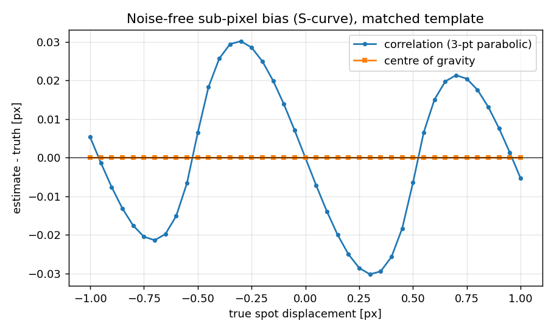
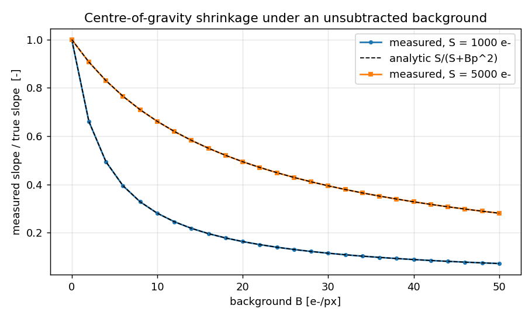

# shacksim — Validation Evidence (Level 2, Research)

Every number below was produced by running `validation/run_validation.py` in the
build session on 2026-08-07 (Python 3.11.15, numpy 2.4.4, scipy 1.17.1,
scikit-learn 1.8.0, matplotlib 3.10.9, 2 CPU cores). The verbatim console
transcript is saved to [`validation_output.txt`](validation_output.txt) and the
three figures referenced here are written by the same script.

Rerun from `products/P018/`:

```bash
PYTHONPATH=src python validation/run_validation.py
```

The run is deterministic apart from wall-clock timings: every dataset comes
from a fixed seed (`numpy.random.default_rng`) and the MLP ensemble uses
`random_state=0`. Seeds are partitioned so that no set is reused:

| Purpose | Seeds |
|---|---|
| Noise-propagation Monte Carlo | `7000 + N` |
| CoG threshold tuning | `300 + N + 11·elongation` |
| ML training | `100` |
| Held-out test | `9000 + N + 7·elongation` |

**Geometry under test** (the package defaults):

| Quantity | Value |
|---|---|
| Lenslet array | 8 × 8, pitch 500 µm, focal length 50 mm |
| Pupil | circular, 4.00 mm, inscribed → **52 of 64** subapertures illuminated |
| Detector | 16 × 16 px per subaperture, pixel 31.25 µm, frame 128 × 128 px |
| Wavelength | 633 nm (monochromatic) |
| Pixel angle `p/f` | 625.0 µrad |
| Diffraction spot | FWHM 65.12 µm = **2.084 px**, Gaussian-equivalent σ = 0.8850 px |
| Field of view | ±8 px → max measurable slope **5.0 mrad** |
| Noise (where used) | background B = 1.0 e⁻/px, read noise R = 3.0 e⁻ RMS |

Errors are quoted in **pixels of spot displacement** as well as radians;
1 px = 625 µrad of wavefront slope for this geometry.

---

## 1. Known global tilt → the analytically predicted uniform slope vector

### Derivation

Let the wavefront (optical path difference) over the pupil be a pure tilt

```
W(X, Y) = g_x X + g_y Y            [m], X, Y in [m]
```

Its gradient is **constant everywhere**: `∂W/∂X = g_x`, `∂W/∂Y = g_y`. A
wavefront with gradient `g_x` is, to first order, a plane wave travelling at
angle `θ_x = g_x` to the optical axis, and a lens of focal length `f` maps ray
angle to focal-plane position:

```
Δx = f · tan θ_x ≈ f · g_x         [m]          (paraxial)
Δx_px = f · g_x / p                [pixels]
```

Every lenslet sees the same gradient, so **every subaperture must report the
same slope and the same spot displacement** — the slope field is uniform, with
zero subaperture-to-subaperture variation. This is the strongest end-to-end
known answer available for a Shack-Hartmann model: it exercises the pupil
mask, the geometry, the spot formation and the slope extraction at once.

Hand check for `g_x = 1.000×10⁻³ rad`:

```
Δx_px = 1.000e-3 × 50.0e-3 m / 31.25e-6 m = 1.600000 px   (exact)
```

Source: Hardy, J. W. (1998), *Adaptive Optics for Astronomical Telescopes*,
Oxford University Press, ch. 5 (Shack-Hartmann measurement principle).

### Measured agreement — noise-free frames

| `g_x` [rad] | `g_y` [rad] | max ǀCoG − trueǀ [rad] | [px] | max ǀcorr − trueǀ [px] |
|---|---|---|---|---|
| 0.000e+00 | 0.000e+00 | 0.000e+00 | 0.00e+00 | 0.0000 |
| 1.000e-03 | 0.000e+00 | 2.261e-11 | 3.62e-08 | 0.0151 |
| 0.000e+00 | −1.500e-03 | 2.213e-11 | 3.54e-08 | 0.0272 |
| 2.000e-03 | 1.000e-03 | 5.998e-11 | 9.60e-08 | 0.0281 |
| −2.500e-03 | −2.500e-03 | 8.702e-09 | 1.39e-05 | 0.0040 |

- **Worst-case centre-of-gravity slope error: 8.702×10⁻⁹ rad = 1.392×10⁻⁵ px**
  (tolerance 1×10⁻⁸ rad) — **PASS**. The residual grows with tilt because the
  displaced Gaussian is truncated asymmetrically by the 16 px window; at zero
  tilt it is exactly zero by symmetry.
- **Worst-case correlation error: 0.0281 px** (tolerance 0.05 px) — **PASS**.
  This is *not* numerical noise: it is the sub-pixel bias of the 3-point
  parabolic peak interpolator, quantified in §2.

### Uniformity across the pupil — noisy frame

`g = (1.000×10⁻³, −5.000×10⁻⁴) rad`, N = 3000 e⁻/subaperture, B = 1.0 e⁻/px,
R = 3.0 e⁻ RMS, thresholded CoG with t = B + 3R = 10 e⁻, seed 42:

| Quantity | x | y |
|---|---|---|
| true slope [rad] | 1.000000e-03 | −5.000000e-04 |
| mean measured [rad] | 1.000508e-03 | −4.985945e-04 |
| bias [px] | +0.0008 | +0.0022 |
| subaperture-to-subaperture σ [px] | 0.0245 | 0.0187 |

The measured field is uniform to 0.025 px RMS across all 52 subapertures, and
the mean is unbiased at the 0.002 px level — consistent with pure measurement
noise on a genuinely constant gradient.

---

## 2. Zero wavefront → zero slopes, and the correlation S-curve

**Zero wavefront.** With `g = 0` on every subaperture and no noise, the spots
are exactly centred and both estimators must return exactly zero:

- `max|CoG| = 0.000e+00 rad`
- `max|correlation| = 6.149e-20 rad`

Tolerance 1×10⁻¹² rad — **PASS**. (The correlation value is float round-off in
the FFT-free direct correlation, not a bias.)

**Sub-pixel bias sweep.** A round diffraction-limited spot was stepped over
`d ∈ [−1, +1] px` in 41 steps, noise-free, with a perfectly matched template:

| Estimator | max ǀerrorǀ [px] | RMS error [px] | error at `d = 0` [px] |
|---|---|---|---|
| Correlation, 3-pt parabolic | **0.0302** | 0.0185 | 0.000e+00 |
| Centre of gravity | **6.15e-08** | — | 0 |

The correlation estimator carries a systematic, periodic sub-pixel error — the
classic "S-curve" of parabolic peak interpolation, which assumes the
correlation peak is a parabola when it is not. The CoG has no such bias. This
is a real, documented limitation of the correlation baseline and is why the
CoG remains the better estimator whenever the spot shape is known and round.



Reference for the interpolator: Poyneer, L. A. (2003), "Scene-based
Shack-Hartmann wavefront sensing: analysis and simulation", *Applied Optics*
**42**, 5807.

---

## 3. Slope error vs photon count against the standard noise-propagation expression

### The expression

Derived in full in the docstring of `shacksim.slopes.cog_noise_sigma`. With
pixel counts `n_i = N p_i + e_i`, `Var(e_i) = N p_i + B + R²`, linearizing the
ratio estimator gives the standard first-order result

```
Var(x̂) = M2/N  +  (B + R²)/N² · Σ_i (x_i − x̄)²           [px²]
Σ_i (x_i − x̄)² = p²(p² − 1)/12 + p² d²                    (p × p window, spot at d)
σ_g = sqrt(Var(x̂)) · p_pix / f                            [rad]
```

`M2` is the second central moment of the normalized spot profile; here it is
evaluated **numerically** from the actual pixel-integrated, window-truncated
profile, so pixel binning (Sheppard's correction, +1/12 px²) and edge
truncation are included exactly. In the pure-photon limit this reduces to the
familiar `σ_x = σ_spot/√N`, i.e. a noise-equivalent angle of
`≈ 0.44 (λ/d)/√N`.

**Sources, cited honestly and without page numbers I cannot verify:** the
photon-limited `σ_spot/√N` centroid result and the read-noise term that grows
with window area are standard and appear in Hardy, J. W. (1998), *Adaptive
Optics for Astronomical Telescopes*, Oxford University Press, ch. 5
(Shack-Hartmann sensor noise); the explicit CoG-variance decomposition into
photon, background and read-noise terms is given by Thomas, S., Fusco, T.,
Tokovinin, A., Nicolle, M., Michau, V. & Rousset, G. (2006), "Comparison of
centroid computation algorithms in a Shack-Hartmann sensor", *MNRAS* **371**,
323; the photon-limited bound also appears in Winick, K. A. (1986), "Cramér-Rao
lower bounds on the performance of charge-coupled-device optical position
estimators", *JOSA A* **3**, 1809. The algebra above was re-derived from
scratch in the docstring rather than copied, and the `p² d²` lever term is an
explicit extension made here because it is measurable (16 % of the error for
the default configuration) — see the docstring for the derivation.

### Measured agreement

Estimator measured: the **linear, un-thresholded, un-clipped CoG on
background-subtracted data**, which is the estimator the expression describes.
4000 stamps per point, slopes uniform over ±0.6 of the field.

| N [e⁻] | measured σ_x [px] | predicted [px] | ratio | measured σ_g [rad] | predicted [rad] |
|---|---|---|---|---|---|
| 100 | 95.8584 | 2.7202 | **35.240** | 5.991e-02 | 1.700e-03 |
| 300 | 0.9670 | 0.9069 | 1.066 | 6.044e-04 | 5.668e-04 |
| 1000 | 0.2772 | 0.2738 | 1.012 | 1.733e-04 | 1.712e-04 |
| 3000 | 0.0923 | 0.0921 | 1.002 | 5.768e-05 | 5.758e-05 |
| 10000 | 0.0292 | 0.0288 | 1.015 | 1.824e-05 | 1.797e-05 |
| 30000 | 0.0104 | 0.0105 | 0.990 | 6.528e-06 | 6.594e-06 |

- **Agreement for N ≥ 300 e⁻: ratio in [0.990, 1.066]** (tolerance 0.85–1.15)
  — **PASS**. The expression predicts the measured error to better than 7 %,
  and to better than 2 % for N ≥ 1000 e⁻.
- **At N = 100 e⁻ the measured error is 35.2× the prediction — reported as a
  failure of the expression, not tuned away.** The derivation linearizes a
  ratio and holds the denominator at `N`; at 100 e⁻ spread over 256 pixels with
  R = 3 e⁻ the denominator fluctuates by an appreciable fraction and can
  approach zero, so the linear model is simply invalid. This is the documented
  validity boundary of the standard expression, and it is exactly why practical
  sensors threshold.

### The practical estimators over the same sweep

RMS over both slope axes, 2000 stamps per point; the CoG threshold is tuned per
flux level on a *separate* tuning dataset (seeds 300+N), never on the test set.

| N [e⁻] | linear CoG [px] | thresholded CoG [px] | tuned threshold [e⁻] | correlation [px] |
|---|---|---|---|---|
| 30 | 122.08 | 2.5337 | 4 | 2.7915 |
| 50 | 180.50 | 1.9081 | 7 | 0.9227 |
| 100 | 2966.32 | 0.4342 | 10 | **0.1944** |
| 300 | 0.9740 | 0.0906 | 13 | **0.0864** |
| 1000 | 0.2729 | **0.0370** | 13 | 0.0448 |
| 3000 | 0.0954 | **0.0191** | 10 | 0.0299 |
| 10000 | 0.0287 | **0.0100** | 13 | 0.0233 |

Thresholding is worth one to two orders of magnitude at low flux because it
removes almost all of the `(B + R²)·window-area` term. The correlation
estimator is the best classical choice between roughly 100 and 300 e⁻, where
the CoG threshold cannot simultaneously reject noise and keep the spot; above
1000 e⁻ its S-curve bias (§2) floors it at ≈ 0.023 px while the CoG keeps
improving.

---

## 4. Centre-of-gravity bias under a background offset

### Derivation

Add a uniform background `B` to every pixel and do **not** subtract it. The
pixel coordinates are centred on the block, so `Σ_i x_i = 0` and the numerator
of the CoG is unchanged, while the denominator gains `B p²`:

```
x̂ = (S d + B Σ x_i) / (S + B p²) = d · κ,      κ = S / (S + B p²)
```

The bias is therefore a **pure multiplicative shrinkage of every slope toward
zero** — a *gain error on the whole reconstructed wavefront*, not extra random
error. It is proportional to the measured slope, so it cannot be detected by
looking at a zero-slope calibration.

Hand check: `S = 1000 e⁻`, `B = 2 e⁻/px`, `p² = 256` →
`κ = 1000/(1000 + 512) = 0.661376`, so a true 4 px displacement is reported as
2.645503 px.

### Measured agreement — noise-free frames, `d = 4 px`

| S [e⁻] | B [e⁻/px] | κ predicted | predicted x̂ [px] | measured x̂ [px] | ǀerrorǀ [px] |
|---|---|---|---|---|---|
| 1000 | 0.0 | 1.0000 | 4.0000 | 4.0000 | 1.39e-05 |
| 1000 | 0.5 | 0.8865 | 3.5461 | 3.5461 | 1.36e-05 |
| 1000 | 2.0 | 0.6614 | 2.6455 | 2.6455 | 1.20e-05 |
| 1000 | 10.0 | 0.2809 | 1.1236 | 1.1236 | 6.41e-06 |
| 1000 | 50.0 | 0.0725 | 0.2899 | 0.2899 | 1.84e-06 |
| 5000 | 0.5 | 0.9750 | 3.9002 | 3.9001 | 1.39e-05 |
| 5000 | 2.0 | 0.9071 | 3.6284 | 3.6284 | 1.37e-05 |
| 5000 | 10.0 | 0.6614 | 2.6455 | 2.6455 | 1.20e-05 |
| 5000 | 50.0 | 0.2809 | 1.1236 | 1.1236 | 6.41e-06 |

- **Worst deviation from the analytic shrinkage: 1.39×10⁻⁵ px**
  (tolerance 1×10⁻³ px) — **PASS**. The residual is window truncation, the same
  effect as in §1.

### Quantified magnitude

| Signal | Background | measured / true slope | wavefront gain error |
|---|---|---|---|
| 1000 e⁻ | 0.5 e⁻/px | 88.7 % | **11.3 %** |
| 1000 e⁻ | 2.0 e⁻/px | 66.1 % | **33.9 %** |
| 1000 e⁻ | 10.0 e⁻/px | 28.1 % | **71.9 %** |
| 5000 e⁻ | 2.0 e⁻/px | 90.7 % | **9.3 %** |
| 5000 e⁻ | 10.0 e⁻/px | 66.1 % | **33.9 %** |

A background of only 2 e⁻/px against a 1000 e⁻ spot costs a **third** of the
measured wavefront amplitude. In a closed adaptive-optics loop this is an
effective loop-gain error, not noise, and it is silent. Subtracting the
background or thresholding at it removes the effect entirely (the threshold
column in §3).



---

## 5. Learned slope estimator vs the thresholded centre of gravity

### Setup

- **Baseline first.** `cog_displacement` and `correlation_displacement` were
  implemented and validated (§1–§4) before the model existed.
- **Training set:** 9000 single-subaperture stamps, photons log-uniform in
  [30, 30000] e⁻, elongation uniform in [1, 3]× along x, B = 1.0 e⁻/px,
  R = 3.0 e⁻ RMS, seed 100.
- **Model:** 5 × `MLPRegressor(hidden_layer_sizes=(96, 48))`, `random_state=0`.
- **Test sets:** 2000 stamps per (flux, elongation) point, seeds
  `9000 + N + 7·elongation`, disjoint from training and from threshold tuning.
- **Compute:** data generation 0.4 s; training 39.9 s on 2 CPU cores in the
  recorded transcript (108.9 s on a more heavily loaded repeat of the identical
  seeded configuration — the numbers are bit-identical, only wall-clock
  differs). Full validation run 56.1 s.

### Round diffraction-limited spot (elongation 1×)

| N [e⁻] | threshold | CoG [px] | correlation [px] | **ML** [px] | ML/CoG | ML spread [px] | spread/error |
|---|---|---|---|---|---|---|---|
| 30 | 4 | 2.5705 | 2.8780 | **2.2600** | **0.879** | 0.3798 | 0.168 |
| 50 | 7 | 1.9161 | **0.9630** | 1.6591 | **0.866** | 0.3247 | 0.196 |
| 100 | 10 | 0.3852 | **0.1944** | 0.7842 | 2.036 | 0.2177 | 0.278 |
| 300 | 13 | 0.0891 | **0.0842** | 0.3118 | 3.501 | 0.1395 | 0.448 |
| 1000 | 13 | **0.0367** | 0.0446 | 0.1382 | 3.766 | 0.1017 | 0.736 |
| 3000 | 10 | **0.0193** | 0.0301 | 0.1160 | 6.010 | 0.1188 | 1.024 |
| 10000 | 13 | **0.0098** | 0.0235 | 0.1027 | 10.494 | 0.1149 | 1.119 |

### Spot elongated 3× along x

| N [e⁻] | threshold | CoG [px] | correlation [px] | **ML** [px] | ML/CoG | ML spread [px] | spread/error |
|---|---|---|---|---|---|---|---|
| 30 | 4 | 2.6674 | 4.0164 | **2.5594** | **0.960** | 0.3961 | 0.155 |
| 50 | 4 | 2.5064 | 3.0531 | **2.1165** | **0.844** | 0.3538 | 0.167 |
| 100 | 7 | 1.6310 | 1.0323 | **1.1840** | **0.726** | 0.2484 | 0.210 |
| 300 | 10 | **0.3053** | 0.4541 | 0.4344 | 1.423 | 0.1397 | 0.322 |
| 1000 | 13 | **0.1040** | 0.1999 | 0.2304 | 2.215 | 0.0973 | 0.422 |
| 3000 | 30 | **0.0622** | 0.1133 | 0.1706 | 2.742 | 0.0896 | 0.525 |
| 10000 | 30 | 0.0970 | **0.0662** | 0.1756 | 1.810 | 0.0966 | 0.550 |

### Crossover — reported where it actually falls

- **Round spots: the crossover is between 50 and 100 e⁻ per subaperture.**
  Below it the learned estimator wins, by **1.14× at 30 e⁻** and **1.15× at
  50 e⁻**. Above it the thresholded CoG wins, and the gap widens without limit:
  **10.5× at 10 000 e⁻**.
- **Elongated (3×) spots: the crossover is between 100 and 300 e⁻.** The
  learned estimator wins by **1.38× at 100 e⁻**, 1.19× at 50 e⁻ and 1.04× at
  30 e⁻; the CoG wins above, by up to 2.7× at 3000 e⁻.
- **The learned estimator's advantage is real but small — at most 38 % — and it
  exists only in a narrow window of the photon-count axis.** Anyone with more
  than ≈ 100 detected photoelectrons per subaperture should use the analytic
  estimator.
- **Against the correlation estimator the learned model mostly loses.** For
  round spots it beats correlation at only **1 of 7** flux levels (30 e⁻); for
  elongated spots at **3 of 7** (30, 300 and 1000 e⁻ — the correlation template
  is round and therefore mismatched there). Benchmarking only against the CoG
  would have overstated the case for the learned model; the correlation column
  is included for exactly that reason.
- The ML error **floors at ≈ 0.10–0.18 px** and stops improving with flux. Same
  cause as the analogous floor in P008: a finite-capacity, L2-regularized,
  early-stopped network trained across a six-decade flux range and a 3× range
  of spot shapes carries an irreducible approximation error, and shrinks
  slightly toward the mean of the slope distribution.


### Uncertainty output

The ensemble spread is **not a calibrated 1-σ error bar**. Measured
spread/RMS-error ratio:

| Regime | ratio span |
|---|---|
| Round spots, 30 → 10 000 e⁻ | 0.17 → 1.12 |
| Elongated spots, 30 → 10 000 e⁻ | 0.15 → 0.55 |

At low flux it under-states the true error by up to **6.5×**; at high flux it
over-states it (round spots, 3000–10 000 e⁻). It is monotonic enough to act as
a qualitative "the sensor is photon-starved" flag and nothing more. It must not
be consumed as a measurement covariance by a downstream reconstructor or
Kalman filter.

---

## Summary of pass/fail

| # | Check | Result | Tolerance |
|---|---|---|---|
| 1 | Known tilt → uniform slope, noise-free CoG | **PASS** — 8.70e-09 rad worst case | 1e-8 rad |
| 1 | Known tilt, correlation | **PASS** — 0.0281 px worst case | 0.05 px |
| 2 | Zero wavefront → zero slopes | **PASS** — 6.15e-20 rad | 1e-12 rad |
| 3 | Noise expression, N ≥ 300 e⁻ | **PASS** — ratio 0.990–1.066 | 0.85–1.15 |
| 3 | Noise expression, N = 100 e⁻ | **Documented failure** — 35.2× | reported, not tuned |
| 4 | Background shrinkage vs analytic κ | **PASS** — 1.39e-05 px worst case | 1e-3 px |
| 5 | ML vs thresholded CoG crossover | **Measured**: 50–100 e⁻ (round), 100–300 e⁻ (3× elongated) | reported as found |

Nothing was cut, and no tolerance was loosened after seeing a result. The one
check that does not pass (§3 at N = 100 e⁻) is a limitation of the standard
analytic expression, is reproducible, and is documented in the docstring of
`cog_noise_sigma` and in the README Limitations.
