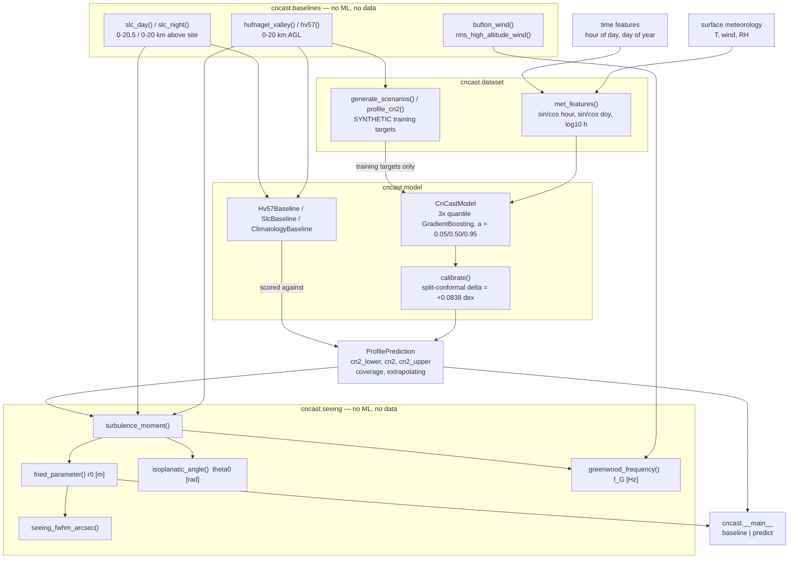
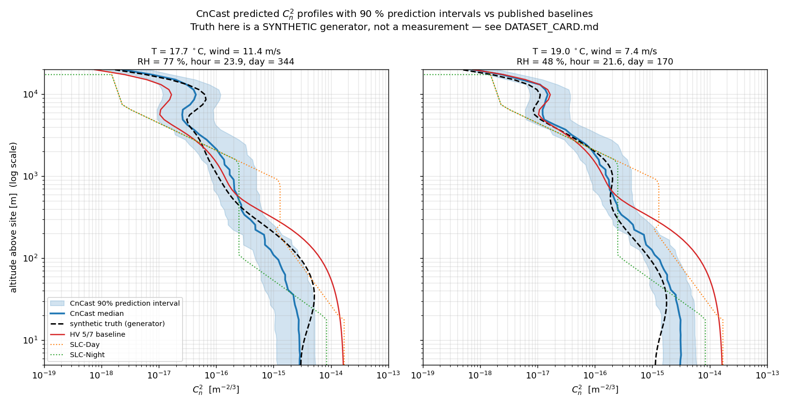
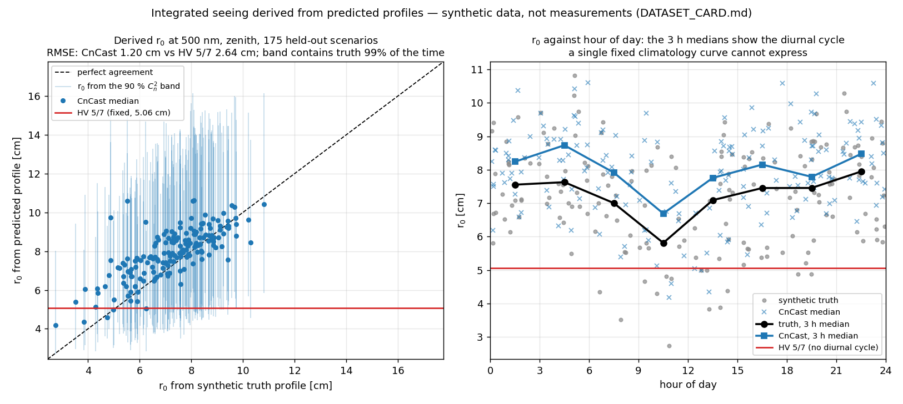

# CnCast

Predicts the vertical optical-turbulence profile Cn²(h) from surface meteorology, with prediction intervals.


## The problem

Every turbulence-limited optical system — a free-space link, an adaptive-optics loop, a
ground-to-satellite terminal — is sized against a Cn²(h) profile, because r₀, θ₀ and the
Greenwood frequency are all altitude-weighted integrals of that profile. Without a
measurement campaign the only profile most engineers have is Hufnagel-Valley 5/7 out of a
textbook, which is one fixed curve: the same answer at noon in July and at midnight in
January, at a coastal site and on a desert plateau. This repository implements those
published curves properly, then asks how much of the profile can be recovered from the
surface meteorology a site already records.

## What this does

- **Implements the published baselines first and checks them against their own documented
  behaviour.** HV 5/7 reproduces its nickname to −0.75 % in r₀ (4.9624 cm against a nominal
  5 cm) and +0.16 % in θ₀ (7.0109 µrad against 7 µrad).
- **Implements the standard turbulence integrals** — r₀, θ₀, f_G, seeing FWHM — verified
  against a constant-Cn² slab closed form at 0.00e+00 relative error, and hand-checked to
  all 7 printed digits on a predicted profile.
- **Fits a learned profile model** from 5 surface variables plus altitude, in 15.9 s on
  2 CPU cores, no GPU.
- **Returns a calibrated interval on every point**, not a bare number: nominal 90 %,
  empirical 0.8988 on held-out data after split-conformal calibration (0.8033 without it).
- **Reports where it does not help.** In the 300–2000 m band the learned model (0.2089 dex
  RMSE) and a plain training climatology (0.2105 dex) are indistinguishable.

## The headline number, and why it is close to tautological

On 4 900 held-out rows from 175 unseen scenarios, the learned model beats HV 5/7 by
**63 %** in RMSE (0.2095 dex against 0.5665 dex, ratio 0.370). That comparison is close to
circular, and the reason is structural rather than incidental:

> **The synthetic training targets are generated from the Hufnagel-Valley family itself,
> with the ground-layer coefficient and the pseudowind driven by exactly the surface
> variables the model is given** (`DATASET_CARD.md` §3). Any method that recovers that
> mapping is guaranteed to beat a single fixed curve that has, by construction, no
> meteorological inputs at all. HV 5/7 is not a strawman — it is a climatology being scored
> on a task it was never designed for.

Three figures, all from `validation/benchmark_results.md` §1–§2, are needed to read this
honestly:

| comparison | RMSE ratio | what it means |
|---|---:|---|
| learned model vs HV 5/7 | **63 % reduction** (0.2095 / 0.5665) | near-tautological; the test targets came from the same model family |
| learned model vs training climatology | **32 % reduction** (0.2095 / 0.3102) | the informative number: how much of the generator's meteorological signal was recovered |
| learned model vs climatology, 300–2000 m | **no difference** (0.2089 vs 0.2105) | in that band the features carry almost no information and the model adds nothing |

And the data itself is the second half of the disclosure. **The training data is 100 %
synthetic**, generated by the committed, seeded `src/cncast/dataset.py` from the baseline
models plus physically-motivated perturbations whose signs come from the literature and
whose magnitudes are hand-chosen. It contains no radiosonde, thermosonde, scintillometer,
SCIDAR, MASS/DIMM or lidar measurement of any kind. Every accuracy figure in this
repository therefore measures **fidelity to a generative process this product defines, not
agreement with the real atmosphere**. The error against a measured Cn² profile is not
"probably a bit worse" — it is unquantified. Read `DATASET_CARD.md` before quoting any
number here.

What the benchmark does establish: the regression machinery, the scenario-level split
protocol and the conformal interval calibration all work as specified. A baseline win
would have been an acceptable and reportable outcome.

## Who it's for

- Optical-link and adaptive-optics engineers doing early sizing who need r₀, θ₀ and f_G
  with an uncertainty attached rather than a single number.
- Researchers who want a cited, tested implementation of HV / HV 5/7 / SLC-Day / SLC-Night
  and the standard turbulence integrals, with every convention written down.
- Anyone building a Cn² pipeline who needs an honest baseline to beat, and a worked example
  of benchmarking and interval calibration against one.

## Who it's not for

- Anyone who needs a **forecast**. Inputs and target here are simultaneous; there is no
  lead time, no time dimension and no time correlation anywhere in the dataset.
- Anyone who needs numbers valid for a **real site**. No latitude, elevation, terrain or
  site descriptor is an input, and no real measurement was used in training or validation.
- Anyone doing **operational** work — link go/no-go, observing-run scheduling, mission
  planning, certification. See the safety statement below.
- Anyone who already has a measured profile and only wants the integrals — use
  **AtmoProfile** (below), or `aotools`.
- Anyone inverting a scintillometer or DIMM reading into a path-averaged Cn² — that is
  **TurbScope**, not this.

## Alternatives, honestly

Cn² *profile prediction from meteorology* is thinly served by open source. Verified before
being listed here; each entry was checked on PyPI or GitHub.

| alternative | what it does better | when to use this instead |
|---|---|---|
| [`aotools`](https://pypi.org/project/aotools/) 1.0.7 (2023-03-10) | Widely used, peer-reviewed (Townson et al. 2019, *Opt. Express* 27, 31316). Converts a Cn² profile into r₀, seeing, isoplanatic angle and coherence time, and estimates r₀ from WFS slopes. | Its documented function list is conversions and WFS analysis; it publishes no HV or SLC profile *model*. Use CnCast when you need the profile itself, or an interval on it. |
| [`hcipy`](https://github.com/ehpor/hcipy) | Full Fresnel/Fraunhofer propagation, coronagraphy, phase-screen atmospheres, deformable mirrors. Far beyond this repo's scope. | HCIPy takes Cn² as an *input* (`Cn_squared_from_fried_parameter`, `InfiniteAtmosphericLayer`). Use CnCast to produce the Cn² it consumes; use HCIPy for the wave propagation. |
| [`soapy`](https://pypi.org/project/soapy/) 0.15.0 | End-to-end Monte-Carlo AO simulation with LGS propagation and closed-loop reconstruction. | Its maintainers state the API is unstable and advise against critical use without contacting them. It simulates an AO system; it does not predict a profile from weather. |
| [SpeckleCn2Profiler](https://github.com/MALES-project/SpeckleCn2Profiler) (JOSS-published) | ML estimation of Cn² from speckle images, with real instrument data behind it. | That is inference from measurements, which is a different problem — closer to TurbScope than to this. Use it if you have speckle imagery. |
| Instrument-vendor and defence codes (MODTRAN/PROTURB-class tools, site-specific AO pipelines) | Real measurement campaigns, validated site climatologies, operational qualification. | Not open source, not redistributable, usually not inspectable. Use CnCast when you need something you can read, seed and re-run. |

Nothing on PyPI was found that implements the HV or SLC profile families with calibrated
prediction intervals. If you know of one, that is a better answer than this repository.

### Distinguishing the three sibling products

| product | input | output |
|---|---|---|
| **AtmoProfile** | a Cn²(h) profile you already have | the integrals: r₀, θ₀, f_G, Rytov variance. Deterministic, no ML. |
| **TurbScope** | scintillometer / DIMM readings | path-averaged Cn², by inverting the instrument formula |
| **CnCast** (this) | surface meteorology + time of day | a full Cn²(h) profile with a prediction interval |

If you have a profile, you want AtmoProfile. If you have an instrument reading, you want
TurbScope. If you have a weather station and no profile at all, you are in the right place.

## Install and first run

```bash
git clone https://github.com/OmAcharya-avtr/cncast.git
cd cncast
python -m venv .venv && source .venv/bin/activate
pip install -e ".[test]"
python -m pytest tests/ -q
python examples/profile_with_intervals.py
```

Expected output of the two runs:

```
........................................................................ [ 64%]
........................................                                 [100%]
112 passed in 15.73s
```

```
wrote <repo>/screenshots/profile_with_intervals.png
mean interval width for the last panel: 0.653 dex
```

The example refits the seeded model from scratch, so it takes about 16 s before it writes
the PNG. There is no model artefact in the repository and none is downloaded.

Command line, if you would rather not write Python:

```bash
python -m cncast baseline --model slc_night --wavelength-nm 1550 --zenith-deg 30
python -m cncast predict --temp-c 22 --wind-m-s 4 --rh-pct 45 --hour 14 --day-of-year 200
```

## A worked example

```python
import numpy as np
from cncast import (bufton_wind, fried_parameter, greenwood_frequency,
                    hv57, isoplanatic_angle, train_default_model)

# 1. Published baseline on a 1 m grid, 0-20 km, 500 nm, zenith.
h = np.linspace(0.0, 20_000.0, 20_001)
cn2_hv = hv57(h)
print(f"HV 5/7  r0     = {fried_parameter(h, cn2_hv, 500e-9) * 100:7.4f} cm")
print(f"HV 5/7  theta0 = {isoplanatic_angle(h, cn2_hv, 500e-9) * 1e6:7.4f} urad")
print(f"HV 5/7  f_G    = {greenwood_frequency(h, cn2_hv, bufton_wind(h, 5.0), 500e-9):7.2f} Hz")

# 2. Learned model: the fit is seeded and takes ~16 s on 2 cores.
model, artefacts = train_default_model()
grid = np.geomspace(5.0, 20_000.0, 24)
pred = model.predict(
    surface_temp_c=22.0, surface_wind_m_s=4.0, relative_humidity_pct=45.0,
    hour_of_day=14.0, day_of_year=200, altitude_m=grid,
)
print(f"\nnominal coverage {pred.coverage:.2f}   extrapolating={pred.extrapolating}")
print(f"{'h [m]':>9}  {'lower':>11}  {'median':>11}  {'upper':>11}")
for i in (0, 8, 16, 23):
    print(f"{grid[i]:9.1f}  {pred.cn2_lower[i]:11.4e}  {pred.cn2[i]:11.4e}  {pred.cn2_upper[i]:11.4e}")

# 3. Integrate the median and both bounds; a stronger profile gives a smaller r0.
r0 = fried_parameter(grid, pred.cn2, 500e-9) * 100
r0_lo = fried_parameter(grid, pred.cn2_upper, 500e-9) * 100
r0_hi = fried_parameter(grid, pred.cn2_lower, 500e-9) * 100
print(f"\npredicted r0 = {r0:.3f} cm   band {r0_lo:.3f} - {r0_hi:.3f} cm")
print(f"conformal delta = {model.conformal_delta_dex:+.4f} dex")
```

Actual output:

```
HV 5/7  r0     =  4.9624 cm
HV 5/7  theta0 =  7.0109 urad
HV 5/7  f_G    =   71.98 Hz

nominal coverage 0.90   extrapolating=False
    h [m]        lower       median        upper
      5.0   3.5305e-15   5.6504e-15   1.3796e-14
     89.5   1.3491e-15   2.7056e-15   5.4259e-15
   1602.3   5.2700e-17   1.1841e-16   3.9416e-16
  20000.0   4.5179e-19   7.0289e-19   1.4697e-18

predicted r0 = 7.212 cm   band 4.233 - 11.049 cm
conformal delta = +0.0838 dex
```

Note the width of that r₀ band. It is deliberately conservative — see the coverage row for
derived quantities in the validation table.

## Architecture



The edge that matters is `hufnagel_valley() → profile_cn2() → training targets`: the
baseline the model is scored against is also the generator of the data it is trained on.
That single arrow is the whole tautology.

`baselines.py` and `seeing.py` depend only on NumPy and import nothing from the ML layer,
so they are usable on their own. There are no cross-product imports.

## Screenshots

Both PNGs are produced by the scripts in `examples/`, so they cannot drift from the code.



Notice that the blue band widens where the generator's unobservable modes dominate, and
that the fixed red HV 5/7 curve is identical in both panels while the two scenarios differ
by several decades near the ground.



Notice the right-hand panel: the 3 h medians move with hour of day, which a single fixed
climatology line cannot do at all — and notice in the left panel that the points sit
slightly above the 1:1 line at small r₀, the +0.673 cm optimistic bias listed under
Limitations.

## Validation evidence

Level 2 (Research). Full write-up in `validation/VALIDATION.md`; raw script output in
`validation/validate_baselines_output.txt` and `validation/benchmark_results.md`.

### Baselines reproducing published values

| check | reference | result | tolerance / note |
|---|---|---|---|
| HV 5/7 r₀ at 500 nm, zenith | nickname value 5 cm | **4.9624 cm** (−0.75 %) | nickname quoted to 1 s.f.; < 1 % is the strongest claim available |
| HV 5/7 θ₀ at 500 nm, zenith | nickname value 7 µrad | **7.0109 µrad** (+0.16 %) | as above |
| HV 5/7 three-term decomposition at 0, 10, 100, 500, 1e3, 5e3, 1e4, 1.5e4, 2e4 m | Andrews & Phillips (2005) Eq. 12.30 | terms sum to the returned total | asserted to 1e-24 m^-2/3 |
| SLC-Day branches at 100 m, 2 000 m, 10 000 m | Beland (1993) closed forms | rel. err **0.0e+00** each | exact |
| SLC-Night branches at 50 m, 500 m, 3 000 m | Beland (1993) closed forms | rel. err **0.0e+00** each | exact |
| HV 5/7 jet-stream bump altitude | Bufton 9.4 km jet | peak at **9 847 m** | within 6 % |
| HV 5/7 high-altitude term ∝ v² | v: 10 → 40 m/s | Cn²(10 km) × **14.73** | pure term would give 16; tropopause term contributes ~2 % |

**Checks where the published model, not the code, is at fault** — reported rather than
smoothed over:

| finding | value | interpretation |
|---|---:|---|
| SLC-Day discontinuity at 240 m | **+31.1 %** (9.9157e-16 → 1.3000e-15) | the published branches were fitted separately and never constrained to join |
| SLC-Day discontinuity at 18.5 m | −14.0 % | same cause |
| SLC-Night largest discontinuity (110 m) | +5.4 % | SLC-Night is continuous to better than 6 % everywhere |
| HV 5/7 pseudowind vs Bufton rms | 21 m/s (definition) vs **22.96 m/s** (Bufton at 5 m/s ground wind) | two different conventions, frequently conflated; kept as separate arguments here |

### Integrated quantities, hand-checked

| check | reference | result | tolerance |
|---|---|---|---|
| μ₀ = Cn²·H, constant-Cn² slab | analytic | 1.000000e-11 vs 1.000000e-11 | 0 |
| r₀, constant-Cn² slab (1e-15 m^-2/3, 0–10 km, 1.55 µm) | analytic | **7.848343 cm** vs 7.848343 cm | rel. err **0.00e+00** |
| μ_5/3 = Cn²·H^(8/3)/(8/3), same slab | analytic | 1.740596e-05 vs 1.740596e-05 | 3.70e-11 (trapezoid discretisation) |
| μ₀ from a predicted profile, 5-point grid, arithmetic written out | hand computation, `VALIDATION.md` §5.1 | **1.4500718e-12** vs script 1.450072e-12 m^(1/3) | all 7 printed digits |
| r₀ = [0.423 k² sec ζ μ₀]^(−3/5) from that μ₀ | hand computation | **6.431470 cm** vs script 6.431470 cm | all 7 printed digits |
| r₀ ∝ λ^(6/5) (850, 1550 vs 500 nm) | algebraic identity | max rel. err 1.5e-16 | machine precision |
| r₀ ∝ cos ζ^(3/5) (ζ = 30°, 60°) | algebraic identity | 0.0e+00 | machine precision |
| θ₀ ∝ cos ζ^(8/5) (ζ = 30°, 60°) | algebraic identity | max rel. err 1.5e-16 | machine precision |
| f_G: 2.31 λ^(−6/5) form vs (0.102 k²)^(3/5) form | Greenwood (1977) | < 2e-3 | published rounding 2.307 → 2.31 |
| Baseline integrals, λ = 500 nm, zenith, 5 m/s ground wind | — | HV 5/7 r₀ 4.962 cm / θ₀ 7.011 µrad / f_G 71.98 Hz; SLC-Day 4.773 / 11.986 / 59.02; SLC-Night 8.904 / 13.229 / 36.90 | SLC-Night r₀ ≈ 2× SLC-Day, as expected when the night-time surface layer collapses |
| r₀ grid convergence, 0–20 km | 0.1 m reference | 100 m step → 4.78532 cm (**+3.6 % bias**); 10 m → 4.96056 cm; 1 m → 4.96243 cm | reported as a limitation, not hidden |

### Learned model on held-out data — including where the baseline is not beaten

4 900 rows from 175 unseen scenarios, split by scenario. Errors in dex.

| predictor | RMSE | MAE | bias | p95 abs err |
|---|---:|---:|---:|---:|
| CnCast learned model | **0.2095** | 0.1620 | −0.0201 | 0.4190 |
| HV 5/7 (mandated baseline) | 0.5665 | 0.4475 | +0.2686 | 1.1048 |
| SLC day/night | 0.7314 | 0.5199 | −0.0893 | 1.2224 |
| Training climatology | 0.3102 | 0.2395 | +0.0049 | 0.6168 |

By altitude band — the 300–2000 m row is the one where the model adds nothing:

| band [m] | n | CnCast | HV 5/7 | SLC | climatology |
|---|---:|---:|---:|---:|---:|
| 5–50 | 1400 | 0.2122 | 0.7860 | 0.5748 | 0.3735 |
| 50–300 | 1050 | 0.2023 | 0.6911 | 0.4717 | 0.3424 |
| **300–2000** | 1050 | **0.2089** | 0.2642 | 0.4359 | **0.2105** |
| 2000–8000 | 875 | 0.2257 | 0.3039 | 0.6126 | 0.2333 |
| 8000–20000 | 525 | 0.1879 | 0.3143 | 1.6315 | 0.3351 |

### Interval coverage, nominal versus achieved

| interval | nominal | achieved | mean width [dex] |
|---|---:|---:|---:|
| raw quantile GBR (α = 0.05 / 0.95) | 0.900 | **0.8033** | 0.5575 |
| conformally calibrated (CQR, δ = +0.0838 dex) | 0.900 | **0.8988** | 0.7249 |
| calibrated, band 5–50 m | 0.900 | 0.8821 | 0.6947 |
| calibrated, band 50–300 m | 0.900 | 0.8914 | 0.7170 |
| calibrated, band 300–2000 m | 0.900 | 0.9095 | 0.7014 |
| calibrated, band 2000–8000 m | 0.900 | 0.9314 | 0.8409 |
| calibrated, band 8000–20000 m | 0.900 | 0.8819 | 0.6752 |
| derived r₀ band (integrating both Cn² bounds), 175 scenarios | 0.900 | **0.989** | — |

Resolution of the coverage estimate is ±0.02: the binomial standard error on 4 900 rows is
0.0043, but rows are not independent (28 per scenario), so the effective sample size is
nearer 175. The derived r₀ band over-covers because the two profile bounds are perfectly
correlated across altitude; treat it as an upper bound on the uncertainty, not as a
calibrated 90 % interval.

### Reproducibility and suite

| check | result |
|---|---|
| identical test features on re-run | True |
| max prediction difference across re-runs | **0.000e+00 dex** |
| conformal δ identical across re-runs | True |
| quantile-crossing fraction on the fit set | 0.0000 |
| `python -m pytest tests/ -q` | **112 passed**, 0 failed, 0 skipped, in 15.73 s |
| `ruff check src/ tests/` | clean |

## API reference

<details>
<summary><code>cncast.baselines</code> — published profile models, NumPy only</summary>

| function | returns | units / validity |
|---|---|---|
| `hufnagel_valley(h_m, rms_wind_m_s, a0)` | Cn²(h) | m^-2/3; h in m AGL, 0–20 000 m; mid-latitude continental clear-air climatology |
| `hv57(h_m)` | Cn²(h) for v = 21 m/s, A = 1.7e-14 | m^-2/3; 0–20 000 m AGL |
| `slc_day(h_m)` | SLC-Day piecewise Cn²(h) | m^-2/3; 0–20 500 m above the AMOS site, identically zero above |
| `slc_night(h_m)` | SLC-Night piecewise Cn²(h) | m^-2/3; 0–20 000 m above the site, identically zero above |
| `bufton_wind(h_m, ground_wind_m_s)` | V(h) | m/s; climatological jet centred at 9 400 m |
| `rms_high_altitude_wind(ground_wind_m_s, n_points)` | 5–20 km rms of the Bufton wind | m/s |
| `HV57_A0`, `HV57_RMS_WIND` | 1.7e-14 m^-2/3, 21 m/s | the HV 5/7 constants |
| `HV_VALID_RANGE_M`, `SLC_DAY_VALID_RANGE_M`, `SLC_NIGHT_VALID_RANGE_M` | stated validity ranges | m |

</details>

<details>
<summary><code>cncast.seeing</code> — turbulence integrals, NumPy only</summary>

| function | returns | units |
|---|---|---|
| `turbulence_moment(h_m, cn2, order)` | μ_order = ∫ Cn²(h) h^order dh | m^(1/3 + order) |
| `fried_parameter(h_m, cn2, wavelength_m, zenith_angle_deg)` | r₀, Fried (1966) | m |
| `isoplanatic_angle(h_m, cn2, wavelength_m, zenith_angle_deg)` | θ₀, Fried (1982) | rad |
| `greenwood_frequency(h_m, cn2, wind_m_s, wavelength_m, zenith_angle_deg)` | f_G, Greenwood (1977) | Hz |
| `seeing_fwhm_arcsec(r0_m, wavelength_m)` | 0.98 λ/r₀, Roddier (1981) | arcsec |

Geometry throughout is plane-parallel `sec ζ` with a plane-wave r₀; no Earth curvature and
no spherical-wave (beacon) constant.

</details>

<details>
<summary><code>cncast.model</code> — learned model, baselines-as-predictors, calibration</summary>

| object | role |
|---|---|
| `CnCastModel(coverage, n_estimators, max_depth, ...)` | three quantile GradientBoostingRegressors (α = 0.05 / 0.50 / 0.95); only `coverage=0.90` has been calibrated and measured |
| `CnCastModel.fit(x, y)` | fits on the 8-column feature table, target log10 Cn² |
| `CnCastModel.calibrate(x_cal, y_cal)` | split-conformal offset δ in dex on a disjoint set; returns δ |
| `CnCastModel.conformal_delta_dex` | the fitted δ (+0.0838 dex in the production run) |
| `CnCastModel.fit_report()` | fit diagnostics including the quantile-crossing fraction |
| `CnCastModel.predict(surface_temp_c, surface_wind_m_s, relative_humidity_pct, hour_of_day, day_of_year, altitude_m)` | `ProfilePrediction`; °C, m/s, %, h, 1–365, m |
| `CnCastModel.predict_scenario(scenario, altitude_m)` | the same from a `Scenario` |
| `ProfilePrediction` | `cn2_lower`, `cn2`, `cn2_upper` (m^-2/3), `altitude_m`, `coverage`, `extrapolating`, `interval_width_dex` |
| `Hv57Baseline`, `SlcBaseline`, `ClimatologyBaseline` | the three comparators, each exposing `predict_log10_cn2(x)` |
| `interval_coverage(y_true, lower, upper)` | empirical coverage fraction |
| `train_default_model(...)` | the seeded reference pipeline; returns `(model, artefacts)` |
| `TRAINING_DOMAIN` | the feature bounds outside which `extrapolating` is set |

</details>

<details>
<summary><code>cncast.dataset</code> — the synthetic generator (read <code>DATASET_CARD.md</code> first)</summary>

| function | role |
|---|---|
| `generate_scenarios(n_scenarios, seed)` | draws `Scenario` records from the priors in `DATASET_CARD.md` §3 |
| `profile_cn2(scenario, h_m)` | the generator's Cn²(h); pure, no hidden random state |
| `met_features(...)`, `scenario_features(scenario, h_m)` | the 8-column feature table |
| `build_table(scenarios, n_altitudes, seed)` | `(x, y, groups)` |
| `split_scenarios(...)` | scenario-level split, never row-level |
| `default_altitude_grid(n_points)` | log-spaced grid, 5 m to 20 km |
| `FEATURE_NAMES`, `ALTITUDE_MIN_M`, `ALTITUDE_MAX_M` | 8 names; 5 m; 20 000 m |

</details>

## Limitations

1. **The headline benchmark is near-tautological.** 63 % against HV 5/7 is inflated by the
   generator sharing a model family with the baseline. Use the 32 % figure against the
   training climatology, and note that in 300–2000 m the model adds nothing measurable.
2. **The training data is synthetic and contains no measurement.** Accuracy is fidelity to
   a generative process, not to the atmosphere. Error against a real profile is
   unquantified, not merely larger.
3. **This is not a forecast.** Inputs and target are simultaneous; the dataset has no time
   dimension and no correlation between scenarios, so no forecast claim can be validated
   here. The name refers to casting a profile from surface data.
4. **Site-agnostic.** No latitude, elevation, terrain or site descriptor is an input. SLC
   is an AMOS/Haleakala fit being offered as a generic day/night pair.
5. **The baselines are climatologies.** Real Cn² at a fixed altitude routinely departs from
   HV or SLC by an order of magnitude. Reproducing HV 5/7 to 0.75 % validates the
   implementation, not the model's applicability to any site or night.
6. **Integration grid is the caller's responsibility.** A 100 m grid biases r₀ by +3.6 %
   because it under-resolves the 100 m ground layer. Use ≤ 10 m near the surface, or a
   log-spaced grid.
7. **Optimistic bias in derived r₀.** +0.673 cm mean bias over 175 held-out scenarios;
   strong-turbulence (low-r₀) cases are predicted too favourably. For a link margin that is
   the unsafe direction — use the interval, not the median.
8. **Confident extrapolation.** Outside T ∈ [−10, 38] °C, wind ∈ [0, 14] m/s,
   RH ∈ [10, 95] %, h ∈ [5, 20 000] m the tree ensemble returns its edge value with
   unchanged interval width. `extrapolating=True` is set; callers must check it.
9. **Staircase profiles, no thin layers.** Gradient boosting on trees gives a piecewise
   constant profile — do not differentiate it. The generator contains no 30 m-thick intense
   layer, so the model cannot produce one, and real layers of that kind can dominate θ₀.
10. **One calibrated coverage.** Only 90 % has been calibrated and measured; conformal
    coverage is marginal, not conditional, and its exchangeability assumption holds here
    only because calibration and test data share a generator.
11. **Derived-quantity intervals over-cover** (98.9 % against 90 % nominal) because the
    profile bounds are perfectly correlated in altitude.
12. **Plane-parallel geometry only.** `sec ζ`, no Earth curvature, unreliable above ~70°
    zenith; plane-wave r₀ only.
13. **Compute budget.** 2 CPU cores, ~500 MB RAM, no GPU and no PyTorch. Dataset
    generation < 1 s, fit + calibration 15.9 s (budget 120 s), test suite 17.5 s, full
    benchmark script 51 s. No hyperparameter search was run against the test split; the
    defaults were chosen for the budget and left alone.

## Reproducing every number

From the repository root, in the environment created above. Each command regenerates the
file that every figure in this README is quoted from.

```bash
python -m pytest tests/ -q                                   # 112 passed
ruff check src/ tests/                                       # clean
python validation/validate_baselines.py > validation/validate_baselines_output.txt
python validation/benchmark_ml.py       > validation/benchmark_results.md
python examples/profile_with_intervals.py                    # -> screenshots/
python examples/r0_comparison.py                             # -> screenshots/
```

| numbers in this README | come from |
|---|---|
| HV 5/7 r₀ / θ₀, SLC branch checks, discontinuities, grid convergence, baseline integrals | `validation/validate_baselines_output.txt` → `validation/VALIDATION.md` §1–§3 |
| slab closed form, scaling-law identities, the hand-checked μ₀ and r₀ | `validation/VALIDATION.md` §2, §5.1 |
| RMSE/MAE/bias tables, per-band RMSE, coverage tables, conformal δ, reproducibility | `validation/benchmark_results.md` → `validation/VALIDATION.md` §4, §6, §7 |
| r₀ bias +0.673 cm, derived-band coverage 0.989 | stdout of `examples/r0_comparison.py` |
| 112 passing tests | `python -m pytest tests/ -q` |

Seeds: data 20260807; fit altitudes 99; calibration altitudes 100; splits 4242 (and 4243
for the calibration split, derived as `split_seed + 1`); all three regressors
`random_state=7`. Environment of the recorded run: Python 3.11.15, numpy 2.4.4,
scikit-learn 1.8.0, Linux x86-64, 2 CPU cores. Bit-exact reproduction is claimed only for
the same library versions.

## Safety statement

This software is research-grade. It is not flight-qualified, not certified, and not
approved for operational aerospace use.

## Licence

Apache-2.0. See `LICENSE`. Copyright © 2026 OPTIMA Organisation.

## Citation

```bibtex
@software{cncast2026,
  title   = {CnCast: vertical Cn2 profile prediction with published baselines and
             calibrated prediction intervals},
  author  = {{OPTIMA Organisation}},
  year    = {2026},
  version = {0.1.0},
  note    = {Research-grade; trained on synthetic data; not certified for
             operational flight use}
}
```

References implemented here: Hufnagel (1974); Valley (1980), *Appl. Opt.* 19(4), 574–577;
Beland (1993), *The Infrared and Electro-Optical Systems Handbook* Vol. 2, ch. 2;
Bufton (1973), *Appl. Opt.* 12(8), 1785–1793; Fried (1966), *JOSA* 56(10), 1372–1379;
Fried (1982), *JOSA* 72(1), 52–61; Greenwood (1977), *JOSA* 67(3), 390–393;
Roddier (1981), *Prog. Opt.* 19, 281–376; Andrews & Phillips (2005), *Laser Beam
Propagation through Random Media*, 2nd ed., SPIE Press, ch. 12; Romano, Patterson &
Candès (2019), *Conformalized Quantile Regression*, NeurIPS 32.

Further reading in this repository: `MODEL_CARD.md` (fifteen-item model card),
`DATASET_CARD.md` (the synthetic generator and its limits), `validation/VALIDATION.md`
(the full evidence), `CHANGELOG.md`.

## Credits

This is under reserved rights obtained by OPTIMA Organisation.
