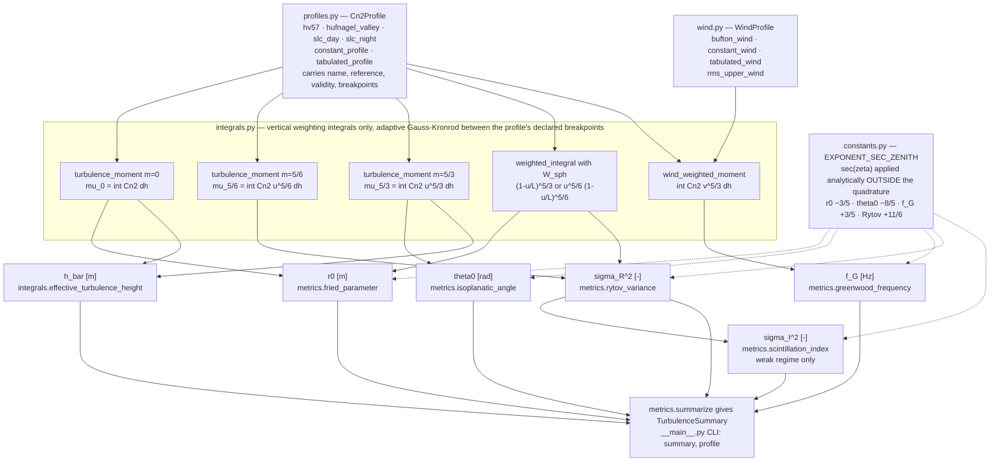
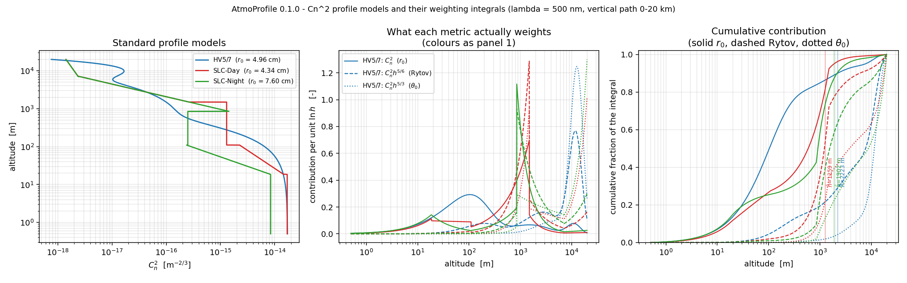
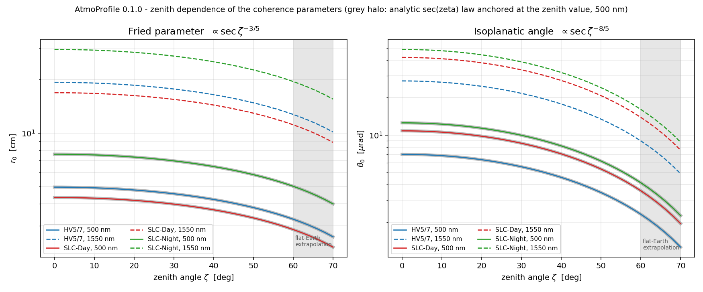

# AtmoProfile

Turns a known Cn2(h) turbulence profile into r0, theta0, Greenwood frequency and Rytov variance.


## The problem

Turbulence sizing decisions are made early and are expensive to revisit: how many
actuators the deformable mirror needs (D/r0), how fast the loop must run (f_G), how far
off-axis the guide star can sit (theta0), how much fade margin the downlink needs
(sigma_I^2). Each answer is a weighted integral of Cn2 along the path, each integral
carries a *different* weight and therefore a *different* zenith-angle dependence — r0
falls as cos(zeta)^(3/5) while theta0 falls as cos(zeta)^(8/5) and the Rytov variance
rises as sec(zeta)^(11/6). Tools that fold those exponents into a single "airmass
factor" produce link budgets that are right at zenith and quietly wrong at 60 degrees,
and the coefficients involved (0.423, 2.914, 0.102, 2.25, 6.88, 0.314) get copied
between codebases until nobody can say which definition of r0 or which bandwidth
convention a given number belongs to.

## What this does

- Computes six quantities from any Cn2(h) profile — r0 (plane and spherical wave),
  theta0, the Greenwood frequency, the plane- and spherical-wave Rytov variance and the
  weak-regime scintillation index — with the weighting integral written out in every
  docstring. For HV 5/7 at 500 nm on a vertical path: r0 = 4.9624 cm, theta0 = 7.0109
  urad, f_G = 71.87 Hz, sigma_R^2 = 0.2326 (`validation/standard_profiles_literature.py`).
- Applies the zenith dependence as an explicit, stated power of sec(zeta) *outside* the
  quadrature, so the exponents are checkable rather than asserted. A blind least-squares
  fit of ln Q against ln sec(zeta), told nothing about the expected slope, recovers
  −0.600000000, −1.600000000, +0.600000000 and +1.833333333 for all three standard
  profiles, max deviation 2.22e-16 across 18 checks (`validation/zenith_scaling.py`).
- Ships closed-form hand-checked arithmetic for a constant-Cn2 slab: r0 = 8.0379248737e-02 m,
  theta0 = 4.5481593687e-05 rad, sigma_R^2 = 7.4362261899e-02 plane and 3.0065805300e-02
  spherical, code against hand to a maximum relative difference of 1.24e-15
  (`validation/constant_slab_closed_forms.py`).
- Integrates panel by panel between each profile's declared breakpoints with adaptive
  Gauss-Kronrod, which reproduces the hand-assembled analytic band sum of the
  discontinuous SLC-Day model to 2.891e-16 while a 64001-node Simpson rule on the same
  integrand reaches only 5.161e-05 (`validation/quadrature_convergence.py`).
- Reports where it disagrees with the literature instead of tuning to match: the Bufton
  wind rms over 5–20 km comes out at 22.9637 m/s against the 21 m/s pseudowind that HV 5/7
  is quoted with, a 9.35 % discrepancy, recorded as a FAILED check (see
  [Validation evidence](#validation-evidence)).

There is no randomness, no fitting and no learned component anywhere in this package.
Given a profile and a wavelength, the answer is a quadrature, and the quadrature is
demonstrated to be converged. That is the point of the product: it is the deterministic
reference implementation that the AI-bearing turbulence products in this portfolio are
benchmarked against, so what it sells is correctness and citation discipline, not
features. A baseline that quietly agreed with every published number would be worth
less than one that says which number it cannot reproduce.

## Who it's for

- Adaptive-optics designers sizing an AO system against a turbulence profile, who need
  D/r0, f_G and theta0 with their zenith scaling visible.
- Free-space-optical link engineers computing fade statistics and margins in the weak
  fluctuation regime.
- Anyone who needs a trustworthy integral kernel to check another tool against, or a
  deterministic baseline for a learned turbulence model to beat.
- Students and reviewers verifying textbook results, with the arithmetic for every
  coefficient shown rather than cited to a page nobody checked.

## Who it's not for

- Anyone who needs a Cn2 profile in the first place. This package computes integrals
  *from* a profile; it does not measure or predict one. See the sibling products below.
- Anyone working in the strong-fluctuation regime. Everything here is first-order Rytov
  theory; sigma_R^2 >= 1 raises a warning and the returned value is an extrapolation.
  For HV 5/7 at 500 nm that limit is reached at zenith 63.17 degrees
  (`validation/zenith_scaling_output.txt`).
- Anyone doing wave-optics propagation, phase-screen generation, Zernike decomposition
  or end-to-end AO loop simulation. Use HCIPy or Soapy.
- Anyone needing finite outer scale (von Karman), inner-scale, aperture-averaging or
  Gaussian-beam effects. None are modelled.
- Anyone needing a certified or flight-qualified tool. This is not one.

## Alternatives, honestly

`aotools` is the closest direct competitor and it already covers most of these integrals.
It is mature, widely cited and does more than this package in every direction except the
ones listed below. If you are already using it, the honest reason to add this one is
narrow: explicit slant-path zenith handling, the weighting integral shown in every
docstring, hand-checked closed forms, and built-in profile models.

| alternative | verified | what it does better | when to use it instead |
|---|---|---|---|
| [AOtools](https://github.com/AOtools/aotools) (`pip install aotools`, 1.0.8) | PyPI, GitHub, source read | Mature and widely cited. `aotools.turbulence.atmos_conversions` already provides `cn2_to_r0`, `r0_to_cn2`, `cn2_to_seeing`, `seeing_to_r0`, `isoplanaticAngle`, `coherenceTime` and `rytov_variance` — the same physics, same 2.25 Rytov coefficient. It also has phase screens (FFT and infinite), slope covariance matrices, temporal power spectra, Zernikes and `r0_from_slopes`, none of which this package has. | Almost always, if you already have a discrete layer profile and no slant path. Use this package only for what AOtools does not do: none of its conversion functions take a zenith angle, so slant paths must be folded in by hand; the integrals are array sums over layers (`.sum(axis)`) rather than quadrature over a continuous profile with declared breakpoints; there is no Greenwood frequency (it returns the coherence time tau0 instead), no spherical-wave weighting, and no built-in Hufnagel-Valley, SLC-Day, SLC-Night or Bufton model. |
| [HCIPy](https://github.com/ehpor/hcipy) (`pip install hcipy`, 0.7.0) | PyPI, GitHub | Full Fresnel/Fraunhofer propagation framework, multi-layer atmospheres, coronagraphy, deformable mirrors and wavefront sensors. | You need to *simulate* propagation through turbulence rather than reduce a profile to summary parameters. |
| [Soapy](https://github.com/AOtools/soapy) (`pip install soapy`, 0.15.0) | PyPI, GitHub | End-to-end Monte-Carlo AO simulation with WFS, DM, LGS and tomography. | You are designing and closing an AO loop, not sizing one. |

Checked and not used: `pyAtmosphere` (real, on PyPI at 0.0.1, a split-step light
propagation simulator rather than an integral calculator, and too early-stage to
recommend as an alternative). No package name in this section is asserted without a
PyPI record; the AOtools function list above was read from its source, not inferred.

### Sibling OPTIMA products — related, not alternatives

Three products in this family touch Cn2 and are easy to confuse. The distinguishing
question is which way the arrow points.

| product | direction of the arrow |
|---|---|
| **AtmoProfile** (P020, this repo) | known Cn2(h) profile -> integrals. Computes r0, theta0, f_G, Rytov variance and the scintillation index from a profile you already have. Deterministic, no ML. |
| **TurbScope** (P013) | measurements -> Cn2. Infers a path-averaged Cn2 from what a scintillometer and DIMM actually read, with uncertainty intervals. |
| **CnCast** (P019) | meteorology -> Cn2(h) profile. Predicts a vertical profile from surface weather and season. |

If you have instrument readings, you want TurbScope. If you want a profile for tonight,
you want CnCast. If you have a profile and need numbers out of it, you are in the right
repository.

## Install and first run

```bash
git clone https://github.com/OmAcharya-avtr/atmoprofile.git
cd atmoprofile
python -m venv .venv && source .venv/bin/activate
pip install -e ".[dev]"
python -m pytest tests/
python examples/cn2_profile_comparison.py
```

Expected output of the last two commands:

```
........................................................................ [ 61%]
.............................................                            [100%]
117 passed in 19.22s
```

```
wrote /path/to/atmoprofile/screenshots/cn2_profile_comparison.png in 1.1 s
```

The runtime dependencies are numpy and scipy only; `[dev]` adds pytest, hypothesis, ruff
and matplotlib (Agg backend, used only by the two example scripts). Python 3.11 or later.
No GPU, no network, no threads; the memory footprint is a few MB.

The command-line interface gives the same numbers without writing any Python:

```
$ python -m atmoprofile summary --profile hv57 --wavelength-nm 500 --zenith-deg 0 30 45 60
AtmoProfile 0.1.0 - HV5/7 at 500 nm
  Cn^2 source : Hufnagel (1974) upper-atmosphere term with the Valley ground term, in the form given by Andrews & Phillips, 'Laser Beam Propagation through Random Media', 2nd ed., SPIE 2005, and Hardy, 'Adaptive Optics for Astronomical Telescopes', OUP 1998
  wind source : Bufton, Applied Optics 12(8), 1973; in the form given by Andrews & Phillips, 'Laser Beam Propagation through Random Media', 2nd ed., SPIE 2005
  path        : 0 m to 20000 m
zen[deg]    r0[cm]  r0sph[cm]  th0[urad]    fG[Hz]   sig2R,pl   sig2R,sp  seeing["]  weak?
------------------------------------------------------------------------------------------
     0.0     4.962      5.180      7.011     71.87     0.2326     0.1571      2.037   True
    30.0     4.552      4.751      5.570     78.35     0.3028     0.2046      2.220   True
    45.0     4.031      4.207      4.027     88.48     0.4391     0.2966      2.507   True
    60.0     3.274      3.417      2.313    108.94     0.8290     0.5600      3.087   True

sigma_I^2 (weak regime, point receiver) = sigma_R^2 in the columns above.
```

`--json` emits the same rows as JSON. `python -m atmoprofile profile --profile slc_day`
prints Cn2 samples with the model's provenance and validity statement.

## A worked example

```python
import math

from atmoprofile import (
    bufton_wind, effective_turbulence_height, fried_parameter, greenwood_frequency,
    hv57, isoplanatic_angle, rms_upper_wind, rytov_variance, scintillation_index,
    slc_day, summarize, turbulence_moment,
)

profile, wind, lam = hv57(), bufton_wind(5.0), 500e-9

for zen_deg in (0.0, 45.0):
    z = math.radians(zen_deg)
    print(f"HV5/7 at {lam * 1e9:.0f} nm, zenith {zen_deg:.0f} deg, sec = {1 / math.cos(z):.6f}")
    print(f"  r0            = {fried_parameter(profile, lam, zenith_rad=z) * 100:.4f} cm")
    print(f"  r0 spherical  = {fried_parameter(profile, lam, zenith_rad=z, wave='spherical') * 100:.4f} cm")
    print(f"  theta0        = {isoplanatic_angle(profile, lam, zenith_rad=z) * 1e6:.4f} urad")
    print(f"  f_Greenwood   = {greenwood_frequency(profile, wind, lam, zenith_rad=z):.4f} Hz")
    print(f"  sigma_R^2     = {rytov_variance(profile, lam, zenith_rad=z):.6f}")
    print(f"  sigma_I^2     = {scintillation_index(profile, lam, zenith_rad=z):.6f}")

print(f"mu_0 (HV5/7)      = {turbulence_moment(profile, 0.0):.6e} m^(1/3)")
print(f"h_bar (HV5/7)     = {effective_turbulence_height(profile):.2f} m")
print(f"Bufton rms 5-20km = {rms_upper_wind(wind, 5000.0, 20000.0):.4f} m/s  (HV5/7 quotes 21 m/s)")

s = summarize(slc_day(), 1550e-9, wind=wind)
print(f"SLC-Day 1550 nm   : r0 {s.r0_m * 100:.3f} cm, theta0 {s.theta0_urad:.3f} urad, "
      f"f_G {s.f_greenwood_hz:.2f} Hz, weak={s.weak_fluctuation_valid}")
```

Actual printed output:

```
HV5/7 at 500 nm, zenith 0 deg, sec = 1.000000
  r0            = 4.9624 cm
  r0 spherical  = 5.1797 cm
  theta0        = 7.0109 urad
  f_Greenwood   = 71.8705 Hz
  sigma_R^2     = 0.232619
  sigma_I^2     = 0.232619
HV5/7 at 500 nm, zenith 45 deg, sec = 1.414214
  r0            = 4.0308 cm
  r0 spherical  = 4.2072 cm
  theta0        = 4.0267 urad
  f_Greenwood   = 88.4830 Hz
  sigma_R^2     = 0.439125
  sigma_I^2     = 0.439125
mu_0 (HV5/7)      = 2.233984e-12 m^(1/3)
h_bar (HV5/7)     = 2223.49 m
Bufton rms 5-20km = 22.9637 m/s  (HV5/7 quotes 21 m/s)
SLC-Day 1550 nm   : r0 16.867 cm, theta0 42.096 urad, f_G 16.73 Hz, weak=True
```

Three things to notice. The zenith-0 line reproduces the values HV 5/7 is *named* for
(5 cm and 7 urad). Between the two blocks the ratios are exactly the analytic sec(zeta)
powers: 4.0308/4.9624 = 0.81225 = sec(45)^(-3/5), and 0.439125/0.232619 = 1.88775 =
sec(45)^(11/6). And the last print is the failed check, in the public API rather than
hidden in a validation script.

## Architecture



The dotted edges are the zenith-angle path. They are drawn separately because that is
exactly the design rule this package enforces: every weighting integral is evaluated
along the vertical, and the slant path enters afterwards as one explicit, stated power
of sec(zeta) per quantity. The vertical integral and the airmass factor never mix, which
is what makes the exponents independently verifiable
(`validation/zenith_scaling.py`).

## Screenshots

Both PNGs are produced by the scripts in `examples/` and were regenerated from the
current source.



`examples/cn2_profile_comparison.py`. Notice the middle panel: the same three profiles
weighted by Cn2, Cn2·h^(5/6) and Cn2·h^(5/3) put their mass in completely different
places, which is why r0 is a ground-layer quantity while theta0 and scintillation are
driven by the tropopause. The right panel makes the consequence quantitative — the solid
r0 curves are already past 80 % of their integral below 1 km, while the dotted theta0
curves have barely started.



`examples/r0_theta0_vs_zenith.py`. Notice that the computed points sit on the grey halo,
which is the analytic sec(zeta) law anchored only at the zenith value — the exponents
are demonstrated, not asserted. The shaded region past 60 degrees is where the
plane-parallel airmass model stops being a model and starts being an extrapolation; the
package emits a `UserWarning` there.

## Validation evidence

Level 2 (Research). Full working, including the raw script output, is in
`validation/VALIDATION.md` and the four `.txt` files beside it. Every figure below is
copied from those raw files.

| # | Check | Reference | Result | Tolerance | Verdict |
|---|---|---|---|---|---|
| 1 | Constant-Cn2 slab, 1e-15 m^(-2/3) over 0–1000 m at 500 nm: mu_0, mu_5/3, mu_5/6, r0 plane, r0 spherical (both directions), theta0, h_bar, sigma_R^2 plane and spherical | hand arithmetic written out in `VALIDATION.md` §1 | max relative difference 1.24e-15 across all 12 checked quantities; r0 = 8.0379248737e-02 m, theta0 = 4.5481593687e-05 rad exactly reproduced | 1e-9 rel | PASS |
| 2 | Horizontal-path coefficients implied by the slant-path 2.25 | published 1.23 (plane), 0.50 (spherical), 0.40 (ratio); Andrews & Phillips 2005 | 1.227273 (0.22 %), 0.496205 (0.76 %), 0.404315 (1.08 %) | 3-figure rounding of the published constants | PASS |
| 3 | HV 5/7 definitional r0 at 0.5 um, vertical, 0–20 km | 5 cm, the value the model is named for; Andrews & Phillips 2005, Hardy 1998 | 4.9624 cm, 0.75 % | 2 % | PASS |
| 4 | HV 5/7 definitional theta0 at 0.5 um, vertical, 0–20 km | 7 urad, same source | 7.0109 urad, 0.16 % | 2 % | PASS |
| 5 | Standard models against the quoted ground-site band at 500 nm | r0 ~ 5–20 cm for ground sites, i.e. roughly 0.5–2 arcsec seeing; Hardy 1998, Roddier 1981, Andrews & Phillips 2005; the band describes good astronomical sites, which two of these three models are not | SLC-Night 7.602 cm inside; HV 5/7 4.962 cm, 0.75 % below the floor it is defined to sit on; SLC-Day 4.339 cm, 13 % below, expected for a daytime sea-level model. Ordering SLC-Day < HV5/7 < SLC-Night holds | ordering must hold; excursions reported with a physical explanation, not tuned | PASS |
| 6 | Wavelength scaling 500 nm -> 1550 nm | (1550/500)^(6/5) = 3.88717446 exactly | 3.88717446 for all three models | 2.22e-16 rel deviation | PASS |
| 7 | Zenith-angle exponents, blind least-squares fit of ln Q against ln sec(zeta), 0–60 deg, 3 profiles x 6 quantities | analytic −3/5 (r0), −8/5 (theta0), +3/5 (f_G), +11/6 (Rytov, both waves, and sigma_I^2) | fitted −0.600000000, −1.600000000, +0.600000000, +1.833333333; 18 of 18 checks | max deviation 2.22e-16 | PASS |
| 8 | Quadrature convergence, Simpson 201 -> 64001 nodes against the adaptive result, r0 at 500 nm | self-convergence | HV 5/7 2.418e-13; SLC-Day 3.096e-05; SLC-Night 7.251e-05. The SLC models converge slowly and non-monotonically because they are piecewise discontinuous | 1e-3 rel on the finest grid | PASS |
| 9 | Adaptive rule on a discontinuous profile: SLC-Day mu_0 | hand-assembled analytic sum of the five bands, 2.794058935094e-12 m^(1/3) | adaptive 2.794058935094e-12, relative difference 2.891e-16; Simpson at 64001 nodes 5.161e-05 | 1e-9 rel | PASS |
| 10 | Higher moments of HV 5/7, mu_5/3 and mu_5/6, under grid refinement | adaptive result as reference | 1.041e-11 and 6.338e-08 at 64001 nodes; mu_5/6 converges more slowly because h^(5/6) has an infinite derivative at h = 0 | 1e-6 rel on the finest grid | PASS |
| 11 | **Bufton wind rms over 5–20 km against the HV 5/7 pseudowind** | **21 m/s, the value the literature pairs with Hufnagel-Valley 5/7; Bufton 1973 as given by Andrews & Phillips 2005** | **22.9637 m/s for a 5 m/s ground wind, a 9.35 % discrepancy** | **2 %** | **FAILED** |
| 12 | Test suite: known-answer, Hypothesis property tests of the wavelength and sec(zeta) exponents, input validation, quadrature regression, SLC branch values | `tests/` | 117 passed, 0 failed, 0 skipped, in 19.22 s | zero failures | PASS |

### On check 11, the reported failure

The Hufnagel-Valley model is parameterised by the rms wind over 5–20 km, and the
literature associates the Bufton wind profile with the HV 5/7 value of 21 m/s. Evaluating
that rms directly from the published Bufton coefficients with the customary 5 m/s ground
wind gives 22.9637 m/s, not 21 m/s. The convention behind the quoted 21 m/s — band
limits, the treatment of the ground term, or the slew-rate term omega_s·h that some
formulations of Bufton's model carry — could not be established during this build, so the
published parameters of both models are retained and the disagreement is logged here, in
the `hufnagel_valley` and `bufton_wind` docstrings, and in Limitations. The ground wind
that would reproduce 21 m/s exactly is 2.7541 m/s; it is computed for reference in the
validation script and used nowhere in the package. Tuning a published constant to make a
check go green would have made this baseline less useful to everything that is
benchmarked against it, which is the entire reason the product exists.

### Reference models and their stated validity ranges

| Model / result | Source | Validity as implemented |
|---|---|---|
| Fried coherence length r0 | Fried, "Optical Resolution Through a Randomly Inhomogeneous Medium for Very Long and Very Short Exposures", J. Opt. Soc. Am. 56(10), 1966 | Kolmogorov spectrum, infinite outer scale, negligible inner scale, isotropic homogeneous layers, plane-parallel atmosphere (zenith <= 60 deg) |
| Isoplanatic angle theta0 | Fried, "Anisoplanatism in adaptive optics", J. Opt. Soc. Am. 72(1), 1982; Roddier, Progress in Optics XIX, 1981 | Fried's 1 rad^2 definition, plane-wave (downlink) geometry, same Kolmogorov assumptions |
| Greenwood frequency f_G | Greenwood, "Bandwidth specification for adaptive optics systems", J. Opt. Soc. Am. 67(3), 1977 | Taylor frozen flow, first-order-servo bandwidth definition, wind taken as already transverse to the line of sight |
| Rytov variance, scintillation index | Andrews & Phillips, "Laser Beam Propagation through Random Media", 2nd ed., SPIE, 2005 | first-order Rytov, sigma_R^2 < 1 only, point receiver, unbounded wave, no inner scale, no aperture averaging |
| Hufnagel-Valley, and HV 5/7 (v = 21 m/s, A = 1.7e-14) | Hufnagel 1974 upper-atmosphere term with the Valley ground term, in the form given by Andrews & Phillips 2005 and Hardy 1998 | climatological clear-air, 0–20 km, horizontally homogeneous; HV 5/7 is named for r0 = 5 cm and theta0 = 7 urad at 0.5 um on a vertical path |
| SLC-Day, SLC-Night | SLC/AMOS models tabulated by Beland, "Propagation through Atmospheric Optical Turbulence", IR/EO Systems Handbook Vol. 2, SPIE/ERIM, 1993, reproduced by Andrews & Phillips 2005 | clear sky at the AMOS site, Maui, 0–20 km, day and night respectively; piecewise and discontinuous at the band edges; site-specific |
| Bufton wind | Bufton, "Comparison of vertical profile turbulence structure with stellar observations", Applied Optics 12(8), 1973, in the form given by Andrews & Phillips 2005 | climatological mid-latitude average, 0–20 km, single tropopause jet at 9.4 km, no shear layers, no slew term |

Citations are given at work level. No page, equation, figure or table numbers appear
anywhere in this repository, because none were verified against a physical copy during
the build. Every numerical coefficient is either a named result reproduced universally in
the literature or derived here with the arithmetic shown in
`src/atmoprofile/constants.py` and asserted in `tests/test_known_answers.py`:
`2·(24/5·Gamma(6/5))^(5/6) = 6.883877` ("6.88"), `2.914/6.883877 = 0.4233080` ("0.423"),
`(0.423/2.914)^(3/5) = 0.3141308` ("theta0 = 0.314 r0/h_bar"), and
`0.102^(3/5)·(2*pi)^(6/5) = 2.30662` ("2.31").

## API reference

All angles in radians, altitudes in metres, wavelengths in metres, Cn2 in m^(-2/3),
wind in m/s. Every metric accepts `zenith_rad`, `h_ground`, `h_top`, `method` and
`n_nodes`.

| Function | Returns |
|---|---|
| `fried_parameter(profile, wavelength_m, *, zenith_rad=0, wave="plane", path="downlink", ...)` | r0 in m. `wave="spherical"` applies the (distance from source / total)^(5/3) weight; `path` selects uplink or downlink. |
| `isoplanatic_angle(profile, wavelength_m, *, zenith_rad=0, ...)` | theta0 in rad, Fried's 1 rad^2 definition. |
| `greenwood_frequency(profile, wind, wavelength_m, *, zenith_rad=0, ...)` | f_G in Hz. Requires a `WindProfile`; not computable from Cn2 alone. |
| `rytov_variance(profile, wavelength_m, *, zenith_rad=0, wave="plane", warn_strong=True, ...)` | sigma_R^2, dimensionless. Warns above 1.0. |
| `scintillation_index(profile, wavelength_m, *, zenith_rad=0, ...)` | sigma_I^2, dimensionless, equal to sigma_R^2 in the weak regime. |
| `coherence_length_to_seeing(r0_m, wavelength_m)` | long-exposure seeing FWHM in rad, 0.98 lambda/r0. |
| `summarize(profile, wavelength_m, *, zenith_rad=0, wind=None, ...)` | `TurbulenceSummary` dataclass with every metric, `effective_height_m`, `seeing_arcsec` and `weak_fluctuation_valid`; `as_dict()` for JSON. |

<details>
<summary>Profiles, winds, integrals and constants</summary>

| Function | Returns |
|---|---|
| `hufnagel_valley(v_rms_ms=21.0, ground_a=1.7e-14, *, h_max_m=20000)` | `Cn2Profile`. v_rms in m/s, A in m^(-2/3). |
| `hv57(*, h_max_m=20000)` | `Cn2Profile`, HV with v = 21 m/s and A = 1.7e-14. |
| `slc_day()`, `slc_night()` | `Cn2Profile`, 5-band piecewise, discontinuous at band edges. |
| `constant_profile(cn2, h_min_m=0, h_max_m=1000)` | `Cn2Profile` slab; exists so every integral has a hand-checkable closed form. |
| `tabulated_profile(heights_m, cn2_values, *, name, reference, validity)` | `Cn2Profile` interpolated log-linearly in Cn2. Heights must be strictly increasing and non-negative, Cn2 strictly positive; violations raise `ValueError` naming the offending index. |
| `standard_profile(key)`, `STANDARD_PROFILES` | lookup by `"hv57"`, `"slc_day"`, `"slc_night"`. |
| `bufton_wind(v_ground_ms=5.0, *, v_peak_ms=30.0, h_peak_m=9400.0, h_scale_m=4800.0)` | `WindProfile` in m/s. |
| `constant_wind(v_ms)`, `tabulated_wind(heights_m, speeds_ms)` | `WindProfile`. |
| `rms_upper_wind(wind, h_lo_m=5000.0, h_hi_m=20000.0)` | rms wind over a band, m/s — the HV `v` parameter, and the source of check 11. |
| `weighted_integral(profile, weight=None, *, h_ground, h_top, method, n_nodes)` | int Cn2(h) W(h) dh along the vertical. |
| `turbulence_moment(profile, power=0.0, ...)` | mu_m = int Cn2 (h - h0)^m dh, units m^(-2/3)·m^(m+1). |
| `wind_weighted_moment(profile, wind, ...)` | int Cn2 v^(5/3) dh. |
| `effective_turbulence_height(profile, ...)` | h_bar = [mu_5/3 / mu_0]^(3/5) in m. |
| `grid_convergence(evaluate, n_nodes_list, reference)` | list of `ConvergenceRecord(n_nodes, value, rel_change, rel_error_vs_reference)`. |
| `C_FRIED`, `C_ISOPLANATIC`, `C_GREENWOOD`, `C_RYTOV`, `C_THETA0_OVER_R0` | 0.423, 2.914, 0.102, 2.25, and (0.423/2.914)^(3/5); each with its derivation in the module. |
| `EXPONENT_SEC_ZENITH`, `EXPONENT_WAVELENGTH` | the exponent tables the validation scripts check against. |
| `WEAK_FLUCTUATION_LIMIT`, `INTEGRATION_METHODS` | 1.0; `("quad", "simpson")`. |

`method="quad"` is adaptive Gauss-Kronrod applied panel by panel between the profile's
declared breakpoints, with the integrand rescaled to O(1) first — necessary because Cn2
integrals are of order 1e-12 in SI units, far below QUADPACK's default absolute
tolerance. `method="simpson", n_nodes=N` gives a fixed composite rule for grid-refinement
studies.

</details>

## Limitations

1. **Kolmogorov spectrum only.** Infinite outer scale, zero inner scale. A finite outer
   scale (10–100 m in practice) increases the effective coherence length and reduces
   low-order wavefront variance; no von Karman correction is applied, so r0 here is the
   Kolmogorov value.
2. **Weak fluctuations only.** sigma_R^2 >= 1 raises a `UserWarning` and the returned
   value is an extrapolation; saturation is not modelled. For HV 5/7 at 500 nm the limit
   falls at zenith 63.17 degrees.
3. **Plane-parallel atmosphere.** The airmass is sec(zeta), with no Earth curvature and
   no refraction. Above 60 degrees a `UserWarning` is issued and the result is an
   extrapolation.
4. **Greenwood frequency zenith convention.** The supplied wind is assumed to be already
   transverse to the line of sight, so the only zenith factor is the path element and
   f_G scales as sec(zeta)^(3/5). Treatments that instead model the apparent
   layer-crossing speed as growing like sec(zeta) get sec(zeta)^(8/5), larger by exactly
   sec(zeta) — 41.4 % at 45 degrees. This package implements the first convention and
   states it; the alternative is obtainable by supplying a scaled wind profile. No
   evidence in this repository resolves which is right.
5. **Bufton/HV wind inconsistency, unresolved.** Check 11 above. Both models are
   implemented as published and they do not agree; nothing was tuned.
6. **Point receiver.** No aperture averaging of the scintillation index. A real receiver
   larger than the Fresnel scale sees substantially less.
7. **No Gaussian-beam geometry.** Only unbounded plane and spherical waves; beam wander,
   beam spreading and pointing jitter are out of scope.
8. **The profile models are climatologies, not measurements.** HV, SLC-Day and SLC-Night
   are implemented as published and are not validated against field data anywhere in this
   repository. Their own uncertainty, readily a factor of two in Cn2, dominates every
   number this package produces: a factor of 2 in Cn2 is a factor of 1.52 in r0 and a
   factor of 2 in sigma_R^2. The quadrature error, bounded at 1e-10 relative for HV 5/7,
   is irrelevant beside it.
9. **Nothing temporal beyond f_G.** No temporal power spectra, no Zernike or modal
   decomposition, no anisoplanatism budget beyond theta0.
10. **Altitudes are above the observer's own datum.** Site elevation is the caller's
    problem, handled through `h_ground`; the models' ground terms are not re-fitted for a
    high-altitude site.
11. **Compute.** Everything is single-threaded Python. One metric on an analytic profile
    takes about 16 ms and a full `summarize()` about 170 ms; an 800-knot tabulated profile
    pushes one metric to roughly 0.6 s, because the cost is dominated by Python-level
    integrand evaluation rather than by the quadrature. `method="simpson"` with a modest
    node count is faster when a smooth profile must be evaluated many times.

## Reproducing every number

From a clone, with the `[dev]` extra installed:

```bash
python -m pytest tests/                              # 117 passed in 19.22s

python validation/constant_slab_closed_forms.py      # table 1, closed forms vs hand arithmetic
python validation/zenith_scaling.py                  # table 7, the sec(zeta) exponents
python validation/standard_profiles_literature.py    # tables 3-6 and the FAILED check 11
python validation/quadrature_convergence.py          # tables 8-10, grid refinement

python examples/cn2_profile_comparison.py            # screenshots/cn2_profile_comparison.png
python examples/r0_theta0_vs_zenith.py               # screenshots/r0_theta0_vs_zenith.png

ruff check src/ tests/
```

Each validation script writes its raw output to `<name>_output.txt` beside itself; those
files are the primary evidence and `validation/VALIDATION.md` summarises them. The four
scripts together take 24.5 s. There is no randomness anywhere in the package, so every
number reproduces exactly, without seeds.

## Safety statement

This software is research-grade. It is not flight-qualified, not certified, and not
approved for operational aerospace use.

## Licence

MIT — see `LICENSE`. Copyright © 2026 OPTIMA Organisation.

## Citation

```
OPTIMA Organisation (2026). AtmoProfile 0.1.0: deterministic atmospheric
turbulence integrals (Fried parameter, isoplanatic angle, Greenwood frequency,
slant-path Rytov variance, weak-regime scintillation index). Product P020 of
the OPTIMA aerospace software portfolio.
```

For the physics, cite the sources rather than this package:

- D. L. Fried, "Optical Resolution Through a Randomly Inhomogeneous Medium for Very Long
  and Very Short Exposures", J. Opt. Soc. Am. 56(10), 1372–1379, 1966.
- D. L. Fried, "Anisoplanatism in adaptive optics", J. Opt. Soc. Am. 72(1), 52–61, 1982.
- D. P. Greenwood, "Bandwidth specification for adaptive optics systems", J. Opt. Soc.
  Am. 67(3), 390–393, 1977.
- J. L. Bufton, "Comparison of vertical profile turbulence structure with stellar
  observations", Applied Optics 12(8), 1785–1793, 1973.
- R. E. Hufnagel, "Variations of atmospheric turbulence", Digest of Topical Meeting on
  Optical Propagation through Turbulence, OSA, 1974.
- R. R. Beland, "Propagation through Atmospheric Optical Turbulence", in The Infrared and
  Electro-Optical Systems Handbook, Vol. 2, SPIE/ERIM, 1993.
- F. Roddier, "The Effects of Atmospheric Turbulence in Optical Astronomy", Progress in
  Optics XIX, 281–376, 1981.
- J. W. Hardy, "Adaptive Optics for Astronomical Telescopes", Oxford University Press, 1998.
- L. C. Andrews and R. L. Phillips, "Laser Beam Propagation through Random Media",
  2nd ed., SPIE Press, 2005.

## Credits

This is under reserved rights obtained by OPTIMA Organisation.
