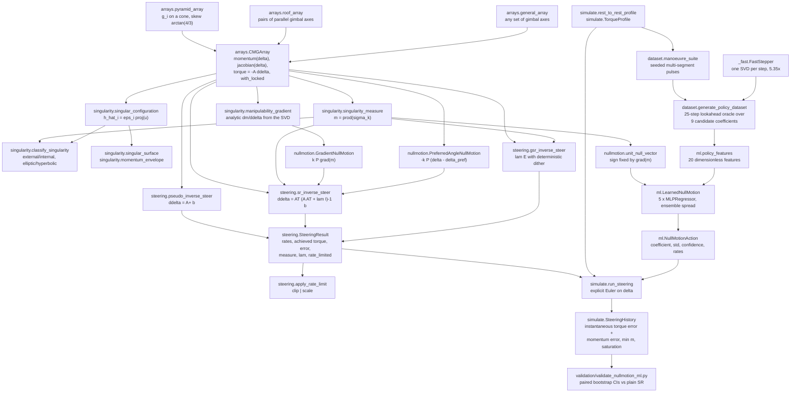
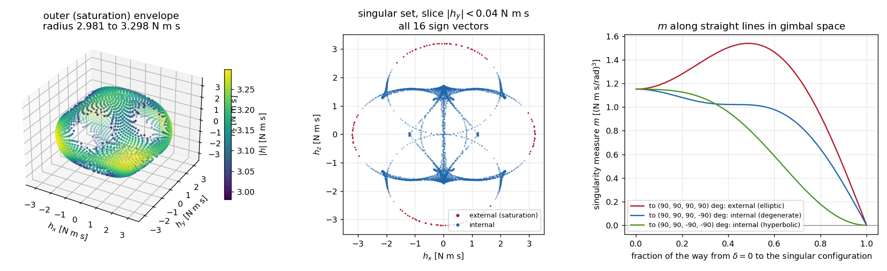
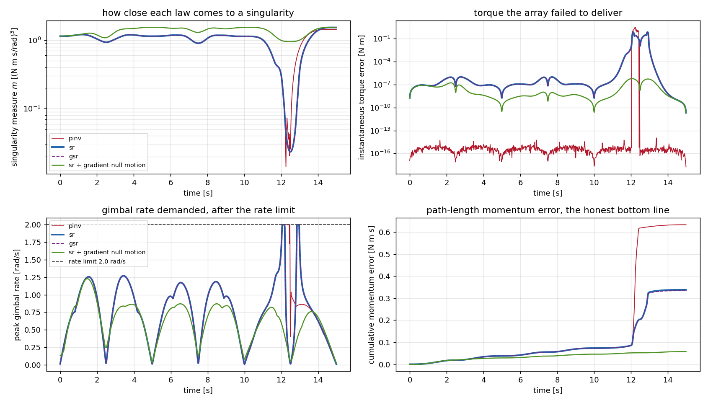
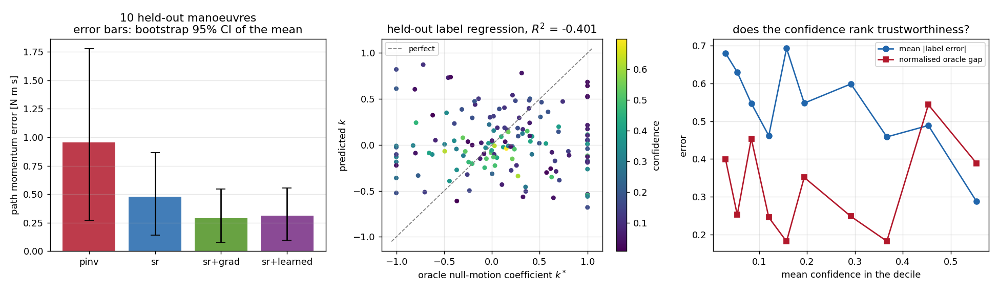

# CMGSteer

Control-moment-gyro array geometry, singularity analysis and steering laws.


**Status:** TESTING · **Class:** flagship · **Validation level:** 3 · **AI:** yes

## The problem

Control-moment gyros give you large torque for very little power, and then trap
you in gimbal configurations where the array cannot produce torque along some
direction at all. The steering law — how you turn a three-vector torque command
into four gimbal rates when there is a spare degree of freedom and a singular
set in the way — is the whole engineering problem, and choosing one badly shows
up as a pointing error you cannot explain. Everyone re-derives the same
pseudo-inverse, discovers it demands 10 000 rad/s near a singularity, adds a
damping term, and has no way to say how much torque that damping just cost.

## What this does

- **Two array geometries and the momentum map behind them** — pyramid and roof,
  with the Jacobian `A = dh/ddelta` verified against central differences of the
  momentum map to a worst deviation of **4.06e-11 N·m·s/rad** (pyramid) and
  **4.24e-11** (roof) over 400 configurations, and the pyramid momentum map
  checked against the closed form quoted in the literature to **8.9e-16 N·m·s**.
- **The singular set, constructed rather than searched for** — given a body
  direction and a sign vector, the analytically singular configuration is
  returned in closed form; the numerical singularity measure there is at worst
  **1.0e-15** over 8000 constructed points, against a mean of 0.958 for random
  configurations. All 3200 classified points come out as the geometric theory
  requires: **every one of the 400 external singularities is elliptic**, and 64%
  of the internal ones are hyperbolic.
- **Four steering laws with their error accounted for** — the pseudo-inverse
  reproduces the commanded torque to **3.2e-14 N·m** away from a singularity;
  the singularity-robust inverse's torque error matches its closed-form SVD
  expression to **1.24e-14 N·m** across ten values of the robustness parameter
  spanning eleven decades; the generalised SR inverse reduces to the SR inverse
  at zero dither to **exactly 0**.
- **Failure behaviour that is measured, not assumed** — gimbal-rate saturation
  in clipping or direction-preserving mode, a locked gimbal that keeps its rotor
  momentum but loses its Jacobian column, and a diagnostic rather than a wrong
  answer when fewer than three gimbals remain free.
- **A learned null-motion policy, and the measurement that it does not help** —
  a scikit-learn ensemble trained to imitate a 25-step lookahead oracle. Its
  held-out label R² is **−0.094**, and over 16 held-out manoeuvres its
  closed-loop difference from plain SR-inverse steering is **indistinguishable
  from zero** on every metric, at **16.4× the runtime**. So is classical
  gradient null motion's.

## The headline result, up front

**The classical singularity-robust inverse wins.** On this benchmark, neither
the learned null-motion policy nor classical gradient null motion produced a
difference from plain SR steering whose bootstrap 95% interval excluded zero —
on path momentum error, net momentum error or minimum singularity measure. The
only distinguishable difference is that the unregularised pseudo-inverse is
**worse**. If you came here for a learned steering law that beats the textbook,
it is not here, and §"The measured learned-versus-classical result" says so with
the intervals.

## Who this is for

- Anyone sizing or implementing a CMG array who wants the singular set of their
  geometry as a computed object rather than as a figure in a paper.
- Anyone choosing between pseudo-inverse, SR, generalised SR and null motion who
  wants the torque each one actually fails to deliver, as a number.
- Anyone about to put a learned policy in a CMG steering loop who wants a
  properly implemented classical baseline to beat first, and a measured example
  of how that comparison can go.

## Who this is not for

- Anyone needing a spacecraft simulation. There is no attitude state, no
  controller, no orbit, no disturbance, no closed loop. Use Basilisk.
- Anyone needing double-gimbal or variable-speed CMGs. Single-gimbal at constant
  rotor speed only, everywhere.
- Anyone needing gimbal dynamics — rate-servo lag, gimbal inertia, friction,
  backlash, rate quantisation, travel limits. None of it is modelled, and the
  commanded rate is assumed to be achieved instantly.
- Anyone needing a *global* steering law: singularity-avoidance path planning,
  inverse kinematics over a whole manoeuvre, or preferred-trajectory design.
  Everything here is local and instantaneous.
- Anyone who needs the learned policy to be useful. It is not; see below.

## Alternatives, honestly

Every entry was checked to exist as described, on PyPI or GitHub, in
September 2026.

| Alternative | What it does better | When to use it instead |
|---|---|---|
| [Basilisk](https://github.com/AVSLab/basilisk) (AVS Lab / LASP, ISC) | A full spacecraft mission simulation in C/C++ with a Python interface. Its dynamics tree has `vscmgStateEffector`, and `fswAlgorithms/effectorInterfaces` ships `vscmgVelocitySteering` (a velocity-based VSCMG steering law using a weighted pseudo-inverse whose weights adapt on a singularity-proximity measure, following Schaub & Junkins) and `vscmgGimbalRateServo`. | For anything closed-loop, or if you want steering embedded in a simulation that also propagates the vehicle. It is the most serious open-source prior art for this product's subject. Note it targets *variable-speed* CMGs, is built from source, and the PyPI package named `basilisk` is an unrelated object-NoSQL mapper. |
| [`siddharthdeore/vscmg-cpp`](https://github.com/siddharthdeore/vscmg-cpp) ("ADCS Toolbox", C++14 + Eigen + Boost, with a `pyadcs` Python extension) | A thesis-derived attitude dynamics and control toolbox with a VSCMG system and a rigid-body and four-reaction-wheel system, integrated with Boost ODE. | If you want VSCMG *dynamics* in a compiled toolbox and are willing to build it. It is a systems simulator, not a singularity-analysis library. |
| [`42`](https://github.com/ericstoneking/42) (NASA GSFC, Eric Stoneking) | A mature, widely used attitude-control simulator: multi-body flexible dynamics, multiple spacecraft, full environment, visualisation. | For attitude control system design and validation generally. It has **no CMG actuator model** — CMGs appear only as a constant `EmbeddedMom` term in the body definition — so a steering law still has to be written. |
| [`numpy.linalg.pinv`](https://numpy.org/doc/stable/reference/generated/numpy.linalg.pinv.html) / [`scipy.linalg`](https://docs.scipy.org/doc/scipy/reference/linalg.html) | Mature, tuned linear algebra. **CMGSteer calls them**; it does not implement an SVD. | If you already have `A` and only want `A⁺ tau`, that is one call. Everything here is the geometry, the classification and the error accounting around that call. |
| MATLAB and vendor GNC toolchains | Where most production CMG steering actually lives, with hardware models and flight heritage behind it. | If you have the licence and the toolbox. This is the honest reason open-source options are thin. |

**The scarcity claim, checked rather than asserted.** On 2026-09-02 the PyPI
names `cmgsteer`, `controlmomentgyro`, `pycmg` and `cmgpy` all returned HTTP 404;
the name `cmg` is taken by an unrelated C++ model-generation tool. Searching
GitHub for CMG steering implementations turned up the Basilisk modules above and
one thesis C++ repository. So the claim this README makes is narrow and
defensible: **there is prior art, it lives inside simulators and in C++, and
there is no maintained Python library whose subject is the SGCMG singular set
and the steering laws over it.** That is the gap CMGSteer fills. It is not a
claim to be alone in the field, and if you want a simulator you should take
Basilisk.

## Install and first run

```bash
git clone https://github.com/OmAcharya-avtr/cmgsteer.git
cd cmgsteer
python -m venv .venv && source .venv/bin/activate
pip install -e ".[test]"
python -m pytest tests/ -q
python examples/singularity_surfaces.py
```

Expected output of the test run:

```
........................................................................ [ 25%]
........................................................................ [ 50%]
........................................................................ [ 75%]
.....................................................................    [100%]
285 passed, 8 warnings in 60.29s
```

The eight warnings are scikit-learn `ConvergenceWarning`s from MLP members that
reach `max_iter` in the deliberately short-trained test fixtures. They are
expected.

Expected output of the example:

```
saved .../cmgsteer/screenshots/singularity_surfaces.png
envelope radius min 2.981419205 max 3.298471348 N*m*s
capacity sum(h0) 4.000000 N*m*s
m at delta = 0 1.152000000
```

There is also a command-line entry point, which exits 1 when the commanded
torque cannot be met:

```console
$ python -m cmgsteer singularity --direction 0.2 0.3 0.9 --signs 1 1 -1 -1
gimbal angles [deg]      : [  63.434949  110.323137  -70.346176 -102.528808]
momentum [N*m*s]         : [-0.971317564 -1.037484294 -0.068602416]
singularity measure m    : 3.245972480e-16
sigma_min [N*m*s/rad]    : 1.637867430e-16
condition number         : 9.196816e+15
singular (tol=1e-08)     : True
kind                     : internal
passability              : hyperbolic
singular direction u     : [0.206284 0.309426 0.928279]
signs eps_i              : [ 1.  1. -1. -1.]
rank of A                : 2

$ python -m cmgsteer steer --deltas 90 90 90 90 --torque 0 0 0.1 --method sr --lam 0.01
config=pyramid method=sr
  gimbal angles [deg]      : [90. 90. 90. 90.]
  commanded torque [N*m]   : [0.  0.  0.1]
  achieved torque [N*m]    : [-0.000000e+00 -0.000000e+00  9.598463e-32]
  torque error norm [N*m]  : 1.000000e-01
  gimbal rates [rad/s]     : [-4.898587e-16 -4.898587e-16 -4.898587e-16 -4.898587e-16]
  singularity measure m    : 1.95943488e-16
  sigma_min                : 9.797174e-17
  lam used                 : 1.000000e-02
  rate limited             : False (0 gimbals)
  note                     : torque error 1.000000e-01 N*m exceeds the 1e-06 N*m tolerance
$ echo $?
1
```

That transcript is the design in one screen: the array is at its +z saturation
singularity, the commanded torque is along exactly the direction it has lost,
the SR inverse returns a finite gimbal rate rather than a division by zero, the
whole of the command is reported as error, and the exit code says so.

## Engineering theory

All vectors are in the spacecraft **body frame**, right-handed, with the
active-rotation convention of QuatKit (P007). Sources: Margulies & Aubrun
(1978), Bedrossian et al. (1990), Wie (2008), Kurokawa (2007).

A single-gimbal CMG `i` has a body-fixed gimbal axis `g_i`, a reference axis
`c_i` perpendicular to it (the rotor momentum direction at zero gimbal angle),
a transverse axis `s_i = g_i × c_i`, and a constant rotor momentum `h0_i`
[N·m·s].

| Quantity | Expression | Units | Assumptions and validity |
|---|---|---|---|
| Rotor momentum direction | `h_hat_i(d) = c_i cos d + s_i sin d` | — | Exact; constant rotor speed |
| Array momentum | `h(delta) = Σ_i h0_i h_hat_i(delta_i)` | N·m·s | Exact for any gimbal angle; rigid gimbals, no flexibility |
| Jacobian | `A[:, i] = h0_i (g_i × h_hat_i)` | N·m·s/rad | Exact derivative of `h`; verified to 4.1e-11 against central differences |
| Body torque | `tau = -A(delta) ddelta/dt` | N·m | Rigid vehicle, no external torque; the sign is the reaction on the vehicle |
| Singularity measure | `m = sqrt(det(A Aᵀ)) = σ₁σ₂σ₃` | (N·m·s/rad)³ | Yoshikawa (1985); computed as a product of singular values, which is better conditioned at `m = 0` |
| Pseudo-inverse | `ddelta = Aᵀ(A Aᵀ)⁻¹ b`, `b = -tau` | rad/s | Exact where `A` has rank 3; rate grows as `1/m` |
| SR inverse | `ddelta = Aᵀ(A Aᵀ + λI)⁻¹ b` | rad/s | Nakamura & Hanafusa (1986); never exact for `λ > 0` |
| SR torque error | `tau_err = Σ_k [λ/(σ_k²+λ)] (u_k · tau) u_k` | N·m | Exact closed form; verified to 1.24e-14 |
| GSR inverse | `ddelta = Aᵀ(A Aᵀ + λE)⁻¹ b`, `E` unit-diagonal with dither `e_i = ε₀ sin(ωt + φ_i)` | rad/s | Wie, Bailey & Heiberg (2001); reduces exactly to SR at `ε₀ = 0` |
| Adaptive robustness | `λ = λ₀ h0² exp(-μ m / h0³)` | (N·m·s/rad)² | Standard exponential form, non-dimensionalised by the mean rotor momentum so `λ₀` and `μ` are dimensionless |
| Null motion | `ddelta_null ∈ null(A)`; gradient policy `k P grad(m)` | rad/s | Yoshikawa (1985); Bedrossian et al. (1990). One-dimensional for four healthy gimbals away from a singularity |
| Singular configuration | `h_hat_i = ε_i · normalise(u - (u·g_i) g_i)` | rad | Margulies & Aubrun (1978); gives `uᵀA = 0` exactly. Undefined when `u` is parallel to a gimbal axis |
| Classification | external iff all `ε_i` equal; elliptic iff `Nᵀ diag(h0 ε) N` is definite | — | Second-order expansion of `h·u` on `null(A)`; degenerate when an eigenvalue vanishes |

Two accountings of the delivered torque are kept, because they answer different
questions. The **instantaneous torque error** `tau_cmd - tau_achieved` is the
steering law's own error and is what the SR closed form predicts. The
**momentum error** `(-tau dt) - (h_next - h)` is what the vehicle feels and
additionally contains the first-order error of the explicit Euler gimbal update,
which is why halving `dt` halves it.

## A worked example

```python
import numpy as np
from cmgsteer import (
    GradientNullMotion, classify_singularity, manoeuvre_suite, pyramid_array,
    run_steering, singular_configuration, singularity_measure,
    sr_inverse_steer, sr_torque_error_closed_form,
)

array = pyramid_array()                       # 4 CMGs, skew arctan(4/3), h0 = 1 N m s
print(f"{array.n_cmgs} CMGs, capacity {array.total_momentum_capacity:.1f} N m s, "
      f"m at delta=0 = {singularity_measure(array.jacobian(np.zeros(4))):.6f}")

# An analytically singular configuration: rotors as aligned with +z as their gimbals allow
d_sing = singular_configuration(array, [0.0, 0.0, 1.0])
info = classify_singularity(array, d_sing)
print(f"delta = {np.degrees(d_sing)} deg -> m = {info.measure:.3e}, "
      f"{info.kind}/{info.passability}, h = {info.momentum} N m s")

# Steer 1 degree short of it: the SR inverse trades torque error for a bounded rate
d = d_sing - np.radians(1.0)
tau = np.array([0.0, 0.0, 0.10])                                   # N m, along the lost axis
for lam in (1e-8, 1e-3):
    r = sr_inverse_steer(array, d, tau, lam=lam)
    closed = np.linalg.norm(sr_torque_error_closed_form(array.jacobian(d), tau, lam))
    print(f"lam={lam:.0e}: |err| {r.torque_error_norm:.6e} N m (closed form {closed:.6e}), "
          f"peak rate {np.max(np.abs(r.gimbal_rates)):.3f} rad/s")

# A whole three-segment manoeuvre from the seeded suite, with and without null motion
suite = manoeuvre_suite(array, 1, seed=20260902, n_segments=3, segment_duration=5.0, dt=0.02)
profile, start = suite.profiles[0], suite.initial_deltas[0]
for method, policy in (("pinv", None), ("sr", None),
                       ("sr", GradientNullMotion(gain=1.0, max_rate=0.5))):
    h = run_steering(array, start, profile, method=method,
                     null_policy=policy, max_gimbal_rate=2.0)
    print(f"{method:>4} + {h.policy:<8}: path err {h.total_momentum_error_path:.4e} N m s, "
          f"min m {h.min_measure:.4f}, saturated {h.n_rate_limited}/{profile.n_steps}")
```

Printed output, in about seven seconds:

```
4 CMGs, capacity 4.0 N m s, m at delta=0 = 1.152000
delta = [90. 90. 90. 90.] deg -> m = 1.959e-16, external/elliptic, h = [1.11022302e-16 0.00000000e+00 3.20000000e+00] N m s
lam=1e-08: |err| 1.282460e-06 N m (closed form 1.282460e-06), peak rate 1.791 rad/s
lam=1e-03: |err| 5.618794e-02 N m (closed form 5.618794e-02), peak rate 0.784 rad/s
pinv + none    : path err 6.3357e-01 N m s, min m 0.0141, saturated 21/750
  sr + none    : path err 3.3791e-01 N m s, min m 0.0234, saturated 14/750
  sr + gradient: path err 5.7578e-02 N m s, min m 0.9482, saturated 0/750
```

Read the last three lines carefully, because they are the reason the benchmark
further down needs confidence intervals. On **this** manoeuvre the gradient
policy keeps the array 40× further from the singular set (min `m` 0.9482 against
0.0234), avoids the rate limit entirely, and cuts the path momentum error by
83%. Over 16 manoeuvres that advantage averages 7% and its 95% interval contains
zero. One good trajectory is not a result.

## Architecture



`_fast.FastStepper` exists only because dataset generation runs a quarter of a
million steering steps: it derives the SR rates, the measure, the null vector
and the manipulability gradient from a single SVD instead of three, and
`tests/test_dataset.py::TestFastStepperAgreement` pins it to the public path at
1e-15.

## Screenshots

All three figures are produced by the scripts in `examples/`, so they cannot
drift from the code.



Notice the middle panel. Each blue curve is one internal singular surface — one
of the fourteen mixed sign vectors — sliced at `|h_y| < 0.04 N·m·s`, and the red
ring is the saturation envelope. The internal surfaces reach in to within
**0.034 N·m·s of the origin**: an array holding almost no momentum is not
therefore far from a singularity. The right panel is why the classification
matters: the measure falls to zero along all three paths, but the red path ends
at a saturation singularity that no null motion can leave with its momentum
intact, and the green one ends at a hyperbolic internal singularity that null
motion can pass through.



Notice that the blue (`sr`) and purple dashed (`gsr`) curves lie on top of each
other in every panel — that overlap is a result, not a plotting accident: the
generalised SR dither only matters when the array is held *on* a singular
surface, and this manoeuvre passes through one. At `t ≈ 12 s` the measure drops
two decades; the pseudo-inverse (red) demands more than the 2 rad/s rate limit,
saturates, and its cumulative momentum error steps from 0.09 to 0.63 N·m·s in a
second. The green curve is SR with gradient null motion, which avoids the
approach altogether on this trajectory.



Notice the error bars in the left panel: `sr`, `sr+grad` and `sr+learned`
overlap almost completely, and only `pinv` separates. The middle panel is the
finding — the predicted coefficient is nearly uncorrelated with the oracle's,
with a negative R², and the vertical stripes at `k* = ±1` are the 18% of labels
that saturate the candidate grid. The right panel shows a confidence output
that does not rank trustworthiness: the label error trends down weakly, and the
oracle gap does not order at all. This figure is a reduced-size rerun of
validation 5, so read its shape, not its exact values.

## Validation evidence

Level 3. Scripts and their saved raw stdout are in
[`validation/`](validation/); the full discussion is in
[`validation/VALIDATION.md`](validation/VALIDATION.md), and the numbered
requirements and their verification matrix are in
[`docs/REQUIREMENTS.md`](docs/REQUIREMENTS.md).

| Check | Script / reference | Result | Tolerance | Outcome |
|---|---|---:|---:|---|
| Pyramid Jacobian vs central differences, 400 configurations, step 1e-5 | `validate_jacobian.py` §1 | 4.061274e-11 N·m·s/rad | 1e-8 | PASS |
| Roof Jacobian vs central differences | `validate_jacobian.py` §1 | 4.238054e-11 N·m·s/rad | 1e-8 | PASS |
| Manipulability gradient vs central differences | `validate_jacobian.py` §2 | 1.058439e-09 | 1e-7 | PASS |
| Pyramid momentum map vs the published closed form, 2000 configurations | `validate_jacobian.py` §3 | 8.881784e-16 N·m·s | 1e-13 | PASS |
| Torque convention `tau = -A ddelta`, 2000 pairs | `validate_jacobian.py` §4 | 0.000000e+00 N·m | 1e-13 | PASS |
| `m` on 8000 analytic singular configurations, pyramid | `validate_singularity.py` §1 | 1.009474e-15 | 1e-13 | PASS |
| `m` on 8000 analytic singular configurations, roof | `validate_singularity.py` §1 | 9.936793e-16 | 1e-13 | PASS |
| Hand-computed `h` at (90,90,90,90)° = (0, 0, 3.2) and at (90,90,90,−90)° = (0, −1.2, 1.6) | `validate_singularity.py` §4 | 4.440892e-16 N·m·s | 1e-12 | PASS |
| `m` at `delta = 0` vs `sqrt(0.72·0.72·2.56) = 1.152` by hand | `validate_singularity.py` §4 | 1.152000000000001 | 1e-13 | PASS |
| All 400 external singularities classified elliptic | `validate_singularity.py` §3 | 400/400 | exact | PASS |
| Pseudo-inverse exactness, `m ≥ 0.1`, 2389 states | `validate_steering.py` §1 | 3.204519e-14 N·m | 1e-12 | PASS |
| Pseudo-inverse in the band `m < 1e-4` | `validate_steering.py` §1 | 7.471545e-11 N·m at 9.9e3 rad/s | — | **degrades, as it must** |
| SR torque error vs closed form, 10 values of λ × 200 states, pyramid | `validate_steering.py` §2 | 1.240235e-14 N·m | 1e-13 | PASS |
| SR torque error vs closed form, roof | `validate_steering.py` §2 | 4.430958e-14 N·m | 1e-13 | PASS |
| GSR reduces to SR at zero dither, 500 states | `validate_steering.py` §5 | 0.000000e+00 rad/s | 1e-13 | PASS |
| Angle-error Monte Carlo vs first order, 30 states × 200 trials | `validate_uncertainty.py` §1 | ratio 0.9923 | \|ratio−1\| < 0.05 | PASS |
| Rotor-momentum-error Monte Carlo vs first order | `validate_uncertainty.py` §2 | ratio 0.9982 | \|ratio−1\| < 0.05 | PASS |
| Measure sensitivity `σ_m = \|grad m\|σ` | `validate_uncertainty.py` §3 | ratio 0.9774 | \|ratio−1\| < 0.05 | PASS |
| Momentum error is first order in `dt`, five step sizes | `validate_steering.py` §6 · `tests/test_simulate.py` | ratios 2.0060, 2.0030, 2.0015, 2.0007 | [1.8, 2.2] | PASS |
| Learned policy held-out label R² | `validate_nullmotion_ml.py` §3 | **−0.093894** | — | **worse than the mean predictor** |
| Learned policy vs plain SR, path momentum error, 16 manoeuvres | `validate_nullmotion_ml.py` §5 | −2.59%, CI [−2.30e−01, +2.35e−01] | — | **indistinguishable** |
| Gradient null motion vs plain SR, path momentum error | `validate_nullmotion_ml.py` §5 | −7.12%, CI [−2.09e−01, +1.63e−01] | — | **indistinguishable** |
| Learned policy vs plain SR, net momentum error | `validate_nullmotion_ml.py` §5 | +34.2%, CI [−4.27e−02, +2.20e−01] | — | **indistinguishable** |
| Pseudo-inverse vs plain SR, path momentum error | `validate_nullmotion_ml.py` §5 | +49.8%, CI [+7.78e−02, +4.48e−01] | — | **SR wins, distinguishably** |
| Confidence vs label error, Pearson r | `validate_nullmotion_ml.py` §4 | −0.1661, non-monotone deciles | — | **not usable** |
| Learned policy runtime per step | `validate_nullmotion_ml.py` §6 | 4233.1 µs vs 258.3 µs | — | **SR wins, 16.4×** |
| Bounds and identities over random geometry | `tests/test_properties.py`, Hypothesis | 12 property tests, 0 falsifying examples | — | PASS |

**A defect this validation found.** The first draft of the uncertainty study
pooled the Monte Carlo torque errors across all states and compared their rms
with the *mean* of the per-state first-order predictions. Because the gimbal
rate varies by orders of magnitude across states, that comparison is
systematically biased upward by Jensen's inequality, and it reported a ratio of
2.15 where the model is in fact correct to better than 1%. The ratios are now
formed per state and then aggregated. The defect is recorded in
`validation/VALIDATION.md` rather than silently fixed.

## The measured learned-versus-classical result

Trained and evaluated once, on fixed seeds, and reported as it came out. The
classical laws were implemented and validated first (validations 1–4); the
model's labels are the output of a lookahead oracle built on top of them.
900 training states (seed 1234), 300 held-out states (seed 5678), 16 held-out
benchmark manoeuvres (seed 9012), 5 × `MLPRegressor(64, 32)`, `random_state=0`,
no hyperparameter search. Source:
[`validation/nullmotion_ml_output.txt`](validation/nullmotion_ml_output.txt),
interpretation in [`MODEL_CARD.md`](MODEL_CARD.md) §7–§9.

**What the oracle is worth at all.** With 25 steps of perfect foresight, the
best available null-motion coefficient reduces the horizon momentum error by
**22.66%** (train) and **23.19%** (test). That is the ceiling. Classical
gradient null motion captures 8.92% of it on the same objective.

**Label-level accuracy on the held-out set:**

| Quantity | Value |
|---|---:|
| Mean absolute error | 0.492465 |
| RMS error | 0.623504 |
| Label standard deviation | 0.596145 |
| **R²** | **−0.093894** |
| Sign agreement with the oracle | 0.5833 |
| Fraction of the oracle gain captured | 44.98% |
| States where the policy is worse than doing nothing | 52.33% |

**Closed-loop benchmark, 16 manoeuvres × 900 steps, 2 rad/s rate limit:**

| Configuration | Path err [N·m·s] | Net err [N·m·s] | Min `m` | µs/step |
|---|---:|---:|---:|---:|
| pinv | 7.371954e-01 | 2.900413e-01 | 0.256271 | 271.2 |
| **sr** | **4.921487e-01** | **2.181053e-01** | 0.260340 | **258.3** |
| gsr | 4.920096e-01 | 2.192314e-01 | 0.260342 | 265.1 |
| sr+grad | 4.571102e-01 | 3.025358e-01 | 0.234056 | 707.6 |
| sr+learned | 4.793887e-01 | 2.926328e-01 | 0.230814 | 4233.1 |

| Comparison vs plain SR | Mean difference | Bootstrap 95% CI | Verdict |
|---|---:|---|---|
| pinv, path error | +2.450466e-01 | [+7.7848e-02, +4.4834e-01] | **worse than SR** |
| pinv, net error | +7.193604e-02 | [+1.7733e-02, +1.4087e-01] | **worse than SR** |
| sr+grad, path error | −3.503851e-02 | [−2.0949e-01, +1.6292e-01] | indistinguishable |
| sr+grad, net error | +8.443053e-02 | [−9.5878e-03, +2.1718e-01] | indistinguishable |
| sr+learned, path error | −1.276004e-02 | [−2.2962e-01, +2.3460e-01] | indistinguishable |
| sr+learned, net error | +7.452750e-02 | [−4.2746e-02, +2.2013e-01] | indistinguishable |
| sr+learned, min measure | −2.952585e-02 | [−1.3701e-01, +6.8000e-02] | indistinguishable |

Read against the expectation this benchmark was set up to test:

- **Nothing beats the singularity-robust inverse distinguishably.** Both
  null-motion policies lower the mean path momentum error and both raise the
  mean net momentum error and lower the minimum singularity measure; not one of
  those six differences has an interval excluding zero over 16 manoeuvres. The
  point estimates favour the classical gradient policy over the learned one
  (−7.12% against −2.59% on path error), and that difference is smaller than
  either interval, so it is not a finding either.
- **The one distinguishable difference is the classical result, reproduced.**
  The unregularised pseudo-inverse is worse than the SR inverse on all three
  metrics with intervals excluding zero: +49.8% path momentum error, +33.0% net
  momentum error, and a lower minimum measure. That is what the SR inverse is
  for, and it is what the benchmark confirms.
- **The learned policy's regression genuinely fails.** R² = −0.094 is worse
  than predicting the training mean. The oracle label depends on the next 25
  commanded torques, which the policy's features do not contain and cannot
  contain, so a large part of the target is unpredictable in principle from the
  observed state. That it still captures 45% of the mean oracle gain says the
  objective is flat near its optimum, not that the model is good.
- **The confidence output is not usable.** r(confidence, label error) = −0.166,
  the deciles are non-monotone, and the ensemble spread is 0.287 of the rms
  error, so it understates the error by about 71%. It must not be used as a
  variance or as a gate.
- **The cost is 16.4×.** Five scikit-learn `predict` calls on one sample
  dominate, and a sequential control loop cannot batch them. On this problem
  there is no operating point where the learned policy is the right engineering
  choice.
- **What would have to change.** The training distribution is isotropic,
  uncorrelated manoeuvre axes, which no real mission profile is; an anticipating
  policy would have far more to exploit against a correlated command sequence,
  and 23% oracle headroom is the number a better attempt has to beat. A
  reinforcement-learning formulation over the closed-loop objective, rather than
  behaviour cloning of a horizon oracle, is the obvious next thing to try and
  needs a framework this environment does not have.

## Configuration

Everything is a constructor or call argument; there are no configuration files
and no environment variables.

| Setting | Default | Where |
|---|---|---|
| Skew angle | `arctan(4/3)` = 53.13010235 deg (pyramid), 45 deg (roof) | `pyramid_array`, `roof_array` |
| Rotor momentum `h0` | 1.0 N·m·s | `pyramid_array`, `roof_array`, `general_array` |
| SR robustness | `lam0 = 0.01`, `mu = 10.0`, or an absolute `lam` | `sr_inverse_steer`, `gsr_inverse_steer` |
| GSR dither | `eps0 = 0.01`, `omega = pi/2` rad/s, phases `(0, pi/2, pi)` | `gsr_inverse_steer` |
| Gimbal-rate limit | `None`; `saturation_mode` `"clip"` or `"scale"` | every steering law, `run_steering` |
| Singularity tolerance | 1e-8 relative (`sigma_min <= tol * sigma_max`) | `classify_singularity` |
| Null-motion rate cap | 0.5 rad/s | `GradientNullMotion`, `LearnedNullMotion` |
| Oracle horizon / candidates | 25 steps / 9 coefficients | `generate_policy_dataset` |

## Benchmark results

`validation/validate_performance.py`; full tables in
[`validation/performance_output.txt`](validation/performance_output.txt).

| Operation | µs per call | Calls per second |
|---|---:|---:|
| `array.momentum` | 92.71 | 10 786 |
| `array.jacobian` | 112.37 | 8 899 |
| `singularity_measure` | 36.76 | 27 207 |
| `manipulability_gradient` | 456.91 | 2 189 |
| `unit_null_vector` | 705.61 | 1 417 |
| `classify_singularity` | 519.11 | 1 926 |
| `pseudo_inverse_steer` | 554.96 | 1 802 |
| `sr_inverse_steer` | 517.83 | 1 931 |
| `gsr_inverse_steer` | 539.30 | 1 854 |
| `GradientNullMotion.rates` | 533.49 | 1 874 |
| `LearnedNullMotion.rates` | 3234.94 | 309 |

Cost is flat in array size from 4 to 16 CMGs (`sr_inverse_steer` 536 µs at
n = 4, 526 µs at n = 16): the work is Python and NumPy call overhead on 3×n
matrices, not arithmetic, so a larger array is free and a faster loop needs
vectorisation across states rather than a smaller array. A 1000-step run takes
0.54 s (pseudo-inverse) to 1.12 s (SR with gradient null motion). Mapping the
momentum envelope costs 257 µs per point. The fused single-SVD rollout path used
by dataset generation is 5.35× faster than the public path and agrees with it to
1e-15.

## Hardware requirements

2 x86-64 CPU cores, no GPU, about 300 MB of RAM. The full test suite takes 60 s,
the six validation scripts 212 s in total, of which the training-and-benchmark
script is 125 s. PyTorch is not used and not required. A recorded steering run
costs 249 bytes per step, so a million-step run is 250 MB and should be chunked.

## API reference

<details>
<summary>Public surface, one line each</summary>

**`cmgsteer.arrays`** — geometry and the momentum map. Body frame throughout;
`torque` always means the torque delivered *to the vehicle*, `-A ddelta`.

| Symbol | Description |
|---|---|
| `CMGArray(gimbal_axes, ref_axes, rotor_momenta, names, locked)` | The core object. `(n, 3)` unit axes, `(n,)` rotor momenta [N·m·s], `(n,)` boolean `locked` mask. |
| `.n_cmgs` / `.n_free` / `.free_indices` / `.transverse_axes` | Counts; indices of movable gimbals; `s_i = g_i × c_i`. |
| `.total_momentum_capacity` | `sum(h0_i)` [N·m·s]. |
| `.rotor_directions(deltas)` | `(n, 3)` unit `h_hat_i(delta_i)`. |
| `.momentum(deltas)` | `h(delta)` [N·m·s]. |
| `.jacobian(deltas, free_only=True)` | `A` [N·m·s/rad], `(3, n_free)` or `(3, n)`. |
| `.torque(deltas, gimbal_rates)` | `-A ddelta` [N·m]; accepts free-length or full-length rates. |
| `.expand_rates(gimbal_rates)` | Scatter a free-length rate vector into a full-length one. |
| `.with_locked(indices)` | Copy with those gimbals frozen; momentum kept, Jacobian column removed. |
| `.summary()` | One line per CMG, as text. |
| `pyramid_array(skew_angle_deg, rotor_momentum, n_cmgs=4)` | The classical pyramid; default skew `STANDARD_PYRAMID_SKEW_DEG` = 53.13010235 deg. |
| `roof_array(skew_angle_deg=45, rotor_momentum, n_pairs=2)` | Pairs of parallel gimbal axes; rank-deficient at `delta = 0` by construction. |
| `general_array(gimbal_axes, ref_axes=None, rotor_momentum, names)` | Any geometry; `ref_axes=None` picks a deterministic perpendicular. |

**`cmgsteer.singularity`** — the singular set.

| Symbol | Description |
|---|---|
| `singularity_measure(jacobian)` | `m = sqrt(det(A Aᵀ))` [(N·m·s/rad)³], as `prod(sigma_k)`. |
| `min_singular_value(jacobian)` / `condition_number(jacobian)` | `sigma_min` [N·m·s/rad]; `sigma_max/sigma_min`. |
| `singular_direction(jacobian)` | Unit body direction of least torque authority. |
| `null_space_basis(jacobian, tol=None)` | Orthonormal `(n, n-rank)` basis of `null(A)`. |
| `manipulability_gradient(array, deltas)` | Analytic `dm/ddelta`, finite at `m = 0`. |
| `singular_configuration(array, direction, signs=None, tol=1e-9)` | Gimbal angles of an analytically singular configuration. |
| `classify_singularity(array, deltas, tol=1e-8)` | `SingularityInfo`: measure, `sigma_min`, condition number, `singular`, `kind`, `passability`, `direction`, `signs`, `momentum`, `rank`. |
| `fibonacci_directions(n_points)` | `(n, 3)` near-uniform unit vectors. |
| `singular_surface(array, signs=None, n_points, directions=None)` | `(momenta, gimbal_angles)` on one singular surface. |
| `momentum_envelope(array, n_points)` | The all-positive case: the saturation envelope. |

**`cmgsteer.steering`** — the laws. All take `(array, deltas, torque)` and
return a `SteeringResult`.

| Symbol | Description |
|---|---|
| `SteeringResult` | `gimbal_rates`, `unlimited_rates`, `commanded_torque`, `achieved_torque`, `torque_error`, `torque_error_norm` [N·m], `measure`, `min_singular_value`, `lam`, `method`, `rate_limited`, `n_rate_limited`, `null_rates`, `extras`. |
| `pseudo_inverse_steer(array, deltas, torque, null_rates, max_gimbal_rate, saturation_mode)` | `A⁺ b`. Exact away from a singularity, unbounded at one. |
| `sr_inverse_steer(..., lam=None, lam0=0.01, mu=10.0, ...)` | `Aᵀ(A Aᵀ + λI)⁻¹ b`. `lam=None` uses the adaptive form. |
| `gsr_inverse_steer(..., time, eps0=0.01, omega, phases, ...)` | `Aᵀ(A Aᵀ + λE)⁻¹ b` with deterministic dither. |
| `sr_torque_error_closed_form(jacobian, torque, lam)` | The exact SVD expression the SR error must satisfy. |
| `robustness_parameter(array, measure, lam0, mu)` | `λ = λ₀ h0² exp(-μ m / h0³)` [(N·m·s/rad)²]. |
| `apply_rate_limit(rates, max_rate, mode="clip")` | `(limited_rates, n_changed)`; `"scale"` preserves torque direction. |
| `steer(array, deltas, torque, method="sr", **kw)` | Dispatch over `METHODS = ("pinv", "sr", "gsr")`. |

**`cmgsteer.nullmotion`** — reconfiguration.

| Symbol | Description |
|---|---|
| `null_projector(array, deltas)` | `P = N Nᵀ`, `(n_free, n_free)`. |
| `unit_null_vector(array, deltas, align_with_gradient=True)` | Signed unit null vector; raises unless `null(A)` is one-dimensional. |
| `null_motion_from_coefficients(array, deltas, coefficients, scale)` | Null rates from basis coefficients [rad/s]. |
| `NullMotionPolicy` | Interface: `.rates(array, deltas, torque, time)`, `.reset()`, `.name`. |
| `NoNullMotion()` | Zero. |
| `GradientNullMotion(gain, max_rate)` | `k P grad(m)`, capped by scaling so it stays in `null(A)`. |
| `PreferredAngleNullMotion(preferred, gain, max_rate)` | `-k P (delta - delta_pref)`, wrapped to `(-pi, pi]`. |

**`cmgsteer.simulate`** — profiles and runs.

| Symbol | Description |
|---|---|
| `TorqueProfile(torques, dt, name)` | `.n_steps`, `.duration`, `.momentum_change`, `.peak_momentum`. |
| `constant_profile(torque, duration, dt, name)` | A held command. |
| `rest_to_rest_profile(axis, momentum_change, duration, dt, shape="sine")` | Zero-net-momentum pulse; `"sine"` or `"bang-bang"`. |
| `run_steering(array, initial_deltas, profile, method, null_policy, max_gimbal_rate, saturation_mode, **law_kwargs)` | Returns a `SteeringHistory`. |
| `SteeringHistory` | `times`, `deltas`, `momentum`, `gimbal_rates`, `commanded_torque`, `achieved_torque`, `torque_error`, `momentum_error`, `measure`, `min_singular_value`, `lam`, `rate_limited`, `null_rates`; properties `max_torque_error`, `rms_torque_error`, `accumulated_momentum_error`, `total_momentum_error_path`, `min_measure`, `n_rate_limited`, `peak_gimbal_rate`, `steps_below_measure(t)`. |

**`cmgsteer.dataset` / `cmgsteer.ml`** — the AI element.

| Symbol | Description |
|---|---|
| `manoeuvre_suite(array, n_manoeuvres, seed, n_segments, segment_duration, dt, momentum_fraction, initial_spread, shape)` | Seeded suite of multi-segment rest-to-rest manoeuvres. |
| `rollout_score(array, deltas, torques, dt, coefficient, ...)` | Horizon momentum error [N·m·s] for a constant null coefficient. |
| `generate_policy_dataset(array, n_samples, seed, horizon, n_candidates, max_null_rate, stride, ...)` | `PolicyDataset`: `features`, `coefficients`, `candidate_scores`, `candidates`, `gradient_scores`, `zero_scores`, `best_scores`. |
| `policy_features(array, deltas, torque)` / `feature_names(n_free)` | The 20 dimensionless features and their names. |
| `LearnedNullMotion(max_null_rate, n_estimators, hidden_layer_sizes, alpha, max_iter, random_state, confidence_floor)` | Ensemble MLP policy; `.fit`, `.predict`, `.confidence`, `.act`, `.rates`. |
| `NullMotionAction` | `coefficient`, `std`, `confidence` in `[0,1]`, `rates` [rad/s]. |

**CLI** — `python -m cmgsteer {array,singularity,steer,manoeuvre}` with
`--config {pyramid,roof}`, `--skew`, `--rotor-momentum`, `--failed`,
`--deltas` (degrees). Exit 1 on a failed acceptance check, 2 on invalid input.

</details>

## Limitations

- **The learned null-motion policy does not work.** Held-out R² = −0.094, no
  distinguishable closed-loop improvement over plain SR steering on any metric,
  worse than doing nothing on 52% of individual states, and 16.4× the runtime.
  It is in this repository as a measured result, not as a recommended component.
- **Its confidence output is not calibrated and does not rank usefully.**
  r = −0.166 with non-monotone deciles; the ensemble spread understates the
  error by 71%.
- **Momentum error is first order in `dt`.** Gimbal angles are integrated by
  explicit Euler, so every absolute momentum-error number in this README depends
  on the 0.02 s step as much as on the steering law. Measured
  (`validate_steering.py` §6): 1.006766e-02 N·m·s at `dt = 0.1` s, falling by
  factors of 2.0060, 2.0030, 2.0015 and 2.0007 as `dt` halves to 6.257226e-04
  at `dt = 0.00625` s, while the instantaneous torque error stays at 6.7e-16
  N·m throughout. The instantaneous
  torque error is reported alongside it everywhere for that reason.
- **Open loop and instantaneous.** No attitude state, no controller, no orbit,
  no disturbance. Nothing here says anything about closed-loop stability, about
  chatter near a singular surface, or about switching steering law mid-flight.
- **No gimbal dynamics.** The commanded rate is assumed to be achieved exactly
  and instantly. No rate-servo lag, gimbal inertia, friction, backlash, rate
  quantisation or travel limits, so the reported torque error is a lower bound
  on a real system's.
- **Single-gimbal, constant rotor speed only.** Double-gimbal and variable-speed
  CMGs change the momentum map and every law built on it, and are out of scope.
- **Scalar null motion only.** `unit_null_vector` and the learned policy need a
  one-dimensional null space, so they raise or return zero for arrays with more
  than four free gimbals and at exact singularities. The projector and the
  classical policies handle the general case.
- **A CMG failure invalidates the learned policy entirely** — the feature vector
  length depends on the number of free gimbals — and leaves no null space at
  all, so all null-motion reconfiguration stops when the array degrades from
  four to three.
- **The momentum envelope is a point cloud**, not a polytope. There is no
  containment test and no volume; `momentum_envelope` costs about 257 µs per
  mapped point.
- **Near-degenerate geometry is tolerance-dependent.** `classify_singularity`
  decides singularity at `sigma_min <= 1e-8 sigma_max` and passability from
  eigenvalues at the same relative threshold; a configuration within about 1e-8
  of a second-order-degenerate singularity can be classified either way.
- **All ML data is synthetic**, from one array geometry, one rate limit, one
  pulse shape, isotropic uncorrelated axes and no failures. See
  [`DATASET_CARD.md`](DATASET_CARD.md).
- **Compute budget: 2 CPU cores, no GPU, no PyTorch.** A larger model or a
  reinforcement-learning formulation was not an option and might change the ML
  conclusions; it would not change the classical ones.

## Reproducing every number

From the repository root, with the package installed:

```bash
python -m pytest tests/ -q                          # 285 passed, ~60 s
ruff check src/ tests/                              # clean, line-length 100
python validation/validate_jacobian.py              # VALIDATION.md §1, ~10 s
python validation/validate_singularity.py           # §2, ~9 s
python validation/validate_steering.py              # §3, ~12 s
python validation/validate_uncertainty.py           # §4, ~19 s
python validation/validate_nullmotion_ml.py         # §5, ~125 s (trains the model)
python validation/validate_performance.py           # §6, ~37 s
python examples/singularity_surfaces.py             # screenshots/singularity_surfaces.png
python examples/steering_through_singularity.py     # screenshots/steering_comparison.png
python examples/learned_null_motion.py              # screenshots/learned_vs_classical.png
```

Seeds: validation 20260902 throughout §1–§4; ML training data 1234, test data
5678, benchmark suite 9012, bootstrap 4242, model `random_state=0`; regression
suite 20260902 and 4242. All randomness goes through `numpy.random.default_rng`
and scikit-learn's `random_state`. The reference run was Python 3.11.15,
numpy 2.4.4, scipy 1.17.1, scikit-learn 1.8.0, matplotlib 3.10.9 on 2 x86-64
cores. Last digits may move on a different BLAS; the conclusions do not — they
rest on confidence intervals several times wider than any plausible numerical
drift.

## Roadmap

Nothing below is promised; it is what the gaps are.

- Double-gimbal and variable-speed CMGs, which change the momentum map.
- A gimbal-rate servo model, so the commanded rate and the achieved rate differ.
- Momentum envelope as a polytope with a containment test and a volume.
- Global steering: singularity-avoidance path planning over a whole manoeuvre,
  against which the local laws here would be the baseline.
- A correlated, mission-like manoeuvre generator, which is where an anticipating
  null-motion policy would have something to exploit.
- Higher-order integration of the gimbal angles, to separate the steering error
  from the integration error completely.

## References

- Margulies, G., & Aubrun, J. N. (1978). Geometric theory of single-gimbal
  control moment gyro systems. *Journal of the Astronautical Sciences* 26(2).
  (The singular-set construction and the internal/external classification.)
- Yoshikawa, T. (1985). Manipulability of robotic mechanisms. *International
  Journal of Robotics Research* 4(2), 3.
  doi:[10.1177/027836498500400201](https://doi.org/10.1177/027836498500400201)
  (The measure `sqrt(det(A Aᵀ))` and its gradient.)
- Nakamura, Y., & Hanafusa, H. (1986). Inverse kinematic solutions with
  singularity robustness for robot manipulator control. *ASME Journal of
  Dynamic Systems, Measurement, and Control* 108(3), 163.
  doi:[10.1115/1.3143764](https://doi.org/10.1115/1.3143764)
  (The singularity-robust inverse.)
- Bedrossian, N. S., Paradiso, J., Bergmann, E. V., & Rowell, D. (1990).
  Steering law design for redundant single-gimbal control moment gyroscopes.
  *Journal of Guidance, Control, and Dynamics*.
  doi:[10.2514/3.20582](https://doi.org/10.2514/3.20582)
  (SR steering and gradient null motion for CMG arrays.)
- Vadali, S. R., Walker, S. R., & Oh, H.-S. (1990). Preferred gimbal angles for
  single gimbal control moment gyros. *Journal of Guidance, Control, and
  Dynamics*. doi:[10.2514/3.20583](https://doi.org/10.2514/3.20583)
  (Preferred-angle null motion.)
- Wie, B., Bailey, D., & Heiberg, C. (2001). Singularity robust steering logic
  for redundant single-gimbal control moment gyros. *Journal of Guidance,
  Control, and Dynamics*. doi:[10.2514/2.4799](https://doi.org/10.2514/2.4799)
  (The generalised SR inverse with off-diagonal dither.)
- Kurokawa, H. (2007). Survey of theory and steering laws of single-gimbal
  control moment gyros. *Journal of Guidance, Control, and Dynamics*.
  doi:[10.2514/1.27316](https://doi.org/10.2514/1.27316)
  (Array taxonomy, singular-surface theory, and a survey of steering laws.)
- Wie, B. (2008). *Space Vehicle Dynamics and Control*, 2nd ed. AIAA.
  (The pyramid array, its momentum map and its standard skew angle.)

Page, equation and table numbers are deliberately omitted: only work-level
citations are made here, and every quantitative claim in this README comes from
a script in `validation/`, not from a reference.

## Related work in this portfolio

Cited as related work only; there are no cross-product imports and this
repository is independently installable.

- **QuatKit (P007)** — the quaternion and frame conventions this package
  follows.
- **AllocLab (P023)** — control allocation for thruster and reaction-wheel
  effector sets, the same problem shape without a singular set.
- **SlewForge (P021)** — constrained slew planning, which produces the kind of
  torque profile this package's manoeuvre suites imitate.

## Safety statement

This software is research-grade. It is not flight-qualified, not certified, and
not approved for operational aerospace use. No DO-178C, ECSS-E-ST-40C or
equivalent process was followed, and there is no independent verification. It
must not be used as the CMG steering path of a spacecraft. The learned
null-motion policy in particular is not certified for operational flight use and
does not distinguishably improve on the classical law it was benchmarked
against.

## Licence

AGPL-3.0-or-later. See [`LICENSE`](LICENSE). Copyright © 2026 OPTIMA
Organisation.

## Citation

```
OPTIMA Organisation (2026). CMGSteer: control-moment-gyro singularity analysis
and steering laws (pyramid and roof array geometry, Jacobian and singularity
measure, pseudo-inverse / singularity-robust / generalised SR / null-motion
steering, and a benchmarked learned null-motion policy). Version 0.1.0.
Aerospace 100-Product Mission, Product P022.
```

## Credits

This is under reserved rights obtained by OPTIMA Organisation.
