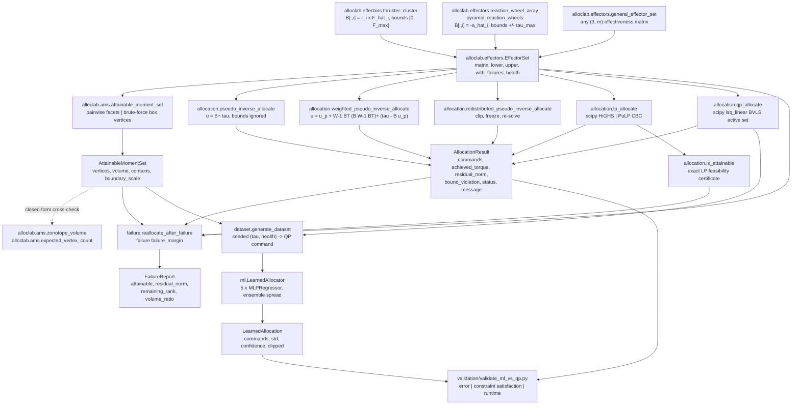
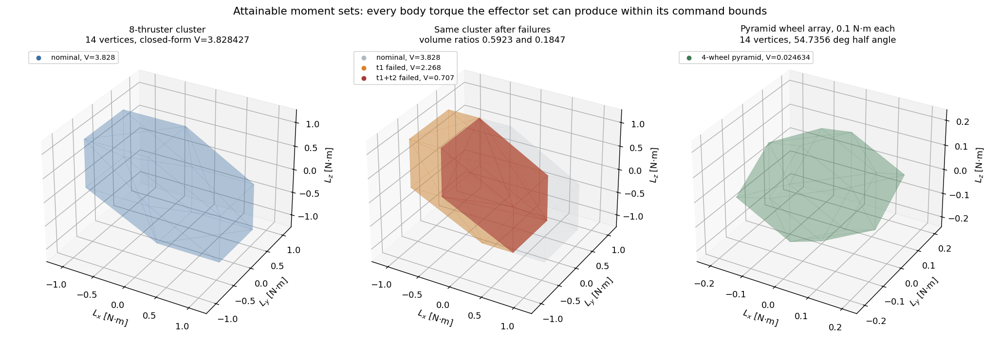
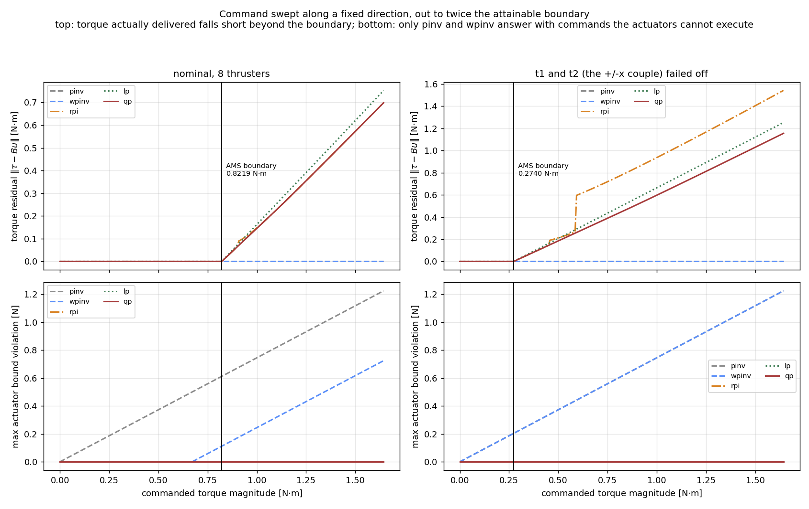
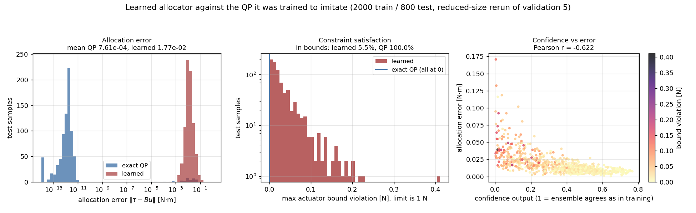

# AllocLab

Turns a commanded body torque into individual thruster or reaction-wheel commands.


## The problem

An attitude controller produces a three-vector of desired body torque; the
vehicle has eight thrusters, or four wheels, and somebody has to decide how
much each one does. The redundancy means there is no unique answer, the
actuators have hard limits that a pseudo-inverse knows nothing about, and when
an effector fails the whole question changes shape. Most projects write this
step from scratch, discover the pseudo-inverse returns negative thrust, clip it,
and ship a controller that quietly delivers a different torque from the one it
asked for.

## What this does

- **Five allocators over one interface** — pseudo-inverse, weighted
  pseudo-inverse, redistributed pseudo-inverse, linear programming and
  quadratic programming, all returning the same `AllocationResult`. On 400
  commands inside the attainable set of an eight-thruster cluster, the QP's
  worst residual is **2.1e-12 N·m** and the LP's is **8.8e-17 N·m**, both with
  zero bound violation; the plain pseudo-inverse hits the same torque but
  violates the 0–1 N thrust box on **all 400**, by up to **0.561 N**.
- **Exact attainable-moment-set geometry** — the AMS as a zonotope, by Durham's
  pairwise facet construction or by brute-force box enumeration, cross-checked
  against the closed-form zonotope volume to **5.9e-16 relative** over seven
  configurations, and against the cube `[-1,1]³` to **0 error** in volume,
  area and every vertex coordinate.
- **Failure reallocation that tells you when it cannot** — feasibility is
  decided by an exact LP certificate *before* the allocator's answer is looked
  at, so "the method failed" and "no command could have worked" are different
  outcomes. Over 7200 swept commands across 16 thruster-failure cases and 4
  wheel-failure cases: **0** attainable commands missed, **0** unattainable
  commands not reported infeasible, **0** feasibility verdicts disagreeing with
  the LP.
- **Bounds respected, measured over random geometry** — 1505 commands across
  300 random effector configurations: max bound violation **2.2e-16** for the
  QP, **0** for the LP and the redistributed pseudo-inverse, against
  **2.03** for the plain pseudo-inverse.
- **A learned QP surrogate, and the measurement that it loses** — a
  scikit-learn ensemble trained on 4000 exact QP solutions. On 2000 held-out
  samples it is **14.5× less accurate**, violates actuator bounds on
  **95.15%** of them by up to **0.329 N of a 1 N limit**, and called one
  command at a time is **2.0× slower** than the exact QP it imitates.

## Who this is for

- Anyone implementing torque-to-effector allocation for a spacecraft or drone
  and wanting a reference whose saturation and failure behaviour is written
  down and numerically checked.
- Anyone who needs to know how much control authority is left after an effector
  fails, as a number rather than an impression.
- Anyone about to put a learned allocator in a control loop who wants a
  properly-solved classical baseline to beat first, and a measured example of
  how that comparison can go.

## Who this is not for

- Anyone who just needs a QP solved. That is five lines of `cvxpy` or one call
  to `qpsolvers`; see the table below. The contribution here is the aerospace
  effector modelling, the attainable-moment-set geometry and the failure
  behaviour around the solve, not the solve.
- Anyone needing a spacecraft simulation. There is no dynamics, no orbit, no
  attitude propagation, no closed loop. Use Basilisk.
- Anyone needing actuator dynamics — rate limits, minimum impulse bit,
  pulse-width modulation, wheel momentum saturation, the gyroscopic `ω × h`
  term. None of that is modelled, and an allocation this package calls feasible
  can still be unreachable once wheel speeds are accounted for.
- Anyone who needs the learned allocator to be the fast path. It is not; see
  "The measured learned-versus-QP result".

## Alternatives, honestly

Every entry below was checked to exist at the version given, on PyPI or GitHub,
in August 2026.

| Alternative | What it does better | When to use it instead |
|---|---|---|
| [`scipy.optimize.linprog`](https://docs.scipy.org/doc/scipy/reference/generated/scipy.optimize.linprog.html) and [`scipy.optimize.lsq_linear`](https://docs.scipy.org/doc/scipy/reference/generated/scipy.optimize.lsq_linear.html) (scipy 1.17.1, BSD-3) | Mature, tuned HiGHS and BVLS implementations. **AllocLab calls both**; it does not implement a solver. | If your effectiveness matrix and bounds are already assembled and you only need the numbers, call scipy directly. Everything AllocLab adds is around that call. |
| [cvxpy](https://github.com/cvxpy/cvxpy) (`pip install cvxpy`, 1.9.2, Apache-2.0) | A general convex modelling language: write the allocation QP declaratively, add any constraint you like, swap solvers. | For any allocation objective beyond bounded weighted least squares — rate limits, `l1` effort, integer on-off thrusters, an MPC horizon. Five lines gets you the same answer AllocLab's `qp_allocate` gives. |
| [qpsolvers](https://github.com/qpsolvers/qpsolvers) (`pip install qpsolvers`, 4.13.0, LGPL-3.0) | One API over a dozen QP backends (OSQP, quadprog, ProxQP, …), with real benchmarks on solve time and accuracy. | When the QP solve itself is the bottleneck and you need to pick a backend on measured performance. AllocLab is fixed to BVLS. |
| [python-control](https://github.com/python-control/python-control) (`pip install control`, 0.10.2, BSD-3) | Broad classical and state-space control: LQR, `H∞`, frequency response, system interconnection. | For designing the controller that produces the torque command. It has no control-allocation module, so the step AllocLab performs still has to be written. |
| [Basilisk](https://github.com/AVSLab/basilisk) (AVS Lab / LASP, ISC) | A full spacecraft mission simulation in C/C++ with a Python interface: dynamics, environment, flight-software modules, hardware-in-the-loop. Its `fswAlgorithms/effectorInterfaces` tree includes `thrForceMapping`, `forceTorqueThrForceMapping`, `rwMotorTorque`, `rwNullSpace`, `thrFiringSchmitt`, `thrMomentumDumping` and more. | For any closed-loop study, or if you want allocation embedded in a simulation that also propagates the vehicle. AllocLab is open-loop and single-shot: torque in, commands out, with the error budget written down. Note the PyPI package named `basilisk` is an unrelated object-NoSQL mapper — install Basilisk from source. |
| [Härkegård's QCAT](https://www.mathworks.com/matlabcentral/fileexchange/4609-quadratic-programming-control-allocation-toolbox-qcat) (MATLAB File Exchange) | The reference implementation of the active-set control-allocation algorithms this package's QP formulation follows, by the author of the paper. | If you work in MATLAB. It is the closest thing to prior art for `qp_allocate`. |

If you want a mature convex-optimisation stack, take cvxpy or qpsolvers. If you
want a spacecraft simulator, take Basilisk. AllocLab's argument for existing is
the sections "Validation evidence" and "The measured learned-versus-QP result",
not feature coverage.

## Install and first run

```bash
git clone https://github.com/OmAcharya-avtr/alloclab.git
cd alloclab
python -m venv .venv && source .venv/bin/activate
pip install -e ".[test]"
python -m pytest tests/ -q
python examples/ams_demo.py
```

Expected output of the test run:

```
........................................................................ [ 38%]
........................................................................ [ 77%]
.........................................                                [100%]
185 passed, 9 warnings in 18.30s
```

The nine warnings are scikit-learn `ConvergenceWarning`s from MLP members that
reach `max_iter` in the deliberately short-trained test fixtures, plus PuLP
deprecation notices. They are expected.

Expected output of the example:

```
saved .../alloclab/screenshots/attainable_moment_set.png
cluster nominal : 14 vertices, volume 3.828427125 (N*m)^3, closed form 3.828427125
one thruster out: volume 2.267766953, ratio 0.592350
two thrusters out: volume 0.707106781, ratio 0.184699
pyramid wheels  : 14 vertices, volume 0.024633611, closed form 0.024633611
```

There is also a command-line entry point, which exits 1 when the command cannot
be met:

```console
$ python -m alloclab ams --config thrusters
config=thrusters method=pairwise
  vertices                    : 14
  general-position n_v        : 14
  hull volume [(N*m)^3]       : 3.82842712475
  closed-form volume          : 3.82842712475
  surface area [(N*m)^2]      : 14.3245553203

$ python -m alloclab allocate --torque 0.4 -0.2 0.1 --failed 0 --method qp
config=thrusters method=qp failed=[0]
  attainable by degraded set : False
  remaining rank             : 3
  AMS volume ratio           : 0.592350
  status                      : infeasible
  commands [N]                : [0.       0.       0.12     1.       1.       0.       0.839413 0.16059 ]
  achieved torque [N*m]       : [ 0.24 -0.2   0.02]
  residual norm [N*m]         : 1.788854e-01
  bound violation [N]         : 0.000000e+00
  note                        : command is NOT attainable by the degraded set (exact LP feasibility test: optimal weighted 1-norm torque error 2.000000e-01 N*m, which is zero only for an attainable command); best 2-norm residual from method 'qp' is 1.788854e-01 N*m
$ echo $?
1
```

That transcript is the whole design in one screen: the torque was attainable
with eight thrusters, is not attainable with seven, the shortfall is quantified,
the returned command still respects every actuator bound, and the exit code says
so.

## A worked example

```python
import numpy as np
from alloclab import attainable_moment_set, qp_allocate, reallocate_after_failure
from alloclab.dataset import reference_thruster_cluster

cluster = reference_thruster_cluster(max_thrust=1.0, arm=0.5)   # 8 thrusters, u in [0,1] N
ams = attainable_moment_set(cluster)
print(f"{cluster.n_effectors} thrusters, rank {cluster.rank}, AMS {ams.n_vertices} vertices, "
      f"volume {ams.volume:.9f} (N*m)^3")

tau = np.array([0.40, -0.20, 0.10])                              # N*m
print(f"tau inside the attainable set? {bool(ams.contains(tau))}, "
      f"could grow {ams.boundary_scale(tau) / np.linalg.norm(tau):.3f}x before leaving it")

res = qp_allocate(cluster, tau)                                  # bounded weighted least squares
print(f"qp  : status={res.status:<10} residual={res.residual_norm:.3e} N*m  "
      f"bound violation={res.bound_violation:.1e}")
print(f"      u = {np.array2string(res.commands, precision=4)} N")

for failed in ([0], [0, 1]):                                     # t1, then t1 and t2
    rep = reallocate_after_failure(cluster, tau, failed, method="qp")
    print(f"lost {str(failed):<7}: attainable={str(rep.attainable):<5} "
          f"status={rep.degraded.status:<10} residual={rep.degraded.residual_norm:.3e} N*m  "
          f"AMS volume x{rep.volume_ratio:.4f}")
```

Printed output, under a second:

```
8 thrusters, rank 3, AMS 14 vertices, volume 3.828427125 (N*m)^3
tau inside the attainable set? True, could grow 1.667x before leaving it
qp  : status=exact      residual=9.163e-13 N*m  bound violation=0.0e+00
      u = [0.9 0.1 0.3 0.7 0.6 0.4 0.5 0.5] N
lost [0]    : attainable=False status=infeasible residual=1.789e-01 N*m  AMS volume x0.5923
lost [0, 1] : attainable=False status=infeasible residual=1.789e-01 N*m  AMS volume x0.1847
```

The command has a 1.667× margin with all eight thrusters and none with seven.
Losing the second thruster costs another two-thirds of the attainable volume but
does not change the residual, because the torque was already unreachable in that
direction after the first failure.

## Architecture



`is_attainable` deliberately routes through the LP rather than the convex hull:
it costs one simplex solve instead of a vertex enumeration, so it stays usable
when `m` is large enough that the AMS hull is not.

## Screenshots

Both figures are produced by the scripts in `examples/`, so they cannot drift
from the code.



Notice the middle panel: losing one thruster (orange) removes 41% of the
attainable volume and, more importantly, moves the boundary asymmetrically —
the set does not shrink uniformly toward the origin, so a command that was
comfortably inside can end up outside along one direction while keeping a large
margin along another. That asymmetry is what `failure_margin` measures.



Notice the bottom row. Left of the black line every method meets the command;
right of it none can, and the honest question becomes what they return instead.
The bounded methods (`lp`, `qp`, `rpi`) sit flat at zero bound violation for the
whole sweep, while `pinv` and `wpinv` climb linearly to over 1.2 N of violation
on a 1 N thruster — a command no actuator can execute, returned with a residual
of 1.4e-15 N·m that makes it look perfect. In the right-hand panels the two
curves coincide exactly, because after a failure the weighted inverse's box
centre preference collapses onto the plain minimum-norm solution.



Notice the gap in the left panel: the two error distributions do not overlap at
all, and they are ten orders of magnitude apart. The middle panel is the
finding — the QP is a single line at zero, the learned model has a long tail out
to a third of a thruster's full range. The right panel shows the confidence
output doing the one job it does well, ranking predictions by error, while
saying nothing useful about bound violations (dark points appear at every
confidence). This figure is a reduced-size rerun of validation 5, so read its
shape, not its exact values.

## Validation evidence

Level 2. Scripts and their saved raw stdout are in
[`validation/`](validation/); the full discussion is in
[`validation/VALIDATION.md`](validation/VALIDATION.md).

| Check | Script / reference | Result | Tolerance | Outcome |
|---|---|---:|---:|---|
| QP reproduces a torque inside the AMS, 400 commands, 8-thruster cluster | `validate_exact_allocation.py`, max residual | 2.105728e-12 N·m | 1e-8 N·m | PASS |
| LP reproduces the same, 400 commands | `validate_exact_allocation.py` | 8.777084e-17 N·m | 1e-8 N·m | PASS |
| Pseudo-inverse bound violation on the same 400 commands | `validate_exact_allocation.py` | **5.614578e-01 N** on 400/400 | 1e-9 N | **bounds not enforced, by design** |
| QP residual scales as 1/gamma, 200 commands, 7 decades | `validate_exact_allocation.py` | 1.744e-05 at 1e4 → 9.558e-17 at 1e16 | — | PASS |
| HiGHS vs PuLP/CBC on the same LP, 3 configurations | `validate_exact_allocation.py`, max torque difference | 5.720588e-09 N·m | — | agree |
| AMS = cube `[-1,1]³` for the orthogonal triad | `validate_ams.py`, vertices / volume / area | 8 / 8 / 24, error 0 | exact | PASS |
| Hull volume vs closed-form zonotope volume, 7 configurations | `validate_ams.py`, worst relative error | 5.87e-16 | 1e-10 | PASS |
| Vertex count vs `g(g-1)+2`, 7 configurations | `validate_ams.py` | 7 / 7 match | exact | PASS |
| Pairwise vs brute-force AMS, 7 configurations | `validate_ams.py`, worst volume relative error | 7.83e-16 | 1e-10 | PASS |
| Bound compliance, 1505 commands over 300 random configurations | `validate_bounds.py`, max violation, qp / lp / rpi | 2.220446e-16 / 0 / 0 | 1e-9 | PASS |
| Same, pseudo-inverse and weighted pseudo-inverse | `validate_bounds.py` | 2.030 / 1.880 on 96% / 89% of commands | 1e-9 | **bounds not enforced, by design** |
| Attainable commands missed by the redistributed pseudo-inverse | `validate_bounds.py` | **23 of 642 (3.6%)**, worst residual 0.766 | 0 | **heuristic fails, as documented** |
| Bounds property over random configurations and commands | `tests/test_properties.py`, Hypothesis | 4 tests, 0 falsifying examples | — | PASS |
| Failure reallocation: attainable commands missed | `validate_failure.py`, 7200 commands, 20 failure cases | 0 | 0 | PASS |
| Failure reallocation: unattainable commands not reported | `validate_failure.py` | 0 | 0 | PASS |
| Failure verdicts vs the exact LP certificate | `validate_failure.py` | 0 disagreements | 0 | PASS |
| Learned allocator vs exact QP, mean allocation error | `validate_ml_vs_qp.py`, 2000 held-out | 1.0432e-02 vs 7.1839e-04 N·m | — | **QP wins, 14.5×** |
| Learned allocator constraint satisfaction | `validate_ml_vs_qp.py` | **4.85%** vs 100.00% | — | **QP wins** |
| Learned allocator single-solve runtime | `validate_ml_vs_qp.py` | 1417.4 µs vs 696.3 µs | — | **QP wins, 2.0×** |
| Learned allocator batched runtime | `validate_ml_vs_qp.py` | 64.0 µs vs 696.3 µs | — | learned wins, 10.9× |
| Confidence vs error correlation | `validate_ml_vs_qp.py`, Pearson r | −0.6245, monotone over 10 deciles | — | ranks, **not calibrated** |

**A defect this validation found.** The pairwise attainable-moment-set
construction originally enumerated only the four corners of each facet
parallelogram, which is correct only when exactly two generators lie in the
facet plane. Hypothesis, cross-checking it against brute-force box enumeration,
produced a configuration with three coplanar generators where that lost a vertex
0.5 N·m away and under-reported the volume by 3.6%. Facets are now enumerated
exactly as 2-D zonotopes by an angular walk, and the case is pinned in
`tests/test_ams.py::test_coplanar_generators_do_not_lose_facet_vertices`.

## The measured learned-versus-QP result

Trained and evaluated once, on fixed seeds, and reported as it came out. The
classical allocators were implemented and validated first; the model's labels
are the exact QP's output. 4000 training samples (seed 1234), 2000 held-out
(seed 5678), 5 × `MLPRegressor(64, 48)`, `random_state=0`, no hyperparameter
search. Source: [`validation/ml_vs_qp_output.txt`](validation/ml_vs_qp_output.txt),
interpretation in [`MODEL_CARD.md`](MODEL_CARD.md) §7–§9.

| Allocator | Mean error [N·m] | Median | p95 | Max | % inside actuator bounds |
|---|---:|---:|---:|---:|---:|
| Exact QP | 7.183888e-04 | 1.400865e-12 | 6.743076e-12 | 5.413941e-02 | **100.00** |
| Learned, raw | 1.043167e-02 | 7.605578e-03 | 2.704358e-02 | 8.937423e-02 | **4.85** |
| Learned, clipped | 1.538573e-02 | 8.987115e-03 | 4.674646e-02 | 3.361737e-01 | 100.00 |

| Path | Per allocation | vs the exact QP |
|---|---:|---:|
| Exact QP, one command at a time | 696.3 µs | 1.00× |
| Learned, one command at a time | 1417.4 µs | **0.49×** |
| Learned, 2000 commands batched | 64.0 µs | 10.88× |

Read against the expectation this benchmark was set up to test:

- **The learned allocator violates actuator bounds where the QP does not, on
  95.15% of held-out samples.** The largest violation is **0.3294 N on a 1 N
  thruster** — 32.9% of full range — and the per-effector worst violations
  `[0.0796, 0.1971, 0.1983, 0.1600, 0.1765, 0.1592, 0.2273, 0.3294]` N show every
  one of the eight thrusters commanded out of range somewhere in the test set.
  This is not a training-budget artefact: nothing in a plain regression enforces
  the box, so the violation is structural and does not go to zero with more
  data. A differentiable-optimisation output layer or a projection trained
  end-to-end would be the fix, and neither is available without PyTorch.
  `predict(clip=True)` restores 100% compliance and costs a 47% larger mean
  error and a 3.8× larger worst case. The default is `clip=False` so the
  violation is visible rather than silently absorbed.
- **The speed-for-exactness trade only half materialised.** Called one command
  at a time — which is how a control loop calls an allocator — the model is
  **2.0× slower** than the exact QP. Five scikit-learn `predict` calls plus
  feature scaling cost more than one bounded least-squares solve on a 3×8
  problem. The 10.9× advantage requires batching 2000 commands, which a
  real-time loop cannot do. On a much larger effector set, or with a QP that
  needed an iterative interior-point solver, the arithmetic could come out
  differently; on this problem it does not.
- **The model degrades exactly where it was meant to help.** Mean error is 7.7×
  the QP's with no failures, 23.7× with one, 29.5× with two. The health mask
  was added as an input precisely so failures would be representable, and the
  failure regime is still where the model is least trustworthy.
- **The confidence output ranks but does not calibrate.** Error falls
  monotonically across all ten confidence deciles, from 2.56e-02 to 4.66e-03
  N·m, so it is usable for gating a fallback to the exact QP. But mean ensemble
  spread is 0.633 of the RMS command error, so it understates the error by about
  37% and must not be used as a covariance; and even the top decile violates the
  actuator box on 92% of its samples, so it is not a safety signal.
- **On this problem there is no operating point where the learned allocator is
  the right choice for a control loop.** The QP is more accurate, always
  feasible, and faster per single call. The model's value here is as a
  documented baseline and as a counterexample to the assumption that a network
  surrogate of a small QP is automatically a speed win.

## API reference

<details>
<summary>Public surface, one line each</summary>

**`alloclab.effectors`** — configuration models. `B` is `(3, m)`, body torque
per unit command; commands carry the effector's own units (N for thrust, N·m
for wheel motor torque).

| Symbol | Description |
|---|---|
| `EffectorSet(matrix, lower, upper, names, units)` | The core object. `matrix` is `B`; `lower`/`upper` are the command box. `lower[i] == upper[i]` marks a fixed (failed or stuck) effector. |
| `EffectorSet.n_effectors` / `.span` / `.rank` | Count `m`; `upper - lower`; rank of `B` over effectors that can still move. |
| `EffectorSet.torque(u)` | `B u` [N·m]; accepts a `(m,)` vector or an `(n, m)` batch. |
| `EffectorSet.clip(u)` / `.bound_violation(u)` / `.within_bounds(u, tol)` | Project into the box; largest amount outside it; boolean test. |
| `EffectorSet.with_failures(failed, stuck_at=None)` | Copy with those effectors pinned; `stuck_at=None` means failed-off. |
| `EffectorSet.free_mask()` / `.health()` / `.summary()` | Which effectors can still move, as bool / as float / as text. |
| `general_effector_set(matrix, lower, upper, names, units)` | Build from any `(3, m)` matrix — control surfaces, magnetorquers, gimbals. |
| `thruster_cluster(positions, directions, max_thrust, min_thrust=0, names)` | `B[:, i] = r_i × F̂_i` [m]; one-sided box `[min_thrust, max_thrust]` [N]. |
| `reaction_wheel_array(spin_axes, max_torque, names)` | `B[:, i] = -â_i`; symmetric box `±max_torque` [N·m]. |
| `pyramid_reaction_wheels(max_torque=0.1, half_angle_deg=54.7356, n_wheels=4)` | Skewed pyramid; isotropic (`B Bᵀ = (4/3) I`) at the default half angle. |
| `orthogonal_effectors(max_torque=1.0)` | `B = I₃`, box `±max_torque`; the AMS is exactly the cube. |

**`alloclab.allocation`** — the allocators. All take `(eset, torque)` and return
an `AllocationResult`.

| Symbol | Description |
|---|---|
| `AllocationResult` | `commands`, `achieved_torque`, `desired_torque`, `residual`, `residual_norm` [N·m], `bound_violation`, `feasible`, `status`, `method`, `message`, `solve_time_s`, `extras`. |
| `status` | `"exact"` (torque met, no effector on a limit), `"saturated"` (met, some on a limit), `"infeasible"` (not met, or bounds violated). |
| `pseudo_inverse_allocate(eset, torque, ...)` | `u = B⁺ τ`. Minimum 2-norm, bounds **ignored**. |
| `weighted_pseudo_inverse_allocate(eset, torque, weights, u_pref, ...)` | `u = u_p + W⁻¹Bᵀ(BW⁻¹Bᵀ)⁺(τ − Bu_p)`. Bounds **ignored**. `u_pref` defaults to the box centre. |
| `redistributed_pseudo_inverse_allocate(eset, torque, weights, u_pref, max_iter, ...)` | Clip-and-redistribute (Bodson 2002 §V.A). Respects bounds; not optimal, not guaranteed to find a feasible command. `extras` carries `n_iterations`, `n_saturated`. |
| `lp_allocate(eset, torque, objective, torque_weights, cost, u_pref, solver, ...)` | `objective="min_error"` minimises the weighted 1-norm torque error subject to the box; `"min_control"` minimises effort subject to `Bu = τ` exactly. `solver` is `"highs"` or `"pulp"`. |
| `qp_allocate(eset, torque, control_weights, torque_weights, u_pref, gamma=1e12, ...)` | `min ‖W_u(u−u_p)‖² + γ‖W_v(Bu−τ)‖²` subject to the box, solved exactly by BVLS. The recommended default. |
| `allocate(eset, torque, method="qp", **kw)` | Dispatch by name over `METHODS = ("pinv", "wpinv", "rpi", "lp", "qp")`. |
| `is_attainable(eset, torque, tol=1e-8)` | Exact LP feasibility certificate. No vertex enumeration, so usable for large `m`. |
| `InfeasibleAllocationError` | Raised by `reallocate_after_failure(require_feasible=True)`. |
| `DEFAULT_TORQUE_TOL` / `DEFAULT_BOUND_TOL` | 1e-8 N·m; 1e-9 command units. |

**`alloclab.ams`** — attainable-moment-set geometry.

| Symbol | Description |
|---|---|
| `attainable_moment_set(eset, method="pairwise")` | The AMS as a convex polytope. `"pairwise"` is Durham's `O(m²)` facet construction; `"bruteforce"` enumerates all `2^m` box vertices (capped at `m = 18`). |
| `AttainableMomentSet` | `vertices` [N·m], `hull`, `volume` [(N·m)³], `area`, `degenerate`, `n_vertices`, `n_facets`. |
| `.contains(torque, tol=1e-9)` | Half-space membership, scalar or `(n, 3)` batch. |
| `.boundary_scale(direction)` | Scale at which a ray leaves the AMS [N·m] — Durham's direct-allocation magnitude. |
| `zonotope_volume(eset)` | `Σ_{i<j<k}|det(b_i,b_j,b_k)| L_i L_j L_k`, closed form, independent of the hull. |
| `expected_vertex_count(eset)` | `g(g−1)+2` over distinct generator lines; exact in general position, an upper bound otherwise. |

**`alloclab.failure`** — failure handling.

| Symbol | Description |
|---|---|
| `reallocate_after_failure(eset, torque, failed, method="qp", stuck_at=None, require_feasible=False, compute_volume=True, **kw)` | Reallocate on the degraded set; feasibility decided by the LP certificate before the allocator's answer is examined. |
| `FailureReport` | `failed`, `nominal`, `degraded`, `attainable`, `residual_norm` [N·m], `remaining_rank`, `volume_ratio`. |
| `failure_margin(eset, torque, failed, stuck_at=None)` | How many times larger the command could be before the degraded set cannot meet it; `< 1` means already outside. |

**`alloclab.dataset` / `alloclab.ml`** — the AI element.

| Symbol | Description |
|---|---|
| `reference_thruster_cluster(max_thrust=1.0, arm=0.5)` | The 8-thruster benchmark configuration. |
| `torque_scale(eset)` | AMS circumscribed radius [N·m]. |
| `generate_dataset(eset, n_samples, seed, max_failures=2, failure_prob=0.5, magnitude_range=(0, 1.05), gamma=1e12)` | Deterministic `(torque, health) → QP command` samples. |
| `AllocationDataset` | `torques`, `health`, `commands`, `residual_norm`, `attainable`, `seed`, `attainable_fraction`. |
| `LearnedAllocator(eset, n_estimators=5, hidden_layer_sizes=(96,64), alpha=1e-4, max_iter=400, random_state=0)` | Ensemble MLP surrogate of the QP, bound to one effector configuration. |
| `.fit(torques, health, commands, torque_scale=None)` / `.predict(torques, health, clip=False)` | Train; predict. `clip=False` returns the raw, possibly out-of-box output. |
| `LearnedAllocation` | `commands`, `std` [command units], `confidence` in `[0,1]`, `clipped`. |

**CLI** — `python -m alloclab {config,ams,allocate}` with
`--config {thrusters,pyramid,triad}`. `allocate` takes `--torque TX TY TZ`,
`--method`, `--failed ...`, and exits 1 when the command is not met.

</details>

## Limitations

- **The learned allocator violates actuator bounds on 95.15% of held-out
  samples**, by up to 0.3294 N of a 1 N limit, and is 2.0× slower than the
  exact QP per single call. See the section above. It is in this repository as
  a measured result, not as a recommended component.
- **`qp_allocate` is exact only to `1/gamma`.** The torque term is a penalty,
  not a constraint, so an attainable command is met to about `1/gamma`
  (measured: 1.744e-13 N·m at the default `gamma = 1e12` on the pyramid array,
  1.744e-05 at `gamma = 1e4`). It degrades further when the active set at the
  optimum leaves open a direction of very small torque effectiveness: with an
  effector direction of effectiveness 1e-4 the residual reaches 1.5e-8 N·m,
  above `DEFAULT_TORQUE_TOL`, and the result is then honestly reported
  infeasible. Both cases are pinned in `tests/test_allocation.py`. Passing
  `u_pref` equal to the intended command, or raising `gamma`, removes it.
- **`lp_allocate` inherits its solver's tolerance.** HiGHS runs at a 1e-7
  primal feasibility tolerance, so an LP allocation's residual floor is about
  `1e-7 · ‖B‖` N·m regardless of `torque_tol`, and a command whose own magnitude
  is near that floor can be reported infeasible when it is attainable. The
  returned command is projected into the box to absorb the solver's slop, with
  the amount absorbed recorded in `extras["pre_clip_bound_violation"]`. CBC's
  floor is looser: it disagreed with HiGHS by up to 5.7e-09 N·m.
- **The redistributed pseudo-inverse can miss a feasible command.** Measured:
  23 of 642 attainable commands over 300 random configurations, worst residual
  0.766 while inside the box. This is a documented property of the heuristic
  (Bodson 2002 §V.A; Härkegård 2002 §2.2.1), not a defect here, and it is the
  reason to prefer `lp` or `qp`. Note it missed none on the structured
  configurations of validation §4, so the failure rate depends strongly on
  geometry.
- **Near-degenerate AMS geometry is tolerance-dependent.** The pairwise
  construction decides whether a column lies in a candidate facet plane with a
  relative tolerance of 1e-9. For configurations whose columns are within about
  1e-8 of parallel or coplanar, pairwise and brute-force can place one vertex
  differently while agreeing on the volume to 1e-12. Prefer
  `method="bruteforce"` for such geometries when `m ≤ 18`.
- **No actuator dynamics at all.** No rate limits, no minimum impulse bit, no
  pulse-width modulation, no thruster rise or fall, no wheel friction, motor
  speed-torque roll-off, or zero-crossing behaviour. Effectors are linear and
  instantaneous.
- **No wheel momentum envelope.** `reaction_wheel_array` is torque-limited
  only; wheel speeds, momentum saturation and the gyroscopic `ω × h` coupling
  are absent, so an allocation this package calls feasible may be unreachable
  once momentum state is accounted for.
- **Open-loop and single-shot.** There is no attitude dynamics, no controller,
  no time. Nothing is known about closed-loop stability, chatter at the
  attainable boundary, or the effect of switching allocation method mid-flight.
- **Torque only.** A thruster cluster also produces net force; that force is
  not a controlled variable here and is not reported.
- **Everything assumes `B` is known exactly.** No effectiveness uncertainty, no
  centre-of-mass migration, no misalignment, and a perfectly known health mask.
  A real system allocates through an estimated `B` and a fault detector's best
  guess.
- **Compute budget: 2 CPU cores, no GPU, no PyTorch.** The learned model is a
  scikit-learn ensemble with 4000 training samples and a 115 s fit. A larger or
  structurally different model was not an option and might change the ML
  conclusions; it would not change the classical ones.
- **All ML data is synthetic**, from one effector configuration, with
  failed-off failures only and at most two at a time. See
  [`DATASET_CARD.md`](DATASET_CARD.md).

## Reproducing every number

From the repository root, with the package installed:

```bash
python -m pytest tests/ -q                            # 185 passed, ~19 s
ruff check src/ tests/                                # clean, line-length 100
python validation/validate_exact_allocation.py        # section 1 of VALIDATION.md, ~40 s
python validation/validate_ams.py                     # section 2, ~1 s
python validation/validate_bounds.py                  # section 3, ~110 s
python validation/validate_failure.py                 # section 4, ~130 s
python validation/validate_ml_vs_qp.py                # section 5, ~180 s (trains the model)
python examples/ams_demo.py                           # screenshots/attainable_moment_set.png
python examples/saturation_demo.py                    # screenshots/saturation_sweep.png
python examples/ml_benchmark_demo.py                  # screenshots/learned_vs_qp.png
```

Seeds: allocation sweep 20260831, bound Monte Carlo 4242, failure sweep 90210,
ML training data 1234, ML test data 5678, model `random_state=0`. All randomness
goes through `numpy.random.default_rng` and scikit-learn's `random_state`. The
reference run was Python 3.11.15, numpy 2.4.4, scipy 1.17.1, scikit-learn 1.8.0,
pulp 3.3.2 on 2 x86-64 cores. Last digits may move on a different BLAS or a
different HiGHS build; the conclusions do not.

## References

- Durham, W. C. (1993). Constrained control allocation. *J. Guidance, Control,
  and Dynamics* 16(4), 717-725.
  doi:[10.2514/3.21072](https://doi.org/10.2514/3.21072)
- Durham, W. C. (1994). Attainable moments for the constrained control
  allocation problem. *J. Guidance, Control, and Dynamics* 17(6), 1371-1373.
  doi:[10.2514/3.21360](https://doi.org/10.2514/3.21360)
- Bodson, M. (2002). Evaluation of optimization methods for control allocation.
  *J. Guidance, Control, and Dynamics* 25(4), 703-711.
  doi:[10.2514/2.4937](https://doi.org/10.2514/2.4937)
- Härkegård, O. (2002). Efficient active set algorithms for solving constrained
  least squares problems in aircraft control allocation. *Proc. 41st IEEE
  Conference on Decision and Control*, 1295-1300.
  doi:[10.1109/CDC.2002.1184694](https://doi.org/10.1109/cdc.2002.1184694)
- Härkegård, O. (2003). Resolving actuator redundancy — control allocation vs.
  linear quadratic control. *Proc. European Control Conference*, 1826-1831.
  doi:[10.23919/ECC.2003.7085231](https://doi.org/10.23919/ecc.2003.7085231)
- Stark, P. B. & Parker, R. L. (1995). Bounded-variable least-squares: an
  algorithm and applications. *Computational Statistics* 10, 129-141. (The BVLS
  algorithm behind `scipy.optimize.lsq_linear(method="bvls")`.)
- Ziegler, G. M. (1995). *Lectures on Polytopes*. Springer GTM 152, Lecture 7.
  (Zonotope face lattices, vertex counts and the volume formula.)
- Markley, F. L. & Crassidis, J. L. (2014). *Fundamentals of Spacecraft Attitude
  Determination and Control*. Springer, Chapter 7. (Thruster and reaction-wheel
  actuator models.)
- Wie, B. (2008). *Space Vehicle Dynamics and Control*, 2nd ed. AIAA, Chapter 7.
  (Reaction-wheel arrays and the skewed pyramid configuration.)

## Safety statement

This software is research-grade. It is not flight-qualified, not certified, and
not approved for operational aerospace use. No DO-178C, ECSS-E-ST-40C or
equivalent process was followed, and there is no independent verification. It
must not be used as the control allocation path of a spacecraft, aircraft or
launch vehicle. The learned allocator in particular is not certified for
operational flight use and violates actuator bounds on the majority of the
samples it was measured on.

## Licence

Apache-2.0. See [`LICENSE`](LICENSE). Copyright © 2026 OPTIMA Organisation.

## Citation

```
OPTIMA Organisation (2026). AllocLab: control allocation for over-actuated
spacecraft effector sets (thruster and reaction-wheel models, pseudo-inverse /
LP / QP allocation with actuator bounds, attainable-moment-set geometry,
failure reallocation, and a benchmarked learned QP surrogate). Version 0.1.0.
Aerospace 100-Product Mission, Product P023.
```

## Credits

This is under reserved rights obtained by OPTIMA Organisation.
