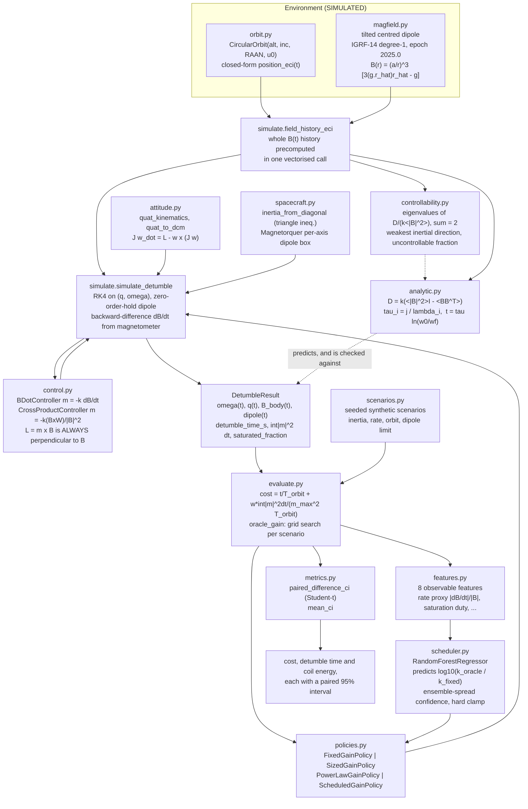
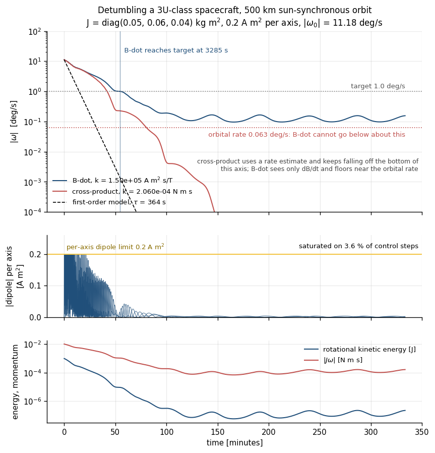
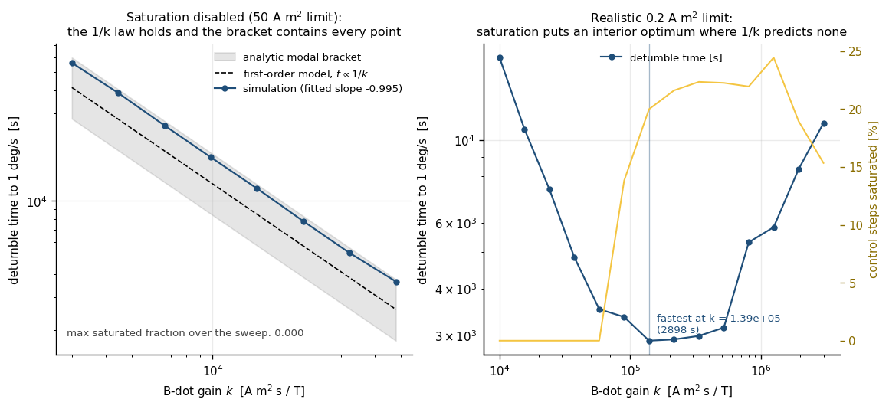
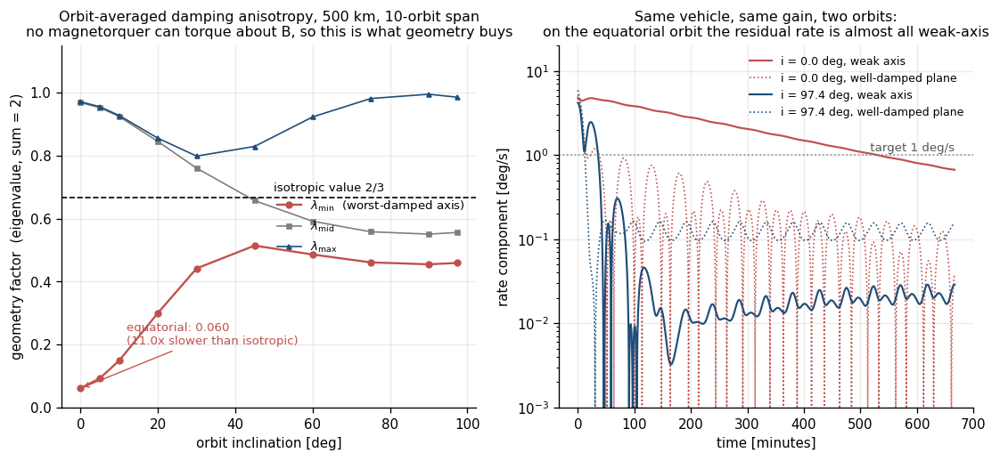
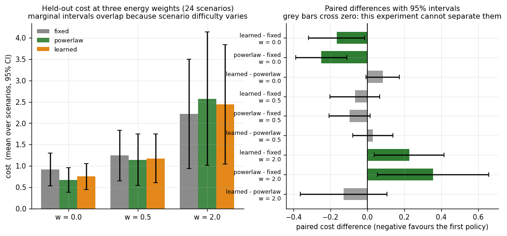

# DetumbleSim

Magnetorquer detumbling: B-dot sizing sweeps and the controllability gap along **B**.


> **The magnetic field model here is a tilted centred dipole — the degree-1
> truncation of IGRF-14, not IGRF.** Measured against IGRF-14 at twelve
> reference points it has a median error of 8.97 % and a worst-case error of
> **71.86 %** in the South Atlantic Anomaly
> (`validation/field_model_check.py`, check A2, which **FAILED** its
> pre-registered 25 % tolerance and is reported as failed). Every detumble
> time in this repository inherits that error. If you need field accuracy, use
> `ppigrf` or `pyIGRF` and feed the result in.

## The problem

Every small satellite has to shed its post-deployment tumble before it can
point at anything, and almost all of them do it with magnetorquers running
B-dot. The gain is usually picked from a heritage spreadsheet and then
discovered to be wrong in orbit, because it interacts with the coil saturation
limit, the inertia and the orbit geometry in ways a single number cannot
capture. Worse, the one thing a magnetorquer physically cannot do — produce
torque about the instantaneous field direction — is what decides whether a
low-inclination mission detumbles in half an orbit or six.

## What this does

- Simulates rigid-body attitude dynamics with magnetorquer B-dot or
  cross-product control on a circular orbit, at about **0.10 s per
  3300-second detumble** on two cores (`tests/test_benchmark_regression.py`).
- Reproduces the analytic `t ∝ 1/k` detumble-time law to a fitted log-log
  slope of **−0.9949** over a 16× gain range, with `k·t` constant to
  **1.27 %** (`validation/gain_scaling.py`, C1).
- Quantifies the controllability gap: the worst-axis damping rate on an
  equatorial orbit is **11.02×** slower than the isotropic ideal against
  **1.45×** on a sun-synchronous one, and the same vehicle at the same gain
  takes **31888 s** to detumble instead of **2677 s**
  (`validation/controllability_gap.py`, D1 and D3).
- Shows that with a realistic 0.2 A m² dipole limit the detumble time has an
  **interior optimum in gain** that the 1/k law does not predict — 2898 s at
  `k = 1.39e5` against 16634 s and 11102 s at the two ends of a 300× gain
  sweep (5.7× and 3.8× longer)
  (`examples/gain_sweep.py`).
- Benchmarks a learned B-dot gain scheduler against three classical gain rules
  on 40 paired held-out scenarios with 95 % confidence intervals, and reports
  the two weightings under which the classical baseline wins
  (`validation/learned_vs_fixed_ci.py`).

## The headline result

**The learned gain scheduler beats a hand-tuned fixed gain on detumble time
(−0.206 orbits, 95 % CI [−0.308, −0.103]), loses to it when coil energy is
weighted heavily (+0.181 [+0.038, +0.324]), and never beats a three-coefficient
log-linear regression fitted to the same training data.** All of the
RandomForest's feature importance sits on the two static vehicle parameters
that the regression also uses; the six magnetometer-derived features carry
none of it, so the "scheduler" is a per-vehicle lookup rather than a schedule.
The detail, including the five comparisons this experiment cannot resolve at
all, is in [Statistical honesty](#statistical-honesty).

## Who it is for

- ADCS engineers doing a detumble sizing trade before committing to a coil,
  who want the gain / inertia / dipole-limit surface rather than one number.
- Mission analysts who need to know how much a low-inclination orbit costs
  them in detumble time, with the controllability deficit quantified.
- Anyone teaching magnetic attitude control who wants B-dot, the cross-product
  law and the perpendicular-torque constraint in code with hand-checked tests.
- Anyone who wants a worked example of an ML component benchmarked honestly
  against classical baselines, including the cases where it loses.

## Who it is not for

- Anyone who needs an accurate geomagnetic field. This is a degree-1 dipole
  with a measured worst-case error of 71.86 %. Use `ppigrf` or `pyIGRF`.
- Anyone building a full ADCS: there is no attitude determination, no
  estimator, no sensor suite, no reaction wheel, no sun/nadir pointing mode.
- Anyone who needs perturbed orbits. The orbit is circular, unperturbed
  two-body: no J2, no drag, no eclipse-driven thermal or power modelling.
- Anyone who needs environmental torques. No gravity gradient, no aerodynamic
  torque, no residual dipole, no solar pressure — all of which lengthen real
  detumbles relative to these numbers.
- Anyone needing flight software or a flight-qualified result. See
  [Safety](#safety).

## Alternatives, honestly

Every entry below was checked to exist before being named, at the URL given.

| Alternative | What it does better | When to use it instead |
|---|---|---|
| [Basilisk](https://hanspeterschaub.info/basilisk/) (AVS Lab, University of Colorado + LASP; ISC licence) | A complete, maintained, C/C++-speed spacecraft simulation framework with a `MtbEffector` magnetic-torque-bar module, `magneticFieldCenteredDipole` and `magneticFieldWMM` environment modules, magnetometer models, reaction wheels, thrusters and full flight-software task scheduling. It already does everything in this repository and a great deal more. | **Almost any serious ADCS simulation work.** If you are building a mission-grade simulation, start with Basilisk. This repository is the right choice only if you want a small, dependency-light package focused on the detumble *sizing sweep* and the controllability analysis, with every number traceable to a validation script. Note that PyPI's `basilisk` package is an unrelated object-NoSQL mapper — Basilisk the astrodynamics framework is not distributed on PyPI. |
| [ppigrf](https://pypi.org/project/ppigrf/) (`ppigrf` 2.1.0, IAGA-VMOD) | A pure-Python full IGRF evaluation, all degrees, all epochs. | Any time the field magnitude or direction matters to better than tens of percent. DetumbleSim's dipole is wrong by up to 71.9 % in the SAA; `ppigrf` is not. |
| [pyIGRF](https://pypi.org/project/pyIGRF/) (`pyIGRF` 1.0.0) | The IGRF-14 model in Python, including secular variation. | Same as above; pick whichever API you prefer. Neither package simulates attitude, so you would combine one of them with a dynamics package. |
| [Orekit](https://www.orekit.org/) via [orekit-jpype](https://pypi.org/project/orekit-jpype/) (13.1.7.1) | A mature, validated space-dynamics library: high-fidelity propagation, frames, time scales, attitude providers, geomagnetic field models. | Anything where orbit fidelity matters. DetumbleSim's orbit is an unperturbed circle; Orekit's is not. Orekit does not ship a B-dot detumble controller, so you would write the control law yourself. |
| [hapsira](https://pypi.org/project/hapsira/) (0.18.0), the maintained fork of [poliastro](https://pypi.org/project/poliastro/) (0.17.0, archived) | Clean, well-documented orbital mechanics: elements, manoeuvres, propagation, plotting. | Orbit design and mission analysis. Neither models attitude, magnetorquers or the geomagnetic field, so they solve a different problem, and poliastro itself is no longer maintained. |
| **Stickler & Alfriend (1976)** and **Avanzini & Giulietti (2012)** | The primary literature this package implements. B-dot is textbook, and has been since 1976. | Cited here because the honest statement is that **the control laws in this repository are not novel**. What is here is the sizing sweep, the saturation-aware gain optimum, the quantified controllability gap and the honest AI benchmark around them. |

## Install and first run

```bash
git clone https://github.com/OmAcharya-avtr/detumblesim.git
cd detumblesim
python -m venv .venv && source .venv/bin/activate
pip install -e ".[test,examples]"
python -m pytest tests/ -q
python examples/detumble_curve.py
```

Expected output of the test run (measured: 15.9 s on 2 cores):

```
........................................................................ [ 23%]
........................................................................ [ 47%]
........................................................................ [ 70%]
........................................................................ [ 94%]
.................                                                        [100%]
305 passed in 15.86s
```

Expected output of the first example (about 4 s):

```
saved /path/to/detumblesim/screenshots/detumble_curve.png
B-dot detumble time      = 3285.3 s (0.58 orbits)
cross-product detumble   = 2517.7 s
first-order model (no saturation) = 878.9 s
B-dot saturated fraction = 0.0364
final |omega|            = 0.1557 deg/s (orbital rate 0.0634 deg/s)
```

The CLI is available once installed:

```bash
python -m detumblesim controllability --inclination-deg 0 --orbits 10
```

```
averaging span              = 56770 s (10.0 orbits)
RMS field                   = 24.160 uT
weighted geometry factors   = [0.0605 0.9684 0.9711]  (isotropic value 0.6667, sum is exactly 2)
anisotropy (max/min)        = 16.054
weakest inertial direction  = [-0.0222 -0.0281  0.9994]
direction-only eigenvalues  = [0.06   0.9688 0.9713]
check: geometry_factors()   = [0.0605 0.9684 0.9711]
```

## A worked example

```python
import numpy as np
from detumblesim import (
    CircularOrbit, DetumbleConfig, FixedGainPolicy, Magnetorquer,
    controllability_report, detumble_time_first_order, inertia_from_diagonal,
    orbit_field_moments, simulate_detumble,
)

orbit = CircularOrbit(altitude_km=500.0, inclination_deg=97.4)
moments = orbit_field_moments(orbit, 4000, 10.0 * orbit.period_s)
print(f"RMS field over 10 orbits = {moments.rms_b_t * 1e6:.3f} uT")

rep = controllability_report(orbit, 4000, 10.0 * orbit.period_s)
print(f"geometry factors = {np.round(rep.weighted_eigenvalues, 5)} "
      f"(isotropic 2/3, sum 2), anisotropy {rep.anisotropy:.3f}")

cfg = DetumbleConfig(
    inertia=inertia_from_diagonal(0.05, 0.06, 0.04),
    orbit=orbit,
    magnetorquer=Magnetorquer.isotropic(0.2),
    omega0_rad_s=np.radians([8.0, -6.0, 5.0]),
    duration_s=23000.0, control_dt_s=2.0, substeps=2,
    target_rate_rad_s=np.radians(1.0), stop_when_detumbled=True,
)
res = simulate_detumble(cfg, FixedGainPolicy(1.5e5))
print(f"detumble time = {res.detumble_time_s:.1f} s "
      f"({res.detumble_time_s / orbit.period_s:.3f} orbits)")
print(f"saturated on {100 * res.saturated_fraction:.2f} % of control steps, "
      f"int|m|^2 dt = {res.actuation_cost_a2m4s:.3f} A^2 m^4 s")

t_model = detumble_time_first_order(
    0.05, 1.5e5, moments, float(np.linalg.norm(cfg.omega0_rad_s)), np.radians(1.0)
)
print(f"first-order model (ignores saturation) = {t_model:.1f} s, "
      f"i.e. {res.detumble_time_s / t_model:.2f}x optimistic here")
```

Actual printed output (0.7 s on 2 cores):

```
RMS field over 10 orbits = 37.059 uT
geometry factors = [0.45882 0.55563 0.98555] (isotropic 2/3, sum 2), anisotropy 2.148
detumble time = 3285.3 s (0.579 orbits)
saturated on 22.15 % of control steps, int|m|^2 dt = 102.576 A^2 m^4 s
first-order model (ignores saturation) = 878.9 s, i.e. 3.74x optimistic here
```

## Architecture



## Screenshots

All four images are produced by this repository's own examples, so they cannot
drift from the code.



`python examples/detumble_curve.py`. Notice that B-dot (blue) flattens out at
about 0.15 deg/s — roughly 2.5× the orbital rate of 0.063 deg/s — and never
goes lower, while the cross-product law (red), which has a rate estimate,
keeps falling off the bottom of the axis. B-dot only sees `dB/dt`, and near
the end of a detumble most of `dB/dt` is the orbit moving the field, not the
body spinning.



`python examples/gain_sweep.py`. Left: with saturation switched off the 1/k law
is a straight line of slope −0.995 and every point sits inside the analytic
modal bracket. Right: with a realistic 0.2 A m² limit the same sweep has a
clear interior minimum at `k = 1.39e5`, and the yellow curve shows why —
beyond that gain the torquers are saturated on more than 20 % of steps and
extra gain buys nothing but chatter.



`python examples/controllability_gap.py`. Left: the worst-axis geometry factor
collapses from 0.51 near 45° inclination to 0.060 at the equator, against the
isotropic ideal of 2/3. Right: the same vehicle at the same gain — on the
equatorial orbit (red) the weak-axis rate is still 0.67 deg/s after 11 hours,
and it is 99.6 % of everything that is left.



`python examples/learned_vs_fixed.py` (a reduced-size version of the
validation run; cite the validation numbers, not these). Notice that the
marginal intervals on the left overlap almost completely — scenario difficulty
dominates — and that on the right the grey bars, which are the majority, are
the comparisons that cross zero and are therefore unresolved.

## Validation evidence

Full criteria, tolerances fixed before each run, and raw stdout:
[`validation/VALIDATION.md`](validation/VALIDATION.md), with
`field_model_check_output.txt`, `momentum_monotonicity_output.txt`,
`gain_scaling_output.txt`, `controllability_gap_output.txt` and
`learned_vs_fixed_ci_output.txt` committed beside the scripts that wrote them.

| ID | Check | Reference | Result | Criterion |
|---|---|---|---|---|
| V1-A1 | Dipole truncation error, 12 points | BGS IGRF-14 web service | median 8.967 % | ≤ 15 % — PASS |
| V1-A2 | Same, worst point | same | **71.860 %** at 45° S, 0° E, 500 km | ≤ 25 % — **FAIL** |
| V1-A3 | Geomagnetic north pole | WDC Kyoto IGRF-14 2025 (80.8° N, 72.8° W) | 80.7894° N, 72.7628° W | ≤ 0.05° — PASS |
| V1-A4 | 2·B0 at pole, B0 at equator | closed form | rel. error 2.999e-13 | rtol 1e-9 — PASS |
| V2-B1 | Energy non-increasing, any inertia | eq. (1) | 0 of 16964 draws violate | PASS |
| V2-B2 | \|H\| non-increasing, isotropic inertia | eq. (2), J = jI | 0 of 16964 draws violate | PASS |
| V2-B3 | \|H\| non-increasing, asymmetric inertia | the spec's stated property | 94 of 16964 (0.55 %) violate | **FALSIFIED** |
| V2-B3a | Analytic vs numerical momentum-rise maximum | closed form | 0.415475947 vs 0.415475947, 2.6e-11 | PASS |
| V3-C1 | t ∝ 1/k, unsaturated | `analytic.py` eq. (4) | slope −0.994903, k·t spread 1.270 % | \|slope+1\| ≤ 0.05 — PASS |
| V3-C2 | Time inside the analytic modal bracket | `modal_time_constants` | 8 of 8 | PASS |
| V3-C3 | Same test on sub-orbit detumbles | same | 0 of 5 inside; whole-range slope −0.577 | measurement |
| V4-D1 | Worst-axis geometry factor | isotropic 2/3 | 0.06050 (i = 0°) vs 0.45882 (i = 97.4°) | measurement |
| V4-D3 | Detumble time, same vehicle and gain | — | 31887.7 s vs 2676.5 s (11.91×) | measurement |
| V4-D5 | Two code paths for the geometry factors | each other | 5.551e-17 | < 1e-12 — PASS |
| V5-E6 | Learned vs fixed gain, 40 paired scenarios, w = 0 | paired 95 % CI | −0.206 [−0.308, −0.103] | learned wins |
| V5-E6 | Learned vs fixed gain, w = 2 | paired 95 % CI | +0.181 [+0.038, +0.324] | **fixed wins** |
| V5-E6 | Learned vs 3-coefficient power law, w = 0 | paired 95 % CI | +0.078 [+0.010, +0.146] | **power law wins** |
| V5-E5 | Sized-gain rule, held out | — | 2 of 40 scenarios never detumbled | reported |

### Held-out benchmark, as measured (40 paired scenarios, `w = 0.5`)

| policy | cost (95 % CI) | time [orbits] | coil-energy term | failures | steps saturated |
|---|---|---|---|---:|---:|
| fixed | 1.170 [0.788, 1.552] | 0.885 [0.637, 1.133] | 0.285 [0.130, 0.441] | 0 | 16.97 % |
| sized | 1.422 [0.795, 2.050] | 1.131 [0.585, 1.677] | 0.292 [0.176, 0.408] | 2 | 25.43 % |
| powerlaw | 0.999 [0.622, 1.376] | 0.601 [0.410, 0.793] | 0.398 [0.205, 0.590] | 0 | 42.60 % |
| learned | 1.061 [0.690, 1.433] | 0.680 [0.488, 0.871] | 0.382 [0.193, 0.571] | 0 | 32.46 % |

## Statistical honesty

### Which intervals mean anything

`metrics.mean_ci` gives a marginal Student-t interval per policy;
`metrics.paired_difference_ci` gives an interval on the per-scenario
difference, and only the second one has any power here. Scenario difficulty
varies by more than an order of magnitude, so the marginal intervals overlap
almost completely (fixed 1.170 [0.788, 1.552] against learned
1.061 [0.690, 1.433]) while the paired difference for exactly the same two
policies is −0.109 [−0.196, −0.021] and excludes zero. **Do not read the
marginal table as a ranking.**

A paired interval that contains zero means this experiment cannot separate the
two policies. It does not mean they are equal.

### Comparisons that are resolved

| Weight | Comparison | Difference | 95 % CI |
|---:|---|---:|---|
| 0.0 | learned − fixed | −0.206 | [−0.308, −0.103] |
| 0.0 | powerlaw − fixed | −0.284 | [−0.402, −0.165] |
| 0.0 | learned − powerlaw | **+0.078** | [+0.010, +0.146] |
| 0.0 | learned − sized | −0.451 | [−0.898, −0.004] |
| 0.5 | learned − fixed | −0.109 | [−0.196, −0.021] |
| 0.5 | powerlaw − fixed | −0.171 | [−0.273, −0.069] |
| 2.0 | learned − fixed | **+0.181** | [+0.038, +0.324] |
| 2.0 | powerlaw − fixed | **+0.166** | [+0.010, +0.322] |

### Comparisons that are not resolved

| Weight | Comparison | Difference | 95 % CI |
|---:|---|---:|---|
| 0.0 | sized − fixed | +0.246 | [−0.208, +0.699] |
| 0.5 | sized − fixed | +0.252 | [−0.184, +0.688] |
| 0.5 | learned − powerlaw | +0.063 | [−0.010, +0.135] |
| 0.5 | learned − sized | −0.361 | [−0.783, +0.061] |
| 2.0 | sized − fixed | +0.272 | [−0.150, +0.694] |
| 2.0 | learned − powerlaw | +0.016 | [−0.094, +0.125] |
| 2.0 | learned − sized | −0.091 | [−0.530, +0.349] |

Five of these fifteen comparisons are unresolved at 40 scenarios. Notably
`learned − powerlaw` at `w = 0.5` is +0.063 [−0.010, +0.135]: the point
estimate favours the power law and the interval only just touches zero, so the
honest statement is "not separated", not "the learned model is competitive".

### What 40 paired scenarios buys

The half-widths on the paired differences run from 0.068 to 0.447 in cost
units. Since the half-width shrinks as `1/sqrt(n)`, resolving the smallest
measured gap here (`learned − powerlaw` at `w = 2`, +0.016) by the same test
would need roughly 45× the scenarios, about 1800 held-out runs per policy.
That is not a nearly-significant result waiting for a slightly bigger run; the
experiment was never sized to see it. The sample size is set by the 3-minute,
2-core compute budget and by nothing else.

### Why the learned model wins where it does

It commands a larger gain. Mean gain actually used: fixed 7.197e4, learned
1.742e5, powerlaw 1.851e5 A m² s/T. That buys speed (mean detumble time
5162.7 s → 3967.9 s) and costs coil energy (saturated on 32.46 % of steps
against 16.97 %). The `w = 2` reversal is that trade, not a defect. And
because the power law reaches an even larger mean gain and an even shorter
mean time by three fitted numbers, none of the learned model's advantage
requires machine learning.

## API reference

<details>
<summary>Public surface (<code>from detumblesim import ...</code>)</summary>

**Field and orbit**

| Name | Description and units |
|---|---|
| `CircularOrbit(altitude_km, inclination_deg, raan_deg, arg_lat0_deg, gmst0_rad)` | Unperturbed circular orbit; `.period_s`, `.mean_motion_rad_s`, `.radius_m`, `.position_eci(t)` [m], `.velocity_eci(t)` [m/s], `.orbit_normal_eci()` |
| `dipole_field_ecef(r_ecef_m)` | Centred-dipole field [T] at ECEF position [m]; accepts `(3,)` or `(N, 3)`; raises inside the Earth |
| `dipole_field_eci(r_eci_m, t_s, gmst0_rad)` | Same field in inertial axes [T] |
| `field_history_eci(orbit, t_s)` | Vectorised `(N, 3)` inertial field history [T] |
| `field_magnitude_nt(lat_deg, lon_deg, alt_km)` | Total dipole field magnitude [nT], geocentric spherical coordinates |
| `spherical_position_ecef(lat_deg, lon_deg, alt_km)` | ECEF position [m] on a spherical Earth |
| `geomagnetic_north_pole_deg()` | `(latitude_deg, longitude_deg_east)` of the dipole north pole |
| `dipole_tilt_deg()` | Dipole tilt from the rotation axis [deg] |
| `B0_NT`, `B0_T`, `DIPOLE_G_NT` | Equatorial surface field [nT] / [T]; the degree-1 coefficient vector `(g11, h11, g10)` [nT] |

**Attitude and dynamics**

| Name | Description and units |
|---|---|
| `skew(v)` | 3×3 matrix with `skew(v) @ w == cross(v, w)` |
| `quat_normalize(q)`, `quat_multiply(a, b)` | Scalar-first quaternion utilities |
| `quat_to_dcm(q)`, `dcm_to_quat(A)` | Inertial-to-body attitude matrix, and back (Shepperd) |
| `quat_kinematics(q, omega_body)` | `q_dot` [1/s] for a body rate [rad/s] |
| `rigid_body_derivative(omega, inertia, torque, inertia_inv=None)` | `omega_dot` [rad/s²] from `J w_dot = L − w × (J w)` |
| `kinetic_energy(omega, inertia)`, `angular_momentum(omega, inertia)` | [J], [N m s] |
| `inertia_from_diagonal(ixx, iyy, izz)` | Diagonal inertia [kg m²], triangle inequality enforced |
| `validate_inertia(J)` | Symmetric positive-definite 3×3 check |
| `Magnetorquer(max_dipole_am2)`, `Magnetorquer.isotropic(m)` | Per-axis dipole box [A m²]; `.saturate(m) -> (clipped, flag)`, `.max_norm_am2` |

**Control laws**

| Name | Description and units |
|---|---|
| `BDotController(gain, normalise_by_field=False)` | `m = −k dB/dt` [A m²]; `gain` in A m² s T⁻¹ |
| `CrossProductController(gain)` | `m = −k (B × ω)/|B|²`; realised torque is exactly `−k ω⊥` [N m], `gain` in N m s |
| `magnetic_torque(dipole, b)` | `L = m × B` [N m]; always perpendicular to `B` |
| `ideal_bdot_torque(omega, b, gain)` | `L = −k|B|² ω⊥` [N m], the closed form the property tests use |
| `perpendicular_component(v, d)` | Component of `v` perpendicular to `d` |

**Simulation**

| Name | Description and units |
|---|---|
| `DetumbleConfig(inertia, orbit, magnetorquer, omega0_rad_s, q0, duration_s, control_dt_s, substeps, target_rate_rad_s, mag_noise_t, seed, stop_when_detumbled)` | Fully validated on construction |
| `simulate_detumble(config, controller) -> DetumbleResult` | RK4 with a zero-order-hold dipole and backward-difference `dB/dt` |
| `DetumbleResult` | `t_s`, `omega_rad_s`, `quat`, `b_body_t`, `dipole_am2`, `torque_nm`, `saturated`, `rate_norm_rad_s`, `energy_j`, `h_norm_nms`, `detumble_time_s`, `actuation_cost_a2m4s`, `saturated_fraction`, `max_quat_norm_error`, `.detumbled` |
| `crossing_time(t_s, values, threshold)` | Linearly interpolated first crossing [s], NaN if never |

**Analytic model and controllability**

| Name | Description and units |
|---|---|
| `orbit_field_moments(orbit, n_samples, span_s) -> FieldMoments` | `<|B|²>` [T²], `<BBᵀ>` [T²], `rms_b_t` [T] |
| `damping_matrix(moments, gain)` | `D = k(<|B|²>I − <BBᵀ>)` [N m s] |
| `geometry_factors(moments)` | Eigenvalues of `D/(k<|B|²>)`, ascending, sum exactly 2, isotropic value 2/3 |
| `modal_time_constants(moments, gain, j)` | `tau_i = j/lambda_i` [s]; raises if any axis is uncontrollable |
| `detumble_time_first_order(j, gain, moments, omega0, omega_target, mode)` | `tau ln(w0/wf)` [s]; `mode` in `{"isotropic", "slowest", "fastest"}` |
| `max_torque_nm(magnetorquer, b)` | Largest `|m × B|` over the dipole box [N m] (vertex enumeration) |
| `saturation_time_bound_s(...)` | Lower bound on detumble time set by the dipole limit [s] |
| `controllability_report(orbit, n_samples, span_s) -> ControllabilityReport` | `weighted_eigenvalues`, `direction_eigenvalues`, `weakest_direction_eci`, `anisotropy`, `rms_field_t`, `mean_uncontrollable_fraction` |
| `uncontrollable_fraction(omega, b)` | `\|ω·B̂\|/\|ω\|`, dimensionless, 0 to 1 |
| `instantaneous_projector(b)` | `I − B̂B̂ᵀ`, rank 2, trace 2 |
| `residual_rate_along(omega_history, direction_eci, quat_history)` | Rate about a fixed inertial direction per sample [rad/s] |

**Policies, learning and scoring**

| Name | Description and units |
|---|---|
| `FixedGainPolicy(gain)` | One constant gain [A m² s T⁻¹] |
| `SizedGainPolicy(magnetorquer, coefficient, window, rate_estimator, fallback_gain, max_gain)` | `k = c m_max/(<|B|> ω_est)`, frozen after the sizing window |
| `PowerLawGainPolicy(coefficients, max_dipole_am2, inertia_scale_kgm2)` | `log10 k = a + b log10 m_max + c log10 j` |
| `ScheduledGainPolicy(scheduler, base_gain, max_dipole_am2, inertia_scale_kgm2, window, update_every)` | Learned gain, re-evaluated every `update_every` steps; `.gain_history` records `(step, gain, confidence)` |
| `wrap_with_saturation_feedback(policy, magnetorquer)` | Feeds the saturation flag back to a scheduled policy |
| `TelemetryWindow(length)` | Trailing magnetometer buffer; `.features(m_max, j) -> (8,)` |
| `rate_proxy(b, b_dot)` | `\|dB/dt\|/\|B\|` [rad/s], a lower bound on `\|ω\|` |
| `GainScheduler(n_estimators, max_depth, min_samples_leaf, random_state, max_log_adjust, confidence_scale)` | `.fit(x, y)`, `.predict_with_uncertainty(x) -> (mean, std)` [dex], `.predict_gain(x, base) -> (gain, confidence)`, `.confidence(spread)`, `.feature_importances()` |
| `sample_scenario(seed)`, `sample_scenarios(n, seed0)` | Seeded synthetic scenarios; `.to_config(...)` |
| `run_policy(scenario, policy, ...) -> (DetumbleResult, RunScore)` | Simulate and score |
| `score_run(result, scenario, span_s, energy_weight)` | `cost`, `time_orbits`, `energy_term`, `detumbled` |
| `oracle_gain(scenario, gains, ...) -> (best_gain, best_cost, costs)` | Exhaustive grid search per scenario |
| `training_rows(scenario, best_gain, base_gain, result, window_length, stride)` | Feature rows and `log10` gain-ratio labels |
| `fit_power_law_gain(scenarios, oracle_gains) -> (coefficients, rms_dex)` | Least-squares log-linear fit |
| `mean_ci(values, ci_level)`, `paired_difference_ci(a, b, ci_level)` | Student-t intervals; `Interval.half_width`, `.excludes_zero` |

</details>

## Limitations

**The field model is the biggest error in the package.** A degree-1 IGRF
truncation, measured at 71.86 % error at its worst reference point and 8.97 %
median (`validation/field_model_check.py`, A2 **FAILED**). Damping rate scales
with `|B|²`, so a 25 % field error is a 56 % instantaneous damping-rate error,
though errors partially average out over an orbit. No end-to-end propagation
of the field error into detumble times was performed. There is no secular
variation (a single 2025.0 epoch), no external or crustal field, and no
eccentric-dipole correction.

**The specification's angular-momentum claim is false as stated.** `|H|` is
not monotone under B-dot for a non-spherical body; 0.55 % of 16964 random
draws violate it, and there is a closed-form counterexample
(`validation/momentum_monotonicity.py`, B3 and B3a). This package states and
tests the energy version, which is true for any inertia.

**B-dot has a rate floor at roughly the orbital rate.** The measured floor in
`examples/detumble_curve.py` is 0.156 deg/s against an orbital rate of
0.063 deg/s. Near the end of a detumble most of the body-frame `dB/dt` is the
orbit rotating the field, not the body spinning, so the default target rate is
1.0 deg/s and `scenarios.py` refuses to be used with a target near the orbital
rate. Any requirement below about 3× the orbital rate needs a rate estimate
and the cross-product law, not B-dot.

**The 1/k law is a multi-orbit-average result.** Over gains where the detumble
takes less than an orbit, 0 of 5 points lie inside the analytic bracket and
the fitted slope degrades from −0.995 to −0.577
(`validation/gain_scaling.py`, C3).

**Compute budget.** Everything is sized for 2 CPU cores with no GPU and
`n_jobs=1`. Measured: the 305-test suite 15.9 s; validation scripts 1.7 s,
4.8 s, 21.6 s, 6.7 s and 98.3 s (133 s total); the four examples about 65 s
combined, dominated by `learned_vs_fixed.py` at 50 s. One 3300-second detumble
run costs about 0.10 s. That budget is why V5 uses 20 training and 40 held-out
scenarios and nothing larger, and it was not relaxed to get a better result.

**Statistical power.** Five of the fifteen paired comparisons in V5 are
unresolved, and the marginal per-policy intervals resolve nothing at all. The
smallest measured gap would need roughly 45× the scenarios to resolve. See
[Statistical honesty](#statistical-honesty).

**The learned model is a lookup, not a scheduler.** 100 % of its impurity
importance is on `m_max` and the nominal inertia; the six magnetometer
features contribute nothing measurable. Its confidence output is an
ensemble-spread heuristic with no coverage calibration (mean 0.9799 over 2586
updates). Its training target is the best *constant* gain per scenario, so it
cannot learn anything a constant gain could not do. There is no
out-of-distribution guard beyond the `±1 dex` clamp and the
confidence shrinkage, so querying far outside the training ranges returns a
plausible-looking untested gain.

**Dynamics and environment.** Rigid body only: no flexible modes, no fuel
slosh, no internal momentum storage. Circular unperturbed two-body orbit: no
J2, no drag, no eclipse. No gravity-gradient, aerodynamic, solar-pressure or
residual-dipole torque, all of which lengthen real detumbles. The magnetometer
model is an optional Gaussian noise term with no bias, no scale-factor error,
no misalignment and no soft-iron or hard-iron effect, and it is not used in
any headline number (`mag_noise_t = 0` throughout the validation runs). The
magnetorquer model is an instantaneous per-axis dipole box with no coil
inductance, no dead time, and no measure-then-actuate duty cycle.

**Numerics.** RK4 at a 2 s control step with 2 substeps; halving the step
changes the reference detumble time by less than 1e-4 relative
(`tests/test_simulate.py::test_substep_convergence`), and the sweeps use 1
substep on that evidence. The quaternion norm drift before renormalisation
stays below 1e-5.

## Reproducing every number

```bash
python -m pytest tests/ -q                          # 305 passed in 15.86s
python validation/field_model_check.py              # V1   ~1.7 s
python validation/momentum_monotonicity.py          # V2   ~4.8 s
python validation/gain_scaling.py                   # V3   ~21.6 s
python validation/controllability_gap.py            # V4   ~6.7 s
python validation/learned_vs_fixed_ci.py            # V5   ~98.3 s
python examples/detumble_curve.py                   # screenshot 1  ~4 s
python examples/gain_sweep.py                       # screenshot 2  ~5 s
python examples/controllability_gap.py              # screenshot 3  ~7 s
python examples/learned_vs_fixed.py                 # screenshot 4  ~50 s
python data/generate_dataset.py                     # regenerate the dataset ~23 s
```

Each validation script writes its raw stdout to `<script>_output.txt` beside
itself, and those captures are committed. Seeds are explicit everywhere:
scenario seeds 1000–1019 (training) and 5000–5039 (held out), the momentum
sampler seed 20260831, `random_state=0` for the RandomForest, and the
magnetometer noise stream seeded from `DetumbleConfig.seed`. Identical seeds
give bit-identical results, checked by
`tests/test_simulate.py::TestSimulation::test_seeded_noise_is_reproducible`
and `tests/test_scheduler.py::TestFit::test_is_reproducible_for_a_fixed_seed`.
Pinned reference values live in `tests/test_benchmark_regression.py`, so an
unintended change to the dynamics or the field model fails a test rather than
quietly changing a plot.

## Safety

This software is research-grade. It is **not flight-qualified, not certified,
and not approved for operational aerospace use.** Nothing in this repository
may be used to size, verify or clear a real detumble sequence, to set a real
B-dot gain, or to make any go/no-go decision on a real spacecraft. The
magnetic field model is a first-order dipole whose worst measured error against
IGRF-14 is 71.86 %; the orbit is unperturbed; no environmental disturbance
torque is modelled; and the learned gain scheduler is explicitly **not
certified for operational flight use** (see `MODEL_CARD.md`). All scenario and
telemetry data is simulated; no flight telemetry was used anywhere.

## Licence

Apache-2.0. See `LICENSE`. Copyright © 2026 OPTIMA Organisation.

## Citation

```bibtex
@software{detumblesim_2026,
  title   = {DetumbleSim: magnetorquer detumbling, B-dot gain sizing and the
             controllability gap along the geomagnetic field},
  author  = {{OPTIMA Organisation}},
  year    = {2026},
  version = {0.1.0},
  url     = {https://github.com/OmAcharya-avtr/detumblesim},
  license = {Apache-2.0}
}
```

Primary references implemented or cited by this package:

- Stickler, A. C. and Alfriend, K. T., "Elementary Magnetic Attitude Control
  System", *Journal of Spacecraft and Rockets*, vol. 13, no. 5, 1976,
  pp. 282–287. [doi:10.2514/3.57089](https://doi.org/10.2514/3.57089)
- Avanzini, G. and Giulietti, F., "Magnetic Detumbling of a Rigid Spacecraft",
  *Journal of Guidance, Control, and Dynamics*, vol. 35, no. 4, 2012,
  pp. 1326–1334. [doi:10.2514/1.53074](https://doi.org/10.2514/1.53074)
- Markley, F. L. and Crassidis, J. L., *Fundamentals of Spacecraft Attitude
  Determination and Control*, Springer, 2014.
- Wertz, J. R. (ed.), *Spacecraft Attitude Determination and Control*,
  D. Reidel, 1978.
- Vallado, D. A., *Fundamentals of Astrodynamics and Applications*, 4th ed.,
  Microcosm Press, 2013.
- IAGA Working Group V-MOD, *International Geomagnetic Reference Field, 14th
  generation*, coefficient file `igrf14coeffs.txt`; degree-1 main-field terms
  at epoch 2025.0 only.
- National Geospatial-Intelligence Agency, *Department of Defense World
  Geodetic System 1984*, NGA.STND.0036_1.0.0_WGS84, 2014.

## Credits

This is under reserved rights obtained by OPTIMA Organisation.
