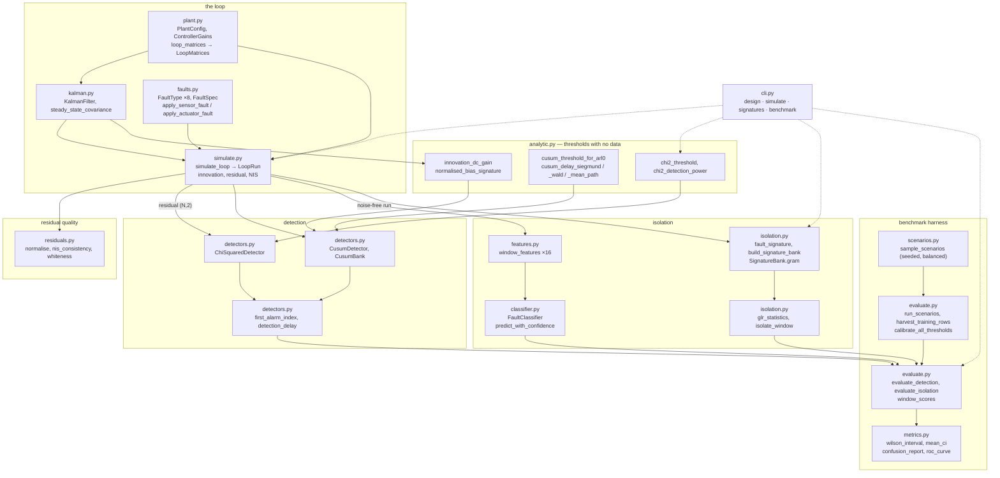
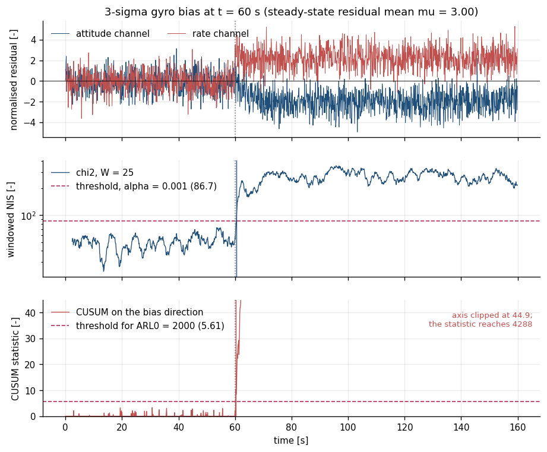
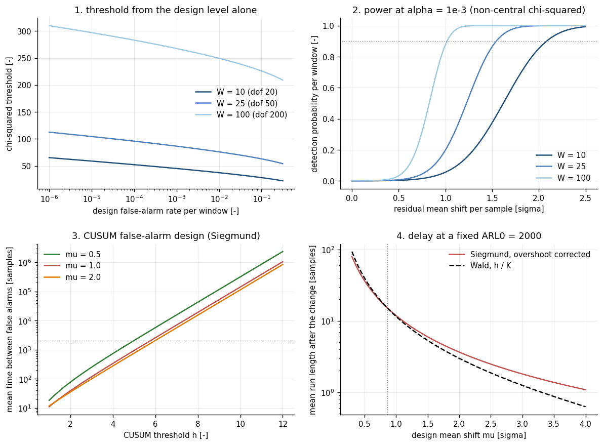
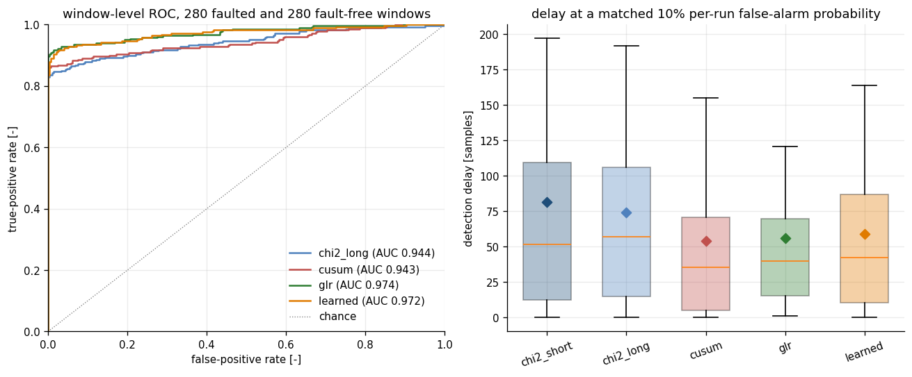
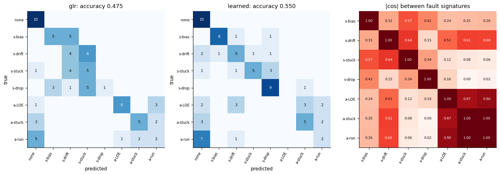

# fdiscope

Residual-based fault detection and isolation for a GNC loop, with designed false-alarm rates.

**Status:** TESTING · **Class:** medium · **Validation level:** 2 · **AI:** yes


## The headline result: the classical tests win detection

On 240 held-out scenarios at a common 10 % per-run false-alarm target, the classical
sequential CUSUM detects **every** fault with a mean delay of **54.33 samples** and the
learned random forest detects 0.9952 of them at **56.58 samples** — while running at a
*higher* measured false-alarm rate, **0.1500 against the CUSUM's 0.1389**, and the
classical GLR bank has the highest AUC, **0.9751 against 0.9695**. The CUSUM's threshold
comes from a formula; the classifier's needs a fault-free calibration set, and it did not
transfer (`validation/VALIDATION.md`, V3-C1 **FAIL**). The classifier earns its keep on
*isolation* only: **0.6958 accuracy against the GLR bank's 0.4667** (V4-D2) — and even
there the classical bank wins outright on actuator loss of effectiveness, recall
**0.4667 against 0.1000**.

If you want to know *that* something failed, use the CUSUM in this package. If you want
to know *what* failed, the classifier is worth its complexity, except for loss of
effectiveness. Everything below is measured, and the losses are in the same tables as the
wins.

## The problem

A residual test is four lines of NumPy; the threshold that decides whether it works is
not. Engineers pick a chi-squared limit off a plot, discover in flight that the loop
false-alarms once a day, and raise it until the alarms stop — at which point nobody knows
what fault size is still detectable or how long detection will take. The literature has
closed-form answers for all three quantities; this package implements them and then
measures whether its own implementation delivers them.

## What this does

- **Buys a false-alarm rate with a formula and then checks the receipt.** Over 342 000
  fault-free closed-loop samples, the sliding chi-squared test's measured false-alarm rate
  contains its design `alpha` in **6 of 6** Wilson intervals across two decades of design
  level and two window lengths — 0.099123 at a design 1e-1 and 0.001096 at a design 1e-3,
  with no tuning of any kind (V1-A2). The CUSUM's measured mean time between false alarms
  matches the Siegmund expression to ratios of **0.9945, 1.0759 and 0.8528** (V1-A4).
- **Predicts detection delay, and reports where the prediction breaks.** In the exact
  change-point model the measured CUSUM run length matches Siegmund in **9 of 9** cells
  within 10 %, worst disagreement **2.94 %** (V2-B1a). In the closed loop the same
  prediction **fails** at the smallest bias — ratio **1.4706** at 1σ against a 25 %
  tolerance fixed before the run — because the estimator absorbs part of the bias first
  (V2-B2a **FAIL**, reported, not tuned away).
- **Injects seven fault modes into a real closed loop.** Sensor bias, drift, stuck and
  dropout; actuator loss of effectiveness, stuck and runaway, each into a
  Kalman-filter-plus-PD attitude loop, with the residual normalised to `N(0, I)` and
  checked for whiteness first (mean NIS **2.003549** inside [1.993303, 2.006708],
  V1-A1).
- **Benchmarks five methods on identical held-out data and publishes the full 8×8
  confusion matrices.** Two chi-squared windows, a channel CUSUM bank, a classical GLR
  signature bank and a random forest, scored once on the same 240 scenarios. Nothing is
  summarised to a single accuracy number (V4-D2).
- **Names the hypotheses that are structurally inseparable.** The cosine between the
  actuator-stuck and actuator-runaway signatures is **−0.9966**, so the classical GLR bank
  cannot separate them at any sample size, and the confusion matrix shows exactly that
  (V4-D1).

## Who it's for

- GNC and ADCS engineers choosing an FDI threshold who want the false-alarm rate, the
  detectable fault size and the detection delay as three numbers with sources, not as a
  tuning session.
- Anyone who has to justify an FDI design review and needs the empirical false-alarm rate
  of the test they are proposing, measured rather than assumed.
- People deciding whether a learned fault classifier is worth the trouble, who want the
  classical baseline implemented properly, calibrated to the same operating point, and
  reported in the same table — including the four classes where it wins.

## Who it's not for

- **Flight software.** Research-grade. Nothing here is flight-qualified, certified, or
  approved for operational use, and the model is not certified for operational flight use.
- **Anyone with a real innovation sequence.** The filter model here is *exactly* the plant
  model, so the fault-free residual is exactly white. A real filter is mismatched and its
  innovation is not white, which breaks the distributional assumption every method in this
  package rests on — the classical ones included. Nothing here measures that gap.
- **Anyone who needs a general time-series anomaly detector.** If you have a stream and no
  filter model, `ruptures` or `river` are better tools; see the table below.
- **Multi-axis or multi-fault work.** One axis, one inertia, one gain set, one reference
  manoeuvre, exactly one fault at a time.
- **Anyone wanting the learned classifier as a detector.** It loses to both classical
  sequential tests on delay and has no threshold formula.

## Alternatives, honestly

Versions checked on PyPI on 2026-10-02 (`GET https://pypi.org/pypi/<name>/json`). GitHub
was not reachable from the build environment, so no repository claim is made beyond
PyPI's own metadata, and tools that do not publish to PyPI are listed separately below.

| Alternative | What it does better | When to use this instead |
|---|---|---|
| **`ruptures`** 1.1.10, BSD-2-Clause — offline change point detection for signals | A mature, general change-point library: multiple cost functions and search strategies, no model of your system required. **For detecting a change in an arbitrary signal, this is the better tool for most users.** | Your signal is a Kalman innovation, you want the threshold derived from the filter's own `S` and a target false-alarm rate, and you want the fault *isolated* against model-derived signatures. |
| **`river`** 0.26.1 — online machine learning, including concept-drift detection | Streaming-first design, incremental estimators, a large detector zoo, and an active community. Use it if your data arrives as an unbounded stream and you want drift detection as a service. | You need a false-alarm rate tied to a closed-form distribution and a detection delay you can predict before you run anything. |
| **`alibi-detect`** 0.13.0, Business Source License 1.1 — outlier, adversarial and drift detection | Far broader detector coverage, including deep and multivariate drift tests. Note the licence is **not** OSI-approved; check it before use in a product. | Apache-2.0 matters to you, or you want the GNC-specific residual pipeline rather than generic drift. |
| **`pyod`** 3.6.6 and **`adtk`** 0.6.2 (MPL-2.0) — anomaly / unsupervised time-series anomaly detection | Dozens of detectors, benchmarking utilities, and a much larger user base than anything here. | You want a *model-based* residual test with an analytic threshold, not an unsupervised anomaly score. |
| **`salesforce-merlion`** 2.0.4, 3-Clause BSD — time-series anomaly detection and forecasting framework | A full framework with evaluation pipelines and AutoML over detectors. | You care about the physics of the loop producing the residual, and want fault *isolation* against seven named GNC failure modes. |
| **`filterpy`** 1.4.5, MIT and **`pykalman`** 0.11.2 — Kalman filtering | The filters themselves: more variants, more documentation, more heritage. `filterpy` is the right answer if you need a filter. | You already have a filter and need the FDI layer on top of its innovation. The filter in this package exists only to generate residuals and is deliberately minimal. |
| **`spc`** 0.3 (MIT) and **`pyspc`** 0.4 (GPLv3) — statistical process control charts | Industrial SPC chart families and plotting conventions. | You want the sequential test in its log-likelihood-ratio form with the Siegmund overshoot correction and a measured ARL0, applied to a vector residual. |
| Basseville & Nikiforov 1993; Willsky 1976; Gertler 1998; Chen & Patton 1999 | They are the source. Every expression in this package is in them. | You want the expressions executable, unit-tested, and checked against measurement — including the two checks where the measurement disagreed. |

**Not verified from this environment.** Basilisk (AVS Lab) and NASA GSFC's 42 are the
obvious full-simulation alternatives with actuator fault modes, and both would be the
right choice for closed-loop fault campaigns inside a real 6-DOF simulator. Neither could
be checked this session: GitHub was unreachable, and the PyPI name `basilisk` (version
0.1) resolves to an unrelated object-NoSQL mapper, not the spacecraft simulator. Treat
both as pointers, not as verified claims.

**Be clear about the contribution.** There is no new algorithm here. The chi-squared NIS
test, Page's CUSUM, Siegmund's overshoot correction and Willsky's GLR bank are all
textbook. What this repository adds is: those thresholds *measured* against their design
values on 342 000 fault-free samples rather than asserted; a closed-loop delay measurement
that disagrees with the step-change theory by a factor of 1.40 to 1.88 and says why; and a
learned classifier benchmarked against four classical methods at a matched operating
point, with every table it loses printed next to the one it wins.

## Install and first run

```bash
git clone https://github.com/OmAcharya-avtr/fdiscope.git
cd fdiscope
python -m venv .venv && source .venv/bin/activate
pip install -e ".[test,examples]"
python -m pytest tests/ -q
python examples/residual_traces.py
```

The test run ends with:

```
435 passed in 41.05s
```

and the example prints:

```
saved /path/to/fdiscope/screenshots/residual_traces.png
mean NIS before onset    = 2.0569  (expect 2.0)
mean NIS after onset     = 10.7181
chi2 threshold           = 86.6608 (W = 25, alpha = 0.001)
CUSUM threshold          = 5.6105 (mu = 3.0000, ARL0 = 2000)
chi2 detection delay     = 5 samples (0.5 s)
CUSUM detection delay    = 3 samples (0.3 s)
false alarms before onset = chi2 0, CUSUM 0
```

Both thresholds came from a design level and a target run length, not from the data. Those
two detection delays are one run of one fault; the distributions are in Validation
evidence below.

## A worked example

Detect and isolate one 4σ gyro bias, with both the classical bank and the learned model.

```python
import numpy as np
from fdiscope import (
    BenchmarkConfig, ChiSquaredDetector, CusumDetector, FaultClassifier, FaultSpec,
    FaultType, LoopConfig, build_default_bank, build_filter, cusum_threshold_for_arl0,
    detection_delay, harvest_training_rows, isolate_window, loop_matrices,
    nis_consistency, normalised_bias_signature, run_scenarios, sample_scenarios,
    simulate_loop, window_features,
)

cfg = BenchmarkConfig()                            # 25/100-sample windows, alpha = 1e-3
kf = build_filter(loop_matrices(cfg.plant))
sigma = np.sqrt(cfg.plant.gyro_var_rad2_s2)        # rate-gyro 1-sigma [rad/s]
fault = FaultSpec(FaultType.SENSOR_BIAS, onset_step=600, magnitude=4.0 * sigma, channel=1)
run = simulate_loop(LoopConfig(n_steps=1600, seed=7), fault)

check = nis_consistency(run.residual[:600])        # is the fault-free residual N(0, I)?
print(f"pre-onset mean NIS   {check.mean_nis:.4f}  consistent={check.consistent}")

chi2 = ChiSquaredDetector(window=cfg.det_window, alpha=cfg.alpha)
d_chi2 = detection_delay(chi2.run(run.residual).alarm, 600)
direction, mu = normalised_bias_signature(kf, np.array([0.0, 4.0 * sigma]))
h = cusum_threshold_for_arl0(2000.0, mu)
cusum = CusumDetector(direction=direction, mu=mu, threshold=h)
d_cusum = detection_delay(cusum.run(run.residual).alarm, 600)
print(f"chi2  threshold {chi2.threshold:9.4f}  delay {d_chi2:5.0f} samples")
print(f"cusum threshold {h:9.4f}  mu {mu:.4f}  delay {d_cusum:5.0f} samples")

win = run.residual[600:700]                        # the isolation window, onset known
glr = isolate_window(win, build_default_bank(cfg), alpha=cfg.alpha)
print(f"glr      -> {glr.fault.value:12s} conf {glr.confidence:.4f}  stat {glr.statistic:.1f}")

train = sample_scenarios(64, 1000)                 # 8 of each class, seeds 1000-1063
x, y = harvest_training_rows(train, run_scenarios(train, cfg), cfg)
clf = FaultClassifier(n_estimators=150).fit(x, y)
pred = clf.predict_with_confidence(window_features(win))
print(f"learned  -> {pred.classes[0].value:12s} conf {pred.confidence[0]:.4f}  "
      f"detection score {pred.detection_score[0]:.4f}")
```

```
pre-onset mean NIS   1.9652  consistent=True
chi2  threshold   86.6608  delay     3 samples
cusum threshold    5.0202  mu 4.0000  delay     2 samples
glr      -> sensor_drift conf 1.0000  stat 835.6
learned  -> sensor_bias  conf 0.8572  detection score 1.0000
```

Read the last two lines. Both detectors found the fault in two or three samples. The
classical GLR bank then isolated it as a **sensor drift** with a confidence of **1.0000**,
and the classifier got it right at 0.8572. That is the whole argument of this repository in
five lines: the classical posterior is not a probability — measured over 240 held-out runs
it sits in the top confidence bucket 137 times out of 182 with mean confidence 0.9973 and
accuracy 0.4599, a calibration gap of **+0.5375** (V4-D4). This single run runs a reduced
64-scenario training set and so is not the published benchmark; see V4-D2 for that.

## Architecture



## Configuration

Everything is an argument; there are no configuration files and no global state.

| Where | Knob | Default | Effect |
|---|---|---|---|
| `PlantConfig` | `inertia_kgm2`, `dt_s`, `torque_noise_psd` | 12.0, 0.1, 4e-8 | the plant and its disturbance |
| `PlantConfig` | `attitude_var_rad2`, `gyro_var_rad2_s2` | 7.6154e-7 (0.05°), 1.2185e-7 (0.02°/s) | sensor 1σ, and therefore the unit of every "sigma" fault magnitude |
| `PlantConfig` | `max_torque_nm` | 0.05 | wheel clip; a saturated wheel changes the residual |
| `ControllerGains` | `natural_freq_rad_s`, `damping` | 0.35, 0.707 | closed-loop bandwidth; sets how fast the loop absorbs a bias |
| `LoopConfig` | `n_steps`, `seed`, `noise` | 3000, 0, `True` | `noise=False` gives the deterministic signatures the GLR bank is built from |
| `LoopConfig` | `ref_amplitude_rad`, `ref_period_s` | 0.02, 60.0 | without a non-zero commanded torque an actuator loss of effectiveness is unobservable |
| `ChiSquaredDetector` | `window`, `alpha` | 20, 1e-3 | threshold is `chi2.isf(alpha, window*dim)` and nothing else |
| `CusumDetector` | `direction`, `mu`, `threshold` | — | under-estimating `mu` costs delay, over-estimating costs small-fault sensitivity |
| `BenchmarkConfig` | `det_window`, `iso_window` | 25, 100 | the 100-sample isolation window is a floor on the classifier's delay |
| `BenchmarkConfig` | `cusum_mu`, `cusum_arl0` | 1.0, 2000.0 | the sequential design point |
| `isolate_window` | `alpha` | 1e-3 | family-wise; per-hypothesis threshold is `chi2.isf(alpha/J, 1)` |
| `build_default_bank` | `n_onsets` | 8 | onset phases a signature is averaged over; see Limitation 4 |
| `FaultClassifier` | `n_estimators`, `max_depth`, `min_samples_leaf` | 300, 12, 2 | the benchmark uses 150 trees; `n_jobs` is fixed at 1 |

## Examples

Four, each writing a PNG to `screenshots/` with the Agg backend. Runtimes measured on the
two-core build machine.

| Script | Runtime | What it produces |
|---|---|---|
| `examples/residual_traces.py` | 2.4 s | one 3σ gyro bias, both detectors, first-alarm markers |
| `examples/threshold_design.py` | 2.9 s | the four closed-form design curves, no simulation |
| `examples/confusion_matrices.py` | 7.7 s | both 8×8 confusion matrices and the signature Gram matrix |
| `examples/roc_curves.py` | 15.6 s | window-level ROC for all five methods, and the delay spread |

The last two run a **reduced** campaign (80 training / 80 held-out scenarios) so they
finish in about a minute, and they say so on every run. The published numbers come from
`validation/detection_benchmark.py` and `validation/isolation_confusion.py`, which use
three times the data. Cite those, not the figures.

## Screenshots



Notice the middle panel. The windowed chi-squared statistic sits around 50 before onset
against a threshold of 86.7 — close enough that a careless threshold choice would alarm
constantly — and then jumps by an order of magnitude. The bottom panel is why the CUSUM is
faster: it is at zero for almost the whole fault-free stretch and then leaves the axis
entirely, reaching 4288 against a threshold of 5.61.



Notice panel 4. The Wald approximation `h/K` (dashed) and Siegmund's overshoot-corrected
expression (solid) cross at `mu = 0.858`, and below that point the simpler formula is
pessimistic while above it it is optimistic by up to 37 %. That crossing is measured in
V2-B1b, not just drawn.



Notice that the classical GLR curve (green) sits above the learned curve (orange)
everywhere in the low-false-positive region that matters, and that in the right-hand panel
the delay boxes overlap almost completely. This figure is the reduced 80/80 example
campaign; the published AUCs are glr 0.9751 against learned 0.9695 (V3-C4).



Notice the right-hand panel, then look left. `|cos|` between the actuator-stuck and
actuator-runaway signatures is 1.00 to two decimals (−0.9966 exactly, V4-D1), and the
classical bank's bottom-right block is correspondingly scattered. Again the reduced
campaign: the published accuracies are 0.4667 and 0.6958.

## Validation evidence

Full detail, protocol and raw script output: `validation/VALIDATION.md` and the
`*_output.txt` files beside it. The summary table there has **17 entries: 7 PASS, 2 FAIL,
8 reported measurements.** Both failures are kept. No tolerance was widened and no seed
was reselected.

| ID | Check | Reference | Result | Criterion |
|---|---|---|---|---|
| V1-A1 | Fault-free residual is `N(0, I)` and white | filter consistency, 342 000 samples | mean NIS **2.003549** in [1.993303, 2.006708]; max \|autocorr\| 1.28e-3 vs 4σ 6.84e-3 | PASS |
| V1-A2 | Chi-squared false-alarm rate vs design `alpha` | `chi2.isf`, 6 cells, two decades | **6 of 6** Wilson intervals contain `alpha` | PASS |
| V1-A3b | `chi2_false_alarm_rate(chi2_threshold(a,k),k)` round trip | closed form | worst relative error **7.806e-15** | ≤ 1e-9, PASS |
| V1-A4 | CUSUM mean time between false alarms | Siegmund 1985 | ratios **0.9945, 1.0759, 0.8528** | factor 1.5, PASS |
| V2-B1a | CUSUM run length, exact change-point model | Siegmund 1985 | **9 of 9** within 10 %, worst **2.94 %** | PASS |
| V2-B1b | Same against Wald `h/K` | Basseville & Nikiforov 1993 | ratio 0.914–1.372, sign flip at `mu = 0.858` | measurement |
| **V2-B2a** | Closed-loop delay, mean-path prediction vs measured median | `analytic.cusum_delay_mean_path` | 3 of 4 cells within 25 %; **1σ cell ratio 1.4706** | **FAIL** (1 of 4) |
| V2-B2b | Same against Siegmund at steady-state `mu` | Siegmund 1985 | measured/analytic **1.40–1.88** | measurement |
| **V3-C1** | Per-run false-alarm probability vs the 10 % target | Wilson interval, 180 held-out fault-free runs | chi2 0.1167 / 0.1222 PASS, cusum 0.1389 PASS; **glr 0.0389 FAIL, learned 0.1500 FAIL** | **FAIL** (2 of 5) |
| V3-C2 | Detection rate within a 600-sample horizon | — | 0.9857–1.0000, all ≥ 0.95 | PASS |
| V3-C3 | Mean detection delay at the matched operating point | — | **cusum 54.33**, glr 54.27, learned 56.58, chi2 71.42 / 75.76 samples | measurement |
| V3-C4 | Detection AUC | — | **glr 0.9751**, learned 0.9695, cusum 0.9459, chi2_long 0.9411 | measurement |
| V4-D1 | Signature separability | `SignatureBank.gram` | worst \|cos\| **0.9966**, actuator stuck vs runaway | measurement |
| V4-D2 | Isolation accuracy, full 8×8 matrices | chance 0.1250 | glr **0.4667** [0.4046, 0.5298], learned **0.6958** [0.6349, 0.7506] | both above chance, PASS |
| V4-D3 | Isolation accuracy under onset misalignment | — | at −50 samples glr 0.2167, learned 0.3542; both peak at +25 | measurement |
| V4-D4 | Confidence calibration | — | glr over-confident by **+0.5375**; learned within **±0.20** | measurement |

### Where each method wins

Per-class mean detection delay, in samples, at the matched operating point (V3-C3). The
CUSUM is fastest on all four sensor faults, the classical GLR bank on all three actuator
faults, and **the learned classifier is never fastest on any class**.

| fault class | `chi2_short` | `chi2_long` | `cusum` | `glr` | `learned` |
|---|---:|---:|---:|---:|---:|
| sensor_bias | 4.2 | 6.9 | **3.2** | 13.0 | 4.9 |
| sensor_drift | 76.1 | 76.3 | **48.3** | 51.6 | 58.4 |
| sensor_stuck | 38.7 | 45.1 | **26.2** | 33.2 | 35.5 |
| sensor_dropout | 5.3 | 6.6 | **1.7** | 7.0 | 3.7 |
| actuator_loss_of_effectiveness | 91.5 | 96.5 | 62.5 | **61.1** | 70.6 |
| actuator_stuck | 99.9 | 104.4 | 83.6 | **82.4** | 85.3 |
| actuator_runaway | 189.8 | 194.0 | 154.8 | **131.6** | 136.0 |

Isolation recall per class (V4-D2). The classifier wins six of seven, and loses loss of
effectiveness by 4.7×.

| fault class | `glr` recall | `learned` recall |
|---|---:|---:|
| none | 1.0000 | 1.0000 |
| sensor_bias | 0.6667 | **0.9667** |
| sensor_drift | 0.4667 | **0.7333** |
| sensor_stuck | 0.5000 | **0.9333** |
| sensor_dropout | 0.0333 | **0.9667** |
| actuator_loss_of_effectiveness | **0.4667** | 0.1000 |
| actuator_stuck | 0.4333 | **0.5333** |
| actuator_runaway | 0.1667 | **0.3333** |
| **overall accuracy** | 0.4667 | **0.6958** |

### The asymmetry the delay table hides

| method | design formula | calibrated from data | note |
|---|---:|---:|---|
| `chi2_short` | 86.6608 | 92.1187 | closed form, needs no data |
| `chi2_long` | 267.5405 | 270.8737 | closed form, needs no data |
| `cusum` | 5.7504 | 9.1133 | closed form, needs no data |
| `glr` | — | 17.3754 | **no closed form: unusable without fault-free data** |
| `learned` | — | 0.7921 | **no closed form: unusable without fault-free data** |

All delays above are measured at the *calibrated* thresholds so that the methods are
comparable. The three methods with a closed-form threshold landed inside their Wilson
interval on held-out data; the two calibrated ones did not (V3-C1).

## Engineering theory

Every expression carries its source, units, assumptions and validity range in its
docstring. The load-bearing ones:

| Expression | Source | Units | Validity |
|---|---|---|---|
| `eps_k = y_k^T S^-1 y_k ~ chi2(m)`; windowed sum `~ chi2(Wm)` | Bar-Shalom, Rong Li & Kirubarajan 2001 §5.4; Mehra & Peschon, *Automatica* 7(5), 1971, 637–640 | dimensionless | requires a consistent filter and independent samples; overlapping windows are correlated and the package measures both rates |
| `h = F^-1_{chi2(Wm)}(1 - alpha)` | same | dimensionless | exact under `H0`; measured in V1-A2 |
| `s_k = mu p_k - mu^2/2`, `g_k = max(0, g_{k-1} + s_k)` | Page, *Biometrika* 41(1/2), 1954, 100–115 | dimensionless | unit-variance Gaussian `p_k`; a wrong `mu` costs delay or sensitivity |
| `E_1[tau] ≈ h/K = 2h/mu^2` | Basseville & Nikiforov 1993, ch. 2, 5 | samples | ignores boundary overshoot; over-predicts below `mu = 0.858`, under-predicts above |
| `E_1[tau] ≈ (2/mu^2)(e^-b + b - 1)`, `b = mu(h/mu + 1.1652)` | Siegmund, *Sequential Analysis*, Springer, 1985 | samples | Brownian approximation with overshoot correction; 9/9 within 10 % in V2-B1a |
| GLR statistic `(phi_j^T r)^2`, Bonferroni `chi2.isf(alpha/J, 1)` | Willsky, *Automatica* 12(6), 1976, 601–611 | dimensionless | assumes exactly one of the `J` modelled faults; fails outright when two signatures are collinear (V4-D1) |
| innovation DC gain; `L^-1 y_ss` as a CUSUM direction | standard steady-state Kalman algebra | rad, rad/s → dimensionless | the DC gain from a constant attitude-sensor bias to the innovation is exactly zero, which is why the two drift sampling ranges differ by an order of magnitude |

## AI model details

Full card: **`MODEL_CARD.md`**. Dataset: **`DATASET_CARD.md`**.

- **Four classical baselines first.** `chi2_short`, `chi2_long`, `cusum` and the `glr`
  bank were written, unit-tested and validated before any learned component, and all four
  are scored on the identical held-out windows at the identical calibrated false-alarm
  rate.
- **Model.** `sklearn.ensemble.RandomForestClassifier(n_estimators=150, max_depth=12,
  min_samples_leaf=2, class_weight="balanced", random_state=0, n_jobs=1)` over the sixteen
  features of `fdiscope.features.window_features`. No PyTorch, no GPU.
- **The model sees only what the classical tests see.** Every feature is computed from the
  normalised residual window; no true state, no fault label and no plant parameter enters
  the feature vector.
- **Splits.** Training scenarios seeds 1000–1239, held out 5000–5239, threshold calibration
  9000–9149 (all fault-free), held-out fault-free 12000–12149. Disjoint by construction,
  with every window of a scenario on the same side. The held-out set was scored once per
  method; no held-out result reselected a hyperparameter, a seed or a tolerance.
- **Uncertainty.** `predict_with_confidence` returns the winning vote fraction. It is an
  ensemble-agreement heuristic, **not** a calibrated probability: under-confident below
  0.8 and over-confident above it, gaps to 0.20 (V4-D4). No isotonic or Platt
  recalibration was fitted. The classical GLR posterior is far worse, +0.5375.
- **Result.** Loses detection on delay, false-alarm transfer and AUC; wins isolation
  0.6958 against 0.4667; loses actuator loss of effectiveness 0.1000 against 0.4667.
- **What it leans on.** The two features that reproduce the chi-squared test (`mean_nis`,
  `exceed_frac`) carry 0.1403 of the impurity importance between them, so 86 % of the
  model's split value comes from structure the chi-squared test discards — which is
  consistent with it winning isolation and not detection (V4-D5).
- **Failure cases** are listed in `MODEL_CARD.md`: no threshold formula, no
  out-of-distribution guard, a 100-sample window that floors its delay, 240 effective
  rather than 1440 independent samples, and exactly one fault at a time.

**This model is not certified for operational flight use.**

## Hardware requirements

Two CPU cores, no GPU, `n_jobs=1` throughout. Peak memory stays under 400 MB
(`MODEL_CARD.md`). The 435-test suite takes about 100 s (`validation/VALIDATION.md`); it
ran in 41 s in the clean virtual environment used for this release build. The four
validation scripts total **≈ 227 s** — 3.7 s, 133.9 s, 62.8 s and 26.1 s — each inside the
three-minute, two-core budget. Dataset regeneration is about 17 s.

## API reference

<details>
<summary>Public surface, one line each, with units</summary>

**Plant and loop** — `PlantConfig(inertia_kgm2, dt_s, torque_noise_psd, attitude_var_rad2,
gyro_var_rad2_s2, max_torque_nm)`; `ControllerGains(natural_freq_rad_s, damping)` with
`.kp`, `.kd`, `.torque(x_hat, J) -> N m`; `loop_matrices(config) -> LoopMatrices` (ZOH
`F`, `G`, `H`, `Q`, `R`); `LoopConfig(plant, gains, n_steps, ref_amplitude_rad,
ref_period_s, seed, noise, x0)`; `simulate_loop(config, fault) -> LoopRun` with `t_s` [s],
`x_true`/`x_est` [rad, rad/s], `innovation` [rad, rad/s], `residual` (dimensionless,
`N(0,I)` under `H0`), `nis`, `u_cmd_nm`/`u_actual_nm` [N m], `innovation_cov`, `chol_s`,
`onset_step`, `fault`; `build_filter(matrices) -> KalmanFilter`.

**Estimator** — `KalmanFilter(f, g, h, q, r)` with `.predict(state, u) -> KalmanState` and
`.update(state, z) -> UpdateResult`; `KalmanState(x, p)`;
`steady_state_covariance(kf) -> (P, S)`; `symmetrize(p)`.

**Faults** — `FaultType` (`NONE`, `SENSOR_BIAS`, `SENSOR_DRIFT`, `SENSOR_STUCK`,
`SENSOR_DROPOUT`, `ACTUATOR_LOSS_OF_EFFECT`, `ACTUATOR_STUCK`, `ACTUATOR_RUNAWAY`);
`FAULT_CLASSES`, `SENSOR_FAULTS`, `ACTUATOR_FAULTS`, `class_index(fault) -> int`;
`FaultSpec(kind, onset_step, magnitude, channel)` — magnitude in [rad] or [rad/s] for a
bias, [rad/s] or [rad/s²] for a drift *rate*, dimensionless `(0, 1]` for loss of
effectiveness, [N m/s] for a runaway ramp; `apply_sensor_fault`, `apply_actuator_fault`.

**Residual quality** — `normalise(innovation, S) -> (N,m)` dimensionless;
`nis_from_residual(r) -> (N,)`; `nis_consistency(r, level) -> NisCheck` with `.mean_nis`,
`.low`, `.high`, `.consistent`; `whiteness(r, max_lag) -> (autocorr (L,m), band)`.

**Analytic design (`analytic`)** — `chi2_threshold(alpha, dof)`,
`chi2_false_alarm_rate(threshold, dof)`, `chi2_detection_power(threshold, dof, lambda)`,
all dimensionless; `cusum_kl_information(mu) = mu²/2`; `cusum_delay_wald(h, mu)`,
`cusum_delay_siegmund(h, mu)`, `cusum_arl0_siegmund(h, mu)`,
`cusum_threshold_for_arl0(arl0, mu)`, `cusum_delay_mean_path(...)`, all in samples;
`steady_state_gain(kf)`, `innovation_dc_gain(kf)`,
`steady_state_innovation_mean(kf, bias)` [rad, rad/s],
`normalised_bias_signature(kf, bias) -> (unit direction, mu)`; `SIEGMUND_RHO = 1.1652`.

**Detectors** — `ChiSquaredDetector(window, dim, alpha)` with `.dof`, `.threshold`,
`.run(residual) -> DetectorOutput`; `CusumDetector(direction, mu, threshold, label)` with
`.project`, `.increments`, `.run(residual, reset_on_alarm)`;
`CusumBank(detectors)` with `.names`, `.statistics`, `.run_lengths`, `.run`, `.isolate`;
`DetectorOutput(statistic, alarm, threshold, label)` with `.alarm_fraction`;
`first_alarm_index(alarm, start, persistence) -> int`;
`detection_delay(alarm, onset_step, persistence) -> float` samples (**an index
difference, one less than the run length the `analytic` expressions return**).

**Isolation** — `fault_signature(config, spec, window, onset_steps) -> (W*m,)`;
`build_signature_bank(config, specs, window, onset_steps) -> SignatureBank` with
`.gram() -> (J,J)` cosines; `glr_statistics(window, bank) -> (J,)`;
`isolate_window(window, bank, alpha) -> IsolationResult` with `.fault`, `.statistic`,
`.threshold`, `.scores`, `.posterior`, `.confidence`.

**Learned model** — `feature_names() -> 16 names`, `N_FEATURES = 16`;
`window_features(window) -> (16,)` dimensionless;
`feature_matrix(residual, window, stride, start) -> (features, end_index)`;
`FaultClassifier(n_estimators, max_depth, min_samples_leaf, random_state, class_weight)`
with `.fit`, `.predict_proba`, `.predict_with_confidence -> ClassifierPrediction`,
`.detection_score -> 1 - P(none)`, `.feature_importances() -> dict`.

**Scenarios and benchmark** — `sample_scenario(seed, index, plant, ranges, n_steps,
fault_class) -> Scenario`; `sample_scenarios(n, seed0, ...)` (classes cycled, exactly
balanced for a multiple of 8); `MagnitudeRanges`, `DEFAULT_RANGES`, `ScenarioSet`;
`BenchmarkConfig(det_window, iso_window, alpha, cusum_mu, cusum_arl0, plant, gains,
roc_offsets)`; `default_signature_specs`, `build_cusum_bank`, `build_default_bank`,
`default_scenario_sets`, `design_thresholds`; `run_scenarios`, `harvest_training_rows`,
`healthy_calibration_runs`, `calibrate_threshold`, `calibrate_all_thresholds`,
`sequential_scores`, `sequential_alarms`, `window_scores`;
`evaluate_detection -> {name: MethodResult}` (`.delays` samples, `.censored`,
`.far_per_sample`, `.detection_rate`, `.delays_for(fault)`);
`evaluate_isolation -> IsolationOutcome`; `method_names`, `class_labels`.

**Metrics** — `wilson_interval(successes, trials, level) -> Interval`;
`mean_ci(values, level) -> Interval` with `.half_width`, `.contains`;
`confusion_matrix(truth, pred, n_classes)`; `confusion_report(...) -> ConfusionReport`
with `.to_text()`; `roc_curve(scores, labels, label) -> RocCurve` with `.auc`,
`.tpr_at_fpr(f)`.

**CLI** — `python -m fdiscope design | simulate | signatures | benchmark`
(also installed as `fdiscope`). `benchmark` runs a reduced campaign and says so on every
run; the published numbers come from `validation/`.

</details>

## Limitations

**Learned-model numbers are tied to a scikit-learn version.** Every classical
figure in `validation/` reproduces bit-identically across environments. The
learned classifier's figures do not: re-running the validation suite under
scikit-learn 1.9.1 / Python 3.13 moved the calibrated threshold from 0.7921 to
0.8504, the false-alarm rate from 0.1500 to 0.1444, and every per-class
isolation recall — `actuator_loss_of_effectiveness` recall moved 0.1000 to
0.1667. The shift is deterministic, not run-to-run noise: a re-run under the
same libraries reproduces bit for bit. The numbers of record in
`validation/VALIDATION.md` and `MODEL_CARD.md` are those measured under the
Python 3.11 environment stated in the validation document, and `pyproject.toml`
pins only `scikit-learn>=1.3`. `MODEL_CARD.md`'s reproducibility claim therefore
holds *within* one library version, not across versions, and the test backing it
compares two fits inside a single process so it cannot detect this. Pin the
library set if you need the published figures to reproduce.

1. **The filter model is exactly the plant model.** The fault-free innovation is therefore
   exactly white with exactly the modelled covariance. A real filter is mismatched, its
   innovation is coloured, and the chi-squared distribution every method here rests on —
   classical ones included — no longer holds. **This is the single largest gap between
   this package and reality, and nothing in the repository measures it.**
2. **The closed-loop delay disagrees with the step-change theory by 1.40 to 1.88×**
   (V2-B2b), and the mean-path prediction **fails outright at a 1σ bias**, ratio 1.4706
   (V2-B2a). Use the measured numbers, not `cusum_delay_siegmund`, for closed-loop
   budgeting.
3. **Two of the five methods' thresholds did not transfer** to held-out fault-free data:
   `glr` at 0.0389 and `learned` at 0.1500 against a 0.10 target (V3-C1 FAIL). Any
   data-calibrated threshold here carries that error; the closed-form ones do not.
4. **The classical bank cannot separate actuator stuck from actuator runaway**, cosine
   −0.9966, at any sample size (V4-D1). Averaging a signature over eight onset phases also
   destroys the dropout signature: recall 0.0333 (V4-D2).
5. **Isolation assumes the onset sample is known.** Both methods place their window at the
   true onset, which no detector can do. At −50 samples the classifier loses 49 % of its
   accuracy and the GLR bank 54 % (V4-D3). The absolute accuracies are optimistic for both.
6. **The classifier's 100-sample window is a floor on its detection delay.** A CUSUM
   updates every sample and has no such floor; that is most of the 2.25-sample gap.
7. **Neither confidence output is a probability.** GLR over-confidence reaches +0.5375;
   the forest's vote fraction is within ±0.20 but uncalibrated (V4-D4).
8. **One axis, one inertia, one gain set, one reference manoeuvre, one fault at a time.**
   No cross-coupling, no actuator dynamics, no coloured sensor noise, no environmental
   disturbance torque beyond white noise, no reconfiguration after detection. The full
   list is in `DATASET_CARD.md`.
9. **The false-alarm rates are measured over 306 000 to 342 000 samples**, which resolves a
   1e-3 per-sample rate to roughly ±20 % and cannot resolve 1e-5 at all.
10. **No comparison against another FDI implementation**, and no comparison against a real
    innovation sequence. Every check is against a closed-form expression.

## Reproducing every number

From the repository root:

```bash
# tests: 435 passed
python -m pytest tests/ -q

# lint
ruff check src/ tests/

# validation; each writes its raw stdout next to itself
python validation/chi2_false_alarm.py       # V1,   3.7 s
python validation/cusum_delay.py            # V2, 133.9 s
python validation/detection_benchmark.py    # V3,  62.8 s
python validation/isolation_confusion.py    # V4,  26.1 s

# dataset (rebuilds data/training_*.csv and the sha256 manifest)
python data/generate_dataset.py

# figures
python examples/residual_traces.py
python examples/threshold_design.py
python examples/confusion_matrices.py
python examples/roc_curves.py

# CLI
python -m fdiscope design --alpha 1e-3 --window 25 --bias-sigma 4
python -m fdiscope simulate --fault actuator_runaway --magnitude 1e-4 --units physical
python -m fdiscope signatures --window 100 --onsets 8
python -m fdiscope benchmark
```

Seeds: training scenarios 1000–1239, held out 5000–5239, calibration 9000–9149, held-out
fault-free 12000–12149, chi-squared false-alarm runs 20000–20059, CUSUM delay 31337 and
41000+, `random_state=0` for the forest. Identical seeds give bit-identical predictions,
checked by `tests/test_classifier.py`; pinned reference values live in
`tests/test_benchmark_regression.py`.

## Roadmap

Not commitments; the honest list of what 0.1.0 does not do and what would matter most.

- A deliberately **mismatched** filter, so the whiteness assumption can be broken on
  purpose and every method re-measured against it. This is Limitation 1 and it is the only
  item here that changes the conclusions.
- Onset-phase-conditioned signatures, so the GLR bank's dropout recall of 0.0333 stops
  being an artefact of averaging.
- Calibration of both confidence outputs (isotonic or Platt on a held-out split).
- Detector-driven isolation windows, so the D2 numbers stop assuming a known onset.
- Three-axis dynamics and simultaneous faults.

## Safety statement

This software is research-grade. It is not flight-qualified, not certified, and not
approved for operational aerospace use. The learned classifier is not certified for
operational flight use and must not be used to declare a fault on a real spacecraft, to
trigger a reconfiguration, or to support any go/no-go decision.

## Licence

Apache-2.0. Copyright © 2026 OPTIMA Organisation. See `LICENSE`.

## Credits

This is under reserved rights obtained by OPTIMA Organisation.

## Citation

```bibtex
@software{fdiscope2026,
  title   = {fdiscope: residual-based fault detection and isolation for a GNC loop},
  author  = {{OPTIMA Organisation}},
  year    = {2026},
  version = {0.1.0},
  url     = {https://github.com/OmAcharya-avtr/fdiscope}
}
```
