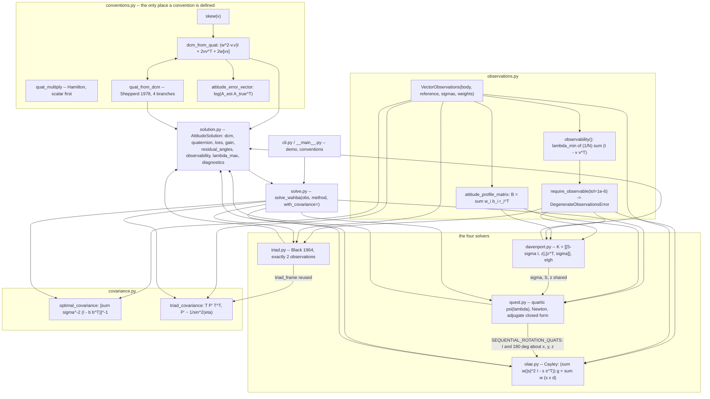
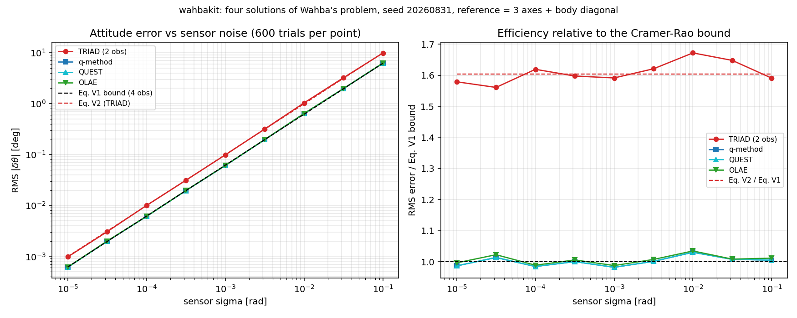
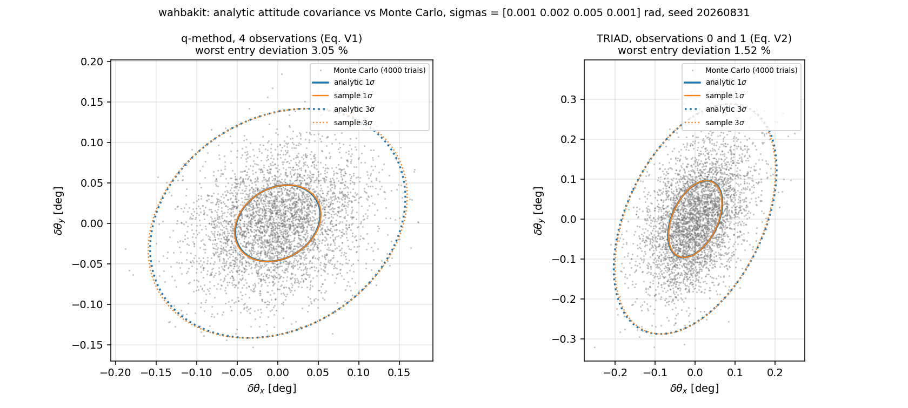
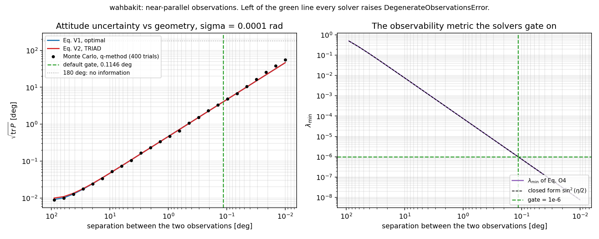

# WahbaKit

Wahba's problem four ways, with the frame and quaternion conventions stated at every call site.


## The problem

You have star-tracker and sun-sensor directions in the body frame, the same
directions in an inertial catalogue, and you need the attitude. Every textbook
gives you TRIAD, the q-method, QUEST and OLAE, and every one of them writes the
quaternion in a different order: Shuster puts the scalar last and defines the
attitude matrix as the transpose of what `scipy.spatial.transform.Rotation`
returns. Get that wrong and nothing fails — you get an orthogonal matrix, a unit
quaternion, and a plausible residual — until the pointing is inverted on orbit.
The second silent failure is geometric: when two observations line up, the
rotation about the common axis is not in the data at all, and every one of these
methods will still hand you a full attitude with no indication that a third of
it was invented.

## What this does

- **Four solvers behind one interface**, all returning the same
  `AttitudeSolution` with the same conventions: TRIAD (Black 1964), Davenport's
  q-method (1968), QUEST (Shuster & Oh 1981) and OLAE (Mortari, Markley &
  Singla 2007). QUEST agrees with the q-method eigenvector to **1.5e-14 rad**
  over 500 random problems; all four agree to **9.1e-13 rad** on noise-free data.
- **Attitude covariance in rad², checked against Monte Carlo.** The Cramér–Rao
  form `P = [Σ σ_i⁻² (I − b_i b_iᵀ)]⁻¹` and the asymmetric TRIAD form both match
  10 000-trial seeded Monte Carlo to **1.6 %** and **1.1 %**, against a 1.4 %
  sampling error. `P_TRIAD − P_opt` is verified positive semi-definite over a
  3 × 3 grid of sensor accuracies.
- **Near-parallel observations raise, they do not answer.** Every solver gates
  on `λ_min` of `(1/N) Σ (I − b_i b_iᵀ)`; the default `1e-6` is a **0.1146°**
  separation, confirmed to 8.4e-06 deg. With the gate switched off, the
  q-method's error grows **1.8e+04×** between 90° and 0.001° of separation while
  the sensor noise is unchanged, and nothing is NaN, non-orthogonal or otherwise
  visibly wrong.
- **The 180° singularity handled, not documented around.** QUEST's closed form
  and OLAE's Gibbs vector are both 0/0 at a rotation of exactly π. Shuster's
  method of sequential rotations is on by default and takes the error from
  **1.1e-06 rad** to **2.7e-17 rad**.
- **Conventions pinned against an independent implementation.** The
  quaternion-to-matrix map agrees with `scipy.spatial.transform.Rotation` to
  **5.6e-16**, and there is an explicit test that the returned matrix is `A` and
  not `Aᵀ` — the check that catches the failure this package exists to prevent.

## Who it is for

- Anyone writing the adapter between an attitude-determination paper and their
  own code, who needs the frame order and quaternion sign written down where it
  can be read rather than inferred from a worked example.
- Anyone who needs the attitude covariance next to the attitude, in rad², for
  TRIAD as well as for the optimal estimators.
- Students and educators: four classical algorithms in five short modules, each
  with its equations numbered and sourced, and the numerical evidence for each
  committed as raw output.

## Who it is not for

- Anyone who needs a **filter**. This is static, single-epoch attitude
  determination. No gyro propagation, no MEKF, no bias estimation, no dynamics.
  For those, use `ahrs`'s EKF, Madgwick or Mahony filters.
- Anyone doing **sensor processing**: no star identification, no centroiding, no
  magnetometer calibration, no gravity or magnetic-field models. The input is
  already a pair of unit vectors.
- Anyone who needs **speed**. Straightforward NumPy, an object allocated per
  call, and QUEST evaluating its closed form four times for the sequential
  rotation. No timing claim is made anywhere in this repository.
- Anyone with **reference-vector uncertainty**. Catalogue error is assumed zero;
  only the body measurements carry sigmas.

## Alternatives, honestly

Everything in this table was checked against the actual package or its
documentation before this table was written, and one of those checks changed
what the table says (see the SciPy row).

| Alternative | What it does better | When to use WahbaKit instead |
|---|---|---|
| [`AHRS`](https://pypi.org/project/AHRS/) 0.4.0 | Far more of the field: TRIAD, Davenport, QUEST **plus** FLAE, FAMC, SAAM, OLEQ, ROLEQ, FQA, Tilt, and complete attitude *filters* (EKF, Madgwick, Mahony, Fourati, AQUA, Complementary) with gyro integration. If you are fusing an IMU over time, this is the package | `AHRS`'s static estimators are built around accelerometer-plus-magnetometer pairs (`QUEST(acc=..., mag=...)`, `Davenport(acc=..., mag=...)`) and return a quaternion only. Use WahbaKit for an arbitrary number of arbitrary vector observations, per-observation sigmas, an attitude covariance, and an error rather than a plausible answer on degenerate geometry. Note that `AHRS`'s OLEQ is Mortari's *Optimal Linear Estimator of Quaternion*, a different algorithm from the OLAE implemented here |
| [`scipy.spatial.transform.Rotation.align_vectors`](https://docs.scipy.org/doc/scipy/reference/generated/scipy.spatial.transform.Rotation.align_vectors.html) | Solves exactly this problem by Kabsch, is in a dependency you already have, is faster, is maintained by SciPy, supports an infinite weight for a hard constraint, and **already gives the optimal attitude covariance**: its `sensitivity_matrix` times the harmonic mean of the observation variances reproduces this package's `optimal_covariance` to **8.5e-16**, for unequal sigmas as well as equal ones (`validation/validate_covariance.py` §6) | If `align_vectors` covers your case, **use it**. Come here for: the TRIAD covariance, which SciPy has no analogue for; a hard `DegenerateObservationsError` where SciPy raises a `UserWarning` on exactly parallel input and nothing at all at 0.05° separation; the covariance returned directly in rad² instead of requiring the harmonic-mean scaling to be derived from the Notes; and the four named algorithms with their per-method diagnostics |
| [`scipy.linalg.orthogonal_procrustes`](https://docs.scipy.org/doc/scipy/reference/generated/scipy.linalg.orthogonal_procrustes.html) | The same SVD, in one line, for the unweighted case | It returns an *orthogonal* matrix, which may have `det = −1` — a reflection, not an attitude — and it takes no weights, no sigmas and no covariance |
| P007 QuatKit (this portfolio) | Quaternion algebra, conversions, kinematics and propagation, done properly | Different job. WahbaKit is static determination only and deliberately does **not** import QuatKit; the conventions are matched (scalar-first, Hamilton, `dcm_from_quat` = SciPy's `as_matrix`) and the algebra is reimplemented in `conventions.py` so this repository stands alone |

The narrow claim: the conventions are stated at the call site and pinned by a
test against SciPy; the covariance is returned in rad² for TRIAD as well as for
the optimal estimators and is checked against Monte Carlo; degenerate geometry
raises; and the algebraic identities are property-tested with Hypothesis.
Nothing here is a new algorithm, and none of these four methods is new — the
newest is from 2007 and the oldest from 1964.

## Install and first run

```bash
git clone https://github.com/OmAcharya-avtr/wahbakit.git
cd wahbakit
python -m venv .venv && source .venv/bin/activate
pip install -e ".[test]"
python -m pytest tests/ -q
python examples/method_comparison.py
```

`pip install -e ".[test]"` gets pytest and Hypothesis; the library itself needs
only NumPy. `".[examples]"` adds Matplotlib for the figures, `".[dev]"` adds
Ruff and SciPy, which the convention cross-checks skip if it is absent.

Expected output:

```
........................................................................ [ 49%]
........................................................................ [ 99%]
.                                                                        [100%]
145 passed in 12.88s
```

The CLI answers the convention question directly:

```
$ python -m wahbakit conventions
wahbakit conventions
  observation      pair (b_i, r_i); b_i in the BODY frame, r_i in the REFERENCE
                   frame; argument order is always (body, reference)
  attitude matrix  A with b_i ~= A r_i  (reference-to-body DCM, det A = +1)
  quaternion       scalar first, q = [w, x, y, z], Hamilton product, w >= 0;
                   A = dcm_from_quat(q) matches
                   scipy Rotation.from_quat([x, y, z, w]).as_matrix()
```

and `python -m wahbakit demo` solves a seeded synthetic problem with all four:

```
synthetic problem: n = 4, sigma = 0.001 rad, seed = 2026
observability lambda_min = 0.435371 (reference frame), smallest body separation 15.876 deg

    method   error [deg]          loss   1-sigma rss [deg]
     triad      0.189166    6.7706e-11            0.301700
  q-method      0.050290    3.2465e-07            0.063117
     quest      0.050290    3.2465e-07            0.063117
      olae      0.049964    3.3110e-07            0.063117
```

## Worked example

Two star-tracker directions at 0.4 mrad and a magnetometer at 10 mrad.

```python
import numpy as np
import wahbakit as wk

reference = np.array([[0.0, 0.0, 1.0], [0.6, 0.0, 0.8], [0.0, 1.0, 0.0]])
true_attitude = wk.dcm_from_quat([0.9689, 0.0480, 0.1441, 0.1921])
rng = np.random.default_rng(2026)
sigmas = np.array([4.0e-4, 4.0e-4, 1.0e-2])
body = reference @ true_attitude.T + sigmas[:, None] * rng.normal(size=(3, 3))

obs = wk.VectorObservations(body, reference, sigmas=sigmas)
print("weights (1/sigma^2, normalised):", np.round(obs.weights, 6))
print("observability lambda_min       :", f"{obs.observability().lambda_min:.4f}")

solution, covariance = wk.solve_wahba(obs, "quest", with_covariance=True)
print("quaternion [w, x, y, z]        :", np.round(solution.quaternion, 6))
print("lambda_max                     :", f"{solution.lambda_max:.9f}")
print("Wahba loss                     :", f"{solution.loss:.4e}")
print("Newton iterations              :", int(solution.diagnostics["newton_iterations"]))
print("per-axis 1-sigma [deg]         :", np.round(wk.covariance_axis_sigmas_deg(covariance), 5))
print("actual error [deg]             :",
      f"{np.degrees(wk.angle_between_dcm(solution.dcm, true_attitude)):.5f}")

for method in ("q-method", "olae"):
    other = wk.solve_wahba(obs, method)
    print(f"{method + ' vs quest [deg]':<31}:", f"{np.degrees(other.angle_to(solution)):.3e}")
pair = obs.subset([0, 1])                      # TRIAD needs exactly two
print(f"{'triad vs quest [deg]':<31}:", f"{np.degrees(wk.triad(pair).angle_to(solution)):.3e}")

bad = wk.VectorObservations([[1, 0, 0], [1, 1e-3, 0]], [[0, 0, 1], [1e-3, 0, 1]])
try:
    wk.q_method(bad)
except wk.DegenerateObservationsError as exc:
    print(f"{'0.057 deg apart':<31}:", type(exc).__name__)
    print(f"{'':<31} ", str(exc)[: str(exc).index("(Eq. O4)") + 8])
```

Actual output:

```
weights (1/sigma^2, normalised): [0.4996   0.4996   0.000799]
observability lambda_min       : 0.4000
quaternion [w, x, y, z]        : [0.969507 0.047958 0.144287 0.192189]
lambda_max                     : 0.999999961
Wahba loss                     : 3.8563e-08
Newton iterations              : 2
per-axis 1-sigma [deg]         : [0.03192 0.01686 0.04304]
actual error [deg]             : 0.01430
q-method vs quest [deg]        : 2.301e-14
olae vs quest [deg]            : 1.741e-04
triad vs quest [deg]           : 1.480e-02
0.057 deg apart                : DegenerateObservationsError
                                 observations are degenerate in the body frame: lambda_min = 2.500e-07 < tol = 1.000e-06 (Eq. O4)
```

The magnetometer gets a weight of 0.0008 against the star trackers' 0.4996, so
it contributes almost nothing to the estimate — but it is what makes the
geometry observable at all, and `lambda_min = 0.40` says so. QUEST and the
q-method differ by 2.3e-14 deg; OLAE by 1.7e-04 deg, which is a real
first-order difference and not round-off; TRIAD, which cannot use the third
observation, by 1.5e-02 deg.

## Architecture



`conventions.py` has no dependency on anything else in the package, and every
other module depends on it. That is deliberate: there is exactly one definition
of the quaternion-to-matrix map, one definition of the attitude error, and one
place to check them. `davenport.py` computes `S`, `z`, `σ` once and `quest.py`
imports that function rather than repeating it, so the two cannot drift apart —
which is what makes the QUEST-versus-q-method agreement in `validation/` a
meaningful check of QUEST's closed form rather than of a copy-paste.

Runtime dependency: NumPy only. Matplotlib is needed by `examples/`, SciPy by
the cross-checks in `validation/` and by two tests that skip without it.

## Screenshots



Produced by `examples/method_comparison.py`. In the left panel the q-method,
QUEST and OLAE traces lie on top of each other and on the analytic bound over
four decades of sensor noise; TRIAD sits a fixed factor above, because it sees
only two of the four observations and reproduces the primary one exactly. The
right panel is the same data divided by the bound: the three optimal methods sit
at 1.00 across nine noise levels, and TRIAD scatters between **1.56 and 1.67**
about the **1.604** that the closed-form Eq. V2 predicts (dashed red line) — so
the gap is the algorithm's, not the implementation's.



Produced by `examples/covariance_check.py`. The analytic 1σ and 3σ ellipses
(blue) and those fitted to the 4 000 Monte Carlo samples (orange) are
indistinguishable at plot resolution; the worst individual covariance entry
differs by **3.05 %** (optimal) and **1.52 %** (TRIAD) against a 2.2 % sampling
error at this trial count. Notice that the TRIAD cloud is both larger and more
strongly correlated — the tilt of its ellipse is the `−σ₁² cos η / sin η`
off-diagonal term of Eq. V2, which a diagonal covariance would miss.



Produced by `examples/degeneracy_sweep.py`. The x-axis is reversed, so the
geometry gets worse to the right. What to notice: the Monte Carlo points follow
the analytic curves all the way down; the uncertainty reaches **4.05°** at the
default gate (green line) even though the sensors are still 0.0001 rad, and by
0.01° separation it is **46.4°**, at which point the answer is noise. The
right panel shows the gated quantity following `sin²(η/2)` exactly.

## Validation evidence

Level 1 (Educational). Every figure below is raw output from a script in
`validation/`, committed beside it; `validation/VALIDATION.md` carries the
derivations, the full tables, and the two checks that failed on their first
formulation.

| Check | Reference | Result | Tolerance | Source |
|---|---|---|---|---|
| `dcm_from_quat` vs `scipy.spatial.transform.Rotation`, 500 quaternions | SciPy 1.17.1 | **5.551e-16** | 1e-14 | `validate_conventions.py` |
| Returned matrix is `A`, not `Aᵀ` (frame-order test) | known synthetic truth | **7.364e-16 rad** to `A`; **3.062 rad** to `Aᵀ` | 1e-12 / ≥1e-3 | `validate_conventions.py` |
| Noise-free exactness, N = 2…12, all four methods | analytic | worst **1.980e-14 rad** (q-method) | 1e-11 | `validate_conventions.py` |
| q-method vs `Rotation.align_vectors` (Kabsch), 200 noisy problems | SciPy 1.17.1 | **7.279e-15 rad** | 1e-10 | `validate_conventions.py` |
| **QUEST closed form vs the q-method eigenvector**, 500 random problems | Shuster & Oh (1981) Eq. Q3 vs Davenport (1968) Eq. D3 | **1.489e-14 rad** | 1e-9 | `validate_agreement.py` |
| QUEST `λ_max` vs `λ₁(K)`; `ψ(λ)` at all four eigenvalues | Davenport (1968) | **1.443e-15**; **2.443e-15** | 1e-12 | `validate_agreement.py` |
| Four-method agreement, noise free | analytic | **9.068e-13 rad** | 1e-11 | `validate_agreement.py` |
| OLAE departure from the Wahba optimum / σ, over σ ≤ 1e-2 | Mortari et al. (2007), Eq. L3 | ratio **0.176 to 0.198** (spread 0.021) — first order in σ, not second | 0.05 spread | `validate_agreement.py` |
| Same ratio at σ = 1e-1 rad — **outside** the small-noise regime | Eq. L3 assumes σ ≪ 1 rad | **2.10**, and OLAE's RMS error is 2.2× the q-method's | reported, not gated | `validate_agreement.py` |
| **Eq. V1 optimal covariance vs 10 000-trial Monte Carlo**, equal / unequal sigmas | Shuster & Oh (1981) | **1.554e-02** / **1.151e-02** relative | 0.06 (sampling error 1.41 %) | `validate_covariance.py` |
| **Eq. V2 TRIAD covariance vs Monte Carlo**, primary = 0 / 1 | derived here; same result in Shuster & Oh (1981) | **2.615e-03** / **1.059e-02** relative | 0.06 | `validate_covariance.py` |
| `P_TRIAD − P_opt ⪰ 0` over a 3 × 3 grid of sensor accuracies | Cramér–Rao | worst relative eigenvalue **−3.735e-12**, with `cond(P_opt)` to 1.0e+04 | 1e-9 relative | `validate_covariance.py` |
| OLAE excess variance over the optimum — Eq. V1 is optimistic for OLAE | — | **+0.082 %** in trace | reported | `validate_covariance.py` |
| Where the first-order covariance stops holding | — | ratio 1.004 at σ = 1e-4; **0.878 at σ = 0.3 rad** | reported, not gated | `validate_covariance.py` |
| **SciPy `align_vectors` sensitivity × harmonic-mean variance vs Eq. V1** | SciPy Notes | **2.4e-16** (equal σ), **8.5e-16** (unequal σ) — SciPy already gives this covariance | — | `validate_covariance.py` |
| Observability metric vs its closed form `sin²(η/2)` | analytic | absolute **1.943e-16**; relative **1.08e-08** at η = 0.01° | 1e-13 absolute | `validate_degeneracy.py` |
| Default gate `λ_min = 1e-6` in degrees | `arccos(1 − 2λ)` | **0.1146°**, confirmed to **8.4e-06 deg** | 1e-3 | `validate_degeneracy.py` |
| All four solvers raise below the gate, message naming frame and angle | — | **4 / 4** | exact | `validate_degeneracy.py` |
| Gate disabled: q-method error growth, 90° → 0.001° separation, σ fixed | analytic `1/sin η` | **1.84e+04×**, `error × sin η` flat to a factor of 7 | ≥1e3 | `validate_degeneracy.py` |
| π rotation: sequential rotation on / off | Shuster & Oh (1981) | **2.652e-17** vs **1.146e-06 rad**; `RuntimeError` at exactly π without it | 1e-12 | `validate_degeneracy.py` |
| SciPy on exactly parallel input | SciPy 1.17.1 | returns a rotation **1.176 rad** wrong, with a `UserWarning`; no warning at 0.05° | — | `validate_degeneracy.py` |
| Property tests: rotation invariance in both frames, orthogonality, quaternion norm, relabelling invariance | Hypothesis, generated inputs | included in **145 passed, 0 failed, 0 skipped**; `ruff check src/ tests/` clean | — | `tests/test_properties.py` |

### Two checks that failed first time

Both are recorded in full in `validation/VALIDATION.md` §5. In both the
*reference* was wrong, not the library, and the fix changed the reference:

1. `λ_min` against `(1 − cos η)/2` at η = 0.01° gave a 7.3e-09 relative
   deviation against a 1e-10 gate. `(1 − cos η)` loses nine digits to
   cancellation there, and `λ_min` from `eigvalsh` on a trace-2 matrix has
   *absolute* accuracy `≈ 4e-16`, not relative. The check is now on the absolute
   deviation, with the relative one reported.
2. `P_TRIAD − P_opt ⪰ 0` gated at 1e-18 absolute measured −2.249e-16. Eq. V1
   inverts a matrix with condition number up to 1.0e+04, so `eps × cond ≈ 2e-12`
   is the attainable bound on a zero eigenvalue. The check is now relative, and
   the condition number is printed on every row.

## API reference

Units: vectors are dimensionless unit vectors; `sigmas` are transverse angular
standard deviations in **radians**; covariances are **rad²**; angles are radians
unless the name ends in `_deg`.

<details>
<summary>Conventions (<code>wahbakit.conventions</code>)</summary>

| Function | Returns |
|---|---|
| `skew(v)` | `[v ×]`, the cross-product matrix (3, 3) |
| `unit_vectors(v, name=...)` | `(N, 3)` normalised; raises on zero norm or non-finite input |
| `quat_normalize(q)` / `quat_canonical(q)` | unit quaternion / its `w ≥ 0` representative |
| `quat_conjugate(q)` | `[w, −x, −y, −z]` |
| `quat_multiply(q2, q1)` | Hamilton product; `M(q2⊗q1) = M(q2) M(q1)` |
| `dcm_from_quat(q)` | `(w² − v·v)I + 2vvᵀ + 2w[v×]`, identical to `Rotation.from_quat([x,y,z,w]).as_matrix()` |
| `quat_from_dcm(A)` | scalar-first quaternion by Shepperd (1978); raises unless `A` is a proper rotation |
| `is_rotation(A, tol=1e-8)` | orthogonality and `det = +1` check |
| `rotation_vector_from_dcm(A)` | `log(A)` in rad, `|·| ∈ [0, π]`, via the quaternion (exact for tiny angles) |
| `attitude_error_vector(A_est, A_true)` | `log(A_est A_trueᵀ)` [rad], the body-frame error |
| `angle_between_dcm(A, B)` | magnitude of the same, [rad] |

</details>

<details>
<summary>Observations (<code>wahbakit.observations</code>)</summary>

`VectorObservations(body, reference, *, sigmas=None, weights=None)` — `(N, 3)`
each, `N ≥ 2`, normalised on input. Weights default to `1/sigmas²` when sigmas
are given and to equal weights otherwise, and are stored normalised to sum to
one.

| Member | Returns |
|---|---|
| `.body`, `.reference`, `.weights`, `.sigmas`, `.n`, `.has_sigmas` | the stored arrays |
| `.attitude_profile_matrix()` | `B = Σ w_i b_i r_iᵀ` (3, 3) |
| `.observability()` | `Observability`: `lambda_min`, per-frame values, `limiting_frame`, `min_separation_deg`, `equivalent_separation_deg`, `weighted_lambda_min` |
| `.require_observable(tol=1e-6)` | raises `DegenerateObservationsError` below the gate |
| `.residual_angles(A)` | `(N,)` angle between `b_i` and `A r_i` [rad] |
| `.subset(indices)` | a new `VectorObservations` with weights renormalised |
| `.require_sigmas(what)` | the sigmas, or a `ValueError` naming the caller |

`DegenerateObservationsError` subclasses `ValueError`.

</details>

<details>
<summary>Solvers</summary>

| Function | Notes |
|---|---|
| `triad(obs, *, primary=0, check_degeneracy=True, degeneracy_tol=1e-6)` | exactly 2 observations; `primary` is reproduced exactly, so set it to the smaller `sigma`. Weights are ignored |
| `q_method(obs, *, check_degeneracy=True, degeneracy_tol=1e-6)` | exact, non-iterative; `diagnostics["eigenvalue_gap"]` |
| `quest(obs, *, sequential_rotation=True, newton_tol=1e-14, max_iter=50, ...)` | `diagnostics`: `newton_iterations`, `characteristic_residual`, `gamma`, `x_norm`, `sequential_rotation_index` |
| `olae(obs, *, sequential_rotation=True, ...)` | `diagnostics`: `gibbs_norm`, `m_condition_number`, `sequential_rotation_index` |
| `solve_wahba(obs, method="quest", *, with_covariance=False, **kwargs)` | `method ∈ {"triad", "q-method", "davenport", "quest", "olae"}` |
| `wahba_loss(A, obs)` / `wahba_gain(A, obs)` | `L = Σ w_i − trace(A Bᵀ)`, dimensionless |
| `triad_frame(primary, secondary)` | the orthonormal triad of Eq. T1 |
| `davenport_matrix(B)` / `profile_parts(B)` | `K` (4, 4) / `(S, z, sigma)` |
| `characteristic_coefficients(B)` / `characteristic_polynomial(λ, c)` / `quest_lambda_max(c, λ0, ...)` | the pieces of Eq. Q2, exposed for testing |
| `olae_normal_equations(body, reference, weights)` | `(M, y)` of Eq. L2 |

`AttitudeSolution` carries `dcm`, `quaternion`, `method`, `loss`, `gain`,
`n_observations`, `weights`, `residual_angles_rad`, `residual_angles_deg`,
`observability`, `lambda_max` (`None` for TRIAD and OLAE), `diagnostics`, plus
`rotate(v_ref)` and `angle_to(other)`.

</details>

<details>
<summary>Covariance (<code>wahbakit.covariance</code>)</summary>

| Function | Returns |
|---|---|
| `optimal_covariance(obs, *, degeneracy_tol=1e-6)` | `[Σ σ_i⁻² (I − b_i b_iᵀ)]⁻¹` [rad²]; raises if the Fisher matrix has condition number above 1e14 |
| `triad_covariance(obs, *, primary=0, degeneracy_tol=1e-6)` | Eq. V2 [rad²]; exactly 2 observations |
| `attitude_covariance(obs, method="optimal", *, primary=0, ...)` | dispatch; `"optimal"`, `"q-method"`, `"quest"` and `"olae"` all return Eq. V1, `"olae"` as a documented approximation |
| `covariance_axis_sigmas_deg(P)` | `sqrt(diag(P))` in degrees (body x, y, z — not principal axes) |

</details>

<details>
<summary>CLI</summary>

```bash
python -m wahbakit conventions              # the frame and quaternion conventions
python -m wahbakit demo                     # seeded synthetic problem, all four methods
python -m wahbakit demo --seed 7 --sigma 1e-4 --n 6
python -m wahbakit --version
```

Exit code 2 with a message on stderr for an invalid argument or a degenerate
geometry.

</details>

## Limitations

- **Static determination only.** One epoch, no dynamics, no gyro, no filter, no
  bias or scale-factor estimation. Sequential attitude estimation is a different
  problem and is not approximated here.
- **Reference-vector error is assumed zero.** Only body measurements carry
  sigmas. A real star catalogue contributes position, proper-motion and
  aberration error that belongs in the covariance and is absent from Eq. V1.
- **The measurement model is isotropic in the transverse plane.** Eq. O1 assumes
  `E[n nᵀ] = σ²(I − bbᵀ)`, one scalar per observation. Real star trackers have a
  boresight-roll error several times their cross-boresight error, which this
  cannot represent. The optimal weights and Eq. V1 both inherit that assumption.
- **The covariance is first order in σ.** Measured against Monte Carlo: within
  2 % for σ ≤ 1e-2 rad, and **12 % optimistic at σ = 0.3 rad**. Above roughly
  1e-2 rad, treat it as an order of magnitude.
- **Eq. V1 is optimistic for OLAE** by about 0.08 % in trace on the geometry
  tested, and OLAE's own estimate differs from the Wahba optimum at first order
  in σ — about 0.18 σ on that geometry, and 2.1 σ at σ = 0.1 rad, where its RMS
  error is 2.2× the q-method's. Use the q-method or QUEST when it matters.
- **TRIAD ignores the weights entirely** and takes exactly two observations. Its
  answer depends only on which is `primary`; choosing the worse sensor as primary
  cost 97–100 % excess variance in the grid in `validation/VALIDATION.md` §3.3.
- **The degeneracy gate is geometric, not statistical.** It is evaluated on the
  unweighted directions, so a sensor whose sigma makes it contribute nothing does
  not lower it. That case shows up in the covariance instead, and
  `Observability.weighted_lambda_min` reports it. A 1e-6 gate is a judgement, not
  a theorem: adjust `degeneracy_tol` to your own accuracy requirement.
- **`λ_min` has absolute, not relative, accuracy.** About 4e-16, so values below
  roughly 1e-8 carry no significant digits. The default gate is 100× above that
  floor; a much smaller `degeneracy_tol` is not meaningful.
- **No speed claim.** An object is allocated per call, QUEST evaluates its closed
  form four times for the sequential rotation, and nothing is vectorised over
  epochs. `scipy.spatial.transform.Rotation.align_vectors` is faster.
- **Level 1 validation.** Analytic references, Monte Carlo under the package's
  own measurement model, and cross-checks against SciPy. Nothing is compared
  against flight data, a real sensor, or a published numerical example.
- **No machine learning.** Deterministic throughout; identical inputs give
  identical outputs.

## Reproducing every number

From the repository root, with `pip install -e ".[dev]"`:

```bash
python validation/validate_conventions.py    # conventions, frame order, exactness
python validation/validate_agreement.py      # four-method agreement, QUEST vs q-method
python validation/validate_covariance.py     # covariance vs Monte Carlo, SciPy cross-check
python validation/validate_degeneracy.py     # the gate, 1/sin(eta) growth, pi rotation
python -m pytest tests/ -q                   # 145 passed
python -m ruff check src/ tests/             # expect no findings
python examples/method_comparison.py         # screenshots/method_accuracy_vs_noise.png
python examples/covariance_check.py          # screenshots/covariance_vs_montecarlo.png
python examples/degeneracy_sweep.py          # screenshots/degeneracy_sweep.png
```

All four validation scripts together take under 100 s on a 2-core machine
(`validate_covariance.py` is 78 s of that, and is the only one over 15 s); the
three examples take 34 s, 11 s and 16 s. Every script is seeded — 20260831
throughout — so a rerun reproduces the committed `*_output.txt` byte for byte on
the same NumPy version. The test suite ran in 12.9 s.

## Safety statement

This software is educational and research-grade. It is not flight-qualified, not
certified, and not approved for operational aerospace use.

## Licence

MIT — see `LICENSE`. Copyright © 2026 OPTIMA Organisation.

## Citation

The four algorithms, in the order they appear in the code:

> H. D. Black, "A passive system for determining the attitude of a satellite",
> *AIAA Journal* **2**(7), 1350–1351 (1964). — TRIAD
>
> P. B. Davenport, "A vector approach to the algebra of rotations with
> applications", NASA TN D-4696 (1968). — the q-method
>
> M. D. Shuster and S. D. Oh, "Three-axis attitude determination from vector
> observations", *Journal of Guidance and Control* **4**(1), 70–77 (1981). —
> QUEST, the sequential-rotation remedy, and the covariance results
>
> D. Mortari, F. L. Markley and P. Singla, "Optimal Linear Attitude Estimator",
> *Journal of Guidance, Control, and Dynamics* **30**(6), 1619–1627 (2007). —
> OLAE

The problem itself:

> G. Wahba, "A least squares estimate of satellite attitude", *SIAM Review*
> **7**(3), 409 (1965).

Also used: M. D. Shuster, "Approximate algorithms for fast optimal attitude
computation", AIAA-78-1249 (1978), for the measurement model; S. W. Shepperd,
"Quaternion from rotation matrix", *Journal of Guidance and Control* **1**(3),
223–224 (1978), for the matrix-to-quaternion extraction; A. Cayley, "Sur
quelques propriétés des déterminants gauches", *Journal für die reine und
angewandte Mathematik* **32**, 119–123 (1846), for the transform OLAE is built
on; and F. L. Markley and J. L. Crassidis, *Fundamentals of Spacecraft Attitude
Determination and Control*, Springer (2014), Chapter 5, throughout.

For the software:

```
OPTIMA Organisation (2026). WahbaKit: static attitude determination from vector
observations by TRIAD, the q-method, QUEST and OLAE (v0.1.0) [Computer
software]. Validation level 1 (Educational).
```

## Credits

This is under reserved rights obtained by OPTIMA Organisation.
