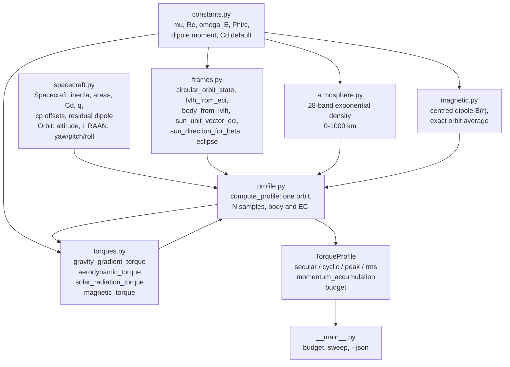
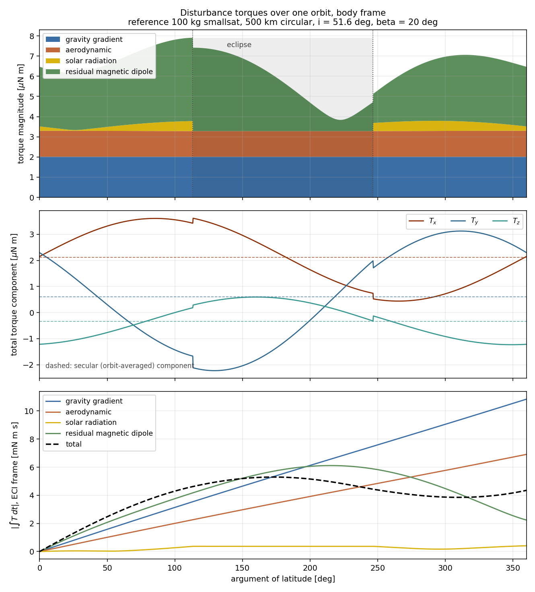
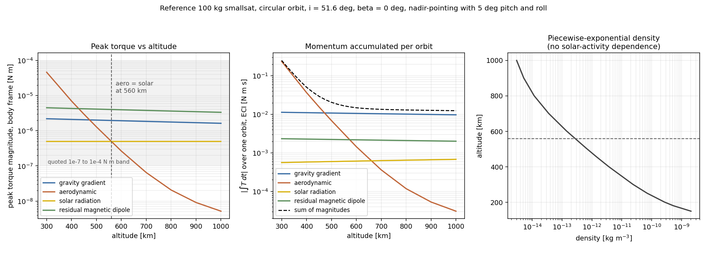

# disturbtorque

Environmental disturbance torques for spacecraft attitude and momentum sizing.


## The problem

Sizing a reaction wheel, a magnetorquer or a desaturation budget starts with four
numbers: how much gravity-gradient, aerodynamic, solar-radiation and residual-magnetic
torque the vehicle sees, and how much angular momentum those torques deposit per orbit.
The equations are in every textbook, but they are usually re-typed into a spreadsheet per
project, with the assumptions and validity ranges left in someone's head. This package is
those four equations written down once, with their sources, units, assumptions and
validity ranges attached, swept over an orbit, and split into the secular part you have
to dump and the cyclic part you have to store.

## What this does

- **Four torque models**, each a function of a few arguments with its source, units,
  assumptions and validity range in the docstring: gravity gradient
  `3 mu/R^3 u x (I u)`, free-molecular aerodynamic `-1/2 rho Cd A |v| v`, solar radiation
  pressure `(Phi/c) A (1+q)/d^2`, and residual magnetic dipole `m x B`.
- **Orbit sweep in three frames** (ECI, LVLH, body) with fixed pointing offsets from
  nadir, a 28-band exponential atmosphere, a centred geomagnetic dipole, a low-precision
  Sun direction accurate to 0.005 deg on the solstice declination, and a cylindrical
  eclipse model matching its closed form to 4.4e-06 absolute in eclipse fraction.
- **Secular/cyclic split and momentum accumulation**: the orbit-averaged torque, the
  momentum it deposits per orbit, and the peak cyclic momentum a wheel must store.
  Accurate to **0.033 %** on the total at the default 721 samples per orbit
  (`validation/momentum_integration.py`).
- **Every equation hand-checked** against a closed form: the gravity-gradient maximum is
  located numerically at **45.000000 deg** off nadir and equals `3 mu/(2R^3)|Izz - Iyy|`
  to 0 relative difference (`validation/hand_calculations.py`).
- **81 tests**, ruff-clean, two runtime dependencies (numpy, scipy), no ML, no compiled
  extensions, and a full orbit sweep in about 0.2 s on two cores.

## Who it's for

- Someone doing a first-cut ADCS sizing who wants the four torque numbers and the
  momentum per orbit, with the assumptions visible.
- Someone who needs an independent second implementation to cross-check a simulator's
  disturbance module.
- Someone teaching or learning where the textbook disturbance-torque formulas come from
  and what they assume.

## Who it's not for

- Anyone needing flight-representative numbers. This is research-grade software: not
  flight-qualified, not certified, not approved for operational aerospace use.
- Anyone propagating attitude. This computes torques for a *prescribed* attitude history;
  there is no rigid-body integrator, no controller and no wheel model here.
- Anyone needing accurate atmospheric density. The exponential table has no
  solar-activity dependence, and above 400 km that is an order-of-magnitude effect.
- Anyone needing the geomagnetic field itself. The centred non-tilted dipole is a sizing
  model, wrong by tens of percent in magnitude and by tens of degrees in direction; use
  an IGRF implementation.
- Anyone on an eccentric, high-altitude or interplanetary trajectory. Circular Earth
  orbits only.

## Alternatives, honestly

Each entry below was checked on PyPI on 2026-08-31; GitHub was not reachable from the
build environment, so no repository claim is made beyond what PyPI's own metadata says.

| Alternative | What it does better | When to use this instead |
|---|---|---|
| **Basilisk** (AVS Lab) — a full spacecraft simulation framework with disturbance torques inside a closed-loop dynamics engine. **Note:** the PyPI name `basilisk` is *not* this project; PyPI `basilisk` 0.1 is an unrelated object-NoSQL mapper. Basilisk itself is distributed from its own source repository and is a compiled C++/Python build. | Closed-loop simulation, flexible bodies, actuators, sensors, fault modes, Monte Carlo campaigns. Everything this package does not do. | You want four numbers and a momentum budget in an afternoon, without a C++ toolchain, and you want to read the whole torque model in one screen. |
| **`hapsira`** (PyPI, 0.18.0; the maintained fork of `poliastro`) and **`poliastro`** (PyPI, 0.17.0, no longer maintained) — orbital mechanics with perturbation *accelerations* including J2, drag and third body. | Orbit propagation, manoeuvre design, ephemerides, units via astropy. Their perturbation models are forces on the centre of mass. | You need *torques* about the centre of mass, which those packages do not compute: a force model has no centre-of-pressure offset, no inertia tensor and no residual dipole. |
| **`orekit-jpype`** (PyPI, 13.1.7.1, Apache-2.0) — the Python wrapper around Orekit, an operational-grade Java flight-dynamics library. | Rigour, frames, time scales, force models, validation history, and an actual user community in operations. | You want a pure-Python dependency chain with no JVM, and a torque model small enough to audit line by line. |
| **`ppigrf`** (PyPI, 2.1.0) or **`pyIGRF`** (PyPI, 1.0.0) — IGRF geomagnetic field. | The real field. Tilt, offset, secular variation, the South Atlantic Anomaly. | You are sizing a worst case and the 20-30 % error of a centred dipole is acceptable. If the field *direction* matters to your answer, stop and use IGRF. |
| **`pymsis`** (PyPI, 0.12.0) or **`nrlmsise00`** (PyPI, 0.1.2) — NRLMSISE-00 / NRLMSIS neutral atmosphere. | Solar activity, geomagnetic activity, diurnal and seasonal variation. | You want a zero-configuration mean density for a sizing sweep. Above 400 km, feed your own density in rather than relying on the table here. |
| Wertz, *Spacecraft Attitude Determination and Control*; Larson & Wertz, *Space Mission Analysis and Design*; Vallado, *Fundamentals of Astrodynamics and Applications*. | They are the source. Everything here is in them. | You want the equations executable, unit-tested and hand-checked rather than re-typed. |

**Be clear about the contribution.** There is no new physics in this package. The four
expressions are the standard textbook first-order forms. What is here is a small,
dependency-light, individually hand-checked implementation with the validity ranges
written down, the constants' provenance recorded, the disagreements between sources
reported rather than averaged, and a failed check reported as failed.

## Install and first run

```bash
git clone https://github.com/OmAcharya-avtr/disturbtorque.git
cd disturbtorque
python -m venv .venv && source .venv/bin/activate
pip install -e ".[test,plot]"
python -m pytest tests/ -q
python examples/torque_profile_over_orbit.py
```

Expected output:

```
81 passed in 13.11s
```

```
wrote .../screenshots/torque_profile_over_orbit.png
period 5677.0 s, eclipse fraction 0.3699
source                       peak [N m]   secular [N m]   dh/orbit [N m s]
gravity gradient             2.0126e-06      2.0126e-06         1.1426e-02
aerodynamic                  1.2881e-06      1.2755e-06         7.2407e-03
solar radiation              5.0072e-07      9.2965e-08         5.2776e-04
residual magnetic dipole     4.1300e-06      1.7531e-06         9.9523e-03
total                        4.2034e-06      2.2311e-06         1.2666e-02
```

Or from the command line, without writing any Python:

```bash
python -m disturbtorque budget --altitude-km 500 --beta-deg 20
python -m disturbtorque sweep --altitude-km 300 500 700 --json
```

## A worked example

```python
import numpy as np
from disturbtorque import (Orbit, Spacecraft, budget, compute_profile,
                           momentum_accumulation, sun_direction_for_beta)

sc = Spacecraft(
    inertia=np.diag([4.0, 8.0, 10.0]),             # kg m^2
    drag_area_m2=0.6, drag_coefficient=2.2,        # m^2, dimensionless
    cp_aero_offset_m=[0.02, 0.02, 0.05],           # m, body frame, cp minus cm
    srp_area_m2=1.2, srp_reflectance=0.6,
    cp_srp_offset_m=[0.02, 0.02, 0.05],
    residual_dipole_am2=[0.05, 0.05, 0.10],        # A m^2
    mass_kg=100.0,
)
orbit = Orbit(altitude_m=500e3, inclination_rad=np.radians(51.6),
              pitch_rad=np.radians(5.0), roll_rad=np.radians(5.0))
sun = sun_direction_for_beta(orbit.inclination_rad, orbit.raan_rad, np.radians(20.0))

profile = compute_profile(sc, orbit, sun, n_samples=721)
b = budget(profile, frame="body")

print(f"period {profile.period_s:.1f} s, eclipse fraction {profile.eclipse_fraction:.3f}")
for name, v in b.items():
    print(f"{name:<17} peak {v['peak_nm']:.3e} N m   secular {v['secular_magnitude_nm']:.3e} N m"
          f"   dh/orbit {v['secular_momentum_per_orbit_nms']:.3e} N m s")
h = momentum_accumulation(profile, "total", frame="eci")
print(f"inertial momentum change over one orbit: {np.linalg.norm(h[-1]):.4e} N m s")
```

```
period 5677.0 s, eclipse fraction 0.370
gravity_gradient  peak 2.013e-06 N m   secular 2.013e-06 N m   dh/orbit 1.143e-02 N m s
aerodynamic       peak 1.288e-06 N m   secular 1.275e-06 N m   dh/orbit 7.241e-03 N m s
solar             peak 5.007e-07 N m   secular 9.289e-08 N m   dh/orbit 5.273e-04 N m s
magnetic          peak 4.130e-06 N m   secular 1.753e-06 N m   dh/orbit 9.952e-03 N m s
total             peak 4.203e-06 N m   secular 2.231e-06 N m   dh/orbit 1.267e-02 N m s
inertial momentum change over one orbit: 4.3538e-03 N m s
```

The inertial total (4.35e-03 N m s) is *smaller* than three of the four per-source
figures because the contributions point in different directions in inertial space and
partly cancel. That is why the secular momentum has to be accumulated as a vector, and
why a budget that sums magnitudes will oversize the wheels.

## Architecture



`compute_profile` is the only place that knows about time: it walks the orbit, hands each
torque function the environment vectors already rotated into the body frame, and stacks
the results. The torque functions themselves know nothing about orbits, which is why they
can be hand-checked in isolation.

## Screenshots



Produced by `examples/torque_profile_over_orbit.py`. Notice the top panel: the
gravity-gradient contribution is a flat band, because for a nadir-pointing spacecraft on
a circular orbit it is exactly constant in the body frame — a fact used as a closed-form
check in the validation. The magnetic contribution is the one that varies most, tracking
the dipole field through the orbit, and the solar band vanishes across the shaded eclipse
arc. The bottom panel shows why the total (dashed) does not grow monotonically: the
per-source momenta point in different inertial directions.



Produced by `examples/altitude_sweep_and_crossover.py`. The aerodynamic curve falls four
orders of magnitude between 300 and 1000 km while the other three barely move, crossing
the solar-radiation line at **559.7 km** for this vehicle. The shaded band in the left
panel is the 1e-7 to 1e-4 N m comparison band; the aerodynamic curve leaves it below,
which is the failed check reported in the validation table.

## Validation evidence

Full detail, with the hand arithmetic and the raw script output, in
[`validation/VALIDATION.md`](validation/VALIDATION.md). Every number below comes from a
script in `validation/`, named in the last column.

| Check | Reference | Result | Tolerance | Script |
|---|---|---:|---:|---|
| Gravity-gradient torque, `I = diag(10,20,30)`, `R = 7e6 m`, 45 deg off nadir | hand arithmetic, 1.7431506201e-05 N m | rel. diff 9.5e-12 | 1e-9 | `hand_calculations.py` |
| Location of the gravity-gradient maximum | analytic 45 deg | **45.000000 deg** (err 7.1e-15) | 1e-4 deg | `hand_calculations.py` |
| Full-tensor form vs planar `sin 2 theta` form over a 90-deg sweep | algebraic identity | max diff / T_max = 5.8e-16 | 1e-14 | `hand_calculations.py` |
| Aerodynamic torque, `rho = 1e-12`, `v = 7500 m/s`, `Cd = 2.2`, `A = 1.5 m^2`, arm 0.1 m | hand arithmetic, -9.28125e-06 N m | rel. diff 1.8e-16 | 1e-12 | `hand_calculations.py` |
| Solar radiation torque, `A = 2 m^2`, `q = 0.6`, arm 0.3 m | hand arithmetic, 4.3582150422e-06 N m | rel. diff 0 | 1e-12 | `hand_calculations.py` |
| Magnetic torque `m x B` | hand arithmetic, 3.0e-06 N m | rel. diff 0 | 1e-14 | `hand_calculations.py` |
| Dipole field at the mean Earth radius | `k/Re^3 = 3.0778634807e-05 T`, twice that at the pole | rel. diff 0 | 1e-14 | `hand_calculations.py` |
| Atmosphere table band-boundary continuity, above 25 km | the table's own construction | worst 9.5877e-05 | 1e-4 | `atmosphere_table_continuity.py` |
| Density monotonicity over 0-1000 km | physical expectation | **1 rising step of +0.0671 % at 25 km**, reported | — | `atmosphere_table_continuity.py` |
| Sun model perihelion / aphelion distance | 0.9833 / 1.0167 AU | 0.983293 (day 4) / 1.016709 (day 186) | 5e-4 AU | `orbit_geometry.py` |
| Sun model solstice declination | +/-23.44 deg | +23.4354 / -23.4357 deg | 0.05 deg | `orbit_geometry.py` |
| Eclipse fraction at beta 0, 20, 40, 60, 67 deg | closed form `arccos(sqrt(R^2-Re^2)/(R cos b))/pi` | worst abs. err 4.4e-06 | 2e-5 | `orbit_geometry.py` |
| Orbit-averaged dipole field, i = 0 to 97.8 deg | closed form `(k/R^3)[z - 1.5 sin(i) Q]` | worst 1.7e-12 | 1e-10 | `orbit_geometry.py` |
| Momentum per orbit, gravity gradient, body frame | closed form `T * P` (torque is exactly constant) | rel. diff **1.13e-14** | 1e-13 | `momentum_integration.py` |
| Momentum per orbit, aerodynamic, body frame | closed form `T * P` | rel. diff **7.99e-15** | 1e-13 | `momentum_integration.py` |
| Orbit-averaged torque in ECI | closed form `-(T_lvlh)_y h_hat` | rel. diff 9.2e-16 and 4.8e-16 | 1e-9 | `momentum_integration.py` |
| Momentum of the three continuous sources, N = 181 to 2881 | N = 11521 grid | worst 1.2e-14 | 1e-12 | `momentum_integration.py` |
| Momentum of the solar source at the default N = 721 | QUADPACK on the analytic sunlit arcs | **3.51e-03** relative | derived edge bound 1.92e-02 | `momentum_integration.py` |
| **Total** momentum per orbit at the default N = 721 | sum of the two independent references | **3.31e-04** relative | 1e-3 | `momentum_integration.py` |
| Aerodynamic/solar peak-torque crossover | physical expectation, 500-700 km | **559.7 km** | 400-700 km | `leo_smallsat_magnitudes.py` |
| `T_aero(600)/T_aero(500)` equals the density ratio times the `v^2` ratio | algebraic identity, 0.2057074053 | rel. diff 5.4e-16 | 1e-12 | `leo_smallsat_magnitudes.py` |
| Co-rotating-atmosphere correction | kinematic bound, about twice a 4.09 % speed reduction | rms torque ratio 0.921252 (-7.87 %) | 1-12 % | `leo_smallsat_magnitudes.py` |
| Four torque magnitudes, 300-600 km, vs the quoted 1e-7 to 1e-4 N m band | Wertz; Larson & Wertz | all inside | — | `leo_smallsat_magnitudes.py` |
| Four torque magnitudes, 700-1000 km, vs the same band | Wertz; Larson & Wertz | **FAILED** — aerodynamic below the floor by 1.54x (700 km), 4.85x (800 km), 19.37x (1000 km) | — | `leo_smallsat_magnitudes.py` |

The failed row is the credible one. Nothing was tuned to bring the aerodynamic torque
back inside the band: `Cd` stays at 2.2, the areas and offsets stay as defined, and the
density table is unmodified. Above 700 km this vehicle is simply not in the drag regime
the band describes, and the band's lower edge is not a meaningful floor for it — but the
check is stated as a band check and it failed as stated.

Two disagreements between standard sources are reported rather than averaged: the solar
constant (1361 vs 1367 W m^-2, **0.441 %**) and the Earth reduced dipole moment
(7.96e15 vs about 7.76e15 T m^3, **2.6 %**). Both are exported so a user can reproduce a
textbook worked example exactly.

## API reference

<details>
<summary>Torque models (<code>disturbtorque.torques</code>)</summary>

| Function | Returns |
|---|---|
| `gravity_gradient_torque(inertia, nadir_unit_body, radius_m, mu=MU_EARTH)` | torque vector [N m]; `inertia` kg m^2, `nadir_unit_body` unit, `radius_m` m |
| `gravity_gradient_planar(i_yy, i_zz, theta_rad, radius_m, mu=MU_EARTH)` | scalar `3mu/(2R^3)(Izz-Iyy) sin 2 theta` [N m] |
| `gravity_gradient_max_magnitude(i_yy, i_zz, radius_m, mu=MU_EARTH)` | worst case at 45 deg [N m] |
| `aerodynamic_force(density_kg_m3, v_rel_body, drag_coefficient, area_m2)` | force vector [N] |
| `aerodynamic_torque(density_kg_m3, v_rel_body, drag_coefficient, area_m2, cp_offset_m)` | torque vector [N m] |
| `solar_radiation_force(sun_unit_body, area_m2, reflectance, distance_au=1.0, illuminated=True, pressure_1au=SRP_PRESSURE_1AU)` | force vector [N] |
| `solar_radiation_torque(..., cp_offset_m, ...)` | torque vector [N m] |
| `magnetic_torque(dipole_body_am2, b_field_body_t)` | torque vector [N m]; `m` A m^2, `B` tesla |

</details>

<details>
<summary>Environment (<code>atmosphere</code>, <code>magnetic</code>, <code>frames</code>)</summary>

| Function | Returns |
|---|---|
| `density(altitude_m, allow_extrapolation=False)` | neutral density [kg m^-3], 0-1000 km |
| `dipole_field_eci(r_eci, dipole_moment=EARTH_DIPOLE_MOMENT)` | geomagnetic field vector [T] |
| `dipole_field_magnitude(radius_m, declination_rad, ...)` | `(k/r^3) sqrt(1+3 sin^2 dec)` [T] |
| `mean_dipole_field_over_orbit(radius_m, inclination_rad, raan_rad, ...)` | exact orbit-averaged field [T] |
| `circular_orbit_state(radius_m, inclination_rad, raan_rad, arg_lat_rad, mu)` | `(r, v)` in ECI [m], [m s^-1] |
| `orbital_period(radius_m, mu=MU_EARTH)` | Keplerian period [s] |
| `node_axes(inclination_rad, raan_rad)` | `(P_hat, Q_hat, h_hat)` unit vectors in ECI |
| `lvlh_from_eci(r_eci, v_eci)` | DCM mapping ECI into LVLH |
| `body_from_lvlh(yaw_rad, pitch_rad, roll_rad)` | DCM mapping LVLH into body (3-2-1) |
| `julian_date(year, month, day, hour, minute, second)` | Julian date [d], 1900-2100 |
| `sun_unit_vector_eci(jd)` / `sun_distance_au(jd)` | Sun direction (unit) / distance [AU] |
| `sun_direction_for_beta(inclination_rad, raan_rad, beta_rad, phase_rad=0)` | Sun unit vector giving an exact beta |
| `beta_angle(sun_hat, inclination_rad, raan_rad)` | beta angle [rad] |
| `in_eclipse_cylindrical(r_eci, sun_hat, body_radius_m)` | boolean shadow flag |
| `eclipse_fraction_cylindrical(radius_m, inclination_rad, raan_rad, sun_hat, ...)` | fraction of the orbit in umbra |

</details>

<details>
<summary>Sweep and reporting (<code>spacecraft</code>, <code>profile</code>, <code>presets</code>)</summary>

| Object | Purpose |
|---|---|
| `Spacecraft(inertia, drag_area_m2, drag_coefficient, cp_aero_offset_m, srp_area_m2, srp_reflectance, cp_srp_offset_m, residual_dipole_am2, mass_kg)` | validated vehicle properties; SI throughout |
| `Orbit(altitude_m, inclination_rad, raan_rad, yaw_rad, pitch_rad, roll_rad, mu)` | circular orbit plus fixed pointing offsets; `.radius_m`, `.period_s`, `.speed_ms`, `.mean_motion_rad_s` |
| `compute_profile(spacecraft, orbit, sun_unit_eci, n_samples=721, distance_au=1.0, co_rotating_atmosphere=True, pressure_1au=...)` | one orbit of torque history in body and ECI |
| `TorqueProfile.torque / secular / cyclic / cyclic_peak / peak_magnitude / rms_magnitude` | per-source or total, `frame="body"` or `"eci"` [N m] |
| `TorqueProfile.eclipse_fraction` | fraction of the orbit in umbra |
| `momentum_accumulation(profile, source="total", frame="eci")` | cumulative `int T dt` [N m s], shape (N, 3) |
| `budget(profile, frame="body")` | dict per source: peak, rms, secular vector and magnitude, cyclic peak, secular momentum per orbit, cyclic momentum peak |
| `reference_smallsat()` / `reference_orbit(altitude_km=500)` | the vehicle and orbit every validation number uses |

</details>

<details>
<summary>Constants (<code>disturbtorque.constants</code>)</summary>

| Name | Value | Units | Provenance |
|---|---|---|---|
| `MU_EARTH` | 3.986004418e14 | m^3 s^-2 | WGS-84 / EGM-96 |
| `R_EARTH_EQUATORIAL` | 6378137.0 | m | WGS-84 semi-major axis |
| `R_EARTH_MEAN` | 6371200.0 | m | IUGG mean radius, IGRF reference |
| `OMEGA_EARTH` | 7.292115e-5 | rad s^-1 | WGS-84 |
| `SPEED_OF_LIGHT` | 299792458.0 | m s^-1 | exact, SI |
| `ASTRONOMICAL_UNIT` | 1.495978707e11 | m | exact, IAU 2012 |
| `SOLAR_IRRADIANCE_1AU` | 1361.0 | W m^-2 | modern TSI |
| `SOLAR_IRRADIANCE_1AU_SMAD` | 1367.0 | W m^-2 | older textbook value, 0.441 % higher |
| `SRP_PRESSURE_1AU` | 4.5398073356e-06 | N m^-2 | derived, `1361/c` |
| `EARTH_DIPOLE_MOMENT` | 7.96e15 | T m^3 | textbook value; 2.6 % above an IGRF-epoch reduction |
| `DEFAULT_DRAG_COEFFICIENT` | 2.2 | — | conventional free-molecular sizing value, +/-20 % |

</details>

## Limitations

Real ones, in rough order of how much they will change your answer.

1. **Atmospheric density has no solar-activity dependence.** Thermospheric density above
   400 km varies by more than an order of magnitude between solar minimum and maximum.
   The aerodynamic column of any budget from this package therefore carries at least a
   factor-of-several uncertainty above 400 km. Feed your own density in if that matters.
2. **The geomagnetic field is a centred, non-tilted dipole.** No 11-degree tilt, no
   offset, no secular variation, no South Atlantic Anomaly. Pointwise errors against
   IGRF are of order 20-30 % in magnitude and can be tens of degrees in direction. The
   reduced dipole moment itself is uncertain at the 2.6 % level between standard sources.
3. **Residual magnetic dipole is the least known input.** Before magnetic testing, an
   order-of-magnitude uncertainty in a vehicle's residual dipole is normal, and the
   torque is exactly linear in it.
4. **The drag coefficient carries about +/-20 %**, and the aerodynamic model has no lift,
   no attitude-dependent projected area, no self-shadowing, and a centre of pressure held
   fixed in the body frame although the real one moves with the flow.
5. **No Earth albedo and no Earth infrared.** Together these can reach roughly a third of
   the direct solar pressure in low orbit and are simply absent from the SRP model, along
   with diffuse (Lambertian) reflection and thermal re-radiation.
6. **Circular orbits only, no J2.** No eccentricity, no nodal regression during the arc,
   no orbit decay. Altitude for the density lookup is spherical
   (`|r| - R_EARTH_EQUATORIAL`), not geodetic; against WGS-84 that is up to 21 km at the
   poles, which at 500 km is a factor of about 1.39 in density.
7. **The eclipse model is cylindrical umbra only.** No penumbra, so illuminated time is
   slightly under-counted near the terminator. This is also the only discontinuity in the
   sweep, and it is what caps the momentum accuracy at 0.033 % for 721 samples: the error
   scales only as `1/N`, not as `1/N^2`, so buying accuracy by adding samples is slow.
   The three continuous sources converge to machine precision at any grid.
8. **Momentum in the body frame is not an inertial momentum change.** The body frame of a
   nadir-pointing spacecraft rotates once per orbit; `momentum_accumulation(...,
   frame="body")` is the time integral of the body-frame components, useful for a wheel
   whose axes are fixed in the body, and `frame="eci"` is what sizes a desaturation
   budget. Mixing them up is the easiest mistake to make with this package.
9. **The density table is not strictly monotonic.** There is exactly one rising step, at
   the 25 km band boundary, of +0.0671 %. It is a property of the published table and is
   outside the free-molecular validity range of the aerodynamic model, but a
   `density(h1) > density(h0)` assertion for `h1 > h0` will fail there.
10. **The Sun model is low-precision** and is referred to the mean equator and equinox of
    date; treating that as J2000 drifts by about 0.014 deg per year. Fine for
    illumination geometry, useless for pointing.
11. **No page or equation numbers are cited anywhere**, because no physical copy of any
    reference was consulted during the build. The external magnitude comparison is
    therefore against an order-of-magnitude band and is a weak check; the strong evidence
    is the closed-form agreement.
12. **Compute budget.** A 721-sample orbit sweep takes about 0.21 s on two cores; the
    whole validation set runs in 27.3 s and the test suite in 13 s. The sweep is a Python
    loop over samples, so it scales linearly and a 100 000-sample sweep would take about
    a minute.

## Reproducing every number

```bash
# tests: 81 passed
python -m pytest tests/ -q

# lint
ruff check src/ tests/

# validation, from products/P027/ ; each writes its raw stdout next to itself
cd validation
python3 hand_calculations.py            # 27 passed, 0 failed          0.5 s
python3 atmosphere_table_continuity.py  #  7 passed, 0 failed          0.4 s
python3 orbit_geometry.py               # 29 passed, 0 failed          1.4 s
python3 momentum_integration.py         # 20 passed, 0 failed         15.9 s
python3 leo_smallsat_magnitudes.py      #  7 passed, 1 REPORTED FAIL   9.2 s
cd ..

# figures
cd examples
python3 torque_profile_over_orbit.py
python3 altitude_sweep_and_crossover.py
```

There is no randomness anywhere in this package, so every number reproduces exactly,
without seeds.

## Safety statement

This software is **research-grade**. It is **not flight-qualified**, **not certified**,
and **not approved for operational aerospace use**. It implements first-order textbook
torque models with the assumptions listed above, several of which are wrong by tens of
percent by construction. Do not use it as the basis of a flight design without
independent verification against a qualified tool.

## Licence, citation, credits

MIT, © 2026 OPTIMA Organisation. See [`LICENSE`](LICENSE).

To cite this software, see [`CITATION.cff`](CITATION.cff).

**Related work in this portfolio.** P029 MomentumMgr is sized against this package's
numbers and implements its own, independent torque model so that the two can be
cross-checked. Neither imports from the other, deliberately: a shared implementation
would make the cross-check vacuous.

**References.** Wertz, J. R. (ed.), *Spacecraft Attitude Determination and Control*,
1978. Larson, W. J., and Wertz, J. R. (eds.), *Space Mission Analysis and Design*.
Vallado, D. A., *Fundamentals of Astrodynamics and Applications*. Hughes, P. C.,
*Spacecraft Attitude Dynamics*.

### Credits

This is under reserved rights obtained by OPTIMA Organisation.
