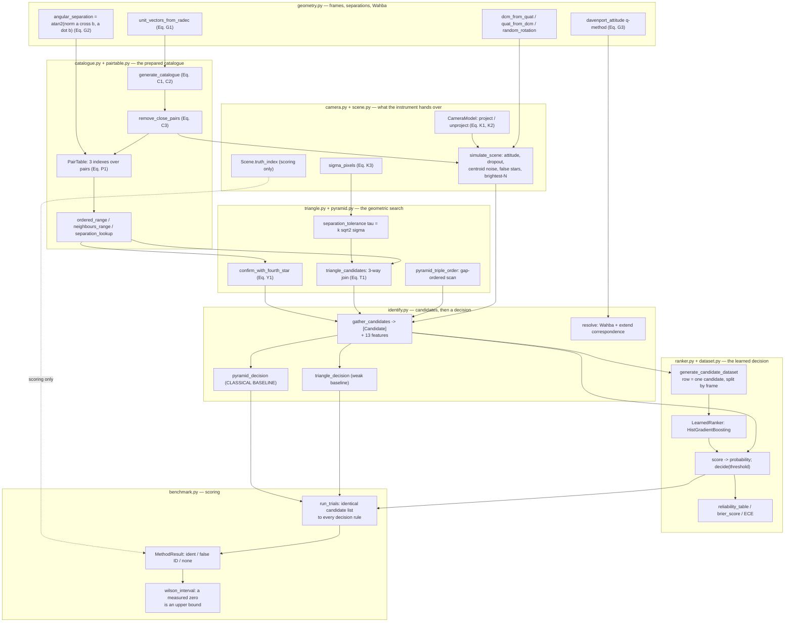
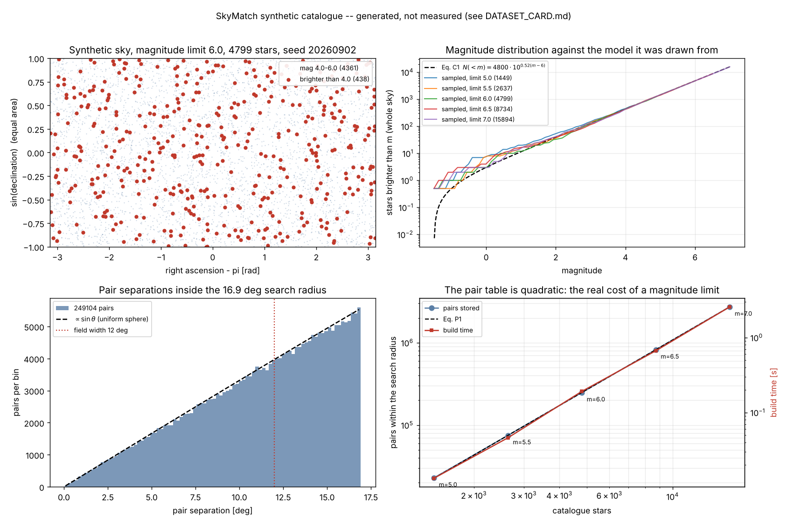
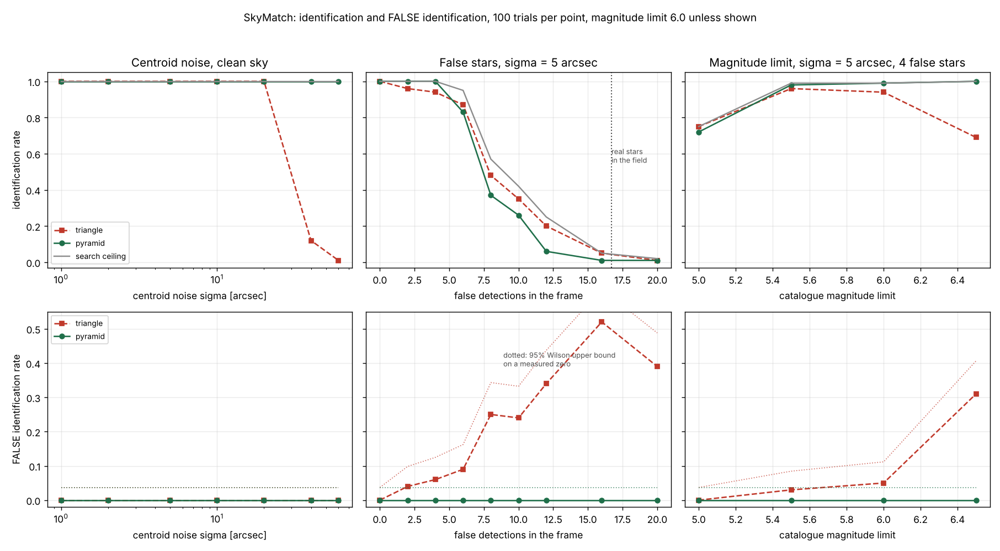
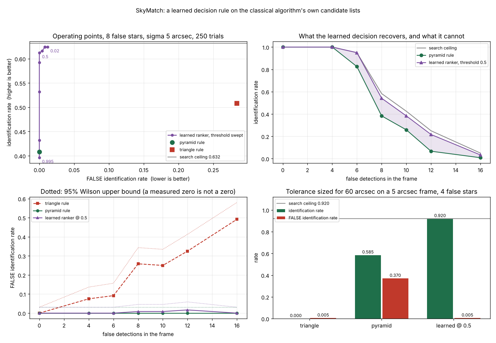

# skymatch

Lost-in-space star identification: triangle and pyramid matching, with both error rates measured.

**Status:** TESTING · **Class:** compact · **Validation level:** 2 (research) · **AI:** yes


## The problem

Your star tracker powers on with no idea where it is pointing, and all it has is a list of
bright spots. Some of those spots are not stars — hot pixels, cosmic rays, debris, stray
light — and because the tracker keeps only the brightest ten, a bright false detection does
not get appended to the list, it **pushes a real star off it**. The identification rate
everyone reports tells you how often you get an answer; it does not tell you how often the
answer is wrong, and a star tracker that confidently reports the wrong attitude is far worse
than one that reports nothing at all.

## What this does

- **Measures the false-identification rate instead of assuming it is zero.** Every rate in
  this repository is reported as three exhaustive outcomes — identified / false
  identification / no solution — each with a Wilson interval. The classical Pyramid rule
  made **0 false identifications in 660 trials** across centroid noise from 1 to 60 arcsec,
  reported as **"below 0.0058 at 95 % confidence"**, not as zero
  (`validation/validate_identification.py` section 3b).
- **Finds the regime where that guarantee breaks, and quantifies it.** Hand the Pyramid rule
  a tolerance sized for 60 arcsec of noise on frames that carry 5, add four false
  detections, and **46 of 120 frames come back with a confidently wrong attitude**:
  false-identification rate **0.3833, 95 % CI [0.3012, 0.4727]**. The same mis-sized gate
  with no false stars does this 0 times in 120 (section 3f).
- **Separates a search failure from a decision failure.** Every table reports the *ceiling*:
  the fraction of frames whose candidate list contained the truth at all. In dense
  false-star fields it collapses — 1.0000 at 4 false stars, 0.6500 at 8, 0.1750 at 12,
  0.0100 at 30 — and below about 0.1 no decision rule can help, because only 0.65 real stars
  survive into a 10-spot list (`validation/validate_failure_regime.py`).
- **Builds and checks the catalogue machinery against closed forms.** Synthetic catalogue to
  Eq. C1 (worst deviation 8.2e−05), close-pair removal to Eq. C3, pair table to Eq. P1
  (worst 1.1e−02), and all four pair-table queries **exactly** equal to brute force on a
  796-star catalogue (`validation/validate_catalogue.py`).
- **Benchmarks a learned candidate ranker against the classical rule, and reports where it
  wins nothing.** Same candidate list, different decision. Identification-rate gain at
  threshold 0.5: **+0.0000** on a clean sky, **+0.0000** at 40 arcsec noise, **+0.0000** at 4
  false stars, **+0.1600** at 8 false stars, **+0.3667** against a 12×-too-wide gate — and it
  runs **28× slower** than the classical early exit on a clean frame
  (`validation/validate_ml_vs_classical.py`).

## Who it's for

- Anyone who needs the **false-identification rate** of a star-ID scheme as a measured
  number with an interval on it, including where it is zero and where it is 0.38.
- People sizing a star-tracker catalogue, who want the magnitude-limit-to-memory curve
  (10.96× pairs per magnitude, 17.9 MB at mag 6.0, 197 MB at mag 7.0) and the
  fraction of pointings with fewer than four stars (0.21 at mag 5.0, 0.00 at mag 6.0).
- People evaluating whether a learned ranker is worth it for star identification, who want
  the classical baseline implemented properly and the cases where it wins printed in the same
  table.
- Anyone who wants a readable, dependency-light implementation of triangle and Pyramid
  matching they can get through in an afternoon.

## Who it's not for

- **Anyone who needs to identify a real star field.** The catalogue here is synthetic and
  was never fitted to a real one. Use `astrometry` (below). This is the most important line
  on this page.
- **Flight software.** Nothing here is flight-qualified, certified or approved for
  operational use, and the learned ranker is not certified for operational flight use.
- **Anyone who needs a real catalogue, proper motion, binaries, spectral response or optical
  distortion.** None of them is modelled. See `DATASET_CARD.md`.
- **Anyone who needs tracking mode.** This package solves lost-in-space only: there is no
  attitude propagation, no recursive mode, no star tracking between frames, no rate
  estimation.
- **Anyone who needs centroiding.** The pipeline starts from a spot list. There is no image,
  no PSF fitting and no detection stage.

## Alternatives, honestly

Versions checked on PyPI on 2026-10-02. The GitHub API was not reachable from the build
environment, so **no claim is made about any project that does not publish to PyPI**, and
none is named here.

| Alternative | What it does better | When to use this instead |
|---|---|---|
| **`astrometry`** (4.3.0, GPL-3.0) — Python interface to the Astrometry.net blind plate solver. | **Everything that matters for a real image.** Real index files built from real catalogues, blind solving with no prior, a WCS out the other end, and a decade of use on real data by people who publish with it. | You want the *lost-in-space pattern-matching problem itself* as readable, instrumented Python with both error rates measured — not a solved WCS. **If you have a real image and need to know where it points, stop here and use `astrometry`.** |
| **`starid`** (1.5.1, MIT, last released March 2022) — star identification over the full NASA SKYMAP2000 V5R4 catalogue, with triangle chains and basesides. | It ships a **real catalogue**. Its sky is the sky; this one is a generative model. | You want the false-identification rate, the search ceiling, Wilson intervals, a quantified failure regime and a learned-versus-classical benchmark, none of which it reports. The two are complementary: it has the catalogue, this has the error analysis. |
| **`astroalign`** (2.6.2, MIT) — matches two stellar images by finding similar three-point asterisms and fitting the affine transform. | Mature, widely used, and solves the *image-to-image* registration problem with no catalogue at all. The triangle-invariant idea is the same one. | Your problem is image-to-**catalogue**, you have no second image, and you need the attitude rather than a transform. |
| **`astropy`** (8.0.1, BSD-3) + **`astroquery`** (0.4.11, BSD) | Frames, time scales, coordinate transforms, WCS, and actual catalogue access (Hipparcos, Tycho-2, Gaia). | You want a self-contained 12-module package with three dependencies, and a synthetic sky you can regenerate deterministically rather than a query you have to be online for. Use `astroquery` to fetch a real catalogue and feed it in. |
| **`skyfield`** (1.55, MIT) | Real ephemerides and real star positions at a real epoch, including proper motion — which this package does not model. | You need pattern matching, not positions. |
| **`photutils`** (3.0.0, BSD-3) / **`sep`** (1.4.1, LGPL-3+) | Source detection and centroiding on actual pixels. | You already have a spot list. This package starts where those finish. |
| Mortari, Samaan, Bruccoleri & Junkins, *Navigation* 51(3), 171–183 (2004); Padgett & Kreutz-Delgado (1997); Spratling & Mortari (2009) survey. | They are the source. The Pyramid algorithm is theirs and nothing here is new. | You want the algorithm executable, unit-tested, and measured on *both* error rates with intervals, including the regime in which the published low false-identification rate does not hold. |

**Be clear about the contribution.** There is no new algorithm here. The triangle match, the
pyramid confirmation, the k-vector-style range search and Davenport's q-method are all
standard and all cited in the code. What this repository adds is: the
false-identification rate measured explicitly at every operating point with Wilson intervals
rather than assumed zero; the *ceiling* reported alongside every rate, so a search failure is
never mistaken for a decision failure; a quantified regime (mis-sized gate plus false stars)
in which the Pyramid rule's published guarantee fails, at 0.3833; a dense-false-star failure
regime measured to the point of total collapse; and a learned ranker benchmarked against the
classical rule on identical candidate lists with its three no-gain regimes and its 28×
runtime penalty in the same table as its wins.

## Install and first run

```bash
git clone https://github.com/OmAcharya-avtr/skymatch.git
cd skymatch
python -m venv .venv && source .venv/bin/activate
pip install -e ".[test,examples]"
python -m pytest tests/ -q
python examples/catalogue_overview.py
```

Expected output of the last two commands:

```
167 passed in 1.59s

growth per magnitude: stars x3.31, pairs x10.96
  mag 5.0:   1449 stars,    22917 pairs,  0.013 s to build
  mag 5.5:   2637 stars,    75140 pairs,  0.046 s to build
  mag 6.0:   4799 stars,   249104 pairs,  0.190 s to build
  mag 6.5:   8734 stars,   823772 pairs,  0.670 s to build
  mag 7.0:  15894 stars,  2730140 pairs,  2.502 s to build
wrote .../screenshots/catalogue_overview.png
```

Read the second column. Stars grow 3.31× per magnitude and pairs 10.96×, so one extra
magnitude of catalogue depth costs eleven times the pair-table memory. That curve, not the
algorithm, is what decides what a star tracker can carry.

The command line gives the same thing without writing a figure, plus a single-frame
identification you can read:

```bash
python -m skymatch catalogue
python -m skymatch identify --seed 7 --sigma 5 --false-stars 10
python -m skymatch sweep --over false --values 0 4 8 12 --trials 100
python -m skymatch conventions
```

```
frame: seed 7, sigma 5 arcsec, 10 false star(s), tolerance 21.21 arcsec
  18 real stars on the detector, 10 spots handed to the matcher (6 false)
  1 candidate(s) from 25 triple(s)

  triangle  FALSE IDENTIFICATION: spots (3, 4, 6) -> stars (341, 1014, 139), 0 confirmation(s), 3 matched in all
            attitude error 261326.45 arcsec
  pyramid   no solution
```

That is the whole point of this package in one frame. Six of the ten spots are false. The
triangle rule returns an answer that is wrong by 72 degrees and says nothing about it; the
Pyramid rule declines. Both failed, and only one of them is detectable from the outside.

## A worked example

```python
import numpy as np
from skymatch import (
    CameraModel, PairTable, SceneConfig, generate_catalogue, simulate_scene,
    gather_candidates, pyramid_decision, triangle_decision, resolve,
    separation_tolerance, angle_between_dcm, run_trials, wilson_interval,
)

cam = CameraModel(fov_deg=12.0, pixels=1024)
cat = generate_catalogue(magnitude_limit=6.0, seed=20260902)
table = PairTable(cat, cam.max_separation_rad)
print(f"{cat.n_stars} stars, {table.n_pairs} pairs, {table.nbytes / 1e6:.1f} MB")

cfg = SceneConfig(camera=cam, centroid_sigma_arcsec=5.0, n_false_stars=8, max_stars=10)
scene = simulate_scene(cat, cfg, np.random.default_rng(3))
tol = separation_tolerance(cfg.centroid_sigma_arcsec)          # tau = 3 sqrt(2) sigma
print(f"{scene.n_spots} spots, {scene.n_false_stars} of them false; "
      f"tolerance {np.degrees(tol) * 3600:.1f} arcsec")

candidates, diag = gather_candidates(scene.vectors, scene.magnitudes, table, tol, cam)
print(f"{len(candidates)} candidates from {int(diag['triples_tried'])} triples")

for name, rule in (("triangle", triangle_decision), ("pyramid", pyramid_decision)):
    cand = rule(candidates)
    ident = resolve(cand, scene.vectors, cat, cam, tol)
    if not ident.identified:
        print(f"  {name:8s} no solution")
        continue
    err = np.degrees(angle_between_dcm(ident.attitude, scene.attitude)) * 3600
    print(f"  {name:8s} {'CORRECT' if cand.is_correct(scene.truth_index) else 'WRONG'}: "
          f"{len(ident.observed_indices)} stars matched, attitude error {err:.1f} arcsec")

point = run_trials(cat, table, cam, cfg, n_trials=200, seed=1, with_attitude=False)
pyr = point.methods["pyramid"]
lo, hi = pyr.false_identification_ci
print(f"200 frames: pyramid identified {pyr.identification_rate:.3f}, "
      f"false {pyr.false_identification_rate:.3f} (95% CI [{lo:.4f}, {hi:.4f}]), "
      f"ceiling {point.ceiling:.3f}")
print(f"zero out of 200 means 'below {wilson_interval(0, 200)[1]:.4f}', not 'never'")
```

```
4799 stars, 249104 pairs, 17.9 MB
10 spots, 5 of them false; tolerance 21.2 arcsec
6 candidates from 25 triples
  triangle CORRECT: 5 stars matched, attitude error 37.7 arcsec
  pyramid  no solution
200 frames: pyramid identified 0.425, false 0.000 (95% CI [0.0000, 0.0188]), ceiling 0.670
zero out of 200 means 'below 0.0188', not 'never'
```

On this particular frame the triangle rule happened to be right and the Pyramid rule refused
it — that is the conservatism, and the price of it is the 0.425 identification rate against a
ceiling of 0.670 on the line below. The gap, 0.245, is the headroom a better decision rule
could take; the 0.330 below the ceiling is not recoverable by any rule.

## Architecture



Note what the diagram shows about the AI benchmark: `gather_candidates` feeds the classical
decisions and the learned one from the **same** node. No feature path touches
`Scene.truth_index`, which reaches only the scorer.

## Examples

Three, each writing a PNG to `screenshots/` with the Agg backend. Runtimes measured on two
cores.

| Script | Runtime | What it produces |
|---|---|---|
| `examples/catalogue_overview.py` | 6.5 s | the sky, star counts against Eq. C1, in-field pair-separation density, pair-table cost |
| `examples/rates_vs_conditions.py` | 32 s | both error rates against noise, false-star count and magnitude limit |
| `examples/learned_vs_pyramid.py` | 34 s | a reduced-size rerun of the AI benchmark: the operating-point curve and the mis-sized gate |

## Screenshots



Notice the bottom-right panel: the pair count tracks Eq. P1 across five magnitude limits
while the build time and memory rise an order of magnitude per magnitude. Notice also that
the Mollweide panel has **no structure at all** — no galactic plane, no clustering. That is
the model being honest about what it is, and it is the single largest departure from the real
sky (`DATASET_CARD.md` item 2).



Notice the second row, which is the row most star-ID plots do not have. The triangle rule's
identification rate in the top row looks respectable at 8 false stars; the bottom row says a
quarter of those answers are wrong. The dashed grey ceiling in the false-star panels is the
fraction of frames whose candidate list contained the truth at all — the gap between a curve
and that line is recoverable, the gap below it is not.



Notice the top-left panel: the classical rule is a **single point** and the learned ranker is
a curve through it. The curve passing above and to the left of the point is the entire
argument for the learned decision — and note the right-hand end of the curve lands on the
classical point, which is the sanity check that the two are being compared on the same
frames.

## Validation evidence

Full detail, protocol and raw output: `validation/VALIDATION.md` and the `*_output.txt` files
beside it. **49 checks, 49 passed, 0 failed**, 138 s total, every number produced by running
the named script in the documented environment.

| Check | Reference | Result | Tolerance | Script |
|---|---|---|---|---|
| `dcm_from_quat` vs SciPy `Rotation.as_matrix` | SciPy, 500 quaternions | 6.6613e−16 | 1e−14 | `validate_geometry.py` |
| Angular separation, worst absolute error over 6 decades | constructed exact angles | 3.3307e−16 rad | 1e−15 | `validate_geometry.py` |
| **`arccos` at 1e−8 rad, for comparison** | same | **1.581e−08 rad — larger than the answer** | reported | `validate_geometry.py` |
| Davenport q-method, noise free, n = 2…10 | exact attitude | 1.3258e−13 rad | 1e−12 | `validate_geometry.py` |
| **Transpose regression** | must return `A`, not `Aᵀ` | 2.6641e−16 rad to `A`, 2.9607 rad to `Aᵀ` | 1e−12, ≥1e−3 | `validate_geometry.py` |
| Attitude error / σ over a 60× range in σ | linear in noise | spread 1.2934e−02 | 0.05 | `validate_geometry.py` |
| Star count, 5 magnitude limits | Eq. C1 | 8.2451e−05 | 1e−3 | `validate_catalogue.py` |
| Magnitude distribution | Eq. C2, Kolmogorov–Smirnov | D = 1.0489e−02 vs crit 1.4552e−02 | 5 % | `validate_catalogue.py` |
| Isotropy, position dipole | empirical null, 200 samples | 8.7607e−03 vs p95 2.3582e−02 | pass | `validate_catalogue.py` |
| Pair-table count, 5 magnitude limits | Eq. P1 | worst 1.0581e−02 | 2e−2 | `validate_catalogue.py` |
| All four pair-table queries vs brute force | brute force, 796 stars | **exactly 0 difference** | 0 | `validate_catalogue.py` |
| **P(fewer than 4 stars in field) at mag 5.0** | geometry, 600 pointings | **0.2083 — the floor no matcher can beat** | reported | `validate_catalogue.py` |
| Pyramid identification rate, σ = 1…60 arcsec | Mortari et al. 2004, qualitative | 1.0000 at every level | ≥0.97 | `validate_identification.py` |
| **Triangle identification rate, same sweep** | same | **1.0000 → 0.0091** | reported | `validate_identification.py` |
| **Pyramid false identifications, pooled** | — | **0 / 660, 95 % [0.00000, 0.00579]** | ≤1e−2 | `validate_identification.py` |
| **Triangle false-ID rate at mag 6.5, 2 false stars** | — | **0.1182** | reported | `validate_identification.py` |
| Search ceiling at the default k = 3 | — | 1.0000 | ≥0.999 | `validate_identification.py` |
| **Search ceiling at k = 0.25** | — | **0.2750 — a narrow gate loses the truth** | ≤0.60 | `validate_identification.py` |
| **Pyramid false-ID rate, 12× gate + 4 false stars** | — | **0.3833, 95 % CI [0.3012, 0.4727], 46/120** | ≥0.05 | `validate_identification.py` |
| **Triangle false-ID rate at 20 false stars** | — | **0.4550, 91/200** | ≥0.10 | `validate_failure_regime.py` |
| Pyramid false-ID rate over the whole false-star sweep | — | 0.0000 at every count | ≤2e−2 | `validate_failure_regime.py` |
| **Search ceiling at 20 / 30 false stars** | — | **0.0300 / 0.0100 — unrecoverable in principle** | ≤0.20 | `validate_failure_regime.py` |
| **Pyramid identification, `max_stars` 10 → 20 at 10 false stars** | — | **0.2267 → 0.7267; ceiling 0.4200 → 0.9867** | reported | `validate_failure_regime.py` |
| Learned ranker, ROC AUC on 10 600 held-out rows | base rate 0.35953 | 1.00000 — read item 7 of `MODEL_CARD.md` before believing it | ≥0.95 | `validate_ml_vs_classical.py` |
| Confidence calibration | base-rate predictor Brier 2.3027e−01 | Brier 4.6670e−04, ECE 5.9771e−04; **but 10 587 of 10 600 rows sit in two bins** | ≤5e−2 | `validate_ml_vs_classical.py` |
| **Learned identification gain, clean sky / σ 40 / 4 false** | pyramid rule | **+0.0000 / +0.0000 / +0.0000** | reported | `validate_ml_vs_classical.py` |
| **Learned identification gain, 8 / 12 false stars** | pyramid rule | **+0.1600 / +0.0933** | ≥0.05 | `validate_ml_vs_classical.py` |
| **Learned identification gain, 12× too wide gate** | pyramid rule | **+0.3667 — against a misconfigured baseline** | reported | `validate_ml_vs_classical.py` |
| **Learned false-ID rate at 12 false stars** | pyramid rule 0.0000 | **0.0133 — the learned rule makes errors the classical one does not** | reported | `validate_ml_vs_classical.py` |
| Thresholds dominating the classical rule | 9 thresholds tried | 8 of 9 | ≥1 | `validate_ml_vs_classical.py` |
| **Learned runtime penalty, clean frame** | classical early exit 0.76 ms | **21.3 ms, 27.93×, for zero gain** | reported | `validate_ml_vs_classical.py` |
| **Max confidence on a wrong acceptance** | — | **0.97908, 8 wrong of 300** | reported | `validate_ml_vs_classical.py` |

**Three expectations held before running turned out to be wrong and are recorded rather than
removed** (`validation/VALIDATION.md` section 7): a one-sigma tolerance gate does *not* lose
true matches (the ceiling at k = 1 is 1.000, because 25 triples are scanned); using more
observed spots *does* rescue the dense false-star regime, by a lot; and the 11× OpenMP
small-batch penalty asserted in `src/skymatch/ranker.py`'s docstring **does not reproduce on
this machine** — measured 1.29×, 1.657 ms against 1.287 ms. The docstring was left as it is
and the discrepancy documented.

## Engineering theory

Every expression carries its source, units, assumptions and validity range in its docstring.
The load-bearing ones:

| Expression | Source | Units | Validity |
|---|---|---|---|
| `r = (cos δ cos α, cos δ sin α, sin δ)` (Eq. G1) | standard equatorial convention | rad → dimensionless | exact |
| `θ = atan2(‖a×b‖, a·b)` (Eq. G2) | standard; chosen over `arccos` for conditioning | rad | exact at every angle; `arccos` loses half its digits as θ → 0 |
| Davenport q-method, `K` from `B = Σ wᵢ bᵢ rᵢᵀ` (Eq. G3) | Wahba 1965, *SIAM Review* 7(3) 409; Davenport, NASA TN D-4696 (1968); Shuster & Oh 1981, *J. Guid. Control* 4(1) 70 | dimensionless | any rotation, n ≥ 2; raises when the two largest eigenvalues of `K` are degenerate |
| `N(<m) = N_ref·10^(b(m−m_ref))`, N_ref = 4800, m_ref = 6.0, b = 0.52 (Eq. C1) | order-of-magnitude naked-eye count from standard references; b in the range for a locally uniform distribution (uniform space density gives 0.6) | mag | **not a fit to any catalogue**; no galactic-latitude dependence, which costs an order of magnitude pole-to-plane on the real sky |
| `E[pairs < θ] = C(N,2)(1 − cos θ)/2` (Eq. C3, Eq. P1) | uniform sphere, elementary | rad | exact in expectation for isotropic positions |
| `(x, y) = f(v_x/v_z, v_y/v_z)`, `f = (n_pix/2)/tan(FOV/2)` (Eq. K1–K2) | ideal gnomonic pinhole | px | exact for the stated projection; no distortion, misalignment or pixel-response variation |
| `s = FOV/n_pix` (Eq. K3) | field-average plate scale | arcsec/px | a **labelling** approximation: measured local scale runs 1.0037× to 0.9874× of nominal centre-to-corner |
| `|θ(a,b) − t_ij| ≤ τ` on three edges (Eq. T1) | Padgett & Kreutz-Delgado 1997; Spratling & Mortari 2009 survey | rad | rotation-invariant, which is what makes lost-in-space possible |
| `τ = k√2 σ`, k = 3 | σ per axis; a separation is a difference of two directions | rad | first order in the transverse component; k measured in `validate_identification.py` 3e |
| Fourth-star confirmation on three more edges (Eq. Y1) | Mortari, Samaan, Bruccoleri & Junkins, *Navigation* 51(3), 171–183 (2004) | rad | the published low false-ID rate holds for a correctly sized gate; §3f measures where it does not |
| Pyramid gap-ordered triple scan | same | — | enumerates every triple exactly once (test in `tests/test_pyramid.py`) |
| Wilson score interval | Wilson 1927 | — | well behaved at 0 and at n successes, where the normal approximation is degenerate |
| Uniform rotation sampling | Shoemake 1992 subgroup algorithm | — | Haar measure on SO(3) |

Quaternion and frame conventions match P007 `quatkit` and P026 `wahbakit`; the q-method is
reimplemented here rather than imported, so the repository stands alone. `python -m skymatch
conventions` prints them.

## API reference

<details>
<summary>Public surface, one line each, with units</summary>

**Geometry** (`skymatch.geometry`) —
`unit_vectors_from_radec(ra_rad, dec_rad) -> (N,3)` dimensionless (Eq. G1);
`radec_from_unit_vectors(v) -> (ra, dec)` rad, ra in [0, 2π);
`angular_separation(a, b) -> (N,)` rad (Eq. G2);
`normalise(v, name) -> (N,3)`; `skew(v) -> (3,3)`;
`dcm_from_quat(q) -> (3,3)` from a scalar-first unit quaternion;
`quat_from_dcm(A) -> (4,)` scalar first, w ≥ 0 (Shepperd 1978 branches);
`random_rotation(rng) -> (3,3)` Haar-uniform;
`davenport_attitude(body, reference, weights=None) -> (3,3)` DCM (Eq. G3);
`angle_between_dcm(A, B) -> float` rad in [0, π];
`ARCSEC` = radians per arcsecond.

**Catalogue** (`skymatch.catalogue`) —
`generate_catalogue(magnitude_limit=6.0, seed=20260902, *, magnitude_min=-1.5, reference_count=4800, reference_magnitude=6.0, slope=0.52, min_separation_rad=0.0) -> StarCatalogue`;
`StarCatalogue(ra, dec, magnitude, vectors, magnitude_limit, seed, removed_close_pairs, min_separation_rad)` with
`.n_stars`, `.density_per_steradian` [stars/sr], `.expected_in_solid_angle(sr)`,
`.brighter_than(mag)`, `.stars_within(direction, radius_rad)`;
`predicted_count(...) -> float` (Eq. C1);
`expected_close_pairs(n_stars, separation_rad) -> float` (Eq. C3);
`remove_close_pairs(catalogue, min_separation_rad) -> (StarCatalogue, n_removed)`.

**Pair table** (`skymatch.pairtable`) —
`PairTable(catalogue, max_separation_rad)` with `.n_pairs`, `.n_stars`, `.separations` [rad],
`.nbytes`, `.ordered_range(lo_rad, hi_rad) -> (a, b)`,
`.neighbours_range(stars, lo_rad, hi_rad) -> (rows, neighbours)`,
`.separation_lookup(a, b) -> (N,)` rad or `nan`;
`expected_pair_count(n_stars, max_separation_rad) -> float` (Eq. P1).

**Camera** (`skymatch.camera`) —
`CameraModel(fov_deg=12.0, pixels=1024)` with `.fov_rad`, `.focal_length_px`,
`.arcsec_per_pixel`, `.half_diagonal_rad`, `.max_separation_rad` [rad],
`.solid_angle_sr`, `.solid_angle_sqdeg`, `.in_field(vectors) -> (N,) bool`,
`.project(vectors) -> (N,2)` px, `.unproject(pixels) -> (N,3)`,
`.sigma_pixels(sigma_arcsec) -> float` px.

**Scene** (`skymatch.scene`) —
`SceneConfig(camera, centroid_sigma_arcsec=5.0, n_false_stars=0, dropout_prob=0.0, max_stars=10, magnitude_sigma=0.1, false_star_magnitude_range=None)`;
`simulate_scene(catalogue, config, rng, attitude=None) -> Scene`;
`Scene(vectors, pixels, magnitudes, truth_index, attitude, n_in_field, n_true_stars, n_false_stars)`
with `.n_spots`, `.false_fraction`. `truth_index` and `attitude` are for scoring only.

**Matching** (`skymatch.triangle`, `skymatch.pyramid`) —
`separation_tolerance(centroid_sigma_arcsec, k_sigma=3.0) -> float` rad;
`triangle_edge_angles(vectors, i, j, k) -> (t_ij, t_ik, t_jk)` rad;
`triangle_candidates(table, t_ij, t_ik, t_jk, tolerance_rad, max_candidates=None) -> (a, b, c, residuals)` (Eq. T1);
`pyramid_triple_order(n_stars) -> [(i, j, k)]`;
`confirm_with_fourth_star(table, a, b, c, t_ar, t_br, t_cr, tolerance_rad) -> (n_matches, star_d, residual_rms)` (Eq. Y1).

**Identification** (`skymatch.identify`) —
`FEATURE_NAMES` (13 names), `MAGNITUDE_FEATURE_INDICES`;
`SearchConfig(max_triples=25, max_candidates_per_triple=24, max_confirm_stars=5, max_candidates=120)`;
`observed_separations(vectors) -> (n,n)` rad;
`gather_candidates(vectors, magnitudes, table, tolerance_rad, camera, config=None, stop_when_confirmed=False) -> ([Candidate], diagnostics)`;
`Candidate(observed, catalogue, scan_position, n_rivals, edge_residuals, confirm_observed, confirm_catalogue, confirm_residual_rms, features)`
with `.n_confirm`, `.all_observed`, `.all_catalogue`, `.is_correct(truth_index)`;
`triangle_decision(candidates) -> Candidate | None`;
`pyramid_decision(candidates) -> Candidate | None`;
`resolve(candidate, vectors, catalogue, camera, tolerance_rad, confidence=1.0, n_candidates=0, diagnostics=None) -> Identification`;
`Identification(status, candidate, attitude, observed_indices, catalogue_indices, confidence, n_candidates, diagnostics)` with `.identified`.

**Learned ranker** (`skymatch.ranker`, `skymatch.dataset`) —
`LearnedRanker(use_magnitude_features=True, max_iter=200, learning_rate=0.1, max_leaf_nodes=31, min_samples_leaf=40, l2_regularization=1.0, random_state=0)`
with `.columns`, `.feature_names`, `.fitted`, `.fit(features, labels)`,
`.score(features) -> (n,)` probability, `.score_candidates(candidates)`,
`.decide(candidates, threshold=0.5) -> (Candidate | None, confidence)`,
`.permutation_importance(features, labels, rng, n_repeats=3)`;
`brier_score(probabilities, outcomes) -> float`;
`reliability_table(probabilities, outcomes, n_bins=10) -> (mean_predicted, observed, count)`;
`expected_calibration_error(probabilities, outcomes, n_bins=10) -> float`;
`OperatingPoint(magnitude_limit, centroid_sigma_arcsec, n_false_stars, weight=1.0)`, `DEFAULT_GRID`;
`build_catalogue_tables(magnitude_limits, camera, seed, min_separation_rad=0.0) -> {mag: (catalogue, table)}`;
`generate_candidate_dataset(n_frames, seed, camera=None, grid=DEFAULT_GRID, catalogue_seed=20260902, search=None, max_stars=10, tables=None) -> CandidateDataset`
with `.n_rows`, `.n_frames`, `.positive_fraction`, `.features`, `.labels`, `.groups`, `.frame_solvable`, `.metadata`.

**Scoring** (`skymatch.benchmark`) —
`wilson_interval(successes, trials, z=1.959963985) -> (lo, hi)`;
`run_trials(catalogue, table, camera, scene_config, n_trials, seed, ranker=None, thresholds=(0.5,), search=None, tolerance_sigma_arcsec=None, label="", with_attitude=True) -> SweepPoint`;
`MethodResult` with `.identification_rate`, `.false_identification_rate`, `.no_solution_rate`,
`.identification_ci`, `.false_identification_ci`, `.median_attitude_error_arcsec` [arcsec],
`.p95_attitude_error_arcsec` [arcsec];
`SweepPoint` with `.methods`, `.ceiling`, `.mean_spots`, `.mean_true_spots`,
`.frames_below_four_spots`, `.solvable_fraction`, `.mean_candidates`, `.mean_seconds_per_frame`.

**CLI** — `python -m skymatch catalogue|identify|sweep|conventions`.

</details>

## Limitations

1. **The catalogue is synthetic and nothing here predicts on-sky performance.** No real
   catalogue, no galactic structure, no proper motion, no binaries, no spectral response, no
   optical distortion. `DATASET_CARD.md` item 2 lists what is missing and why distortion is
   the most dangerous omission for this problem specifically.
2. **One camera, one spot-list length.** Every number is for a 12 deg square field on 1024 ×
   1024 pixels with `max_stars = 10`. Nothing says how any of it scales to a 5 deg or 25 deg
   field.
3. **`max_stars = 10` is the wrong default in the hard regime, and is kept anyway.** At 10
   false stars, raising it to 20 takes the search ceiling from 0.42 to 0.9867 and the
   classical identification rate from 0.2267 to 0.7267 for about 1 ms per frame
   (`validation/VALIDATION.md` 4d). The default is 10 because a longer list costs centroiding
   effort and buys nothing on a clean sky — but a user hitting the failure regime should
   change this before reaching for anything else in this package, including the learned
   ranker.
4. **The pair table is O(N²) and that is the binding constraint.** 17.9 MB at magnitude 6.0,
   59.3 MB at 6.5, 196.6 MB at 7.0, and roughly 11× per magnitude after that. Nothing above
   magnitude 7.0 has been run.
5. **Four of the twelve modules have no unit tests.** `ranker.py`, `dataset.py`,
   `benchmark.py` and `cli.py` are exercised only by the validation scripts and by hand, and
   neither is in CI, so a regression in `wilson_interval`, in the rate arithmetic of
   `MethodResult`, or in CLI argument handling would not be caught by `pytest`. `hypothesis`
   is declared as a test dependency and **is imported by no test**, despite the rotation and
   projection round trips being exactly the algebraic identities property testing is for.
   Reported, not fixed, in 0.1.0 (`validation/VALIDATION.md` section 6).
6. **The Pyramid rule's low false-identification rate is conditional on a correctly sized
   gate.** With a 12× too wide tolerance and four false detections it rises to 0.3833. There
   is nothing in this package that detects a mis-sized gate at run time.
7. **The learned ranker gains nothing in three of six measured regimes, costs 28× the
   classical runtime on a clean frame, and introduces a 0.0133 false-identification rate at
   12 false stars where the classical rule has 0.0000.** Its largest single gain is against a
   deliberately misconfigured baseline. See `MODEL_CARD.md` item 7.
8. **The ranker's confidence is not calibrated in the middle of its range.** 10 587 of 10 600
   held-out rows fall in the two extreme reliability bins; 13 rows cover everything between
   0.05 and 0.95, so no calibration is claimed there, and a wrong acceptance has been
   observed at confidence 0.97908.
9. **No tracking mode, no centroiding, no image.** Lost-in-space from a spot list only.
10. **`resolve` extends the correspondence with a nearest-star match** and can therefore
    attach a spurious spot to an otherwise correct identification. Scoring is deliberately on
    the accepted triangle, not the extended list, so the extension's own error rate is **not
    measured anywhere in this repository**.
11. **The ranker is validated only inside `DEFAULT_GRID`** — magnitude 5.5–6.5, noise 1–40
    arcsec, 0–16 false stars. Everything outside is extrapolation, including the
    `max_stars = 20` configuration that works best.
12. **Timings vary and a few last digits are not bit-reproducible.** `numpy.linalg.eigh` is
    threaded, so the Davenport check moved from 1.3265e−13 to 1.3258e−13 between runs on the
    same seed. `validation/VALIDATION.md` section 7 lists what drifts.

## Reproducing every number

From `products/P028/`:

```bash
# tests: 167 passed in 1.6 s
python -m pytest tests/ -q

# lint: clean
ruff check src/ tests/

# validation; each writes its raw stdout to the *_output.txt beside it
cd validation
python validate_geometry.py          # 15 checks,   2.0 s
python validate_catalogue.py         # 11 checks,   6.9 s
python validate_identification.py    # 10 checks,  41.0 s
python validate_failure_regime.py    #  5 checks,  28.0 s
python validate_ml_vs_classical.py   #  8 checks,  60.3 s
cd ..

# figures, each writing a PNG to screenshots/
python examples/catalogue_overview.py     #  6.5 s
python examples/rates_vs_conditions.py    # 32 s
python examples/learned_vs_pyramid.py     # 34 s

# CLI
python -m skymatch catalogue
python -m skymatch identify --seed 7 --sigma 5 --false-stars 10
python -m skymatch sweep --over false --values 0 4 8 12 --trials 100
python -m skymatch conventions
```

All five validation scripts share `SEED = 20260902`. Dataset seeds: catalogues 20260902,
training frames 1234, test frames 5678, classifier `random_state = 0`.

The run of record used Python 3.13.15, numpy 2.5.3, scipy 1.18.1, scikit-learn 1.9.1 on two
CPU cores.

## Hardware requirements

Two CPU cores, no GPU, under 1 GB of RAM at magnitude limit 7.0 (the 197 MB pair table plus
working space). Full test suite 1.6 s. All five validation scripts 138 s. Learned-ranker
training, including dataset generation, 16.3 s. Nothing needs a network connection: there is
no catalogue to download.

## Roadmap

Not commitments; the honest list of what 0.1.0 does not do and what would matter most.

- Unit tests for `ranker.py`, `dataset.py`, `benchmark.py` and `cli.py`, and Hypothesis
  property tests for the rotation and projection identities — the two gaps in Limitation 5.
- An interface for a real catalogue (via `astroquery`), so every rate on this page can be
  remeasured on a real sky and the synthetic-versus-real gap quantified rather than
  asserted.
- An optical-distortion model in the camera, so the sensitivity of the inter-star angles —
  and therefore of all 13 features — can be measured.
- A `max_stars` sweep promoted from a validation table to a documented recommendation, and
  the learned ranker retrained with `max_stars` in the grid so the configuration that works
  best is inside the training distribution.
- A run-time mis-sized-gate detector, so Limitation 6 fails loudly rather than silently.
- Calibration of the confidence output on a held-out split, so the middle of its range means
  something quantitative.
- Measurement of the correspondence-extension error rate in `resolve` (Limitation 10).

## Safety statement

This software is research-grade. It is not flight-qualified, not certified, and not approved
for operational aerospace use. The learned candidate ranker is not certified for operational
flight use.

## Licence

Apache-2.0. Copyright © 2026 OPTIMA Organisation. See `LICENSE`.

## Credits

This is under reserved rights obtained by OPTIMA Organisation.

## Citation

```bibtex
@software{skymatch2026,
  title   = {skymatch: lost-in-space star identification with both error rates measured},
  author  = {{OPTIMA Organisation}},
  year    = {2026},
  version = {0.1.0},
  url     = {https://github.com/OmAcharya-avtr/skymatch}
}
```

See also `CITATION.cff`.
