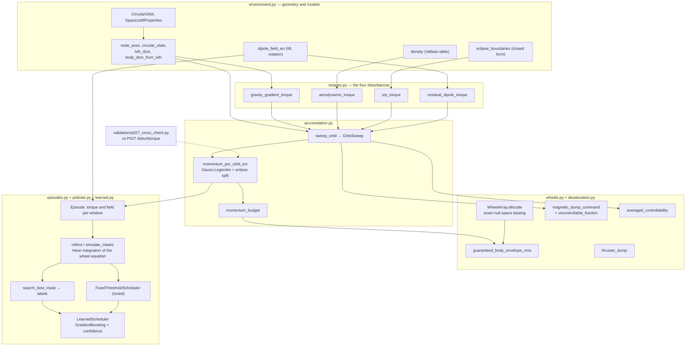
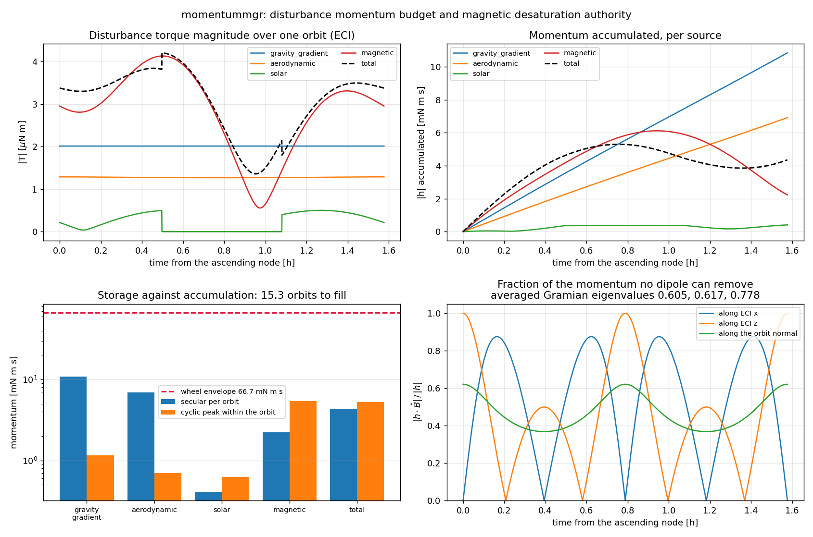
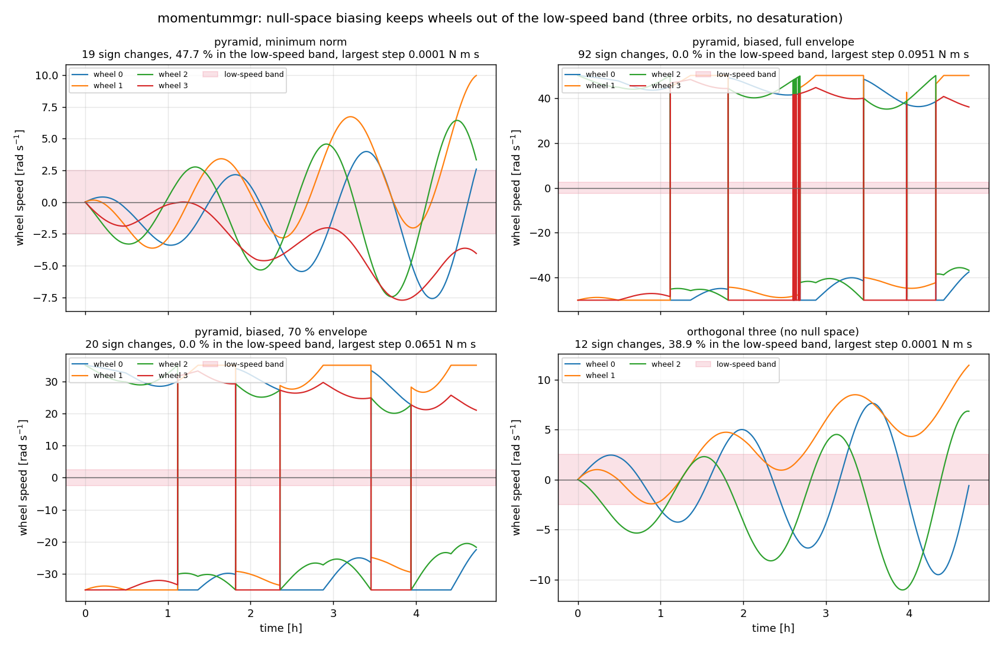
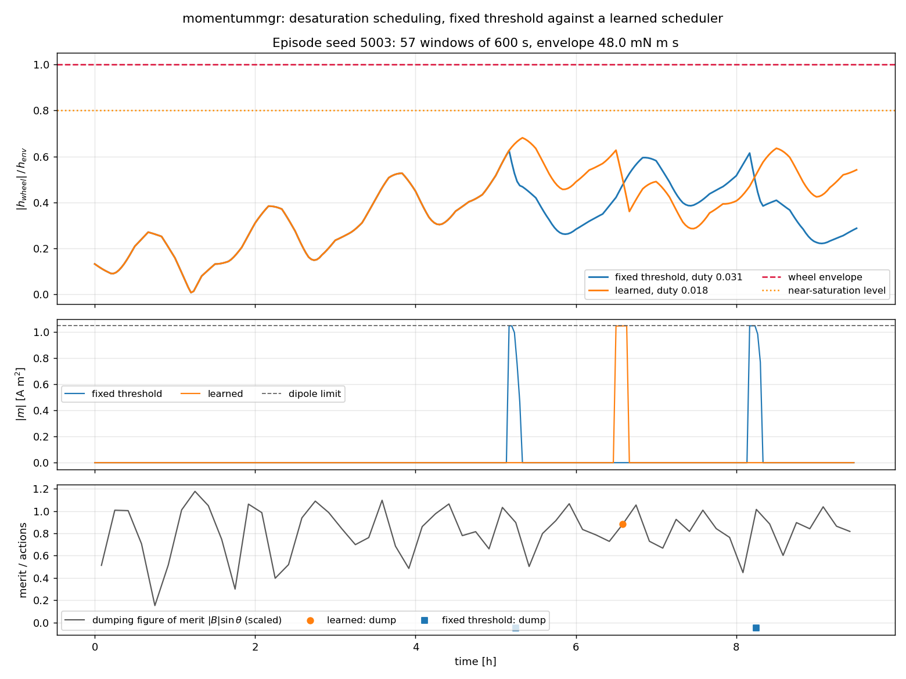

# momentummgr

Reaction-wheel momentum management for Earth-orbiting spacecraft: accumulation, desaturation, scheduling.

**Status:** TESTING · **Class:** compact · **Validation level:** 2 · **AI:** yes


## The problem

Your wheels fill up. Environmental torques put angular momentum into a spacecraft at a few
milli-newton-metre-seconds per orbit, a smallsat wheel holds a few tens, and once a wheel
saturates you have no control authority about that axis. So you dump momentum with
magnetorquers or thrusters — but a magnetorquer can only ever push perpendicular to the
local field, the component along **B** is untouchable at that instant, and when you choose
to dump changes the cost by tens of percent.

## What this does

- **Computes what accumulates.** Gravity-gradient, aerodynamic, solar-radiation-pressure
  and residual-dipole torques over a circular orbit, integrated by Gauss-Legendre
  quadrature with the solar term split at closed-form eclipse boundaries. Cross-checked
  against an independent implementation (P027 `disturbtorque`) to **1.8e−11 relative** on
  the total momentum vector.
- **Quantifies what you cannot dump.** The instantaneous field-direction constraint, the
  time-averaged controllability Gramian and its eigenvalues. At i = 51.6° the worst
  direction is dumpable for **60.5 %** of the orbit and the best for 77.8 %; at i = 0° one
  axis is **blocked outright** and the eigenvalue is 0.000000.
- **Keeps wheels off zero speed.** Exact null-space biasing for a redundant array. On a
  three-orbit run the minimum-norm allocation leaves a wheel inside a 5 %-of-h_max
  low-speed band for **47.70 %** of the time; biasing inside 70 % of the envelope takes
  that to **0.00 %**.
- **Schedules desaturation, and measures whether learning helps.** A tuned
  fixed-threshold baseline against a learned scheduler on 80 held-out episodes: the
  learned one uses **20.7 % less magnetorquer duty** (95 % CI [−0.0188, −0.0107] on the
  duty fraction) and spends **more** time near saturation (+0.0035, CI [+0.0004, +0.0088]).
  At a saturation weight of 2 or more the combined-cost difference is **indistinguishable**.
- **Prices thruster desaturation.** Impulse and propellant for a couple or a single jet;
  dumping a full 0.0667 N m s envelope on a 0.5 m arm at Isp 220 s costs 1.236e−04 kg.

## Who it's for

- ADCS engineers sizing a wheel set and a desaturation cadence early in a mission, who
  want the momentum budget and the magnetic authority in one place and want to read the
  whole model in an afternoon.
- Anyone who needs the **magnetic controllability geometry** of an orbit stated as
  numbers — the uncontrollable fraction, the averaged Gramian, the blocked axis at low
  inclination — rather than as a warning in a textbook.
- People evaluating whether a learned scheduler is worth the trouble, who want the
  baseline tuned properly and the confidence intervals printed.

## Who it's not for

- **Flight software.** Nothing here is flight-qualified, certified, or approved for
  operational use, and the allocator has a known discontinuity (below) that would break a
  real wheel.
- **Anyone who needs the real geomagnetic field.** This is a centred dipole. Its
  *direction* errs against IGRF by tens of degrees, and every controllability number here
  is a function of direction. Use `ppigrf` or `pyIGRF` and feed the field in.
- **Closed-loop attitude simulation.** There is no attitude dynamics here, no sensors, no
  estimator, no slews. The attitude is held in LVLH by assumption.
- **Anyone who needs a validated density above 400 km.** The atmosphere table has no
  solar-activity dependence.
- **Anyone wanting to reuse the learned scheduler as-is.** It is trained on a synthetic
  distribution described in `DATASET_CARD.md` and is not certified for operational flight
  use.

## Alternatives, honestly

Versions checked on PyPI on 2026-09-02; GitHub was not reachable from the build
environment, so no repository claim is made beyond PyPI's own metadata.

| Alternative | What it does better | When to use this instead |
|---|---|---|
| **Basilisk** (AVS Lab) — full spacecraft simulation with reaction-wheel, magnetic-torque-bar and momentum-management modules inside a closed-loop dynamics engine. **Note:** PyPI `basilisk` 0.1 is an unrelated object-NoSQL mapper; Basilisk itself ships from its own source repository as a compiled C++/Python build. | Everything: flexible bodies, sensors, estimators, fault modes, Monte Carlo campaigns, and momentum management inside all of it. | You want a momentum budget, a desaturation cadence and the magnetic controllability of an orbit this afternoon, with no C++ toolchain, and you want to read the model in one sitting. |
| **42** (NASA GSFC open-source spacecraft simulator) — C, with wheels, magnetic torquers and momentum unloading in a full 6-DOF simulation. | A mature, flight-heritage-adjacent simulator with real actuator models. | You want a Python library you can import into a sizing notebook, not a simulation you configure and run. |
| **`orekit-jpype`** (13.1.7.1, Apache-2.0) — Python over Orekit, operational-grade flight dynamics. | Frames, time scales, force models, validation history, an actual operations user base. | You want a pure-Python dependency chain with no JVM, and momentum management rather than orbit determination. |
| **`ppigrf`** (2.1.0) or **`pyIGRF`** (1.0.0) — IGRF geomagnetic field. | The real field: tilt, offset, secular variation, the South Atlantic Anomaly. | You are studying the geometry of magnetic desaturation and a centred dipole is the point. **If the field direction matters to your answer, stop and use IGRF.** |
| **`pymsis`** (0.12.0) — NRLMSISE-00 / NRLMSIS neutral atmosphere. | Solar and geomagnetic activity, diurnal and seasonal variation. | You want a zero-configuration mean density for a sizing sweep. Above 400 km, feed your own density in. |
| **P027 `disturbtorque`** (sibling product, MIT) — the four disturbance torques on their own, with a secular/cyclic split. | Deeper on the torque models themselves: altitude sweeps, crossover analysis, more torque-level validation. | You need what happens *after* the torques: wheels, allocation, desaturation, scheduling. The two agree on the momentum to 1.8e−11 relative and neither imports the other. |
| Wertz, *Spacecraft Attitude Determination and Control*; Sidi, *Spacecraft Dynamics and Control*; Markley & Crassidis, *Fundamentals of Spacecraft Attitude Determination and Control*. | They are the source. Every expression here is in them. | You want the equations executable, unit-tested, hand-checked and cross-checked against a second implementation. |

**Be clear about the contribution.** There is no new physics here. The torque models, the
cross-product dumping law, the pseudo-inverse allocation and threshold unloading are all
standard. What this repository adds is: a second independent implementation of a sibling
product's momentum accumulation, agreeing to eleven figures; the magnetic controllability
constraint measured rather than mentioned, including the non-monotonicity in inclination
that catches people; an exact rather than heuristic null-space maximiser, with the
discontinuity it introduces measured and reported; and a learned scheduler whose advantage
is stated with confidence intervals and whose losses are in the same table.

## Install and first run

```bash
git clone https://github.com/OmAcharya-avtr/momentummgr.git
cd momentummgr
python -m venv .venv && source .venv/bin/activate
pip install -e ".[test,plot]"
python -m pytest tests/ -q
python examples/momentum_budget_and_desaturation.py
```

Expected output of the last command:

```
Reference smallsat, 500 km, i = 51.6 deg, beta = 20 deg, period 5677.0 s
source              |dh| per orbit [N m s]   cyclic peak [N m s]
----------------------------------------------------------------
gravity_gradient              1.084062e-02          1.148756e-03
aerodynamic                   6.911776e-03          6.925218e-04
solar                         4.111214e-04          6.247044e-04
magnetic                      2.236218e-03          5.397449e-03
total                         4.354171e-03          5.254981e-03

wheel array envelope        0.066667 N m s (4 wheels at 0.05 N m s)
orbits to fill on secular   15.31
thruster propellant to dump a full envelope: 1.2360e-04 kg (couple, 0.5 m arm, Isp 220 s)
```

Note what the table says: the *total* secular momentum, 4.354e−03 N m s per orbit, is
smaller than the gravity-gradient term alone, because the sources partly cancel in
inertial space. Budgeting by summing magnitudes would be wrong by a factor of 4.6.

## Quick start

```python
import numpy as np
from momentummgr import (
    momentum_budget, pyramid_four, reference_orbit, reference_smallsat,
    sun_direction_for_beta, sweep_orbit, averaged_controllability,
    magnetic_dump_command, thruster_dump, uncontrollable_fraction,
)

sc, orbit = reference_smallsat(), reference_orbit(500.0)
sun = sun_direction_for_beta(orbit.inclination_rad, orbit.raan_rad, np.radians(20.0))

budget = momentum_budget(sc, orbit, sun)
print(f"secular per orbit  {budget['total']['secular_per_orbit_nms']:.6e} N m s")
print(f"cyclic peak        {budget['total']['cyclic_peak_nms']:.6e} N m s")

wheels = pyramid_four(max_momentum_nms=0.05)
print(f"envelope           {wheels.guaranteed_body_envelope_nms:.6f} N m s")
print(f"orbits to fill     "
      f"{wheels.guaranteed_body_envelope_nms / budget['total']['secular_per_orbit_nms']:.2f}")

sweep = sweep_orbit(sc, orbit, sun, n_samples=721)
_, eig, _ = averaged_controllability(sweep.b_eci_t, sweep.time_s)
print(f"Gramian eigenvalues {np.round(eig, 6).tolist()}")

h = np.array([0.02, 0.0, 0.0])                       # 0.02 N m s along ECI x
frac = uncontrollable_fraction(np.tile(h, (sweep.b_eci_t.shape[0], 1)), sweep.b_eci_t)
print(f"undumpable fraction over the orbit: min {frac.min():.4f}, max {frac.max():.4f}")

worst = int(np.argmax(frac))
cmd = magnetic_dump_command(h, sweep.b_eci_t[worst], gain=1e-3, max_dipole_am2=1.0)
print(f"at the worst sample: |m| {np.linalg.norm(cmd.dipole_am2):.4f} A m^2, "
      f"|T| {np.linalg.norm(cmd.torque_nm):.3e} N m")
print(f"thruster instead   {thruster_dump(0.02, 0.5, 220.0).propellant_kg:.4e} kg")
```

```
secular per orbit  4.354171e-03 N m s
cyclic peak        5.255827e-03 N m s
envelope           0.066667 N m s
orbits to fill     15.31
Gramian eigenvalues [0.605071, 0.616911, 0.778018]
undumpable fraction over the orbit: min 0.0000, max 0.8753
at the worst sample: |m| 0.3048 A m^2, |T| 9.671e-06 N m
thruster instead   3.7081e-05 kg
```

Read the undumpable line. The same 0.02 N m s is entirely removable at some points of the
orbit and 87.5 % unremovable at others, with no change to the vehicle or the controller —
only to where it is. That range is why *when* you dump is a scheduling problem and not a
threshold.

## Configuration

Everything is an argument; there are no configuration files and no global state.

| Where | Knob | Default | Effect |
|---|---|---|---|
| `CircularOrbit` | `altitude_m`, `inclination_rad`, `raan_rad`, `yaw/pitch/roll_rad` | — | orbit and fixed pointing offset from nadir |
| `SpacecraftProperties` | areas, Cd, reflectance, cp offsets, residual dipole, inertia | — | the four torques |
| `sweep_orbit` | `n_samples` | 721 | sample grid; the solar term's error does not fall as a power of N |
| `momentum_per_orbit_eci` | `n_nodes` | 96 | Gauss-Legendre nodes; converged for ≥ 16 |
| `sweep_orbit` | `co_rotating_atmosphere` | `True` | `v − ω⊕ × r`; switching it off raises aerodynamic torque by up to ~12 % |
| `pyramid_four` | `half_angle_rad` | 54.7356° | isotropic; other angles trade axis authority |
| `WheelArray.allocate` | `envelope_fraction` | 1.0 | zero-speed margin against saturation margin — the trade is yours to state |
| `magnetic_dump_command` | `gain`, `max_dipole_am2` | 1.0, `None` | dumping time constant and coil limit |
| `sample_episode` | `n_orbits`, `window_s`, `substeps`, `require_feasible` | 6, 600 s, 5, `True` | the scheduling problem |
| `episode_cost` | `saturation_weight` | 1.0 | how much a second near saturation is worth against a second of duty |

## Architecture



## Examples

Three, each writing a PNG to `screenshots/`:

| Script | Runtime | What it produces |
|---|---|---|
| `examples/momentum_budget_and_desaturation.py` | 3.4 s | the budget table above and a four-panel figure |
| `examples/wheel_zero_speed_avoidance.py` | 4.3 s | wheel speeds under four allocation strategies |
| `examples/scheduler_comparison.py` | 98 s | trains a small model and compares it with the baseline on one episode |

## Screenshots



Notice the bottom-right panel: for a momentum along ECI z the uncontrollable fraction
reaches 1.0 twice per orbit. There are moments when a magnetorquer can do nothing at all
about that direction, and the averaged Gramian eigenvalues (0.605, 0.617, 0.778) are what
makes it recoverable over an orbit rather than never.



Notice the shaded low-speed band in the top-left panel: minimum-norm allocation keeps
wheels inside it 47.7 % of the run. Then notice the vertical jumps in the two biased
panels — that is the allocator's known discontinuity, left visible on purpose and listed
under Limitations.



Notice the bottom panel: the learned scheduler's single dump lands on a high
`|B| sin θ` window, while the fixed-threshold rule dumps twice, at whatever moment the
momentum happened to cross its threshold.

## Validation evidence

Full detail, protocol and raw output: `validation/VALIDATION.md` and the `*_output.txt`
files beside it. **88 checks, 88 passed, 0 failed**, every one produced by running the
named script.

| Check | Reference | Result | Tolerance | Script |
|---|---|---|---|---|
| Total momentum per orbit, ECI | P027 `disturbtorque` (−2.4484285744, 2.8372528957, −2.2167544874)e−03 N m s | 1.8e−11 relative | 5e−10 | `p027_cross_check.py` |
| Solar momentum vector | P027 QUADPACK reference | 1.2e−11 relative | 5e−10 | `p027_cross_check.py` |
| Eclipse fraction | P027 closed form 0.3695911346 | 5.7e−11 relative | 1e−10 | `p027_cross_check.py` |
| Wheel-equation Δh vs quadrature Δh | internal consistency | 1.03e−06 relative | 2e−03 | `p027_cross_check.py` |
| Quadrature self-convergence, ≥ 16 nodes | 384-node reference | 1.0e−13 | 1e−12 | `p027_cross_check.py` |
| **Sampled trapezoid, solar, N = 721** | own GL reference | **3.51e−03 relative** | 5e−3 | `p027_cross_check.py` |
| Gravity gradient, 30° off nadir | hand arithmetic 3.1825644e−06 N m | 1e−7 relative | 1e−7 | `hand_calculations.py` |
| Thruster couple, 0.05 N m s, 0.5 m, 220 s | hand arithmetic 9.2701474e−05 kg | 1e−7 relative | 1e−7 | `hand_calculations.py` |
| [B×] singular values | (\|B\|, \|B\|, 0) exactly | 1.56e−16, 8.88e−16 | 1e−15, 1e−14 | `magnetic_controllability.py` |
| Gramian trace | exactly 2 for any field history | 3.6e−15 | 1e−12 | `magnetic_controllability.py` |
| **Equatorial orbit, momentum along z** | must be fully uncontrollable | **mean fraction 1.0000, λ_min 0.000000** | 1e−12 | `magnetic_controllability.py` |
| **Uncontrollable fraction vs inclination** | expected monotone — **it is not** | min 0.4627 at 51.6°, rises to 0.6367 at 90° | reported as a finding | `magnetic_controllability.py` |
| Frozen field, momentum along B | must not decay at all | unchanged to 1e−12 over a full orbit | 1e−12 | `magnetic_controllability.py` |
| Exact null-space maximiser | 20001-point brute-force scan | never beaten, shortfall 0.0 | 1e−12 | `wheel_allocation.py` |
| Low-speed dwell, min-norm vs biased 0.7 | — | 47.70 % → 0.00 % | reported | `wheel_allocation.py` |
| **Allocator discontinuity** | minimum norm 0.000060 N m s per sample | **biased 0.095112 N m s — a defect, not fixed** | reported as a finding | `wheel_allocation.py` |
| Learned vs baseline, duty | paired bootstrap, 80 held-out episodes | −0.014687, CI [−0.01882, −0.01072], **learned better** | — | `learned_vs_fixed_ci.py` |
| Learned vs baseline, near saturation | same | +0.003542, CI [+0.00035, +0.00883], **baseline better** | — | `learned_vs_fixed_ci.py` |
| **Learned vs baseline, cost at weight 2 and 4** | same | −0.0076 CI [−0.0154, +0.0036] and −0.0005 CI [−0.0141, +0.0210], **indistinguishable** | — | `learned_vs_fixed_ci.py` |
| Confidence calibration | constant base-rate predictor | Brier 0.039862 vs 0.040947, skill +0.0265; **worst bin gap +0.1120** | — | `learned_vs_fixed_ci.py` |
| Headroom captured vs the offline search | non-causal search 0.030835 | 52.4 % | — | `learned_vs_fixed_ci.py` |
| Integrator sensitivity, 5 → 10 substeps | — | worst mean shift 0.001148 | 1e−2 | `learned_vs_fixed_ci.py` |

**Two checks failed as first written and are recorded rather than removed.** The
uncontrollable fraction is not monotone in inclination, and a first-order Euler integrator
overstated the baseline's magnetorquer duty by 49 % (0.1292 against a converged 0.0866);
the integrator was replaced with Heun's method, which is within 4e−05 of its own
80-substep value at the default step. Both are in `validation/VALIDATION.md`.

## Engineering theory

Every expression carries its source, units, assumptions and validity range in its
docstring. The load-bearing ones:

| Expression | Source | Units | Validity |
|---|---|---|---|
| `T_gg = 3n² û × (I û)`, `n² = µ/R³` | Wertz; Hughes; Sidi | kg m², m, N m | O((L/R)²) error; ~2e−12 relative for a 10 m vehicle at 500 km |
| `F_aero = −½ ρ Cd A \|v\| v` | Larson & Wertz; Vallado | kg m⁻³, m s⁻¹, N | free-molecular, above ~150 km; Cd ±20 %, density ×several above 400 km |
| `F_srp = −(Φ/c) A (1+q) / d²` anti-sunward | Wertz; Larson & Wertz | m², N | specular-plus-absorbed only; **no Earth albedo or IR**, together ~⅓ of direct SRP in LEO |
| `T_mag = m × B` | Wertz; Sidi | A m², T, N m | exact; the field model is the error source |
| `B = (k/r³)[3(m̂·r̂)r̂ − m̂]`, k = 7.96e15 T m³ | Wertz; Markley & Crassidis | m, T | centred dipole; 20–30 % in magnitude and tens of degrees in direction against IGRF |
| `ρ(h) = ρ₀ exp(−(h−h₀)/H)`, 28 bands | Vallado (US Std 1976 / CIRA-72) | m, kg m⁻³ | 0–1000 km; **no solar-activity dependence** |
| `ḣ_w = T_d + T_mag − ω × (Iω + h_w)` | Wertz; Sidi; Markley & Crassidis | N m, N m s | attitude held in LVLH; the constant `−ω × Iω` gyroscopic term is kept |
| `m = −(k/\|B\|²) B × h` ⟹ `T = −k[h − (h·B̂)B̂]` | Wertz; Sidi; Markley & Crassidis | A m², T | removes exactly the perpendicular momentum; the parallel part is untouchable |
| `G = ⟨I − B̂B̂ᵀ⟩`, trace 2 | standard averaged-controllability argument | dimensionless | eigenvalues are the dumpable fraction of the interval |
| `h_env = h_max / maxᵢ‖(A⁺)ᵢ‖`; (4/3)h_max for the isotropic pyramid | Markley & Crassidis (actuator chapter) | N m s | conservative: assumes minimum-norm allocation; the true reachable set is a larger zonotope |
| `I = N_jet \|Δh\| / (L η)`, `m_p = I/(I_sp g₀)` | rocket equation in impulse form; Sidi | N m s, m, s | η = 1 is the optimistic bound |

## AI model details

Full card: **`MODEL_CARD.md`**. Dataset: **`DATASET_CARD.md`**.

- **Baseline first.** `FixedThresholdScheduler` (dump above `on_fraction`, stop below
  `off_fraction`) was implemented, tuned by grid search on the same 85 non-held-out
  episodes the learned model gets, and validated before any learning. Chosen: on = 0.60,
  off = 0.48.
- **Model.** `sklearn.ensemble.GradientBoostingClassifier(n_estimators=150, max_depth=3,
  min_samples_leaf=8, random_state=0)` over eleven onboard-computable features. Chosen
  over a random forest for prediction latency: 0.29 ms against 37 ms per single-row call.
- **Labels** come from a non-causal offline search over on/off schedules per episode
  (~513 schedules simulated each). The classifier is causal and is evaluated closed loop.
- **Splits.** Fitting 60 episodes (seeds 1000–1059), knob tuning 25 (2000–2024), held out
  80 (5000–5079), all disjoint. The two decision knobs are tuned on episodes the
  classifier was not fitted on; tuning them on the fitting set cost ~15 % on held-out cost.
- **Uncertainty.** Every decision carries a confidence; below a tuned band the scheduler
  defers to the classical baseline. Calibration is measured and is imperfect: Brier
  0.039862 against 0.040947 for a base-rate predictor, and overconfidence up to +0.1120 in
  the [0.20, 0.40) bin. It is a decision score, not a posterior.
- **Result.** 20.7 % less magnetorquer duty, outside its confidence interval; more time
  near saturation, also outside its interval; indistinguishable on combined cost once
  saturation is weighted twice as heavily as duty. It captures 52.4 % of the headroom the
  non-causal search shows to exist.
- **Failure cases** are listed in `MODEL_CARD.md`, including that the advantage disappears
  with a smaller training budget.

**This model is not certified for operational flight use.**

## Hardware requirements

Two CPU cores, no GPU, a few hundred MB of RAM. Full test suite 22 s. The five validation
scripts total about 163 s, of which `learned_vs_fixed_ci.py` is 116 s. Dataset
regeneration 62 s. Everything is single-threaded (`n_jobs=1`) and deterministic.

## API reference

<details>
<summary>Public surface, one line each, with units</summary>

**Environment** — `CircularOrbit(altitude_m, inclination_rad, raan_rad, yaw/pitch/roll_rad, mu)`;
`SpacecraftProperties(inertia, drag_area_m2, drag_coefficient, cp_aero_offset_m, srp_area_m2, srp_reflectance, cp_srp_offset_m, residual_dipole_am2, mass_kg)`;
`node_axes(i, raan) -> (P̂, Q̂, ĥ)` dimensionless;
`orbital_period(radius_m, mu) -> s`;
`circular_state(radius_m, i, raan, u, mu) -> (r [m], v [m s⁻¹])`;
`lvlh_dcm(r, v)`, `body_dcm_from_lvlh(yaw, pitch, roll)` dimensionless;
`sun_direction_for_beta(i, raan, beta, phase)`, `beta_angle(ŝ, i, raan) -> rad`;
`eclipse_boundaries(...) -> (u_in, u_out) rad | None`, `eclipse_fraction(...) -> [0,1)`,
`is_illuminated(r, ŝ)`; `density(altitude_m, allow_extrapolation) -> kg m⁻³`;
`dipole_field_eci(r, reduced_moment, tilt_rad, rotation_angle_rad) -> T`;
`reference_smallsat()`, `reference_orbit(altitude_km)`.

**Torques (N m)** — `gravity_gradient_torque(inertia, nadir_unit_body, radius_m, mu)`;
`gravity_gradient_worst_case(i_min, i_max, radius_m, mu)`;
`aerodynamic_force/aerodynamic_torque(density, v_rel_body, Cd, area, cp_offset)`;
`srp_force/srp_torque(sun_unit_body, area, reflectance, cp_offset, distance_au, illuminated, pressure_1au)`;
`residual_dipole_torque(dipole_body_am2, b_body_t)`.

**Accumulation** — `sweep_orbit(sc, orbit, ŝ, n_samples, ...) -> OrbitSweep`;
`OrbitSweep.torque(source, frame) -> (N,3) N m`, `.b_body_t() -> (N,3) T`,
`.eclipse_fraction_sampled`;
`momentum_per_orbit_eci(sc, orbit, ŝ, source, n_nodes, ...) -> (3,) N m s`;
`secular_torque_eci(...) -> (3,) N m`; `momentum_history_eci(sweep, source) -> (N,3) N m s`;
`momentum_budget(sc, orbit, ŝ, n_samples) -> dict` with `secular_per_orbit_nms`,
`cyclic_peak_nms`, `peak_torque_nm`, `rms_torque_nm`.

**Wheels** — `WheelArray(axes, wheel_inertia_kg_m2, max_momentum_nms)`;
`.distribution_matrix (3,n)`, `.null_basis (n, n−3)`, `.guaranteed_body_envelope_nms`,
`.body_momentum(h) -> N m s`, `.speeds_rad_s(h) -> rad s⁻¹`, `.saturation_fraction(h)`,
`.minimum_norm_allocation(h_body) -> N m s`,
`.allocate(h_body, avoid_zero_speed, envelope_fraction) -> Allocation`;
`pyramid_four`, `tetrahedral_four`, `orthogonal_three`;
`count_zero_crossings(history, deadband_nms)`.

**Desaturation** — `magnetic_dump_command(h_err, b_body, gain, max_dipole_am2) -> MagneticCommand`
(`dipole_am2`, `torque_nm`, `saturated`, `uncontrollable_nms`, `uncontrollable_fraction`);
`uncontrollable_fraction(h, b) -> [0,1]`;
`averaged_controllability(b_history, time_s) -> (gramian, eigenvalues, eigenvectors)`;
`dipole_cost(m_history, time_s) -> A m² s`;
`thruster_dump(dh, moment_arm_m, isp_s, couple, efficiency) -> ThrusterDump`
(`impulse_ns`, `propellant_kg`).

**Scheduling** — `sample_episode(seed, n_orbits, window_s, substeps, require_feasible)`;
`build_episode(...)`; `rollout(episode, decide, record_history) -> Rollout`;
`simulate_masks(episode, masks) -> [EpisodeMetrics]`;
`episode_cost(duty, near_sat, max_h, saturation_weight, violation_weight)`;
`FixedThresholdScheduler(on_fraction, off_fraction)`, `AlwaysOnScheduler`, `NeverScheduler`,
each with `.decider()`; `tune_fixed_threshold(episodes, ...)`;
`evaluate_policy(policy, episodes)`;
`search_best_mask(episode, seed, n_random, max_rounds)`;
`harvest_training_rows(episode, mask)`;
`train_scheduler(fit_episodes, tune_episodes, fallback, ...)`;
`LearnedScheduler(model, decision_threshold, min_confidence, fallback)` with
`.predict_proba(features)` and `.decider()`.

**CLI** — `python -m momentummgr budget|controllability|schedule [--json]`.

</details>

## Limitations

1. **The allocator is discontinuous.** `allocate(avoid_zero_speed=True)` picks the
   null coefficient afresh every call with no memory, and the maximiser switches between
   symmetric branches. Largest single-sample step measured: **0.095112 N m s in 7.9 s**
   against 0.000060 N m s for minimum-norm allocation — a torque demand an order of
   magnitude beyond a smallsat wheel. A flight implementation must rate-limit the
   coefficient or add hysteresis. Not fixed in 0.1.0; see
   `validation/wheel_allocation.py` section 5.
2. **Centred dipole field.** Direction errors of tens of degrees against IGRF, and every
   controllability and scheduling number here depends on direction.
3. **No solar-activity dependence** in the atmosphere; aerodynamic torque above 400 km
   carries at least a factor-of-several uncertainty from its input model.
4. **Circular orbits, fixed pointing offsets, no J2.** No eccentricity, no slews, no
   payload-driven attitude changes, no nodal regression.
5. **No wheel friction, no actuator dynamics.** Zero-speed avoidance is offered because
   friction is badly behaved near zero, but the friction itself is not modelled, so this
   package cannot tell you how much it costs you.
6. **No Earth albedo or infrared** in the SRP model — together roughly a third of direct
   solar pressure in LEO, and simply absent.
7. **The solar term's quadrature error does not fall as a power of N** on the sampled
   grid: 3.51e−03 relative at the default 721 samples, and non-monotone in N. Use
   `momentum_per_orbit_eci` (Gauss-Legendre) when you need the number, not
   `momentum_history_eci`.
8. **The `guaranteed_body_envelope_nms` is conservative**, assuming minimum-norm
   allocation. The true reachable momentum set is a zonotope and is larger.
9. **The learned scheduler is validated inside one synthetic distribution**, needs about
   40+ fitting episodes before it beats the tuned baseline, is overconfident above
   p = 0.05, and leaves less saturation margin than the baseline. It is not certified for
   operational flight use.
10. **Episodes that cannot be desaturated at all are excluded** from the benchmark by
    rejection sampling (~8 % of draws). Nothing here says how either scheduler behaves on
    an under-actuated vehicle.

## Reproducing every number

From `products/P029/`:

```bash
# tests: 109 passed
python -m pytest tests/ -q

# lint
ruff check src/ tests/

# validation, each writes its raw stdout next to itself
cd validation
python3 hand_calculations.py          #  32 checks
python3 p027_cross_check.py           #  22 checks
python3 magnetic_controllability.py   #  18 checks
python3 wheel_allocation.py           #   9 checks
python3 learned_vs_fixed_ci.py        #   7 checks, ~116 s
cd ..

# dataset (rebuilds data/training_features.csv byte for byte)
python3 data/generate_dataset.py

# figures
cd examples
python3 momentum_budget_and_desaturation.py
python3 wheel_zero_speed_avoidance.py
python3 scheduler_comparison.py

# CLI
python -m momentummgr budget --altitude-km 500 --beta-deg 20
python -m momentummgr controllability --inclination-deg 51.6
python -m momentummgr schedule --seed 5000
```

## Roadmap

Not commitments; the honest list of what 0.1.0 does not do and what would matter most.

- Rate-limited or hysteretic null-space biasing, to remove the discontinuity in
  Limitation 1.
- An IGRF field interface, so the controllability and scheduling results can be redone on
  the real field and the learned advantage rechecked.
- Elliptical orbits and a J2 nodal drift, so multi-day desaturation planning is meaningful.
- A thruster-based scheduler benchmarked on propellant, alongside the magnetic one.
- Calibration of the confidence output (isotonic or Platt on a held-out split), so the
  deferral band means something quantitative.

## Safety statement

This software is research-grade. It is not flight-qualified, not certified, and not
approved for operational aerospace use. The learned scheduler is not certified for
operational flight use.

## Licence

Apache-2.0. Copyright © 2026 OPTIMA Organisation. See `LICENSE`.

## Credits

This is under reserved rights obtained by OPTIMA Organisation.

## Citation

```bibtex
@software{momentummgr2026,
  title  = {momentummgr: reaction-wheel momentum management, desaturation and scheduling},
  author = {{OPTIMA Organisation}},
  year   = {2026},
  version = {0.1.0},
  url    = {https://github.com/OmAcharya-avtr/momentummgr}
}
```

See also `CITATION.cff`.
