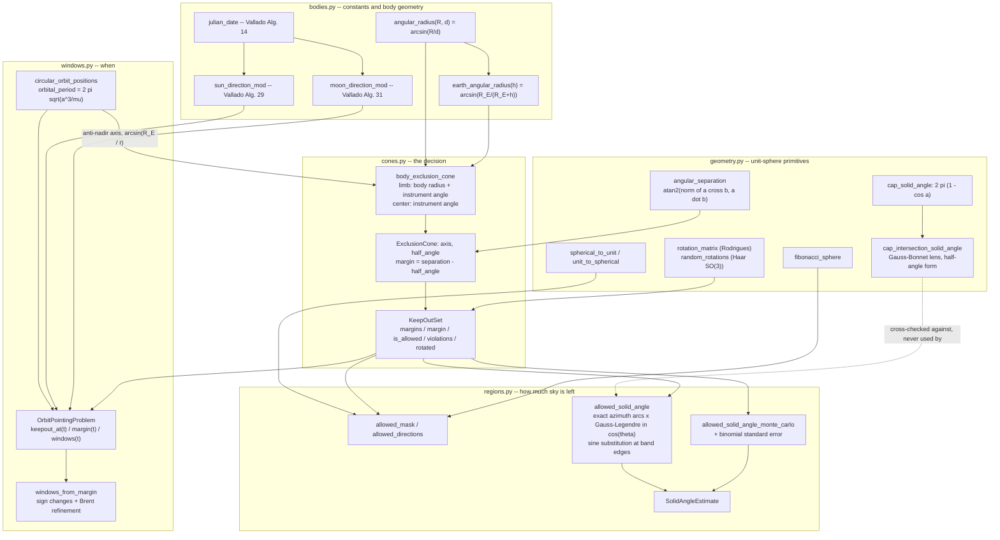
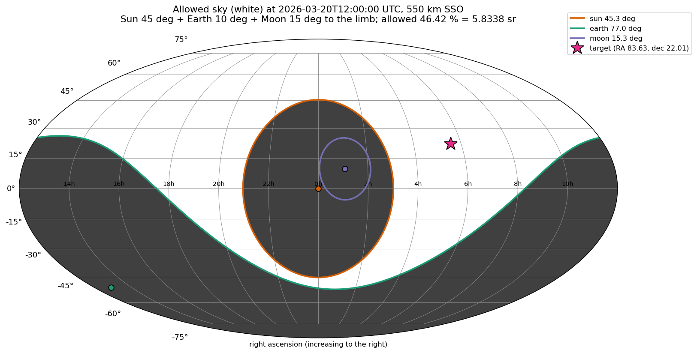
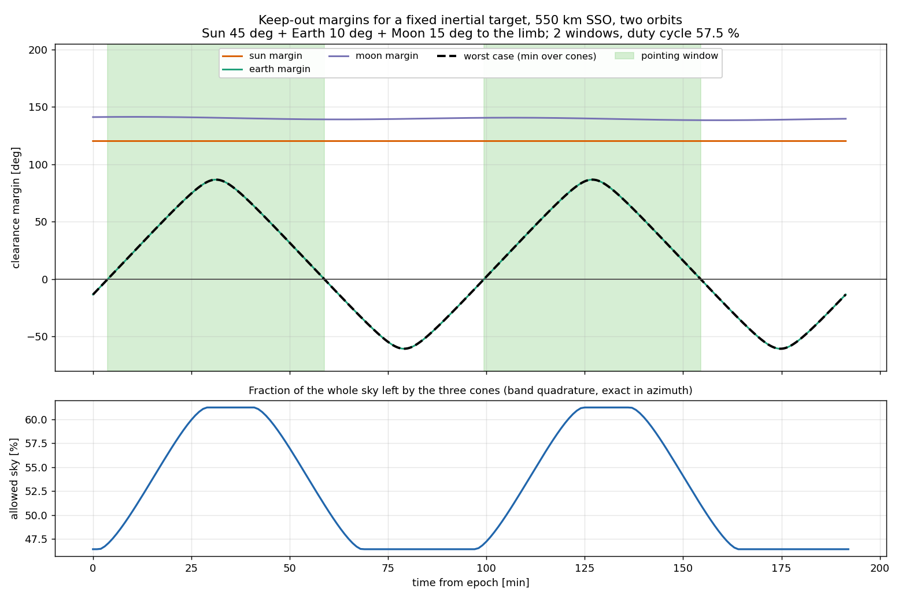

# KeepOut

Sun, Earth and Moon exclusion cones for spacecraft pointing, and the decision they imply.


**Status: TESTING** · Validation level 1 (educational) · no machine-learning
components · MIT · © 2026 OPTIMA Organisation

## The problem

An instrument datasheet says "Sun exclusion 45 deg, Earth limb exclusion
10 deg". Someone writes `separation(boresight, earth_dir) > radians(10)` and
the check passes for almost every attitude, because at 550 km the Earth itself
already fills a cone of 67.016 deg and the real limit is 77.016 deg — the
instrument angle plus the body's angular radius. The angular separation was
never the hard part; the hard part is that the exclusion angle, the body's
apparent size, and which of the two the datasheet meant all have to end up in
the same number.

## What this does

- **Turns a datasheet keep-out angle into a cone, with the convention stated at
  the call site.** `body_exclusion_cone(..., reference="limb")` adds the body's
  angular radius; `reference="center"` does not. At 550 km a 10 deg
  Earth-limb angle becomes a **77.0159484695 deg** cone; the two conventions
  differ by 67 deg, verified bit-exact in
  `validation/validate_earth_angular_radius.py`.
- **Answers the violation question for a boresight, with signed margins.**
  `KeepOutSet.violations()` names every cone breached, deepest first;
  `.margin()` returns the worst-case clearance in radians, which is the
  function to bisect when you want the instant a violation begins.
- **Computes how much sky is left, deterministically.** Band quadrature that is
  exact in azimuth and Gauss-Legendre in `cos(theta)`: **worst error 2.655e-11
  sr** against the two-cap closed form over 300 random configurations, with an
  independent Monte Carlo estimator and binomial error bar for cross-checking.
- **Finds keep-out-aware pointing windows over an orbit.** Coarse margin scan
  plus Brent refinement; refined boundaries land within **8.523e-11 rad** of
  zero margin, and a 1 s re-test over the whole scan gives **0 disagreements**
  (`validation/validate_invariance.py`).
- **Holds up to rotation.** Margins are invariant under 20 000 random rotations
  from SO(3) to **1.110e-15 rad**, and the allowed solid angle to **3.360e-11
  sr** over 200 rotations.

## Who it is for

- Anyone writing the "can I point there" predicate for an instrument with
  celestial exclusion cones, who wants the limb-versus-centre convention
  written down rather than remembered.
- Anyone who needs the *size* of the allowed region — for scheduling margin,
  for a duty-cycle estimate, for a sanity check on a planner — and wants a
  deterministic number rather than a Monte Carlo one.
- Students and educators: the whole package is five modules of NumPy and reads
  end to end in an afternoon, with every geometric claim backed by committed
  raw output.

## Who it is not for

- Anyone who needs an accurate ephemeris. The bundled Sun and Moon series are
  Vallado's low-precision algorithms, supplied so the package can be exercised
  end to end. **They have not been compared against a numerical ephemeris**, and
  no accuracy figure for them appears anywhere in this repository. For real
  work pass directions from Skyfield, astropy or SPICE.
- Anyone who needs a slew planner. There is no attitude profile, no actuator
  model, no path search — only the geometry a planner would query.
- Anyone modelling a real baffle. Cones are circular and rigid; stray-light
  scattering off structure, illumination-dependent limits, elongated or
  rectangular fields, and self-occultation by the spacecraft are all out of
  scope.
- Anyone needing orbit perturbations. The bundled propagator is unperturbed
  circular two-body: no J2, so no nodal regression, so no correct beta-angle
  evolution beyond a day or so.

## Alternatives, honestly

Computing an angular separation is three lines of astropy. The narrow claim
here is the packaging of the *decision*: multiple bodies at once, the
instrument-versus-limb convention made explicit, the Earth's angular radius
folded in from altitude, and the allowed region and pointing windows that
follow. The geometry itself is textbook and is not novel.

| Alternative | What it does better | When to use KeepOut instead |
|---|---|---|
| [astropy](https://pypi.org/project/astropy/) (8.0.1) | `SkyCoord.separation()` and `get_body()` give real, frame-aware angular separations with units and a proper solar-system ephemeris. This is the correct tool for "how far apart are these two things" | You want the exclusion-cone decision, the limb convention, allowed solid angle and windows, not the separation. Use astropy for the directions and this for the verdict |
| [Skyfield](https://pypi.org/project/skyfield/) (1.55) | `separation_from()` on real JPL ephemerides, careful time scales, and an easy path to accurate Sun/Moon/planet positions | Same: Skyfield is the ephemeris. KeepOut has no ephemeris worth the name and says so |
| [Orekit](https://www.orekit.org/) via [orekit-jpype](https://pypi.org/project/orekit-jpype/) (13.1.7.1) | The serious answer. `FieldOfViewDetector` and `CircularFieldOfView` in a full event-detection framework, with real propagators, real frames and real attitude providers — flight-heritage-grade and actively maintained | You want a five-module pure-Python dependency instead of a JVM, JPype and a data-file bundle, for a problem that is one geometric predicate |
| [Basilisk](https://avslab.github.io/basilisk/) (`pip install bsk`, 2.11.1) | A full astrodynamics simulation framework. `boreAngCalc` reports boresight miss and azimuth angles against a celestial body, and `scenarioAttitudeConstraintViolation` demonstrates attitude constraint checking inside a running simulation | You are not running a simulation. `boreAngCalc` reports angles; the exclusion decision, the region size and the window search are yours to write. Note the PyPI name `basilisk` is an unrelated NoSQL package — the astrodynamics one is `bsk` |
| [SpiceyPy](https://pypi.org/project/spiceypy/) (8.2.0) | NAIF SPICE. `gfoclt` finds occultations, `gfposc` finds intervals meeting positional conditions, `gfdist` finds distance extrema — the definitive geometry-finding toolkit, with the definitive ephemerides behind it | You do not want to manage SPICE kernels for a problem that is two dot products and a decision. If you already load kernels, use SPICE |
| [hapsira](https://pypi.org/project/hapsira/) (0.18.0) | The maintained fork of poliastro: orbit propagation, manoeuvres, plotting | Neither hapsira nor poliastro models attitude or instrument exclusion cones at all; they solve a different problem |
| [poliastro](https://pypi.org/project/poliastro/) (0.17.0) | Was the standard Python astrodynamics package | Last release 2022-07-10 and the project is archived; use hapsira or Orekit for anything new |

No package on PyPI is named `keepout`, `keep-out`, `attitude-keepout` or
`astro-keepout` (checked 2026-08-31). That is a statement about the name, not
about novelty.

**Sibling products.** SlewForge (P021) plans the slew; KeepOut supplies the
geometry it has to respect. They are deliberately separate repositories with no
shared code, so KeepOut is usable without a planner, and a disagreement between
the two independent cone implementations is a finding rather than a nuisance.
Frame and vector conventions follow QuatKit (P007). **No cross-product imports
anywhere.**

## Install and first run

```bash
git clone https://github.com/OmAcharya-avtr/keepout.git
cd keepout
python -m venv .venv && source .venv/bin/activate
pip install -e ".[test]"
python -m pytest tests/ -q
python examples/sky_map.py
```

The library needs only NumPy and SciPy. The `test` extra adds pytest and
Hypothesis; `examples` adds Matplotlib; `dev` adds all four plus ruff.

Expected output:

```
........................................................................ [ 45%]
........................................................................ [ 90%]
...............                                                          [100%]
159 passed in 13.55s
```

```
epoch                : 2026-03-20T12:00:00 UTC (JD 2461120.0)
orbit                : 550 km circular, i = 97.6 deg, period 95.65 min
instrument keep-out  : Sun 45 deg, Earth 10 deg, Moon 15 deg, measured to the limb

   cone  axis RA [deg]  axis dec [deg]  half-angle [deg]  solid angle [sr]
    sun       359.8990         -0.0457           45.2676          1.861099
  earth       193.4561        -50.9363           77.0159          4.871480
   moon        16.2101          9.7503           15.2734          0.221923

allowed solid angle  : 5.833791 sr (46.4238 % of the sky), 672 quadrature nodes
Monte Carlo check    : 5.847183 +/- 0.008864 sr (500000 samples)

target RA 83.63 deg, dec 22.01 deg -> violations: ()
worst-case margin    : +38.9391 deg

wrote .../keepout/screenshots/sky_map.png
```

## Worked example

```python
import datetime as dt

import numpy as np

import keepout as ko

# A 550 km sun-synchronous orbit; instrument keep-out angles measured to the limb.
problem = ko.OrbitPointingProblem(
    epoch_jd=ko.julian_date(dt.datetime(2026, 3, 20, 12, 0, 0)),
    altitude_m=550e3,
    inclination=np.radians(97.6),
    raan=0.4,
    arg_lat0=0.9,
    sun_exclusion=np.radians(45.0),
    earth_exclusion=np.radians(10.0),
    moon_exclusion=np.radians(15.0),
    reference="limb",
)

keepout = problem.keepout_at(0.0)
for cone in keepout:
    print(f"{cone.name:>6}  half-angle {cone.half_angle_deg:7.3f} deg"
          f"  excludes {cone.solid_angle:6.3f} sr")

# The Earth cone is the instrument angle plus the Earth's own angular radius.
print("Earth angular radius at 550 km:",
      round(float(np.degrees(ko.earth_angular_radius(550e3))), 4), "deg")

# Is a given inertial target observable right now?
target = ko.spherical_to_unit(np.radians(187.706), np.radians(12.391))
print("violations:", keepout.violations(target))
print("worst-case margin:", round(float(np.degrees(keepout.margin(target))), 3), "deg")

# How much of the sky is left?
est = ko.allowed_solid_angle(keepout)
print(f"allowed sky: {est.solid_angle:.4f} sr = {est.fraction * 100:.3f} %")

# When can it be observed over the next two orbits?
t = np.arange(0.0, 2.0 * problem.period, 10.0)
for w in problem.windows(t, target):
    print(f"window {w.start:9.3f} s -> {w.end:9.3f} s  ({w.duration / 60.0:.2f} min)")
```

Actual output:

```
   sun  half-angle  45.268 deg  excludes  1.861 sr
 earth  half-angle  77.016 deg  excludes  4.871 sr
  moon  half-angle  15.273 deg  excludes  0.222 sr
Earth angular radius at 550 km: 67.0159 deg
violations: ('earth',)
worst-case margin: -13.49 deg
allowed sky: 5.8338 sr = 46.424 %
window   225.517 s ->  3526.882 s  (55.02 min)
window  5964.509 s ->  9265.874 s  (55.02 min)
```

The Sun cone is 45.268 deg, not 45: the extra 0.268 deg is the Sun's own
angular radius at 1 AU, which the limb convention adds. That is negligible for
the Sun and decisive for the Earth, and the point of naming the convention is
that the same code path handles both.

## Architecture



The dashed edge matters: `cap_intersection_solid_angle` (Gauss-Bonnet) and
`allowed_solid_angle` (band quadrature) are two independent routes to the same
number, and neither calls the other. Their agreement to 2.7e-11 sr over 300
random configurations is the strongest single piece of evidence in
`validation/`.

Runtime dependencies: NumPy throughout, SciPy for `brentq` in `windows.py`
only. Matplotlib is needed by the examples, not by the library.

## Screenshots



Produced by `examples/sky_map.py`. Notice the scale: the Earth cone (green,
77.0 deg) sweeps more than half the frame and is what actually constrains the
schedule, while the Sun cone (orange, 45.3 deg) and Moon cone (purple, 15.3
deg) are comparatively small. The white area is what the band quadrature
integrates to 5.8338 sr, 46.42 % of the sky, at this instant.



Produced by `examples/pointing_windows.py`. The green shading is the two
pointing windows. The dashed worst-case curve sits exactly on the Earth margin
for the whole scan — the Sun and Moon margins never drop below 120.16 and 138.29 deg — so for
this target the Earth cone alone decides everything, and the 57.5 % duty cycle
is set by the orbit period rather than by the instrument's Sun angle.

## Validation evidence

Level 1 (Educational). Every figure below is the raw output of a script in
`validation/`, committed beside it; the full working is in
`validation/VALIDATION.md`.

| Check | Reference | Result | Tolerance | Source |
|---|---|---|---|---|
| Cap solid angle vs adaptive quadrature of `int 2 pi sin(t) dt`, 12 radii from 0.5 to 180 deg | elementary integral | worst \|diff\| **1.776e-15 sr** | 1e-12 | `validate_cone_geometry.py` |
| Two-cap intersection vs 12 exactly-known cases (coincident, disjoint, hemispheres → lune `2(pi−d)`, disjoint complements) | Todhunter (1886), Art. 37 and 45 | worst \|diff\| **4.441e-16 sr** | 1e-13 | `validate_cone_geometry.py` |
| Gauss-Bonnet lens formula vs band quadrature, 300 random configurations | two independent algorithms | worst \|diff\| **2.655e-11 sr** (5.035653126579215 vs 5.035653126605770) | 1e-10 | `validate_cone_geometry.py` |
| Band quadrature vs Monte Carlo, 2e6 samples, 3 configurations | binomial error bar | **1.33 σ**, **0.07 σ**, **0.01 σ** | 4 σ | `validate_cone_geometry.py` |
| Earth angular radius vs `arcsin(R_E/(R_E+h))`, 19 altitudes 0 to 384 400 km | Wertz (1978) Sec. 5.2; Vallado (2013) Sec. 11.7 | worst \|diff\| **0.000e+00 rad** (bit-identical) | 0 | `validate_earth_angular_radius.py` |
| Earth angular radius vs numerical maximisation of the subtended angle, using no tangency identity | definition of apparent angular radius | worst \|diff\| **1.399e-14 rad** | 1e-9 | `validate_earth_angular_radius.py` |
| Limb-referenced cone half-angle = `arcsin(R_E/(R_E+h))` + instrument angle, 4 cases | this package's stated convention | worst \|diff\| **0.000e+00 rad**; 77.0159484695 deg at 550 km + 10 deg | 1e-15 | `validate_earth_angular_radius.py` |
| Hand-computed two-cone case, 30 / 25 deg, 40 deg apart, every intermediate printed | hand arithmetic in `VALIDATION.md` §3a | library **0.11975564113233417 sr** vs hand **0.11975564113233483 sr**, \|diff\| **6.661e-16 sr** | 1e-15 | `validate_hand_case.py` |
| Allowed sky for the same hand case | `4 pi − union` = 11.255653505126112 sr | band quadrature **11.255653505126142 sr**, \|diff\| **3.020e-14 sr**; Monte Carlo 0.43 σ | 1e-10 | `validate_hand_case.py` |
| Violation verdicts at 11 hand-decided boresights, plus deepest-first ordering | hand reasoning, tabulated | **11 / 11 exact**; margins −5.0000000000 and −10.0000000000 deg | exact | `validate_hand_case.py` |
| Margin invariance under random SO(3) rotations, 3 cones per trial | Shoemake (1992) Haar sampling | worst change **1.110e-15 rad** = 2.290e-07 mas over 20 000 trials | 1e-12 rad | `validate_invariance.py` |
| Verdict invariance under the same rotations | — | **0 changes** in 20 000 trials, both with and without a 1e-7 rad clearance filter | 0 | `validate_invariance.py` |
| Allowed solid angle invariance under 200 rotations of a 3-cone set | — | worst change **3.360e-11 sr** on 5.952500685656604 sr | 1e-9 sr | `validate_invariance.py` |
| Window boundaries: margin at each refined boundary | root of the margin function | worst \|margin\| **8.523e-11 rad**; 1 s re-test over 11 461 samples gives **0 disagreements** | 1e-7 rad | `validate_invariance.py` |
| Sun declination extremes vs the obliquity of the ecliptic | 23.4393 deg at J2000 | +23.435849 / −23.435784 deg, **0.0035 deg** | 0.01 deg | `validate_ephemeris.py` |
| Tropical year from northward equinox crossings | 365.2422 d | **365.242320 d**, diff 0.000120 d | 0.01 d | `validate_ephemeris.py` |
| Moon mean geocentric distance | 384 400 km | **385 012.805 km**, **+0.159 %** — biased high by the truncated parallax series | 1 % | `validate_ephemeris.py` |
| Moon sidereal period | 27.321582 d | **27.328765 d**, **+0.0072 d** (10.3 min) | 0.01 d | `validate_ephemeris.py` |
| Sun/Moon directions vs a numerical ephemeris (DE440 or equivalent) | JPL ephemeris | **NOT CHECKED** — no ephemeris file available in this environment; no accuracy claim is made | — | — |
| Property tests: separation symmetry/bounds/scale, rotation invariance of verdicts and margins, `contains` ⇔ negative margin, cap-area bounds and symmetry, band quadrature vs closed form | Hypothesis, generated inputs | included in **159 passed, 0 failed, 0 skipped**; `ruff check src/ tests/` clean | — | `tests/test_properties.py` |

### The one place a naive formula failed

The direct spherical law of cosines,
`cos A = (cos a − cos b cos c)/(sin b sin c)`, cancels catastrophically for
triangles whose sides approach `sqrt(eps) ≈ 1e-8` rad. Hypothesis found
`r1 = r2 = d = 1.64e-07` rad, where it returned a cap intersection of
**−0.003683278942092194 sr** — negative, and larger than either cap. The
implementation now uses the half-angle form
`tan²(A/2) = sin(s−b) sin(s−c) / (sin s sin(s−a))`, which takes sines of
positive quantities only. The failing case is a regression test. Nothing was
clamped to hide it.

## API reference

Angles are radians, lengths metres, times seconds, solid angles steradians.
Directions are Cartesian unit vectors in one common frame chosen by the caller;
the library never assumes which.

<details>
<summary>Geometry (<code>keepout.geometry</code>)</summary>

| Function | Returns |
|---|---|
| `unit(v)` | `v` normalised, shape `(...,3)`; raises below norm 1e-13 |
| `angular_separation(a, b)` | angle [rad] in `[0, pi]`, via `atan2(\|a×b\|, a·b)` |
| `rotation_matrix(axis, angle)` | `(3,3)` Rodrigues rotation, active convention |
| `random_rotations(n, seed=None)` | `(n,3,3)` Haar-uniform on SO(3) |
| `spherical_to_unit(ra, dec)` / `unit_to_spherical(v)` | equatorial `(ra, dec)` [rad] ↔ unit vectors |
| `cap_solid_angle(a)` | `2 pi (1 − cos a)` [sr] |
| `cap_intersection_solid_angle(r1, r2, d)` | closed-form two-cap intersection [sr] |
| `cap_union_solid_angle(r1, r2, d)` | `A1 + A2 − A_int` [sr] |
| `fibonacci_sphere(n)` | `(n,3)` near-equal-area lattice |

</details>

<details>
<summary>Bodies (<code>keepout.bodies</code>)</summary>

| Name | Value / returns |
|---|---|
| `EARTH_RADIUS_M` | 6 378 137.0 m, WGS-84 equatorial (NIMA TR8350.2 3rd ed.) |
| `EARTH_MU` | 3.986004418e14 m³ s⁻², WGS-84 |
| `MOON_RADIUS_M` | 1 737 400 m, IAU/IAG mean radius (Archinal et al. 2018) |
| `SUN_RADIUS_M` | 6.957e8 m, IAU 2015 Resolution B3 nominal |
| `ASTRONOMICAL_UNIT_M` | 149 597 870 700 m, IAU 2012 Resolution B2 (exact) |
| `J2000_JD` | 2 451 545.0 |
| `angular_radius(R, d)` | `arcsin(R/d)` [rad]; raises if `d < R` |
| `earth_angular_radius(h, radius_m=R_E)` | `arcsin(R_E/(R_E+h))` [rad] |
| `julian_date(datetime)` | JD [d]; UTC, valid 1900–2100 |
| `sun_direction_mod(jd)` | `(unit vector, distance [m])`, Vallado Alg. 29 |
| `moon_direction_mod(jd)` | `(unit vector, distance [m])`, Vallado Alg. 31 |
| `earth_direction_from_position(r)` | `(−r_hat, arcsin(R_E/\|r\|))` |

</details>

<details>
<summary>Cones (<code>keepout.cones</code>)</summary>

| Name | Returns |
|---|---|
| `ExclusionCone(axis, half_angle, name)` | frozen cone; axis normalised, `half_angle` in `[0, pi]` |
| `.margin(boresight)` | `separation − half_angle` [rad]; positive is clear |
| `.contains(boresight)` | strictly inside; the boundary counts as allowed |
| `.separation(boresight)` / `.solid_angle` / `.half_angle_deg` | [rad] / [sr] / [deg] |
| `.rotated(R)` | same cone, axis rotated by a `(3,3)` matrix |
| `body_exclusion_cone(name, dir, body_radius, excl, reference)` | `reference="limb"` → `body_radius + excl`; `"center"` → `excl` |
| `KeepOutSet(cones)` | `.margins` `(...,n)`, `.margin` worst case, `.is_allowed`, `.violations` (deepest first), `.names`, `.with_cone`, `.rotated` |

An empty `KeepOutSet` allows everything and returns `+inf` for the margin.

</details>

<details>
<summary>Regions (<code>keepout.regions</code>)</summary>

| Function | Returns |
|---|---|
| `allowed_mask(keepout, directions)` | boolean mask over `(...,3)` |
| `allowed_directions(keepout, n_points=4000)` | allowed subset of a Fibonacci lattice |
| `allowed_solid_angle(keepout, nodes_per_band=96)` | `SolidAngleEstimate` [sr], deterministic |
| `allowed_fraction(keepout, nodes_per_band=96)` | fraction of `4 pi` |
| `allowed_solid_angle_monte_carlo(keepout, n_samples=200000, seed=None)` | `SolidAngleEstimate` with a binomial `standard_error` |
| `SolidAngleEstimate` | `.solid_angle`, `.standard_error`, `.n_samples`, `.fraction`, `.fraction_standard_error` |

`nodes_per_band` trades cost against accuracy: worst error against the two-cap
closed form is 1.157e-04 sr at 12 nodes, 1.910e-06 at 24, 2.165e-08 at 48,
2.655e-11 at the default 96, and 1.108e-12 at 128.

</details>

<details>
<summary>Windows (<code>keepout.windows</code>)</summary>

| Name | Returns |
|---|---|
| `orbital_period(h, radius_m, mu)` | `2 pi sqrt(a^3/mu)` [s], `a = R + h` |
| `circular_orbit_positions(t, h, inc, raan, arg_lat0, ...)` | `(...,3)` inertial position [m] |
| `OrbitPointingProblem(...)` | `.period`, `.position(t)`, `.keepout_at(t)`, `.margin(t, target)`, `.margin_series(t, target)`, `.windows(t, target, refine=True)` |
| `Window(start, end)` | `.duration` [s] |
| `windows_from_margin(t, margins, margin_fn=None, xtol=1e-6)` | list of `Window`; Brent refinement when `margin_fn` is given |

`OrbitPointingProblem` corrects the Sun and Moon directions for the
spacecraft's offset from the geocentre: about 1 deg for the Moon from low Earth
orbit, about 0.0026 deg for the Sun.

</details>

## Limitations

- **The bundled ephemeris is unvalidated against any ephemeris.** Vallado's
  low-precision Sun and Moon series are implemented as printed and checked
  against published orbital constants only (obliquity, tropical year,
  perihelion distance and date, lunar mean distance, sidereal month, lunar
  orbit inclination). The lunar mean distance comes out **0.159 % high** and
  the recovered sidereal month **0.0072 d long**. No comparison against DE440
  or any other numerical ephemeris was performed, so **no accuracy figure for
  these routines exists anywhere in this repository**. Supply your own
  directions for anything that matters.
- **The propagator is unperturbed circular two-body.** No J2, so no nodal
  regression; over days the node is wrong and the beta-angle history with it.
  It exists so the window machinery has something to drive it.
- **Spherical bodies.** The Earth's angular radius uses the WGS-84 *equatorial*
  radius, so it is an upper bound: at 550 km the equatorial value is
  67.0159 deg while the polar radius would give 66.5672 deg, a 0.449 deg
  spread. Conservative for exclusion, wrong if you need the true limb.
- **Circular cones only.** Rectangular and elongated fields of view, baffle
  geometry, stray-light scattering off spacecraft structure, and
  illumination-dependent keep-out angles are all unmodelled. A real instrument's
  envelope is usually not a circle.
- **No self-occultation.** The spacecraft's own solar arrays, antennas and
  radiators are not in the model.
- **Frames.** The ephemeris routines return mean-equator-and-equinox-of-date
  vectors. Precession, nutation and frame bias are ignored, which is an
  arcsecond-to-arcminute error against GCRF — negligible against degree-wide
  cones, and wrong if you mix these vectors with a catalogue at a different
  equinox.
- **The window search is sampled.** A violation that both begins and ends
  between two scan samples is invisible. At 550 km the Earth cone edge moves at
  about 0.063 deg/s, so a 10 s step resolves it; choose the step against the
  fastest cone motion in your problem, not by habit.
- **Boundary decisions are not decidable to arbitrary precision.** Rotating a
  unit vector perturbs it by of order 1e-16 rad, so a discrete verdict taken on
  a boresight closer than that to a cone boundary can flip under a
  frame change. Use `margin()` with your own tolerance where it matters. The
  continuous margin is invariant to 1.110e-15 rad, measured over 20 000
  rotations.
- **Compute budget.** `allowed_solid_angle` at the default 96 nodes costs about
  64 ms for a three-cone set on the 2-core build machine; the 2 000 000-sample
  Monte Carlo cross-checks and the 20 000-rotation sweep in `validation/` are
  what make that directory take 113.6 s in total. The test suite runs in
  13.55 s.
- **Validation is Level 1 (Educational).** All evidence is analytic,
  hand-calculated, or a cross-check between two independent implementations
  inside this repository. Nothing has been compared against flight data, an
  operational scheduling tool, or a third-party astrodynamics library.
- **No AI or machine-learning components.** The package is deterministic apart
  from the explicitly seeded Monte Carlo estimator.

## Reproducing every number

From the repository root, with the `dev` extra installed:

```bash
python validation/validate_cone_geometry.py          # cap and lens areas, quadrature convergence
python validation/validate_earth_angular_radius.py   # arcsin(R_E/(R_E+h)) and the numerical route
python validation/validate_hand_case.py              # the hand-computed two-cone case
python validation/validate_invariance.py             # SO(3) invariance, window boundaries
python validation/validate_ephemeris.py              # Sun/Moon series vs published constants
python -m pytest tests/ -q                           # 159 passed
python -m ruff check src/ tests/                     # expect no findings
python examples/sky_map.py                           # screenshots/sky_map.png
python examples/pointing_windows.py                  # screenshots/pointing_windows.png
```

The five validation scripts take 43.7, 0.8, 3.3, 65.0 and 0.9 s respectively
on the 2-core build machine, 113.6 s in total; the test suite ran in 13.55 s. Each script's stdout is committed beside it as
`*_output.txt`, so any figure in this README can be diffed against a fresh run.

## Safety statement

This software is educational and research-grade. It is not flight-qualified,
not certified, and not approved for operational aerospace use.

## Licence

MIT — see `LICENSE`. Copyright © 2026 OPTIMA Organisation.

## Citation

Primary references for the geometry and the body models:

> D. A. Vallado, *Fundamentals of Astrodynamics and Applications*, 4th ed.,
> Microcosm Press (2013). Algorithm 14 (Julian date), Algorithm 29
> (low-precision Sun position), Algorithm 31 (low-precision Moon position),
> Sec. 1.3, 2.6 and 11.7.

> J. R. Wertz (ed.), *Spacecraft Attitude Determination and Control*, D. Reidel
> Publishing (1978). Sec. 5.2 and Ch. 11 — attitude cone geometry, solar and
> lunar direction models, sensor exclusion.

> I. Todhunter, *Spherical Trigonometry*, 5th ed., Macmillan (1886). Art. 37
> (law of cosines) and Art. 45 (half-angle formulae).

Also used: K. Shoemake, "Uniform Random Rotations", in *Graphics Gems III*,
Academic Press (1992); M. E. Muller, "A note on a method for generating points
uniformly on n-dimensional spheres", *Comm. ACM* **2**(4), 19–20 (1959);
Á. González, "Measurement of Areas on a Sphere Using Fibonacci and
Latitude-Longitude Lattices", *Mathematical Geosciences* **42**, 49–64 (2010);
B. A. Archinal et al., "Report of the IAU Working Group on Cartographic
Coordinates and Rotational Elements: 2015", *Celest. Mech. Dyn. Astron.*
**130**, 22 (2018); NIMA TR8350.2, 3rd ed. (1997, amended 2000); IAU 2012
Resolution B2 and IAU 2015 Resolution B3.

For the software:

```
OPTIMA Organisation (2026). KeepOut: celestial keep-out geometry for spacecraft
pointing (v0.1.0) [Computer software]. Validation level 1 (Educational).
```

## Credits

This is under reserved rights obtained by OPTIMA Organisation.
