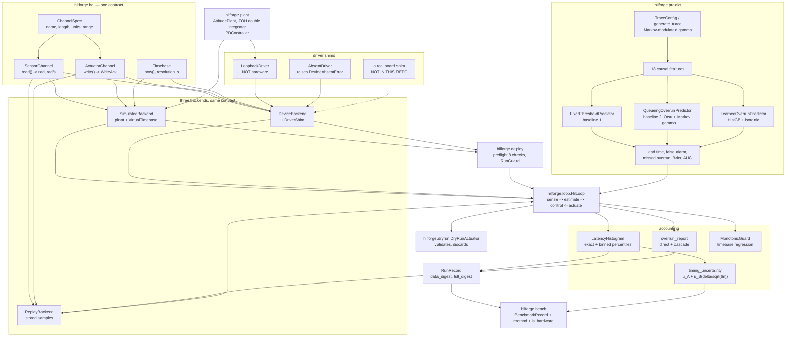
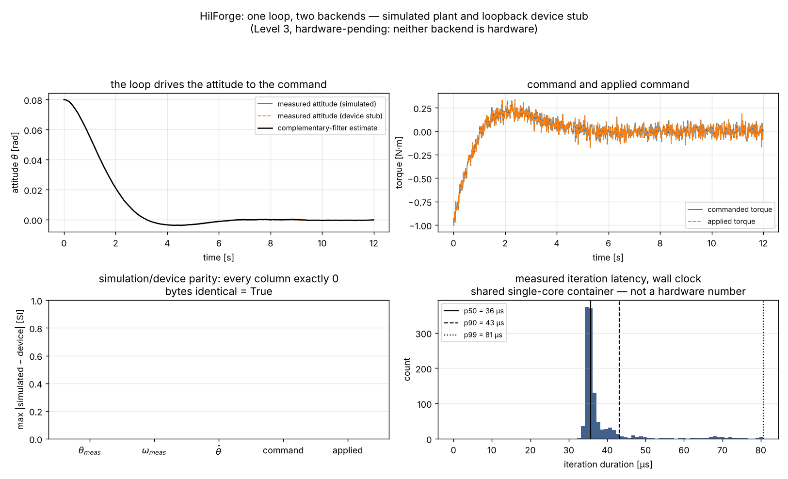
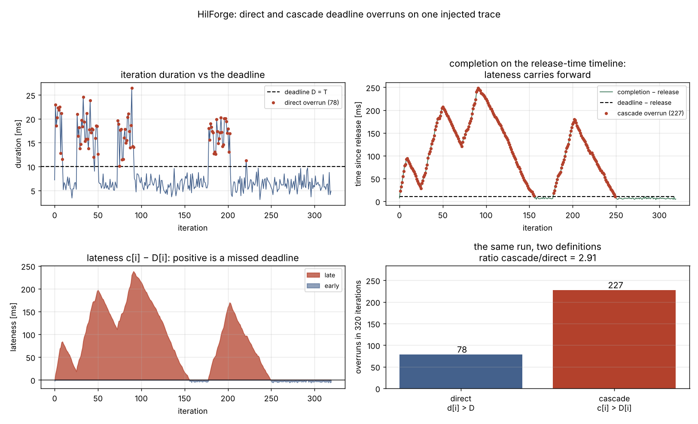
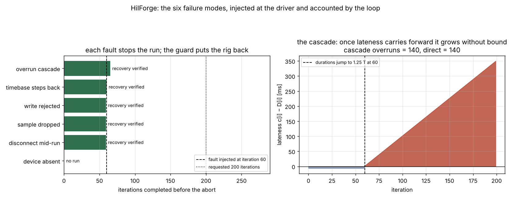
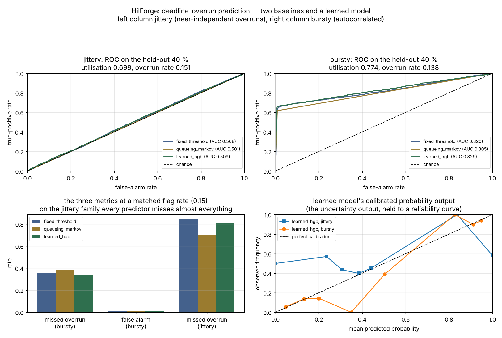

# HilForge

A hardware-in-the-loop harness for one periodic GNC or comms control loop.


## The problem

Flight software is validated against models, then meets hardware and finds out
that the model never had a deadline, a dropped sample, or a bus that stalls for
40 ms. The bridge between the two is a hardware-in-the-loop harness, and the
part that is actually hard is not talking to the board — it is being able to
say, afterwards, that the simulated run and the hardware run did the same
thing, that the rehearsal moved nothing, that the overrun count means what you
think it means, and that the latency number you are quoting was measured the
way you think it was. This package is that bookkeeping, held to the point where
each claim has a script behind it.

## What this does

- **One HAL, two backends, one test suite.** Sensor, actuator and timebase
  behind four protocols; a simulated backend and a device backend that reaches
  hardware through a five-method driver shim. The same parametrised tests run
  against both. On a seeded deterministic case with the device backend pointed
  at a loopback stub, the two produce **byte-identical** signal paths —
  `max |difference| = 0.000e+00` across three injected timing profiles
  (`validation/parity_simdev.py`).
- **Deadline accounting under both definitions, because they disagree.** Direct
  (`d[i] > D`) and cascade (`c[i] = max(iT, c[i-1]) + d[i] > iT + D`) are both
  computed for every run. On a 320-iteration trace at 0.894 utilisation they
  give **78** and **227** overruns respectively, a factor of 2.9
  (`examples/deadline_overruns.py`). The accounting reproduces a hand-counted
  13-iteration sequence exactly, including the iteration that finishes exactly
  on its deadline and the one that is late despite running well inside it
  (`validation/overrun_handcount.py`).
- **Latency histograms with a named quantile convention and a stated error.**
  Both Hyndman & Fan type 1 and type 7, exact over stored samples. Against
  200 000 samples from a shifted exponential the p50/p90/p99/p99.9 land within
  **0.63, 0.56, 2.36 and 0.15 standard errors** of the analytic quantile, where
  the standard error is Serfling's `sqrt(p(1-p)/n)/f(q_p)` computed before the
  comparison (`validation/latency_percentiles.py`).
- **Dry-run rehearsal, proved by counting rather than by inspection.** Over
  5000 iterations the wrapped actuator's `write_count` is **0** and a stub
  configured to forbid writes records **0 attempts**; the same run with
  `dry_run=False` writes **5000** times (`validation/dryrun_nowrite.py`).
- **Recovery after an induced abort, verified field by field.** Five injected
  faults, each wrapped in a `RunGuard`: **5/5 restored with 0 of 13–14 snapshot
  fields differing**, including the plant's PCG64 bit state
  (`validation/recovery_abort.py`).
- **A benchmark record that states its own method.** Clock, reported *and*
  measured resolution, measured timing-call bias, the
  `delta/sqrt(6)` resolution uncertainty, the host, a mandatory environment
  note, and `is_hardware`. On this machine the clock reports 1.0e-09 s
  resolution and actually resolves **1.13e-07 s**
  (`validation/timing_uncertainty.py`).
- **An overrun predictor, and the two baselines that make it accountable.**
  Fixed threshold and a Markov/queueing stage-latency model were implemented
  first; the learned model is benchmarked against them on lead time,
  false-alarm rate and missed-overrun rate. The measured result is mixed and is
  reported as measured — see **Validation evidence** below.

## Validation level: 3, hardware-pending

All five items of the Batch 04 Level 4 entry plan are implemented and
exercised: the HAL with two interchangeable backends, deterministic seeded
simulation, dry-run mode, deployment and recovery procedures as executable
checks, and a benchmark harness that records its measurement method.

**Nothing in this repository has run on a board.** Every backend reports
`is_hardware == False`, the device backend's only driver is a loopback stub
that wraps the plant model, and every benchmark record carries
`is_hardware: false`. What is still missing — and the only thing that is
missing — is **measured timing and resource use from a Jetson Orin Nano**: this
same harness, this same record format, run on the board with nothing else on
its cores, with the raw `.txt` and `.json` output captured. Until that exists
this product is Level 3 and is labelled Level 3.

## Who this is for

- Someone building a HIL rig for a single periodic loop who wants the
  accounting — parity, deadlines, dry run, recovery, a benchmark record — rather
  than writing it again.
- Someone who has to defend a latency or overrun number to a reviewer and needs
  the measurement method and its uncertainty attached to the number.
- Someone comparing two implementations' overrun counts and finding that they
  disagree, who needs the two definitions written down before arguing about the
  arithmetic.
- Someone who wants to know whether a learned deadline-overrun predictor is
  worth the machinery, and would rather read a measured negative result than
  a claim.

## Who this is not for

- Anyone who needs a board brought up: powered, flashed, networked, console
  captured. That is `labgrid`'s job and it is much better at it.
- Anyone driving instruments — power supplies, scopes, signal generators. That
  is `pyvisa`.
- Anyone verifying HDL. That is `cocotb`, and it is a different layer entirely.
- Anyone who needs real-time guarantees. Python is not a real-time language,
  this package does not pretend otherwise, and nothing here sets a scheduling
  policy or pins a CPU.
- Anyone needing schedulability analysis — rate-monotonic bounds, response-time
  analysis, blocking under a priority ceiling. That is the sibling product
  P036 RtClock.
- Anyone who needs a hardware number today. There isn't one here.

## Alternatives, honestly

**If your problem is getting a board into a usable state, stop here and use
`labgrid`.** It is a mature, widely used board-farm framework and it does the
thing this package explicitly does not: power control, bootloader and
bootstrap, flashing, serial-console capture, resource reservation across a
shared farm, and a pytest integration for driving all of that. HilForge assumes
the board is already up and reachable and that someone else wrote the driver.

| Alternative | What it does better | When to use HilForge instead |
|---|---|---|
| [labgrid](https://github.com/labgrid-project/labgrid) (PyPI `labgrid`) | Board provisioning and control: power, bootstrap, flashing, serial console, resource reservation in a shared board farm, remote access to exported boards, pytest fixtures over all of it. The standard answer for embedded board automation in Python. | You already have a reachable board and your problem is the loop that runs on it: simulation/device parity, per-iteration deadline accounting, dry-run rehearsal, and a benchmark record that states its own method. HilForge has no power control and no flashing, and does not want any. |
| [pyvisa](https://github.com/pyvisa/pyvisa) (PyPI `pyvisa`) | Instrument control over VISA — GPIB, USB-TMC, TCPIP, serial — for power supplies, scopes, signal generators, DMMs, with a backend-agnostic resource layer. | Your measurements come from the loop itself rather than from an instrument. HilForge has no instrument layer; if you need one, use PyVISA alongside this, not instead of it. |
| [cocotb](https://github.com/cocotb/cocotb) (PyPI `cocotb`) | Coroutine-based HDL verification: Python testbenches driving a Verilog/VHDL simulator through VPI/VHPI, with clock and signal abstractions. | Your device under test is software on a processor, not RTL in a simulator. These are different layers of the same V and neither substitutes for the other. |
| [pytest-benchmark](https://github.com/ionelmc/pytest-benchmark) (PyPI `pytest-benchmark`) | General-purpose Python microbenchmarking: calibration, warmup, outlier handling, statistical comparison between runs, saved baselines. | You need per-iteration latency samples with deadline and overrun accounting attached, and a record that states the backend's `is_hardware` flag. A microbenchmark harness measures a function; this measures a loop against a deadline. |
| [HdrHistogram](https://github.com/HdrHistogram/HdrHistogram_py) (PyPI `hdrhistogram`) | Constant-memory latency recording at a stated relative precision over many decades, with a mature wire format and tooling. The right answer for a long-running production recorder. | You want exact percentiles over every stored sample for a bounded validation run, and the one-sided bin-width error bound stated as an API value. HilForge's binned mode is a convenience, not a competitor. |
| [simpy](https://gitlab.com/team-simpy/simpy) (PyPI `simpy`) | Discrete-event simulation: processes, resources, queues, an event-driven clock. Arbitrary system models. | Your loop is a real loop whose stages you want to time, not an event-driven model. HilForge's injected-duration mode is a deterministic replay of durations, not a DES. |
| [P036 RtClock](https://github.com/OmAcharya-avtr/rtclock) — sibling product | Schedulability: rate-monotonic and EDF utilisation bounds, response-time analysis, blocking under a priority ceiling, timing-budget composition, a fixed-rate driver that reports drift. | You want the HIL harness around the loop rather than the arithmetic about whether a task set is schedulable. The two agree on overrun counts for the same trace by construction — see `validation/crosscheck_overruns.json`. |
| [psutil](https://github.com/giampaolo/psutil) / [py-spy](https://github.com/benfred/py-spy) | Process and system measurement; sampling profiler with no instrumentation. | You need latency attributed to named loop stages and compared against a deadline, not process-level resource use or a flame graph. |

**The narrow claim this package actually makes**, and the only one:
simulation/device parity with dry-run rehearsal, deadline accounting under both
definitions, and a repeatable benchmark record, for one GNC or comms control
loop. Everything above does something HilForge does not.

## Install and first run

```bash
git clone https://github.com/OmAcharya-avtr/hilforge.git
cd hilforge
python -m venv .venv && source .venv/bin/activate
pip install -e ".[dev]"
python -m pytest tests/ -q
python examples/hil_loop_parity.py
```

The extra is `[dev]`, not `[test]`: `pyproject.toml` declares one
optional-dependency group — `pytest`, `hypothesis`, `ruff`, `matplotlib` —
because the examples need Matplotlib and splitting the group would only mean a
reader who installed `[test]` could not run them. `pip install -e .` alone
gives you the library, which needs NumPy, SciPy and scikit-learn.

Expected output of `python -m pytest tests/ -q`:

```
........................................................................ [ 27%]
........................................................................ [ 54%]
........................................................................ [ 81%]
................................................                         [100%]
264 passed in 16.48s
```

The wall-clock time varies with machine load; the count does not. Expected
output of the first example (the last line is an absolute path on your
machine):

```
period                    : 1.000000e-02 s
iterations                : 1200
simulated backend         : plant-sim (is_hardware=False)
device backend            : device:loopback (is_hardware=False)
signal bytes identical    : True
max |difference|          : 0.000e+00
data digest (both)        : 02710f5a34300aa59af1f3eea3b4c35337323d69fde5a861e0ec4c5c8cf7a3f3
final theta [rad]         : -3.562594e-04
final theta_hat [rad]     : -9.617987e-05
measured p50 total [s]    : 3.567900e-05
measured p99 total [s]    : 8.059800e-05
figure                    : .../hilforge/screenshots/hil_loop_parity.png
```

The digest, the difference and the two final-state lines are reproducible on
any machine. The two `measured` lines are not — on this container they moved
between 3.57e-05 and 3.81e-05 s at p50 across consecutive runs — and they are
labelled `measured` for that reason.

## A worked example

```python
import numpy as np
from hilforge import HilLoop, LoopConfig, PeriodSpec, make_backend_pair, preflight

# A simulated backend and a device backend on the same seed. The device
# backend's driver is a loopback stub: it is not hardware and says so.
sim, dev = make_backend_pair(seed=20261004, sample_dt_s=0.010)

# Pre-run checks, as executable assertions rather than a tick-list.
report = preflight(dev, period_s=0.010)
print(report.as_text().splitlines()[-1])

# A 500-iteration run with its per-iteration durations injected, so the whole
# run including its timing is deterministic. Abort after 3 consecutive
# cascade overruns.
durations = np.linspace(0.0030, 0.0135, 500)
config = LoopConfig(
    period=PeriodSpec(period_s=0.010, cascade_limit=0),
    n_iterations=500,
    injected_durations_s=tuple(durations),
)
a = HilLoop(sim, config).run()
b = HilLoop(dev, config).run()

print(f"direct overruns   : {a.overruns.direct_count}")
print(f"cascade overruns  : {a.overruns.cascade_count}")
print(f"p99 iteration [s] : {a.stage_histograms['total'].percentile(0.99):.6e}")
print(f"data digests equal: {a.data_digest() == b.data_digest()}")
print(f"bytes identical   : {a.signal_matrix().tobytes() == b.signal_matrix().tobytes()}")
print(f"is_hardware       : {a.is_hardware} / {b.is_hardware}")
```

Actual output:

```
verdict: 9/9 checks passed — GO
direct overruns   : 167
cascade overruns  : 167
p99 iteration [s] : 1.339479e-02
data digests equal: True
bytes identical   : True
is_hardware       : False / False
```

Those overrun counts and digests are the pinned regression values in
`tests/test_regression.py`.

## Architecture



The two things worth noticing. First, `PLANT` feeds both `SimulatedBackend` and
`LoopbackDriver` — one numerical kernel reached by two different code paths,
which is what makes a parity failure localise to the HAL rather than to a
modelling difference. Second, `REAL` is dashed because it is not in this
repository and cannot be: it needs the board. The contract it would have to
satisfy is five methods.

## Screenshots



Bottom left is the point: the maximum absolute difference between the two
backends' five signal columns, on an axis that goes to 1.0, with every bar at
exactly zero. Bottom right is the measured latency histogram from the same
loop — note that it is labelled as a shared-container measurement and not as a
hardware number.



Top left counts the iterations that were individually too long (78). Top right
shows completion on the release-time timeline, where lateness carries forward
and the count rises to 227. Bottom right is the same run under both
definitions, side by side: the ratio is 2.91. If two tools disagree about an
overrun count, this figure is usually why.



Left: each injected fault stops the run at or just after the injection point
(iteration 60) and the guard verifies the rig came back — the one bar at zero
is the absent device, where no run started. Right: the cascade, where lateness grows
without bound once it starts carrying forward. In this particular trace every
iteration from 60 onward is individually over the deadline too, so the two
counts coincide at 140 — the divergence between the definitions is in
`deadline_overruns.png`, not here, and this panel is about the unbounded growth.



Top left is the honest headline: on the jittery family all three ROC curves sit
on the diagonal, including the learned model's. Top right is the bursty family,
where there is signal and the learned model is marginally the best of three.
Bottom right is the learned model's calibration — a usable probability on the
bursty family, flat and meaningless on the jittery one.

## Validation evidence

Every number from `validation/`, with the script that produced it. The full
write-up, including what failed, is `validation/VALIDATION.md`.

| Check | Reference | Result | Tolerance | Script |
|---|---|---|---|---|
| Simulated vs loopback-device signal path, 3 timing profiles × 1500 iterations | — (self-consistency) | `max abs diff = 0.000e+00`, bytes identical, data and full digests equal, overrun accounts equal | exactly 0 | `parity_simdev.py` |
| Latency p50 vs shifted-exponential quantile, n = 200 000 | Serfling 1980 §2.3.3 | 1.822562e-03 s vs 1.823832e-03 s, **0.63 se** | 3 se = 6.04e-06 s | `latency_percentiles.py` |
| Latency p99 vs the same | Serfling 1980 §2.3.3 | 5.391810e-03 s vs 5.344653e-03 s, **2.36 se** — the weakest of the four | 3 se = 6.01e-05 s | `latency_percentiles.py` |
| Loop's own `total` histogram vs a directly built one | — | difference **0.000e+00** at every p, 20 000 of 20 000 samples kept | exactly 0 | `latency_percentiles.py` |
| Binned-mode percentile error, 2.0e-05 s bins | — | +8.2e-06 to +1.74e-05 s, all one-sided | ≤ 1 bin width | `latency_percentiles.py` |
| Overrun accounting vs a 13-iteration hand count | hand count in `tests/test_timing.py` | direct `[1,3,4,8,10]`, cascade `[1,3,4,8,10,11]`, max run 2 at index 3 — **exact** | exact | `overrun_handcount.py` |
| Hand-counted completion times | same | max difference **1.388e-17 s** | 1e-15 s | `overrun_handcount.py` |
| Dry run, 5000 iterations: writes reaching the actuator | — | **0**; forbidding stub attempts **0**; control run **5000** | exactly 0 | `dryrun_nowrite.py` |
| Recovery after each of 5 induced aborts | — | **5/5**, 0 of 13–14 snapshot fields differing (incl. PCG64 state) | 0 fields | `recovery_abort.py` |
| Uncertainty arithmetic vs a hand-computed case | JCGM 100:2008 §5.1.2, Bennett 1948 | `u_B = 2.041241452e-07 s` = `1e-6/sqrt(24)` — exact to 12 digits | 1e-12 relative | `timing_uncertainty.py` |
| Clock: reported vs measured resolution | `time.get_clock_info` | reported 1.000e-09 s, **measured 1.130e-07 s** — two orders apart | reported | `timing_uncertainty.py` |
| Resolution term's share of the combined uncertainty on a 20 000-iteration run | — | `u_B/u_c = 5.0e-04`, i.e. negligible here; bias from timing calls **0.55 %** of the mean iteration | — | `timing_uncertainty.py` |
| Pre-run checks, three backends | — | simulated GO 9/9, loopback GO 9/9, absent **NO-GO**; an impossible period fails `clock_resolution` and only that | — | `deployment_checks.py` |
| Overrun predictor, jittery family, ROC AUC (3 seeds) | — | threshold **0.5041**, Markov **0.5016**, learned **0.4966** — all indistinguishable from chance | — | `predictor_benchmark.py` |
| Overrun predictor, bursty family, missed-overrun rate at a matched flag rate | — | threshold 0.3377, Markov 0.3219, learned **0.3202**; gap to the threshold 0.0175 against a 95 % Wilson half-width of **0.0168** | — | `predictor_benchmark.py` |
| Overrun predictor, bursty family, Brier score | Brier 1950 | threshold 0.06862, Markov 0.06983, learned **0.05775** (−15.8 %) | — | `predictor_benchmark.py` |
| Benchmark record, 4 cases, `is_hardware` | — | `[False, False, False, False]` | must be all False | `performance_benchmark.py` |
| Loop throughput, simulated write path, 20 000 iterations | — | 4153.7 iterations/s, p50 1.339e-04 s, p99 3.824e-04 s, **max 8.227e-03 s** on a contended core — this row moves between runs, see the note below | — | `performance_benchmark.py` |

**The one row that is not reproducible.** Every number in the table above is
exact, bounded by a stated tolerance, or derived from a fixed seed — except the
last two, which are host-side timing measurements on a shared contended core.
Across three runs of the same scripts in the same session the mean iteration
duration moved by a factor of three and the simulated write path's p99 by a
factor of 13. The method and the environment are printed in every benchmark
record for that reason, and the only honest use for those two rows is as a
coarse tripwire on this machine. `validation/VALIDATION.md` §6c and §7 give the
spread.

**The checks that went against the hope, kept as measured:**

1. **The learned overrun predictor does not beat the fixed threshold on the
   jittery family.** Nothing does: all three AUCs are within 0.01 of 0.50 and
   the learned model is, by a hair, the worst of the three. That is the right
   answer for a trace whose overrun indicator has lag-1 autocorrelation 0.02.
2. **On the bursty family the learned model's win on the deciding metric is
   within interval.** Its missed-overrun advantage (0.0175) is the same order
   as the 95 % Wilson half-width on that rate (0.0168). Its clear win is
   calibration, not decisions. On that evidence the recommendation is to keep
   the one-parameter threshold for the flag and use the learned model's
   probability only if you need a probability.
3. **Permutation importance is dominated by a single feature** —
   `total_max8_s` at +0.044 Brier against +0.004 for the next — so seventeen of
   the eighteen features are nearly idle and a two-feature model would probably
   do almost as well. More machinery, no more information.
4. **Two defects were found while validating this and fixed.** A mid-run device
   disconnect used to return a partial record instead of raising, so
   `RunGuard` saw a clean exit and never recovered — raising is now the
   default. And `preflight` used to leave the rig one sensor sample ahead of
   where it found it, so a backend that had been pre-flighted no longer agreed
   bit for bit with one that had not; it now snapshots on entry, restores on
   exit, and reports that as a ninth check. Written up in
   `validation/VALIDATION.md` §5, §8 and §11, and in `CHANGELOG.md`.
5. **The p99 latency check is the weakest of the four percentiles** at 2.36
   standard errors. Inside the band, not comfortably.

## API reference

<details>
<summary><strong>HAL and backends</strong></summary>

| Symbol | One line |
|---|---|
| `ChannelSpec(name, length, units, lower, upper)` | static channel description; `units` is stated, the range is enforced |
| `SensorChannel.read() -> ndarray` | one sample, `(length,)` float64, in `spec.units` |
| `ActuatorChannel.write(cmd) -> WriteAck` | apply a command [N·m]; raises `WriteRejectedError` on refusal |
| `WriteAck(channel, applied, saturated, sequence)` | what the actuator actually applied, and whether it clipped |
| `BackendInfo.is_hardware -> bool` | `True` only for a device backend with a non-stub driver; `False` everywhere in this repo |
| `SimulatedBackend(config, seed, sample_dt_s)` | plant model behind the HAL, virtual clock, fully deterministic |
| `DeviceBackend(driver, sample_dt_s)` | HAL over a `DriverShim`; `open()` raises `DeviceAbsentError` if nothing answers |
| `DriverShim` | the five-method board contract: `connect`, `read_channel`, `write_channel`, `read_clock`, `disconnect` (+ `advance`, `snapshot`, `restore`) |
| `LoopbackDriver(config, seed)` | driver shim backed by the plant model — **not hardware** |
| `AbsentDriver(detail)` | driver shim that always refuses to connect |
| `make_backend_pair(seed, config, sample_dt_s)` | one simulated and one loopback-device backend on the same seed |
| `ReplayBackend(samples, torque_limit_nm)` | HAL over stored samples [rad, rad/s] |

</details>

<details>
<summary><strong>Timebase, timing and accounting</strong></summary>

| Symbol | One line |
|---|---|
| `MonotonicTimebase(guard_monotonic)` | wall clock over `perf_counter_ns`, epoch at first read, [s] |
| `VirtualTimebase(resolution_s, start_s)` | integer-tick clock that moves only when advanced [s] |
| `clock_report(n) -> ClockReport` | reported and measured resolution, call-pair overhead, `delta/sqrt(6)` [s] |
| `duration_resolution_uncertainty(delta) -> float` | `delta/sqrt(6)` [s], one duration's quantisation uncertainty |
| `PeriodSpec(period_s, deadline_s, cascade_limit)` | `0 < D <= T`; `release_time_s(i)`, `absolute_deadline_s(i)` [s] |
| `MonotonicGuard(tolerance_s)` | raises `TimebaseRegressionError` on a backwards timestamp |
| `LatencyHistogram(mode, bin_width_s, n_bins)` | exact or binned; `percentile(p, method="nearest_rank"\|"linear")` [s] |
| `LatencyHistogram.binned_percentile_error_bound_s()` | one bin width, or exactly 0 in exact mode [s] |
| `overrun_report(durations_s, period_s, deadline_s) -> OverrunAccount` | both definitions, completions and lateness [s] |
| `quantile_standard_error(p, n, density) -> float` | `sqrt(p(1-p)/n)/f(q_p)` [s], Serfling 1980 |
| `timing_uncertainty(durations_s, resolution_s, call_overhead_s)` | `u_A`, `u_B`, combined, expanded (k=2), bias [s] |

</details>

<details>
<summary><strong>Loop, dry run, replay</strong></summary>

| Symbol | One line |
|---|---|
| `LoopConfig(period, n_iterations, …)` | everything that decides a run; 11 validated policies and parameters |
| `LoopConfig.injected_durations_s` | per-iteration durations [s]; when set, no wall clock is read at all |
| `LoopConfig.on_dropped_sample` / `on_write_rejected` / `on_cascade` / `on_disconnect` | the four fault policies |
| `HilLoop(backend, config, measurement_clock).run() -> RunRecord` | four stages per iteration; every aborting exception carries `.record` |
| `RunRecord.signal_matrix() -> (n, 5)` | `[θ_meas, ω_meas, θ̂, command, applied]` — the data path, no timing |
| `RunRecord.data_digest()` / `full_digest()` | SHA-256 over the data path; the second also covers every duration |
| `RunRecord.overruns -> OverrunAccount` | both counts, both index lists, lateness per iteration |
| `DryRunActuator(inner)` | validates and clips a command, then discards it; `inner.write_count` stays 0 |
| `save_run(record, path)` / `load_samples(path)` | compressed `.npz` round trip |
| `replay_run(record, config) -> RunRecord` | replay through `ReplayBackend`; reproduces the data digest exactly |

</details>

<details>
<summary><strong>Deployment, recovery, benchmark</strong></summary>

| Symbol | One line |
|---|---|
| `preflight(backend, period_s, …) -> CheckReport` | nine named checks, each with a measured and a required value; GO/NO-GO; leaves the backend as it found it |
| `CheckReport.raise_if_failed()` | `PreflightFailure` naming the failed checks |
| `snapshot_backend` / `restore_backend` / `verify_restored` | capture, restore, and compare field by field |
| `RunGuard(backend, recover_on_success)` | context manager: snapshot, and on failure restore and verify |
| `run_benchmark(backend, …, environment_note)` | `(BenchmarkRecord, RunRecord)`; the note is mandatory |
| `write_record(record, path)` | `.txt` for a reader and `.json` for a diff |

</details>

<details>
<summary><strong>Overrun prediction</strong></summary>

| Symbol | One line |
|---|---|
| `TraceConfig.preset("jittery"\|"bursty", n_iterations)` | Markov-modulated gamma stage latencies; the two families differ in persistence |
| `generate_trace(config, seed) -> Trace` | deterministic from the seed; carries the hidden regime as ground truth |
| `split_trace(trace, train_fraction)` | **chronological** split, never random |
| `build_dataset(stage_s, deadline_s, horizon, warmup)` | `(X, y, index)`; row `i` uses only iterations `<= i` |
| `FixedThresholdPredictor(deadline_s)` | **baseline 1**: threshold on the previous iteration; the F1 sweep is retained |
| `QueueingOverrunPredictor(deadline_s, horizon)` | **baseline 2**: Otsu split, counted transition matrix, per-regime gamma, Chapman-Kolmogorov |
| `md1_mean_wait_s(rho, service_s)` | Pollaczek-Khinchine M/D/1 wait [s]; a reference point, not a prediction |
| `LearnedOverrunPredictor(…)` | `HistGradientBoostingClassifier` + isotonic calibration; `predict_proba` is the uncertainty output |
| `*.calibrate_flag_rate(X, target)` | move any predictor to a matched flag rate; the *achieved* rate is reported |
| `evaluate_predictor(p, X, y, window, horizon)` | lead time, false alarm, missed overrun, precision/recall/F1, Brier, AUC, Wilson intervals |

</details>

## Limitations

- **No hardware number exists.** Every backend has `is_hardware == False`. The
  device backend's only driver is a loopback stub. A real driver shim is five
  methods and is not in this repository, because writing it needs the board.
- **Level 4 is not claimed and is not reachable from anything here.** It
  requires measured timing and resource use from a Jetson Orin Nano. Every
  benchmark record says so in its caveat.
- **Compute budget.** Everything in this repository was built and run on **one
  shared CPU core** with no GPU, alongside four other build agents. The test
  suite takes 7.5 s, the slowest validation script about 25 s, and the three
  predictor fits 4.2 s in total across 2 families × 3 seeds. PyTorch is not
  available in the build environment; the learned model is scikit-learn.
- **Every latency and throughput number is contention-limited.** The measured
  iteration-duration standard deviation is about twice its mean, and the mean
  itself moved by a factor of three across three runs of the same script in the
  same session. The p99 and max columns in the benchmark table are not
  reproducible between runs on this machine, which is why the measurement
  method and environment are printed in every record rather than summarised.
- **Python is not real-time.** Nothing here sets a scheduling policy, pins a
  CPU, locks memory or avoids the GC. The harness measures and accounts; it
  does not make the loop meet a deadline.
- **The benchmark harness does not pace the loop to the period.** It runs flat
  out and accounts deadlines against `T`, because sleeping to the period would
  measure the sleep. A paced fixed-rate driver is P036 RtClock's scope.
- **Two overrun definitions means a reader has to pick one.** The package
  refuses to pick for you. The cross-check record for P036 uses the direct
  definition for `overrun_count` and states that in the file.
- **Parity is over the data path.** Timing is bit-identical only when the
  durations are injected. A wall-clock-timed run is reproducible in its data
  digest and not in its full digest, by construction.
- **The plant is a single-axis rigid body** with an exact ZOH double-integrator
  transition and a white-noise gyro. No flexible modes, no disturbance torques,
  no multi-axis coupling, no bias estimation — the residual attitude offset in
  the examples *is* the unestimated gyro bias.
- **Recovery is verified where the whole state is readable.** On a simulated
  rig and a loopback stub, every field including the RNG state can be restored.
  A real board's state cannot be: a motor that has moved has moved. The
  procedure would have to be re-verified and probably narrowed on hardware.
- **The predictor evidence is entirely synthetic.** Both trace families come
  from a generator in this repository. A trace from a real loop could have
  structure neither captures, and nothing here predicts how the three
  predictors would rank on it.
- **The Markov baseline cannot sit at an arbitrary operating point.** Its
  probability takes two values, one per regime, so a matched-flag-rate
  comparison involving it is approximate and the achieved rate is printed
  beside the target.
- **This software is research-grade.** It is not flight-qualified, not
  certified, and not approved for operational aerospace use.

## Reproducing every number

```bash
cd hilforge
pip install -e ".[dev]"

# tests and style
python -m pytest tests/ -q                         # 264 passed
ruff check src/ tests/ examples/ validation/       # All checks passed

# every validation script, each writing its own raw output
PYTHONPATH=src python3 validation/parity_simdev.py          > validation/parity_simdev_output.txt
PYTHONPATH=src python3 validation/latency_percentiles.py    > validation/latency_percentiles_output.txt
PYTHONPATH=src python3 validation/overrun_handcount.py      > validation/overrun_handcount_output.txt
PYTHONPATH=src python3 validation/dryrun_nowrite.py         > validation/dryrun_nowrite_output.txt
PYTHONPATH=src python3 validation/recovery_abort.py         > validation/recovery_abort_output.txt
PYTHONPATH=src python3 validation/timing_uncertainty.py     > validation/timing_uncertainty_output.txt
PYTHONPATH=src python3 validation/deployment_checks.py      > validation/deployment_checks_output.txt
PYTHONPATH=src python3 validation/performance_benchmark.py  > validation/performance_benchmark_output.txt
PYTHONPATH=src python3 validation/predictor_benchmark.py    > validation/predictor_benchmark_output.txt

# the four figures
PYTHONPATH=src python3 examples/hil_loop_parity.py
PYTHONPATH=src python3 examples/deadline_overruns.py
PYTHONPATH=src python3 examples/failure_modes.py
PYTHONPATH=src python3 examples/overrun_predictor.py

# the CLI, same numbers by another route
PYTHONPATH=src python3 -m hilforge info
PYTHONPATH=src python3 -m hilforge parity --iterations 1500
PYTHONPATH=src python3 -m hilforge dryrun --iterations 5000
PYTHONPATH=src python3 -m hilforge predict --preset bursty --iterations 40000
PYTHONPATH=src python3 -m hilforge bench --iterations 20000 --note "your machine here"
```

Every validation script exits 0 on success and non-zero on any failed check, so
the block above is also the gate. Seeds are fixed in the scripts: 20261004 for
every loop run, 7310 for the latency distribution, 36031 for the cross-check
trace, 4242 / 909090 / 31337 for the predictor benchmark, 99 and 777 for the
regression pins.

## Licence, citation, credits

Licensed under the **GNU Affero General Public License v3.0 or later**. See
`LICENSE`. © 2026 OPTIMA Organisation.

Citation metadata is in `CITATION.cff`.

### References

Every equation in this package cites one of these. None was invented.

- Bennett, W. R. (1948). "Spectra of Quantized Signals." *Bell System Technical
  Journal* 27(3):446-472. — the uniform-quantisation variance `delta^2/12`
  behind the clock-resolution error term.
- Billingsley, P. (1961). *Statistical Inference for Markov Processes.*
  University of Chicago Press. — maximum-likelihood estimation of a transition
  matrix from counts.
- Breiman, L. (2001). "Random Forests." *Machine Learning* 45(1):5-32. — the
  permutation importance measure.
- Brier, G. W. (1950). "Verification of Forecasts Expressed in Terms of
  Probability." *Monthly Weather Review* 78(1):1-3. — the Brier score.
- Buttazzo, G. C. (2011). *Hard Real-Time Computing Systems*, 3rd ed. Springer.
  — the periodic task model with implicit deadlines behind the cascade
  definition.
- Fischer, W. and Meier-Hellstern, K. (1993). "The Markov-modulated Poisson
  process (MMPP) cookbook." *Performance Evaluation* 18(2):149-171. — the
  Markov-modulated construction used by the trace generator.
- Franklin, G. F., Powell, J. D. and Workman, M. L. (1998). *Digital Control of
  Dynamic Systems*, 3rd ed. Addison-Wesley. — the ZOH-equivalent discrete
  model, exact for a double integrator.
- Harchol-Balter, M. (2013). *Performance Modeling and Design of Computer
  Systems.* Cambridge University Press. — heavy-tailed service times, and why
  an exponential fit understates the tail.
- Higgins, W. T. (1975). "A Comparison of Complementary and Kalman Filtering."
  *IEEE Transactions on Aerospace and Electronic Systems* AES-11(3):321-325. —
  the single-pole complementary filter in the estimate stage.
- Hyndman, R. J. and Fan, Y. (1996). "Sample Quantiles in Statistical
  Packages." *The American Statistician* 50(4):361-365. — quantile types 1 and
  7, named in the histogram API.
- IEEE Std 952-2020. *IEEE Standard Specification Format Guide and Test
  Procedure for Single-Axis Interferometric Fiber Optic Gyros.* — the angle
  random walk term of the gyro model.
- JCGM 100:2008. *Evaluation of measurement data — Guide to the expression of
  uncertainty in measurement.* — Type A and Type B evaluation, quadrature
  combination, coverage factor.
- Johnson, N. L., Kotz, S. and Balakrishnan, N. (1994). *Continuous Univariate
  Distributions*, Vol. 1, 2nd ed. Wiley. — the exponential quantile function
  used as the injected latency law.
- Kleinrock, L. (1975). *Queueing Systems, Volume 1: Theory.* Wiley. — the
  Pollaczek-Khinchine formula, quoted as the M/D/1 reference.
- Liu, C. L. and Layland, J. W. (1973). "Scheduling Algorithms for
  Multiprogramming in a Hard-Real-Time Environment." *Journal of the ACM*
  20(1):46-61. — the periodic task model with `D_i = T_i`.
- Otsu, N. (1979). "A Threshold Selection Method from Gray-Level Histograms."
  *IEEE Transactions on Systems, Man, and Cybernetics* 9(1):62-66. — the
  within-class-variance threshold used to label regimes.
- Ross, S. M. (2014). *Introduction to Probability Models*, 11th ed. Academic
  Press. — the two-state chain's stationary distribution.
- Serfling, R. J. (1980). *Approximation Theorems of Mathematical Statistics.*
  Wiley. — the asymptotic standard error of a sample quantile, used as the
  latency tolerance.
- Wie, B. (2008). *Space Vehicle Dynamics and Control*, 2nd ed. AIAA. — the
  single-axis rigid-body plant and the PD attitude law.
- Wilson, E. B. (1927). "Probable Inference, the Law of Succession, and
  Statistical Inference." *Journal of the American Statistical Association*
  22(158):209-212. — the score interval on the false-alarm and missed-overrun
  rates.
- Zadrozny, B. and Elkan, C. (2002). "Transforming Classifier Scores into
  Accurate Multiclass Probability Estimates." *KDD '02*, 694-699. — isotonic
  calibration of the learned model's probability output.

### Credits

HilForge was built as product P031 of the OPTIMA aerospace software portfolio.

This is under reserved rights obtained by OPTIMA Organisation.
