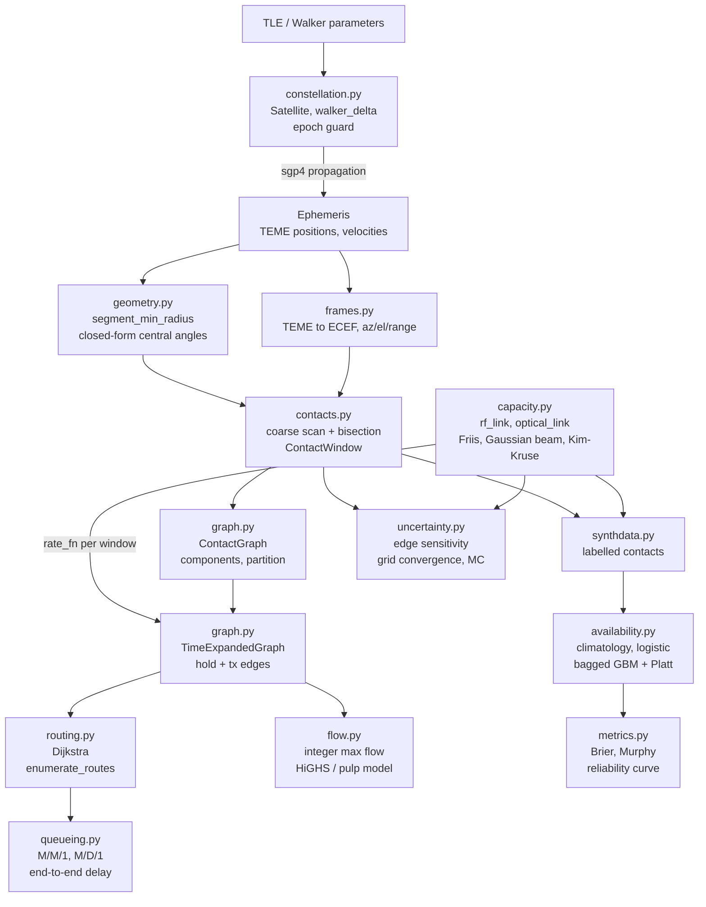
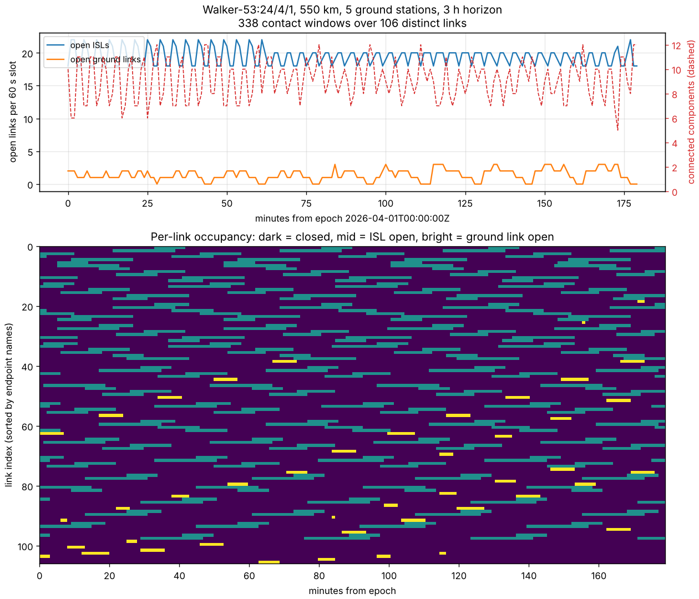
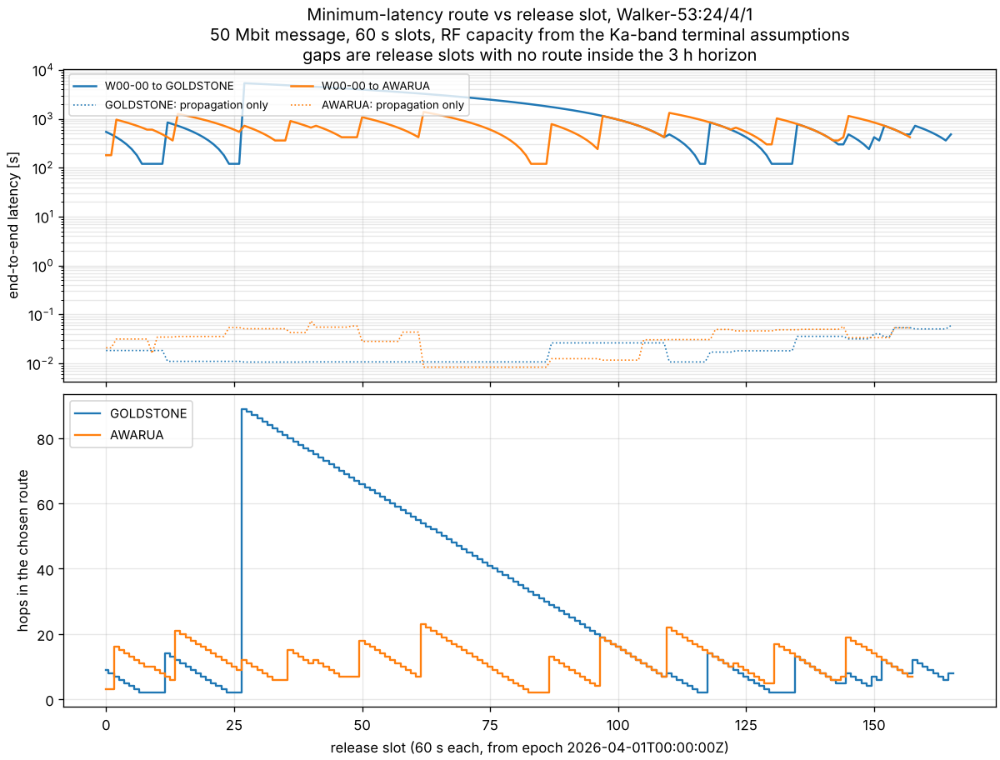
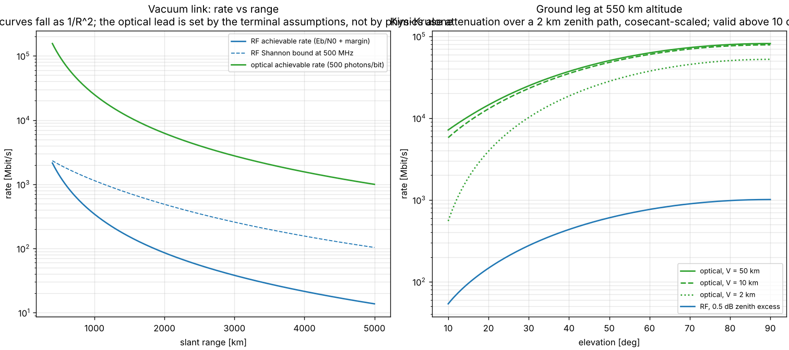
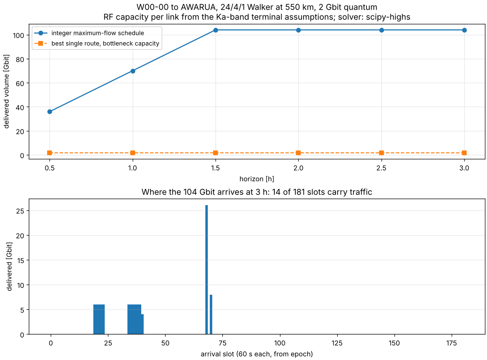
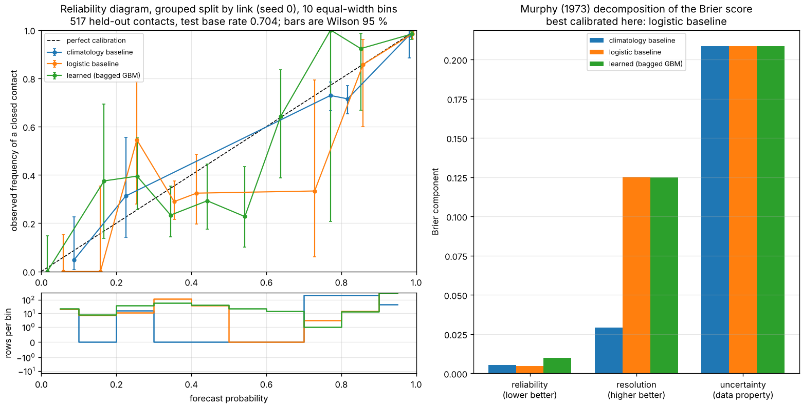

# constellink

Time-varying contact graphs, routing and per-link RF/optical capacity for a satellite constellation.


## The problem

You have a constellation and you need to know whether a bit released on
satellite 7 at 04:12 can reach a ground station before 05:00, and at what
rate. The contact graph changes every minute, the inter-satellite links open
and close as the Earth's limb cuts across them, and the ground leg's capacity
depends on elevation and weather. Propagators will give you positions and
link-budget calculators will give you a margin at one range, but the thing
that decides a constellation design is the three together, over a horizon,
with a route and a schedule falling out of it.

## What this does

- **Contact windows** for inter-satellite and satellite-ground links from an
  `sgp4`-propagated TLE set or a generated Walker shell, with Earth-limb
  blockage and range limits. Window edges are bisected to a stated tolerance;
  measured edge error against the propagator is 0.000409 s at a 1e-3 s
  tolerance (`validation/validate_uncertainty.py`).
- **A time-varying contact graph** with per-slot connectivity and component
  analysis. A 24/4/1 Walker shell at 550 km with 5 ground stations over 3 h
  gives 338 windows over 106 distinct links, 5 to 12 connected components per
  60 s slot and 3 in the union graph (`examples/example_contact_graph.py`).
- **Minimum-latency routing** by Dijkstra over a time-expanded graph, with
  store-and-forward. Agrees with exhaustive enumeration to 0.000e+00 s over 40
  random instances and 513 enumerated routes (`validation/validate_routing.py`).
- **Integer maximum-flow scheduling** over the same graph. Agrees with brute
  force on all 27 instances small enough to enumerate, 0 mismatches
  (`validation/validate_ilp.py`).
- **Per-link capacity** from an RF chain and a free-space-optical chain. The RF
  chain reduces to Friis to a relative 7.9e-15 when losses are zeroed; the
  Gaussian capture fraction matches numerical quadrature to 5.7e-14
  (`validation/validate_capacity.py`).
- **A calibrated link-availability predictor** with two deterministic
  baselines, measured on grouped splits. On this data the logistic baseline
  wins: see [the calibration result](#calibration-the-baseline-won).

## Who it's for

- Constellation designers who need contact-graph connectivity and routing
  latency as a function of shell geometry, not just coverage percentages.
- Link engineers who want capacity evaluated along a real contact window
  rather than at a single nominal range.
- Anyone comparing probabilistic link-availability forecasters who needs the
  calibration harness more than the forecaster.

## Who it's not for

- **Anyone who needs an accurate propagator.** This depends on `sgp4` and adds
  nothing to it. If propagation is your problem, use `sgp4`, `skyfield` or
  `poliastro` directly.
- **Anyone doing packet-level network simulation.** There is no protocol stack,
  no congestion control and no packet model here. Use Hypatia with ns-3.
- **Anyone who needs ITU-R atmospheric models.** The ground leg uses a textbook
  cosecant scaling of a user-supplied zenith attenuation. Use `itur`.
- **Anyone with a megaconstellation.** The contact scan is `O(n_sat^2 n_t)` and
  was built and measured on 24 satellites over hours. See
  [compute budget](#compute-budget).
- **Anyone needing flight-qualified software.** This is research-grade, is not
  certified and is not approved for operational aerospace use.

## Alternatives, honestly

| alternative | what it does better | when to use this instead |
|---|---|---|
| [`sgp4`](https://pypi.org/project/sgp4/) | SGP4/SDP4 propagation. This package **depends on it and does not replace it** — every position here comes from `sgp4`. | Never instead. Use both. |
| [`skyfield`](https://pypi.org/project/skyfield/) | General astronomy, ephemerides, rise/set for a single observer, far better time scales. | When you need a contact *graph* between satellites rather than observations of one. |
| [`poliastro`](https://pypi.org/project/poliastro/) | Two-body and perturbed orbital mechanics, manoeuvres, plotting. | When the question is link topology and capacity rather than orbit design. |
| [Hypatia](https://github.com/snkas/hypatia) (Kassing et al., ACM IMC 2020) | The real prior art for LEO network simulation: `satgenpy` pre-computes network state over time and feeds ns-3 for packet-level simulation, with a Cesium visualiser. Far more mature for networking questions. | When you want per-link RF/optical capacity from a physical link budget rather than an assumed bandwidth, and an ILP schedule rather than a packet simulation. |
| [LEOPath](https://pypi.org/project/leopath/) (i2CAT) | Routing-algorithm comparison in LEO constellations: hop stretch, forwarding-state churn, four built-in routing strategies. Explicitly does **not** model link characteristics or PHY. | When the link model is the point. LEOPath's own documentation points you at ns-3 for anything below the routing layer. |
| Contact Graph Routing in ION-DTN (NASA JPL) | The operational DTN contact-graph routing implementation, with the bundle protocol around it. | When you want to *design* a contact plan rather than execute one. |
| [`itur`](https://pypi.org/project/itur/) | Implements the ITU-R P-series propagation recommendations properly. | Never instead, for the ground leg. Use `itur` and feed its zenith attenuation into this package. |
| `networkx` | Every graph algorithm, well tested. | The Dijkstra here is 40 lines over a purpose-built DAG and avoids the dependency; if you want betweenness or flow decomposition, export to `networkx`. |

**The narrow defensible claim**: the time-varying contact graph, routing over
its time expansion, and per-link capacity from a hybrid RF/optical link model,
in one tool, over one horizon. Each piece exists elsewhere and is often better
there. The combination, with the capacity model actually driving the edge
capacities, is what is not packaged elsewhere on PyPI.

## Install and first run

```bash
git clone https://github.com/OmAcharya-avtr/constellink.git
cd constellink
python -m venv .venv && source .venv/bin/activate
pip install -e ".[test]"
python -m pytest tests/ -q
python examples/example_contact_graph.py
```

Expected output of the first run:

```
387 passed in 22.27s
```

and of the example:

```
constellation      : Walker-53:24/4/1
horizon            : 3 h, 60 s scan step
nodes              : 29
contact windows    : 338 (291 ISL, 47 ground)
distinct links     : 106
open ISLs per slot : min 18, median 20, max 22
components per slot: min 5, max 12
union graph        : 3 component(s)
written            : screenshots/contact_graph.png
```

## A worked example

```python
from datetime import datetime, timedelta, timezone

from constellink import walker_delta, all_contact_windows, ContactGraph
from constellink import TimeExpandedGraph, shortest_route, rf_link
from constellink.synthdata import default_rf_terminal, default_stations

epoch = datetime(2026, 4, 1, tzinfo=timezone.utc)
const = walker_delta(24, 4, 1, 53.0, 550.0, epoch, max_epoch_age_days=2.0)
stations = default_stations()

t1 = epoch + timedelta(hours=3)
eph = const.ephemeris(epoch, t1, step_s=60.0)
windows = all_contact_windows(eph, const.satellites, stations)

nodes = [s.name for s in const.satellites] + [g.name for g in stations]
graph = ContactGraph(windows=windows, t0=epoch, t1=t1, nodes=nodes)

term = default_rf_terminal()
teg = TimeExpandedGraph.from_contact_graph(
    graph, slot_s=60.0,
    rate_fn=lambda w, _t: rf_link(w.min_range_km, term).achievable_rate_bps)

route = shortest_route(teg, "W00-00", "AWARUA", message_bits=50e6)
print(f"windows   : {len(windows)}")
print(f"te graph  : {teg.n_te_nodes} nodes, {len(teg.edges)} edges")
print(f"route     : {' -> '.join(route.node_sequence)}")
print(f"latency   : {route.total_latency_s:.3f} s")
print(f"hops      : {len(route.hops)} ({route.n_transmissions} transmissions)")
```

```
windows   : 338
te graph  : 5249 nodes, 12714 edges
route     : W00-00 -> W02-03 -> W01-04 -> AWARUA
latency   : 180.021 s
hops      : 3 (3 transmissions)
```

## Architecture



## Screenshots



Open links per 60 s slot, with the connected-component count dashed in red on
the right axis. Notice that the shell is **never** a single component at this
geometry: 5 to 12 components per slot. The raster underneath shows why — most
inter-plane links are open for a few minutes at a time.



Minimum-latency route to two ground stations against the slot the message is
released in. Notice the gaps and the two-decade spread: the same link plan
delivers in 120 s or 5340 s depending entirely on when the bit is released.
The dotted lines are the pure-propagation component, four orders of magnitude
below the total — this is a waiting problem, not a speed-of-light problem.



Left: achievable rate against range for both terminals, with the RF Shannon
bound dashed. Notice the gap between the bound and the achievable rate — about
6.7 dB at 1500 km — which is the required Eb/N0 plus the design margin, not a
modelling error. Right: the optical ground leg at three visibilities. At 2 km
visibility a 10 deg pass loses an order of magnitude.



Integer maximum flow against horizon length, with the best single route's
bottleneck capacity for comparison. Notice the saturation past 1.5 h: the
destination's own contact windows become the binding constraint, so a longer
horizon buys nothing. 14 of 181 slots carry traffic.



Reliability diagram and Brier decomposition for the three predictors. Notice
the reliability bars on the right: the logistic baseline's is the shortest.
The learned model is not better calibrated here, and the figure says so.

## Validation evidence

Every number comes from a script in `validation/`, with raw stdout saved
beside it. Full detail in [`validation/VALIDATION.md`](validation/VALIDATION.md).

| check | reference | result | tolerance |
|---|---|---|---|
| SGP4 position vs `tcppver.out`, sat 00005, 13 rows | Vallado et al. 2006, AIAA 2006-6753 (data shipped with `sgp4`) | 6.819e-09 km max residual | 1e-6 km |
| SGP4 velocity, same case | as above | 7.705e-10 km/s | 1e-7 km/s |
| Ground window central angle at the edges | Wertz & Larson 1999, SMAD 3rd ed., Ch. 5 | 1.30e-06 deg max residual | 1e-4 deg |
| Pass duration, two-body circular equatorial | same closed form | 1e-06 s residual on 510.895157 s | 0.5 s |
| ISL clearance flip vs `2 arccos(r_block/r)` | Wertz & Larson 1999, Ch. 5 | 1.908e-14 deg | 1e-5 deg |
| Earth-limb distance at a real ISL window edge | same | 9.87e-07 km | 1e-3 km |
| Dijkstra vs exhaustive enumeration, 40 instances | — | 0.000e+00 s worst gap | 1e-9 s |
| Integer max flow vs brute force, 27 instances | Ford & Fulkerson 1958 | 0 mismatches | exact |
| RF chain reduces to Friis, losses zeroed | Friis 1946, Proc. IRE 34(5) | 7.9e-15 relative | 1e-12 |
| Free-space path loss vs `K + 20log d + 20log f` | `K` computed as 92.447783222 dB | 0.00e+00 dB | 1e-10 dB |
| Infinite-bandwidth Shannon limit | Shannon 1948 | 3.73e-07 dB gap at 1e16 Hz | 1e-5 dB |
| Gaussian capture vs `scipy.integrate.quad` | Saleh & Teich, *Photonics* 2nd ed., Ch. 3 | 5.7e-14 relative | 1e-8 |
| Pointing loss vs `(20/ln10) x^2` | Majumdar & Ricklin 2008, Ch. 1 | 1.78e-15 dB | 1e-12 dB |
| Walker realised radius vs requested | — | **−0.113 to −0.127 km offset**, 11.945 km p-p | 5 km / 15 km |
| Brier decomposition identity, distinct-value bins | Murphy 1973, *J. Appl. Meteor.* 12 | 3.9e-15 | 1e-12 |
| **`pulp` ILP objective** | — | **NOT RUN** — no MILP solver available; structural equality only | — |
| **Learned model vs logistic baseline, calibration** | — | **baseline wins**: REL 0.00260 vs 0.00516 | — |

The last two rows are the ones worth reading twice.

### `pulp`: what did not run

The specification for this product names `pulp` as the ILP front end. `pulp`
4.0.0 ships no bundled CBC binary and the environment this was built in has no
external MILP solver, so `pulp.listSolvers(onlyAvailable=True)` is empty and
**no `pulp` objective value was ever produced**. The solved objective comes
from `scipy.optimize.milp` (HiGHS), which is bundled with SciPy.

What was verified instead is that the `pulp` model and the program HiGHS
solves are the *same program*: variable count, bounds, integrality, objective
coefficients and every conservation row, all checked by
`compare_formulations`. That is weaker than an objective comparison and is
labelled as such everywhere it appears. Install CBC, HiGHS or GLPK and pass
`backend="pulp"` to get the comparison for real; `validate_ilp.py` will then
run it automatically.

### Calibration: the baseline won

**On this dataset the logistic-regression baseline is better calibrated than
the learned model, and has a better Brier score.** Over five grouped splits:

| predictor | Brier | **reliability (lower better)** | resolution (higher better) | ECE |
|---|---|---|---|---|
| climatology baseline | 0.15562 ± 0.02887 | 0.00645 ± 0.00487 | 0.03131 ± 0.00722 | 0.07025 |
| **logistic baseline** | **0.07112 ± 0.01866** | **0.00260 ± 0.00151** | 0.11246 ± 0.01727 | **0.02583** |
| learned (bagged GBM) | 0.07330 ± 0.01964 | 0.00516 ± 0.00284 | 0.11224 ± 0.01684 | 0.03929 |

On a second, smaller pinned split (`tests/test_regression.py`) the
**climatology** baseline has the lowest reliability term of the three. Both
orderings are kept and both are asserted by a test, so this claim cannot drift
away from the code.

The bootstrap intervals on the Brier score overlap (logistic 0.0745-0.1025,
learned 0.0778-0.1070), so the Brier difference is not significant at this
sample size. The calibration difference across five seeds is the more robust
part.

The learned model is shipped anyway, because the comparison harness is the
product here and a comparison needs three predictors. If you need a
link-availability probability from features like these, start with the
logistic regression.

## API reference

<details>
<summary><strong>Geometry and propagation</strong></summary>

| function | returns | units |
|---|---|---|
| `walker_delta(n_total, n_planes, phasing_f, inclination_deg, altitude_km, epoch, ...)` | `Constellation` | deg, km |
| `Satellite.propagate(times, check_epoch=True)` | `(r_teme, v_teme)` arrays `(n, 3)` | km, km/s. Raises `TleEpochError` outside the epoch window |
| `Constellation.ephemeris(t0, t1, step_s)` | `Ephemeris` | km, km/s |
| `CircularOrbit(radius_km, inclination_deg, raan_deg, arg_lat0_deg, epoch)` | analytic two-body reference orbit | km, deg |
| `segment_min_radius(r1_km, r2_km)` | closest approach of the chord to the Earth's centre | km |
| `isl_clear(r1_km, r2_km, grazing_altitude_km=100.0, ...)` | bool array | — |
| `max_isl_central_angle(orbit_radius_km, ...)` | `2 arccos(r_block/r)` | rad |
| `ground_max_central_angle(orbit_radius_km, min_elevation_deg, ...)` | `arccos((R_e/r)cos eps) - eps` | rad |
| `slant_range_at_elevation(orbit_radius_km, elevation_deg, ...)` | slant range | km |

</details>

<details>
<summary><strong>Contacts, graphs, routing and scheduling</strong></summary>

| function | returns | units |
|---|---|---|
| `contact_windows_isl(eph, sat_a, sat_b, max_range_km=5000, ...)` | `list[ContactWindow]` | km, s |
| `contact_windows_ground(eph, sat, station, max_range_km=3000, ...)` | `list[ContactWindow]` | km, deg, s |
| `all_contact_windows(eph, satellites, stations=None, ...)` | every window, sorted by open time | — |
| `ContactGraph(windows, t0, t1, nodes=[])` | time-varying graph | — |
| `ContactGraph.components(adjacency=None)` | sorted component lists | — |
| `ContactGraph.drop_node_after(node, t_loss)` | a copy with the node lost mid-horizon | — |
| `TimeExpandedGraph.from_contact_graph(cg, slot_s, rate_fn=None, ...)` | layered DAG | s, bit |
| `shortest_route(teg, source, destination, release_slot=0, message_bits=0.0)` | `Route` or `None` | s, bit |
| `enumerate_routes(teg, ...)` | every feasible route (reference only) | s |
| `ilp_max_flow(teg, source, destination, ..., backend="auto")` | `FlowResult` | bit |
| `brute_force_max_flow(teg, ...)` | `FlowResult` (reference only) | bit |
| `route_delay(route, message_bits, link_rate_bps, link_range_km, ...)` | `RouteDelay` | s |
| `mm1_mean_delay_s(arrival_rate_bps, service_rate_bps, message_bits)` | mean time in system | s. Raises if `rho >= 1` |

</details>

<details>
<summary><strong>Capacity</strong></summary>

| function | returns | units |
|---|---|---|
| `free_space_path_loss_db(range_km, frequency_hz)` | `20 log10(4 pi R / lambda)` | dB |
| `rf_link(range_km, term, extra_loss_db=0.0)` | `RfLinkResult` with C/N0, Shannon bound and achievable rate | dB-Hz, bit/s |
| `optical_link(range_km, term, atmospheric_loss_db=0.0)` | `OpticalLinkResult` with capture fraction, Rx power and rate | dB, W, bit/s |
| `kim_specific_attenuation_db_km(visibility_km, wavelength_nm)` | Kim-Kruse specific attenuation | dB/km |
| `slant_path_attenuation_db(zenith_attenuation_db, elevation_deg, ...)` | cosecant scaling | dB. Raises below 10 deg |
| `hybrid_capacity_bps(range_km, rf=None, optical=None, ...)` | better of the two legs | bit/s |

</details>

<details>
<summary><strong>Prediction and verification</strong></summary>

| function | returns | units |
|---|---|---|
| `generate_dataset(config)` | `LinkDataset` | — |
| `grouped_split(data, test_fraction, seed)` | `(train_idx, test_idx)`, split by link | — |
| `ClimatologyBaseline().fit(x, y, stratum).predict_proba(x, stratum)` | `p(close)` | — |
| `LogisticBaseline().fit(x, y).predict_proba(x)` | `p(close)` | — |
| `LinkAvailabilityModel().fit(x, y).predict_with_uncertainty(x)` | `(mean, ensemble_std)` | — |
| `brier_score(p, o)` | Brier score | — |
| `brier_decomposition(p, o, n_bins=10, by_distinct_value=False)` | Murphy partition plus the identity residual | — |
| `reliability_curve(p, o, n_bins=10)` | binned data with Wilson 95 % intervals | — |
| `bootstrap_ci(p, o, statistic, n_boot, seed, alpha)` | `(point, lower, upper)` | — |

</details>

<details>
<summary><strong>CLI</strong></summary>

```
python -m constellink contacts   [--n-total 24 --n-planes 4 --hours 3 ...]
python -m constellink route      --source W00-00 --destination AWARUA [...]
python -m constellink flow       --source W00-00 --destination AWARUA [...]
python -m constellink capacity   --range-km 1500
python -m constellink predict    [--hours 18 --method sigmoid]
python -m constellink benchmark  [--repeats 3]
```

</details>

## Limitations

### Compute budget

Built and measured on **one CPU core** shared with other workloads. The design
point is a 24-satellite shell over a few hours, not a megaconstellation over a
week.

| stage | median | note |
|---|---|---|
| ephemeris, 24 sat × 181 epochs | 11.5 ms | |
| contact scan, 396 pairs, 3 h | 1.17 s | `O(n_sat^2 n_t)`, measured exponent **1.955** |
| time-expanded unroll, 180 slots | 68.3 ms | 12 354 edges |
| Dijkstra, one pair | 0.026 ms | |
| ILP max flow (HiGHS), one pair | 1.24 s | 6.1 MiB peak Python allocation |
| dataset generation, 18 h | 6.47 s | 1974 rows |
| learned model fit | 0.95 s | 5 members |
| full test suite | 22.3 s | 387 tests |

Run-to-run spread on a shared core is large: an earlier run of the same
benchmark gave 24.1 ms for the ephemeris stage and 1.58 s for the ILP. The
script prints minimum, median and maximum for exactly this reason.

A 600-satellite shell over a week would be about 600x the pair count and 50x
the epochs, i.e. four to five orders of magnitude more work. Nothing here is
optimised for that, and no claim is made about it.

### Model and method validity

1. **Propagation accuracy is `sgp4`'s, not this package's.** The epoch guard
   raises beyond 7 days by default because SGP4 degrades silently far from
   epoch; the 7-day default is a modelling choice, not a derived bound.
2. **Walker shells are design aids.** The generator sets a Kepler mean motion
   where SGP4 expects a Kozai mean motion, so the realised mean radius is
   0.113-0.127 km below the requested one and oscillates by 11.9 km
   peak-to-peak over an orbit from J2. Measured in
   `validation/validate_walker.py`. For real work, use a published element set.
3. **The contact scan can miss short windows.** A window shorter than the grid
   step is not found. The convergence table in
   `validation/validate_uncertainty.py` is how you choose a step. Bisection
   decouples *edge accuracy* from the step, but not *window detection*.
4. **TEME-to-ECEF is GMST only.** Polar motion, UT1−UTC and the equation of
   the equinoxes are neglected; the induced timing error on LEO rise/set is
   well under a second. Not suitable for precision pointing.
5. **Terminal parameters are stated assumptions, not datasheets.** Every figure
   in `default_rf_terminal` and `default_optical_terminal` is a round number
   chosen to span a plausible range. The 500 photons/bit optical sensitivity
   in particular is a conservative placeholder; `photons_per_bit` is a
   **required** argument with no default precisely so that nobody inherits an
   invented number.
6. **The atmospheric ground leg is a textbook model, not ITU-R.** The cosecant
   law refuses below 10 deg rather than extrapolating. Use `itur` for the real
   models.
7. **Queueing is stationary single-server theory applied to a non-stationary
   problem.** A contact window opens and closes; arrivals during a dump are
   not Poisson. The models are for relative comparison of designs and
   sensitivity to utilisation, not absolute delay prediction. Both functions
   raise rather than return a number at `rho >= 1`.
8. **The hybrid model selects, it does not sum.** `hybrid_capacity_bps` takes
   the better of the RF and optical legs. Simultaneous operation of both is
   not modelled.
9. **The ML results are self-consistency, not ground truth.** The labels come
   from this package's own capacity models. No number in `MODEL_CARD.md` says
   anything about measured link outages.
10. **No `pulp` solve was performed.** See above.
11. **Non-monotonicity to expect.** Maximum flow saturates with horizon length
    once the destination's own contact windows bind — in
    `examples/example_flow_schedule.py` it stops growing after 1.5 h. Extending
    the horizon is not a lever past that point.

## Reproducing every number

```bash
# tests (the 387 in the badge; counts come from the junit XML)
python -m pytest tests/ -q --junitxml=junit.xml

# style
ruff check src/ tests/ examples/ validation/

# every validation script; raw stdout is written beside each one
python validation/validate_sgp4_vector.py       > validation/validate_sgp4_vector_output.txt
python validation/validate_contact_windows.py   > validation/validate_contact_windows_output.txt
python validation/validate_walker.py            > validation/validate_walker_output.txt
python validation/validate_routing.py           > validation/validate_routing_output.txt
python validation/validate_ilp.py               > validation/validate_ilp_output.txt
python validation/validate_capacity.py          > validation/validate_capacity_output.txt
python validation/validate_failure_modes.py     > validation/validate_failure_modes_output.txt
python validation/validate_uncertainty.py       > validation/validate_uncertainty_output.txt
python validation/validate_calibration.py       > validation/validate_calibration_output.txt
python validation/validate_benchmark.py         > validation/validate_benchmark_output.txt

# every figure in screenshots/
python examples/example_contact_graph.py
python examples/example_route_latency.py
python examples/example_capacity.py
python examples/example_flow_schedule.py
python examples/example_calibration.py
```

Seeds are defaults or named constants in each script: dataset `20260401`,
model `1`, split seeds `0-4`, routing sweep `90210`, ILP sweep `31415`,
bootstrap `7`.

## Licence

AGPL-3.0. © 2026 OPTIMA Organisation. See [LICENSE](LICENSE).

## Citation

See [CITATION.cff](CITATION.cff).

## Credits

Built on `sgp4` (Vallado's SGP4 implementation, via Brandon Rhodes' Python
package), NumPy, SciPy, scikit-learn, Matplotlib and PuLP. Equations are cited
inline in the source; the principal references are Vallado 2013 for
astrodynamics, Wertz & Larson 1999 for coverage geometry, Friis 1946 and
Shannon 1948 for the RF chain, Saleh & Teich and Majumdar & Ricklin for the
optical chain, Kim et al. 2001 for visibility-driven attenuation, Ippolito
2008 for the slant-path scaling, Ford & Fulkerson 1958 for the time-expanded
network, and Brier 1950, Murphy 1973 and Stephenson et al. 2008 for forecast
verification.

This is under reserved rights obtained by OPTIMA Organisation.
