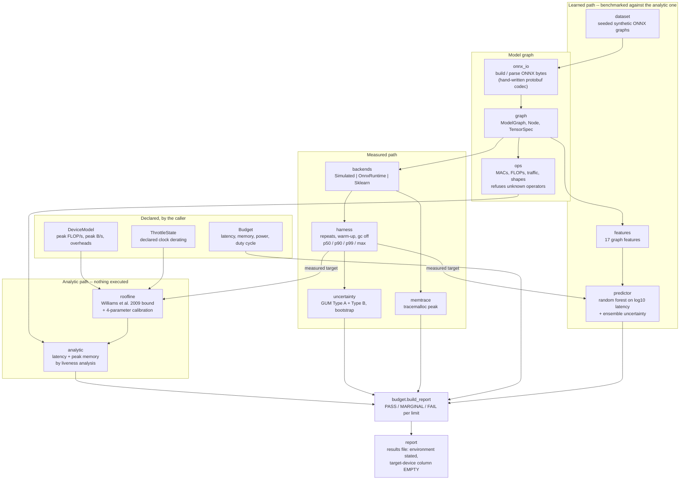
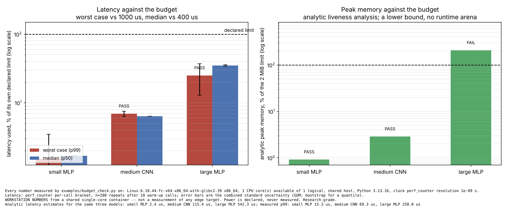
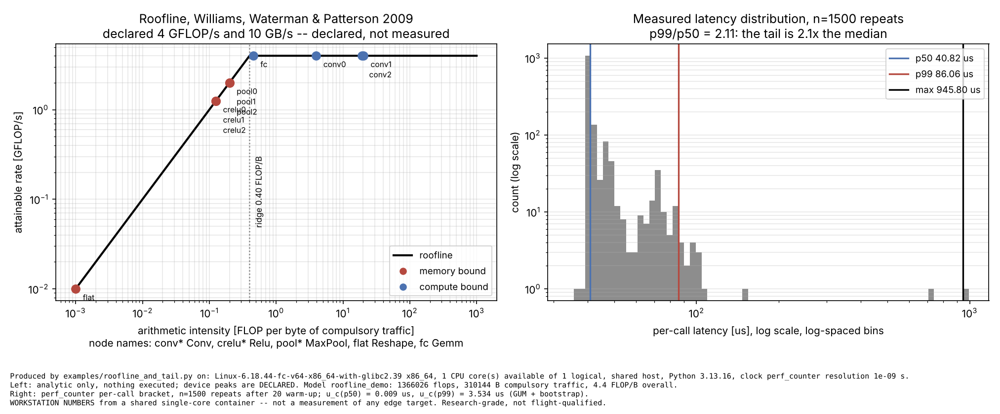
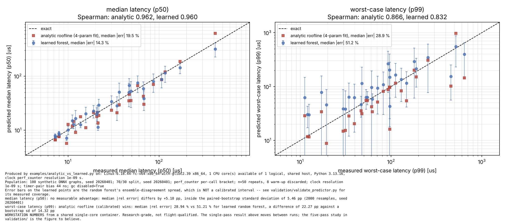
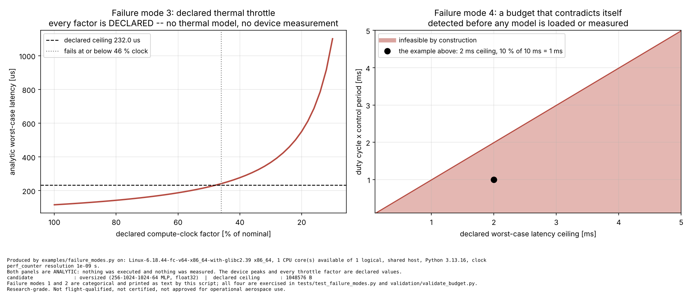

# edgeinfer

Declared latency, memory and power budgets for aerospace edge inference, checked analytically and by measurement.


**Status: TESTING · Validation level: 3, hardware-pending · Apache-2.0 ·
© 2026 OPTIMA Organisation**

Research-grade software. Not flight-qualified, not certified, and not approved
for operational aerospace use. Every number in this file was measured on a
shared single-CPU-core cloud container; no measurement from an edge device
exists, and the target-device column of every results table is empty.

## The problem

Putting a model on an aerospace edge computer is a budget question, not an
accuracy question: it has to fit a latency ceiling, a memory ceiling, a power
ceiling and a duty cycle, and it has to fit them in the worst case, not on
average. Teams answer this by flashing the board and finding out, which costs a
day per candidate and produces a median latency in a spreadsheet with no
measurement method next to it. The number a control loop actually needs — the
tail — is usually the one nobody wrote down.

## What this does

- Makes the envelope a **first-class object**: worst-case latency, median
  latency, peak memory, power ceiling and duty cycle, declared once, with
  pass/fail per limit. Contradictory declarations are caught before any model is
  loaded — three kinds of contradiction, 5/5 cases detected in
  `validation/validate_budget.py`.
- Computes an **analytic estimate** from the model graph with nothing executed:
  operation counts, memory traffic, a roofline latency bound (Williams, Waterman
  & Patterson 2009) and peak memory by liveness analysis. Operation counts match
  a hand count exactly for two networks, 10/10 integer checks at tolerance 0.
- **Measures** the candidate through `onnxruntime` and reports p50, p90, p99,
  the mean and the observed maximum **separately**, each with its clock,
  resolution, repeat count, warm-up count and a combined standard uncertainty
  (JCGM 100:2008 + bootstrap).
- Reports a verdict that **carries its uncertainty**: a pass by less than two
  combined standard uncertainties is `MARGINAL PASS`, not `PASS`.
- Screens candidates **479× cheaper** than measuring them on the host recorded
  in `validation/validate_performance.py` (64 µs analytically against 28.9 ms to
  build one `InferenceSession`).

## The result, up front

The package ships a learned latency predictor benchmarked against the analytic
baseline on held-out models, over five independent measurement passes
(`validation/validate_predictor.py`):

| Target | Outcome over 5 passes | Analytic median \|rel error\| | Learned median \|rel error\| |
|---|---|---|---|
| **median latency (p50)** | learned wins 5/5 | 21.20 – 24.96 % | 8.42 – 15.20 % |
| **worst-case latency (p99)** | **no measurable advantage, 5/5** | 30.55 – 43.71 % | 33.49 – 51.25 % |
| **peak memory** | **analytic wins outright** | 0.00 %, exact by construction | 11.17 % median, 62.65 % p90 |

Stated plainly: **the learned model helps on the median and does not help on the
tail, and the tail is what a control loop is sized by.** On every one of the
five passes the p99 difference lay inside the paired-bootstrap standard
deviation, so no advantage is claimed. On peak memory the analytic model is
exact integer arithmetic and there is nothing for a learned model to add. The
analytic model was written and validated before the learned one; both saw the
same features and the same training set; nothing was retuned to change these
outcomes.

Both predictors are poor on the tail in absolute terms — 31–44 % and 33–51 %
median error. The tail on a shared host is dominated by scheduler preemption,
which is a property of the machine and not of the model graph, so no graph
feature predicts it. That is a limitation of the measurement environment as much
as of either predictor, and it is the single clearest reason this product needs
device measurements it does not have.

## Who it's for

- Someone choosing between candidate models for an edge computer with a stated
  deadline, who needs the worst case and a stated uncertainty rather than an
  average.
- Someone who wants an operation count and a memory bound from a model graph
  before the board arrives.
- Someone writing a deployment envelope down as an artefact that a reviewer can
  check for self-consistency.

## Who it's not for

- Anyone who needs a number for a Jetson Orin Nano, or any other device. This
  repository has never run on one. Every figure here is from a shared
  single-CPU-core cloud container, and the device column of every results table
  is empty.
- Anyone who needs measured power. This package measures no power; the power row
  is always `NOT MEASURED`.
- Anyone who needs to characterise a transformer, a quantised graph, an RNN, or
  anything using an operator outside `edgeinfer.ops.SUPPORTED_OPS`. Those are
  refused, not approximated.
- Anyone who needs model optimisation, quantisation or pruning. This package
  measures; it does not change a model.
- Anyone who needs a certified or flight-qualified artefact. This is
  research-grade software.

## Alternatives, honestly

| Alternative | What it does better | When to use this instead |
|---|---|---|
| **`onnxruntime`** (a dependency here, not a competitor) | Executes the model. Its `SessionOptions.enable_profiling` writes a per-kernel Chrome-trace JSON with real kernel times, which is far more detail than this package's graph-level timing. | When you want a declared budget with a pass/fail and a stated uncertainty, and an analytic estimate sitting next to the measurement. `edgeinfer` imports `onnxruntime` to do the measuring. |
| **`psutil`** | Cross-platform process and system measurement: RSS, CPU times, I/O counters, per-process CPU affinity, from `/proc` and the Windows and macOS equivalents. Far more than the two `/proc/self/status` fields this package reads. | When the question is a model's budget rather than a process's resource use. Use `psutil` directly if you want process-level accounting; this package would only be in the way. |
| **`py-spy`** | A sampling profiler that attaches to a *running* Python process without modifying it, and shows where time goes by line, including inside C extensions. Nothing here can do that. | When you already know which call you want timed and you need the distribution of that call's latency against a declared ceiling. Use `py-spy` to find out *why* a call is slow; use this to decide whether it fits. |
| **`pytest-benchmark`** | A mature benchmarking harness: calibration, rounds and iterations, statistical comparison against saved runs, machine-info capture, JSON storage, regression detection in CI. Its statistics output is more complete than this package's. | When the benchmark result has to be checked against a *declared engineering budget* rather than against the previous commit, and when the analytic estimate matters. For pure regression benchmarking, `pytest-benchmark` is the better tool and this package does not try to replace it. |
| **`hdrhistogram`** (the Python port of HdrHistogram) | Records latency values in fixed-precision log-spaced buckets with bounded error, so high quantiles stay accurate over many orders of magnitude at constant memory, and histograms can be merged across processes. This package stores every sample in a NumPy array and takes a plain sample quantile, which is simpler and does not scale to long runs. | When the sample count is a few thousand and the quantiles need an uncertainty attached. For a long-running latency recorder, use HdrHistogram. |
| **Vendor tooling** (NVIDIA `trtexec`, `tegrastats`, Nsight Systems) | Real measurements on the real device, including power rails and DVFS state, which is exactly what this repository lacks. | Nothing here replaces them. Use them to produce the device numbers, then put them in the empty column of `validation/performance_results.md`. |

**The narrow defensible claim.** Not that this measures better than
`pytest-benchmark` or profiles better than `py-spy`, because it does neither.
The claim is: a **declared budget as a first-class object**, with pass/fail per
limit, a stated uncertainty on the verdict, worst case and median kept apart,
and an **analytic estimate from the model graph sitting next to the
measurement** so that a candidate can be screened before it is loaded and a
surprise in the measurement can be traced to a wrong operation count or a wrong
device declaration. That combination is what was missing.

## Install and first run

```bash
git clone https://github.com/OmAcharya-avtr/edgeinfer.git
cd edgeinfer
python -m venv .venv && source .venv/bin/activate
pip install -e ".[test]"
python -m pytest tests/ -q
python examples/budget_check.py
```

Expected output from the test run:

```
467 passed in 39.65s
```

Expected tail of the first example. **The latency rows depend on your machine
and its load and will differ; the memory row is integer arithmetic over the
graph and will not.** This run came from the container described under
Limitations:

```
large MLP
----------------------------------------------------------------------
  candidate   : large MLP
  budget      : 200 Hz attitude loop, 20 % duty
  environment : Linux-... x86_64, 1 CPU core(s) available of 1 logical, shared host, ...

  quantity                              value     u(value)          limit    util verdict
  worst-case latency (p99) [s]     0.00024999     0.000121          0.001   25.0% PASS
  median latency (p50) [s]         0.00014011     2.58e-06         0.0004   35.0% PASS
  peak memory [B]                 4.33997e+06            0    2.09715e+06  206.9% FAIL
  average power [W]                         7            -              7  100.0% NOT MEASURED

  overall     : FAIL
  undecided rows:
    - average power: NOT MEASURED
  analytic latency estimate: 542.301 us

wrote .../screenshots/budget_check.png
```

Note the shape of that result: a candidate that fits the latency envelope
comfortably and misses the memory envelope by a factor of two, decided for the
memory row by integer arithmetic before anything was executed. Note also the
worst-case uncertainty of 0.000121 s against a value of 0.000250 s — the p99
from 200 repeats on a shared core is resolved to about a factor of two, and the
report says so rather than quoting a tidy number.

## A worked example

```python
import numpy as np
from edgeinfer import (
    Budget, DeviceModel, OnnxRuntimeBackend, analytic_estimate, benchmark, build_report,
)
from edgeinfer.dataset import random_cnn

budget = Budget(
    name="200 Hz attitude loop",
    latency_s=1.0e-3,            # worst-case ceiling, checked at p99
    median_latency_s=400e-6,     # median ceiling, checked at p50
    peak_memory_bytes=2 * 1024 * 1024,
    power_w=7.0,                 # declared; never measured by this package
    duty_cycle=0.20,
    period_s=5.0e-3,
)
assert budget.feasibility(), budget.feasibility().reasons

device = DeviceModel("declared target", peak_flops=4.0e9, peak_bandwidth_bytes_s=10.0e9)
model = random_cnn(np.random.default_rng(0), "candidate", spatial=24,
                   channels=(8, 16), kernel=3, n_out=10)

estimate = analytic_estimate(model.graph, device)        # nothing executed
with OnnxRuntimeBackend(model.model_bytes, model.input_feed(0)) as backend:
    profile = benchmark(backend.infer, label="candidate", repeats=200, warmup=10)

tail = profile.uncertainty("p99")
report = build_report(
    budget, candidate="candidate", environment=profile.environment.one_line(),
    worst_case_latency_s=tail.value, worst_case_uncertainty_s=tail.combined_s,
    median_latency_s=profile.p50_s,
    peak_memory_bytes=float(estimate.peak_memory_bytes),
    latency_method=profile.method_line(), memory_method="analytic liveness analysis",
)
print(f"analytic {estimate.latency_s * 1e6:.1f} us, measured p50 "
      f"{profile.p50_s * 1e6:.1f} us, p99 {profile.p99_s * 1e6:.1f} us")
print(f"verdict: {report.overall.value}")
```

Actual printed output from one run on the container described below:

```
analytic 116.0 us, measured p50 25.7 us, p99 58.8 us
verdict: PASS
```

The analytic estimate is three times the measured median here because the
*declared* device peaks (4 GFLOP/s, 10 GB/s) are slower than the host this ran
on. A roofline bound is a bound for the device it declares, not for the machine
it is evaluated on — which is why the baseline in the comparison above is fitted
rather than declared.

## Architecture



## Screenshots



Three candidates against one declared envelope, log scale on both panels.
Notice that the large MLP sits at about a quarter of its latency ceiling and at
207 % of its memory ceiling, so the verdict is decided by the right panel; and
that the error bars on the worst-case bars are large, because a p99 from 200
repeats on a shared core is poorly resolved. The left panel's bars move with
host load and will differ on your machine; the right panel's are integer
arithmetic over the graph and will not.



Left: every node of a small CNN placed on the roofline by its arithmetic
intensity; the `Relu` and `MaxPool` nodes sit on the memory roof and the `Conv`
nodes on the compute roof. Right: the measured latency distribution on log axes.
Notice how far the maximum sits from the bulk — those are scheduler preemptions,
and they are why the p99 is reported rather than the mean.



Predicted against measured, held-out models, log-log. Notice that both
predictors track the median closely and neither tracks the p99: in the right
panel the points scatter across two orders of magnitude and the error bars on
the learned model are enormous. That is the honest shape of the result.



Left: the declared throttle sweep for one candidate, showing the declared clock
factor at which it stops fitting a 2× nominal ceiling. Right: the
infeasible-by-construction region over the two declarations that most often
contradict each other. Both panels are analytic; nothing was executed and every
throttle factor is declared.

## Validation evidence

Full detail, including what failed, is in [`validation/VALIDATION.md`](validation/VALIDATION.md).
Every number below came from a script in `validation/` run in the session that
wrote this file; the raw stdout is stored beside each script.

| Check | Reference | Result | Tolerance | Script |
|---|---|---|---|---|
| Operation counts, hand MLP | Golub & Van Loan 2013 §1.1.11 | 42 MACs, 99 FLOPs, 328 B traffic, 48 B peak activations — all exact | 0 (integers) | `validate_opcounts.py` |
| Operation counts, hand CNN | Sze et al. 2017 §II-A; ONNX opset 17 `Conv` | 684 MACs, 1514 FLOPs, 1832 B traffic, 576 B peak activations — all exact | 0 (integers) | `validate_opcounts.py` |
| `onnxruntime` vs NumPy, hand CNN | independent NumPy recomputation | 2.384e-07 max abs difference | 1e-05 | `validate_opcounts.py` |
| Peak-memory instrument | hand-counted allocations | 8 000 272 B measured for an 8 000 000 B payload; float64/float32 ratio 1.9999 | +1024 B header; 1 % | `validate_memory.py` |
| Liveness vs measured execution | Aho et al. 2006 §8.4 | 16 384 B analytic vs 16 904 B measured, 3.17 % excess | < 5 % | `validate_memory.py` |
| Injected cost model recovered | — | measured **p50** / injected mean = **1.0513** | band [1.00, 1.15] | `validate_backend_cost_model.py` |
| **Same check on the mean — FAILED first** | — | measured **mean** / injected mean = **2.1935** | — | `validate_backend_cost_model.py` |
| Clock quantisation term | JCGM 100:2008 §4.3.7 | 4.082e-10 s, matches `d·sqrt(2/12)` | 1e-24 | `validate_uncertainty.py` |
| Roofline is a bound | Williams et al. 2009 §3 | bound below the measurement for **36/36** held-out models at over-declared peaks | 0 violations | `validate_predictor.py` |
| **Analytic baseline vs learned, p99** | paired bootstrap, 2000 resamples | **no measurable advantage, 5/5 passes** | difference inside the bootstrap sd | `validate_predictor.py` |
| Analytic baseline vs learned, p50 | paired bootstrap, 2000 resamples | learned wins 5/5; 8.42–15.20 % vs 21.20–24.96 % | — | `validate_predictor.py` |
| **Analytic baseline vs learned, memory** | exact arithmetic | **analytic wins outright**, 0.00 % vs 11.17 % median | — | `validate_predictor.py` |
| Learned uncertainty coverage | — | truth inside ±1 u for 75.0 % (p50) / 72.2 % (p99); inside ±2 u for 91.7 % / 86.1 % | ~68 % / ~95 % if calibrated — **it is not** | `validate_predictor.py` |
| Four failure modes | — | 21/21 checks: memory overrun, unsupported operator, declared throttle, infeasible budget | — | `validate_budget.py` |
| ONNX field numbers | ONNX Standard `onnx.proto`, checked against `onnxruntime`'s own shipped models | 7/7 fields read correctly from `mul_1.onnx` | exact | `validate_onnxruntime.py` |

Three results in that table are the credible ones because they are not
favourable: the mean-based cost-model recovery **failed** and was replaced by a
median-based one rather than re-banded; the learned predictor shows **no
measurable advantage** on the quantity that matters most; and the learned
uncertainty is **not calibrated**, with its real coverage measured and printed.

## API reference

<details>
<summary>Public surface, one line each, with units</summary>

| Symbol | What it does |
|---|---|
| `Budget(name, latency_s, peak_memory_bytes, median_latency_s=None, power_w=None, duty_cycle=None, period_s=None, worst_case_quantile=0.99)` | A declared envelope. Latencies [s], memory [B], power [W], duty cycle and quantile dimensionless. |
| `Budget.feasibility() -> Feasibility` | Detects contradictions between the declarations; no model needed. |
| `Budget.effective_latency_s` | The binding worst-case ceiling [s]: the smaller of `latency_s` and `duty_cycle × period_s`. |
| `Budget.energy_per_inference_j(latency_s) -> float \| None` | `E = P t` [J] from the *declared* power; never a measurement. |
| `build_report(budget, candidate, environment, ...) -> BudgetReport` | Assembles the pass/fail table; anything unmeasured becomes a `NOT MEASURED` row rather than being dropped. |
| `BudgetReport.overall -> Verdict` | Worst verdict over the decided rows; `FAIL` outright for an infeasible budget. |
| `ModelGraph(name, inputs, outputs, nodes, initializers=())` | Topologically ordered static graph; rejects out-of-order nodes and unproduced outputs. |
| `ModelGraph.infer_shapes() -> ModelGraph` | Fills every node output's `TensorSpec`. |
| `TensorSpec(name, shape, dtype="float32")` | A tensor with a fully static shape; `.elements`, `.nbytes` [B]. |
| `node_cost(node, graph) -> OpCost` | Per-node MACs, FLOPs [dimensionless] and read/written bytes [B]. |
| `UnsupportedOperatorError` | Raised instead of charging an unknown operator zero cost. |
| `DeviceModel(name, peak_flops, peak_bandwidth_bytes_s, overhead_per_node_s=0, fixed_overhead_s=0, source="declared")` | Peak compute [FLOP/s], peak bandwidth [B/s], overheads [s]. `.ridge_point_flops_per_byte` [FLOP/B]. |
| `roofline_time_s(flops, traffic_bytes, device) -> float` | `max(F/peak_flops, B/peak_bw)` [s]; Williams et al. 2009. |
| `calibrate_device(node_flops, node_bytes, graph_index, measured_s, name, grid=20) -> DeviceModel` | Fits the four parameters; result is labelled `calibrated-fit`, never a datasheet figure. |
| `analytic_estimate(graph, device) -> AnalyticEstimate` | Latency [s], flops, traffic [B], peak memory [B], per-node breakdown. Nothing executed. |
| `peak_activation_bytes(graph) -> (int, dict)` | Peak live activation bytes [B] and the live total after each node. |
| `build_model(graph, initializer_arrays) -> OnnxModel` / `parse_model(bytes) -> (ModelGraph, dict)` | ONNX serialisation without the `onnx` package. |
| `OnnxRuntimeBackend(model_bytes, feed, providers=("CPUExecutionProvider",), intra_op_num_threads=1)` | Real inference; `prepare()` / `infer()` / `close()`, usable as a context manager. |
| `SimulatedBackend(stages, seed=0, consume_time=True, work_bytes=0)` | Injected per-stage cost model; never a device measurement. |
| `SklearnBackend(estimator, x)` | A fitted scikit-learn estimator behind the same contract. |
| `benchmark(fn, *args, label, repeats=200, warmup=10, ...) -> LatencyProfile` | Timed batch; `.p50_s`, `.p90_s`, `.p99_s`, `.max_s`, `.mean_s`, `.std_s` [s], `.tail_ratio`, `.method_line()`. |
| `LatencyProfile.uncertainty(statistic) -> UncertaintyBudget` | GUM Type A + Type B for `"mean"` or `"pNN"`; bootstrap for a quantile. |
| `measure_peak_python_bytes(fn, ...) -> (result, PeakMemory)` | `tracemalloc` peak [B]; sees the CPython allocator only. |
| `ThrottleState(label, compute_factor, bandwidth_factor=1.0, basis=...)` / `throttled_device(device, state)` | Declared derating; records both factors and the basis in the device's `source`. |
| `generate_population(n_models=120, seed=20260401)` | Reproducible synthetic ONNX graphs. |
| `graph_features(graph) -> np.ndarray` | 17 features, all from shapes and operator types; no execution. |
| `LatencyPredictor(n_estimators=120, max_depth=8, min_samples_leaf=2, seed=..., target_name=...)` | Random forest on `log10` target; `.fit`, `.predict`, `.predict_with_uncertainty`. |
| `compare_predictors(analytic, learned, truth) -> (metrics, metrics, verdict)` | Paired-bootstrap comparison; says *no measurable advantage* when the difference is inside the bootstrap sd. |
| `write_results_file(path, title, rows, ...)` | Writes a results file that states its environment and has an empty target-device column. |

CLI: `python -m edgeinfer {analyse,profile,check,feasibility,env}`. `check`
exits 0 on pass, 1 on fail, 2 on an infeasible budget or invalid input, 3 on an
unsupported operator.

</details>

## Limitations

**Compute budget and the environment.** Everything in this repository was built
and run on a **shared cloud container with one CPU core and 7.8 GiB of RAM**,
with four sibling build jobs running concurrently. Every validation script and
example finishes in under 10 s and the full test suite in **39.7 s**; the design
budget was 180 s per script and 15 min for the suite. The model population is
sized to that budget: 120 graphs of 1.7e3 to 3.9e7 flops, measured with 60
repeats each. A larger population, longer repeat counts or bigger models would
change the predictor comparison and were not affordable here.

**No device measurement exists.** This package has never run on a Jetson Orin
Nano or any other edge target. Every number is from the container above. The
target-device column of `validation/performance_results.md` is empty and there
is no API that would let a caller fill it. What is required to fill it is listed
in [`docs/REQUIREMENTS.md`](docs/REQUIREMENTS.md) §4.

**Power is never measured.** There is no instrumented rail here. The power row
is always `NOT MEASURED` whatever value is declared, and it does not contribute
to the overall verdict.

**The analytic peak memory is a lower bound.** No allocator arena, no kernel
scratch buffer, no alignment or page granularity, and a tensor freed the instant
its last consumer finishes. For a 256-1024-1024-64 MLP the analytic figure is
5 521 664 B; `tracemalloc` across one `session.run()` sees 4 956 B, because
`onnxruntime`'s arena is outside the CPython allocator. These are different
quantities and neither validates the other.

**Compulsory traffic counts each tensor once**, so the memory-bound side of the
roofline is a lower bound on real DRAM traffic. Williams et al. 2009 make the
same simplification and say so.

**The fitted bandwidth is not always identifiable.** When every node in the
calibration set is compute bound, the memory roof never binds and the fitted
bandwidth carries no information. This is asserted directly in
`tests/test_roofline.py::TestCalibration::test_bandwidth_is_not_identifiable_from_a_compute_bound_population`.

**Stated modelling assumptions, not measurements.** `Sigmoid` and `Tanh` are
charged 4 flops per element and `Softmax` 5. `Relu` is charged 1, so that
activation cost is not silently zero. Node times are summed, which assumes no
overlap between operators.

**Operator coverage is narrow and refuses rather than approximating.**
`Conv`, `Gemm`, `MatMul`, pooling, `Softmax`, `BatchNormalization`, `Concat`,
`Reshape`, `Flatten` and the common elementwise operators. `Squeeze`,
`Unsqueeze` and `Transpose` are **not** supported — their shape rules are not
implemented and listing them would mean reporting a wrong output shape. A model
with a map or sequence output (`logreg_iris.onnx`, shipped with `onnxruntime`)
is refused by the parser with a diagnostic.

**p99 from n repeats is blind to an event rarer than 1 in 100.** The maximum is
reported alongside it and the repeat count travels with both.

**The predictor's uncertainty is not calibrated.** It is the spread of the
forest's trees, not a prediction interval. Measured coverage: 75.0 % inside
±1 u and 91.7 % inside ±2 u on the p50 target; 72.2 % and 86.1 % on p99.

**Latency figures move between runs.** Anything measured on a shared core
depends on the host's load at the time. The *direction* of the predictor
comparison was stable across five passes within one session; a reader on
different hardware should re-run the five-pass study rather than quote these
percentages.

**Research-grade software.** Not flight-qualified, not certified, and not
approved for operational aerospace use.

## Reproducing every number

From the repository root:

```bash
pip install -e ".[dev]"
python -m pytest tests/ -q                 # 467 passed
ruff check src/ tests/                     # clean
python validation/validate_opcounts.py             # 12/12
python validation/validate_memory.py               # 8/8
python validation/validate_onnxruntime.py          # 13/13
python validation/validate_uncertainty.py          # 4/4
python validation/validate_backend_cost_model.py   # 6/6, writes crosscheck_pipeline.json
python validation/validate_budget.py               # 21/21
python validation/validate_performance.py          # writes performance_results.md
python validation/validate_predictor.py            # the five-pass comparison
python examples/budget_check.py
python examples/roofline_and_tail.py
python examples/analytic_vs_learned.py
python examples/failure_modes.py
python -m edgeinfer analyse --graph hand_cnn
python -m edgeinfer check --graph mlp --budget-latency-ms 1 --budget-memory-kb 512
```

Integer operation counts, allocator byte counts and the ONNX field checks are
host-independent and reproduce exactly. Every latency, and every figure derived
from one, will differ on another machine.

## Related work in this portfolio

Cited as related work, never imported — each repository stays independently
installable. P031 HilForge builds the hardware-in-the-loop harness this
package's benchmark conventions parallel; P039 LatencyNet independently
implements the synthetic pipeline in `validation/crosscheck_pipeline.json` and
the two measured results are deliberately diffed, with disagreement treated as a
finding.

## Licence

Apache-2.0. See [LICENSE](LICENSE). © 2026 OPTIMA Organisation.

## Citation

See [CITATION.cff](CITATION.cff).

## Credits

Built by the OPTIMA Organisation aerospace software programme.

This is under reserved rights obtained by OPTIMA Organisation.
