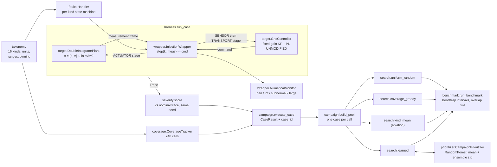
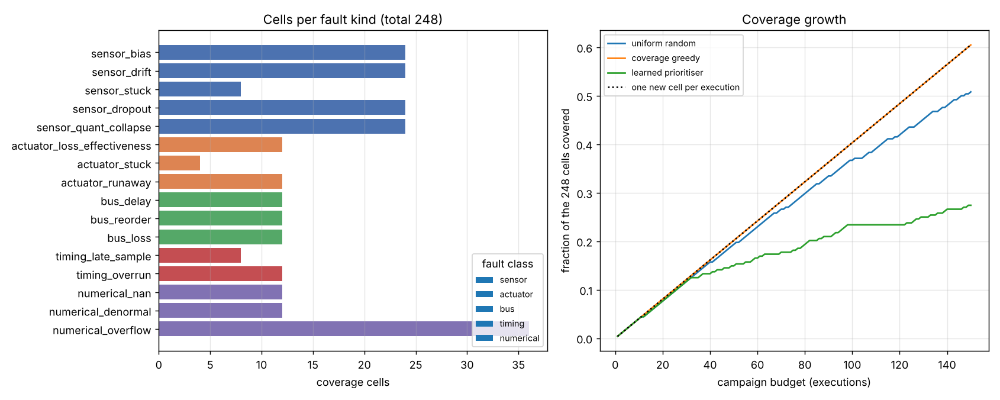
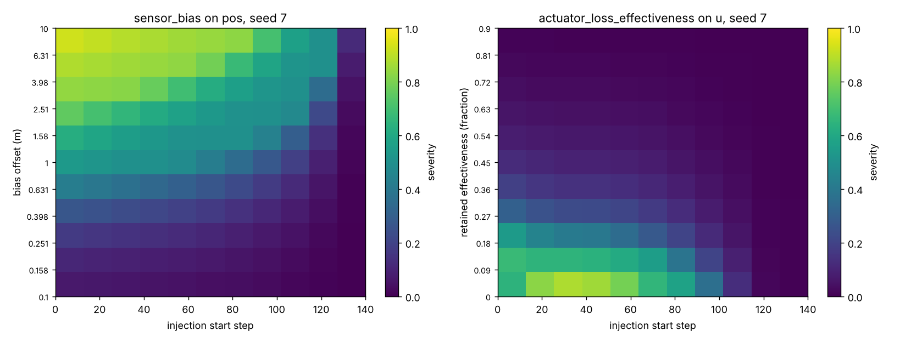
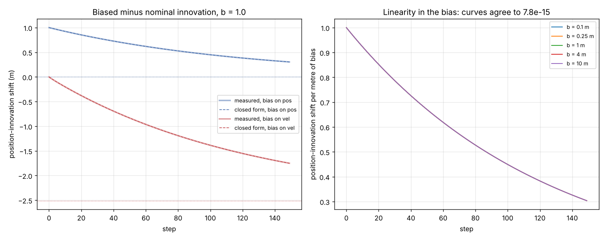
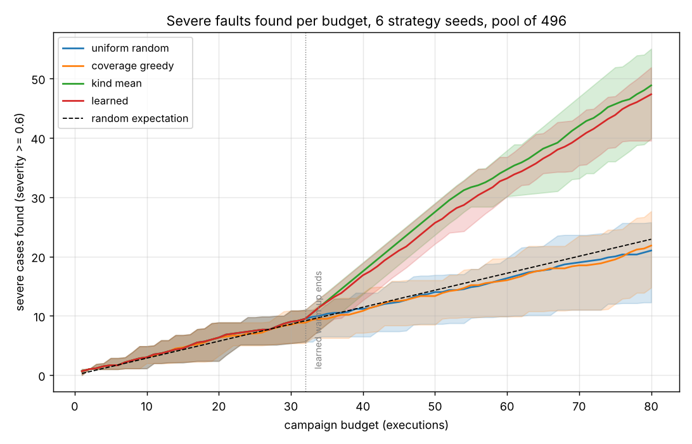

# FaultInject

Fault-injection campaigns for GNC and communications software.


**Status: TESTING** · Class: medium · Validation level 2 (research grade) ·
learned component with an uncertainty output · MIT · © 2026 OPTIMA Organisation

Research-grade software. **Not flight-qualified, not certified, not approved for
operational aerospace use.**

## The problem

Fault injection decides whether an FDIR scheme works, and in practice it is a
handful of hand-written test cases: someone adds a bias to a sensor, watches the
filter, and declares the monitor good. Nobody can say which parts of the fault
space were visited, nobody can replay the one case that failed six weeks ago
because the seed was never written down, and when a NaN gets quietly replaced by
zero inside the estimator the test passes. The missing piece is a campaign: a
named taxonomy, injection that does not require editing the target, coverage
accounting, and a search over a space too large to enumerate.

## What this does

- **Sixteen fault kinds in five classes, each with units, a declared parameter
  range and a reference** — sensor bias, drift, stuck, dropout, quantisation
  collapse; actuator loss of effectiveness, stuck, runaway; bus delay, reorder,
  loss; timing late sample and overrun; numerical NaN, denormal, overflow. The
  cross product is **248 coverage cells**, and all 248 are reachable
  (`validation/validate_coverage.py`).
- **Injects around an unmodified target.** The wrapper implements the target's
  own `step(k, measurement) -> command` interface. With no fault active it is
  bit-transparent: **0 byte-image mismatches over 50 seeds** against an
  independently written closed loop (`validation/validate_transparency.py`).
- **Replays any case exactly.** A case is a content-hashed value that
  serialises to JSON. Across a pool covering all 248 cells, two runs of the same
  case agree over **2 622 456 bytes with 0 mismatches**, and a tampered case
  file is rejected rather than silently replayed
  (`validation/validate_replay.py`).
- **Catches the fault that hides.** A target that replaces an injected NaN with
  zero scores **0.002414** on severity — negligible — but the boundary monitor
  reports it and labels it `absorbed`. Detection latency for an injected NaN is
  **0 steps** on all three channels (`validation/validate_nan_detection.py`).
- **Benchmarks the learned prioritiser against two baselines on the same
  budget.** At 60 executions out of a 496-case pool: learned **33.875**
  [32.083, 35.583] severe cases, uniform random **16.583** [15.208, 17.958],
  coverage-greedy **16.708** [15.458, 18.000], and a non-learned kind-mean
  ablation **34.292** [32.792, 35.750] (`validation/validate_benchmark.py`).

## The headline result, up front

The learned prioritiser beats uniform random by a wide margin. It shows **no
measurable advantage over a four-line non-learned heuristic** that ranks untried
cases by the running mean severity of their fault kind: 33.875 against 34.292,
with heavily overlapping intervals. Almost all of the gain over random is
"learn which fault kinds are dangerous", which a campaign engineer also knows
after twenty executions. And **coverage-greedy search shows no measurable
advantage over uniform random** at finding severe faults — paired difference
0.125, interval [−0.292, 0.543], which contains zero. Both results are in
`validation/VALIDATION.md` and MODEL_CARD.md, and neither was tuned away.

## Who it is for

- Anyone who has a GNC or comms loop in Python with a `step`-like interface and
  wants a systematic campaign over a named fault space rather than a folder of
  ad-hoc test scripts.
- Anyone who needs to hand a colleague the exact case that broke something, as
  one line of JSON that replays bit-identically.
- Anyone writing an FDIR monitor who needs to know whether the target is
  *detecting* an injected numerical fault or *swallowing* it.
- Anyone who wants a coverage number over a fault taxonomy that is defined
  precisely enough to be hand-enumerated, and is.

## Who it is not for

- **Anyone injecting faults into a neural network's weights or activations.**
  That is `pytorchfi`'s job; see the table below.
- **Anyone needing bit-level corruption of a binary.** The numerical kinds here
  write a NaN, a subnormal or a large magnitude into a named channel. They do
  not flip a chosen bit of an IEEE 754 word, and they do not touch memory.
- **Anyone injecting into C, C++ or Ada flight software**, into a running RTOS
  task, or over a real bus. The wrapper is a Python object that interposes on a
  Python call.
- **Anyone needing multiple simultaneous faults scored and covered.** The
  wrapper accepts a list of injections, but the coverage metric, the case pool
  and the prioritiser all assume one fault per case.
- **Anyone needing a criticality or hazard assessment.** The severity score is a
  declared weighted combination of observed deviations, not a safety judgement.

## Alternatives, honestly

| Alternative | What it does better | When to use this instead |
|---|---|---|
| [`pytorchfi`](https://pypi.org/project/pytorchfi/) 0.6.0 (NCSA licence) | Perturbs a **PyTorch DNN** at runtime through forward hooks: `core.fault_injection` instruments `torch.nn` layers, `neuron_error_models.py` injects values at neuron outputs and `single_bit_flip_func` flips a chosen bit of a fixed-point quantisation of the value (`bits`, default 8, two's complement), `weight_error_models.py` corrupts or zeroes weights. Mature, cited (Mahmoud et al., DSN-W 2020, pp. 25–31), designed for resiliency studies of classification and detection networks. | When the target is a **control loop**, not a network: when you need sensor, actuator, bus and timing faults as well as numerical ones, a coverage metric over a fault taxonomy, severity scored from the closed-loop response, and seeded replay of a whole campaign. `pytorchfi` is the closer prior art for a bit-level injector (mission product P040 BitFlipSim) than for this one; it also requires PyTorch, which this package does not use. Its "bit flip" is on a quantised fixed-point value, not an IEEE 754 binary64 word, which is worth knowing before comparing the two. |
| [`hypothesis`](https://pypi.org/project/hypothesis/) 6.168.3 | Property-based testing: generates and shrinks adversarial *inputs* to find counterexamples to a stated property, with a large strategy library and a shrinker that produces minimal failing cases. | These are not competitors. `hypothesis` is a **dependency here**, used in `tests/test_properties.py` for the algebraic identities in the binning and the fault models. Use `hypothesis` when the question is "does this function hold its property over all inputs". Use this package when the question is "what happens to a closed loop when a sensor sticks at step 73". Where a fault parameter has an identity worth checking over its whole range, use both. |
| Writing the injection inline in the test | Nothing to install, and for one fault it is faster. | When you need the case to be a replayable value, the fault space to be enumerable, coverage to be counted, and a NaN that the target absorbs to be reported rather than passed. |
| A fault-injection framework for C/C++ flight software | Works on the real binary, the real RTOS and the real bus, which is where the faults actually happen. | When the target is a Python model or prototype and you want the campaign machinery early, before the flight code exists. This package cannot reach a compiled target and does not pretend to. |

**The narrow defensible claim.** This is *campaign machinery for a Python
control loop*: a named taxonomy with units and ranges, injection by
interposition, cell coverage, severity, bit-identical replay, and an honest
same-budget search benchmark. It is not a bit-level injector, not a hardware
tool, and not a safety assessment.

## Install and first run

```bash
git clone https://github.com/OmAcharya-avtr/faultinject.git
cd faultinject
python -m venv .venv && source .venv/bin/activate
pip install -e ".[dev]"
python -m pytest tests/ -q
python -m faultinject taxonomy | head -8
```

Expected output of the last two commands:

```
202 passed in 17.48s

faultinject taxonomy: 16 kinds, 248 coverage cells

   sensor | sensor_bias
            channels: pos, vel   cells: 24
            param offset: [0.1, 10] channel units, 3 log bins
            Additive constant offset on the measurement while active.
            ref: Hwang et al. 2010, IEEE T-CST 18(3), Sec. II (additive sensor bias)
```

Then run one injected case end to end:

```bash
python -m faultinject run --kind sensor_bias --channel pos --param offset=3.0 \
    --start 40 --duration 100 --seed 7
```

## A worked example

```python
from faultinject import FaultCase, Injection, execute_case, replay_case
from faultinject.coverage import CoverageTracker
from faultinject.taxonomy import FaultKind

# One fault: a 3.0 m bias on the position sensor, steps 40..139, seed 7.
injection = Injection.create(
    FaultKind.SENSOR_BIAS, "pos", {"offset": 3.0}, start_step=40, duration_steps=100
)
case = FaultCase(injection, seed=7, n_steps=150)
print("case_id  ", case.case_id)
print("cell     ", case.cell().label())

result = execute_case(case)
print("severity ", round(result.severity.severity, 6), result.severity.label)
print("max dev  ", round(result.severity.max_pos_deviation, 6), "m")
print("rmse x   ", round(result.severity.rmse_ratio, 6))
print("monitor  ", result.monitor["classes"], result.monitor["verdicts"])

# The case is a value: serialise it, hand it to someone else, replay it exactly.
a, b = replay_case(FaultCase.from_json(case.to_json()))
print("replay   ", "bit identical" if a.float_bytes() == b.float_bytes() else "DIFFERENT")

tracker = CoverageTracker.full()
tracker.add(injection, case.n_steps)
print("coverage ", f"{tracker.covered}/{tracker.total}")
```

Actual output:

```
case_id   bd32605725b734a5
cell      sensor_bias/pos/s0/d1/p[2]
severity  0.665765 severe
max dev   1.601022 m
rmse x    3.210206
monitor   [] {}
replay    bit identical
coverage  1/248
```

The full taxonomy — every kind, channel, unit, parameter range, binning and
reference — is in [`docs/TAXONOMY.md`](docs/TAXONOMY.md), generated from
`src/faultinject/taxonomy.py` so it cannot drift from the code.

## Architecture



## Screenshots



Left: how the 248 cells are distributed over the sixteen kinds — `sensor_*` and
`numerical_overflow` dominate because they have more channels and more parameter
bins. Right: the learned prioritiser reaches the *least* coverage (0.2742 after
150 executions against coverage-greedy's 0.6048), because it deliberately
revisits the regions where severity is high. Coverage and severity are different
objectives and this figure is where that becomes obvious.



Severity is not monotone in the injection start step: a fault injected early has
longer to act, but the closed loop also has longer to recover. Notice the
sensor-bias panel going dark again at the largest offsets and latest starts —
26 of 121 bias cases clear the severe threshold, 11 of 121 actuator cases do.



Left: the measured biased-minus-nominal innovation lies on the closed form to
2.054e-15 (position bias) and 3.109e-15 (velocity bias). The dotted lines are
the analytic steady states: **exactly zero** for a position bias — the filter
absorbs it and an innovation-mean monitor goes blind — and **−2.509528032** for
a velocity bias. Right: five bias magnitudes collapse onto one curve, agreeing
to 7.8e-15, because the shift is exactly linear in the bias.



The two baselines sit on the random expectation line. The learned prioritiser
and the non-learned kind-mean ablation separate from them after the warm-up
ends, and from each other they do not separate at all — which is the result this
repository exists to report honestly.

## Validation evidence

Full evidence, with the raw stdout of every script, in
[`validation/VALIDATION.md`](validation/VALIDATION.md).

| Check | Reference | Result | Tolerance |
|---|---|---|---|
| Replay bit-identical, 248 cells | own byte image, both runs | 2 622 456 bytes, **0 mismatches** | exact equality |
| Case JSON round trip, 248 cases | own byte image | **0 mismatches** | exact equality |
| Tampered case file | SHA-256 content hash | rejected with `ValueError` | exact |
| Coverage cell labels, 2-kind subset | hand enumeration, 32 labels typed out | identical, in order | exact |
| Coverage after a 6-injection campaign | hand computation | **5 of 32 = 0.156250000000** | exact |
| All cells reachable | constructed case re-binned | 248 of 248 | exact |
| Innovation shift per step, position bias | closed form, Eq. (1) of VALIDATION.md | max error **2.054e-15** | 1e-12 |
| Mean innovation shift over 150 steps | closed form, Eq. (3) | **0.584598217** m vs 0.584598217 m | 1e-12 |
| Steady-state shift, position bias | closed form, Eq. (2) | **−3.553e-15**, analytically zero | 1e-13 |
| Steady-state shift, velocity bias | closed form, Eq. (2) | **−2.509528032** m per m/s | non-zero |
| Linearity of the shift in the bias | own measurement at 5 magnitudes | **7.772e-15** | 1e-12 |
| NaN detection latency, 3 channels | injected start step | **0 steps**, severity exactly 1.0 | exact |
| NaN absorbed by a sanitising target | boundary monitor | severity 0.002414, verdict **`absorbed`** | — |
| Overflow magnitude below 1.340781e+154 | boundary monitor | **not flagged** — documented blind spot | — |
| Wrapper transparency, 50 seeds | independently written closed loop | **0 mismatches** | exact equality |
| `bus_delay` after its window | FIFO model | permanently 4 steps stale | exact |
| learned vs uniform_random, budget 60 | 24 runs, bootstrap | 33.875 [32.083, 35.583] vs 16.583 [15.208, 17.958] | overlap rule |
| **learned vs kind_mean ablation** | 24 runs, bootstrap | 33.875 vs 34.292 — **no measurable advantage** | overlap rule |
| **coverage_greedy vs uniform_random** | 24 paired runs, bootstrap | difference 0.125 [−0.292, 0.543] — **no measurable advantage** | overlap rule |
| Forest 95 % interval coverage | own held-out severities | 0.947581 at mean width 0.830661 — wide, not calibrated | nominal 0.95 |

One defect and one wrong model were found by validation and are recorded there:
the geometric midpoint of the top overflow-magnitude bin overflowed to infinity
(fixed, with a regression test), and `bus_delay` was documented as draining its
backlog when a matched-rate FIFO cannot (model and docs corrected).

## API reference

<details>
<summary>Public surface, one line each, with units</summary>

**`faultinject.taxonomy`**
- `kinds() -> tuple[FaultKind, ...]` — the sixteen kinds in taxonomy order.
- `spec(kind) -> FaultSpec` — channels, parameters, description, reference.
- `kinds_of_class(fault_class) -> tuple[FaultKind, ...]` — kinds in one class.
- `total_cells(subset=None) -> int` — size of the coverage cross product.
- `ParamSpec.edges() -> tuple[float, ...]` — bin edges in parameter units.
- `ParamSpec.bin_of(value) -> int` — coverage bin, clamped at the ends.
- `ParamSpec.representative(bin) -> float` — a value inside that bin.
- `ParamSpec.normalise(value) -> float` — value mapped to [0, 1] on its scale.
- `FaultSpec.validate(channel, params)` — raises `ValueError` on anything invalid.

**`faultinject.faults`**
- `Injection.create(kind, channel, params, start_step, duration_steps)` — validated constructor; steps are loop steps.
- `Injection.to_dict() / from_dict()` — JSON-serialisable form.
- `Injection.active(step) -> bool`, `Injection.stage -> Stage`.
- `make_handler(injection) -> Handler` — the executable fault model.
- `stage_of(kind, channel) -> Stage` — SENSOR, TRANSPORT, TARGET or ACTUATOR.

**`faultinject.wrapper`**
- `InjectionWrapper(target, injections, rng)` — same `step(k, meas) -> cmd` interface as the target.
- `InjectionWrapper.events -> list[Event]`, `.event_counts() -> dict[str, int]`.
- `NumericalMonitor.verdict(cls) -> str` — `propagated`, `absorbed`, `emitted`, `absent`.
- `classify_value(x) -> str | None` — `nan`, `inf`, `subnormal`, `large` or ordinary.

**`faultinject.target`**
- `GncController` — fixed-gain Kalman filter plus PD controller; `step(k, meas) -> {"u": m/s^2}`.
- `SanitisingGncController` — variant that replaces non-finite innovations with zero.
- `DoubleIntegratorPlant` — position in m, velocity in m/s, command in m/s^2.
- `kalman_gain() -> ndarray`, `gain_convergence() -> (iterations, final change)`.
- `plant_matrices(dt) -> (A, B)`, `process_covariance(dt, sigma_a)`, `measurement_covariance(sigma_p, sigma_v)`.

**`faultinject.harness`**
- `run_case(injections, seed, n_steps=150, target=None) -> Trace`.
- `nominal_trace(seed, n_steps) -> Trace` — cached fault-free reference.
- `Trace.float_bytes() -> bytes` — canonical IEEE 754 image for bit comparison.
- `Trace.tracking_error -> list[float]` — true position minus reference, metres.

**`faultinject.severity`**
- `score(faulted, nominal) -> SeverityReport` — severity in [0, 1] plus every input to it.
- `label_for(severity) -> str` — negligible / minor / moderate / severe.
- `SEVERE_THRESHOLD = 0.6`, `DEV_REF = 0.5` m, `POS_LIMIT = 2.0` m.

**`faultinject.coverage`**
- `all_cells(subset=None) -> tuple[CoverageCell, ...]` — canonical sorted order.
- `cell_of(injection, n_steps) -> CoverageCell`.
- `CoverageTracker.add(injection, n_steps)`, `.fraction`, `.missing()`, `.per_kind()`.

**`faultinject.campaign`**
- `FaultCase(injection, seed, n_steps)` — `.case_id` is 16 hex of SHA-256 over the whole description.
- `execute_case(case, keep_trace=False) -> CaseResult`.
- `replay_case(case) -> (Trace, Trace)`.
- `build_pool(pool_seed, replicates=2, subset=None) -> tuple[FaultCase, ...]`.
- `evaluate_pool(pool) -> tuple[float, ...]` — severity of every case.
- `run_campaign(cases, subset=None) -> CampaignResult`.

**`faultinject.search`**
- `uniform_random(pool, oracle, budget, rng) -> SearchResult`.
- `coverage_greedy(pool, oracle, budget, rng) -> SearchResult`.
- `kind_mean(pool, oracle, budget, rng, warmup=16) -> SearchResult` — non-learned ablation.
- `learned(pool, oracle, budget, rng, warmup=32, refit_every=8, kappa=0.0) -> (SearchResult, CampaignPrioritizer)`.

**`faultinject.prioritizer`**
- `CampaignPrioritizer.fit(cases, severities)`, `.predict(cases) -> SeverityPrediction`.
- `SeverityPrediction.mean / .std / .lower / .upper`, `.acquisition(kappa)`.
- `CampaignPrioritizer.interval_coverage(cases, severities) -> (coverage, mean width)`.
- `encode(case) -> ndarray` of 25 features; `feature_names()` gives the layout.

**`faultinject.benchmark`**
- `run_benchmark(budget=60, n_pools=3, n_seeds=8, ...) -> BenchmarkReport`.
- `BenchmarkReport.verdict() -> str` — applies the overlap rule.
- `bootstrap_ci(values, resamples=5000, seed=...) -> (mean, lo, hi)`.

**CLI** — `python -m faultinject {taxonomy,cells,run,replay,campaign,benchmark}`.

</details>

## Limitations

- **One fault per case.** `InjectionWrapper` accepts several injections and the
  tests exercise two simultaneous sensor faults, but the coverage metric, the
  case pool, the prioritiser's feature vector and the benchmark all assume one.
  Multi-fault campaigns are not supported and would need a different cell
  definition.
- **At most one transport-stage and one target-stage injection per wrapper.**
  Two competing frame-reordering models have no well-defined composition, so the
  wrapper raises `ValueError` rather than guessing.
- **One reference target.** Everything measured here — every severity, the whole
  benchmark — is on a double integrator with a fixed-gain Kalman filter and a
  saturating PD controller. Nothing about the severity distribution or the
  search comparison transfers to another target without re-running it.
- **The severity weights are a design choice, not a measurement.**
  `0.5 · deviation + 0.3 · RMSE excess + 0.2 · violation fraction`, with
  overrides at non-finite and divergent, and a severe threshold of 0.6. Change
  the weights and the benchmark's severe counts change. The violation term is
  absolute, so a target whose nominal trajectory already exceeds `POS_LIMIT`
  would carry a constant floor.
- **The benchmark pool is finite and fully enumerable, on purpose.** 496 cases
  whose severities are all computed up front, so three strategies can be
  compared without re-running the target. A real campaign faces a space too
  large for that, and a strategy's advantage on an enumerable pool is weaker
  evidence than one on a space where the ground truth is unknown.
- **The learned model's advantage is over random, not over a simple heuristic.**
  See the headline result above and MODEL_CARD.md.
- **The uncertainty output is wide, not calibrated.** The forest's ensemble
  spread gives a nominal 95 % interval with empirical coverage 0.947581 and mean
  width 0.830661 on a [0, 1] severity range: it reaches its nominal coverage by
  being nearly uninformative. Use it to rank candidates for exploration, not as
  a probability statement.
- **Non-monotonicity in `bus_reorder`.** The out-of-order delivery rate is zero
  at `swap_prob = 0`, peaks near 0.5 (14 out-of-order deliveries in a 60-step
  run) and is zero again at `swap_prob = 1`, because an exchange needs a swap
  followed by a non-swap. Measured in `validation/validate_transparency.py`.
- **`bus_delay` latency is permanent.** A FIFO with matched producer and
  consumer rates never drains, so the added staleness persists after the
  injection window closes. That is the model, verified, and it is the behaviour
  that distinguishes `bus_delay` from `timing_late_sample`.
- **The numerical monitor has a stated blind spot.** Magnitudes below
  `sqrt(DBL_MAX) = 1.340781e+154` are finite normal numbers and are not flagged;
  they are caught, if at all, by the severity score's divergence test.
- **Python only, model only.** The wrapper interposes on a Python call. It
  cannot reach compiled flight software, an RTOS task or a real bus.
- **Compute budget.** Everything here is sized for one shared CPU core. One
  injected case is about 1 ms; a 496-case pool evaluates in about 1 s; the full
  benchmark (1488 target executions plus 96 searches) takes **26.7 s**; the six
  validation scripts take **72.1 s** in total; the 202-test suite takes 20–30 s.
  No GPU is used and none would help.

## Reproducing every number

From `products/P034/`:

```bash
# Tests and lint
ruff check src/ tests/ examples/ validation/
python -m pytest tests/ -q

# Validation evidence (writes nothing; raw outputs are committed beside the scripts)
python validation/validate_replay.py          # 1. bit-identical replay
python validation/validate_coverage.py        # 2. coverage vs hand enumeration
python validation/validate_analytic_bias.py   # 3. bias vs the closed form
python validation/validate_nan_detection.py   # 4. NaN detection, absorbed case
python validation/validate_transparency.py    # 6. wrapper transparency
python validation/validate_benchmark.py       # 5. search comparison

# Figures
MPLBACKEND=Agg python examples/taxonomy_coverage.py
MPLBACKEND=Agg python examples/severity_landscape.py
MPLBACKEND=Agg python examples/innovation_bias.py
MPLBACKEND=Agg python examples/search_comparison.py

# The headline benchmark on its own
python -m faultinject benchmark --budget 60 --pools 3 --seeds 8 --warmup 32
```

Every seed is fixed in the scripts. `build_pool(pool_seed, replicates)` is
deterministic, `numpy.random.default_rng` with PCG64 drives both the noise and
the handler draws, and the two are separate substreams so changing one cannot
move the other.

## Licence, citation, credits

MIT. © 2026 OPTIMA Organisation. See [LICENSE](LICENSE).

Cite with the metadata in [CITATION.cff](CITATION.cff).

Primary references used in the code and documentation:

- A. Avizienis, J.-C. Laprie, B. Randell and C. Landwehr, "Basic Concepts and
  Taxonomy of Dependable and Secure Computing", *IEEE Transactions on Dependable
  and Secure Computing* **1**(1), 11–33 (2004).
- I. Hwang, S. Kim, Y. Kim and C. E. Seah, "A Survey of Fault Detection,
  Isolation, and Reconfiguration Methods", *IEEE Transactions on Control Systems
  Technology* **18**(3), 636–653 (2010).
- Y. Bar-Shalom, X.-R. Li and T. Kirubarajan, *Estimation with Applications to
  Tracking and Navigation*, Wiley (2001).
- G. C. Buttazzo, *Hard Real-Time Computing Systems*, 3rd ed., Springer (2011).
- IEEE Std 754-2019, *IEEE Standard for Floating-Point Arithmetic*.
- A. Mahmoud et al., "PyTorchFI: A Runtime Perturbation Tool for DNNs",
  *DSN-W 2020*, 25–31 — named in the alternatives table.

Related work inside this mission, cited not imported: P036 RtClock (real-time
timing arithmetic and schedulability), P040 BitFlipSim (bit-level upset
injection), P035 TelemetryOOL (out-of-limit checking). No code is shared between
products.

This is under reserved rights obtained by OPTIMA Organisation.
