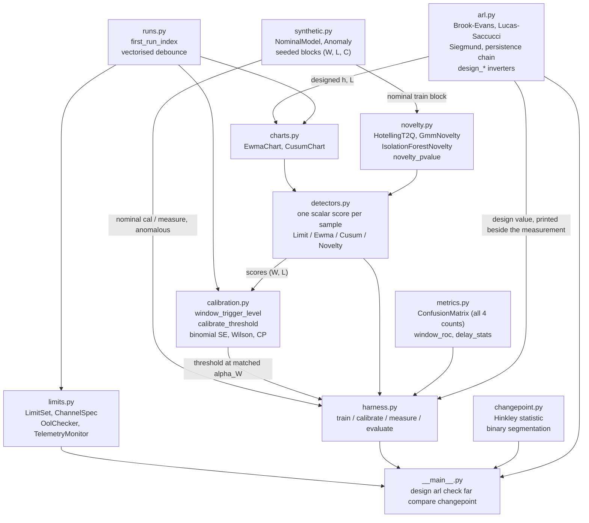
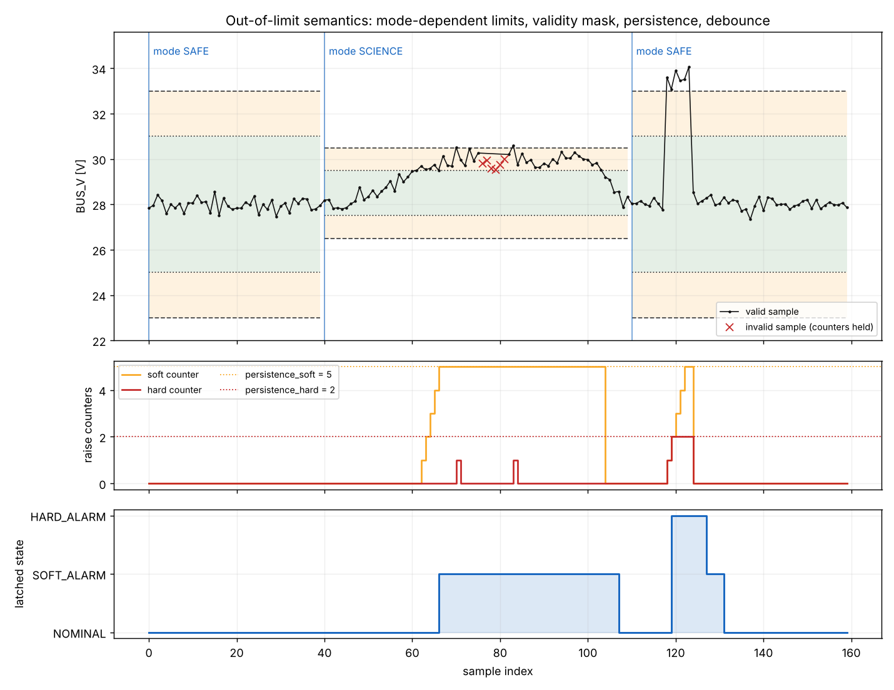
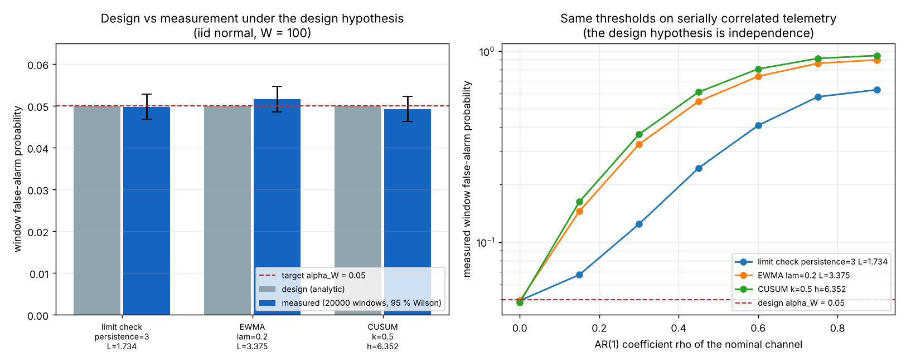
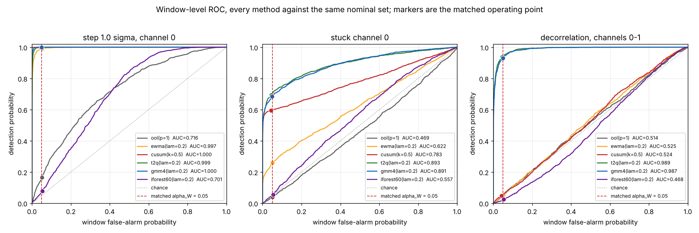
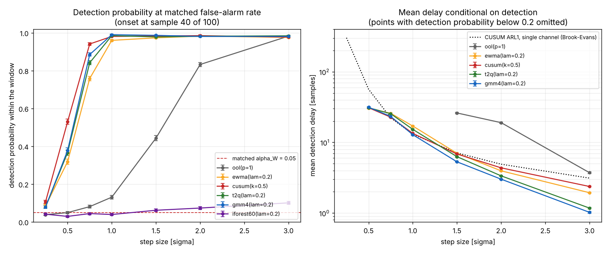

# TelemetryOOL

Out-of-limit checking for housekeeping telemetry, with false-alarm rates you designed rather than discovered.


**Status: TESTING** · Class: medium · Validation level 2 (research grade) ·
machine-learning components benchmarked against classical baselines ·
Apache-2.0 · © 2026 OPTIMA Organisation

This software is research-grade. It is **not flight-qualified, not certified,
and not approved for operational aerospace use.**

## The problem

A spacecraft housekeeping monitor is a limit table and an alarm, and the limit
table is necessary. What nobody characterises is the false-alarm rate the table
actually delivers on a noisy channel: the limits came from a thermal analysis,
the persistence count came from a meeting, and the resulting rate of nuisance
alarms is whatever it is. When someone proposes adding a detector on top, there
is no way to say what it costs, because the new detector's threshold and the old
limit table's threshold are not at the same operating point — so the faster
detector is always the one with the looser threshold.

## What this does

- **Designs a threshold from a false-alarm rate, instead of measuring the rate
  from a threshold.** `design_cusum_h`, `design_ewma_L` and `design_ool_limit`
  invert the Brook-Evans, Lucas-Saccucci and persistence-counter chains. Over
  160 000 nominal windows the delivered rate matched the design to
  **−0.86 %, −0.34 % and +1.20 %** (z = −0.79, −0.31, +1.10 at a pooled binomial
  standard error of 0.0005449) — `validation/validate_far_design.py`.
- **Implements out-of-limit checking with the semantics an operator needs**, not
  a threshold comparison: soft and hard limits, three explicit validity-mask
  policies, separate raise and clear debounce counts, and mode-dependent limit
  tables. Two hand-worked traces, 26 samples across 6 fields each, are
  reproduced **exactly, with zero tolerance** —
  `validation/validate_persistence_trace.py`.
- **Compares detectors only at a matched false-alarm rate.** Six detectors
  calibrated to `alpha_W = 0.05` on 10 000 independent nominal windows deliver
  **0.04670 to 0.05615** on a further 20 000, all within 2.3 combined standard
  errors of the target — `validation/validate_matched_far.py`.
- **Checks its own detection delay against theory.** Measured CUSUM mean run
  length agrees with the Brook-Evans chain at every shift from 0 to 3 sigma,
  worst z = **+1.10**, with **zero censored runs** —
  `validation/validate_cusum_delay.py`.
- **Reports confusion matrices in full and names what lost.** All 30 method ×
  scenario matrices, four counts and six derived rates each. The Isolation
  Forest shipped here reaches **AUC 0.4253 — below chance** — on one scenario
  and is left in the table.

## Who it is for

- Anyone who has to answer "how many false alarms will this limit table
  produce?" with a number and an error bar rather than an opinion.
- Anyone who has been asked to justify adding an anomaly detector to an existing
  monitor and needs the comparison done at one operating point.
- Anyone implementing limit checking who wants the persistence, validity and
  mode-dependence bookkeeping already specified, hand-traced and tested.
- Anyone teaching CUSUM or EWMA who wants the ARL computed three ways — closed
  form, Markov chain and Monte Carlo — with the disagreements measured.

## Who it is not for

- **Anyone who wants the best available anomaly detector.** Use
  [`pyod`](https://pypi.org/project/pyod/). It ships dozens of one-class models
  behind a consistent interface, each given far more attention than this package
  could give. The two learned models here exist to be benchmarked, not to win.
- **Anyone with serially correlated telemetry who will take a designed threshold
  on trust.** At an AR(1) coefficient of only 0.3 the designed thresholds here
  deliver **7.3×, 6.4× and 2.3×** their design value. Prewhitening is not
  implemented. This is measured, in section 2 of `validation/VALIDATION.md`, and
  it is the single most important caveat in this repository.
- **Anyone parsing CCSDS packets or frames.** There is no packet layer. Use
  [`ccsdspy`](https://pypi.org/project/ccsdspy/) or
  [`spacepackets`](https://pypi.org/project/spacepackets/).
- **Anyone needing streaming, concept-drift-aware online detection.** Use
  [`river`](https://pypi.org/project/river/).
- **Anyone needing optimal multiple-change-point segmentation.** Binary
  segmentation only; no PELT, no dynamic programming. Use
  [`ruptures`](https://pypi.org/project/ruptures/).
- **Anyone flying anything.** Research grade.

## Alternatives, honestly

This is the most crowded corner any of these tools could occupy. Every row below
is a mature package that does part of this better.

| Alternative | What it does better | When to use this instead |
|---|---|---|
| [`pyod`](https://pypi.org/project/pyod/) | A catalogue of one-class outlier detectors — kNN, LOF, ABOD, COPOD, ECOD, AutoEncoder, deep models — behind a uniform `fit`/`decision_function` interface, with far more model-level care than two detectors written for a comparison. | When you need an *operating point*, not a model. `pyod` gives you a score; it does not design a threshold to a false-alarm rate, and `contamination` is a training-set proportion, not a delivered window alarm probability. Use `pyod` for the score and this package's `calibrate_threshold` and `window_roc` to put it at a stated rate. **If a `pyod` model beats the Gaussian mixture here, use the `pyod` model.** It very plausibly will: nothing here is tuned. |
| [`alibi-detect`](https://pypi.org/project/alibi-detect/) | Drift and outlier detection with proper statistical drift tests (MMD, KS, chi-squared), online variants, and TensorFlow/PyTorch backends. | When the question is a *limit table's* behaviour rather than a distributional drift test — soft and hard bands, validity masks, debounce counts, mode dependence. `alibi-detect` has no notion of any of those. |
| [`river`](https://pypi.org/project/river/) | Genuine online learning: models that update per sample, with concept-drift detectors (ADWIN, Page-Hinkley, DDM) and bounded memory. | When the nominal distribution is stable and you want a *designed* rate against it. `river`'s drift detectors adapt to drift; a monitoring limit is supposed not to. Use `river` when the normal is moving. |
| [`ruptures`](https://pypi.org/project/ruptures/) | Change-point detection done properly: PELT, dynamic programming, window and bottom-up methods, many cost functions, penalty selection. | Only for the change-point module, and probably not even then. `telemetryool.changepoint` is binary segmentation with one cost function and a Monte-Carlo threshold. If change points are the task, use `ruptures`. |
| [`statsmodels`](https://pypi.org/project/statsmodels/) | Time-series modelling: ARIMA, state space, seasonal decomposition, diagnostics, hypothesis tests — the right tool for the serial correlation that breaks the designs here. | When you already have residuals and need the monitoring layer on top. `statsmodels` will whiten your channel; this will then design a threshold for the residual. They compose; neither replaces the other. |
| [`ccsdspy`](https://pypi.org/project/ccsdspy/), [`spacepackets`](https://pypi.org/project/spacepackets/) | Actual CCSDS packet and frame parsing. | Always, for that. This package starts from engineering-unit values and knows nothing about packets. |
| A limit table in the ground system | It is already deployed, already reviewed, and already integrated with the alarm bus. | When you want to know what that table's false-alarm rate actually is, or what adding a detector would cost at the same rate. That is the whole point of this package. |

### The narrow defensible claim

This package is **the operational out-of-limit semantics plus a comparison
harness that holds the false-alarm rate fixed**. It is *not* a better detector,
and the measurements in this repository say so: the classical Hotelling `T²`/`Q`
monitor captures almost all of the benefit of the Gaussian mixture (AUC 0.9888
vs 0.9893 on the decorrelation scenario; Pd 0.6585 vs 0.6600 on the stuck
channel, against a Monte-Carlo standard error of 0.0106), and the Isolation
Forest loses outright. What is hard to find elsewhere is a harness that makes
those sentences checkable.

## Install and first run

```bash
git clone https://github.com/OmAcharya-avtr/telemetryool.git
cd telemetryool
python -m venv .venv && source .venv/bin/activate
pip install -e ".[dev]"
python -m pytest tests/ -q
python examples/ool_operational_semantics.py
```

Expected output of that example:

```
channel BUS_V [V], 160 samples
SAFE    limits: soft 25.0-31.0 V, hard 23.0-33.0 V
SCIENCE limits: soft 27.5-29.5 V, hard 26.5-30.5 V
persistence_soft=5 persistence_hard=2 clear_persistence=4 invalid_policy=HOLD
invalid samples: indices 76-81 inclusive (6 samples)

  idx        V  valid     mode     level  soft  hard  below        state  event
   66   29.501      1  SCIENCE      SOFT     5     0      0   SOFT_ALARM  RAISE
  107   28.572      1  SCIENCE  IN_LIMIT     0     0      0      NOMINAL  CLEAR
  119   33.074      1     SAFE      HARD     2     2      0   HARD_ALARM  RAISE
  127   28.273      1     SAFE  IN_LIMIT     0     0      0   SOFT_ALARM  CLEAR
  131   28.306      1     SAFE  IN_LIMIT     0     0      0      NOMINAL  CLEAR

samples per latched state: {'NOMINAL': 107, 'SOFT_ALARM': 45, 'HARD_ALARM': 8}
final latched state: NOMINAL
wrote .../screenshots/ool_operational_semantics.png
```

The test suite reports `241 passed`.

## A worked example

```python
import numpy as np
from telemetryool import (
    ChannelSpec, LimitSet, OolChecker, CusumChart,
    design_cusum_h, calibrate_threshold, estimate_rate, any_run,
)

# 1. Operational limit check: soft and hard limits, debounce, mode-dependent table.
spec = ChannelSpec(
    name="BATT_T", units="degC",
    limits={"SAFE":    LimitSet(soft_low=-5.0, soft_high=35.0,
                                hard_low=-15.0, hard_high=45.0),
            "SCIENCE": LimitSet(soft_low=5.0,  soft_high=25.0,
                                hard_low=0.0,  hard_high=30.0)},
    persistence_soft=3, persistence_hard=1, clear_persistence=2,
)
checker = OolChecker(spec, mode="SCIENCE")
for s in checker.update_series([20.0, 26.0, 26.0, 26.0, 20.0, 20.0]):
    print(f"  t={s.index}  {s.value:5.1f} {spec.units}  level={s.level.name:8s}"
          f"  soft_count={s.soft_count}  state={s.state.name}")

# 2. Design a CUSUM for a stated false-alarm rate, then measure what it delivers.
design = design_cusum_h(target_alpha_w=0.05, k=0.5, window_length=100)
chart = CusumChart(k=0.5, h=design.threshold)
rng = np.random.default_rng(7)
nominal = rng.standard_normal((20_000, 100))          # 20000 nominal windows
alarms = any_run(chart.breach_mask(nominal), persistence=1)
measured = estimate_rate(int(alarms.sum()), alarms.size)
print(f"\n  designed h        = {design.threshold:.6f} sigma"
      f"   (ARL0 = {design.arl0:.1f} samples)")
print(f"  design   alpha_W  = {design.achieved_alpha_w:.6f}")
print(f"  measured alpha_W  = {measured.rate:.6f} +/- {measured.standard_error:.6f}"
      f"   z = {measured.z_against(design.achieved_alpha_w):+.2f}")

# 3. Or calibrate any score to the same operating point, with no analytic design.
two_sided = np.maximum(*chart.arms(nominal))
cal = calibrate_threshold(two_sided, persistence=1, target_alpha_w=0.05)
print(f"  empirical h       = {cal.threshold:.6f} sigma"
      f"   ({cal.n_alarming} of {cal.n_calibration_windows} windows alarm)")
```

Actual output:

```
  t=0   20.0 degC  level=IN_LIMIT  soft_count=0  state=NOMINAL
  t=1   26.0 degC  level=SOFT      soft_count=1  state=NOMINAL
  t=2   26.0 degC  level=SOFT      soft_count=2  state=NOMINAL
  t=3   26.0 degC  level=SOFT      soft_count=3  state=SOFT_ALARM
  t=4   20.0 degC  level=IN_LIMIT  soft_count=0  state=SOFT_ALARM
  t=5   20.0 degC  level=IN_LIMIT  soft_count=0  state=NOMINAL

  designed h        = 6.351523 sigma   (ARL0 = 1802.8 samples)
  design   alpha_W  = 0.050000
  measured alpha_W  = 0.047000 +/- 0.001497   z = -1.95
  empirical h       = 6.299142 sigma   (1000 of 20000 windows alarm)
```

The analytic design and the purely empirical calibration land 0.8 % apart on the
same threshold, from completely different routes.

## Architecture



The one thing worth noticing: nothing reaches `harness.py` without passing
through `calibration.py` first. A detector cannot enter a comparison table
without a threshold set on independent nominal data.

## Screenshots



The same voltage excursion is in-limit in SAFE mode and a soft alarm in SCIENCE
mode — notice the limit bands changing at sample 40 and 110. The red crosses at
76–81 are invalid samples: under `InvalidPolicy.HOLD` the soft counter in the
middle panel holds flat across them instead of resetting, so the run is not
broken by a telemetry gap. The latch in the bottom panel clears HARD → SOFT →
NOMINAL in two steps at 127 and 131, four in-limit samples apart.



Left: the design value and the measurement agree for all three charts, and the
95 % Wilson intervals straddle the target — those intervals are the point, since
a bar chart without them would be a claim rather than a measurement. Right: the
same thresholds on serially correlated data. By rho = 0.3 the CUSUM is
delivering 36 % of windows with a false alarm against a design of 5 %. Read the
right panel before you trust the left one.



Every curve is against the same nominal set, and the marker on each is the
calibrated operating point — all six sit on the red line at `alpha_W = 0.05`,
which is what "matched" means. Middle panel: the limit check is *below* the
chance diagonal on a stuck channel. Right panel: the three univariate methods
are indistinguishable from chance against a decorrelation, and the Isolation
Forest is worse.



Both panels are needed. On the left, the Isolation Forest sits on the matched
false-alarm line at every shift size: it detects nothing. On the right, the
measured curves fall below the analytic single-channel CUSUM ARL1 because the
chart is already warm when the step arrives at sample 40.

## Validation evidence

Full detail, including all 30 confusion matrices, is in
[`validation/VALIDATION.md`](validation/VALIDATION.md). Every number came from a
script in `validation/`, whose raw stdout is committed beside it.

| Check | Reference | Result | Tolerance / band | Verdict |
|---|---|---|---|---|
| Persistence and debounce reproduce two hand traces | hand trace in `tests/test_persistence.py` | 156 of 156 fields match | exact, zero tolerance | **PASS** |
| CUSUM `alpha_W`, 160 000 nominal windows | Brook & Evans 1972 chain | design 0.0500000, measured 0.0495688, z = −0.79 | \|z\| < 3.5 pooled SE (0.0005449) | **PASS** |
| EWMA `alpha_W`, 160 000 nominal windows | Lucas & Saccucci 1990 chain | design 0.0500000, measured 0.0498313, z = −0.31 | same | **PASS** |
| Limit-check `alpha_W`, persistence 3, 160 000 windows | exact persistence-counter chain | design 0.0500000, measured 0.0506000, z = +1.10 | same | **PASS** |
| CUSUM mean run length at δ = 0 | Brook-Evans, 1600 states | 3627.51 analytic, 3617.06 ± 57.48 measured, z = −0.18 | \|z\| < 3.5 | **PASS** |
| CUSUM detection delay at δ = 1.0 | Brook-Evans | 13.0740 analytic, 13.1092 ± 0.1002 measured, z = +0.35 | \|z\| < 3.5 | **PASS** |
| CUSUM detection delay at δ = 2.0 | Brook-Evans | 4.9103 analytic, 4.8982 ± 0.0224 measured, z = −0.54 | \|z\| < 3.5 | **PASS** |
| Brook-Evans discretisation at the package default | 6400-state reference | relative error 4.33e-07 at 400 states | < 1e-3 | **PASS** |
| Siegmund 1985 closed form vs the chain | Brook-Evans, δ ∈ [0, 3] | 9.78e-03 at δ = 0, 1.14e-02 at δ = 1.5, **6.17e-02 at δ = 3** | 2 % relative, stated beforehand | **FAILED — reported, band not widened** |
| Two-sided competing-risks combination | Monte Carlo, 4 000 runs | about 1 % relative, z = +0.42 / −1.21 / +2.17 | \|z\| < 3.5 | **PASS** |
| Change-point false-alarm rate, 40 000 replicates | target 0.05 | 0.0505500 ± 0.0010954, z = +0.36 | \|z\| < 3.5 combined SE | **PASS** |
| Change-point localisation at 3 sigma | 1 000 seeds, true τ = 120 | within 2 samples 99.8 % of the time | ≥ 95 % | **PASS** |
| Six detectors matched to `alpha_W = 0.05` | 10 000 cal + 20 000 independent measurement windows | delivered 0.04670 to 0.05615; worst z = +2.30 (`iforest60`) | \|z\| < 3.5 combined SE (0.0026693) | **PASS** |
| CUSUM beats a limit check on a 1 sigma step at matched FAR | Page 1954 | CUSUM Pd 0.9875 delay 13.63; limit check Pd 0.1485 delay 29.61 | qualitative, both must hold | **PASS** |
| No univariate method sees a pure decorrelation | construction of the anomaly | Pd 0.0320, 0.0355, 0.0345 | all < 0.2 | **PASS** |
| Designed `alpha_W` survives serial correlation | AR(1), rho = 0.3 | **7.3× (CUSUM), 6.4× (EWMA), 2.3× (limit check)** | — | **Reported as a limitation, not a check** |
| Isolation Forest earns its place | matched-FAR comparison | Pd 0.0000–0.0430; AUC 0.4253–0.6716; **below chance** on decorrelation | — | **Lost; kept in the table** |
| Limit check on a stuck channel | matched-FAR comparison | **AUC 0.4677, below chance** | — | **Reported as measured** |

### What the comparison concluded

| Scenario | Fastest at matched FAR (Pd ≥ 0.5) | Its Pd | Its mean delay | Best AUC |
|---|---|---|---|---|
| step 1.0 sigma | `gmm4` | 0.9855 | 11.90 | `cusum` (1.0000) |
| step 0.5 sigma | `cusum` | 0.5510 | 31.41 | `gmm4` (0.8639) |
| drift 0.05 sigma/sample | `gmm4` | 0.9800 | 22.89 | `ewma` (1.0000) |
| stuck channel | `t2q` | 0.6585 | 15.65 | `gmm4` (0.8874) |
| decorrelation | `gmm4` | 0.9340 | 17.46 | `gmm4` (0.9893) |

The Gaussian mixture is the fastest on three of five scenarios, but its margin
over the classical `T²`/`Q` monitor is inside or near the Monte-Carlo error
(0.9893 vs 0.9888 AUC; 0.6600 vs 0.6585 Pd). The real split is multivariate
versus univariate, not learned versus classical. **If you want a better
detector, use `pyod`** — and then calibrate it here.

## API reference

<details>
<summary>Out-of-limit checking (<code>telemetryool.limits</code>)</summary>

| Symbol | One line |
|---|---|
| `LimitSet(soft_low, soft_high, hard_low, hard_high)` | Four ordered bounds in engineering units; any may be `None`. Validates the ordering at construction. |
| `LimitSet.symmetric(centre, soft, hard)` | Limit set at `centre ± soft` and `centre ± hard`, same units. |
| `LimitSet.level(value) -> BreachLevel` | `IN_LIMIT`, `SOFT` or `HARD`; comparisons are strict, so a value on a bound is in limit. |
| `ChannelSpec(name, units, limits, persistence_soft, persistence_hard, clear_persistence, invalid_policy, latch_across_mode_change)` | Monitoring configuration for one channel; `limits` maps mode name to `LimitSet` with `"*"` as fallback. |
| `OolChecker(spec, mode).update(value, valid, mode) -> OolSample` | One sample; the update order is specified in the docstring and hand-traced in the tests. |
| `OolChecker.update_series(values, valid, modes) -> list[OolSample]` | The same over a whole series. |
| `TelemetryMonitor(specs, mode).update(frame, valid, mode) -> dict` | A bank of checkers sharing a mode; raises on a missing or unknown channel. |
| `TelemetryMonitor.active_alarms() -> dict[str, AlarmState]` | Channels not currently `NOMINAL`. |
| `InvalidPolicy` | `HOLD` (counters untouched), `RESET` (counters zeroed), `BREACH` (counted as `HARD`). |
| `scale_limits(limit_set, factor) -> LimitSet` | Multiply every present bound, preserving `None`. |

</details>

<details>
<summary>Designed thresholds and run lengths (<code>telemetryool.arl</code>)</summary>

All thresholds are in sigma units; all run lengths in samples. Model: iid normal
deviates with known sigma.

| Symbol | One line |
|---|---|
| `design_cusum_h(target_alpha_w, k, window_length) -> ChartDesign` | Decision interval `h` delivering a target window false-alarm probability. |
| `design_ewma_L(target_alpha_w, lam, window_length) -> ChartDesign` | Control-limit multiplier `L` for the same. |
| `design_ool_limit(target_alpha_w, persistence, window_length) -> ChartDesign` | Limit multiplier `L` for a two-sided limit with a debounce count. |
| `cusum_arl_markov(delta, k, h, n_states)` | Two-sided CUSUM ARL, Brook & Evans (1972); error `O(1/n_states)`, 4.33e-07 at the default 400. |
| `cusum_arl_siegmund(delta, k, h)` | One-sided ARL, Siegmund (1985) closed form; within 1.2 % of the chain for δ ≤ 1.5, 6.2 % at δ = 3. |
| `cusum_arl_siegmund_two_sided(delta, k, h)` | The same combined over both arms as competing risks. |
| `ewma_arl_markov(delta, lam, limit_mult, n_states)` | Two-sided EWMA ARL, Lucas & Saccucci (1990), steady-state limits. |
| `ool_window_false_alarm(p_exceed, persistence, window_length)` | **Exact** probability of `persistence` consecutive breaches in `W` samples. |
| `ool_arl(p_exceed, persistence)` | Expected samples to a run of `persistence` breaches, closed form. |
| `cusum_window_false_alarm`, `ewma_window_false_alarm` | The same quantity for the charts, from their chains. |
| `ewma_sigma_z(lam)` | `sqrt(lam / (2 - lam))`, the steady-state sd of the EWMA statistic. |

</details>

<details>
<summary>Charts, change points and novelty models</summary>

| Symbol | One line |
|---|---|
| `EwmaChart(lam, limit_mult, persistence, time_varying_limits).run(u) -> ChartRun` | EWMA on standardised deviates; `run_windows` for a vectorised block. |
| `CusumChart(k, h, persistence).run(u) -> ChartRun` | Tabular two-sided CUSUM; `arms(u)` returns both arms. |
| `max_mean_shift_statistic(x, sigma, start, stop) -> SegmentStatistic` | Hinkley (1970) maximised standardised mean-shift statistic over one segment. |
| `calibrate_change_point_threshold(n_segments, alpha, n_simulations, rng)` | Monte-Carlo critical value with its own binomial standard error. |
| `detect_change_points(x, threshold, sigma, min_segment, max_depth) -> list[int]` | Binary segmentation; indices of the first sample after each change. |
| `HotellingT2Q(n_components, variance_target, inner_quantile)` | PCA `T²` plus residual `Q`, each normalised by its own nominal quantile. |
| `GmmNovelty(n_components, covariance_type, random_state)` | `−log p(x)` in nats under a Gaussian mixture. |
| `IsolationForestNovelty(n_estimators, max_samples, random_state)` | `−score_samples` from an Isolation Forest. |
| `NoveltyModel.novelty_pvalue(x, confidence) -> list[PValue]` | Calibrated tail p-value with a Clopper-Pearson interval and a resolution floor of `1/(1+n_cal)`. |

</details>

<details>
<summary>Calibration, metrics and the harness</summary>

| Symbol | One line |
|---|---|
| `window_trigger_level(scores, persistence)` | `max_t min(s[t:t+persistence])`: the largest threshold at which each window still alarms. |
| `calibrate_threshold(nominal_scores, persistence, target_alpha_w) -> Calibration` | Exact empirical quantile, not a bisection; raises if the target is unrepresentable. |
| `estimate_rate(successes, trials) -> RateEstimate` | Rate, binomial SE, Wilson and Clopper-Pearson intervals, and `z_against(design)`. |
| `windows_for_precision(alpha, relative_se) -> int` | How many windows a target precision needs. |
| `confusion_matrix(alarmed_anomalous, alarmed_nominal) -> ConfusionMatrix` | All four counts; `.table()` renders the full 2×2, `.summary()` the six derived rates. |
| `window_roc(nominal_scores, anomalous_scores, persistence) -> RocCurve` | Window-level ROC from `(0,0)` to `(1,1)` with trapezoidal AUC. |
| `delay_stats(anomalous_scores, threshold, persistence, onset) -> DelayStats` | Detection probability with its SE, and the delay quantiles conditional on detection. |
| `build_detector_suite(...) -> list[WindowDetector]` | The six detectors in baseline-first order. |
| `run_comparison(detectors, model, scenarios, ...) -> ComparisonResult` | Train, calibrate, measure, evaluate; `.far_table()`, `.delay_table()`, `.confusion_report()`. |

</details>

<details>
<summary>Command line</summary>

```
python -m telemetryool design       # thresholds that deliver a target window FAR
python -m telemetryool arl          # ARL for a chart, Markov chain and closed form
python -m telemetryool check        # run the OOL checker over a CSV column
python -m telemetryool far          # Monte-Carlo window false-alarm rate, with its SE
python -m telemetryool compare      # the matched-false-alarm-rate comparison
python -m telemetryool changepoint  # change-point detection over a CSV column
```

</details>

## Limitations

1. **Serial correlation breaks every designed threshold, badly.** The chart
   designs assume independent samples. Measured inflation of the delivered
   false-alarm rate with the designed thresholds unchanged: 7.3× (CUSUM), 6.4×
   (EWMA) and 2.3× (limit check) at an AR(1) coefficient of 0.3, rising to 19.0×,
   18.1× and 12.6× at 0.9. Housekeeping telemetry is usually correlated. Either
   prewhiten the channel (`statsmodels`) or calibrate the threshold empirically
   on the channel's own nominal history with `calibrate_threshold` — the package
   does neither automatically.
2. **The Siegmund closed form is out of band at large shifts.** 6.17 % relative
   error against the Brook-Evans chain at δ = 3, against a 2 % band stated before
   the measurement. Reported as FAILED; use `cusum_arl_markov` when the number
   matters.
3. **Two-sided ARLs use a competing-risks approximation** that treats the arms as
   independent when they share an observation. Measured error about 1 %, already
   a 2.17-sigma effect at δ = 2 with 4 000 runs.
4. **Everything is measured on synthetic data from this repository's own
   generator.** No real spacecraft telemetry was used anywhere. Gaussian
   marginals, no quantisation, no telemetry gaps, no mode-dependent nominal
   distribution. See `DATASET_CARD.md` for the full list.
5. **No hyperparameter search was done on the learned models.** Component count,
   tree count and smoothing weight were fixed from the compute budget before any
   result was read. The models are therefore not at their best achievable
   settings — which also means no table here is a product of tuning against the
   evaluation data.
6. **PyTorch is unavailable in the build environment**, so there is no
   autoencoder and no sequence model. A reconstruction autoencoder is the obvious
   next thing to try and is not here.
7. **The EWMA state resets at the start of each monitoring window**, so the first
   few samples of every window are in the start-up transient and the detection
   delay depends on the onset index. Every delay table states the onset.
8. **Change-point detection is binary segmentation only** — greedy, one cost
   function, no penalty selection, and known to be inconsistent when change
   points are close together. Use `ruptures` if this is the task.
9. **`telemetryool.limits` is consistent with the structure of the on-board
   monitoring service described in ECSS-E-ST-70-41C** (per-parameter limit
   checking with a mode-dependent limit set, a validity parameter and a
   repetition count), but it is **not** an implementation of that standard and
   makes no conformance claim.
10. **Compute budget.** Everything in this repository was built and measured on a
    single CPU core shared with four other build agents (`nproc = 1`). Measured
    wall times on that machine: test suite 14.4 to 21.6 s (241 tests); validation
    scripts 0.0 s, 5.2 s, 16.5 s, 1.8 s and 24.8 s; examples 2.4 s, 5.9 s, 10.6 s
    and 13.5 s. Repeat runs of the same seeded script varied by up to a factor of
    five on wall time purely from contention, while producing identical numbers.
    The heaviest single run scores 3.35 million samples through six detectors.
    Larger Monte Carlos would tighten every error bar quoted here and are the
    first thing to increase if you have more cores.

## Reproducing every number

```bash
# tests
PYTHONPATH=src python3 -m pytest tests/ -q            # 241 passed

# every validation number in this README and in validation/VALIDATION.md
cd validation
MPLBACKEND=Agg PYTHONPATH=../src python3 validate_persistence_trace.py
MPLBACKEND=Agg PYTHONPATH=../src python3 validate_far_design.py
MPLBACKEND=Agg PYTHONPATH=../src python3 validate_cusum_delay.py
MPLBACKEND=Agg PYTHONPATH=../src python3 validate_changepoint.py
MPLBACKEND=Agg PYTHONPATH=../src python3 validate_matched_far.py

# every screenshot
cd ../examples
MPLBACKEND=Agg PYTHONPATH=../src python3 ool_operational_semantics.py
MPLBACKEND=Agg PYTHONPATH=../src python3 far_design_vs_measured.py
MPLBACKEND=Agg PYTHONPATH=../src python3 roc_matched_far.py
MPLBACKEND=Agg PYTHONPATH=../src python3 detection_delay_curves.py
```

All seeds are fixed in the scripts; each validation script writes its own
`*_output.txt`, so the committed raw output and a fresh run cannot drift apart.

## References

- Page, E. S. (1954). "Continuous Inspection Schemes." *Biometrika* 41(1/2), 100–115.
- Roberts, S. W. (1959). "Control Chart Tests Based on Geometric Moving Averages." *Technometrics* 1(3), 239–250.
- Hinkley, D. V. (1970). "Inference about the change-point in a sequence of random variables." *Biometrika* 57(1), 1–17.
- Brook, D. and Evans, D. A. (1972). "An approach to the probability distribution of CUSUM run length." *Biometrika* 59(3), 539–549.
- Scott, A. J. and Knott, M. (1974). "A Cluster Analysis Method for Grouping Means in the Analysis of Variance." *Biometrics* 30(3), 507–512.
- Jackson, J. E. and Mudholkar, G. S. (1979). "Control Procedures for Residuals Associated with Principal Component Analysis." *Technometrics* 21(3), 341–349.
- Siegmund, D. (1985). *Sequential Analysis: Tests and Confidence Intervals*. Springer.
- Lucas, J. M. and Saccucci, M. S. (1990). "Exponentially Weighted Moving Average Control Schemes: Properties and Enhancements." *Technometrics* 32(1), 1–12.
- Wilson, E. B. (1927). "Probable Inference, the Law of Succession, and Statistical Inference." *JASA* 22(158), 209–212.
- Clopper, C. J. and Pearson, E. S. (1934). "The Use of Confidence or Fiducial Limits Illustrated in the Case of the Binomial." *Biometrika* 26(4), 404–413.
- Brown, L. D., Cai, T. T. and DasGupta, A. (2001). "Interval Estimation for a Binomial Proportion." *Statistical Science* 16(2), 101–133.
- Fawcett, T. (2006). "An introduction to ROC analysis." *Pattern Recognition Letters* 27(8), 861–874.
- Liu, F. T., Ting, K. M. and Zhou, Z.-H. (2008). "Isolation Forest." *Proc. 8th IEEE ICDM*, 413–422.
- Killick, R., Fearnhead, P. and Eckley, I. A. (2012). "Optimal Detection of Changepoints With a Linear Computational Cost." *JASA* 107(500), 1590–1598.
- Montgomery, D. C. (2013). *Introduction to Statistical Quality Control*, 7th ed. Wiley, ch. 9.
- Fryzlewicz, P. (2014). "Wild binary segmentation for multiple change-point detection." *Annals of Statistics* 42(6), 2243–2281.
- ECSS-E-ST-70-41C (2016). *Telemetry and telecommand packet utilization*. ESA Requirements and Standards Division. Cited for the structure of the on-board monitoring service only; no conformance is claimed.

## Licence

Apache License 2.0. See [`LICENSE`](LICENSE). Copyright © 2026 OPTIMA
Organisation.

## Citation

See [`CITATION.cff`](CITATION.cff).

## Credits

This is under reserved rights obtained by OPTIMA Organisation.
