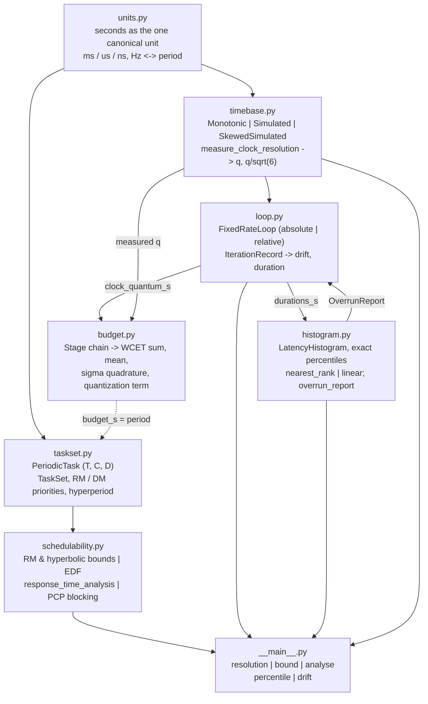
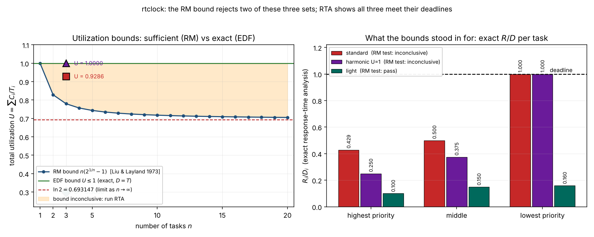
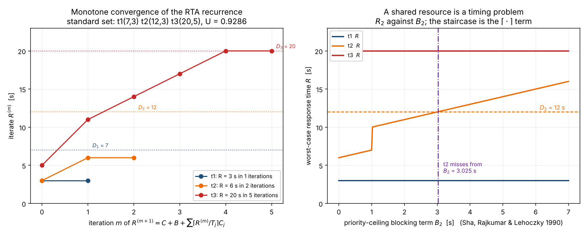
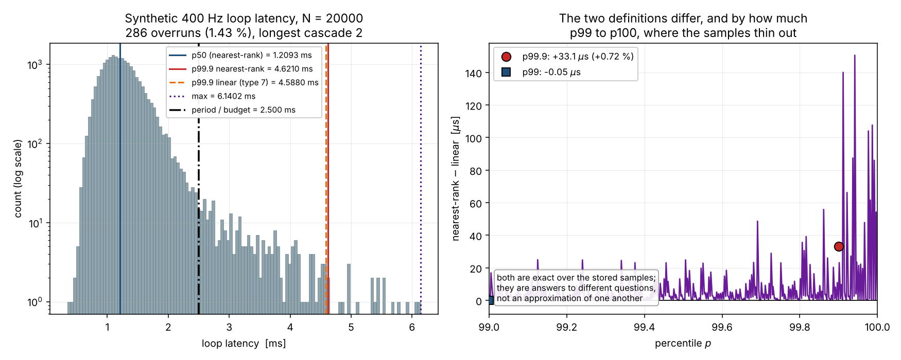
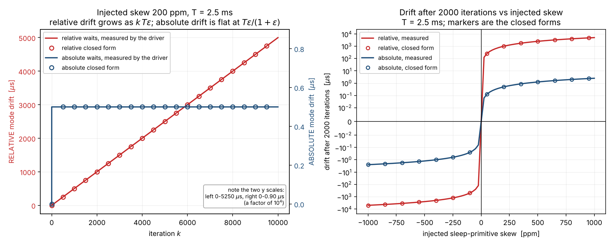

# RtClock

Real-time timing arithmetic and schedulability analysis for Python control loops.


**Status: TESTING** · Class: compact · Validation level 1
(educational to research grade) · no machine-learning components · MIT ·
© 2026 OPTIMA Organisation

## The problem

Someone writes `while True: step(); time.sleep(0.0025)` for a 400 Hz loop, and
six months later the log shows the loop running at 399.94 Hz with no single
iteration ever obviously late — the sleep is relative, so a 150 ppm timer
error adds up at 0.375 µs per iteration and nothing ever flags it. Someone
else computes `sum(C_i/T_i) = 0.93`, reads that the rate-monotonic bound for
three tasks is 0.78, and declares the set unschedulable, when exact
response-time analysis says every task meets its deadline. A third person
quotes "p99.9 latency is 4.59 ms" from one library and "4.62 ms" from another
and cannot say which is right, because neither said which percentile
definition it used. All three are arithmetic problems, and all three are
solved on paper before any code runs.

## What this does

- **Reports drift instead of absorbing it.** `FixedRateLoop` computes its
  wait either against the absolute release instant or as a fixed interval,
  and records `start_k − (t0 + k·T)` for every iteration. Under a +200 ppm
  injected skew at T = 1 ms over 50 000 iterations, relative waits drift
  **9.999800000323e-03 s** and absolute waits **1.999600058866e-07 s** — a
  factor of **50 009** — both matching their closed forms to 3.2e-11 and
  1.1e-08 relative (`validation/validate_loop_drift.py`).
- **Measures the clock rather than assuming it.** On the machine that built
  this repository, `time.monotonic` advertises 1 ns and delivers an
  observable tick of **5.300000e-08 s** from 400 000 back-to-back reads, with
  a worst-case duration error of **± 5.3e-08 s** and a standard uncertainty of
  **2.163716e-08 s** (`q/√6`, JCGM 100:2008). That error term is carried
  wherever a timing number is reported
  (`validation/validate_clock_resolution.py`).
- **Separates sufficient tests from exact ones, in the type system.** Every
  `SchedulabilityResult` carries `strength ∈ {sufficient, necessary, exact}`.
  The Liu & Layland bound reproduces **0.828427124746190** at n = 2 and
  **ln 2 = 0.6931471805599453** in the limit, verified against 40-digit
  decimal arithmetic to **5.551e-16**
  (`validation/validate_utilization_bounds.py`).
- **Computes exact worst-case response times, and shows its working.**
  `ResponseTime.iterates` keeps the whole fixed-point sequence, so a hand
  computation can be checked term by term. Four published-style task sets
  reproduce their hand-computed values to **0.00e+00**
  (`validation/validate_response_times.py`).
- **Names the percentile definition, every time.** Two definitions,
  `nearest_rank` and `linear` (Hyndman & Fan type 7), no silent default. The
  first matches an explicit order statistic **bit-exactly** over 110
  comparisons; the second matches `numpy.percentile` to **1.084e-19 s**
  (`validation/validate_percentiles.py`).

## Who it is for

- Anyone whose control loop has a period and a deadline and who wants the
  schedulability arithmetic done with the references, the units and the
  validity ranges attached, rather than a half-remembered bound.
- Anyone reporting a tail latency who has been asked "which p99?" and wants
  an answer that is a property of the code, not of the library version.
- Anyone who needs the drift of a fixed-rate loop characterised against an
  injected skew, deterministically, without a hardware timer.
- Students and educators: six modules of plain Python with no dependencies
  outside the standard library, every equation cited, and the hand
  computations printed in the validation output.

## Who it is not for

- **Anyone who needs real-time behaviour delivered.** This is analysis, not a
  kernel. CPython on a general-purpose OS has unbounded garbage-collection
  pauses, GIL contention and OS scheduling latency. On the 1-core container
  that built this repository, a 2 ms loop reached a worst drift of **4.58 ms**
  while four build agents shared the core. Use PREEMPT_RT, a real-time OS, or
  an MCU.
- **Anyone profiling a running process.** There is no sampling profiler, no
  per-thread CPU accounting, no flame graph. Use `py-spy` or `psutil`.
- **Anyone logging millions of latency samples.** Every sample is stored so
  that percentiles are exact; that is ~60 MB per million samples in CPython.
  Use `hdrhistogram`.
- **Anyone needing multiprocessor or hierarchical scheduling analysis,** the
  exact processor-demand criterion for constrained deadlines, or arbitrary
  deadlines (`D > T`). None of those are implemented.
- **Anyone simulating a scheduler.** There is no event queue and no
  simulation of preemption. Use `simpy`.

## Alternatives, honestly

| Alternative | What it does better | When to use this instead |
|---|---|---|
| [`hdrhistogram`](https://pypi.org/project/hdrhistogram/) | Constant-memory latency recording with a bounded relative error, designed for high-rate production use; records to a file format with established tooling. | When the sample count is small enough to store exactly and you want percentiles that are provably the order statistics of *those* samples, with the definition named at the call site. `hdrhistogram` returns a bucket's value, which is within its configured precision of the true one — correct and documented, but not the same claim. |
| [`psutil`](https://pypi.org/project/psutil/) | Process and system measurement: CPU times, memory, I/O counters, thread enumeration, CPU affinity. Cross-platform, mature. | When the question is about the *schedule* rather than the *process*. `psutil` will tell you a process used 43 % CPU; it will not tell you whether a 3-task set at U = 0.93 meets its deadlines. Use both. |
| [`py-spy`](https://pypi.org/project/py-spy/) | Sampling profiler that attaches to a running CPython process without instrumenting it, producing flame graphs and per-line timings. | When you already know *where* the time goes and need to know whether the budget composes and whether the loop will drift. `py-spy` finds the slow function; this decides whether the slow function fits. |
| [`simpy`](https://pypi.org/project/simpy/) | General discrete-event simulation: processes, resources, event queues. You can build a scheduler simulation in it. | When you want the closed-form or fixed-point answer rather than a simulation of it. RTA gives the exact worst case for the model in a handful of iterations; a simulation gives one sample path and cannot prove a worst case. Use `simpy` when the model is richer than the periodic task model. |
| Writing the bound inline | Nothing to install. | When you want `n(2^(1/n)-1)`, the EDF condition, the RTA recurrence and priority-ceiling blocking with their assumptions, validity ranges and the sufficient/exact distinction attached — and a validation suite that reproduces the textbook values rather than asserting them. |

**The narrow defensible claim.** This package is *the arithmetic and the
schedulability analysis, held to Level 1 rigor, with units, references,
validity ranges and stated percentile semantics*. It is **not** a real-time
kernel, **not** a scheduler, and **not** a profiler. CPython on a
general-purpose operating system is not a real-time platform: this product
**analyses** timing, it does not **deliver** it.

## Install and first run

```bash
git clone https://github.com/OmAcharya-avtr/rtclock.git
cd rtclock
python -m venv .venv && source .venv/bin/activate
pip install -e ".[dev]"
python -m pytest tests/ -q
python examples/schedulability_bounds.py
```

Expected output of the test run:

```
252 passed in 21.04s
```

Expected output of the first example:

```
wrote .../screenshots/schedulability_bounds.png

RM bound n=1..10: ['1.000000', '0.828427', '0.779763', '0.756828', '0.743492',
                   '0.734772', '0.728627', '0.724062', '0.720538', '0.717735']
ln 2            : 0.693147180560
standard (7,3) (12,3) (20,5)       U = 0.928571  RM test inconclusive R/D = ['0.4286', '0.5000', '1.0000']
harmonic U=1 (4,1) (8,2) (16,8)    U = 1.000000  RM test inconclusive R/D = ['0.2500', '0.3750', '1.0000']
light (10,1) (20,2) (50,5)         U = 0.300000  RM test pass         R/D = ['0.1000', '0.1500', '0.1600']
```

## A worked example

```python
from rtclock import (
    FixedRateLoop, LatencyHistogram, PeriodicTask, SkewedSimulatedTimebase,
    TaskSet, measure_clock_resolution, response_time_analysis, rm_utilization_test,
)

# 1. Is the task set schedulable? The bound says nothing; RTA is exact.
ts = TaskSet([
    PeriodicTask("sense",   period_s=7.0,  wcet_s=3.0),
    PeriodicTask("estimate", period_s=12.0, wcet_s=3.0),
    PeriodicTask("control",  period_s=20.0, wcet_s=5.0),
]).rate_monotonic()

bound = rm_utilization_test(ts)
print(f"U = {ts.total_utilization:.6f}, bound = {bound.bound:.6f}, "
      f"{bound.strength} test says {bound.schedulable}")
for rt in response_time_analysis(ts):
    print(f"  {rt.name:<9} R = {rt.response_s:5.1f} s  D = {rt.deadline_s:5.1f} s  "
          f"slack = {rt.slack_s:+5.1f} s  iterates {list(rt.iterates)}")

# 2. What does a +200 ppm timer error do to a 2.5 ms loop over 10 000 cycles?
for mode in ("relative", "absolute"):
    tb = SkewedSimulatedTimebase(skew_ppm=200.0)
    report = FixedRateLoop(period_s=2.5e-3, timebase=tb, mode=mode).run(iterations=10_000)
    print(f"  {mode:<9} final drift {report.final_drift_s * 1e6:9.3f} us, "
          f"slope {report.drift_slope_s_per_iteration() * 1e9:7.3f} ns/iter")

# 3. What is the clock worth on this machine, and what is p99 of a trace?
res = measure_clock_resolution(samples=200_000)
print(f"  observable tick {res.measured_tick_s * 1e9:.1f} ns, "
      f"u = {res.standard_duration_uncertainty_s * 1e9:.1f} ns")
h = LatencyHistogram(samples=[1e-3, 2e-3, 3e-3, 4e-3, 5e-3, 6e-3, 7e-3, 8e-3, 9e-3, 1e-2])
print(f"  p99 nearest-rank {h.percentile(99.0, 'nearest_rank') * 1e3:.3f} ms, "
      f"linear {h.percentile(99.0, 'linear') * 1e3:.3f} ms")
```

Actual output:

```
U = 0.928571, bound = 0.779763, sufficient test says False
  sense     R =   3.0 s  D =   7.0 s  slack =  +4.0 s  iterates [3.0, 3.0]
  estimate  R =   6.0 s  D =  12.0 s  slack =  +6.0 s  iterates [3.0, 6.0, 6.0]
  control   R =  20.0 s  D =  20.0 s  slack =  +0.0 s  iterates [5.0, 11.0, 14.0, 17.0, 20.0, 20.0]
  relative  final drift  4999.500 us, slope 500.000 ns/iter
  absolute  final drift     0.500 us, slope   0.000 ns/iter
  observable tick 54.0 ns, u = 22.0 ns
  p99 nearest-rank 10.000 ms, linear 9.910 ms
```

The clock line varies between runs; it is a measurement of the host.

## Architecture



No module imports another product. Nothing imports anything outside the
standard library; NumPy and matplotlib are used only by the tests, validation
scripts and examples.

## Screenshots



The shaded band on the left is the region where the rate-monotonic bound says
nothing — the square at U = 0.9286 and the triangle at U = 1.0000 both sit in
it, and the right panel shows that exact response-time analysis passes both.
Notice that the lowest-priority task of each of those two sets lands at
R/D = 1.000 exactly: no slack at all, which no utilization bound could have
told you.



Left: the recurrence is monotone non-decreasing and stops at the first fixed
point — five iterations for the lowest-priority task, landing exactly on its
20 s deadline. Right: sweeping a priority-ceiling blocking term on the middle
task shows the staircase that the ceiling function in the recurrence produces,
and the deadline crossing at B₂ = 3.025 s in the swept grid.



Left: a synthetic 400 Hz trace with the budget and both p99.9 values marked —
the two definitions are 33 µs apart on the same 20 000 samples. Right: the
difference between them across p99 to p100, where the samples thin out. Both
are exact; they answer different questions.



Left: note the two y scales, which differ by a factor of 10⁴. Relative waits
drift linearly at kTε; absolute waits sit flat at Tε/(1+ε). Right: the same
contrast across injected skews from −1000 to +1000 ppm, with the closed forms
as open markers on top of the measured curves.

## Validation evidence

Full detail in [`validation/VALIDATION.md`](validation/VALIDATION.md); every
number below comes from a committed script and its committed raw output.

| Check | Reference | Result | Tolerance |
|---|---|---|---|
| RM bound `n(2^(1/n)-1)`, n = 1…10 | Liu & Layland 1973 Thm 5, vs 40-digit `decimal` | worst diff **5.551e-16** | 5e-13 abs |
| `U_lub(2)` vs textbook 0.8284 | Liu & Layland 1973 | **0.8284271247461903** | 5e-5 abs |
| `U_lub(n) → ln 2` | Liu & Layland 1973 | 0.6931474207938493 at n = 10⁶ vs ln 2 = 0.6931471805599453 | 2.5e-7 abs |
| Asymptotic `(ln2)²/(2n)` correction | series expansion | ratio **1.000023** at n = 10⁴ | 1 % |
| Hyperbolic bound dominance, 200 000 random sets | Bini, Buttazzo & Buttazzo; Buttazzo 2011 §4.3 | **0** sets accepted by L&L and rejected by hyperbolic | exact |
| RTA vs hand computation, 4 task sets, full iterate sequences | Joseph & Pandya 1986; Audsley et al. 1993 | all diffs **0.00e+00** | 1e-12 s |
| Priority-ceiling blocking terms | Sha, Rajkumar & Lehoczky 1990 | B = {0, 0, 1.0, 0} s, hand-computed match | exact |
| `nearest_rank` vs explicit order statistic, 110 comparisons | order-statistic definition | worst deviation **0.0e+00** | bit-exact required |
| `linear` vs `numpy.percentile(method="linear")` | Hyndman & Fan 1996 Def. 7 | worst deviation **1.084e-19 s** | 1e-16 s |
| Loop drift vs closed form, relative mode, 30 000 comparisons | derived in `rtclock.loop` | worst **5.709e-13 s**, 7.1 % of tolerance | 1e-9 rel + roundoff floor |
| Loop drift vs closed form, absolute mode, 30 000 comparisons | derived in `rtclock.loop` | worst **3.385e-15 s**, 8.8 % of tolerance | 1e-9 rel + roundoff floor |
| Skew recovered from drift slope | `slope / T` | −1000 ppm → **−1000.000000020 ppm** | 1e-6 rel |
| Overrun boundary at one ulp | strict `>` convention | equal → 0, `nextafter(+)` → 1 | exact |
| Overrun count vs independent NumPy expression, on P031's trace | — | **176 and 176**, identical indices | exact |
| **Cross-check vs P031 HilForge, direct definition** | independent implementation, 1200-sample injected trace | **176 and 176**, every index identical | exact |
| **Cross-check vs P031 HilForge, cascade definition** | `FixedRateLoop` reproduces `s[i]=max(r[i],c[i-1])` | **307 and 307**, every index identical; longest run **16 and 16** | exact |

### Checks that did not produce a clean pass

| Item | What happened |
|---|---|
| **P031 / P036 overrun cross-check** | **Completed, and it agrees** — but only on the second attempt. P031's file did not exist on the first validation run, so P036 defined its own trace and recorded the cross-check as pending. On a re-run after P031 published, rtclock recomputed over P031's 1200-sample trace and matched **176 direct overruns and 307 cascade overruns**, with identical index lists for both. The first-run state is recorded here because the gate re-runs everything and the pending state is what a fresh clone would see if P031 were missing. |
| **Nearest-rank at p = 99.9** | The binary64 value of 99.9 makes `p/100 * N` land at 19980.000000000004 for N = 20000, so the rank is 19981 rather than 19980. This is **documented and pinned by a test rather than fixed**, because a tolerance would make the result depend on an undocumented epsilon. Error bounded by one order statistic. |
| **Real-clock drift on the build host** | **Reported, not asserted.** 300 iterations at a 2 ms period reached a worst drift of **4.581682e-03 s** with **6 late releases of 300**, on a 1-core container shared by four build agents. Published because hiding it would misrepresent what CPython on a general-purpose OS does. |
| **Clock-tick repeatability** | Ten measurements of the same clock gave **5.2e-08 to 5.7e-08 s**, a spread of **9.3 %** of the median. The measured tick is also an *upper bound* on the hardware granularity, since no two successive reads were ever identical. |

## API reference

<details>
<summary><strong>Full public surface, with units</strong></summary>

### `rtclock.units`

| Function | Returns |
|---|---|
| `s_to_ns(seconds)` / `ns_to_s(nanoseconds)` | s ↔ ns |
| `s_to_us(seconds)` / `us_to_s(microseconds)` | s ↔ µs |
| `s_to_ms(seconds)` / `ms_to_s(milliseconds)` | s ↔ ms |
| `frequency_to_period(frequency_hz)` | period, s |
| `period_to_frequency(period_s)` | rate, Hz |

### `rtclock.timebase`

| Name | Description |
|---|---|
| `Timebase` | Protocol: `now() -> s`, `sleep(duration_s)` |
| `MonotonicTimebase(resolution=None)` | Host `time.monotonic_ns`; `.resolution` measures once and caches |
| `SimulatedTimebase(start_s=0.0)` | Deterministic ideal clock |
| `SkewedSimulatedTimebase(skew_ppm, wake_delay_s, start_s)` | Deterministic clock whose sleep has rate error (ppm) and fixed latency (s) |
| `measure_clock_resolution(samples=20000, clock_name="monotonic")` | `ClockResolution`: advertised (s), measured tick (s), median per-read (s), identical fraction, method |
| `ClockResolution.worst_case_duration_error_s` | `q`, s |
| `ClockResolution.standard_duration_uncertainty_s` | `q/√6`, s |
| `duration_uncertainty_s(quantum_s)` | `q/√6`, s |

### `rtclock.taskset`

| Name | Description |
|---|---|
| `PeriodicTask(name, period_s, wcet_s, deadline_s=None, priority=None)` | T, C, D in s; larger priority = higher |
| `.utilization` / `.density` | `C/T` / `C/min(D,T)`, dimensionless |
| `.releases_in(window_s)` | `ceil(window/T)` |
| `TaskSet(tasks)` | `.total_utilization`, `.total_density`, `.all_implicit_deadlines` |
| `.rate_monotonic()` / `.deadline_monotonic()` | Copy with priorities assigned |
| `.by_priority()` / `.higher_priority_than(t)` / `.lower_priority_than(t)` | Ordering queries |
| `hyperperiod_s(periods_s, quantum_s=1e-9)` | LCM on an integer grid, s |

### `rtclock.schedulability`

| Name | Strength | Description |
|---|---|---|
| `rm_utilization_bound(n)` | — | `n(2^(1/n)-1)`, dimensionless |
| `rm_utilization_test(task_set)` | sufficient | Liu & Layland 1973 Thm 5 |
| `hyperbolic_bound_test(task_set)` | sufficient | `prod(U_i+1) <= 2` |
| `edf_test(task_set)` | exact (`D=T`) / sufficient (`D<T`) | `U <= 1` / density test |
| `response_time(task, higher_priority, blocking_s=0.0, max_iterations=10000)` | exact for the model | `ResponseTime` with the full iterate sequence |
| `response_time_analysis(task_set, blocking_s=None, ...)` | exact for the model | One `ResponseTime` per task, highest priority first |
| `priority_ceiling_blocking(task_set, critical_sections, ceilings=None)` | — | `{task: B_i}` in s, Sha et al. 1990 |

### `rtclock.histogram`

| Name | Description |
|---|---|
| `percentile(samples, p, method)` | `method ∈ {"nearest_rank", "linear"}`, exact over the samples |
| `LatencyHistogram(samples, label)` | `.add`, `.extend`, `.percentile`, `.minimum`, `.maximum`, `.mean`, `.stdev`, `.bucket_counts`, `.summary`, `.overruns` |
| `overrun_report(trace_s, budget_s)` | `OverrunReport`: count, indices, fraction, worst overshoot (s), longest consecutive run |

### `rtclock.loop`

| Name | Description |
|---|---|
| `FixedRateLoop(period_s, timebase, mode="absolute", deadline_s=None)` | `mode ∈ {"absolute", "relative"}` |
| `.run(body=None, iterations=100, clock_quantum_s=None)` | `LoopReport` |
| `LoopReport` | `.drifts_s`, `.durations_s`, `.max_abs_drift_s`, `.final_drift_s`, `.late_releases`, `.drift_slope_s_per_iteration()`, `.duration_histogram()`, `.overruns(budget_s=None)` |
| `relative_mode_drift(index, period_s, skew_ppm, wake_delay_s)` | `k·a`, s |
| `absolute_mode_drift(index, period_s, skew_ppm, wake_delay_s)` | `a(1−(−ε)^k)/(1+ε)`, s |

### `rtclock.budget`

| Name | Description |
|---|---|
| `Stage(name, wcet_s, mean_s=None, stdev_s=0.0)` | One stage, all in s |
| `compose_budget(stages, budget_s, clock_quantum_s=0.0)` | `BudgetResult`: WCET sum, mean sum, independent σ, fully-correlated σ bound, quantization term, margin, per-stage fractions |
| `BudgetResult.sigma_headroom(which)` | `(budget − mean)/σ`, dimensionless distance, not a probability |

### CLI

```
python -m rtclock resolution  [--samples N] [--clock monotonic|perf_counter]
python -m rtclock bound       N [N ...]
python -m rtclock analyse     name:T:C[:D] ... [--priority rm|dm]
                              [--critical-section TASK:SEM:DURATION_S]
python -m rtclock percentile  V [V ...] [--p P] [--method nearest_rank|linear]
python -m rtclock drift       --period T [--iterations N] [--skew-ppm X]
                              [--wake-delay S] [--mode absolute|relative]
```

</details>

## Limitations

1. **This is not a real-time platform and does not make Python into one.**
   CPython on a general-purpose OS has unbounded GC pauses, GIL contention
   and OS scheduling latency. The package analyses timing and reports what
   the clock saw; it does not reduce jitter.
2. **The response-time recurrence is exact only while `R_i <= T_i`.** Past a
   task's own period, more than one of its releases can be pending and the
   exact analysis requires the level-i busy period (Lehoczky 1990; Buttazzo
   2011 §4.6). The package reports the recurrence value, flags the deadline
   miss, and says the number is not the exact worst case in that regime.
   The deadline-miss verdict is sound either way.
3. **The EDF test for constrained deadlines is the density test, which is
   sufficient only.** The exact processor-demand criterion is not
   implemented. `edf_test` returns `strength="sufficient"` and says so.
4. **Arbitrary deadlines (`D > T`) are rejected,** not approximated.
   `PeriodicTask` raises.
5. **Single processor only.** No partitioned or global multiprocessor
   analysis, no hierarchical or server-based scheduling, no shared-cache or
   bus-contention modelling.
6. **Priority-ceiling blocking computes the blocking term, not deadlock
   freedom.** The arithmetic assumes properly nested critical sections, no
   suspension inside one, and worst-case durations supplied by the caller.
   The priority inheritance protocol's own (looser) bound is not implemented.
7. **The nearest-rank percentile inherits the binary64 representation of
   `p`.** `p = 99.9` with `N = 20000` gives rank 19981, not 19980. Documented
   and pinned by a test; the error is bounded by one order statistic. Index
   the sorted samples directly if you need an exact rank.
8. **`LatencyHistogram` stores every sample,** so memory is O(N): roughly
   60 MB per million samples in CPython. A 1 kHz loop logging for an hour is
   the wrong workload for it.
9. **The measured clock tick is an upper bound on hardware granularity.**
   On the build machine the identical-reading fraction was 0, meaning the
   read loop was slower than the clock. Ten repeat measurements spanned
   5.2e-08 to 5.7e-08 s, a 9.3 % spread.
10. **Statistical budget composition assumes independent stages for the
    quadrature σ.** Stages sharing a cache, a bus or a lock are positively
    correlated and the quadrature result then *underestimates* the spread.
    The fully-correlated upper bound `Σσ_i` is reported alongside for that
    reason. `sigma_headroom` is a distance, not a probability: execution-time
    distributions are right-skewed and a Gaussian tail estimate from it would
    be optimistic.
11. **WCET is an input, not an output.** Nothing here measures or bounds
    worst-case execution time. Supplying an optimistic `C` produces an
    optimistic answer with no warning.
12. **The P031/P036 cross-check is over a synthetic injected trace,** not a
    hardware measurement — P031's own file says so. It establishes that two
    independent implementations agree on the arithmetic, not that either one
    has been validated against hardware.
13. **Every timing number measured on the build host describes a shared
    1-core container running four concurrent build agents** and will not
    reproduce elsewhere. Those numbers are labelled and are never asserted
    against a bound.

## Reproducing every number

From `products/P036/`:

```bash
python -m pytest tests/ -q                               # 252 passed
ruff check src/ tests/ examples/ validation/             # clean

python validation/validate_utilization_bounds.py         # section 1
python validation/validate_response_times.py             # section 2
python validation/validate_percentiles.py                # section 3
python validation/validate_loop_drift.py                 # section 4
python validation/validate_clock_resolution.py           # section 5
python validation/validate_crosscheck_overruns.py        # section 6

python examples/schedulability_bounds.py                 # screenshots/
python examples/response_time_convergence.py
python examples/latency_histogram.py
python examples/loop_drift.py
```

Every validation script exits non-zero on failure and prints its own PASS or
FAIL verdict per check. The synthetic traces are generated from fixed seeds
(`numpy.random.default_rng(20261004)`), so they regenerate bit-exactly. The
clock-resolution numbers and the two "for the record" real-clock runs will
differ on every machine and on every run; that is the point of measuring them.

## Safety statement

This software is research-grade, at the educational-to-research tier. It is
not flight-qualified, not certified, and not approved for operational
aerospace use.

## Roadmap

- Exact processor-demand criterion for constrained-deadline EDF.
- Level-i busy-period analysis so that `R_i > T_i` returns the exact worst
  case rather than the recurrence value with a caveat.
- Release jitter and context-switch overhead as explicit terms in the RTA
  recurrence.
- The priority inheritance protocol blocking bound alongside the ceiling one.

## Licence

MIT. See [`LICENSE`](LICENSE). © 2026 OPTIMA Organisation.

## Citation

> C. L. Liu and J. W. Layland, "Scheduling Algorithms for Multiprogramming in
> a Hard-Real-Time Environment", *Journal of the ACM* **20**(1), 46–61 (1973).
> Theorem 5 (rate-monotonic least upper bound) and Theorem 7 (EDF).

> M. Joseph and P. Pandya, "Finding Response Times in a Real-Time System",
> *The Computer Journal* **29**(5) (1986).

> N. C. Audsley, A. Burns, M. Richardson, K. Tindell and A. J. Wellings,
> "Applying new scheduling theory to static priority pre-emptive scheduling",
> *Software Engineering Journal* **8**(5) (1993).

> L. Sha, R. Rajkumar and J. P. Lehoczky, "Priority Inheritance Protocols: An
> Approach to Real-Time Synchronization", *IEEE Transactions on Computers*
> **39**(9) (1990).

> G. C. Buttazzo, *Hard Real-Time Computing Systems: Predictable Scheduling
> Algorithms and Applications*, 3rd ed., Springer (2011). Textbook anchor for
> all of the above, and for the hyperbolic bound of Bini, Buttazzo and
> Buttazzo (Sec. 4.3) and the deadline-monotonic optimality result of Leung
> and Whitehead (Sec. 4.5).

> R. J. Hyndman and Y. Fan, "Sample Quantiles in Statistical Packages",
> *The American Statistician* **50**(4), 361–365 (1996). Definition 7.

> JCGM 100:2008, *Evaluation of measurement data — Guide to the expression of
> uncertainty in measurement* (GUM). Sec. 4.3.7 and 5.1.2, for the
> quantization error term.

For the software:

```
OPTIMA Organisation (2026). RtClock: real-time timing arithmetic and
schedulability analysis for Python control loops (v0.1.0) [Computer software].
Validation level 1 (educational to research grade).
```

## Credits

This is under reserved rights obtained by OPTIMA Organisation.
