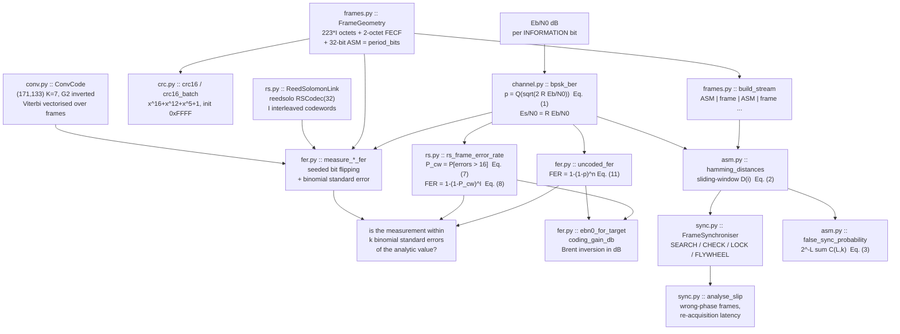
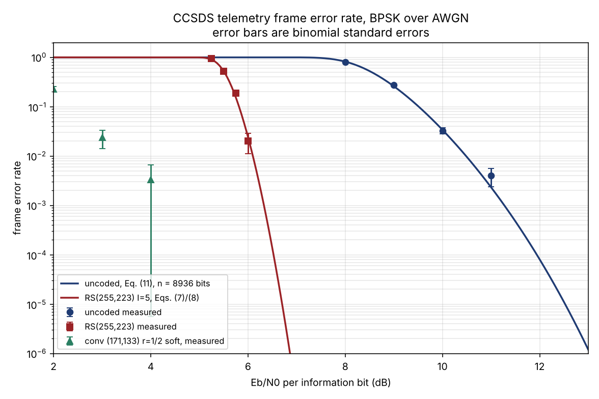
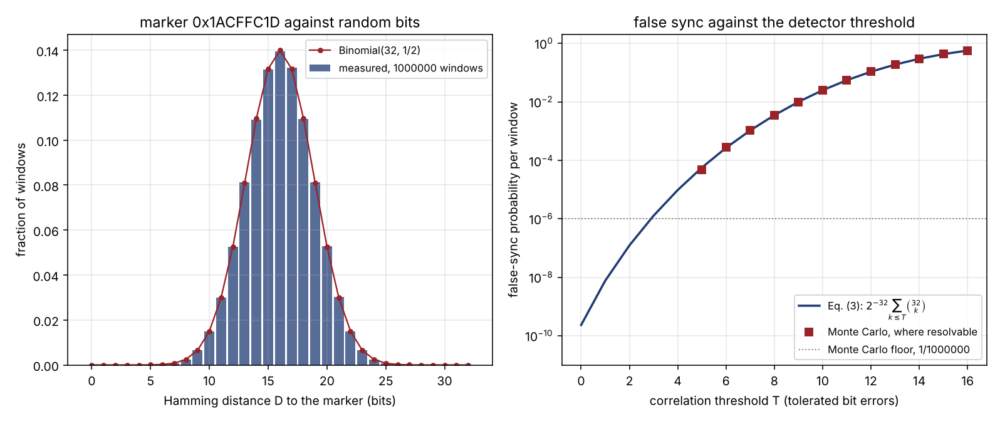
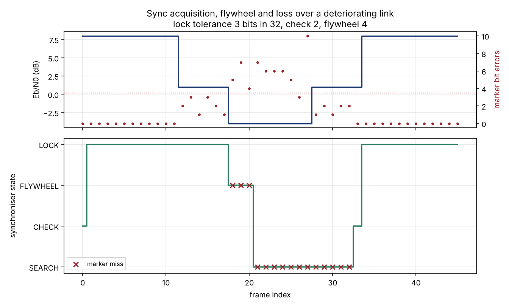
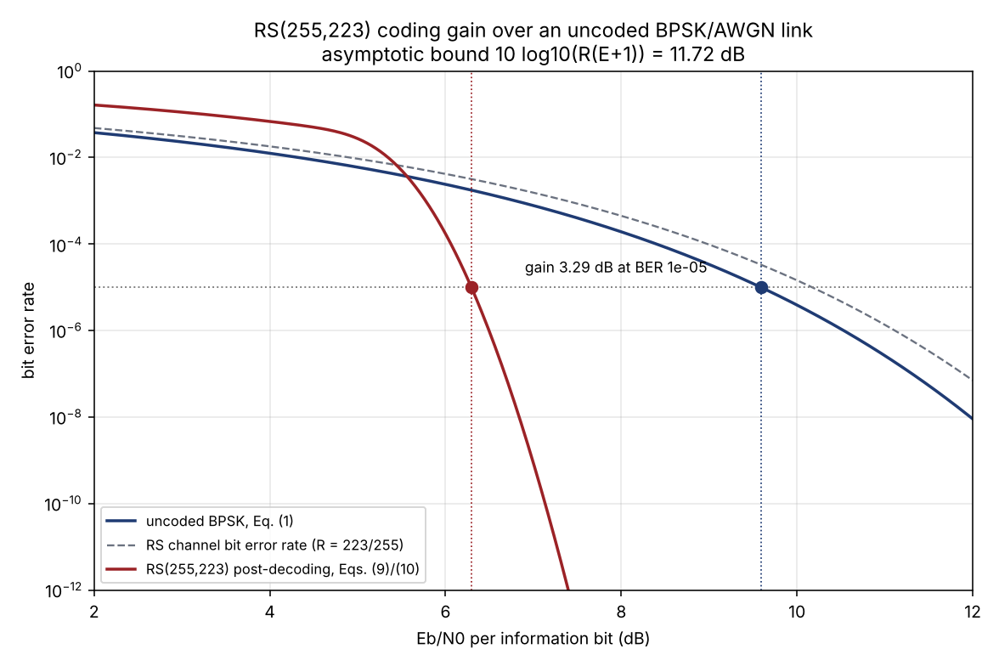

# framesync

Frame-level link performance for CCSDS telemetry: sync acquisition and frame error rate versus Eb/N0.


**Status:** TESTING · **Class:** compact · **Validation level:** 2 · **AI:** no

## The problem

You have a CCSDS telemetry downlink and a link budget that says 6.2 dB of
Eb/N0 at the ground station. The question nobody can answer from the link
budget is how many frames you actually lose: that depends on the frame
length, the code, the attached sync marker threshold, and how long the frame
synchroniser flywheels before it declares loss of sync. The codec libraries
will encode and decode for you and the packet libraries will parse what comes
out, but neither will tell you the frame error rate at 6.2 dB, how often the
correlator false-syncs on noise, or how many frames go out at the wrong phase
after a bit slip.

## What this does

- **Attached sync marker correlation detection** over the 32-bit CCSDS marker
  0x1ACFFC1D, with the combinatorial false-sync probability per window
  position: 2.33e-10 at threshold T = 0 rising to 9.65e-06 at T = 4, verified
  against an exhaustive enumeration of the whole window space for a 16-bit
  marker (`validation/validate_false_sync.py`).
- **The four-state acquisition / check / lock / flywheel synchroniser** with
  configurable thresholds, which reproduces an 18-step hand trace exactly,
  states and counters (`validation/validate_state_machine.py`).
- **Slip behaviour**: across bit insertions of +1 and +3 and deletions of −2
  and −7, exactly 4 frames are delivered at the wrong phase before SEARCH is
  re-entered at the default `flywheel_max = 4`.
- **Frame error rate against Eb/N0 for three links** — uncoded (analytic,
  within 1σ of Monte Carlo across 7–11 dB), RS(255,223) at interleave depth
  I = 5 (semi-analytic, within 1.3σ of `reedsolo` Monte Carlo across
  5.25–6.0 dB), and CCSDS (171, 133) rate-1/2 K = 7 with a Viterbi decoder
  vectorised across frames.
- **RS coding gain at 10⁻⁵**: 3.2941 dB at equal output bit error rate,
  5.8207 dB at equal frame error rate for an 8936-bit frame, both in Eb/N0
  per information bit (`validation/validate_rs_coding_gain.py`).

## The claim, stated narrowly

**This is a frame-level performance harness over existing codecs. It is not
a codec, and it is not a packet parser.**

The obvious product in this space was a CCSDS packet and framing library.
[`ccsdspy`](https://pypi.org/project/ccsdspy/) and
[`spacepackets`](https://pypi.org/project/spacepackets/) already do that
work, and do it well, so building another one would have been duplicated
effort. What is not available as a package is the layer between a codec
library and a link budget: sync acquisition statistics and frame-loss rate
versus Eb/N0. That is the gap this fills, and that is the whole of the claim.

If you need to parse CCSDS space packets, use `ccsdspy` or `spacepackets`.
If you need a Reed-Solomon codec, use `reedsolo` or `galois`. If you need a
convolutional codec, use `commpy`. If you need a link budget, that is a
different problem again. Come here when you have those and need to know what
the frame error rate is.

## Who it's for

- Ground segment engineers sizing a frame synchroniser's lock and flywheel
  thresholds against a false-sync budget.
- Mission analysts converting a link budget's Eb/N0 into a frame-loss rate
  for a data-return estimate.
- Anyone comparing an uncoded, Reed-Solomon and convolutionally coded
  telemetry link on the same axes with the same Eb/N0 convention.

## Who it's not for

- Anyone who needs **bit-level CCSDS interoperability**. `reedsolo`
  implements RS(255,223) in the conventional basis; CCSDS specifies a dual
  basis. Same code, same E = 16, same statistics, not the same bits on the
  wire. A flight decoder will not read what this encodes.
- Anyone who needs **packet or header parsing** — that is `ccsdspy` and
  `spacepackets`.
- Anyone who needs **turbo or LDPC codes**, or the longer turbo attached sync
  markers. Only the 32-bit marker and the two classical codes are here.
- Anyone who needs a channel with **fading, bursts, phase error or
  implementation loss**. This models ideal coherent BPSK over memoryless
  AWGN, so every number here is an upper bound on real performance.
- Anyone needing **flight-qualified or certified software**. See the safety
  statement.

## Alternatives, honestly

| Alternative | What it does better | When to use this instead |
|---|---|---|
| [`ccsdspy`](https://pypi.org/project/ccsdspy/) | Parses real CCSDS space packets out of real telemetry files: variable-length fields, bit-level field definitions, packet splitting. The right tool for getting science data out of a downlink. | When you need the *performance* of the link that delivered those packets, not the packets. |
| [`spacepackets`](https://pypi.org/project/spacepackets/) | Builds and parses CCSDS space packets and PUS telecommands/telemetry, with CFDP. Protocol work, both directions. | Same: this measures the link, it does not speak the protocol. |
| [`reedsolo`](https://pypi.org/project/reedsolo/) | A general, well-tested Reed-Solomon codec over GF(2^m) with erasure support and a Cython path. **This package depends on it** for the RS leg. | Never instead — use both. This adds the frame-error statistics around it. |
| [`galois`](https://pypi.org/project/galois/) | Serious finite-field arithmetic: arbitrary GF(p^m), BCH and RS with full control over the generator polynomial and basis. The tool for a dual-basis CCSDS-compatible codec. | When you need the performance curve rather than the field arithmetic. Use `galois` if bit-level CCSDS compatibility matters. |
| [`commpy`](https://pypi.org/project/scikit-commpy/) (`scikit-commpy`) | A general digital-communications toolkit with a proper `Trellis` class, convolutional/turbo/LDPC coding, puncturing, modems and fading channels. **The mature choice for the convolutional leg; prefer it.** | When you want frame-level link statistics with error bars rather than a codec toolkit. See Limitations for why this package implements its own decoder. |
| [`crcmod`](https://pypi.org/project/crcmod/) | A general, fast CRC generator for arbitrary polynomials, with a C extension. **The mature choice for the Frame Error Control Field; prefer it.** | Same reason — see Limitations. |
| GNU Radio / `gr-ccsds` | Real waveforms end to end with actual synchronisation loops, hardware in the loop, and a working ground station. | When you want a sized numerical answer in seconds rather than a flowgraph, or when you want the analytic expression alongside the measurement. |
| P006 LinkBudgetX (sibling product, not imported) | The link budget that produces the Eb/N0 this package consumes. | This picks up where the link budget stops. |
| P010 BERBench (sibling product, not imported) | Bit error rate for OOK, BPSK and M-PPM including lognormal fading. | This converts bit error rate to frame error rate and adds the synchroniser. The two are cross-checked against each other; see Validation. |

## Install and first run

```bash
git clone https://github.com/OmAcharya-avtr/framesync.git
cd framesync
python -m venv .venv && source .venv/bin/activate
pip install -e ".[dev]"
python -m pytest tests/ -q
python -m framesync gain
```

Expected output of that last command:

```
framesync 0.1.0 -- RS(255,223) coding gain, R = 0.874510
  at BER = 1e-05: uncoded needs  9.5879 dB, RS needs  6.2938 dB, gain = 3.2941 dB
  at FER = 1e-05: uncoded needs 12.5230 dB, RS needs  6.7023 dB, gain = 5.8207 dB
  (gain is in Eb/N0 per information bit; the 223/255 rate loss is included)
```

And the test suite prints `122 passed`.

To regenerate the figures:

```bash
cd examples
python fer_curves.py          # ~19 s
python asm_false_sync.py      # ~1 s
python acquisition_timeline.py  # ~1 s
python rs_coding_gain.py      # ~1 s
```

## A worked example

```python
import numpy as np
from framesync import (
    FrameGeometry, FrameSynchroniser, SyncConfig,
    bpsk_ber, uncoded_fer, rs_frame_error_rate, false_sync_probability,
    measure_uncoded_fer, coding_gain_db, RS_RATE,
)

# CCSDS transfer frame at RS interleave depth I = 5: 223*5 = 1115 octets,
# plus the 2-octet Frame Error Control Field, plus the 32-bit marker.
geom = FrameGeometry(data_octets=1115, fecf=True, asm_bits=32)
print(f"frame {geom.frame_bits} bits, period {geom.period_bits} bits")

# Analytic frame error rate at the link budget's 9 dB, uncoded and RS-coded.
print(f"uncoded FER at 9 dB : {float(uncoded_fer(9.0, geom.frame_bits)[0]):.4e}")
p_rs = bpsk_ber(9.0, RS_RATE)
print(f"RS(255,223) FER     : {float(rs_frame_error_rate(p_rs, 5)[0]):.4e}")

# Measure it, with the binomial standard error on the point.
pt = measure_uncoded_fer(9.0, geom, 2000, np.random.default_rng(20261005))
print(f"measured            : {pt.fer:.4e} +- {pt.stderr:.4e}  ({pt.n_frames} frames)")

# False-sync budget: how often does the correlator fire on noise?
for t in (0, 3):
    print(f"P_false_sync(T={t})   : {false_sync_probability(t):.3e} per window")

# Coding gain, Eb/N0 per information bit.
print(f"RS gain at FER 1e-5 : {coding_gain_db(1e-5, metric='fer')['gain_db']:.4f} dB")

# Flywheel: three missed markers in a row at flywheel_max = 4 keeps lock.
sm = FrameSynchroniser(SyncConfig(check_required=1, flywheel_max=4))
print([e.state_after.value for e in sm.run(["hit", "miss", "miss", "miss", "hit"])])
```

Actual output:

```
frame 8936 bits, period 8968 bits
uncoded FER at 9 dB : 2.5955e-01
RS(255,223) FER     : 7.1400e-27
measured            : 2.6650e-01 +- 9.8863e-03  (2000 frames)
P_false_sync(T=0)   : 2.328e-10 per window
P_false_sync(T=3)   : 1.278e-06 per window
RS gain at FER 1e-5 : 5.8207 dB
['LOCK', 'FLYWHEEL', 'FLYWHEEL', 'FLYWHEEL', 'LOCK']
```

## Architecture



## Screenshots



The RS curve falls off a cliff near 5.5 dB while the uncoded curve is still
near 1 at 8 dB. Note the convolutional points are a 512-bit frame and the
other two are 8936 bits, so this is a link comparison, not a like-for-like
frame-length comparison.



Notice where the Monte Carlo points stop: below about T = 7 the probability
is under the 1/N floor of a million windows, so the operational thresholds
T = 0 to 4 are reachable only through the combinatorial expression. That is
why Eq. (3) is checked exhaustively on a 16-bit marker instead.



The flywheel rides through isolated marker misses without dropping lock; it
is only the run of consecutive misses in the collapsed section that reaches
`flywheel_max` and returns the machine to SEARCH.



The RS curve crosses *above* the grey channel-rate line below about 5.5 dB:
that is the error-amplification region where a hard-decision decoder past its
threshold makes things worse. It is a property of the code, not a defect.

## Validation evidence

Full detail, with every raw output file, in
[`validation/VALIDATION.md`](validation/VALIDATION.md).

| Check | Reference | Result | Tolerance |
|---|---|---|---|
| Uncoded FER vs 1−(1−BER)ⁿ, 7–11 dB | Eq. (11); `validate_uncoded_fer.py` | PASS, worst deviation **0.98σ** over 5 points | < 4σ |
| CRC-16 check value | CRC-16/IBM-3740 catalogue check value 0x29B1 | PASS, **0x29B1** | exact |
| RS corrects ≤ 16 symbol errors | d_min = 33, E = 16; `validate_rs_correction.py` | PASS, **12/12 patterns at every count 0–16** | exact |
| RS fails at 17 symbol errors | same | PASS, **0/12 corrected at 17, 18, 19, 20**; all declared failures, no miscorrection | exact |
| False-sync vs binomial CDF | `scipy.stats.binom.cdf`, T = 0…32 | PASS, worst relative difference **0.000e+00** | < 1e-12 |
| False-sync exhaustive, 16-bit marker | enumeration of all 2¹⁶ windows | PASS, **all 17 thresholds exact** | exact |
| False-sync Monte Carlo, 2e6 windows | `validate_false_sync.py` | PASS, worst **1.36σ** | < 6σ (overlapping windows are correlated) |
| State machine vs hand trace | 18-step hand derivation in `tests/test_sync.py` | PASS, **18/18 states and 18/18 counters exact** | exact |
| Slip → wrong-phase frames | `validate_state_machine.py`, 4 slip sizes | PASS, **4 wrong-phase frames** every time at `flywheel_max = 4` | exact |
| Uncoded BER 10⁻⁵ anchor | Proakis & Salehi 2008 Sec. 4.3; Sklar 2001 Sec. 4.7.1 (~9.6 dB) | PASS, **9.5879 dB** | < 0.05 dB |
| RS semi-analytic vs `reedsolo` Monte Carlo | Eqs. (7)/(8); `validate_rs_coding_gain.py` | PASS, worst **1.21σ** over 4 points | < 4σ |
| RS coding gain at 10⁻⁵ | measured: **3.2941 dB** (BER metric), **5.8207 dB** (FER metric) | reported | — |
| RS gain vs asymptotic bound | G_∞ = 10 log₁₀(R(E+1)) = **11.7221 dB**; Lin & Costello 2004; Sklar 2001 Ch. 8 | PASS, both gains in (0, 11.7221) | strict |
| **RS gain vs a published range** | **CCSDS 130.1-G** | **NOT VERIFIED — document unavailable in the build container; no figure quoted. Open.** | — |
| Convolutional free distance | computed from the trellis; literature value 10 for (171,133) | PASS, **d_free = 10** | exact |
| Convolutional FER monotone, soft ≥ hard | `validate_conv_fer.py`, 2–5 dB | PASS; soft/hard ratio 3.83 → ∞ | ordinal only |
| **Cross-check vs P010 BERBench** | P010 `analytic.py` formula, recomputed not imported | **PASS, 0.988σ**, relative difference **1.175e-02** | < 5 % and < 4σ |

### The P010 cross-check, in full

The specification requires FrameSync's frame error rate to be consistent with
P010 BERBench's bit error rate for the same channel at the same Eb/N0 through
the analytic frame/bit relation. At Eb/N0 = 9.00 dB, n = 8936 bits, 20,000
Monte Carlo frames:

| quantity | value |
|---|---|
| FER converted from P010's BER (3.362722842e-05) via 1−(1−Pb)ⁿ | **2.595505895e-01** |
| framesync measured FER, 5130 errors in 20,000 frames | **2.565000000e-01** |
| relative difference | 1.175e-02 |
| deviation in binomial standard errors | 0.988σ |

**Finding: no disagreement.** The two products also agree to 4e-05 dB on the
inverted Eb/N0 at BER 10⁻⁵ (both 9.5879 dB) and to 3.72e-15 relative on the
BER at 10 dB. Machine-readable in
[`validation/crosscheck_berbench.json`](validation/crosscheck_berbench.json).

## API reference

<details>
<summary>Public surface, one line per function, with units</summary>

**`framesync.channel`** — the Eb/N0 convention lives here
- `qfunc(x) -> ndarray` — Gaussian tail Q(x), dimensionless.
- `bpsk_ber(ebn0_db, code_rate=1.0) -> ndarray` — channel bit error
  probability, Eq. (1). `ebn0_db` in dB per *information* bit.
- `ebn0_to_esn0_db(ebn0_db, code_rate=1.0) -> ndarray` — Es/N0 in dB.
- `bsc_flip(bits, p, rng) -> ndarray` — seeded binary symmetric channel on a
  0/1 uint8 array.
- `awgn_bpsk_samples(bits, ebn0_db, code_rate, rng) -> ndarray` —
  matched-filter samples, bit 0 → +1, normalised amplitude.

**`framesync.asm`** — marker and correlator
- `ASM_32_HEX = 0x1ACFFC1D`, `ASM_32_BITS` — the CCSDS 131.0-B marker.
- `hamming_distances(stream, pattern=None) -> ndarray[int32]` — D(i) in bits
  at every window offset, Eq. (2).
- `detect_asm(stream, tolerance=0, pattern=None) -> ndarray[int64]` — bit
  offsets where D(i) ≤ T.
- `false_sync_probability(tolerance, length=32) -> float` — Eq. (3), per
  window position, dimensionless.
- `expected_false_syncs(n_bits, tolerance, length=32) -> float` — expected
  count over a stream.
- `asm_autocorrelation(pattern=None) -> ndarray[int32]` — distance to each
  cyclic shift, in bits.

**`framesync.sync`** — the state machine
- `SyncState` — SEARCH, CHECK, LOCK, FLYWHEEL.
- `SyncConfig(search_tolerance, lock_tolerance, check_required, flywheel_max)`
  — tolerances in bits, counters in observations.
- `FrameSynchroniser.step(observation) -> SyncEvent`, `.run(list)`,
  `.reset()`, `.delivering`, `.states()`.
- `analyse_slip(frame_bits, n_frames, slip_at_frame, slip_bits, ...) -> SlipReport`
  — wrong-phase frame count and re-acquisition latency, in frames.
- `acquisition_offsets(stream, frame_bits, tolerance=0, pattern=None)` —
  detected offsets filtered to the frame period.

**`framesync.frames`** — geometry
- `FrameGeometry(data_octets, fecf, asm_bits)` with `.frame_octets`,
  `.frame_bits`, `.period_bits`, `.random_frames(n, rng)`, `.fecf_ok(frames)`,
  `.check_single(frame)`.
- `build_stream(geometry, n_frames, rng, pattern=None) -> (stream, offsets)`.

**`framesync.crc`** — Frame Error Control Field
- `crc16(data, init=0xFFFF) -> int`, `crc16_batch(data_2d, init=0xFFFF) -> ndarray[uint16]`.

**`framesync.rs`** — RS(255,223)
- `RS_N=255`, `RS_K=223`, `RS_E=16`, `RS_RATE=223/255`.
- `symbol_error_probability(p_bit, m=8)` — Eq. (6).
- `codeword_failure_probability(p_sym, n=255, e=16)` — Eq. (7), exact.
- `rs_frame_error_rate(p_bit, interleave=5, ...)` — Eq. (8), exact.
- `rs_output_bit_error_rate(p_bit, ...)` — Eqs. (9)/(10), **approximate**.
- `ReedSolomonLink(interleave)` with `.encode_frame`, `.decode_frame`,
  `.encode_codeword`, `.decode_codeword`, `.frame_data_octets`,
  `.codeblock_octets`, `.rate`.

**`framesync.conv`** — CCSDS rate-1/2 K=7
- `CCSDS_G1 = 0o171`, `CCSDS_G2 = 0o133`.
- `ConvCode(k=7, g1, g2, invert_g2=True)` with `.encode`, `.encode_batch`,
  `.decode`, `.decode_batch(received, soft=False, n_info_bits=None)`,
  `.n_states`, `.rate`, `.tail_bits()`.
- `free_distance(code=None, max_weight=40) -> int` — computed, in bits.

**`framesync.fer`** — the harness
- `uncoded_fer(ebn0_db, frame_bits)` — Eq. (11).
- `binomial_stderr(n_errors, n_trials) -> float` — Eq. (12).
- `n_frames_for_target(fer_expected, rel_stderr=0.10) -> int` — point sizing.
- `FerPoint` — one measured point with `.fer`, `.stderr`,
  `.rule_of_three_upper`, `.extra`, `.as_row()`.
- `measure_uncoded_fer`, `measure_rs_fer`, `measure_conv_fer`.
- `ebn0_for_target(curve, target, ...) -> float` — dB, Brent inversion.
- `coding_gain_db(target=1e-5, metric="ber"|"fer", ...) -> dict`.

**CLI**: `python -m framesync {fer,falsesync,gain,sync,slip}`.

</details>

## Engineering theory

Every equation carries its source, units, assumptions and validity range in
the module docstring that implements it. The numbering used throughout:

| Eq. | Expression | Where | Source |
|---|---|---|---|
| (1) | p = Q(sqrt(2 R Eb/N0)) | `channel.py` | Proakis & Salehi 2008, Eq. (4.3-13) |
| (2) | D(i) = Σ r[i+j] ⊕ asm[j] | `asm.py` | definition of the correlation detector |
| (3) | P_fa(T) = 2⁻ᴸ Σ_{k≤T} C(L,k) | `asm.py` | derived in the module docstring; D ~ Binomial(L, ½) |
| (4) | g(x) = x¹⁶ + x¹² + x⁵ + 1 | `crc.py` | CCSDS 132.0-B Frame Error Control Field |
| (5) | G1 = 0o171, G2 = 0o133, G2 inverted | `conv.py` | CCSDS 131.0-B basic convolutional code |
| (6) | p_s = 1 − (1 − p)^m | `rs.py` | memoryless symbol channel, m = 8 |
| (7) | P_cw = Σ_{i>E} C(n,i) p_s^i (1−p_s)^(n−i) | `rs.py` | bounded-distance decoding, exact |
| (8) | FER = 1 − (1 − P_cw)^I | `rs.py` | independent interleaved codewords |
| (9) | P_s,out ≈ (1/n) Σ_{i>E} i C(n,i) p_s^i (1−p_s)^(n−i) | `rs.py` | Sklar 2001 Ch. 8; Lin & Costello 2004 Ch. 7 — **approximation** |
| (10) | P_b,out ≈ 2^(m−1)/(2^m − 1) · P_s,out | `rs.py` | uniform-error assumption — **approximation** |
| (11) | FER = 1 − (1 − p)ⁿ | `fer.py` | independent bit errors, exact |
| (12) | SE = sqrt(f(1−f)/N) | `fer.py` | binomial standard error |
| — | G_∞ = 10 log₁₀(R(E+1)) | validation | Lin & Costello 2004; Sklar 2001 Ch. 8 |

**Validity range for all of it:** ideal coherent BPSK, memoryless AWGN,
perfect carrier and symbol synchronisation, no implementation loss, no
fading, no burst errors. Real receivers add 0.5–2 dB of implementation loss
that this does not model, so every Eb/N0 here is optimistic.

## Hardware requirements

CPU only, no GPU, no network. The whole test suite runs in about 5 s and all
seven validation scripts in about 60 s on **one contended CPU core**; peak
memory is under 300 MB, dominated by the Viterbi path memory, which is
`(2·(n_info + 6)) × batch × 64` bytes. There is no training and no model.

## Limitations

- **`commpy` and `crcmod` are named as dependencies by the build
  specification and are not dependencies of this package.** Neither can be
  installed in the build container: `scikit-commpy` has no wheel for Python
  3.13 and fails to build from source, and `crcmod`'s C extension fails to
  build a wheel. The convolutional encoder, the Viterbi decoder and the
  CRC-16 are therefore implemented inside this package — about 200 lines in
  `conv.py` and 40 in `crc.py`, both unit-tested, with the Viterbi checked
  against noiseless round-trip, correction within the free distance, and a
  free distance computed from the trellis that matches the literature value
  of 10. **A reader with a working toolchain should prefer `commpy` and
  `crcmod`**; they are in the alternatives table for that reason. This is a
  documented deviation from the specification, not a design choice.
- **The RS coding gain is not compared against a published range.** CCSDS
  130.1-G carries the performance curves and was not available in the build
  container; quoting a figure and a page from memory would be an invented
  citation. The check against the asymptotic-gain *formula* passes; the
  comparison against a published range is open. See
  `validation/VALIDATION.md` §5.
- **No bit-level CCSDS interoperability.** `reedsolo` uses the conventional
  basis and its own generator polynomial; CCSDS specifies a dual basis. The
  statistics are identical, the bits on the wire are not. Use `galois` if
  compatibility matters.
- **Equations (9) and (10) are approximations and are non-monotonic relative
  to the channel.** Below about 5.46 dB (the crossover `rs_coding_gain.py`
  prints) the post-decoding bit error rate they predict rises *above* the
  channel bit error rate. That is the error-amplification regime of a
  high-rate hard-decision block code past its threshold: Eq. (9) models a
  decoder that emits the uncorrected word on failure, while `reedsolo`
  declares failure instead. In that region trust the frame error rate of
  Eqs. (7)/(8), which is exact.
- **The RS coding gain at 10⁻⁵ is an inversion of a validated curve, not a
  direct measurement.** Measuring FER 10⁻⁵ through a pure-Python
  Reed-Solomon decoder would need of order 10⁶ frames. The curve is
  validated against Monte Carlo at 5.25–6.0 dB, where it is measurable, and
  then inverted.
- **Compute budget shapes the error bars.** Every Monte Carlo point here was
  sized to keep each script under 60 s on one core shared with four other
  build agents. The convolutional points in particular have wide bars — one
  point at 5 dB has zero errors and is reported as a rule-of-three upper
  limit rather than a rate. Wider bars honestly reported are preferred to a
  tighter number this machine cannot produce.
- **The soft/hard decision separation is reported as a ratio, not as a dB
  figure.** The frame counts affordable here do not resolve one.
- **The synchroniser threshold defaults are this package's defaults.** CCSDS
  does not mandate `check_required` or `flywheel_max` values, and no claim is
  made that any particular ground station uses these.
- **Only the 32-bit marker.** CCSDS defines longer attached sync markers for
  turbo-coded frames; they are not implemented.
- **Frame lengths are not matched across links** in `fer_curves.py`: the
  convolutional frame is 512 information bits and the other two are 8936.
  That figure is a link comparison, not a like-for-like one.
- **No header or packet handling at all.** This counts bits and frames.

## Roadmap

Nothing is promised. Candidate work, in the order it would be useful:
compare against a published RS performance curve to close the open check;
a dual-basis RS option for bit-level CCSDS compatibility; the longer turbo
attached sync markers; burst-error channels, where the interleaving depth
stops being statistically irrelevant and starts mattering; and a distance
spectrum for the convolutional code so a union bound can be stated.

## Safety statement

This software is research-grade. It is not flight-qualified, not certified,
and not approved for operational aerospace use. Every channel model here is
idealised and every number is an upper bound on real link performance.

## Licence

MIT. See [`LICENSE`](LICENSE). Copyright © 2026 OPTIMA Organisation.

## Credits

This is under reserved rights obtained by OPTIMA Organisation.

## Citation

See [`CITATION.cff`](CITATION.cff).
