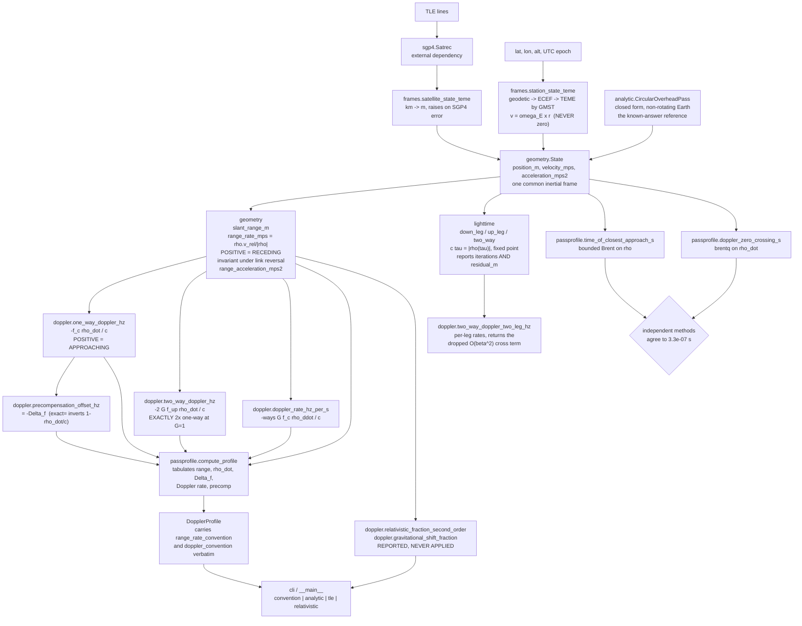
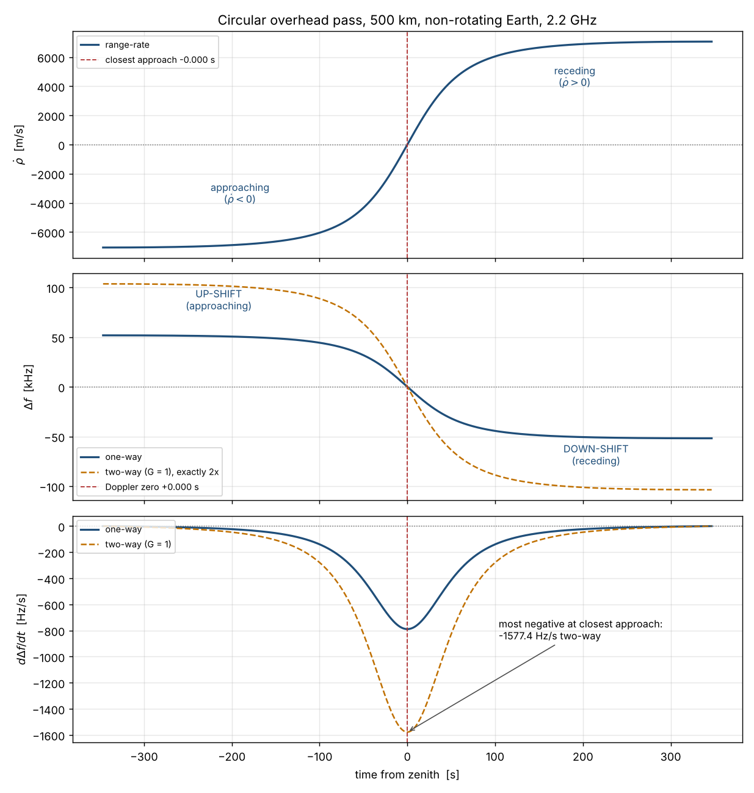
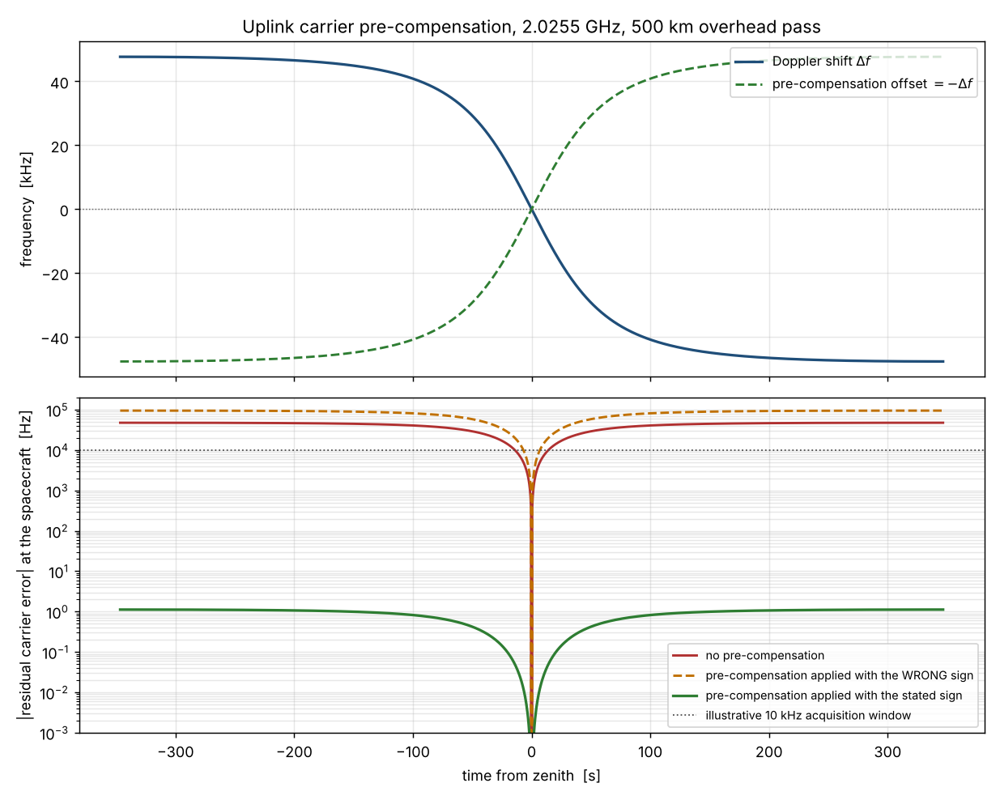
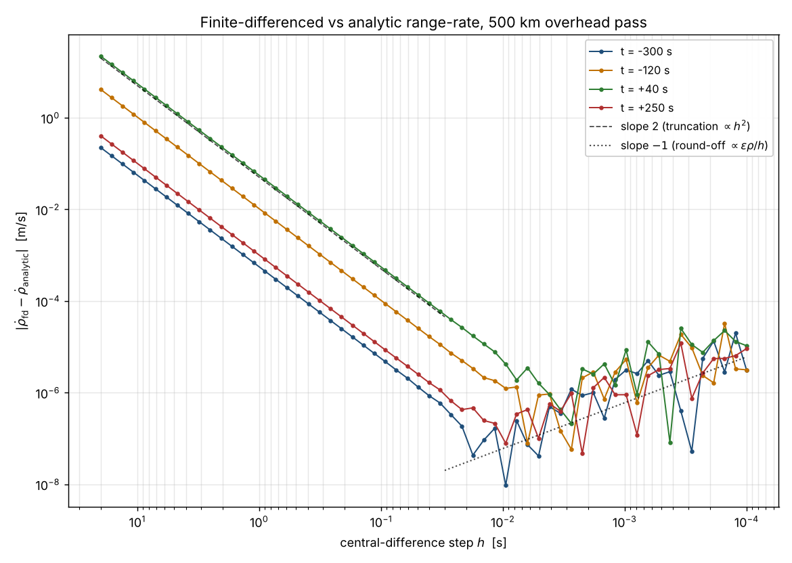
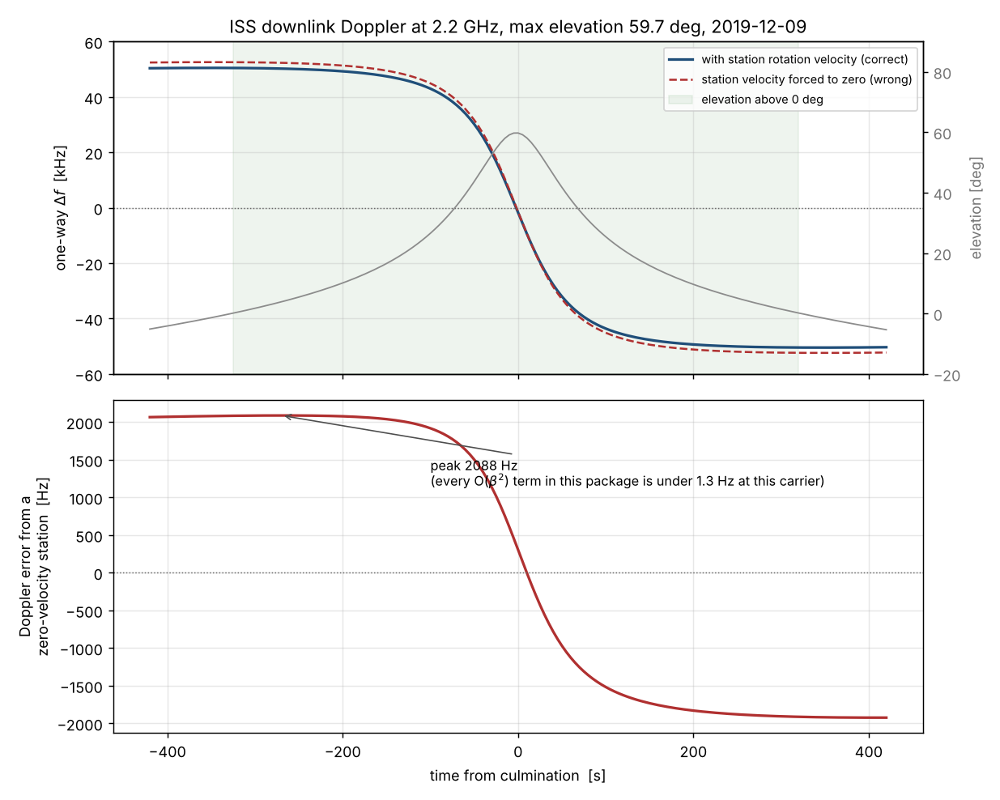

# dopplerkit

Doppler and range-rate geometry for a satellite link, one-way and two-way kept separate.


## The problem

Predicting the carrier a spacecraft or a ground station will actually receive is
arithmetic anyone can do, and the step that goes wrong is never the arithmetic. It is
the sign: whether range-rate counts receding as positive, whether the shift flips when
you swap uplink for downlink (it does not), whether the pre-compensation offset is added
or subtracted, and whether "two-way Doppler" in a given document means twice the one-way
shift or the two legs composed at their own epochs. Get the pre-compensation sign
backwards and the residual carrier error at the far end is not reduced, it is exactly
doubled — 95390 Hz instead of 47694 Hz for the S-band pass in
`validation/VALIDATION.md` row S3.

## What this does

- States **one sign convention** — range-rate positive when receding, Doppler positive
  when approaching — in the docstring of **every** public function that returns a Doppler
  or range-rate quantity, on the returned result objects, in the README API table below,
  and in a dedicated `python -m dopplerkit convention` subcommand. **23 assertions in
  `tests/test_signs.py` and 12 Hypothesis properties fail if any sign is flipped.**
- Keeps **one-way and two-way as separate functions**, with the single-epoch two-way form
  bit-exactly twice the one-way form at unit turnaround ratio (zero tolerance, verified
  over 20 hand cases and 150 Hypothesis examples), and a separate two-leg form for when
  the light time matters — the two differ by **2.63 Hz** at closest approach for a 500 km
  S-band pass (`validation/validate_two_way_relativistic.py`).
- Reports the **O(beta²) terms with their magnitudes** rather than claiming a relativistic
  treatment: **-0.709 Hz** special-relativistic and **+0.111 Hz** gravitational at 2.2 GHz
  for a 500 km LEO, against a 51.8 kHz classical excursion. The package keeps O(beta¹) and
  says so at every interface.
- Solves the **light time** by fixed-point iteration and reports the iteration count and
  the final residual on every call: **3 iterations, 3.4e-08 m worst residual** over a
  500 km pass, with the measured contraction rate matching the predicted `|rho_dot|/c`
  to **three significant figures** (`validation/validate_lighttime.py`).
- Builds the ground-station state in TEME **with its rotation velocity**, because omitting
  it costs **2087 Hz** at 2.2 GHz for the ISS pass in `validation/validate_tle_pass.py` —
  three orders of magnitude more than every relativistic term this package reports.

## Who it is for

- Anyone writing a carrier acquisition or pre-compensation plan for a LEO pass who wants
  the sign discipline settled and tested rather than rederived.
- Anyone cross-checking another tool's Doppler output and needing a second implementation
  with the convention written down.
- Anyone teaching link geometry who wants the one-way/two-way distinction, the light-time
  iteration and the relativistic order all visible rather than buried.

## Who it is not for

- **Anyone who only needs range-rate.** [Skyfield](https://pypi.org/project/skyfield/)
  already computes it, with the same sign convention. See the alternatives table and use
  Skyfield.
- Anyone needing an orbit propagator. This has none. It consumes states; `sgp4` produces
  them and is a dependency, not something this replaces.
- Anyone needing sub-Hz carrier prediction. The troposphere and ionosphere are not
  modelled at all, their delay rates exceed every O(beta²) term reported here, and the
  frame reduction's own UT1 neglect is worth about 0.22 Hz at 2.2 GHz.
- Anyone needing a validated relativistic Doppler model. The O(beta²) terms are
  **reported, not applied**, the gravitational term is an order-of-magnitude point-mass
  estimate, and the Shapiro delay is absent.
- Anyone needing an operational or flight product. This is validation Level 1:
  closed-form known answers and internal consistency, with no comparison against measured
  tracking data.

## Alternatives, honestly

The honest summary first: **`sgp4`, Skyfield and `poliastro` provide the states, and this
package depends on them rather than replacing them.** `sgp4` is a hard dependency here.
Skyfield in particular already gives you range-rate directly, and if range-rate is all you
need, use Skyfield and stop reading. What this adds on top of a propagator is narrow and
stated as such: the carrier pre-compensation profile, the explicit one-way/two-way
separation, and the sign discipline that is tested rather than asserted.

Each row below was written after reading the package's own source or its PyPI metadata,
fetched 2026-10-04. Versions are those current on PyPI at that date.

| Alternative | What it does better | When to use this instead |
|---|---|---|
| [`skyfield`](https://pypi.org/project/skyfield/) 1.55 | Everything astronomical this is not: a full time scale with UT1/TT/TDB, JPL ephemerides, precession-nutation, aberration, topocentric reductions, almanac and rise/set search. **It computes range-rate**: `ICRF.frame_latlon_and_rates(frame)` returns a 6-tuple whose last element is the radial `Velocity`, computed in `skyfield/functions.py` as `dots(r, v) / length` — the same expression and the same receding-positive sign as this package. It also has a light-time iteration (`vectorlib._correct_for_light_travel_time`, at most 10 iterations, stopping when the light time changes by less than 1e-12 day between iterations, i.e. about 26 m of range). | When you want carrier Doppler rather than range-rate. Across every `.py` file in the Skyfield 1.55 source distribution there is exactly one occurrence of "Doppler" — a stellar radial-velocity factor in `starlib.py` — and none at all of "carrier", "transponder", "uplink", "downlink", "two-way" or "turnaround". No carrier shift, no uplink/downlink distinction, no two-way transponder form, no pre-compensation profile, no turnaround ratio. Its light-time iteration is private and wired into the solar-system `observe()` path, not exposed per-leg for an Earth-satellite link. **If you only need range-rate, use Skyfield directly.** |
| [`sgp4`](https://pypi.org/project/sgp4/) 2.27 | The reference SGP4/SDP4 propagator, the C++ routine with a Python wrapper, vectorised via `SatrecArray`. It is what you should propagate TLEs with, and it is a dependency of this package. | Always use `sgp4` for propagation. Its public API is `Satrec`, `SatrecArray`, `jday`, `days2mdhms` and the WGS constants — positions and velocities in TEME, in km and km/s, and nothing else. No ground station, no frames, no range-rate, no Doppler. This package supplies that layer. |
| [`poliastro`](https://pypi.org/project/poliastro/) 0.17.0 | Broad astrodynamics: orbit objects, two-body and perturbed propagation, manoeuvres, Lambert solvers, plotting, built on `astropy` units. Far wider in scope than this. | Note before choosing it: PyPI metadata for 0.17.0 declares `requires-python >=3.8,<3.11` and the release dates from 2022-07-10, so **it cannot be installed on the Python 3.11+ that this package requires**. A package named [`hapsira`](https://pypi.org/project/hapsira/) (0.18.0, 2023-12-24) carries the identical project summary and a later release. Check the maintenance status yourself before depending on either. |
| [`astropy`](https://pypi.org/project/astropy/) 8.0.1 | Units, time scales, coordinate frames and transformations maintained at a scale this will never match. `astropy.coordinates` will do the frame work properly, including the parts this package approximates. | When you do not want an astronomy stack as a dependency for a dot product, and when you want the Doppler sign convention written down. `astropy` gives you frames and units, not link geometry. |
| Commercial flight-dynamics systems (Ansys STK and similar) | Validated, supported, with real force models, measurement models, tropospheric and ionospheric corrections and full relativistic treatments. Not comparable in scope or assurance. | Never, for operational work — use those. Use this to understand or teach the sign conventions, or to cross-check a single number. |

## Install and first run

```bash
git clone https://github.com/OmAcharya-avtr/dopplerkit.git
cd dopplerkit
python -m venv .venv && source .venv/bin/activate
pip install -e ".[dev]"
python -m pytest tests/ -q
python -m dopplerkit convention
python examples/example_pass_doppler.py
```

Expected output of the test run:

```
........................................................................ [ 49%]
........................................................................ [ 98%]
..                                                                       [100%]
146 passed in 9.20s
```

Expected output of `python -m dopplerkit convention`:

```
dopplerkit sign conventions
===========================
range-rate   range-rate positive when separating (receding); rho = r_target - r_observer; rho_dot = d|rho|/dt
doppler      Doppler positive (up-shift) when approaching, i.e. Delta_f = -f_carrier * rho_dot / c with rho_dot positive when receding

In words:
  rho_dot > 0  means RECEDING (the range is increasing)
  Delta_f > 0  means UP-SHIFT, which means APPROACHING
  Delta_f      = -f_carrier * rho_dot / c            (one-way)
  Delta_f      = -2 G f_uplink * rho_dot / c         (two-way, coherent)
  precomp      = -Delta_f                            (transmit offset)

Range-rate is INVARIANT under reversing the link direction. Uplink and
downlink share one range-rate; only the carrier differs.

Order kept: O(beta^1), beta = rho_dot/c. The O(beta^2) relativistic and
classical-cascade terms are reported by the 'relativistic' subcommand, never
applied.
```

`python -m dopplerkit analytic --samples 9` prints the full pass table; `--two-way` and
`--json` are available, `tle` takes a TLE and a station, and `relativistic` reports the
O(beta²) magnitudes. Bad input exits 2 with the offending option named.

## A worked example

```python
import numpy as np
from dopplerkit import (
    CircularOverheadPass, LinkDirection, compute_profile, doppler_zero_crossing_s,
    down_leg_light_time, relativistic_correction_hz, time_of_closest_approach_s,
    WGS84_A_M,
)

orbit = CircularOverheadPass(orbit_radius_m=WGS84_A_M + 500e3)   # 500 km circular
horizon = orbit.horizon_time_s()
times = np.linspace(-horizon, horizon, 1401)

# Downlink, one-way. Convention: Doppler positive = up-shift = approaching.
down = compute_profile(orbit.observer_state, orbit.satellite_state,
                       times, carrier_hz=2.2e9, direction=LinkDirection.DOWNLINK)
# Two-way coherent, G = 1, referenced to the uplink carrier.
two = compute_profile(orbit.observer_state, orbit.satellite_state,
                      times, carrier_hz=2.2e9, direction=LinkDirection.TWO_WAY)

print(f"peak one-way Doppler   {down.peak_doppler_hz():+12.2f} Hz")
print(f"peak two-way Doppler   {two.peak_doppler_hz():+12.2f} Hz")
print(f"exactly twice?         {np.array_equal(two.doppler_hz, 2 * down.doppler_hz)}")
print(f"precomp = -Doppler?    {np.allclose(down.precomp_offset_hz, -down.doppler_hz)}")

tca = time_of_closest_approach_s(orbit.observer_state, orbit.satellite_state, -horizon, horizon)
zero = doppler_zero_crossing_s(orbit.observer_state, orbit.satellite_state, -horizon, horizon)
print(f"closest approach       {tca:+12.9f} s")
print(f"Doppler zero crossing  {zero:+12.9f} s")

lt = down_leg_light_time(lambda t: orbit.satellite_state(t).position_m,
                         lambda t: orbit.observer_state(t).position_m, 200.0)
print(f"light time at t=200 s  {lt.light_time_s * 1e3:12.6f} ms "
      f"({lt.iterations} iterations, residual {lt.residual_m:.3e} m)")

rel = relativistic_correction_hz(0.0, orbit.orbital_speed_mps, 2.2e9)
print(f"O(beta^2) term at TCA  {rel:+12.6f} Hz  (reported, never applied)")
print(f"convention             {down.doppler_convention}")
```

Actual output:

```
peak one-way Doppler      +51803.43 Hz
peak two-way Doppler     +103606.85 Hz
exactly twice?         True
precomp = -Doppler?    True
closest approach       -0.000000333 s
Doppler zero crossing  +0.000000000 s
light time at t=200 s      5.157519 ms (3 iterations, residual 1.863e-08 m)
O(beta^2) term at TCA     -0.709281 Hz  (reported, never applied)
convention             Doppler positive (up-shift) when approaching, i.e. Delta_f = -f_carrier * rho_dot / c with rho_dot positive when receding
```

The `-0.000000333 s` closest approach is the bounded minimiser's own `xatol` of 1e-6 s;
the zero crossing is found by an independent root find on the range-rate and lands on
0 exactly for this symmetric geometry.

## Architecture



NumPy and SciPy for the arithmetic and the two root finders, `sgp4` for propagation, no
cross-product imports.

## Screenshots

All four PNGs are produced by this repository's own examples, so they cannot drift from
the code.



`python examples/example_pass_doppler.py`. Notice the sign ordering, which is the whole
convention in one picture: range-rate negative while approaching and positive while
receding (top), Doppler the other way round and crossing zero at the same instant
(middle), and Doppler rate negative throughout with its minimum at closest approach
(bottom). Notice also that the Doppler rate returns to **zero** at both horizon crossings
— that is the exact known answer `rho_ddot(t_h) = 0` derived in `validation/VALIDATION.md`,
not a plotting artefact.



`python examples/example_precompensation.py`. The lower panel is the point. Applying the
pre-compensation with the stated sign leaves 1.12 Hz of residual carrier error (green);
applying it with the sign flipped leaves 95390 Hz — **exactly twice** the 47694 Hz you get
by doing nothing at all (red). That factor of two is why this package puts the convention
on every interface.



`python examples/example_finite_difference_convergence.py`. The straight slope-2 section
is Level 1 validation check 1: the central-difference range-rate converges on the analytic
dot product at second order over four decades of step size. Notice where it stops — below
h ≈ 0.01 s the error turns round and climbs as 1/h, which is double-precision cancellation,
not a modelling error. This is why the test tolerance is 1e-4 m/s at h = 0.039 s and not
tighter.



`python examples/example_tle_pass.py`. Notice how close the two curves in the top panel
look and how large the difference actually is: the lower panel shows that forcing the
ground station's inertial velocity to zero shifts the predicted Doppler by up to 2088 Hz.
Every relativistic term this package reports is under 1.3 Hz at the same carrier.

## Validation evidence

Level 1. Full derivations, the complete table and the uncomfortable results are in
[`validation/VALIDATION.md`](validation/VALIDATION.md); raw stdout for every script is
committed beside it. Baseline: circular overhead pass at 500 km above the WGS-84
equatorial radius, mean motion 1.106783446335e-03 rad/s, orbital speed 7612.608173 m/s,
horizon-to-horizon 693.2639 s, carrier 2.2 GHz unless stated.

| Check | Reference | Computed | Expected | Tolerance | Result |
|---|---|---|---|---|---|
| Finite-differenced vs analytic range-rate, worst of 4 epochs at h = 0.0390625 s | Vallado 4th ed. range-rate observation equation | 8.4354e-05 m/s | 0 | 1e-4 m/s | PASS |
| Observed convergence order, h = 20 s to h = 0.039 s | truncation `(h²/24)rho'''` | 2.000 | 2 | ±0.01 | PASS |
| Round-off floor | `eps·rho/h` | best 1.3e-07 m/s near h ≈ 0.01 s; rises to 7.9e-07 m/s at h = 1e-3 s | — | reported | **method limit, not a pass** |
| Vector dot-product code vs closed form, worst range-rate over 11 epochs | same | 6.6393e-11 m/s | 0 | 1e-8 m/s | PASS |
| `rho_dot(t_horizon) = r_o·n` (exact known answer) | derivation in VALIDATION.md | 7059.216450 m/s | 7059.216450 m/s | 1e-6 m/s | PASS, 2.7e-12 |
| `rho_ddot(0) = r_s·r_o·n²/(r_s−r_o)` | derivation in VALIDATION.md | 107.478098 m/s² | 107.478098 m/s² | 1e-9 m/s² | PASS, diff 0 |
| Library Doppler vs closed form, 4 carriers × 9 epochs | classical Doppler relation | worst 3.827e-16 relative | 0 | 1e-9 relative | PASS |
| Peak one-way Doppler = `f_c·r_o·n/c`, 2.2 GHz | classical Doppler + geometry | 51803.425255 Hz | 51803.425255 Hz | 1e-6 relative | PASS |
| Doppler rate at closest approach, 2.2 GHz | `-f_c r_s r_o n²/(c(r_s−r_o))` | -788.718357 Hz/s | -788.718357 Hz/s | 1e-9 relative | PASS, diff 0 |
| Doppler zero crossing vs closest approach, independent methods | — | 3.333e-07 s apart | 0 | 1e-6 s (minimiser `xatol`) | PASS |
| Zero crossing within one integration step, at 30 / 10 / 1 / 0.1 s sampling | — | within one step in all four | ≤ 1 step | 1 step | PASS |
| Zero crossing is carrier-independent, 401 MHz to 26 GHz | the carrier cancels | spread 0.000e+00 s | 0 | exact | PASS |
| Two-way is exactly twice one-way, G = 1, 20 hand cases | Moyer 2000, composed legs | bit-exact in all 20 | exact | **zero** | PASS |
| Same, 150 Hypothesis examples per property | — | bit-exact | exact | **zero** | PASS |
| O(beta²) special-relativistic term at closest approach, 2.2 GHz | `(rho_dot/c)² − v²/(2c²)` | **-0.709281 Hz** (fraction -3.224e-10) | — | reported | **reported, never applied** |
| Same at 401 MHz / 8.4 GHz / 26 GHz | — | -0.129283 / -2.708163 / -8.382410 Hz | — | reported | **reported** |
| Two-way classical cascade term, dropped, 2.2 GHz at the horizon | `+f·rho_dot_up·rho_dot_down/c²` | **+1.219816 Hz** | — | reported | **reported** |
| Static gravitational term, 2.2 GHz downlink | `(mu/c²)(1/r_rx − 1/r_tx)` | **+0.111205 Hz** (fraction +5.055e-11) | — | reported | **order of magnitude only** |
| Light-time iteration over the pass, 9 epochs × 2 legs | Moyer 2000 fixed-point solution | **max 3 iterations, worst residual 3.353e-08 m** | — | 1e-6 m | PASS |
| Measured contraction rate vs predicted `\|rho_dot\|/c` | derivative of the iteration map | 2.355e-05 vs 2.354701e-05, ratio 1.000 | 1 | 1 % | PASS |
| Two-way with light-time-separated legs vs the exactly-2x form | Moyer 2000 | **2.6309 Hz** departure at closest approach | — | reported | **reported, see Limitations** |
| Hand explanation of that departure: two-way Doppler rate × light time | -1577.4367 Hz/s × 1.667820 ms | -2.6309 Hz | -2.6309 Hz measured | 1e-4 Hz | PASS, diff 0.0000 |
| First-order pre-compensation residual, 2.0255 GHz uplink | `-f·beta²` | **1.1231 Hz** | — | reported | **method limit, use `exact=True`** |
| Pre-compensation with the sign flipped, same case | — | 95390.07 Hz vs 47694.47 Hz uncompensated — **exactly 2.0000x worse than doing nothing** | 2x | reported | **reported** |
| Doppler error from a zero-velocity ground station, ISS pass, 2.2 GHz | — | **2086.97 Hz** (100 s sampling) / 2088.40 Hz (5 s sampling) | — | reported | **reported** |
| Bit-exact doubling in the subnormal float range | IEEE-754 gradual underflow | **fails** at rho_dot = 2.225e-308 m/s, f_c = 1 MHz | exact | exact | **FAILS, documented and tested** |

Test suite: `python -m pytest tests/ -q` → **146 passed, 0 failed, 0 skipped, 0 errors**
(counts from the JUnit XML, not from stdout).

## API reference

Every function below states the sign convention, the link direction, whether it is
one-way or two-way, and its units — in its docstring and in this table. SI throughout:
metres, metres per second, seconds, hertz, radians internally, degrees at the geodetic
interface.

<details>
<summary><code>dopplerkit</code> public surface (43 exported names)</summary>

**Geometry** — `dopplerkit.geometry`

| Name | Convention / direction / ways | Units |
|---|---|---|
| `State(position_m, velocity_mps, acceleration_mps2=None, label="")` | one endpoint of a link, in a common inertial frame; validated, frozen | m, m/s, m/s² |
| `State.speed_mps` | inertial speed | m/s |
| `relative_position_m(observer, target)` | `rho = r_target − r_observer`, points observer → target | m |
| `slant_range_m(observer, target)` | symmetric; raises if the positions coincide | m |
| `range_rate_mps(observer, target)` | **positive when RECEDING**; **invariant** under swapping the arguments, i.e. under reversing the link; neither one-way nor two-way, it is pure geometry | m/s |
| `range_acceleration_mps2(observer, target)` | exact second derivative of the range; positive means the recession rate is increasing; uses `State.acceleration_mps2`, which defaults to zero | m/s² |
| `range_rate_finite_difference_mps(range_fn, t_s, step_s)` | central difference of a scalar range function, same sign convention; second-order accurate | m/s |
| `RANGE_RATE_CONVENTION` | the convention as a string, attached to every profile | — |

**Doppler** — `dopplerkit.doppler`

| Name | Convention / direction / ways | Units |
|---|---|---|
| `one_way_doppler_hz(range_rate_mps, carrier_hz)` | `−f_c·rho_dot/c`; **positive = up-shift = APPROACHING**; **one-way**, uplink or downlink (identical at a given carrier); O(beta¹) | Hz |
| `two_way_doppler_hz(range_rate_mps, uplink_carrier_hz, turnaround_ratio=1.0)` | `−2G·f_up·rho_dot/c`; **positive = up-shift = APPROACHING**; **two-way** coherent, referenced to `G·f_up`; both legs at one epoch; **exactly 2× one-way at G = 1** | Hz |
| `two_way_doppler_two_leg_hz(range_rate_up_mps, range_rate_down_mps, uplink_carrier_hz, turnaround_ratio=1.0)` | returns `(first_order_hz, dropped_cross_term_hz)`; same sign convention; **two-way**, legs at their own light-time epochs, in order (up, down) | Hz, Hz |
| `doppler_rate_hz_per_s(range_acceleration_mps2, carrier_hz, ways=1, turnaround_ratio=1.0)` | `−ways·G·f_c·rho_ddot/c`; **positive range-acceleration gives a NEGATIVE Doppler rate**; `ways` is 1 or 2 | Hz/s |
| `precompensation_offset_hz(range_rate_mps, nominal_carrier_hz, exact=False)` | **the negative of the Doppler shift**: approaching → transmit LOW (negative offset); **one-way**, deliberately no two-way variant; `exact=True` inverts `1 − rho_dot/c` and cancels to machine precision | Hz |
| `relativistic_fraction_second_order(range_rate_mps, speed_mps)` | `(rho_dot/c)² − v²/(2c²)`, a fractional offset to be *added* to the classical fraction; **one-way**; `speed_mps` is the **transmitter** inertial speed; **reported, never applied** | dimensionless |
| `relativistic_correction_hz(range_rate_mps, speed_mps, carrier_hz)` | the same term times the carrier | Hz |
| `gravitational_shift_fraction(r_transmitter_m, r_receiver_m, mu_m3_s2=...)` | `(mu/c²)(1/r_rx − 1/r_tx)`; positive = received frequency up-shifted; a downlink blueshifts; **order of magnitude only** | dimensionless |
| `doppler_observable(range_rate_mps, carrier_hz, direction=DOWNLINK, turnaround_ratio=1.0)` | builds a `DopplerObservable` carrying the convention, direction, ways and order kept | Hz on the result |
| `DopplerObservable` | `.doppler_hz`, `.carrier_hz`, `.range_rate_mps`, `.direction`, `.ways`, `.order_kept`, `.convention`, `.as_dict()` | Hz, Hz, m/s |
| `LinkDirection` | `UPLINK` (ground → spacecraft), `DOWNLINK` (spacecraft → ground), `TWO_WAY` | — |
| `DOPPLER_CONVENTION` | the convention as a string | — |

**Light time** — `dopplerkit.lighttime`

| Name | Convention / direction / ways | Units |
|---|---|---|
| `down_leg_light_time(sat_pos_fn, sta_pos_fn, reception_time_s, tol_m=1e-6, max_iter=50)` | solves `c·tau = \|r_sat(t_r−tau) − r_sta(t_r)\|`; `tau > 0` always; **down-leg, one way**; does not raise on non-convergence | s, m |
| `up_leg_light_time(sat_pos_fn, sta_pos_fn, transmission_time_s, ...)` | `c·tau = \|r_sat(t_t+tau) − r_sta(t_t)\|`; **up-leg, one way** | s, m |
| `two_way_light_time(sat_pos_fn, sta_pos_fn, transmission_time_s, ...)` | both legs of one round trip, in transmission order; feed `up` then `down` to `two_way_doppler_two_leg_hz` | s |
| `LightTimeSolution` | `.light_time_s`, `.range_m`, `.iterations`, `.residual_m`, `.converged`, `.emission_time_s`, `.reception_time_s`, `.leg`, `.as_dict()` | s, m |
| `TwoWayLightTime` | `.up`, `.down`, `.round_trip_s`, `.transmit_time_s`, `.receive_time_s` | s |

**Pass profiles and events** — `dopplerkit.passprofile`

| Name | Convention / direction / ways | Units |
|---|---|---|
| `compute_profile(observer_state_fn, target_state_fn, times_s, carrier_hz, direction=DOWNLINK, turnaround_ratio=1.0)` | tabulates range, range-rate, range-acceleration, Doppler, Doppler rate and pre-compensation; `direction` selects one-way or two-way; the result carries both convention strings verbatim | m, m/s, m/s², Hz, Hz/s, Hz |
| `DopplerProfile` | `.times_s`, `.range_m`, `.range_rate_mps`, `.range_acceleration_mps2`, `.doppler_hz`, `.doppler_rate_hz_per_s`, `.precomp_offset_hz` (None for two-way), `.carrier_hz`, `.direction`, `.ways`, `.turnaround_ratio`, `.range_rate_convention`, `.doppler_convention`, `.peak_doppler_hz()`, `.doppler_span_hz()` | as above |
| `time_of_closest_approach_s(observer_fn, target_fn, t_lo_s, t_hi_s, xatol_s=1e-6)` | bounded Brent minimisation of the range; assumes unimodality over the window | s |
| `doppler_zero_crossing_s(observer_fn, target_fn, t_lo_s, t_hi_s, xtol_s=1e-9)` | `brentq` on the range-rate; **takes no carrier, because the carrier cancels**; raises if the window brackets no sign change | s |

**Closed-form reference** — `dopplerkit.analytic`

| Name | Convention / direction / ways | Units |
|---|---|---|
| `CircularOverheadPass(orbit_radius_m, observer_radius_m=WGS84_A_M, mu_m3_s2=...)` | two-body circular orbit through the zenith of an **inertially fixed** observer; a numerical reference, not a pass predictor | m, m³/s² |
| `.mean_motion_rad_s`, `.orbital_period_s`, `.orbital_speed_mps`, `.horizon_time_s()` | `n = sqrt(mu/r_s³)`; horizon at `cos n t = r_o/r_s` | rad/s, s, m/s, s |
| `.range_m(t_s)`, `.range_rate_mps(t_s)`, `.range_acceleration_mps2(t_s)` | closed forms, scalar or array; **range-rate positive when receding**, zero at `t = 0` | m, m/s, m/s² |
| `.one_way_doppler_hz(t_s, carrier_hz)` | `−f_c·rho_dot/c`; **one-way**; positive before the zenith | Hz |
| `.max_doppler_rate_hz_per_s(carrier_hz)` | the value at closest approach, the most negative of the pass; **one-way** | Hz/s |
| `.observer_state(t_s)`, `.satellite_state(t_s)` | `State` objects in one inertial frame; the observer has **zero** velocity by construction | m, m/s, m/s² |

**Frames** — `dopplerkit.frames`

| Name | Convention / direction / ways | Units |
|---|---|---|
| `station_state_teme(lat_deg, lon_deg, alt_m, t, label="station")` | ground station in TEME **with `omega_E × r` velocity and the centripetal acceleration**; never offered without them | deg, m, UTC datetime → m, m/s, m/s² |
| `satellite_state_teme(satrec, t, label="satellite")` | from an `sgp4` `Satrec`; km → m; **acceleration left at zero**, so Doppler rates from this path are incomplete; raises `RuntimeError` on an SGP4 error code | UTC datetime → m, m/s |
| `geodetic_to_ecef_m(lat_deg, lon_deg, alt_m)` | WGS-84 site position | deg, m → m |
| `ecef_to_teme_m(r_ecef_m, jd, fr=0.0)` | `R3(−theta_GMST)` | m → m |
| `gmst_rad(jd, fr=0.0)` | IAU 1982 polynomial, UT1 ≈ UTC | rad |
| `julian_date(t)` | UTC datetime → `(whole, fraction)`; naive is treated as UTC | — |
| `elevation_deg(station, satellite, lat_deg, lon_deg, jd, fr=0.0)` | topocentric elevation, `atan2` form, no refraction | deg |
| `OMEGA_EARTH_VEC_RAD_S` | `(0, 0, 7.292115e-5)` in TEME | rad/s |

**Constants** — `dopplerkit.constants`

`C_M_S` = 299792458.0 m/s (exact, SI definition) · `MU_EARTH_M3_S2` = 3.986004418e14 m³/s²
(WGS-84) · `WGS84_A_M` = 6378137.0 m · `WGS84_F`, `WGS84_E2` · `OMEGA_EARTH_RAD_S` =
7.292115e-5 rad/s.

</details>

## Limitations

- **Order kept is O(beta¹).** The O(beta²) special-relativistic, two-way cascade and
  static gravitational terms are computed and reported, and are **never applied** to any
  result. Their magnitudes for a 500 km LEO at 2.2 GHz are -0.709 Hz, +1.220 Hz and
  +0.111 Hz. **Dropped entirely and not estimated anywhere:** the Shapiro delay,
  tropospheric and ionospheric delay and their time derivatives, transponder group delay
  and its drift, oscillator instability, antenna phase-centre motion, and higher
  relativistic orders. Do not read the relativistic reporting as a relativistic model.
- **The gravitational term is an order-of-magnitude estimate**, from a spherical
  point-mass potential. It omits the Earth's rotational potential, J2, the coordinate-time
  versus proper-time distinction at each end, and the Shapiro delay.
- **"Two-way is exactly twice one-way" is a single-epoch statement.** With finite light
  time the legs are at different epochs; `two_way_doppler_two_leg_hz` is the form for
  that case, and the difference reaches 2.63 Hz at closest approach for a 500 km S-band
  pass. Choosing the wrong function is a real error.
- **First-order pre-compensation leaves `−f·beta²`** — 1.12 Hz at 2.0255 GHz for a 500 km
  LEO. Use `exact=True` if that matters. Both forms are tested.
- **Bit-exactness stops in the subnormal float range.** Hypothesis found that at
  `rho_dot = 2.225e-308 m/s` with a 1 MHz carrier the doubling identity loses its last
  bit to IEEE-754 gradual underflow. Recorded as its own test, not hidden.
- **Doppler rate from the `sgp4` path is incomplete.** `satellite_state_teme` leaves the
  acceleration at zero, so `range_acceleration_mps2` returns only the kinematic term there.
  The CLI prints that caveat; `CircularOverheadPass` is the reference for Doppler rate.
- **Frame reduction is scheduling-class, not precision-class.** GMST only (IAU 1982), UT1
  taken as UTC, no polar motion, no TEME-versus-pseudo-Earth-fixed refinement. The induced
  range-rate error is bounded at about 0.03 m/s, i.e. about 0.22 Hz at 2.2 GHz — a bound
  computed in `frames.py`, not measured. This is larger than every relativistic term the
  package reports.
- **`CircularOverheadPass` is a reference, not a predictor.** It holds the observer
  inertially fixed, so it has no station rotation velocity, is coplanar and exactly
  overhead, and assumes a spherical Earth for the horizon. Use the `sgp4` path for a real
  pass.
- **The TLE-path numbers are regression values produced by this repository**, not a
  comparison against an independent ephemeris. They pin the frame reduction so that a
  change is visible in a diff; they do not validate it.
- **Event locators assume unimodality.** `time_of_closest_approach_s` and
  `doppler_zero_crossing_s` are valid within one pass of a near-circular orbit. Over a
  window spanning several passes they will return one arbitrary extremum or raise.
- **No atmospheric refraction** in the elevation calculation (up to roughly half a degree
  near the horizon).
- **The WGS-84 `mu` used by `CircularOverheadPass` differs from the WGS-72 constants built
  into `sgp4`**, so the closed-form and `sgp4` paths are never compared more tightly than
  about 1e-6 relative.
- **No orbit propagation, no force model, no estimation, no measurement model, no
  ranging-code modelling, no carrier tracking loop.** The package consumes states and
  returns link geometry.
- **Validation is Level 1**: closed-form known answers and internal consistency. Nothing
  has been compared against measured tracking data, a flight-dynamics system, or a
  professional tool.

## Reproducing every number

Every figure in this README comes from one of these commands, run from a clean checkout
after `pip install -e ".[dev]"`.

```bash
# 146 passing tests (badge, evidence table)
python -m pytest tests/ -q

# 8.4354e-05 m/s, order 2.000, the round-off floor, and the 1c known answers
python validation/validate_range_rate.py

# 3.827e-16, 51803.425255 Hz, -788.718357 Hz/s, the 3.333e-07 s zero-crossing agreement
python validation/validate_doppler_closedform.py

# bit-exact doubling, -0.709281 / +1.219816 / +0.111205 Hz, the 2.6309 Hz two-leg departure
python validation/validate_two_way_relativistic.py

# 3 iterations, 3.353e-08 m residual, contraction ratio 1.000, the 60.62 m correction
python validation/validate_lighttime.py

# the 2086.97 Hz zero-velocity-station error and the pinned TLE regression values
python validation/validate_tle_pass.py

# the four screenshots, the 95390.07 / 47694.47 / 1.1231 Hz pre-compensation numbers,
# and the 2088.40 Hz station-velocity peak
python examples/example_pass_doppler.py
python examples/example_precompensation.py
python examples/example_finite_difference_convergence.py
python examples/example_tle_pass.py
```

Committed raw output for each validation script sits beside it as
`validation/<script>_output.txt`, so any drift is visible in a diff.

## Safety statement

This software is research-grade and educational. It is not flight-qualified, not
certified, and not approved for operational aerospace use.

## Licence

MIT — see `LICENSE`. Copyright © 2026 OPTIMA Organisation.

## Citation

```
OPTIMA Organisation (2026). dopplerkit: Doppler and range-rate link geometry
with explicit one-way/two-way sign conventions (v0.1.0) [Computer software].
Validation level 1.
```

## References

- D. A. Vallado, *Fundamentals of Astrodynamics and Applications*, 4th ed., Microcosm
  Press / Springer — range and range-rate observation equations, two-body circular orbit,
  site-position algorithm, TEME-to-Earth-fixed reduction, topocentric elevation.
- T. D. Moyer, *Formulation for Observed and Computed Values of Deep Space Network Data
  Types for Navigation*, JPL Deep Space Communications and Navigation Series, Monograph 2,
  2000 — light-time solution and the two-way Doppler formulation.
- The classical non-relativistic Doppler relation `f_rx = f_tx(1 − rho_dot/c)`, and the
  standard special-relativity ratio `sqrt(1 − v²/c²)/(1 + rho_dot/c)` whose expansion gives
  the O(beta²) term reported here.
- S. Aoki, B. Guinot, G. H. Kaplan, H. Kinoshita, D. D. McCarthy, P. K. Seidelmann, "The
  new definition of universal time", *Astronomy and Astrophysics* 105, 359, 1982 — the
  IAU 1982 GMST polynomial, quoted in the form used here by J. Meeus, *Astronomical
  Algorithms*, 2nd ed., Eq. 12.4.
- NIMA TR8350.2, 3rd ed., 2000 — WGS-84 ellipsoid parameters, gravitational parameter and
  nominal Earth rotation rate.
- BIPM, *The International System of Units (SI)*, 9th ed., 2019 — the speed of light as a
  defining constant.
- W. H. Press, S. A. Teukolsky, W. T. Vetterling, B. P. Flannery, *Numerical Recipes* —
  the second-order central difference and its truncation error.

No page numbers are quoted because none were verified against physical copies.

## Credits

This is under reserved rights obtained by OPTIMA Organisation.
