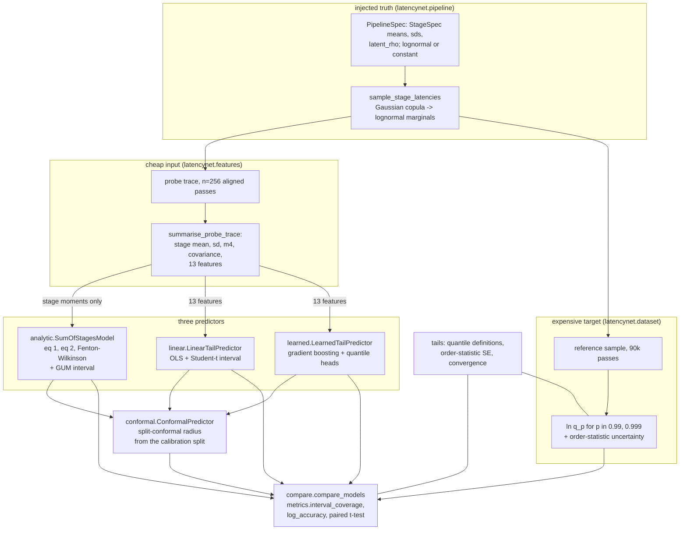
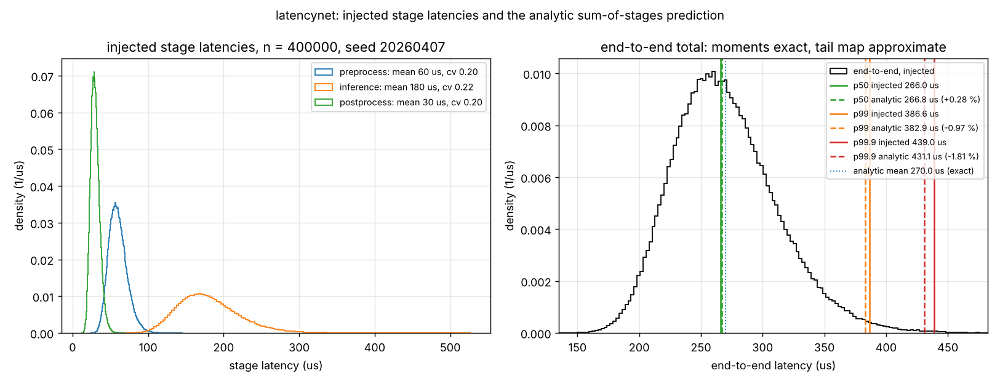
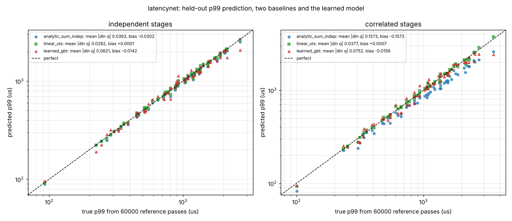
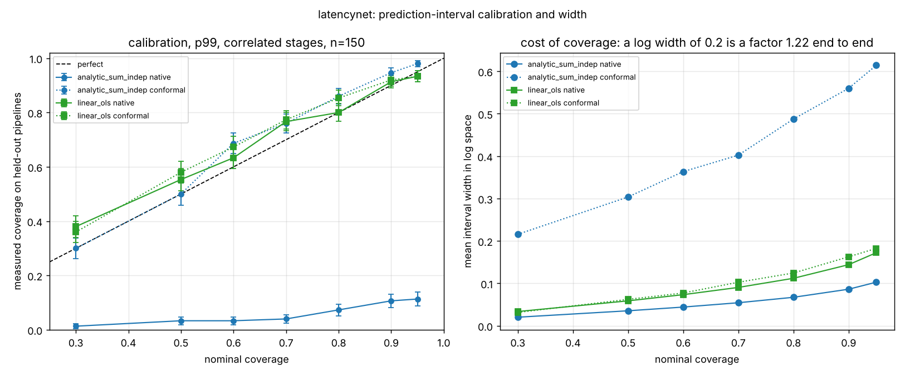
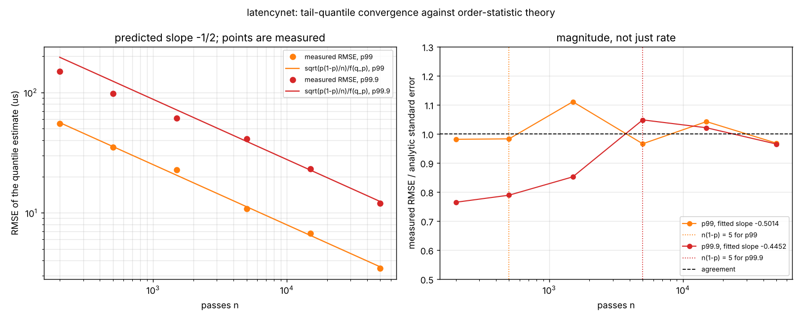

# latencynet

Predicts the p99 and p99.9 end-to-end latency of a staged pipeline from a short
per-stage profile.


**Status:** TESTING · **Class:** compact · **Validation level:** 2 · **AI:** yes

## The problem

You have a serial inference pipeline on an embedded target — preprocess,
infer, postprocess — and a deadline. Profiling each stage in isolation is
cheap; characterising the end-to-end p99.9 is not, because a tail quantile
needs of the order of 150,000 passes before the estimate stops moving (measured:
`validation/validate_tail_convergence.py`). So you add up the per-stage means,
add the variances in quadrature, and read a quantile off a normal or lognormal
fit — and then find out in integration that the real p99.9 is 20 % higher than
that, because your stages are not independent.

## What this does

- Implements the **analytic sum-of-stages model** and proves its two moment
  identities exact to **0.000e+00 relative error** against a 3.553e-15
  tolerance, on 200,000 injected draws in two dependence regimes
  (`validation/validate_analytic_exactness.py`).
- Measures the error of the **Fenton-Wilkinson** moment-to-quantile map that
  every back-of-envelope latency budget implicitly uses: it **under-predicts
  p99.9 by 2.36 % to 4.35 %** depending on pipeline shape, against a
  2,000,000-draw reference (same script).
- Compares **three predictors** — analytic sum-of-stages, 13-feature OLS, and
  gradient-boosted trees — on **150 held-out pipelines** in each of two
  dependence regimes, at p99 and p99.9, with paired significance tests
  (`validation/validate_model_comparison.py`).
- Gives all three **prediction intervals**, and measures coverage against
  nominal on 88 rows: the split-conformal interval holds its one-sided
  guarantee on **47 of 48** rows, while every model's native interval
  under-covers (`validation/validate_interval_coverage.py`).
- Confirms tail estimates converge at the **n^(-1/2)** rate order statistics
  predict, with fitted slopes of **-0.49583 ± 0.00971** (p99) and
  **-0.52648 ± 0.01386** (p99.9), and shows the rate breaking down below the
  theory's own validity condition (same script).

## Which case does the data fall in

The specification for this product states the expected outcome plainly: the
analytic baseline should win where stage latencies are independent, and the
learned model should only help where they are not. **Both halves hold. And
neither model wins.**

| regime | target | analytic sum-of-stages | OLS (13 features) | gradient-boosted trees | winner |
|---|---|---|---|---|---|
| independent | p99 | 0.03655 | **0.03300** | 0.05167 | OLS, not significant (p = 0.1306) |
| independent | p99.9 | 0.07086 | **0.05005** | 0.06080 | OLS, significant |
| correlated | p99 | 0.15441 | **0.03155** | 0.05094 | OLS, significant |
| correlated | p99.9 | 0.22493 | **0.04107** | 0.05546 | OLS, significant |

Figures are mean absolute log error on 150 held-out pipelines, which is to
first order the mean relative error of the predicted quantile. Lower is better.

Read it as three findings:

1. **Where stages are independent, the learned model does not help.** It loses
   to the analytic baseline at p99 (0.05167 against 0.03655, paired
   p = 0.0009 — a significant *loss*) and is not significantly ahead at p99.9
   (p = 0.0988). Exactly as predicted.
2. **Where stages are correlated, the learned model does help.** The analytic
   baseline's error rises to 0.154 and 0.225 with a signed bias of -0.153 and
   -0.223, meaning it under-predicts the tail by 14 % and 20 % — the unsafe
   direction for a deadline. The learned model beats it with p < 0.0001 at both
   probabilities. Also as predicted.
3. **The simplest fitted model wins every comparison.** A thirteen-feature
   ordinary least squares fit, solved in closed form with an exact Student-t
   prediction interval, beats the gradient-boosted ensemble in all four
   comparisons and in **12 of 12** settings of a hyperparameter sweep spanning
   a factor of 16 in ensemble size. On this dataset the learned predictor is
   not justified. That result is the research evidence this product exists to
   produce and it is not retuned away.

The analytic baseline's loss is worth separating. Its moment identities are
exact to machine precision; its entire deficit in the independent regime is
the Fenton-Wilkinson tail map's systematic under-prediction, and in the
correlated regime the ignored covariance terms. Supplying the measured
covariance matrix to equation (2) — the `analytic_sum_cov` diagnostic — closes
most of the correlated-regime gap on its own (0.15441 to 0.03317 at p99),
which means much of what the learned model "learns" in that regime is
available for free by measuring a covariance.

## Who it's for

- Someone budgeting a deadline for a staged embedded pipeline who needs a tail
  quantile and an honest interval on it, not a mean.
- Someone who wants to know what the independence assumption in their latency
  budget actually costs, quantified.
- Someone evaluating whether a learned latency predictor is worth the
  complexity over a regression, and wanting a worked comparison to start from.

## Who it's not for

- Anyone needing to *measure* latency. This package measures nothing; use a
  profiler. P033 EdgeInfer is the sibling product that owns the measurement
  harness.
- Anyone with a concurrent, queueing or preemptive pipeline. The model here is
  a serial sum of stages with no overlap and no queueing. Queueing theory is a
  different subject and this is not it.
- Anyone needing a certified or flight-qualified timing analysis. This is
  research-grade.
- Anyone whose stage latencies are multimodal — a cache-hit and a cache-miss
  mode, say. A two-moment summary cannot represent that and neither can the
  features here.

## Alternatives, honestly

| alternative | what it does better | when to use this instead |
|---|---|---|
| A profiler (`perf`, `pyinstrument`, vendor tooling) | measures real latency on real hardware, which this does not attempt | when you need a tail quantile *before* paying for 150,000 passes |
| `scipy.stats` + ten lines | computes the quadrature sum and a lognormal quantile, which is most of baseline 1 | when you want the error of that shortcut quantified, the dependence term, and a calibrated interval |
| `statsmodels` | far better regression diagnostics, GLMs, robust and mixed models | when the problem is specifically a staged-pipeline tail and you want the analytic baseline and the comparison harness built in |
| `MAPIE`, `crepes` | mature, well-tested conformal prediction with many conformity scores | when you want the latency domain model, not a general conformal toolkit; the split-conformal wrapper here is 60 lines and deliberately minimal |
| Queueing analysis (Kleinrock, or a simulator like OMNeT++) | handles concurrency, queueing and contention, which this cannot | when the pipeline really is serial with no queueing |
| Response-time analysis (P036 RtClock, `pyCPA`) | worst-case schedulability bounds with priorities and preemption | when you want a probabilistic tail rather than a worst case |

If your stages are independent and you only need a rough p99, use the ten
lines of `scipy.stats`. The honest claim of this package is narrower than it
sounds: it quantifies when that shortcut fails, and by how much.

## Install and first run

```bash
git clone https://github.com/OmAcharya-avtr/latencynet.git
cd latencynet
python -m venv .venv && source .venv/bin/activate
pip install -e ".[dev]"
python -m pytest tests/ -q
python examples/stage_decomposition.py
```

Expected output of the test run and the first example:

```
164 passed in 8.35s

injected mean 270.0000 us   sampled mean 269.9698 us
injected sd   42.1900 us   sampled sd   42.2189 us
p50     injected  266.0099 us   analytic  266.7629 us   relative error +0.00283
p99     injected  386.6025 us   analytic  382.8655 us   relative error -0.00967
p99.9   injected  439.0246 us   analytic  431.0951 us   relative error -0.01806
wrote .../screenshots/stage_decomposition.png
```

The last three lines are the point of the package in miniature: the mean lands
on 270.0000 us exactly, and the p99.9 is 1.8 % low.

## A worked example

```python
import numpy as np
from latencynet import (
    SumOfStagesModel, make_lognormal_pipeline, sample_stage_latencies,
    summarise_probe_trace, quantile,
)

# A pipeline you can profile per stage but not end-to-end.
spec = make_lognormal_pipeline(
    means_s=(60e-6, 180e-6, 30e-6),
    stds_s=(12e-6, 40e-6, 6e-6),
    names=("preprocess", "inference", "postprocess"),
)

# 256 passes with per-stage instrumentation: the cheap measurement.
probe = summarise_probe_trace(sample_stage_latencies(spec, 256, seed=7))

model = SumOfStagesModel()                      # baseline 1, nothing to fit
lo, p99, hi = model.predict_quantile_interval(
    np.asarray(probe.stage_mean_s),
    np.asarray(probe.stage_std_s),
    np.asarray(probe.stage_m4_s4),
    n_probe=probe.n_probe,
    p=0.99,
    level=0.9,
)
print(f"predicted p99 {p99 * 1e6:.2f} us, 90 % PI [{lo * 1e6:.2f}, {hi * 1e6:.2f}] us")

# What it actually is, from 200000 end-to-end passes: the expensive one.
truth = quantile(sample_stage_latencies(spec, 200_000, seed=8).sum(axis=1), 0.99)
print(f"reference p99 {truth * 1e6:.2f} us -> relative error {(p99 - truth) / truth:+.4f}")
```

```
predicted p99 362.05 us, 90 % PI [353.33, 370.98] us
reference p99 385.81 us -> relative error -0.0616
```

The interval does not contain the truth, and it is not close. That is not a
bug in the example; it is the measured behaviour of the analytic model's native
interval, which covers probe sampling uncertainty and nothing else and which
under-covers on all 12 rows in `validation/validate_interval_coverage.py`.
Two errors compound here: the Fenton-Wilkinson tail bias, which is -1.8 % for
this pipeline when the stage moments are known exactly, and the fact that this
particular 256-pass probe happened to under-estimate the stage spreads. The
interval's half-width accounts for the second but not the first, and its
nominal 90 % is not delivered. Wrap it in `ConformalPredictor` for an interval
that holds its nominal rate.

## Architecture



## Screenshots



Left: the three injected stage distributions. Right: the end-to-end total with
the analytic prediction overlaid. Notice that the dotted blue analytic mean sits
on top of the distribution's mean, while the dashed red analytic p99.9 sits
visibly to the left of the injected p99.9 — the moments are exact, the tail map
is not.



Predicted against true p99 for 60 held-out pipelines, log-log, the diagonal
being perfect. In the right-hand panel the blue analytic points have fallen off
the diagonal as a group and all in the same direction: that is the independence
assumption under-predicting the tail by a systematic 17 % once the stages are
correlated.



Left: measured coverage against nominal, with binomial error bars. The solid
blue line is the analytic model's native interval and it is far below the
diagonal at every level. The dotted lines are split-conformal and they track
it. Right: the width you pay for that coverage, in log space, where 0.2 means a
factor of 1.22 from end to end.



Left: measured RMSE of a tail-quantile estimate against sample count, with the
closed-form order-statistic standard error as the line. Right: the ratio of the
two, which should be 1. The p99.9 series peels away below the dotted vertical
line at `n(1-p) = 5` — that is the cited theory's own validity condition
making itself felt, not a defect.

## Validation evidence

Full detail, including every failed check, in
[`validation/VALIDATION.md`](validation/VALIDATION.md). Headlines:

| check | reference | result | tolerance |
|---|---|---|---|
| sum-of-stages mean identity, 200k draws, both regimes | Casella & Berger (2002) Thm. 4.5.6 | **0.000e+00** rel. error | 8.882e-16 |
| sum-of-stages variance identity with covariances | Casella & Berger (2002) Sec. 4.5 | 1.045e-15 / 1.430e-16 rel. | 3.553e-15 |
| declared-parameter mean and sd recovery, 4 rows | closed form | **0.000e+00** rel. | 3.553e-15 |
| Fenton-Wilkinson p99.9 error, independent pipeline | Fenton (1960) IRE TCS 8(1):57-67 | **-2.359 %** | measured, not gated |
| Fenton-Wilkinson p99.9 error, one dominant skewed stage | Fenton (1960) | **-4.346 %** | measured, not gated |
| tail convergence slope, single lognormal, p99 | David & Nagaraja (2003) Sec. 10.2 | **-0.49583 ± 0.00971** | -0.5 ± 0.04 |
| tail convergence slope, single lognormal, p99.9 | David & Nagaraja (2003) | -0.52648 ± 0.01386 | -0.5 ± 0.04 |
| tail convergence slope, 3-stage pipeline, p99 / p99.9 | David & Nagaraja (2003) | -0.47492 / -0.51934 | -0.5 ± 0.04 |
| order-statistic SE magnitude ratio at n=50,000, p99 | Mosteller (1946) | **1.0136** | 1.0 ± 0.15 |
| theory breakdown at n(1-p) = 0.2 | validity condition | ratio 0.7102 | reported |
| split-conformal one-sided coverage guarantee, 48 rows | Lei et al. (2018) JASA 113(523) | **47 / 48 held** | measured >= nominal - 2 SE |
| analytic model's native interval coverage, 12 rows | JCGM 100:2008 Sec. 5.1.2 | **0 / 12 — FAILED** | nominal ± 2 SE |
| learned model's native interval coverage, 4 rows | Koenker & Bassett (1978) | **0 / 4 — FAILED** | nominal ± 2 SE |
| OLS Student-t interval coverage, 12 rows | Draper & Smith (1998) Sec. 1.4 | 9 / 12 | nominal ± 2 SE |
| learned model beats analytic baseline, independent regime | paired t-test, 150 pipelines | **no** (p = 0.0009 against it at p99) | p < 0.05 |
| learned model beats analytic baseline, correlated regime | paired t-test, 150 pipelines | **yes** (p < 0.0001, both targets) | p < 0.05 |
| learned model beats OLS baseline, capacity sweep | 12 settings, both regimes | **0 / 12 — learned model loses** | — |
| P033 EdgeInfer injected cost model agreement | P033 `crosscheck_pipeline.json` | **0.000e+00** rel. on mean and sd | 3.553e-15 |
| P033 EdgeInfer p50 agreement | P033 nominated statistic | **-5.8753 % — DISAGREE** | ±3 % |

### The P033 cross-check, in full

P033 EdgeInfer and this product were required to agree on the latency of the
same synthetic pipeline from independent implementations. P033 published three
lognormal stages (60/180/30 us mean, 12/40/6 us sd), n = 2000, seed 20260401,
and nominated `p50_s` as the comparable statistic because its own mean was
preemption-contaminated.

| quantity | latencynet | P033 EdgeInfer | relative difference |
|---|---|---|---|
| injected end-to-end mean | 270.000000000 us | 270.000000000 us | **0.000e+00** |
| injected end-to-end sd | 42.190046219 us | 42.190046219 us | **0.000e+00** |
| p50 | **267.184676 us** (sampled) | **283.862500 us** (measured) | **-5.8753 %** |
| p50, measured against measured | 271.880000 us (volatile) | 283.862500 us | -4.2212 % |

**-5.8753 % is outside the ±3 % band and is reported as a disagreement.** The
implementation was not changed to match.

Explanation, and it is accounted for arithmetically: the two p50 figures are
different quantities. P033's is a *measured* wall-clock median — it consumed
each drawn stage duration with a spin-wait and timed the pass — so it carries
P033's spin-wait overshoot and harness cost on a contended single core.
This product's p50 is the median of the *sampled* cost model, with no clock
involved, because this product's position is that a wall-clock measurement on
this host is not a usable reference. A sum of right-skewed lognormals has its
median 1.4546 % *below* its mean, so a correct sampled p50 must sit below
270 us; P033's own JSON records its measured p50 sitting 5.1343 % *above* it.
Those two ratios imply a measurement overhead of +6.6855 % on the median
against an observed gap of +6.2421 %, leaving **+0.4174 % unexplained** —
which is itself the size of the n=2000 sampling noise on a median here. The
two implementations agree on the distribution to better than half a per cent;
the published figures are simply not like-for-like.

## API reference

<details>
<summary>Public surface, one line each, units in seconds unless stated</summary>

**`latencynet.pipeline`** — injected truth

- `StageSpec(name, mean_s, std_s, dist)` — one stage; `dist` in
  `{"lognormal", "constant"}`.
- `StageSpec.cv` → dimensionless coefficient of variation.
- `StageSpec.lognormal_params()` → `(mu, sigma)` of the underlying normal.
- `PipelineSpec(stages, latent_rho)` — serial pipeline, equicorrelated latent
  normals.
- `PipelineSpec.injected_mean_s()` → exact end-to-end mean, s.
- `PipelineSpec.injected_covariance()` → exact stage covariance matrix, s².
- `PipelineSpec.injected_std_s()` → exact end-to-end standard deviation, s.
- `sample_stage_latencies(spec, n_samples, seed)` → `(n, K)` array, s.
- `sample_total_latency(spec, n_samples, seed)` → `(n,)` array, s.
- `make_lognormal_pipeline(means_s, stds_s, latent_rho, names)` →
  `PipelineSpec`.

**`latencynet.analytic`** — baseline 1

- `sum_of_stages_mean(stage_mean_s)` → s, exact under any dependence.
- `sum_of_stages_variance(stage_std_s, stage_cov_s2=None)` → s².
- `fenton_wilkinson_quantile(mean_s, variance_s2, p)` → s, approximate.
- `SumOfStagesModel(assume_independent=True)` — the baseline.
- `.predict(stage_mean_s, stage_std_s, probabilities, stage_cov_s2)` →
  `AnalyticPrediction`.
- `.predict_quantile(..., p, ...)` → s.
- `.log_quantile_uncertainty(..., stage_m4_s4, n_probe, p, ...)` →
  dimensionless GUM standard uncertainty of `ln q_p`.
- `.predict_quantile_interval(..., level=0.9)` → `(lower_s, point_s, upper_s)`.

**`latencynet.features`** — the cheap input

- `FEATURE_NAMES`, `N_FEATURES` (13), `DEPENDENCE_FEATURE_INDICES`.
- `summarise_probe_trace(trace_s)` → `ProbeSummary` with per-stage mean, sd,
  fourth central moment (s⁴), covariance (s²), p99, and the 13 features.
- `ProbeSummary.covariance_matrix()` → `(K, K)` array, s².

**`latencynet.dataset`** — populations and targets

- `generate_record(index, regime, seed, n_probe, n_reference, ...)` →
  `PipelineRecord`.
- `build_dataset(regime, n_train, n_calibration, n_test, seed, ...)` →
  `PipelineDataset` split by pipeline.
- `feature_matrix(records)` → `(n, 13)`; `log_target(records, p)` → `(n,)`.
- `PipelineRecord.reference_quantile_se_s` → distribution-free one-sigma
  uncertainty of each reference quantile, s.

**`latencynet.predictors`, `.linear`, `.learned`** — the three models

- `TailPredictor.fit(records, p)`, `.predict_log(records)`,
  `.predict_log_interval(records, level)` → `IntervalPrediction`.
- `AnalyticTailPredictor(assume_independent=True)` — baseline 1 as a
  predictor.
- `LinearTailPredictor()` — baseline 2; `ols_fit`, `ols_predict`,
  `ols_prediction_interval` are usable directly.
- `LearnedTailPredictor(hyperparameters, native_interval_level)` — the learned
  model; `.feature_importances()` → `(13,)`.
- `BoostingHyperparameters(n_estimators=300, max_depth=3,
  learning_rate=0.05, min_samples_leaf=5, random_state=20260403)`.

**`latencynet.conformal`** — calibrated intervals

- `conformal_radius(abs_residuals, level)` → the radius, in units of the
  residuals, or `inf` when the calibration set is too small.
- `coverage_quantisation(n_calibration)` → `1/(m+1)`, dimensionless.
- `ConformalPredictor(base, level)`, `.from_fitted(base, p, level)`,
  `.calibrate(records)`.

**`latencynet.tails`** — tail estimation and its theory

- `quantile(samples, p, method)` — `method` in
  `{"nearest_rank", "linear"}`, no default that could change.
- `quantile_min_samples(p)` → `ceil(1/(1-p))`.
- `lognormal_quantile(mu, sigma, p)` → s, exact.
- `lognormal_quantile_se(mu, sigma, p, n)` → s, analytic order-statistic SE.
- `lognormal_tail_convergence(mu, sigma, p, n_grid, n_repeats, seed, method)`
  → `ConvergenceResult` with the fitted and predicted slopes.

**`latencynet.metrics`, `.compare`** — scoring

- `interval_coverage(prediction, log_truth)` → `CoverageResult` with measured
  coverage, binomial SE, Wilson interval, widths.
- `log_accuracy(log_prediction, log_truth)` → `AccuracyResult`.
- `paired_difference_test(errors_a, errors_b)` →
  `(mean_difference, t, p_value)`.
- `wilson_interval(n_success, n, z)` → `(lower, upper)`.
- `compare_models(dataset, p, level, models)` → `ComparisonResult`;
  `format_comparison(result)` → the table; `default_models(level)` → the four.

**CLI** — `python -m latencynet {analytic,sample,tail,compare}`; latencies on
the command line are in microseconds.

</details>

## Limitations

1. **Nothing here is measured.** Every validated number comes from injected
   synthetic distributions with declared parameters and fixed seeds. The models
   have never seen a real profile. Whether a real embedded pipeline's stage
   latencies are lognormal with Gaussian-copula dependence is an open question
   this product does not answer; see `DATASET_CARD.md`.
2. **Serial pipeline only.** Latency is the sum of stage latencies. No overlap,
   no queueing, no preemption, no contention between stages. A pipeline with
   any of those is outside the model.
3. **Fenton-Wilkinson under-predicts the tail.** Measured at -2.36 % (p99.9,
   cv about 0.2) to -4.35 % (p99.9, one dominant cv-0.6 stage). This is the
   analytic predictor's systematic error and the direction is unsafe for a
   deadline. The error grows with the skewness of the dominant stage and with
   how far into the tail you go.
4. **Every native prediction interval under-covers.** The analytic model's
   fails on 12 of 12 rows, the learned model's on 4 of 4, down to a measured
   0.093 against a nominal 0.90. Use `ConformalPredictor`. Its guarantee is
   *marginal*, not conditional: it over-covers easy pipelines and under-covers
   hard ones, and its coverage is quantised in steps of `1/(m+1)` = 0.0164 at
   the 60-pipeline calibration split used here.
5. **The conformal guarantee assumes exchangeability** between calibration and
   test pipelines. Here that holds by construction because both come from the
   same generator. On a real fleet it would not hold across a hardware
   revision, a compiler change or a thermal regime change, and the guarantee
   would go with it.
6. **Two-moment summaries cannot represent a multimodal stage.** A stage with a
   cache-hit mode and a cache-miss mode is not describable by a mean and a
   standard deviation, and no feature here captures it.
7. **The reference targets carry Monte Carlo noise.** 0.30 % relative standard
   error at p99 and 0.88 % at p99.9 on the test split. Model error differences
   below that are not resolvable with this reference sample size, and the
   comparison prints the figure rather than reading a winner out of the noise.
8. **Impurity feature importances are biased** toward high-cardinality features
   (Strobl et al. 2007). They are reported as what the model leaned on, never
   as a causal claim.
9. **The dependence model is one-parameter.** Equicorrelated latent normals
   with `-1/(K-1) <= rho <= 1`. Real pipelines can have structured dependence
   — adjacent stages correlated, distant ones not — which this does not
   generate.
10. **The learned model is gradient-boosted trees, not a neural network.**
    PyTorch is unavailable in this build environment. With a few hundred
    training pipelines and thirteen features that is the right size of model,
    but the comparison says nothing about what a larger model on more data
    would do.
11. **Compute budget.** The full validation suite runs in about 65 s of CPU
    time on one core; the longest script, `validate_model_comparison.py`, takes
    about 31 s. Every figure in this repository was produced on a shared
    single-core container with four concurrent build jobs, where wall-clock
    times ran 2 to 3 times the CPU times.
12. **`latencynet.units` is scalar-only** by design. Array conversions are the
    caller's business; the examples do them inline.

## Reproducing every number

```bash
# tests, with the count that is on the badge
PYTHONPATH=src python -m pytest tests/ -q --junit-xml=/tmp/latencynet.xml

# lint
ruff check src/ tests/ examples/ validation/

# validation, in the order the evidence is presented
cd validation
PYTHONPATH=../src python3 validate_analytic_exactness.py   # 19/19 PASS, ~3 s CPU
PYTHONPATH=../src python3 validate_tail_convergence.py     # 6/6 PASS, ~12 s CPU
PYTHONPATH=../src python3 validate_interval_coverage.py    # coverage table, ~17 s CPU
PYTHONPATH=../src python3 validate_model_comparison.py     # the winner table, ~31 s CPU
PYTHONPATH=../src python3 crosscheck_edgeinfer.py          # the P033 diff, ~2 s CPU
cd ..

# figures
cd examples
for f in *.py; do MPLBACKEND=Agg PYTHONPATH=../src python3 "$f"; done
cd ..

# the CLI
PYTHONPATH=src python -m latencynet analytic --mean-us 60 180 30 --std-us 12 40 6
PYTHONPATH=src python -m latencynet compare --regime correlated
```

All seeds are in the scripts: 20260401 (the P033 cross-check pipeline),
20260402 (dataset populations), 20260403 (gradient-boosting `random_state`),
20260404 (exactness), 20260405 (convergence), 20260407 (the first example).

## AI model details

The learned predictor is documented in [`MODEL_CARD.md`](MODEL_CARD.md) and the
synthetic data generator in [`DATASET_CARD.md`](DATASET_CARD.md). In summary:
three gradient-boosted tree ensembles (one squared-error head for the point
prediction, two quantile-loss heads for the interval) over thirteen
probe-trace features, trained on 200 synthetic pipelines, benchmarked against
both baselines on 150 held-out pipelines in each regime. The uncertainty output
is the prediction interval, and its calibration is measured, not assumed. **This
model is not certified for operational flight use.**

## Hardware requirements

One CPU core and about 400 MB of RAM at the default validation sizes. No GPU.
No accelerator. The largest single allocation is a reference sample of
4,000,000 float64 end-to-end latencies in `validate_tail_convergence.py`
(32 MB) plus its per-stage array.

## Roadmap

Not commitments; the order they would be worth doing in.

1. A non-parametric tail model (generalised Pareto fit to the stage
   exceedances, per Pickands-Balkema-de Haan) to replace the Fenton-Wilkinson
   map and remove the -2 % to -4 % tail bias.
2. Structured dependence in the generator — banded and block correlation, not
   just equicorrelated — so the dependence features have something harder to
   learn from.
3. Multimodal stage marginals (mixture of lognormals) and features that can
   see them.
4. Validation against a real measured profile from a quiet host, which this
   build environment cannot provide.
5. Conditional rather than marginal interval calibration (Mondrian or
   normalised conformal scores), so hard pipelines are not under-covered.

## Safety statement

This software is research-grade. It is not flight-qualified, not certified, and
not approved for operational aerospace use. It makes no claim about the timing
behaviour of any real hardware, and nothing in it has been validated against a
flight target.

## License

Apache-2.0. See [`LICENSE`](LICENSE). Copyright © 2026 OPTIMA Organisation.

## Credits

This is under reserved rights obtained by OPTIMA Organisation.

## Citation

See [`CITATION.cff`](CITATION.cff).

```
OPTIMA Organisation (2026). latencynet: end-to-end tail-latency prediction for
staged embedded pipelines, version 0.1.0.
```

### References

- Casella, G. & Berger, R. L. (2002). *Statistical Inference*, 2nd ed.
  Duxbury. Thm. 4.5.6, Sec. 4.5 — the sum-of-stages moment identities.
- Cramér, H. (1946). *Mathematical Methods of Statistics*. Princeton
  University Press, Sec. 27.4 — the delta-method standard error of a sample
  standard deviation.
- David, H. A. & Nagaraja, H. N. (2003). *Order Statistics*, 3rd ed. Wiley,
  Sec. 7.1 and 10.2 — distribution-free quantile intervals and the asymptotic
  normality of sample quantiles.
- Draper, N. R. & Smith, H. (1998). *Applied Regression Analysis*, 3rd ed.
  Wiley, Sec. 1.4 — the exact OLS prediction interval.
- Fenton, L. F. (1960). The sum of log-normal probability distributions in
  scatter transmission systems. *IRE Transactions on Communications Systems*
  8(1): 57-67 — the moment-matched lognormal sum.
- Friedman, J. H. (2001). Greedy function approximation: a gradient boosting
  machine. *Annals of Statistics* 29(5): 1189-1232.
- Higham, N. J. (2002). *Accuracy and Stability of Numerical Algorithms*,
  2nd ed. SIAM, Sec. 4.2 — the pairwise-summation error bound.
- Hyndman, R. J. & Fan, Y. (1996). Sample quantiles in statistical packages.
  *The American Statistician* 50(4): 361-365 — the type-7 quantile definition.
- JCGM 100:2008. *Evaluation of measurement data — Guide to the expression of
  uncertainty in measurement*, Sec. 5.1.2 — the law of propagation of
  uncertainty.
- Johnson, N. L., Kotz, S. & Balakrishnan, N. (1994). *Continuous Univariate
  Distributions*, Vol. 1, 2nd ed. Wiley, Ch. 14 — lognormal and multivariate
  lognormal moments.
- Koenker, R. & Bassett, G. (1978). Regression quantiles. *Econometrica*
  46(1): 33-50.
- Lei, J., G'Sell, M., Rinaldo, A., Tibshirani, R. J. & Wasserman, L. (2018).
  Distribution-free predictive inference for regression. *Journal of the
  American Statistical Association* 113(523): 1094-1111, Sec. 2.2.
- Mosteller, F. (1946). On some useful "inefficient" statistics. *Annals of
  Mathematical Statistics* 17(4): 377-408 — the order-statistic standard
  error.
- Strobl, C., Boulesteix, A.-L., Zeileis, A. & Hothorn, T. (2007). Bias in
  random forest variable importance measures. *BMC Bioinformatics* 8:25.
- Vovk, V., Gammerman, A. & Shafer, G. (2005). *Algorithmic Learning in a
  Random World*. Springer, Ch. 2 — conformal prediction.
- Wilson, E. B. (1927). Probable inference, the law of succession, and
  statistical inference. *JASA* 22(158): 209-212.

Related products in this portfolio, cited as related work and **never
imported**: P033 EdgeInfer (the measurement harness and the cross-check
counterpart), P036 RtClock (schedulability bounds and response-time analysis),
P031 HilForge (injected timing traces).
