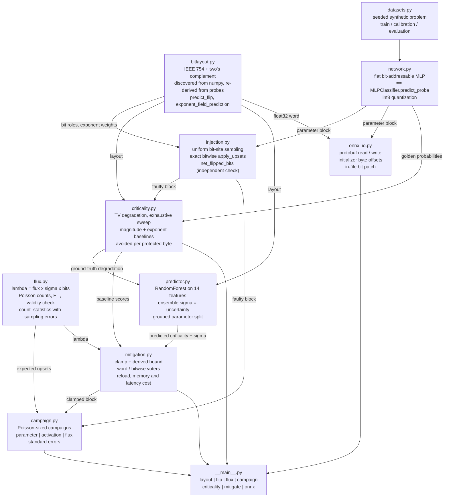
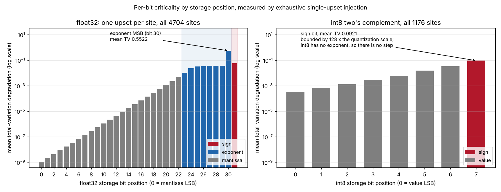
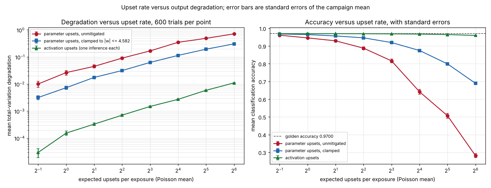
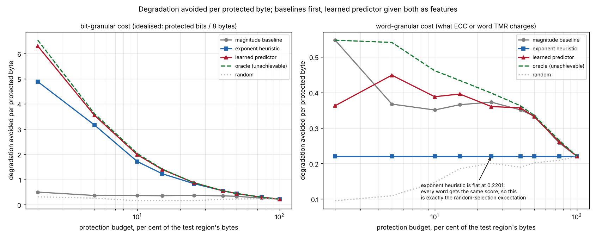
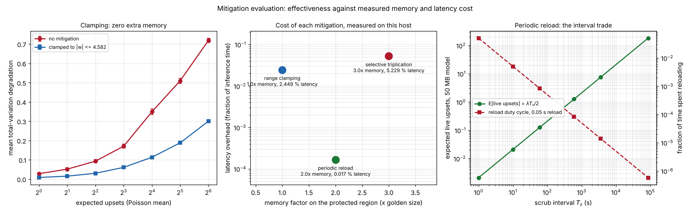

# BitFlipSim

Single-event-upset injection and mitigation accounting for small scikit-learn and ONNX models.


**Status: TESTING** · Class: compact · Validation level 2 (research grade) ·
AI-enabled · MIT · © 2026 OPTIMA Organisation

This software is research-grade. It is **not flight-qualified, not certified,
and not approved for operational aerospace use.** It models upsets; it does not
qualify parts, and nothing in it substitutes for radiation testing of real
hardware.

## The problem

Someone puts a classifier on a spacecraft and is asked how much of its
parameter memory needs protecting. They know that a bit flip in the exponent of
a float32 weight is worse than one in the mantissa, but not by how much, so
they triplicate everything and lose two thirds of their memory budget. Someone
else quotes "the model degrades by 3 % at our expected upset rate" from a
campaign of forty injections, with no standard error, so nobody can tell
whether that is different from 1 % or from 8 %. A third person wants to clamp
the weight range as a cheap mitigation and cannot say what it guarantees, only
that the numbers got smaller.

## What this does

- **Discovers the storage layout instead of asserting it.** Every IEEE 754
  field - `nmant`, `nexp`, bias, the sign-bit index - is taken from
  `numpy.finfo` and then re-derived a second way from probe encodings, and the
  single-bit-flip prediction is computed from the layout formula in exact
  integer arithmetic. **0 mismatches in 1680 (value, bit) comparisons** across
  float16, float32 and float64, and **0 in 2048 exhaustive int8 comparisons**
  (`validation/validate_ieee754_layout.py`).
- **Ties the injector to the rate model.** `lambda = flux x cross-section x
  bits`, Poisson counts, and the population count of `golden XOR faulty`
  equalling the drawn count in **500 of 500 trials**. Sample mean and variance
  match the Poisson prediction to a worst **|z| = 2.517** over six expectations
  at n = 200000, with a chi-square fit of **p = 0.4159**
  (`validation/validate_poisson_counts.py`).
- **Measures per-bit criticality exhaustively, for float32 and int8.** Every
  one of the 4704 float32 bit sites and 1176 int8 sites flipped once.
  **98.853 % of the damage sits in 9 of 32 bits** - the exponent field and the
  sign - a factor of **86.22** over the 23 mantissa bits
  (`validation/validate_criticality_methods.py`).
- **Bounds the output deviation when the parameter range is clamped, and
  proves it.** `B = 2C max(C(n_in Xmax + 1), 1)`, derived in
  `docs/UPSET_MODEL.md` §4.1 and checked against **every one of the 4704
  single-upset cases at three clamps: 0 violations**. Without the clamp, 50 of
  those 4704 upsets drive the logits non-finite, so no bound exists at all
  (`validation/validate_clamp_bound.py`).
- **Enumerates triplication rather than summarising it.** All 144 single-upset
  cases recovered by both voters; all **10296** double-upset pairs classified,
  showing that the word voter is silently wrong on exactly the **144** pairs
  that hit the same element at the same bit in two copies, and flags all 2160
  of the different-bit pairs (`validation/validate_triplication.py`).

## Who it is for

- Anyone sizing an upset budget for a small onboard model who wants the
  flux-to-degradation chain written down with its units, its assumptions and
  its validity range attached, instead of a spreadsheet of remembered factors.
- Anyone deciding between range clamping, selective triplication and periodic
  reload who wants each one's guarantee and each one's memory and latency cost
  in the same table.
- Anyone who has been asked "which bits matter" and wants the answer measured
  on their own model rather than inferred from a diagram of the IEEE 754 word.
- Anyone running scikit-learn or ONNX inference, where `pytorchfi` does not
  apply.
- Students and educators: every equation is derived in `docs/UPSET_MODEL.md`,
  and the validation scripts print their working.

## Who it is not for

- **Anyone with a PyTorch model.** Use [`pytorchfi`](https://pypi.org/project/pytorchfi/).
  It is the established tool, it has a published paper, and this package has no
  PyTorch support at all.
- **Anyone qualifying a part.** This models upsets in software. It will not
  give you a cross-section, an LET threshold or a SEL margin. Those come from a
  beam test, and no amount of simulation replaces one.
- **Anyone needing a radiation environment model.** The flux and cross-section
  are inputs you supply. The constants shipped here are round illustrative
  numbers and are labelled as such everywhere they appear. Use AP-9/AE-9,
  CREME or your own environment analysis.
- **Anyone with a large or non-dense model.** The ground-truth sweep is one
  forward pass per bit site; at 4704 sites it takes 2 s, at 10^9 sites it does
  not finish. The learned predictor exists for that case and has not been shown
  to transfer to it.
- **Anyone modelling multi-bit upsets, latch-up, total dose or SEFIs.** None of
  those are implemented; `docs/UPSET_MODEL.md` §2.3 lists what is left out.
- **Anyone who needs a general ONNX implementation.** `bitflipsim.onnx_io`
  reads, writes and patches float32 `raw_data` initializers and nothing else.

## Alternatives, honestly

| Alternative | What it does better | When to use this instead |
|---|---|---|
| [`pytorchfi`](https://pypi.org/project/pytorchfi/) (0.6.0, NCSA licence) | **The closest prior art, and the right tool for a PyTorch model.** Its description calls it "a runtime perturbation tool for deep neural networks (DNNs), implemented for the popular PyTorch deep learning platform", performing "perturbation on weights or neurons of a DNN during runtime", with a published paper (Mahmoud et al., *PyTorchFI: A Runtime Perturbation Tool for DNNs*, DSN-W 2020, pp. 25-31). It hooks into real PyTorch models of real size, which is a different and larger job than anything here. | When your model is **not** in PyTorch. PyTorch is unavailable in this build environment, so this package's claim is confined to the **scikit-learn / ONNX path**, plus the flux-and-exposure accounting and the mitigation-cost accounting, which the `pytorchfi` description does not mention. **No benchmark against `pytorchfi` was run and none is claimed**; the two were not executed side by side, because one of them cannot run here. |
| A hand-rolled `struct.pack`/`unpack` bit flip | Nothing to install, five lines. | When you want the layout *checked* rather than assumed, the exponent-flip effect *predicted* rather than observed, and the result tied to a flux and an exposure. Five lines will flip a bit correctly; they will not tell you that 50 of 4704 single upsets make the output non-finite, or that the clamp you added bounds the deviation by 1119.6. |
| [`onnxruntime`](https://pypi.org/project/onnxruntime/) | Runs ONNX graphs of any size and structure, fast, with real operator coverage. Used here as the ground truth that the hand-encoded model is valid. | When you need to *modify* the stored bytes of an initializer and re-run. `onnxruntime` executes a model; this one damages it at a definite byte offset and tells you what the damage should be. Use both: that is exactly what `validation/validate_onnx_path.py` does. |
| A radiation test campaign | It is the only thing that produces a cross-section, and it is the only evidence a reviewer will accept about a part. | When the question is about the *numerics* - which bits of this model matter, what a clamp guarantees, what triplication costs - rather than about the silicon. This package consumes a measured cross-section; it cannot produce one. |
| Triplicating everything | Simple, and it works for single upsets. | When you have a byte budget and need to know what a partial protection buys. The tables below say what each ranking avoids per protected byte, including the budgets where the free baseline beats the learned model. |

**The narrow defensible claim.** This package is *bit-level upset injection for
small scikit-learn and ONNX models, with the storage layout verified rather
than assumed, a flux-and-exposure rate model with its sampling errors, and
mitigation evaluation with derived guarantees and measured costs.* It is **not**
a PyTorch tool, **not** a radiation environment model, and **not** a part
qualification method.

## Install and first run

```bash
git clone https://github.com/OmAcharya-avtr/bitflipsim.git
cd bitflipsim
python -m venv .venv && source .venv/bin/activate
pip install -e ".[dev]"
python -m pytest tests/ -q
python -m bitflipsim layout --dtype float32
```

Expected output of the test run:

```
126 passed in 27.03s
```

Expected output of the first command:

```
dtype                 float32
storage bits          32
sign bit              31
exponent field        bits 23..30 (8 bits)
mantissa field        bits 0..22 (23 bits)
exponent bias         127
reserved exponent     255 (inf / NaN)

independent re-derivation from probe encodings:
  mantissa_bits    finfo=23     probe=23     agree=True
  exponent_bits    finfo=8      probe=8      agree=True
  exponent_bias    finfo=127    probe=127    agree=True
  sign_bit         finfo=31     probe=31     agree=True
  total_bits       finfo=32     probe=32     agree=True
  overall agree    True
```

## A worked example

```python
import numpy as np
from bitflipsim import (
    BitUpset, apply_upsets, clamp_logit_bound, evaluate_protection,
    exponent_bit_baseline_scores, float_layout, make_problem, parameter_campaign,
    predict_flip, reference_parameters, sweep_bit_criticality, upset_rate,
    word_majority_vote,
)

problem = make_problem()
params = reference_parameters(problem)
layout = float_layout("float32")

# 1. What does one upset in the exponent MSB of a weight actually do?
weight = params.values[5]
prediction = predict_flip(weight, layout.exponent_msb, "float32")
print(f"w[5] = {weight!r}  bit {layout.exponent_msb} ({layout.role(layout.exponent_msb)})")
print(f"  -> {prediction.predicted_value!r}  regime {prediction.regime}")

# 2. How often should that happen? Rate = flux * cross-section * bits.
rate = upset_rate(flux_per_cm2_s=1.0e3, cross_section_cm2_per_bit=1.0e-14,
                  bit_count=params.layout.size * 32)
print(f"  lambda = {rate.rate_per_s:.4e} upsets/s = {rate.rate_fit:.4e} FIT "
      f"over {rate.bit_count} bits")

# 3. What does it cost in output terms, with and without a clamp?
limit = float(np.abs(params.values).max())
for label, clamp in (("unmitigated", None), ("clamped", limit)):
    result = parameter_campaign(params, problem.evaluation.x, problem.evaluation.y,
                                expected_upsets=8.0, trials=400,
                                rng=np.random.default_rng(0), clamp_limit=clamp)
    print(f"  mu=8 {label:<12} D = {result.mean_degradation:.4f} "
          f"+- {result.degradation_standard_error:.4f}, "
          f"accuracy {result.mean_accuracy:.4f}")

# 4. And the clamp comes with a bound, not just an improvement.
bound = clamp_logit_bound(limit, params.layout.n_in,
                          float(np.abs(problem.evaluation.x).max()))
print(f"  clamp C = {limit:.4f} bounds any single-upset logit deviation by {bound:.3f}")

# 5. Which bits are worth protecting, and what does the free heuristic get?
sweep = sweep_bit_criticality(params, problem.evaluation.x, problem.evaluation.y)
heuristic = exponent_bit_baseline_scores(params.layout.size, layout)
protection = evaluate_protection(heuristic, sweep.degradation,
                                 budget_bytes=params.layout.total_bytes * 0.05,
                                 itemsize_bytes=4, cost_model="bit",
                                 method="exponent heuristic")
print(f"  protecting {protection.protected_units} bits ({protection.cost_bytes:.1f} bytes) "
      f"avoids {protection.avoided_fraction:.1%} of all degradation, "
      f"{protection.avoided_per_byte:.4f} per byte")

# 6. Triplication recovers a single upset exactly.
trio = [params.values.copy() for _ in range(3)]
trio[1] = apply_upsets(trio[1], [BitUpset(5, layout.exponent_msb)])
voted, uncorrectable = word_majority_vote(*trio)
print(f"  TMR after one upset: recovered = {np.array_equal(voted, params.values)}, "
      f"flagged = {int(uncorrectable.sum())}")
```

Actual output (`validation/worked_example.py`, committed as
`validation/worked_example_output.txt`):

```
w[5] = np.float32(-0.16272853)  bit 30 (exponent)
  -> -5.537365042543434e+37  regime scaled
  lambda = 4.7040e-08 upsets/s = 1.6934e+05 FIT over 4704 bits
  mu=8 unmitigated  D = 0.1615 +- 0.0132, accuracy 0.8226
  mu=8 clamped      D = 0.0569 +- 0.0031, accuracy 0.9260
  clamp C = 4.5820 bounds any single-upset logit deviation by 1208.877
  protecting 235 bits (29.4 bytes) avoids 69.4% of all degradation, 2.8682 per byte
  TMR after one upset: recovered = True, flagged = 0
```

One weight moved from -0.163 to -5.5e37 because a single exponent bit changed,
and the whole output distribution with it. That is the result the rest of the
package is organised around.

## Architecture



No module imports another product. `numpy` and `scikit-learn` are required;
`matplotlib` is used only by the examples and `onnxruntime` only by
`bitflipsim.onnx_io`, its tests and its validation script.

## Screenshots



Notice that the left panel is a **step**, not a slope. The exponent MSB (bit 30)
is four orders of magnitude worse than the mantissa LSB, and the nine
exponent-and-sign bits carry 98.853 % of the damage. The right panel has no
step at all: two's-complement int8 has no exponent, so its worst bit is the
sign bit and its effect is bounded by 128 times the quantization scale. Both
panels share a y axis, so the vertical offset between them is real.



The error bars are standard errors of the campaign mean over 600 trials per
point, and they are wide for a reason: the per-trial degradation is
heavy-tailed, because most trials hit only mantissa bits and a few hit bit 30.
Clamping moves the parameter curve down by roughly a factor of three at every
rate. The activation curve is two orders of magnitude lower, which is not
robustness: an activation upset corrupts one value of one sample of one
inference, while a parameter upset persists until the next scrub.



Left: at bit granularity the learned predictor tracks the oracle closely and
the exponent heuristic is just behind it, while the magnitude baseline is
barely above random. Right: the same methods at word granularity, where the
exponent heuristic is a **flat line at the random-selection expectation** - it
gives every word the same score and therefore carries no word-level information
at all - and the magnitude baseline beats the learned predictor at most
budgets.



Left: what clamping buys against upset rate. Middle: what each mitigation costs
in memory and in latency, measured on the build host - note that clamping is
free in memory and triplication is not. Right: the scrub-interval trade for a
50 MB model at the illustrative flux, with expected live upsets rising linearly
in `T_s` while the reload duty cycle falls as `1/T_s`.

## Validation evidence

Full detail, including the checks that failed to favour the learned model, in
[`validation/VALIDATION.md`](validation/VALIDATION.md). Every number below came
from a committed script with its committed raw output.

| Check | Reference | Result | Tolerance |
|---|---|---|---|
| Layout re-derived from probe encodings, float16/32/64 | IEEE 754-2019 interchange formats, derivation in `docs/UPSET_MODEL.md` §1.1 | all 5 fields agree, all 3 dtypes | exact |
| Flip prediction vs actual flip | layout formula in integer arithmetic | **0 mismatches** in 1680 (value, bit) pairs | bit-exact |
| **Exponent sign bit magnitude change, float32** | `2**(+-2**(nexp-1)) = 2**(+-128)` | worst relative deviation **0.000e+00** over 11 normal cases; the other 4 match their predicted inf / subnormal regimes exactly | 0 |
| int8 two's-complement flip delta | `+-2**k`, `+-2**(w-1)` on the sign bit | **0 mismatches** in 2048 exhaustive comparisons | exact |
| **Injected upsets equal drawn upsets** | population count of `golden XOR faulty` | 4012 drawn, **4012 flipped**, 0 mismatched trials of 500 | exact |
| **Poisson mean and variance** | `E[K]=Var[K]=mu`, `se(mean)=sqrt(mu/n)`, `se(S2)=sqrt((mu+2mu^2)/n)` | worst **\|z\| = 2.517** over 6 expectations x 2 statistics, n = 200000 | \|z\| < 4 |
| Chi-square fit of the count histogram | Poisson pmf at mu = 6 | chi2 = **19.649**, 19 dof, **p = 0.4159** | p > 0.01 |
| `E[live upsets] = lambda T_s / 2` | derived in `docs/UPSET_MODEL.md` §4.3 | worst **\|z\| = 0.961** over 4 configurations | \|z\| < 4 |
| **Clamped range bounds the deviation** | `B = 2C max(C(n_in Xmax + 1), 1)` | B = **1119.613957**, worst measured **142.435628**, **0 violations in 4704 exhaustive single-upset cases** | no violation |
| The same at C/2 and C/4 | as above | B = 279.903 vs 71.218; B = 69.976 vs 24.104; **0 violations** each | no violation |
| **Without clamping there is no bound** | - | **50 of 4704** upsets give non-finite logits; worst finite deviation 2.786753e+39 | reported |
| **TMR single upsets, exhaustive** | word and bitwise voters | **144 of 144** recovered by both, 0 wrong, 0 flagged | exact |
| **TMR double upsets, exhaustive** | all 10296 pairs | same copy 3384/3384 ok; different elements 4608/4608 ok; **same element same bit 0/144 - silently wrong**; same element different bit 0/2160 corrected but **2160/2160 flagged** | exact |
| Exponent + sign share of total damage | measured | **98.853 %** in 9 of 32 bits, factor **86.22** over the mantissa | > 10x |
| **Avoided per byte, bit cost, 5 % budget** | the specification's metric | exponent heuristic **3.164676**, learned **3.550208** (**+12.2 %**), magnitude 0.364869, oracle 3.616972, random 0.258950 | reported |
| **Avoided per byte, word cost** | what ECC / word TMR charges | **exponent heuristic 0.220135 at every budget - the random-selection expectation**; magnitude beats learned at 4 of 6 budgets | reported |
| Uncertainty coverage at 2 sigma | fraction of held-out targets inside | **0.878178** vs Gaussian 0.954500 | reported |
| numpy forward pass = `MLPClassifier.predict_proba` | scikit-learn 1.9.1 | **0.000000e+00** with float64 storage | bit-exact |
| ONNX round trip via onnxruntime 1.29.0 | hand-encoded protobuf | max \|logit difference\| **6.260614e-06**; 4 of 4 initializers bit-exact; 6 of 6 in-file flips match `predict_flip` | < 1e-4 |

### Where a baseline won, or a check did not come out clean

| Item | What happened |
|---|---|
| **Exponent-bit heuristic at word granularity** | It does not merely lose, **it carries no information at all**. Every word gets the same score, so its avoided-per-byte figure is pinned at 0.220135 - exactly the random-selection expectation - at every budget, and a plain magnitude ranking beats it everywhere. The learned predictor loses to that same magnitude baseline at 4 of 6 budgets. |
| **Exponent-bit heuristic at bit granularity** | The learned predictor is ahead by **+12.2 %** at a 5 % budget. But the heuristic costs **zero injections and zero training** and already reaches **87.5 %** of the oracle, against the learned model's 98.2 % bought with **2816 injections** plus a forest fit. Per unit of effort the heuristic wins, and for anyone who cannot run a ground-truth sweep on their own model it is the method to use. |
| **Uncertainty calibration** | Coverage at two ensemble standard deviations is 0.8782 against a Gaussian 0.9545. Forest tree dispersion understates predictive variance. Published as measured; no recalibration layer was added. |
| **Clamping bound tightness** | Never exceeded in 4704 exhaustive cases, and **loose by a factor of 7.86**. A loose bound that holds is published rather than a tight estimate that does not. |
| **"Triplication fails on double upsets"** | Only **144 of 10296** double-upset pairs (1.399 %) actually defeat the word voter silently; 7992 are recovered and 2160 are detected. The blanket statement is wrong and the four numbers are published instead. |
| **Poisson validity at high rates** | At mu = 64 the per-bit probability is 1.36e-02, above the 1e-3 threshold, so `poisson_validity` reports `False`. The point is still run and plotted with the flag reported, because deleting it would hide the edge of the model's validity. |
| **int8 quantization is not lossless** | On the 300-sample evaluation split it shifts the largest per-class probability by **0.056143** while changing **0 of 300** argmax predictions; on the smaller 120-sample test fixture it changes **1 of 120**. Pinned by a test as a measurement, not absorbed into a widened bound. Quantization error is not an upset. |

## API reference

<details>
<summary><strong>Full public surface, with units</strong></summary>

### `bitflipsim.bitlayout`

| Name | Description |
|---|---|
| `float_layout(dtype)` | `FloatLayout` for float16/32/64, discovered from `numpy.finfo` |
| `int_layout(dtype)` | `IntLayout` for int8/16/32, two's complement |
| `FloatLayout.role(position)` | `"sign"`, `"exponent"` or `"mantissa"` |
| `FloatLayout.exponent_weight(position)` | place value within the biased-exponent field, dimensionless |
| `IntLayout.flip_delta(value, position)` | exact integer change from flipping that bit |
| `to_bits(value, dtype)` / `from_bits(bits, dtype)` | storage word <-> value |
| `flip_bit(value, position, dtype)` | one-bit flip, floats and signed integers |
| `bits_of_array(array)` | unsigned-integer view of an array |
| `exponent_field(value, dtype)` / `mantissa_field(value, dtype)` | stored fields, dimensionless |
| `predict_flip(value, position, dtype)` | `FlipPrediction`: regime, predicted value, ratio, delta |
| `exponent_field_prediction(value, position, dtype)` | exact integer field prediction, no overflow |
| `exponent_scale_factor(position, direction, dtype)` | `2**(+-2**(position-nmant))` |
| `verify_float_layout(dtype)` | independent re-derivation from probe encodings |
| `bit_site_count(n_elements, bits_per_element)` | population size, dimensionless |

### `bitflipsim.flux`

| Name | Description |
|---|---|
| `upset_rate(flux_per_cm2_s, cross_section_cm2_per_bit, bit_count)` | `UpsetRate`, `rate_per_s` in upsets s^-1 |
| `UpsetRate.rate_fit` | the same rate in FIT (per 1e9 device-hours) |
| `UpsetRate.mean_time_between_upsets_s` | `1/lambda`, s |
| `UpsetRate.expected_upsets(exposure_s)` / `.exposure_for_expected_upsets(mu)` | `mu = lambda t` and its inverse |
| `poisson_validity(rate, exposure_s)` | per-bit probability and a `within_validity` flag at 1e-3 |
| `sample_upset_counts(rate, exposure_s, trials, rng)` | Poisson counts, int64 |
| `count_statistics(counts, expected)` | `CountStatistics` with `se(mean)`, `se(variance)` and both z scores |
| `ILLUSTRATIVE_FLUX_PER_CM2_S`, `ILLUSTRATIVE_CROSS_SECTION_CM2_PER_BIT` | round demonstration constants, **not measured figures** |

### `bitflipsim.injection`

| Name | Description |
|---|---|
| `BitUpset(element_index, bit_position)` | one upset site |
| `sample_upsets(n_elements, bits_per_element, count, rng, allow_repeat=False)` | uniform draw, distinct by default |
| `apply_upsets(array, upsets)` | exact bitwise injection, any 8/16/32/64-bit dtype |
| `net_flipped_bits(original, faulty)` | population count of the XOR, an independent check |
| `distinct_site_count(upsets)` / `upset_site_histogram(upsets, bits)` | sampler diagnostics |

### `bitflipsim.network`

| Name | Description |
|---|---|
| `make_layout(n_in, n_hidden, n_out, itemsize_bytes=4)` | `ParameterLayout` for `[W1\|b1\|W2\|b2]` |
| `ParameterLayout.byte_offset_of(i)` / `.tensor_of(i)` / `.layer_of(i)` / `.is_bias(i)` | parameter addressing |
| `MlpParameters(values, layout)` | flat bit-addressable parameter block |
| `.logits(x)` / `.probabilities(x)` / `.predict(x)` / `.hidden_activations(x)` | forward pass; `predict` returns `-1` on a non-finite row |
| `softmax(logits)` | with the stated NaN and `+-inf` conventions |
| `from_sklearn(estimator, itemsize_bytes=4)` | pack a fitted one-hidden-layer `MLPClassifier` |
| `quantize_int8(params)` | symmetric per-tensor int8, `Int8Quantization` |

### `bitflipsim.criticality`

| Name | Description |
|---|---|
| `total_variation(golden, faulty)` / `mean_total_variation(...)` | TV distance, `[0, 1]`, NaN row -> 1 |
| `accuracy(predictions, labels)` | class `-1` always wrong |
| `sweep_bit_criticality(params, x, y)` | exhaustive float32 ground truth, `CriticalitySweep` |
| `sweep_quantized_bit_criticality(quantization, x, y)` | the same for int8 codes |
| `CriticalitySweep.by_bit_position()` / `.by_parameter()` / `.flat_degradation()` | views of the sweep |
| `magnitude_baseline_scores(params)` | baseline 1 |
| `exponent_bit_baseline_scores(n_parameters, layout)` | baseline 2 |
| `oracle_scores(degradation)` / `random_scores(shape, rng)` | upper and lower reference points |
| `evaluate_protection(scores, degradation, budget_bytes, itemsize_bytes, cost_model, method)` | `ProtectionResult`: avoided, cost_bytes, avoided_per_byte, avoided_fraction |

### `bitflipsim.predictor`

| Name | Description |
|---|---|
| `build_features(params, x_calibration, layout)` | 14 injection-free features per bit site |
| `FEATURE_NAMES` | their names, in column order |
| `split_parameters(n_parameters, bits, train_fraction=0.6, seed=7)` | grouped `ParameterSplit` |
| `CriticalityPredictor(n_estimators=160, max_depth=10, seed=11)` | `.fit`, `.predict`, `.feature_importances`, `.importance_table()` |
| `CriticalityPrediction` | `.expected`, `.log_mean`, `.log_sigma`, `.relative_sigma` |
| `uncertainty_calibration(prediction, degradation, k=2.0)` | measured coverage against the Gaussian reference |

### `bitflipsim.mitigation`

| Name | Description |
|---|---|
| `clamp_parameters(params, limit)` | clip to `[-C, C]`; NaN -> 0, `+-inf` -> `+-C` |
| `clamp_logit_bound(limit, n_in, max_abs_input)` | `B = 2C max(C(n_in Xmax + 1), 1)` |
| `word_majority_vote(a, b, c)` | `(voted, uncorrectable)`; flags when all three differ |
| `bit_majority_vote(a, b, c)` | `(a&b)\|(a&c)\|(b&c)`; never flags |
| `triplication_cost`, `reload_cost`, `clamping_cost` | `MitigationCost`: extra bytes, memory factor, latency fraction |
| `expected_live_upsets(rate_per_s, scrub_interval_s)` | `lambda T_s / 2`, dimensionless |
| `measure_clamp_latency(n_parameters, repeats=200)` | host measurement, s and ns per parameter |

### `bitflipsim.campaign`

| Name | Description |
|---|---|
| `parameter_campaign(params, x, y, expected_upsets, trials, rng, clamp_limit=None)` | `CampaignResult` with standard errors |
| `activation_campaign(...)` | the same for post-ReLU hidden activations |
| `flux_campaign(params, x, y, rate, exposure_s, trials, rng)` | specified by flux and exposure |
| `trials_for_standard_error(sample_std, target)` | `n = ceil((s/e)**2)` |
| `single_upset_sites(params, positions=None)` | every site, or every site at given bit positions |

### `bitflipsim.onnx_io`

| Name | Description |
|---|---|
| `build_mlp_onnx(params, ...)` | serialise the reference MLP as an ONNX `ModelProto` |
| `list_initializers(model_bytes)` | `Initializer` records with byte offsets into the file |
| `Initializer.array(model_bytes)` | decode float32 `raw_data` |
| `flip_initializer_bit(model_bytes, initializer, element_index, bit_position)` | flip one bit **in the file bytes** |

### CLI

```
python -m bitflipsim layout      [--dtype float16|float32|float64|int8|int16|int32]
python -m bitflipsim flip        --value V --bit B [--dtype ...]
python -m bitflipsim flux        --flux PHI --cross-section SIGMA --bits N [--exposure T]
python -m bitflipsim campaign    [--expected MU] [--trials N] [--clamp] [--seed S]
python -m bitflipsim criticality [--budget-fraction F] [--cost-model bit|word] [--seed S]
python -m bitflipsim mitigate    [--scrub-interval S] [--reload-time S]
python -m bitflipsim onnx        [--out FILE]
```

`python -m bitflipsim criticality --budget-fraction 0.05` prints:

```
test parameters       59 of 147 (grouped split, seed 7)
cost model            bit
budget                11.80 bytes (0.050 of the test region)
method                    avoided     per byte   fraction
magnitude_baseline       4.287214     0.364869   0.082523
exponent_heuristic      37.184941     3.164676   0.715759
learned_predictor       41.714948     3.550208   0.802956
oracle                  42.499415     3.616972   0.818056
random                   3.042667     0.258950   0.058567

uncertainty coverage at k=2  0.878178 (Gaussian reference 0.954500)
mean abs error (log1p)       4.624248e-03
top features:
  heuristic_log2_relative          0.664403
  biased_exponent                  0.118038
  log2_abs_weight                  0.081391
  abs_weight                       0.077793
  bit_position                     0.031904
```

</details>

## Limitations

1. **This models upsets; it does not qualify parts.** The flux and the
   cross-section are inputs you must supply from an environment model and a
   beam test. The constants shipped here (`1e3 particles cm^-2 s^-1`,
   `1e-14 cm^2 bit^-1`) are round illustrative numbers chosen so the examples
   run, they are named `ILLUSTRATIVE_*`, and they are **not** attributable to
   any measured environment or part.
2. **The upset model is single-bit, independent and uniform.** Multiple-bit
   upsets from one particle, angular dependence, shielding, single-event
   functional interrupts, latch-up, total ionising dose and displacement damage
   are all outside it. `docs/UPSET_MODEL.md` §2.3 lists them in one place.
3. **A single effective cross-section is a first-order estimate.** The real
   object is a cross-section that varies with linear energy transfer, and the
   correct rate is an integral of that curve over the environment's LET
   spectrum. This package collapses that to one number.
4. **The Poisson limit has a validity range and the package tells you when you
   leave it.** `poisson_validity` flags per-bit probability above 1e-3; at
   mu = 64 on the reference model it reports `False`, and the figure is still
   plotted with the flag reported rather than removed.
5. **The reference model is 147 float32 parameters.** The *direction* of the
   criticality result - the exponent field dominating the mantissa - follows
   from the IEEE 754 layout and is not a property of this model. The *size of
   the learned predictor's margin over the baselines* is a property of this
   model and this dataset, and nothing here establishes that it transfers to a
   realistic one. This is the most important limitation in this file.
6. **The clamping bound is for single upsets on this architecture.** It is
   derived for the two-layer ReLU network of `bitflipsim.network` and verified
   exhaustively for it. It is not a general bound for an arbitrary graph, and
   it is loose by a factor of 7.86 against the worst measured case.
7. **Triplication's guarantee is single-upset only**, and the word voter is
   silently wrong on the 1.399 % of double-upset pairs that hit the same
   element at the same bit in two copies. Tripling a region also triples the
   exposed bits in it.
8. **The uncertainty output is not calibrated.** Measured coverage at two
   ensemble standard deviations is 0.8782 against a Gaussian 0.9545. Use it to
   rank and to flag, not as a predictive interval.
9. **The bit-granular cost model is idealised.** No real ECC or TMR scheme
   protects individual bits; it is a lower bound on cost and therefore an upper
   bound on every method's score. The word-granular model is the realistic one,
   and the free heuristic is uninformative there.
10. **`bitflipsim.onnx_io` is not a general ONNX implementation.** float32
    `raw_data` initializers only; it does not execute graphs, and reports
    `float_data` tensors, other dtypes, external data, subgraphs and sparse
    initializers as unsupported rather than skipping them silently.
11. **Compute budget.** Everything here was built and measured on **one CPU
    core shared with four other build agents**. Measured there, the test suite
    takes 27 to 41 s depending on contention, the longest validation script
    (`validate_criticality_methods.py`) 8 to 18 s, and the longest example
    (`criticality_methods.py`) 13 to 26 s. Wall-clock
    latency figures in `examples/mitigation_tradeoff.py` vary by tens of per
    cent between runs and are labelled as host measurements wherever they
    appear; no claim rests on them.
12. **PyTorch is not available in this environment**, which is why the claim is
    confined to the scikit-learn / ONNX path. No benchmark against `pytorchfi`
    was run and none is claimed.

## Reproducing every number

```bash
git clone https://github.com/OmAcharya-avtr/bitflipsim.git
cd bitflipsim
python -m venv .venv && source .venv/bin/activate
pip install -e ".[dev]"

ruff check src/ tests/ examples/ validation/
python -m pytest tests/ -q

python validation/validate_ieee754_layout.py          # layout, flip prediction, int8
python validation/validate_poisson_counts.py          # counts, chi-square, scrubbing
python validation/validate_clamp_bound.py             # the clamping bound, exhaustive
python validation/validate_triplication.py            # TMR, exhaustive
python validation/validate_criticality_methods.py     # baselines vs learned predictor
python validation/validate_onnx_path.py               # sklearn -> numpy -> ONNX
python validation/worked_example.py                   # the worked example above

MPLBACKEND=Agg python examples/bit_position_criticality.py
MPLBACKEND=Agg python examples/degradation_vs_upset_rate.py
MPLBACKEND=Agg python examples/criticality_methods.py
MPLBACKEND=Agg python examples/mitigation_tradeoff.py
```

Every script is deterministic given its seeds (dataset and model `20261005`,
split and forest `7`), except the wall-clock timings, which are host
measurements. Committed raw output for all of them is in `validation/`.

## Licence, citation, credits

MIT, © 2026 OPTIMA Organisation. See [`LICENSE`](LICENSE).

Citation metadata is in [`CITATION.cff`](CITATION.cff). Further reading in this
repository: [`docs/UPSET_MODEL.md`](docs/UPSET_MODEL.md) for every derivation,
[`MODEL_CARD.md`](MODEL_CARD.md) for the learned predictor,
[`DATASET_CARD.md`](DATASET_CARD.md) for the synthetic problem, and
[`validation/VALIDATION.md`](validation/VALIDATION.md) for the evidence.

### Credits

This is under reserved rights obtained by OPTIMA Organisation.
