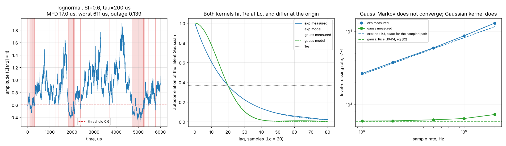
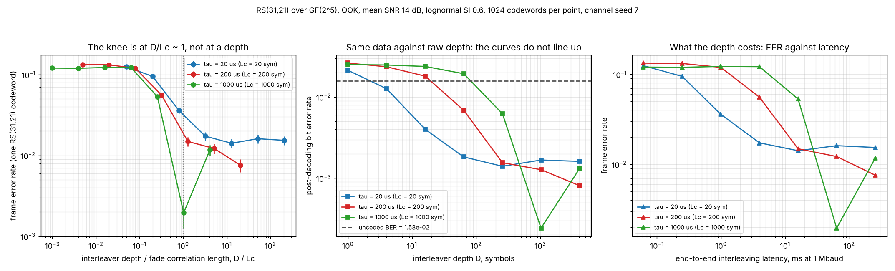
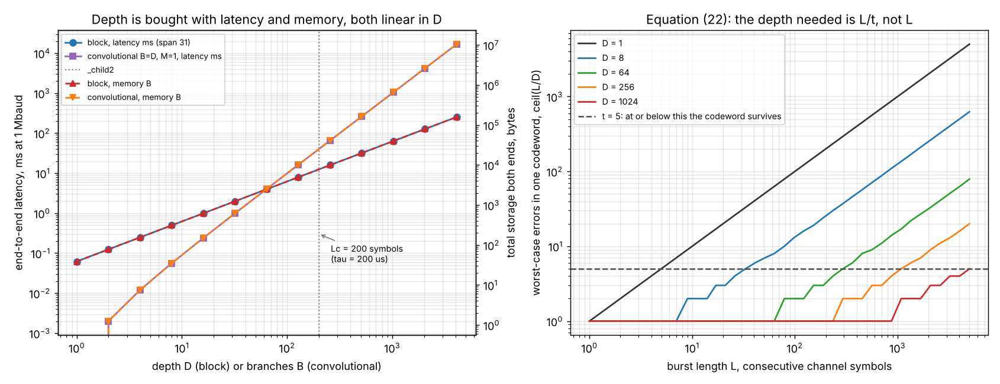
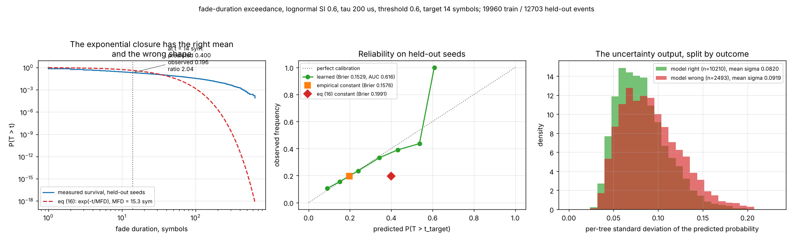

# CodedFade

How deep an interleaver has to be when an optical fade lasts milliseconds.


**Status: TESTING** · Class: flagship · **Validation level 3, hardware-pending** ·
AI-enabled · AGPL-3.0 · © 2026 OPTIMA Organisation

This software is research-grade. It is **not flight-qualified, not certified, and
not approved for operational aerospace use.** It models a channel and counts errors
in simulation; it has never been connected to an optical link.

## The problem

A free-space optical link designer picks a Reed-Solomon code from a table, picks an
interleaver depth because it was the depth on the last programme, and then discovers
in integration that a 20 ms scintillation fade walks straight through both. The
mature Python coding libraries will give them the code — correctly, and faster than
anything here — but they are built around memoryless channels and so they answer a
question about code rate when the question is about interleaver depth. Nothing in
them says how deep the interleaver must be against a fade of a stated duration, what
that depth costs in latency and in memory, or how long the fade will actually last
given what the receiver can see at the moment it starts.

## What this does

- **Generates fading as a sample path, so fade duration is an output and not an
  input.** Lognormal and gamma-gamma amplitude fading with a specified temporal
  correlation, as filtered-Gaussian / Gauss-Markov paths. At `SI = 0.6`,
  `tau = 200 us`, `fs = 1 Mbaud` and an amplitude threshold of 0.6 the measured mean
  fade duration is **15.50 symbols** against the exact analytic **15.26** (+1.53 %),
  with a **median of 3** and a worst fade of **690** in a 2-second record
  (`validation/validate_cross_check_x1.py`).
- **Produces the curve with the knee in it.** Post-decoding BER and FER against
  interleaver depth, parameterised by `D/Lc`, the ratio of depth to fade correlation
  length. At `Lc = 200` symbols the FER falls from **0.133** at `D = 1` to **0.0076**
  at `D = 4096`, and **almost all of that gain arrives between `D/Lc = 0.08` and
  `D/Lc = 1.28`** (`validation/validate_depth_sweep.py`).
- **States what the depth costs, because that is the trade.** Every depth is
  reported with its end-to-end latency in symbols and milliseconds and its memory in
  bytes: `D = 256` at 1 Mbaud costs **15.872 ms** and **9 920 B**; `D = 4096` costs
  **253.952 ms** and **158 720 B** (`validation/validate_interleaver_cost.py`).
- **Implements the codes in-package and proves the boundary.** Reed-Solomon over
  GF(2^m) and a convolutional code with Viterbi decoding, in numpy, no new
  dependencies. RS(15,11) corrects **all 225** single-symbol and **all 23 625**
  double-symbol error patterns exhaustively, and **0 of 20 000** three-symbol
  patterns are decoded successfully to the original
  (`validation/validate_rs_known_answers.py`).
- **Carries the hardware contract that a level-4 claim would eventually be measured
  against.** One backend interface, a fully implemented simulated backend, a
  contract-only device backend, and **one shared contract suite parameterised over
  both** (13 contract tests, each run twice). Plus executable preflight checks, a
  dry-run mode and a backout path. **Nothing here has been measured on hardware.**
- **Measures where the textbook closure of the level-crossing result fails.**
  `P(T > t) = exp(-t/MFD)` over-predicts the fade-duration exceedance at `t = MFD` by
  a factor of **2.0113** on held-out data (0.399641 predicted against 0.198693
  observed). That is the most useful number in the product and it is a defect of the
  analytic result, published as measured (`validation/validate_ai_vs_baseline.py`).

## Who it is for

- Anyone choosing an interleaver depth for an optical link whose fades are
  correlated, who wants the depth, the latency and the memory in one table against a
  stated fade duration.
- Anyone who needs fade duration and level-crossing rate as **sample statistics of a
  named seeded series**, with the definitions written down, so that two tools can be
  compared without arguing about what was measured.
- Anyone preparing to put a modem/codec on a Jetson-class board who wants the
  deployment, dry-run and recovery path written as runnable checks before the board
  arrives.
- Anyone who wants to see the analytic level-crossing result and a learned predictor
  benchmarked against each other on the same held-out data, with both results
  published.
- Students and educators: every equation is derived in the module docstrings with its
  units, assumptions and validity range, and each validation script prints its
  working.

## Who it is not for

- **Anyone who needs a fast, general, well-tested Reed-Solomon or BCH
  implementation.** Use [`galois`](https://pypi.org/project/galois/) or
  [`reedsolo`](https://pypi.org/project/reedsolo/). They are better at it and
  `reedsolo` ships an optional Cython extension; the decoder here is pure Python and
  takes **7.44 ms** to correct a `t`-error RS(31,21) codeword on the build host
  (`benchmark/benchmark_results.json`).
- **Anyone who needs a general communications toolbox.** Use
  [`commpy`](https://pypi.org/project/commpy/) or
  [`komm`](https://pypi.org/project/komm/). See the table below; `commpy` 1.2.0's
  own description lists LDPC, polar and turbo codes, OFDM, MIMO and block and
  convolutional interleaving, none of which is here.
- **Anyone wanting a shot-noise-limited or APD receiver.** Equation (26) assumes
  signal-independent noise and is wrong for those. Photon-counting receivers are a
  different product.
- **Anyone wanting hardware numbers.** The device backend raises
  `NotImplementedError`. Everything in `benchmark/benchmark_results.json` was
  measured on a shared cloud container and says so in its own output file.
- **Anyone wanting a turbulence propagation model.** Scintillation index and
  correlation time are *inputs you supply*. There is no path geometry, no `Cn2`
  profile, no wavelength, no aperture averaging. Use
  [`itur`](https://pypi.org/project/itur/) or your own propagation analysis to get
  them.
- **Anyone needing LDPC, turbo or polar codes, soft-decision Reed-Solomon, or
  iterative decoding.** None of it is implemented.

## Alternatives, honestly

Every package below was checked on 2026-10-06 with `pip index versions <name>`,
which returned a version list for each, and characterised from its own PyPI
description. `commpy` is **cited, not used**: its `crcmod` dependency fails to build
a wheel in this container, which is also why nothing here imports it.

| Alternative | What it does better | When to use this instead |
|---|---|---|
| [`galois`](https://pypi.org/project/galois/) 0.4.11, MIT | **The right tool for finite-field arithmetic and for the codes themselves.** Its description offers "all Galois fields GF(p^m), including arbitrarily large fields", claims to be faster than native NumPy for `GF(p)`, integrates with `np.linalg` and `np.fft`, and ships `BCH` and `ReedSolomon` forward-error-correction classes. | When the question is not the code but the interleaver depth against a stated fade duration, with the latency and memory of each depth. `galois` will encode and decode better than this package; it does not generate a temporally correlated optical fading path or tell you what depth that path demands. |
| [`reedsolo`](https://pypi.org/project/reedsolo/) 1.7.0, Public Domain | A dedicated "universal errors-and-erasures Reed-Solomon Codec" with an "optional speed-optimized Cython/C extension" and erasure decoding, which this package does not have. Its own description says it is "better suited for data storage protection". | When you need the fading channel, the fade statistics and the depth sweep around the code. For raw coding throughput, use `reedsolo`. |
| [`commpy`](https://pypi.org/project/commpy/) 1.2.0, Apache-2.0 | **The broadest overlap, and broader than this package almost everywhere.** Its description lists CRC, Hamming, cyclic, BCH, Reed-Solomon, convolutional codes with hard/soft Viterbi, LDPC, polar and turbo codes, **block and convolutional interleaving**, Gray-coded M-PSK/M-QAM/M-PAM with LLR demodulation, OFDM, MIMO, and channel models including Rayleigh/Rician fading and a Gilbert-Elliott bursty channel. If you can install it, start there. | When you need *optical* amplitude fading with a specified temporal correlation time (lognormal and gamma-gamma, not Rayleigh/Rician), fade-duration and level-crossing statistics from that path, the depth-versus-correlation-time sweep with its cost accounting, and the hardware abstraction layer. `commpy` has the interleavers; it does not have the fade statistics that tell you which depth to pick. **It also does not install in this container**, so nothing here was benchmarked against it and no speed or accuracy comparison is claimed. |
| [`komm`](https://pypi.org/project/komm/) 0.36.0, GPL-3.0 | "Tools for analysis and simulation of analog and digital communication systems", inspired by the MATLAB Communications System Toolbox, GNU Radio and CommPy. A clean, actively developed, far more general library. | Same answer as `commpy`: use `komm` for the general communications stack. The narrow case here is the correlated optical fade and the depth it forces. |
| [`scikit-dsp-comm`](https://pypi.org/project/scikit-dsp-comm/) 2.1.2, BSD | Ten modules of signals-and-systems and digital-communications teaching code built on `scipy.signal`, with real DSP coverage this package has none of. | When you need the channel's *temporal* statistics rather than DSP building blocks. |
| [`itur`](https://pypi.org/project/itur/) 0.4.0 | ITU-R propagation models: it produces atmospheric parameters. | This package *consumes* a scintillation index and a correlation time. It cannot produce either. Use both together. |
| Picking a depth from a rule of thumb | Free, and often right. | When you want the rule checked. The depth sweep here shows that at `Lc = 200` symbols a depth of 16 — which looks generous — buys a FER of 0.119 against 0.133 at no interleaving at all, while costing 0.992 ms. The rule of thumb that fails is "some interleaving is better than none"; what matters is `D/Lc`. |
| A hardware measurement on the real modem | It is the only thing that settles latency, throughput and memory, and the only evidence that closes validation level 4. | When the hardware does not exist yet. The abstraction layer, the contract test suite and the preflight/dry-run/backout paths here exist so that the first hardware session is about measurement and not about architecture. |

**The narrow defensible claim.** This package is *interleaver-depth sizing for a
coded optical link over a temporally correlated fading channel, with the fade
statistics computed as sample statistics of a named seeded path, the latency and
memory cost of every depth stated, and a hardware contract written before the
hardware.* It is **not** a better Reed-Solomon implementation, **not** a general
communications library, and **not** a turbulence propagation model.

## Install and first run

```bash
git clone https://github.com/OmAcharya-avtr/codedfade.git
cd codedfade
python -m venv .venv && source .venv/bin/activate
pip install -e ".[dev]"
python -m pytest tests/ -q
python -m codedfade fade --samples 200000
```

Expected output of the test run:

```
315 passed in 146.67s (0:02:26)
```

Expected output of `python -m codedfade fade --samples 200000`:

```
threshold amplitude     0.600000
samples                 200000
outage fraction         0.124750
down-crossings          1787
level-crossing rate     8935.000000 s^-1 (sample)
complete fades          1787 (censored 0)
mean fade duration      1.396195e-05 s (sample)
median fade duration    3.000000e-06 s (sample)
max fade duration       4.250000e-04 s (sample)
standard level u        -1.147442
analytic LCR            8228.471844 s^-1 (sampled Gauss-Markov, exact)
analytic MFD            1.526402e-05 s
depth for mean fade     14 symbols
```

The last line is the whole product in one number: at this channel and this symbol
rate, an interleaver shallower than 14 symbols is not spreading the average fade at
all.

## A worked example

```python
from codedfade import (
    BlockInterleaver, ChannelConfig, CodedLink, ModemConfig, ModemSession,
    ReedSolomon, RunMode, SimulatedModemBackend, fade_statistics,
    generate_amplitude, lognormal_standard_level, markov_mean_fade_duration,
    required_interleaver_depth, uncoded_bit_error_rate,
)

# 1. A channel whose fades last a definite length of time.
channel = ChannelConfig(scintillation_index=0.6, correlation_time_s=2.0e-4,
                        sample_rate_hz=1.0e6, marginal="lognormal",
                        kernel="exp", seed=41)
amplitude = generate_amplitude(channel, 2_000_000)
stats = fade_statistics(amplitude, threshold=0.6,
                        sample_rate_hz=channel.sample_rate_hz)

# 2. The analytic result, exact for the sampled Gauss-Markov path.
u = lognormal_standard_level(0.6, channel.scintillation_index)
mfd = markov_mean_fade_duration(u, channel.correlation_time_s,
                                channel.sample_rate_hz)

# 3. What depth does that imply, and what does it cost?
code = ReedSolomon(31, 21, 5)
for margin in (1.0, 3.0):
    depth = required_interleaver_depth(mfd, channel.sample_rate_hz, margin)
    cost = BlockInterleaver(depth, code.n).cost(channel.sample_rate_hz,
                                                bits_per_symbol=code.m)

# 4. Does it actually work? Same channel record at every depth.
link = CodedLink(code, channel, mean_snr_db=14.0)
for result in link.depth_sweep([1, 64, 1024], 1024):
    ...

# 5. The same loop behind the hardware abstraction layer, in dry-run mode.
session = ModemSession(SimulatedModemBackend(),
                       ModemConfig(n=31, k=21, m=5, depth=256,
                                   symbol_rate_hz=1.0e6),
                       RunMode.DRY_RUN, channel)
report = session.start()
payload = session.transfer(1, seed=0)   # None by design in dry-run mode
capture = session.finish()

# 6. And the backout path, because a half-finished run needs one.
session2 = ModemSession(SimulatedModemBackend(),
                        ModemConfig(n=31, k=21, m=5, depth=256,
                                    symbol_rate_hz=1.0e6),
                        RunMode.SIMULATION, channel)
session2.start()
aborted = session2.backout("receiver lost lock mid block")
```

Actual output of the full script (`validation/worked_example.py`, committed as
`validation/worked_example_output.txt`):

```
Lc = tau * Rs            200 symbols
sample MFD               15.50 us = 15.50 symbols
sample LCR               8191.0 s^-1
worst fade in the record 690.0 us
analytic MFD, eq (15)    15.26 us (sample / analytic - 1 = +0.0153)
depth for mean fade        16 symbols ->    0.992 ms,      620 B
depth for 3x mean fade     46 symbols ->    2.852 ms,     1782 B
uncoded BER              1.7279e-02
depth     1  D/Lc   0.01  FER 0.152344 +- 0.011230  post BER 3.452e-02  latency   0.062 ms
depth    64  D/Lc   0.32  FER 0.129883 +- 0.010505  post BER 1.392e-02  latency   3.968 ms
depth  1024  D/Lc   5.12  FER 0.028320 +- 0.005184  post BER 3.172e-03  latency  63.488 ms
preflight                PASS (6 checks)
dry-run payload          None
capture status           complete
captured counters        {'symbols': 7936, 'frames': 256, 'frames_ok': 256}
encode / decode stage s  0.0458 / 0.6072
backout status           aborted: receiver lost lock mid block
backend released         True
```

Read the third and fourth result lines together. A depth of 46 symbols is what the
*mean* fade asks for and costs 2.9 ms; the FER does not really move until the depth
passes the *correlation length* of 200 symbols, which costs an order of magnitude
more latency. Sizing to the mean fade duration is the mistake this package exists to
make visible.

## Architecture

```mermaid
flowchart TD
    CH["channel.py<br/>filtered-Gaussian sample paths<br/>exp / gauss kernels<br/>lognormal + gamma-gamma marginals<br/>Rytov -> alpha,beta, saturation branch refused"]
    FD["fade.py<br/>sample LCR / MFD / outage, definitions fixed<br/>Rice 1945 for the gauss kernel<br/>EXACT sampled Gauss-Markov rate, eq (14)<br/>required_interleaver_depth"]
    GF["gf.py<br/>GF(2^m) log/antilog tables<br/>primitivity verified at construction"]
    RS["reedsolomon.py<br/>systematic encoder<br/>Berlekamp-Massey / Chien / Forney"]
    CV["convolutional.py<br/>rate-1/n encoder, terminated trellis<br/>hard-decision Viterbi"]
    IL["interleave.py<br/>block (depth x span)<br/>Forney convolutional<br/>latency + memory per depth"]
    LK["link.py<br/>OOK, p_b = Q(sqrt(gbar) I)<br/>depth_sweep: one channel record, many depths<br/>FER, post BER, failures, miscorrections"]
    PR["predictor.py<br/>RandomForest on 10 causal features<br/>per-tree sigma = uncertainty<br/>split by path seed"]
    HAL["hal.py<br/>ModemBackend: simulated + device contract<br/>simulation / dry-run modes<br/>preflight, capture, backout"]
    CLI["__main__.py<br/>channel | fade | depth | code<br/>preflight | dryrun"]
    BM["benchmark/run_benchmark.py<br/>latency, memory, throughput<br/>method + environment in its own output"]

    CH -->|amplitude path| FD
    CH -->|irradiance path| LK
    CH -->|seeded paths| PR
    FD -->|MFD -> required depth| IL
    FD -->|analytic exceedance baseline| PR
    GF --> RS
    RS -->|codeword length = span| IL
    IL -->|permutation| LK
    RS -->|decoder| LK
    CV -->|burst sensitivity| IL
    CH -->|Lc for the depth check| HAL
    RS --> HAL
    IL --> HAL
    LK --> CLI
    FD --> CLI
    HAL --> CLI
    HAL --> BM
    LK --> BM
    PR -->|P(T > t) + sigma| IL
```

No module imports another product. `numpy`, `scipy` and `scikit-learn` are required;
`matplotlib` is used only by the examples and `joblib` only by
`validation/train_model.py`.

## Screenshots



Notice in the left panel that a fade is an **interval**, not an instant: the shaded
regions are the excursions below the threshold, and they vary from one sample to
several hundred. The right panel is the reason this package offers two correlation
kernels. The Gauss-Markov crossing rate (blue) keeps climbing as the sample rate
rises, by roughly `sqrt(fs)`, because an Ornstein-Uhlenbeck process has no finite
mean-square derivative and therefore no finite continuous-time crossing rate; the
Gaussian-kernel rate (green) settles on Rice's (1945) value. If you quote a crossing
rate for a first-order channel model, you are quoting your sample rate.



The left panel is the product's central result and the only axis that matters is
`D/Lc`. The middle panel is the identical data plotted against raw depth, where the
three curves do not line up at all — which is why a depth borrowed from another
link's design does not transfer. The right panel is the price: the same FER
improvement, read against end-to-end latency.



Left: latency and memory are both strictly linear in depth, and the dotted line is
the fade correlation length that the depth has to clear. Right: equation (22). A
burst of 2000 symbols still deposits 250 errors in one codeword at `D = 8`; the
depth that brings it under `t = 5` is what the left panel then costs you.



Left: the measured fade-duration survival function against the exponential closure
of the level-crossing result. The closure has the right mean by construction and the
wrong shape, and at `t = MFD` it over-predicts by a factor of 2.01. Middle: the
learned model is well calibrated where it has data and the exponential closure is
not; the empirical constant is almost as good as the learned model, which is the
honest comparison. Right: the uncertainty output separates right from wrong cases by
only 13 %, which is a weak signal and is reported as one.

## Validation evidence

Full detail, including the checks where the baseline won and the ones that did not
come out clean, in [`validation/VALIDATION.md`](validation/VALIDATION.md). Every
number below came from a committed script with its committed raw output.

| Check | Reference | Result | Tolerance |
|---|---|---|---|
| AR(1) autocorrelation vs `exp(-k/Lc)` | textbook AR(1) result, equation (2) | max deviation **0.002240** over lags 0–40 | < 0.02 |
| Gaussian-kernel autocorrelation vs `exp(-(k/Lc)^2)` | equation (3) | max deviation **0.003695** | < 0.03 |
| Lognormal marginal, 5 scintillation indices | `sigma_lnI^2 = ln(1+SI)`, Andrews & Phillips (2005) | KS p = **0.1247 / 0.9546 / 0.7971 / 0.4923 / 0.7220**; SI relative error 0.032 / 0.017 / 0.040 / 0.045 / **0.167** | p > 0.01 |
| Gamma-gamma SI identity, 5 Rytov variances | Al-Habash, Andrews & Phillips (*Opt. Eng.* 40(8), 2001), equations (6)–(9) | worst relative difference **3.7e-16** | exact |
| Gamma-gamma SI inversion round trip | as above | worst relative error **3.7e-16** over 5 targets | < 1e-6 |
| **Exact sampled Gauss-Markov crossing rate** vs a bivariate-normal Monte Carlo | equation (14) | **0.008228** per sample analytic against **0.0082268** from 2e6 draws | within 2 % |
| **Exact sampled crossing rate** vs a generated AR(1) path, 4 s records | equation (14) | relative difference **0.013035 / 0.016701 / 0.003635 / 0.000763** at `fs` = 1e5…1e6 | < 3 % |
| **Gauss-kernel crossing rate converges to Rice (1945)** | equation (12), 582.645238 s^-1 | measured 594.0 / 595.75 / 589.5 / 596.25 over a 10x range of `fs`; **0.95 / 1.10 / 0.57 / 1.14** standard errors, no growth with `fs` | within 3 SE |
| **Gauss-Markov crossing rate does NOT converge** | the OU process has no finite mean-square derivative | measured 2603.5 → 8234.75 s^-1 over the same 10x range of `fs` | reported, not a defect |
| Sample MFD vs equation (15), record length sweep | equation (15) | relative error **−0.0272 / +0.0181 / −0.0156 / −0.0029** at 1e5 → 4e6 samples | converges |
| **RS(15,11) single-symbol errors, exhaustive** | MDS property, `d = n-k+1 = 5` | **225 of 225** corrected | exact |
| **RS(15,11) double-symbol errors, exhaustive** | as above | **23 625 of 23 625** corrected | exact |
| **RS(15,11) at t+1 = 3 errors, 20 000 patterns** | beyond the correction radius | **0 recovered**; 5807 miscorrected (0.2904), 14 056 failed with the message wrong, **137 failed with the message intact** (0.00685 against the expected `C(4,3)/C(15,3) = 0.008791`) | 0 recovered |
| RS(31,21) at t, t+1, t+3 | as above | **4000 / 4000** recovered at `t`; **0** recovered at `t+1` and `t+3` | exact |
| **Convolutional encoder vs a hand trace** | the 6-step trace shown in `tests/test_convolutional.py` | `1011` → **111000010111** | bit-exact |
| Minimum terminated codeword weight, L = 12 | enumerated over all 4095 non-zero messages; **no published figure is cited** | **5 bits** | measured |
| Viterbi single-bit errors | — | **124 of 124** recovered | exact |
| Convolutional burst sensitivity | the reason interleaving exists | 2-bit bursts 12/12 recovered; **3-bit 1/11**; 4-bit and longer **0/11** | reported |
| **Block interleaver spacing = depth** | equation (23) | exact at all 13 depths from 1 to 4096 | exact |
| **Convolutional interleaver delay** | Forney's `M*B*(B-1)` | measured = predicted at all 7 configurations, including 930 at B=31, M=1 | exact |
| Convolutional memory against block | — | 930 vs 1922 symbols at B=31 against depth 31 | reported |
| **Decoding shortcut vs the full decoder** | MDS property | identical FER, BER, failures and miscorrections at 4 depths; **0 mismatches**; 4.98x to 664x faster | identical |
| Conditional BEP at 20 dB, `I = 1` | `Q(10)`, equation (26) | **7.619853024160593e-24** | 1e-9 relative |
| **Depth sweep, `Lc = 200` symbols** | — | FER **0.133 → 0.119 → 0.0557 → 0.0149 → 0.0122 → 0.00757** at `D` = 1, 16, 64, 256, 1024, 4096 | binomial SE reported |
| **Across-seed spread of FER** at `Lc = 1000` | 5 channel seeds | across-seed sd is **9.7x / 10.4x / 10.2x / 5.8x** the binomial SE at D = 64 / 256 / 1024 / 4096 | reported |
| **Exponential exceedance closure** | equation (16) with the exact MFD | predicted **0.399641**, observed **0.198693**, ratio **2.0113** | reported |
| **Learned vs best state-blind baseline** | Brier on 19 900 held-out events | learned **0.154194** against empirical constant **0.159215**: **+3.15 %** | reported |
| Learned ROC AUC vs state-blind | — | **0.6175** against **0.5000** | reported |
| Learned calibration | 10-bin ECE | **0.004311** against the empirical constant's 0.000793 | reported |
| Uncertainty separates wrong from right | per-tree sigma ratio | **1.1289** | reported |

### Where the baseline won, or a check did not come out clean

| Item | What happened |
|---|---|
| **The analytic closure of the exceedance is wrong by 2x** | `exp(-t/MFD)` predicts 0.3996 at `t = MFD` against an observed 0.1987. The level-crossing result fixes the mean and nothing else, and the fade-duration distribution is far from exponential: the median fade is 3 samples against a mean of 15.5. Equation (16) is kept, labelled an approximation, and its error published. |
| **The learned model barely beats a constant** | Against the empirical constant — the same state-blind structure with the measured frequency instead of the exponential assumption — the Brier improvement is **3.15 %**. The 23 % improvement against the exponential closure is almost entirely a calibration correction and would be a misleading headline. Both numbers are published. The real evidence that state matters is the AUC: 0.6175 against 0.5000. |
| **The learned model's uncertainty output is weak** | Mean per-tree sigma is 0.0733 on the cases it gets wrong against 0.0649 on the rest, a ratio of 1.1289. Good enough to rank, not good enough to gate. No recalibration layer was added to make it look better. |
| **The learned model has no evidence above a predicted 0.45** | 85 held-out events in reliability bin 5, 8 in bin 6, none above. Bin 6 is off by 0.265. The model card says not to use it there. |
| **`analytic_observed` has a terrible log loss** | 2.5688, five times the empirical constant's 0.4986, because estimating the mean fade duration from a 32-sample window sometimes produces a near-0 or near-1 exceedance. Its Brier (0.1987) looks fine; its log loss shows it is confidently wrong on a minority of events. Reported rather than dropped. |
| **Depth ordering above `D/Lc ~ 1` is not resolvable at this sample size** | At `Lc = 1000` symbols and 2048 codewords the across-seed standard deviation of FER is 5.8 to 10.4 times the binomial standard error, and the ordering between `D = 1024` and `D = 4096` **reverses between channel seeds**. The binomial error bar understates the uncertainty because codeword failures cluster on a handful of deep fades. Published, with the measurement, instead of presenting a single seed's ordering as a result. |
| **Depths well below `Lc` buy nothing and still cost everything** | At `Lc = 200` symbols, `D = 16` gives FER 0.119 against 0.133 at `D = 1`, for 0.992 ms of latency. At `Lc = 1000`, `D = 64` gives 0.1216 against 0.1201 — i.e. **no improvement at all**, within the error bar, for 3.968 ms. |
| **Scintillation-index estimator at `SI = 1.5`** | The sample scintillation index is off by **16.7 %** on a 400 000-sample record, against 1.7–4.5 % at `SI <= 1.0`. The estimator needs the fourth moment of a lognormal and is badly behaved in strong turbulence. Reported, not tightened by lengthening the record until it looked good. |
| **The gamma-gamma plane-wave parameterisation saturates** | `SI` is **not monotone** in the Rytov variance: it peaks at **1.2432** and falls again. The inversion is restricted to the increasing branch and refuses a higher target rather than returning the wrong branch. A link needing `SI > 1.24` cannot use the plane-wave gamma-gamma path here. |
| **Gamma-gamma temporal correlation is only approximate** | The correlation is imposed through a Gaussian copula, so the specified `tau` governs the latent Gaussian rather than the log-irradiance. The measured 1/e correlation time deviates by 0.5–3.1 %, which at this configuration is the same order as the lognormal rows' own estimator bias — so nothing larger than estimator error was detected. That is reported, not asserted as agreement, and no claim is made that the copula reproduces a physical two-scale temporal spectrum. |
| **The Forney formula was wrong in the first implementation** | The `b = 0` syndrome convention requires a leading `X_i` factor that the `b = 1` form omits. Omitting it produced the right error *positions* and the wrong error *values*, which the exhaustive known-answer test caught. The derivation is now in the decoder's docstring. |

## Cross-check X1 (binding, batch 05 specification)

`validation/validate_cross_check_x1.py` emits the mean fade duration and the
level-crossing rate as sample statistics of a fully specified seeded series, for
comparison with **P049 LinkOutage** at a tolerance of 2 % relative on each.

| Configuration | Value |
|---|---|
| distribution | lognormal |
| kernel | `exp` (Gauss-Markov / AR(1) filtered Gaussian) |
| scintillation index | 0.6 |
| correlation time | 2.0e-4 s |
| sample rate | 1.0e6 Hz |
| sample count | 2 000 000 |
| threshold amplitude | 0.6 |
| seed | 41 |
| random source | `numpy.random.default_rng(41).standard_normal(2000000)` in one call |
| `rho = exp(-1/(fs*tau))` | 0.995012479192682 |
| `sigma_lnI^2 = ln(1+SI)` | 0.470003629245736 |

| Quantity | Value |
|---|---|
| **level-crossing rate** | **8191.000000000000000 s^-1** |
| **mean fade duration** | **1.549737516786717e-05 s** |
| outage fraction | 0.126940500000000 |
| down-crossings | 16 382 |
| complete fades | 16 382 (1 censored) |

The definitions are repeated verbatim in the script and in
`codedfade.fade`'s docstring: a down-crossing is an index `i >= 1` with
`a[i-1] >= a_th` and `a[i] < a_th`; the rate is down-crossings divided by the whole
record duration; a fade is a maximal run below the threshold; runs touching either
end of the record are censored and excluded from the duration mean; a one-sample
fade has duration `1/fs`. **Neither quantity is compared to a wall-clock
measurement anywhere in this product.**

## API reference

<details>
<summary><strong>Full public surface, with units</strong></summary>

### `codedfade.channel`

| Name | Description |
|---|---|
| `ChannelConfig(scintillation_index, correlation_time_s, sample_rate_hz, marginal, kernel, seed)` | frozen configuration; validates on construction |
| `ChannelConfig.samples_per_correlation_time` | `Lc = tau * fs`, symbols, dimensionless |
| `ChannelConfig.log_irradiance_variance` | `ln(1 + SI)`, dimensionless |
| `correlated_gaussian(n, Lc, rng, kernel)` | unit-variance correlated Gaussian path |
| `generate_irradiance(config, n)` | normalised irradiance `I`, `E[I] = 1` |
| `generate_amplitude(config, n)` | `a = sqrt(I)`, `E[a**2] = 1` |
| `rytov_to_gamma_gamma(sigma_R2)` | `(alpha, beta)`, equations (7)–(9) |
| `gamma_gamma_scintillation_index(alpha, beta)` | `1/a + 1/b + 1/(ab)`, equation (6) |
| `gamma_gamma_parameters_from_si(SI)` | inverse on the monotone branch; raises above the peak |
| `GAMMA_GAMMA_SI_PEAK` | `(sigma_R2, SI)` at the saturation peak, computed at import |
| `autocorrelation(x, max_lag)` | biased sample ACF, normalised to 1 at lag 0 |
| `measured_correlation_time(series, fs, max_lag)` | 1/e correlation time of `log(series)`, s |

### `codedfade.fade`

| Name | Description |
|---|---|
| `fade_statistics(amplitude, threshold, fs)` | `FadeStatistics`; definitions in the module docstring |
| `FadeStatistics.level_crossing_rate_hz` | down-crossings per second, s^-1 |
| `FadeStatistics.mean_fade_duration_s` | mean complete-run length / `fs`, s |
| `FadeStatistics.outage_fraction` | `mean(a < threshold)`, dimensionless |
| `fade_runs(below)` | `(starts, lengths)` of maximal `True` runs |
| `lognormal_standard_level(a_th, SI)` | standardised Gaussian level `u`, equation (10) |
| `rice_crossing_rate_gauss_kernel(u, tau)` | Rice (1945), equation (12), s^-1 |
| `rice_mean_fade_duration_gauss_kernel(u, tau)` | equation (13), s |
| `markov_crossing_rate(u, tau, fs)` | **exact** for the sampled AR(1) path, equation (14), s^-1 |
| `markov_mean_fade_duration(u, tau, fs)` | equation (15), s |
| `exponential_exceedance(t, MFD)` | `exp(-t/MFD)`, equation (16), dimensionless |
| `required_interleaver_depth(MFD, Rs, margin)` | depth in symbols, `>= 1` |

### `codedfade.gf` and `codedfade.reedsolomon`

| Name | Description |
|---|---|
| `GF2m(m)` | GF(2^m) for `m` in {3,4,5,6,8}; primitivity verified at construction |
| `GF2m.mul/inv/div/power/alpha_power` | field arithmetic, exact integers |
| `GF2m.poly_eval/poly_mul` | polynomials over GF(2^m), ascending-degree coefficients |
| `PRIMITIVE_POLYNOMIALS` | the polynomial used for each `m`, binary |
| `ReedSolomon(n, k, m)` | systematic narrow-sense code; `t = (n-k)/2` |
| `ReedSolomon.encode(message)` | `n` symbols, `out[:k] == message` |
| `ReedSolomon.decode(received)` | `RSDecodeResult(message, success, corrected_symbols)` |
| `ReedSolomon.syndromes(received)` | `S_j = r(alpha**j)`, `j = 0..2t-1` |
| `symbols_to_bits` / `bits_to_symbols` | MSB-first packing |

### `codedfade.convolutional`

| Name | Description |
|---|---|
| `ConvolutionalCode(generators, constraint_length)` | terminated rate-1/n feedforward code |
| `.encode(message)` | uint8 0/1, length `n_out*(L+K-1)` including the zero tail |
| `.decode(received, message_bits)` | `ViterbiResult(message, path_metric)`, hard decision |
| `.terminated_rate(L)` | rate including the tail, dimensionless |
| `.minimum_terminated_weight(L)` | exhaustive minimum non-zero codeword weight, bits |

### `codedfade.interleave`

| Name | Description |
|---|---|
| `BlockInterleaver(depth, span)` | row-in / column-out; exact inverse |
| `.cost(Rs, bits_per_symbol)` | `InterleaverCost`: latency in symbols and ms, memory in symbols and bytes |
| `.max_errors_per_codeword(L)` | `ceil(L/D)`, equation (22) |
| `ConvolutionalInterleaver(branches, delay_increment, fill)` | Forney construction |
| `.total_delay_symbols` / `.memory_symbols` | `M*B*(B-1)` |
| `burst_dispersion(depth, burst)` | equation (22) as a free function |

### `codedfade.link`

| Name | Description |
|---|---|
| `q_function(x)` | `0.5*erfc(x/sqrt(2))`, dimensionless |
| `conditional_bit_error_probability(I, mean_snr_db)` | `Q(sqrt(gbar) I)`, equation (26) |
| `uncoded_bit_error_rate(channel, snr_db, n)` | realisation average of equation (26) |
| `CodedLink(code, channel, mean_snr_db, exact_decode)` | the coded link |
| `.run(depth, codewords, data_seed)` | `LinkResult` |
| `.depth_sweep(depths, codewords, data_seed)` | one identical channel record at every depth |
| `LinkResult.frame_error_rate_standard_error` | binomial SE; see Limitations for why it is optimistic |

### `codedfade.hal`

| Name | Description |
|---|---|
| `ModemConfig(n, k, m, depth, symbol_rate_hz)` | validated; `.identity` is a stable 16-hex-char hash |
| `ModemBackend` | the abstract interface: `open/close/is_open/encode/decode/reset/self_test` |
| `SimulatedModemBackend` | full implementation; refuses `RunMode.LIVE` |
| `DeviceModemBackend(device_id)` | contract only; every operational method raises |
| `RunMode` | `SIMULATION`, `DRY_RUN`, `LIVE` |
| `preflight_checks(config, backend, channel, mode)` | named, runnable checks |
| `run_preflight(...)` | `PreflightReport` with `.passed` and `.failures` |
| `ROUND_TRIP_SYMBOL_LIMIT` | largest block the round-trip check will attempt, symbols |
| `ModemSession(backend, config, mode, channel)` | `.start()`, `.transfer()`, `.finish()`, `.backout()` |
| `RunCapture.to_dict()` | JSON-safe; contains no filesystem path |
| `environment_record()` | environment facts worth recording with a measurement |

### `codedfade.predictor`

| Name | Description |
|---|---|
| `FEATURE_NAMES`, `WINDOW` | the 10 causal features and the 32-sample window |
| `crossing_features(amplitude, threshold, target_samples)` | one feature row per complete fade |
| `build_dataset(seeds, n, threshold, target, SI, tau, fs)` | `CrossingDataset` grouped by seed |
| `FadeExceedancePredictor(n_estimators, max_depth, seed)` | `.fit()`, `.predict()` -> `Prediction(probability, uncertainty)` |
| `empirical_exceedance_baseline(train_labels)` | the state-blind constant that matters |
| `brier_score`, `log_loss_score`, `roc_auc` | scoring, dimensionless |
| `reliability_table(p, y, bins)`, `expected_calibration_error(p, y, bins)` | calibration |

</details>

## Limitations

**Compute budget.** This package was built and validated on a container with **2
CPU cores and 7.8 GiB of RAM shared with four sibling processes**. Every Monte Carlo
run and every model fit is sized to finish in under three minutes: the full depth
sweep takes **44.6 s**, the AI benchmark **about 32 s** (19.1 s of data generation,
7.8 s of forest fit), and the whole test suite **146.7 s** — all wall-clock on the
shared build host, so expect them to move with the load average. If you want tighter error
bars, raise `codewords` in `validation/validate_depth_sweep.py` and expect the cost
to scale linearly.

- **No hardware measurement exists.** `DeviceModemBackend` raises
  `NotImplementedError` on every operational method. This product is **Level 3,
  hardware-pending**. The words "Level 4" appear in this repository only to state
  what is still missing: **measured timing and resource use from a Jetson Orin
  Nano**. No simulated backend, extrapolation, vendor datasheet or workstation run
  substitutes for that, and nothing in `benchmark/benchmark_results.json` may be
  cited towards it.
- **The binomial standard error on FER is optimistic.** Codeword failures cluster on
  a handful of deep fades, so they are not independent. At `Lc = 1000` symbols the
  across-channel-seed standard deviation is 5.8 to 10.4 times the binomial figure,
  and the depth ordering above `D/Lc ~ 1` reverses between seeds. Treat the binomial
  SE as a lower bound and use several channel seeds before believing a difference.
- **Non-monotonicity in depth above the knee.** Beyond `D/Lc ~ 1` the FER curve is
  flat to within the real error bar and individual points move either way. A reading
  that `D = 1024` beats `D = 4096` (or the reverse) on one seed is not a result.
- **The Gauss-Markov crossing rate depends on your sample rate, and must.** The
  `exp` kernel's continuous-time level-crossing rate is infinite. Any crossing rate
  or mean fade duration quoted for it is a property of the sampled process and
  changes if you resample. Use the `gauss` kernel if you need a sample-rate-independent
  crossing rate, and note that its short-fade statistics differ.
- **The exponential fade-duration closure over-predicts by about 2x** at `t = MFD`
  on this channel. It is shipped because it is the standard engineering closure and
  because its error is now measured, not because it is accurate.
- **The gamma-gamma marginal caps at `SI = 1.2432`.** The plane-wave relations are
  not monotone in the Rytov variance and `gamma_gamma_parameters_from_si` refuses
  targets above the peak rather than returning the wrong branch. Spherical-wave and
  measured parameterisations are not implemented.
- **Gamma-gamma temporal correlation is a Gaussian copula**, which fixes the marginal
  exactly and the correlation structure approximately. No claim is made that it
  reproduces a physical two-scale temporal spectrum.
- **The detection model is narrow.** OOK, thermal-noise-limited, signal-independent
  Gaussian noise, threshold at half the instantaneous on-level, irradiance held
  constant across the `m` bits of a code symbol, no intersymbol interference, no
  background light, no pointing jitter as a separate process. Shot-noise-limited and
  APD receivers are not modelled and equation (26) is wrong for them.
- **The channel is scalar and stationary.** Single aperture, no spatial structure, no
  `Cn2` profile, no link geometry, no time-varying mean. Aperture averaging must be
  folded into the scintillation index by the caller.
- **The scintillation-index estimator is poor in strong turbulence** — 16.7 %
  relative error at `SI = 1.5` on 400 000 samples, because it needs the fourth moment
  of a lognormal.
- **The codes are small and slow.** Pure-Python Berlekamp-Massey: **7.44 ms** to
  correct a `t`-error RS(31,21) codeword, **2.36 ms** for a clean one, at a 1-minute
  load average of 1.06 on a shared 2-core host. The depth sweep
  is only affordable because it skips the decoder for codewords inside the correction
  radius, which is sound by the MDS property and verified against the full decoder,
  but it means the sweep is not a throughput benchmark. No LDPC, no turbo, no polar,
  no soft-decision Reed-Solomon, no erasure decoding.
- **The convolutional code is used for burst-sensitivity demonstration only.** The
  depth sweep uses Reed-Solomon, because a Python Viterbi decoder over a long block
  does not fit the compute budget.
- **The learned predictor is trained in one regime** — one scintillation index, one
  correlation time, one kernel, one marginal, one threshold. No transfer claim is
  made and none was tested. Its uncertainty output separates wrong from right by only
  13 %, so it will not reliably flag an out-of-distribution input, and it has
  essentially no held-out evidence above a predicted probability of 0.45.
- **The model is evaluated on data from the same channel model that generated it**,
  so systematic error in that model is invisible to every metric in `MODEL_CARD.md`.
  Held-out splitting does not address this and nothing here can.
- **`commpy` is cited but never used.** Its `crcmod` dependency fails to build a
  wheel in this container, so no comparison against it was run and none is claimed.
- **Dependencies were not added to work around any of the above.** Everything is
  numpy, scipy and scikit-learn; PyTorch is unavailable in this environment.

## Reproducing every number

```bash
# tests, with the count read from junit XML rather than stdout
python -m pytest tests/ -q --junit-xml=/tmp/codedfade.xml
# -> tests=315 failures=0 errors=0 skipped=0

cd validation
PYTHONPATH=../src python3 validate_channel_statistics.py    # ~30 s
PYTHONPATH=../src python3 validate_crossing_convergence.py  # ~90 s
PYTHONPATH=../src python3 validate_rs_known_answers.py      # ~70 s
PYTHONPATH=../src python3 validate_interleaver_cost.py      # ~5 s
PYTHONPATH=../src python3 validate_cross_check_x1.py        # ~10 s
PYTHONPATH=../src python3 validate_decode_shortcut.py       # ~10 s
PYTHONPATH=../src python3 train_model.py                    # ~30 s, writes the artefact
PYTHONPATH=../src python3 validate_ai_vs_baseline.py        # ~35 s
PYTHONPATH=../src python3 validate_depth_sweep.py           # ~46 s
PYTHONPATH=../src python3 worked_example.py                 # ~25 s

cd ../examples
PYTHONPATH=../src MPLBACKEND=Agg python3 channel_and_fades.py
PYTHONPATH=../src MPLBACKEND=Agg python3 depth_knee.py
PYTHONPATH=../src MPLBACKEND=Agg python3 interleaver_cost.py
PYTHONPATH=../src MPLBACKEND=Agg python3 exceedance_prediction.py

cd ../benchmark
PYTHONPATH=../src python3 run_benchmark.py                  # writes benchmark_results.json
```

Every script writes its raw stdout to `validation/<name>_output.txt` in this
repository, and every figure in `screenshots/` is produced by the example of the same
name, so neither can drift from the code.

## Licence, citation, credits

AGPL-3.0-or-later (open core). © 2026 OPTIMA Organisation. See [`LICENSE`](LICENSE).

Cite with the metadata in [`CITATION.cff`](CITATION.cff).

### References actually used

Each was used for the equation attributed to it in the module docstrings. No page
numbers are given because none were verified.

- L. C. Andrews and R. L. Phillips, *Laser Beam Propagation through Random Media*,
  2nd ed., SPIE Press, 2005 — lognormal irradiance for weak turbulence, and the
  gamma-gamma model.
- M. A. Al-Habash, L. C. Andrews and R. L. Phillips, *Optical Engineering* **40**(8),
  2001 — the gamma-gamma distribution and the plane-wave relations between the Rytov
  variance and the shape parameters, equations (7)–(9) of `codedfade.channel`.
- S. O. Rice, "Mathematical analysis of random noise", *Bell System Technical
  Journal*, 1945 — the level-crossing rate of a stationary Gaussian process,
  equation (11) of `codedfade.fade`.
- G. D. Forney, convolutional interleaving — the `M*B*(B-1)` delay and the halved
  storage of the convolutional construction, verified by measurement in
  `validation/validate_interleaver_cost.py` rather than taken on trust.

The Reed-Solomon encoder, the Berlekamp-Massey / Chien / Forney decoder chain, the
Viterbi algorithm, the AR(1) autocorrelation result, the lognormal moment relations
and the binary-detection Q-function are standard textbook results and are derived in
the module docstrings rather than attributed to a specific edition.

### Credits

This is under reserved rights obtained by OPTIMA Organisation.
