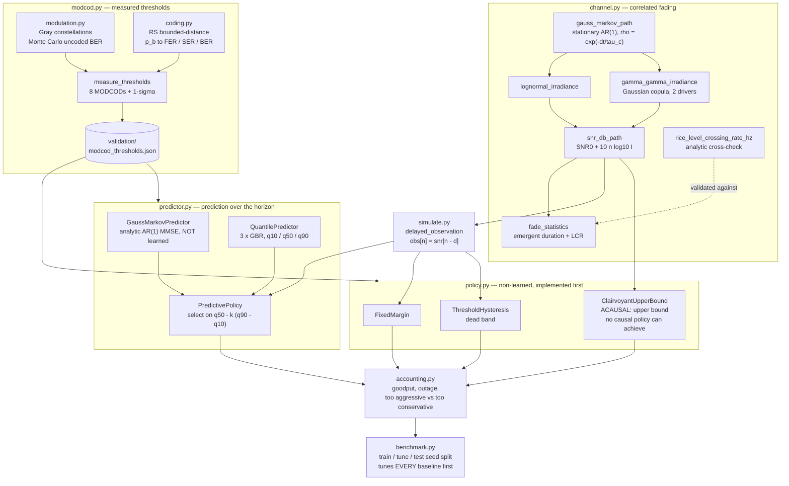
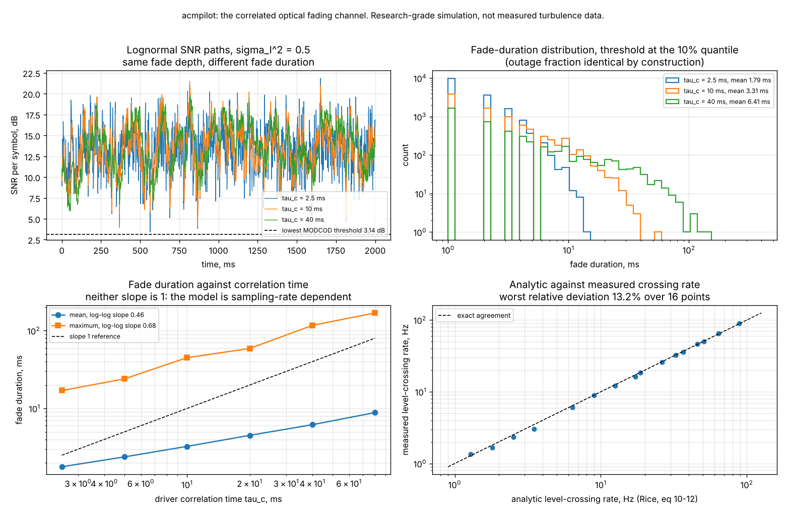
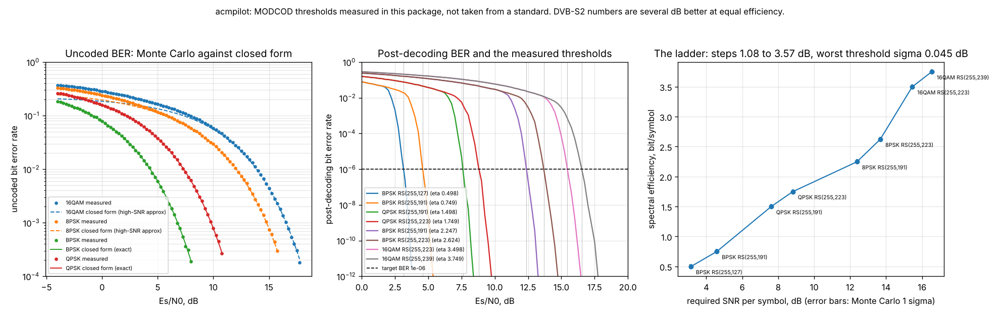
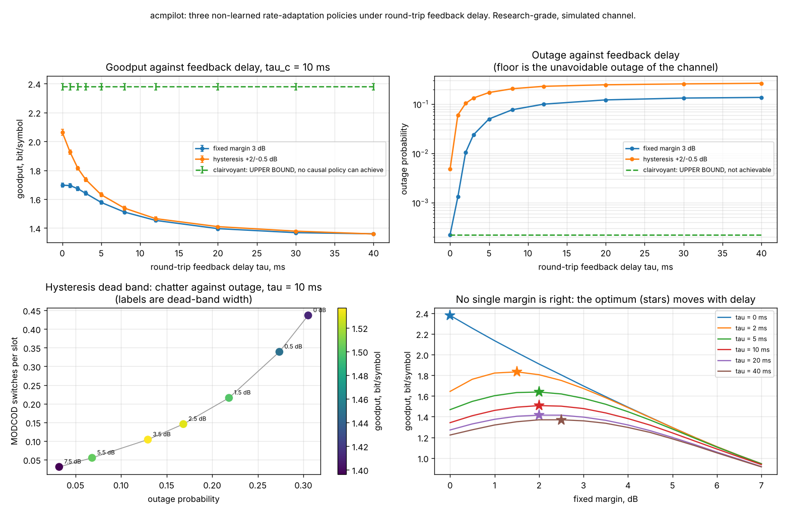
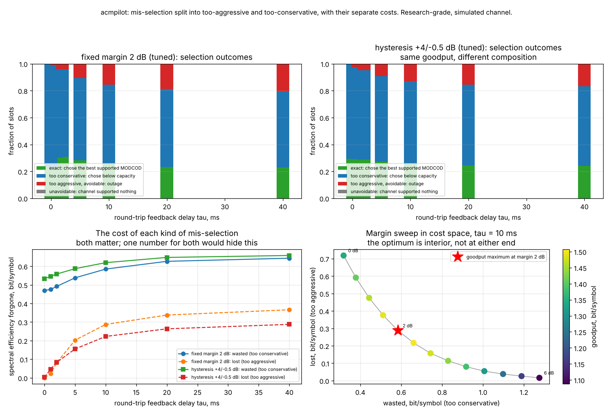
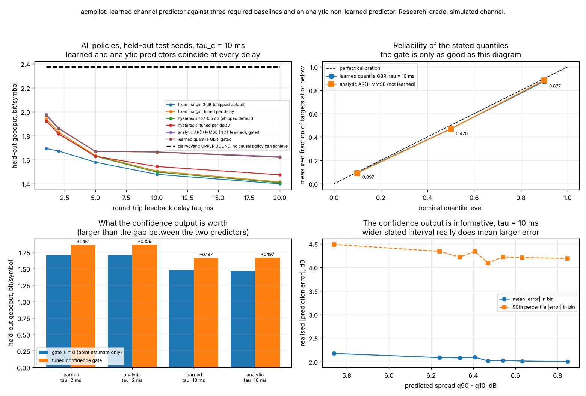

# acmpilot

Adaptive coding and modulation on one optical link, under round-trip feedback delay.


> **Every number in this README is a property of this package's simulator.** The
> fading channel is a Gauss-Markov driver with a free correlation-time knob; the
> MODCOD thresholds come from this package's own AWGN Monte Carlo and its own
> Reed-Solomon accounting. No scintillometer record, field link telemetry or
> laboratory modem measurement is used anywhere, and **nothing here is validated
> against measured turbulence data.** Research-grade.

## The problem

An optical link's SNR swings by several decibels on a millisecond timescale, so
the link wants to change rate continuously, and the only way to know what rate to
pick is to ask the receiver — which takes a round trip. By the time the report
arrives the channel has moved. Rate adaptation is therefore not a lookup against
a MODCOD table; it is a prediction problem whose difficulty is set entirely by the
ratio of the feedback delay to the channel's correlation time, and whose cost
function is asymmetric: picking a mode the channel cannot carry loses the whole
slot, while picking below capacity loses only the difference.

## What this does

- Generates temporally correlated optical fading paths — lognormal or gamma-gamma
  — in which **fade duration is emergent, not a parameter**: at `tau_c` = 2.5 to
  40 ms the measured mean fade duration is 1.80 to 6.57 ms and the maximum 14 to
  156 ms, with the level-crossing rate matching Rice's analytic formula to within
  1.7% over nine cases (`validation/validate_channel.py`).
- **Measures** its own MODCOD thresholds instead of quoting a standard's: 8 modes
  spanning 0.498 to 3.749 bit/symbol over a 13.391 dB window, each threshold
  carrying a Monte Carlo 1-sigma uncertainty of at most 0.045 dB, verified against
  a direct codeword Monte Carlo through the real modem to within 2%
  (`validation/validate_modcod_thresholds.py`).
- Reports every result against an explicit round-trip feedback delay. Across
  `tau` = 0 to 40 ms a 3 dB fixed margin falls from 1.708 to 1.367 bit/symbol
  while hysteresis falls from 2.075 to 1.364: **hysteresis is 21% better at zero
  delay and indistinguishable from the margin by 40 ms** (gap 0.003 against
  standard errors of 0.005 and 0.004), so a policy chosen at one delay is not the
  right choice at another (`validation/validate_policies.py`).
- Splits mis-selection into too-aggressive and too-conservative with their
  separate costs. At `tau` = 20 ms the two shipped baselines deliver 1.406 and
  1.412 bit/symbol — the same goodput — while hysteresis spends 0.506 of slots
  below capacity against the margin's 0.671 and loses 0.459 bit/symbol to outage
  against 0.210. One combined "mis-selection rate" would call those two policies
  identical.
- Benchmarks a learned quantile channel predictor with a calibrated,
  outage-gating confidence output against all three baselines **and** against an
  analytic AR(1) predictor, with every baseline tuned on held-out data first
  (`validation/validate_predictor.py`).

## The result, stated first

**The learned predictor does not beat a three-parameter analytic predictor at any
feedback delay, on either channel marginal.** On the lognormal channel it is
nominally *behind* the analytic AR(1) minimum-mean-square-error predictor at all
five delays tested, and the gap never reaches half a combined standard error. On
the gamma-gamma channel it is nominally ahead at two delays and behind at two, and
is never separated either. The reason is structural: the lognormal channel is an
AR(1) process in log-amplitude by construction, so the optimal predictor at any
horizon is exactly linear in the last report, and three estimated parameters
already attain it. Gradient boosting has nothing left to find.

Two further results are more useful than that one:

1. **The confidence output matters far more than the regression.** Gating rate
   choices on the predicted lower quantile instead of the point estimate is worth
   +0.15 to +0.28 bit/symbol. Choosing the learned predictor over the analytic one
   is worth 0.002 to 0.005. The gate is 30 to 140 times more valuable than the
   model behind it.
2. **Prediction only earns its complexity above `tau/tau_c` of roughly 0.2.** At
   `tau` = 1 ms with `tau_c` = 10 ms, a tuned fixed margin reaches 1.964
   bit/symbol against the best predictor's 1.976 — statistically indistinguishable
   over 10 test seeds. At `tau` = 20 ms the predictor wins by 11.5% with a gap of
   44 combined standard errors. Below the knee, tune the margin and ship nothing
   else.

The learned model's one measured advantage is the calibration of its stated
uncertainty on the non-Gaussian channel: nominal-80% coverage 0.794 to 0.800
against 0.821 to 0.823 for the analytic Gaussian interval, which over-covers
because a symmetric interval is the wrong shape for the gamma-gamma dB marginal.
That is an advantage in the uncertainty statement, not in throughput.

No baseline was removed, handicapped or retuned to produce any of this.

## Relationship to P015 LinkSwitch — read this before buying both

**P015 LinkSwitch and P042 AcmPilot answer different questions and do not
overlap.**

| | P015 LinkSwitch | P042 AcmPilot |
|---|---|---|
| Decision | which **link**: RF or optical | which **rate** on one optical link |
| Problem class | failover and handover | prediction under feedback delay |
| What the channel is | a per-step availability indicator; nothing models a symbol | a per-slot SNR, with measured per-MODCOD thresholds from a real modulator Monte Carlo |
| Cost being traded | outage time against handover chatter and re-acquisition cost | lost slots against wasted capacity, split and costed separately |
| Central parameter | the switching threshold | the round-trip feedback delay `tau` |
| Has a second link | yes, RF with its own rain-fade model | no, and deliberately so |

If the question is "my optical link just dropped, should I fall back to RF", that
is P015. If the question is "my optical link is up, what rate should I be sending
at given that my channel report is a round trip old", that is this package. P015
does not model a MODCOD, a symbol or a code rate; P042 does not model a second
link, a handover cost or rain fade. Neither is a superset of the other, and
owning one is no reason to own the other.

## Who it is for

- Engineers sizing a rate-adaptation margin or a hysteresis dead band for an
  optical link, who need the trade measured against feedback delay rather than
  asserted.
- Researchers who want a seeded, paired harness for comparing rate-adaptation
  policies, with a clairvoyant bound to separate prediction error from the
  granularity of the MODCOD ladder.
- Anyone about to publish a machine-learning win on a synthetic correlated fading
  channel, who should first run the analytic linear predictor in
  `acmpilot.predictor.GaussMarkovPredictor` against it. This package exists partly
  because that comparison is usually missing.
- Instructors teaching adaptive modulation, level-crossing theory, or why
  calibrated uncertainty beats a better point estimate in an asymmetric-cost
  decision.

## Who it is not for

- Anyone who needs a working encoder or decoder. Nothing here moves an
  information bit. Use `reedsolo` or `galois`.
- Anyone who needs a physically faithful turbulence time series. `tau_c` is an
  engineering knob, not a measured temporal spectrum, and the model's
  fade-duration distribution is sampling-rate dependent (see Limitations).
- Anyone who needs standardised MODCOD thresholds. These are this package's own
  measurements of its own Reed-Solomon chain; DVB-S2 LDPC thresholds are several
  dB better at equal spectral efficiency. Read ETSI EN 302 307.
- Anyone sizing an interleaver. The error model here *assumes* an interleaver deep
  enough to decorrelate a codeword and charges nothing for it. That is P041
  CodedFade's job.
- Anyone needing a multi-link, network-level or slant-path model, or a
  power-adaptation result. Single link, single horizontal path, fixed power.
- Anyone who needs a rate-adaptation decision they can operate or qualify
  against. See [Safety](#safety).

## Alternatives, honestly

Every package below was checked to exist with `pip index versions <name>` in this
container on 2026-10-06. Characterisations come from each project's own PyPI
description, read the same day; `komm`'s module inventory was **not** inspected,
because it does not install in this container, so its entry below says only what
its own description claims.

| Alternative | What it does better | When to use it instead of acmpilot |
|---|---|---|
| [**Sionna**](https://pypi.org/project/sionna/) (`sionna` 2.2.0, NVIDIA) | A maintained, GPU-accelerated, differentiable link- and system-level simulator with ray tracing and standards-grade channel models. Vastly larger scope, real ecosystem, actual end-to-end learning. | **Start here for almost any physical-layer learning work.** If your goal is to train a communications policy properly rather than to measure whether a simple one already suffices, this package is not the right tool and Sionna is. |
| [**komm**](https://pypi.org/project/komm/) (`komm` 0.36.0, GPL-3.0) | Its own description: tools for analysis and simulation of analog and digital communication systems, inspired by the MATLAB Communications System Toolbox, GNU Radio and CommPy. Actual codes, modulators and demodulators. Its description also warns the API is still changing. | Any task needing real coding and modulation primitives rather than an error-rate accounting. acmpilot deliberately implements no decoder. Note it does not install in the container this package was built in, so its contents were not inspected here. |
| [**scikit-dsp-comm**](https://pypi.org/project/scikit-dsp-comm/) (`scikit-dsp-comm` 2.1.2) | Ten modules including `digitalcomm` for digital modulation, `synchronization` for PLL and carrier recovery, and `fec_conv` for rate-1/2 and rate-1/3 convolutional codes with soft-decision Viterbi decoding, trellis display and puncturing. A real decoder with a real traceback. | Any convolutional-coding or synchronisation work, and any time you need soft-decision decoding rather than a bounded-distance accounting. |
| [**galois**](https://pypi.org/project/galois/) (`galois` 0.4.11) | Finite-field arithmetic and real BCH and Reed-Solomon encoders and decoders over arbitrary GF(p^m), NumPy-native. | **Use it the moment you need to actually encode or decode.** acmpilot derives its code parameters from the MDS bound and never encodes a symbol; galois does the real work. |
| [**reedsolo**](https://pypi.org/project/reedsolo/) (`reedsolo` 1.7.0) | A focused, mature Reed-Solomon codec, including miscorrection behaviour this package explicitly neglects. | Any time a real RS decoder is needed, and specifically if you want to settle how much the neglected miscorrection costs. |
| [**pyldpc**](https://pypi.org/project/pyldpc/) (`pyldpc` 0.7.9) | LDPC construction and belief-propagation decoding. | Modern coded performance. LDPC is what a real adaptive optical link would use, and it is several dB better than the Reed-Solomon chain here. |
| [**OptiCommPy**](https://pypi.org/project/OptiCommPy/) (`OptiCommPy` 0.10.0) | Full optical system simulation: transmitters, amplification, nonlinear propagation, coherent receivers and DSP. | Optical links with real optical physics. Note its focus is fibre, so it does not model atmospheric turbulence either. |
| **DVB-S2** (ETSI EN 302 307; a standard, not software) | The canonical real-world adaptive-coding-and-modulation MODCOD table, with LDPC plus BCH and thresholds that have been tested on hardware for two decades. | **Any threshold number you intend to defend.** acmpilot measures its own, from its own chain; read the standard for real ones. This package does not implement DVB-S2 and quotes no number from it. |
| **P041 CodedFade** (this portfolio) | Interleaver depth against channel correlation time, with the latency and memory cost of each depth. | Whenever the question is how deep the interleaver must be. acmpilot assumes that question is already answered. |
| **P015 LinkSwitch** (this portfolio) | Hybrid RF-optical failover policy evaluation. | Whenever the decision is which link rather than which rate. See the table above. |

**Where acmpilot is actually the right tool:** you want to know how much a channel
predictor is worth on *your* link, against properly tuned fixed-margin and
hysteresis baselines, at *your* ratio of feedback delay to correlation time, with
the irreducible part of the gap separated out by a clairvoyant bound and with
mis-selection split by kind. That is a narrow question and none of the packages
above answers it out of the box.

## Install and first run

```bash
git clone https://github.com/OmAcharya-avtr/acmpilot.git
cd acmpilot
python -m venv .venv && source .venv/bin/activate
pip install -e ".[dev,examples]"
python -m pytest tests/ -q
python -m acmpilot thresholds
```

Expected test output (measured: 34 s on 2 contended cores):

```
398 passed in 33.55s
```

Expected output of `python -m acmpilot thresholds` (measured: 5 s):

```
target post-decoding BER: 1e-06
monotone ladder: True
idx MODCOD                  bit/sym     eta   thr_dB  sigma_dB
  0 BPSK RS(255,127)              1   0.498    3.141     0.045
  1 BPSK RS(255,191)              1   0.749    4.583     0.031
  2 QPSK RS(255,191)              2   1.498    7.602     0.024
  3 QPSK RS(255,223)              2   1.749    8.810     0.032
  4 8PSK RS(255,191)              3   2.247   12.378     0.030
  5 8PSK RS(255,223)              3   2.624   13.677     0.025
  6 16QAM RS(255,223)             4   3.498   15.451     0.023
  7 16QAM RS(255,239)             4   3.749   16.532     0.022
```

Then produce the figures:

```bash
cd examples && for f in *.py; do python "$f"; done
```

## A worked example

```python
from acmpilot import ChannelConfig, ModcodTable, baseline_policies, run_policy, snr_db_path
from acmpilot.predictor import GaussMarkovPredictor, PredictivePolicy, make_lag_features

table = ModcodTable.load_json("validation/modcod_thresholds.json")
config = ChannelConfig(slot_s=1e-3, tau_c_s=10e-3, sigma_i2=0.5, mean_snr_db=14.0)
delay = config.delay_slots(10e-3)                       # 10 ms round trip = 10 slots

train = snr_db_path(config, 5200, seed=101)             # fit on one path
predictor = GaussMarkovPredictor(delay_slots=delay).fit(train)
test = snr_db_path(config, 20000, seed=301)             # score on another

policies = [
    *baseline_policies(margin_db=2.0, up_margin_db=4.0, down_margin_db=0.5),
    PredictivePolicy(predictor, delay_slots=delay, n_lags=4, gate_k=0.25),
]
print(f"feedback delay {delay} slots; test path mean {test.mean():.2f} dB")
for policy in policies:
    a = run_policy(table, test, policy, delay_slots=delay).accounting
    print(
        f"{policy.name[:46]:48s} goodput {a.goodput_bit_per_symbol:.3f}  "
        f"outage {a.outage_fraction:.4f}  "
        f"too conservative {a.conservative_fraction:.3f}  "
        f"wasted {a.wasted_bit_per_symbol:.3f}  lost {a.lost_bit_per_symbol:.3f}"
    )
features, target, _ = make_lag_features(test, delay_slots=delay, n_lags=4)
centre, spread = predictor.predict(features)
inside = ((target >= centre - spread / 2) & (target <= centre + spread / 2)).mean()
print(f"stated 80% interval covers {inside:.3f} of the held-out slots")
```

Actual output:

```
feedback delay 10 slots; test path mean 13.25 dB
fixed margin 2 dB                                goodput 1.518  outage 0.1599  too conservative 0.595  wasted 0.597  lost 0.298
hysteresis +4/-0.5 dB                            goodput 1.542  outage 0.1370  too conservative 0.623  wasted 0.632  lost 0.239
clairvoyant (upper bound, no causal policy can   goodput 2.413  outage 0.0003  too conservative 0.000  wasted 0.000  lost 0.000
analytic AR(1) MMSE (not learned), gate k=0.25   goodput 1.672  outage 0.0832  too conservative 0.600  wasted 0.626  lost 0.115
stated 80% interval covers 0.793 of the held-out slots
```

Read the last three columns across the rows: the gated predictor and the tuned
hysteresis policy waste almost the same capacity, and the predictor's advantage is
almost entirely in *lost* throughput — 0.115 against 0.239 bit/symbol. It is not
being less conservative; it is being conservative at the right moments.

## Architecture



## Screenshots



Notice that the three sample paths in the top-left panel have the same fade
*depth* and very different fade *duration* — depth is set by the scintillation
index, duration emerges from the correlation time. The bottom-left panel is the
limitation: neither the mean nor the maximum fade duration has log-log slope 1
against `tau_c`, so this model's fade-duration distribution depends on the slot
rate it is sampled at. The bottom-right panel is the check that the paths are
what they claim to be: measured against analytic level-crossing rate, on the
diagonal.



Notice in the middle panel how steep the post-decoding waterfalls are —
RS(255,127) with `t` = 64 drops from 1e-2 to 1e-18 inside a decibel. That
steepness is why a threshold is a meaningful concept here, and also why half a
decibel of prediction error is the difference between a working slot and a lost
one. In the left panel, BPSK and QPSK sit on their exact closed forms while 8PSK
and 16QAM leave their dashed high-SNR approximations below 10 dB; the thresholds
come from the measured points, never the curves.



Notice the clairvoyant line is flat: it never reads the feedback, so delay cannot
touch it, and the part of the gap already open at `tau` = 0 is the MODCOD ladder's
granularity, which no predictor recovers. In the bottom-right panel the stars mark
the optimal fixed margin at each delay — they are at different margins, which is
why no single margin can be published as the answer.



Notice the top two panels: the tuned fixed-margin and tuned hysteresis policies
reach almost the same goodput with visibly different compositions of conservative
against aggressive error. A single mis-selection rate would report them as the
same policy. The bottom-right panel is the frontier in cost space, and the goodput
maximum is interior — neither extreme of the margin sweep is right.



Notice in the top-left panel that the learned and analytic predictor curves lie on
top of each other at every delay, and that both pull away from the tuned baselines
only as the delay grows. The bottom-left panel is the point of the product: the
confidence gate is worth an order of magnitude more than the choice of predictor.

## Validation evidence

Full tables, tolerances and raw script output in
[`validation/VALIDATION.md`](validation/VALIDATION.md). The checks that failed
tight agreement, and the comparisons the trial count cannot resolve, are included
here on purpose.

| # | Check | Reference | Result | Tolerance | Verdict |
|---|---|---|---|---|---|
| V1.1 | Gauss-Markov lag-1 correlation | `exp(-dt/tau_c)` | worst relative error 2.18e-3 over 4 correlation times, 400 000 samples each | 1e-2 | PASS |
| V1.3 | lognormal scintillation index | Andrews & Phillips 2005 | worst relative error 2.06e-2 at `sigma_I^2` = 0.2, 0.5, 1.0 | 5e-2 | PASS |
| V1.4 | gamma-gamma scintillation index | Al-Habash, Andrews & Phillips 2001 | worst relative error 1.15e-2 at `sigma_I^2` = 0.3, 0.7, 1.5 | 5e-2 | PASS |
| V1.6 | mean fade duration against `tau_c` | — | log-log slope **0.467**, not 1 | none | **reported as a limitation, not a pass** |
| V1.7 | mean fade duration x crossing rate = outage | internal consistency | worst relative error 2.8e-16 over 9 cases | 1e-6 | PASS |
| V1.8 | level-crossing rate | Rice 1944/1945, discrete-sampling form | measured/analytic 0.983 to 1.015 over 9 cases | 3e-2 | PASS (after fixing a real defect, below) |
| V2.1 | uncoded BER, BPSK and QPSK | exact closed forms | worst 1.69 sigma over 10 points with > 50 errors | 3 sigma | PASS |
| V2.1 | uncoded BER, 8PSK and 16QAM | high-SNR approximations | 7 to 82 sigma deviation below 10 dB | none claimed | **expected and reported**, not used for thresholds |
| V2.2 | Reed-Solomon MDS parameters | `d = n-k+1`, `t = floor((n-k)/2)` | 4 of 4 codes PASS | exact | PASS |
| V2.3 | post-decoding FER, BPSK | direct codeword Monte Carlo, 10 000 words | measured/formula 0.998, 0.999, 0.981 | 5e-2 | PASS |
| V2.3 | the same, 16QAM **without** a bit interleaver | the same | measured/formula up to 1.038: the real system is **worse** than the model | none | **reported**: this is what the interleaving assumption costs |
| V3.1 | clairvoyant dominance over causal policies | — | 14 of 14 PASS | strict | PASS |
| V3.2 | clairvoyant independent of delay | — | spread exactly 0.000e+00 bit/symbol | 0 | PASS |
| V3.6 | best fixed margin depends on delay | — | 0 dB at `tau` = 0, 1 to 2.5 dB above it; the shipped 3 dB default is optimal nowhere | none | **reported** |
| V4.1 | interval calibration, lognormal | nominal 0.80 coverage | learned 0.780 to 0.796, analytic 0.794 to 0.795 | 0.75 to 0.85 | PASS, both under-cover slightly |
| V4.3 | confidence gate against `gate_k` = 0 | — | +0.1537 to +0.2842 bit/symbol | none | PASS |
| V4.4a | learned against analytic predictor | — | learned nominally behind at all 5 delays, |gap|/sem <= 0.55, never separated | 2 sem | **the non-learned predictor wins, published as the result** |
| V4.4b | best predictive against best **tuned** baseline | — | +0.61% (not separated) at 1 ms, +1.82%, +5.12%, +7.96%, +11.48% (separated) at 2 to 20 ms | 2 sem | PASS above 2 ms; **no win at 1 ms** |
| V5 | the same protocol, gamma-gamma | — | learned still never separated from analytic; learned coverage 0.794 to 0.800 against analytic 0.821 to 0.823 | 2 sem | **reported** |

A real defect was found and fixed during this build. The first implementation of
`rice_level_crossing_rate_hz` used `1/(2*pi*tau_c)` as its prefactor, which
contradicted its own docstring and disagreed with the measured crossing rate by a
factor of 3 to 6 that grew with `tau_c`. The docstring was right and the code was
wrong; with the documented discrete-sampling derivative variance the agreement is
1.7% worst case.

## API reference

<details>
<summary><code>acmpilot.channel</code> — correlated fading</summary>

| Function | Returns |
|---|---|
| `gauss_markov_path(n, *, dt_s, tau_c_s, rng)` | unit-variance stationary AR(1) path, dimensionless |
| `lognormal_irradiance(driver, *, sigma_i2)` | unit-mean irradiance, dimensionless |
| `gamma_gamma_shapes(sigma_i2, *, ratio=4.0)` | `(alpha, beta)`, dimensionless |
| `gamma_gamma_irradiance(d_large, d_small, *, sigma_i2, ratio=4.0)` | unit-mean irradiance, dimensionless |
| `ChannelConfig(slot_s, tau_c_s, sigma_i2, mean_snr_db, marginal, gg_ratio, detector_exponent)` | frozen config; `.rho` dimensionless, `.delay_slots(tau_s)` slots |
| `irradiance_path(config, n_slots, seed)` | unit-mean irradiance, dimensionless |
| `snr_db_path(config, n_slots, seed)` | SNR per symbol, dB |
| `correlation_time_s(series, *, dt_s)` | measured 1/e correlation time, s |
| `fade_statistics(series_db, threshold_db, *, dt_s)` | dict: outage fraction, fade durations in s, crossing rate in Hz |
| `rice_level_crossing_rate_hz(*, sigma_i2, tau_c_s, threshold_db, mean_snr_db, slot_s)` | downward crossings per second, Hz |

</details>

<details>
<summary><code>acmpilot.modulation</code>, <code>acmpilot.coding</code>, <code>acmpilot.modcod</code> — the ladder</summary>

| Function or class | Returns |
|---|---|
| `constellation(name)` | `Constellation` with unit average energy and a Gray `bit_map` |
| `theoretical_ber(name, snr_db)` | closed-form BER, dimensionless (exact for BPSK/QPSK only) |
| `measure_ber(name, snr_db, *, rng, ...)` | `(ber, n_errors, n_bits)` |
| `simulate_bit_errors(name, snr_db, n_symbols, *, rng)` | per-bit error indicators, bool array |
| `ReedSolomonCode(n, k, bits_per_symbol=8)` | `.rate`, `.d_min` symbols, `.t` symbols, `.label` |
| `ReedSolomonCode.frame_error_rate(p_b)` | post-decoding codeword error rate, dimensionless |
| `ReedSolomonCode.output_bit_error_rate(p_b)` | post-decoding BER, dimensionless |
| `Modcod(name, modulation, code)` | `.bits_per_symbol`, `.spectral_efficiency` bit/symbol |
| `shipped_modcods()` | the 8 shipped modes, increasing spectral efficiency |
| `measure_ber_curve(name, *, rng, ...)` | dict of `snr_db`, `ber`, `n_bits`, `ber_se` |
| `measure_thresholds(modcods=None, *, target_ber=1e-6, seed, ...)` | `(ModcodTable, curves)`; thresholds in dB |
| `ModcodTable.best_supported(snr_db)` | highest supported index, or `-1` for none |
| `ModcodTable.save_json / load_json(path)` | round-trips the table, no filesystem path in the file |

</details>

<details>
<summary><code>acmpilot.policy</code>, <code>acmpilot.simulate</code>, <code>acmpilot.accounting</code> — policies and scoring</summary>

| Function or class | Returns |
|---|---|
| `FixedMargin(margin_db=3.0)` | policy; margin in dB |
| `ThresholdHysteresis(up_margin_db=2.0, down_margin_db=0.5)` | policy; `.dead_band_db` in dB |
| `ClairvoyantUpperBound()` | **acausal** policy; `.causal is False`, `.name` is `CLAIRVOYANT_LABEL` |
| `baseline_policies(...)` | the three non-learned policies in the specified order |
| `delayed_observation(snr_db, delay_slots)` | report series, dB; `out[n] = snr[n-d]` |
| `run_policy(table, snr_db, policy, *, delay_slots, warmup=None)` | `EpisodeResult` with `.chosen` and `.accounting` |
| `run_episode(table, config, policies, *, n_slots, seed, tau_s)` | `(snr_db, [EpisodeResult])`, all policies on one path |
| `sweep_delay(table, config, policies, *, tau_list_s, n_slots, seeds)` | one dict per `(tau, policy)`, with `goodput_sem` |
| `account(table, chosen, true_snr_db, *, warmup=0)` | `Accounting`: goodput bit/symbol, outage, both mis-selection kinds and their costs |

</details>

<details>
<summary><code>acmpilot.predictor</code>, <code>acmpilot.benchmark</code> — prediction and the honest comparison</summary>

| Function or class | Returns |
|---|---|
| `make_lag_features(snr_db, *, delay_slots, n_lags=8)` | `(features, target_db, slot_index)` |
| `GaussMarkovPredictor(delay_slots).fit(snr_db)` | **not learned**; `.predict(features)` gives `(centre_db, spread_db)` |
| `QuantilePredictor(delay_slots, ...).fit(features, target)` | learned; `.predict_quantiles`, `.crossing_fraction`, `.save`, `.load` |
| `PredictivePolicy(predictor, delay_slots, n_lags, gate_k=0.5)` | causal policy selecting on `centre - gate_k * spread` |
| `calibration_report(predictor, features, target)` | coverage, tail exceedance, pinball loss, MAE and RMSE in dB |
| `analytic_calibration_report(predictor, features, target)` | the same fields for the analytic predictor |
| `BenchmarkSplit(train_seeds, tune_seeds, test_seeds)` | raises on any overlap |
| `score_policy(table, config, policy, *, tau_s, seeds, n_slots)` | mean accounting plus `goodput_sem` |
| `tune_fixed_margin / tune_hysteresis / tune_gate(...)` | `(selected_policy, full_tuning_trace)` |
| `benchmark_at_delay(table, config, *, tau_s, bench=None)` | tuned hyperparameters, every tuning trace, and 7 scored policies on the test seeds |

</details>

## Limitations

**Compute budget.** This package was built and measured on 2 CPU cores and
7.8 GiB RAM shared with four other build agents, no GPU, with a hard rule that no
single training or Monte Carlo run may exceed 3 minutes wall-clock. Everything is
sized for that: the longest validation script takes 77 s, the full test suite 34 s,
one three-quantile model fit about 5 s. Nothing here needs or uses a GPU, and
PyTorch was unavailable, so the learned model is scikit-learn gradient boosting.
`commpy` and `crcmod` do not install in that container either, so they are cited
as alternatives and never imported. `pulp` installs but ships no usable solver
there; this package needs no solver.

**The channel is a model with a free knob, not measured turbulence.** `tau_c`
stands in for a temporal spectrum set by transverse wind speed and the
aperture-filtered Kolmogorov spatial spectrum, which is not a single exponential.
Every number here is a property of the simulator.

**The fade-duration distribution is sampling-rate dependent.** Mean fade duration
scales as roughly `tau_c**0.47` at a fixed 1 ms slot rate, not `tau_c**1`, because
the median fade stays pinned at 2 ms while only the tail lengthens. Resampling the
same physical channel at a different slot rate changes the distribution, so
re-measure at your own slot rate before sizing anything from these figures.

**The gamma-gamma correlation time is not the driver's.** The copula construction
preserves the marginal exactly but makes the irradiance autocorrelation a monotone
transform of the driver's, so the measured 1/e correlation time of a gamma-gamma
path is 0.79 to 0.93 times `tau_c` depending on scintillation index. `tau_c` must
be read as the *driver's* correlation time.

**The feedback report is noiseless.** It is the exact SNR of slot `n - d`: no
quantisation, no measurement error, no lost report. Staleness is the only
impairment, which is deliberate — it isolates the effect this product is about —
and it makes every goodput number here optimistic for a real terminal.

**Policies cannot mute.** A causal policy that sees nothing supported still
transmits MODCOD 0. A real terminal would mute, which would move that outage out
of the goodput accounting and into a separate availability figure.

**Reed-Solomon miscorrection is neglected.** A bounded-distance decoder presented
with more than `t` errors can land on a wrong codeword. Neglecting it makes the
post-decoding rates, and therefore the thresholds, mildly optimistic. `reedsolo`
or `galois` with a real decoder would settle how much.

**Bit errors are assumed independent within a codeword.** That is an interleaving
assumption and the interleaver is neither modelled nor charged for — no latency, no
memory. Without a bit interleaver the measured 16QAM error rate is up to 3.8%
higher than the model predicts. Sizing the interleaver is P041 CodedFade's job.

**Within a slot the SNR is constant.** The usual block-fading idealisation,
reasonable while 1 ms is short against 10 ms and wrong if `tau_c` is shortened
towards the slot.

**The learned model is per delay and per channel.** A model fitted at one `d` has
the wrong feature semantics at another; `PredictivePolicy` records `delay_slots`
but does not enforce a match against the runner's delay. Nothing was measured
about transfer between correlation times, scintillation indices or marginals.

**Deep fades are rare in the data by construction.** At `sigma_I^2` = 0.5 the
lowest MODCOD is unsupported in 0.028% of slots, so the slots that matter most are
the ones the training set contains least of.

**Swept ranges.** `tau` 0 to 40 ms, `tau_c` 2.5 to 40 ms, `sigma_I^2` 0.2 to 1.5,
SNR at mean irradiance 14 dB, target post-decoding BER 1e-6. Nothing outside those
ranges was measured.

**The intervals under-cover slightly on the lognormal channel** (0.780 to 0.796
against a nominal 0.80), so the gate is marginally more aggressive than its stated
level implies. The gate strength is tuned empirically, which absorbs this but does
not fix it.

Six further requirements are written down in
[`docs/REQUIREMENTS.md`](docs/REQUIREMENTS.md) section 7 as deliberately not met in
0.1.0, so that their absence is a recorded decision.

## Safety

This software is research-grade. It is **not flight-qualified, not certified, and
not approved for operational aerospace use.** It models a rate-adaptation decision
on a simulated optical link; it does not qualify a modem, size a link budget, or
establish an availability figure. No number produced by this package should be
used to set a real link's rate adaptation, margin or availability without
independent measurement of the channel it will actually fly on.

## Reproducing every number

```bash
pip install -e ".[dev,examples]"

# tests and lint
python -m pytest tests/ -q --junit-xml=results.xml
ruff check src/ tests/ examples/ validation/

# evidence, in this order (the first writes the threshold table the rest load)
cd validation
python validate_modcod_thresholds.py        > validate_modcod_thresholds.txt   #  18 s
python validate_channel.py                  > validate_channel.txt             #   6 s
python validate_policies.py                 > validate_policies.txt            #   6 s
python validate_predictor.py                > validate_predictor.txt           #  65 s
python validate_predictor_gammagamma.py     > validate_predictor_gammagamma.txt #  77 s
cd ..

# figures
cd examples
python channel_and_fades.py        # screenshots/channel_and_fades.png
python modcod_thresholds.py        # screenshots/modcod_thresholds.png
python policies_vs_delay.py        # screenshots/policies_vs_delay.png
python misselection_split.py       # screenshots/misselection_split.png
python predictor_vs_baselines.py   # screenshots/predictor_vs_baselines.png
cd ..

# one delay from the CLI
python -m acmpilot thresholds
python -m acmpilot simulate --tau-ms 10 --tau-c-ms 10
python -m acmpilot sweep --tau-ms-list 0 2 5 10 20 40 --n-seeds 5
python -m acmpilot predict --tau-ms 10 --gate-k 0.5
```

Seeds are fixed throughout: channel train (101, 102, 103), tune (201 … 205), test
(301 … 310), calibration 401, MODCOD Monte Carlo 20261006, every quantile model
`random_state=20261006`. Measured with Python 3.13.16, NumPy 2.5.3, SciPy 1.18.1,
scikit-learn 1.9.1 on 2 contended cores.

## Licence

AGPL-3.0-or-later. Copyright (C) 2026 OPTIMA Organisation. See
[`LICENSE`](LICENSE). Open-core: the package is AGPL, so a network service built on
it must offer its source.

## Citation

See [`CITATION.cff`](CITATION.cff).

```
OPTIMA Organisation (2026). acmpilot: adaptive coding and modulation on one
optical link under round-trip feedback delay, version 0.1.0.
```

## References

Only works this package actually relies on, each cited for one specific thing. No
page or equation number is quoted from any of them, and nothing is reproduced.

- L. C. Andrews and R. L. Phillips, *Laser Beam Propagation through Random Media*,
  2nd ed., SPIE Press, 2005 — the weak-turbulence lognormal irradiance model and
  its validity range.
- M. A. Al-Habash, L. C. Andrews and R. L. Phillips, "Mathematical model for the
  irradiance probability density function of a laser beam propagating through
  turbulent media", *Optical Engineering* 40(8), 2001 — the gamma-gamma irradiance
  model and its scintillation-index relation, which this package solves and then
  verifies numerically.
- S. O. Rice, "Mathematical analysis of random noise", *Bell System Technical
  Journal* 23(3), 1944 and 24(1), 1945 — the level-crossing-rate formula used as
  the analytic cross-check on the emergent fade statistics.
- A. J. Goldsmith and S.-G. Chua, "Variable-rate variable-power MQAM for fading
  channels", *IEEE Transactions on Communications* 45(10), 1997 — the
  adaptive-modulation framing. This package implements neither its power adaptation
  nor its continuous-rate result.
- ETSI EN 302 307 (DVB-S2) — named as the canonical real-world
  adaptive-coding-and-modulation MODCOD table. Not implemented here, and no number
  is taken from it.
- J. G. Proakis and M. Salehi, *Digital Communications*, McGraw-Hill — the standard
  AWGN error-rate expressions for Gray-coded PSK and square QAM, used here only as
  checks on this package's own Monte Carlo.

## Credits

Built for the OPTIMA aerospace software portfolio.

This is under reserved rights obtained by OPTIMA Organisation.
