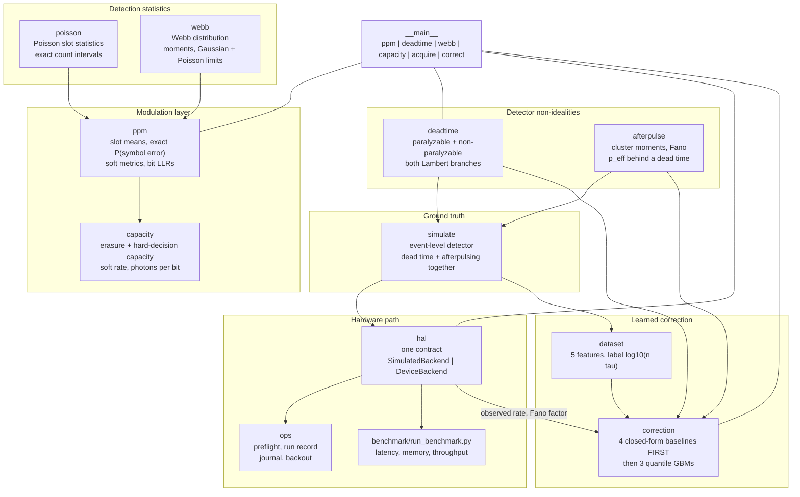
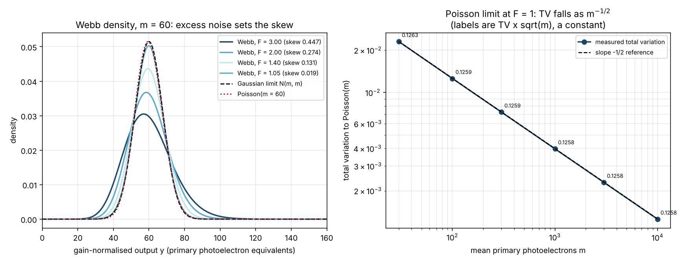
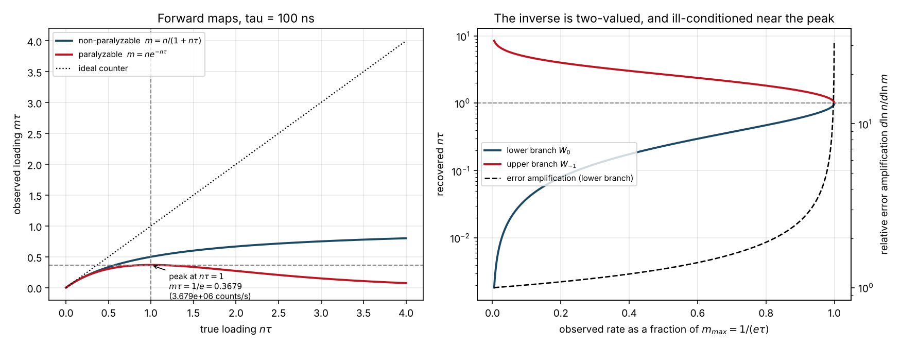
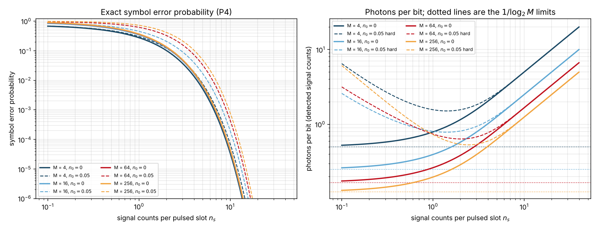
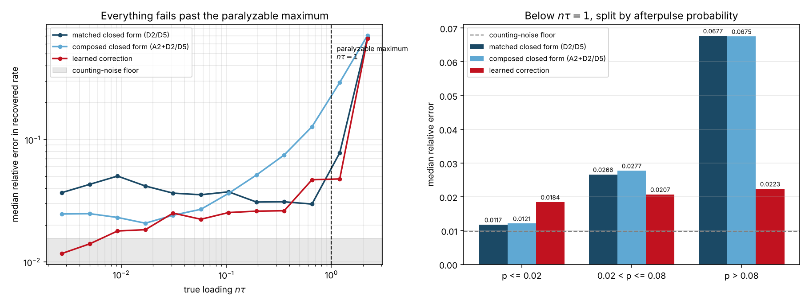

# photoncount

A photon-counting optical receiver chain for photon-starved links.


**Status: TESTING** · Class: medium · **Validation level 3, hardware-pending** ·
AI-enabled · Apache-2.0 · © 2026 OPTIMA Organisation

This software is research-grade. It is **not flight-qualified, not certified,
and not approved for operational aerospace use.** Every detector parameter in it
is an input, not a measurement; no number in this repository came from a
photon-counting detector or from a flight-representative board.

## The problem

At a few photons per slot the receiver is a counter, not a voltmeter, so the
channel is Poisson and the Gaussian intuitions behind an SNR stop being useful.
The detector's own non-idealities then set the floor: dead time throws counts
away, afterpulsing invents them, and the textbook correction for each assumes the
other is absent. Worst of all, a paralyzable detector's observed count rate is
not monotonic in the illumination — past one true rate it *falls* — so a
saturated detector and a fading source produce the same reading.

## What this does

- **Implements the Webb distribution for APD counting statistics and checks it
  against both of its limits**, which is the only honest way to validate it
  without a lab. Its first three moments are exact closed forms (`m`, `mF`,
  `3mF(F-1)`), verified against quadrature of the density to **1.1e-13 relative**;
  at `F = 1` it equals `N(m, m)` to **1.04e-17** sup-norm; and its integer-binned
  distance to a Poisson pmf falls as `m^-1/2`, measured as **TV × √m = 0.1259,
  0.1258, 0.1258** at m = 100, 1000, 10000 (`validation/validate_webb_limits.py`).
- **Gives the exact M-ary PPM symbol error probability over the Poisson channel**,
  by summation with uniform tie-breaking and a reported truncation tail mass. It
  matches the background-free closed form `exp(-n_s)(M-1)/M` to **6.1e-15** and
  Monte Carlo with background to **|z| ≤ 2.79** over six configurations
  (`validation/validate_ppm.py`). The per-slot soft metric is derived in the
  module docstring and agrees with the full product likelihood to **1.8e-14 nats**.
- **Treats the paralyzable dead-time curve's maximum as a first-class hazard.**
  Both inverse branches are available through the Lambert W function, the branch
  choice is a required argument with no default, and the error amplification of
  the inverse is reported: **1.04 at 10 % of the maximum rising to 22.7 at
  99.9 %** (`validation/validate_deadtime.py`). An acquisition planned at or above
  `1/τ` **fails** preflight.
- **Ships a hardware abstraction layer with one contract and two backends**, a
  fully implemented simulated one and a device stub that raises
  `NotImplementedError` naming what is missing, both exercised by **one shared
  contract test suite**. Simulation and dry-run modes, eight named preflight
  checks, a crash-safe run journal and an idempotent backout, all runnable
  functions with tests (`validation/validate_hal_contract.py`).
- **Measures a learned incident-rate correction against the closed-form
  inversions implemented first, and publishes where the closed forms win.** On
  2000 held-out rows: learned **0.0234** median relative error overall against
  **0.0371** for the matched closed form — but **0.0243 against 0.0143** where
  afterpulsing is negligible, where the closed form wins, and **0.8399 against
  0.8336** past the paralyzable maximum, where nothing works. Interval coverage
  **0.8995** against a nominal 0.90 (`validation/validate_correction.py`).

**Compute budget.** Everything in this repository was built and measured on two
shared cloud cores with 7.8 GiB of RAM, running alongside four other build jobs.
The full test suite takes **14 to 23 s** depending on container load, the longest
validation script about **30 s**, and the whole validation set about **2 minutes**. There is no GPU and PyTorch is not
available; the learned model is 750 gradient-boosted trees of depth 3.

## Who it is for

- Anyone sizing a deep-space or other photon-starved optical link who needs PPM
  slot statistics, an exact symbol error probability and an available rate from
  the same set of equations, with the assumptions written down.
- Anyone who has to invert a detector's observed count rate and wants the
  two-valued paralyzable branch, the conditioning of the inverse and the
  saturation limit made explicit rather than discovered in flight.
- Anyone writing the soft-decision front end for a PPM decoder who needs the
  per-slot Poisson log-likelihood and correctly scaled bit LLRs, rather than
  feeding raw counts to a decoder and wondering why it underperforms.
- Anyone preparing to put a photon-counting receiver on a board, who wants the
  preflight, capture and backout procedures as code with tests rather than as a
  document.
- Students and reviewers: every equation is derived or cited in its module
  docstring, and every validation script prints its working.

## Who it is not for

- **Anyone with real photon timestamps from an instrument.** This package reads
  no instrument file format. Use [`phconvert`](https://pypi.org/project/phconvert/)
  to get PicoQuant, Becker & Hickl or `.sm` files into Photon-HDF5, and
  [`pycorrelate`](https://pypi.org/project/pycorrelate/) to correlate them.
- **Anyone analysing nuclear spectra.** Use
  [`becquerel`](https://pypi.org/project/becquerel/), whose stated core job is
  reading and writing spectrum file types, fitting spectral features and
  performing detector calibrations. This package does none of those.
- **Anyone who needs error-correcting codes.** There are none here. Pair it with
  [`galois`](https://pypi.org/project/galois/),
  [`reedsolo`](https://pypi.org/project/reedsolo/) or
  [`pyldpc`](https://pypi.org/project/pyldpc/); this package produces the bit
  LLRs, not the decoder.
- **Anyone wanting a general digital-communications toolbox.** Use
  [`komm`](https://pypi.org/project/komm/) or
  [`scikit-dsp-comm`](https://pypi.org/project/scikit-dsp-comm/). The scope here
  is one channel and one detector.
- **Anyone who needs to qualify a detector.** Every dead time, afterpulse
  probability and dark-count rate here is a number you supply. Producing one
  requires a bench, and no amount of simulation replaces it.
- **Anyone operating past the paralyzable maximum.** Nothing in this package
  recovers the incident rate there, and the README says so with numbers rather
  than hoping you will not notice.

## Alternatives, honestly

| Alternative | What it does better | When to use this instead |
|---|---|---|
| [`phconvert`](https://pypi.org/project/phconvert/) (0.10.2, MIT) | **The right tool for real detector data, and this package is no substitute.** Its own description: a library that "helps writing valid Photon-HDF5 files" and "can convert to Photon-HDF5 all the common binary formats used in solution-based single-molecule spectroscopy… PicoQuant's .HT3/.PT3/.PTU/.T3R, Becker & Hickl's .SPC/.SET and the .SM format". `photoncount` reads no instrument format at all. | When you have no file to read because the detector does not exist yet — which is the design phase this package is for. Use `phconvert` to load, this to model and to correct. |
| [`pycorrelate`](https://pypi.org/project/pycorrelate/) (0.3, GPLv3) | Its description: computes "fast and accurate cross-correlation over arbitrary time lags" on "point-processes, such as photon timestamps". That is the standard second-order analysis of a real photon stream and nothing here competes with it. | When the question is a *rate* and its correction, not a correlation function. This package's timestamps come out of a simulator; `pycorrelate` is for real ones. |
| [`becquerel`](https://pypi.org/project/becquerel/) (0.7.0, LBNL licence) | The maintained package for nuclear spectroscopy. Its description names "reading and writing different spectrum file types, fitting spectral features, performing detector calibrations, and interpreting measurement results", plus tabulated nuclear data. The dead-time models here are from the same textbook tradition (Knoll), and `becquerel` works with measured spectra. **Not installed or inspected in this environment, so no claim is made about whether it implements dead-time correction.** | When the detector is a photon-counting optical receiver rather than a radiation spectrometer, and the output wanted is a PPM symbol error probability or an available rate rather than a spectrum. |
| [`komm`](https://pypi.org/project/komm/) (0.36.0, GPL-3.0-only) | A maintained general communications library: its own summary is "tools for analysis and simulation of analog and digital communication systems", inspired by the MATLAB Communications System Toolbox, GNU Radio, CommPy and SageMath. For codes, standard modulations and memoryless-channel simulation it is the broader tool, and its licence is GPL where this is Apache-2.0. **Its PyPI description does not enumerate its modules and its documentation site was not reachable from the build container, so no claim is made here about whether it ships PPM or a Poisson channel.** | When the channel is Poisson rather than AWGN and the receiver is a counter. The exact PPM symbol error probability with tie-breaking, the Poisson per-slot log-likelihood, the Webb distribution and the dead-time inverses are the specific gap this package fills. |
| [`scikit-dsp-comm`](https://pypi.org/project/scikit-dsp-comm/) (2.1.2, BSD) | A broad DSP and communications teaching package, grown out of *Signals and Systems for Dummies*, with far more signal-processing coverage than anything here. | Same reason as `komm`: the scope here is the photon-counting receiver chain, not DSP. |
| [`commpy`](https://pypi.org/project/commpy/) (1.2.0, Apache-2.0) | Describes itself as "a general-purpose Python library for communications engineering". Apache-2.0, so licence-compatible with this. | **`commpy` does not install in this build environment, so it was never run and never benchmarked against.** It is named here on the strength of its own published description only. If it installs for you and covers your case, use it. |
| `scipy.stats` and NumPy directly | Already installed, no new dependency, and `scipy.stats.poisson` plus `scipy.special.lambertw` is genuinely most of the mathematics here. | When you want the equations with their assumptions, units and validity ranges attached, the paralyzable branch choice forced rather than defaulted, the truncation of an infinite sum reported rather than assumed, and the whole chain under a test suite. Ten lines of SciPy will invert a dead time; they will not tell you that the inverse has two roots and that you have taken the wrong one. |
| A bench measurement of the detector | It is the only thing that produces a real dead time, afterpulse probability or dark-count rate, and the only evidence a reviewer will accept about the hardware. | When the question is what to *do* with those numbers once measured: what symbol error probability they imply, what rate is available, how to invert them, and whether the operating point is even on the invertible branch. This package consumes a measured dead time; it cannot produce one. |

**The narrow defensible claim.** This is the model chain for a *photon-counting
optical communications receiver*: Poisson and Webb detection statistics, PPM slot
statistics with an exact error probability and correctly scaled soft output,
dead-time and afterpulsing forward and inverse models including the regimes where
inversion fails, PPM Poisson-channel rates, and a hardware abstraction layer
carrying the contract a detector must satisfy. It does not read instrument files,
does not decode, and does not measure hardware.

## Install and first run

```bash
git clone https://github.com/OmAcharya-avtr/photoncount.git
cd photoncount
python -m venv .venv && source .venv/bin/activate
pip install -e ".[dev]"
python -m pytest tests/ -q
python examples/deadtime_curves.py
```

Expected output:

```
302 passed in 14.32s

deadtime_curves.py
   wrote screenshots/deadtime_curves.png
   tau = 1.000e-07 s; peak at n = 1.0000e+07 counts/s, m_max = 3.6788e+06 counts/s
     m/m_max   n tau lower   n tau upper   error amplification
      0.1000       0.03822       4.88972                 1.040
      0.5000       0.23196       2.67835                 1.302
      0.9000       0.60834       1.53181                 2.553
      0.9900       0.86484       1.14855                 7.399
      0.9990       0.95593       1.04540                22.698
```

Then the CLI:

```bash
python -m photoncount deadtime --dead-time 1e-6 --observed-rate 3e5
```

```json
{
  "branch_warning": "the paralyzable inverse is two-valued; both roots reproduce this observed rate and only knowledge of the illumination picks one",
  "dead_time_s": 1e-06,
  "model": "paralyzable",
  "observable": true,
  "observed_rate_hz": 300000.0,
  "paralyzable_max_observed_rate_hz": 367879.4411714424,
  "paralyzable_peak_true_rate_hz": 1000000.0,
  "true_rate_lower_branch_hz": 489402.22718021495,
  "true_rate_upper_branch_hz": 1781337.0234216275
}
```

## A worked example

A 64-PPM photon-starved downlink: received power to slot counts, slot counts to
symbol error probability and available rate, then the same link read out through
a detector with dead time and afterpulsing and corrected back.

```python
import numpy as np
from photoncount.capacity import hard_decision_capacity, photons_per_bit
from photoncount.correction import composed_baseline, matched_baseline
from photoncount.hal import AcquisitionRequest, BackendMode, SimulatedBackend
from photoncount.poisson import mean_counts_from_power
from photoncount.ppm import PPMConfig, bit_llrs, sample_counts, symbol_error_probability
from photoncount.simulate import DetectorSpec

n_s = mean_counts_from_power(3.0e-11, 1550e-9, 2.0e-8, 0.65)   # 3.043 counts/slot
n_b = mean_counts_from_power(2.0e-14, 1550e-9, 2.0e-8, 0.65)   # background per slot
cfg = PPMConfig(order=64, signal_counts=n_s, background_counts=n_b, dark_counts=4e-6)
print(f"P(symbol error) = {symbol_error_probability(cfg)['error']:.6f}")

rng = np.random.default_rng(20261006)
counts = sample_counts(cfg, [17], rng)                          # slot 17 signalled
print("bit LLRs:", np.round(bit_llrs(counts, cfg)[0], 3).tolist())

hard = hard_decision_capacity(cfg)["bits_per_symbol"]
print(f"hard-decision capacity {hard:.5f} bits/symbol, "
      f"{photons_per_bit(cfg, hard):.5f} photons/bit")

spec = DetectorSpec(dead_time_s=2.4e-8, model="paralyzable",
                    afterpulse_probability=0.045, afterpulse_mean_delay_s=1.1e-7)
backend = SimulatedBackend(spec, incident_rate_hz=6.0e6, rng=np.random.default_rng(4242))
with backend:
    acq = backend.acquire(AcquisitionRequest(1e-3, 200, "demo"), BackendMode.SIMULATION)
print(f"observed {acq.observed_rate_hz:.4e} counts/s, Fano {acq.fano_factor:.4f}, "
      f"is_measurement {acq.is_measurement}")

m, tau, par, p = (np.array([acq.observed_rate_hz]), np.array([2.4e-8]),
                  np.array([1.0]), np.array([0.045]))
print(f"paralyzable closed form {float(matched_baseline(m, tau, par)[0]):.4e}")
print(f"composed closed form    {float(composed_baseline(m, tau, par, p)[0]):.4e}")
```

Actual output (`validation/worked_example_output.txt` has the full version):

```
P(symbol error) = 0.055851
bit LLRs: [21.915, -21.915, 25.782, 21.915, 21.915, -21.915]
hard-decision capacity 5.35542 bits/symbol, 0.56823 photons/bit
observed 5.3356e+06 counts/s, Fano 0.7649, is_measurement False
paralyzable closed form 6.1901e+06
composed closed form    5.8657e+06
```

The truth was 6.0000e+06 counts/s. The Fano factor below 1 is the dead time
anti-bunching the counts; `is_measurement` is False because the backend is
simulated, and nothing downstream may treat the number as a measurement.
Symbol 17 is `010001` in binary, which is why the LLR signs are
`+ − + + + −` under the convention that positive favours bit 0.

## Architecture



## Screenshots



Left: the Webb density collapses onto the Gaussian as the excess noise factor
approaches 1 — the skew is `3(F-1)/√(mF)` and nothing else. Right: the total
variation to a Poisson pmf falls exactly on the slope −1/2 line, and the labels
(`TV × √m`) are constant to four figures. That is the honest Poisson limit; an
implementation that appeared to beat it would be wrong.



Left: the paralyzable curve peaks at `nτ = 1` and then falls, so a brighter
source reads as a dimmer one. Right: the two inverse branches, and the dashed
line on the right axis is the amplification of a relative error in the observed
rate, which diverges as the peak is approached — the quantitative reason preflight
refuses to start a run there.



Left: with no background every order collapses onto `exp(-n_s)(M-1)/M`, so a
larger M buys nothing in symbol error probability. Right: where it does pay is
photons per bit, and each curve has a minimum at a finite `n_s` well above the
`1/log₂M` limit — reaching the limit costs an erasure probability approaching 1.



Left: every estimator collapses past `nτ = 1`, learned and closed-form alike.
Right: below `nτ = 1`, split by afterpulse probability — the closed forms win at
`p ≤ 0.02` (0.0117 and 0.0121 against 0.0184) and the learned model wins once
afterpulsing is present (0.0223 against 0.0677 at `p > 0.08`).

## Validation evidence

Full table, with tolerances and raw output, in
[`validation/VALIDATION.md`](validation/VALIDATION.md). The checks that matter:

| Check | Reference | Result | Tolerance | Source |
|---|---|---|---|---|
| Webb closed-form moments vs quadrature | derived from the Webb (1974) form | ≤ 1.1e-13 relative on the third central moment | 5e-3 | `validate_webb_limits_output.txt` §1 |
| Webb at F = 1 vs `N(m, m)` | exact Gaussian limit | sup-norm 1.04e-17 | 1e-15 | `validate_webb_limits_output.txt` §2 |
| Webb → Poisson | `m^-1/2` Gaussian-to-Poisson rate | TV ratios 3.1645, 3.1624 vs √10 = 3.1623 | 8 % | `validate_webb_limits_output.txt` §3 |
| Dead-time known answers, τ = 1 µs, n = 1e5/s | Knoll ch. 4 | 90909.0909090909 and 90483.7418035960, rel 0.00e+00 | 1e-14 | `validate_deadtime_output.txt` §1 |
| Paralyzable maximum | `1/τ`, `1/(eτ)` | 1.000000e+06, 367879.4411714424; dm/dn = 0 at the peak | 1e-6 on the derivative | `validate_deadtime_output.txt` §2 |
| Both inverse branches round-trip | Lambert W₀, W₋₁ | ≤ 1.98e-16 relative | 1e-9 | `validate_deadtime_output.txt` §3 |
| PPM exact error vs `exp(-n_s)(M-1)/M` | background-free closed form | ≤ 6.13e-15 absolute over six (M, n_s) | 1e-12 | `validate_ppm_output.txt` §1 |
| PPM exact error vs Monte Carlo | 400000 symbols per point | \|z\| ≤ 2.79 over six configurations | \|z\| < 4 | `validate_ppm_output.txt` §2 |
| Poisson soft metric vs full likelihood | derived in the module docstring | 1.776e-14 nats worst | 1e-10 | `validate_ppm_output.txt` §3 |
| Soft rate ≥ hard capacity | data-processing inequality | gap +0.0057 to +0.5228 bits/symbol, never negative | ≥ −4 s.e. | `validate_capacity_output.txt` §4 |
| Simulator vs both dead-time laws, nτ ∈ [0.01, 3] | (D1), (D3) | \|z\| ≤ 1.99 at ≈400000 counts per point | \|z\| < 5 | `validate_simulator_output.txt` §2–3 |
| Simulator vs the afterpulse law | (A2) | \|z\| ≤ 1.58 over p ∈ [0.02, 0.4] | \|z\| < 5 | `validate_simulator_output.txt` §4 |
| Dead time × afterpulsing is **not** the product of the two | this repository's claim | up to **25.98 %** deviation | must be non-zero | `validate_simulator_output.txt` §7 |
| Learned interval coverage | nominal 0.90 | **0.8995** over 2000 rows, z = −0.07 | measured, not assumed | `validate_correction_output.txt` §4 |
| **Closed forms beat the learned model where afterpulsing is negligible** | `p ≤ 0.02`, n = 268 | matched **0.0143**, composed **0.0136**, learned 0.0243 | published as found | `validate_correction_output.txt` §5 |
| **Nothing works past the paralyzable maximum** | `nτ > 1.5`, paralyzable, n = 91 | matched 0.8336, composed 0.8552, learned 0.8399 | published as found | `validate_correction_output.txt` §5 |
| Fano-factor ablation | retrained with the column flattened | **0.0208** against 0.0234 with it — the feature contributes nothing | reported as found | `validate_correction_output.txt` §7 |

### The learned correction, stated plainly

Baselines were implemented and measured first, on the same 2000 held-out rows.
The counting-noise floor is **0.00972** median absolute relative error; no
estimator can beat it.

| Regime | n | matched closed form | composed closed form | learned | Winner |
|---|---:|---:|---:|---:|---|
| all | 2000 | 0.0371 | 0.0454 | **0.0234** | learned |
| `p ≤ 0.02` | 268 | **0.0143** | **0.0136** | 0.0243 | **closed forms** |
| `p > 0.02` | 1732 | 0.0434 | 0.0530 | **0.0233** | learned |
| `nτ < 0.1` | 1094 | 0.0391 | 0.0279 | **0.0170** | learned |
| `0.1 ≤ nτ < 0.7` | 510 | **0.0278** | 0.0582 | 0.0289 | tie |
| `0.7 ≤ nτ ≤ 1.5` | 208 | 0.0343 on 88.9 % | 0.1680 | 0.0411 on 100 % | matched on error, learned on coverage |
| `nτ > 1.5` non-paralyzable | 97 | 0.0275 | 0.2168 | **0.0191** | learned |
| `nτ > 1.5` **paralyzable** | 91 | 0.8336 | 0.8552 | 0.8399 | **nobody** |

The learned model's claim is narrow and it is this: **where afterpulsing is
present, neither textbook inversion can accept an afterpulse probability at all,
and the composed form that can inverts the two effects in sequence when they do
not commute** — measured at up to 25.98 % non-commutation. There the learned model
halves the median error. Where afterpulsing is negligible the closed forms win and
are also a line of algebra with no training set. Past the paralyzable maximum
nothing works, and the model does not pretend otherwise.

## API reference

<details>
<summary><code>photoncount.poisson</code> — Poisson counting statistics</summary>

| Function | Returns |
|---|---|
| `photons_per_second(P_w, lambda_m)` | photon arrival rate, 1/s |
| `mean_counts_from_power(P_w, lambda_m, T_s, eta)` | mean detected counts per slot, dimensionless |
| `slot_mean(n_s, n_b, n_d)` | total mean counts per slot, dimensionless |
| `fano_factor(mean, variance)` | `Var/mean`, dimensionless |
| `threshold_detection_probability(mean, k)` | `P(K ≥ k)`, dimensionless |
| `false_alarm_probability(n_0, k)` | `P(K ≥ k)` with background only |
| `missed_detection_probability(mean, k)` | `P(K < k)` |
| `counting_snr(n_s, n_b)` | `n_s/√(n_s+n_b)`, amplitude ratio |
| `exact_count_interval(k, confidence)` | exact (Garwood) interval on the mean, counts |
</details>

<details>
<summary><code>photoncount.webb</code> — APD excess-noise counting statistics</summary>

| Function | Returns |
|---|---|
| `WebbParameters(m, F, G)` | validated parameters: primary counts, excess noise factor, gain |
| `apd_excess_noise_factor(G, k)` | `F = kG + (2 − 1/G)(1 − k)`, dimensionless |
| `shape_parameter(p)` | `δ = mF/(F−1)`, gain-normalised counts |
| `support_lower_bound(p)` | `m − δ`, gain-normalised counts |
| `pdf(y, p)` / `cdf(y, p)` | Webb density (per unit y) and distribution |
| `gaussian_limit_pdf(y, p)` | `N(m, mF)` density |
| `moments(p)` | `mean`, `variance`, `third_central`, `skewness` |
| `binned_pmf(p, k_max)` | integer-binned probabilities, dimensionless |
| `sample(p, n, rng)` | gain-normalised variates |
</details>

<details>
<summary><code>photoncount.ppm</code> — PPM slot statistics</summary>

| Function | Returns |
|---|---|
| `PPMConfig(M, n_s, n_b, n_d)` | validated channel; `.noise_counts`, `.is_background_free` |
| `bits_per_symbol(M)` | `log₂M`, bits |
| `slot_means(cfg, j)` | the M Poisson means, dimensionless |
| `sample_counts(cfg, slots, rng)` | `(n, M)` integer counts |
| `slot_metric_scale(cfg)` | `ln(1 + n_s/n_0)`, nats per count |
| `slot_metrics(k, cfg)` | per-slot soft metric, nats |
| `symbol_log_posterior(k, cfg)` | log posterior over M symbols, nats |
| `hard_decision(k, cfg, rng)` | ML slot index, uniform tie-break |
| `erasure_probability(cfg)` | `P(all slots empty)`, dimensionless |
| `erasure_channel_probabilities(cfg)` | erasure / error / correct, background-free only |
| `symbol_error_probability(cfg)` | exact `error`, `correct`, `truncation`, `tail_mass` |
| `symbol_error_probability_mc(cfg, n, rng)` | Monte Carlo rate and standard error |
| `bit_llrs(k, cfg)` | bit LLRs, nats, positive favours 0 |
</details>

<details>
<summary><code>photoncount.deadtime</code> and <code>photoncount.afterpulse</code></summary>

| Function | Returns |
|---|---|
| `nonparalyzable_observed(n, τ)` / `nonparalyzable_true(m, τ)` | counts/s |
| `paralyzable_observed(n, τ)` / `paralyzable_true(m, τ, branch)` | counts/s; `branch` is mandatory |
| `paralyzable_maximum(τ)` | `(1/τ, 1/(eτ))`, counts/s |
| `observed_rate(n, τ, model)` / `true_rate(m, τ, model, branch)` | counts/s |
| `is_observable(m, τ, model)` | bool |
| `dead_time_loss_fraction(n, τ, model)` / `live_time_fraction(n, τ, model)` | dimensionless |
| `cluster_size_moments(p, model)` | `mean`, `second`, `variance` of the cluster size |
| `observed_from_primary(n, p, model)` / `primary_from_observed(m, p, model)` | counts/s |
| `fano_factor_prediction(p, model)` | `Var/mean` of the window count |
| `effective_afterpulse_probability(p, τ, t_ap)` | `p e^{−τ/t_ap}`, dimensionless |
</details>

<details>
<summary><code>photoncount.capacity</code>, <code>simulate</code>, <code>hal</code>, <code>ops</code>, <code>correction</code></summary>

| Function | Returns |
|---|---|
| `erasure_channel_capacity(cfg)` | bits/symbol, bits/slot, erasure probability |
| `hard_decision_capacity(cfg)` | bits/symbol, bits/slot, symbol error probability |
| `soft_decision_achievable_rate(cfg, n, rng)` | bits/symbol with a standard error |
| `photons_per_bit(cfg, rate)` / `minimum_photons_per_bit(M)` | detected signal photons per bit |
| `DetectorSpec(τ, model, p, t_ap, cascading)` | validated detector non-idealities |
| `simulate_run(n, T, spec, rng)` | `RunResult`: registered, lost, timestamps |
| `simulate_windows(n, T, k, spec, rng)` | pooled rate, count mean and variance, Fano factor |
| `SimulatedBackend(spec, n, rng)` / `DeviceBackend(...)` | the two HAL backends |
| `AcquisitionRequest(T, k, label)` / `Acquisition` | request and result; `.is_measurement` |
| `run_preflight(backend, request, rate, dir)` | `PreflightReport` of eight named checks |
| `RunRecord.from_acquisition(...)` / `write_run_record(...)` | JSON record, bare filename |
| `RunJournal(label, dir)` / `backout_incomplete_runs(dir)` | crash-safe journal and recovery |
| `nonparalyzable_baseline`, `paralyzable_baseline`, `matched_baseline`, `composed_baseline` | corrected rate, counts/s, `nan` where undefined |
| `RateCorrector().fit(ds).predict_rate(X, τ)` | `lower`, `median`, `upper`, counts/s |
| `rate_error_metrics(...)`, `interval_coverage(...)`, `summarise_by_regime(...)` | measured error and coverage |
</details>

CLI: `python -m photoncount {ppm,deadtime,webb,capacity,acquire,correct}`, all
emitting JSON on stdout and nothing else.

## Limitations

- **Past the paralyzable maximum the incident rate is not recoverable.** The
  forward map is two-valued; at `nτ > 1.5` every estimator here has a median
  relative error between 0.83 and 0.86. Preflight **fails** a run planned at or
  above `1/τ`. Resolving it needs a second observable this package does not
  have — a second detector, a chopped source, or a known modulation.
- **Where afterpulsing is negligible the learned correction loses** to both
  closed forms (0.0243 against 0.0143 and 0.0136). Use the closed forms there.
- **The Fano factor contributes nothing** at about 5000 counts per measurement.
  Flattening it leaves the learned model slightly better. Separating dead time
  from afterpulsing by second-order statistics needs far more counts.
- **Every detector parameter is an input.** No dead time, dead-time model,
  afterpulse probability, delay distribution, dark-count rate, timestamp
  resolution or jitter in this repository came from a detector.
  `photoncount.hal.DeviceBackend` declares them and raises `NotImplementedError`
  for everything that would need hardware.
- **The learned model extrapolates silently.** It was fitted for
  `τ ∈ [20 ns, 1 µs]`, `nτ ∈ [0.002, 3]`, `p ∈ [0, 0.15]`, `t_ap/τ ∈ [0.3, 30]`.
  Nothing checks inputs against those ranges and the interval does not widen
  outside them.
- **The Webb implementation is the continuous approximation.** It reaches the
  Poisson pmf only at rate `m^-1/2`, and at `F = 1` its third central moment is 0
  where the Poisson's is `m`. It is not valid at `m` of order one.
- **Only single-pulse M-ary PPM.** Multipulse PPM is not implemented.
- **No error-correcting codes.** The package produces bit LLRs; a decoder is
  somebody else's library.
- **No instrument file formats, no timestamp correlation, no spectra.** See the
  alternatives table.
- **One afterpulse model**: cascading clusters with a single exponential release
  delay. Real SPADs show multi-exponential or power-law tails.
- **No capacity bound is cited that could not be verified here.** The
  peak-and-average-constrained Poisson capacity results are deliberately absent
  rather than quoted unverified.
- **`commpy` and `crcmod` do not install in the build environment**, so neither
  was run or benchmarked against; they are named on the strength of their own
  published descriptions. `pulp` installs but ships no usable solver, so no
  discrete optimisation uses it. No new package was installed to work around any
  of this.
- **Compute.** Two shared cores, 7.8 GiB, no GPU, PyTorch unavailable. Every
  training and Monte Carlo run in this repository finishes in under 3 minutes by
  design, and the sizes were chosen for that.
- **Level 4 is not claimed and must not be.** All timing, memory and throughput
  figures come from a shared cloud container. What is still missing is listed in
  `validation/VALIDATION.md` §4 and in `benchmark/benchmark_results.md`.

## Reproducing every number

```bash
pip install -e ".[dev]"

# Test counts in the badge and the install section
python -m pytest tests/ -q --junit-xml=/tmp/photoncount.xml

# Lint
ruff check src/ tests/ examples/ validation/ benchmark/

# Every validation number, in the order the evidence table uses
cd validation
python3 validate_webb_limits.py      # Webb moments and both limits
python3 validate_deadtime.py         # dead-time known answers, maximum, branches
python3 validate_afterpulse.py       # cluster moments, Fano, effective probability
python3 validate_ppm.py              # exact symbol error, soft metric, bit LLRs
python3 validate_capacity.py         # erasure capacity, photons/bit, DPI
python3 validate_simulator.py        # simulator vs every rate law, non-commutation
python3 validate_hal_contract.py     # HAL contract, preflight, capture, backout
python3 validate_correction.py       # baselines first, learned second, coverage
python3 worked_example.py            # the worked example above
cd ..

# The four screenshots
cd examples
MPLBACKEND=Agg python3 webb_limits.py
MPLBACKEND=Agg python3 deadtime_curves.py
MPLBACKEND=Agg python3 ppm_error_and_rate.py
MPLBACKEND=Agg python3 correction_vs_baselines.py
cd ..

# Latency, memory and throughput on YOUR machine, with the method in the output
cd benchmark && python3 run_benchmark.py
```

Seeds: training 20261006, held-out 99001, model `random_state=0`, every
Monte Carlo seeded in its script. The fitted corrector
(`validation/rate_corrector.joblib`, 196 KiB) is regenerated deterministically by
`validate_correction.py`; no `.pt`, `.pth`, `.ckpt` or `.onnx` is produced and
`RateCorrector.save` refuses those suffixes.

## Licence, citation, credits

Apache-2.0. See [`LICENSE`](LICENSE). © 2026 OPTIMA Organisation.

Cite via [`CITATION.cff`](CITATION.cff).

References, each verified before citation on 2026-10-06:

- P. P. Webb, R. J. McIntyre and J. Conradi, "Properties of avalanche
  photodiodes", *RCA Review* **35**(2):234–278, 1974 — the Webb approximation
  implemented in `photoncount.webb`. The moment expressions in this repository
  are derived and verified numerically here, not quoted from the paper.
- G. F. Knoll, *Radiation Detection and Measurement*, 4th ed., Wiley, 2010,
  chapter 4 — the paralyzable and non-paralyzable dead-time models. No page
  number is quoted; the relations are re-derived and verified in
  `validation/validate_deadtime.py`.
- J. Hamkins and B. Moision, "Multipulse Pulse-Position Modulation on Discrete
  Memoryless Channels", *IPN Progress Report* 42-161, Jet Propulsion Laboratory,
  15 May 2005 — the deep-space PPM context. This repository implements the
  single-pulse M-ary case and takes no numerical result from the report.
- R. M. Gagliardi and S. Karp, *Optical Communications*, 2nd ed., Wiley, 1995
  (ISBN 9780471542872) — the semiclassical photon-counting receiver model behind
  `photoncount.poisson`. No page number is quoted.

### Credits

This is under reserved rights obtained by OPTIMA Organisation.
