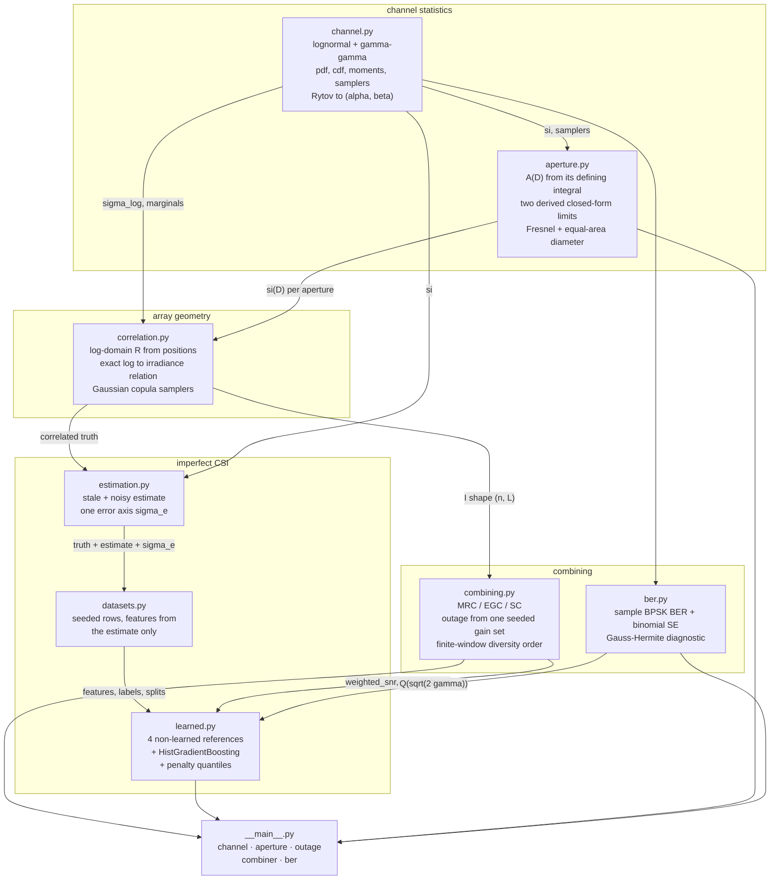
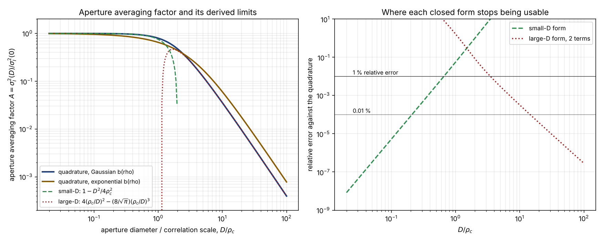
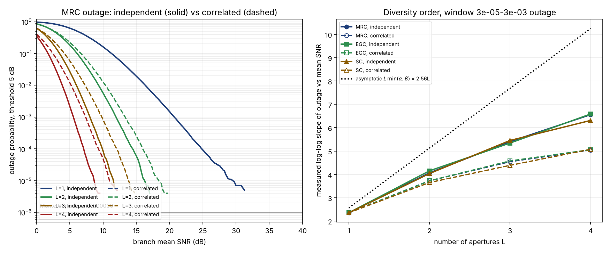
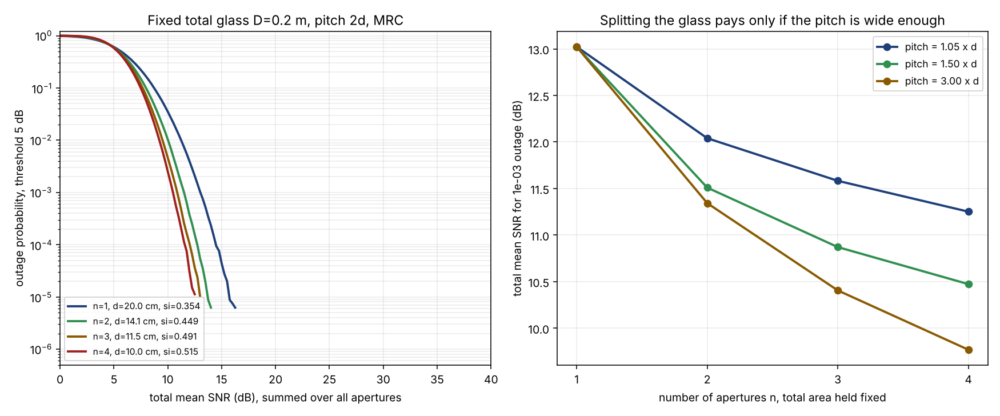
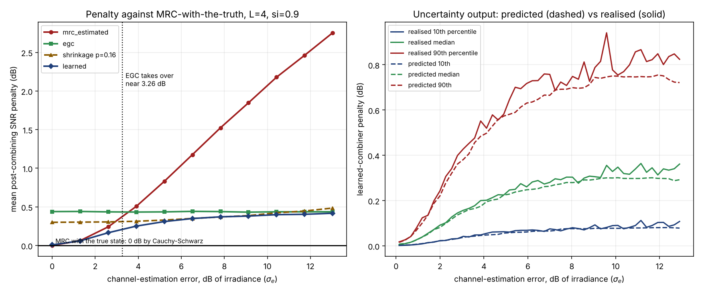

# ApertureDiv

Multi-aperture receive diversity for free-space optical links, with aperture
correlation as a first-class input.


**Status: TESTING** · Class: medium · Validation level 2 (research grade) ·
AI-enabled · Apache-2.0 · © 2026 OPTIMA Organisation

This software is research-grade. It is **not flight-qualified, not certified,
and not approved for operational aerospace use.** It models a channel; it does
not qualify a terminal, and nothing in it substitutes for a measured link.

## The problem

Someone proposes four small receive apertures instead of one large one and is
asked what it buys. They answer "diversity order four", because that is what
the textbook says for four branches, and the textbook means four
*independent* branches. The apertures are 5 cm apart on one optical bench,
the irradiance correlation scale is 10 cm, and the four branches are not
independent — nor are they independent in the quantity the combiner actually
sees, which is the irradiance and not its logarithm. Meanwhile a second
engineer wants to weight the branches by their measured channel state, has an
estimate that is three decibels wrong, and does not know that at that error
level the right thing to do is throw the estimate away.

## What this does

- **Computes the aperture averaging factor from its defining integral**, not
  from a tabulated fit, and derives two closed-form limits to check it
  against: `A ~ 1 - D^2/(4 rho_c^2)` for small apertures and
  `A ~ 4(rho_c/D)^2 - (8/sqrt pi)(rho_c/D)^3` for large. The two-term large-D
  form agrees with the quadrature to **3.740e-05** relative for
  `D/rho_c >= 20`; the small-D form is within 1 % only up to
  **`D/rho_c = 0.637`** (`validation/validate_aperture_averaging.py`).
- **Makes inter-aperture correlation explicit, in the right domain.** Quoting
  the log-irradiance correlation overstates what the combiner sees by up to
  **0.0866** at scintillation index 0.9. Four apertures at 0.05 m pitch with
  `rho_c = 0.10 m` have adjacent log correlation **0.778801** and adjacent
  irradiance correlation **0.736686** at si = 0.6
  (`validation/validate_correlation.py`).
- **Measures diversity order instead of asserting it.** For gamma-gamma
  branches at Rytov variance 1.0, four apertures give a measured log-log
  outage slope of **7.528** independent and **5.608** correlated, against a
  textbook asymptote of **10.255** (`validation/validate_combining.py`). The
  independence assumption is worth **1.4 to 1.8 dB** of branch mean SNR at
  1e-3 outage, nearly regardless of the combining scheme.
- **Shows that the lognormal channel has no finite diversity order at all.**
  The measured slope for four independent lognormal branches is 5.220, 7.204
  and 9.154 in three successive outage windows — it grows without bound,
  because the lognormal outage decays faster than any power of the mean SNR.
  For gamma-gamma the slope does converge, which is why the diversity tables
  use gamma-gamma (`validation/validate_combining.py`, check 8).
- **Locates the point where channel estimation stops being worth doing.**
  Equal-gain combining overtakes maximal-ratio-with-the-estimate at
  **3.613 dB of irradiance estimation error**, measured, bracketed by
  bisection (`validation/validate_learned_combiner.py`). Above that the right
  receiver has no channel estimator in it.

## Who it's for

- An FSO link designer choosing between one aperture and several, who needs
  the aperture-averaging and correlation trade computed rather than quoted.
- Anyone who has to defend a diversity-gain figure and wants the number with
  its window and its correlation assumption attached.
- A receiver designer deciding whether to spend hardware on channel
  estimation.

## Who it's not for

- Anyone who needs **codes, modulators or LLR machinery** over a memoryless
  channel. Use `komm`, `scikit-dsp-comm`, `pyldpc` or `galois`; this package
  has no coding in it at all.
- Anyone doing **MIMO receive processing with a channel matrix** — spatial
  multiplexing, zero-forcing or MMSE receive filters. Use `pyphysim`.
- Anyone sizing **RF satellite site diversity or tropospheric
  scintillation** against ITU-R recommendations. Use `itur`.
- Anyone who needs a **validated atmospheric model**. Every number here is
  internal to the channel model. There is no comparison against measured
  irradiance data anywhere in this repository, and the irradiance correlation
  scale is a free input rather than something derived from a `C_n^2` profile.
- Anyone who needs **pointing, co-phasing, detector or background-light
  models**. None are present.

## Alternatives, honestly

Each entry below was established by reading what the package actually ships —
unpacking the wheel and listing its modules — not from its description. The
method and date are in the footnote.

| alternative | what it does better | when to use this instead |
|---|---|---|
| [`pyphysim`](https://pypi.org/project/pyphysim/) 0.7.2 | Real MIMO receive processing: `pyphysim.mimo` ships `Blast`, `MRT`, `MRC`, `SVDMimo`, `GMDMimo` and `Alamouti`, with MMSE and zero-forcing receive filters driven by a channel **matrix**, plus `pyphysim.channels.fading` and a simulation runner. If your problem is a channel matrix, this is the mature answer. | Its `MRC` is a MIMO receive filter, not an SNR-domain diversity study: it carries no optical irradiance statistics, no aperture averaging, no scintillation index and no gamma-gamma. Use this package when the question is about *correlated optical apertures* rather than about antennas and a channel matrix. |
| [`itur`](https://pypi.org/project/itur/) 0.4.0 | ITU-R recommendation models, implemented and validated against the ITU's own validation data, including `itu618.site_diversity_rain_outage_probability` and `itu618.scintillation_attenuation`. For an RF satellite link this is the correct tool and this package is not a substitute. | It is RF: the scintillation is tropospheric, the diversity is rain-site diversity over kilometres, and there is no optical aperture averaging or gamma-gamma irradiance model. Use this package for an optical link where the diversity scale is centimetres. |
| [`komm`](https://pypi.org/project/komm/) 0.36.0 | Codes, constellations and decoders: BCH, Reed-Solomon, Golay, Polar, convolutional, Viterbi, BCJR, and a clean API. | Its channels are memoryless — `BinarySymmetricChannel`, `BinaryErasureChannel`, `DiscreteMemorylessChannel`, `GaussianChannel`, `ZChannel`. It ships **no** fading channel, **no** diversity combining and **no** interleaver (checked by listing every module in the 0.36.0 wheel). It answers a different question. |
| [`scikit-dsp-comm`](https://pypi.org/project/scikit-dsp-comm/) 2.1.2 | Digital communications teaching and DSP: `digitalcom`, `fec_block`, `fec_conv`, `synchronization`, FIR/IIR design. | Zero occurrences of diversity, combining, fading, lognormal, gamma-gamma, scintillation or aperture averaging in its source. No overlap. |
| [`commpy`](https://pypi.org/project/commpy/) 1.2.0 | Modulation, LDPC, turbo, polar, interleavers and a link simulator. Its `_mimo.stbc` module does cover transmit **diversity** via space-time block codes. | Transmit diversity through STBC is not receive diversity over a correlated optical channel, and there is no optical irradiance model. It also does **not install** in this build container, so its behaviour here is unverified beyond the wheel contents. |
| Write it yourself | Three lines of NumPy gives you `sum(I)` and `max(I)`. | What takes the time is not the combiner, it is the correlated sampler with exact marginals, the aperture-averaging integral, the finite-window slope measurement with its fit diagnostics, and the evidence that any of it is right. That is what is in `validation/`. |

<sub>Existence checked on 2026-10-06 in the build container with
`pip index versions <name>`, which returned a version list for `komm`,
`commpy`, `scikit-dsp-comm`, `pyldpc`, `galois`, `itur` and `pyphysim`, and
"No matching distribution found" for `aperturediv`. Module contents were read
from the downloaded wheels without installing them. `commpy` and `crcmod` do
not install in this container and are therefore described from their wheel
contents only; nothing in this package imports either.</sub>

## Install and first run

```bash
git clone https://github.com/OmAcharya-avtr/aperturediv.git
cd aperturediv
python -m venv .venv && source .venv/bin/activate
pip install -e ".[test]"
python -m pytest tests/ -q
python examples/aperture_averaging.py
```

Expected output of the first run:

```
339 passed
```

and of the example:

```
Aperture averaging factor, Gaussian irradiance covariance
  D/rho_c      A        small-D       rel err     large-D(2)     rel err
    0.050   0.999375     0.999375    3.256e-07 -34508.133347    3.453e+04
    0.200   0.990083     0.990000    8.358e-05   -464.189584    4.698e+02
    0.500   0.940618     0.937500    3.315e-03    -20.108133    2.238e+01
    1.000   0.794176     0.750000    5.562e-02     -0.513517    1.647e+00
    2.000   0.476222     0.000000    1.000e+00      0.435810    8.486e-02
    5.000   0.124259    -5.250000    4.325e+01      0.123892    2.952e-03
   20.000   0.009436   -99.000000    1.049e+04      0.009436    3.740e-05
  100.000   0.000395 -2499.000000    6.319e+06      0.000395    2.853e-07

small-D form within 1 % up to    D/rho_c = 0.637
large-D 2-term within 0.01 % from D/rho_c = 14.872
covariance shapes cross between D/rho_c = 2.391 and 2.486
...
wrote screenshots/aperture_averaging.png
research-grade output; not flight-qualified, not certified
```

Command line:

```bash
python -m aperturediv --help
python -m aperturediv channel --rytov 1.0
python -m aperturediv aperture --wavelength 1.55e-6 --path-length 2000
python -m aperturediv outage --samples 200000 --max-apertures 4
python -m aperturediv combiner --samples 100000
python -m aperturediv ber --ebn0 10 --si 0.3 --bits 2000000
```

## A worked example

Four apertures of equal total area against one, on a 10 km link, with the
diversity gain and its correlation cost both computed:

```python
import numpy as np
from aperturediv import (
    correlation_matrix,
    effective_scintillation_index,
    equal_area_diameter,
    fresnel_scale,
    sample_correlated_lognormal,
)
from aperturediv.combining import mrc_gain
from aperturediv.correlation import equispaced_positions

rho_c = fresnel_scale(1.55e-6, 10_000.0)          # irradiance correlation scale, m
total_d, point_si, threshold_db = 0.20, 0.6, 5.0

for n in (1, 4):
    d = equal_area_diameter(total_d, n)            # D / sqrt(n): total glass fixed
    si = effective_scintillation_index(point_si, d, rho_c)
    pos = equispaced_positions(n, 1.5 * d)         # pitch 1.5 aperture diameters
    r_log = correlation_matrix(pos, rho_c)
    irr = sample_correlated_lognormal(800_000, si, r_log, np.random.default_rng(44044))
    gain = mrc_gain(irr) / n                       # fixed total power, so divide by n
    needed = threshold_db - 10 * np.log10(np.quantile(gain, 1e-3))
    adj = r_log[0, 1] if n > 1 else float("nan")
    print(f"n={n}  d={d:.5f} m  si={si:.6f}  adj corr={adj:.6f}  "
          f"SNR for 1e-3 outage={needed:.3f} dB")
```

Actual output:

```
n=1  d=0.20000 m  si=0.354009  adj corr=nan  SNR for 1e-3 outage=13.023 dB
n=4  d=0.10000 m  si=0.514895  adj corr=0.234192  SNR for 1e-3 outage=10.473 dB
```

Splitting the glass four ways buys **2.550 dB** here, after paying for the
lost aperture averaging (the per-aperture scintillation index rises from
0.354 to 0.515) and for the quarter share of the mean power. Widen the pitch
from 1.5 to 3.0 aperture diameters and the gain rises to **3.255 dB**; tighten
it to 1.05 and it falls to **1.772 dB**
(`examples/one_big_vs_many_small.py`).

## Architecture



## Screenshots



Left: the averaging factor against `D/rho_c` with both derived limits
overlaid. Right: where each limit stops being usable — the small-D form
crosses 1 % error at `D/rho_c = 0.637` and the large-D two-term form reaches
0.01 % at `D/rho_c = 14.87`. Notice also that the two covariance shapes
cross near `D/rho_c = 2.4`: at equal `rho_c` the exponential field averages
*less* across a small aperture, which is the opposite of the first guess.



Left: MRC outage for one to four apertures, solid for the independent
idealisation and dashed for the correlated line array. Notice the dashed
curves are not parallel to the solid ones — they are shallower, so the loss
grows with mean SNR rather than being a fixed offset. Right: the measured
slope against aperture count for all three combiners, with the asymptotic
`L min(alpha, beta)` as the dotted line that none of them reaches.



Left: outage against *total* mean SNR with the total collecting area held
fixed, so the only thing changing is how the glass is divided. Notice the
per-aperture scintillation index in the legend rising from 0.354 to 0.515 as
the apertures shrink — that is the cost being paid for the decorrelation.
Right: the same comparison at three array pitches. The best aperture count is
four at every pitch tested, but what it is worth ranges from 1.77 dB to
3.26 dB.



Left: mean SNR penalty against MRC-with-the-truth, which sits at 0 dB by
Cauchy-Schwarz and not by merit. Notice that the equal-gain line is flat
across 13 dB of estimation error — it never reads the estimate — and that it
crosses MRC-with-the-estimate near 3.6 dB. Right: the uncertainty output,
predicted percentiles against realised ones.

## Validation evidence

Full tables, tolerances and the raw stdout of every run are in
[`validation/VALIDATION.md`](validation/VALIDATION.md). The checks that
matter most, including the ones where a baseline won and the one whose first
expectation was wrong:

| check | reference | result | tolerance | verdict |
|---|---|---|---|---|
| aperture-averaging kernel normalisation `int_0^1 u W(u) du = pi/16` | derived in `aperture.py` | difference below **1e-11** | 1e-11 abs | pass |
| two-term large-D limit of `A(D)` vs the quadrature, `D/rho_c >= 20` | derived | worst relative difference **3.740e-05** | 1e-4 rel | pass |
| lognormal CDF closed form vs quadrature of its own pdf | definition | worst absolute difference **2.220e-16** | 1e-10 abs | pass |
| gamma-gamma scintillation index from quadrature vs `1/a+1/b+1/(ab)` | Al-Habash, Andrews & Phillips, *Opt. Eng.* 40(8), 2001 | agrees at Rytov 0.2 to 5.0 | 1e-6 rel | pass |
| exact lognormal log-to-irradiance correlation vs 400000 samples, 32 points | derived | worst deviation **1.41e-03** | 6.32e-03 | pass |
| `gamma_MRC >= gamma_EGC` and `>= gamma_SC` pointwise | Brennan, *Proc. IRE* 47(6), 1959 | no exception in 2000000 realisations, L = 1 to 4 | none | pass |
| **`gamma_EGC >= gamma_SC` pointwise** | textbook folklore | **FALSE.** Selection beats equal gain on **0.0929 %** of realisations at L = 2 | — | **reported, not asserted away** |
| L = 1 outage vs the lognormal closed form, 5 to 25 dB | closed form | worst **\|z\| = 1.652** | 4.0 | pass |
| measured diversity order, 4 gamma-gamma apertures, outage 1e-5 to 1e-3 | — | **7.528** independent, **5.608** correlated, asymptote 10.255 | — | reported with its window |
| **MRC-with-the-truth is optimal** | Cauchy-Schwarz | max penalty **3.857e-15 dB** over 25000 held-out rows | 1e-9 | pass |
| **learned combiner vs the analytic baseline at zero estimation error** | — | **baseline wins**: -0.0000 dB against +0.0084 dB | — | **baseline wins; published as such** |
| learned combiner vs the best analytic rule, pooled | — | **0.072 dB** gained (0.2948 against 0.3667) | — | reported |
| EGC overtakes MRC-with-the-estimate | — | at **3.613 dB** of irradiance estimation error | bracketed to 0.0078 in `sigma_e` | pass |
| uncertainty calibration, nominal 0.1 / 0.5 / 0.9 | — | **0.0944 / 0.4657 / 0.8732** | 0.05 abs | pass |
| **exponential covariance averages more than Gaussian at every D** | first expectation written for the check | **FALSE.** The curves cross once, near `D/rho_c = 2.4` | — | **check rewritten to record the crossover; the wrong expectation is kept in the raw output** |
| **cross-check X2**, sample BPSK BER over lognormal fading | P010 BERBench holds the comparand | **6.039000000e-04**, binomial SE **5.493338260e-06**, 12078 errors in 20000000 bits | 3 binomial SE | emitted; comparison held by the coordinating session |

### Cross-check X2, complete configuration

BPSK coherent, ideal phase reference, hard decision; **single aperture**;
`Eb/N0` **10.0 dB** referred to the mean received irradiance; scintillation
index **0.3** defined as `var(I)/E[I]^2`; `gamma = (Eb/N0) I` with `I`
lognormal and `E[I] = 1`; **20000000 channel realisations, one bit each**, so
bits are independent and the binomial standard error is exact;
`numpy.random.default_rng(44044)`, chunk size 2000000, draw order
`z`, `bits`, `noise` per chunk. Result **6.039000000e-04 ± 5.493338260e-06**,
12078 errors, agreement interval `[5.8742e-04, 6.2038e-04]`. The
Gauss-Hermite quadrature of the same expectation gives 6.002225662e-04, i.e.
`z = +0.669`, as an internal diagnostic and not as the comparand. Running
`python validation/validate_cross_check_x2.py` prints all of it.
**No wall-clock measurement is compared to a model anywhere in this
product.**

## API reference

<details>
<summary><code>aperturediv.channel</code> — irradiance statistics, unit mean</summary>

| function | returns |
|---|---|
| `lognormal_sigma_log(si)` | `s = sqrt(ln(1+si))`, std of `ln I`, natural-log units |
| `lognormal_scintillation_index(sigma_log)` | `si = exp(s^2) - 1`, dimensionless |
| `lognormal_pdf(I, si)` | density, inverse normalised irradiance |
| `lognormal_cdf(I, si)` | `Phi((ln I + s^2/2)/s)`, dimensionless |
| `lognormal_quantile(p, si)` | normalised irradiance at probability `p` |
| `lognormal_moment(n, si)` | `E[I^n] = exp(n(n-1)s^2/2)` |
| `sample_lognormal(size, si, rng)` | unit-mean lognormal samples |
| `gamma_gamma_params_from_rytov(sigma_R2)` | `(alpha, beta)`, plane wave, dimensionless |
| `gamma_gamma_scintillation_index(a, b)` | `1/a + 1/b + 1/(ab)` |
| `gamma_gamma_moment(n, a, b)` | `E[I^n]` from the gamma functions |
| `gamma_gamma_pdf(I, a, b)` | density, evaluated in log space via `kve` |
| `gamma_gamma_cdf(I, a, b)` | CDF by quadrature in `ln I` |
| `sample_gamma_gamma(size, a, b, rng)` | product of two unit-mean gammas |

</details>

<details>
<summary><code>aperturediv.aperture</code> — aperture averaging, metres</summary>

| function | returns |
|---|---|
| `fresnel_scale(wavelength_m, path_length_m)` | `sqrt(lambda L)` in metres |
| `circular_aperture_weight(u)` | `arccos(u) - u sqrt(1-u^2)`, dimensionless |
| `normalised_covariance(rho_m, rho_c_m, model)` | `b(rho)/b(0)`, dimensionless |
| `aperture_averaging_factor(D_m, rho_c_m, model)` | `A` in `(0, 1]`, by quadrature |
| `aperture_averaging_small_d(D_m, rho_c_m)` | `1 - D^2/(4 rho_c^2)`, derived |
| `aperture_averaging_large_d(D_m, rho_c_m, order)` | `4(rho_c/D)^2 - (8/sqrt pi)(rho_c/D)^3`, derived |
| `effective_scintillation_index(si0, D_m, rho_c_m, model)` | `A(D) si(0)` |
| `equal_area_diameter(D_m, n)` | `D/sqrt(n)` in metres |

</details>

<details>
<summary><code>aperturediv.correlation</code> — array geometry and samplers</summary>

| function | returns |
|---|---|
| `equispaced_positions(n, pitch_m)` | shape `(n,)` positions in metres |
| `correlation_matrix(positions_m, rho_c_m, model)` | `(L, L)` **log-irradiance** correlation |
| `log_to_irradiance_correlation(R, si)` | `(exp(R s^2)-1)/(exp(s^2)-1)`, exact |
| `irradiance_correlation_matrix(positions_m, rho_c_m, si, model)` | `(L, L)` irradiance correlation |
| `nearest_psd(M, floor)` | PSD repair with a unit diagonal preserved |
| `sample_correlated_lognormal(n, si, R, rng)` | `(n, L)` unit-mean lognormal |
| `sample_correlated_gamma_gamma(n, a, b, R_large, rng, R_small)` | `(n, L)` unit-mean gamma-gamma |

</details>

<details>
<summary><code>aperturediv.combining</code> — combiners, outage, diversity order</summary>

| function | returns |
|---|---|
| `mrc_gain(I)` | `sum_k I_k`, dimensionless; multiply by branch mean SNR |
| `egc_gain(I)` | `(sum_k sqrt(I_k))^2 / L`, dimensionless |
| `sc_gain(I)` | `max_k I_k`, dimensionless |
| `combined_gain(I, scheme)` | dispatch over `"mrc"`, `"egc"`, `"sc"` |
| `weighted_snr(w, h, mean_snr_linear)` | `mean_snr (w.h)^2/\|\|w\|\|^2`, linear |
| `branch_mean_snr(total_linear, L, normalisation)` | per-branch mean SNR, linear |
| `outage_probability(gain, mean_snr_db, threshold_db)` | empirical `P_out`, floor `1/n` |
| `diversity_order(mean_snr_db, p_out, window, min_points)` | `DiversityOrderResult(order, n_points, window, snr_db_range, residual_rms)` |

</details>

<details>
<summary><code>aperturediv.estimation</code>, <code>datasets</code>, <code>learned</code>, <code>ber</code></summary>

| function | returns |
|---|---|
| `log_error_sigma(si, rho_t, sigma_m)` | `sqrt(2 s^2 (1-rho_t) + sigma_m^2)`, natural-log units |
| `log_error_sigma_db(sigma_e)` | the same in dB of irradiance (x 4.342944819) |
| `measurement_sigma_for_target(si, rho_t, target)` | `sigma_m` giving a wanted `sigma_e` |
| `estimate_from_log_error(I_true, sigma_e, rng)` | `ChannelEstimate(truth, estimate, sigma_e)` |
| `estimate_stale_noisy(n, si, R, rho_t, sigma_m, rng)` | `ChannelEstimate` from the full model |
| `build_features(I_hat, sigma_e)` | `(n, L+3)` features; **takes no truth argument** |
| `make_combiner_dataset(n, ...)` | `CombinerDataset`, deterministic in `seed` |
| `split_dataset(d, n_train, n_validation)` | train / validation / test by row index |
| `mrc_true_weights(I)`, `mrc_estimated_weights(I_hat)`, `egc_weights(n, L)`, `shrinkage_weights(I_hat, p)` | unit-norm weights, shape `(n, L)` |
| `penalty_db(w, h)` | SNR loss in dB against MRC-with-the-truth, `>= 0` |
| `mean_ber(w, h, branch_ebn0_db)` | mean BPSK BER over rows |
| `fit_shrinkage_exponent(validation, grid)` | `p*` minimising the mean penalty |
| `score_weights(name, w, h, ebn0_db)` | `CombinerScore` summary |
| `LearnedCombiner().fit(train)` | fitted model, deterministic in `random_state` |
| `LearnedCombiner.combine(I_hat, sigma_e)` | `(weights, penalty_quantiles_db)` |
| `q_function(x)` | `0.5 erfc(x/sqrt 2)` |
| `bpsk_ber_awgn(ebn0_db)` | `Q(sqrt(2 Eb/N0))` |
| `bpsk_ber_from_snr(gamma)` | `Q(sqrt(2 gamma))` |
| `bpsk_ber_lognormal_sample(ebn0_db, si, n_bits, seed, chunk_size)` | `SampleBer(ber, n_errors, n_bits, binomial_se)` |
| `bpsk_ber_lognormal_gauss_hermite(ebn0_db, si, n_nodes)` | quadrature of the same expectation, diagnostic only |

</details>

## Limitations

**Compute budget.** Sized for 2 CPU cores and 7.8 GiB shared with four
sibling build agents, and the sizes in the scripts are set by that budget
rather than by accuracy. Measured wall clock in that container under
four-way contention: `validate_combining.py` **89 s**,
`validate_learned_combiner.py` **184 s**, everything else under 20 s. On an
idle pair of cores the same two take about 45 s and 30 s. The
learned-combiner validation was resized from 250000 rows to 120000 after the
larger version measured **440 s** there; the conclusions were identical at
both sizes, and all committed numbers come from the committed size. Nothing
approaches the 600 s per-script limit. No GPU is used. PyTorch is not
installed and is not required; the model is scikit-learn.

**Conventions you must match before comparing anything.** The instantaneous
SNR is **linear** in irradiance, `gamma = gamma_bar I`, so the fading *power*
gain is the lognormal or gamma-gamma irradiance. A thermal-noise-limited
intensity-modulated receiver instead has `gamma ∝ I^2`, which is a factor of
two in every dB figure. Correlation is specified on the **log-irradiance**
field. `Eb/N0` is referred to the **mean** irradiance, not the median.

**No validation against measured data.** Every number in this repository is
internal to the model or the sampler. The models are cited to the literature;
their agreement with a real atmosphere is not established here.

**The irradiance correlation scale is a free input.** It is not derived from a
`C_n^2` profile, a wind speed or a path geometry. The CLI defaults it to the
Fresnel scale `sqrt(lambda L)` for convenience; that is a convenience, not a
result, and the aperture-averaging answer is more sensitive to `rho_c` than to
the shape of the covariance.

**Aperture averaging keeps the distribution family.** `si(D) = A(D) si(0)`
scales the scintillation index and leaves the lognormal or gamma-gamma shape
alone. Aperture averaging does not strictly preserve either family, and the
size of that approximation error is **not** quantified here.

**Diversity order is a finite-window measurement.** It is reported with its
window, its point count and its fit residual, and it is not an asymptotic
limit. For a **lognormal** channel there is no finite asymptotic diversity
order at all — the measured slope grows without bound as the window moves
down, demonstrated in `validate_combining.py` check 8 — so any single number
for a lognormal channel is a property of the window as much as of the array.

**The lognormal model is a weak-fluctuation model.** The learned-combiner
study runs at si = 0.9, at the edge of where it is justified. A gamma-gamma
marginal gives a heavier deep-fade tail: more than **3x** the outage at 1e-3
at matched scintillation index. The learned combiner has not been retrained
or evaluated on gamma-gamma branches.

**The learned combiner's margin is small, and the baselines bracket it.** It
cannot beat MRC-with-the-truth (Cauchy-Schwarz), it loses to
MRC-with-the-estimate at zero estimation error and ties it at `sigma_e` =
0.25, and against the best analytic rule it gains **0.072 dB** pooled and at
most **0.097 dB** at any single error level. Once the estimation error passes
3.613 dB the right answer is equal-gain combining, which needs no model. `sigma_e` is a feature, and outside its trained range
[0, 3.0] the gradient-boosted trees extrapolate flat without signalling it.
A model fitted at `L = 4` cannot serve a different aperture count.

**Channel memory is not modelled.** Each dataset row is an independent symbol
interval. Staleness enters only through its contribution to `sigma_e`, not as
a time series, so nothing here supports a claim about interleaver depth or
feedback latency.

**Not modelled at all:** co-phasing error, pointing and tracking, aperture
misalignment, detector noise, background light, saturation, beam wander as a
separate process, and non-Kolmogorov turbulence.

**Monte Carlo floors are real.** `outage_probability` returns exactly 0 below
`1/n`, and `diversity_order` raises rather than fitting a slope through fewer
than `min_points` usable points. Both are deliberate: a silently extrapolated
outage is worse than an error.

## Reproducing every number

```bash
pip install -e ".[dev]"

# test counts (read from the junit XML, not from pytest's stdout line)
python -m pytest tests/ -q --tb=no --junit-xml=p044.xml

# validation, in the order the evidence is presented
python validation/validate_channel_stats.py          #  section 1
python validation/validate_aperture_averaging.py     #  section 2
python validation/validate_correlation.py            #  section 3
python validation/validate_combining.py              #  section 4
python validation/validate_learned_combiner.py       #  section 5
python validation/validate_cross_check_x2.py         #  section 6, the X2 number

# figures and the numbers printed with them
MPLBACKEND=Agg python examples/aperture_averaging.py
MPLBACKEND=Agg python examples/combining_outage.py
MPLBACKEND=Agg python examples/one_big_vs_many_small.py
MPLBACKEND=Agg python examples/learned_combiner_vs_baselines.py

# lint
ruff check src/ tests/ examples/ validation/
```

Every seed is a module-level constant in the script that uses it. The
headline seed is 44044 throughout. No data file and no model binary is
committed: `validation/` holds the scripts and their raw stdout, and
`screenshots/` holds PNGs the examples in this repository produce.

## Licence

Apache-2.0. See [`LICENSE`](LICENSE). © 2026 OPTIMA Organisation.

## Citation

See [`CITATION.cff`](CITATION.cff).

```
OPTIMA Organisation (2026). aperturediv: multi-aperture receive diversity for
free-space optical links. Version 0.1.0.
```

References this repository relies on, each verified before being named:

- L. C. Andrews and R. L. Phillips, *Laser Beam Propagation through Random
  Media*, 2nd ed., SPIE Press, 2005 — the lognormal and gamma-gamma
  irradiance models and the aperture-averaging integral. No page number or
  tabulated constant is quoted from it; the averaging factor is computed from
  its defining integral and both closed-form limits used as validation
  targets are derived in the source docstrings.
- M. A. Al-Habash, L. C. Andrews and R. L. Phillips, "Mathematical model for
  the irradiance probability density function of a laser beam propagating
  through turbulent media", *Optical Engineering* 40(8), 2001 — origin of the
  gamma-gamma model. The plane-wave Rytov-to-(alpha, beta) mapping is the
  widely reproduced form of this literature and is checked here for internal
  consistency against the model's own closed-form scintillation index rather
  than asserted as a quotation.
- D. G. Brennan, "Linear Diversity Combining Techniques", *Proceedings of the
  IRE* 47(6), 1959 — maximal-ratio, equal-gain and selection combining, and
  the optimality of maximal-ratio combining under perfect channel knowledge.
  That optimality is additionally enforced here as a property-based test.
- X. Zhu and J. M. Kahn, "Free-space optical communication through
  atmospheric turbulence channels", *IEEE Transactions on Communications*
  50(8), 2002 — prior art for lognormal-channel FSO link analysis. No
  numerical value in this repository is taken from it.

## Credits

This is under reserved rights obtained by OPTIMA Organisation.
