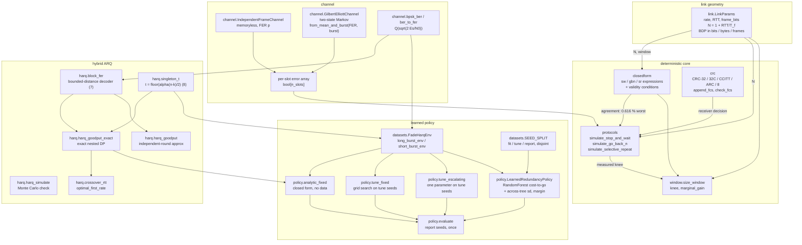
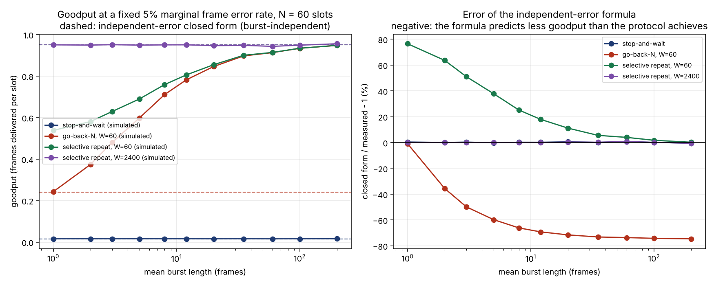
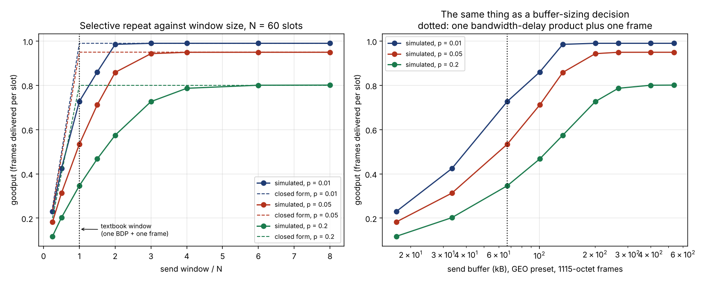
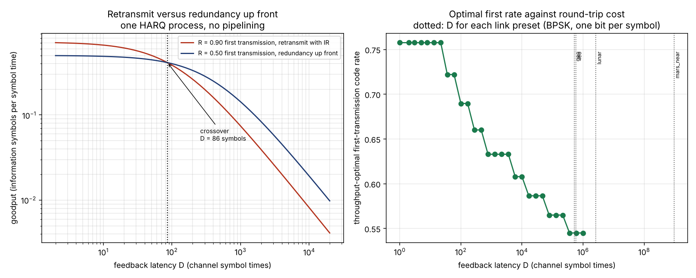
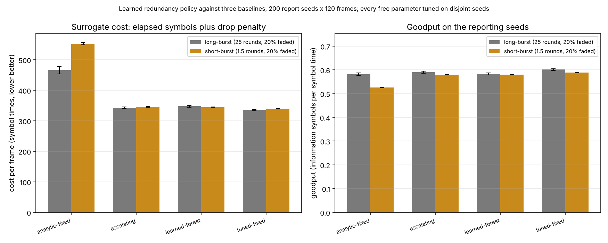

# arqlonghaul

ARQ and hybrid-ARQ goodput on links where the round-trip time dominates.


**Status: TESTING** · Class: medium · Validation level 2 (research grade) ·
AI-enabled · Apache-2.0 · © 2026 OPTIMA Organisation

This software is research-grade. It is **not flight-qualified, not certified,
and not approved for operational aerospace use.** It models protocols; it does
not validate a link design, and nothing in it substitutes for a mission link
budget or a protocol qualification.

## The problem

Someone sizes a send window on a lunar link with the textbook rule — one
bandwidth-delay product plus one frame — and gets 56 per cent of the throughput
the formula promised, because the formula assumes a window that never blocks
and a real selective-repeat sender cannot release a sequence number until the
frame at its base is acknowledged. Someone else rules out go-back-N from
`eta = (1-p)/(1-p+Np)` evaluated at a measured average frame error rate, not
knowing that the errors arrive in bursts and that bursts are the one thing
go-back-N handles well, so the formula understated its goodput by a factor of
nearly four. A third person wants to know whether to retransmit or to send
redundancy up front, and the answer is a definite number that moves by a factor
of four over a 4 dB change in signal-to-noise ratio, which is not a thing
anybody remembers.

## What this does

- **Simulates the three protocol state machines and shows the agreement that
  licenses believing them.** Stop-and-wait, go-back-N and selective repeat with
  a real `N`-slot feedback pipeline, in-order window-base advancement, go-back
  storms and head-of-line blocking. Against the classical closed forms, in the
  regime where those are exact, over 78 cases: **worst relative deviation
  0.616 per cent, worst `|z|` 2.36** against the batch-means standard error
  (`validation/validate_closed_form.py`).
- **Measures how wrong the independent-error assumption is on a bursty
  channel.** Holding the marginal frame error rate at 5 per cent on an `N = 60`
  link and sweeping the mean burst length, the independent-error go-back-N
  expression **understates measured goodput by 74.1 per cent** at bursts of 100
  frames; measured go-back-N goodput **rises by 284 per cent** at a fixed
  marginal rate. Stop-and-wait moves by at most **0.52 per cent**, which was
  predicted in advance from the linearity of its throughput in the marginal
  rate (`validation/validate_burst_goodput.py`).
- **Reports the window a sender actually needs, in frames and in bytes.** At a
  5 per cent frame error rate the textbook window delivers **56.5 per cent** of
  the ideal; reaching 99 per cent takes **three times** that window, and at a
  20 per cent frame error rate **six times** — on the GEO preset, 401400 bytes
  of send buffer rather than 66900 (`validation/validate_window.py`).
- **Locates the retransmit-versus-redundancy crossover and says what fixes
  it.** With `k = 200`, Es/N0 = 1 dB, `alpha = 0.5`, `delta = 40`, `M = 4`, the
  crossover is at **D = 85.87 channel symbol times**, and it moves by
  **−63.9 per cent** at 0 dB, **+374.3 per cent** at 3 dB, **−42.7 per cent**
  at `alpha = 0.4` and **+86.8 per cent** at `alpha = 0.8`. Every link preset
  here is **four to seven orders of magnitude past it**
  (`validation/validate_harq.py`).
- **Publishes a learned redundancy policy that loses to a two-parameter grid
  search.** On 45000 held-out frames the tuned fixed schedule beats the learned
  random forest by **1.66 per cent of cost per frame** in the long-burst regime
  (`|z| = 2.27`) and **3.03 per cent** in the short-burst regime
  (`|z| = 23.50`). The learned policy does beat the analytic fixed schedule by
  24.1 and 36.4 per cent, for a reason that is a criticism of the analytic
  baseline rather than a compliment to the model
  (`validation/validate_policy.py`).

## Who it is for

- Anyone sizing a send window or a send buffer on a GEO, lunar or deep-space
  link who wants the number a protocol achieves rather than the number a
  formula promises, in bytes, with the frame size written down.
- Anyone choosing between go-back-N and selective repeat on a link whose errors
  are known to be bursty, where the ranking the independent-error formulas give
  is not the ranking the protocols deliver.
- Anyone deciding how much forward redundancy to carry on a long-delay link and
  wanting the crossover with its sensitivity to every assumption attached.
- Anyone who has been told that a learned policy will beat fixed-rate HARQ and
  wants to see the comparison run honestly, on disjoint seeds, with the
  baseline tuned as hard as the model.
- Students and educators: every expression is derived in the module docstring
  it lives in, and every validation script prints its working.

## Who it is not for

- **Anyone needing a packet-level network simulator.** Use
  [ns-3](https://www.nsnam.org/). It has a real protocol stack, real headers,
  real queues and a twenty-year user base. This package has one link, one
  sender, one receiver, constant-length frames and an error-free reverse
  channel.
- **Anyone needing a physical-layer link simulator.** Use
  [`sionna`](https://pypi.org/project/sionna/) if you have TensorFlow, or
  [`commpy`](https://pypi.org/project/commpy/). This package's physical layer is
  one equation, `p_b = Q(sqrt(2 Es/N0))` for coherent BPSK, and a
  Singleton-bound model of a code family. There is no modulator, no
  synchroniser and no real decoder in it.
- **Anyone implementing a protocol.** There is no wire format here, no header,
  no sequence-number wraparound, no timer management and no congestion control.
  For the real long-delay protocols see RFC 5326 (Licklider Transmission
  Protocol) and the CCSDS Bundle Protocol documents.
- **Anyone who needs a named standardised code.** `t = floor(alpha (n-k)/2)`
  with an explicit `alpha` is a Singleton-bound model. It is not an LDPC, turbo
  or Reed-Solomon code and no claim is made that it matches one. Every result
  depending on `alpha` is reported with its `alpha` sensitivity.
- **Anyone wanting a certified or flight-qualified answer.** This is
  research-grade. It will not qualify a protocol, close a link budget or
  support a reliability case.
- **Anyone wanting the learned policy to win.** It does not. See
  `MODEL_CARD.md`.

## Alternatives, honestly

Package contents below were established by reading the distributions on
2026-10-06, not from their descriptions. None of them is a dependency of this
package and none is imported by it.

| Alternative | What it does better | When to use this instead |
|---|---|---|
| [ns-3](https://www.nsnam.org/) | **The right tool for anything resembling a network.** A full discrete-event packet simulator with real protocol implementations, headers, queueing and a large validated model library. Not on PyPI (`pip index versions ns-3` returns "No matching distribution found"); it is a C++ project with Python bindings, built from source. | When the question is about one ARQ link's goodput and you want it answered in seconds rather than after a build, and when you want the *closed-form agreement* established as a number before believing the simulator. This package's whole claim is the 0.616 per cent agreement in section 2 of `validation/VALIDATION.md` and the measured departures from it elsewhere. |
| [`commpy`](https://pypi.org/project/commpy/) 1.2.0 | **The closest thing to a bursty-channel model on PyPI.** Reading the wheel: it ships `Channels.gilbert_elliott(bits, p_gb, p_bg, p_good, p_bad, ...)`, a **bit-level** Gilbert-Elliott channel that returns corrupted bits, plus a `CRC` class, BCH, Reed-Solomon, convolutional, turbo, LDPC and polar codes, and modulation. That is far more physical layer than this package has. | When you need **ARQ**. A grep over every `.py` file in the 1.2.0 wheel finds no `ARQ`, `HARQ`, `go_back_n`, `selective_repeat` or `stop_and_wait` anywhere: `commpy` models the channel and the code, not the retransmission protocol. Its Gilbert-Elliott channel is also per *bit*, where ARQ throughput needs per *frame* error correlation with a controllable burst length in frames. `commpy` does not install in this build environment, so no side-by-side benchmark was run and none is claimed. |
| [`crcmod`](https://pypi.org/project/crcmod/) 1.7 | The established CRC library, with a full catalogue in `predefined.py` and a C extension. | When you want only a CRC. `crcmod` 1.7 is a 2010 release with a Python-2 / Python-3 split source tree and does not install in this build environment, which is why `arqlonghaul.crc` exists. Its catalogue is still the reference: all five of this package's CRCs are checked against `crcmod`'s published check values, and CRC-32 additionally against `zlib.crc32`. |
| [`komm`](https://pypi.org/project/komm/) 0.36.0 | A clean, modern, well-typed communications library. Reading the wheel: it ships `CyclicRedundancyCheck` under `komm/_error_control_checksum/`. | When you need ARQ or HARQ. A grep over every `.py` in the 0.36.0 wheel finds **no ARQ, HARQ or retransmission code of any kind**, and no Gilbert-Elliott channel. |
| [`sionna`](https://pypi.org/project/sionna/) 2.2.0 | A serious research-grade physical-layer simulator with 5G NR components, differentiable end to end. | When you do not have TensorFlow, which this build environment does not, and when the question is protocol-level goodput rather than link-level bit error rate. |
| [`simpy`](https://pypi.org/project/simpy/) 4.1.2 | A general discrete-event simulation framework, well maintained, and the right foundation if you are building a bespoke protocol simulator. | When you want the protocols already written and already checked against the closed forms. `simpy` ships no protocol models at all; it ships the event loop. |
| Evaluating `(1-p)/(1-p+Np)` in a spreadsheet | Instant, no install, exactly right under independent frame errors with a window at or above `N`. | When the errors are correlated, or the window is finite. This repository measures the first case as a **74.1 per cent** understatement of go-back-N goodput and the second as a **145 per cent** overstatement of window-limited selective-repeat goodput. The spreadsheet will not tell you which way it is wrong. |

**The narrow defensible claim.** This package is *a validated slotted simulator
for three ARQ protocol state machines and two HARQ schemes, with the agreement
against the classical closed forms measured in the regime where they are exact,
and the departure from them measured where the errors are correlated or the
window is finite.* It is **not** a network simulator, **not** a physical-layer
simulator, **not** a protocol implementation, and **not** a source of
flight-qualified numbers.

## Install and first run

```bash
git clone https://github.com/OmAcharya-avtr/arqlonghaul.git
cd arqlonghaul
python -m venv .venv && source .venv/bin/activate
pip install -e ".[dev]"
python -m pytest tests/ -q
python -m arqlonghaul window --preset lunar
```

Expected output of the test run:

```
229 passed in 47.26s
```

Expected output of the first command:

```
frame                 8920 bits
N                     294.0987 slots
bandwidth-delay       293.0987 frames = 326805 bytes
knee (window binds)   295 frames = 328925 bytes
at the knee, fer=0.05:
  selective repeat    eta 0.950000 -> 936368 bit/s
  go-back-N           eta 0.060684 -> 59812.9 bit/s
```

Then the headline measurement, which takes about 25 seconds:

```bash
python -m arqlonghaul simulate --n 40 --window 40 --fer 0.05 --burst 15 --slots 100000
```

```
channel               GE fer=0.05 burst=15
realised frame error  0.045020 over 100000 slots
protocol                   eta      stderr    tx/frame
stop_and_wait         0.023855    0.000091      1.0480
go_back_n             0.874297    0.005371      1.1438
selective_repeat      0.879518    0.004736      1.0458
```

Compare the go-back-N figure with the independent-error closed form at the same
marginal rate, `(1-0.04502)/(1-0.04502+40·0.04502) = 0.3466`. The formula is
wrong by a factor of 2.5.

## A worked example

```python
import numpy as np
from arqlonghaul import (
    GilbertElliottChannel, HarqConfig, IndependentFrameChannel,
    crossover_rtt, gbn_throughput, harq_goodput_exact, preset,
    simulate_go_back_n, simulate_selective_repeat, size_window, sr_throughput,
)

link = preset("lunar")
print(f"N = {link.slots_per_cycle:.1f} slots, BDP = {link.bdp_bytes:.0f} bytes")

sizing = size_window(link, 0.05)
print(f"textbook window {sizing.knee_frames} frames: "
      f"SR {sizing.sr_goodput_at_knee:.4f}, GBN {sizing.gbn_goodput_at_knee:.4f}")

n, rng = 60, np.random.default_rng(0)
iid = IndependentFrameChannel(0.05).errors(300_000, rng)
sim = simulate_selective_repeat(iid, n, n)
print(f"SR at W=N: formula {sr_throughput(0.05, n, n):.4f}, "
      f"measured {sim.goodput:.4f} +- {sim.goodput_stderr:.4f}")

ge = GilbertElliottChannel.from_mean_and_burst(0.05, 25.0).errors(300_000, rng)
print(f"GBN: formula {gbn_throughput(0.05, n, n):.4f}, "
      f"iid {simulate_go_back_n(iid, n, n).goodput:.4f}, "
      f"bursty {simulate_go_back_n(ge, n, n).goodput:.4f}")

res = harq_goodput_exact(HarqConfig(k=200, n1=300, delta=40, max_rounds=4,
                                    esn0_db=1.0, rtt_symbols=500.0, alpha=0.5))
print(f"IR goodput {res.goodput:.4f}, residual {res.residual_fer:.2e}")

cx = crossover_rtt(k=200, esn0_db=1.0, delta=40, retransmit_rate=0.90,
                   upfront_rate=0.50, max_rounds=4, alpha=0.5)
print(f"crossover D = {cx['crossover_d']:.0f} symbols; this link D = {link.bdp_bits:.3g}")
```

Actual output (`validation/worked_example.py`, raw stdout in
`validation/worked_example_output.txt`):

```
1. Lunar, 1 Mbit/s, 1115-octet frame
   N = 294.1 slots, bandwidth-delay = 326805 bytes = 293.1 frames
   smallest window for continuous transmission: 295 frames
2. at the textbook window of 295 frames (328925 bytes):
   selective repeat eta = 0.9500 -> 936.4 kbit/s
   go-back-N        eta = 0.0607 -> 59.8 kbit/s
3. N = 60, W = 60, independent errors at 5 per cent:
   closed form says eta = 0.9500
   the state machine measures eta = 0.5339 +- 0.0014
   the difference is head-of-line blocking, which the formula omits
4. same 5 per cent marginal rate, bursts of 25 frames:
   go-back-N closed form        eta = 0.2405
   go-back-N, independent errors eta = 0.2404
   go-back-N, bursty errors      eta = 0.8770
   the formula is wrong by -72.6 per cent
5. type-II IR, k = 200, first rate 0.667, D = 500 symbols:
   goodput 0.2466, residual frame error 2.80e-09, 1.020 rounds per frame
6. crossover at D = 86 symbol times; this link's D is 2.61e+06,
   a factor of 30446 past it, so for a single HARQ process
   with no pipelining the answer is always to pay up front
```

## Architecture



The arrow that matters is `closedform --> protocols`: the simulator is only
usable because its agreement with the closed forms was measured first, in the
regime where the closed forms are exact. Everything the simulator then says
about correlated errors and finite windows rests on that one number.

## Screenshots



The dashed lines are the independent-error closed forms and do not depend on
burst length, so they are flat. Notice that the go-back-N curve rises away from
its dashed line by a factor of nearly four, the window-limited selective-repeat
curve rises too, and the stop-and-wait curve does not move at all. Nothing here
is made worse by bursts and nothing here is predicted by the formula.



Left: the solid simulated curves sit well below the dashed closed form at and
below `W = N`, the textbook window marked by the dotted line. Right: the same
thing on a byte axis for the GEO preset, which is the axis a buffer-sizing
decision is actually made on — notice that the 20 per cent curve is still
climbing at 400 kB.



Left: the two strategies cross at a definite feedback latency, marked. Right:
the optimal first-transmission rate falls monotonically with the round trip,
and the dotted vertical lines are the actual `D` values of the link presets —
all of them far to the right of the crossover.



Lower is better in the left panel. Notice that the `tuned-fixed` bar is the
shortest in both regimes: a two-integer grid search beats the learned forest.
Notice also the `analytic-fixed` bar, which is the tallest, and read the
Validation section for why that is a criticism of the analytic baseline rather
than a win for the model.

## Validation evidence

Full detail, raw script output and the derivations are in
`validation/VALIDATION.md`. Checks that did not come out clean, and the
comparison a baseline won, are in this table.

| Check | Reference | Result | Tolerance | Verdict |
|---|---|---|---|---|
| CRC catalogue check values, 5 CRCs | `crcmod` 1.7 `predefined.py`, read 2026-10-06 | 5 of 5 agree exactly | exact | pass |
| CRC-32 against `zlib.crc32` | Python standard library | 0 mismatches, 3000 payloads, 763709 bytes | exact | pass |
| Table-driven CRC vs bit-at-a-time | internal independent code path | 0 mismatches in 2000 comparisons | exact | pass |
| Simulator vs the classical closed forms | Lin & Costello 2004; Tanenbaum | worst **0.616 %** relative, worst **\|z\| 2.36**, 78 cases | 1 % rel where rel SE < 0.5 %; \|z\| ≤ 4 | pass |
| Identity `sr(p,N,1) == sw(p,N)` | internal | 2.78e-17 absolute, 24 cases | 1e-12 | pass |
| Window-limited expression `(1-p)W/N` | Lin & Costello | **overstates by up to 145 %** for 1 < W < N | none; reported | **expression is an upper bound** |
| Ideal `eta = 1-p` at the textbook window | Lin & Costello | **43.8 to 63.7 % shortfall at W = N** | none; reported | **textbook window insufficient** |
| Gilbert-Elliott marginal rate | eq. (3), derived in `channel.py` | worst **\|z\| 2.60**, 6 cases | \|z\| ≤ 4 | pass |
| Gilbert-Elliott mean sojourn | eq. (4) | worst **\|z\| 2.66**, 6 cases | \|z\| ≤ 4 | pass |
| Gilbert-Elliott autocorrelation | eq. (5) | worst **2.87e-03** absolute, 12 lags | 5e-03 | pass |
| `block_fer` vs a `math.comb` sum | eq. (7), Lin & Costello | worst **3.33e-16** absolute, 25 cases | 1e-12 | pass |
| Type-I chase: analytic vs Monte Carlo | internal | worst **\|z\| 1.33**, 6 cases | \|z\| ≤ 4 | pass |
| Type-II IR: exact DP vs Monte Carlo | internal | worst **\|z\| 1.34**, 12 cases | \|z\| ≤ 4 | pass |
| Independent-round approximation error | exact nested DP | **up to +1.54 %** on the residual FER | none; reported | characterised, not hidden |
| Marginal window gain vs finite difference | eq. (6) | worst **6.94e-17** absolute, 36 cases | 1e-12 | pass |
| `bdp_frames == N - 1` | arithmetic | 0.000e+00 over 4 presets | exact | pass |
| Learned policy vs **tuned fixed schedule** | this repo, 45000 held-out frames | **learned loses by 1.66 % and 3.03 % of cost** | none; reported | **baseline wins** |
| Learned policy vs analytic fixed schedule | this repo | learned wins by 24.1 % and 36.4 % of cost | none; reported | learned wins |
| Learned policy decision margin | internal | median **0.65 σ**, **63.3 %** of states below 1 σ | none; reported | policy is often undecided |

### The headline: how wrong the independent-error assumption is

Marginal frame error rate held at 0.05, `N = 60` slots, window 60 frames.
Entries are `closed form / measured − 1`, so a negative entry means the formula
predicts *less* goodput than the protocol achieves
(`validation/validate_burst_goodput.py`).

| mean burst (frames) | stop-and-wait | go-back-N | sel. repeat W=N | sel. repeat W=40N |
|---|---|---|---|---|
| 1 (memoryless) | −0.18 % | −0.60 % | +76.67 % | −0.00 % |
| 2 | +0.09 % | −35.85 % | +62.47 % | −0.05 % |
| 5 | −0.14 % | −60.08 % | +37.80 % | −0.05 % |
| 10 | +0.08 % | −68.00 % | +21.18 % | −0.01 % |
| 25 | +0.36 % | −72.34 % | +8.57 % | +0.32 % |
| 50 | −0.21 % | −73.77 % | +3.55 % | −0.12 % |
| 100 | +0.52 % | **−74.13 %** | +2.19 % | +0.53 % |

And the same measurements expressed as the change in *measured* goodput against
the memoryless channel at the same marginal rate, which isolates correlation
from formula error:

| mean burst (frames) | stop-and-wait | go-back-N | sel. repeat W=N | sel. repeat W=40N |
|---|---|---|---|---|
| 2 | −0.27 % | +54.96 % | +8.74 % | +0.05 % |
| 10 | −0.26 % | +210.64 % | +45.80 % | +0.01 % |
| 100 | −0.69 % | **+284.16 %** | **+72.88 %** | −0.53 % |

**The result the author did not expect.** The brief for this product assumed
bursts would hurt, and for go-back-N and window-limited selective repeat they
help, substantially. The mechanism is the same in both cases: head-of-line
blocking and go-back both cost a fixed pipeline drain **per error event**, and
correlation packs a fixed amount of error mass into fewer events. A protocol
whose cost is linear in the marginal error rate — stop-and-wait, and selective
repeat with a window large enough never to stall — is indifferent to
correlation, which is why those two columns are flat to within half a per cent.
Nothing measured here is helped by assuming independence.

### Where a baseline won

The learned redundancy policy loses to a fixed schedule whose two integers were
chosen by grid search on 40 tune seeds, in both channel regimes, on 45000
held-out frames:

| regime | tuned-fixed cost/frame | learned cost/frame | learned is worse by | z |
|---|---|---|---|---|
| long-burst (25-round fades) | **331.401 ± 1.541** | 336.902 ± 1.875 | +1.660 % | 2.27 |
| short-burst (1.5-round fades) | **339.893 ± 0.381** | 350.194 ± 0.217 | +3.031 % | 23.50 |

In the short-burst regime the adaptive escalating heuristic also beats the
learned model, by 1.315 per cent (`|z| = 8.88`). The model was not retuned
after this was found and it has not been removed.

The structural reason was written down before the measurement was taken. On a
long link the feedback that would reveal the channel state is at least one
round trip old, so a policy cannot track the channel; it can only exploit the
channel's *statistics* — and a fixed schedule already encodes those statistics
exactly. The measurement then says that the correlation surviving the
staleness, 19.5 rounds of channel memory against a one-round decision interval
in the long-burst regime, is still not enough to beat a well-chosen constant.
The model's own uncertainty output agrees: at **63.3 per cent** of the states it
visits, the margin between its two best actions is under one across-tree
standard deviation, so most of its decisions are not decisions.

## API reference

### `arqlonghaul.link`

| Function or attribute | Returns |
|---|---|
| `LinkParams(rate_bps, rtt_s, frame_bits, payload_bits=None, name="")` | Link geometry; validates all four inputs |
| `.frame_time_s` | Frame transmission time, s |
| `.slots_per_cycle` | `N = 1 + RTT/T_f`, dimensionless |
| `.n_slots()` | `N` rounded to the nearest integer slot, ≥ 1 |
| `.bdp_bits` / `.bdp_bytes` / `.bdp_frames` | Bandwidth-delay product, bits / bytes / frames |
| `.min_continuous_window` | Smallest window permitting continuous transmission, frames |
| `.window_bytes(window_frames)` | Send buffer implied by a window, bytes |
| `.code_overhead` | Fraction of each frame that is not payload |
| `.describe()` | All of the above as a flat dict |
| `PRESETS`, `preset(name)` | Four illustrative links: `geo`, `leo`, `lunar`, `mars_near` |

### `arqlonghaul.closedform`

| Function | Returns |
|---|---|
| `slots_per_cycle(rtt_s, frame_time_s)` | `N`, dimensionless |
| `sw_throughput(p, n)` | `(1-p)/N`, frames per slot |
| `gbn_throughput(p, n, window=None)` | `(1-p)/(1-p+Np)`; raises if `window < ceil(N)` |
| `sr_throughput(p, n, window=None)` | `(1-p) min(1, W/N)`; **upper bound for W > 1** |
| `throughput(protocol, p, n, window=None)` | Dispatch by protocol name |
| `expected_transmissions(p)` | `1/(1-p)`, transmissions per frame |
| `window_knee(n)` | Window at which the window stops binding, frames |

### `arqlonghaul.protocols`

| Function | Returns |
|---|---|
| `simulate_stop_and_wait(errors, n, warmup=None, n_batches=20)` | `SimResult` |
| `simulate_go_back_n(errors, n, window, ...)` | `SimResult` |
| `simulate_selective_repeat(errors, n, window, ...)` | `SimResult` |
| `simulate(protocol, errors, n, window=1, ...)` | Dispatch by name |
| `SimResult.goodput` | Frames delivered in order per slot |
| `SimResult.goodput_stderr` | Batch-means standard error, dimensionless |
| `SimResult.goodput_bps(payload_bits, frame_time_s)` | Information throughput, bit/s |
| `SimResult.utilisation` | Fraction of slots carrying a transmission |
| `SimResult.mean_transmissions_per_frame` | Transmissions per delivered frame |
| `SimResult.as_dict()` | Flat dict of scalars |

### `arqlonghaul.window`

| Function | Returns |
|---|---|
| `size_window(link, fer)` | `WindowSizing`: knee in frames and bytes, both protocols' goodput and bit/s |
| `window_sweep(n, fer, windows)` | Dict of arrays; go-back-N is `nan` below `ceil(N)` |
| `marginal_gain(n, fer, window)` | Goodput gained per extra frame of window |

### `arqlonghaul.channel`

| Function | Returns |
|---|---|
| `IndependentFrameChannel(fer)` | Memoryless frame-error channel |
| `GilbertElliottChannel(p_gb, p_bg, eps_g, eps_b)` | Two-state Markov channel |
| `GilbertElliottChannel.from_mean_and_burst(mean_fer, mean_burst_slots, ...)` | Channel with marginal rate and burst length set independently |
| `.errors(n_slots, rng)` | Boolean per-slot error flags |
| `.state_trace(n_slots, rng)` | Boolean faded-state trace |
| `.mean_fer` / `.mean_burst_slots` / `.pi_bad` / `.lam` | Stationary quantities, eqs. (2)–(4) |
| `.autocorrelation(lag)` | Lag-`k` autocorrelation of the error indicator, eq. (5) |
| `bpsk_ber(esn0_db)` | `0.5 erfc(sqrt(Es/N0))`, dimensionless |
| `ber_to_fer(ber, frame_bits)` / `fer_to_ber(fer, frame_bits)` | Independent-bit mapping, both directions |

### `arqlonghaul.crc`

| Function | Returns |
|---|---|
| `crc(data, spec=CRC32)` | CRC value, table-driven |
| `crc_bitwise(data, spec=CRC32)` | CRC value, bit-at-a-time, as an independent check |
| `append_fcs(payload, spec)` / `check_fcs(frame, spec)` | Frame with FCS appended / bool |
| `CATALOGUE`, `CRC32`, `CRC32C`, `CRC16_CCITT_FALSE`, `CRC16_ARC`, `CRC8` | Five verified CRC definitions |

### `arqlonghaul.harq`

| Function | Returns |
|---|---|
| `block_fer(n, t, p)` | Bounded-distance block error probability, eq. (7) |
| `singleton_t(n, k, alpha=1.0)` | `floor(alpha(n-k)/2)`, correctable symbols, eq. (8) |
| `HarqConfig(k, n1, delta, max_rounds, esn0_db, rtt_symbols, alpha, scheme)` | One configuration; `.first_rate`, `.t_after(m)`, `.symbol_ber(m)` |
| `harq_goodput(cfg)` | `HarqResult` by the independent-round **approximation** |
| `harq_goodput_exact(cfg)` | `HarqResult` by the exact nested dynamic program |
| `harq_simulate(cfg, n_frames, rng)` | `HarqResult` by Monte Carlo |
| `schedule_metrics(k, increments, p, rtt_symbols, alpha, drop_penalty)` | Exact metrics for an arbitrary increment schedule at a given BER |
| `optimal_first_rate(k, rtt_symbols, esn0_db, delta, ...)` | `(rate, n1, HarqResult)` |
| `crossover_rtt(k, esn0_db, delta, retransmit_rate, upfront_rate, ...)` | Goodput curves and the crossover `D`, `nan` if none in grid |

### `arqlonghaul.datasets` and `arqlonghaul.policy`

| Function | Returns |
|---|---|
| `FadeHarqEnv(...)`, `long_burst_env()`, `short_burst_env()` | The learned-policy environment |
| `SEED_SPLIT` | Three disjoint seed tuples; constructor raises on overlap |
| `analytic_fixed(env)` | `(policy, detail)` from the closed form, using no data |
| `tune_fixed(env, seeds, n_frames)` | `(policy, detail)` by grid search on those seeds |
| `tune_escalating(env, seeds, n_frames)` | `(policy, detail)`, one free parameter |
| `collect_transitions(env, seeds, n_frames, rng_seed)` | `{features, actions, cost}` from the random behaviour policy |
| `LearnedRedundancyPolicy(n_actions, ...)` | `.fit`, `.act`, `.predict_with_uncertainty`, `.decision_confidence` |
| `run_episode(env, policy, n_frames, seed, record=False)` | `(EpisodeStats, transitions)` |
| `evaluate(env, policy, seeds, n_frames)` | Goodput, cost, residual FER, and standard errors across seeds |

### CLI

```
python -m arqlonghaul link       [--preset geo|leo|lunar|mars_near | --rate-bps R --rtt-s T]
python -m arqlonghaul closedform [--preset ...] [--fer F] [--window W]
python -m arqlonghaul window     [--preset ...] [--fer F]
python -m arqlonghaul simulate   [--n N] [--window W] [--fer F] [--burst B] [--slots S] [--seed K]
python -m arqlonghaul harq       [--k K] [--n1 N1] [--delta D] [--max-rounds M]
                                 [--esn0-db S] [--rtt-symbols D] [--alpha A]
                                 [--scheme type_i|type_ii] [--crossover]
python -m arqlonghaul crc        [--name crc-32|crc-32c|crc-ccitt-false|crc-16|crc-8] [--data S]
```

## Limitations

**Compute budget.** Built on two cores and 7.8 GiB shared with four sibling
build agents and a concurrent gate run. Every run in this repository finishes
in under three minutes and the whole validation suite in about 320 s. That
budget sets the Monte Carlo precision: 1200000 slots per sliding-window run,
which gives a relative standard error of 0.1 to 0.6 per cent depending on the
protocol and the error rate. A tighter agreement claim than 0.616 per cent
would need longer runs, not different code.

**The reverse channel is error free and its delay is inside `N`.** Every
acknowledgement arrives, uncorrupted, exactly `N` slots after its frame was
sent. On a real asymmetric space link the return channel is the weaker one, and
a lost acknowledgement turns into a timeout whose length is a design parameter
this package does not model. Nothing here says anything about timer tuning.

**Constant frame length, one sender, one receiver, no headers.** There is no
wire format, no sequence-number wraparound, no segmentation, no queueing and no
congestion control. A window of `W` frames is `W` sequence numbers, not a byte
window.

**The window-limited closed form is an upper bound, and the package says so.**
`sr_throughput(p, N, W)` for `1 < W < N` overstates measured goodput by up to
145 per cent. It is kept because it is the expression in the literature and
because the comparison is the product; use
`simulate_selective_repeat` for an answer.

**Type-I chase combining rounds are modelled as independent decoding trials.**
In reality the `m` combined received words are nested and correlated, so the
decoding attempts at rounds 1..m are not independent. This package's type-I
numbers therefore describe the independent-trials model exactly and the real
scheme approximately, in an unquantified direction. The type-II path does not
have this problem: there the exact nested dynamic program is computed and the
independent-round approximation is measured against it (up to +1.54 per cent on
the residual frame error rate).

**The code family is a Singleton-bound model.** `t = floor(alpha(n-k)/2)` with
an explicit `alpha` is the best any family could do, scaled down. It is not an
LDPC, turbo or Reed-Solomon code. Every number that depends on `alpha` is
reported with its `alpha` sensitivity, and the crossover moves by −42.7 to
+86.8 per cent over the range tested. **Do not quote a crossover from this
package without its `alpha`, `Es/N0`, `delta` and `M`.**

**Symbol errors are independent within a round.** The fade is correlated across
rounds but not within a transmission, so this package contains no intra-frame
burst structure and therefore nothing about interleaver depth. For that, see
a product that models interleaving.

**HARQ throughput assumes one process with no pipelining.** The feedback wait
`D` is charged after every round. This is what puts every link preset far on
the pay-up-front side of the crossover, and it is also what a real sender with
several parallel HARQ processes would avoid. **The crossover is a statement
about one process, not about the link.** A pipelined sender hides `D` and the
conclusion reverses.

**The CRC has no residual undetected-error model.** The measured detection
rates in `validation/validate_crc.py` are for 1 to 8 distinct bit flips, a
pattern a CRC is good at. They are not a residual error rate for a real
channel, and the simulator treats detection as perfect.

**Link presets are illustrative geometry.** Round-trip times are two-way light
time for a rounded nominal range plus a stated processing allowance. They put
`N` in the right decade. They are not ephemeris values.

**The learned policy loses.** It is beaten by a two-integer grid search in both
tested regimes, it is beaten by a one-parameter heuristic in one of them, and
its own uncertainty output says it cannot distinguish its two best actions at
63 per cent of the states it visits. It is also untested outside the
environment family it was trained on: nothing here shows transfer to a
different fade model, action set, `k` or `D`. See `MODEL_CARD.md`.

**`mars_near` is analytic only.** Its `N` is 105306 slots, so a slotted
simulation long enough to measure its steady state does not fit the compute
budget. Every number quoted for that preset comes from the closed forms and
inherits their assumptions, including the ones this repository has shown to be
wrong at finite windows.

**No real data of any kind.** Everything is synthetic, from a model, generated
by committed code under fixed seeds. See `DATASET_CARD.md`.

## Reproducing every number

```bash
pip install -e ".[dev]"

python -m pytest tests/ -q --junit-xml=junit.xml   # 229 tests, 0 failures, 47 s
ruff check src/ tests/ examples/ validation/
python -m arqlonghaul --help

python validation/validate_crc.py                  # CRC, 12 s
python validation/validate_closed_form.py          # the 0.616 % agreement, 75 s
python validation/validate_burst_channel.py        # channel statistics, 9 s
python validation/validate_burst_goodput.py        # the -74.1 % headline, 33 s
python validation/validate_window.py               # window sizing, 14 s
python validation/validate_harq.py                 # HARQ and the crossover, 7 s
python validation/validate_policy.py               # the AI comparison, 100 s
python validation/export_policy_table.py           # the model artifact, 15 s
python validation/worked_example.py                # the example above, 2 s

MPLBACKEND=Agg python examples/burst_vs_independent.py
MPLBACKEND=Agg python examples/window_sizing.py
MPLBACKEND=Agg python examples/harq_crossover.py
MPLBACKEND=Agg python examples/policy_comparison.py
```

Raw stdout of every validation run is committed beside its script as
`validation/*_output.txt`. Seeds are fixed in every script. The learned policy
uses fit seeds 1000–1119, tune seeds 2000–2039 and report seeds 3000–3299,
behaviour-policy seed 7 and forest `random_state` 0;
`export_policy_table.py` prints the SHA-256 of each exported array alongside
the numpy and scikit-learn versions it ran under, because a random forest is
not guaranteed bit-identical across scikit-learn releases.

## Licence, citation, credits

Licensed under the Apache License, Version 2.0. © 2026 OPTIMA Organisation.
See `LICENSE`.

Cite via `CITATION.cff`.

### References

Cited only where verified. Where a page number was not verified in this build,
none is quoted.

- S. Lin and D. J. Costello, Jr., *Error Control Coding*, 2nd ed., Prentice
  Hall, 2004 — the ARQ throughput expressions and the bounded-distance decoder
  block error probability. No page numbers quoted.
- A. S. Tanenbaum, *Computer Networks* — the sliding-window efficiency
  derivations, which agree with the Lin and Costello forms. No edition or page
  numbers quoted.
- E. N. Gilbert, "Capacity of a burst-noise channel", *The Bell System
  Technical Journal*, vol. 39, no. 5, pp. 1253–1265, 1960 — the two-state
  burst-error channel.
- E. O. Elliott, "Estimates of error rates for codes on burst-noise channels",
  *The Bell System Technical Journal*, vol. 42, no. 5, pp. 1977–1997, 1963 —
  the extension to a non-zero error probability in the good state, which is the
  form implemented here. Titles and years of both papers were confirmed against
  the Nokia Bell Labs publication pages on 2026-10-06; the volume, issue and
  page numbers are as given in the reference list of arXiv:2005.06921, read the
  same day.
- CCSDS 131.0-B-5, *TM Synchronization and Channel Coding*, Recommended
  Standard — the channel-coding context for space links and the order of
  magnitude of the frame size used in the link presets. Document number and
  title confirmed on 2026-10-06 against the ECSS adoption notice
  ECSS-E-AS-50-21C Rev.2 (5 December 2024). No numerical value is quoted from
  the standard.
- RFC 5326, *Licklider Transmission Protocol — Specification*, IETF — the
  long-delay retransmission context. Existence, number and title confirmed at
  rfc-editor.org on 2026-10-06. No numerical value is used from it.
- `crcmod` 1.7, source distribution file `python3/crcmod/predefined.py`, read
  2026-10-06 — the CRC catalogue check values. Not a dependency and never
  imported.

### Credits

This is under reserved rights obtained by OPTIMA Organisation.
