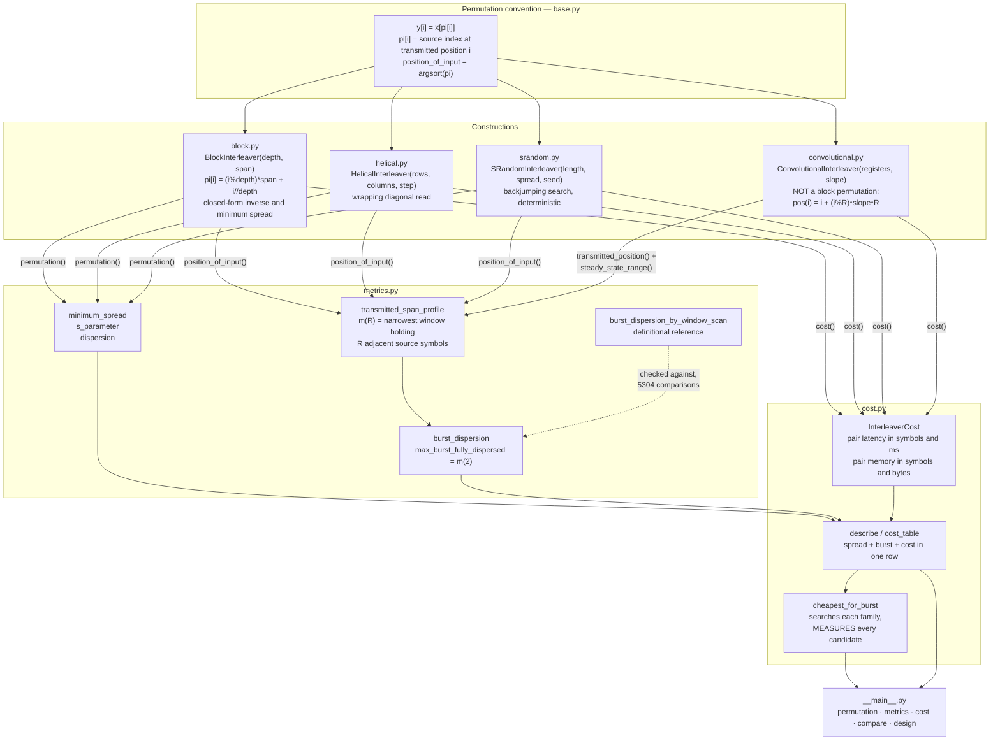
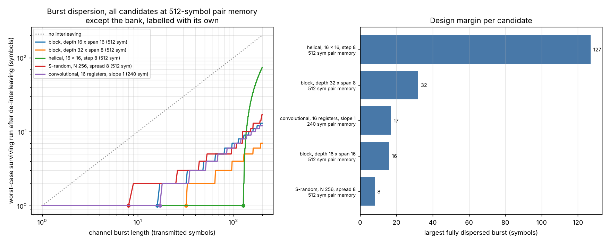
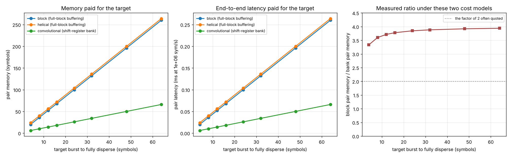
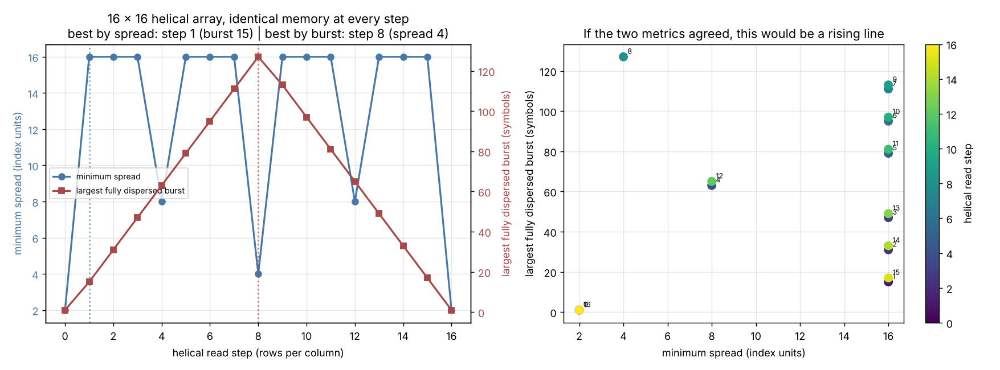
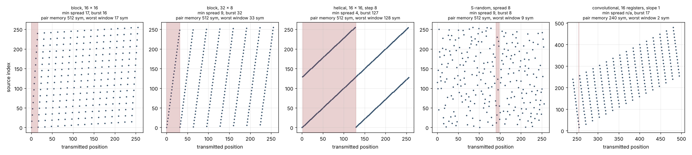

# InterleaveKit

Interleaver constructions with the burst-dispersion metrics and cost accounting that pick between them.


**Status: TESTING** · Class: compact · Validation level 2 (research grade) ·
No model, fully deterministic · Apache-2.0 · © 2026 OPTIMA Organisation

This software is research-grade. It is **not flight-qualified, not certified, and
not approved for operational aerospace use.** It computes combinatorics on index
maps. It does not model a channel, a code or a decoder, and nothing in it tells
you whether a given code can correct what the interleaver leaves behind.

## The problem

A fading optical link drops symbols in bursts, and someone has to choose an
interleaver so that a symbol-level code can correct what arrives. They reach for
the rule they remember — set the block depth to the burst length — and they are
wrong by one symbol at span 2, which they will not discover until the link is up.
Then they are asked what it cost, and they can give the block size but not the
end-to-end latency in milliseconds or the memory at both ends, so the trade
between a block interleaver and a shift-register bank gets settled by whichever
one somebody has written before.

## What this does

- **Measures burst dispersion instead of inferring it from depth.** Given a
  channel burst of `L` transmitted symbols, `burst_dispersion` returns the
  worst-case longest run of *consecutive source symbols* that survives
  de-interleaving. It is computed from an exact reformulation — `R` consecutive
  source symbols can be damaged by a burst of `L` precisely when the narrowest
  transmitted window holding them is at most `L-1` wide — which makes it `O(N)`
  rather than `O(N·L)` and agrees with the definitional window scan on **5304 of
  5304 comparisons, 0 mismatches**
  (`validation/validate_burst_metric_equivalence.py`).
- **Shows that the depth rule is wrong at narrow spans.** Measured, not assumed:
  a block interleaver of depth `D` fully disperses a burst of `D` from span 3
  upward, but at span 2 it manages only `D-1`, confirmed at every depth in
  {4, 8, 16, 32, 64, 127}, and at span 1 it manages 1
  (`validation/validate_burst_dispersion.py`).
- **Prices each construction in symbols, milliseconds and bytes.** For a target
  burst of 4 to 64 symbols, the cheapest shift-register bank that *measurably*
  disperses it needs **3.333x to 3.939x less pair memory and latency** than the
  cheapest buffered block — a larger gap than the factor of two usually quoted,
  for a reason the README states and the cost model it depends on
  (`validation/validate_cost_tradeoff.py`).
- **Demonstrates that minimum spread is the wrong metric for this job.** On a
  fixed 16x16 array, where every candidate costs identical memory and latency,
  the Spearman rank correlation between minimum spread and the largest fully
  dispersed burst is **0.0343** across 17 helical read steps, and **-0.4857**
  across six constructions. Choosing the step that maximises minimum spread
  instead of burst dispersion costs **8.47x less fully dispersed burst at the
  same price** (`validation/validate_spread_vs_burst.py`).
- **Four constructions behind one permutation convention.** Block, convolutional,
  helical and S-random, with `deinterleave(interleave(x)) == x` exactly, and
  permutations verified bijective, on **1253 of 1253 parameter sets, 0 failures**,
  including depth 1, span 1, step 0, slope 0 and length 1
  (`validation/validate_roundtrip.py`).

## Who it is for

- Anyone sizing an interleaver for a bursty link who wants the dispersed burst
  length **measured on the construction they are actually going to build**,
  rather than taken from a rule that is off by one at narrow spans.
- Anyone who has to justify an interleaver choice with a latency in milliseconds
  and a memory in bytes, not just a block size.
- Anyone comparing a block interleaver against a convolutional one and wanting
  both priced under a stated model, with the model written down so a reviewer can
  disagree with it.
- Anyone who has been handed a permutation function and realised it answers none
  of the above.
- Students and educators: every construction's permutation is derived in its
  module docstring, small cases are hand-computed in the test comments, and every
  validation script prints its working.

## Who it is not for

- **Anyone who needs codes, modulation or a decoder.** Use
  [`komm`](https://pypi.org/project/komm/). It has block codes, convolutional
  codes, polar codes, Reed-Solomon, BCH, Viterbi and BCJR decoders,
  constellations, pulse shapes and quantizers. This package has none of that and
  will never be a substitute for it.
- **Anyone who needs a turbo-code interleaver specifically.** The metric that
  literature optimises is minimum spread, and this package measures it, but the
  construction that wins on burst dispersion here has a minimum spread of 4. If
  the permutation also has to feed a turbo decoder, optimise the spread and
  ignore the burst column.
- **Anyone who needs a bit-error-rate curve.** Nothing here models a channel or a
  code. A surviving run of 1 is good news only if the code around it corrects one
  symbol per codeword, and this package does not know what that code is.
- **Anyone who wants hardware-verified cost figures.** The cost models are stated
  in `src/interleavekit/base.py` and are accounting, not measurement. Whether an
  FPGA implementation matches them is a question about that implementation.
- **Anyone needing MATLAB bit-compatibility.** The helical construction here is a
  fixed-length block permutation; MATLAB `helintrlv` is a streaming block with
  initial-condition fill. They are different and no equivalence is claimed.
- **Anyone with blocks longer than 2048 symbols who wants `dispersion`.** That
  metric is inherently `O(N^2)` and refuses longer inputs with a message naming
  the ceiling. Minimum spread and burst dispersion have no such limit.

## Alternatives, honestly

The two packages a reader would reasonably expect to cover this were downloaded
and their source read on 2026-10-06. Neither was executed: `komm`'s build backend
is unavailable in this environment and `scikit-commpy` is not installed here. **No
benchmark against either was run and none is claimed.** What follows is what their
source and published documentation actually contain.

| Alternative | What it does better | When to use this instead |
|---|---|---|
| [`komm`](https://pypi.org/project/komm/) 0.36.0 (BSD-3) | **Vastly more of error-control coding than this package will ever have**: block codes (BCH, Golay, Hamming, Reed-Muller, Reed-Solomon, polar, simplex, repetition, Lexicode), convolutional codes with Viterbi and BCJR decoding, CRC, constellations, labelings, pulse shapes, binary and complex sequences, lossless and integer source coding, quantizers, channels, finite-state machines. 130 modules across 11 documented API categories. Use it for anything to do with codes. | **`komm` 0.36.0 contains no interleaver at all.** Reading the wheel, `grep -i interleav` over all 130 `.py` files returns four hits, every one of them a local variable named `interleaved` inside `_quantization/ScalarQuantizer.py`. There is no interleaver, interleaving or permutation class in `komm/__init__.py`'s exports, and the API reference at komm.dev lists none. So for an interleaver there is nothing to compare: use this, or write the permutation yourself. |
| [`scikit-commpy`](https://pypi.org/project/scikit-commpy/) 0.8.0 (BSD-3), imported as `commpy` | Mature and much broader in scope: convolutional coding with Viterbi, turbo codes with BCJR, LDPC, algebraic codes, Galois fields, modulation, channel models, filters, impairments, link simulation, 802.11 helpers. If you want a whole link simulated, start there. | Its entire interleaver module, `commpy/channelcoding/interleavers.py`, is **74 lines with `__all__ = ['RandInterlv']`**: one construction, a uniform Mersenne-Twister permutation of a given length, with `interlv` (`in_array[self.p_array]`) and `deinterlv` (a Python loop). **No block, convolutional, helical or S-random construction. No spread, dispersion or burst metric of any kind. No latency or memory accounting. No parameter validation.** Use this package when you need a construction other than uniform-random, or any metric at all. Note that a random permutation is a reasonable baseline and this package's own measurement bears that out: at N=256 and equal memory, the S-random permutation gives the *smallest* fully dispersed burst of the six candidates tested (8 symbols against 127 for a helical read at step 8), so the point is not that random is bad — it is that you cannot tell without measuring. |
| `numpy` and four lines of your own | Nothing to install, and a block interleaver is genuinely `x.reshape(d, s).T.ravel()`. If you know which construction and which parameters you want, write it. | When you do **not** know which parameters you want. Four lines will permute correctly; they will not tell you that your span-2 interleaver disperses `depth-1` and not `depth`, that the step maximising minimum spread costs you 8.47x in burst dispersion at the same memory, or that a two-register bank does your job for 3.9x less memory. That is the whole of what this package adds, and it is the part that took the measurement rather than the code. |
| MATLAB Communications Toolbox | Streaming blocks for real signal chains, Simulink integration, verified against a vendor's test suite, and the reference implementation most designers will be asked to match. | When you have no MATLAB licence, or when you want the metrics. The toolbox documents its interleavers and their total delay — this package's convolutional pair latency `registers x slope x (registers-1)` was cross-checked against the figure documented for its Convolutional Interleaver block — but the burst-dispersion measurement and the cheapest-parameters search are not features it advertises. |

**The narrow defensible claim.** This package is *four interleaver constructions
behind one permutation convention, with burst-dispersion metrics and latency and
memory accounting under a stated cost model, so that an interleaver can be chosen
by measurement rather than by rule of thumb.* It is **not** an error-control
coding library, **not** a channel or link simulator, and **not** a source of
hardware-verified cost figures. Against `komm` it competes on nothing, because
`komm` ships no interleaver; against `scikit-commpy` it competes only on the 74
lines of `interleavers.py`, and the comparison is three constructions and five
metrics to one construction and none.

## Install and first run

```bash
git clone https://github.com/OmAcharya-avtr/interleavekit.git
cd interleavekit
python -m venv .venv && source .venv/bin/activate
pip install -e ".[dev]"
python -m pytest tests/ -q
python examples/burst_dispersion_curves.py
```

Expected output of the test run and the first example:

```
191 passed in 5.27s

largest fully dispersed burst, by candidate:
  block, depth 16 x span 16                   16 symbols, pair memory 512 symbols
  block, depth 32 x span 8                    32 symbols, pair memory 512 symbols
  helical, 16 x 16, step 8                   127 symbols, pair memory 512 symbols
  S-random, N 256, spread 8                    8 symbols, pair memory 512 symbols
  convolutional, 16 registers, slope 1        17 symbols, pair memory 240 symbols
wrote screenshots/burst_dispersion_curves.png
```

The first three lines of that table are the reason this package exists: three
block-structured interleavers, identical memory and identical latency, and a
factor of 7.9 between the best and the worst at the job they are all there to do.

## A worked example

`validation/worked_example.py`, reproduced in full. A link must survive a channel
burst of 32 symbols at 2.5 Msym/s; what does each option cost?

```python
import numpy as np
from interleavekit import BlockInterleaver, ConvolutionalInterleaver
from interleavekit import cost_table, format_cost_table
from interleavekit.metrics import burst_dispersion, max_burst_fully_dispersed, minimum_spread

SYMBOL_RATE_HZ = 2.5e6
TARGET_BURST = 32

block = BlockInterleaver(depth=33, span=3)
bank = ConvolutionalInterleaver(registers=2, slope=17)

pos = block.position_of_input()
print(f"{block!r}")
print(f"  minimum spread                {minimum_spread(block.permutation())}")
print(f"  largest fully dispersed burst {max_burst_fully_dispersed(pos)} symbols")
print(f"  surviving run at burst 32     {burst_dispersion(pos, TARGET_BURST)} symbol(s)")
print(f"  surviving run at burst 64     {burst_dispersion(pos, 2 * TARGET_BURST)} symbols")
cost = block.cost()
print(f"  pair latency  {cost.pair_latency_symbols} symbols"
      f" = {cost.latency_ms(SYMBOL_RATE_HZ):.4f} ms")
print(f"  pair memory   {cost.pair_memory_symbols} symbols"
      f" = {cost.memory_bytes(8):.0f} bytes at 8 bits/symbol")

n = bank.max_delay_symbols + 400
bank_pos = bank.transmitted_position(np.arange(n))
window = bank.steady_state_range(n)   # never measure a burst across start-up fill
print(f"{bank!r}")
print(f"  register delays               {bank.register_delays().tolist()} symbols")
print(f"  largest fully dispersed burst {max_burst_fully_dispersed(bank_pos, window)} symbols")

rows = cost_table([block, bank], SYMBOL_RATE_HZ, burst_search_limit=80, conv_window=120)
print(format_cost_table(rows, SYMBOL_RATE_HZ))
```

Its actual output:

```
Target: fully disperse a channel burst of 32 symbols
Symbol rate: 2.5e+06 symbols/s

BlockInterleaver(depth=33, span=3)
  block length                 99 symbols
  minimum spread               4
  largest fully dispersed burst 33 symbols
  surviving run at burst 32     1 symbol(s)
  surviving run at burst 64     2 symbols
  pair latency                 198 symbols = 0.0792 ms
  pair memory                  198 symbols = 198 bytes at 8 bits/symbol

ConvolutionalInterleaver(registers=2, slope=17)
  register delays              [0, 17] symbols
  start-up transient           34 symbols
  largest fully dispersed burst 33 symbols
  surviving run at burst 32     1 symbol(s)
  pair latency                 34 symbols = 0.0136 ms
  pair memory                  34 symbols = 34 bytes at 8 bits/symbol

symbol rate 2.5e+06 sym/s
construction                                                 N  pair lat   pair lat  pair mem   min  burst
                                                           sym       sym         ms       sym  sprd   disp
------------------------------------------------------------------------------------------------------------
BlockInterleaver(depth=33, span=3)                          99       198     0.0792       198     4     33
ConvolutionalInterleaver(registers=2, slope=17)            154        34     0.0136        34     -     33

The bank delivers the same dispersed burst for 5.82x less pair memory.
It gives no minimum-spread guarantee, so it is the wrong choice if the
permutation also has to feed a turbo decoder.
```

Both options survive the burst. One costs 198 bytes and 79 µs, the other 34 bytes
and 14 µs, and the last two lines say what you give up to take the cheap one. That
exchange is what a bare permutation function cannot have with you.

The same question from the command line, with the parameters searched rather than
supplied:

```bash
python -m interleavekit design 32
python -m interleavekit metrics block --depth 16 --span 16 --bursts 20
python -m interleavekit compare --depth 16 --span 16 --registers 16
```

## Architecture



## Screenshots



Worst-case surviving run against burst length, five candidates. Notice that every
curve is flat at 1 and then climbs: the flat section is the entire design margin,
and the marked knee is where it ends. The four block-structured candidates on the
left panel all cost 512 symbols of pair memory, and their knees sit at 8, 16, 32
and 127 symbols.



What it costs to disperse a target burst, after searching each family for its
cheapest parameter set. Notice the right panel: the measured ratio sits between
3.3 and 3.9 and rises slowly with the target, nowhere near the dotted line at the
factor of two usually quoted. The Limitations section says which cost model that
depends on.



The two metrics on one fixed 16x16 array, so every point costs the same memory and
the same latency. Notice that the right panel is not a rising line: if minimum
spread predicted burst dispersion it would be. The two vertical markers on the
left panel are the step each metric would have you choose, and they are seven
apart.



Each construction's permutation drawn as (transmitted position, source index),
with the narrowest burst window that defeats it shaded. Notice that the shaded
strip is wide where the construction is good and narrow where it is not — the
strip width *is* the dispersed burst length plus one — and that the S-random panel
looks thoroughly scrambled while having the narrowest strip of the four.

## Validation evidence

Full detail, including what fell short, in
[`validation/VALIDATION.md`](validation/VALIDATION.md). Raw stdout for every run
is committed beside each script.

| Check | Reference | Result | Tolerance | Script |
|---|---|---|---|---|
| Block minimum-spread closed form | brute-force enumeration of all index pairs | **0 mismatches in 2468 (depth, span) pairs** | exact | `validate_block_spread.py` |
| Round trip and bijectivity, all four constructions | the definition of a de-interleaver | **0 failures in 1253 parameter sets** | exact, elementwise | `validate_roundtrip.py` |
| Burst-dispersion fast path | the definitional window scan it replaces | **0 mismatches in 5304 comparisons** | exact | `validate_burst_metric_equivalence.py` |
| "Block depth = dispersed burst" | measurement | **false at span 1 and 2, true from span 3.** At span 2 the measured burst is exactly `depth-1` at depths 4, 8, 16, 32, 64, 127 | exact | `validate_burst_dispersion.py` |
| Convolutional pair latency | total delay documented for the MATLAB Convolutional Interleaver, `N x slope x (N-1)` | agrees; also derived here and confirmed by running the pair | exact | `validate_roundtrip.py` |
| Cost to disperse a target burst | measurement, every candidate measured | bank needs **3.333x to 3.939x less** pair memory and latency over targets 4 to 64 | exact under the stated models | `validate_cost_tradeoff.py` |
| Minimum spread as a proxy for burst dispersion | measurement at constant cost | **rho = 0.0343** over 17 helical steps; **rho = -0.4857** across six constructions; **8.47x** penalty for choosing on spread | exact | `validate_spread_vs_burst.py` |
| S-random achieves its requested spread | `s_parameter`, re-derived from the permutation | achieved = requested at lengths 64 to 1024 | exact | `validate_srandom.py` |
| `minimum_spread >= s_parameter + 1` | proof in `metrics.py` | holds everywhere measured | exact | `validate_srandom.py` |
| **Largest S-random spread reached** | the `sqrt(length/2)` rule of thumb | **ratio falls from 1.06 at length 64 to 0.53 at length 1024. This implementation does not attain the rule of thumb at long lengths.** | reported, not pass/fail | `validate_srandom.py` |
| S-random determinism | re-running the constructor | 6 of 6 seeds reproduced bit-identically; 8 of 8 seeds gave distinct permutations | exact | `validate_srandom.py` |

Test suite, counted from the junit XML rather than pytest's stdout line:
**191 tests, 0 failures, 0 errors, 0 skipped.**

## API reference

<details>
<summary>Constructions</summary>

| Call | Returns | Units |
|---|---|---|
| `BlockInterleaver(depth, span)` | row-write column-read block interleaver | both parameters in symbols |
| `.minimum_spread_closed_form()` | exact minimum spread without enumeration | index units |
| `HelicalInterleaver(rows, columns, step=1)` | wrapping-diagonal block interleaver | rows, columns in symbols; step in rows |
| `SRandomInterleaver(length, spread, seed=0, max_attempts=20, ...)` | S-random permutation, deterministic in the three first arguments | length, spread in symbols |
| `.attempts_used` | restarts consumed by the search | count |
| `ConvolutionalInterleaver(registers, slope=1)` | shift-register bank; **not** an `Interleaver` subclass | both in symbols |
| `.register_delays()` | contents of each register, `k * slope` | symbols |
| `.transmitted_position(i)` | `i + (i % registers) * slope * registers` | transmitted symbol index |
| `.steady_state_range(n)` | transmitted positions guaranteed to carry real symbols | half-open `(lo, hi)` |
| `.max_delay_symbols` | longest per-symbol delay, and the start-up transient length | symbol times |

</details>

<details>
<summary>Shared interleaver surface</summary>

| Call | Returns | Units |
|---|---|---|
| `.length` | block length `N` | symbols |
| `.permutation()` | `pi` with `y[i] = x[pi[i]]` | `int64`, shape `(N,)` |
| `.position_of_input()` | transmitted position of each source symbol, the inverse of `pi` | `int64`, shape `(N,)` |
| `.interleave(data)` | `data[permutation()]`; trailing axes and dtype preserved | same shape as input |
| `.deinterleave(data)` | exact inverse of `interleave` | same shape as input |
| `.cost()` | `InterleaverCost` for this construction | symbols |

`ConvolutionalInterleaver.interleave(data, fill=0)` returns a stream of
`transmitted_length(len(data))` symbols with fill at positions no source symbol
has reached; `deinterleave` returns the recovered stream of `len(data)` symbols.

</details>

<details>
<summary>Metrics</summary>

| Call | Returns | Units |
|---|---|---|
| `minimum_spread(pi)` | `min over i!=j of |i-j| + |pi[i]-pi[j]|`; `O(N·sqrt(N))`, exact | index units |
| `s_parameter(pi)` | largest `S` with `|i-j| < S` implying `|pi[i]-pi[j]| >= S` | index units |
| `dispersion(pi, normalise=True)` | distinct displacement pairs, over `N(N-1)/2`; `O(N^2)`, capped at `N = 2048` | dimensionless in `(0, 1]` |
| `transmitted_span_profile(pos, max_run, window_range=None)` | `m(R)`, the narrowest transmitted window holding `R` adjacent source symbols | transmitted symbols |
| `burst_dispersion(pos, burst_length, window_range=None)` | worst-case longest surviving run of consecutive source symbols | symbols |
| `burst_dispersion_by_window_scan(...)` | the same by the definitional window scan; `O(N·L)`, for checking | symbols |
| `burst_dispersion_profile(pos, burst_lengths, ...)` | `burst_dispersion` at several burst lengths | symbols |
| `max_burst_fully_dispersed(pos, ...)` | largest burst leaving every error isolated; equals `m(2)` | symbols |
| `longest_consecutive_run(indices)` | longest run of consecutive integers present | count |
| `is_bijection(pi)` / `as_permutation(pi)` | validity predicate / validated `int64` copy | — |

</details>

<details>
<summary>Cost and search</summary>

| Call | Returns | Units |
|---|---|---|
| `InterleaverCost.pair_latency_symbols` | end-to-end latency of interleaver plus de-interleaver | symbol times |
| `InterleaverCost.one_way_latency_symbols` | latency through the interleaver alone | symbol times |
| `InterleaverCost.pair_memory_symbols` / `.one_way_memory_symbols` | symbol storage | symbols |
| `.latency_ms(symbol_rate_hz, pair=True)` | latency at a stated symbol rate | milliseconds |
| `.memory_bytes(bits_per_symbol, pair=True)` | storage at a stated symbol width | bytes |
| `.model` | which cost model produced the figures | string |
| `describe(construction, symbol_rate_hz, ...)` | one `CostRow`: spread, burst dispersion and cost together | mixed, per field |
| `cost_table(constructions, ...)` / `format_cost_table(rows, rate)` | rows / a fixed-width table | — |
| `cheapest_for_burst(target_burst, ...)` | cheapest parameter set per family that **measurably** disperses the target | `dict[str, CostRow \| None]` |

</details>

<details>
<summary>Command line</summary>

```
python -m interleavekit permutation {block,helical,srandom,convolutional} [...]
python -m interleavekit metrics     {block,helical,srandom,convolutional} [--bursts N]
python -m interleavekit cost        {block,helical,srandom,convolutional} [--symbol-rate HZ]
python -m interleavekit compare     [--depth D --span S --registers R --slope M --spread S]
python -m interleavekit design      BURST [--symbol-rate HZ --max-block-symbols N]
```

Invalid parameters exit 2 with the actionable message on stderr.

</details>

## Limitations

- **The cost figures for block, helical and S-random use a full-block buffering
  model**: `N` symbols at each end, `2N` symbol times for the pair. It is the
  conventional figure, it is stated in `src/interleavekit/base.py`, and it is the
  reason the measured block-to-bank memory ratio is 3.3 to 3.9 rather than the
  factor of two in common circulation. An implementation that overlaps read-out
  with write-in pays less than `2N` and would narrow the ratio. **If you disagree
  with the model, the ratio is the first number to recompute.** The convolutional
  figures are exact rather than conventional, derived in
  `src/interleavekit/convolutional.py`.
- **The S-random search is bounded, not optimal, and it falls short of the
  `sqrt(length/2)` rule of thumb at long lengths**: measured ratios 1.00 at
  length 32, 1.06 at 64, 0.88 at 128, 0.97 at 256, 0.62 at 512, 0.53 at 1024. It
  is also **not monotone in the requested spread** — at length 256 it reaches
  spread 11 but fails at 10 with the same seed and budget — so a failure at one
  spread tells you nothing about the next. Every permutation it does return is
  verified against the request by `s_parameter`.
- **The S-random cost record does not count the permutation table.** Both ends
  need `length` index words because the permutation has no algebraic form. Block
  and helical permutations are computed from two integers and need no table, so
  on total storage they are cheaper than the symbol counts suggest. The
  `InterleaverCost.model` string says so; the number does not.
- **`dispersion` is `O(N^2)` and refuses `N > 2048`**, which is about 2.1 million
  pairs and 34 MB of `int64` displacement data. Minimum spread is `O(N·sqrt(N))`
  and burst dispersion is `O(N)`, so neither is capped.
- **No helical formula is claimed.** The largest fully dispersed burst happens to
  be `rows * step - 1` for steps 1 through 8 on a 16-row array, and then breaks:
  step 9 gives 113, not 143. Measure, do not extrapolate.
- **The convolutional transmitted stream contains fill symbols during start-up and
  flush.** Burst metrics must be evaluated on `steady_state_range`, or the
  construction gets credit for dispersing errors that landed on symbols nobody
  sent. The library will not do this for you if you build the position array
  yourself.
- **Nothing is validated against hardware or against a link measurement.** Every
  number in `validation/` is combinatorial. There is no bit-error-rate result, no
  channel model and no decoder, so this package cannot tell you whether your code
  corrects what the interleaver leaves.
- **`komm` and `scikit-commpy` were read, not run.** Neither installs in this
  build environment. The alternatives table reports what their source and
  documentation contain; no side-by-side execution was performed.
- **Compute budget: 2 CPU cores and 7.8 GiB of RAM, shared with four concurrent
  builds.** Every script here finishes well inside 3 minutes; the longest is
  `validation/validate_srandom.py` at 45.7 s, and the test suite takes 5.3 s. The
  S-random scan in that script deliberately runs with `max_attempts=8` instead of
  the default 20 to stay inside the budget, which is why the spreads it reports
  are a floor and not a record.

## Reproducing every number

From a cold clone, in order. Each command is self-contained and each validation
script writes the raw stdout that is committed beside it.

```bash
pip install -e ".[dev]"

# Test counts: read tests=, failures=, errors=, skipped= from the XML,
# not from pytest's summary line.
python -m pytest tests/ -q --junit-xml=junit.xml

ruff check src/ tests/ examples/ validation/
python -m interleavekit --help

python validation/validate_block_spread.py              # 2468 pairs, 0 mismatches
python validation/validate_roundtrip.py                 # 1253 parameter sets, 0 failures
python validation/validate_burst_metric_equivalence.py  # 5304 comparisons, 0 mismatches
python validation/validate_burst_dispersion.py          # the span-2 result
python validation/validate_cost_tradeoff.py             # the 3.333x to 3.939x ratios
python validation/validate_spread_vs_burst.py           # rho = 0.0343 and -0.4857
python validation/validate_srandom.py                   # the sqrt(N/2) shortfall
python validation/worked_example.py                     # the worked example above

MPLBACKEND=Agg python examples/burst_dispersion_curves.py
MPLBACKEND=Agg python examples/latency_memory_tradeoff.py
MPLBACKEND=Agg python examples/spread_vs_burst.py
MPLBACKEND=Agg python examples/permutation_structure.py
```

Everything is deterministic. The S-random permutations are fixed by
`(length, spread, seed)` and the examples and validation scripts pass explicit
seeds, so repeated runs reproduce every figure bit-identically.

## Licence

Apache-2.0. See [LICENSE](LICENSE). © 2026 OPTIMA Organisation.

## Citation

See [CITATION.cff](CITATION.cff). The four references it lists are cited for the
bibliographic details of the constructions only; the notes on each entry state
exactly what was and was not consulted, and the Dolinar & Divsalar entry records
that the article does **not** state the S-random selection rule often attributed
to it, so the rule is written out in `src/interleavekit/srandom.py` instead of
being attributed.

## Credits

Built for the OPTIMA aerospace software portfolio.

This is under reserved rights obtained by OPTIMA Organisation.
