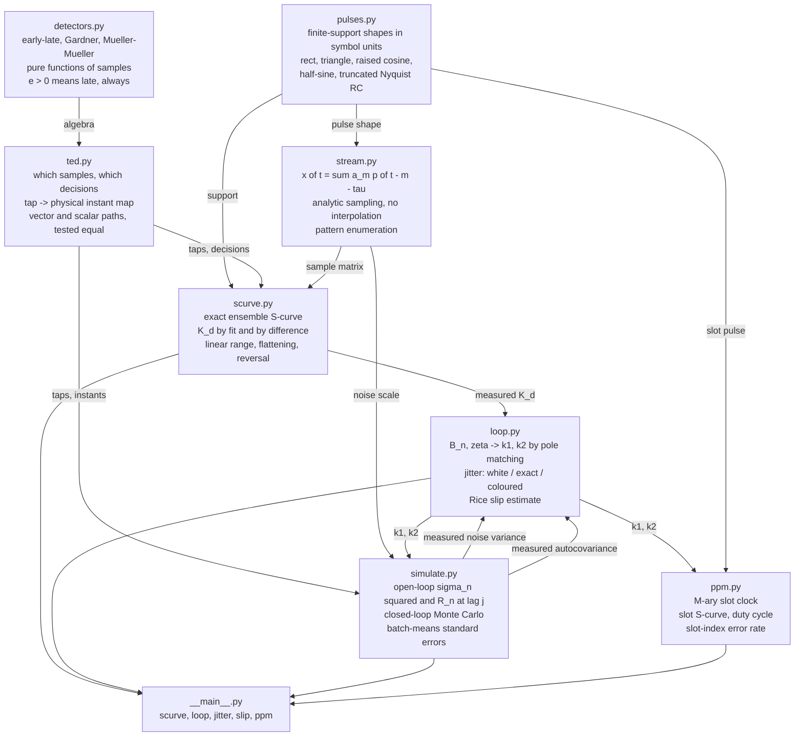
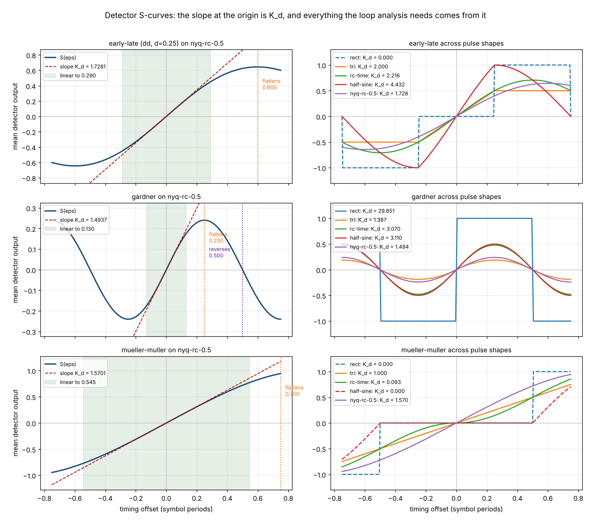
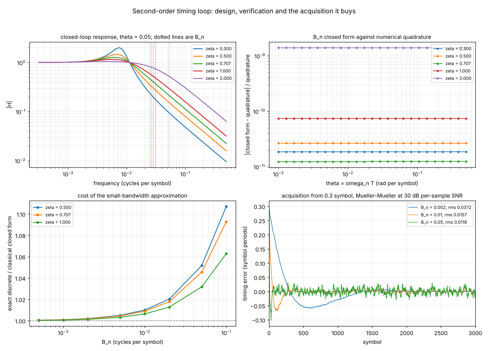
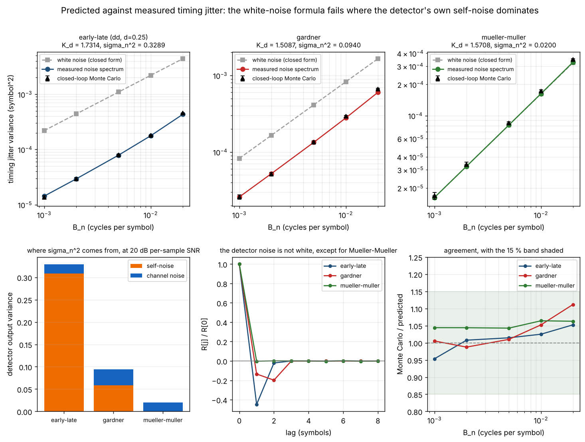
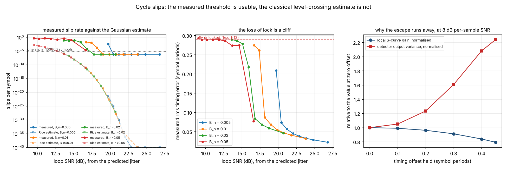
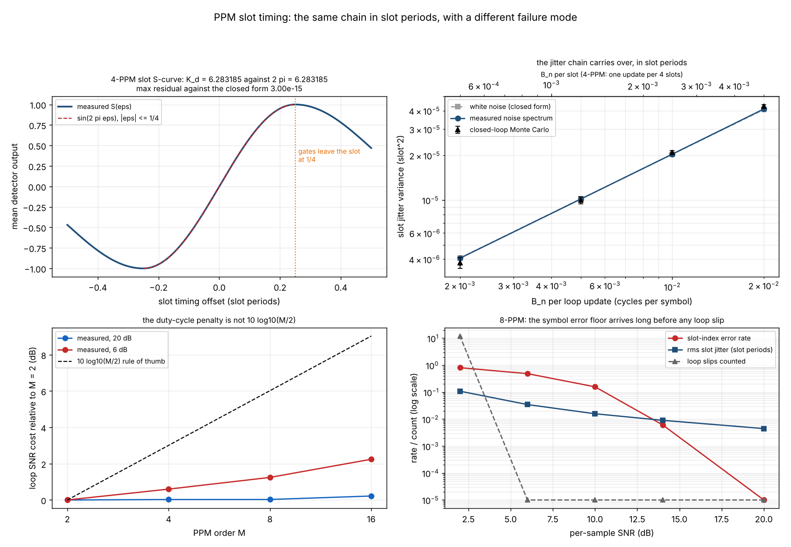

# SlotSync

Slot and symbol timing recovery for OOK and PPM optical receivers.


**Status: TESTING** · Class: compact · Validation level 2 (research grade) ·
no model, deterministic library · Apache-2.0 · © 2026 OPTIMA Organisation

This software is research-grade. It is **not flight-qualified, not certified, and
not approved for operational aerospace use.** It predicts the timing performance
of a receiver model; it does not qualify a receiver, and nothing in it substitutes
for measuring the one you have built.

## The problem

You have picked a timing-error detector for an optical receiver and you need a
loop bandwidth. Someone hands you a loop-SNR-to-jitter formula from a textbook,
but it needs a detector gain `K_d` that nobody has measured for your pulse shape,
so you take the value from a different paper's figure. Then you are asked for a
cycle-slip rate, and the only expression available assumes the timing error is
Gaussian, which it stops being exactly where the slips happen.

## What this does

- **Measures the detector gain instead of quoting it.** The S-curve is an exact
  ensemble average - every data pattern in the pulse's span is enumerated, 32 to
  4096 of them, with no sampling error - and `K_d` is its slope at the origin.
  Three hand-computable families check it: the early-late gate on a triangle to
  **1.3e-15** absolute, Mueller-Mueller on a triangle to **6.7e-16**, and
  Mueller-Mueller on a Nyquist raised cosine against
  `K_d = 2 cos(pi a) / (1 - 4 a^2)` to **2.9e-06** relative over five rolloffs
  (`validation/validate_scurve_gains.py`).
- **Turns a loop bandwidth into a jitter number, three ways, and compares all
  three against a simulated loop.** Over three detectors and loop bandwidths from
  0.001 to 0.02 cycles per symbol, the Monte Carlo agrees with the
  measured-noise-spectrum prediction to within **14.1 %**, worst case over nine
  operating points of 300000 symbols each
  (`validation/validate_jitter_agreement.py`).
- **Shows where the classical formula is wrong, and by how much.** The textbook
  white-noise expression `2 B_n sigma_n^2 / K_d^2` over-predicts the jitter by
  **15.3x** for a decision-directed early-late gate and **3.1x** for Gardner's
  detector, because both are dominated by detector self-noise and self-noise is
  not white - the early-late gate's output autocovariance at lag one is
  **-0.4487**. For Mueller-Mueller, which has no self-noise on a Nyquist pulse,
  the same formula is right to **0.5 %**.
- **Locates the cycle-slip threshold by measurement, and reports that the
  classical estimate misses it by 6 to 16 orders of magnitude.** Across loop
  bandwidths from 0.005 to 0.05 the slip rate crosses 1e-04 per symbol at a
  predicted rms timing error of **0.063 to 0.079 symbol**, nearly independently of
  the bandwidth (`validation/validate_cycle_slips.py`).
- **Implements the PPM slot clock as its own case, with a known answer.** The
  half-sine slot with quarter-slot gates gives `S(eps) = sin(2 pi eps)` to
  **2.7e-15** and `K_d = 2 pi` to **6.6e-08**, identically for M = 2 to 16. The
  measured duty-cycle penalty is **0.0 to 0.2 dB at 20 dB** and **0.6 to 2.2 dB at
  6 dB**, not the `10 log10(M/2)` of the rule of thumb
  (`validation/validate_ppm_slot.py`).

## Who it is for

- Anyone choosing between an early-late gate, Gardner and Mueller-Müller for a
  given optical pulse shape who wants the gain, the linear range and the
  self-noise of each one measured on **their** pulse rather than inferred from a
  figure.
- Anyone who has a loop bandwidth and needs a defensible jitter number, including
  a statement of which of the standard assumptions it rests on and what each one
  costs.
- Anyone sizing a PPM slot clock who needs the slot-level case rather than an
  assumption that binary symbol timing covers it.
- Anyone who has to justify a timing margin and would rather cite a measured
  threshold than a Gaussian tail.
- Students and educators: every derivation is in `docs/TIMING_MODEL.md` and every
  validation script prints its working.

## Who it is not for

- **Anyone building a real receiver.** Use [GNU Radio](https://www.gnuradio.org/).
  Its `Symbol Sync` block implements early-late, M&M, modified M&M, zero-crossing
  and MSK detectors with interpolating resamplers, runs in real time on real
  hardware, and is maintained by people who do this for a living. This package
  simulates; it does not receive.
- **Anyone who needs general digital-communications primitives.** See the table
  below. This package has three detectors, five pulse shapes and one loop
  topology, and no modulation, coding, equalisation or carrier recovery at all.
- **Anyone needing carrier recovery.** The one carrier-related fact here is that
  Gardner's detector is invariant to a constant carrier phase, which is checked
  by a property test. There is no carrier loop.
- **Anyone who wants an optical link budget.** The SNR in this package is a
  per-sample electrical SNR on the detector's input samples. It is **not**
  `Es/N0`, there is no photon-counting model, no receiver filter, no shot noise
  and no avalanche gain, and no conversion to any of those is claimed anywhere.
- **Anyone with a pulse shape that is not finite-support.** The exactness of the
  S-curve rests on finite support. The Nyquist raised cosine shipped here is
  truncated at four symbols and every result computed with it is a result about
  the truncated shape.

## Alternatives, honestly

| Alternative | What it does better | When to use this instead |
|---|---|---|
| [GNU Radio](https://www.gnuradio.org/) `Symbol Sync` | **The right tool for a receiver.** Its documentation names early-late, M&M, modified M&M, zero-crossing and MSK timing-error detectors, takes loop bandwidth, damping factor and "Expected TED Gain" as parameters, and runs in a real flowgraph against real hardware. It is the production implementation of everything here. | When you need the **expected TED gain** it asks you for, measured on your own pulse shape, and a jitter and slip prediction to choose its loop bandwidth with. GNU Radio asks for `K_d`; this package is where you get it. |
| [`scikit-dsp-comm`](https://pypi.org/project/scikit-dsp-comm/) 2.1.2 (BSD) | A broad teaching and research DSP package: its description lists ten modules, and `synchronization.py` "contains phase-locked loop simulation functions and functions for carrier and phase synchronization of digital communications waveforms", including `NDA_symb_sync`, `loop_parms2` and `loop_pull_out`. Far more of the surrounding communications theory than this package has. | When the question is specifically an optical OOK or PPM **slot/symbol** timing detector's S-curve, its measured gain, and the jitter-and-slip chain built on it. Its documented synchronization API does not name Gardner, early-late or Mueller-Müller detectors, S-curve computation or cycle-slip analysis; those are what this package is. |
| [`komm`](https://pypi.org/project/komm/) 0.36.0 (GPL-3.0) | A clean, well-documented library for modulation, channels, error-control coding, pulse formatting, sequences and source coding. Much better than this package at everything it covers. | Always, for those things. Its reference has no synchronization, timing-recovery or phase-locked-loop section at all, so it does not overlap with this package. |
| A textbook formula and a spreadsheet | No installation, and for Mueller-Müller on a Nyquist pulse it is right to 0.5 %. | When your detector has self-noise. The same formula is **15.3x** wrong for a decision-directed early-late gate here, and the spreadsheet will not tell you that. |
| Measuring your own receiver | It is the only evidence anyone should accept about hardware, and it includes everything this model leaves out. | Before the hardware exists, or when you need to know which of three detectors to build. This package consumes a pulse shape and a sample SNR; it cannot produce a measured receiver. |

**The narrow defensible claim.** This package is *the S-curve-to-gain-to-jitter-to-
slip-threshold chain for optical OOK and PPM slot timing, measured end to end in
one place, with each classical approximation isolated and its error quantified.*
It is **not** a receiver, **not** a general communications library, and **not** an
optical link budget.

## Install and first run

```bash
git clone https://github.com/OmAcharya-avtr/slotsync.git
cd slotsync
python -m venv .venv && source .venv/bin/activate
pip install -e ".[dev]"
python -m pytest tests/ -q
python -m slotsync scurve --detector mueller-muller --pulse nyq-rc
```

Expected output of the test run (wall time varies between 11 and 15 s on the
build host, which shares two cores with four other jobs):

```
234 passed in 13.75s
```

Expected output of the first command:

```
detector                  mueller-muller
alphabet                  antipodal
pulse                     nyq-rc-0.5
exact                     True
patterns                  4096
symbol_window             12
K_d                       1.57007
K_d_central_difference    1.57078
bias_at_zero              5.55112e-17
self_noise_at_zero        1.66625e-12
linear_halfwidth_symbols  0.545
peak_offset_symbols       0.75
peak_value                0.944849
reversal_offset_symbols   None
```

`K_d_central_difference` is `1.57078` against the closed form `pi/2 = 1.5707963`,
which is the known answer derived in `docs/TIMING_MODEL.md` §2.3.

## A worked example

```python
import math
import numpy as np
from slotsync import (
    LoopDesign, PpmConfig, TedConfig, cycle_slip_rate_rice, half_sine,
    jitter_variance_closed_form, jitter_variance_coloured, loop_snr_db,
    measure_ted_autocovariance, measure_ted_statistics, nyquist_raised_cosine,
    ppm_slot_scurve, run_ppm_slot_loop, run_timing_loop, scurve,
)

pulse = nyquist_raised_cosine(rolloff=0.5, truncate_symbols=4.0)
config = TedConfig(detector="gardner", alphabet="antipodal")

# 1. The S-curve is computed exactly, and K_d is its slope at the origin.
curve = scurve(config, pulse, np.linspace(-0.02, 0.02, 41), max_exact_symbols=16)
gain = curve.gain_central_difference
full = scurve(config, pulse, max_exact_symbols=16)

# 2. The loop is designed from that gain, never from a guess.
design = LoopDesign.from_bandwidth(0.005, 1 / math.sqrt(2), gain)

# 3. The detector's own output noise is measured, not assumed.
stats = measure_ted_statistics(config, pulse, sample_snr_db=20.0, samples=400000)
autocovariance = measure_ted_autocovariance(
    config, pulse, sample_snr_db=20.0, max_lag=24, samples=400000)

# 4. Two predictions, then the loop itself.
white = jitter_variance_closed_form(0.005, gain, stats.variance)
coloured = jitter_variance_coloured(design, autocovariance)
run = run_timing_loop(config, pulse, design, n_symbols=200000, sample_snr_db=20.0)

# 5. The same chain for a 4-PPM slot clock, in slot periods.
slot, ppm = half_sine(1.0), PpmConfig(order=4, delta=0.25)
slot_curve = ppm_slot_scurve(ppm, slot, offsets=np.linspace(-0.001, 0.001, 21),
                             fit_halfwidth=0.001)
slot_design = LoopDesign.from_bandwidth(0.005, 1 / math.sqrt(2),
                                        slot_curve.gain_central_difference)
slot_run = run_ppm_slot_loop(ppm, slot, slot_design, n_symbols=40000,
                             sample_snr_db=20.0)
```

Actual output (`validation/worked_example.py`, committed as
`validation/worked_example_output.txt`):

```
K_d = 1.508693 per symbol, from 4096 enumerated data patterns
  linear to 0.130 symbol, flattens at 0.250, reverses at 0.500
  B_n = 0.005, zeta = 0.7071 -> k1 = 0.008779, k2 = 5.853e-05
  sigma_n^2 = 0.093960 (63 % self-noise), R[1]/R[0] = -0.1346
  jitter variance: white 4.1280e-04  coloured 1.3377e-04  measured 1.3512e-04 +- 4.1e-06
  measured / coloured = 1.0101, measured / white = 0.3273
  rms jitter 0.011624 symbol, static lock offset +0.003619, slips 0
  loop SNR 32.67 dB, Rice slip estimate 5.043e-133 per symbol
4-PPM slot clock: K_d = 6.283185 per slot (2 pi = 6.283185)
  rms jitter 0.003115 slot, slot error rate 0.00000, loop slips 0
```

The textbook prediction is `4.128e-04`. The loop delivers `1.351e-04`. The
difference is 63 % of the detector's output variance being self-noise rather than
channel noise, and the loop filtering it far better than it filters white noise.
That single line is what this package exists to make visible.

## Architecture



No module imports another product. `numpy` and `scipy` are required;
`matplotlib` is used only by the examples.

## Screenshots



Notice the right-hand column. The dashed curves are gains of exactly zero: the
early-late gate on a rectangle, and Mueller-Müller on a rectangle and on a
half-sine. A rectangle is flat inside the pulse so a gate difference sees nothing;
Mueller-Müller is driven entirely by the pulse one symbol either side, and a
return-to-zero pulse has nothing there. Three of twenty detector-pulse
combinations are unusable and the figure says which.



Top right is the check that caught a real bug: the closed-form noise bandwidth
against numerical quadrature, agreeing to 1e-09 or better across five damping
factors. The first draft of that expression was wrong by `2 pi` and nothing else
in the package would have found it. Bottom left is what the small-bandwidth
approximation costs - under 0.2 % below `B_n = 0.001`, 9 % at 0.1.



The grey dashed line in each top panel is the textbook white-noise prediction. For
Mueller-Müller it lies on top of the measurement; for the early-late gate it is a
factor of fifteen above it. The bottom-left bar chart is why: the early-late gate's
detector output is 94 % self-noise, and the bottom-middle panel shows that
self-noise is strongly negatively correlated at lag one, which is exactly the
structure the loop filters best.



The middle panel is the useful one. Loss of lock is a cliff: the rms timing error
goes from 0.06 symbol to the fully-unlocked `1/sqrt(12)` over about two decibels.
The left panel shows the Gaussian level-crossing estimate (dashed) running 6 to 16
orders of magnitude below the measurement (solid), and the right panel shows why -
the restoring gain falls and the disturbance rises together as the error grows.



Bottom right is the result a binary-timing analysis would miss entirely. At 8-PPM
the slot-index error rate climbs from zero to 0.81 while the loop records **zero**
cycle slips, because the receiver re-acquires on whichever slot wins the energy
comparison. A slot-timing failure in PPM is a symbol error, not a loop slip.

## Validation evidence

Full detail, including every check that a prediction lost, in
[`validation/VALIDATION.md`](validation/VALIDATION.md). Every number below came
from a committed script with its committed raw output.

| Check | Reference | Result | Tolerance |
|---|---|---|---|
| Early-late gain on a triangle | `K_d = 2`, `docs/TIMING_MODEL.md` §2.1 | worst **1.332e-15** absolute over 4 gate spacings | exact |
| Mueller-Müller gain on a triangle | `K_d = E[a^2]`, §2.2 | **1.0000000000** antipodal, **0.2500000000** OOK | exact |
| **Mueller-Müller on a Nyquist raised cosine** | `K_d = 2 cos(pi a)/(1 - 4a^2)`, §2.3 | worst **2.865e-06** relative over 5 rolloffs | < 1e-05 |
| **PPM slot S-curve** | `S = sin(2 pi eps)`, `K_d = 2 pi`, §2.4 | residual **2.748e-15**, gain error **6.580e-08** | 1e-10 / 1e-05 |
| Loop noise bandwidth | closed form vs quadrature of `int|H|^2 df` | worst **5.261e-09** relative over 18 points | < 1e-06 |
| Discrete poles | exact pole matching against `exp(sT)` | worst **8.278e-09** absolute over 32 designs | < 1e-06 |
| Coefficient round trip | closed-form inverse | worst **9.778e-11** relative | < 1e-08 |
| **Jitter, Monte Carlo vs measured-spectrum prediction** | 3 detectors x 3 bandwidths, 300000 symbols each | ratio **0.954 to 1.141**, worst deviation **14.08 %** | < 15 % |
| **The white-noise formula over-predicts** | same data, whiteness assumed | **15.34x** early-late, **3.09x** Gardner, **1.00x** Mueller-Müller | reported |
| Detector self-noise share at 20 dB | open loop, 400000 samples | **94 %**, **63 %**, **0 %** respectively | reported |
| **Prediction fails outside the linear range** | `B_n` = 0.05, Gardner, falling SNR | ratio 1.32 at 20 dB; measurement saturates at **0.0834 to 0.0842** = `1/12` below 10 dB | reported |
| **Slip threshold, measured** | 4 bandwidths, 200000 symbols per point | 1e-04 slips/symbol at loop SNR **18.03 / 16.77 / 16.08 dB**, rms **0.063 to 0.079 symbol** | 3 of 4 located |
| **Gaussian slip estimate fails** | §5 | low by **6.0 to 16.0 orders of magnitude** | reported, not corrected |
| Mechanism of that failure | held-offset sweep at 8 dB | local gain **1.571 → 1.246**, `sigma_n^2` **x2.2402** over 0 to 0.45 symbol | reported |
| **Static lock offset from self-noise** | §6 | **+0.3825** and **+0.5746** symbol per unit `B_n`, spread 2.2 % and 7.1 % | spread < 35 % |
| That offset is zero without self-noise | Mueller-Müller | **1.12e-05** symbol, **0.76** standard errors | < 3 s.e. |
| PPM slot gain vs order | only the on-slot contributes | identical to **6.580e-08** for M = 2, 4, 8, 16 | < 1e-05 |
| **PPM duty-cycle rule of thumb is wrong** | `10 log10(M/2)` | measured **0.00 to 0.22 dB** at 20 dB, **0.60 to 2.24 dB** at 6 dB | reported |
| **PPM fails as symbol errors, not slips** | 8-PPM, `B_n` = 0.01 | slot error rate **0 → 0.806** across 18 dB, **0** loop slips | reported |

### Where a prediction lost

| Item | What happened |
|---|---|
| **The classical white-noise jitter formula** | Wrong by **15.3x** for the decision-directed early-late gate and **3.1x** for Gardner on a Nyquist pulse at 20 dB. Right to 0.5 % for Mueller-Müller. Shipped with the measurement attached, because a user will otherwise reach for it. |
| **The Gaussian cycle-slip estimate** | Low by **6 to 16 orders of magnitude**. The functional form is wrong, not the scale, so no fitted prefactor is offered. The usable output is the measured threshold instead. |
| **Monte Carlo against the coloured prediction** | The residual deviation is **systematic**, growing from 3 % at `B_n` = 0.001 to 14 % at 0.02, which is up to **9.96** Monte Carlo standard errors. Published as a 15 % relative tolerance with the trend stated, not as a tight tolerance that would be false. |
| **Static lock offset** | Not predicted by anything in this package. The open-loop S-curve crosses zero at **1e-16** and the closed loop still locks 0.0038 symbol away at `B_n` = 0.01. Measured, characterised, not corrected. |
| **Mueller-Müller is unusable on three of five pulse shapes** | `K_d` is exactly zero on a rectangle and on a half-sine and ill-conditioned on a time-domain raised cosine. The detector that wins every other comparison here cannot be used at all unless the pulse behaves correctly one symbol out. |
| **PPM jitter at `B_n` = 0.002** | Monte Carlo **0.932** of the prediction, outside the band the other three points occupy. Reported, not dropped. |
| **Slip threshold at `B_n` = 0.005** | Not located: one slip in 200000 symbols at the lowest SNR swept. Reported as not located rather than extrapolated. |

## API reference

<details>
<summary><strong>Full public surface, with units</strong></summary>

### `slotsync.pulses`

| Name | Description |
|---|---|
| `PulseShape.amplitude(t)` | amplitude at times in symbol periods, dimensionless, unit peak |
| `PulseShape.half_support` / `.isi_span_symbols` | support half-width, symbol periods / integer symbols |
| `PulseShape.value_at_one_symbol` / `.energy(n)` | residual ISI at `+-T` / `int p^2 dt`, symbol periods |
| `rectangular(width)` | NRZ rectangle; early-late and Mueller-Müller gains are both zero on it |
| `triangular(half_width)` | the hand-computable shape |
| `raised_cosine_time(half_width)` | raised cosine **in time**, zero slope at the edges |
| `half_sine(width)` | return-to-zero optical slot, `cos(pi t / width)` |
| `nyquist_raised_cosine(rolloff, truncate_symbols)` | frequency-domain raised cosine, **truncated** |
| `pulse_by_name(name)` | `rect`, `tri`, `rc-time`, `half-sine`, `nyq-rc` |

### `slotsync.detectors`

| Name | Description |
|---|---|
| `early_late(early, late, square=False)` | gate difference, or difference of squares |
| `early_late_dd(decisions, early, late)` | decision-directed form for antipodal data |
| `gardner(strobe_previous, mid, strobe)` | `x_mid (x[k] - x[k-1])`, two samples per symbol, no decisions |
| `gardner_complex(...)` | the same for complex baseband; **invariant to carrier phase** |
| `mueller_muller(d_prev, d, x_prev, x)` | `a[k] x[k-1] - a[k-1] x[k]`, one sample per symbol |
| `slice_antipodal(sample)` | hard decision, `0 -> +1` |

All detectors use the convention **positive output means sampling late**.

### `slotsync.ted`

| Name | Description |
|---|---|
| `TedConfig(detector, alphabet, delta, form)` | what to run, on what data, with what gate spacing |
| `ted_time_offsets(config)` | sample instants needed, symbol periods from the strobe |
| `ted_decision_offsets(config)` | symbol indices whose decisions are needed |
| `ted_sample_slots(config)` | tap → `(lag, fraction index)`: which taps share a physical sample |
| `evaluate_ted(config, samples, decisions)` | vectorised detector output |
| `evaluate_ted_scalar(config, samples, decisions)` | scalar fast path, tested bit-equal to the above |

### `slotsync.scurve`

| Name | Description |
|---|---|
| `scurve(config, pulse, offsets, ...)` | exact S-curve by pattern enumeration, or seeded Monte Carlo |
| `SCurve.gain` / `.gain_central_difference` | `K_d`, detector output per symbol period, two estimators |
| `SCurve.bias` | `S(0)`; non-zero means a static lock offset |
| `SCurve.linear_halfwidth` | largest `r` with `|S - K_d eps| <= 10 %` for `|eps| <= r` |
| `SCurve.peak_offset` / `.reversal_offset` | where the S-curve flattens / returns to zero |
| `SCurve.self_noise_at_origin` | data-dependent spread of the detector output at zero offset |
| `default_offsets(halfwidth, points)` | symmetric grid containing the origin exactly |

### `slotsync.loop`

| Name | Description |
|---|---|
| `noise_bandwidth_closed_form(theta, zeta)` | `B_n = theta(1 + 4 zeta^2)/(8 zeta)`, cycles per symbol |
| `noise_bandwidth_numeric(theta, zeta)` | the same by quadrature, with an analytic tail |
| `LoopDesign.from_bandwidth(B_n, zeta, K_d)` | coefficients by exact pole matching |
| `LoopDesign.from_coefficients(k1, k2, K_d)` | the closed-form inverse |
| `LoopDesign.state_matrices()` / `.closed_loop_poles` / `.is_stable` | the linearised loop |
| `jitter_variance_closed_form(B_n, K_d, sigma_n^2)` | `2 B_n sigma_n^2 / K_d^2`, squared symbol periods |
| `jitter_variance_exact(design, sigma_n^2)` | exact discrete Lyapunov, still assuming white noise |
| `jitter_variance_coloured(design, R_n)` | the same with a **measured** autocovariance |
| `error_autocorrelation_weights(design, max_lag)` | `rho[j] = C P (A')^j C'` |
| `loop_snr_db(variance, boundary)` | `10 log10(boundary^2 / sigma_eps^2)` |
| `cycle_slip_rate_rice(design, sigma_n^2, boundary)` | Gaussian level-crossing estimate, slips per symbol |
| `slip_free_seconds(rate, symbol_rate_hz)` | mean time between slips, seconds |

### `slotsync.simulate`

| Name | Description |
|---|---|
| `measure_ted_statistics(config, pulse, ...)` | open-loop mean, variance and self-noise share |
| `measure_ted_autocovariance(config, pulse, ...)` | `R_n[0..J]` of the detector output |
| `run_timing_loop(config, pulse, design, ...)` | closed-loop Monte Carlo, one update per symbol |
| `LoopRun.jitter_variance` / `.jitter_variance_standard_error` | batch-means uncertainty included |
| `LoopRun.mean_error` / `.slip_count` / `.slip_rate_per_symbol` | static offset and slips |
| `pulse_table(pulse, points)` | interpolating lookup used by the sequential loop |

### `slotsync.ppm`

| Name | Description |
|---|---|
| `PpmConfig(order, delta, known_slot)` | M-ary slot clock configuration, slot periods |
| `ppm_slot_scurve(config, pulse, ...)` | exact slot S-curve and `K_d` per slot |
| `measure_ppm_slot_statistics(...)` | open-loop variance, self-noise and slot-error rate |
| `ppm_slot_autocovariance(...)` | `R_n[0..J]` per loop update |
| `run_ppm_slot_loop(config, pulse, design, ...)` | closed-loop slot clock, one update per symbol |
| `PpmLoopRun.slot_error_rate` / `slot_index_error_rate(run)` | the PPM failure mode |
| `equivalent_slot_bandwidth(B_n, order)` | `B_n / M`, cycles per slot |
| `duty_cycle_penalty_db(...)` | measured `10 log10(sigma_n^2 / K_d^2)` referred to a stated gain |

### CLI

```
python -m slotsync scurve [--detector ...] [--alphabet ...] [--delta D] [--form ...] [--pulse ...]
python -m slotsync loop   [--bandwidth B] [--damping Z] [--gain K]
python -m slotsync jitter [--detector ...] [--pulse ...] [--bandwidth B] [--snr DB] [--symbols N]
python -m slotsync slip   [--detector ...] [--pulse ...] [--snr-low A] [--snr-high B] [--points N]
python -m slotsync ppm    [--order M] [--delta D] [--known-slot] [--bandwidth B] [--snr DB]
```

</details>

## Limitations

1. **The SNR here is not an optical link SNR.** `sample_snr_db` is the ratio of
   the squared peak pulse amplitude to the per-sample noise variance on the
   detector's input samples. There is no photon-counting model, no avalanche gain,
   no shot or dark-current noise, no receiver filter and no conversion to `Es/N0`.
   Nothing in this package can be read as an optical sensitivity.
2. **Noise is independent per sample instant.** A real matched-filter output has
   correlated noise between closely spaced early and late gates. The code is
   careful about samples *shared* between consecutive updates
   (`ted_sample_slots`), but it does not colour the noise between distinct
   instants. The early-late results at small gate spacing are the ones most
   affected.
3. **The classical white-noise jitter formula is wrong for self-noisy
   detectors**, by 15.3x and 3.1x on the two measured here. Use
   `jitter_variance_coloured` with a measured autocovariance, or expect to
   over-size the loop.
4. **The Gaussian cycle-slip estimate is wrong by 6 to 16 orders of magnitude**
   in the regime where slips occur. It is shipped because a user will otherwise
   reach for it and because its shape is instructive, not because its value is
   usable. The measured threshold - rms timing error of 0.063 to 0.079 symbol at
   1e-04 slips per symbol - is the number to design against.
5. **A static lock offset exists and is not corrected.** Self-noise makes the loop
   lock 0.383 (early-late) or 0.575 (Gardner) symbol per unit `B_n` away from the
   true centre, independently of channel SNR. At `B_n = 0.01` that is 0.4 % to
   0.6 % of a symbol, comparable to the rms jitter at high SNR.
6. **S-curves use correct decisions.** The decision-directed detectors are given
   the transmitted symbols when the S-curve is computed. A real receiver's
   decisions are wrong some of the time and its S-curve is correspondingly
   shallower; the closed-loop simulation uses sliced decisions, so the gap appears
   there and not in `K_d`.
7. **The Nyquist raised cosine is truncated** at four symbol periods. Every result
   computed with it is a result about the truncated shape. `p(1)` is 1.2e-12
   rather than exactly zero.
8. **One loop topology only**: second order, type 2, one update per symbol (or per
   PPM symbol). No first-order loop, no higher order, no gear-shifting, no
   acquisition aid, no frequency-offset tracking beyond what the integrator does.
9. **No carrier recovery, no frequency offset, no amplitude estimation.** The
   detectors whose gain scales with received power (Gardner, the squared
   early-late form) are characterised at unit peak amplitude and nothing here
   normalises for a different one.
10. **The PPM slot clock covers the early-late family only.** Gardner and
    Mueller-Müller are not implemented for it and the module docstring explains
    why: both are built on the symbol-to-symbol transitions of a linearly
    modulated stream, which a PPM slot grid is not.
11. **Frame synchronisation is out of scope.** Slot timing leaves an `M`-fold
    ambiguity about which slot begins a symbol. Nothing here resolves it.
12. **Compute budget.** Everything here was built and measured on **two CPU cores
    and 7.8 GiB shared with four other build agents**. Measured there: the test
    suite 11 to 15 s; the longest validation script
    (`validate_cycle_slips.py`) 65 to 74 s; the longest example
    (`jitter_prediction_vs_simulation.py`) about 70 s. Those wall times move by
    tens of per cent between runs with the contention and no claim rests on
    them. Every Monte Carlo in the
    repository finishes well inside three minutes, which is the constraint the
    run sizes were chosen against: 300000 symbols for the headline jitter points,
    200000 for the slip sweeps.
13. **Monte Carlo uncertainty is reported but is not the dominant error.** The
    batch-means standard error on a jitter variance is 1 to 3 %; the systematic
    deviation from the prediction is up to 14 %. Tightening the Monte Carlo would
    not change any conclusion in this repository.

## Reproducing every number

See [`validation/VALIDATION.md`](validation/VALIDATION.md) for the full command
list. In short, from a cold clone:

```bash
pip install -e ".[dev]"
ruff check src/ tests/ examples/ validation/
python -m pytest tests/ -q
cd validation && for s in validate_*.py worked_example.py; do PYTHONPATH=../src python "$s"; done; cd ..
cd examples && for s in *.py; do PYTHONPATH=../src MPLBACKEND=Agg python "$s"; done; cd ..
```

Every script is deterministic given its seeds (20261006 throughout, with 3, 7 and
11 for second streams). The only non-deterministic figures are printed runtimes.

## Licence, citation, credits

Apache-2.0, © 2026 OPTIMA Organisation. See [`LICENSE`](LICENSE).

Citation metadata is in [`CITATION.cff`](CITATION.cff). Further reading in this
repository: [`docs/TIMING_MODEL.md`](docs/TIMING_MODEL.md) for every derivation and
for the four references, and
[`validation/VALIDATION.md`](validation/VALIDATION.md) for the evidence.

### Credits

This is under reserved rights obtained by OPTIMA Organisation.
