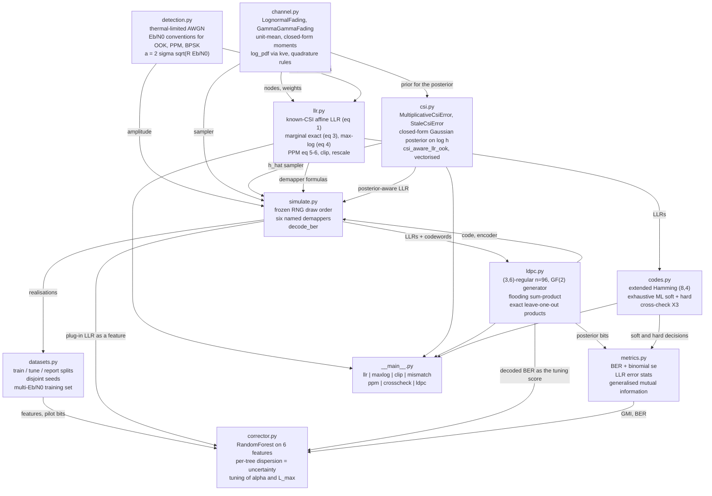
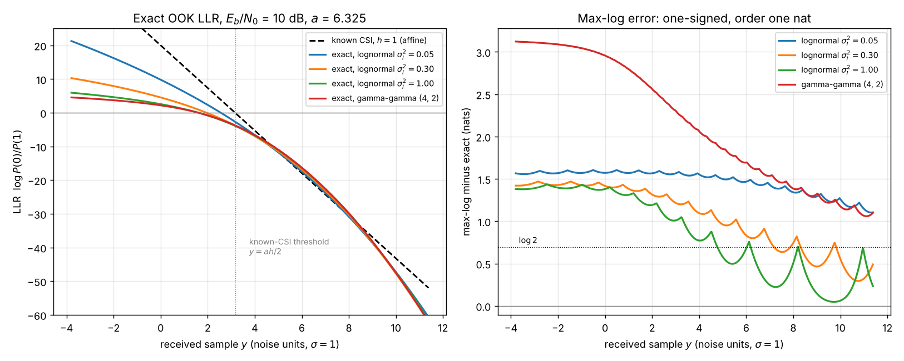
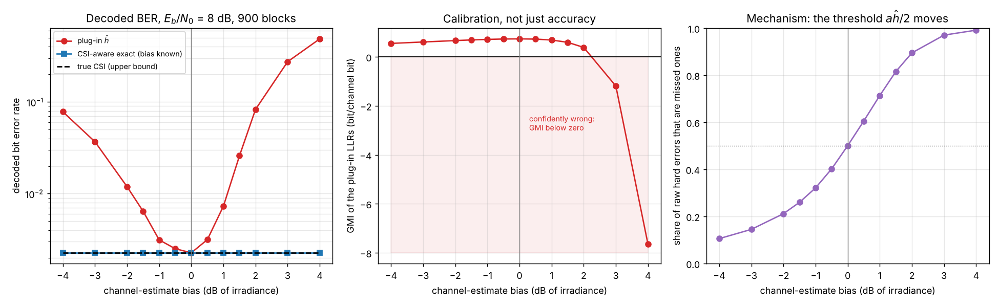
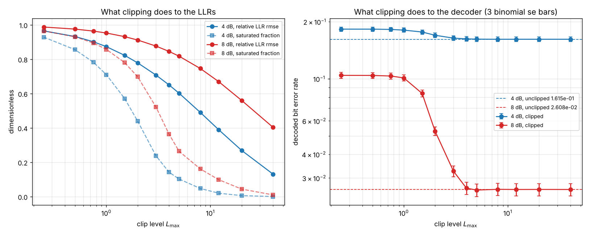
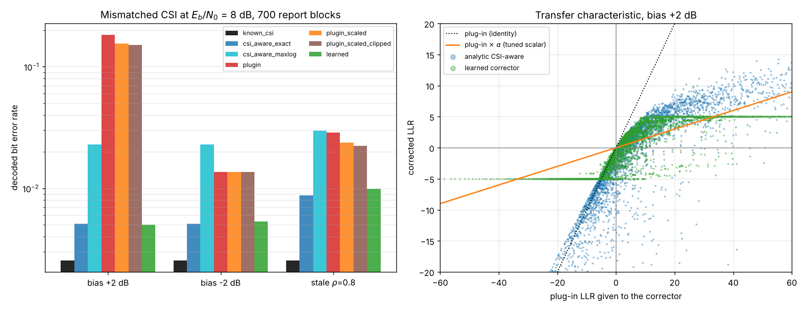

# softdecode

Soft-decision demapping over fading optical channels, including the penalty for a wrong channel estimate.


**Status: TESTING** · Class: compact · Validation level 2 (research grade) ·
AI-enabled · Apache-2.0 · © 2026 OPTIMA Organisation

This software is research-grade. It is **not flight-qualified, not certified,
and not approved for operational aerospace use.** It computes log-likelihood
ratios for a model of an optical channel; it does not replace a link budget,
hardware testing or a qualification campaign.

## The problem

A free-space optical link designer picks an LDPC code, writes a demapper that
plugs the measured irradiance into the textbook on-off-keying log-likelihood
ratio, and budgets a decibel or two of margin for "imperfect CSI". The
irradiance estimate is then 2 dB high — a slow power monitor, a stale pilot, a
calibration drift — and the decoded bit error rate rises by a factor of 43.9,
not by the few per cent the margin assumed. The same 2 dB error in the other
direction costs a factor of 6.1. Nobody budgets for that asymmetry because
nobody measures it.

## What this does

- **Exact log-likelihood ratios for OOK and M-ary PPM over lognormal and
  gamma-gamma fading**, with the fading average taken by quadrature and the
  quadrature **verified against a Monte Carlo estimate of the same integral**:
  worst disagreement **2.96 Monte Carlo standard errors** over eight sample
  values, 4 000 000 draws (`validation/validate_quadrature.py`). The
  zero-scintillation limit reduces to the textbook affine LLR with a deviation
  that is **first order** in the scintillation index — coefficient constant to
  **1.000098** over five decades (`validation/validate_awgn_limit.py`).
- **Measures what the max-log approximation costs, in LLRs and after
  decoding, because they are different.** RMS LLR error 1.33 to 1.68 nats,
  one-signed at every one of 115 200 samples; decoded bit error rate **1.433x**
  worse at 2 dB rising to **3.194x** at 10 dB
  (`validation/validate_maxlog_clipping.py`).
- **Measures what LLR clipping costs, and finds it is far less than the LLR
  error implies.** At Eb/N0 = 8 dB a clip level of 5 saturates 26.4 % of the
  LLRs for a relative RMS LLR error of **0.8177**, and changes the decoded BER
  by a ratio of **0.993**, inside one binomial standard error. Below a clip
  level of 3 it starts to bite: ratio 1.250 at 3, 2.028 at 2, 3.873 at 1.
- **Measures the mismatched-CSI penalty separately in both directions, and
  the asymmetry is the point.** At Eb/N0 = 8 dB, a 2 dB over-estimate of
  channel quality costs **43.9x** the unbiased decoded BER; a 2 dB
  under-estimate costs **6.10x**; the ratio between the two directions is
  **7.20x**. Because the raw hard-decision BER is invariant to LLR scaling, the
  penalty decomposes into a **1.339x** decision-threshold effect and a
  **5.381x** over-confidence effect (`validation/validate_csi_mismatch.py`).
- **A learned LLR corrector that beats every realistic baseline and loses to
  the analytic one.** On a reporting split disjoint from both training and
  tuning, it is **28.4x** better than the plug-in receiver and **3.37x** better
  than max-log with the estimated CSI — and **1.12x worse** than the
  closed-form posterior-aware LLR. That is published as the result
  (`validation/validate_corrector.py`, `MODEL_CARD.md`).

## Who it is for

- Anyone writing a soft-decision demapper for an FSO link who wants the LLR
  derived for a stated noise model with its assumptions written down, rather
  than an AWGN formula with the channel gain substituted in.
- Anyone sizing the CSI-estimation requirement for such a link, who needs to
  know that the requirement is **one-sided**: a pessimistic estimate is cheap
  and an optimistic one is not.
- Anyone sizing the LLR word length of a fixed-point decoder, who would
  otherwise budget from an LLR-error figure and over-provision by several bits.
- Anyone who has been told to "add some margin for imperfect CSI" and wants a
  number for what the margin has to cover.
- Students and educators: every equation is in the module docstring that
  implements it, with its source, units and validity range, and the validation
  scripts print their working.

## Who it is not for

- **Anyone working over AWGN.** Use [`komm`](https://pypi.org/project/komm/) or
  [`scikit-dsp-comm`](https://pypi.org/project/scikit-dsp-comm/). This package
  has nothing to offer a memoryless Gaussian channel that they do not do
  better, and the table below says exactly what each of them ships.
- **Anyone with a shot-noise-limited or avalanche-photodiode receiver.** Every
  LLR here is derived for thermal-limited, signal-independent noise. Signal
  dependent noise gives a different likelihood and every formula in this
  package is wrong for it. That is a different product.
- **Anyone who needs a realistic interleaver or latency analysis.** Fading here
  is drawn **independently per channel bit** — the ideal-interleaving limit.
  Real atmospheric fades last milliseconds. Every coded number here is
  optimistic for a real link by an amount this package does not estimate.
- **Anyone who needs a production LDPC code.** The shipped code is a length-96
  (3,6)-regular Gallager construction with 26 length-4 cycles and a realised
  rate of 50/96, built so that the mismatch study has a decoder whose output
  depends on LLR magnitude. Use [`pyldpc`](https://pypi.org/project/pyldpc/) or
  a standardised code for anything real.
- **Anyone hoping a scale factor will fix mismatched CSI.** It will not, and the
  measurement is in the alternatives discussion below.
- **Anyone qualifying hardware.** Nothing here is certified or flight-qualified.

## Alternatives, honestly

Package contents below were established by reading the published wheel on
2026-10-06, not from documentation or recollection. Existence was confirmed
with `pip index versions`.

| Alternative | What it does better | When to use this instead |
|---|---|---|
| [`komm`](https://pypi.org/project/komm/) 0.36.0 (GPL-3.0) | **The right tool for AWGN soft decisions.** Its 143 modules give constellations (PAM, PSK, QAM, APSK, orthogonal, simplex, biorthogonal), block codes (BCH, Golay, Reed-Muller, Reed-Solomon, polar, repetition, single-parity-check, Hamming, Lexicode), convolutional codes with a Viterbi and a **BCJR** decoder, soft-input exhaustive-search and Wagner decoders, Gray and reflected labellings, pulses, quantizers and binary sequences. Its soft-decision entry point is `Constellation.posteriors(received, noise_power, priors)`, documented as computing symbol posteriors under the Gaussian channel `Y = X + Z`. | When the channel has **fading**. `posteriors` takes no channel-gain argument, and a search of every module in the wheel for `lognormal`, `fading`, `rayleigh`, `rician`, `gamma-gamma`, `scintill`, `csi`, `max-log`/`max_log`, `ldpc`, `sum-product` and `min-sum` returns **zero hits**; there is no function whose name contains `llr`. For an AWGN link, use `komm` — it is more complete than this package will ever be. |
| [`scikit-dsp-comm`](https://pypi.org/project/scikit-dsp-comm/) 2.1.2 (BSD) | A broad DSP and digital-communications teaching library: `fec_conv.FECConv` with `viterbi_decoder(x, metric_type='soft'\|'hard'\|'unquant')`, `fec_block` Hamming and cyclic codes, `digitalcom` with QAM/PSK/GMSK/OFDM modems, `awgn_channel`, `chan_est_equalize` and theoretical error-probability functions, plus FIR/IIR design helpers. | When you need log-likelihood ratios. Its "soft" Viterbi metric is a **squared distance on uniformly quantised soft bits in `[0, 2**q - 1]`**, not an LLR, and there is no LLR function, no fading-channel demapper and no gamma-gamma or lognormal model in the wheel. |
| [`commpy`](https://pypi.org/project/commpy/) 1.2.0 | Exists on PyPI and covers LDPC, modulation and channel models in its published description. | **It does not install in this build container**, so nothing about its behaviour is claimed or benchmarked here. Named as an alternative to evaluate, not as a measured comparison. |
| [`pyldpc`](https://pypi.org/project/pyldpc/) 0.7.9 | Purpose-built LDPC construction and belief-propagation decoding, which is a bigger and better-tested job than the 200-line decoder here. | When the LDPC code is the object of interest. The decoder here exists only so that the mismatch and clipping studies have a decoder whose output depends on LLR magnitude; it is a measurement instrument, not a codec. |
| [`galois`](https://pypi.org/project/galois/) 0.4.11 | Finite-field arithmetic and linear codes done properly. | When you need field arithmetic. This package does GF(2) elimination in about twenty lines of numpy because that is all it needs. |
| Writing the plug-in LLR yourself | Four lines, and it is the right answer when the channel state is known exactly. | When it is not known exactly. Four lines will give you `(a**2 h_hat**2 - 2 a h_hat y) / (2 sigma**2)`; they will not tell you that a 2 dB estimation bias costs 43.9x the decoded error rate, that the cost is 7.2x worse in one direction than the other, or that a scale factor cannot fix it. |
| Adding a fixed "imperfect CSI" margin in decibels | Simple, and it is what every link budget does. | When you want to know what the margin has to cover. The penalty is strongly asymmetric and it is not a smooth function of Eb/N0: the max-log and mismatch costs here both **grow** with Eb/N0 rather than shrinking. |

**The narrow defensible claim.** This package is *exact and approximate
soft-decision demapping for OOK and PPM over lognormal and gamma-gamma fading
under thermal-limited noise, with the quadrature verified against Monte Carlo,
and with the max-log, clipping and mismatched-CSI penalties measured in both
LLR error and decoded bit error rate.* It is **not** an AWGN communications
library, **not** an LDPC codec, **not** a shot-noise receiver model, and **not**
an interleaver design tool.

### The non-learned competitor that nearly worked, and why it did not

A single scalar rescaling of the LLRs is the standard fix for a miscalibrated
demapper, and it is the first thing a reviewer will ask about. With `alpha`
tuned on a split disjoint from both training and reporting, it recovers **17.0
per cent** of the plug-in receiver's excess bit error rate when the channel
estimate is 2 dB high (1.855e-01 down to 1.540e-01), and in the
under-estimating regime the tuner selected `alpha = 1.00` — no rescaling at
all, because none helped. Clipping, and clipping plus rescaling, behave the
same way.

The reason is structural. The plug-in LLR crosses zero at `y = a h_hat / 2`
while the correct threshold is `y = a h / 2`. A positive scalar cannot move a
zero crossing, and the threshold error is a large part of the damage: at a 4 dB
over-estimate, **99.1 per cent** of the raw hard-decision errors are missed
ones. This is the one place where the learned corrector has a real advantage
over a one-parameter fix, and the transfer-characteristic panel of
`screenshots/corrector_benchmark.png` shows it shifting the zero crossing.

## Install and first run

```bash
git clone https://github.com/OmAcharya-avtr/softdecode.git
cd softdecode
python -m venv .venv && source .venv/bin/activate
pip install -e ".[dev]"
python -m pytest tests/ -q
python -m softdecode mismatch --blocks 400 --bias-db -2 0 2
```

Expected output of the test run:

```
161 passed in 10.56s
```

Expected output of the first command:

```
code n=96 k=50 rate=0.5208, Eb/N0 8.00 dB, blocks 400, seed 20261006
  bias dB  jitter dB    plug-in BER  plug-in GMI  csi-aware BER  known-CSI BER
    -2.00       0.00   1.195000e-02      0.66087   3.350000e-03   3.350000e-03
     0.00       0.00   3.350000e-03      0.73533   3.350000e-03   3.350000e-03
     2.00       0.00   7.840000e-02      0.39863   3.350000e-03   3.350000e-03
```

The two outer rows are the product: the same magnitude of channel-estimate
error, decoded 6.6 times worse in one direction than the other at this block
count, and both removable if the receiver marginalises over its own estimation
error instead of plugging the estimate in. (This 400-block run is for the
first-run check; the published figures use 1200 blocks and are in
`validation/`.)

## A worked example

```python
import numpy as np
from softdecode import (
    DetectionModel, LognormalFading, MultiplicativeCsiError, amplitude_quadrature,
    clip_llr, csi_aware_llr_ook, decode_ber, demap_ook,
    generalised_mutual_information, llr_error, llr_ook_known_csi,
    llr_ook_marginal, llr_ook_maxlog, make_regular_ldpc, simulate_ook,
)

det = DetectionModel(sigma=1.0)
fading = LognormalFading(sigma_i2=0.3)
code = make_regular_ldpc()

# 1. The exact LLR with the channel state known is the textbook linear one.
a = det.ook_amplitude(ebn0_db=10.0)
y = np.array([0.0, a / 2, a])
print(f"a = {a:.6f}, decision threshold a h / 2 = {a / 2:.6f}")
print(f"  known-CSI LLR at y = 0, a/2, a: "
      f"{np.array2string(llr_ook_known_csi(y, a, 1.0), precision=4)}")

# 2. With the channel state unknown the LLR needs a fading average, and
#    max-log is not free.
hq, wq = amplitude_quadrature(fading)
exact = llr_ook_marginal(y, a, hq, wq)
maxlog = llr_ook_maxlog(y, a, hq, wq)
print(f"  marginal exact: {np.array2string(exact, precision=4)}")
print(f"  max-log:        {np.array2string(maxlog, precision=4)}")
print(f"  max-log >= exact everywhere: {bool(np.all(maxlog >= exact))}")

# 3. A channel estimate 2 dB too high. Same bits, same fading, same noise.
error = MultiplicativeCsiError(bias_db=+2.0, jitter_db=1.0)
r = simulate_ook(code, ebn0_db=8.0, fading=fading, error=error, blocks=1200, seed=20261006)
truth = demap_ook(r, "known_csi", fading, error)
plugin = demap_ook(r, "plugin", fading, error)
aware = demap_ook(r, "csi_aware_exact", fading, error)
for name, llr in (("true CSI", truth), ("plug-in h_hat", plugin), ("CSI-aware", aware)):
    print(f"  {name:<14} BER {decode_ber(code, r, llr)}  "
          f"GMI {generalised_mutual_information(llr, r.codeword):+.4f}")

# 4. Scalar rescaling cannot fix it, because the threshold is wrong too.
for alpha in (0.1, 0.3, 1.0):
    print(f"  plug-in x {alpha:<4} BER {decode_ber(code, r, plugin * alpha).rate:.6e}")

# 5. The CSI-aware LLR for one sample, straight from the posterior.
single = csi_aware_llr_ook(np.array([3.0]), a, np.array([1.4]), fading, error, nodes=32)
print(f"  CSI-aware LLR at y = 3.0 with h_hat = 1.4: {float(single[0]):.6f}")
print(f"  plug-in LLR for the same sample:            "
      f"{float(llr_ook_known_csi(np.array([3.0]), a, 1.4)[0]):.6f}")
```

Actual output (`validation/worked_example.py`, committed as
`validation/worked_example_output.txt`):

```
a = 6.324555, decision threshold a h / 2 = 3.162278
  known-CSI LLR at y = 0, a/2, a: [ 20.   0. -20.]
  marginal exact: [  4.5387  -3.778  -18.7839]
  max-log:        [  5.9553  -2.5773 -17.9833]
  max-log >= exact everywhere: True

  LDPC n=96 k=50 rate=0.5208, 1200 blocks at Eb/N0 = 8 dB
  true CSI       BER 2.783333e-03 +- 2.151e-04 (167/60000)  GMI +0.7375
  plug-in h_hat  BER 1.848167e-01 +- 1.585e-03 (11089/60000)  GMI -0.4052
  CSI-aware      BER 5.566667e-03 +- 3.037e-04 (334/60000)  GMI +0.7156
  plug-in LLR error against the true-CSI LLR: rmse 2.519472e+01  max|e| 1.478339e+03  mean signed +9.980277e+00  relative 1.657180e+00
  plug-in x 0.1  BER 1.592000e-01
  plug-in x 0.3  BER 1.591500e-01
  plug-in x 1.0  BER 1.848167e-01

  CSI-aware LLR at y = 3.0 with h_hat = 1.4: -2.519930
  plug-in LLR for the same sample:            12.636868
```

The last two lines are the whole product in two numbers. On the same received
sample, the plug-in demapper reports an LLR of **+12.64** — a confident zero —
and the posterior-aware demapper reports **−2.52**, a one. A decoder cannot
recover from being told the first one with that much confidence, and the
`GMI = −0.4052` row is what that looks like in aggregate: LLRs whose
information content is negative.

## Architecture



No module imports another product. `numpy`, `scipy` and `scikit-learn` are
required; `joblib` only for the optional model persistence, and `matplotlib`
only by the examples.

## Screenshots



Notice that the dashed known-CSI line is **straight** and every exact fading
curve is not. Marginalising over the fading bends the LLR and flattens its
tails, because a large `|y|` is explained either by a transmitted one or by a
deep fade, and the demapper cannot tell which. The right panel is the max-log
error: strictly positive everywhere, as the `logsumexp >= max` inequality
requires, and of order one nat over the whole range rather than the negligible
correction the AWGN literature leads one to expect.



The left panel is not a parabola about zero: the right-hand branch rises much
faster. The middle panel is the part that matters for a decoder — the
generalised mutual information of the plug-in LLRs crosses **zero** at about
2 dB of over-estimate, so beyond that point a bit-metric decoder fed these LLRs
is worse off than one fed nothing. The right panel is the mechanism: the share
of raw hard-decision errors that are missed ones climbs from 0.10 to 0.99 across
the sweep, because the plug-in decision threshold `a h_hat / 2` moves with the
estimate.



The two panels disagree, and that is the result. On the left, the relative RMS
LLR error introduced by clipping is already above 0.8 at a clip level of 5. On
the right, the decoded bit error rate at that same clip level sits on top of the
unclipped dashed line, well inside the three-standard-error bars. A fixed-point
decoder can be far coarser than an LLR-error budget would permit; the cost only
appears below a clip level of about 3.



Left: the learned corrector (green) is close to the analytic posterior-aware
LLR (blue) and nowhere better than it, in any of the three regimes. The orange
bar is the tuned scalar rescaling, which barely moves in the `bias +2 dB` group.
Right: the transfer characteristic explains why. The tuned scalar is a straight
line through the origin, so whatever it does to the magnitudes it leaves the
zero crossing exactly where the plug-in put it. The learned corrector saturates
at its tuned clip level and moves its zero crossing well off the origin — it
calls a bit a one while the plug-in LLR is still positive — and the analytic
posterior-aware LLR is not a function of the plug-in LLR at all, which is why
it appears as a cloud rather than a curve: it uses `h_hat` and `y` separately.
This figure uses smaller splits than the validation script, so its numbers
differ slightly from the published ones.

## Validation evidence

Full detail, including every check where a baseline won, in
[`validation/VALIDATION.md`](validation/VALIDATION.md). Every number below came
from a committed script with its committed raw output.

| Check | Reference | Result | Tolerance |
|---|---|---|---|
| Quadrature moments | closed-form `E[h]`, `E[h^2]` | worst relative error **5.3e-13** over 7 models | < 1e-9 |
| **Quadrature against Monte Carlo of the same integral** | 4 000 000 draws, MC se propagated | worst **\|z\| = 2.96** (lognormal), **2.14** (gamma-gamma) | \|z\| < 4 |
| Posterior quadrature against Monte Carlo | 1 000 000 draws per point | worst **\|z\| = 1.98** | \|z\| < 4 |
| **AWGN limit is first order in the scintillation index** | Proakis & Salehi, ch. 4, affine Gaussian LLR | coefficient spread **1.000098** over five decades | spread < 1.05 |
| Gamma-gamma AWGN limit approaches the same coefficient | the lognormal coefficient 1718.9 | **1689.3** at `alpha = beta = 1e4` | reported |
| Lognormal sampler, KS test | standardised log-amplitude vs `N(0,1)` | **5 of 5** draws p > 0.01, smallest p **0.392653** | p > 0.01 |
| **Max-log LLR error, and max-log is one-signed** | exact marginal LLR, same samples | rmse **1.684** at 2 dB; `L_maxlog >= L_exact` at **every** sample | one-signed |
| **What max-log costs after decoding** | same realisations | BER ratio **1.433** at 2 dB to **3.194** at 10 dB | reported |
| Max-log with an estimated channel state | exact posterior-aware LLR | BER ratio **5.750** at 10 dB | reported |
| 4-PPM max-log error against its analytic bound | `\|error\| <= log 2 = 0.693147` | measured **0.692962**, **0.99973** of the bound | <= log 2 |
| **Clipping: LLR error against decoded cost** | unclipped exact LLRs | at 8 dB, `L_max = 5`: relative LLR rmse **0.8177**, BER ratio **0.993** | reported |
| Where clipping bites | as above | `L_max = 2`: BER ratio **2.028**; `L_max = 1`: **3.873** | reported |
| **Mismatch, over-estimating** | plug-in LLR, 8 dB | +2 dB bias: **43.9x** the unbiased BER; +4 dB: **253.1x** | reported |
| **Mismatch, under-estimating** | the same | −2 dB bias: **6.10x**; −4 dB: **39.8x** | reported |
| **The asymmetry** | ratio at equal magnitude | **7.203** at 2 dB, 7.873 at 3 dB, 6.358 at 4 dB | reported |
| **Decomposition of the asymmetry** | raw hard BER is scale invariant | 7.203 = threshold **1.339** x over-confidence **5.381** | reported |
| **GMI of the plug-in LLRs goes negative** | 8 dB | **−1.170** at +3 dB bias, **−7.616** at +4 dB | reported |
| A known bias is fully correctable | posterior-aware LLR | **1.916667e-03 at every bias from −4 to +4 dB**, equal to true CSI | identity |
| Stale estimate, `rho = 0.6` | plug-in against posterior-aware | **8.058e-02** against **1.577e-02** | reported |
| **Learned corrector vs max-log with estimated CSI** | report split, disjoint | **3.365x better** (bias +2 dB) | reported |
| **Learned corrector vs plug-in** | the same | **28.388x better** | reported |
| **Learned corrector vs tuned scalar rescaling** | `alpha` tuned on the tune split | **23.576x better**; in the −2 dB regime the tuner chose `alpha = 1.00` | reported |
| **Learned corrector vs the analytic posterior-aware LLR — the baseline wins** | the same split | learned **1.121x / 1.078x / 1.060x worse** in the three regimes | reported, not tuned away |
| Learned corrector vs the true-CSI bound | the same split | **2.356x / 2.264x / 3.139x** worse | reported |
| Uncertainty output | report split | correlates **−0.241** with the error indicator; error rate falls across its quintiles | reported |
| **CROSS-CHECK X3: soft BER <= hard BER** | extended Hamming (8,4), both exhaustive ML, same realisations | **PASS at all 7 Eb/N0 points**, gain **1.409x** to **25.569x** | strict ordering |
| **X3 comparand**: hard-decision BPSK over lognormal fading | `E_h[Q(h sqrt(2 Eb/N0))]` by quadrature | `sigma_I^2 = 0.30`, 10 dB, 2e6 bits, seed 20261361: **7.549000e-03 ± 6.120e-05**; quadrature **7.518905e-03** | \|z\| < 4 |
| Comparand grid vs the analytic reference | 14 cells with nonzero errors | worst **\|z\| = 2.215** | \|z\| < 4 |
| Sum-product decoder known answer | brute-force bit APPs on a cycle-free graph | max deviation **< 1e-09** | < 1e-09 |

### Where a baseline won, or a check did not come out clean

| Item | What happened |
|---|---|
| **The analytic posterior-aware LLR beats the learned corrector** | In all three mismatch regimes, by 1.12x, 1.08x and 1.06x, and it needs no training data and one 32-node quadrature per sample. It does require the error-model parameters, which the corrector is not given; that is the corrector's only advantage and it is stated everywhere the comparison appears. No retuning was attempted, nothing was removed. The engineering conclusion of this repository is **marginalise over your CSI error**, not **train a model**. |
| **The obvious tensor Gauss-Laguerre quadrature for gamma-gamma lost to a trapezoid rule** | Exact for the moments at 16 nodes, but it stalls at **1.01e-01** LLR error with 1600 nodes at `(alpha, beta) = (2.2, 1.3)` and only reaches 8.13e-03 with 6400. The log-space trapezoid rule reaches 6.8e-12 at 379 points. The Laguerre rule is kept in the API, documented, and is not the default. |
| **The default lognormal quadrature is not good enough at strong scintillation** | 80 Gauss-Hermite nodes give a worst LLR deviation of 1.75e-03 at `sigma_I^2 = 0.3` but **9.72e-02** at `sigma_I^2 = 1.0`. Pass more nodes there; the convergence table says how many, and above 300 the rule is refused because the weights underflow. |
| **The uncertainty output does not rank risk** | The per-tree dispersion correlates −0.241 with the hard-decision error indicator and its error rate falls monotonically across quintiles, because it grows with `\|L\|`, which is where decisions are reliable. Normalising by `1 + \|L\|` gives a non-monotone ordering. `\|L\|` itself orders risk cleanly. Published as measured; no recalibration layer was added. |
| **One sampler z score is poor** | The lognormal sample mean came out at **z = −3.137** on the draw reported. Five independent KS tests of the same sampler all pass with p from 0.393 to 0.973, so it is a property of that draw and of the slow convergence of a lognormal sample mean. Reported rather than re-drawn. |
| **The LDPC code is not rate 1/2** | Gallager's construction with three row groups leaves two dependent rows, so the realised rank is 46 and the rate is **50/96 = 0.520833**, not 48/96. It also has **26** length-4 cycles; the construction does not guarantee girth 6 and the count is reported rather than claimed to be zero. |
| **The learned model is mostly re-reading its input** | Feature importances: plug-in LLR 0.569, `y/sigma` 0.400, the remaining four features 0.031 in total. It is correcting a function it was handed, not finding a new statistic. |
| **Max-log at low Eb/N0 on gamma-gamma fading has negative GMI** | **−0.5949** at 2 dB. Reported because it is the sharpest available statement that max-log is not a free approximation on this channel. |

## API reference

<details>
<summary><strong>Full public surface, with units</strong></summary>

### `softdecode.channel`

| Name | Description |
|---|---|
| `LognormalFading(sigma_i2)` | unit-mean lognormal irradiance; `sigma_i2` is the scintillation index, dimensionless |
| `.sigma_x`, `.mu_x` | `sd` and mean of `log h`; `mu_x = -sigma_x**2/2` enforces `E[h]=1` |
| `.mean()`, `.variance()`, `.scintillation_index` | closed-form moments, dimensionless |
| `.pdf(h)`, `.sample(size, rng)` | density and sampler (one standard normal per draw) |
| `.quadrature(n=80)` | Gauss-Hermite nodes and weights, `sum(w)=1`; refused above `MAX_HERMITE_NODES = 300` |
| `GammaGammaFading(alpha, beta)` | unit-mean gamma-gamma irradiance (Al-Habash et al. 2001) |
| `.log_pdf(h)`, `.pdf(h)` | log-density via `kve`, and its exponential; `log_pdf` survives `alpha, beta` of 1e4 |
| `.log_grid_range()` | `(log_lower, log_upper)` from the small-`h` power law, the Bessel decay and the exact log-moments |
| `.quadrature(n=None, ...)` | adaptive log-spaced trapezoid rule, `sum(w)=1` |
| `.laguerre_quadrature(n=40)` | tensor Gauss-Laguerre rule; **not** the default, see the table above |
| `amplitude_quadrature(fading, n=None)` | dispatches to the right rule for either model |

### `softdecode.detection`

| Name | Description |
|---|---|
| `DetectionModel(sigma=1.0)` | thermal-limited signal-independent AWGN; `sigma` is the per-sample noise sd |
| `.noise_variance`, `.n0` | `sigma**2` and `N0 = 2 sigma**2` |
| `.ook_amplitude(ebn0_db, rate=1.0)` | `a = 2 sigma sqrt(R Eb/N0)`, same units as `y` |
| `.ppm_amplitude(ebn0_db, order, rate=1.0)` | `a = sigma sqrt(2 log2(M) R Eb/N0)` |
| `.bpsk_amplitude(ebn0_db, rate=1.0)` | `a = sigma sqrt(2 R Eb/N0)` |
| `.ook_ebn0_db(amplitude, rate=1.0)` | inverse of `ook_amplitude`, dB |
| `db_to_ratio`, `ratio_to_db` | power ratio conversions |

### `softdecode.llr`

All LLRs are `log P(bit = 0) / P(bit = 1)`, in nats. `bit_hat = (L < 0)`.

| Name | Description |
|---|---|
| `llr_ook_known_csi(y, amplitude, h, sigma=1.0)` | eq. (1), affine in `y`, slope `-a h / sigma**2` |
| `llr_ook_marginal(y, amplitude, nodes, weights, sigma=1.0)` | eq. (3), exact with the fading (or the posterior) averaged |
| `llr_ook_maxlog(y, amplitude, nodes, weights, sigma=1.0)` | eq. (4); `>= llr_ook_marginal` pointwise |
| `llr_ppm_known_csi(y, amplitude, h, sigma=1.0, labels=None)` | eq. (5); `y` is `(..., M)`, returns `(..., log2 M)` |
| `llr_ppm_marginal(...)` | eq. (6) |
| `llr_ppm_maxlog(..., inner_max=True)` | max-log; `inner_max=False` is the classical Hagenauer-Hoeher form |
| `gray_labels(order)` | `(M, log2 M)` reflected-binary labels |
| `clip_llr(llr, limit)` | `sign(L) min(\|L\|, limit)` |
| `rescale_llr(llr, scale)` | `scale * L`, `scale > 0` |

### `softdecode.csi`

| Name | Description |
|---|---|
| `MultiplicativeCsiError(bias_db=0.0, jitter_db=0.0)` | `h_hat = h exp(b + sigma_e z)`; positive `bias_db` over-estimates channel quality |
| `.bias`, `.jitter` | the same in natural log units |
| `.estimate(h, rng)` | draw `h_hat`, strictly positive |
| `.log_posterior_moments(h_hat, fading)` | closed-form Gaussian posterior on `log h` for a lognormal prior |
| `StaleCsiError(correlation)` | `(log h, log h_hat)` jointly Gaussian at correlation `rho` in `(0, 1]` |
| `.estimate(h, rng, fading)`, `.log_posterior_moments(h_hat, fading)` | as above |
| `posterior_quadrature(h_hat, fading, error, ...)` | nodes and weights for `p(h \| h_hat)`, scalar `h_hat` |
| `csi_aware_llr_ook(y, amplitude, h_hat, fading, error, sigma=1.0, nodes=32, max_log=False, ...)` | vectorised posterior-aware LLR, `(N,)` |
| `db_to_log_gain(value_db)` | dB of irradiance to natural-log gain |

### `softdecode.ldpc` and `softdecode.codes`

| Name | Description |
|---|---|
| `make_regular_ldpc(n=96, dv=3, dc=6, seed=20261006, attempts=40)` | `LdpcCode`; reports realised rank, rate and length-4 cycle count |
| `LdpcCode.length`, `.n_checks`, `.dimension`, `.rate`, `.cycles4` | code parameters, measured not assumed |
| `.encode(messages)`, `.syndrome(words)`, `.message_positions()` | GF(2) encoding and checks |
| `sum_product_decode(code, llr, iterations=20, message_clip=30.0, early_stop=True)` | `(bits, posterior, iterations_used)`; `message_clip` is numerical, not the receiver clip |
| `EXTENDED_HAMMING_84` | the (8,4) extended Hamming code, `d_min = 4` |
| `.decode_soft(llr)`, `.decode_hard(llr)` | exhaustive ML, and minimum Hamming distance on `sign(llr)` |
| `.weight_distribution()` | codewords per Hamming weight |

### `softdecode.simulate`, `softdecode.metrics`

| Name | Description |
|---|---|
| `simulate_ook(code, ebn0_db, fading, error, blocks, seed, detection=None)` | `OokRealisation`, frozen draw order |
| `demap_ook(realisation, method, fading, error=None, nodes=None, clip=None, scale=None)` | one of `DEMAPPERS`; `scale` is applied before `clip` |
| `DEMAPPERS` | `known_csi`, `plugin`, `csi_aware_exact`, `csi_aware_maxlog`, `no_csi_exact`, `no_csi_maxlog` |
| `decode_ber(code, realisation, llr, iterations=20)` | `BitErrorRate` on the information bits |
| `bit_error_rate(decoded, reference)` | `.rate`, `.standard_error = sqrt(p(1-p)/n)`, `.errors`, `.trials` |
| `llr_error(llr, reference)` | `.rmse`, `.max_abs`, `.mean_signed`, `.relative_rmse` |
| `generalised_mutual_information(llr, bits)` | `1 - E[log2(1 + exp(-x L))]`, bit per channel bit |

### `softdecode.corrector`, `softdecode.datasets`

| Name | Description |
|---|---|
| `LlrCorrector(n_estimators=40, max_depth=14, min_samples_leaf=200, seed=20261006)` | random-forest corrector |
| `.fit(features, bits)`, `.predict(features, with_uncertainty=False)` | corrected LLRs, optionally with the per-tree dispersion |
| `.clip`, `.save(path)`, `.load(path)` | output saturation level; optional joblib persistence |
| `build_features(realisation, plugin_llr)` | `(N, 6)` matrix; `FEATURE_NAMES` gives the order |
| `tune_scale_and_clip(code, realisation, fading, error, ...)` | tunes `alpha` and `L_max` by decoded BER on the split passed in |
| `tune_clip(code, realisation, corrector, features, ...)` | tunes the corrector's own output clip the same way |
| `make_split(code, ebn0_db, fading, error, blocks, split, base_seed=BASE_SEED)` | `"train"`, `"tune"` or `"report"`, disjoint seeds |
| `make_training_set(code, fading, error, blocks_per_point=400, ...)` | multi-Eb/N0 `TrainingSet` |

### CLI

```
python -m softdecode llr        [--fading lognormal|gammagamma] [--sigma-i2 S] [--ebn0 DB] [--points N]
python -m softdecode maxlog     [--ebn0 DB] [--blocks N] [--seed S]
python -m softdecode clip       [--ebn0 DB] [--blocks N] [--limits L ...]
python -m softdecode mismatch   [--ebn0 DB] [--blocks N] [--bias-db B ...] [--jitter-db J]
python -m softdecode ppm        [--order M] [--slot K] [--ebn0 DB]
python -m softdecode crosscheck [--ebn0 DB] [--blocks N]
python -m softdecode ldpc       [--n N] [--dv D] [--dc D] [--seed S]
```

</details>

## Limitations

1. **Fading is drawn independently per channel bit.** This is the
   ideal-interleaving limit, and it is the single most important limitation in
   this file. Atmospheric fades last tens of milliseconds, so a real link needs
   a deep interleaver to approach these numbers, and the required depth, its
   latency and its memory are not computed anywhere in this package. Every
   coded result here is optimistic for a real link by an amount this package
   does not estimate.
2. **The noise model is thermal-limited and signal-independent.** Stated
   explicitly in `softdecode.detection`. A shot-noise-limited or
   avalanche-photodiode receiver has `sigma**2` depending on the received
   signal, and a Poisson or Webb-McIntyre-Conradi count statistic; every LLR in
   this package is wrong for that case. Background light is folded into
   `sigma**2` only to the extent that it is signal independent.
3. **The default lognormal quadrature is sized for weak to moderate
   scintillation.** 80 Gauss-Hermite nodes give a worst LLR deviation of
   1.75e-03 at `sigma_I^2 = 0.3` and 9.72e-02 at 1.0. Pass more nodes for
   strong scintillation; above 300 the rule is refused because the weights
   underflow in double precision.
4. **The gamma-gamma grid degrades at extreme parameters.** Moments are exact
   to 1e-13 for `alpha, beta` from 0.5 to 1e4; at 1e6 (scintillation index
   2e-6) the residual error is 6e-04. Use the lognormal model there, which is
   the correct weak-turbulence law anyway.
5. **The shipped LDPC code is a measurement instrument, not a codec.** Length
   96, realised rate 50/96, 26 length-4 cycles, flooding schedule, 20
   iterations. It exists because maximum-likelihood block decoding is invariant
   to a positive LLR scaling and therefore cannot measure LLR miscalibration at
   all. Nothing here establishes that the margins transfer to a long,
   well-designed code.
6. **Every mismatch number is for one Eb/N0 and one code.** The asymmetry
   direction follows from the structure of the OOK LLR and is not a property of
   this configuration; the *size* of the penalty is, and it grows with Eb/N0.
7. **The CSI error models are parametric choices, not measurements.** A real
   estimator's error is whatever its pilot structure and loop bandwidth make it.
8. **The learned corrector is beaten by the analytic answer** in every regime
   measured, and is 2.3x to 3.1x from the true-CSI bound. It is trained at
   2-10 dB and its behaviour outside that range is not characterised.
9. **The uncertainty output is a model-disagreement diagnostic, not a
   calibrated interval**, and as a standalone risk score it ranks the wrong way
   round. Use `|L|` for that.
10. **PPM is implemented in LLR units only.** There is no coded PPM simulation,
    so the PPM max-log error is reported in nats and not in decoded bit error
    rate.
11. **Compute budget.** Everything here was built and measured on **2 CPU cores
    and 7.8 GiB of RAM shared with four other build agents and a concurrent
    release-gate run**. No single training or Monte Carlo run exceeds three
    minutes: one forest fit on 240 000 samples takes about 12 s, the largest
    Monte Carlo (4 000 000 fading draws at eight sample values, twice) about
    10 s, and the longest decoded-BER sweep about 31 s. The longest *script* is
    `validation/validate_corrector.py`, which fits three forests, tunes four
    free parameters by decoded BER and evaluates eight demappers in three
    regimes; it took **175 s and 276 s** on two runs of the same deterministic
    code, which is the spread contention produces. The test suite takes about
    11 s. **No result in this repository is compared against a wall-clock
    measurement.**
12. **PyTorch is not available in the build environment**, so the learned model
    is a scikit-learn random forest. No claim is made that a neural network
    would not do better.
13. **No model binary is shipped.** The corrector is retrained deterministically
    from the committed seeds in about 12 s. `LlrCorrector.save`/`load` exist for
    users who want persistence.

## Reproducing every number

```bash
git clone https://github.com/OmAcharya-avtr/softdecode.git
cd softdecode
python -m venv .venv && source .venv/bin/activate
pip install -e ".[dev]"

ruff check src/ tests/ examples/ validation/
python -m pytest tests/ -q
python -m softdecode --help

python validation/validate_quadrature.py        # quadrature vs Monte Carlo, samplers
python validation/validate_awgn_limit.py        # the AWGN known-answer limit
python validation/validate_maxlog_clipping.py   # max-log and clipping costs
python validation/validate_csi_mismatch.py      # the mismatch penalty, both directions
python validation/validate_corrector.py         # the learned corrector vs everything
python validation/validate_cross_check_x3.py    # cross-check X3 and the comparand
python validation/worked_example.py             # the worked example above

MPLBACKEND=Agg python examples/llr_curves.py
MPLBACKEND=Agg python examples/mismatch_asymmetry.py
MPLBACKEND=Agg python examples/clipping_cost.py
MPLBACKEND=Agg python examples/corrector_benchmark.py
```

Every script is deterministic given its seeds, which it prints in its own
output: `20261006` for the LDPC construction, the dataset splits and the forest,
`20261048` for the comparand grid. Committed raw output for all of them is in
`validation/`.

## Licence, citation, credits

Apache-2.0, © 2026 OPTIMA Organisation. See [`LICENSE`](LICENSE).

Citation metadata, with every reference this repository relies on, is in
[`CITATION.cff`](CITATION.cff). Further reading in this repository:
[`MODEL_CARD.md`](MODEL_CARD.md) for the learned corrector,
[`DATASET_CARD.md`](DATASET_CARD.md) for the synthetic data and its splits, and
[`validation/VALIDATION.md`](validation/VALIDATION.md) for the evidence.

References used, each read before being cited:

- L. C. Andrews and R. L. Phillips, *Laser Beam Propagation through Random
  Media*, 2nd ed., SPIE Press, 2005 — the lognormal irradiance model and the
  scintillation index.
- M. A. Al-Habash, L. C. Andrews and R. L. Phillips, "Mathematical model for
  the irradiance probability density function of a laser beam propagating
  through turbulent media", *Optical Engineering* 40(8), 1554–1562, 2001 — the
  gamma-gamma density.
- X. Zhu and J. M. Kahn, "Free-space optical communication through atmospheric
  turbulence channels", *IEEE Transactions on Communications* 50(8), 1293–1300,
  2002 — the thermal-limited detection framework and the
  imperfect-channel-knowledge case.
- J. Hagenauer and P. Hoeher, "A Viterbi algorithm with soft-decision outputs
  and its applications", *Proc. IEEE GLOBECOM 1989*, 1680–1686 — the
  soft-output formulation behind the max-log approximation.
- J. G. Proakis and M. Salehi, *Digital Communications*, 5th ed., McGraw-Hill,
  2008 — the equal-variance Gaussian log-likelihood ratio that is affine in the
  observation, which is the known-answer target of the AWGN limit.
- G. Böcherer, F. Steiner and P. Schulte, "Bandwidth efficient and rate-matched
  low-density parity-check coded modulation", *IEEE Transactions on
  Communications* 63(12), 4651–4665, 2015 — the form of the generalised mutual
  information used in `softdecode.metrics`.

## Credits

This is under reserved rights obtained by OPTIMA Organisation.
