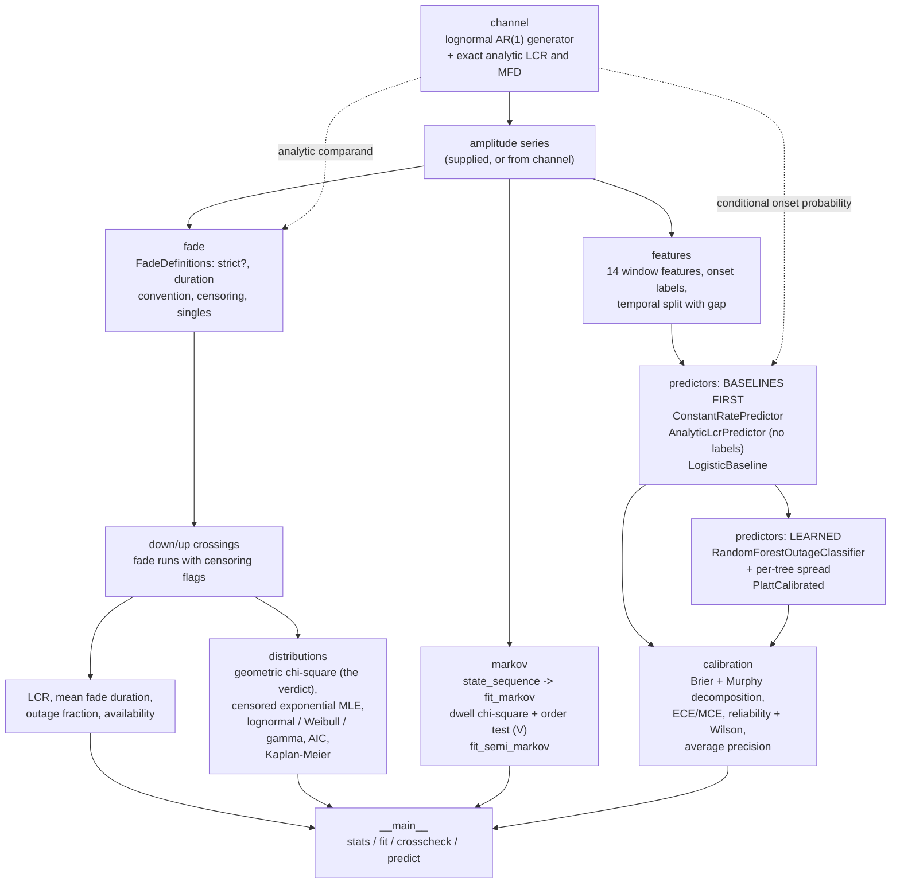
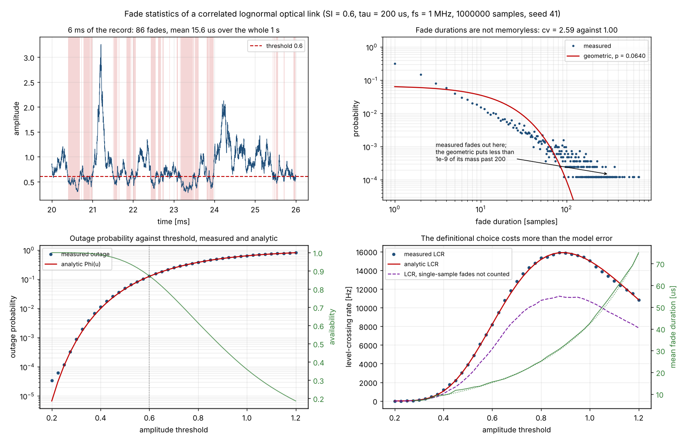
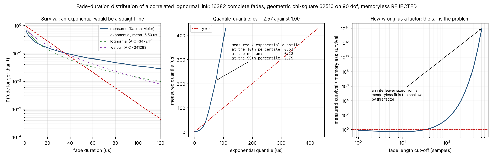
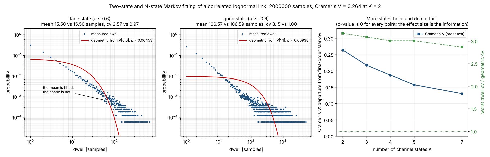
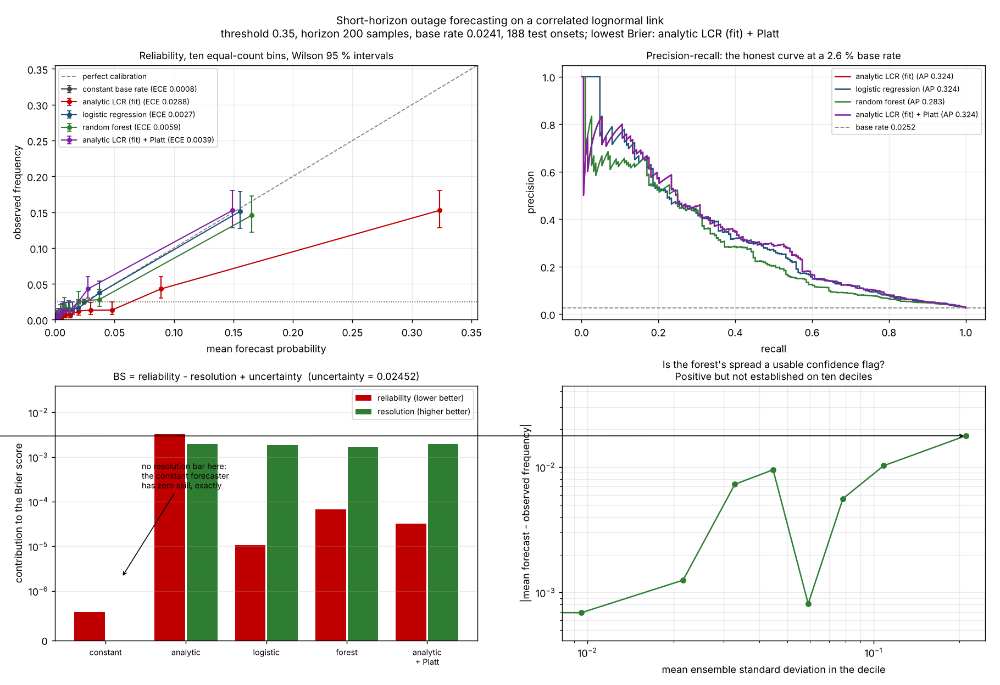

# linkoutage

Outage and availability statistics for an optical link, from any amplitude series.


## The problem

You have a receiver log, or a channel simulation, and you need the numbers a
link budget actually asks for: how often does the signal drop below the
decision threshold, how long does it stay there, and what availability does
that imply. Two tools given the same record will disagree on all three, by tens
of percent, because "level-crossing rate" and "mean fade duration" are not
uniquely defined: whether a single-sample dip counts as a fade changes the
crossing rate by a third. On top of that, the textbook exponential
fade-duration law and the two-state Markov channel are both assumed far more
often than they are tested, and on a correlated fading channel both are wrong
in ways that under-size an interleaver.

## What this does

- **Fade statistics with the definitions attached.** Down-crossing count,
  level-crossing rate, fade durations, mean fade duration, outage fraction and
  availability from any amplitude array. Four definitional choices are explicit
  fields, and every result prints them. On the specified 2 000 000-sample
  record the single-sample-fade rule alone moves the crossing rate by **-31.7 %**
  and the mean fade duration by **+43.5 %** (`validation/fade_definitions_output.txt`).
- **A tested, not assumed, fade-duration law.** Shifted-geometric maximum
  likelihood on sample counts with a Pearson chi-square, which is valid on
  discrete data, plus exponential maximum likelihood that handles right
  censoring, lognormal, Weibull and gamma, and an AIC ranking. On the specified
  record the memoryless hypothesis is **rejected**: chi-square **62510.3 on 90
  degrees of freedom**, measured coefficient of variation **2.571** against 1.0
  for an exponential (`validation/distribution_fits_output.txt`).
- **Markov and semi-Markov channel fitting with a goodness-of-fit report.**
  Transition matrix, per-state dwell chi-square against the geometric the fit
  implies, and a conditional-independence test of the Markov property with its
  effect size. The fitted chain reproduces the mean dwell to four figures and
  the dispersion to a factor of **2.7**; Cramer's V on the triplet table is
  **0.264** (`validation/markov_gof_output.txt`).
- **Exact analytic comparands, two independent ways.** The discrete-time
  level-crossing rate of the correlated lognormal channel is an exact
  bivariate-normal orthant probability, computed by SciPy's
  `multivariate_normal.cdf` and by a one-dimensional `quad`, agreeing to
  **8.3e-17** (`validation/analytic_lcr_output.txt`).
- **A short-horizon outage classifier benchmarked against three baselines,
  including the one people leave out.** Constant base rate, analytic
  level-crossing rate and logistic regression, all scored before the forest, on
  the same held-out rows, with calibration reported rather than accuracy. **A
  baseline wins**, by Brier **0.0217557** against **0.0223498** for the random
  forest (`validation/outage_classifier_output.txt`).

## Who it is for

- Anyone with a measured or simulated amplitude record who needs outage,
  availability, crossing rate and fade-duration statistics and wants the
  definitions behind them written down.
- Anyone sizing an interleaver, a retransmission timer or an ARQ window against
  a correlated fading channel, who needs to know how wrong the memoryless
  assumption is before relying on it.
- Anyone comparing two tools that disagree, who needs the disagreement traced
  to a definition rather than argued about.
- Anyone who wants an honest rare-event forecasting benchmark with the
  constant-rate baseline included.

## Who it is not for

- **Anyone who needs a link budget.** There is no propagation model here.
  Nothing converts turbulence strength, path geometry, aperture or elevation
  angle into a scintillation index. You supply the amplitude series or the
  scintillation index; this package does the statistics on it.
- **Anyone working in strong turbulence.** The channel model is lognormal, which
  is a weak-to-moderate scintillation model. The gamma-gamma distribution
  (Al-Habash, Andrews & Phillips 2001) is the standard replacement above a
  scintillation index of about 1 and is **not implemented**.
- **Anyone who needs a validated fading simulator.** The AR(1) model reproduces
  the first-order irradiance distribution and an exponential autocorrelation and
  nothing else: no measured scintillation spectrum, no aperture averaging, no
  beam wander, no pointing jitter.
- **Anyone who needs survival analysis proper.** If your fade durations have
  interval censoring, left truncation or covariates, use `lifelines`, not this.
  See the table below.
- **Anyone doing coding or modulation.** No codes, no modulators, no LLRs. Use
  `komm`, `galois`, `pyldpc` or `scikit-dsp-comm`.
- **Anyone who needs a certified or flight-qualified tool.** This is not one.

## Alternatives, honestly

| Alternative | What it does better | When to use this instead |
|---|---|---|
| **`lifelines`** | Survival analysis properly: Kaplan-Meier and Nelson-Aalen estimators, parametric fitters with right, left and interval censoring, left truncation, Cox proportional hazards with covariates, log-rank tests. Its censoring handling is strictly more general than this package's. | When the durations are *not yet* durations. This package turns an amplitude series into censored fade durations under a stated definition, which `lifelines` does not do. Extract the durations here, then hand them to `lifelines` if you need regression or interval censoring. |
| **`statsmodels`** | Statistical modelling with inference: Markov-switching autoregression and regression, ARIMA, state-space models, a full battery of diagnostic tests, and its own survival module. | When the question is "how often does this cross a threshold and for how long", which is not a regression. `statsmodels` has no level-crossing rate, no fade-duration extraction and no censoring rule for a run that touches the end of the record. |
| **`hmmlearn`** | Hidden Markov models fitted to the *continuous* observation by Baum-Welch, with Viterbi decoding, which is the right tool if the channel state is genuinely latent rather than defined by a threshold. | When the state *is* the threshold comparison, which is what an outage is. Also, a standard HMM has geometric state durations, which is exactly the assumption this package tests and rejects; `hmmlearn` will fit one without telling you it does not hold. |
| **`ruptures`** | Offline and online change-point detection with several search methods and cost functions. The right tool for finding where the turbulence level shifted. | When you want excursions below a fixed threshold, not changes in regime. A fade is not a change point. |
| **`pomegranate`** | General probabilistic modelling: mixtures, Bayesian networks, hidden Markov models, with a GPU-capable backend in its 1.x line. | Same reason as `hmmlearn`. Note that the 1.x API is a rewrite and differs substantially from 0.14; check its current requirements before adding it to an environment. |
| **`itur`** | Implements ITU-R propagation recommendations for atmospheric attenuation on Earth-space paths. If your problem is an RF or rain-fade link budget with an ITU-R recommendation behind it, that recommendation is the authority and this package is not. | When the channel is optical scintillation rather than rain, or when you are working from a measured series rather than from a statistical recommendation. |
| **`commpy`**, **`komm`**, **`scikit-dsp-comm`** | Modulators, demodulators, channel codes and AWGN channel models. Mature, and far more than this package attempts in that direction. | They do not compute fade-duration distributions, level-crossing rates, availability or channel-state goodness of fit. `commpy` could not be installed in this build environment, so it is named here on the basis of its published scope only. |
| **Fifty lines of your own NumPy** | Honestly, the deterministic core of this package *is* fifty lines of NumPy, and you should feel free to write them. | The fifty lines are not the hard part. The hard part is deciding what a down-crossing is at the start of a record, what to do with a fade still running at the end, and whether a single-sample dip counts — and then writing those decisions down next to the number so that the next person can reproduce it. That is what this package is. |

Every package above was checked to exist on PyPI with `pip index versions` on
2026-10-06; the raw output is in `validation/alternatives_check_output.txt`.
None of them is installed in the build container, so the capability columns
describe their published scope and are not claims about an installed copy.

## Install and first run

```bash
git clone https://github.com/OmAcharya-avtr/linkoutage.git
cd linkoutage
python -m venv .venv && source .venv/bin/activate
pip install -e ".[dev]"
python -m pytest tests/ -q
python examples/fade_statistics_overview.py
```

Expected output of the test run:

```
264 passed
```

Expected output of the first example:

```
record            : 1000000 samples at 1e+06 Hz = 1 s
channel           : SI = 0.6, tau = 0.0002 s, correlation length 200 samples
threshold         : amplitude 0.6
level-crossing rate : 8178.0082 Hz
mean fade duration  : 1.563194e-05 s
outage fraction     : 0.127841
availability        : 0.872159
complete fades      : 8178
single-sample fades : 2594 (31.7% of them)

censored runs excluded from the mean: 1
wrote screenshots/fade_statistics_overview.png
```

The command-line interface:

```bash
python -m linkoutage stats --input receiver_log.npy --fs 2e6 --threshold 0.35
python -m linkoutage fit --n-samples 200000
python -m linkoutage crosscheck
python -m linkoutage predict --n-samples 1000000 --trees 100
```

## A worked example

From `validation/worked_example.py`, which produces the output beneath it.

```python
from linkoutage import (
    AnalyticLcrPredictor, ConstantRatePredictor, RandomForestOutageClassifier,
    build_outage_dataset, compare_fade_duration_models, dwell_time_goodness_of_fit,
    evaluate_forecast, fade_durations, fade_statistics, fit_markov,
    lognormal_amplitude_series, state_sequence,
)

series = lognormal_amplitude_series(1_000_000, fs_hz=1.0e6, tau_s=2.0e-4, si=0.6, seed=2026)
amplitude = series.amplitude                       # or np.load("receiver_log.npy")

stats = fade_statistics(amplitude, threshold=0.6, fs_hz=1.0e6)

complete, censored = fade_durations(amplitude, 0.6, 1.0e6)
fits = compare_fade_duration_models(complete, fs_hz=1.0e6, censored_s=censored)

states = state_sequence(amplitude, [0.6])
markov = fit_markov(states)
gof = dwell_time_goodness_of_fit(states, markov)

data = build_outage_dataset(amplitude, threshold=0.35, window_samples=400,
                            horizon_samples=200, stride_samples=50)
train, test = data.split.train, data.split.test
baseline = ConstantRatePredictor().fit(data.y[train])
physics = AnalyticLcrPredictor(threshold=0.35, horizon_samples=200).fit(
    amplitude[: int(data.index[train[-1]]) + 1])
forest = RandomForestOutageClassifier(n_estimators=100, min_samples_leaf=5).fit(
    data.x[train], data.y[train])

probability, spread = forest.predict_with_uncertainty(data.x[test][:5])
```

```
# 1. Fade statistics, and the definitions that produced them
level-crossing rate : 8208.008 Hz
mean fade duration  : 1.4791e-05 s
outage fraction     : 0.121401
availability        : 0.878599
complete fades      : 8208, censored 0
single-sample fades : 2674

# 2. Is the fade-duration distribution memoryless? Test, do not assume.
geometric chi-square : 22850.4 on 77 dof, p = 0
memoryless rejected  : True
coefficient of variation 2.495 against 1.0 for an exponential
best fit by AIC      : lognormal

# 3. Two-state Markov channel, with its goodness of fit
P[fade -> good]   : 0.067611
P[good -> fade]   : 0.009342
mean dwell, model : [14.791, 107.042] samples
mean dwell, data  : [14.791, 106.858] samples
state 0: dwell chi2 22850.4 on 78 dof, cv measured 2.495 against geometric 0.966
state 1: dwell chi2 105599.2 on 374 dof, cv measured 3.109 against geometric 0.995

# 4. Short-horizon outage forecast, baselines first
base rate on the test split : 0.02975
constant base rate     Brier 0.028983  skill +0.0000  ECE 0.01066  AUC 0.5000
analytic LCR (fit)     Brier 0.026119  skill +0.0988  ECE 0.02825  AUC 0.8817
random forest          Brier 0.023385  skill +0.1932  ECE 0.00655  AUC 0.8451

# 5. The forest's forecast carries an ensemble spread
P(outage within 0.2 ms) = 0.0041 +/- 0.0319 (spread across 100 trees)
P(outage within 0.2 ms) = 0.0033 +/- 0.0202 (spread across 100 trees)
P(outage within 0.2 ms) = 0.0000 +/- 0.0001 (spread across 100 trees)
P(outage within 0.2 ms) = 0.0046 +/- 0.0264 (spread across 100 trees)
P(outage within 0.2 ms) = 0.0000 +/- 0.0001 (spread across 100 trees)

max spread over the test split: 0.3617
```

On this shorter one-second record the uncalibrated forest happens to edge the
uncalibrated analytic baseline. On the full four-second benchmark with a
calibration split available, the recalibrated analytic baseline wins; see the
validation table below. Both are reported.

## Architecture



## Screenshots



Notice the bottom-right panel: the gap between the blue measured crossing rate
and the purple dashed line is the cost of one definitional choice, and it is
several times larger than the gap between the measurement and the red analytic
curve. The model error is not the problem; the definitions are.



The right-hand panel is the one to act on. The measured survival exceeds the
memoryless survival by a factor of 27 at 100 samples and by eight orders of
magnitude at 400. An interleaver depth taken from an exponential fit is too
shallow by that factor.



The red curve in each of the first two panels is the geometric dwell law
implied by the fitted transition matrix. It passes through the data near the
mean, which is what maximum likelihood on a two-state chain fits, and misses at
both ends. The third panel shows that adding states reduces the departure from
Markov monotonically and does not remove it.



Top left: the red curve is the raw analytic forecaster, which has the best
discrimination of the four and sits far below the diagonal because it
over-forecasts by a factor of two. Bottom left: the constant base-rate
forecaster has no resolution bar at all, which is what no skill looks like, and
the smallest reliability bar, which is what perfect calibration looks like.
Beating it requires resolution, not calibration.

## Validation evidence

Full detail, including the raw output of every run, is in
`validation/VALIDATION.md`. Numbers below are from the scripts named.

| Check | Reference | Result | Tolerance | Verdict |
|---|---|---|---|---|
| AR(1) filter vs direct recursion, 2e6 samples | definition | 3.11e-15 max abs diff; `x[0] = z[0]` exactly | < 1e-12 | pass |
| Threshold maps exactly onto a Gaussian level | monotonicity | 0 of 2 000 000 samples disagree | exactly 0 | pass |
| Hand-calculated fade statistics, 7-sample series | arithmetic in `validate_fade_definitions.py` | all 8 quantities exact | 1e-12 | pass |
| Rice partition identity | Rice (1945), discrete form | residual equals `1/(N-1)` exactly, 3 records | 1e-12 | pass |
| Orthant probability, two independent routes | `multivariate_normal.cdf` vs `quad` | 8.33e-17 worst disagreement over 24 pairs | < 1e-11 | pass |
| Sample vs analytic level-crossing rate | `analytic_level_crossing_rate` | 9 configurations, worst block-bootstrap z = 2.42 | abs(z) <= 3 | pass |
| **Cross-check X1 input: mean irradiance** | spec value 0.998907972681559 | **0.9989079726815594**, diff 4.44e-16 | < 1e-12 | pass |
| **Cross-check X1: level-crossing rate** | sample statistic, N = 2 000 000 | **8191.004095502048 Hz** | 2 % vs P041 | reported |
| **Cross-check X1: mean fade duration** | sample statistic, N = 2 000 000 | **1.5497375167867175e-05 s** | 2 % vs P041 | reported |
| Memoryless hypothesis, positive control | true geometric samples | chi-square p = 0.305, 0.099, 0.842 | p > 0.01 | pass |
| **Memoryless fade-duration hypothesis** | chi-square on sample counts | **62510.3 on 90 dof, p = 0** | alpha = 0.01 | **REJECTED** |
| Fade-duration tail | geometric survival | measured/memoryless ratio 27.5 at 100 samples, 4.7e8 at 400 | descriptive | memoryless fails |
| Markov fit, positive control | simulated chain | max abs error 3.86e-04, dwell p = 0.498 and 0.214, V = 0.0022 | not rejected | pass |
| Markov order test, negative control | second-order sequence | V = 0.520, p = 0 | rejected | pass |
| **Markov property on the channel** | conditional independence | **V = 0.2638**, chi-square 139206 on 2 dof | effect size | **not Markov** |
| **Markov dwell times on the channel** | geometric from fitted `P[i,i]` | cv 2.571 vs 0.967 and 3.154 vs 0.995 | alpha = 0.01 | **REJECTED** |
| **Outage classifier vs three baselines** | 543 held-out onsets | **a baseline wins**; see below | n/a | **baseline** |
| Raw analytic forecaster Brier skill | constant base rate | **-0.0043** despite AUC 0.8730 | n/a | published failure |
| Accuracy at a 2.7 % base rate | all-negative reference | every model 0.970-0.973 vs 0.9728 | n/a | as expected |
| Forest uncertainty is informative | decile analysis | Spearman 0.455, **p = 0.187** | p < 0.05 | **not established** |
| Model regeneration is deterministic | refit from seed 4901 | all six reproduce to 1.0e-7 | 5e-6 | pass |

### The outage classifier result, in full

Held-out test split, 19 974 rows, 543 onsets, base rate 0.02719. Baselines
first. From `validation/outage_classifier_output.txt`.

| Forecaster | Brier | Brier skill | Reliability | Resolution | ECE | AUC | AP | mean forecast |
|---|---|---|---|---|---|---|---|---|
| constant base rate | 0.0264495 | 0.0000 | 3.189e-06 | 0.000e+00 | 0.00179 | 0.5000 | 0.0272 | 0.02540 |
| analytic LCR (fit) | 0.0265626 | **-0.0043** | 4.092e-03 | 2.317e-03 | 0.03199 | **0.8730** | 0.3193 | 0.05913 |
| logistic regression | 0.0220142 | 0.1677 | 1.600e-05 | 2.304e-03 | 0.00268 | 0.8731 | 0.3015 | 0.02680 |
| random forest | 0.0223498 | 0.1550 | 8.354e-05 | 2.033e-03 | 0.00575 | 0.8466 | 0.2872 | 0.02854 |
| **analytic LCR (fit) + Platt** | **0.0217557** | **0.1775** | 8.436e-06 | 2.317e-03 | 0.00189 | 0.8730 | 0.3193 | 0.02556 |
| random forest + Platt | 0.0222801 | 0.1576 | 1.522e-05 | 2.033e-03 | 0.00332 | 0.8466 | 0.2872 | 0.02505 |

**The analytic level-crossing-rate baseline with two parameters of
recalibration is the best forecaster on the held-out split.** The random forest
is fourth of six, and logistic regression also beats both forest variants. The
baseline wins at every horizon tested (50, 100, 200 and 400 samples). The
forest's hyperparameters were selected on the calibration split from
`min_samples_leaf` in `{5, 20, 60}` (calibration Brier 0.01805131, 0.01806293,
0.01816783; all three reported) and the test split was scored once. The forest
has not been retuned, and the baseline has not been removed.

Two results that cut the other way and are published anyway: the **raw**
analytic forecaster has the best discrimination in the table and a *negative*
Brier skill score, because its Poisson-clumping step over-forecasts by a factor
of 2.2; and the forest's ensemble-spread uncertainty output trends in the right
direction (calibration gap 0.0029 in the lowest spread decile against 0.0246 in
the highest) but is **not statistically established** at ten deciles
(Spearman 0.455, p = 0.187).

## API reference

<details>
<summary><strong>linkoutage.fade</strong> - the deterministic core</summary>

| Function | Returns |
|---|---|
| `FadeDefinitions(strict_below, duration_convention, censoring, count_single_sample_fades, record_duration_convention)` | The four definitional choices plus the rate denominator; `.describe()` prints them in words |
| `below_threshold(amplitude, threshold, *, definitions)` | bool array, one per sample |
| `down_crossing_indices(amplitude, threshold, *, definitions)` | int array: index of the first in-fade sample of each entry |
| `up_crossing_indices(amplitude, threshold, *, definitions)` | int array: index of the first sample back above |
| `fade_runs(amplitude, threshold, fs_hz, *, definitions)` | `FadeRuns`: starts, stops, censoring flags, interpolated crossing instants [s] |
| `fade_durations(amplitude, threshold, fs_hz, *, definitions)` | `(complete_s, censored_lower_bounds_s)` |
| `level_crossing_rate(amplitude, threshold, fs_hz, *, definitions)` | Hz |
| `mean_fade_duration(amplitude, threshold, fs_hz, *, definitions)` | s, `nan` when no fade survives the censoring rule |
| `outage_fraction(amplitude, threshold, *, definitions)` | dimensionless, over the whole record |
| `availability(amplitude, threshold, *, definitions)` | `1 - outage_fraction` |
| `fade_statistics(amplitude, threshold, fs_hz, *, definitions)` | `FadeStatistics` with 20 fields and a `.report()` that prints the definitions |

</details>

<details>
<summary><strong>linkoutage.channel</strong> - the model and its exact analytic statistics</summary>

| Function | Returns |
|---|---|
| `sigma_ln_i_from_si(si)` | `sqrt(ln(1 + SI))`, dimensionless |
| `rho_from_tau(tau_s, fs_hz)` | `exp(-1/(tau fs))` |
| `correlation_length_samples(tau_s, fs_hz)` | `tau * fs` samples |
| `ar1_unit_variance(z, rho)` | stationary AR(1), `x[0] = z[0]` |
| `lognormal_amplitude_series(n, *, fs_hz, tau_s, si, seed, mean_irradiance)` | `LognormalSeries` with amplitude, irradiance, Gaussian and the configuration |
| `amplitude_threshold_to_gaussian_level(t, si, *, mean_irradiance)` | level `u` such that `a < T` iff `x < u` |
| `gaussian_level_to_amplitude_threshold(u, si, *, mean_irradiance)` | the inverse |
| `analytic_down_crossing_probability(level, rho, *, method)` | per sample pair; `method` is `"mvn"` or `"quad"` |
| `analytic_level_crossing_rate(t, *, si, tau_s, fs_hz, ...)` | Hz, discrete-time |
| `analytic_outage_fraction(t, si, *, mean_irradiance)` | `Phi(u)` |
| `analytic_mean_fade_duration(t, *, si, tau_s, fs_hz, ...)` | s |
| `conditional_onset_probability(x_t, *, level, rho, horizon_samples, n_quadrature)` | `P(a fade begins within H samples given x[t])` |

</details>

<details>
<summary><strong>linkoutage.distributions</strong> - fade-duration laws and the verdict</summary>

| Function | Returns |
|---|---|
| `exponential_mle_with_censoring(complete_s, censored_s)` | `(scale_s, log_likelihood)` |
| `fit_geometric_samples(lengths)` | `(p, log_likelihood)` on integer sample counts |
| `geometric_chi_square(lengths, p, *, min_expected)` | `(statistic, dof, p_value, n_bins, note)` |
| `ks_fitted(durations, dist, params)` | `(statistic, p_value)` via the probability-integral transform |
| `kaplan_meier_survival(complete_s, censored_s)` | `(time_s, survival)` |
| `compare_fade_duration_models(complete_s, *, fs_hz, censored_s, alpha, min_expected)` | `FitComparison` with five fits, AIC ranking, `.exponential_rejected` and `.report()` |

</details>

<details>
<summary><strong>linkoutage.markov</strong> - channel-state fitting with goodness of fit</summary>

| Function | Returns |
|---|---|
| `state_sequence(amplitude, thresholds, *, strict_below)` | int array, state 0 is the deepest fade |
| `dwell_lengths(states, *, n_states, exclude_censored)` | per-state run lengths [samples] and censored counts |
| `fit_markov(states, *, n_states)` | `MarkovFit`: counts, transition matrix, stationary and measured occupancy, model and measured mean dwell, log likelihood, AIC |
| `dwell_time_goodness_of_fit(states, fit, *, min_expected)` | per state: chi-square, dof, p, measured and geometric mean and coefficient of variation |
| `markov_order_test(states, *, n_states, min_expected)` | `MarkovOrderTest`: summed chi-square, dof, p, **Cramer's V** |
| `fit_semi_markov(states, *, n_states)` | `SemiMarkovFit`: jump chain, empirical dwell laws, `.occupancy()`, `.simulate(n, rng)` |

</details>

<details>
<summary><strong>linkoutage.features, .predictors, .calibration</strong> - the forecasting stack</summary>

| Function | Returns |
|---|---|
| `decision_indices(n, *, window_samples, horizon_samples, stride_samples)` | valid decision instants |
| `extract_features(amplitude, *, index, window_samples, threshold, chunk)` | `(rows, 14)`, columns per `FEATURE_NAMES` |
| `onset_labels(amplitude, *, index, threshold, horizon_samples, definitions)` | 0/1 |
| `temporal_split(y, *, fractions, gap_rows)` | `SplitIndices` with positives per split |
| `build_outage_dataset(amplitude, *, threshold, window_samples, horizon_samples, stride_samples, gaussian, fractions, definitions)` | `OutageDataset`, gap sized automatically |
| `estimate_channel_parameters(amplitude)` | SI, rho, sigma, `E[I]` from the record alone |
| `ConstantRatePredictor().fit(y)` | `.rate`, `.rate_standard_error()`, `.predict_proba_onset(x)` |
| `AnalyticLcrPredictor(threshold, horizon_samples).fit(amplitude)` | `.predict_proba_onset(x)`, `.predict_proba_from_gaussian(g)`, uses no labels |
| `LogisticBaseline().fit(x, y)` | `.predict_proba_onset(x)`, `.coefficients()` |
| `RandomForestOutageClassifier(...).fit(x, y)` | `.predict_proba_onset(x)`, `.predict_with_uncertainty(x)` -> `(p, std)`, `.feature_importance()` |
| `PlattCalibrated(base).fit(x_cal, y_cal)` | recalibrated `.predict_proba_onset(x)` |
| `brier_score(y, p)`, `brier_decomposition(y, p, ...)` | scalar; `(BS, REL, RES, UNC, binning residual)` |
| `expected_calibration_error(y, p, ...)` | `(ECE, MCE)` |
| `reliability_curve(y, p, ...)` | bins with counts and Wilson intervals, `.table()` |
| `evaluate_forecast(y, p, *, name, reference_rate, ...)` | `CalibrationReport` with every metric and the all-negative accuracy |

</details>

<details>
<summary><strong>CLI</strong></summary>

```
python -m linkoutage stats       [--input FILE | --n-samples N] [--fs --tau --si --seed --threshold]
                                 [--non-strict] [--duration-convention {sample_count,interval_count,interpolated}]
                                 [--censoring {exclude,include_as_complete}] [--drop-single-sample-fades]
                                 [--record-duration {intervals,samples}]
python -m linkoutage fit         same arguments; adds the distribution comparison and the Markov fits
python -m linkoutage crosscheck  the pinned X1 series, its input check, and the two compared statistics
python -m linkoutage predict     [--window --horizon --stride --trees --leaf]
```

`--input` reads `.npy` (one-dimensional float array) or a text file with one
amplitude per line. Exit code 2 on invalid parameters.

</details>

## Limitations

1. **The channel model is deliberately thin.** AR(1) log-amplitude reproduces a
   lognormal first-order distribution and an exponential autocorrelation and
   nothing else. The measured scintillation power spectrum rolls off closer to
   `f^(-8/3)` in the inertial range than the AR(1) Lorentzian does, so the
   balance of short and long fades is wrong by an amount this repository does
   not quantify. No aperture averaging, beam wander, pointing jitter, inner or
   outer scale, or receiver noise.
2. **No gamma-gamma distribution.** Above a scintillation index of about 1 the
   lognormal family is wrong and the gamma-gamma distribution is the standard
   replacement. Not implemented. Everything analytic here would need redoing
   for it, including the orthant probability.
3. **Every crossing rate is sample-rate dependent, by construction.** The
   Ornstein-Uhlenbeck log-amplitude is nowhere differentiable, so its
   continuous-time crossing rate of any level is infinite. There is no
   sample-rate-free crossing rate to quote, and a rate measured at 1 MHz is not
   the rate at 2 MHz: the analytic rate rises from 4097 Hz to 11 645 Hz across
   250 kHz to 2 MHz on the same channel (`validation/analytic_lcr_output.txt`).
   Compare rates only at equal sample rates.
4. **The definitions move the answer by tens of percent.** Not counting
   single-sample excursions changes the level-crossing rate by -31.7 % and the
   mean fade duration by +43.5 % on the specified record. The defaults are
   stated, and every result prints them, but there is no universally correct
   choice and this package does not pretend there is.
5. **Censoring handling is boundary-only.** A run touching either end of the
   record is detected, counted and excluded from the mean, and the exponential
   maximum likelihood and the Kaplan-Meier estimator accept right-censored
   lower bounds. There is no interval censoring, no left truncation and no
   covariate model. Use `lifelines` for those.
6. **At two million samples every goodness-of-fit p-value is zero.** The Markov
   results are therefore decided on Cramer's V and on the dwell
   coefficient-of-variation ratio. A reader who wants a p-value to mean
   something should subsample.
7. **The Markov-order test runs out of data past about seven states.** With
   `rho = 0.995` a single sample almost never moves more than one state, so the
   triplet contingency tables become structurally sparse and the test loses its
   usable middle states. The published figure stops at K = 7 for that reason.
8. **The analytic forecaster is fitted to the family that generated the data**,
   which flatters it. Its margin over the learned models should be read as an
   upper bound on what it would achieve on a measured record.
9. **The forest's uncertainty output is not established.** Positive trend,
   Spearman 0.455 over ten deciles, p = 0.187. Treat it as a flag, not as a
   calibrated interval.
10. **The classifier's effective sample size is the onset count, not the row
    count.** 543 held-out onsets, with heavy overlap between adjacent rows.
    Brier differences in the fourth decimal place are not resolvable, and the
    gap between the winning baseline and the forest (0.00059) is close to that
    boundary.
11. **Compute budget: 2 CPU cores and 7.8 GiB of RAM, shared with four
    concurrent build agents.** Everything in this repository is sized to that.
    The longest single fit is the 200-tree forest on 47 993 rows (about 18 s);
    the longest script is `validate_outage_classifier.py` at about 100 s. No
    run exceeds three minutes. PyTorch is unavailable in the build environment;
    all machine learning here is scikit-learn.
12. **Nothing here has been validated against measured optical link data**,
    because none was available. Every number in this repository is a statement
    about a model or about an algorithm, never about the sky.

**This software is research-grade. It is not flight-qualified, not certified,
and not approved for operational aerospace use.**

## Reproducing every number

```bash
pip install -e ".[dev]"

# Tests. Count from the junit XML, not from the stdout line.
python -m pytest tests/ -q --tb=no -p no:cacheprovider --junit-xml=junit.xml
# tests="264" failures="0" errors="0" skipped="0"

ruff check src/ tests/ examples/ validation/

cd validation
python validate_series_construction.py     # table rows 1-4
python validate_fade_definitions.py        # rows 5-8, 36
python validate_analytic_lcr.py            # rows 9-13
python validate_cross_check_x1.py          # rows 14-16, the X1 block
python validate_distribution_fits.py       # rows 17-22
python validate_markov_gof.py              # rows 23-29
python validate_outage_classifier.py       # rows 30-34, the classifier table
python regenerate_outage_model.py          # row 35, persists the models
python worked_example.py                   # the worked example above
cd ..

cd examples
MPLBACKEND=Agg python fade_statistics_overview.py
MPLBACKEND=Agg python fade_duration_fit.py
MPLBACKEND=Agg python markov_dwell_fit.py
MPLBACKEND=Agg python outage_classifier_calibration.py
```

Each validation and example script runs standalone from its own directory and
needs no environment variable. The raw stdout of every run is committed as
`validation/*_output.txt`.

## Licence, citation, credits

Licensed under the Apache License, Version 2.0. Copyright (c) 2026 OPTIMA
Organisation. See `LICENSE`.

Cite with `CITATION.cff`.

### References

- S. O. Rice, "Mathematical analysis of random noise", *Bell System Technical
  Journal*, 1944 and 1945. Level crossings and the relation between the
  crossing rate of a level, the time spent below it and the mean duration of an
  excursion.
- L. C. Andrews and R. L. Phillips, *Laser Beam Propagation through Random
  Media*, 2nd edition, SPIE Press, 2005. The lognormal irradiance model and the
  scintillation index.
- E. N. Gilbert, "Capacity of a burst-noise channel", *Bell System Technical
  Journal*, 1960. The two-state burst channel. Gilbert's channel attaches an
  error process to the states; only the state process is fitted here.
- M. A. Al-Habash, L. C. Andrews and R. L. Phillips, "Mathematical model for
  the irradiance probability density function of a laser beam propagating
  through turbulent media", *Optical Engineering* 40(8):1554-1562, 2001. The
  gamma-gamma distribution, named here as the standard replacement in strong
  turbulence and **not implemented**.
- A. H. Murphy, "A new vector partition of the probability score", *Journal of
  Applied Meteorology* 12(4):595-600, 1973. The Brier decomposition.
- E. L. Kaplan and P. Meier, "Nonparametric estimation from incomplete
  observations", *Journal of the American Statistical Association*
  53(282):457-481, 1958. The product-limit survival estimator.

### Credits

This is under reserved rights obtained by OPTIMA Organisation.
